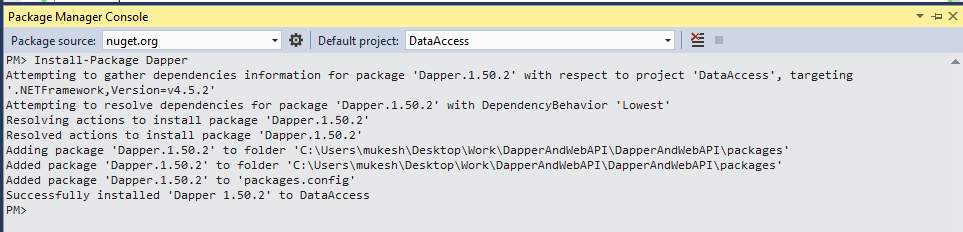

# Dapper and Repository Pattern in Web API
## Requires
- Visual Studio 2015
## License
- MIT
## Technologies
- Repository Pattern
- ASP.NET Web API
- Unit of Work
- Dapper
## Topics
- Performance
## Updated
- 11/29/2017
## Description

<h1>Introduction</h1>

<em>This article will demonstrate about how to get data using&nbsp;Dapper and Repository Pattern in Web API&nbsp;and how to use&nbsp;Dependency Injection using Unit of Work&nbsp;in Web API. I will
 show you how to implement&nbsp;Generic Repository with Custom Repository&nbsp;for CRUD operations.</em>

<em> 
</em>

<em>Here we are using&nbsp;Dapper.Net&nbsp;for accessing the data through .net data access provide. So, first question comes in mind is that what is actually a Dapper and Why we use it. So, let move one by one with example.</em>

&nbsp;

<h5>What is Dapper</h5>

It is an&nbsp;ORM [Object Relational Mapper],&nbsp;basically a open source and lightweight&nbsp;ORM for developers who prefer to work with&nbsp;ADO.Net technology. It is in top most ORM which ensures the&nbsp;high performance.&nbsp;Main
 theme to develop&nbsp;it by Stack OverFlow team is the fastest database transaction. It works with both static and dynamic objects. It extends theIDbConnection&nbsp;interface to make connection and execute the database operations.

<h5>What is Web API</h5>

Web API&nbsp;is a framework that is used to make HTTP services. As you know, now&nbsp;days we are using mobiles, tablets, apps and different types of services, so Web API is a simple and reliable platform to create&nbsp;HTTP enabled services&nbsp;that
 can reach wide range of clients. It is used to create complete REST services. To know more just visit my article&nbsp;<a href="http://www.c-sharpcorner.com/UploadFile/8a67c0/who-is-winner-web-api-or-wcf/" target="_blank">Who is the Winner Web API or
 WCF</a>&nbsp;article on&nbsp;<a href="http://www.c-sharpcorner.com/members/mukesh-kumar23" target="_blank">CsharpCorner</a>.

<h5>What is Repository Pattern</h5>

Repository Pattern&nbsp;is used to create an abstraction layer between Data Access Layerr and Business Logic Layer of an application. Repository directly communicates with data access layer [DAL] and get the data and provides it to business
 logic layer [BAL]. The main advantage to use repository pattern to isolate the data access logic and business logic. So that if you make changes in any of this logic that can't effect directly on other logic. For more information, please gone through by&nbsp;<a href="http://www.dotnet-tutorial.com/articles/mvc/how-to-use-repository-pattern-with-asp-net-mvc-with-entity-framework" target="_blank">Repository
 Pattern</a>&nbsp;Article.

<em> 
</em>

<h1>Building the Sample</h1>
<h5>Web API Project with Data Access Layer</h5>

Now it is time to practical example how to implement Dapper and Repository Pattern with Web API Project. Create a solution name as&nbsp;&quot;DapperAndWebAPI&quot;&nbsp;with a class library project name as&nbsp;&quot;DataAccess&quot;&nbsp;and make
 following folders for differnet activities.

Entities:&nbsp;This will contain all the entity class files.

Infrastructure:&nbsp;It will include&nbsp;all data access required file like connection class.

Repositories:&nbsp;This will include Generic and Custom Repositories.

Services:&nbsp;It includes all the business logic related classes.

UnitOfWork:&nbsp;This is important folder for this demonstration which includes UnitOfWork Class for transaction.

Test API:&nbsp;It is a Web API project for creating HTTP enabled services.

Our project structure will be like as following image shown below.

 

Description

Inside the Infrastructure folder create an interface named as&nbsp;IConnectionFactory&nbsp;which contains the GetConnection property which returns IDbConnection type connection.Implement IConnectionFactory interface
 with ConnectionFactory class.IDbConnection&nbsp;handles all the database connection related queries.

&nbsp;

C#

Edit|Remove

csharp

<pre class="csharp">public&nbsp;class&nbsp;ConnectionFactory&nbsp;:&nbsp;IConnectionFactory&nbsp;
{&nbsp;
&nbsp;&nbsp;&nbsp;&nbsp;&nbsp;&nbsp;&nbsp;&nbsp;private&nbsp;readonly&nbsp;string&nbsp;connectionString&nbsp;=&nbsp;ConfigurationManager.ConnectionStrings[&quot;DTAppCon&quot;].ConnectionString;&nbsp;
&nbsp;&nbsp;&nbsp;&nbsp;&nbsp;&nbsp;&nbsp;&nbsp;public&nbsp;IDbConnection&nbsp;GetConnection&nbsp;
&nbsp;&nbsp;&nbsp;&nbsp;&nbsp;&nbsp;&nbsp;&nbsp;{&nbsp;
&nbsp;&nbsp;&nbsp;&nbsp;&nbsp;&nbsp;&nbsp;&nbsp;&nbsp;&nbsp;&nbsp;&nbsp;get&nbsp;
&nbsp;&nbsp;&nbsp;&nbsp;&nbsp;&nbsp;&nbsp;&nbsp;&nbsp;&nbsp;&nbsp;&nbsp;{&nbsp;
&nbsp;&nbsp;&nbsp;&nbsp;&nbsp;&nbsp;&nbsp;&nbsp;&nbsp;&nbsp;&nbsp;&nbsp;&nbsp;&nbsp;&nbsp;&nbsp;var&nbsp;factory&nbsp;=&nbsp;DbProviderFactories.GetFactory(&quot;System.Data.SqlClient&quot;);&nbsp;
&nbsp;&nbsp;&nbsp;&nbsp;&nbsp;&nbsp;&nbsp;&nbsp;&nbsp;&nbsp;&nbsp;&nbsp;&nbsp;&nbsp;&nbsp;&nbsp;var&nbsp;conn&nbsp;=&nbsp;factory.CreateConnection();&nbsp;
&nbsp;&nbsp;&nbsp;&nbsp;&nbsp;&nbsp;&nbsp;&nbsp;&nbsp;&nbsp;&nbsp;&nbsp;&nbsp;&nbsp;&nbsp;&nbsp;conn.ConnectionString&nbsp;=&nbsp;connectionString;&nbsp;
&nbsp;&nbsp;&nbsp;&nbsp;&nbsp;&nbsp;&nbsp;&nbsp;&nbsp;&nbsp;&nbsp;&nbsp;&nbsp;&nbsp;&nbsp;&nbsp;conn.Open();&nbsp;
&nbsp;&nbsp;&nbsp;&nbsp;&nbsp;&nbsp;&nbsp;&nbsp;&nbsp;&nbsp;&nbsp;&nbsp;&nbsp;&nbsp;&nbsp;&nbsp;return&nbsp;conn;&nbsp;
&nbsp;&nbsp;&nbsp;&nbsp;&nbsp;&nbsp;&nbsp;&nbsp;&nbsp;&nbsp;&nbsp;&nbsp;}&nbsp;
&nbsp;&nbsp;&nbsp;&nbsp;&nbsp;&nbsp;&nbsp;&nbsp;}&nbsp;
}</pre>

<h5>Implementation Dapper with Data Access Project</h5>

For add Dapper is with your project, just open Package Manager Console from Tools menu and&nbsp;install Dapper&nbsp;using this command&nbsp;Install-Package Dapper.&nbsp;It will also add and resolve dependent&nbsp;dependencies for
 Dapper. At last it will show successfully installed message for Dapper.

Note: Don't forget to select Default Project name as DataAccess.

 

<h5 style="font-family:&quot;Segoe UI&quot;,Arial,sans-serif; font-weight:normal; line-height:30px; color:#4466c5; margin:10px 0px; font-size:24px; padding-left:0px; text-align:justify">
Custom Repository and Implementation</h5>

Create a new repository class name as&nbsp;&quot;BlogRepository&quot;&nbsp;which implementGenericRepository and IBlogRepository.&nbsp;For this demonstration, I am using Dependency Injection,
 so for creating the object, I am using constructor dependency injection. I have created a GetAllBlogByPageIndex method which will return list of blog using dapper asynchrony. I am here using very popular feature of C# as&nbsp;&quot;Async&quot;
 and &quot;Await&quot;&nbsp;for asyncronous process.

Here&nbsp;SqlMapper&nbsp;is&nbsp;Dapper object&nbsp;which provides variety of methods to perform different operation without writing too much of codes.

&nbsp;

C#

Edit|Remove

csharp

<pre class="js">public&nbsp;class&nbsp;BlogRepository&nbsp;:&nbsp;GenericRepository&lt;Blog&gt;,&nbsp;IBlogRepository&nbsp;
&nbsp;{&nbsp;
&nbsp;&nbsp;&nbsp;&nbsp;&nbsp;&nbsp;&nbsp;&nbsp;IConnectionFactory&nbsp;_connectionFactory;&nbsp;
&nbsp;
&nbsp;&nbsp;&nbsp;&nbsp;&nbsp;&nbsp;&nbsp;&nbsp;public&nbsp;BlogRepository(IConnectionFactory&nbsp;connectionFactory)&nbsp;
&nbsp;&nbsp;&nbsp;&nbsp;&nbsp;&nbsp;&nbsp;&nbsp;{&nbsp;
&nbsp;&nbsp;&nbsp;&nbsp;&nbsp;&nbsp;&nbsp;&nbsp;&nbsp;&nbsp;&nbsp;&nbsp;_connectionFactory&nbsp;=&nbsp;connectionFactory;&nbsp;
&nbsp;&nbsp;&nbsp;&nbsp;&nbsp;&nbsp;&nbsp;&nbsp;}&nbsp;
&nbsp;&nbsp;&nbsp;&nbsp;&nbsp;&nbsp;&nbsp;&nbsp;public&nbsp;async&nbsp;Task&lt;IEnumerable&lt;Blog&gt;&gt;&nbsp;GetAllBlogByPageIndex(int&nbsp;pageIndex,&nbsp;int&nbsp;pageSize)&nbsp;
&nbsp;&nbsp;&nbsp;&nbsp;&nbsp;&nbsp;&nbsp;&nbsp;{&nbsp;
&nbsp;&nbsp;&nbsp;&nbsp;&nbsp;&nbsp;&nbsp;&nbsp;&nbsp;&nbsp;&nbsp;&nbsp;var&nbsp;query&nbsp;=&nbsp;&quot;usp_GetAllBlogPostByPageIndex&quot;;&nbsp;
&nbsp;&nbsp;&nbsp;&nbsp;&nbsp;&nbsp;&nbsp;&nbsp;&nbsp;&nbsp;&nbsp;&nbsp;var&nbsp;param&nbsp;=&nbsp;new&nbsp;DynamicParameters();&nbsp;
&nbsp;&nbsp;&nbsp;&nbsp;&nbsp;&nbsp;&nbsp;&nbsp;&nbsp;&nbsp;&nbsp;&nbsp;param.Add(&quot;@PageIndex&quot;,&nbsp;pageIndex);&nbsp;
&nbsp;&nbsp;&nbsp;&nbsp;&nbsp;&nbsp;&nbsp;&nbsp;&nbsp;&nbsp;&nbsp;&nbsp;param.Add(&quot;@PageSize&quot;,&nbsp;pageSize);&nbsp;
&nbsp;&nbsp;&nbsp;&nbsp;&nbsp;&nbsp;&nbsp;&nbsp;&nbsp;&nbsp;&nbsp;&nbsp;var&nbsp;list&nbsp;=&nbsp;await&nbsp;SqlMapper.QueryAsync&lt;Blog&gt;(_connectionFactory.GetConnection,&nbsp;query,&nbsp;param,&nbsp;commandType:&nbsp;CommandType.StoredProcedure);&nbsp;
&nbsp;&nbsp;&nbsp;&nbsp;&nbsp;&nbsp;&nbsp;&nbsp;&nbsp;&nbsp;&nbsp;&nbsp;return&nbsp;list;&nbsp;
&nbsp;&nbsp;&nbsp;&nbsp;&nbsp;&nbsp;&nbsp;&nbsp;}&nbsp;
&nbsp;}</pre>

&nbsp;

<ul>
</ul>
<h1>More Information</h1>

<em>For more information:&nbsp;</em><em>http://www.mukeshkumar.net/articles/web-api/dapper-and-repository-pattern-in-web-api</em>

<h1 class="BlogHeadTitle" style="margin:0px; font-size:35px; font-family:inherit; font-weight:500; line-height:1.1">
<a href="http://www.dotnet-tutorial.com/articles/web-api/dapper-and-repository-pattern-in-web-api" style="color:#ffffff; text-decoration:none; font-size:30px; font-weight:bold; background:0px 0px">Dapper and Repository Pattern in Web API</a></h1>

<a class="ArticleHead_meta" href="http://dotnet-tutorial.com/members/MukeshKumar" style="color:#428bca; text-decoration:none; background:0px 0px">&nbsp;Mukesh
 Kumar&nbsp;</a><em class="fa fa-calendar x_x_x_2x">&nbsp;</em>Posted :yesterday&nbsp;<em class="fa fa-eye">&nbsp;</em>Views
 :25

Web
 API

 

&nbsp;&nbsp;&nbsp;<a title="Share on LinkedIn" href="http://www.linkedin.com/shareArticle?mini=true&url=http%3a%2f%2fwww.dotnet-tutorial.com%2farticles%2fweb-api%2fdapper-and-repository-pattern-in-web-api&title=Dapper&#43;and&#43;Repository&#43;Pattern&#43;in&#43;Web&#43;API&#43;-&#43;Dotnet&#43;Tutorial&#43;&summary=This&#43;article&#43;will&#43;demonstrate&#43;about&#43;how&#43;to&#43;get&#43;data&#43;using&#43;Dapper&#43;and&#43;Repository&#43;Pattern&#43;in&#43;Web&#43;API&#43;and&#43;how&#43;to&#43;use&#43;Dependency&#43;Injection&#43;using&#43;Unit&#43;of&#43;Work&#43;in&#43;Web&#43;API.&#43;I&#43;will&#43;show&#43;you&#43;how&#43;to&#43;implement&#43;Generic&#43;Repository&#43;with&#43;Custom&#43;Repository&#43;for&#43;CRUD&#43;operations.&source=%20Dotnet%20Tutorial" target="_blank" style="color:#428bca; text-decoration:none; background:0px 0px"></a>&nbsp;

This article will demonstrate about how to get data using&nbsp;Dapper and Repository Pattern in Web API&nbsp;and how to use&nbsp;Dependency Injection using Unit of Work&nbsp;in Web
 API. I will show you how to implement&nbsp;Generic Repository with Custom Repository&nbsp;for CRUD operations.

Here we are using&nbsp;Dapper.Net&nbsp;for accessing the data through .net data access provide. So, first question comes in mind is that what is actually a Dapper and Why we use it. So, let move one by one with example.

&nbsp;

<h5 style="font-family:&quot;Segoe UI&quot;,Arial,sans-serif; font-weight:normal; line-height:30px; color:#4466c5; margin:10px 0px; font-size:24px; padding-left:0px">
What is Dapper</h5>

It is an&nbsp;ORM [Object Relational Mapper],&nbsp;basically a open source and lightweight&nbsp;ORM for developers who prefer to work with&nbsp;ADO.Net technology. It is in top most
 ORM which ensures the&nbsp;high performance.&nbsp;Main theme to develop&nbsp;it by Stack OverFlow team is the fastest database transaction. It works with both static and dynamic objects. It extends theIDbConnection&nbsp;interface
 to make connection and execute the database operations.

<h5 style="font-family:&quot;Segoe UI&quot;,Arial,sans-serif; font-weight:normal; line-height:30px; color:#4466c5; margin:10px 0px; font-size:24px; padding-left:0px">
What is Web API</h5>

Web API&nbsp;is a framework that is used to make HTTP services. As you know, now&nbsp;days we are using mobiles, tablets, apps and different types of services, so Web API is a simple and reliable platform to create&nbsp;HTTP
 enabled services&nbsp;that can reach wide range of clients. It is used to create complete REST services. To know more just visit my article&nbsp;<a href="http://www.c-sharpcorner.com/UploadFile/8a67c0/who-is-winner-web-api-or-wcf/" target="_blank" style="color:#428bca; text-decoration:none; background:0px 0px">Who
 is the Winner Web API or WCF</a>&nbsp;article on&nbsp;<a href="http://www.c-sharpcorner.com/members/mukesh-kumar23" target="_blank" style="color:#428bca; text-decoration:none; background:0px 0px">CsharpCorner</a>.

<h5 style="font-family:&quot;Segoe UI&quot;,Arial,sans-serif; font-weight:normal; line-height:30px; color:#4466c5; margin:10px 0px; font-size:24px; padding-left:0px">
What is Repository Pattern</h5>

Repository Pattern&nbsp;is used to create an abstraction layer between Data Access Layerr and Business Logic Layer of an application. Repository directly communicates with data access layer [DAL] and get the data and
 provides it to business logic layer [BAL]. The main advantage to use repository pattern to isolate the data access logic and business logic. So that if you make changes in any of this logic that can't effect directly on other logic. For more information, please
 gone through by&nbsp;<a href="http://www.dotnet-tutorial.com/articles/mvc/how-to-use-repository-pattern-with-asp-net-mvc-with-entity-framework" target="_blank" style="color:#428bca; text-decoration:none; background:0px 0px">Repository
 Pattern</a>&nbsp;Article.

&nbsp;

<h5 style="font-family:&quot;Segoe UI&quot;,Arial,sans-serif; font-weight:normal; line-height:30px; color:#4466c5; margin:10px 0px; font-size:24px; padding-left:0px">
Web API Project with Data Access Layer</h5>

Now it is time to practical example how to implement Dapper and Repository Pattern with Web API Project. Create a solution name as&nbsp;&quot;DapperAndWebAPI&quot;&nbsp;with a class library project name as&nbsp;&quot;DataAccess&quot;&nbsp;and
 make following folders for differnet activities.

Entities:&nbsp;This will contain all the entity class files.

Infrastructure:&nbsp;It will include&nbsp;all data access required file like connection class.

Repositories:&nbsp;This will include Generic and Custom Repositories.

Services:&nbsp;It includes all the business logic related classes.

UnitOfWork:&nbsp;This is important folder for this demonstration which includes UnitOfWork Class for transaction.

Test API:&nbsp;It is a Web API project for creating HTTP enabled services.

&nbsp;

Our project structure will be like as following image shown below.

&nbsp;

Inside the Infrastructure folder create an interface named as&nbsp;IConnectionFactory&nbsp;which contains the GetConnection property which returns IDbConnection type connection.Implement
 IConnectionFactory interface with ConnectionFactory class.IDbConnection&nbsp;handles all the database connection related queries.

<pre style="overflow:auto; font-family:Menlo,Monaco,Consolas,&quot;Courier New&quot;,monospace; font-size:14px; margin:0px 0px 10px; line-height:1.42857; color:#333333; word-break:break-all; word-wrap:break-word; border:1px solid #cccccc; background-color:#f5f5f5"><code class="language-cs x_x_x_hljs" style="font-family:Menlo,Monaco,Consolas,&quot;Courier New&quot;,monospace; font-size:inherit; padding:1em; color:inherit; white-space:pre-wrap; display:block; overflow-x:auto; line-height:18pt; border-left:5px solid #4466c5; background:#f0f0f0">public class ConnectionFactory : IConnectionFactory
{
        private readonly string connectionString = ConfigurationManager.ConnectionStrings[&quot;DTAppCon&quot;].ConnectionString;
        public IDbConnection GetConnection
        {
            get
            {
                var factory = DbProviderFactories.GetFactory(&quot;System.Data.SqlClient&quot;);
                var conn = factory.CreateConnection();
                conn.ConnectionString = connectionString;
                conn.Open();
                return conn;
            }
        }
}</code></pre>

&nbsp;

Create two entity classes as named&nbsp;&quot;Blog&quot;&nbsp;and&nbsp;&quot;Category&quot;&nbsp;inside the Entities folder which contains the characters for Blog and Category classes as following.
 All the sample classes we can find from Download Source.

<pre style="overflow:auto; font-family:Menlo,Monaco,Consolas,&quot;Courier New&quot;,monospace; font-size:14px; margin:0px 0px 10px; line-height:1.42857; color:#333333; word-break:break-all; word-wrap:break-word; border:1px solid #cccccc; background-color:#f5f5f5"><code class="language-cs x_x_x_hljs" style="font-family:Menlo,Monaco,Consolas,&quot;Courier New&quot;,monospace; font-size:inherit; padding:1em; color:inherit; white-space:pre-wrap; display:block; overflow-x:auto; line-height:18pt; border-left:5px solid #4466c5; background:#f0f0f0"> public class Blog
 {
        public int PostId { get; set; }
        public string PostTitle { get; set; }
        public string ShortPostContent { get; set; }
        public string FullPostContent { get; set; }
        public string MetaKeywords { get; set; }
        public string MetaDescription { get; set; }
        public DateTime PostAddedDate { get; set; }
        public DateTime PostUpdatedDate { get; set; }
        public bool IsCommented { get; set; }
        public bool IsShared { get; set; }
        public bool IsPrivate { get; set; }
        public int NumberOfViews { get; set; }       
        public string PostUrl { get; set; }
        public virtual int CategoryId { get; set; }
        public virtual Category Categories { get; set; }
      
 }</code></pre>

&nbsp;

Now it is time to create repositories, so first we will create&nbsp;GenericRepository&nbsp;which will include all the common methods which can be used for CRUD operations like Add, Delete and&nbsp;Update etc.

Note: Best practice when we are working with Repository to create Interface and implement it with class for remove complexity and make methods reusable.

&nbsp;

<pre style="overflow:auto; font-family:Menlo,Monaco,Consolas,&quot;Courier New&quot;,monospace; font-size:14px; margin:0px 0px 10px; line-height:1.42857; color:#333333; word-break:break-all; word-wrap:break-word; border:1px solid #cccccc; background-color:#f5f5f5"><code class="language-cs x_x_x_hljs" style="font-family:Menlo,Monaco,Consolas,&quot;Courier New&quot;,monospace; font-size:inherit; padding:1em; color:inherit; white-space:pre-wrap; display:block; overflow-x:auto; line-height:18pt; border-left:5px solid #4466c5; background:#f0f0f0">public interface IGenericRepository&lt;TEntity&gt; where TEntity : class
{
        TEntity Get(int Id);
        IEnumerable&lt;TEntity&gt; GetAll();
        void Add(TEntity entity);
        void Delete(TEntity entity);
        void Update(TEntity entity);
}</code></pre>

&nbsp;

Following class as name&nbsp;&quot;GenericRepository&quot;&nbsp;is implementing the&nbsp;IGenericRepository. I am not here adding the implementation code here because I am using Custom Repository
 for this demonstration. You can implement it if you require.

<pre style="overflow:auto; font-family:Menlo,Monaco,Consolas,&quot;Courier New&quot;,monospace; font-size:14px; margin:0px 0px 10px; line-height:1.42857; color:#333333; word-break:break-all; word-wrap:break-word; border:1px solid #cccccc; background-color:#f5f5f5"><code class="language-cs x_x_x_hljs" style="font-family:Menlo,Monaco,Consolas,&quot;Courier New&quot;,monospace; font-size:inherit; padding:1em; color:inherit; white-space:pre-wrap; display:block; overflow-x:auto; line-height:18pt; border-left:5px solid #4466c5; background:#f0f0f0"> public class GenericRepository&lt;TEntity&gt; : IGenericRepository&lt;TEntity&gt; where TEntity : class
 {
        public void Add(TEntity entity)
        {
            throw new NotImplementedException();
        }

        public void Delete(TEntity entity)
        {
            throw new NotImplementedException();
        }

        public void Update(TEntity entity)
        {
            throw new NotImplementedException();
        }

        public TEntity Get(int Id)
        {
            throw new NotImplementedException();
        }

        public IEnumerable&lt;TEntity&gt; GetAll()
        {
            throw new NotImplementedException();
        }
 }</code></pre>

&nbsp;

<h5 style="font-family:&quot;Segoe UI&quot;,Arial,sans-serif; font-weight:normal; line-height:30px; color:#4466c5; margin:10px 0px; font-size:24px; padding-left:0px">
Implementation Dapper with Data Access Project</h5>

For add Dapper is with your project, just open Package Manager Console from Tools menu and&nbsp;install Dapper&nbsp;using this command&nbsp;Install-Package Dapper.&nbsp;It will also
 add and resolve dependent&nbsp;dependencies for Dapper. At last it will show successfully installed message for Dapper.

Note: Don't forget to select Default Project name as DataAccess.

&nbsp;

<h5 style="font-family:&quot;Segoe UI&quot;,Arial,sans-serif; font-weight:normal; line-height:30px; color:#4466c5; margin:10px 0px; font-size:24px; padding-left:0px">
Custom Repository and Implementation</h5>

Create a new repository class name as&nbsp;&quot;BlogRepository&quot;&nbsp;which implementGenericRepository and IBlogRepository.&nbsp;For this demonstration, I am using Dependency Injection,
 so for creating the object, I am using constructor dependency injection. I have created a GetAllBlogByPageIndex method which will return list of blog using dapper asynchrony. I am here using very popular feature of C# as&nbsp;&quot;Async&quot;
 and &quot;Await&quot;&nbsp;for asyncronous process.

Here&nbsp;SqlMapper&nbsp;is&nbsp;Dapper object&nbsp;which provides variety of methods to perform different operation without writing too much of codes.

