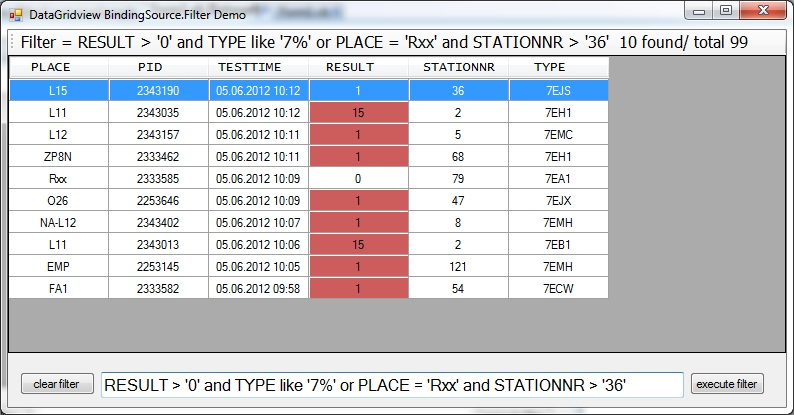

# DataGridView BindingSource.Filter Windows Forms Sample
## Requires
- Visual Studio 2008
## License
- Apache License, Version 2.0
## Technologies
- Windows Forms
- XML
- DataGridView
- Filter expression
## Topics
- Windows Forms
## Updated
- 06/18/2012
## Description

<h1>Indroduction</h1>

My sample demonstates how You can use BindigSource.Filter expressions in a bound DataGridView control (DataTable &gt; BindingSource &gt; DataGridView)

also demonstates

<ul>
<li>Loading XML into DataTable </li><li>Select items from DataGridView </li><li>DataGridView cell Formating </li></ul>

<a href="http://msdn.microsoft.com/en-us/library/system.windows.forms.bindingsource.filter(v=vs.80).aspx">http://msdn.microsoft.com/en-us/library/system.windows.forms.bindingsource.filter(v=vs.80).aspx</a>

<h1> 
Building the Sample</h1>

 
There no special requirements or instructions for building the sample necessary.

<h1> 
Description of the UI</h1>

Start the sample. The Datagridview will be filled by testData.xml file in the execution path.

&nbsp;

&nbsp;

Textbox: enter Your expression string here

Button &quot;execute filter&quot; : Start expression filter 
Button &quot;clear filter&quot; : no filterung data

Left mouse button click on datagridview: show items 
right mouse button click on datagridview: contextmenue

clear filter 
clicked item is filter

<h1>Used datatypes in my sample</h1>

&lt;xs:element name=&quot;PLACE&quot; msprop:OraDbType=&quot;126&quot; msprop:BaseColumn=&quot;PLACE&quot; type=&quot;xs:string&quot; minOccurs=&quot;0&quot; /&gt; 
&lt;xs:element name=&quot;PID&quot; msprop:OraDbType=&quot;126&quot; msprop:BaseColumn=&quot;PID&quot; type=&quot;xs:string&quot; minOccurs=&quot;0&quot; /&gt; 
&lt;xs:element name=&quot;TESTTIME&quot; msprop:OraDbType=&quot;106&quot; msprop:BaseColumn=&quot;TESTTIME&quot; type=&quot;xs:dateTime&quot; minOccurs=&quot;0&quot; /&gt; 
&lt;xs:element name=&quot;RESULT&quot; msprop:OraDbType=&quot;111&quot; msprop:BaseColumn=&quot;RESULT&quot; type=&quot;xs:short&quot; minOccurs=&quot;0&quot; /&gt; 
&lt;xs:element name=&quot;STATIONNR&quot; msprop:OraDbType=&quot;112&quot; msprop:BaseColumn=&quot;STATIONNR&quot; type=&quot;xs:int&quot; minOccurs=&quot;0&quot; /&gt; 
&lt;xs:element name=&quot;TYPE&quot; msprop:OraDbType=&quot;126&quot; msprop:BaseColumn=&quot;TYPE&quot; type=&quot;xs:string&quot; minOccurs=&quot;0&quot; /&gt; 
&nbsp;

<h1>Expression Syntax</h1>

<strong>Keywords</strong>

Allowed keywords are

And 
Between 
Child 
False 
In 
Is 
Like 
Not 
Null 
Or 
Parent 
True

 
<strong>Operators</strong>

Concatenation is allowed using Boolean AND, OR, and NOT operators. You can use parentheses to group clauses and force precedence. The AND operator has precedence over other operators. For example:
 
(PLACE = 'L14' OR TYPE = '7EB1') AND RESULT = '0'  
When you create comparison expressions, the following operations are allowed:  
&lt;  
&gt;  
&lt;=  
&gt;=  
&lt;&gt;  
=  
IN  
LIKE  
The following arithmetic operators are also supported in expressions:  
&#43; (addition)  
- (subtraction)  
* (multiplication)  
/ (division)  
% (modulus)

<h1> 
Topic links</h1>

For more information

<a href="http://msdn.microsoft.com/de-de/library/system.data.datacolumn.expression.aspx">http://msdn.microsoft.com/de-de/library/system.data.datacolumn.expression.aspx</a>

msdn sample: Building a Drop-Down Filter List for a DataGridView Column Header Cell

<a href="http://msdn.microsoft.com/en-us/library/aa480727.aspx">http://msdn.microsoft.com/en-us/library/aa480727.aspx</a>

&nbsp;

&nbsp;

