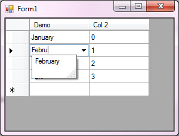

# DataGridView ComboBox allow navigation in drop down
## Requires
- Visual Studio 2013
## License
- MIT
## Technologies
- custom controls
- DataGridView
## Topics
- Windows Forms
- customization
- custom controls
## Updated
- 07/21/2015
## Description

<h1>Description</h1>

Normally when using a DataGridViewComboBoxColumn users will select from available items in the column which is covered in
<a title="My MSDN article on using DataGridView ComboBox" href="https://code.msdn.microsoft.com/DataGridview-ComboBox-usage-26010f73" target="_blank">
this article</a>. This focuses on allowing a user to type in information and have auto-complete feature. The auto-complete feature is extremely easy to do but as someone pointed out recently the left and right arrow keys will not function so to handle this
 a custom DataGridView is used to solve this issue.

 

 

 
There are two projects with the same custom DataGridView, one for C#, one for VB.NET. To use the custom DataGridView, either add the custom DataGridView to your project, build and find the DataGridView at the top of the IDE toolbox or place the custom DataGridView
 in a class project, build the project then add it to the IDE toolbox which makes it available for other projects. Now if you did the latter in C# and find yourself needing it in VB.NET the C# version will work and the same goes in the opposite direction.

Here is the custom DataGridView<em> 
&nbsp;&nbsp;</em>

Visual BasicC#

Edit|Remove

vbcsharp

<pre class="vb">Public&nbsp;Class&nbsp;MyDataGridView&nbsp;
&nbsp;&nbsp;&nbsp;&nbsp;Inherits&nbsp;DataGridView&nbsp;
&nbsp;
&nbsp;&nbsp;&nbsp;&nbsp;Protected&nbsp;Overrides&nbsp;Function&nbsp;ProcessDataGridViewKey(ByVal&nbsp;e&nbsp;As&nbsp;KeyEventArgs)&nbsp;As&nbsp;Boolean&nbsp;
&nbsp;
&nbsp;&nbsp;&nbsp;&nbsp;&nbsp;&nbsp;&nbsp;&nbsp;If&nbsp;e.KeyData&nbsp;=&nbsp;Keys.Left&nbsp;OrElse&nbsp;e.KeyData&nbsp;=&nbsp;Keys.Right&nbsp;Then&nbsp;
&nbsp;&nbsp;&nbsp;&nbsp;&nbsp;&nbsp;&nbsp;&nbsp;&nbsp;&nbsp;&nbsp;&nbsp;If&nbsp;Me.EditingControl&nbsp;IsNot&nbsp;Nothing&nbsp;Then&nbsp;
&nbsp;&nbsp;&nbsp;&nbsp;&nbsp;&nbsp;&nbsp;&nbsp;&nbsp;&nbsp;&nbsp;&nbsp;&nbsp;&nbsp;&nbsp;&nbsp;If&nbsp;Me.EditingControl.GetType()&nbsp;Is&nbsp;GetType(DataGridViewComboBoxEditingControl)&nbsp;Then&nbsp;
&nbsp;&nbsp;&nbsp;&nbsp;&nbsp;&nbsp;&nbsp;&nbsp;&nbsp;&nbsp;&nbsp;&nbsp;&nbsp;&nbsp;&nbsp;&nbsp;&nbsp;&nbsp;&nbsp;&nbsp;Dim&nbsp;control&nbsp;As&nbsp;ComboBox&nbsp;=&nbsp;TryCast(Me.EditingControl,&nbsp;ComboBox)&nbsp;
&nbsp;&nbsp;&nbsp;&nbsp;&nbsp;&nbsp;&nbsp;&nbsp;&nbsp;&nbsp;&nbsp;&nbsp;&nbsp;&nbsp;&nbsp;&nbsp;&nbsp;&nbsp;&nbsp;&nbsp;If&nbsp;control.DropDownStyle&nbsp;&lt;&gt;&nbsp;ComboBoxStyle.DropDownList&nbsp;Then&nbsp;
&nbsp;&nbsp;&nbsp;&nbsp;&nbsp;&nbsp;&nbsp;&nbsp;&nbsp;&nbsp;&nbsp;&nbsp;&nbsp;&nbsp;&nbsp;&nbsp;&nbsp;&nbsp;&nbsp;&nbsp;&nbsp;&nbsp;&nbsp;&nbsp;Select&nbsp;Case&nbsp;e.KeyData&nbsp;
&nbsp;&nbsp;&nbsp;&nbsp;&nbsp;&nbsp;&nbsp;&nbsp;&nbsp;&nbsp;&nbsp;&nbsp;&nbsp;&nbsp;&nbsp;&nbsp;&nbsp;&nbsp;&nbsp;&nbsp;&nbsp;&nbsp;&nbsp;&nbsp;&nbsp;&nbsp;&nbsp;&nbsp;Case&nbsp;Keys.Left&nbsp;
&nbsp;&nbsp;&nbsp;&nbsp;&nbsp;&nbsp;&nbsp;&nbsp;&nbsp;&nbsp;&nbsp;&nbsp;&nbsp;&nbsp;&nbsp;&nbsp;&nbsp;&nbsp;&nbsp;&nbsp;&nbsp;&nbsp;&nbsp;&nbsp;&nbsp;&nbsp;&nbsp;&nbsp;&nbsp;&nbsp;&nbsp;&nbsp;If&nbsp;control.SelectionStart&nbsp;&gt;&nbsp;0&nbsp;Then&nbsp;
&nbsp;&nbsp;&nbsp;&nbsp;&nbsp;&nbsp;&nbsp;&nbsp;&nbsp;&nbsp;&nbsp;&nbsp;&nbsp;&nbsp;&nbsp;&nbsp;&nbsp;&nbsp;&nbsp;&nbsp;&nbsp;&nbsp;&nbsp;&nbsp;&nbsp;&nbsp;&nbsp;&nbsp;&nbsp;&nbsp;&nbsp;&nbsp;&nbsp;&nbsp;&nbsp;&nbsp;control.SelectionStart&nbsp;-=&nbsp;1&nbsp;
&nbsp;&nbsp;&nbsp;&nbsp;&nbsp;&nbsp;&nbsp;&nbsp;&nbsp;&nbsp;&nbsp;&nbsp;&nbsp;&nbsp;&nbsp;&nbsp;&nbsp;&nbsp;&nbsp;&nbsp;&nbsp;&nbsp;&nbsp;&nbsp;&nbsp;&nbsp;&nbsp;&nbsp;&nbsp;&nbsp;&nbsp;&nbsp;&nbsp;&nbsp;&nbsp;&nbsp;Return&nbsp;True&nbsp;
&nbsp;&nbsp;&nbsp;&nbsp;&nbsp;&nbsp;&nbsp;&nbsp;&nbsp;&nbsp;&nbsp;&nbsp;&nbsp;&nbsp;&nbsp;&nbsp;&nbsp;&nbsp;&nbsp;&nbsp;&nbsp;&nbsp;&nbsp;&nbsp;&nbsp;&nbsp;&nbsp;&nbsp;&nbsp;&nbsp;&nbsp;&nbsp;End&nbsp;If&nbsp;
&nbsp;&nbsp;&nbsp;&nbsp;&nbsp;&nbsp;&nbsp;&nbsp;&nbsp;&nbsp;&nbsp;&nbsp;&nbsp;&nbsp;&nbsp;&nbsp;&nbsp;&nbsp;&nbsp;&nbsp;&nbsp;&nbsp;&nbsp;&nbsp;&nbsp;&nbsp;&nbsp;&nbsp;Case&nbsp;Keys.Right&nbsp;
&nbsp;&nbsp;&nbsp;&nbsp;&nbsp;&nbsp;&nbsp;&nbsp;&nbsp;&nbsp;&nbsp;&nbsp;&nbsp;&nbsp;&nbsp;&nbsp;&nbsp;&nbsp;&nbsp;&nbsp;&nbsp;&nbsp;&nbsp;&nbsp;&nbsp;&nbsp;&nbsp;&nbsp;&nbsp;&nbsp;&nbsp;&nbsp;If&nbsp;control.SelectionStart&nbsp;&lt;&nbsp;control.Text.Length&nbsp;Then&nbsp;
&nbsp;&nbsp;&nbsp;&nbsp;&nbsp;&nbsp;&nbsp;&nbsp;&nbsp;&nbsp;&nbsp;&nbsp;&nbsp;&nbsp;&nbsp;&nbsp;&nbsp;&nbsp;&nbsp;&nbsp;&nbsp;&nbsp;&nbsp;&nbsp;&nbsp;&nbsp;&nbsp;&nbsp;&nbsp;&nbsp;&nbsp;&nbsp;&nbsp;&nbsp;&nbsp;&nbsp;control.SelectionStart&nbsp;&#43;=&nbsp;1&nbsp;
&nbsp;&nbsp;&nbsp;&nbsp;&nbsp;&nbsp;&nbsp;&nbsp;&nbsp;&nbsp;&nbsp;&nbsp;&nbsp;&nbsp;&nbsp;&nbsp;&nbsp;&nbsp;&nbsp;&nbsp;&nbsp;&nbsp;&nbsp;&nbsp;&nbsp;&nbsp;&nbsp;&nbsp;&nbsp;&nbsp;&nbsp;&nbsp;&nbsp;&nbsp;&nbsp;&nbsp;Return&nbsp;True&nbsp;
&nbsp;&nbsp;&nbsp;&nbsp;&nbsp;&nbsp;&nbsp;&nbsp;&nbsp;&nbsp;&nbsp;&nbsp;&nbsp;&nbsp;&nbsp;&nbsp;&nbsp;&nbsp;&nbsp;&nbsp;&nbsp;&nbsp;&nbsp;&nbsp;&nbsp;&nbsp;&nbsp;&nbsp;&nbsp;&nbsp;&nbsp;&nbsp;End&nbsp;If&nbsp;
&nbsp;&nbsp;&nbsp;&nbsp;&nbsp;&nbsp;&nbsp;&nbsp;&nbsp;&nbsp;&nbsp;&nbsp;&nbsp;&nbsp;&nbsp;&nbsp;&nbsp;&nbsp;&nbsp;&nbsp;&nbsp;&nbsp;&nbsp;&nbsp;End&nbsp;Select&nbsp;
&nbsp;&nbsp;&nbsp;&nbsp;&nbsp;&nbsp;&nbsp;&nbsp;&nbsp;&nbsp;&nbsp;&nbsp;&nbsp;&nbsp;&nbsp;&nbsp;&nbsp;&nbsp;&nbsp;&nbsp;End&nbsp;If&nbsp;
&nbsp;&nbsp;&nbsp;&nbsp;&nbsp;&nbsp;&nbsp;&nbsp;&nbsp;&nbsp;&nbsp;&nbsp;&nbsp;&nbsp;&nbsp;&nbsp;End&nbsp;If&nbsp;
&nbsp;&nbsp;&nbsp;&nbsp;&nbsp;&nbsp;&nbsp;&nbsp;&nbsp;&nbsp;&nbsp;&nbsp;End&nbsp;If&nbsp;
&nbsp;
&nbsp;&nbsp;&nbsp;&nbsp;&nbsp;&nbsp;&nbsp;&nbsp;End&nbsp;If&nbsp;
&nbsp;
&nbsp;&nbsp;&nbsp;&nbsp;&nbsp;&nbsp;&nbsp;&nbsp;Return&nbsp;MyBase.ProcessDataGridViewKey(e)&nbsp;
&nbsp;
&nbsp;&nbsp;&nbsp;&nbsp;End&nbsp;Function&nbsp;
End&nbsp;Class</pre>

In the code below, form load event handles loading our DataGridView and the data used in the auto-complete featue of the DataGridViewComboBox colum. In the event EditingControlShowing we check to see if we are in the DataGridViewComboBox
 cell and if so setup our ComboBox with the auto-complete feature. Lastly, in CellLeave event we check to see if the item used is in the list of auto-complete, if not we added it. If this was a database application this is were we could if needed add the new
 item to a table in the database.

Visual BasicC#

Edit|Remove

vbcsharp

<pre class="vb">Imports&nbsp;MockedData_VB&nbsp;
Public&nbsp;Class&nbsp;Form1&nbsp;
&nbsp;&nbsp;&nbsp;&nbsp;Private&nbsp;AutoList&nbsp;As&nbsp;AutoCompleteStringCollection&nbsp;=&nbsp;
&nbsp;&nbsp;&nbsp;&nbsp;&nbsp;&nbsp;&nbsp;&nbsp;New&nbsp;AutoCompleteStringCollection&nbsp;
&nbsp;
&nbsp;&nbsp;&nbsp;&nbsp;Private&nbsp;cbo&nbsp;As&nbsp;ComboBox&nbsp;
&nbsp;&nbsp;&nbsp;&nbsp;Private&nbsp;ComboColumnName&nbsp;As&nbsp;String&nbsp;=&nbsp;&quot;C1&quot;&nbsp;
&nbsp;
&nbsp;&nbsp;&nbsp;&nbsp;Private&nbsp;Sub&nbsp;Form1_Load(sender&nbsp;As&nbsp;Object,&nbsp;e&nbsp;As&nbsp;EventArgs)&nbsp;Handles&nbsp;MyBase.Load&nbsp;
&nbsp;
&nbsp;&nbsp;&nbsp;&nbsp;&nbsp;&nbsp;&nbsp;&nbsp;'&nbsp;
&nbsp;&nbsp;&nbsp;&nbsp;&nbsp;&nbsp;&nbsp;&nbsp;'&nbsp;DataOperation&nbsp;contains&nbsp;mocked&nbsp;data&nbsp;for&nbsp;this&nbsp;demo&nbsp;
&nbsp;&nbsp;&nbsp;&nbsp;&nbsp;&nbsp;&nbsp;&nbsp;'&nbsp;
&nbsp;&nbsp;&nbsp;&nbsp;&nbsp;&nbsp;&nbsp;&nbsp;Dim&nbsp;Data&nbsp;As&nbsp;New&nbsp;DataOperations&nbsp;
&nbsp;
&nbsp;&nbsp;&nbsp;&nbsp;&nbsp;&nbsp;&nbsp;&nbsp;Dim&nbsp;dict&nbsp;=&nbsp;Data.MonthDictionary&nbsp;
&nbsp;&nbsp;&nbsp;&nbsp;&nbsp;&nbsp;&nbsp;&nbsp;Dim&nbsp;DataGridViewData&nbsp;As&nbsp;List(Of&nbsp;MockedData)&nbsp;=&nbsp;Data.MockedData&nbsp;
&nbsp;
&nbsp;&nbsp;&nbsp;&nbsp;&nbsp;&nbsp;&nbsp;&nbsp;Dim&nbsp;MonthNameColumn&nbsp;As&nbsp;New&nbsp;DataGridViewComboBoxColumn&nbsp;With&nbsp;
&nbsp;&nbsp;&nbsp;&nbsp;&nbsp;&nbsp;&nbsp;&nbsp;&nbsp;&nbsp;&nbsp;&nbsp;{&nbsp;
&nbsp;&nbsp;&nbsp;&nbsp;&nbsp;&nbsp;&nbsp;&nbsp;&nbsp;&nbsp;&nbsp;&nbsp;&nbsp;&nbsp;&nbsp;&nbsp;.DataSource&nbsp;=&nbsp;Data.AutoData,&nbsp;
&nbsp;&nbsp;&nbsp;&nbsp;&nbsp;&nbsp;&nbsp;&nbsp;&nbsp;&nbsp;&nbsp;&nbsp;&nbsp;&nbsp;&nbsp;&nbsp;.DisplayStyle&nbsp;=&nbsp;DataGridViewComboBoxDisplayStyle.Nothing,&nbsp;
&nbsp;&nbsp;&nbsp;&nbsp;&nbsp;&nbsp;&nbsp;&nbsp;&nbsp;&nbsp;&nbsp;&nbsp;&nbsp;&nbsp;&nbsp;&nbsp;.Name&nbsp;=&nbsp;ComboColumnName,&nbsp;
&nbsp;&nbsp;&nbsp;&nbsp;&nbsp;&nbsp;&nbsp;&nbsp;&nbsp;&nbsp;&nbsp;&nbsp;&nbsp;&nbsp;&nbsp;&nbsp;.HeaderText&nbsp;=&nbsp;&quot;Demo&quot;,&nbsp;
&nbsp;&nbsp;&nbsp;&nbsp;&nbsp;&nbsp;&nbsp;&nbsp;&nbsp;&nbsp;&nbsp;&nbsp;&nbsp;&nbsp;&nbsp;&nbsp;.SortMode&nbsp;=&nbsp;DataGridViewColumnSortMode.NotSortable&nbsp;
&nbsp;&nbsp;&nbsp;&nbsp;&nbsp;&nbsp;&nbsp;&nbsp;&nbsp;&nbsp;&nbsp;&nbsp;}&nbsp;
&nbsp;
&nbsp;&nbsp;&nbsp;&nbsp;&nbsp;&nbsp;&nbsp;&nbsp;Dim&nbsp;IndexColumn&nbsp;As&nbsp;New&nbsp;DataGridViewTextBoxColumn&nbsp;With&nbsp;
&nbsp;&nbsp;&nbsp;&nbsp;&nbsp;&nbsp;&nbsp;&nbsp;&nbsp;&nbsp;&nbsp;&nbsp;{&nbsp;
&nbsp;&nbsp;&nbsp;&nbsp;&nbsp;&nbsp;&nbsp;&nbsp;&nbsp;&nbsp;&nbsp;&nbsp;&nbsp;&nbsp;&nbsp;&nbsp;.Name&nbsp;=&nbsp;&quot;C2&quot;,&nbsp;
&nbsp;&nbsp;&nbsp;&nbsp;&nbsp;&nbsp;&nbsp;&nbsp;&nbsp;&nbsp;&nbsp;&nbsp;&nbsp;&nbsp;&nbsp;&nbsp;.HeaderText&nbsp;=&nbsp;&quot;Col&nbsp;2&quot;&nbsp;
&nbsp;&nbsp;&nbsp;&nbsp;&nbsp;&nbsp;&nbsp;&nbsp;&nbsp;&nbsp;&nbsp;&nbsp;}&nbsp;
&nbsp;
&nbsp;&nbsp;&nbsp;&nbsp;&nbsp;&nbsp;&nbsp;&nbsp;AutoList.AddRange(Data.AutoData)&nbsp;
&nbsp;
&nbsp;&nbsp;&nbsp;&nbsp;&nbsp;&nbsp;&nbsp;&nbsp;DataGridView1.Columns.AddRange(New&nbsp;DataGridViewColumn()&nbsp;&nbsp;
&nbsp;&nbsp;&nbsp;&nbsp;&nbsp;&nbsp;&nbsp;&nbsp;&nbsp;&nbsp;&nbsp;&nbsp;&nbsp;&nbsp;&nbsp;&nbsp;&nbsp;&nbsp;&nbsp;&nbsp;&nbsp;&nbsp;&nbsp;&nbsp;&nbsp;&nbsp;&nbsp;&nbsp;&nbsp;&nbsp;&nbsp;&nbsp;&nbsp;&nbsp;&nbsp;&nbsp;&nbsp;&nbsp;&nbsp;{MonthNameColumn,&nbsp;IndexColumn})&nbsp;
&nbsp;
&nbsp;&nbsp;&nbsp;&nbsp;&nbsp;&nbsp;&nbsp;&nbsp;For&nbsp;Each&nbsp;item&nbsp;In&nbsp;Data.MockedData&nbsp;
&nbsp;&nbsp;&nbsp;&nbsp;&nbsp;&nbsp;&nbsp;&nbsp;&nbsp;&nbsp;&nbsp;&nbsp;DataGridView1.Rows.Add(New&nbsp;Object()&nbsp;{item.Name,&nbsp;item.Index})&nbsp;
&nbsp;&nbsp;&nbsp;&nbsp;&nbsp;&nbsp;&nbsp;&nbsp;Next&nbsp;
&nbsp;
&nbsp;&nbsp;&nbsp;&nbsp;End&nbsp;Sub&nbsp;
&nbsp;&nbsp;&nbsp;&nbsp;Private&nbsp;Sub&nbsp;DataGridView1_CellLeave(sender&nbsp;As&nbsp;Object,&nbsp;e&nbsp;As&nbsp;DataGridViewCellEventArgs)&nbsp;_&nbsp;
&nbsp;&nbsp;&nbsp;&nbsp;&nbsp;&nbsp;&nbsp;&nbsp;Handles&nbsp;DataGridView1.CellLeave&nbsp;
&nbsp;
&nbsp;&nbsp;&nbsp;&nbsp;&nbsp;&nbsp;&nbsp;&nbsp;If&nbsp;cbo&nbsp;IsNot&nbsp;Nothing&nbsp;Then&nbsp;
&nbsp;&nbsp;&nbsp;&nbsp;&nbsp;&nbsp;&nbsp;&nbsp;&nbsp;&nbsp;&nbsp;&nbsp;If&nbsp;Not&nbsp;String.IsNullOrWhiteSpace(cbo.Text)&nbsp;Then&nbsp;
&nbsp;&nbsp;&nbsp;&nbsp;&nbsp;&nbsp;&nbsp;&nbsp;&nbsp;&nbsp;&nbsp;&nbsp;&nbsp;&nbsp;&nbsp;&nbsp;If&nbsp;Not&nbsp;AutoList.Contains(cbo.Text)&nbsp;Then&nbsp;
&nbsp;&nbsp;&nbsp;&nbsp;&nbsp;&nbsp;&nbsp;&nbsp;&nbsp;&nbsp;&nbsp;&nbsp;&nbsp;&nbsp;&nbsp;&nbsp;&nbsp;&nbsp;&nbsp;&nbsp;Dim&nbsp;cb&nbsp;=&nbsp;CType(DataGridView1.Columns(0),&nbsp;DataGridViewComboBoxColumn)&nbsp;
&nbsp;&nbsp;&nbsp;&nbsp;&nbsp;&nbsp;&nbsp;&nbsp;&nbsp;&nbsp;&nbsp;&nbsp;&nbsp;&nbsp;&nbsp;&nbsp;&nbsp;&nbsp;&nbsp;&nbsp;AutoList.Add(cbo.Text)&nbsp;
&nbsp;&nbsp;&nbsp;&nbsp;&nbsp;&nbsp;&nbsp;&nbsp;&nbsp;&nbsp;&nbsp;&nbsp;&nbsp;&nbsp;&nbsp;&nbsp;&nbsp;&nbsp;&nbsp;&nbsp;Dim&nbsp;Items&nbsp;As&nbsp;List(Of&nbsp;String)&nbsp;=&nbsp;CType(cb.DataSource,&nbsp;String()).ToList&nbsp;
&nbsp;&nbsp;&nbsp;&nbsp;&nbsp;&nbsp;&nbsp;&nbsp;&nbsp;&nbsp;&nbsp;&nbsp;&nbsp;&nbsp;&nbsp;&nbsp;&nbsp;&nbsp;&nbsp;&nbsp;Items.Add(cbo.Text)&nbsp;
&nbsp;&nbsp;&nbsp;&nbsp;&nbsp;&nbsp;&nbsp;&nbsp;&nbsp;&nbsp;&nbsp;&nbsp;&nbsp;&nbsp;&nbsp;&nbsp;&nbsp;&nbsp;&nbsp;&nbsp;Dim&nbsp;Index&nbsp;=&nbsp;Items.FindIndex(Function(x)&nbsp;x.ToLower&nbsp;=&nbsp;cbo.Text.ToLower)&nbsp;
&nbsp;&nbsp;&nbsp;&nbsp;&nbsp;&nbsp;&nbsp;&nbsp;&nbsp;&nbsp;&nbsp;&nbsp;&nbsp;&nbsp;&nbsp;&nbsp;&nbsp;&nbsp;&nbsp;&nbsp;cb.DataSource&nbsp;=&nbsp;Items.ToArray&nbsp;
&nbsp;&nbsp;&nbsp;&nbsp;&nbsp;&nbsp;&nbsp;&nbsp;&nbsp;&nbsp;&nbsp;&nbsp;&nbsp;&nbsp;&nbsp;&nbsp;&nbsp;&nbsp;&nbsp;&nbsp;cbo.SelectedIndex&nbsp;=&nbsp;Index&nbsp;
&nbsp;&nbsp;&nbsp;&nbsp;&nbsp;&nbsp;&nbsp;&nbsp;&nbsp;&nbsp;&nbsp;&nbsp;&nbsp;&nbsp;&nbsp;&nbsp;&nbsp;&nbsp;&nbsp;&nbsp;'&nbsp;
&nbsp;&nbsp;&nbsp;&nbsp;&nbsp;&nbsp;&nbsp;&nbsp;&nbsp;&nbsp;&nbsp;&nbsp;&nbsp;&nbsp;&nbsp;&nbsp;&nbsp;&nbsp;&nbsp;&nbsp;'&nbsp;For&nbsp;your&nbsp;project&nbsp;here&nbsp;is&nbsp;where&nbsp;you&nbsp;can&nbsp;do&nbsp;say&nbsp;a&nbsp;save&nbsp;back&nbsp;to&nbsp;the&nbsp;
&nbsp;&nbsp;&nbsp;&nbsp;&nbsp;&nbsp;&nbsp;&nbsp;&nbsp;&nbsp;&nbsp;&nbsp;&nbsp;&nbsp;&nbsp;&nbsp;&nbsp;&nbsp;&nbsp;&nbsp;'&nbsp;database.&nbsp;
&nbsp;&nbsp;&nbsp;&nbsp;&nbsp;&nbsp;&nbsp;&nbsp;&nbsp;&nbsp;&nbsp;&nbsp;&nbsp;&nbsp;&nbsp;&nbsp;&nbsp;&nbsp;&nbsp;&nbsp;'&nbsp;
&nbsp;&nbsp;&nbsp;&nbsp;&nbsp;&nbsp;&nbsp;&nbsp;&nbsp;&nbsp;&nbsp;&nbsp;&nbsp;&nbsp;&nbsp;&nbsp;End&nbsp;If&nbsp;
&nbsp;&nbsp;&nbsp;&nbsp;&nbsp;&nbsp;&nbsp;&nbsp;&nbsp;&nbsp;&nbsp;&nbsp;End&nbsp;If&nbsp;
&nbsp;&nbsp;&nbsp;&nbsp;&nbsp;&nbsp;&nbsp;&nbsp;End&nbsp;If&nbsp;
&nbsp;
&nbsp;&nbsp;&nbsp;&nbsp;End&nbsp;Sub&nbsp;
&nbsp;&nbsp;&nbsp;&nbsp;Private&nbsp;Sub&nbsp;DataGridView1_EditingControlShowing(&nbsp;
&nbsp;&nbsp;&nbsp;&nbsp;&nbsp;&nbsp;&nbsp;&nbsp;sender&nbsp;As&nbsp;Object,&nbsp;e&nbsp;As&nbsp;DataGridViewEditingControlShowingEventArgs)&nbsp;_&nbsp;
&nbsp;&nbsp;&nbsp;&nbsp;Handles&nbsp;DataGridView1.EditingControlShowing&nbsp;
&nbsp;
&nbsp;&nbsp;&nbsp;&nbsp;&nbsp;&nbsp;&nbsp;&nbsp;'&nbsp;IsComboBoxCell&nbsp;is&nbsp;an&nbsp;exension&nbsp;method&nbsp;in&nbsp;ExtensionMethods_VB&nbsp;project&nbsp;
&nbsp;&nbsp;&nbsp;&nbsp;&nbsp;&nbsp;&nbsp;&nbsp;If&nbsp;DataGridView1.CurrentCell.IsComboBoxCell&nbsp;Then&nbsp;
&nbsp;&nbsp;&nbsp;&nbsp;&nbsp;&nbsp;&nbsp;&nbsp;&nbsp;&nbsp;&nbsp;&nbsp;If&nbsp;DataGridView1.Columns(DataGridView1.CurrentCell.ColumnIndex).Name&nbsp;=&nbsp;ComboColumnName&nbsp;Then&nbsp;
&nbsp;&nbsp;&nbsp;&nbsp;&nbsp;&nbsp;&nbsp;&nbsp;&nbsp;&nbsp;&nbsp;&nbsp;&nbsp;&nbsp;&nbsp;&nbsp;cbo&nbsp;=&nbsp;TryCast(e.Control,&nbsp;ComboBox)&nbsp;
&nbsp;&nbsp;&nbsp;&nbsp;&nbsp;&nbsp;&nbsp;&nbsp;&nbsp;&nbsp;&nbsp;&nbsp;&nbsp;&nbsp;&nbsp;&nbsp;cbo.DropDownStyle&nbsp;=&nbsp;ComboBoxStyle.DropDown&nbsp;
&nbsp;&nbsp;&nbsp;&nbsp;&nbsp;&nbsp;&nbsp;&nbsp;&nbsp;&nbsp;&nbsp;&nbsp;&nbsp;&nbsp;&nbsp;&nbsp;cbo.AutoCompleteMode&nbsp;=&nbsp;AutoCompleteMode.SuggestAppend&nbsp;
&nbsp;&nbsp;&nbsp;&nbsp;&nbsp;&nbsp;&nbsp;&nbsp;&nbsp;&nbsp;&nbsp;&nbsp;&nbsp;&nbsp;&nbsp;&nbsp;cbo.AutoCompleteSource&nbsp;=&nbsp;AutoCompleteSource.ListItems&nbsp;
&nbsp;&nbsp;&nbsp;&nbsp;&nbsp;&nbsp;&nbsp;&nbsp;&nbsp;&nbsp;&nbsp;&nbsp;End&nbsp;If&nbsp;
&nbsp;&nbsp;&nbsp;&nbsp;&nbsp;&nbsp;&nbsp;&nbsp;End&nbsp;If&nbsp;
&nbsp;&nbsp;&nbsp;&nbsp;End&nbsp;Sub&nbsp;
&nbsp;
End&nbsp;Class&nbsp;
</pre>

In the solution screen shot you will find the top two projects are the custom DataGridView controls. Next two demo how to you them. Second from bottom is where IsComboBox extension method resides and the last handles giving the
 two form projects simple data.

 

