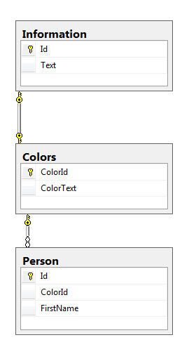
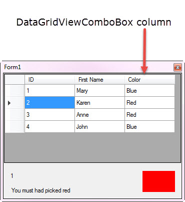

# DataGridView ComboBox with ValueMember
## Requires
- Visual Studio 2015
## License
- MIT
## Technologies
- Windows Forms
- DataGridView
## Topics
- Data Access
- DataGridView
- DataGridViewComboBoxColumn
## Updated
- 09/10/2016
## Description

<h1>Description</h1>

Usually using a DataGridViewComboBox column is relatively straight forward, one wants to display values for options for a row of data displayed in a DataGridView row and use this value to be saved back to a database table. In
 short there is a problem here if the values come from a reference table as strings and then stored in another table as a string which is if the value or values change then we have a mix bag of values e.g. say we have the following values, Admin, student, other
 and now we change to Administrator, person and former student. In this case the values shown as options and current values don&rsquo;t line up.

The best way to fix this is to have a table to display were the options mentioned above are stored as integer values that are primary keys into a reference table. &nbsp;

Let's use the following where we want to store a color name for each person. Person.ColorId points to Colors.ColorId where Color.ColorText has a color name. That should be it but suppose we want a bit more, some information
 about the color, we could store it in Colors table or have another reference table, in this case Informaton which could have more than information about the color.

<strong>Figure 1</strong>: table in a SQL-Server database

 

Now let' display the data, in this case display person information, person primary key (not normally shown to the user), first name (those are in DataGridViewTextBox columns). As the user traverses the rows a panel shows the
 selected color, a label shows the index (primary key for the color e.g. ColorId) and text from Information.Text. Granted in a normal app we would not be showing the information for the color index.

<strong>Figure 2</strong>

&nbsp;

Points of interest, I recommend using BindingSource components for working with data as they provide a) the ability to know the current row in the DataGridView, allow us to get the primary key even if hidden in the DataGridView
 and much more.

<ul>
<li>I created a class, Extensions which contains code that could had been done directly in a form but this way of using extensions makes code clearner in the form and also reusable.
</li><li>A class is used for data operations, best practice dictate separating user interface from data operations.
</li></ul>

More Information

<strong>IMPORTANT</strong>

<ul>
<li>The data comes from a SQL-Server database and must be created prior to running the projects. Use GenerateDatabase.sql script to create the database and follow the notes at the top of the file.
</li><li>First run the project in the language of choice e.g. C# or VB.NET then take time to review the code so that it's understood so that you can use it in your project. There is a lot of code but the following is most important
</li></ul>

&nbsp;

Visual BasicC#

Edit|Remove

vbcsharp
<pre class="hidden">Private Sub Form1_Load(sender As Object, e As EventArgs) Handles MyBase.Load
    Dim operation As New DataOperations
    operation.GetData()
    If Not operation.Exception.HasError Then
        ColorDictionary = operation.ColorDictionary

        DataGridView1.AutoGenerateColumns = False
        bsComboBox.DataSource = operation.ColorTable

        ColorsColumn.DisplayMember = &quot;ColorText&quot;
        ColorsColumn.ValueMember = &quot;ColorId&quot;
        ColorsColumn.DataSource = bsComboBox
        ColorsColumn.DisplayStyle = DataGridViewComboBoxDisplayStyle.Nothing

        bsPerson.DataSource = operation.PersonsTable
        DataGridView1.DataSource = bsPerson

        bsColorInformation.DataSource = operation.InformationTable

        updateFormControls()

    End If

End Sub</pre>
<pre class="hidden">private void Form1_Load(object sender, EventArgs e)
{
    DataOperations operation = new DataOperations();
    operation.GetData();
    if (!operation.Exception.HasError)
    {
        ColorDictionary = operation.ColorDictionary;

        DataGridView1.AutoGenerateColumns = false;
        bsComboBox.DataSource = operation.ColorTable;

        ColorsColumn.DisplayMember = &quot;ColorText&quot;;
        ColorsColumn.ValueMember = &quot;ColorId&quot;;
        ColorsColumn.DataSource = bsComboBox;
        ColorsColumn.DisplayStyle = DataGridViewComboBoxDisplayStyle.Nothing;

        bsPerson.DataSource = operation.PersonsTable;
        DataGridView1.DataSource = bsPerson;

        bsColorInformation.DataSource = operation.InformationTable;

        updateFormControls();
    }
}</pre>

<pre class="vb">Private&nbsp;Sub&nbsp;Form1_Load(sender&nbsp;As&nbsp;Object,&nbsp;e&nbsp;As&nbsp;EventArgs)&nbsp;Handles&nbsp;MyBase.Load&nbsp;
&nbsp;&nbsp;&nbsp;&nbsp;Dim&nbsp;operation&nbsp;As&nbsp;New&nbsp;DataOperations&nbsp;
&nbsp;&nbsp;&nbsp;&nbsp;operation.GetData()&nbsp;
&nbsp;&nbsp;&nbsp;&nbsp;If&nbsp;Not&nbsp;operation.Exception.HasError&nbsp;Then&nbsp;
&nbsp;&nbsp;&nbsp;&nbsp;&nbsp;&nbsp;&nbsp;&nbsp;ColorDictionary&nbsp;=&nbsp;operation.ColorDictionary&nbsp;
&nbsp;
&nbsp;&nbsp;&nbsp;&nbsp;&nbsp;&nbsp;&nbsp;&nbsp;DataGridView1.AutoGenerateColumns&nbsp;=&nbsp;False&nbsp;
&nbsp;&nbsp;&nbsp;&nbsp;&nbsp;&nbsp;&nbsp;&nbsp;bsComboBox.DataSource&nbsp;=&nbsp;operation.ColorTable&nbsp;
&nbsp;
&nbsp;&nbsp;&nbsp;&nbsp;&nbsp;&nbsp;&nbsp;&nbsp;ColorsColumn.DisplayMember&nbsp;=&nbsp;&quot;ColorText&quot;&nbsp;
&nbsp;&nbsp;&nbsp;&nbsp;&nbsp;&nbsp;&nbsp;&nbsp;ColorsColumn.ValueMember&nbsp;=&nbsp;&quot;ColorId&quot;&nbsp;
&nbsp;&nbsp;&nbsp;&nbsp;&nbsp;&nbsp;&nbsp;&nbsp;ColorsColumn.DataSource&nbsp;=&nbsp;bsComboBox&nbsp;
&nbsp;&nbsp;&nbsp;&nbsp;&nbsp;&nbsp;&nbsp;&nbsp;ColorsColumn.DisplayStyle&nbsp;=&nbsp;DataGridViewComboBoxDisplayStyle.Nothing&nbsp;
&nbsp;
&nbsp;&nbsp;&nbsp;&nbsp;&nbsp;&nbsp;&nbsp;&nbsp;bsPerson.DataSource&nbsp;=&nbsp;operation.PersonsTable&nbsp;
&nbsp;&nbsp;&nbsp;&nbsp;&nbsp;&nbsp;&nbsp;&nbsp;DataGridView1.DataSource&nbsp;=&nbsp;bsPerson&nbsp;
&nbsp;
&nbsp;&nbsp;&nbsp;&nbsp;&nbsp;&nbsp;&nbsp;&nbsp;bsColorInformation.DataSource&nbsp;=&nbsp;operation.InformationTable&nbsp;
&nbsp;
&nbsp;&nbsp;&nbsp;&nbsp;&nbsp;&nbsp;&nbsp;&nbsp;updateFormControls()&nbsp;
&nbsp;
&nbsp;&nbsp;&nbsp;&nbsp;End&nbsp;If&nbsp;
&nbsp;
End&nbsp;Sub</pre>

&nbsp;

