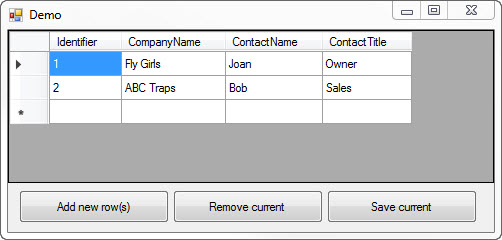
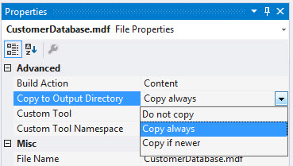

# DataGridView add, update, delete via SqlClient data provider vb.net
## Requires
- Visual Studio 2013
## License
- MIT
## Technologies
- SQL Server
- DataGridView
## Topics
- SQL Server
- Windows Forms
- VB.Net
- Code Sample
- DataGridView
- Databases
- .Net Programming
## Updated
- 11/30/2015
## Description

<h2>Description</h2>

Developers just starting out with working with a DataGridView look for easy methods to add, update and remove data from a table in a database but as with anything new it's difficult to figure out how to implement these methods
 when working data without using Visual Studio IDE data wizards and are working with SQL-Server database. The sample code here shows how to implement add, update and remove.&nbsp;

This code example demonstrates how to add, edit and remove rows from a DataGridView in a Windows forms project were data is loaded from an attached SQL-Server local database which is entirely hand-coded meaning on IDE data wizards
 were used for any operations. 
 
Generally it&rsquo;s best to add rows not directly into a DataGridView but instead to present a child form shown modally simply because there is less code overall required but on several forums developers want to add from the DataGridView.
 For the add operation the RowEnter event of the DataGridView is used to prompt a user if they want to add a new row by checking if we are in the last row for adding a new row. If the user elects to add a new row they may and if they select no they are taken
 out of the new row essentially cancelling the add. RowValidating event of the DataGridView is used to ensure all fields are populated (this is also used for editing rows too).&nbsp; 
 
If all fields/cells where not required for a complete record in your app simply validate to the fields that constitute a valid record e.g. let&rsquo;s say we know the company name and contact name but not the title and business
 rules allow a record to be saved without the title which can be obtained later, then we would remove the check on the title. 
 
The &nbsp;first button &ldquo;add new row(s) cycles through all rows in the DataGridView and checks each rows row-state, if set to add Adding we add the new row to the database table using a compound SQL statement, first part does
 the insert, second part gets the newly generated primary key.&nbsp; 
 
The middle button &ldquo;Remove current&rdquo; allows the remove of the current row in the DataGridView. One may like to remove multiple rows at once. This would be done by either having the user select rows and then pass them
 back to our class for removing rows but the problem here (unlike this demo) is passing DataGridView rows will not include the primary key as most times we exclude it and might make the column invisible which means it will not be included when iterating the
 cells. A better method is to use a DataGridViewCheckBox column. See my code article/samples titled
<a href="https://code.msdn.microsoft.com/Bascis-to-advance-working-7b757af3">Basics to advance working with DataGridView Checkbox columns</a> to learn how to implement this. I will say that the key is to add a DataColumn to the DataTable of type Boolean and
 set the ordinal position of the column to 0 so it appears first in the DataGridView. 
 
The last button &ldquo;Save Current&rdquo; shows how to update the current row in the DataGridView. To update multiple rows we would check the row-state of each data row to see if it&rsquo;s modified and implement logic similar
 to the add method above. A caveat, if you implement each add and edit side by side we will cancel one out when issuing AcceptChanges on the underlying DataTable. To fix this one save would be used and we would use to for each loops, one for add, one for modify
 or one for each loop with a if statement to distinguish between add and edit and hit the appropriate method e.g. UpDateRow or AddNewCustomer in the data class in this project.

<strong>SPECIAL NOTE</strong>

The project is setup so that each build the database is copied from the project folder to the Bin\debug folder. This means if you add, edit or remove data the changes are lost on the next run of the project. This means you have
 a clean slate each time. You may want to persist changes which is done by opening Visual Studio's Solution Explorer, single click the database CustomerDatabase.mdf, select properties, select the property Copy to Output Directory and then select Copy Always.

Some methods are marked as not implemented, this is intentional that give you the reader something to work on and I have given the logic in other methods to learn from which I notated in the comments for these methods.

All code was done with Option Strict on

Developed on a 64bit box

<a href="https://code.msdn.microsoft.com/DataGridView-add-update-7eda9f61">Note on C# is here</a>

