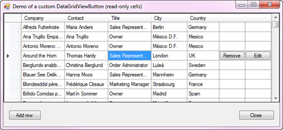
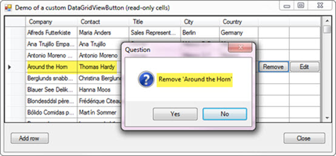
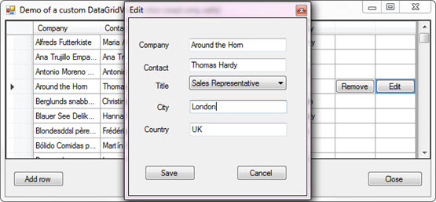
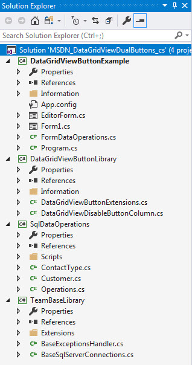
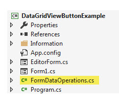

# DataGridView buttons (C#)
## Requires
- Visual Studio 2017
## License
- MIT
## Technologies
- C#
- SQL Server
- DataGridView
- Class Inheritance
- DataGridView Button Column
- DataGridViewButtonColumn
## Topics
- custom controls
- DataGridView
- Inheritance
- DataGridViewButtonColumn
- Building custom controls
## Updated
- 02/03/2018
## Description

<h1>Introduction</h1>

There is a standard DataGridViewButton column which when used will show the button on each row of the DataGridView. This code sample uses a custom DataGridViewButton column based off one found on the web which kind of worked
 but not fully along with not having a decent example for it. This code sample uses a modified version of the custom DataGridViewButton column in an example that is real life.

<h1>Building the Sample</h1>

Before running the project you must do the following. Run the script in SqlDataOperations project named CreateDatabaseAndData.sql which will create a database, two tables and populate the two tables.&nbsp; In TeamBaseLibrary,
 BaseSqlConnections.cs class change DatabaseServer private variable from KARENS-PC to the name of your SQL-Server instance or to .\SQLEXPRESS.

&nbsp;

Description

Before digging in lets peek at the resulting DataGridView. Note that there are two buttons, one for removal of the row and one for editing the current row.

I considered several ways to implement the above which requires subscribing to several events of the DataGridView.

UserDeletingRow so if the user wants to remove a row by clicking the column header, we want ful control so this was taken care of.

CellEnter and CellLeave needed attention. Both events handle showing/hiding the DataGridViewButton.

KeyDown, if not handled nothing would happen when the user pressed ENTER so this has been taken care of.

CellContentClick similar to KeyDown we need to add code to react to the user clicking either button.

Since we never want a user to remove a row without a prompt this has been taken care of also.

&nbsp;

Then there is editing the current row via the edit button.

Some like to edit right in their DataGridView which is perfectly fine yet that is not covered here as the focus is using the special DataGridView button column.

For both the remove and edit, I have stubbed out methods that perform no actions. If you study the code is will be easy to figure out what is needed in the stub methods.

If you press the remove button and press yes, the underlying data row is removed. If you press save on the edit form, the current row in the DataGridView is updated. As coded for edit, if there was an exception raised we rollback
 changes to the underlying DataRow via RejectChanges method.

Let's now look at the projects in the solution. For the beginner this may be overwhelming but with taking time to study the code and code flow this will be a great way to get away from coding data operations in your forms (there
 are no data operations in any of the two forms that touch the backend database).

<strong>DataGridViewButtonExample</strong> is a windows form project which is our view into the underlying database data.

<strong>DataGridViewButtonLibrary</strong>, this project contains the custom DataGridView button column and useful language extension methods. You would take this project and add it to your solution to gain access to the custom
 DataGridView column.

<strong>SqlOperations</strong>, this project is where all data operations are done, once you understand it you can modifiy it and add to any of your solutions for a repeatable way to work with data.

<strong>TeamBaseLibrary</strong> (SqlOperations requires this class project) provides a resuable pattern for creating connections to your SQL database along with inheriting another class for runtime exceptions. This project
 came about so that I had a repeatble way to write code samples. In my daily position as a developer we have generic abstract classes which do what these classes do and much more.

 

&nbsp;

<h1>Important notes:</h1>

As mentioned above there are several events that needed to be subscribed too. One idea would be to use a partial class for the form yet I went a different route which was to create a class (FormDataOperations) shown below.

Another point I should had made above is that I have code to handle remembering the current DataGridViewRow when sorting the DataGridView, this is included too.

&nbsp;

This makes good sense as we are not tied to a form.

&nbsp;

C#

Edit|Remove

csharp
<pre class="hidden">using DataGridViewButtonLibrary;
using SqlDataOperations;
using System.Collections.Generic;
using System.Data;
using System.Windows.Forms;
using TeamBaseLibrary;
using TeamBaseLibrary.Extensions;

namespace DataGridViewButtonExample
{
  public class FormDataOperations
  {
      /// &lt;summary&gt;
      /// Data operations reside here
      /// &lt;/summary&gt;
      public Operations Operations { get; set; }
      public BindingSource BindingSource { get; set; }
      public DataGridView DataGridView { get; set; }
      /// &lt;summary&gt;
      /// Name of the remove DataGridViewButton
      /// &lt;/summary&gt;
      public string RemoveButtonName { get; set; }
      /// &lt;summary&gt;
      /// Name of the edit DataGridViewButton
      /// &lt;/summary&gt;
      public string EditButtonName { get; set; }

      private List&lt;ContactType&gt; mContactList;
      public List&lt;ContactType&gt; ContactTypeList { get { return mContactList; } }

      public FormDataOperations()
      {
          Operations = new Operations();
      }
      public void LoadCustomers()
      {
          BindingSource = new BindingSource();
          BindingSource.DataSource = Operations.LoadCustomerData();
      }
      public void LoadContactTypes()
      {
          mContactList = Operations.LoadContactTypes();
      }

      public void SetReadOnlyColumns()
      {
          foreach (DataGridViewColumn column in DataGridView.Columns)
          {
              if (!column.IsA&lt;DataGridViewButtonColumn&gt;())
              {
                  column.ReadOnly = true;
              }
          }
      }
      public void SetColumnHeaders()
      {
          var dictCols = new Dictionary&lt;string, string&gt;()
          {
              {&quot;CompanyName&quot;,&quot;Company&quot; },
              {&quot;ContactName&quot;,&quot;Contact&quot; },
              {&quot;ContactTitle&quot;,&quot;Title&quot; }
          };

          foreach (KeyValuePair&lt;string,string&gt; item in dictCols)
          {
              DataGridView.Columns[item.Key].HeaderText = item.Value;
          }
      }
      public void UserDeletingRow(object sender, DataGridViewRowCancelEventArgs e)
      {
          if (KarenDialogs.Question($&quot;Remove '{BindingSource.CurrentRow().Field&lt;string&gt;(&quot;CompanyName&quot;)}'&quot;))
          {
              if (Operations.FakeRemoveCustomer(BindingSource.CurrentRow().Field&lt;int&gt;(&quot;CustomerIdentifier&quot;)))
              {
                  BindingSource.RemoveCurrent();
              }
          }
          else
          {
              e.Cancel = true;
          }
      }
      public void CellEnter(object sender, DataGridViewCellEventArgs e)
      {
          var dgv = ((DataGridView)sender);

          DataGridViewDisableButtonCell removeButtonCell = (DataGridViewDisableButtonCell)
              (dgv.Rows[e.RowIndex].Cells[RemoveButtonName]);
          DataGridViewDisableButtonCell editButtonCell = (DataGridViewDisableButtonCell)
              (dgv.Rows[e.RowIndex].Cells[EditButtonName]);

          removeButtonCell.Enabled = true;
          editButtonCell.Enabled = true;

          if (removeButtonCell.Value == null)
          {
              removeButtonCell.Value = RemoveButtonName;
          }

          if (editButtonCell.Value == null)
          {
              editButtonCell.Value = EditButtonName;
          }

          dgv.Invalidate();
      }

      public void CellLeave(object sender, DataGridViewCellEventArgs e)
      {
          var dgv = ((DataGridView)sender);
          DataGridViewDisableButtonCell removeButtonCell = (DataGridViewDisableButtonCell)
              (dgv.Rows[e.RowIndex].Cells[RemoveButtonName]);
          DataGridViewDisableButtonCell editButtonCell = (DataGridViewDisableButtonCell)
              (dgv.Rows[e.RowIndex].Cells[EditButtonName]);
          removeButtonCell.Enabled = false;
          editButtonCell.Enabled = false;
          dgv.Invalidate();
      }
      public void KeyDown(object sender, KeyEventArgs e)
      {
          if (e.KeyCode == Keys.Enter)
          {
              if (DataGridView.IsValidDataGridViewButton(RemoveButtonName) || 
                  DataGridView.IsValidDataGridViewButton(EditButtonName))
              {
                  var colName = DataGridView.Columns[DataGridView.CurrentCell.ColumnIndex].Name;
                  if (colName == RemoveButtonName)
                  {
                      PromptToRemoveCurrentRecordInDataGridViewFromBindingSource();
                      e.Handled = true;
                  }
                  else if (colName == EditButtonName)
                  {
                      EditCurrentRecoedInDataGridViewFromBindingSource();
                      e.Handled = true;
                  }
              }
          }
      }
      public void CellContentClick(object sender, DataGridViewCellEventArgs e)
      {

          if (DataGridView.IsHeaderButtonCell(e))
          {
              var colName = DataGridView.Columns[e.ColumnIndex].Name;
              if (colName == RemoveButtonName)
              {
                  PromptToRemoveCurrentRecordInDataGridViewFromBindingSource();
              }
              else if (colName == EditButtonName)
              {
                  EditCurrentRecoedInDataGridViewFromBindingSource();
              }

          }
      }
      public void PromptToRemoveCurrentRecordInDataGridViewFromBindingSource()
      {
          if (DataGridView.IsValidDataGridViewButton(RemoveButtonName))
          {
              if (KarenDialogs.Question($&quot;Remove '{BindingSource.CurrentRow().Field&lt;string&gt;(&quot;CompanyName&quot;)}'&quot;))
              {

                  if (Operations.FakeRemoveCustomer(BindingSource.CurrentRow().Field&lt;int&gt;(&quot;CustomerIdentifier&quot;)))
                  {
                      BindingSource.RemoveCurrent();
                  }
              }
          }
      }
      public void EditCurrentRecoedInDataGridViewFromBindingSource()
      {
          var row = BindingSource.CurrentRow();
          EditorForm f = new EditorForm(row, mContactList);
          try
          {
              if (f.ShowDialog() == DialogResult.OK)
              {
                  if (!Operations.FakeUpdateCustomer(row))
                  {
                      row.RejectChanges();
                      /*
                       * We landed here because there was an exception raised. Since
                       * the DataRow has been updated we use RejectChanges to undue
                       * the changes in our DataGridView.
                       */
                  }
                  else
                  {
                      /*
                       * Landing here means the DataRow has been updated in the
                       * DataGridView and the database table has been updated too.
                       */
                  }
              }
          }
          finally
          {
              f.Dispose();   
          }
      }
  }
}
</pre>

<pre class="js">using&nbsp;DataGridViewButtonLibrary;&nbsp;
using&nbsp;SqlDataOperations;&nbsp;
using&nbsp;System.Collections.Generic;&nbsp;
using&nbsp;System.Data;&nbsp;
using&nbsp;System.Windows.Forms;&nbsp;
using&nbsp;TeamBaseLibrary;&nbsp;
using&nbsp;TeamBaseLibrary.Extensions;&nbsp;
&nbsp;
namespace&nbsp;DataGridViewButtonExample&nbsp;
{&nbsp;
&nbsp;&nbsp;public&nbsp;class&nbsp;FormDataOperations&nbsp;
&nbsp;&nbsp;{&nbsp;
&nbsp;&nbsp;&nbsp;&nbsp;&nbsp;&nbsp;///&nbsp;&lt;summary&gt;&nbsp;
&nbsp;&nbsp;&nbsp;&nbsp;&nbsp;&nbsp;///&nbsp;Data&nbsp;operations&nbsp;reside&nbsp;here&nbsp;
&nbsp;&nbsp;&nbsp;&nbsp;&nbsp;&nbsp;///&nbsp;&lt;/summary&gt;&nbsp;
&nbsp;&nbsp;&nbsp;&nbsp;&nbsp;&nbsp;public&nbsp;Operations&nbsp;Operations&nbsp;{&nbsp;get;&nbsp;set;&nbsp;}&nbsp;
&nbsp;&nbsp;&nbsp;&nbsp;&nbsp;&nbsp;public&nbsp;BindingSource&nbsp;BindingSource&nbsp;{&nbsp;get;&nbsp;set;&nbsp;}&nbsp;
&nbsp;&nbsp;&nbsp;&nbsp;&nbsp;&nbsp;public&nbsp;DataGridView&nbsp;DataGridView&nbsp;{&nbsp;get;&nbsp;set;&nbsp;}&nbsp;
&nbsp;&nbsp;&nbsp;&nbsp;&nbsp;&nbsp;///&nbsp;&lt;summary&gt;&nbsp;
&nbsp;&nbsp;&nbsp;&nbsp;&nbsp;&nbsp;///&nbsp;Name&nbsp;of&nbsp;the&nbsp;remove&nbsp;DataGridViewButton&nbsp;
&nbsp;&nbsp;&nbsp;&nbsp;&nbsp;&nbsp;///&nbsp;&lt;/summary&gt;&nbsp;
&nbsp;&nbsp;&nbsp;&nbsp;&nbsp;&nbsp;public&nbsp;string&nbsp;RemoveButtonName&nbsp;{&nbsp;get;&nbsp;set;&nbsp;}&nbsp;
&nbsp;&nbsp;&nbsp;&nbsp;&nbsp;&nbsp;///&nbsp;&lt;summary&gt;&nbsp;
&nbsp;&nbsp;&nbsp;&nbsp;&nbsp;&nbsp;///&nbsp;Name&nbsp;of&nbsp;the&nbsp;edit&nbsp;DataGridViewButton&nbsp;
&nbsp;&nbsp;&nbsp;&nbsp;&nbsp;&nbsp;///&nbsp;&lt;/summary&gt;&nbsp;
&nbsp;&nbsp;&nbsp;&nbsp;&nbsp;&nbsp;public&nbsp;string&nbsp;EditButtonName&nbsp;{&nbsp;get;&nbsp;set;&nbsp;}&nbsp;
&nbsp;
&nbsp;&nbsp;&nbsp;&nbsp;&nbsp;&nbsp;private&nbsp;List&lt;ContactType&gt;&nbsp;mContactList;&nbsp;
&nbsp;&nbsp;&nbsp;&nbsp;&nbsp;&nbsp;public&nbsp;List&lt;ContactType&gt;&nbsp;ContactTypeList&nbsp;{&nbsp;get&nbsp;{&nbsp;return&nbsp;mContactList;&nbsp;}&nbsp;}&nbsp;
&nbsp;
&nbsp;&nbsp;&nbsp;&nbsp;&nbsp;&nbsp;public&nbsp;FormDataOperations()&nbsp;
&nbsp;&nbsp;&nbsp;&nbsp;&nbsp;&nbsp;{&nbsp;
&nbsp;&nbsp;&nbsp;&nbsp;&nbsp;&nbsp;&nbsp;&nbsp;&nbsp;&nbsp;Operations&nbsp;=&nbsp;new&nbsp;Operations();&nbsp;
&nbsp;&nbsp;&nbsp;&nbsp;&nbsp;&nbsp;}&nbsp;
&nbsp;&nbsp;&nbsp;&nbsp;&nbsp;&nbsp;public&nbsp;void&nbsp;LoadCustomers()&nbsp;
&nbsp;&nbsp;&nbsp;&nbsp;&nbsp;&nbsp;{&nbsp;
&nbsp;&nbsp;&nbsp;&nbsp;&nbsp;&nbsp;&nbsp;&nbsp;&nbsp;&nbsp;BindingSource&nbsp;=&nbsp;new&nbsp;BindingSource();&nbsp;
&nbsp;&nbsp;&nbsp;&nbsp;&nbsp;&nbsp;&nbsp;&nbsp;&nbsp;&nbsp;BindingSource.DataSource&nbsp;=&nbsp;Operations.LoadCustomerData();&nbsp;
&nbsp;&nbsp;&nbsp;&nbsp;&nbsp;&nbsp;}&nbsp;
&nbsp;&nbsp;&nbsp;&nbsp;&nbsp;&nbsp;public&nbsp;void&nbsp;LoadContactTypes()&nbsp;
&nbsp;&nbsp;&nbsp;&nbsp;&nbsp;&nbsp;{&nbsp;
&nbsp;&nbsp;&nbsp;&nbsp;&nbsp;&nbsp;&nbsp;&nbsp;&nbsp;&nbsp;mContactList&nbsp;=&nbsp;Operations.LoadContactTypes();&nbsp;
&nbsp;&nbsp;&nbsp;&nbsp;&nbsp;&nbsp;}&nbsp;
&nbsp;
&nbsp;&nbsp;&nbsp;&nbsp;&nbsp;&nbsp;public&nbsp;void&nbsp;SetReadOnlyColumns()&nbsp;
&nbsp;&nbsp;&nbsp;&nbsp;&nbsp;&nbsp;{&nbsp;
&nbsp;&nbsp;&nbsp;&nbsp;&nbsp;&nbsp;&nbsp;&nbsp;&nbsp;&nbsp;foreach&nbsp;(DataGridViewColumn&nbsp;column&nbsp;in&nbsp;DataGridView.Columns)&nbsp;
&nbsp;&nbsp;&nbsp;&nbsp;&nbsp;&nbsp;&nbsp;&nbsp;&nbsp;&nbsp;{&nbsp;
&nbsp;&nbsp;&nbsp;&nbsp;&nbsp;&nbsp;&nbsp;&nbsp;&nbsp;&nbsp;&nbsp;&nbsp;&nbsp;&nbsp;if&nbsp;(!column.IsA&lt;DataGridViewButtonColumn&gt;())&nbsp;
&nbsp;&nbsp;&nbsp;&nbsp;&nbsp;&nbsp;&nbsp;&nbsp;&nbsp;&nbsp;&nbsp;&nbsp;&nbsp;&nbsp;{&nbsp;
&nbsp;&nbsp;&nbsp;&nbsp;&nbsp;&nbsp;&nbsp;&nbsp;&nbsp;&nbsp;&nbsp;&nbsp;&nbsp;&nbsp;&nbsp;&nbsp;&nbsp;&nbsp;column.ReadOnly&nbsp;=&nbsp;true;&nbsp;
&nbsp;&nbsp;&nbsp;&nbsp;&nbsp;&nbsp;&nbsp;&nbsp;&nbsp;&nbsp;&nbsp;&nbsp;&nbsp;&nbsp;}&nbsp;
&nbsp;&nbsp;&nbsp;&nbsp;&nbsp;&nbsp;&nbsp;&nbsp;&nbsp;&nbsp;}&nbsp;
&nbsp;&nbsp;&nbsp;&nbsp;&nbsp;&nbsp;}&nbsp;
&nbsp;&nbsp;&nbsp;&nbsp;&nbsp;&nbsp;public&nbsp;void&nbsp;SetColumnHeaders()&nbsp;
&nbsp;&nbsp;&nbsp;&nbsp;&nbsp;&nbsp;{&nbsp;
&nbsp;&nbsp;&nbsp;&nbsp;&nbsp;&nbsp;&nbsp;&nbsp;&nbsp;&nbsp;var&nbsp;dictCols&nbsp;=&nbsp;new&nbsp;Dictionary&lt;string,&nbsp;string&gt;()&nbsp;
&nbsp;&nbsp;&nbsp;&nbsp;&nbsp;&nbsp;&nbsp;&nbsp;&nbsp;&nbsp;{&nbsp;
&nbsp;&nbsp;&nbsp;&nbsp;&nbsp;&nbsp;&nbsp;&nbsp;&nbsp;&nbsp;&nbsp;&nbsp;&nbsp;&nbsp;{&quot;CompanyName&quot;,&quot;Company&quot;&nbsp;},&nbsp;
&nbsp;&nbsp;&nbsp;&nbsp;&nbsp;&nbsp;&nbsp;&nbsp;&nbsp;&nbsp;&nbsp;&nbsp;&nbsp;&nbsp;{&quot;ContactName&quot;,&quot;Contact&quot;&nbsp;},&nbsp;
&nbsp;&nbsp;&nbsp;&nbsp;&nbsp;&nbsp;&nbsp;&nbsp;&nbsp;&nbsp;&nbsp;&nbsp;&nbsp;&nbsp;{&quot;ContactTitle&quot;,&quot;Title&quot;&nbsp;}&nbsp;
&nbsp;&nbsp;&nbsp;&nbsp;&nbsp;&nbsp;&nbsp;&nbsp;&nbsp;&nbsp;};&nbsp;
&nbsp;
&nbsp;&nbsp;&nbsp;&nbsp;&nbsp;&nbsp;&nbsp;&nbsp;&nbsp;&nbsp;foreach&nbsp;(KeyValuePair&lt;string,string&gt;&nbsp;item&nbsp;in&nbsp;dictCols)&nbsp;
&nbsp;&nbsp;&nbsp;&nbsp;&nbsp;&nbsp;&nbsp;&nbsp;&nbsp;&nbsp;{&nbsp;
&nbsp;&nbsp;&nbsp;&nbsp;&nbsp;&nbsp;&nbsp;&nbsp;&nbsp;&nbsp;&nbsp;&nbsp;&nbsp;&nbsp;DataGridView.Columns[item.Key].HeaderText&nbsp;=&nbsp;item.Value;&nbsp;
&nbsp;&nbsp;&nbsp;&nbsp;&nbsp;&nbsp;&nbsp;&nbsp;&nbsp;&nbsp;}&nbsp;
&nbsp;&nbsp;&nbsp;&nbsp;&nbsp;&nbsp;}&nbsp;
&nbsp;&nbsp;&nbsp;&nbsp;&nbsp;&nbsp;public&nbsp;void&nbsp;UserDeletingRow(object&nbsp;sender,&nbsp;DataGridViewRowCancelEventArgs&nbsp;e)&nbsp;
&nbsp;&nbsp;&nbsp;&nbsp;&nbsp;&nbsp;{&nbsp;
&nbsp;&nbsp;&nbsp;&nbsp;&nbsp;&nbsp;&nbsp;&nbsp;&nbsp;&nbsp;if&nbsp;(KarenDialogs.Question($&quot;Remove&nbsp;'{BindingSource.CurrentRow().Field&lt;string&gt;(&quot;CompanyName&quot;)}'&quot;))&nbsp;
&nbsp;&nbsp;&nbsp;&nbsp;&nbsp;&nbsp;&nbsp;&nbsp;&nbsp;&nbsp;{&nbsp;
&nbsp;&nbsp;&nbsp;&nbsp;&nbsp;&nbsp;&nbsp;&nbsp;&nbsp;&nbsp;&nbsp;&nbsp;&nbsp;&nbsp;if&nbsp;(Operations.FakeRemoveCustomer(BindingSource.CurrentRow().Field&lt;int&gt;(&quot;CustomerIdentifier&quot;)))&nbsp;
&nbsp;&nbsp;&nbsp;&nbsp;&nbsp;&nbsp;&nbsp;&nbsp;&nbsp;&nbsp;&nbsp;&nbsp;&nbsp;&nbsp;{&nbsp;
&nbsp;&nbsp;&nbsp;&nbsp;&nbsp;&nbsp;&nbsp;&nbsp;&nbsp;&nbsp;&nbsp;&nbsp;&nbsp;&nbsp;&nbsp;&nbsp;&nbsp;&nbsp;BindingSource.RemoveCurrent();&nbsp;
&nbsp;&nbsp;&nbsp;&nbsp;&nbsp;&nbsp;&nbsp;&nbsp;&nbsp;&nbsp;&nbsp;&nbsp;&nbsp;&nbsp;}&nbsp;
&nbsp;&nbsp;&nbsp;&nbsp;&nbsp;&nbsp;&nbsp;&nbsp;&nbsp;&nbsp;}&nbsp;
&nbsp;&nbsp;&nbsp;&nbsp;&nbsp;&nbsp;&nbsp;&nbsp;&nbsp;&nbsp;else&nbsp;
&nbsp;&nbsp;&nbsp;&nbsp;&nbsp;&nbsp;&nbsp;&nbsp;&nbsp;&nbsp;{&nbsp;
&nbsp;&nbsp;&nbsp;&nbsp;&nbsp;&nbsp;&nbsp;&nbsp;&nbsp;&nbsp;&nbsp;&nbsp;&nbsp;&nbsp;e.Cancel&nbsp;=&nbsp;true;&nbsp;
&nbsp;&nbsp;&nbsp;&nbsp;&nbsp;&nbsp;&nbsp;&nbsp;&nbsp;&nbsp;}&nbsp;
&nbsp;&nbsp;&nbsp;&nbsp;&nbsp;&nbsp;}&nbsp;
&nbsp;&nbsp;&nbsp;&nbsp;&nbsp;&nbsp;public&nbsp;void&nbsp;CellEnter(object&nbsp;sender,&nbsp;DataGridViewCellEventArgs&nbsp;e)&nbsp;
&nbsp;&nbsp;&nbsp;&nbsp;&nbsp;&nbsp;{&nbsp;
&nbsp;&nbsp;&nbsp;&nbsp;&nbsp;&nbsp;&nbsp;&nbsp;&nbsp;&nbsp;var&nbsp;dgv&nbsp;=&nbsp;((DataGridView)sender);&nbsp;
&nbsp;
&nbsp;&nbsp;&nbsp;&nbsp;&nbsp;&nbsp;&nbsp;&nbsp;&nbsp;&nbsp;DataGridViewDisableButtonCell&nbsp;removeButtonCell&nbsp;=&nbsp;(DataGridViewDisableButtonCell)&nbsp;
&nbsp;&nbsp;&nbsp;&nbsp;&nbsp;&nbsp;&nbsp;&nbsp;&nbsp;&nbsp;&nbsp;&nbsp;&nbsp;&nbsp;(dgv.Rows[e.RowIndex].Cells[RemoveButtonName]);&nbsp;
&nbsp;&nbsp;&nbsp;&nbsp;&nbsp;&nbsp;&nbsp;&nbsp;&nbsp;&nbsp;DataGridViewDisableButtonCell&nbsp;editButtonCell&nbsp;=&nbsp;(DataGridViewDisableButtonCell)&nbsp;
&nbsp;&nbsp;&nbsp;&nbsp;&nbsp;&nbsp;&nbsp;&nbsp;&nbsp;&nbsp;&nbsp;&nbsp;&nbsp;&nbsp;(dgv.Rows[e.RowIndex].Cells[EditButtonName]);&nbsp;
&nbsp;
&nbsp;&nbsp;&nbsp;&nbsp;&nbsp;&nbsp;&nbsp;&nbsp;&nbsp;&nbsp;removeButtonCell.Enabled&nbsp;=&nbsp;true;&nbsp;
&nbsp;&nbsp;&nbsp;&nbsp;&nbsp;&nbsp;&nbsp;&nbsp;&nbsp;&nbsp;editButtonCell.Enabled&nbsp;=&nbsp;true;&nbsp;
&nbsp;
&nbsp;&nbsp;&nbsp;&nbsp;&nbsp;&nbsp;&nbsp;&nbsp;&nbsp;&nbsp;if&nbsp;(removeButtonCell.Value&nbsp;==&nbsp;null)&nbsp;
&nbsp;&nbsp;&nbsp;&nbsp;&nbsp;&nbsp;&nbsp;&nbsp;&nbsp;&nbsp;{&nbsp;
&nbsp;&nbsp;&nbsp;&nbsp;&nbsp;&nbsp;&nbsp;&nbsp;&nbsp;&nbsp;&nbsp;&nbsp;&nbsp;&nbsp;removeButtonCell.Value&nbsp;=&nbsp;RemoveButtonName;&nbsp;
&nbsp;&nbsp;&nbsp;&nbsp;&nbsp;&nbsp;&nbsp;&nbsp;&nbsp;&nbsp;}&nbsp;
&nbsp;
&nbsp;&nbsp;&nbsp;&nbsp;&nbsp;&nbsp;&nbsp;&nbsp;&nbsp;&nbsp;if&nbsp;(editButtonCell.Value&nbsp;==&nbsp;null)&nbsp;
&nbsp;&nbsp;&nbsp;&nbsp;&nbsp;&nbsp;&nbsp;&nbsp;&nbsp;&nbsp;{&nbsp;
&nbsp;&nbsp;&nbsp;&nbsp;&nbsp;&nbsp;&nbsp;&nbsp;&nbsp;&nbsp;&nbsp;&nbsp;&nbsp;&nbsp;editButtonCell.Value&nbsp;=&nbsp;EditButtonName;&nbsp;
&nbsp;&nbsp;&nbsp;&nbsp;&nbsp;&nbsp;&nbsp;&nbsp;&nbsp;&nbsp;}&nbsp;
&nbsp;
&nbsp;&nbsp;&nbsp;&nbsp;&nbsp;&nbsp;&nbsp;&nbsp;&nbsp;&nbsp;dgv.Invalidate();&nbsp;
&nbsp;&nbsp;&nbsp;&nbsp;&nbsp;&nbsp;}&nbsp;
&nbsp;
&nbsp;&nbsp;&nbsp;&nbsp;&nbsp;&nbsp;public&nbsp;void&nbsp;CellLeave(object&nbsp;sender,&nbsp;DataGridViewCellEventArgs&nbsp;e)&nbsp;
&nbsp;&nbsp;&nbsp;&nbsp;&nbsp;&nbsp;{&nbsp;
&nbsp;&nbsp;&nbsp;&nbsp;&nbsp;&nbsp;&nbsp;&nbsp;&nbsp;&nbsp;var&nbsp;dgv&nbsp;=&nbsp;((DataGridView)sender);&nbsp;
&nbsp;&nbsp;&nbsp;&nbsp;&nbsp;&nbsp;&nbsp;&nbsp;&nbsp;&nbsp;DataGridViewDisableButtonCell&nbsp;removeButtonCell&nbsp;=&nbsp;(DataGridViewDisableButtonCell)&nbsp;
&nbsp;&nbsp;&nbsp;&nbsp;&nbsp;&nbsp;&nbsp;&nbsp;&nbsp;&nbsp;&nbsp;&nbsp;&nbsp;&nbsp;(dgv.Rows[e.RowIndex].Cells[RemoveButtonName]);&nbsp;
&nbsp;&nbsp;&nbsp;&nbsp;&nbsp;&nbsp;&nbsp;&nbsp;&nbsp;&nbsp;DataGridViewDisableButtonCell&nbsp;editButtonCell&nbsp;=&nbsp;(DataGridViewDisableButtonCell)&nbsp;
&nbsp;&nbsp;&nbsp;&nbsp;&nbsp;&nbsp;&nbsp;&nbsp;&nbsp;&nbsp;&nbsp;&nbsp;&nbsp;&nbsp;(dgv.Rows[e.RowIndex].Cells[EditButtonName]);&nbsp;
&nbsp;&nbsp;&nbsp;&nbsp;&nbsp;&nbsp;&nbsp;&nbsp;&nbsp;&nbsp;removeButtonCell.Enabled&nbsp;=&nbsp;false;&nbsp;
&nbsp;&nbsp;&nbsp;&nbsp;&nbsp;&nbsp;&nbsp;&nbsp;&nbsp;&nbsp;editButtonCell.Enabled&nbsp;=&nbsp;false;&nbsp;
&nbsp;&nbsp;&nbsp;&nbsp;&nbsp;&nbsp;&nbsp;&nbsp;&nbsp;&nbsp;dgv.Invalidate();&nbsp;
&nbsp;&nbsp;&nbsp;&nbsp;&nbsp;&nbsp;}&nbsp;
&nbsp;&nbsp;&nbsp;&nbsp;&nbsp;&nbsp;public&nbsp;void&nbsp;KeyDown(object&nbsp;sender,&nbsp;KeyEventArgs&nbsp;e)&nbsp;
&nbsp;&nbsp;&nbsp;&nbsp;&nbsp;&nbsp;{&nbsp;
&nbsp;&nbsp;&nbsp;&nbsp;&nbsp;&nbsp;&nbsp;&nbsp;&nbsp;&nbsp;if&nbsp;(e.KeyCode&nbsp;==&nbsp;Keys.Enter)&nbsp;
&nbsp;&nbsp;&nbsp;&nbsp;&nbsp;&nbsp;&nbsp;&nbsp;&nbsp;&nbsp;{&nbsp;
&nbsp;&nbsp;&nbsp;&nbsp;&nbsp;&nbsp;&nbsp;&nbsp;&nbsp;&nbsp;&nbsp;&nbsp;&nbsp;&nbsp;if&nbsp;(DataGridView.IsValidDataGridViewButton(RemoveButtonName)&nbsp;||&nbsp;&nbsp;
&nbsp;&nbsp;&nbsp;&nbsp;&nbsp;&nbsp;&nbsp;&nbsp;&nbsp;&nbsp;&nbsp;&nbsp;&nbsp;&nbsp;&nbsp;&nbsp;&nbsp;&nbsp;DataGridView.IsValidDataGridViewButton(EditButtonName))&nbsp;
&nbsp;&nbsp;&nbsp;&nbsp;&nbsp;&nbsp;&nbsp;&nbsp;&nbsp;&nbsp;&nbsp;&nbsp;&nbsp;&nbsp;{&nbsp;
&nbsp;&nbsp;&nbsp;&nbsp;&nbsp;&nbsp;&nbsp;&nbsp;&nbsp;&nbsp;&nbsp;&nbsp;&nbsp;&nbsp;&nbsp;&nbsp;&nbsp;&nbsp;var&nbsp;colName&nbsp;=&nbsp;DataGridView.Columns[DataGridView.CurrentCell.ColumnIndex].Name;&nbsp;
&nbsp;&nbsp;&nbsp;&nbsp;&nbsp;&nbsp;&nbsp;&nbsp;&nbsp;&nbsp;&nbsp;&nbsp;&nbsp;&nbsp;&nbsp;&nbsp;&nbsp;&nbsp;if&nbsp;(colName&nbsp;==&nbsp;RemoveButtonName)&nbsp;
&nbsp;&nbsp;&nbsp;&nbsp;&nbsp;&nbsp;&nbsp;&nbsp;&nbsp;&nbsp;&nbsp;&nbsp;&nbsp;&nbsp;&nbsp;&nbsp;&nbsp;&nbsp;{&nbsp;
&nbsp;&nbsp;&nbsp;&nbsp;&nbsp;&nbsp;&nbsp;&nbsp;&nbsp;&nbsp;&nbsp;&nbsp;&nbsp;&nbsp;&nbsp;&nbsp;&nbsp;&nbsp;&nbsp;&nbsp;&nbsp;&nbsp;PromptToRemoveCurrentRecordInDataGridViewFromBindingSource();&nbsp;
&nbsp;&nbsp;&nbsp;&nbsp;&nbsp;&nbsp;&nbsp;&nbsp;&nbsp;&nbsp;&nbsp;&nbsp;&nbsp;&nbsp;&nbsp;&nbsp;&nbsp;&nbsp;&nbsp;&nbsp;&nbsp;&nbsp;e.Handled&nbsp;=&nbsp;true;&nbsp;
&nbsp;&nbsp;&nbsp;&nbsp;&nbsp;&nbsp;&nbsp;&nbsp;&nbsp;&nbsp;&nbsp;&nbsp;&nbsp;&nbsp;&nbsp;&nbsp;&nbsp;&nbsp;}&nbsp;
&nbsp;&nbsp;&nbsp;&nbsp;&nbsp;&nbsp;&nbsp;&nbsp;&nbsp;&nbsp;&nbsp;&nbsp;&nbsp;&nbsp;&nbsp;&nbsp;&nbsp;&nbsp;else&nbsp;if&nbsp;(colName&nbsp;==&nbsp;EditButtonName)&nbsp;
&nbsp;&nbsp;&nbsp;&nbsp;&nbsp;&nbsp;&nbsp;&nbsp;&nbsp;&nbsp;&nbsp;&nbsp;&nbsp;&nbsp;&nbsp;&nbsp;&nbsp;&nbsp;{&nbsp;
&nbsp;&nbsp;&nbsp;&nbsp;&nbsp;&nbsp;&nbsp;&nbsp;&nbsp;&nbsp;&nbsp;&nbsp;&nbsp;&nbsp;&nbsp;&nbsp;&nbsp;&nbsp;&nbsp;&nbsp;&nbsp;&nbsp;EditCurrentRecoedInDataGridViewFromBindingSource();&nbsp;
&nbsp;&nbsp;&nbsp;&nbsp;&nbsp;&nbsp;&nbsp;&nbsp;&nbsp;&nbsp;&nbsp;&nbsp;&nbsp;&nbsp;&nbsp;&nbsp;&nbsp;&nbsp;&nbsp;&nbsp;&nbsp;&nbsp;e.Handled&nbsp;=&nbsp;true;&nbsp;
&nbsp;&nbsp;&nbsp;&nbsp;&nbsp;&nbsp;&nbsp;&nbsp;&nbsp;&nbsp;&nbsp;&nbsp;&nbsp;&nbsp;&nbsp;&nbsp;&nbsp;&nbsp;}&nbsp;
&nbsp;&nbsp;&nbsp;&nbsp;&nbsp;&nbsp;&nbsp;&nbsp;&nbsp;&nbsp;&nbsp;&nbsp;&nbsp;&nbsp;}&nbsp;
&nbsp;&nbsp;&nbsp;&nbsp;&nbsp;&nbsp;&nbsp;&nbsp;&nbsp;&nbsp;}&nbsp;
&nbsp;&nbsp;&nbsp;&nbsp;&nbsp;&nbsp;}&nbsp;
&nbsp;&nbsp;&nbsp;&nbsp;&nbsp;&nbsp;public&nbsp;void&nbsp;CellContentClick(object&nbsp;sender,&nbsp;DataGridViewCellEventArgs&nbsp;e)&nbsp;
&nbsp;&nbsp;&nbsp;&nbsp;&nbsp;&nbsp;{&nbsp;
&nbsp;
&nbsp;&nbsp;&nbsp;&nbsp;&nbsp;&nbsp;&nbsp;&nbsp;&nbsp;&nbsp;if&nbsp;(DataGridView.IsHeaderButtonCell(e))&nbsp;
&nbsp;&nbsp;&nbsp;&nbsp;&nbsp;&nbsp;&nbsp;&nbsp;&nbsp;&nbsp;{&nbsp;
&nbsp;&nbsp;&nbsp;&nbsp;&nbsp;&nbsp;&nbsp;&nbsp;&nbsp;&nbsp;&nbsp;&nbsp;&nbsp;&nbsp;var&nbsp;colName&nbsp;=&nbsp;DataGridView.Columns[e.ColumnIndex].Name;&nbsp;
&nbsp;&nbsp;&nbsp;&nbsp;&nbsp;&nbsp;&nbsp;&nbsp;&nbsp;&nbsp;&nbsp;&nbsp;&nbsp;&nbsp;if&nbsp;(colName&nbsp;==&nbsp;RemoveButtonName)&nbsp;
&nbsp;&nbsp;&nbsp;&nbsp;&nbsp;&nbsp;&nbsp;&nbsp;&nbsp;&nbsp;&nbsp;&nbsp;&nbsp;&nbsp;{&nbsp;
&nbsp;&nbsp;&nbsp;&nbsp;&nbsp;&nbsp;&nbsp;&nbsp;&nbsp;&nbsp;&nbsp;&nbsp;&nbsp;&nbsp;&nbsp;&nbsp;&nbsp;&nbsp;PromptToRemoveCurrentRecordInDataGridViewFromBindingSource();&nbsp;
&nbsp;&nbsp;&nbsp;&nbsp;&nbsp;&nbsp;&nbsp;&nbsp;&nbsp;&nbsp;&nbsp;&nbsp;&nbsp;&nbsp;}&nbsp;
&nbsp;&nbsp;&nbsp;&nbsp;&nbsp;&nbsp;&nbsp;&nbsp;&nbsp;&nbsp;&nbsp;&nbsp;&nbsp;&nbsp;else&nbsp;if&nbsp;(colName&nbsp;==&nbsp;EditButtonName)&nbsp;
&nbsp;&nbsp;&nbsp;&nbsp;&nbsp;&nbsp;&nbsp;&nbsp;&nbsp;&nbsp;&nbsp;&nbsp;&nbsp;&nbsp;{&nbsp;
&nbsp;&nbsp;&nbsp;&nbsp;&nbsp;&nbsp;&nbsp;&nbsp;&nbsp;&nbsp;&nbsp;&nbsp;&nbsp;&nbsp;&nbsp;&nbsp;&nbsp;&nbsp;EditCurrentRecoedInDataGridViewFromBindingSource();&nbsp;
&nbsp;&nbsp;&nbsp;&nbsp;&nbsp;&nbsp;&nbsp;&nbsp;&nbsp;&nbsp;&nbsp;&nbsp;&nbsp;&nbsp;}&nbsp;
&nbsp;
&nbsp;&nbsp;&nbsp;&nbsp;&nbsp;&nbsp;&nbsp;&nbsp;&nbsp;&nbsp;}&nbsp;
&nbsp;&nbsp;&nbsp;&nbsp;&nbsp;&nbsp;}&nbsp;
&nbsp;&nbsp;&nbsp;&nbsp;&nbsp;&nbsp;public&nbsp;void&nbsp;PromptToRemoveCurrentRecordInDataGridViewFromBindingSource()&nbsp;
&nbsp;&nbsp;&nbsp;&nbsp;&nbsp;&nbsp;{&nbsp;
&nbsp;&nbsp;&nbsp;&nbsp;&nbsp;&nbsp;&nbsp;&nbsp;&nbsp;&nbsp;if&nbsp;(DataGridView.IsValidDataGridViewButton(RemoveButtonName))&nbsp;
&nbsp;&nbsp;&nbsp;&nbsp;&nbsp;&nbsp;&nbsp;&nbsp;&nbsp;&nbsp;{&nbsp;
&nbsp;&nbsp;&nbsp;&nbsp;&nbsp;&nbsp;&nbsp;&nbsp;&nbsp;&nbsp;&nbsp;&nbsp;&nbsp;&nbsp;if&nbsp;(KarenDialogs.Question($&quot;Remove&nbsp;'{BindingSource.CurrentRow().Field&lt;string&gt;(&quot;CompanyName&quot;)}'&quot;))&nbsp;
&nbsp;&nbsp;&nbsp;&nbsp;&nbsp;&nbsp;&nbsp;&nbsp;&nbsp;&nbsp;&nbsp;&nbsp;&nbsp;&nbsp;{&nbsp;
&nbsp;
&nbsp;&nbsp;&nbsp;&nbsp;&nbsp;&nbsp;&nbsp;&nbsp;&nbsp;&nbsp;&nbsp;&nbsp;&nbsp;&nbsp;&nbsp;&nbsp;&nbsp;&nbsp;if&nbsp;(Operations.FakeRemoveCustomer(BindingSource.CurrentRow().Field&lt;int&gt;(&quot;CustomerIdentifier&quot;)))&nbsp;
&nbsp;&nbsp;&nbsp;&nbsp;&nbsp;&nbsp;&nbsp;&nbsp;&nbsp;&nbsp;&nbsp;&nbsp;&nbsp;&nbsp;&nbsp;&nbsp;&nbsp;&nbsp;{&nbsp;
&nbsp;&nbsp;&nbsp;&nbsp;&nbsp;&nbsp;&nbsp;&nbsp;&nbsp;&nbsp;&nbsp;&nbsp;&nbsp;&nbsp;&nbsp;&nbsp;&nbsp;&nbsp;&nbsp;&nbsp;&nbsp;&nbsp;BindingSource.RemoveCurrent();&nbsp;
&nbsp;&nbsp;&nbsp;&nbsp;&nbsp;&nbsp;&nbsp;&nbsp;&nbsp;&nbsp;&nbsp;&nbsp;&nbsp;&nbsp;&nbsp;&nbsp;&nbsp;&nbsp;}&nbsp;
&nbsp;&nbsp;&nbsp;&nbsp;&nbsp;&nbsp;&nbsp;&nbsp;&nbsp;&nbsp;&nbsp;&nbsp;&nbsp;&nbsp;}&nbsp;
&nbsp;&nbsp;&nbsp;&nbsp;&nbsp;&nbsp;&nbsp;&nbsp;&nbsp;&nbsp;}&nbsp;
&nbsp;&nbsp;&nbsp;&nbsp;&nbsp;&nbsp;}&nbsp;
&nbsp;&nbsp;&nbsp;&nbsp;&nbsp;&nbsp;public&nbsp;void&nbsp;EditCurrentRecoedInDataGridViewFromBindingSource()&nbsp;
&nbsp;&nbsp;&nbsp;&nbsp;&nbsp;&nbsp;{&nbsp;
&nbsp;&nbsp;&nbsp;&nbsp;&nbsp;&nbsp;&nbsp;&nbsp;&nbsp;&nbsp;var&nbsp;row&nbsp;=&nbsp;BindingSource.CurrentRow();&nbsp;
&nbsp;&nbsp;&nbsp;&nbsp;&nbsp;&nbsp;&nbsp;&nbsp;&nbsp;&nbsp;EditorForm&nbsp;f&nbsp;=&nbsp;new&nbsp;EditorForm(row,&nbsp;mContactList);&nbsp;
&nbsp;&nbsp;&nbsp;&nbsp;&nbsp;&nbsp;&nbsp;&nbsp;&nbsp;&nbsp;try&nbsp;
&nbsp;&nbsp;&nbsp;&nbsp;&nbsp;&nbsp;&nbsp;&nbsp;&nbsp;&nbsp;{&nbsp;
&nbsp;&nbsp;&nbsp;&nbsp;&nbsp;&nbsp;&nbsp;&nbsp;&nbsp;&nbsp;&nbsp;&nbsp;&nbsp;&nbsp;if&nbsp;(f.ShowDialog()&nbsp;==&nbsp;DialogResult.OK)&nbsp;
&nbsp;&nbsp;&nbsp;&nbsp;&nbsp;&nbsp;&nbsp;&nbsp;&nbsp;&nbsp;&nbsp;&nbsp;&nbsp;&nbsp;{&nbsp;
&nbsp;&nbsp;&nbsp;&nbsp;&nbsp;&nbsp;&nbsp;&nbsp;&nbsp;&nbsp;&nbsp;&nbsp;&nbsp;&nbsp;&nbsp;&nbsp;&nbsp;&nbsp;if&nbsp;(!Operations.FakeUpdateCustomer(row))&nbsp;
&nbsp;&nbsp;&nbsp;&nbsp;&nbsp;&nbsp;&nbsp;&nbsp;&nbsp;&nbsp;&nbsp;&nbsp;&nbsp;&nbsp;&nbsp;&nbsp;&nbsp;&nbsp;{&nbsp;
&nbsp;&nbsp;&nbsp;&nbsp;&nbsp;&nbsp;&nbsp;&nbsp;&nbsp;&nbsp;&nbsp;&nbsp;&nbsp;&nbsp;&nbsp;&nbsp;&nbsp;&nbsp;&nbsp;&nbsp;&nbsp;&nbsp;row.RejectChanges();&nbsp;
&nbsp;&nbsp;&nbsp;&nbsp;&nbsp;&nbsp;&nbsp;&nbsp;&nbsp;&nbsp;&nbsp;&nbsp;&nbsp;&nbsp;&nbsp;&nbsp;&nbsp;&nbsp;&nbsp;&nbsp;&nbsp;&nbsp;/*&nbsp;
&nbsp;&nbsp;&nbsp;&nbsp;&nbsp;&nbsp;&nbsp;&nbsp;&nbsp;&nbsp;&nbsp;&nbsp;&nbsp;&nbsp;&nbsp;&nbsp;&nbsp;&nbsp;&nbsp;&nbsp;&nbsp;&nbsp;&nbsp;*&nbsp;We&nbsp;landed&nbsp;here&nbsp;because&nbsp;there&nbsp;was&nbsp;an&nbsp;exception&nbsp;raised.&nbsp;Since&nbsp;
&nbsp;&nbsp;&nbsp;&nbsp;&nbsp;&nbsp;&nbsp;&nbsp;&nbsp;&nbsp;&nbsp;&nbsp;&nbsp;&nbsp;&nbsp;&nbsp;&nbsp;&nbsp;&nbsp;&nbsp;&nbsp;&nbsp;&nbsp;*&nbsp;the&nbsp;DataRow&nbsp;has&nbsp;been&nbsp;updated&nbsp;we&nbsp;use&nbsp;RejectChanges&nbsp;to&nbsp;undue&nbsp;
&nbsp;&nbsp;&nbsp;&nbsp;&nbsp;&nbsp;&nbsp;&nbsp;&nbsp;&nbsp;&nbsp;&nbsp;&nbsp;&nbsp;&nbsp;&nbsp;&nbsp;&nbsp;&nbsp;&nbsp;&nbsp;&nbsp;&nbsp;*&nbsp;the&nbsp;changes&nbsp;in&nbsp;our&nbsp;DataGridView.&nbsp;
&nbsp;&nbsp;&nbsp;&nbsp;&nbsp;&nbsp;&nbsp;&nbsp;&nbsp;&nbsp;&nbsp;&nbsp;&nbsp;&nbsp;&nbsp;&nbsp;&nbsp;&nbsp;&nbsp;&nbsp;&nbsp;&nbsp;&nbsp;*/&nbsp;
&nbsp;&nbsp;&nbsp;&nbsp;&nbsp;&nbsp;&nbsp;&nbsp;&nbsp;&nbsp;&nbsp;&nbsp;&nbsp;&nbsp;&nbsp;&nbsp;&nbsp;&nbsp;}&nbsp;
&nbsp;&nbsp;&nbsp;&nbsp;&nbsp;&nbsp;&nbsp;&nbsp;&nbsp;&nbsp;&nbsp;&nbsp;&nbsp;&nbsp;&nbsp;&nbsp;&nbsp;&nbsp;else&nbsp;
&nbsp;&nbsp;&nbsp;&nbsp;&nbsp;&nbsp;&nbsp;&nbsp;&nbsp;&nbsp;&nbsp;&nbsp;&nbsp;&nbsp;&nbsp;&nbsp;&nbsp;&nbsp;{&nbsp;
&nbsp;&nbsp;&nbsp;&nbsp;&nbsp;&nbsp;&nbsp;&nbsp;&nbsp;&nbsp;&nbsp;&nbsp;&nbsp;&nbsp;&nbsp;&nbsp;&nbsp;&nbsp;&nbsp;&nbsp;&nbsp;&nbsp;/*&nbsp;
&nbsp;&nbsp;&nbsp;&nbsp;&nbsp;&nbsp;&nbsp;&nbsp;&nbsp;&nbsp;&nbsp;&nbsp;&nbsp;&nbsp;&nbsp;&nbsp;&nbsp;&nbsp;&nbsp;&nbsp;&nbsp;&nbsp;&nbsp;*&nbsp;Landing&nbsp;here&nbsp;means&nbsp;the&nbsp;DataRow&nbsp;has&nbsp;been&nbsp;updated&nbsp;in&nbsp;the&nbsp;
&nbsp;&nbsp;&nbsp;&nbsp;&nbsp;&nbsp;&nbsp;&nbsp;&nbsp;&nbsp;&nbsp;&nbsp;&nbsp;&nbsp;&nbsp;&nbsp;&nbsp;&nbsp;&nbsp;&nbsp;&nbsp;&nbsp;&nbsp;*&nbsp;DataGridView&nbsp;and&nbsp;the&nbsp;database&nbsp;table&nbsp;has&nbsp;been&nbsp;updated&nbsp;too.&nbsp;
&nbsp;&nbsp;&nbsp;&nbsp;&nbsp;&nbsp;&nbsp;&nbsp;&nbsp;&nbsp;&nbsp;&nbsp;&nbsp;&nbsp;&nbsp;&nbsp;&nbsp;&nbsp;&nbsp;&nbsp;&nbsp;&nbsp;&nbsp;*/&nbsp;
&nbsp;&nbsp;&nbsp;&nbsp;&nbsp;&nbsp;&nbsp;&nbsp;&nbsp;&nbsp;&nbsp;&nbsp;&nbsp;&nbsp;&nbsp;&nbsp;&nbsp;&nbsp;}&nbsp;
&nbsp;&nbsp;&nbsp;&nbsp;&nbsp;&nbsp;&nbsp;&nbsp;&nbsp;&nbsp;&nbsp;&nbsp;&nbsp;&nbsp;}&nbsp;
&nbsp;&nbsp;&nbsp;&nbsp;&nbsp;&nbsp;&nbsp;&nbsp;&nbsp;&nbsp;}&nbsp;
&nbsp;&nbsp;&nbsp;&nbsp;&nbsp;&nbsp;&nbsp;&nbsp;&nbsp;&nbsp;finally&nbsp;
&nbsp;&nbsp;&nbsp;&nbsp;&nbsp;&nbsp;&nbsp;&nbsp;&nbsp;&nbsp;{&nbsp;
&nbsp;&nbsp;&nbsp;&nbsp;&nbsp;&nbsp;&nbsp;&nbsp;&nbsp;&nbsp;&nbsp;&nbsp;&nbsp;&nbsp;f.Dispose();&nbsp;&nbsp;&nbsp;&nbsp;
&nbsp;&nbsp;&nbsp;&nbsp;&nbsp;&nbsp;&nbsp;&nbsp;&nbsp;&nbsp;}&nbsp;
&nbsp;&nbsp;&nbsp;&nbsp;&nbsp;&nbsp;}&nbsp;
&nbsp;&nbsp;}&nbsp;
}&nbsp;
</pre>

&nbsp;

In closing, this is not a drop into your project and use solution for adding a DataGridViewButton or more to your DataGridView but instead must study the code presented to understand and then once this is done you can utilize this in your project. The only
 other way is to purchase a third party DataGridView that offers butons only shown per current row.

&nbsp;

 

 

 

 

