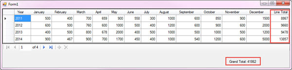

# DataGridView calculating row totals and grand totals
## Requires
- Visual Studio 2013
## License
- MIT
## Technologies
- Windows Forms
- DataGridView
## Topics
- Data Binding
- LINQ
- Data Access
- DataGridView
## Updated
- 12/11/2015
## Description

<h1>Description</h1>

This code sample shows how to work with a DataGridView with a DataSource, in this case a DataTable to demonstrate both row totals and grand totals. Common scenarios are sales e.g. a row contains a product sold, quantity and
 retail price then a row total (sub-total to the entire sale in this case) or another case might be all columns are numeric and require a total per row then totals for each column along with a grand total.&nbsp; 
 
Both projects load data from a table in a MS-Access database by year with fields for each of the 12 months in each year. The DataGridView allows you to change values for all the months displayed. There is simple validation, only
 allow integers into cells, all non- integer values are discarded and the user is presented with a message dialog when invalid data is entered. 
 
Before continuing, the focus is not at all on the data provider, the provider is simply a data source which is loaded into a DataTable where the DataTable knows nothing of the database so we could use SQL-Server, Oracle etc. to
 load data by simply changing the managed data provider and the logic presented will work no different than the current database data. 
 
What is needed to ensure all totals are done properly. First we need to subscribe to three events of the DataTable, RowChanged, here we look to see if the action is add, change or commit, if one is the action move on to the procedure
 to update totals. Next, ColumnChanged, we are interested in any action other than deleted or detached along with checking to see if the column is null. For the null check in this example we are interested only with fields with a name of a calendar month, not
 the year nor the row sub-total as they are read-only any ways. Last up is RowDeleted, we simply invoke the procedure for calculating the month data. 
 
In UpDateTotal procedure we first cast the BindingSource data source (data source is our DataTable loaded from the backend database) to the DataTable. Once this is done next check the position of the BindingSource which is the
 row in the DataGridView. The BindingsSource position is changed when there is row navigation in the DataGridView. If the row is detached then we must perform EndEdit to ensure we get that row&rsquo;s current data in the calculation. From here we create a DataView
 excluding deleted rows as they are of no use to us. From here a simply LINQ statement calculates the grand total from the field ear-marked for row totals where each row total is calculated via a DataColumn Expression.

