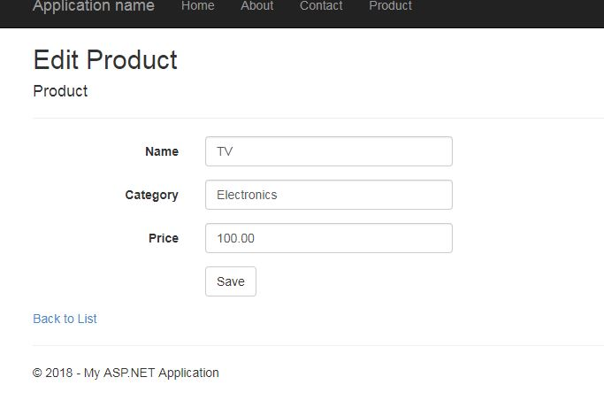

# Dependency Injection in ASP.NET MVC 5 using Simple Injector
## Requires
- Visual Studio 2015
## License
- MIT
## Technologies
- C#
- ASP.NET MVC 5
- Simple Injector
## Topics
- Dependancy Injection
- Simple Injector
## Updated
- 02/04/2018
## Description

<h1></h1>
<h1>Introduction</h1>

A Visual Studio 2015 project which shows how to use the Dependancy Injection in an ASP.NET&nbsp;MVC 5 web application project, using the simple Injector libarary.

Some Basics on Dependacy Injection and IOC

The Dependency Injection pattern is a particular implementation of Inversion of Control.&nbsp;Inversion of Control (IoC)&nbsp;means that objects do not create other objects on which they rely to do their work. Instead, they get the objects that they need
 from an outside source (for example, an xml configuration file).

Dependency Injection (DI)&nbsp;means that this is done without the object intervention, usually by a framework component that passes constructor parameters and set properties.

The advantages of using Dependency Injection pattern and Inversion of Control are the following:

<ul>
<li>Reduces class coupling </li><li>Increases code reusing </li><li>Improves code maintainability </li><li>Improves application testing </li></ul>

In this Hands-on Lab, I will be doing below high levele steps

<ul>
<li>Integrate ASP.NET MVC 5 with Unity for Dependency Injection using NuGet Packages
</li><li>Use Dependency Injection inside an ASP.NET MVC Controller </li></ul>

You can use the same strategy while implementing the depedency injection on MVC View and MVC Action Filters level as well.

<h1>Building the Sample</h1>

<em>Tools requirement</em>

<ul>
<li><em>Visual Studio 2015</em> </li><li><em>MVC5</em> </li></ul>

Description

<h3><em>&nbsp;Step1:&nbsp;</em></h3>

Open Visual Studio and create the MVC 5 web application

<h3>Step2: Install Unity Container.</h3>

Now install Install-Package <strong>SimpleInjector and&nbsp;</strong><strong>SimpleInjector.Integration.Web.Mvc
</strong>Container using NuGet Package Manager Console.

You can also do online search for <strong>SimpleInjector and&nbsp;<strong>SimpleInjector.Integration.Web.Mvc&nbsp;</strong></strong> Container by navigating to Tools=&gt;Extension and Update..=&gt;Online options in Visual Studio
 2015 and install it.

When it will be installed successfully, you will be find the following some references add to your project.

<h3>Step3: Create a class for registring the depedancy.</h3>

&nbsp;

C#

Edit|Remove

csharp

<pre class="csharp">using&nbsp;SimpleInjector;&nbsp;
using&nbsp;MVCSimpleInjectorDemo.Interfaces;&nbsp;
using&nbsp;MVCSimpleInjectorDemo.Repository;&nbsp;
using&nbsp;SimpleInjector.Integration.Web.Mvc;&nbsp;
using&nbsp;<a class="libraryLink" href="https://msdn.microsoft.com/en-US/library/System.Web.Mvc.aspx" target="_blank" title="Auto generated link to System.Web.Mvc">System.Web.Mvc</a>;&nbsp;
&nbsp;
namespace&nbsp;MVCSimpleInjectorDemo.App_Start&nbsp;
{&nbsp;
&nbsp;&nbsp;&nbsp;&nbsp;publicclass&nbsp;SimpleInjectorConfig&nbsp;
&nbsp;&nbsp;&nbsp;&nbsp;{&nbsp;
&nbsp;&nbsp;&nbsp;&nbsp;&nbsp;&nbsp;&nbsp;&nbsp;publicstaticvoid&nbsp;RegisterComponents()&nbsp;
&nbsp;&nbsp;&nbsp;&nbsp;&nbsp;&nbsp;&nbsp;&nbsp;{&nbsp;
&nbsp;&nbsp;&nbsp;&nbsp;&nbsp;&nbsp;&nbsp;&nbsp;&nbsp;&nbsp;&nbsp;&nbsp;var&nbsp;container&nbsp;=&nbsp;new&nbsp;Container();&nbsp;
&nbsp;&nbsp;&nbsp;&nbsp;&nbsp;&nbsp;&nbsp;&nbsp;&nbsp;&nbsp;&nbsp;&nbsp;//&nbsp;register&nbsp;all&nbsp;your&nbsp;components&nbsp;with&nbsp;the&nbsp;container&nbsp;here//&nbsp;it&nbsp;is&nbsp;NOT&nbsp;necessary&nbsp;to&nbsp;register&nbsp;your&nbsp;controllers&nbsp;
&nbsp;
&nbsp;&nbsp;&nbsp;&nbsp;&nbsp;&nbsp;&nbsp;&nbsp;}&nbsp;
&nbsp;&nbsp;&nbsp;&nbsp;}&nbsp;
}</pre>

&nbsp;

<h3>Step4: Create Service layer, Domain Models and Interfaces and repositories</h3>

Domain Models:

&nbsp;

C#

Edit|Remove

csharp

<pre class="js">public&nbsp;class&nbsp;Product&nbsp;&nbsp;
&nbsp;&nbsp;&nbsp;&nbsp;{&nbsp;&nbsp;
&nbsp;&nbsp;&nbsp;&nbsp;&nbsp;&nbsp;&nbsp;&nbsp;public&nbsp;int&nbsp;Id&nbsp;{&nbsp;get;&nbsp;set;&nbsp;}&nbsp;&nbsp;
&nbsp;&nbsp;&nbsp;&nbsp;&nbsp;&nbsp;&nbsp;&nbsp;public&nbsp;string&nbsp;Name&nbsp;{&nbsp;get;&nbsp;set;&nbsp;}&nbsp;&nbsp;
&nbsp;&nbsp;&nbsp;&nbsp;&nbsp;&nbsp;&nbsp;&nbsp;public&nbsp;string&nbsp;Category&nbsp;{&nbsp;get;&nbsp;set;&nbsp;}&nbsp;&nbsp;
&nbsp;&nbsp;&nbsp;&nbsp;&nbsp;&nbsp;&nbsp;&nbsp;public&nbsp;decimal&nbsp;Price&nbsp;{&nbsp;get;&nbsp;set;&nbsp;}&nbsp;&nbsp;
&nbsp;&nbsp;&nbsp;&nbsp;}</pre>

&nbsp;Interfaces;

C#

Edit|Remove

csharp

<pre class="js">public&nbsp;interface&nbsp;IProductRepository&nbsp;&nbsp;
&nbsp;&nbsp;&nbsp;&nbsp;{&nbsp;&nbsp;
&nbsp;&nbsp;&nbsp;&nbsp;&nbsp;&nbsp;&nbsp;&nbsp;IEnumerable&lt;Product&gt;&nbsp;GetAll();&nbsp;&nbsp;
&nbsp;&nbsp;
&nbsp;&nbsp;&nbsp;&nbsp;&nbsp;&nbsp;&nbsp;&nbsp;Product&nbsp;Get(int&nbsp;id);&nbsp;&nbsp;
&nbsp;&nbsp;
&nbsp;&nbsp;&nbsp;&nbsp;&nbsp;&nbsp;&nbsp;&nbsp;Product&nbsp;Add(Product&nbsp;item);&nbsp;&nbsp;
&nbsp;&nbsp;
&nbsp;&nbsp;&nbsp;&nbsp;&nbsp;&nbsp;&nbsp;&nbsp;bool&nbsp;Update(Product&nbsp;item);&nbsp;&nbsp;
&nbsp;&nbsp;
&nbsp;&nbsp;&nbsp;&nbsp;&nbsp;&nbsp;&nbsp;&nbsp;bool&nbsp;Delete(int&nbsp;id);&nbsp;&nbsp;
&nbsp;&nbsp;&nbsp;&nbsp;}&nbsp;</pre>

&nbsp;

Repository Service:

&nbsp;

C#

Edit|Remove

csharp

<pre class="js">using&nbsp;MVCSimpleInjectorDemo.DomainModels;&nbsp;
using&nbsp;MVCSimpleInjectorDemo.Interfaces;&nbsp;
using&nbsp;System;&nbsp;
using&nbsp;<a class="libraryLink" href="https://msdn.microsoft.com/en-US/library/System.Collections.Generic.aspx" target="_blank" title="Auto generated link to System.Collections.Generic">System.Collections.Generic</a>;&nbsp;
&nbsp;
namespace&nbsp;MVCSimpleInjectorDemo.Repository&nbsp;
{&nbsp;
&nbsp;&nbsp;&nbsp;&nbsp;public&nbsp;class&nbsp;ProductRepository&nbsp;:&nbsp;IProductRepository&nbsp;
&nbsp;&nbsp;&nbsp;&nbsp;{&nbsp;
&nbsp;&nbsp;&nbsp;&nbsp;&nbsp;&nbsp;&nbsp;&nbsp;private&nbsp;List&lt;Product&gt;&nbsp;products&nbsp;=&nbsp;new&nbsp;List&lt;Product&gt;();&nbsp;
&nbsp;&nbsp;&nbsp;&nbsp;&nbsp;&nbsp;&nbsp;&nbsp;private&nbsp;int&nbsp;_nextId&nbsp;=&nbsp;1;&nbsp;
&nbsp;
&nbsp;&nbsp;&nbsp;&nbsp;&nbsp;&nbsp;&nbsp;&nbsp;public&nbsp;ProductRepository()&nbsp;
&nbsp;&nbsp;&nbsp;&nbsp;&nbsp;&nbsp;&nbsp;&nbsp;{//&nbsp;Add&nbsp;products&nbsp;for&nbsp;the&nbsp;Demonstration&nbsp;
&nbsp;&nbsp;&nbsp;&nbsp;&nbsp;&nbsp;&nbsp;&nbsp;&nbsp;&nbsp;&nbsp;&nbsp;Add(new&nbsp;Product&nbsp;{&nbsp;Name&nbsp;=&nbsp;&quot;TV&quot;,&nbsp;Category&nbsp;=&nbsp;&quot;Electronics&quot;,&nbsp;Price&nbsp;=&nbsp;100});&nbsp;
&nbsp;&nbsp;&nbsp;&nbsp;&nbsp;&nbsp;&nbsp;&nbsp;&nbsp;&nbsp;&nbsp;&nbsp;Add(new&nbsp;Product&nbsp;{&nbsp;Name&nbsp;=&nbsp;&quot;Computer&quot;,&nbsp;Category&nbsp;=&nbsp;&quot;Electronics&quot;,&nbsp;Price&nbsp;=&nbsp;1000});&nbsp;
&nbsp;&nbsp;&nbsp;&nbsp;&nbsp;&nbsp;&nbsp;&nbsp;&nbsp;&nbsp;&nbsp;&nbsp;Add(new&nbsp;Product&nbsp;{&nbsp;Name&nbsp;=&nbsp;&quot;Laptop&quot;,&nbsp;Category&nbsp;=&nbsp;&quot;Electronics&quot;,&nbsp;Price&nbsp;=&nbsp;8000});&nbsp;
&nbsp;&nbsp;&nbsp;&nbsp;&nbsp;&nbsp;&nbsp;&nbsp;&nbsp;&nbsp;&nbsp;&nbsp;Add(new&nbsp;Product&nbsp;{&nbsp;Name&nbsp;=&nbsp;&quot;Google&nbsp;Pixel&nbsp;2&quot;,&nbsp;Category&nbsp;=&nbsp;&quot;Phone&quot;,&nbsp;Price&nbsp;=&nbsp;150});&nbsp;
&nbsp;&nbsp;&nbsp;&nbsp;&nbsp;&nbsp;&nbsp;&nbsp;}&nbsp;
&nbsp;
&nbsp;&nbsp;&nbsp;&nbsp;&nbsp;&nbsp;&nbsp;&nbsp;public&nbsp;IEnumerable&lt;Product&gt;&nbsp;GetAll()&nbsp;
&nbsp;&nbsp;&nbsp;&nbsp;&nbsp;&nbsp;&nbsp;&nbsp;{//&nbsp;TO&nbsp;DO&nbsp;:&nbsp;Code&nbsp;to&nbsp;get&nbsp;the&nbsp;list&nbsp;of&nbsp;all&nbsp;the&nbsp;records&nbsp;in&nbsp;databasereturn&nbsp;products;&nbsp;
&nbsp;&nbsp;&nbsp;&nbsp;&nbsp;&nbsp;&nbsp;&nbsp;}&nbsp;
&nbsp;
&nbsp;&nbsp;&nbsp;&nbsp;&nbsp;&nbsp;&nbsp;&nbsp;public&nbsp;Product&nbsp;Get(int&nbsp;id)&nbsp;
&nbsp;&nbsp;&nbsp;&nbsp;&nbsp;&nbsp;&nbsp;&nbsp;{//&nbsp;TO&nbsp;DO&nbsp;:&nbsp;Code&nbsp;to&nbsp;find&nbsp;a&nbsp;record&nbsp;in&nbsp;databasereturn&nbsp;products.Find(p&nbsp;=&gt;&nbsp;p.Id&nbsp;==&nbsp;id);&nbsp;
&nbsp;&nbsp;&nbsp;&nbsp;&nbsp;&nbsp;&nbsp;&nbsp;}&nbsp;
&nbsp;
&nbsp;&nbsp;&nbsp;&nbsp;&nbsp;&nbsp;&nbsp;&nbsp;public&nbsp;Product&nbsp;Add(Product&nbsp;item)&nbsp;
&nbsp;&nbsp;&nbsp;&nbsp;&nbsp;&nbsp;&nbsp;&nbsp;{if&nbsp;(item&nbsp;==&nbsp;null)&nbsp;
&nbsp;&nbsp;&nbsp;&nbsp;&nbsp;&nbsp;&nbsp;&nbsp;&nbsp;&nbsp;&nbsp;&nbsp;{thrownew&nbsp;ArgumentNullException(&quot;item&quot;);&nbsp;
&nbsp;&nbsp;&nbsp;&nbsp;&nbsp;&nbsp;&nbsp;&nbsp;&nbsp;&nbsp;&nbsp;&nbsp;}//&nbsp;TO&nbsp;DO&nbsp;:&nbsp;Code&nbsp;to&nbsp;save&nbsp;record&nbsp;into&nbsp;database&nbsp;
&nbsp;&nbsp;&nbsp;&nbsp;&nbsp;&nbsp;&nbsp;&nbsp;&nbsp;&nbsp;&nbsp;&nbsp;item.Id&nbsp;=&nbsp;_nextId&#43;&#43;;&nbsp;
&nbsp;&nbsp;&nbsp;&nbsp;&nbsp;&nbsp;&nbsp;&nbsp;&nbsp;&nbsp;&nbsp;&nbsp;products.Add(item);&nbsp;
&nbsp;&nbsp;&nbsp;&nbsp;&nbsp;&nbsp;&nbsp;&nbsp;&nbsp;&nbsp;&nbsp;&nbsp;return&nbsp;item;&nbsp;
&nbsp;&nbsp;&nbsp;&nbsp;&nbsp;&nbsp;&nbsp;&nbsp;}&nbsp;
&nbsp;
&nbsp;&nbsp;&nbsp;&nbsp;&nbsp;&nbsp;&nbsp;&nbsp;public&nbsp;bool&nbsp;Update(Product&nbsp;item)&nbsp;
&nbsp;&nbsp;&nbsp;&nbsp;&nbsp;&nbsp;&nbsp;&nbsp;{if&nbsp;(item&nbsp;==&nbsp;null)&nbsp;
&nbsp;&nbsp;&nbsp;&nbsp;&nbsp;&nbsp;&nbsp;&nbsp;&nbsp;&nbsp;&nbsp;&nbsp;{thrownew&nbsp;ArgumentNullException(&quot;item&quot;);&nbsp;
&nbsp;&nbsp;&nbsp;&nbsp;&nbsp;&nbsp;&nbsp;&nbsp;&nbsp;&nbsp;&nbsp;&nbsp;}//&nbsp;TO&nbsp;DO&nbsp;:&nbsp;Code&nbsp;to&nbsp;update&nbsp;record&nbsp;into&nbsp;database&nbsp;
&nbsp;&nbsp;&nbsp;&nbsp;&nbsp;&nbsp;&nbsp;&nbsp;&nbsp;&nbsp;&nbsp;&nbsp;int&nbsp;index&nbsp;=&nbsp;products.FindIndex(p&nbsp;=&gt;&nbsp;p.Id&nbsp;==&nbsp;item.Id);&nbsp;
&nbsp;&nbsp;&nbsp;&nbsp;&nbsp;&nbsp;&nbsp;&nbsp;&nbsp;&nbsp;&nbsp;&nbsp;if&nbsp;(index&nbsp;==&nbsp;-1)&nbsp;
&nbsp;&nbsp;&nbsp;&nbsp;&nbsp;&nbsp;&nbsp;&nbsp;&nbsp;&nbsp;&nbsp;&nbsp;{return&nbsp;false;&nbsp;
&nbsp;&nbsp;&nbsp;&nbsp;&nbsp;&nbsp;&nbsp;&nbsp;&nbsp;&nbsp;&nbsp;&nbsp;}&nbsp;
&nbsp;&nbsp;&nbsp;&nbsp;&nbsp;&nbsp;&nbsp;&nbsp;&nbsp;&nbsp;&nbsp;&nbsp;products.RemoveAt(index);&nbsp;
&nbsp;&nbsp;&nbsp;&nbsp;&nbsp;&nbsp;&nbsp;&nbsp;&nbsp;&nbsp;&nbsp;&nbsp;products.Add(item);&nbsp;
&nbsp;&nbsp;&nbsp;&nbsp;&nbsp;&nbsp;&nbsp;&nbsp;&nbsp;&nbsp;&nbsp;&nbsp;return&nbsp;true;&nbsp;
&nbsp;&nbsp;&nbsp;&nbsp;&nbsp;&nbsp;&nbsp;&nbsp;}&nbsp;
&nbsp;
&nbsp;&nbsp;&nbsp;&nbsp;&nbsp;&nbsp;&nbsp;&nbsp;public&nbsp;bool&nbsp;Delete(int&nbsp;id)&nbsp;
&nbsp;&nbsp;&nbsp;&nbsp;&nbsp;&nbsp;&nbsp;&nbsp;{//&nbsp;TO&nbsp;DO&nbsp;:&nbsp;Code&nbsp;to&nbsp;remove&nbsp;the&nbsp;records&nbsp;from&nbsp;database&nbsp;
&nbsp;&nbsp;&nbsp;&nbsp;&nbsp;&nbsp;&nbsp;&nbsp;&nbsp;&nbsp;&nbsp;&nbsp;products.RemoveAll(p&nbsp;=&gt;&nbsp;p.Id&nbsp;==&nbsp;id);&nbsp;
&nbsp;&nbsp;&nbsp;&nbsp;&nbsp;&nbsp;&nbsp;&nbsp;&nbsp;&nbsp;&nbsp;&nbsp;return&nbsp;true;&nbsp;
&nbsp;&nbsp;&nbsp;&nbsp;&nbsp;&nbsp;&nbsp;&nbsp;}}}</pre>

&nbsp;

<h2>Step 5- Register the Dependency in SimpleInjectorConfig.cs file</h2>

&nbsp;

C#

Edit|Remove

csharp

<pre class="js">using&nbsp;SimpleInjector;&nbsp;
using&nbsp;MVCSimpleInjectorDemo.Interfaces;&nbsp;
using&nbsp;MVCSimpleInjectorDemo.Repository;&nbsp;
using&nbsp;SimpleInjector.Integration.Web.Mvc;&nbsp;
using&nbsp;<a class="libraryLink" href="https://msdn.microsoft.com/en-US/library/System.Web.Mvc.aspx" target="_blank" title="Auto generated link to System.Web.Mvc">System.Web.Mvc</a>;&nbsp;
&nbsp;
namespace&nbsp;MVCSimpleInjectorDemo.App_Start&nbsp;
{&nbsp;
&nbsp;&nbsp;&nbsp;&nbsp;public&nbsp;class&nbsp;SimpleInjectorConfig&nbsp;
&nbsp;&nbsp;&nbsp;&nbsp;{&nbsp;
&nbsp;&nbsp;&nbsp;&nbsp;&nbsp;&nbsp;&nbsp;&nbsp;public&nbsp;static&nbsp;void&nbsp;RegisterComponents()&nbsp;
&nbsp;&nbsp;&nbsp;&nbsp;&nbsp;&nbsp;&nbsp;&nbsp;{var&nbsp;container&nbsp;=&nbsp;new&nbsp;Container();&nbsp;
&nbsp;&nbsp;&nbsp;&nbsp;&nbsp;&nbsp;&nbsp;&nbsp;&nbsp;&nbsp;&nbsp;&nbsp;//&nbsp;register&nbsp;all&nbsp;your&nbsp;components&nbsp;with&nbsp;the&nbsp;container&nbsp;here//&nbsp;it&nbsp;is&nbsp;NOT&nbsp;necessary&nbsp;to&nbsp;register&nbsp;your&nbsp;controllers.&nbsp;
&nbsp;
&nbsp;&nbsp;&nbsp;&nbsp;&nbsp;&nbsp;&nbsp;&nbsp;&nbsp;&nbsp;&nbsp;&nbsp;container.Register&lt;IProductRepository,&nbsp;ProductRepository&gt;();&nbsp;
&nbsp;
&nbsp;&nbsp;&nbsp;&nbsp;&nbsp;&nbsp;&nbsp;&nbsp;&nbsp;&nbsp;&nbsp;&nbsp;//DependencyResolver.SetResolver(new&nbsp;UnityDependencyResolver(container));&nbsp;
&nbsp;&nbsp;&nbsp;&nbsp;&nbsp;&nbsp;&nbsp;&nbsp;&nbsp;&nbsp;&nbsp;&nbsp;container.Verify();&nbsp;
&nbsp;
&nbsp;&nbsp;&nbsp;&nbsp;&nbsp;&nbsp;&nbsp;&nbsp;&nbsp;&nbsp;&nbsp;&nbsp;DependencyResolver.SetResolver(new&nbsp;SimpleInjectorDependencyResolver(container));&nbsp;
&nbsp;&nbsp;&nbsp;&nbsp;&nbsp;&nbsp;&nbsp;&nbsp;}}}</pre>

&nbsp;

<h3>Step6: Create Product Controller and View&nbsp;</h3>
<h3>Step7: Inject Service to Controller</h3>

Now inject the dependency for the IProductRepository interface using the Product Controller's constructor as shown below

&nbsp;

C#

Edit|Remove

csharp

<pre class="js">&nbsp;public&nbsp;class&nbsp;ProductController&nbsp;:&nbsp;Controller&nbsp;
&nbsp;&nbsp;&nbsp;&nbsp;{&nbsp;
&nbsp;&nbsp;&nbsp;&nbsp;&nbsp;&nbsp;&nbsp;&nbsp;private&nbsp;readonly&nbsp;IProductRepository&nbsp;repository;&nbsp;
&nbsp;
&nbsp;&nbsp;&nbsp;&nbsp;&nbsp;&nbsp;&nbsp;<strong>&nbsp;//inject&nbsp;dependency&nbsp;
&nbsp;&nbsp;&nbsp;&nbsp;&nbsp;&nbsp;&nbsp;&nbsp;public&nbsp;ProductController(IProductRepository&nbsp;repository)&nbsp;
&nbsp;&nbsp;&nbsp;&nbsp;&nbsp;&nbsp;&nbsp;&nbsp;{this.repository&nbsp;=&nbsp;repository;&nbsp;
&nbsp;&nbsp;&nbsp;&nbsp;&nbsp;&nbsp;&nbsp;&nbsp;}</strong>//&nbsp;GET:&nbsp;Product&nbsp;
&nbsp;&nbsp;&nbsp;&nbsp;&nbsp;&nbsp;&nbsp;&nbsp;public&nbsp;ActionResult&nbsp;Index()&nbsp;
&nbsp;&nbsp;&nbsp;&nbsp;&nbsp;&nbsp;&nbsp;&nbsp;{var&nbsp;data&nbsp;=&nbsp;repository.GetAll();&nbsp;
&nbsp;&nbsp;&nbsp;&nbsp;&nbsp;&nbsp;&nbsp;&nbsp;&nbsp;&nbsp;&nbsp;&nbsp;return&nbsp;View(data);&nbsp;
&nbsp;&nbsp;&nbsp;&nbsp;&nbsp;&nbsp;&nbsp;&nbsp;}</pre>

&nbsp;

<h3>Step8:&nbsp;Setup Dependency Injection with Simple injector settings in Global.asax.cs</h3>

&nbsp;

C#

Edit|Remove

csharp

<pre class="js">&nbsp;protected&nbsp;void&nbsp;Application_Start()&nbsp;
&nbsp;&nbsp;&nbsp;&nbsp;&nbsp;&nbsp;&nbsp;&nbsp;{&nbsp;
&nbsp;&nbsp;&nbsp;&nbsp;&nbsp;&nbsp;&nbsp;&nbsp;&nbsp;&nbsp;&nbsp;&nbsp;AreaRegistration.RegisterAllAreas();&nbsp;
&nbsp;&nbsp;&nbsp;&nbsp;&nbsp;&nbsp;&nbsp;&nbsp;&nbsp;&nbsp;&nbsp;&nbsp;<strong>SimpleInjectorConfig.RegisterComponents();&nbsp;</strong>
&nbsp;&nbsp;&nbsp;&nbsp;&nbsp;&nbsp;&nbsp;&nbsp;&nbsp;&nbsp;&nbsp;&nbsp;FilterConfig.RegisterGlobalFilters(GlobalFilters.Filters);&nbsp;
&nbsp;&nbsp;&nbsp;&nbsp;&nbsp;&nbsp;&nbsp;&nbsp;&nbsp;&nbsp;&nbsp;&nbsp;RouteConfig.RegisterRoutes(RouteTable.Routes);&nbsp;
&nbsp;&nbsp;&nbsp;&nbsp;&nbsp;&nbsp;&nbsp;&nbsp;&nbsp;&nbsp;&nbsp;&nbsp;BundleConfig.RegisterBundles(BundleTable.Bundles);&nbsp;
&nbsp;&nbsp;&nbsp;&nbsp;&nbsp;&nbsp;&nbsp;&nbsp;}</pre>

&nbsp;

&nbsp;

Thats all. Run the application and see how the application works.&nbsp;

<h1>Running the Sample.</h1>

&nbsp;

 

&nbsp;

To learn more on Simple Injector, please go through below link.

http://simpleinjector.readthedocs.io/en/latest/

