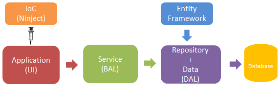

# Dependency Injection in Console Application
## Requires
- Visual Studio 2015
## License
- Apache License, Version 2.0
## Technologies
- C#
- ADO.NET Entity Framework
- Entity Framework
- Console
- Visual C#
- Ninject
## Topics
- C#
- ADO.NET Entity Framework
- Entity Framework
- Console Applications
- Inversion of Control
- Dependency Inversion Principle
- Dependancy Injection Pattern
## Updated
- 07/23/2016
## Description

<h1>Introduction</h1>

A Visual Studio 2015 project which shows how to use the Dependency Injection with Inversion of Control (Ninject) in the console application project, using generic repository pattern.

The code illustrates the following topics:

<ul>
<li>The Ninject IoC is used to implement dependency injection.
</li><li>Creating a generic repository for insert collection of entity in database.
</li><li>Read data from json file and deserialize &nbsp;json data to entity/entities.
</li><li>Database first approach is used to perform insert operation.
</li><li>With Dispose pattern. </li></ul>
<h1>Getting Started</h1>

To build and run this sample as-is, you must have Visual Studio 2015 installed. In most cases you can run the application by following these steps:

<ol>
<li>Download and extract the .zip file. </li><li>Create table in database as mentioned script in the DbScript.sql file.
</li><li>Open the solution file in Visual Studio.
</li><li>Change connection string in the App.config file.
</li><li>Build the solution, which automatically installs the missing NuGet packages.
</li><li>Run the application. </li></ol>
<h1>Source Code Overview</h1>

Figure 1: Operation work flow

This solution have contains 4 projects which are used in following ways.

1. DIConsole: A console application which runs and have json file. It has integration of IoC(Ninject).

2. DI.Data: It&rsquo;s a class library which has edmx file whereas database table mapped.

3. DI.Repo: It&rsquo;s class library which perform insert operation for entity.

4. DI.Service: It&rsquo;s class library which communicate to console application by interface.

You can download source code for web application from below link as well.

<a href="https://gallery.technet.microsoft.com/CRUD-Operations-Using-0aa46470">https://gallery.technet.microsoft.com/CRUD-Operations-Using-0aa46470</a>

