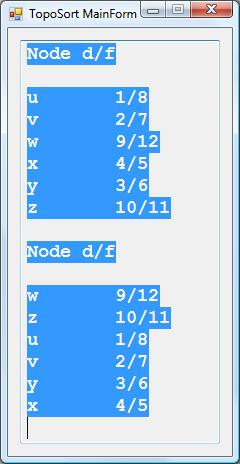

# Depth-First-Search and Topological Sort Algorithms
## Requires
- Visual Studio 2008
## License
- MIT
## Technologies
- C#
- Visual Studio 2008
- Visual C#
## Topics
- C#
- Numerical Computing
## Updated
- 04/04/2015
## Description

<h1>Introduction</h1>

<em>This application implements the depth-first-search and topological sort algorithms for a directed graph. 
</em>

<h1>Building the Sample</h1>

<em>This project should easily build using Visual Studio 2008 and perhaps later versions of Visual Studio. 
</em>

Description

<em>The depth-first-search (DFS) and topological sort algorithms are from <strong>
Introduction to Algorithms</strong> by Cormen, Leiserson, and Rivest page 478 and page 486. The example graph is from
<strong>Figure 23.4</strong> on page 479. DFS uses a vertex known as a node in this implementation that has the fields: color, discovery time, finish time, id, name, and a list of nodes that is the adjacency list. The colors are from the enumeration BLACK,
 GRAY, WHITE. The vertices begin with the color WHITE until discovered when a vertex becomes GRAY and fininally when finished the vertex is colored BLACK. The topolgical sort algorithm calls DFS on the intial to calcualte the discovery and finish times then
 places each node into a list ordered by the finish times. 
</em>

<em>&nbsp;&nbsp;</em>

&nbsp;

C#

Edit|Remove

csharp
<pre class="hidden">using System;
using System.Collections.Generic;

namespace TopoSort
{
    class DepthFirstSearch
    {
        private int time;
        private int[] pi;

        private void DFSVisit(Node u)
        {
            u.Color = Colors.GRAY;
            u.Discovery = &#43;&#43;time;

            if (u.Adjacency != null)
            {
                for (int i = 0; i &lt; u.Adjacency.Count; i&#43;&#43;)
                {
                    Node v = u.Adjacency[i];

                    if (v.Color == Colors.WHITE)
                    {
                        pi[v.Id] = u.Id;
                        DFSVisit(v);
                    }
                }

            }

            u.Color = Colors.BLACK;
            u.Finish = &#43;&#43;time;
        }

        public void DFS(List&lt;Node&gt; G)
        {
            pi = new int[G.Count];

            for (int i = 0; i &lt; G.Count; i&#43;&#43;)
            {
                Node u = G[i];

                u.Color = Colors.WHITE;
                pi[u.Id] = -1;
            }

            time = 0;

            for (int i = 0; i &lt; G.Count; i&#43;&#43;)
            {
                Node u = G[i];

                if (u.Color == Colors.WHITE)
                    DFSVisit(u);
            }
        }

        public List&lt;Node&gt; TopologicalSort(List&lt;Node&gt; G)
        {
            List&lt;Node&gt; ln = new List&lt;Node&gt;();

            DFS(G);

            for (int i = 0; i &lt; G.Count; i&#43;&#43;)
            {
                int j = 0;
                Node u = G[i];

                while (j &lt; ln.Count)
                {
                    if (ln[j].Finish &lt; u.Finish)
                        j&#43;&#43;;

                    else
                        break;
                }

                ln.Insert(j, u);
            }
                    
            return ln;
        }
    }
}</pre>

<pre class="csharp">using&nbsp;System;&nbsp;
using&nbsp;System.Collections.Generic;&nbsp;
&nbsp;
namespace&nbsp;TopoSort&nbsp;
{&nbsp;
&nbsp;&nbsp;&nbsp;&nbsp;class&nbsp;DepthFirstSearch&nbsp;
&nbsp;&nbsp;&nbsp;&nbsp;{&nbsp;
&nbsp;&nbsp;&nbsp;&nbsp;&nbsp;&nbsp;&nbsp;&nbsp;private&nbsp;int&nbsp;time;&nbsp;
&nbsp;&nbsp;&nbsp;&nbsp;&nbsp;&nbsp;&nbsp;&nbsp;private&nbsp;int[]&nbsp;pi;&nbsp;
&nbsp;
&nbsp;&nbsp;&nbsp;&nbsp;&nbsp;&nbsp;&nbsp;&nbsp;private&nbsp;void&nbsp;DFSVisit(Node&nbsp;u)&nbsp;
&nbsp;&nbsp;&nbsp;&nbsp;&nbsp;&nbsp;&nbsp;&nbsp;{&nbsp;
&nbsp;&nbsp;&nbsp;&nbsp;&nbsp;&nbsp;&nbsp;&nbsp;&nbsp;&nbsp;&nbsp;&nbsp;u.Color&nbsp;=&nbsp;Colors.GRAY;&nbsp;
&nbsp;&nbsp;&nbsp;&nbsp;&nbsp;&nbsp;&nbsp;&nbsp;&nbsp;&nbsp;&nbsp;&nbsp;u.Discovery&nbsp;=&nbsp;&#43;&#43;time;&nbsp;
&nbsp;
&nbsp;&nbsp;&nbsp;&nbsp;&nbsp;&nbsp;&nbsp;&nbsp;&nbsp;&nbsp;&nbsp;&nbsp;if&nbsp;(u.Adjacency&nbsp;!=&nbsp;null)&nbsp;
&nbsp;&nbsp;&nbsp;&nbsp;&nbsp;&nbsp;&nbsp;&nbsp;&nbsp;&nbsp;&nbsp;&nbsp;{&nbsp;
&nbsp;&nbsp;&nbsp;&nbsp;&nbsp;&nbsp;&nbsp;&nbsp;&nbsp;&nbsp;&nbsp;&nbsp;&nbsp;&nbsp;&nbsp;&nbsp;for&nbsp;(int&nbsp;i&nbsp;=&nbsp;0;&nbsp;i&nbsp;&lt;&nbsp;u.Adjacency.Count;&nbsp;i&#43;&#43;)&nbsp;
&nbsp;&nbsp;&nbsp;&nbsp;&nbsp;&nbsp;&nbsp;&nbsp;&nbsp;&nbsp;&nbsp;&nbsp;&nbsp;&nbsp;&nbsp;&nbsp;{&nbsp;
&nbsp;&nbsp;&nbsp;&nbsp;&nbsp;&nbsp;&nbsp;&nbsp;&nbsp;&nbsp;&nbsp;&nbsp;&nbsp;&nbsp;&nbsp;&nbsp;&nbsp;&nbsp;&nbsp;&nbsp;Node&nbsp;v&nbsp;=&nbsp;u.Adjacency[i];&nbsp;
&nbsp;
&nbsp;&nbsp;&nbsp;&nbsp;&nbsp;&nbsp;&nbsp;&nbsp;&nbsp;&nbsp;&nbsp;&nbsp;&nbsp;&nbsp;&nbsp;&nbsp;&nbsp;&nbsp;&nbsp;&nbsp;if&nbsp;(v.Color&nbsp;==&nbsp;Colors.WHITE)&nbsp;
&nbsp;&nbsp;&nbsp;&nbsp;&nbsp;&nbsp;&nbsp;&nbsp;&nbsp;&nbsp;&nbsp;&nbsp;&nbsp;&nbsp;&nbsp;&nbsp;&nbsp;&nbsp;&nbsp;&nbsp;{&nbsp;
&nbsp;&nbsp;&nbsp;&nbsp;&nbsp;&nbsp;&nbsp;&nbsp;&nbsp;&nbsp;&nbsp;&nbsp;&nbsp;&nbsp;&nbsp;&nbsp;&nbsp;&nbsp;&nbsp;&nbsp;&nbsp;&nbsp;&nbsp;&nbsp;pi[v.Id]&nbsp;=&nbsp;u.Id;&nbsp;
&nbsp;&nbsp;&nbsp;&nbsp;&nbsp;&nbsp;&nbsp;&nbsp;&nbsp;&nbsp;&nbsp;&nbsp;&nbsp;&nbsp;&nbsp;&nbsp;&nbsp;&nbsp;&nbsp;&nbsp;&nbsp;&nbsp;&nbsp;&nbsp;DFSVisit(v);&nbsp;
&nbsp;&nbsp;&nbsp;&nbsp;&nbsp;&nbsp;&nbsp;&nbsp;&nbsp;&nbsp;&nbsp;&nbsp;&nbsp;&nbsp;&nbsp;&nbsp;&nbsp;&nbsp;&nbsp;&nbsp;}&nbsp;
&nbsp;&nbsp;&nbsp;&nbsp;&nbsp;&nbsp;&nbsp;&nbsp;&nbsp;&nbsp;&nbsp;&nbsp;&nbsp;&nbsp;&nbsp;&nbsp;}&nbsp;
&nbsp;
&nbsp;&nbsp;&nbsp;&nbsp;&nbsp;&nbsp;&nbsp;&nbsp;&nbsp;&nbsp;&nbsp;&nbsp;}&nbsp;
&nbsp;
&nbsp;&nbsp;&nbsp;&nbsp;&nbsp;&nbsp;&nbsp;&nbsp;&nbsp;&nbsp;&nbsp;&nbsp;u.Color&nbsp;=&nbsp;Colors.BLACK;&nbsp;
&nbsp;&nbsp;&nbsp;&nbsp;&nbsp;&nbsp;&nbsp;&nbsp;&nbsp;&nbsp;&nbsp;&nbsp;u.Finish&nbsp;=&nbsp;&#43;&#43;time;&nbsp;
&nbsp;&nbsp;&nbsp;&nbsp;&nbsp;&nbsp;&nbsp;&nbsp;}&nbsp;
&nbsp;
&nbsp;&nbsp;&nbsp;&nbsp;&nbsp;&nbsp;&nbsp;&nbsp;public&nbsp;void&nbsp;DFS(List&lt;Node&gt;&nbsp;G)&nbsp;
&nbsp;&nbsp;&nbsp;&nbsp;&nbsp;&nbsp;&nbsp;&nbsp;{&nbsp;
&nbsp;&nbsp;&nbsp;&nbsp;&nbsp;&nbsp;&nbsp;&nbsp;&nbsp;&nbsp;&nbsp;&nbsp;pi&nbsp;=&nbsp;new&nbsp;int[G.Count];&nbsp;
&nbsp;
&nbsp;&nbsp;&nbsp;&nbsp;&nbsp;&nbsp;&nbsp;&nbsp;&nbsp;&nbsp;&nbsp;&nbsp;for&nbsp;(int&nbsp;i&nbsp;=&nbsp;0;&nbsp;i&nbsp;&lt;&nbsp;G.Count;&nbsp;i&#43;&#43;)&nbsp;
&nbsp;&nbsp;&nbsp;&nbsp;&nbsp;&nbsp;&nbsp;&nbsp;&nbsp;&nbsp;&nbsp;&nbsp;{&nbsp;
&nbsp;&nbsp;&nbsp;&nbsp;&nbsp;&nbsp;&nbsp;&nbsp;&nbsp;&nbsp;&nbsp;&nbsp;&nbsp;&nbsp;&nbsp;&nbsp;Node&nbsp;u&nbsp;=&nbsp;G[i];&nbsp;
&nbsp;
&nbsp;&nbsp;&nbsp;&nbsp;&nbsp;&nbsp;&nbsp;&nbsp;&nbsp;&nbsp;&nbsp;&nbsp;&nbsp;&nbsp;&nbsp;&nbsp;u.Color&nbsp;=&nbsp;Colors.WHITE;&nbsp;
&nbsp;&nbsp;&nbsp;&nbsp;&nbsp;&nbsp;&nbsp;&nbsp;&nbsp;&nbsp;&nbsp;&nbsp;&nbsp;&nbsp;&nbsp;&nbsp;pi[u.Id]&nbsp;=&nbsp;-1;&nbsp;
&nbsp;&nbsp;&nbsp;&nbsp;&nbsp;&nbsp;&nbsp;&nbsp;&nbsp;&nbsp;&nbsp;&nbsp;}&nbsp;
&nbsp;
&nbsp;&nbsp;&nbsp;&nbsp;&nbsp;&nbsp;&nbsp;&nbsp;&nbsp;&nbsp;&nbsp;&nbsp;time&nbsp;=&nbsp;0;&nbsp;
&nbsp;
&nbsp;&nbsp;&nbsp;&nbsp;&nbsp;&nbsp;&nbsp;&nbsp;&nbsp;&nbsp;&nbsp;&nbsp;for&nbsp;(int&nbsp;i&nbsp;=&nbsp;0;&nbsp;i&nbsp;&lt;&nbsp;G.Count;&nbsp;i&#43;&#43;)&nbsp;
&nbsp;&nbsp;&nbsp;&nbsp;&nbsp;&nbsp;&nbsp;&nbsp;&nbsp;&nbsp;&nbsp;&nbsp;{&nbsp;
&nbsp;&nbsp;&nbsp;&nbsp;&nbsp;&nbsp;&nbsp;&nbsp;&nbsp;&nbsp;&nbsp;&nbsp;&nbsp;&nbsp;&nbsp;&nbsp;Node&nbsp;u&nbsp;=&nbsp;G[i];&nbsp;
&nbsp;
&nbsp;&nbsp;&nbsp;&nbsp;&nbsp;&nbsp;&nbsp;&nbsp;&nbsp;&nbsp;&nbsp;&nbsp;&nbsp;&nbsp;&nbsp;&nbsp;if&nbsp;(u.Color&nbsp;==&nbsp;Colors.WHITE)&nbsp;
&nbsp;&nbsp;&nbsp;&nbsp;&nbsp;&nbsp;&nbsp;&nbsp;&nbsp;&nbsp;&nbsp;&nbsp;&nbsp;&nbsp;&nbsp;&nbsp;&nbsp;&nbsp;&nbsp;&nbsp;DFSVisit(u);&nbsp;
&nbsp;&nbsp;&nbsp;&nbsp;&nbsp;&nbsp;&nbsp;&nbsp;&nbsp;&nbsp;&nbsp;&nbsp;}&nbsp;
&nbsp;&nbsp;&nbsp;&nbsp;&nbsp;&nbsp;&nbsp;&nbsp;}&nbsp;
&nbsp;
&nbsp;&nbsp;&nbsp;&nbsp;&nbsp;&nbsp;&nbsp;&nbsp;public&nbsp;List&lt;Node&gt;&nbsp;TopologicalSort(List&lt;Node&gt;&nbsp;G)&nbsp;
&nbsp;&nbsp;&nbsp;&nbsp;&nbsp;&nbsp;&nbsp;&nbsp;{&nbsp;
&nbsp;&nbsp;&nbsp;&nbsp;&nbsp;&nbsp;&nbsp;&nbsp;&nbsp;&nbsp;&nbsp;&nbsp;List&lt;Node&gt;&nbsp;ln&nbsp;=&nbsp;new&nbsp;List&lt;Node&gt;();&nbsp;
&nbsp;
&nbsp;&nbsp;&nbsp;&nbsp;&nbsp;&nbsp;&nbsp;&nbsp;&nbsp;&nbsp;&nbsp;&nbsp;DFS(G);&nbsp;
&nbsp;
&nbsp;&nbsp;&nbsp;&nbsp;&nbsp;&nbsp;&nbsp;&nbsp;&nbsp;&nbsp;&nbsp;&nbsp;for&nbsp;(int&nbsp;i&nbsp;=&nbsp;0;&nbsp;i&nbsp;&lt;&nbsp;G.Count;&nbsp;i&#43;&#43;)&nbsp;
&nbsp;&nbsp;&nbsp;&nbsp;&nbsp;&nbsp;&nbsp;&nbsp;&nbsp;&nbsp;&nbsp;&nbsp;{&nbsp;
&nbsp;&nbsp;&nbsp;&nbsp;&nbsp;&nbsp;&nbsp;&nbsp;&nbsp;&nbsp;&nbsp;&nbsp;&nbsp;&nbsp;&nbsp;&nbsp;int&nbsp;j&nbsp;=&nbsp;0;&nbsp;
&nbsp;&nbsp;&nbsp;&nbsp;&nbsp;&nbsp;&nbsp;&nbsp;&nbsp;&nbsp;&nbsp;&nbsp;&nbsp;&nbsp;&nbsp;&nbsp;Node&nbsp;u&nbsp;=&nbsp;G[i];&nbsp;
&nbsp;
&nbsp;&nbsp;&nbsp;&nbsp;&nbsp;&nbsp;&nbsp;&nbsp;&nbsp;&nbsp;&nbsp;&nbsp;&nbsp;&nbsp;&nbsp;&nbsp;while&nbsp;(j&nbsp;&lt;&nbsp;ln.Count)&nbsp;
&nbsp;&nbsp;&nbsp;&nbsp;&nbsp;&nbsp;&nbsp;&nbsp;&nbsp;&nbsp;&nbsp;&nbsp;&nbsp;&nbsp;&nbsp;&nbsp;{&nbsp;
&nbsp;&nbsp;&nbsp;&nbsp;&nbsp;&nbsp;&nbsp;&nbsp;&nbsp;&nbsp;&nbsp;&nbsp;&nbsp;&nbsp;&nbsp;&nbsp;&nbsp;&nbsp;&nbsp;&nbsp;if&nbsp;(ln[j].Finish&nbsp;&lt;&nbsp;u.Finish)&nbsp;
&nbsp;&nbsp;&nbsp;&nbsp;&nbsp;&nbsp;&nbsp;&nbsp;&nbsp;&nbsp;&nbsp;&nbsp;&nbsp;&nbsp;&nbsp;&nbsp;&nbsp;&nbsp;&nbsp;&nbsp;&nbsp;&nbsp;&nbsp;&nbsp;j&#43;&#43;;&nbsp;
&nbsp;
&nbsp;&nbsp;&nbsp;&nbsp;&nbsp;&nbsp;&nbsp;&nbsp;&nbsp;&nbsp;&nbsp;&nbsp;&nbsp;&nbsp;&nbsp;&nbsp;&nbsp;&nbsp;&nbsp;&nbsp;else&nbsp;
&nbsp;&nbsp;&nbsp;&nbsp;&nbsp;&nbsp;&nbsp;&nbsp;&nbsp;&nbsp;&nbsp;&nbsp;&nbsp;&nbsp;&nbsp;&nbsp;&nbsp;&nbsp;&nbsp;&nbsp;&nbsp;&nbsp;&nbsp;&nbsp;break;&nbsp;
&nbsp;&nbsp;&nbsp;&nbsp;&nbsp;&nbsp;&nbsp;&nbsp;&nbsp;&nbsp;&nbsp;&nbsp;&nbsp;&nbsp;&nbsp;&nbsp;}&nbsp;
&nbsp;
&nbsp;&nbsp;&nbsp;&nbsp;&nbsp;&nbsp;&nbsp;&nbsp;&nbsp;&nbsp;&nbsp;&nbsp;&nbsp;&nbsp;&nbsp;&nbsp;ln.Insert(j,&nbsp;u);&nbsp;
&nbsp;&nbsp;&nbsp;&nbsp;&nbsp;&nbsp;&nbsp;&nbsp;&nbsp;&nbsp;&nbsp;&nbsp;}&nbsp;
&nbsp;&nbsp;&nbsp;&nbsp;&nbsp;&nbsp;&nbsp;&nbsp;&nbsp;&nbsp;&nbsp;&nbsp;&nbsp;&nbsp;&nbsp;&nbsp;&nbsp;&nbsp;&nbsp;&nbsp;&nbsp;
&nbsp;&nbsp;&nbsp;&nbsp;&nbsp;&nbsp;&nbsp;&nbsp;&nbsp;&nbsp;&nbsp;&nbsp;return&nbsp;ln;&nbsp;
&nbsp;&nbsp;&nbsp;&nbsp;&nbsp;&nbsp;&nbsp;&nbsp;}&nbsp;
&nbsp;&nbsp;&nbsp;&nbsp;}&nbsp;
}</pre>

&nbsp;

&nbsp;

<h1>Source Code Files</h1>
<ul>
<li><em>DepthFirstSearch.cs - contains the public methods DFS and TopologicalSort.</em>
</li><li><em><em>MainForm.cs - the main and only form of the application.</em></em> </li><li><em>Node.cs - the vertex also known as a node class.</em> </li><li><em>Program.cs - the Visual Studio 2008 generated program source code.</em> </li></ul>
<h1>More Information</h1>

<em>For more information on depth-first-search and topological sorting, see the reference cited in the Description section or search online. 
</em>

