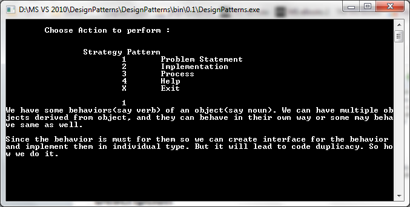

# Design Pattern Concepts and Examples
## Requires
- Visual Studio 2010
## License
- Apache License, Version 2.0
## Technologies
- C#
- Visual Studio 2010
- .NET Framework
- C# Language
- Design Patterns
## Topics
- Inheritance
- Classes
- Design Patterns
- Interface
- Observer Pattern
- Strategy Pattern
- Design Pattern Demo
## Updated
- 02/28/2013
## Description

<h1>Introduction</h1>

<em>It helps you learn what design patterns are and how to use them. I have tried to explain the problem statement where you can use these design patterns. Currently it is containing Strategy Pattern and Observer Pattern. I will add more as I create solution
 for them. You can run the application and select the pattern you want to study. It will give you options to read problem statement, how it solves them and what are the class/interfaces used in that design pattern. Moreover you can also browse the class library
 project of particular design pattern to know how we have used classes/interfaces to implement a design pattern.</em>

<strong><em>Please give us it a 5 star if you loved the application.</em></strong>

<h1>Building the Sample</h1>

<em>You simply need to hit F6 (or Select Rebuild) to build the sample application. It will run in a console application where you can select a design pattern or hit X to close the application. As and when new design patterns are added, they will be added
 in the main console window.</em>

Description

Application in action.

Class diagram of Strategy Pattern

Class diagram of Observer Pattern

<h1>Source Code Files</h1>

For StrategyPattern

<ul>
<li>Interface : Algorithm.cs It is an interface for a behavior of sorting.
</li><li>Interface : Behavior.cs It is yet another interface for a behavior of display settings.
</li></ul>
<ul>
<li>Class : Algorithm1.cs Implements Algorithm. Sorting using MERGE SORT.
</li><li>Class : Algorithm2.cs Implements Algorithm. Sorting using BUBBLE SORT.
</li><li>Class : Behavior1.cs Implements Behavior. Display Setting with GREEN on BLACK.
</li><li>Class : Behavior2.cs Implements Behavior. Display Setting with RED on WHITE.
</li></ul>
<ul>
<li>Abstract Class : OurMasterClass.cs An abstract class(our noun) for which we have created behaviors.
</li><li>Class : MyObject1.cs OurMasterClass extended with Algorithm1 and Behavior1.
</li><li>Class : MyObject2.cs OurMasterClass extended with Algorithm1 and Behavior2.
</li><li>Class : MyObject3.cs OurMasterClass extended with Algorithm2 and Behavior1.
</li><li>Class : MyObject4.cs OurMasterClass extended with Algorithm2 and Behavior2.
</li></ul>

For ObserverPattern

<ul>
<li>Interface : IPaidNewsChannels.cs Observable interface. </li><li>Interface :&nbsp;IChannelUsers.cs Observers interface. </li></ul>
<ul>
<li>Class : News.cs Observable provide an update on news. </li><li>Class :&nbsp;PaidNewsChannel1.cs This is the observable implementation. </li></ul>
<ul>
<li>Class : MobileUser.cs A mobile observer. </li><li>Class : TVUserBreakingNews.cs A Television observer. </li><li>Class : WebSiteDisplay.cs A website observer. </li></ul>
<h1>More Information</h1>

<em><strong>Strategy Pattern</strong> :&nbsp;We create interface for Behaviors/Verb and create individual implementation in classes. So we have one class for each kind of Behavior implementation. We then have behavior interfaces as instance variable in the
 main class and their value set in derived classes. This way we have behavior implementation for individual object and without any code duplicacy. Also we can add more implementation or change an object's behavior in future without effecting existing code.&nbsp;</em>

<em><strong>Observer Pattern</strong> :&nbsp;We create Observable interface which provides the update and implement it. We provide observer interface for all those modules who want to receive updates. All the observers have an observable instance. They call
 register/deregister on observable to register/deregister themselves for updates. Observable adds all of the observables in some array/hashtable/list and calls notify as and when the updates are available. 
Again note that observable and observers can continue doing/behaving as they want and at the same time behave as observable and/or ovserver.</em>

<strong>Updates :&nbsp;</strong>

<em>0.1 Feb 07 2013
Stratege Pattern</em>

<em>0.2 Feb 12 2013
Observer Pattern Added</em>

