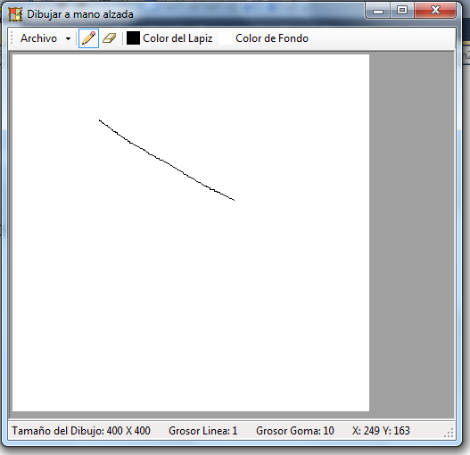
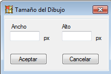

# Dibujar a mano alzada
## Requires
- Visual Studio 2010
## License
- MS-LPL
## Technologies
- Windows Forms
## Topics
- Graphics
- Windows Forms
## Updated
- 04/15/2012
## Description

<h1>Introduccion</h1>

<em>Aplicacion windows form para hacer dibujos a mano alzada</em>

Descripcion

<em>Ejemplo de software con fines de aprendizaje de heramientas graficas en .NET C# usando Windows Forms. Posee una herramienta lapiz y una goma de borrar, tambien se puede dibujar sobre una imagen.</em>

&nbsp;

C#

Editar script|Remove

csharp
<pre class="hidden">using System;
using System.Collections.Generic;
using System.ComponentModel;
using System.Data;
using System.Drawing;
using System.Drawing.Imaging;
using System.Text;
using System.Windows.Forms;
using System.IO;

namespace Dibujar
{
    public partial class Form1 : Form
    {
        private bool cursorDown;
        private Point[] puntos;
        private Pen lapiz;
        private Pen goma;
        private Bitmap bmp;
        private string accion;

        public Form1()
        {
            InitializeComponent();
        }

        private void Inicializar()
        {
            accion = &quot;dibujar&quot;;
            puntos = new Point[0];

            //Creo el lapiz y la goma y defino el tipo de linea
            lapiz = new Pen(Color.Black, 1);
            lapiz.StartCap = System.Drawing.Drawing2D.LineCap.Round;
            lapiz.EndCap = System.Drawing.Drawing2D.LineCap.Round;
            lapiz.LineJoin = System.Drawing.Drawing2D.LineJoin.Round;
            goma = new Pen(Color.White, 10);
            goma.StartCap = System.Drawing.Drawing2D.LineCap.Round;
            goma.EndCap = System.Drawing.Drawing2D.LineCap.Round;
            goma.LineJoin = System.Drawing.Drawing2D.LineJoin.Round;

            bmp = new Bitmap(pictureBox1.Width, pictureBox1.Height);

            //creo el cursor del lapiz a partir de una imagen que tengo como recurso
            IntPtr intprCursor = Dibujar.Properties.Resources.LapizC.GetHicon();
            pictureBox1.Cursor = new Cursor(intprCursor);
        }

        private void agregarPunto(Point punto)
        {
            //agrega los puntos obtenidos al arreglo
            Point[] temp = new Point[puntos.Length &#43; 1];
            puntos.CopyTo(temp, 0);
            puntos = temp;
            puntos[puntos.Length - 1] = punto;
        }

        private void MDibujar()
        {
            //Dibuja
            if (puntos.Length &gt; 1)
            {
                //Aqui usamos dos Graphics, uno que dibuja directamente en el pictureBox y
                //otro que dibuja en la imagen.
                //Esto ayuda a que el dibujo sea rapido ya que si dibujamos solo la imagen
                //y la vamos colocando en el pictureBox puede ser mas lento.
                Graphics g1 = pictureBox1.CreateGraphics();
                Graphics g2 = Graphics.FromImage(bmp);
                g1.DrawLines(lapiz, puntos);
                g2.DrawLines(lapiz, puntos);
                g1.Dispose();
                g2.Dispose();
            }
        }

        private void MBorrar()
        {
            //Borra, es lo mismo que dibujar solo que el objeto Pen es otro
            if (puntos.Length &gt; 1)
            {
                Graphics g1 = pictureBox1.CreateGraphics();
                Graphics g2 = Graphics.FromImage(bmp);
                g1.DrawLines(goma, puntos);
                g2.DrawLines(goma, puntos);
                g1.Dispose();
                g2.Dispose();
            }
        }

        private void CrearGoma()
        {
            //en realidad este metodo lo que hace es crear un cursor para la goma a partir de dos
            //elipses, de esta manera el cursor queda como un circulo
            int diametroG = Convert.ToInt32(goma.Width);
            Bitmap Goma = new Bitmap(diametroG, diametroG);

            Graphics gGoma = Graphics.FromImage(Goma);
            gGoma.FillRectangle(Brushes.Magenta, 0, 0, diametroG, diametroG);
            gGoma.FillEllipse(Brushes.White, 0, 0, diametroG - 1, diametroG - 1);
            gGoma.DrawEllipse(new Pen(Color.Black, 1), 0, 0, diametroG- 1, diametroG - 1);
            Goma.MakeTransparent(Color.Magenta);
            gGoma.Dispose();

            IntPtr intprCursorGoma = Goma.GetHicon();
            pictureBox1.Cursor = new Cursor(intprCursorGoma);

        }

        private void Unir(Bitmap fondo)
        {
            //Este metodo une un fondo con lo que se ha dibujado.
            //esto es necesario ya que lo que dibujamos se dibuja sobre un fondo transparente
            //y si no lo unimos puede traer problemas al salvar la imagen o al cambiarle el tama&ntilde;o
            //al area de dibujo.
            Graphics g = Graphics.FromImage(fondo);
            g.DrawImage(bmp, 0, 0);
            bmp = new Bitmap(fondo);
            g.Dispose();
            fondo.Dispose();
        }

        private void Form1_Load(object sender, EventArgs e)
        {
            //llamamos al metodo Inicializar() que inicializa los elementos
            Inicializar();
        }

        private void pictureBox1_MouseDown(object sender, MouseEventArgs e)
        {
            cursorDown = true;
        }

        private void pictureBox1_MouseMove(object sender, MouseEventArgs e)
        {
            toolStripStatusLabel4.Text = &quot;X: &quot; &#43; e.X.ToString() &#43; &quot; Y: &quot; &#43; e.Y.ToString();
            if (cursorDown)
            {
                agregarPunto(new Point(e.X, e.Y));
                if (accion == &quot;dibujar&quot;)
                {
                    MDibujar();
                }
                if (accion == &quot;borrar&quot;)
                {
                    MBorrar();
                }
            }
        }

        private void pictureBox1_MouseUp(object sender, MouseEventArgs e)
        {
            cursorDown = false;

            //Aqui reinicializamos a puntos para que no se unan las lineas
            //al volver a dibujar
            puntos = new Point[0];

            //Marcamos como transparente en la imagen donde estamos dibujando todo aquello que sea
            //del color de fondo, esto es necesario para que al cambiar de fondo no se vea lo que borramos
            bmp.MakeTransparent(pictureBox1.BackColor);

            //ponemos la imagen dibujada como fondo
            //esto lo hago aqui y no mientras se dibuja para que el trabajo de dibujar sea mas rapido.
            pictureBox1.Image = bmp;
        }

        private void salvarDibujoToolStripMenuItem_Click(object sender, EventArgs e)
        {
            if (saveFileDialog1.ShowDialog() == DialogResult.OK)
            {
                Bitmap fondo = new Bitmap(bmp.Width, bmp.Height);
                Graphics g = Graphics.FromImage(fondo);
                g.FillRectangle(new SolidBrush(pictureBox1.BackColor), 0, 0, bmp.Width, bmp.Height);
                g.Dispose();
                Unir(fondo);
                bmp.Save(saveFileDialog1.FileName, ImageFormat.Bmp);
            }
        }

        private void tama&ntilde;oDelDibujoToolStripMenuItem_Click(object sender, EventArgs e)
        {
            Form2 f2 = new Form2();
            f2.ancho = pictureBox1.Width;
            f2.alto = pictureBox1.Height;
            if (f2.ShowDialog() == DialogResult.OK)
            {
                pictureBox1.Width = f2.ancho;
                pictureBox1.Height = f2.alto;
                Bitmap fondo = new Bitmap(pictureBox1.Width, pictureBox1.Height);
                Unir(fondo);
            }
        }

        private void toolStripButton2_Click(object sender, EventArgs e)
        {
            toolStripButton3.Checked = false;
            toolStripButton2.Checked = true;
            IntPtr intprCursor = Dibujar.Properties.Resources.LapizC.GetHicon();
            pictureBox1.Cursor = new Cursor(intprCursor);
            accion = &quot;dibujar&quot;;
        }

        private void toolStripButton3_Click(object sender, EventArgs e)
        {
            toolStripButton2.Checked = false;
            toolStripButton3.Checked = true;
            CrearGoma();
            accion = &quot;borrar&quot;;

        }

        private void toolStripButton4_Click(object sender, EventArgs e)
        {
            if (colorDialog1.ShowDialog() == DialogResult.OK)
            {
                Bitmap btemp = new Bitmap(15, 15);
                Graphics gtemp = Graphics.FromImage(btemp);
                gtemp.FillRectangle(new SolidBrush(colorDialog1.Color), 0, 0, 16, 16);
                toolStripButton4.Image = new Bitmap(btemp);
                gtemp.Dispose();
                btemp.Dispose();
                lapiz.Color = colorDialog1.Color;
            }
        }

        private void toolStripButton5_Click(object sender, EventArgs e)
        {
            if (colorDialog1.ShowDialog() == DialogResult.OK)
            {
                Bitmap btemp = new Bitmap(15, 15);
                Graphics gtemp = Graphics.FromImage(btemp);
                gtemp.FillRectangle(new SolidBrush(colorDialog1.Color), 0, 0, 16, 16);
                toolStripButton5.Image = new Bitmap(btemp);
                gtemp.Dispose();
                btemp.Dispose();
                pictureBox1.BackColor = colorDialog1.Color;
                goma.Color = colorDialog1.Color;
            }
        }

        private void Form1_KeyDown(object sender, KeyEventArgs e)
        {
            if (e.KeyCode == Keys.Add)
            {
                if (accion == &quot;dibujar&quot;)
                {
                    if (lapiz.Width &lt; 100)
                    {
                        lapiz.Width&#43;&#43;;
                    }
                }
                if (accion == &quot;borrar&quot;)
                {
                    if (goma.Width &lt; 100)
                    {
                        goma.Width&#43;&#43;;
                        CrearGoma();
                    }
                }
            }

            if (e.KeyCode == Keys.Subtract)
            {
                if (accion == &quot;dibujar&quot;)
                {
                    if (lapiz.Width &gt; 1)
                    {
                        lapiz.Width--;
                    }
                }
                if (accion == &quot;borrar&quot;)
                {
                    if (goma.Width &gt; 10)
                    {
                        goma.Width--;
                        CrearGoma();
                    }
                }
            }

            toolStripStatusLabel2.Text = &quot;Grosor Linea: &quot; &#43; lapiz.Width.ToString();
            toolStripStatusLabel3.Text = &quot;Grosor Goma: &quot; &#43; goma.Width.ToString();
        }

        private void salirToolStripMenuItem_Click(object sender, EventArgs e)
        {
            Application.Exit();
        }
     
    }
}</pre>

<pre class="csharp">using&nbsp;System;&nbsp;
using&nbsp;System.Collections.Generic;&nbsp;
using&nbsp;System.ComponentModel;&nbsp;
using&nbsp;System.Data;&nbsp;
using&nbsp;System.Drawing;&nbsp;
using&nbsp;System.Drawing.Imaging;&nbsp;
using&nbsp;System.Text;&nbsp;
using&nbsp;System.Windows.Forms;&nbsp;
using&nbsp;System.IO;&nbsp;
&nbsp;
namespace&nbsp;Dibujar&nbsp;
{&nbsp;
&nbsp;&nbsp;&nbsp;&nbsp;public&nbsp;partial&nbsp;class&nbsp;Form1&nbsp;:&nbsp;Form&nbsp;
&nbsp;&nbsp;&nbsp;&nbsp;{&nbsp;
&nbsp;&nbsp;&nbsp;&nbsp;&nbsp;&nbsp;&nbsp;&nbsp;private&nbsp;bool&nbsp;cursorDown;&nbsp;
&nbsp;&nbsp;&nbsp;&nbsp;&nbsp;&nbsp;&nbsp;&nbsp;private&nbsp;Point[]&nbsp;puntos;&nbsp;
&nbsp;&nbsp;&nbsp;&nbsp;&nbsp;&nbsp;&nbsp;&nbsp;private&nbsp;Pen&nbsp;lapiz;&nbsp;
&nbsp;&nbsp;&nbsp;&nbsp;&nbsp;&nbsp;&nbsp;&nbsp;private&nbsp;Pen&nbsp;goma;&nbsp;
&nbsp;&nbsp;&nbsp;&nbsp;&nbsp;&nbsp;&nbsp;&nbsp;private&nbsp;Bitmap&nbsp;bmp;&nbsp;
&nbsp;&nbsp;&nbsp;&nbsp;&nbsp;&nbsp;&nbsp;&nbsp;private&nbsp;string&nbsp;accion;&nbsp;
&nbsp;
&nbsp;&nbsp;&nbsp;&nbsp;&nbsp;&nbsp;&nbsp;&nbsp;public&nbsp;Form1()&nbsp;
&nbsp;&nbsp;&nbsp;&nbsp;&nbsp;&nbsp;&nbsp;&nbsp;{&nbsp;
&nbsp;&nbsp;&nbsp;&nbsp;&nbsp;&nbsp;&nbsp;&nbsp;&nbsp;&nbsp;&nbsp;&nbsp;InitializeComponent();&nbsp;
&nbsp;&nbsp;&nbsp;&nbsp;&nbsp;&nbsp;&nbsp;&nbsp;}&nbsp;
&nbsp;
&nbsp;&nbsp;&nbsp;&nbsp;&nbsp;&nbsp;&nbsp;&nbsp;private&nbsp;void&nbsp;Inicializar()&nbsp;
&nbsp;&nbsp;&nbsp;&nbsp;&nbsp;&nbsp;&nbsp;&nbsp;{&nbsp;
&nbsp;&nbsp;&nbsp;&nbsp;&nbsp;&nbsp;&nbsp;&nbsp;&nbsp;&nbsp;&nbsp;&nbsp;accion&nbsp;=&nbsp;&quot;dibujar&quot;;&nbsp;
&nbsp;&nbsp;&nbsp;&nbsp;&nbsp;&nbsp;&nbsp;&nbsp;&nbsp;&nbsp;&nbsp;&nbsp;puntos&nbsp;=&nbsp;new&nbsp;Point[0];&nbsp;
&nbsp;
&nbsp;&nbsp;&nbsp;&nbsp;&nbsp;&nbsp;&nbsp;&nbsp;&nbsp;&nbsp;&nbsp;&nbsp;//Creo&nbsp;el&nbsp;lapiz&nbsp;y&nbsp;la&nbsp;goma&nbsp;y&nbsp;defino&nbsp;el&nbsp;tipo&nbsp;de&nbsp;linea&nbsp;
&nbsp;&nbsp;&nbsp;&nbsp;&nbsp;&nbsp;&nbsp;&nbsp;&nbsp;&nbsp;&nbsp;&nbsp;lapiz&nbsp;=&nbsp;new&nbsp;Pen(Color.Black,&nbsp;1);&nbsp;
&nbsp;&nbsp;&nbsp;&nbsp;&nbsp;&nbsp;&nbsp;&nbsp;&nbsp;&nbsp;&nbsp;&nbsp;lapiz.StartCap&nbsp;=&nbsp;System.Drawing.Drawing2D.LineCap.Round;&nbsp;
&nbsp;&nbsp;&nbsp;&nbsp;&nbsp;&nbsp;&nbsp;&nbsp;&nbsp;&nbsp;&nbsp;&nbsp;lapiz.EndCap&nbsp;=&nbsp;System.Drawing.Drawing2D.LineCap.Round;&nbsp;
&nbsp;&nbsp;&nbsp;&nbsp;&nbsp;&nbsp;&nbsp;&nbsp;&nbsp;&nbsp;&nbsp;&nbsp;lapiz.LineJoin&nbsp;=&nbsp;System.Drawing.Drawing2D.LineJoin.Round;&nbsp;
&nbsp;&nbsp;&nbsp;&nbsp;&nbsp;&nbsp;&nbsp;&nbsp;&nbsp;&nbsp;&nbsp;&nbsp;goma&nbsp;=&nbsp;new&nbsp;Pen(Color.White,&nbsp;10);&nbsp;
&nbsp;&nbsp;&nbsp;&nbsp;&nbsp;&nbsp;&nbsp;&nbsp;&nbsp;&nbsp;&nbsp;&nbsp;goma.StartCap&nbsp;=&nbsp;System.Drawing.Drawing2D.LineCap.Round;&nbsp;
&nbsp;&nbsp;&nbsp;&nbsp;&nbsp;&nbsp;&nbsp;&nbsp;&nbsp;&nbsp;&nbsp;&nbsp;goma.EndCap&nbsp;=&nbsp;System.Drawing.Drawing2D.LineCap.Round;&nbsp;
&nbsp;&nbsp;&nbsp;&nbsp;&nbsp;&nbsp;&nbsp;&nbsp;&nbsp;&nbsp;&nbsp;&nbsp;goma.LineJoin&nbsp;=&nbsp;System.Drawing.Drawing2D.LineJoin.Round;&nbsp;
&nbsp;
&nbsp;&nbsp;&nbsp;&nbsp;&nbsp;&nbsp;&nbsp;&nbsp;&nbsp;&nbsp;&nbsp;&nbsp;bmp&nbsp;=&nbsp;new&nbsp;Bitmap(pictureBox1.Width,&nbsp;pictureBox1.Height);&nbsp;
&nbsp;
&nbsp;&nbsp;&nbsp;&nbsp;&nbsp;&nbsp;&nbsp;&nbsp;&nbsp;&nbsp;&nbsp;&nbsp;//creo&nbsp;el&nbsp;cursor&nbsp;del&nbsp;lapiz&nbsp;a&nbsp;partir&nbsp;de&nbsp;una&nbsp;imagen&nbsp;que&nbsp;tengo&nbsp;como&nbsp;recurso&nbsp;
&nbsp;&nbsp;&nbsp;&nbsp;&nbsp;&nbsp;&nbsp;&nbsp;&nbsp;&nbsp;&nbsp;&nbsp;IntPtr&nbsp;intprCursor&nbsp;=&nbsp;Dibujar.Properties.Resources.LapizC.GetHicon();&nbsp;
&nbsp;&nbsp;&nbsp;&nbsp;&nbsp;&nbsp;&nbsp;&nbsp;&nbsp;&nbsp;&nbsp;&nbsp;pictureBox1.Cursor&nbsp;=&nbsp;new&nbsp;Cursor(intprCursor);&nbsp;
&nbsp;&nbsp;&nbsp;&nbsp;&nbsp;&nbsp;&nbsp;&nbsp;}&nbsp;
&nbsp;
&nbsp;&nbsp;&nbsp;&nbsp;&nbsp;&nbsp;&nbsp;&nbsp;private&nbsp;void&nbsp;agregarPunto(Point&nbsp;punto)&nbsp;
&nbsp;&nbsp;&nbsp;&nbsp;&nbsp;&nbsp;&nbsp;&nbsp;{&nbsp;
&nbsp;&nbsp;&nbsp;&nbsp;&nbsp;&nbsp;&nbsp;&nbsp;&nbsp;&nbsp;&nbsp;&nbsp;//agrega&nbsp;los&nbsp;puntos&nbsp;obtenidos&nbsp;al&nbsp;arreglo&nbsp;
&nbsp;&nbsp;&nbsp;&nbsp;&nbsp;&nbsp;&nbsp;&nbsp;&nbsp;&nbsp;&nbsp;&nbsp;Point[]&nbsp;temp&nbsp;=&nbsp;new&nbsp;Point[puntos.Length&nbsp;&#43;&nbsp;1];&nbsp;
&nbsp;&nbsp;&nbsp;&nbsp;&nbsp;&nbsp;&nbsp;&nbsp;&nbsp;&nbsp;&nbsp;&nbsp;puntos.CopyTo(temp,&nbsp;0);&nbsp;
&nbsp;&nbsp;&nbsp;&nbsp;&nbsp;&nbsp;&nbsp;&nbsp;&nbsp;&nbsp;&nbsp;&nbsp;puntos&nbsp;=&nbsp;temp;&nbsp;
&nbsp;&nbsp;&nbsp;&nbsp;&nbsp;&nbsp;&nbsp;&nbsp;&nbsp;&nbsp;&nbsp;&nbsp;puntos[puntos.Length&nbsp;-&nbsp;1]&nbsp;=&nbsp;punto;&nbsp;
&nbsp;&nbsp;&nbsp;&nbsp;&nbsp;&nbsp;&nbsp;&nbsp;}&nbsp;
&nbsp;
&nbsp;&nbsp;&nbsp;&nbsp;&nbsp;&nbsp;&nbsp;&nbsp;private&nbsp;void&nbsp;MDibujar()&nbsp;
&nbsp;&nbsp;&nbsp;&nbsp;&nbsp;&nbsp;&nbsp;&nbsp;{&nbsp;
&nbsp;&nbsp;&nbsp;&nbsp;&nbsp;&nbsp;&nbsp;&nbsp;&nbsp;&nbsp;&nbsp;&nbsp;//Dibuja&nbsp;
&nbsp;&nbsp;&nbsp;&nbsp;&nbsp;&nbsp;&nbsp;&nbsp;&nbsp;&nbsp;&nbsp;&nbsp;if&nbsp;(puntos.Length&nbsp;&gt;&nbsp;1)&nbsp;
&nbsp;&nbsp;&nbsp;&nbsp;&nbsp;&nbsp;&nbsp;&nbsp;&nbsp;&nbsp;&nbsp;&nbsp;{&nbsp;
&nbsp;&nbsp;&nbsp;&nbsp;&nbsp;&nbsp;&nbsp;&nbsp;&nbsp;&nbsp;&nbsp;&nbsp;&nbsp;&nbsp;&nbsp;&nbsp;//Aqui&nbsp;usamos&nbsp;dos&nbsp;Graphics,&nbsp;uno&nbsp;que&nbsp;dibuja&nbsp;directamente&nbsp;en&nbsp;el&nbsp;pictureBox&nbsp;y&nbsp;
&nbsp;&nbsp;&nbsp;&nbsp;&nbsp;&nbsp;&nbsp;&nbsp;&nbsp;&nbsp;&nbsp;&nbsp;&nbsp;&nbsp;&nbsp;&nbsp;//otro&nbsp;que&nbsp;dibuja&nbsp;en&nbsp;la&nbsp;imagen.&nbsp;
&nbsp;&nbsp;&nbsp;&nbsp;&nbsp;&nbsp;&nbsp;&nbsp;&nbsp;&nbsp;&nbsp;&nbsp;&nbsp;&nbsp;&nbsp;&nbsp;//Esto&nbsp;ayuda&nbsp;a&nbsp;que&nbsp;el&nbsp;dibujo&nbsp;sea&nbsp;rapido&nbsp;ya&nbsp;que&nbsp;si&nbsp;dibujamos&nbsp;solo&nbsp;la&nbsp;imagen&nbsp;
&nbsp;&nbsp;&nbsp;&nbsp;&nbsp;&nbsp;&nbsp;&nbsp;&nbsp;&nbsp;&nbsp;&nbsp;&nbsp;&nbsp;&nbsp;&nbsp;//y&nbsp;la&nbsp;vamos&nbsp;colocando&nbsp;en&nbsp;el&nbsp;pictureBox&nbsp;puede&nbsp;ser&nbsp;mas&nbsp;lento.&nbsp;
&nbsp;&nbsp;&nbsp;&nbsp;&nbsp;&nbsp;&nbsp;&nbsp;&nbsp;&nbsp;&nbsp;&nbsp;&nbsp;&nbsp;&nbsp;&nbsp;Graphics&nbsp;g1&nbsp;=&nbsp;pictureBox1.CreateGraphics();&nbsp;
&nbsp;&nbsp;&nbsp;&nbsp;&nbsp;&nbsp;&nbsp;&nbsp;&nbsp;&nbsp;&nbsp;&nbsp;&nbsp;&nbsp;&nbsp;&nbsp;Graphics&nbsp;g2&nbsp;=&nbsp;Graphics.FromImage(bmp);&nbsp;
&nbsp;&nbsp;&nbsp;&nbsp;&nbsp;&nbsp;&nbsp;&nbsp;&nbsp;&nbsp;&nbsp;&nbsp;&nbsp;&nbsp;&nbsp;&nbsp;g1.DrawLines(lapiz,&nbsp;puntos);&nbsp;
&nbsp;&nbsp;&nbsp;&nbsp;&nbsp;&nbsp;&nbsp;&nbsp;&nbsp;&nbsp;&nbsp;&nbsp;&nbsp;&nbsp;&nbsp;&nbsp;g2.DrawLines(lapiz,&nbsp;puntos);&nbsp;
&nbsp;&nbsp;&nbsp;&nbsp;&nbsp;&nbsp;&nbsp;&nbsp;&nbsp;&nbsp;&nbsp;&nbsp;&nbsp;&nbsp;&nbsp;&nbsp;g1.Dispose();&nbsp;
&nbsp;&nbsp;&nbsp;&nbsp;&nbsp;&nbsp;&nbsp;&nbsp;&nbsp;&nbsp;&nbsp;&nbsp;&nbsp;&nbsp;&nbsp;&nbsp;g2.Dispose();&nbsp;
&nbsp;&nbsp;&nbsp;&nbsp;&nbsp;&nbsp;&nbsp;&nbsp;&nbsp;&nbsp;&nbsp;&nbsp;}&nbsp;
&nbsp;&nbsp;&nbsp;&nbsp;&nbsp;&nbsp;&nbsp;&nbsp;}&nbsp;
&nbsp;
&nbsp;&nbsp;&nbsp;&nbsp;&nbsp;&nbsp;&nbsp;&nbsp;private&nbsp;void&nbsp;MBorrar()&nbsp;
&nbsp;&nbsp;&nbsp;&nbsp;&nbsp;&nbsp;&nbsp;&nbsp;{&nbsp;
&nbsp;&nbsp;&nbsp;&nbsp;&nbsp;&nbsp;&nbsp;&nbsp;&nbsp;&nbsp;&nbsp;&nbsp;//Borra,&nbsp;es&nbsp;lo&nbsp;mismo&nbsp;que&nbsp;dibujar&nbsp;solo&nbsp;que&nbsp;el&nbsp;objeto&nbsp;Pen&nbsp;es&nbsp;otro&nbsp;
&nbsp;&nbsp;&nbsp;&nbsp;&nbsp;&nbsp;&nbsp;&nbsp;&nbsp;&nbsp;&nbsp;&nbsp;if&nbsp;(puntos.Length&nbsp;&gt;&nbsp;1)&nbsp;
&nbsp;&nbsp;&nbsp;&nbsp;&nbsp;&nbsp;&nbsp;&nbsp;&nbsp;&nbsp;&nbsp;&nbsp;{&nbsp;
&nbsp;&nbsp;&nbsp;&nbsp;&nbsp;&nbsp;&nbsp;&nbsp;&nbsp;&nbsp;&nbsp;&nbsp;&nbsp;&nbsp;&nbsp;&nbsp;Graphics&nbsp;g1&nbsp;=&nbsp;pictureBox1.CreateGraphics();&nbsp;
&nbsp;&nbsp;&nbsp;&nbsp;&nbsp;&nbsp;&nbsp;&nbsp;&nbsp;&nbsp;&nbsp;&nbsp;&nbsp;&nbsp;&nbsp;&nbsp;Graphics&nbsp;g2&nbsp;=&nbsp;Graphics.FromImage(bmp);&nbsp;
&nbsp;&nbsp;&nbsp;&nbsp;&nbsp;&nbsp;&nbsp;&nbsp;&nbsp;&nbsp;&nbsp;&nbsp;&nbsp;&nbsp;&nbsp;&nbsp;g1.DrawLines(goma,&nbsp;puntos);&nbsp;
&nbsp;&nbsp;&nbsp;&nbsp;&nbsp;&nbsp;&nbsp;&nbsp;&nbsp;&nbsp;&nbsp;&nbsp;&nbsp;&nbsp;&nbsp;&nbsp;g2.DrawLines(goma,&nbsp;puntos);&nbsp;
&nbsp;&nbsp;&nbsp;&nbsp;&nbsp;&nbsp;&nbsp;&nbsp;&nbsp;&nbsp;&nbsp;&nbsp;&nbsp;&nbsp;&nbsp;&nbsp;g1.Dispose();&nbsp;
&nbsp;&nbsp;&nbsp;&nbsp;&nbsp;&nbsp;&nbsp;&nbsp;&nbsp;&nbsp;&nbsp;&nbsp;&nbsp;&nbsp;&nbsp;&nbsp;g2.Dispose();&nbsp;
&nbsp;&nbsp;&nbsp;&nbsp;&nbsp;&nbsp;&nbsp;&nbsp;&nbsp;&nbsp;&nbsp;&nbsp;}&nbsp;
&nbsp;&nbsp;&nbsp;&nbsp;&nbsp;&nbsp;&nbsp;&nbsp;}&nbsp;
&nbsp;
&nbsp;&nbsp;&nbsp;&nbsp;&nbsp;&nbsp;&nbsp;&nbsp;private&nbsp;void&nbsp;CrearGoma()&nbsp;
&nbsp;&nbsp;&nbsp;&nbsp;&nbsp;&nbsp;&nbsp;&nbsp;{&nbsp;
&nbsp;&nbsp;&nbsp;&nbsp;&nbsp;&nbsp;&nbsp;&nbsp;&nbsp;&nbsp;&nbsp;&nbsp;//en&nbsp;realidad&nbsp;este&nbsp;metodo&nbsp;lo&nbsp;que&nbsp;hace&nbsp;es&nbsp;crear&nbsp;un&nbsp;cursor&nbsp;para&nbsp;la&nbsp;goma&nbsp;a&nbsp;partir&nbsp;de&nbsp;dos&nbsp;
&nbsp;&nbsp;&nbsp;&nbsp;&nbsp;&nbsp;&nbsp;&nbsp;&nbsp;&nbsp;&nbsp;&nbsp;//elipses,&nbsp;de&nbsp;esta&nbsp;manera&nbsp;el&nbsp;cursor&nbsp;queda&nbsp;como&nbsp;un&nbsp;circulo&nbsp;
&nbsp;&nbsp;&nbsp;&nbsp;&nbsp;&nbsp;&nbsp;&nbsp;&nbsp;&nbsp;&nbsp;&nbsp;int&nbsp;diametroG&nbsp;=&nbsp;Convert.ToInt32(goma.Width);&nbsp;
&nbsp;&nbsp;&nbsp;&nbsp;&nbsp;&nbsp;&nbsp;&nbsp;&nbsp;&nbsp;&nbsp;&nbsp;Bitmap&nbsp;Goma&nbsp;=&nbsp;new&nbsp;Bitmap(diametroG,&nbsp;diametroG);&nbsp;
&nbsp;
&nbsp;&nbsp;&nbsp;&nbsp;&nbsp;&nbsp;&nbsp;&nbsp;&nbsp;&nbsp;&nbsp;&nbsp;Graphics&nbsp;gGoma&nbsp;=&nbsp;Graphics.FromImage(Goma);&nbsp;
&nbsp;&nbsp;&nbsp;&nbsp;&nbsp;&nbsp;&nbsp;&nbsp;&nbsp;&nbsp;&nbsp;&nbsp;gGoma.FillRectangle(Brushes.Magenta,&nbsp;0,&nbsp;0,&nbsp;diametroG,&nbsp;diametroG);&nbsp;
&nbsp;&nbsp;&nbsp;&nbsp;&nbsp;&nbsp;&nbsp;&nbsp;&nbsp;&nbsp;&nbsp;&nbsp;gGoma.FillEllipse(Brushes.White,&nbsp;0,&nbsp;0,&nbsp;diametroG&nbsp;-&nbsp;1,&nbsp;diametroG&nbsp;-&nbsp;1);&nbsp;
&nbsp;&nbsp;&nbsp;&nbsp;&nbsp;&nbsp;&nbsp;&nbsp;&nbsp;&nbsp;&nbsp;&nbsp;gGoma.DrawEllipse(new&nbsp;Pen(Color.Black,&nbsp;1),&nbsp;0,&nbsp;0,&nbsp;diametroG-&nbsp;1,&nbsp;diametroG&nbsp;-&nbsp;1);&nbsp;
&nbsp;&nbsp;&nbsp;&nbsp;&nbsp;&nbsp;&nbsp;&nbsp;&nbsp;&nbsp;&nbsp;&nbsp;Goma.MakeTransparent(Color.Magenta);&nbsp;
&nbsp;&nbsp;&nbsp;&nbsp;&nbsp;&nbsp;&nbsp;&nbsp;&nbsp;&nbsp;&nbsp;&nbsp;gGoma.Dispose();&nbsp;
&nbsp;
&nbsp;&nbsp;&nbsp;&nbsp;&nbsp;&nbsp;&nbsp;&nbsp;&nbsp;&nbsp;&nbsp;&nbsp;IntPtr&nbsp;intprCursorGoma&nbsp;=&nbsp;Goma.GetHicon();&nbsp;
&nbsp;&nbsp;&nbsp;&nbsp;&nbsp;&nbsp;&nbsp;&nbsp;&nbsp;&nbsp;&nbsp;&nbsp;pictureBox1.Cursor&nbsp;=&nbsp;new&nbsp;Cursor(intprCursorGoma);&nbsp;
&nbsp;
&nbsp;&nbsp;&nbsp;&nbsp;&nbsp;&nbsp;&nbsp;&nbsp;}&nbsp;
&nbsp;
&nbsp;&nbsp;&nbsp;&nbsp;&nbsp;&nbsp;&nbsp;&nbsp;private&nbsp;void&nbsp;Unir(Bitmap&nbsp;fondo)&nbsp;
&nbsp;&nbsp;&nbsp;&nbsp;&nbsp;&nbsp;&nbsp;&nbsp;{&nbsp;
&nbsp;&nbsp;&nbsp;&nbsp;&nbsp;&nbsp;&nbsp;&nbsp;&nbsp;&nbsp;&nbsp;&nbsp;//Este&nbsp;metodo&nbsp;une&nbsp;un&nbsp;fondo&nbsp;con&nbsp;lo&nbsp;que&nbsp;se&nbsp;ha&nbsp;dibujado.&nbsp;
&nbsp;&nbsp;&nbsp;&nbsp;&nbsp;&nbsp;&nbsp;&nbsp;&nbsp;&nbsp;&nbsp;&nbsp;//esto&nbsp;es&nbsp;necesario&nbsp;ya&nbsp;que&nbsp;lo&nbsp;que&nbsp;dibujamos&nbsp;se&nbsp;dibuja&nbsp;sobre&nbsp;un&nbsp;fondo&nbsp;transparente&nbsp;
&nbsp;&nbsp;&nbsp;&nbsp;&nbsp;&nbsp;&nbsp;&nbsp;&nbsp;&nbsp;&nbsp;&nbsp;//y&nbsp;si&nbsp;no&nbsp;lo&nbsp;unimos&nbsp;puede&nbsp;traer&nbsp;problemas&nbsp;al&nbsp;salvar&nbsp;la&nbsp;imagen&nbsp;o&nbsp;al&nbsp;cambiarle&nbsp;el&nbsp;tama&ntilde;o&nbsp;
&nbsp;&nbsp;&nbsp;&nbsp;&nbsp;&nbsp;&nbsp;&nbsp;&nbsp;&nbsp;&nbsp;&nbsp;//al&nbsp;area&nbsp;de&nbsp;dibujo.&nbsp;
&nbsp;&nbsp;&nbsp;&nbsp;&nbsp;&nbsp;&nbsp;&nbsp;&nbsp;&nbsp;&nbsp;&nbsp;Graphics&nbsp;g&nbsp;=&nbsp;Graphics.FromImage(fondo);&nbsp;
&nbsp;&nbsp;&nbsp;&nbsp;&nbsp;&nbsp;&nbsp;&nbsp;&nbsp;&nbsp;&nbsp;&nbsp;g.DrawImage(bmp,&nbsp;0,&nbsp;0);&nbsp;
&nbsp;&nbsp;&nbsp;&nbsp;&nbsp;&nbsp;&nbsp;&nbsp;&nbsp;&nbsp;&nbsp;&nbsp;bmp&nbsp;=&nbsp;new&nbsp;Bitmap(fondo);&nbsp;
&nbsp;&nbsp;&nbsp;&nbsp;&nbsp;&nbsp;&nbsp;&nbsp;&nbsp;&nbsp;&nbsp;&nbsp;g.Dispose();&nbsp;
&nbsp;&nbsp;&nbsp;&nbsp;&nbsp;&nbsp;&nbsp;&nbsp;&nbsp;&nbsp;&nbsp;&nbsp;fondo.Dispose();&nbsp;
&nbsp;&nbsp;&nbsp;&nbsp;&nbsp;&nbsp;&nbsp;&nbsp;}&nbsp;
&nbsp;
&nbsp;&nbsp;&nbsp;&nbsp;&nbsp;&nbsp;&nbsp;&nbsp;private&nbsp;void&nbsp;Form1_Load(object&nbsp;sender,&nbsp;EventArgs&nbsp;e)&nbsp;
&nbsp;&nbsp;&nbsp;&nbsp;&nbsp;&nbsp;&nbsp;&nbsp;{&nbsp;
&nbsp;&nbsp;&nbsp;&nbsp;&nbsp;&nbsp;&nbsp;&nbsp;&nbsp;&nbsp;&nbsp;&nbsp;//llamamos&nbsp;al&nbsp;metodo&nbsp;Inicializar()&nbsp;que&nbsp;inicializa&nbsp;los&nbsp;elementos&nbsp;
&nbsp;&nbsp;&nbsp;&nbsp;&nbsp;&nbsp;&nbsp;&nbsp;&nbsp;&nbsp;&nbsp;&nbsp;Inicializar();&nbsp;
&nbsp;&nbsp;&nbsp;&nbsp;&nbsp;&nbsp;&nbsp;&nbsp;}&nbsp;
&nbsp;
&nbsp;&nbsp;&nbsp;&nbsp;&nbsp;&nbsp;&nbsp;&nbsp;private&nbsp;void&nbsp;pictureBox1_MouseDown(object&nbsp;sender,&nbsp;MouseEventArgs&nbsp;e)&nbsp;
&nbsp;&nbsp;&nbsp;&nbsp;&nbsp;&nbsp;&nbsp;&nbsp;{&nbsp;
&nbsp;&nbsp;&nbsp;&nbsp;&nbsp;&nbsp;&nbsp;&nbsp;&nbsp;&nbsp;&nbsp;&nbsp;cursorDown&nbsp;=&nbsp;true;&nbsp;
&nbsp;&nbsp;&nbsp;&nbsp;&nbsp;&nbsp;&nbsp;&nbsp;}&nbsp;
&nbsp;
&nbsp;&nbsp;&nbsp;&nbsp;&nbsp;&nbsp;&nbsp;&nbsp;private&nbsp;void&nbsp;pictureBox1_MouseMove(object&nbsp;sender,&nbsp;MouseEventArgs&nbsp;e)&nbsp;
&nbsp;&nbsp;&nbsp;&nbsp;&nbsp;&nbsp;&nbsp;&nbsp;{&nbsp;
&nbsp;&nbsp;&nbsp;&nbsp;&nbsp;&nbsp;&nbsp;&nbsp;&nbsp;&nbsp;&nbsp;&nbsp;toolStripStatusLabel4.Text&nbsp;=&nbsp;&quot;X:&nbsp;&quot;&nbsp;&#43;&nbsp;e.X.ToString()&nbsp;&#43;&nbsp;&quot;&nbsp;Y:&nbsp;&quot;&nbsp;&#43;&nbsp;e.Y.ToString();&nbsp;
&nbsp;&nbsp;&nbsp;&nbsp;&nbsp;&nbsp;&nbsp;&nbsp;&nbsp;&nbsp;&nbsp;&nbsp;if&nbsp;(cursorDown)&nbsp;
&nbsp;&nbsp;&nbsp;&nbsp;&nbsp;&nbsp;&nbsp;&nbsp;&nbsp;&nbsp;&nbsp;&nbsp;{&nbsp;
&nbsp;&nbsp;&nbsp;&nbsp;&nbsp;&nbsp;&nbsp;&nbsp;&nbsp;&nbsp;&nbsp;&nbsp;&nbsp;&nbsp;&nbsp;&nbsp;agregarPunto(new&nbsp;Point(e.X,&nbsp;e.Y));&nbsp;
&nbsp;&nbsp;&nbsp;&nbsp;&nbsp;&nbsp;&nbsp;&nbsp;&nbsp;&nbsp;&nbsp;&nbsp;&nbsp;&nbsp;&nbsp;&nbsp;if&nbsp;(accion&nbsp;==&nbsp;&quot;dibujar&quot;)&nbsp;
&nbsp;&nbsp;&nbsp;&nbsp;&nbsp;&nbsp;&nbsp;&nbsp;&nbsp;&nbsp;&nbsp;&nbsp;&nbsp;&nbsp;&nbsp;&nbsp;{&nbsp;
&nbsp;&nbsp;&nbsp;&nbsp;&nbsp;&nbsp;&nbsp;&nbsp;&nbsp;&nbsp;&nbsp;&nbsp;&nbsp;&nbsp;&nbsp;&nbsp;&nbsp;&nbsp;&nbsp;&nbsp;MDibujar();&nbsp;
&nbsp;&nbsp;&nbsp;&nbsp;&nbsp;&nbsp;&nbsp;&nbsp;&nbsp;&nbsp;&nbsp;&nbsp;&nbsp;&nbsp;&nbsp;&nbsp;}&nbsp;
&nbsp;&nbsp;&nbsp;&nbsp;&nbsp;&nbsp;&nbsp;&nbsp;&nbsp;&nbsp;&nbsp;&nbsp;&nbsp;&nbsp;&nbsp;&nbsp;if&nbsp;(accion&nbsp;==&nbsp;&quot;borrar&quot;)&nbsp;
&nbsp;&nbsp;&nbsp;&nbsp;&nbsp;&nbsp;&nbsp;&nbsp;&nbsp;&nbsp;&nbsp;&nbsp;&nbsp;&nbsp;&nbsp;&nbsp;{&nbsp;
&nbsp;&nbsp;&nbsp;&nbsp;&nbsp;&nbsp;&nbsp;&nbsp;&nbsp;&nbsp;&nbsp;&nbsp;&nbsp;&nbsp;&nbsp;&nbsp;&nbsp;&nbsp;&nbsp;&nbsp;MBorrar();&nbsp;
&nbsp;&nbsp;&nbsp;&nbsp;&nbsp;&nbsp;&nbsp;&nbsp;&nbsp;&nbsp;&nbsp;&nbsp;&nbsp;&nbsp;&nbsp;&nbsp;}&nbsp;
&nbsp;&nbsp;&nbsp;&nbsp;&nbsp;&nbsp;&nbsp;&nbsp;&nbsp;&nbsp;&nbsp;&nbsp;}&nbsp;
&nbsp;&nbsp;&nbsp;&nbsp;&nbsp;&nbsp;&nbsp;&nbsp;}&nbsp;
&nbsp;
&nbsp;&nbsp;&nbsp;&nbsp;&nbsp;&nbsp;&nbsp;&nbsp;private&nbsp;void&nbsp;pictureBox1_MouseUp(object&nbsp;sender,&nbsp;MouseEventArgs&nbsp;e)&nbsp;
&nbsp;&nbsp;&nbsp;&nbsp;&nbsp;&nbsp;&nbsp;&nbsp;{&nbsp;
&nbsp;&nbsp;&nbsp;&nbsp;&nbsp;&nbsp;&nbsp;&nbsp;&nbsp;&nbsp;&nbsp;&nbsp;cursorDown&nbsp;=&nbsp;false;&nbsp;
&nbsp;
&nbsp;&nbsp;&nbsp;&nbsp;&nbsp;&nbsp;&nbsp;&nbsp;&nbsp;&nbsp;&nbsp;&nbsp;//Aqui&nbsp;reinicializamos&nbsp;a&nbsp;puntos&nbsp;para&nbsp;que&nbsp;no&nbsp;se&nbsp;unan&nbsp;las&nbsp;lineas&nbsp;
&nbsp;&nbsp;&nbsp;&nbsp;&nbsp;&nbsp;&nbsp;&nbsp;&nbsp;&nbsp;&nbsp;&nbsp;//al&nbsp;volver&nbsp;a&nbsp;dibujar&nbsp;
&nbsp;&nbsp;&nbsp;&nbsp;&nbsp;&nbsp;&nbsp;&nbsp;&nbsp;&nbsp;&nbsp;&nbsp;puntos&nbsp;=&nbsp;new&nbsp;Point[0];&nbsp;
&nbsp;
&nbsp;&nbsp;&nbsp;&nbsp;&nbsp;&nbsp;&nbsp;&nbsp;&nbsp;&nbsp;&nbsp;&nbsp;//Marcamos&nbsp;como&nbsp;transparente&nbsp;en&nbsp;la&nbsp;imagen&nbsp;donde&nbsp;estamos&nbsp;dibujando&nbsp;todo&nbsp;aquello&nbsp;que&nbsp;sea&nbsp;
&nbsp;&nbsp;&nbsp;&nbsp;&nbsp;&nbsp;&nbsp;&nbsp;&nbsp;&nbsp;&nbsp;&nbsp;//del&nbsp;color&nbsp;de&nbsp;fondo,&nbsp;esto&nbsp;es&nbsp;necesario&nbsp;para&nbsp;que&nbsp;al&nbsp;cambiar&nbsp;de&nbsp;fondo&nbsp;no&nbsp;se&nbsp;vea&nbsp;lo&nbsp;que&nbsp;borramos&nbsp;
&nbsp;&nbsp;&nbsp;&nbsp;&nbsp;&nbsp;&nbsp;&nbsp;&nbsp;&nbsp;&nbsp;&nbsp;bmp.MakeTransparent(pictureBox1.BackColor);&nbsp;
&nbsp;
&nbsp;&nbsp;&nbsp;&nbsp;&nbsp;&nbsp;&nbsp;&nbsp;&nbsp;&nbsp;&nbsp;&nbsp;//ponemos&nbsp;la&nbsp;imagen&nbsp;dibujada&nbsp;como&nbsp;fondo&nbsp;
&nbsp;&nbsp;&nbsp;&nbsp;&nbsp;&nbsp;&nbsp;&nbsp;&nbsp;&nbsp;&nbsp;&nbsp;//esto&nbsp;lo&nbsp;hago&nbsp;aqui&nbsp;y&nbsp;no&nbsp;mientras&nbsp;se&nbsp;dibuja&nbsp;para&nbsp;que&nbsp;el&nbsp;trabajo&nbsp;de&nbsp;dibujar&nbsp;sea&nbsp;mas&nbsp;rapido.&nbsp;
&nbsp;&nbsp;&nbsp;&nbsp;&nbsp;&nbsp;&nbsp;&nbsp;&nbsp;&nbsp;&nbsp;&nbsp;pictureBox1.Image&nbsp;=&nbsp;bmp;&nbsp;
&nbsp;&nbsp;&nbsp;&nbsp;&nbsp;&nbsp;&nbsp;&nbsp;}&nbsp;
&nbsp;
&nbsp;&nbsp;&nbsp;&nbsp;&nbsp;&nbsp;&nbsp;&nbsp;private&nbsp;void&nbsp;salvarDibujoToolStripMenuItem_Click(object&nbsp;sender,&nbsp;EventArgs&nbsp;e)&nbsp;
&nbsp;&nbsp;&nbsp;&nbsp;&nbsp;&nbsp;&nbsp;&nbsp;{&nbsp;
&nbsp;&nbsp;&nbsp;&nbsp;&nbsp;&nbsp;&nbsp;&nbsp;&nbsp;&nbsp;&nbsp;&nbsp;if&nbsp;(saveFileDialog1.ShowDialog()&nbsp;==&nbsp;DialogResult.OK)&nbsp;
&nbsp;&nbsp;&nbsp;&nbsp;&nbsp;&nbsp;&nbsp;&nbsp;&nbsp;&nbsp;&nbsp;&nbsp;{&nbsp;
&nbsp;&nbsp;&nbsp;&nbsp;&nbsp;&nbsp;&nbsp;&nbsp;&nbsp;&nbsp;&nbsp;&nbsp;&nbsp;&nbsp;&nbsp;&nbsp;Bitmap&nbsp;fondo&nbsp;=&nbsp;new&nbsp;Bitmap(bmp.Width,&nbsp;bmp.Height);&nbsp;
&nbsp;&nbsp;&nbsp;&nbsp;&nbsp;&nbsp;&nbsp;&nbsp;&nbsp;&nbsp;&nbsp;&nbsp;&nbsp;&nbsp;&nbsp;&nbsp;Graphics&nbsp;g&nbsp;=&nbsp;Graphics.FromImage(fondo);&nbsp;
&nbsp;&nbsp;&nbsp;&nbsp;&nbsp;&nbsp;&nbsp;&nbsp;&nbsp;&nbsp;&nbsp;&nbsp;&nbsp;&nbsp;&nbsp;&nbsp;g.FillRectangle(new&nbsp;SolidBrush(pictureBox1.BackColor),&nbsp;0,&nbsp;0,&nbsp;bmp.Width,&nbsp;bmp.Height);&nbsp;
&nbsp;&nbsp;&nbsp;&nbsp;&nbsp;&nbsp;&nbsp;&nbsp;&nbsp;&nbsp;&nbsp;&nbsp;&nbsp;&nbsp;&nbsp;&nbsp;g.Dispose();&nbsp;
&nbsp;&nbsp;&nbsp;&nbsp;&nbsp;&nbsp;&nbsp;&nbsp;&nbsp;&nbsp;&nbsp;&nbsp;&nbsp;&nbsp;&nbsp;&nbsp;Unir(fondo);&nbsp;
&nbsp;&nbsp;&nbsp;&nbsp;&nbsp;&nbsp;&nbsp;&nbsp;&nbsp;&nbsp;&nbsp;&nbsp;&nbsp;&nbsp;&nbsp;&nbsp;bmp.Save(saveFileDialog1.FileName,&nbsp;ImageFormat.Bmp);&nbsp;
&nbsp;&nbsp;&nbsp;&nbsp;&nbsp;&nbsp;&nbsp;&nbsp;&nbsp;&nbsp;&nbsp;&nbsp;}&nbsp;
&nbsp;&nbsp;&nbsp;&nbsp;&nbsp;&nbsp;&nbsp;&nbsp;}&nbsp;
&nbsp;
&nbsp;&nbsp;&nbsp;&nbsp;&nbsp;&nbsp;&nbsp;&nbsp;private&nbsp;void&nbsp;tama&ntilde;oDelDibujoToolStripMenuItem_Click(object&nbsp;sender,&nbsp;EventArgs&nbsp;e)&nbsp;
&nbsp;&nbsp;&nbsp;&nbsp;&nbsp;&nbsp;&nbsp;&nbsp;{&nbsp;
&nbsp;&nbsp;&nbsp;&nbsp;&nbsp;&nbsp;&nbsp;&nbsp;&nbsp;&nbsp;&nbsp;&nbsp;Form2&nbsp;f2&nbsp;=&nbsp;new&nbsp;Form2();&nbsp;
&nbsp;&nbsp;&nbsp;&nbsp;&nbsp;&nbsp;&nbsp;&nbsp;&nbsp;&nbsp;&nbsp;&nbsp;f2.ancho&nbsp;=&nbsp;pictureBox1.Width;&nbsp;
&nbsp;&nbsp;&nbsp;&nbsp;&nbsp;&nbsp;&nbsp;&nbsp;&nbsp;&nbsp;&nbsp;&nbsp;f2.alto&nbsp;=&nbsp;pictureBox1.Height;&nbsp;
&nbsp;&nbsp;&nbsp;&nbsp;&nbsp;&nbsp;&nbsp;&nbsp;&nbsp;&nbsp;&nbsp;&nbsp;if&nbsp;(f2.ShowDialog()&nbsp;==&nbsp;DialogResult.OK)&nbsp;
&nbsp;&nbsp;&nbsp;&nbsp;&nbsp;&nbsp;&nbsp;&nbsp;&nbsp;&nbsp;&nbsp;&nbsp;{&nbsp;
&nbsp;&nbsp;&nbsp;&nbsp;&nbsp;&nbsp;&nbsp;&nbsp;&nbsp;&nbsp;&nbsp;&nbsp;&nbsp;&nbsp;&nbsp;&nbsp;pictureBox1.Width&nbsp;=&nbsp;f2.ancho;&nbsp;
&nbsp;&nbsp;&nbsp;&nbsp;&nbsp;&nbsp;&nbsp;&nbsp;&nbsp;&nbsp;&nbsp;&nbsp;&nbsp;&nbsp;&nbsp;&nbsp;pictureBox1.Height&nbsp;=&nbsp;f2.alto;&nbsp;
&nbsp;&nbsp;&nbsp;&nbsp;&nbsp;&nbsp;&nbsp;&nbsp;&nbsp;&nbsp;&nbsp;&nbsp;&nbsp;&nbsp;&nbsp;&nbsp;Bitmap&nbsp;fondo&nbsp;=&nbsp;new&nbsp;Bitmap(pictureBox1.Width,&nbsp;pictureBox1.Height);&nbsp;
&nbsp;&nbsp;&nbsp;&nbsp;&nbsp;&nbsp;&nbsp;&nbsp;&nbsp;&nbsp;&nbsp;&nbsp;&nbsp;&nbsp;&nbsp;&nbsp;Unir(fondo);&nbsp;
&nbsp;&nbsp;&nbsp;&nbsp;&nbsp;&nbsp;&nbsp;&nbsp;&nbsp;&nbsp;&nbsp;&nbsp;}&nbsp;
&nbsp;&nbsp;&nbsp;&nbsp;&nbsp;&nbsp;&nbsp;&nbsp;}&nbsp;
&nbsp;
&nbsp;&nbsp;&nbsp;&nbsp;&nbsp;&nbsp;&nbsp;&nbsp;private&nbsp;void&nbsp;toolStripButton2_Click(object&nbsp;sender,&nbsp;EventArgs&nbsp;e)&nbsp;
&nbsp;&nbsp;&nbsp;&nbsp;&nbsp;&nbsp;&nbsp;&nbsp;{&nbsp;
&nbsp;&nbsp;&nbsp;&nbsp;&nbsp;&nbsp;&nbsp;&nbsp;&nbsp;&nbsp;&nbsp;&nbsp;toolStripButton3.Checked&nbsp;=&nbsp;false;&nbsp;
&nbsp;&nbsp;&nbsp;&nbsp;&nbsp;&nbsp;&nbsp;&nbsp;&nbsp;&nbsp;&nbsp;&nbsp;toolStripButton2.Checked&nbsp;=&nbsp;true;&nbsp;
&nbsp;&nbsp;&nbsp;&nbsp;&nbsp;&nbsp;&nbsp;&nbsp;&nbsp;&nbsp;&nbsp;&nbsp;IntPtr&nbsp;intprCursor&nbsp;=&nbsp;Dibujar.Properties.Resources.LapizC.GetHicon();&nbsp;
&nbsp;&nbsp;&nbsp;&nbsp;&nbsp;&nbsp;&nbsp;&nbsp;&nbsp;&nbsp;&nbsp;&nbsp;pictureBox1.Cursor&nbsp;=&nbsp;new&nbsp;Cursor(intprCursor);&nbsp;
&nbsp;&nbsp;&nbsp;&nbsp;&nbsp;&nbsp;&nbsp;&nbsp;&nbsp;&nbsp;&nbsp;&nbsp;accion&nbsp;=&nbsp;&quot;dibujar&quot;;&nbsp;
&nbsp;&nbsp;&nbsp;&nbsp;&nbsp;&nbsp;&nbsp;&nbsp;}&nbsp;
&nbsp;
&nbsp;&nbsp;&nbsp;&nbsp;&nbsp;&nbsp;&nbsp;&nbsp;private&nbsp;void&nbsp;toolStripButton3_Click(object&nbsp;sender,&nbsp;EventArgs&nbsp;e)&nbsp;
&nbsp;&nbsp;&nbsp;&nbsp;&nbsp;&nbsp;&nbsp;&nbsp;{&nbsp;
&nbsp;&nbsp;&nbsp;&nbsp;&nbsp;&nbsp;&nbsp;&nbsp;&nbsp;&nbsp;&nbsp;&nbsp;toolStripButton2.Checked&nbsp;=&nbsp;false;&nbsp;
&nbsp;&nbsp;&nbsp;&nbsp;&nbsp;&nbsp;&nbsp;&nbsp;&nbsp;&nbsp;&nbsp;&nbsp;toolStripButton3.Checked&nbsp;=&nbsp;true;&nbsp;
&nbsp;&nbsp;&nbsp;&nbsp;&nbsp;&nbsp;&nbsp;&nbsp;&nbsp;&nbsp;&nbsp;&nbsp;CrearGoma();&nbsp;
&nbsp;&nbsp;&nbsp;&nbsp;&nbsp;&nbsp;&nbsp;&nbsp;&nbsp;&nbsp;&nbsp;&nbsp;accion&nbsp;=&nbsp;&quot;borrar&quot;;&nbsp;
&nbsp;
&nbsp;&nbsp;&nbsp;&nbsp;&nbsp;&nbsp;&nbsp;&nbsp;}&nbsp;
&nbsp;
&nbsp;&nbsp;&nbsp;&nbsp;&nbsp;&nbsp;&nbsp;&nbsp;private&nbsp;void&nbsp;toolStripButton4_Click(object&nbsp;sender,&nbsp;EventArgs&nbsp;e)&nbsp;
&nbsp;&nbsp;&nbsp;&nbsp;&nbsp;&nbsp;&nbsp;&nbsp;{&nbsp;
&nbsp;&nbsp;&nbsp;&nbsp;&nbsp;&nbsp;&nbsp;&nbsp;&nbsp;&nbsp;&nbsp;&nbsp;if&nbsp;(colorDialog1.ShowDialog()&nbsp;==&nbsp;DialogResult.OK)&nbsp;
&nbsp;&nbsp;&nbsp;&nbsp;&nbsp;&nbsp;&nbsp;&nbsp;&nbsp;&nbsp;&nbsp;&nbsp;{&nbsp;
&nbsp;&nbsp;&nbsp;&nbsp;&nbsp;&nbsp;&nbsp;&nbsp;&nbsp;&nbsp;&nbsp;&nbsp;&nbsp;&nbsp;&nbsp;&nbsp;Bitmap&nbsp;btemp&nbsp;=&nbsp;new&nbsp;Bitmap(15,&nbsp;15);&nbsp;
&nbsp;&nbsp;&nbsp;&nbsp;&nbsp;&nbsp;&nbsp;&nbsp;&nbsp;&nbsp;&nbsp;&nbsp;&nbsp;&nbsp;&nbsp;&nbsp;Graphics&nbsp;gtemp&nbsp;=&nbsp;Graphics.FromImage(btemp);&nbsp;
&nbsp;&nbsp;&nbsp;&nbsp;&nbsp;&nbsp;&nbsp;&nbsp;&nbsp;&nbsp;&nbsp;&nbsp;&nbsp;&nbsp;&nbsp;&nbsp;gtemp.FillRectangle(new&nbsp;SolidBrush(colorDialog1.Color),&nbsp;0,&nbsp;0,&nbsp;16,&nbsp;16);&nbsp;
&nbsp;&nbsp;&nbsp;&nbsp;&nbsp;&nbsp;&nbsp;&nbsp;&nbsp;&nbsp;&nbsp;&nbsp;&nbsp;&nbsp;&nbsp;&nbsp;toolStripButton4.Image&nbsp;=&nbsp;new&nbsp;Bitmap(btemp);&nbsp;
&nbsp;&nbsp;&nbsp;&nbsp;&nbsp;&nbsp;&nbsp;&nbsp;&nbsp;&nbsp;&nbsp;&nbsp;&nbsp;&nbsp;&nbsp;&nbsp;gtemp.Dispose();&nbsp;
&nbsp;&nbsp;&nbsp;&nbsp;&nbsp;&nbsp;&nbsp;&nbsp;&nbsp;&nbsp;&nbsp;&nbsp;&nbsp;&nbsp;&nbsp;&nbsp;btemp.Dispose();&nbsp;
&nbsp;&nbsp;&nbsp;&nbsp;&nbsp;&nbsp;&nbsp;&nbsp;&nbsp;&nbsp;&nbsp;&nbsp;&nbsp;&nbsp;&nbsp;&nbsp;lapiz.Color&nbsp;=&nbsp;colorDialog1.Color;&nbsp;
&nbsp;&nbsp;&nbsp;&nbsp;&nbsp;&nbsp;&nbsp;&nbsp;&nbsp;&nbsp;&nbsp;&nbsp;}&nbsp;
&nbsp;&nbsp;&nbsp;&nbsp;&nbsp;&nbsp;&nbsp;&nbsp;}&nbsp;
&nbsp;
&nbsp;&nbsp;&nbsp;&nbsp;&nbsp;&nbsp;&nbsp;&nbsp;private&nbsp;void&nbsp;toolStripButton5_Click(object&nbsp;sender,&nbsp;EventArgs&nbsp;e)&nbsp;
&nbsp;&nbsp;&nbsp;&nbsp;&nbsp;&nbsp;&nbsp;&nbsp;{&nbsp;
&nbsp;&nbsp;&nbsp;&nbsp;&nbsp;&nbsp;&nbsp;&nbsp;&nbsp;&nbsp;&nbsp;&nbsp;if&nbsp;(colorDialog1.ShowDialog()&nbsp;==&nbsp;DialogResult.OK)&nbsp;
&nbsp;&nbsp;&nbsp;&nbsp;&nbsp;&nbsp;&nbsp;&nbsp;&nbsp;&nbsp;&nbsp;&nbsp;{&nbsp;
&nbsp;&nbsp;&nbsp;&nbsp;&nbsp;&nbsp;&nbsp;&nbsp;&nbsp;&nbsp;&nbsp;&nbsp;&nbsp;&nbsp;&nbsp;&nbsp;Bitmap&nbsp;btemp&nbsp;=&nbsp;new&nbsp;Bitmap(15,&nbsp;15);&nbsp;
&nbsp;&nbsp;&nbsp;&nbsp;&nbsp;&nbsp;&nbsp;&nbsp;&nbsp;&nbsp;&nbsp;&nbsp;&nbsp;&nbsp;&nbsp;&nbsp;Graphics&nbsp;gtemp&nbsp;=&nbsp;Graphics.FromImage(btemp);&nbsp;
&nbsp;&nbsp;&nbsp;&nbsp;&nbsp;&nbsp;&nbsp;&nbsp;&nbsp;&nbsp;&nbsp;&nbsp;&nbsp;&nbsp;&nbsp;&nbsp;gtemp.FillRectangle(new&nbsp;SolidBrush(colorDialog1.Color),&nbsp;0,&nbsp;0,&nbsp;16,&nbsp;16);&nbsp;
&nbsp;&nbsp;&nbsp;&nbsp;&nbsp;&nbsp;&nbsp;&nbsp;&nbsp;&nbsp;&nbsp;&nbsp;&nbsp;&nbsp;&nbsp;&nbsp;toolStripButton5.Image&nbsp;=&nbsp;new&nbsp;Bitmap(btemp);&nbsp;
&nbsp;&nbsp;&nbsp;&nbsp;&nbsp;&nbsp;&nbsp;&nbsp;&nbsp;&nbsp;&nbsp;&nbsp;&nbsp;&nbsp;&nbsp;&nbsp;gtemp.Dispose();&nbsp;
&nbsp;&nbsp;&nbsp;&nbsp;&nbsp;&nbsp;&nbsp;&nbsp;&nbsp;&nbsp;&nbsp;&nbsp;&nbsp;&nbsp;&nbsp;&nbsp;btemp.Dispose();&nbsp;
&nbsp;&nbsp;&nbsp;&nbsp;&nbsp;&nbsp;&nbsp;&nbsp;&nbsp;&nbsp;&nbsp;&nbsp;&nbsp;&nbsp;&nbsp;&nbsp;pictureBox1.BackColor&nbsp;=&nbsp;colorDialog1.Color;&nbsp;
&nbsp;&nbsp;&nbsp;&nbsp;&nbsp;&nbsp;&nbsp;&nbsp;&nbsp;&nbsp;&nbsp;&nbsp;&nbsp;&nbsp;&nbsp;&nbsp;goma.Color&nbsp;=&nbsp;colorDialog1.Color;&nbsp;
&nbsp;&nbsp;&nbsp;&nbsp;&nbsp;&nbsp;&nbsp;&nbsp;&nbsp;&nbsp;&nbsp;&nbsp;}&nbsp;
&nbsp;&nbsp;&nbsp;&nbsp;&nbsp;&nbsp;&nbsp;&nbsp;}&nbsp;
&nbsp;
&nbsp;&nbsp;&nbsp;&nbsp;&nbsp;&nbsp;&nbsp;&nbsp;private&nbsp;void&nbsp;Form1_KeyDown(object&nbsp;sender,&nbsp;KeyEventArgs&nbsp;e)&nbsp;
&nbsp;&nbsp;&nbsp;&nbsp;&nbsp;&nbsp;&nbsp;&nbsp;{&nbsp;
&nbsp;&nbsp;&nbsp;&nbsp;&nbsp;&nbsp;&nbsp;&nbsp;&nbsp;&nbsp;&nbsp;&nbsp;if&nbsp;(e.KeyCode&nbsp;==&nbsp;Keys.Add)&nbsp;
&nbsp;&nbsp;&nbsp;&nbsp;&nbsp;&nbsp;&nbsp;&nbsp;&nbsp;&nbsp;&nbsp;&nbsp;{&nbsp;
&nbsp;&nbsp;&nbsp;&nbsp;&nbsp;&nbsp;&nbsp;&nbsp;&nbsp;&nbsp;&nbsp;&nbsp;&nbsp;&nbsp;&nbsp;&nbsp;if&nbsp;(accion&nbsp;==&nbsp;&quot;dibujar&quot;)&nbsp;
&nbsp;&nbsp;&nbsp;&nbsp;&nbsp;&nbsp;&nbsp;&nbsp;&nbsp;&nbsp;&nbsp;&nbsp;&nbsp;&nbsp;&nbsp;&nbsp;{&nbsp;
&nbsp;&nbsp;&nbsp;&nbsp;&nbsp;&nbsp;&nbsp;&nbsp;&nbsp;&nbsp;&nbsp;&nbsp;&nbsp;&nbsp;&nbsp;&nbsp;&nbsp;&nbsp;&nbsp;&nbsp;if&nbsp;(lapiz.Width&nbsp;&lt;&nbsp;100)&nbsp;
&nbsp;&nbsp;&nbsp;&nbsp;&nbsp;&nbsp;&nbsp;&nbsp;&nbsp;&nbsp;&nbsp;&nbsp;&nbsp;&nbsp;&nbsp;&nbsp;&nbsp;&nbsp;&nbsp;&nbsp;{&nbsp;
&nbsp;&nbsp;&nbsp;&nbsp;&nbsp;&nbsp;&nbsp;&nbsp;&nbsp;&nbsp;&nbsp;&nbsp;&nbsp;&nbsp;&nbsp;&nbsp;&nbsp;&nbsp;&nbsp;&nbsp;&nbsp;&nbsp;&nbsp;&nbsp;lapiz.Width&#43;&#43;;&nbsp;
&nbsp;&nbsp;&nbsp;&nbsp;&nbsp;&nbsp;&nbsp;&nbsp;&nbsp;&nbsp;&nbsp;&nbsp;&nbsp;&nbsp;&nbsp;&nbsp;&nbsp;&nbsp;&nbsp;&nbsp;}&nbsp;
&nbsp;&nbsp;&nbsp;&nbsp;&nbsp;&nbsp;&nbsp;&nbsp;&nbsp;&nbsp;&nbsp;&nbsp;&nbsp;&nbsp;&nbsp;&nbsp;}&nbsp;
&nbsp;&nbsp;&nbsp;&nbsp;&nbsp;&nbsp;&nbsp;&nbsp;&nbsp;&nbsp;&nbsp;&nbsp;&nbsp;&nbsp;&nbsp;&nbsp;if&nbsp;(accion&nbsp;==&nbsp;&quot;borrar&quot;)&nbsp;
&nbsp;&nbsp;&nbsp;&nbsp;&nbsp;&nbsp;&nbsp;&nbsp;&nbsp;&nbsp;&nbsp;&nbsp;&nbsp;&nbsp;&nbsp;&nbsp;{&nbsp;
&nbsp;&nbsp;&nbsp;&nbsp;&nbsp;&nbsp;&nbsp;&nbsp;&nbsp;&nbsp;&nbsp;&nbsp;&nbsp;&nbsp;&nbsp;&nbsp;&nbsp;&nbsp;&nbsp;&nbsp;if&nbsp;(goma.Width&nbsp;&lt;&nbsp;100)&nbsp;
&nbsp;&nbsp;&nbsp;&nbsp;&nbsp;&nbsp;&nbsp;&nbsp;&nbsp;&nbsp;&nbsp;&nbsp;&nbsp;&nbsp;&nbsp;&nbsp;&nbsp;&nbsp;&nbsp;&nbsp;{&nbsp;
&nbsp;&nbsp;&nbsp;&nbsp;&nbsp;&nbsp;&nbsp;&nbsp;&nbsp;&nbsp;&nbsp;&nbsp;&nbsp;&nbsp;&nbsp;&nbsp;&nbsp;&nbsp;&nbsp;&nbsp;&nbsp;&nbsp;&nbsp;&nbsp;goma.Width&#43;&#43;;&nbsp;
&nbsp;&nbsp;&nbsp;&nbsp;&nbsp;&nbsp;&nbsp;&nbsp;&nbsp;&nbsp;&nbsp;&nbsp;&nbsp;&nbsp;&nbsp;&nbsp;&nbsp;&nbsp;&nbsp;&nbsp;&nbsp;&nbsp;&nbsp;&nbsp;CrearGoma();&nbsp;
&nbsp;&nbsp;&nbsp;&nbsp;&nbsp;&nbsp;&nbsp;&nbsp;&nbsp;&nbsp;&nbsp;&nbsp;&nbsp;&nbsp;&nbsp;&nbsp;&nbsp;&nbsp;&nbsp;&nbsp;}&nbsp;
&nbsp;&nbsp;&nbsp;&nbsp;&nbsp;&nbsp;&nbsp;&nbsp;&nbsp;&nbsp;&nbsp;&nbsp;&nbsp;&nbsp;&nbsp;&nbsp;}&nbsp;
&nbsp;&nbsp;&nbsp;&nbsp;&nbsp;&nbsp;&nbsp;&nbsp;&nbsp;&nbsp;&nbsp;&nbsp;}&nbsp;
&nbsp;
&nbsp;&nbsp;&nbsp;&nbsp;&nbsp;&nbsp;&nbsp;&nbsp;&nbsp;&nbsp;&nbsp;&nbsp;if&nbsp;(e.KeyCode&nbsp;==&nbsp;Keys.Subtract)&nbsp;
&nbsp;&nbsp;&nbsp;&nbsp;&nbsp;&nbsp;&nbsp;&nbsp;&nbsp;&nbsp;&nbsp;&nbsp;{&nbsp;
&nbsp;&nbsp;&nbsp;&nbsp;&nbsp;&nbsp;&nbsp;&nbsp;&nbsp;&nbsp;&nbsp;&nbsp;&nbsp;&nbsp;&nbsp;&nbsp;if&nbsp;(accion&nbsp;==&nbsp;&quot;dibujar&quot;)&nbsp;
&nbsp;&nbsp;&nbsp;&nbsp;&nbsp;&nbsp;&nbsp;&nbsp;&nbsp;&nbsp;&nbsp;&nbsp;&nbsp;&nbsp;&nbsp;&nbsp;{&nbsp;
&nbsp;&nbsp;&nbsp;&nbsp;&nbsp;&nbsp;&nbsp;&nbsp;&nbsp;&nbsp;&nbsp;&nbsp;&nbsp;&nbsp;&nbsp;&nbsp;&nbsp;&nbsp;&nbsp;&nbsp;if&nbsp;(lapiz.Width&nbsp;&gt;&nbsp;1)&nbsp;
&nbsp;&nbsp;&nbsp;&nbsp;&nbsp;&nbsp;&nbsp;&nbsp;&nbsp;&nbsp;&nbsp;&nbsp;&nbsp;&nbsp;&nbsp;&nbsp;&nbsp;&nbsp;&nbsp;&nbsp;{&nbsp;
&nbsp;&nbsp;&nbsp;&nbsp;&nbsp;&nbsp;&nbsp;&nbsp;&nbsp;&nbsp;&nbsp;&nbsp;&nbsp;&nbsp;&nbsp;&nbsp;&nbsp;&nbsp;&nbsp;&nbsp;&nbsp;&nbsp;&nbsp;&nbsp;lapiz.Width--;&nbsp;
&nbsp;&nbsp;&nbsp;&nbsp;&nbsp;&nbsp;&nbsp;&nbsp;&nbsp;&nbsp;&nbsp;&nbsp;&nbsp;&nbsp;&nbsp;&nbsp;&nbsp;&nbsp;&nbsp;&nbsp;}&nbsp;
&nbsp;&nbsp;&nbsp;&nbsp;&nbsp;&nbsp;&nbsp;&nbsp;&nbsp;&nbsp;&nbsp;&nbsp;&nbsp;&nbsp;&nbsp;&nbsp;}&nbsp;
&nbsp;&nbsp;&nbsp;&nbsp;&nbsp;&nbsp;&nbsp;&nbsp;&nbsp;&nbsp;&nbsp;&nbsp;&nbsp;&nbsp;&nbsp;&nbsp;if&nbsp;(accion&nbsp;==&nbsp;&quot;borrar&quot;)&nbsp;
&nbsp;&nbsp;&nbsp;&nbsp;&nbsp;&nbsp;&nbsp;&nbsp;&nbsp;&nbsp;&nbsp;&nbsp;&nbsp;&nbsp;&nbsp;&nbsp;{&nbsp;
&nbsp;&nbsp;&nbsp;&nbsp;&nbsp;&nbsp;&nbsp;&nbsp;&nbsp;&nbsp;&nbsp;&nbsp;&nbsp;&nbsp;&nbsp;&nbsp;&nbsp;&nbsp;&nbsp;&nbsp;if&nbsp;(goma.Width&nbsp;&gt;&nbsp;10)&nbsp;
&nbsp;&nbsp;&nbsp;&nbsp;&nbsp;&nbsp;&nbsp;&nbsp;&nbsp;&nbsp;&nbsp;&nbsp;&nbsp;&nbsp;&nbsp;&nbsp;&nbsp;&nbsp;&nbsp;&nbsp;{&nbsp;
&nbsp;&nbsp;&nbsp;&nbsp;&nbsp;&nbsp;&nbsp;&nbsp;&nbsp;&nbsp;&nbsp;&nbsp;&nbsp;&nbsp;&nbsp;&nbsp;&nbsp;&nbsp;&nbsp;&nbsp;&nbsp;&nbsp;&nbsp;&nbsp;goma.Width--;&nbsp;
&nbsp;&nbsp;&nbsp;&nbsp;&nbsp;&nbsp;&nbsp;&nbsp;&nbsp;&nbsp;&nbsp;&nbsp;&nbsp;&nbsp;&nbsp;&nbsp;&nbsp;&nbsp;&nbsp;&nbsp;&nbsp;&nbsp;&nbsp;&nbsp;CrearGoma();&nbsp;
&nbsp;&nbsp;&nbsp;&nbsp;&nbsp;&nbsp;&nbsp;&nbsp;&nbsp;&nbsp;&nbsp;&nbsp;&nbsp;&nbsp;&nbsp;&nbsp;&nbsp;&nbsp;&nbsp;&nbsp;}&nbsp;
&nbsp;&nbsp;&nbsp;&nbsp;&nbsp;&nbsp;&nbsp;&nbsp;&nbsp;&nbsp;&nbsp;&nbsp;&nbsp;&nbsp;&nbsp;&nbsp;}&nbsp;
&nbsp;&nbsp;&nbsp;&nbsp;&nbsp;&nbsp;&nbsp;&nbsp;&nbsp;&nbsp;&nbsp;&nbsp;}&nbsp;
&nbsp;
&nbsp;&nbsp;&nbsp;&nbsp;&nbsp;&nbsp;&nbsp;&nbsp;&nbsp;&nbsp;&nbsp;&nbsp;toolStripStatusLabel2.Text&nbsp;=&nbsp;&quot;Grosor&nbsp;Linea:&nbsp;&quot;&nbsp;&#43;&nbsp;lapiz.Width.ToString();&nbsp;
&nbsp;&nbsp;&nbsp;&nbsp;&nbsp;&nbsp;&nbsp;&nbsp;&nbsp;&nbsp;&nbsp;&nbsp;toolStripStatusLabel3.Text&nbsp;=&nbsp;&quot;Grosor&nbsp;Goma:&nbsp;&quot;&nbsp;&#43;&nbsp;goma.Width.ToString();&nbsp;
&nbsp;&nbsp;&nbsp;&nbsp;&nbsp;&nbsp;&nbsp;&nbsp;}&nbsp;
&nbsp;
&nbsp;&nbsp;&nbsp;&nbsp;&nbsp;&nbsp;&nbsp;&nbsp;private&nbsp;void&nbsp;salirToolStripMenuItem_Click(object&nbsp;sender,&nbsp;EventArgs&nbsp;e)&nbsp;
&nbsp;&nbsp;&nbsp;&nbsp;&nbsp;&nbsp;&nbsp;&nbsp;{&nbsp;
&nbsp;&nbsp;&nbsp;&nbsp;&nbsp;&nbsp;&nbsp;&nbsp;&nbsp;&nbsp;&nbsp;&nbsp;Application.Exit();&nbsp;
&nbsp;&nbsp;&nbsp;&nbsp;&nbsp;&nbsp;&nbsp;&nbsp;}&nbsp;
&nbsp;&nbsp;&nbsp;&nbsp;&nbsp;&nbsp;
&nbsp;&nbsp;&nbsp;&nbsp;}&nbsp;
}</pre>

<h1>

C#

Editar script|Remove

csharp
<pre class="hidden">using System;
using System.Collections.Generic;
using System.ComponentModel;
using System.Data;
using System.Drawing;
using System.Text;
using System.Windows.Forms;

namespace Dibujar
{
    public partial class Form2 : Form
    {
        public int ancho;
        public int alto;

        public Form2()
        {
            InitializeComponent();
        }

        private void Form2_Load(object sender, EventArgs e)
        {
            textBox1.Text = ancho.ToString();
            textBox2.Text = alto.ToString();
        }

        private void button1_Click(object sender, EventArgs e)
        {
            this.DialogResult = DialogResult.OK;
            ancho = int.Parse(textBox1.Text);
            alto = int.Parse(textBox2.Text);
            this.Close();
        }

        private void button2_Click(object sender, EventArgs e)
        {
            this.Close();
        }
    }
}</pre>

<pre class="js">using&nbsp;System;&nbsp;
using&nbsp;System.Collections.Generic;&nbsp;
using&nbsp;System.ComponentModel;&nbsp;
using&nbsp;System.Data;&nbsp;
using&nbsp;System.Drawing;&nbsp;
using&nbsp;System.Text;&nbsp;
using&nbsp;System.Windows.Forms;&nbsp;
&nbsp;
namespace&nbsp;Dibujar&nbsp;
{&nbsp;
&nbsp;&nbsp;&nbsp;&nbsp;public&nbsp;partial&nbsp;class&nbsp;Form2&nbsp;:&nbsp;Form&nbsp;
&nbsp;&nbsp;&nbsp;&nbsp;{&nbsp;
&nbsp;&nbsp;&nbsp;&nbsp;&nbsp;&nbsp;&nbsp;&nbsp;public&nbsp;int&nbsp;ancho;&nbsp;
&nbsp;&nbsp;&nbsp;&nbsp;&nbsp;&nbsp;&nbsp;&nbsp;public&nbsp;int&nbsp;alto;&nbsp;
&nbsp;
&nbsp;&nbsp;&nbsp;&nbsp;&nbsp;&nbsp;&nbsp;&nbsp;public&nbsp;Form2()&nbsp;
&nbsp;&nbsp;&nbsp;&nbsp;&nbsp;&nbsp;&nbsp;&nbsp;{&nbsp;
&nbsp;&nbsp;&nbsp;&nbsp;&nbsp;&nbsp;&nbsp;&nbsp;&nbsp;&nbsp;&nbsp;&nbsp;InitializeComponent();&nbsp;
&nbsp;&nbsp;&nbsp;&nbsp;&nbsp;&nbsp;&nbsp;&nbsp;}&nbsp;
&nbsp;
&nbsp;&nbsp;&nbsp;&nbsp;&nbsp;&nbsp;&nbsp;&nbsp;private&nbsp;void&nbsp;Form2_Load(object&nbsp;sender,&nbsp;EventArgs&nbsp;e)&nbsp;
&nbsp;&nbsp;&nbsp;&nbsp;&nbsp;&nbsp;&nbsp;&nbsp;{&nbsp;
&nbsp;&nbsp;&nbsp;&nbsp;&nbsp;&nbsp;&nbsp;&nbsp;&nbsp;&nbsp;&nbsp;&nbsp;textBox1.Text&nbsp;=&nbsp;ancho.ToString();&nbsp;
&nbsp;&nbsp;&nbsp;&nbsp;&nbsp;&nbsp;&nbsp;&nbsp;&nbsp;&nbsp;&nbsp;&nbsp;textBox2.Text&nbsp;=&nbsp;alto.ToString();&nbsp;
&nbsp;&nbsp;&nbsp;&nbsp;&nbsp;&nbsp;&nbsp;&nbsp;}&nbsp;
&nbsp;
&nbsp;&nbsp;&nbsp;&nbsp;&nbsp;&nbsp;&nbsp;&nbsp;private&nbsp;void&nbsp;button1_Click(object&nbsp;sender,&nbsp;EventArgs&nbsp;e)&nbsp;
&nbsp;&nbsp;&nbsp;&nbsp;&nbsp;&nbsp;&nbsp;&nbsp;{&nbsp;
&nbsp;&nbsp;&nbsp;&nbsp;&nbsp;&nbsp;&nbsp;&nbsp;&nbsp;&nbsp;&nbsp;&nbsp;this.DialogResult&nbsp;=&nbsp;DialogResult.OK;&nbsp;
&nbsp;&nbsp;&nbsp;&nbsp;&nbsp;&nbsp;&nbsp;&nbsp;&nbsp;&nbsp;&nbsp;&nbsp;ancho&nbsp;=&nbsp;int.Parse(textBox1.Text);&nbsp;
&nbsp;&nbsp;&nbsp;&nbsp;&nbsp;&nbsp;&nbsp;&nbsp;&nbsp;&nbsp;&nbsp;&nbsp;alto&nbsp;=&nbsp;int.Parse(textBox2.Text);&nbsp;
&nbsp;&nbsp;&nbsp;&nbsp;&nbsp;&nbsp;&nbsp;&nbsp;&nbsp;&nbsp;&nbsp;&nbsp;this.Close();&nbsp;
&nbsp;&nbsp;&nbsp;&nbsp;&nbsp;&nbsp;&nbsp;&nbsp;}&nbsp;
&nbsp;
&nbsp;&nbsp;&nbsp;&nbsp;&nbsp;&nbsp;&nbsp;&nbsp;private&nbsp;void&nbsp;button2_Click(object&nbsp;sender,&nbsp;EventArgs&nbsp;e)&nbsp;
&nbsp;&nbsp;&nbsp;&nbsp;&nbsp;&nbsp;&nbsp;&nbsp;{&nbsp;
&nbsp;&nbsp;&nbsp;&nbsp;&nbsp;&nbsp;&nbsp;&nbsp;&nbsp;&nbsp;&nbsp;&nbsp;this.Close();&nbsp;
&nbsp;&nbsp;&nbsp;&nbsp;&nbsp;&nbsp;&nbsp;&nbsp;}&nbsp;
&nbsp;&nbsp;&nbsp;&nbsp;}&nbsp;
}</pre>

&nbsp;Captura de pantalla:

</h1>

&nbsp;

************************************************************************************* 
************************************************************************************* 
************************************************************************************* 
*************************************************************************************

************************************************************************************* 
************************************************************************************* 
************************************************************************************* 
*************************************************************************************

************************************************************************************* 
************************************************************************************* 
************************************************************************************* 
*************************************************************************************

