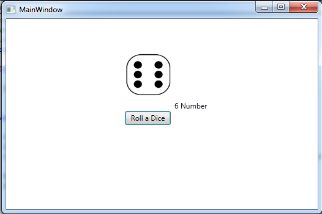

# Dice Rolling and Number Display
## Requires
- Visual Studio 2010
## License
- Apache License, Version 2.0
## Technologies
- WPF
- XAML
## Topics
- WPF Basics
- WPF Data Binding
- WPF Commanding
- WPF CustomControl
- XAML Control Templates
- WPF Path XAML ResourceDictionary Cogweel
## Updated
- 06/09/2012
## Description

Hello <a href="http://webeasyforall.blogspot.com/" target="_blank">Guys</a>, Today I&rsquo;m gonna show you how to make a dice rolling control for Ludo, snake ladder etc in
<a href="http://webeasyforall.blogspot.com/" target="_blank">wpf(Windows presentation foundation)</a>, so let&rsquo;s get started, open a new project of wpf give it to a name say DiceRoll, before moving further let me tell you those which are required for Dice
 rolling control, a button, on its click event it will generate numbers(Integers) randomly, and a
<a href="http://webeasyforall.blogspot.com/" target="_blank">textblock</a> which will show a generated number(integer), and a<a href="http://webeasyforall.blogspot.com/" target="_blank"> image
</a>control, which will show the<a href="http://webeasyforall.blogspot.com/" target="_blank"> Dice face</a>, from toolbox, just drag and drop the button, and change its content to Roll a Dice, Drop a text block &nbsp;control, remove its text, and drag and drop
 image control in your main window, now on click event of <a href="http://webeasyforall.blogspot.com/" target="_blank">
button(Roll a Dice)</a> create an object of class Random, here is the code <a href="http://webeasyforall.blogspot.com/" target="_blank">
(C#)</a> :

&nbsp;

C#

Edit|Remove

csharp

<pre class="csharp">privatevoid&nbsp;button1_Click(object&nbsp;sender,&nbsp;RoutedEventArgs&nbsp;e)&nbsp;
&nbsp;&nbsp;&nbsp;&nbsp;&nbsp;&nbsp;&nbsp;&nbsp;{&nbsp;
&nbsp;&nbsp;&nbsp;&nbsp;&nbsp;&nbsp;&nbsp;&nbsp;&nbsp;&nbsp;&nbsp;&nbsp;Random&nbsp;num&nbsp;=&nbsp;new&nbsp;Random();&nbsp;
&nbsp;&nbsp;&nbsp;&nbsp;&nbsp;&nbsp;&nbsp;&nbsp;}&nbsp;
</pre>

&nbsp;

To<a href="http://webeasyforall.blogspot.com/" target="_blank"> generate</a> number(Integers)
<a href="http://webeasyforall.blogspot.com/" target="_blank">randomly</a>, you just declare an integer say Number so in the next line of the same method<a href="http://webeasyforall.blogspot.com/" target="_blank">(button1_Click)</a>, so now the code is like
 this,

&nbsp;

C#

Edit|Remove

csharp

<pre class="csharp">privatevoid&nbsp;button1_Click(object&nbsp;sender,&nbsp;RoutedEventArgs&nbsp;e)&nbsp;
&nbsp;&nbsp;&nbsp;&nbsp;&nbsp;&nbsp;&nbsp;&nbsp;{&nbsp;
&nbsp;&nbsp;&nbsp;&nbsp;&nbsp;&nbsp;&nbsp;&nbsp;&nbsp;&nbsp;&nbsp;&nbsp;Random&nbsp;num&nbsp;=&nbsp;new&nbsp;Random();&nbsp;
&nbsp;&nbsp;&nbsp;&nbsp;&nbsp;&nbsp;&nbsp;&nbsp;&nbsp;&nbsp;&nbsp;&nbsp;int&nbsp;Number&nbsp;=&nbsp;num.Next(1,&nbsp;7);&nbsp;
&nbsp;&nbsp;&nbsp;&nbsp;&nbsp;&nbsp;&nbsp;&nbsp;}&nbsp;
</pre>

&nbsp;

<a href="http://webeasyforall.blogspot.com/" target="_blank">Num.Next(Int ,int )</a> non-static method takes two
<a href="http://webeasyforall.blogspot.com/" target="_blank">parameters</a>, first one parameter is the starting point, and second point is the End point, here I have used 1 and 7, it will generate 1 to 6 integers, 7 number is excluding, now to show the generated
 number(Integers) on the text box I have added a line :

&nbsp;

C#

Edit|Remove

csharp

<pre class="csharp">privatevoid&nbsp;button1_Click(object&nbsp;sender,&nbsp;RoutedEventArgs&nbsp;e)&nbsp;
&nbsp;&nbsp;&nbsp;&nbsp;&nbsp;&nbsp;&nbsp;&nbsp;{&nbsp;
&nbsp;&nbsp;&nbsp;&nbsp;&nbsp;&nbsp;&nbsp;&nbsp;&nbsp;&nbsp;&nbsp;&nbsp;Random&nbsp;num&nbsp;=&nbsp;new&nbsp;Random();&nbsp;
&nbsp;&nbsp;&nbsp;&nbsp;&nbsp;&nbsp;&nbsp;&nbsp;&nbsp;&nbsp;&nbsp;&nbsp;int&nbsp;Number&nbsp;=&nbsp;num.Next(1,&nbsp;7);&nbsp;
&nbsp;&nbsp;&nbsp;&nbsp;&nbsp;&nbsp;&nbsp;&nbsp;&nbsp;&nbsp;&nbsp;&nbsp;&nbsp;textBlock1.Text&nbsp;=&nbsp;Number.ToString()&#43;&quot;&nbsp;Number&quot;;&nbsp;
&nbsp;}&nbsp;
</pre>

&nbsp;

So When will you click on button<a href="http://webeasyforall.blogspot.com/" target="_blank">(Roll a Dice)</a> it will start showing random number, now the main portion is to show image(DiceFace), I have used BitmapImage class, I have added 6 images, and
 placed these images into Dicefaces, I have created an instance of BitmapImage class, and its
<a href="http://webeasyforall.blogspot.com/" target="_blank">constructor</a> I set up the URI, and and URIKind, and image source is set to<a href="http://webeasyforall.blogspot.com/" target="_blank"> BitmapImage</a>&rsquo;s instance, here is the code :

&nbsp;

C#

Edit|Remove

csharp

<pre class="csharp">privatevoid&nbsp;button1_Click(object&nbsp;sender,&nbsp;RoutedEventArgs&nbsp;e)&nbsp;
&nbsp;&nbsp;&nbsp;&nbsp;&nbsp;&nbsp;&nbsp;&nbsp;{&nbsp;
&nbsp;&nbsp;&nbsp;&nbsp;&nbsp;&nbsp;&nbsp;&nbsp;&nbsp;&nbsp;&nbsp;&nbsp;Random&nbsp;num&nbsp;=&nbsp;new&nbsp;Random();&nbsp;
&nbsp;&nbsp;&nbsp;&nbsp;&nbsp;&nbsp;&nbsp;&nbsp;&nbsp;&nbsp;&nbsp;&nbsp;int&nbsp;Number&nbsp;=&nbsp;num.Next(1,&nbsp;7);&nbsp;
&nbsp;&nbsp;&nbsp;&nbsp;&nbsp;&nbsp;&nbsp;&nbsp;&nbsp;&nbsp;&nbsp;&nbsp;BitmapImage&nbsp;Img&nbsp;=&nbsp;new&nbsp;BitmapImage(new&nbsp;Uri(@&quot;DiceFaces\&quot;&#43;Number.ToString()&#43;&quot;.png&quot;,UriKind.Relative));&nbsp;
&nbsp;&nbsp;&nbsp;&nbsp;&nbsp;&nbsp;&nbsp;&nbsp;&nbsp;&nbsp;&nbsp;&nbsp;&nbsp;
&nbsp;&nbsp;&nbsp;&nbsp;&nbsp;&nbsp;&nbsp;&nbsp;&nbsp;&nbsp;&nbsp;&nbsp;textBlock1.Text&nbsp;=&nbsp;Number.ToString()&#43;&quot;&nbsp;Number&quot;;&nbsp;
&nbsp;&nbsp;&nbsp;&nbsp;&nbsp;&nbsp;&nbsp;&nbsp;&nbsp;&nbsp;&nbsp;&nbsp;image1.Source&nbsp;=&nbsp;Img;&nbsp;
&nbsp;&nbsp;&nbsp;&nbsp;&nbsp;&nbsp;&nbsp;&nbsp;}&nbsp;
</pre>

&nbsp;

<strong>Screen Shot</strong>

<strong> 
</strong>

I hope you have enjoyed it, thank you all, and feel free to ask questions,&nbsp;

&nbsp;

C#XAML

Edit|Remove

csharpxaml

<pre class="csharp">namespace&nbsp;diceRoll&nbsp;
{&nbsp;
&nbsp;&nbsp;&nbsp;&nbsp;///&nbsp;&lt;summary&gt;&nbsp;
&nbsp;&nbsp;&nbsp;&nbsp;///&nbsp;Interaction&nbsp;logic&nbsp;for&nbsp;MainWindow.xaml&nbsp;
&nbsp;&nbsp;&nbsp;&nbsp;///&nbsp;&lt;/summary&gt;&nbsp;
&nbsp;&nbsp;&nbsp;&nbsp;public&nbsp;partial&nbsp;class&nbsp;MainWindow&nbsp;:&nbsp;Window&nbsp;
&nbsp;&nbsp;&nbsp;&nbsp;{&nbsp;
&nbsp;&nbsp;&nbsp;&nbsp;&nbsp;&nbsp;&nbsp;&nbsp;public&nbsp;MainWindow()&nbsp;
&nbsp;&nbsp;&nbsp;&nbsp;&nbsp;&nbsp;&nbsp;&nbsp;{&nbsp;
&nbsp;&nbsp;&nbsp;&nbsp;&nbsp;&nbsp;&nbsp;&nbsp;&nbsp;&nbsp;&nbsp;&nbsp;InitializeComponent();&nbsp;
&nbsp;&nbsp;&nbsp;&nbsp;&nbsp;&nbsp;&nbsp;&nbsp;}&nbsp;
&nbsp;
&nbsp;&nbsp;&nbsp;&nbsp;&nbsp;&nbsp;&nbsp;&nbsp;private&nbsp;void&nbsp;button1_Click(object&nbsp;sender,&nbsp;RoutedEventArgs&nbsp;e)&nbsp;
&nbsp;&nbsp;&nbsp;&nbsp;&nbsp;&nbsp;&nbsp;&nbsp;{&nbsp;
&nbsp;&nbsp;&nbsp;&nbsp;&nbsp;&nbsp;&nbsp;&nbsp;&nbsp;&nbsp;&nbsp;&nbsp;Random&nbsp;num&nbsp;=&nbsp;new&nbsp;Random();&nbsp;
&nbsp;&nbsp;&nbsp;&nbsp;&nbsp;&nbsp;&nbsp;&nbsp;&nbsp;&nbsp;&nbsp;&nbsp;int&nbsp;Number&nbsp;=&nbsp;num.Next(1,&nbsp;7);&nbsp;
&nbsp;&nbsp;&nbsp;&nbsp;&nbsp;&nbsp;&nbsp;&nbsp;&nbsp;&nbsp;&nbsp;&nbsp;BitmapImage&nbsp;Img&nbsp;=&nbsp;new&nbsp;BitmapImage(new&nbsp;Uri(@&quot;DiceFaces\&quot;&#43;Number.ToString()&#43;&quot;.png&quot;,UriKind.Relative));&nbsp;
&nbsp;&nbsp;&nbsp;&nbsp;&nbsp;&nbsp;&nbsp;&nbsp;&nbsp;&nbsp;&nbsp;&nbsp;&nbsp;
&nbsp;&nbsp;&nbsp;&nbsp;&nbsp;&nbsp;&nbsp;&nbsp;&nbsp;&nbsp;&nbsp;&nbsp;textBlock1.Text&nbsp;=&nbsp;Number.ToString()&#43;&quot;&nbsp;Number&quot;;&nbsp;
&nbsp;&nbsp;&nbsp;&nbsp;&nbsp;&nbsp;&nbsp;&nbsp;&nbsp;&nbsp;&nbsp;&nbsp;image1.Source&nbsp;=&nbsp;Img;&nbsp;
&nbsp;&nbsp;&nbsp;&nbsp;&nbsp;&nbsp;&nbsp;&nbsp;}&nbsp;
&nbsp;&nbsp;&nbsp;&nbsp;}&nbsp;
}&nbsp;
</pre>

&nbsp;

