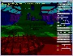
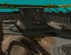

# Direct3D Shadow Win32 Samples
## Requires
- Visual Studio 2012
## License
- MIT
## Technologies
- Win32
- DirectX
- DirectX SDK
## Topics
- Graphics and 3D
## Updated
- 10/12/2015
## Description

The latest version of this sample is hosted on <a href="https://github.com/walbourn/directx-sdk-samples">
GitHub</a>.

This is the DirectX SDK's Direct3D 11 CascadedShadowMaps11 and VarianceShadows11 samples updated to use Visual Studio 2012 and the Windows SDK 8.0 without any dependencies on legacy DirectX SDK content. These samples are Win32 desktop DirectX 11.0 applications
 for Windows 8, Windows 7, and Windows Vista Service Pack 2 with the DirectX 11.0 runtime.&nbsp;

<strong>This is based on the the legacy DirectX SDK (June 2010) Win32 desktop samples running on Windows Vista, Windows 7, and Windows 8. This is not intended for use with Windows Store apps or Windows RT, although the techniques are applicable.</strong>

For Windows Store apps, you should look at the <a href="http://code.msdn.microsoft.com/Shadow-mapping-sample-3fbc3423">
Shadow mapping sample</a>.

<h1>Description</h1>

These samples&nbsp;demonstrate shadow techniques with Direct3D 11 using the&nbsp;<a href="http://go.microsoft.com/fwlink/?LinkId=320437">DXUT for Direct3D 11</a>&nbsp;framework for Win32 desktop applications.

<h2>CascadedShadowMaps11</h2>
<h2></h2>

This sample demonstrates the cascaded shadow map (CSM) algorithm. This algorithm also demonstrates several techniques that can be used to make efficient use of the shadow map.&nbsp;

<ul>
<li><strong>Visualize Cascades </strong>Checking this box highlights the different layers of the cascade in the same color as the slider. This option defaults to off because it is for debug visualization.
</li><li><strong>32-bit Buffer Dropdown</strong>: This drop-down toggles between DXGI_FORMAT_D32_FLOAT, DXGI_FORMAT_D24_UNORM_S8_UINT, and DXGI_FORMAT_D16_UNORM. Higher precision depth buffers cost more in terms of performance and size but limit precision issues.
</li><li><strong>Texture Size</strong>: This slider modifies the size of the depth-buffer texture. The size does not change until the mouse button is released in order to make the application more interactive.
</li><li><strong>PCF Blur</strong>: This slider determines the size of the PCF blur kernel. &quot;1&quot; is a 1&times;1 and there for only uses hardware PCF, &quot;3&quot; uses a 3&times;3 on top of hardware PCF and so forth.
</li><li><strong>Offset</strong>: The offset value represented by this slider is subtracted from the pixel in light-space to mitigate surface acne. Too much offset leads to objects loosing their shadows.
</li><li><strong>Cascade Blur</strong>: The slider determines the size of the area between cascades that is blurred when this option is checked. Blurring between the cascade layers can hide the seam that occurs between different cascades. Even with dynamic branching
 enabled blurring between layers can be expensive so it is defaulted to off. </li><li><strong>DDX, DDY Offset</strong>: This technique calculates a unique offset for neighboring texels in the shadow map by mapping the shadow map&rsquo;s surface to a plane. The white paper &quot;Cascaded Shadow Maps&quot; covers this technique in detail. This technique
 is expensive and should be used as a last resort for large PCF kernels where an offset is not sufficient.
</li><li><strong>Power Plant Dropdown</strong>: This drop-down toggles between difference scenes.
</li><li><strong>Eye Camera Dropdown</strong>: This drop-down toggles between the eye camera and the light camera. The user can also select any one of the orthographic cameras that correspond to the different cascades.
</li><li><strong>Fit Light to Texels</strong>: This technique moves the light in texel-sized increments. This keeps the shadows edges from swimming when the eye-camera moves.
</li><li><strong>Fit Scene Dropdown</strong>: This drop-down allows the user to switch between Fit Secne and Fit Cascade. These two options determine how the orthographic projection is calculated.
</li><li><strong>AABB/Scene NearFar</strong>: This drop-down allows the user to switch between AABB/Scene NearFar, 0:1 NearFar, and AABB Near Far.
</li><li><strong>Map Selection Dropdown: </strong>This drop-down allows the user to switch between Map Selection and Interval Selection. Map selection makes more efficient use of the cascade and is therefore set to default. Interval selection is slightly faster.
</li><li><strong>Levels Dropdown: </strong>This drop-down determines the number of cascades.
</li><li><strong>Colored sliders: </strong>For each cascade, there appears a slider that determines the partitioning of the view frustum into cascades.
</li></ul>
<h2>VarianceShadows11</h2>

VarianceShadows11 demonstrates how to integrate cascaded shadow maps with variance shadow maps.

This sample demonstrates how to use the cascaded shadow map (CSM) algorithm with the variance shadow map (VSM) algorithm. This sample is an extension of the
<em>CascadedShadowMaps11 </em>sample. Percentage closer filtering has been removed and variance shadow maps have been added.

The documentation above covers the majority of configuration options for this sample. The only added option is the ability to select the type of shadow map filtering.

<h1>Dependancies</h1>

DXUT-based samples typically make use of runtime HLSL compilation. Build-time compilation is recommended for all production Direct3D applications, but for experimentation and samples development runtime HLSL compiliation is preferred. Therefore, the D3DCompile*.DLL
 must be available in the search path when these programs are executed.

<ul>
<li>When using the Windows 8.x SDK and targeting Windows Vista or later, you can include the D3DCompile_46 or D3DCompile_47 DLL side-by-side with your application copying the file from the REDIST folder.
</li></ul>
<pre style="padding-left:60px">%ProgramFiles(x86)%\Windows kits\8.0\Redist\D3D\arm, x86 or x64</pre>
<pre style="padding-left:60px">%ProgramFiles(x86)%\Windows kits\8.1\Redist\D3D\arm, x86 or x64</pre>
<h1>Building with Visual Studio 2010</h1>

The code in these samples can be built using Visual Studio 2010 rather than Visual Studio 2012. The changes required are:

<ul>
<li>Change the Platform Toolset to &quot;v100&quot; </li><li>Obtain the <a href="http://msdn.microsoft.com/en-us/windows/hardware/hh852363">
Windows SDK 8.0</a> </li><li>Use the <a href="http://blogs.msdn.com/b/vcblog/archive/2012/11/23/using-the-windows-8-sdk-with-visual-studio-2010-configuring-multiple-projects.aspx">
instructions </a>for adding the Windows 8.0 SDK headers for VS 2010 projects </li></ul>
<h1>Building with Visual Studio 2013</h1>

This sample can be modified to build with Visual Studio 2013 using the Windows 8.1 SDK. Set the Platform Toolset to &quot;v120&quot; for all configurations, and obtain the latest DXUT package. Remove the &quot;DXUT_2012.vcxproj&quot; &amp; &quot;DXUTOpt_2012.vcxproj&quot; references,
 add the projects &quot;DXUT_2013.vcxproj&quot; &amp; &quot;DXUTOpt_2013.vcxproj&quot;, and add new References to these projects.

You can also allow VS 2013 to upgrade the projects inp lace.

<h1>Version History</h1>
<ul>
<li>July 29, 2014 - Updated for July 2014 DXUT release </li><li>September 18, 2013 - Initial release </li></ul>
<h1>More Information</h1>

<a href="http://blogs.msdn.com/b/chuckw/archive/2012/03/22/where-is-the-directx-sdk.aspx">Where is the DirectX SDK?</a>

<a href="http://blogs.msdn.com/b/chuckw/archive/2013/07/01/where-is-the-directx-sdk-2013-edition.aspx">Where is the DirectX SDK (2013 Edition)?</a>&nbsp;

<a href="http://blogs.msdn.com/b/chuckw/archive/2013/09/14/dxut-for-win32-desktop-update.aspx">DXUT for Win32 Desktop Update</a>

<a href="http://blogs.msdn.com/b/chuckw/">Games for Windows and DirectX SDK blog</a>

