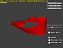
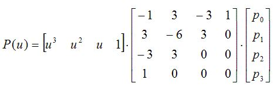

# Direct3D Tessellation Win32 Samples
## Requires
- Visual Studio 2012
## License
- MIT
## Technologies
- Win32
- DirectX
- DirectX SDK
## Topics
- Graphics and 3D
## Updated
- 10/12/2015
## Description

The latest version of this sample is hosted on <a href="https://github.com/walbourn/directx-sdk-samples">
GitHub</a>.

This is the DirectX SDK's Direct3D 11 SimpleBezier11 and SubD11 samples updated to use Visual Studio 2012 and the Windows SDK 8.0 without any dependencies on legacy DirectX SDK content. These samples are Win32 desktop DirectX 11.0 applications for Windows
 8, Windows 7, and Windows Vista Service Pack 2 with the DirectX 11.0 runtime.&nbsp;

<strong>This is based on the the legacy DirectX SDK (June 2010) Win32 desktop samples running on Windows Vista, Windows 7, and Windows 8. This is not intended for use with Windows Store apps or Windows RT, although the techniques are applicable.</strong>

<h1>Description</h1>

These samples are&nbsp;Direct3D 11 Hardware Tessellation samples using the&nbsp;<a href="http://go.microsoft.com/fwlink/?LinkId=320437">DXUT for Direct3D 11</a>&nbsp;framework for Win32 desktop applications.

<h2>SimpleBezier11</h2>

DirectX 11 introduces three new stages to the graphics pipeline: the Hull-Shader Stage, the fixed-function Tessellator Stage, and the Domain-Shader Stage. Together, these stages operate in between the vertex shader and geometry shader to provide the flexibility
 to implement a variety of different surface representations, including Bezier patches and subdivision surfaces. This sample demonstrates the basic usage of the DirectX 11 tessellation feature to render a simple cubic Bezier patch.

<h3>Setup</h3>

The first and most drastic change required when using the tessellator is to the input mesh data. Instead of using triangles, you can now use any surface representation for your mesh data. This sample uses four cubic Bezier patches, each with 16 control points.
 After that, you must set the hull and domain shader and tell DirectX the input topology using the new D3D11_PRIMITIVE_TOPOLOGY types.

<pre style="padding-left:30px">pd3dImmediateContext-&gt;HSSetShader( pHullShader, NULL, 0 ); pd3dImmediateContext-&gt;DSSetShader( pDomainShader, NULL, 0 ); pd3dImmediateContext-&gt;IASetPrimitiveTopology( D3D11_PRIMITIVE_TOPOLOGY_16_CONTROL_POINT_PATCHLIST );</pre>
<h3>Vertex Shader</h3>

The first step of the pipeline is the vertex shader. This is largely unchanged, except for the distinction that it now operates on the input control points from the mesh before they continue on to the domain shader. For example, you might implement control
 point skinning in the vertex shader. The input to the vertex shader comes from the vertex buffer. The output from the vertex shader will go into the hull shader.

<h3>Hull Shader</h3>

The hull shader is the first of the new stages added in DirectX 11. It operates in two phases; the first is per output control point, controlled by the outputcontrolpoints attribute. The input comes from the transformed control points from the vertex shader.
 The output control points will continue on to the domain shader. For a simple Bezier patch, nothing extra needs to be done and control points can be passed straight to the domain shader to be evaluated. For more complex surfaces, the hull shader might perform
 a basis conversion or generate the control points from adjacency information. The number of input control points and output control points are not necessarily the same, but in this sample they are.

The second phase of the hull shader is the constant function. It is invoked once per patch and specified with the
<strong>patchconstantfunc </strong>attribute. The simplest constant function will output the tessellation factors
<strong>SV_TessFactor </strong>and <strong>SV_InsideTessFactor</strong> that the fixed-function tessellator stage will use.

<h3>Fixed-Function Tessellator</h3>

The next state of the pipeline is the fixed-function tessellator. This portion subdivides the input domain into the number primitives requested by the tessellation factor values. This stage does not care about the control points at all; it is concerned only
 with generating the output primitives and UVW coordinates for the domain shader. The input consists of the tessellation factors from
<strong>SV_TessFactor </strong>and <strong>SV_InsideTessFactor </strong>and the partitioning mode domain from the
<strong>partitioning </strong>and <strong>domain </strong>attributes respectively. From this it will output the
<strong>SV_DomainLocation </strong>normalized UVW coordinates for the domain shader.

<h3>Domain Shader</h3>

The domain shader is the final stage of the tessellation pipeline added in DirectX 11. This shader operates on the output vertices created by the fixed-function tessellator. The domain shader is responsible for calculating the final vertex's position and
 attributes from the control points. This is where the Bezier surface is evaluated to calculate the positions.

The input control points come from the hull shader and the input UVW coordinates come from fixed-function tessellator. Using this information, the Bezier surface can be evaluated in the U and V directions with matrix form of the cubic Bezier curve function:

Finally, the surface normal can be evaluated as the cross-product of the U and V derivatives.

<h3>Geometry Shader</h3>

The geometry shader is not illustrated in this sample; however, when used, it operates after the domain shader and takes the domain shader's outputs as its inputs.&nbsp;

<h2>SubD11</h2>

The SubD11 sample implements the algorithm described in the paper &quot;<a href="http://research.microsoft.com/~cloop/msrtr-2007-44.pdf">Approximating Catmull-Clark Subdivision Surfaces with Bicubic Patches</a>&quot; by Charles Loop and Scott Schaefer. This sample
 is similar to the DirectX SDK <strong>SubD10 </strong>sample, except that it has been enhanced to take advantage of three new Direct3D 11 pipeline stages: the hull shader, the tessellator, and the domain shader.

<h3>Sample Performance and Architecture Notes</h3>

The Catmull-Clark content flows through the graphics pipeline in the following steps:

<ol>
<li>The input to the pipeline is a Catmull-Clark control mesh, which consists of quads and adjacency information. The control mesh is stored in a specially constructed SDKMESH content file. The adjacency information is computed offline using the Samples Content
 Exporter. </li><li>The vertex shader is used to deform the control mesh using skeletal animation.
</li><li>The hull shader is used for basis conversion between the control mesh and a 4&times;4 Bezier patch.
</li><li>The tessellator generates domain points and triangles that are based on the partitioning style and tessellation factor.
</li><li>The domain shader is used to compute tangent patch data for the patch and then to evaluate all of the patches into a position and normal value for each domain point. Displacement mapping is also applied within the domain shader. Note that the tangent patch
 data is only used to compute the surface normal of the patch at the domain point. Texture tangent data from the content is merely interpolated in the domain shader and passed on to the pixel shader for use in normal mapping.
</li><li>Finally, the pixel shader evaluates the normal map and produces a lit pixel. </li></ol>

Since this sample depends on the new Direct3D 11 pipeline stages, it can only operate by using the reference rasterizer at this time. As a result, it takes several seconds to render each frame. When Direct3D 11 hardware is available, we expect this sample
 to run thousands of times faster.

The architecture of the hull shader is currently designed for maximum readability, and it does not generate a compiled shader that is expected to be efficient on hardware. Specifically, the switch statements that are used to select different code paths for
 each hull shader output are inefficient. In future releases of this sample, the hull shader will be rewritten to avoid these inefficient constructs, at the expense of readability.

Currently the sample features tessellation using integer partitioning. Future releases will also demonstrate fractional and pow2 partitioning.

<h3>Features</h3>

The following settings can be changed at run time:

<ul>
<li>The bump height can be adjusted, which demonstrates displacement mapping. </li><li>The tessellation factor can be adjusted to increase or decrease the level of tessellation.
</li><li>A wireframe overlay can be enabled to show the triangles that are generated by the tessellator.
</li><li>Mesh animation can be enabled to demonstrate deformable subdivision surfaces.
</li></ul>
<h1>Dependancies</h1>

DXUT-based samples typically make use of runtime HLSL compilation. Build-time compilation is recommended for all production Direct3D applications, but for experimentation and samples development runtime HLSL compiliation is preferred. Therefore, the D3DCompile*.DLL
 must be available in the search path when these programs are executed.

<ul>
<li>When using the Windows 8.x SDK and targeting Windows Vista or later, you can include the D3DCompile_46 or D3DCompile_47 DLL side-by-side with your application copying the file from the REDIST folder.
</li></ul>
<pre style="padding-left:60px">%ProgramFiles(x86)%\Windows kits\8.0\Redist\D3D\arm, x86 or x64</pre>
<pre style="padding-left:60px">%ProgramFiles(x86)%\Windows kits\8.1\Redist\D3D\arm, x86 or x64</pre>
<h1>Building with Visual Studio 2010</h1>

The code in these samples can be built using Visual Studio 2010 rather than Visual Studio 2012. The changes required are:

<ul>
<li>Change the Platform Toolset to &quot;v100&quot; </li><li>Obtain the <a href="http://msdn.microsoft.com/en-us/windows/hardware/hh852363">
Windows SDK 8.0</a> </li><li>Use the <a href="http://blogs.msdn.com/b/vcblog/archive/2012/11/23/using-the-windows-8-sdk-with-visual-studio-2010-configuring-multiple-projects.aspx">
instructions </a>for adding the Windows 8.0 SDK headers for VS 2010 projects </li></ul>
<h1>Building with Visual Studio 2013</h1>

This sample can be modified to build with Visual Studio 2013 using the Windows 8.1 SDK. Set the Platform Toolset to &quot;v120&quot; for all configurations, and obtain the latest DXUT package. Remove the &quot;DXUT_2012.vcxproj&quot; &amp; &quot;DXUTOpt_2012.vcxproj&quot; references,
 add the projects &quot;DXUT_2013.vcxproj&quot; &amp; &quot;DXUTOpt_2013.vcxproj&quot;, and add new References to these projects.

You can also allow VS 2013 to upgrade the projects in place.

<h1>Version History</h1>
<ul>
<li>July 28, 2014 - Updated for DXUT July 2014 release </li><li>September 18, 2013 - Initial release </li></ul>
<h1>More Information</h1>

<a href="http://blogs.msdn.com/b/chuckw/archive/2012/03/22/where-is-the-directx-sdk.aspx">Where is the DirectX SDK?</a>

<a href="http://blogs.msdn.com/b/chuckw/archive/2013/07/01/where-is-the-directx-sdk-2013-edition.aspx">Where is the DirectX SDK (2013 Edition)?</a>&nbsp;

<a href="http://blogs.msdn.com/b/chuckw/archive/2013/09/14/dxut-for-win32-desktop-update.aspx">DXUT for Win32 Desktop Update</a>

<a href="http://blogs.msdn.com/b/chuckw/">Games for Windows and DirectX SDK blog</a>

