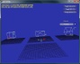

# DirectXMath Win32 Sample
## Requires
- Visual Studio 2012
## License
- MIT
## Technologies
- Win32
- DirectX
- DirectX SDK
## Topics
- Graphics and 3D
## Updated
- 10/12/2015
## Description

The latest version of this sample is hosted on <a href="https://github.com/walbourn/directx-sdk-samples">
GitHub</a>.

This is the DirectX SDK's Collision sample updated to use Visual Studio 2012 and the Windows SDK 8.0 without any dependencies on legacy DirectX SDK content. This sample is a Win32 desktop DirectX 11.0 application for Windows 8, Windows 7, and Windows Vista
 Service Pack 2 with the DirectX 11.0 runtime.&nbsp;

<strong>This is based on the the legacy DirectX SDK (June 2010) Win32 desktop samples running on Windows Vista, Windows 7, and Windows 8. This is not intended for use with Windows Store apps or Windows RT, although the techniques are applicable.</strong>

<h1>Description</h1>

This sample demonstrates <a href="http://blogs.msdn.com/b/chuckw/archive/2012/03/27/introducing-directxmath.aspx">
DirectXMath</a> using the&nbsp;<a href="http://go.microsoft.com/fwlink/?LinkId=248929">DirectX Tool Kit</a> and
<a href="http://go.microsoft.com/fwlink/?LinkId=320437">DXUT for Direct3D 11</a>&nbsp;framework for Win32 desktop applications.

<h2>Collision</h2>
<h2></h2>
<h3>Create and Initialize Collision Object Structures</h3>

The DirectXMath Collision library has API functions to test collisions between many types of geometric shapes, including frustums, spheres, axis-aligned bounding boxes, oriented bounding boxes, triangles, planes, and rays. The Collision library header file
 also defines simple structures for most of these shapes. DirectXMath Math library types (XMVECTOR, and so on) are used for rays, triangles, and planes.

The collision objects are created in two groups&mdash;primary and secondary. Each collision test occurs between a primary object and a secondary object, and the collision result is recorded on the secondary object. Therefore, for secondary objects, a custom
 data structure is made for each type of collision object. The data structure contains a collision object structure and an integer flag to hold collision results.

The sample is visually organized so that each group of objects on the screen contains one primary object and a collection of secondary objects. Primary objects are made significantly larger than secondary objects.

Notice how the frustum object is created from a projection matrix. This way of constructing a frustum object makes it easy to create a frustum from your title's camera projection matrix, and then use the Collision library to do frustum testing on game objects.

<h3>Animate Collision Objects</h3>

Note that only the secondary collision objects are animated. The sample uses simple mathematics functions to move these objects around and through the primary collision objects, providing opportunities for collisions to occur.

<h3>Update the Camera</h3>

The sample uses the standard DXUT Model Viewer camera. You can select preset camera locations for the four sample collision groups through the UI or by pressing 1, 2, 3, or 4 on the keyboard.

<h3>Test Collisions</h3>

The Collide function calls various functions in the Collision library on pairs of objects. The calls are grouped by primary object, so frustum tests come first, then axis-aligned box tests, and so on. Results from the collision tests, which are usually Boolean,
 are stored in the secondary object involved in each test.

For ray-object collision tests, the collision function returns a float parameter that represents the distance along the ray at which the collision occurred. If one of the ray-object collision tests succeeds, the float parameter is used to compute the 3D
 location of the collision. This location is stored as the center of a small cube, which is rendered later.

<h3>Render Collision Objects</h3>

The Collision sample uses various drawing functions to render each collision object in wireframe graphics. The sample progresses through the following steps:

<ul>
<li>It draws black gridlines to represent a ground plane below each object group. These gridlines are purely decorative, and help as a visual reference to establish the scene.
</li><li>It draws the primary collision objects in white. </li><li>Using the results of each collision test, the sample draws the secondary objects in various colors. Red represents a collision; light green represents no collision. For the frustum collision tests, yellow represents a partial collision&mdash;that is, the
 object is partially inside the frustum, and partially outside. </li><li>The sample renders ray-object collision tests in a separate group, and renders the collision ray in white. To better visually represent the extended direction of the collision ray, the sample renders a longer gray ray aligned with the collision ray.
</li><li>If one of the ray-object collision tests succeeds, the sample renders a small yellow cube at the collision location.
</li></ul>
<h1>Dependancies</h1>

DXUT-based samples typically make use of runtime HLSL compilation. Build-time compilation is recommended for all production Direct3D applications, but for experimentation and samples development runtime HLSL compiliation is preferred. Therefore, the D3DCompile*.DLL
 must be available in the search path when these programs are executed.

<ul>
<li>When using the Windows 8.x SDK and targeting Windows Vista or later, you can include the D3DCompile_46 or D3DCompile_47 DLL side-by-side with your application copying the file from the REDIST folder.
</li></ul>
<pre style="padding-left:60px">%ProgramFiles(x86)%\Windows kits\8.0\Redist\D3D\arm, x86 or x64</pre>
<pre style="padding-left:60px">%ProgramFiles(x86)%\Windows kits\8.1\Redist\D3D\arm, x86 or x64</pre>
<h1>Building with Visual Studio 2013</h1>

This sample can be modified to build with Visual Studio 2013 using the Windows 8.1 SDK. Set the Platform Toolset to &quot;v120&quot; for all configurations, and obtain the latest DXUT and DirectXTK packages. Remove the &quot;DXUT_DirectXTK_2012.vcxproj&quot;, &quot;DXUTOpt_DirectXTK_2012.vcxproj&quot;
 &amp; &quot;DirectXTK_Desktop_2012.vcxproj&quot; references, add the projects &quot;DXUT_DirectXTK_2013.vcxproj&quot;, &quot;DXUTOpt_DirectXTK_2013.vcxproj&quot; &amp; &quot;DirectXTK_Desktop_2013.vcxproj&quot;, and add new References to these projects.

You can also allow VS 2013 to upgrade the projects in place.

<h1>Version History</h1>
<ul>
<li>July 29, 2014 - Updated for July 2014 DirectXTK and DXUT (11.06) releases </li><li>September 22, 2013 - Initial release </li></ul>
<h1>More Information</h1>

<a href="http://blogs.msdn.com/b/chuckw/archive/2012/03/22/where-is-the-directx-sdk.aspx">Where is the DirectX SDK?</a>

<a href="http://blogs.msdn.com/b/chuckw/archive/2013/07/01/where-is-the-directx-sdk-2013-edition.aspx">Where is the DirectX SDK (2013 Edition)?</a>&nbsp;

<a href="http://blogs.msdn.com/b/chuckw/archive/2013/09/14/dxut-for-win32-desktop-update.aspx">DXUT for Win32 Desktop Update</a>

<a href="https://directxtk.codeplex.com/">DirectX Tool Kit</a>

<a href="http://blogs.msdn.com/b/chuckw/">Games for Windows and DirectX SDK blog</a>

