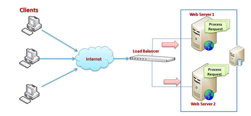

# Distributed Cache with WebAPI
## Requires
- Visual Studio 2013
## License
- MIT
## Technologies
- Cache
- WebAPI
- redis
## Topics
- redis
- Web Farm
- Distributed Cache
## Updated
- 05/20/2015
## Description

&nbsp;

<h1>Introduction</h1>

When using an in-process cache, your cache elements are local to a single instance of your application. In case of Web Farm solution, the same request could return different results base on which server is processing the request. Distributed cache instead
 offers a shared storage.

In a web farm architecture, a single application is hosted on multiple IIS Server and those are connected with Load Balancer. Whenever some request come to server the Load Balancer, based on the traffic on each server, distributes the request to the corresponding
 web server.

If we want to have a cache shared between the IIS servers, we need to implement a custom mechanism.

<h1>Building the Sample</h1>

In this example I created a cache action filter, using <a title="Redis" href="http://redis.io/">
Redis</a> <strong>key-value cache</strong>&nbsp;to store data.You can download the Redis installer from this link:

<a title="Redis installer" href="https://github.com/rgl/redis/downloads">https://github.com/rgl/redis/downloads</a>

For my implementation I used<a href="https://github.com/downloads/rgl/redis/redis-2.4.6-setup-64-bit.exe"> redis-2.4.6-setup-64-bit.exe</a> &mdash; Redis 2.4.6 Windows Setup (64-bit).

Once installed, Redis behave as an windows services:

Description

To make my wife easy, I decider to use one of the most used&nbsp;<a title="StackExchange.Redis" href="https://github.com/StackExchange/StackExchange.Redis">StackExchange.Redis</a>&nbsp;client library to read and write Redis. This wrapper basically&nbsp;take
 care of istantiating a reference to Redis only once and the performs read and write operation.

C#

Edit|Remove

csharp
<pre class="hidden">    public class RedisCache : ICache
    {
        #region Static properties

        private static volatile ConnectionMultiplexer _redis = null;
        private static readonly object _initLock = new object();

        #endregion

        #region Constructors

        /// &lt;summary&gt;
        ///     Initializes a new instance of the &lt;see cref=&quot;RedisCache&quot; /&gt; class.
        /// &lt;/summary&gt;
        /// &lt;param name=&quot;ipAdrress&quot;&gt;The ip adrress.&lt;/param&gt;
        public RedisCache(string ipAdrress)
        {
            Contract.Requires(!String.IsNullOrWhiteSpace(ipAdrress));

            if (_redis == null)
            {
                lock (_initLock)
                {
                    if (_redis == null) _redis = ConnectionMultiplexer.Connect(ipAdrress);
                }
            }
        }

        #endregion

        #region Public methods

        /// &lt;summary&gt;
        ///     Existses the specified key.
        /// &lt;/summary&gt;
        /// &lt;param name=&quot;key&quot;&gt;The key.&lt;/param&gt;
        /// &lt;returns&gt;&lt;/returns&gt;
        public bool Exists(string key)
        {
            Contract.Requires(!String.IsNullOrWhiteSpace(key));

            return _redis.GetDatabase().KeyExists(key);
        }

        /// &lt;summary&gt;
        ///     Deletes the specified key.
        /// &lt;/summary&gt;
        /// &lt;param name=&quot;key&quot;&gt;The key.&lt;/param&gt;
        /// &lt;returns&gt;&lt;/returns&gt;
        /// &lt;exception cref=&quot;ArgumentNullException&quot;&gt;key&lt;/exception&gt;
        public bool Delete(string key)
        {
            Contract.Requires(!String.IsNullOrWhiteSpace(key));

            return _redis.GetDatabase().KeyDelete(key);
        }

        /// &lt;summary&gt;
        ///     Add the specified object to the cache.
        /// &lt;/summary&gt;
        /// &lt;param name=&quot;key&quot;&gt;The key.&lt;/param&gt;
        /// &lt;param name=&quot;value&quot;&gt;The value.&lt;/param&gt;
        /// &lt;param name=&quot;forceOverWrite&quot;&gt;if set to &lt;c&gt;true&lt;/c&gt; [force over write].&lt;/param&gt;
        /// &lt;returns&gt;&lt;/returns&gt;
        public bool Add(string key, object value, bool forceOverWrite = false)
        {
            Contract.Requires(!String.IsNullOrWhiteSpace(key));

            return Add(key, value, TimeSpan.Zero, forceOverWrite);
        }

        /// &lt;summary&gt;
        ///     Add the specified key.
        /// &lt;/summary&gt;
        /// &lt;param name=&quot;key&quot;&gt;The key.&lt;/param&gt;
        /// &lt;param name=&quot;value&quot;&gt;The value.&lt;/param&gt;
        /// &lt;param name=&quot;slidingExpiration&quot;&gt;The sliding expiration.&lt;/param&gt;
        /// &lt;param name=&quot;forceOverWrite&quot;&gt;if set to &lt;c&gt;true&lt;/c&gt; [force over write].&lt;/param&gt;
        /// &lt;returns&gt;&lt;/returns&gt;
        public bool Add(string key, object value, TimeSpan slidingExpiration, bool forceOverWrite)
        {
            Contract.Requires(!String.IsNullOrWhiteSpace(key));

            bool itemExists = Exists(key);
            if (!forceOverWrite &amp;&amp; itemExists) return false;

            if (itemExists) Delete(key);

            IDatabase db = _redis.GetDatabase();
            RedisValue redisValue = TrasformToRedisValue(value);
            return db.HashSet(key, key, redisValue) &amp;&amp; db.KeyExpire(key, slidingExpiration);
        }

        /// &lt;summary&gt;
        ///     Gets the specified key.
        /// &lt;/summary&gt;
        /// &lt;typeparam name=&quot;T&quot;&gt;&lt;/typeparam&gt;
        /// &lt;param name=&quot;key&quot;&gt;The key.&lt;/param&gt;
        /// &lt;returns&gt;&lt;/returns&gt;
        public T Get&lt;T&gt;(string key)
        {
            Contract.Requires(!String.IsNullOrWhiteSpace(key));

            IDatabase db = _redis.GetDatabase();
            RedisValue redisValue = db.HashGet(key, key);
            return TrasformFromRedisValue&lt;T&gt;(redisValue);
        }

        /// &lt;summary&gt;
        ///     Gets the specified key.
        /// &lt;/summary&gt;
        /// &lt;param name=&quot;key&quot;&gt;The key.&lt;/param&gt;
        /// &lt;param name=&quot;type&quot;&gt;The type.&lt;/param&gt;
        /// &lt;returns&gt;&lt;/returns&gt;
        public object Get(string key, Type type)
        {
            Contract.Requires(!String.IsNullOrWhiteSpace(key));

            IDatabase db = _redis.GetDatabase();
            RedisValue redisValue = db.HashGet(key, key);
            return TrasformFromRedisValue&lt;object&gt;(redisValue);
        }

        #endregion

        #region Private methods

        /// &lt;summary&gt;
        ///     Trasforms to redis value.
        /// &lt;/summary&gt;
        /// &lt;param name=&quot;value&quot;&gt;The value.&lt;/param&gt;
        /// &lt;returns&gt;&lt;/returns&gt;
        private RedisValue TrasformToRedisValue(object value)
        {
            return Serialize(value);
        }

        /// &lt;summary&gt;
        ///     Trasforms from redis value.
        /// &lt;/summary&gt;
        /// &lt;typeparam name=&quot;T&quot;&gt;&lt;/typeparam&gt;
        /// &lt;param name=&quot;redisValue&quot;&gt;The redis value.&lt;/param&gt;
        /// &lt;returns&gt;&lt;/returns&gt;
        private T TrasformFromRedisValue&lt;T&gt;(RedisValue redisValue)
        {
            if (redisValue.IsNull) return default(T);

            return (T)ConvertRedisValueToObject(redisValue);
        }

        /// &lt;summary&gt;
        ///     Check and convert native type supported from Redis.
        /// &lt;/summary&gt;
        /// &lt;param name=&quot;value&quot;&gt;The value.&lt;/param&gt;
        /// &lt;returns&gt;&lt;/returns&gt;
        private object ConvertRedisValueToObject(RedisValue value)
        {
            return DeSerialize((Byte[])value);
        }

        /// &lt;summary&gt;
        ///     Serializes the specified object.
        /// &lt;/summary&gt;
        /// &lt;param name=&quot;obj&quot;&gt;The object.&lt;/param&gt;
        /// &lt;returns&gt;&lt;/returns&gt;
        /// &lt;exception cref=&quot;System.ArgumentException&quot;&gt;Parameter is invalid.;obj;null&lt;/exception&gt;
        private byte[] Serialize(object obj)
        {
            using (var ms = new MemoryStream())
            {
                var bf = new BinaryFormatter();
                bf.Serialize(ms, obj);
                ms.Seek(0, SeekOrigin.Begin);
                byte[] result = ms.ToArray();
                ms.Flush();
                return result;
            }
        }

        /// &lt;summary&gt;
        ///     Des the serialize.
        /// &lt;/summary&gt;
        /// &lt;param name=&quot;obj&quot;&gt;The object.&lt;/param&gt;
        /// &lt;returns&gt;&lt;/returns&gt;
        private object DeSerialize(byte[] obj)
        {
            using (var ms = new MemoryStream(obj))
            {
                var bf = new BinaryFormatter();
                ms.Seek(0, SeekOrigin.Begin);
                object result = bf.Deserialize(ms);
                ms.Flush();
                return result;
            }
        }

        #endregion
    }</pre>

<pre class="csharp">&nbsp;&nbsp;&nbsp;&nbsp;public&nbsp;class&nbsp;RedisCache&nbsp;:&nbsp;ICache&nbsp;
&nbsp;&nbsp;&nbsp;&nbsp;{&nbsp;
&nbsp;&nbsp;&nbsp;&nbsp;&nbsp;&nbsp;&nbsp;&nbsp;#region&nbsp;Static&nbsp;properties&nbsp;
&nbsp;
&nbsp;&nbsp;&nbsp;&nbsp;&nbsp;&nbsp;&nbsp;&nbsp;private&nbsp;static&nbsp;volatile&nbsp;ConnectionMultiplexer&nbsp;_redis&nbsp;=&nbsp;null;&nbsp;
&nbsp;&nbsp;&nbsp;&nbsp;&nbsp;&nbsp;&nbsp;&nbsp;private&nbsp;static&nbsp;readonly&nbsp;object&nbsp;_initLock&nbsp;=&nbsp;new&nbsp;object();&nbsp;
&nbsp;
&nbsp;&nbsp;&nbsp;&nbsp;&nbsp;&nbsp;&nbsp;&nbsp;#endregion&nbsp;
&nbsp;
&nbsp;&nbsp;&nbsp;&nbsp;&nbsp;&nbsp;&nbsp;&nbsp;#region&nbsp;Constructors&nbsp;
&nbsp;
&nbsp;&nbsp;&nbsp;&nbsp;&nbsp;&nbsp;&nbsp;&nbsp;///&nbsp;&lt;summary&gt;&nbsp;
&nbsp;&nbsp;&nbsp;&nbsp;&nbsp;&nbsp;&nbsp;&nbsp;///&nbsp;&nbsp;&nbsp;&nbsp;&nbsp;Initializes&nbsp;a&nbsp;new&nbsp;instance&nbsp;of&nbsp;the&nbsp;&lt;see&nbsp;cref=&quot;RedisCache&quot;&nbsp;/&gt;&nbsp;class.&nbsp;
&nbsp;&nbsp;&nbsp;&nbsp;&nbsp;&nbsp;&nbsp;&nbsp;///&nbsp;&lt;/summary&gt;&nbsp;
&nbsp;&nbsp;&nbsp;&nbsp;&nbsp;&nbsp;&nbsp;&nbsp;///&nbsp;&lt;param&nbsp;name=&quot;ipAdrress&quot;&gt;The&nbsp;ip&nbsp;adrress.&lt;/param&gt;&nbsp;
&nbsp;&nbsp;&nbsp;&nbsp;&nbsp;&nbsp;&nbsp;&nbsp;public&nbsp;RedisCache(string&nbsp;ipAdrress)&nbsp;
&nbsp;&nbsp;&nbsp;&nbsp;&nbsp;&nbsp;&nbsp;&nbsp;{&nbsp;
&nbsp;&nbsp;&nbsp;&nbsp;&nbsp;&nbsp;&nbsp;&nbsp;&nbsp;&nbsp;&nbsp;&nbsp;Contract.Requires(!String.IsNullOrWhiteSpace(ipAdrress));&nbsp;
&nbsp;
&nbsp;&nbsp;&nbsp;&nbsp;&nbsp;&nbsp;&nbsp;&nbsp;&nbsp;&nbsp;&nbsp;&nbsp;if&nbsp;(_redis&nbsp;==&nbsp;null)&nbsp;
&nbsp;&nbsp;&nbsp;&nbsp;&nbsp;&nbsp;&nbsp;&nbsp;&nbsp;&nbsp;&nbsp;&nbsp;{&nbsp;
&nbsp;&nbsp;&nbsp;&nbsp;&nbsp;&nbsp;&nbsp;&nbsp;&nbsp;&nbsp;&nbsp;&nbsp;&nbsp;&nbsp;&nbsp;&nbsp;lock&nbsp;(_initLock)&nbsp;
&nbsp;&nbsp;&nbsp;&nbsp;&nbsp;&nbsp;&nbsp;&nbsp;&nbsp;&nbsp;&nbsp;&nbsp;&nbsp;&nbsp;&nbsp;&nbsp;{&nbsp;
&nbsp;&nbsp;&nbsp;&nbsp;&nbsp;&nbsp;&nbsp;&nbsp;&nbsp;&nbsp;&nbsp;&nbsp;&nbsp;&nbsp;&nbsp;&nbsp;&nbsp;&nbsp;&nbsp;&nbsp;if&nbsp;(_redis&nbsp;==&nbsp;null)&nbsp;_redis&nbsp;=&nbsp;ConnectionMultiplexer.Connect(ipAdrress);&nbsp;
&nbsp;&nbsp;&nbsp;&nbsp;&nbsp;&nbsp;&nbsp;&nbsp;&nbsp;&nbsp;&nbsp;&nbsp;&nbsp;&nbsp;&nbsp;&nbsp;}&nbsp;
&nbsp;&nbsp;&nbsp;&nbsp;&nbsp;&nbsp;&nbsp;&nbsp;&nbsp;&nbsp;&nbsp;&nbsp;}&nbsp;
&nbsp;&nbsp;&nbsp;&nbsp;&nbsp;&nbsp;&nbsp;&nbsp;}&nbsp;
&nbsp;
&nbsp;&nbsp;&nbsp;&nbsp;&nbsp;&nbsp;&nbsp;&nbsp;#endregion&nbsp;
&nbsp;
&nbsp;&nbsp;&nbsp;&nbsp;&nbsp;&nbsp;&nbsp;&nbsp;#region&nbsp;Public&nbsp;methods&nbsp;
&nbsp;
&nbsp;&nbsp;&nbsp;&nbsp;&nbsp;&nbsp;&nbsp;&nbsp;///&nbsp;&lt;summary&gt;&nbsp;
&nbsp;&nbsp;&nbsp;&nbsp;&nbsp;&nbsp;&nbsp;&nbsp;///&nbsp;&nbsp;&nbsp;&nbsp;&nbsp;Existses&nbsp;the&nbsp;specified&nbsp;key.&nbsp;
&nbsp;&nbsp;&nbsp;&nbsp;&nbsp;&nbsp;&nbsp;&nbsp;///&nbsp;&lt;/summary&gt;&nbsp;
&nbsp;&nbsp;&nbsp;&nbsp;&nbsp;&nbsp;&nbsp;&nbsp;///&nbsp;&lt;param&nbsp;name=&quot;key&quot;&gt;The&nbsp;key.&lt;/param&gt;&nbsp;
&nbsp;&nbsp;&nbsp;&nbsp;&nbsp;&nbsp;&nbsp;&nbsp;///&nbsp;&lt;returns&gt;&lt;/returns&gt;&nbsp;
&nbsp;&nbsp;&nbsp;&nbsp;&nbsp;&nbsp;&nbsp;&nbsp;public&nbsp;bool&nbsp;Exists(string&nbsp;key)&nbsp;
&nbsp;&nbsp;&nbsp;&nbsp;&nbsp;&nbsp;&nbsp;&nbsp;{&nbsp;
&nbsp;&nbsp;&nbsp;&nbsp;&nbsp;&nbsp;&nbsp;&nbsp;&nbsp;&nbsp;&nbsp;&nbsp;Contract.Requires(!String.IsNullOrWhiteSpace(key));&nbsp;
&nbsp;
&nbsp;&nbsp;&nbsp;&nbsp;&nbsp;&nbsp;&nbsp;&nbsp;&nbsp;&nbsp;&nbsp;&nbsp;return&nbsp;_redis.GetDatabase().KeyExists(key);&nbsp;
&nbsp;&nbsp;&nbsp;&nbsp;&nbsp;&nbsp;&nbsp;&nbsp;}&nbsp;
&nbsp;
&nbsp;&nbsp;&nbsp;&nbsp;&nbsp;&nbsp;&nbsp;&nbsp;///&nbsp;&lt;summary&gt;&nbsp;
&nbsp;&nbsp;&nbsp;&nbsp;&nbsp;&nbsp;&nbsp;&nbsp;///&nbsp;&nbsp;&nbsp;&nbsp;&nbsp;Deletes&nbsp;the&nbsp;specified&nbsp;key.&nbsp;
&nbsp;&nbsp;&nbsp;&nbsp;&nbsp;&nbsp;&nbsp;&nbsp;///&nbsp;&lt;/summary&gt;&nbsp;
&nbsp;&nbsp;&nbsp;&nbsp;&nbsp;&nbsp;&nbsp;&nbsp;///&nbsp;&lt;param&nbsp;name=&quot;key&quot;&gt;The&nbsp;key.&lt;/param&gt;&nbsp;
&nbsp;&nbsp;&nbsp;&nbsp;&nbsp;&nbsp;&nbsp;&nbsp;///&nbsp;&lt;returns&gt;&lt;/returns&gt;&nbsp;
&nbsp;&nbsp;&nbsp;&nbsp;&nbsp;&nbsp;&nbsp;&nbsp;///&nbsp;&lt;exception&nbsp;cref=&quot;ArgumentNullException&quot;&gt;key&lt;/exception&gt;&nbsp;
&nbsp;&nbsp;&nbsp;&nbsp;&nbsp;&nbsp;&nbsp;&nbsp;public&nbsp;bool&nbsp;Delete(string&nbsp;key)&nbsp;
&nbsp;&nbsp;&nbsp;&nbsp;&nbsp;&nbsp;&nbsp;&nbsp;{&nbsp;
&nbsp;&nbsp;&nbsp;&nbsp;&nbsp;&nbsp;&nbsp;&nbsp;&nbsp;&nbsp;&nbsp;&nbsp;Contract.Requires(!String.IsNullOrWhiteSpace(key));&nbsp;
&nbsp;
&nbsp;&nbsp;&nbsp;&nbsp;&nbsp;&nbsp;&nbsp;&nbsp;&nbsp;&nbsp;&nbsp;&nbsp;return&nbsp;_redis.GetDatabase().KeyDelete(key);&nbsp;
&nbsp;&nbsp;&nbsp;&nbsp;&nbsp;&nbsp;&nbsp;&nbsp;}&nbsp;
&nbsp;
&nbsp;&nbsp;&nbsp;&nbsp;&nbsp;&nbsp;&nbsp;&nbsp;///&nbsp;&lt;summary&gt;&nbsp;
&nbsp;&nbsp;&nbsp;&nbsp;&nbsp;&nbsp;&nbsp;&nbsp;///&nbsp;&nbsp;&nbsp;&nbsp;&nbsp;Add&nbsp;the&nbsp;specified&nbsp;object&nbsp;to&nbsp;the&nbsp;cache.&nbsp;
&nbsp;&nbsp;&nbsp;&nbsp;&nbsp;&nbsp;&nbsp;&nbsp;///&nbsp;&lt;/summary&gt;&nbsp;
&nbsp;&nbsp;&nbsp;&nbsp;&nbsp;&nbsp;&nbsp;&nbsp;///&nbsp;&lt;param&nbsp;name=&quot;key&quot;&gt;The&nbsp;key.&lt;/param&gt;&nbsp;
&nbsp;&nbsp;&nbsp;&nbsp;&nbsp;&nbsp;&nbsp;&nbsp;///&nbsp;&lt;param&nbsp;name=&quot;value&quot;&gt;The&nbsp;value.&lt;/param&gt;&nbsp;
&nbsp;&nbsp;&nbsp;&nbsp;&nbsp;&nbsp;&nbsp;&nbsp;///&nbsp;&lt;param&nbsp;name=&quot;forceOverWrite&quot;&gt;if&nbsp;set&nbsp;to&nbsp;&lt;c&gt;true&lt;/c&gt;&nbsp;[force&nbsp;over&nbsp;write].&lt;/param&gt;&nbsp;
&nbsp;&nbsp;&nbsp;&nbsp;&nbsp;&nbsp;&nbsp;&nbsp;///&nbsp;&lt;returns&gt;&lt;/returns&gt;&nbsp;
&nbsp;&nbsp;&nbsp;&nbsp;&nbsp;&nbsp;&nbsp;&nbsp;public&nbsp;bool&nbsp;Add(string&nbsp;key,&nbsp;object&nbsp;value,&nbsp;bool&nbsp;forceOverWrite&nbsp;=&nbsp;false)&nbsp;
&nbsp;&nbsp;&nbsp;&nbsp;&nbsp;&nbsp;&nbsp;&nbsp;{&nbsp;
&nbsp;&nbsp;&nbsp;&nbsp;&nbsp;&nbsp;&nbsp;&nbsp;&nbsp;&nbsp;&nbsp;&nbsp;Contract.Requires(!String.IsNullOrWhiteSpace(key));&nbsp;
&nbsp;
&nbsp;&nbsp;&nbsp;&nbsp;&nbsp;&nbsp;&nbsp;&nbsp;&nbsp;&nbsp;&nbsp;&nbsp;return&nbsp;Add(key,&nbsp;value,&nbsp;TimeSpan.Zero,&nbsp;forceOverWrite);&nbsp;
&nbsp;&nbsp;&nbsp;&nbsp;&nbsp;&nbsp;&nbsp;&nbsp;}&nbsp;
&nbsp;
&nbsp;&nbsp;&nbsp;&nbsp;&nbsp;&nbsp;&nbsp;&nbsp;///&nbsp;&lt;summary&gt;&nbsp;
&nbsp;&nbsp;&nbsp;&nbsp;&nbsp;&nbsp;&nbsp;&nbsp;///&nbsp;&nbsp;&nbsp;&nbsp;&nbsp;Add&nbsp;the&nbsp;specified&nbsp;key.&nbsp;
&nbsp;&nbsp;&nbsp;&nbsp;&nbsp;&nbsp;&nbsp;&nbsp;///&nbsp;&lt;/summary&gt;&nbsp;
&nbsp;&nbsp;&nbsp;&nbsp;&nbsp;&nbsp;&nbsp;&nbsp;///&nbsp;&lt;param&nbsp;name=&quot;key&quot;&gt;The&nbsp;key.&lt;/param&gt;&nbsp;
&nbsp;&nbsp;&nbsp;&nbsp;&nbsp;&nbsp;&nbsp;&nbsp;///&nbsp;&lt;param&nbsp;name=&quot;value&quot;&gt;The&nbsp;value.&lt;/param&gt;&nbsp;
&nbsp;&nbsp;&nbsp;&nbsp;&nbsp;&nbsp;&nbsp;&nbsp;///&nbsp;&lt;param&nbsp;name=&quot;slidingExpiration&quot;&gt;The&nbsp;sliding&nbsp;expiration.&lt;/param&gt;&nbsp;
&nbsp;&nbsp;&nbsp;&nbsp;&nbsp;&nbsp;&nbsp;&nbsp;///&nbsp;&lt;param&nbsp;name=&quot;forceOverWrite&quot;&gt;if&nbsp;set&nbsp;to&nbsp;&lt;c&gt;true&lt;/c&gt;&nbsp;[force&nbsp;over&nbsp;write].&lt;/param&gt;&nbsp;
&nbsp;&nbsp;&nbsp;&nbsp;&nbsp;&nbsp;&nbsp;&nbsp;///&nbsp;&lt;returns&gt;&lt;/returns&gt;&nbsp;
&nbsp;&nbsp;&nbsp;&nbsp;&nbsp;&nbsp;&nbsp;&nbsp;public&nbsp;bool&nbsp;Add(string&nbsp;key,&nbsp;object&nbsp;value,&nbsp;TimeSpan&nbsp;slidingExpiration,&nbsp;bool&nbsp;forceOverWrite)&nbsp;
&nbsp;&nbsp;&nbsp;&nbsp;&nbsp;&nbsp;&nbsp;&nbsp;{&nbsp;
&nbsp;&nbsp;&nbsp;&nbsp;&nbsp;&nbsp;&nbsp;&nbsp;&nbsp;&nbsp;&nbsp;&nbsp;Contract.Requires(!String.IsNullOrWhiteSpace(key));&nbsp;
&nbsp;
&nbsp;&nbsp;&nbsp;&nbsp;&nbsp;&nbsp;&nbsp;&nbsp;&nbsp;&nbsp;&nbsp;&nbsp;bool&nbsp;itemExists&nbsp;=&nbsp;Exists(key);&nbsp;
&nbsp;&nbsp;&nbsp;&nbsp;&nbsp;&nbsp;&nbsp;&nbsp;&nbsp;&nbsp;&nbsp;&nbsp;if&nbsp;(!forceOverWrite&nbsp;&amp;&amp;&nbsp;itemExists)&nbsp;return&nbsp;false;&nbsp;
&nbsp;
&nbsp;&nbsp;&nbsp;&nbsp;&nbsp;&nbsp;&nbsp;&nbsp;&nbsp;&nbsp;&nbsp;&nbsp;if&nbsp;(itemExists)&nbsp;Delete(key);&nbsp;
&nbsp;
&nbsp;&nbsp;&nbsp;&nbsp;&nbsp;&nbsp;&nbsp;&nbsp;&nbsp;&nbsp;&nbsp;&nbsp;IDatabase&nbsp;db&nbsp;=&nbsp;_redis.GetDatabase();&nbsp;
&nbsp;&nbsp;&nbsp;&nbsp;&nbsp;&nbsp;&nbsp;&nbsp;&nbsp;&nbsp;&nbsp;&nbsp;RedisValue&nbsp;redisValue&nbsp;=&nbsp;TrasformToRedisValue(value);&nbsp;
&nbsp;&nbsp;&nbsp;&nbsp;&nbsp;&nbsp;&nbsp;&nbsp;&nbsp;&nbsp;&nbsp;&nbsp;return&nbsp;db.HashSet(key,&nbsp;key,&nbsp;redisValue)&nbsp;&amp;&amp;&nbsp;db.KeyExpire(key,&nbsp;slidingExpiration);&nbsp;
&nbsp;&nbsp;&nbsp;&nbsp;&nbsp;&nbsp;&nbsp;&nbsp;}&nbsp;
&nbsp;
&nbsp;&nbsp;&nbsp;&nbsp;&nbsp;&nbsp;&nbsp;&nbsp;///&nbsp;&lt;summary&gt;&nbsp;
&nbsp;&nbsp;&nbsp;&nbsp;&nbsp;&nbsp;&nbsp;&nbsp;///&nbsp;&nbsp;&nbsp;&nbsp;&nbsp;Gets&nbsp;the&nbsp;specified&nbsp;key.&nbsp;
&nbsp;&nbsp;&nbsp;&nbsp;&nbsp;&nbsp;&nbsp;&nbsp;///&nbsp;&lt;/summary&gt;&nbsp;
&nbsp;&nbsp;&nbsp;&nbsp;&nbsp;&nbsp;&nbsp;&nbsp;///&nbsp;&lt;typeparam&nbsp;name=&quot;T&quot;&gt;&lt;/typeparam&gt;&nbsp;
&nbsp;&nbsp;&nbsp;&nbsp;&nbsp;&nbsp;&nbsp;&nbsp;///&nbsp;&lt;param&nbsp;name=&quot;key&quot;&gt;The&nbsp;key.&lt;/param&gt;&nbsp;
&nbsp;&nbsp;&nbsp;&nbsp;&nbsp;&nbsp;&nbsp;&nbsp;///&nbsp;&lt;returns&gt;&lt;/returns&gt;&nbsp;
&nbsp;&nbsp;&nbsp;&nbsp;&nbsp;&nbsp;&nbsp;&nbsp;public&nbsp;T&nbsp;Get&lt;T&gt;(string&nbsp;key)&nbsp;
&nbsp;&nbsp;&nbsp;&nbsp;&nbsp;&nbsp;&nbsp;&nbsp;{&nbsp;
&nbsp;&nbsp;&nbsp;&nbsp;&nbsp;&nbsp;&nbsp;&nbsp;&nbsp;&nbsp;&nbsp;&nbsp;Contract.Requires(!String.IsNullOrWhiteSpace(key));&nbsp;
&nbsp;
&nbsp;&nbsp;&nbsp;&nbsp;&nbsp;&nbsp;&nbsp;&nbsp;&nbsp;&nbsp;&nbsp;&nbsp;IDatabase&nbsp;db&nbsp;=&nbsp;_redis.GetDatabase();&nbsp;
&nbsp;&nbsp;&nbsp;&nbsp;&nbsp;&nbsp;&nbsp;&nbsp;&nbsp;&nbsp;&nbsp;&nbsp;RedisValue&nbsp;redisValue&nbsp;=&nbsp;db.HashGet(key,&nbsp;key);&nbsp;
&nbsp;&nbsp;&nbsp;&nbsp;&nbsp;&nbsp;&nbsp;&nbsp;&nbsp;&nbsp;&nbsp;&nbsp;return&nbsp;TrasformFromRedisValue&lt;T&gt;(redisValue);&nbsp;
&nbsp;&nbsp;&nbsp;&nbsp;&nbsp;&nbsp;&nbsp;&nbsp;}&nbsp;
&nbsp;
&nbsp;&nbsp;&nbsp;&nbsp;&nbsp;&nbsp;&nbsp;&nbsp;///&nbsp;&lt;summary&gt;&nbsp;
&nbsp;&nbsp;&nbsp;&nbsp;&nbsp;&nbsp;&nbsp;&nbsp;///&nbsp;&nbsp;&nbsp;&nbsp;&nbsp;Gets&nbsp;the&nbsp;specified&nbsp;key.&nbsp;
&nbsp;&nbsp;&nbsp;&nbsp;&nbsp;&nbsp;&nbsp;&nbsp;///&nbsp;&lt;/summary&gt;&nbsp;
&nbsp;&nbsp;&nbsp;&nbsp;&nbsp;&nbsp;&nbsp;&nbsp;///&nbsp;&lt;param&nbsp;name=&quot;key&quot;&gt;The&nbsp;key.&lt;/param&gt;&nbsp;
&nbsp;&nbsp;&nbsp;&nbsp;&nbsp;&nbsp;&nbsp;&nbsp;///&nbsp;&lt;param&nbsp;name=&quot;type&quot;&gt;The&nbsp;type.&lt;/param&gt;&nbsp;
&nbsp;&nbsp;&nbsp;&nbsp;&nbsp;&nbsp;&nbsp;&nbsp;///&nbsp;&lt;returns&gt;&lt;/returns&gt;&nbsp;
&nbsp;&nbsp;&nbsp;&nbsp;&nbsp;&nbsp;&nbsp;&nbsp;public&nbsp;object&nbsp;Get(string&nbsp;key,&nbsp;Type&nbsp;type)&nbsp;
&nbsp;&nbsp;&nbsp;&nbsp;&nbsp;&nbsp;&nbsp;&nbsp;{&nbsp;
&nbsp;&nbsp;&nbsp;&nbsp;&nbsp;&nbsp;&nbsp;&nbsp;&nbsp;&nbsp;&nbsp;&nbsp;Contract.Requires(!String.IsNullOrWhiteSpace(key));&nbsp;
&nbsp;
&nbsp;&nbsp;&nbsp;&nbsp;&nbsp;&nbsp;&nbsp;&nbsp;&nbsp;&nbsp;&nbsp;&nbsp;IDatabase&nbsp;db&nbsp;=&nbsp;_redis.GetDatabase();&nbsp;
&nbsp;&nbsp;&nbsp;&nbsp;&nbsp;&nbsp;&nbsp;&nbsp;&nbsp;&nbsp;&nbsp;&nbsp;RedisValue&nbsp;redisValue&nbsp;=&nbsp;db.HashGet(key,&nbsp;key);&nbsp;
&nbsp;&nbsp;&nbsp;&nbsp;&nbsp;&nbsp;&nbsp;&nbsp;&nbsp;&nbsp;&nbsp;&nbsp;return&nbsp;TrasformFromRedisValue&lt;object&gt;(redisValue);&nbsp;
&nbsp;&nbsp;&nbsp;&nbsp;&nbsp;&nbsp;&nbsp;&nbsp;}&nbsp;
&nbsp;
&nbsp;&nbsp;&nbsp;&nbsp;&nbsp;&nbsp;&nbsp;&nbsp;#endregion&nbsp;
&nbsp;
&nbsp;&nbsp;&nbsp;&nbsp;&nbsp;&nbsp;&nbsp;&nbsp;#region&nbsp;Private&nbsp;methods&nbsp;
&nbsp;
&nbsp;&nbsp;&nbsp;&nbsp;&nbsp;&nbsp;&nbsp;&nbsp;///&nbsp;&lt;summary&gt;&nbsp;
&nbsp;&nbsp;&nbsp;&nbsp;&nbsp;&nbsp;&nbsp;&nbsp;///&nbsp;&nbsp;&nbsp;&nbsp;&nbsp;Trasforms&nbsp;to&nbsp;redis&nbsp;value.&nbsp;
&nbsp;&nbsp;&nbsp;&nbsp;&nbsp;&nbsp;&nbsp;&nbsp;///&nbsp;&lt;/summary&gt;&nbsp;
&nbsp;&nbsp;&nbsp;&nbsp;&nbsp;&nbsp;&nbsp;&nbsp;///&nbsp;&lt;param&nbsp;name=&quot;value&quot;&gt;The&nbsp;value.&lt;/param&gt;&nbsp;
&nbsp;&nbsp;&nbsp;&nbsp;&nbsp;&nbsp;&nbsp;&nbsp;///&nbsp;&lt;returns&gt;&lt;/returns&gt;&nbsp;
&nbsp;&nbsp;&nbsp;&nbsp;&nbsp;&nbsp;&nbsp;&nbsp;private&nbsp;RedisValue&nbsp;TrasformToRedisValue(object&nbsp;value)&nbsp;
&nbsp;&nbsp;&nbsp;&nbsp;&nbsp;&nbsp;&nbsp;&nbsp;{&nbsp;
&nbsp;&nbsp;&nbsp;&nbsp;&nbsp;&nbsp;&nbsp;&nbsp;&nbsp;&nbsp;&nbsp;&nbsp;return&nbsp;Serialize(value);&nbsp;
&nbsp;&nbsp;&nbsp;&nbsp;&nbsp;&nbsp;&nbsp;&nbsp;}&nbsp;
&nbsp;
&nbsp;&nbsp;&nbsp;&nbsp;&nbsp;&nbsp;&nbsp;&nbsp;///&nbsp;&lt;summary&gt;&nbsp;
&nbsp;&nbsp;&nbsp;&nbsp;&nbsp;&nbsp;&nbsp;&nbsp;///&nbsp;&nbsp;&nbsp;&nbsp;&nbsp;Trasforms&nbsp;from&nbsp;redis&nbsp;value.&nbsp;
&nbsp;&nbsp;&nbsp;&nbsp;&nbsp;&nbsp;&nbsp;&nbsp;///&nbsp;&lt;/summary&gt;&nbsp;
&nbsp;&nbsp;&nbsp;&nbsp;&nbsp;&nbsp;&nbsp;&nbsp;///&nbsp;&lt;typeparam&nbsp;name=&quot;T&quot;&gt;&lt;/typeparam&gt;&nbsp;
&nbsp;&nbsp;&nbsp;&nbsp;&nbsp;&nbsp;&nbsp;&nbsp;///&nbsp;&lt;param&nbsp;name=&quot;redisValue&quot;&gt;The&nbsp;redis&nbsp;value.&lt;/param&gt;&nbsp;
&nbsp;&nbsp;&nbsp;&nbsp;&nbsp;&nbsp;&nbsp;&nbsp;///&nbsp;&lt;returns&gt;&lt;/returns&gt;&nbsp;
&nbsp;&nbsp;&nbsp;&nbsp;&nbsp;&nbsp;&nbsp;&nbsp;private&nbsp;T&nbsp;TrasformFromRedisValue&lt;T&gt;(RedisValue&nbsp;redisValue)&nbsp;
&nbsp;&nbsp;&nbsp;&nbsp;&nbsp;&nbsp;&nbsp;&nbsp;{&nbsp;
&nbsp;&nbsp;&nbsp;&nbsp;&nbsp;&nbsp;&nbsp;&nbsp;&nbsp;&nbsp;&nbsp;&nbsp;if&nbsp;(redisValue.IsNull)&nbsp;return&nbsp;default(T);&nbsp;
&nbsp;
&nbsp;&nbsp;&nbsp;&nbsp;&nbsp;&nbsp;&nbsp;&nbsp;&nbsp;&nbsp;&nbsp;&nbsp;return&nbsp;(T)ConvertRedisValueToObject(redisValue);&nbsp;
&nbsp;&nbsp;&nbsp;&nbsp;&nbsp;&nbsp;&nbsp;&nbsp;}&nbsp;
&nbsp;
&nbsp;&nbsp;&nbsp;&nbsp;&nbsp;&nbsp;&nbsp;&nbsp;///&nbsp;&lt;summary&gt;&nbsp;
&nbsp;&nbsp;&nbsp;&nbsp;&nbsp;&nbsp;&nbsp;&nbsp;///&nbsp;&nbsp;&nbsp;&nbsp;&nbsp;Check&nbsp;and&nbsp;convert&nbsp;native&nbsp;type&nbsp;supported&nbsp;from&nbsp;Redis.&nbsp;
&nbsp;&nbsp;&nbsp;&nbsp;&nbsp;&nbsp;&nbsp;&nbsp;///&nbsp;&lt;/summary&gt;&nbsp;
&nbsp;&nbsp;&nbsp;&nbsp;&nbsp;&nbsp;&nbsp;&nbsp;///&nbsp;&lt;param&nbsp;name=&quot;value&quot;&gt;The&nbsp;value.&lt;/param&gt;&nbsp;
&nbsp;&nbsp;&nbsp;&nbsp;&nbsp;&nbsp;&nbsp;&nbsp;///&nbsp;&lt;returns&gt;&lt;/returns&gt;&nbsp;
&nbsp;&nbsp;&nbsp;&nbsp;&nbsp;&nbsp;&nbsp;&nbsp;private&nbsp;object&nbsp;ConvertRedisValueToObject(RedisValue&nbsp;value)&nbsp;
&nbsp;&nbsp;&nbsp;&nbsp;&nbsp;&nbsp;&nbsp;&nbsp;{&nbsp;
&nbsp;&nbsp;&nbsp;&nbsp;&nbsp;&nbsp;&nbsp;&nbsp;&nbsp;&nbsp;&nbsp;&nbsp;return&nbsp;DeSerialize((Byte[])value);&nbsp;
&nbsp;&nbsp;&nbsp;&nbsp;&nbsp;&nbsp;&nbsp;&nbsp;}&nbsp;
&nbsp;
&nbsp;&nbsp;&nbsp;&nbsp;&nbsp;&nbsp;&nbsp;&nbsp;///&nbsp;&lt;summary&gt;&nbsp;
&nbsp;&nbsp;&nbsp;&nbsp;&nbsp;&nbsp;&nbsp;&nbsp;///&nbsp;&nbsp;&nbsp;&nbsp;&nbsp;Serializes&nbsp;the&nbsp;specified&nbsp;object.&nbsp;
&nbsp;&nbsp;&nbsp;&nbsp;&nbsp;&nbsp;&nbsp;&nbsp;///&nbsp;&lt;/summary&gt;&nbsp;
&nbsp;&nbsp;&nbsp;&nbsp;&nbsp;&nbsp;&nbsp;&nbsp;///&nbsp;&lt;param&nbsp;name=&quot;obj&quot;&gt;The&nbsp;object.&lt;/param&gt;&nbsp;
&nbsp;&nbsp;&nbsp;&nbsp;&nbsp;&nbsp;&nbsp;&nbsp;///&nbsp;&lt;returns&gt;&lt;/returns&gt;&nbsp;
&nbsp;&nbsp;&nbsp;&nbsp;&nbsp;&nbsp;&nbsp;&nbsp;///&nbsp;&lt;exception&nbsp;cref=&quot;System.ArgumentException&quot;&gt;Parameter&nbsp;is&nbsp;invalid.;obj;null&lt;/exception&gt;&nbsp;
&nbsp;&nbsp;&nbsp;&nbsp;&nbsp;&nbsp;&nbsp;&nbsp;private&nbsp;byte[]&nbsp;Serialize(object&nbsp;obj)&nbsp;
&nbsp;&nbsp;&nbsp;&nbsp;&nbsp;&nbsp;&nbsp;&nbsp;{&nbsp;
&nbsp;&nbsp;&nbsp;&nbsp;&nbsp;&nbsp;&nbsp;&nbsp;&nbsp;&nbsp;&nbsp;&nbsp;using&nbsp;(var&nbsp;ms&nbsp;=&nbsp;new&nbsp;MemoryStream())&nbsp;
&nbsp;&nbsp;&nbsp;&nbsp;&nbsp;&nbsp;&nbsp;&nbsp;&nbsp;&nbsp;&nbsp;&nbsp;{&nbsp;
&nbsp;&nbsp;&nbsp;&nbsp;&nbsp;&nbsp;&nbsp;&nbsp;&nbsp;&nbsp;&nbsp;&nbsp;&nbsp;&nbsp;&nbsp;&nbsp;var&nbsp;bf&nbsp;=&nbsp;new&nbsp;BinaryFormatter();&nbsp;
&nbsp;&nbsp;&nbsp;&nbsp;&nbsp;&nbsp;&nbsp;&nbsp;&nbsp;&nbsp;&nbsp;&nbsp;&nbsp;&nbsp;&nbsp;&nbsp;bf.Serialize(ms,&nbsp;obj);&nbsp;
&nbsp;&nbsp;&nbsp;&nbsp;&nbsp;&nbsp;&nbsp;&nbsp;&nbsp;&nbsp;&nbsp;&nbsp;&nbsp;&nbsp;&nbsp;&nbsp;ms.Seek(0,&nbsp;SeekOrigin.Begin);&nbsp;
&nbsp;&nbsp;&nbsp;&nbsp;&nbsp;&nbsp;&nbsp;&nbsp;&nbsp;&nbsp;&nbsp;&nbsp;&nbsp;&nbsp;&nbsp;&nbsp;byte[]&nbsp;result&nbsp;=&nbsp;ms.ToArray();&nbsp;
&nbsp;&nbsp;&nbsp;&nbsp;&nbsp;&nbsp;&nbsp;&nbsp;&nbsp;&nbsp;&nbsp;&nbsp;&nbsp;&nbsp;&nbsp;&nbsp;ms.Flush();&nbsp;
&nbsp;&nbsp;&nbsp;&nbsp;&nbsp;&nbsp;&nbsp;&nbsp;&nbsp;&nbsp;&nbsp;&nbsp;&nbsp;&nbsp;&nbsp;&nbsp;return&nbsp;result;&nbsp;
&nbsp;&nbsp;&nbsp;&nbsp;&nbsp;&nbsp;&nbsp;&nbsp;&nbsp;&nbsp;&nbsp;&nbsp;}&nbsp;
&nbsp;&nbsp;&nbsp;&nbsp;&nbsp;&nbsp;&nbsp;&nbsp;}&nbsp;
&nbsp;
&nbsp;&nbsp;&nbsp;&nbsp;&nbsp;&nbsp;&nbsp;&nbsp;///&nbsp;&lt;summary&gt;&nbsp;
&nbsp;&nbsp;&nbsp;&nbsp;&nbsp;&nbsp;&nbsp;&nbsp;///&nbsp;&nbsp;&nbsp;&nbsp;&nbsp;Des&nbsp;the&nbsp;serialize.&nbsp;
&nbsp;&nbsp;&nbsp;&nbsp;&nbsp;&nbsp;&nbsp;&nbsp;///&nbsp;&lt;/summary&gt;&nbsp;
&nbsp;&nbsp;&nbsp;&nbsp;&nbsp;&nbsp;&nbsp;&nbsp;///&nbsp;&lt;param&nbsp;name=&quot;obj&quot;&gt;The&nbsp;object.&lt;/param&gt;&nbsp;
&nbsp;&nbsp;&nbsp;&nbsp;&nbsp;&nbsp;&nbsp;&nbsp;///&nbsp;&lt;returns&gt;&lt;/returns&gt;&nbsp;
&nbsp;&nbsp;&nbsp;&nbsp;&nbsp;&nbsp;&nbsp;&nbsp;private&nbsp;object&nbsp;DeSerialize(byte[]&nbsp;obj)&nbsp;
&nbsp;&nbsp;&nbsp;&nbsp;&nbsp;&nbsp;&nbsp;&nbsp;{&nbsp;
&nbsp;&nbsp;&nbsp;&nbsp;&nbsp;&nbsp;&nbsp;&nbsp;&nbsp;&nbsp;&nbsp;&nbsp;using&nbsp;(var&nbsp;ms&nbsp;=&nbsp;new&nbsp;MemoryStream(obj))&nbsp;
&nbsp;&nbsp;&nbsp;&nbsp;&nbsp;&nbsp;&nbsp;&nbsp;&nbsp;&nbsp;&nbsp;&nbsp;{&nbsp;
&nbsp;&nbsp;&nbsp;&nbsp;&nbsp;&nbsp;&nbsp;&nbsp;&nbsp;&nbsp;&nbsp;&nbsp;&nbsp;&nbsp;&nbsp;&nbsp;var&nbsp;bf&nbsp;=&nbsp;new&nbsp;BinaryFormatter();&nbsp;
&nbsp;&nbsp;&nbsp;&nbsp;&nbsp;&nbsp;&nbsp;&nbsp;&nbsp;&nbsp;&nbsp;&nbsp;&nbsp;&nbsp;&nbsp;&nbsp;ms.Seek(0,&nbsp;SeekOrigin.Begin);&nbsp;
&nbsp;&nbsp;&nbsp;&nbsp;&nbsp;&nbsp;&nbsp;&nbsp;&nbsp;&nbsp;&nbsp;&nbsp;&nbsp;&nbsp;&nbsp;&nbsp;object&nbsp;result&nbsp;=&nbsp;bf.Deserialize(ms);&nbsp;
&nbsp;&nbsp;&nbsp;&nbsp;&nbsp;&nbsp;&nbsp;&nbsp;&nbsp;&nbsp;&nbsp;&nbsp;&nbsp;&nbsp;&nbsp;&nbsp;ms.Flush();&nbsp;
&nbsp;&nbsp;&nbsp;&nbsp;&nbsp;&nbsp;&nbsp;&nbsp;&nbsp;&nbsp;&nbsp;&nbsp;&nbsp;&nbsp;&nbsp;&nbsp;return&nbsp;result;&nbsp;
&nbsp;&nbsp;&nbsp;&nbsp;&nbsp;&nbsp;&nbsp;&nbsp;&nbsp;&nbsp;&nbsp;&nbsp;}&nbsp;
&nbsp;&nbsp;&nbsp;&nbsp;&nbsp;&nbsp;&nbsp;&nbsp;}&nbsp;
&nbsp;
&nbsp;&nbsp;&nbsp;&nbsp;&nbsp;&nbsp;&nbsp;&nbsp;#endregion&nbsp;
&nbsp;&nbsp;&nbsp;&nbsp;}</pre>

This action filter check for every request is the result is already in Redis and in that case, it immediatelly response to the client, without executing the action method. When the item is not in the cache, the filter forward the
 request to the action method and in the end cache the result in redis.

C#

Edit|Remove

csharp
<pre class="hidden">    /// &lt;summary&gt;
    /// Output cache attribute
    /// &lt;/summary&gt;
    /// &lt;remarks&gt;
    /// Dependency with StackExchange.Redis package
    /// &lt;/remarks&gt;
    [AttributeUsage(AttributeTargets.Method)]
    public class OutputCacheWebApi : ActionFilterAttribute
    {
        #region Variables
        private readonly bool _allowAnonymous;
        private readonly TimeSpan _serverTimeSpan;
        private readonly TimeSpan _clientTimeSpan;
        private string _cacheKey;
        private readonly bool _forceOverWrite;
        private static ICache _cache;
        #endregion

        #region Properties

        private static ICache Cache
        {
            get
            {
                return _cache ?? (_cache = new RedisCache(ConfigurationManager.AppSettings.Get(&quot;redisIpAddress&quot;)));
            }
        }

        #endregion

        #region Constructors
        /// &lt;summary&gt;
        /// Initializes a new instance of the &lt;see cref=&quot;OutputCacheWebApi&quot; /&gt; class.
        /// &lt;/summary&gt;
        /// &lt;param name=&quot;serverCacheSecond&quot;&gt;The server cache second.&lt;/param&gt;
        /// &lt;param name=&quot;clientCacheSeconds&quot;&gt;The client cache seconds.&lt;/param&gt;
        /// &lt;param name=&quot;allowAnonymous&quot;&gt;if set to &lt;c&gt;true&lt;/c&gt; [anonymous only].&lt;/param&gt;
        /// &lt;param name=&quot;forceOverWrite&quot;&gt;if set to &lt;c&gt;true&lt;/c&gt; [force over write].&lt;/param&gt;
        public OutputCacheWebApi(long serverCacheSecond = 60, long clientCacheSeconds = 60, bool allowAnonymous = false, bool forceOverWrite = false)
        {
            _serverTimeSpan = TimeSpan.FromSeconds(serverCacheSecond);
            _clientTimeSpan = TimeSpan.FromSeconds(clientCacheSeconds);
            _allowAnonymous = allowAnonymous;
            _forceOverWrite = forceOverWrite;
        }
        #endregion

        #region Public methods
        /// &lt;summary&gt;
        /// Occurs before the action method is invoked.
        /// &lt;/summary&gt;
        /// &lt;param name=&quot;actionContext&quot;&gt;The action context.&lt;/param&gt;
        /// &lt;exception cref=&quot;ArgumentNullException&quot;&gt;actionContext&lt;/exception&gt;
        public override void OnActionExecuting(HttpActionContext actionContext)
        {
            if (!this.IsCacheable(actionContext)) return;

            var accept = actionContext.Request.Headers.Accept.FirstOrDefault() ?? new MediaTypeHeaderValue(&quot;application/json&quot;);
            this.SetCacheKey(actionContext, accept);

            if (Cache.Exists(this._cacheKey))
            {
                var cachedHttpResponseContent = Cache.Get&lt;WebApiCacheItem&gt;(this._cacheKey);
                if (cachedHttpResponseContent == null) return;

                actionContext.Response = actionContext.Request.CreateResponse();
                actionContext.Response.StatusCode = (HttpStatusCode)cachedHttpResponseContent.StatusCode;
                actionContext.Response.Content = new ByteArrayContent(cachedHttpResponseContent.Content);
                actionContext.Response.Content.Headers.ContentType = new MediaTypeHeaderValue(cachedHttpResponseContent.MediaType);

                if (_clientTimeSpan != TimeSpan.Zero) actionContext.Response.Headers.CacheControl = this.SetClientCache();
            }
        }

        /// &lt;summary&gt;
        /// Occurs after the action method is invoked.
        /// &lt;/summary&gt;
        /// &lt;param name=&quot;actionExecutedContext&quot;&gt;The action executed context.&lt;/param&gt;
        public override void OnActionExecuted(HttpActionExecutedContext actionExecutedContext)
        {
            if (actionExecutedContext.Exception != null) return;

            if (!this.IsCacheable(actionExecutedContext.ActionContext)) return;

            if (!Cache.Exists(this._cacheKey))
            {
                var cachedHttpResponseContent = new WebApiCacheItem();
                cachedHttpResponseContent.Content = actionExecutedContext.Response.Content.ReadAsByteArrayAsync().Result;
                cachedHttpResponseContent.MediaType = actionExecutedContext.Response.Content.Headers.ContentType.MediaType;
                cachedHttpResponseContent.StatusCode = actionExecutedContext.Response.StatusCode.GetHashCode();

                Cache.Add(this._cacheKey, cachedHttpResponseContent, this._serverTimeSpan, this._forceOverWrite);

                actionExecutedContext.ActionContext.Response.Headers.CacheControl = this.SetClientCache();
            }
        }
        #endregion

        #region Private methods

        /// &lt;summary&gt;
        /// Determines whether the specified action context is cacheable.
        /// &lt;/summary&gt;
        /// &lt;param name=&quot;actionContext&quot;&gt;The action context.&lt;/param&gt;
        private bool IsCacheable(HttpActionContext actionContext)
        {
            if (this._allowAnonymous == false)
            {
                var user = actionContext.ControllerContext.RequestContext.Principal;
                return (user != null &amp;&amp; user.Identity.IsAuthenticated);
            }

            return actionContext.Request.Method == HttpMethod.Get || actionContext.Request.Method == HttpMethod.Head;
        }

        /// &lt;summary&gt;
        /// Sets the cache key.
        /// &lt;/summary&gt;
        /// &lt;param name=&quot;actionContext&quot;&gt;The action context.&lt;/param&gt;
        /// &lt;param name=&quot;accept&quot;&gt;The accept.&lt;/param&gt;
        private void SetCacheKey(HttpActionContext actionContext, MediaTypeHeaderValue accept)
        {
            this._cacheKey = String.Format(&quot;{0}|{1}&quot;, actionContext.Request.RequestUri.PathAndQuery, accept);
        }

        /// &lt;summary&gt;
        /// Sets the client cache.
        /// &lt;/summary&gt;
        private CacheControlHeaderValue SetClientCache()
        {
            return new CacheControlHeaderValue { MaxAge = _clientTimeSpan, MustRevalidate = true };
        }
        #endregion

        #region Internal class

        [Serializable]
        private class WebApiCacheItem
        {
            public int StatusCode { get; set; }
            public string MediaType { get; set; }
            public byte[] Content { get; set; }
        }

        #endregion
    }</pre>

<pre class="csharp">&nbsp;&nbsp;&nbsp;&nbsp;///&nbsp;&lt;summary&gt;&nbsp;
&nbsp;&nbsp;&nbsp;&nbsp;///&nbsp;Output&nbsp;cache&nbsp;attribute&nbsp;
&nbsp;&nbsp;&nbsp;&nbsp;///&nbsp;&lt;/summary&gt;&nbsp;
&nbsp;&nbsp;&nbsp;&nbsp;///&nbsp;&lt;remarks&gt;&nbsp;
&nbsp;&nbsp;&nbsp;&nbsp;///&nbsp;Dependency&nbsp;with&nbsp;StackExchange.Redis&nbsp;package&nbsp;
&nbsp;&nbsp;&nbsp;&nbsp;///&nbsp;&lt;/remarks&gt;&nbsp;
&nbsp;&nbsp;&nbsp;&nbsp;[AttributeUsage(AttributeTargets.Method)]&nbsp;
&nbsp;&nbsp;&nbsp;&nbsp;public&nbsp;class&nbsp;OutputCacheWebApi&nbsp;:&nbsp;ActionFilterAttribute&nbsp;
&nbsp;&nbsp;&nbsp;&nbsp;{&nbsp;
&nbsp;&nbsp;&nbsp;&nbsp;&nbsp;&nbsp;&nbsp;&nbsp;#region&nbsp;Variables&nbsp;
&nbsp;&nbsp;&nbsp;&nbsp;&nbsp;&nbsp;&nbsp;&nbsp;private&nbsp;readonly&nbsp;bool&nbsp;_allowAnonymous;&nbsp;
&nbsp;&nbsp;&nbsp;&nbsp;&nbsp;&nbsp;&nbsp;&nbsp;private&nbsp;readonly&nbsp;TimeSpan&nbsp;_serverTimeSpan;&nbsp;
&nbsp;&nbsp;&nbsp;&nbsp;&nbsp;&nbsp;&nbsp;&nbsp;private&nbsp;readonly&nbsp;TimeSpan&nbsp;_clientTimeSpan;&nbsp;
&nbsp;&nbsp;&nbsp;&nbsp;&nbsp;&nbsp;&nbsp;&nbsp;private&nbsp;string&nbsp;_cacheKey;&nbsp;
&nbsp;&nbsp;&nbsp;&nbsp;&nbsp;&nbsp;&nbsp;&nbsp;private&nbsp;readonly&nbsp;bool&nbsp;_forceOverWrite;&nbsp;
&nbsp;&nbsp;&nbsp;&nbsp;&nbsp;&nbsp;&nbsp;&nbsp;private&nbsp;static&nbsp;ICache&nbsp;_cache;&nbsp;
&nbsp;&nbsp;&nbsp;&nbsp;&nbsp;&nbsp;&nbsp;&nbsp;#endregion&nbsp;
&nbsp;
&nbsp;&nbsp;&nbsp;&nbsp;&nbsp;&nbsp;&nbsp;&nbsp;#region&nbsp;Properties&nbsp;
&nbsp;
&nbsp;&nbsp;&nbsp;&nbsp;&nbsp;&nbsp;&nbsp;&nbsp;private&nbsp;static&nbsp;ICache&nbsp;Cache&nbsp;
&nbsp;&nbsp;&nbsp;&nbsp;&nbsp;&nbsp;&nbsp;&nbsp;{&nbsp;
&nbsp;&nbsp;&nbsp;&nbsp;&nbsp;&nbsp;&nbsp;&nbsp;&nbsp;&nbsp;&nbsp;&nbsp;get&nbsp;
&nbsp;&nbsp;&nbsp;&nbsp;&nbsp;&nbsp;&nbsp;&nbsp;&nbsp;&nbsp;&nbsp;&nbsp;{&nbsp;
&nbsp;&nbsp;&nbsp;&nbsp;&nbsp;&nbsp;&nbsp;&nbsp;&nbsp;&nbsp;&nbsp;&nbsp;&nbsp;&nbsp;&nbsp;&nbsp;return&nbsp;_cache&nbsp;??&nbsp;(_cache&nbsp;=&nbsp;new&nbsp;RedisCache(ConfigurationManager.AppSettings.Get(&quot;redisIpAddress&quot;)));&nbsp;
&nbsp;&nbsp;&nbsp;&nbsp;&nbsp;&nbsp;&nbsp;&nbsp;&nbsp;&nbsp;&nbsp;&nbsp;}&nbsp;
&nbsp;&nbsp;&nbsp;&nbsp;&nbsp;&nbsp;&nbsp;&nbsp;}&nbsp;
&nbsp;
&nbsp;&nbsp;&nbsp;&nbsp;&nbsp;&nbsp;&nbsp;&nbsp;#endregion&nbsp;
&nbsp;
&nbsp;&nbsp;&nbsp;&nbsp;&nbsp;&nbsp;&nbsp;&nbsp;#region&nbsp;Constructors&nbsp;
&nbsp;&nbsp;&nbsp;&nbsp;&nbsp;&nbsp;&nbsp;&nbsp;///&nbsp;&lt;summary&gt;&nbsp;
&nbsp;&nbsp;&nbsp;&nbsp;&nbsp;&nbsp;&nbsp;&nbsp;///&nbsp;Initializes&nbsp;a&nbsp;new&nbsp;instance&nbsp;of&nbsp;the&nbsp;&lt;see&nbsp;cref=&quot;OutputCacheWebApi&quot;&nbsp;/&gt;&nbsp;class.&nbsp;
&nbsp;&nbsp;&nbsp;&nbsp;&nbsp;&nbsp;&nbsp;&nbsp;///&nbsp;&lt;/summary&gt;&nbsp;
&nbsp;&nbsp;&nbsp;&nbsp;&nbsp;&nbsp;&nbsp;&nbsp;///&nbsp;&lt;param&nbsp;name=&quot;serverCacheSecond&quot;&gt;The&nbsp;server&nbsp;cache&nbsp;second.&lt;/param&gt;&nbsp;
&nbsp;&nbsp;&nbsp;&nbsp;&nbsp;&nbsp;&nbsp;&nbsp;///&nbsp;&lt;param&nbsp;name=&quot;clientCacheSeconds&quot;&gt;The&nbsp;client&nbsp;cache&nbsp;seconds.&lt;/param&gt;&nbsp;
&nbsp;&nbsp;&nbsp;&nbsp;&nbsp;&nbsp;&nbsp;&nbsp;///&nbsp;&lt;param&nbsp;name=&quot;allowAnonymous&quot;&gt;if&nbsp;set&nbsp;to&nbsp;&lt;c&gt;true&lt;/c&gt;&nbsp;[anonymous&nbsp;only].&lt;/param&gt;&nbsp;
&nbsp;&nbsp;&nbsp;&nbsp;&nbsp;&nbsp;&nbsp;&nbsp;///&nbsp;&lt;param&nbsp;name=&quot;forceOverWrite&quot;&gt;if&nbsp;set&nbsp;to&nbsp;&lt;c&gt;true&lt;/c&gt;&nbsp;[force&nbsp;over&nbsp;write].&lt;/param&gt;&nbsp;
&nbsp;&nbsp;&nbsp;&nbsp;&nbsp;&nbsp;&nbsp;&nbsp;public&nbsp;OutputCacheWebApi(long&nbsp;serverCacheSecond&nbsp;=&nbsp;60,&nbsp;long&nbsp;clientCacheSeconds&nbsp;=&nbsp;60,&nbsp;bool&nbsp;allowAnonymous&nbsp;=&nbsp;false,&nbsp;bool&nbsp;forceOverWrite&nbsp;=&nbsp;false)&nbsp;
&nbsp;&nbsp;&nbsp;&nbsp;&nbsp;&nbsp;&nbsp;&nbsp;{&nbsp;
&nbsp;&nbsp;&nbsp;&nbsp;&nbsp;&nbsp;&nbsp;&nbsp;&nbsp;&nbsp;&nbsp;&nbsp;_serverTimeSpan&nbsp;=&nbsp;TimeSpan.FromSeconds(serverCacheSecond);&nbsp;
&nbsp;&nbsp;&nbsp;&nbsp;&nbsp;&nbsp;&nbsp;&nbsp;&nbsp;&nbsp;&nbsp;&nbsp;_clientTimeSpan&nbsp;=&nbsp;TimeSpan.FromSeconds(clientCacheSeconds);&nbsp;
&nbsp;&nbsp;&nbsp;&nbsp;&nbsp;&nbsp;&nbsp;&nbsp;&nbsp;&nbsp;&nbsp;&nbsp;_allowAnonymous&nbsp;=&nbsp;allowAnonymous;&nbsp;
&nbsp;&nbsp;&nbsp;&nbsp;&nbsp;&nbsp;&nbsp;&nbsp;&nbsp;&nbsp;&nbsp;&nbsp;_forceOverWrite&nbsp;=&nbsp;forceOverWrite;&nbsp;
&nbsp;&nbsp;&nbsp;&nbsp;&nbsp;&nbsp;&nbsp;&nbsp;}&nbsp;
&nbsp;&nbsp;&nbsp;&nbsp;&nbsp;&nbsp;&nbsp;&nbsp;#endregion&nbsp;
&nbsp;
&nbsp;&nbsp;&nbsp;&nbsp;&nbsp;&nbsp;&nbsp;&nbsp;#region&nbsp;Public&nbsp;methods&nbsp;
&nbsp;&nbsp;&nbsp;&nbsp;&nbsp;&nbsp;&nbsp;&nbsp;///&nbsp;&lt;summary&gt;&nbsp;
&nbsp;&nbsp;&nbsp;&nbsp;&nbsp;&nbsp;&nbsp;&nbsp;///&nbsp;Occurs&nbsp;before&nbsp;the&nbsp;action&nbsp;method&nbsp;is&nbsp;invoked.&nbsp;
&nbsp;&nbsp;&nbsp;&nbsp;&nbsp;&nbsp;&nbsp;&nbsp;///&nbsp;&lt;/summary&gt;&nbsp;
&nbsp;&nbsp;&nbsp;&nbsp;&nbsp;&nbsp;&nbsp;&nbsp;///&nbsp;&lt;param&nbsp;name=&quot;actionContext&quot;&gt;The&nbsp;action&nbsp;context.&lt;/param&gt;&nbsp;
&nbsp;&nbsp;&nbsp;&nbsp;&nbsp;&nbsp;&nbsp;&nbsp;///&nbsp;&lt;exception&nbsp;cref=&quot;ArgumentNullException&quot;&gt;actionContext&lt;/exception&gt;&nbsp;
&nbsp;&nbsp;&nbsp;&nbsp;&nbsp;&nbsp;&nbsp;&nbsp;public&nbsp;override&nbsp;void&nbsp;OnActionExecuting(HttpActionContext&nbsp;actionContext)&nbsp;
&nbsp;&nbsp;&nbsp;&nbsp;&nbsp;&nbsp;&nbsp;&nbsp;{&nbsp;
&nbsp;&nbsp;&nbsp;&nbsp;&nbsp;&nbsp;&nbsp;&nbsp;&nbsp;&nbsp;&nbsp;&nbsp;if&nbsp;(!this.IsCacheable(actionContext))&nbsp;return;&nbsp;
&nbsp;
&nbsp;&nbsp;&nbsp;&nbsp;&nbsp;&nbsp;&nbsp;&nbsp;&nbsp;&nbsp;&nbsp;&nbsp;var&nbsp;accept&nbsp;=&nbsp;actionContext.Request.Headers.Accept.FirstOrDefault()&nbsp;??&nbsp;new&nbsp;MediaTypeHeaderValue(&quot;application/json&quot;);&nbsp;
&nbsp;&nbsp;&nbsp;&nbsp;&nbsp;&nbsp;&nbsp;&nbsp;&nbsp;&nbsp;&nbsp;&nbsp;this.SetCacheKey(actionContext,&nbsp;accept);&nbsp;
&nbsp;
&nbsp;&nbsp;&nbsp;&nbsp;&nbsp;&nbsp;&nbsp;&nbsp;&nbsp;&nbsp;&nbsp;&nbsp;if&nbsp;(Cache.Exists(this._cacheKey))&nbsp;
&nbsp;&nbsp;&nbsp;&nbsp;&nbsp;&nbsp;&nbsp;&nbsp;&nbsp;&nbsp;&nbsp;&nbsp;{&nbsp;
&nbsp;&nbsp;&nbsp;&nbsp;&nbsp;&nbsp;&nbsp;&nbsp;&nbsp;&nbsp;&nbsp;&nbsp;&nbsp;&nbsp;&nbsp;&nbsp;var&nbsp;cachedHttpResponseContent&nbsp;=&nbsp;Cache.Get&lt;WebApiCacheItem&gt;(this._cacheKey);&nbsp;
&nbsp;&nbsp;&nbsp;&nbsp;&nbsp;&nbsp;&nbsp;&nbsp;&nbsp;&nbsp;&nbsp;&nbsp;&nbsp;&nbsp;&nbsp;&nbsp;if&nbsp;(cachedHttpResponseContent&nbsp;==&nbsp;null)&nbsp;return;&nbsp;
&nbsp;
&nbsp;&nbsp;&nbsp;&nbsp;&nbsp;&nbsp;&nbsp;&nbsp;&nbsp;&nbsp;&nbsp;&nbsp;&nbsp;&nbsp;&nbsp;&nbsp;actionContext.Response&nbsp;=&nbsp;actionContext.Request.CreateResponse();&nbsp;
&nbsp;&nbsp;&nbsp;&nbsp;&nbsp;&nbsp;&nbsp;&nbsp;&nbsp;&nbsp;&nbsp;&nbsp;&nbsp;&nbsp;&nbsp;&nbsp;actionContext.Response.StatusCode&nbsp;=&nbsp;(HttpStatusCode)cachedHttpResponseContent.StatusCode;&nbsp;
&nbsp;&nbsp;&nbsp;&nbsp;&nbsp;&nbsp;&nbsp;&nbsp;&nbsp;&nbsp;&nbsp;&nbsp;&nbsp;&nbsp;&nbsp;&nbsp;actionContext.Response.Content&nbsp;=&nbsp;new&nbsp;ByteArrayContent(cachedHttpResponseContent.Content);&nbsp;
&nbsp;&nbsp;&nbsp;&nbsp;&nbsp;&nbsp;&nbsp;&nbsp;&nbsp;&nbsp;&nbsp;&nbsp;&nbsp;&nbsp;&nbsp;&nbsp;actionContext.Response.Content.Headers.ContentType&nbsp;=&nbsp;new&nbsp;MediaTypeHeaderValue(cachedHttpResponseContent.MediaType);&nbsp;
&nbsp;
&nbsp;&nbsp;&nbsp;&nbsp;&nbsp;&nbsp;&nbsp;&nbsp;&nbsp;&nbsp;&nbsp;&nbsp;&nbsp;&nbsp;&nbsp;&nbsp;if&nbsp;(_clientTimeSpan&nbsp;!=&nbsp;TimeSpan.Zero)&nbsp;actionContext.Response.Headers.CacheControl&nbsp;=&nbsp;this.SetClientCache();&nbsp;
&nbsp;&nbsp;&nbsp;&nbsp;&nbsp;&nbsp;&nbsp;&nbsp;&nbsp;&nbsp;&nbsp;&nbsp;}&nbsp;
&nbsp;&nbsp;&nbsp;&nbsp;&nbsp;&nbsp;&nbsp;&nbsp;}&nbsp;
&nbsp;
&nbsp;&nbsp;&nbsp;&nbsp;&nbsp;&nbsp;&nbsp;&nbsp;///&nbsp;&lt;summary&gt;&nbsp;
&nbsp;&nbsp;&nbsp;&nbsp;&nbsp;&nbsp;&nbsp;&nbsp;///&nbsp;Occurs&nbsp;after&nbsp;the&nbsp;action&nbsp;method&nbsp;is&nbsp;invoked.&nbsp;
&nbsp;&nbsp;&nbsp;&nbsp;&nbsp;&nbsp;&nbsp;&nbsp;///&nbsp;&lt;/summary&gt;&nbsp;
&nbsp;&nbsp;&nbsp;&nbsp;&nbsp;&nbsp;&nbsp;&nbsp;///&nbsp;&lt;param&nbsp;name=&quot;actionExecutedContext&quot;&gt;The&nbsp;action&nbsp;executed&nbsp;context.&lt;/param&gt;&nbsp;
&nbsp;&nbsp;&nbsp;&nbsp;&nbsp;&nbsp;&nbsp;&nbsp;public&nbsp;override&nbsp;void&nbsp;OnActionExecuted(HttpActionExecutedContext&nbsp;actionExecutedContext)&nbsp;
&nbsp;&nbsp;&nbsp;&nbsp;&nbsp;&nbsp;&nbsp;&nbsp;{&nbsp;
&nbsp;&nbsp;&nbsp;&nbsp;&nbsp;&nbsp;&nbsp;&nbsp;&nbsp;&nbsp;&nbsp;&nbsp;if&nbsp;(actionExecutedContext.Exception&nbsp;!=&nbsp;null)&nbsp;return;&nbsp;
&nbsp;
&nbsp;&nbsp;&nbsp;&nbsp;&nbsp;&nbsp;&nbsp;&nbsp;&nbsp;&nbsp;&nbsp;&nbsp;if&nbsp;(!this.IsCacheable(actionExecutedContext.ActionContext))&nbsp;return;&nbsp;
&nbsp;
&nbsp;&nbsp;&nbsp;&nbsp;&nbsp;&nbsp;&nbsp;&nbsp;&nbsp;&nbsp;&nbsp;&nbsp;if&nbsp;(!Cache.Exists(this._cacheKey))&nbsp;
&nbsp;&nbsp;&nbsp;&nbsp;&nbsp;&nbsp;&nbsp;&nbsp;&nbsp;&nbsp;&nbsp;&nbsp;{&nbsp;
&nbsp;&nbsp;&nbsp;&nbsp;&nbsp;&nbsp;&nbsp;&nbsp;&nbsp;&nbsp;&nbsp;&nbsp;&nbsp;&nbsp;&nbsp;&nbsp;var&nbsp;cachedHttpResponseContent&nbsp;=&nbsp;new&nbsp;WebApiCacheItem();&nbsp;
&nbsp;&nbsp;&nbsp;&nbsp;&nbsp;&nbsp;&nbsp;&nbsp;&nbsp;&nbsp;&nbsp;&nbsp;&nbsp;&nbsp;&nbsp;&nbsp;cachedHttpResponseContent.Content&nbsp;=&nbsp;actionExecutedContext.Response.Content.ReadAsByteArrayAsync().Result;&nbsp;
&nbsp;&nbsp;&nbsp;&nbsp;&nbsp;&nbsp;&nbsp;&nbsp;&nbsp;&nbsp;&nbsp;&nbsp;&nbsp;&nbsp;&nbsp;&nbsp;cachedHttpResponseContent.MediaType&nbsp;=&nbsp;actionExecutedContext.Response.Content.Headers.ContentType.MediaType;&nbsp;
&nbsp;&nbsp;&nbsp;&nbsp;&nbsp;&nbsp;&nbsp;&nbsp;&nbsp;&nbsp;&nbsp;&nbsp;&nbsp;&nbsp;&nbsp;&nbsp;cachedHttpResponseContent.StatusCode&nbsp;=&nbsp;actionExecutedContext.Response.StatusCode.GetHashCode();&nbsp;
&nbsp;
&nbsp;&nbsp;&nbsp;&nbsp;&nbsp;&nbsp;&nbsp;&nbsp;&nbsp;&nbsp;&nbsp;&nbsp;&nbsp;&nbsp;&nbsp;&nbsp;Cache.Add(this._cacheKey,&nbsp;cachedHttpResponseContent,&nbsp;this._serverTimeSpan,&nbsp;this._forceOverWrite);&nbsp;
&nbsp;
&nbsp;&nbsp;&nbsp;&nbsp;&nbsp;&nbsp;&nbsp;&nbsp;&nbsp;&nbsp;&nbsp;&nbsp;&nbsp;&nbsp;&nbsp;&nbsp;actionExecutedContext.ActionContext.Response.Headers.CacheControl&nbsp;=&nbsp;this.SetClientCache();&nbsp;
&nbsp;&nbsp;&nbsp;&nbsp;&nbsp;&nbsp;&nbsp;&nbsp;&nbsp;&nbsp;&nbsp;&nbsp;}&nbsp;
&nbsp;&nbsp;&nbsp;&nbsp;&nbsp;&nbsp;&nbsp;&nbsp;}&nbsp;
&nbsp;&nbsp;&nbsp;&nbsp;&nbsp;&nbsp;&nbsp;&nbsp;#endregion&nbsp;
&nbsp;
&nbsp;&nbsp;&nbsp;&nbsp;&nbsp;&nbsp;&nbsp;&nbsp;#region&nbsp;Private&nbsp;methods&nbsp;
&nbsp;
&nbsp;&nbsp;&nbsp;&nbsp;&nbsp;&nbsp;&nbsp;&nbsp;///&nbsp;&lt;summary&gt;&nbsp;
&nbsp;&nbsp;&nbsp;&nbsp;&nbsp;&nbsp;&nbsp;&nbsp;///&nbsp;Determines&nbsp;whether&nbsp;the&nbsp;specified&nbsp;action&nbsp;context&nbsp;is&nbsp;cacheable.&nbsp;
&nbsp;&nbsp;&nbsp;&nbsp;&nbsp;&nbsp;&nbsp;&nbsp;///&nbsp;&lt;/summary&gt;&nbsp;
&nbsp;&nbsp;&nbsp;&nbsp;&nbsp;&nbsp;&nbsp;&nbsp;///&nbsp;&lt;param&nbsp;name=&quot;actionContext&quot;&gt;The&nbsp;action&nbsp;context.&lt;/param&gt;&nbsp;
&nbsp;&nbsp;&nbsp;&nbsp;&nbsp;&nbsp;&nbsp;&nbsp;private&nbsp;bool&nbsp;IsCacheable(HttpActionContext&nbsp;actionContext)&nbsp;
&nbsp;&nbsp;&nbsp;&nbsp;&nbsp;&nbsp;&nbsp;&nbsp;{&nbsp;
&nbsp;&nbsp;&nbsp;&nbsp;&nbsp;&nbsp;&nbsp;&nbsp;&nbsp;&nbsp;&nbsp;&nbsp;if&nbsp;(this._allowAnonymous&nbsp;==&nbsp;false)&nbsp;
&nbsp;&nbsp;&nbsp;&nbsp;&nbsp;&nbsp;&nbsp;&nbsp;&nbsp;&nbsp;&nbsp;&nbsp;{&nbsp;
&nbsp;&nbsp;&nbsp;&nbsp;&nbsp;&nbsp;&nbsp;&nbsp;&nbsp;&nbsp;&nbsp;&nbsp;&nbsp;&nbsp;&nbsp;&nbsp;var&nbsp;user&nbsp;=&nbsp;actionContext.ControllerContext.RequestContext.Principal;&nbsp;
&nbsp;&nbsp;&nbsp;&nbsp;&nbsp;&nbsp;&nbsp;&nbsp;&nbsp;&nbsp;&nbsp;&nbsp;&nbsp;&nbsp;&nbsp;&nbsp;return&nbsp;(user&nbsp;!=&nbsp;null&nbsp;&amp;&amp;&nbsp;user.Identity.IsAuthenticated);&nbsp;
&nbsp;&nbsp;&nbsp;&nbsp;&nbsp;&nbsp;&nbsp;&nbsp;&nbsp;&nbsp;&nbsp;&nbsp;}&nbsp;
&nbsp;
&nbsp;&nbsp;&nbsp;&nbsp;&nbsp;&nbsp;&nbsp;&nbsp;&nbsp;&nbsp;&nbsp;&nbsp;return&nbsp;actionContext.Request.Method&nbsp;==&nbsp;HttpMethod.Get&nbsp;||&nbsp;actionContext.Request.Method&nbsp;==&nbsp;HttpMethod.Head;&nbsp;
&nbsp;&nbsp;&nbsp;&nbsp;&nbsp;&nbsp;&nbsp;&nbsp;}&nbsp;
&nbsp;
&nbsp;&nbsp;&nbsp;&nbsp;&nbsp;&nbsp;&nbsp;&nbsp;///&nbsp;&lt;summary&gt;&nbsp;
&nbsp;&nbsp;&nbsp;&nbsp;&nbsp;&nbsp;&nbsp;&nbsp;///&nbsp;Sets&nbsp;the&nbsp;cache&nbsp;key.&nbsp;
&nbsp;&nbsp;&nbsp;&nbsp;&nbsp;&nbsp;&nbsp;&nbsp;///&nbsp;&lt;/summary&gt;&nbsp;
&nbsp;&nbsp;&nbsp;&nbsp;&nbsp;&nbsp;&nbsp;&nbsp;///&nbsp;&lt;param&nbsp;name=&quot;actionContext&quot;&gt;The&nbsp;action&nbsp;context.&lt;/param&gt;&nbsp;
&nbsp;&nbsp;&nbsp;&nbsp;&nbsp;&nbsp;&nbsp;&nbsp;///&nbsp;&lt;param&nbsp;name=&quot;accept&quot;&gt;The&nbsp;accept.&lt;/param&gt;&nbsp;
&nbsp;&nbsp;&nbsp;&nbsp;&nbsp;&nbsp;&nbsp;&nbsp;private&nbsp;void&nbsp;SetCacheKey(HttpActionContext&nbsp;actionContext,&nbsp;MediaTypeHeaderValue&nbsp;accept)&nbsp;
&nbsp;&nbsp;&nbsp;&nbsp;&nbsp;&nbsp;&nbsp;&nbsp;{&nbsp;
&nbsp;&nbsp;&nbsp;&nbsp;&nbsp;&nbsp;&nbsp;&nbsp;&nbsp;&nbsp;&nbsp;&nbsp;this._cacheKey&nbsp;=&nbsp;String.Format(&quot;{0}|{1}&quot;,&nbsp;actionContext.Request.RequestUri.PathAndQuery,&nbsp;accept);&nbsp;
&nbsp;&nbsp;&nbsp;&nbsp;&nbsp;&nbsp;&nbsp;&nbsp;}&nbsp;
&nbsp;
&nbsp;&nbsp;&nbsp;&nbsp;&nbsp;&nbsp;&nbsp;&nbsp;///&nbsp;&lt;summary&gt;&nbsp;
&nbsp;&nbsp;&nbsp;&nbsp;&nbsp;&nbsp;&nbsp;&nbsp;///&nbsp;Sets&nbsp;the&nbsp;client&nbsp;cache.&nbsp;
&nbsp;&nbsp;&nbsp;&nbsp;&nbsp;&nbsp;&nbsp;&nbsp;///&nbsp;&lt;/summary&gt;&nbsp;
&nbsp;&nbsp;&nbsp;&nbsp;&nbsp;&nbsp;&nbsp;&nbsp;private&nbsp;CacheControlHeaderValue&nbsp;SetClientCache()&nbsp;
&nbsp;&nbsp;&nbsp;&nbsp;&nbsp;&nbsp;&nbsp;&nbsp;{&nbsp;
&nbsp;&nbsp;&nbsp;&nbsp;&nbsp;&nbsp;&nbsp;&nbsp;&nbsp;&nbsp;&nbsp;&nbsp;return&nbsp;new&nbsp;CacheControlHeaderValue&nbsp;{&nbsp;MaxAge&nbsp;=&nbsp;_clientTimeSpan,&nbsp;MustRevalidate&nbsp;=&nbsp;true&nbsp;};&nbsp;
&nbsp;&nbsp;&nbsp;&nbsp;&nbsp;&nbsp;&nbsp;&nbsp;}&nbsp;
&nbsp;&nbsp;&nbsp;&nbsp;&nbsp;&nbsp;&nbsp;&nbsp;#endregion&nbsp;
&nbsp;
&nbsp;&nbsp;&nbsp;&nbsp;&nbsp;&nbsp;&nbsp;&nbsp;#region&nbsp;Internal&nbsp;class&nbsp;
&nbsp;
&nbsp;&nbsp;&nbsp;&nbsp;&nbsp;&nbsp;&nbsp;&nbsp;[Serializable]&nbsp;
&nbsp;&nbsp;&nbsp;&nbsp;&nbsp;&nbsp;&nbsp;&nbsp;private&nbsp;class&nbsp;WebApiCacheItem&nbsp;
&nbsp;&nbsp;&nbsp;&nbsp;&nbsp;&nbsp;&nbsp;&nbsp;{&nbsp;
&nbsp;&nbsp;&nbsp;&nbsp;&nbsp;&nbsp;&nbsp;&nbsp;&nbsp;&nbsp;&nbsp;&nbsp;public&nbsp;int&nbsp;StatusCode&nbsp;{&nbsp;get;&nbsp;set;&nbsp;}&nbsp;
&nbsp;&nbsp;&nbsp;&nbsp;&nbsp;&nbsp;&nbsp;&nbsp;&nbsp;&nbsp;&nbsp;&nbsp;public&nbsp;string&nbsp;MediaType&nbsp;{&nbsp;get;&nbsp;set;&nbsp;}&nbsp;
&nbsp;&nbsp;&nbsp;&nbsp;&nbsp;&nbsp;&nbsp;&nbsp;&nbsp;&nbsp;&nbsp;&nbsp;public&nbsp;byte[]&nbsp;Content&nbsp;{&nbsp;get;&nbsp;set;&nbsp;}&nbsp;
&nbsp;&nbsp;&nbsp;&nbsp;&nbsp;&nbsp;&nbsp;&nbsp;}&nbsp;
&nbsp;
&nbsp;&nbsp;&nbsp;&nbsp;&nbsp;&nbsp;&nbsp;&nbsp;#endregion&nbsp;
&nbsp;&nbsp;&nbsp;&nbsp;}</pre>

In the and, the WebAPI controller can use this filter as show:

C#

Edit|Remove

csharp
<pre class="hidden">        [OutputCacheWebApi(serverCacheSecond: 60, allowAnonymous: true)]
        public IEnumerable&lt;Animal&gt; Get()
        {
            using (var dbContext = new Model1())
            {
                return dbContext.Animals.OrderBy(a =&gt; a.Name).ToList();
            }
        }</pre>

<pre class="csharp">&nbsp;&nbsp;&nbsp;&nbsp;&nbsp;&nbsp;&nbsp;&nbsp;[OutputCacheWebApi(serverCacheSecond:&nbsp;60,&nbsp;allowAnonymous:&nbsp;true)]&nbsp;
&nbsp;&nbsp;&nbsp;&nbsp;&nbsp;&nbsp;&nbsp;&nbsp;public&nbsp;IEnumerable&lt;Animal&gt;&nbsp;Get()&nbsp;
&nbsp;&nbsp;&nbsp;&nbsp;&nbsp;&nbsp;&nbsp;&nbsp;{&nbsp;
&nbsp;&nbsp;&nbsp;&nbsp;&nbsp;&nbsp;&nbsp;&nbsp;&nbsp;&nbsp;&nbsp;&nbsp;using&nbsp;(var&nbsp;dbContext&nbsp;=&nbsp;new&nbsp;Model1())&nbsp;
&nbsp;&nbsp;&nbsp;&nbsp;&nbsp;&nbsp;&nbsp;&nbsp;&nbsp;&nbsp;&nbsp;&nbsp;{&nbsp;
&nbsp;&nbsp;&nbsp;&nbsp;&nbsp;&nbsp;&nbsp;&nbsp;&nbsp;&nbsp;&nbsp;&nbsp;&nbsp;&nbsp;&nbsp;&nbsp;return&nbsp;dbContext.Animals.OrderBy(a&nbsp;=&gt;&nbsp;a.Name).ToList();&nbsp;
&nbsp;&nbsp;&nbsp;&nbsp;&nbsp;&nbsp;&nbsp;&nbsp;&nbsp;&nbsp;&nbsp;&nbsp;}&nbsp;
&nbsp;&nbsp;&nbsp;&nbsp;&nbsp;&nbsp;&nbsp;&nbsp;}</pre>

