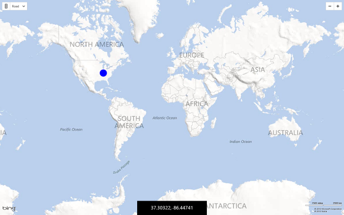

# Draggable Pushpins in Bing Maps
## Requires
- Visual Studio 2012
## License
- MS-LPL
## Technologies
- Bing Maps
- Windows Store app
## Topics
- Bing Maps
- Windows Store app
## Updated
- 02/24/2014
## Description

<h1>Introduction</h1>

In this&nbsp;sample is a simple mapping application that shows how to create a draggable pushpin on the map. Since the Bing Maps SDK is sealed and we can't extend the default Pushpin class in a nice way I have instead created a customr user control that
 can be added to the map. This user control has the dragging functionality built into it. I have also added some drag related events. This sample uses those events to update a textbox with the location of the pushpin at it is dragged.

<h1>Building the Sample</h1>

To run this sample you must install the <a href="http://visualstudiogallery.msdn.microsoft.com/224eb93a-ebc4-46ba-9be7-90ee777ad9e1">
Bing Maps SDK for Windows Store apps&nbsp;</a>and get a <a href="http://msdn.microsoft.com/en-us/library/ff428642.aspx">
Bing Maps key</a> for Windows Store apps. You must also have Windows 8.1 and Visual Studio 2013.

Open the sample in Visual Studio and insert your Bing Maps key in the&nbsp;MainPage.xaml file&nbsp;where it says &ldquo;YOUR_BING_MAPS_KEY&rdquo; in the source code. You must perform the following steps for your app project to work correctly with Bing Maps.
 Detailed instructions are provided below.&nbsp;

<ul>
<li>Add a reference to&nbsp;Bing Maps SDK for C#, C&#43;&#43;, or Visual Basic. </li><li>Set the&nbsp;Active solution platform&nbsp;in Visual Studio to one of the following options.&nbsp;
<ul>
<li>C#, Visual Basic:&nbsp;ARM,&nbsp;x86&nbsp;or&nbsp;x64 </li><li>C&#43;&#43;:&nbsp;ARM,&nbsp;Win32&nbsp;or&nbsp;x64 </li></ul>
</li><li>If you are using C# or Visual basic, you must add a reference to&nbsp;Microsoft Visual C&#43;&#43; Runtime Package.
</li><li>Build the sample by press F5 or use <strong>Debug &gt; Start Debugging</strong>. To run the app without debugging, press Ctrl&#43;F5 or use
<strong>Debug &gt; Start Without Debugging</strong> </li></ul>

Description

Here is a screenshot of the finished application.

