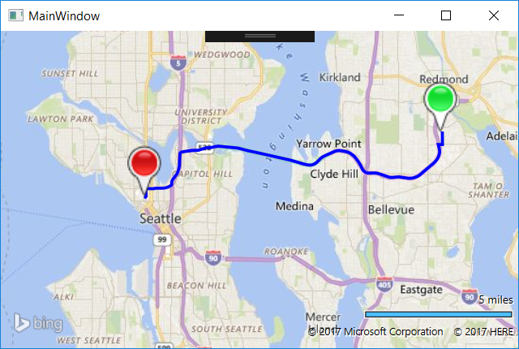

# Draggable Routes for Bing Maps WPF
## Requires
- Visual Studio 2015
## License
- MIT
## Technologies
- C#
- WPF
- Bing Maps
- Bing Maps REST Services
- Bing Maps WPF
## Topics
- Bing Maps
- Bing Maps Control for WPF
- directions
- Bing Maps REST Services
- Draggable Routes
- Route Calculations
## Updated
- 01/27/2017
## Description

<h1>Introduction</h1>

This code sample shows how to create draggable routes in the Bing Maps Bing Maps WPF control. This is achieved by creating a custom draggable pushpin user control which triggers an event after the pushpin has been dragged. When this pushpin has been dragged
 a route between the two draggable pushpins on the map is calcated. Additionally this code sample makes it easy to use custom images for the draggable pushpins.
<em>&nbsp;</em>

This project uses two NuGet packages:

<ul>
<li><a href="https://www.nuget.org/packages/Microsoft.Maps.MapControl.WPF">Bing Maps WPF control</a> - The map control<a href="https://www.nuget.org/packages/Microsoft.Maps.MapControl.WPF"> 
</a></li><li><a href="https://www.nuget.org/packages/BingMapsRESTToolkit/">Bing Maps REST Toolkit</a> - A helper library that makes it easy to use the Bing Maps REST services in .NET.<a href="https://www.nuget.org/packages/BingMapsRESTToolkit/"> 
</a></li></ul>
<h1>Building the Sample</h1>

Open the MainWindow.xaml file and add your Bing Maps key to the map where it says YOUR_BING_MAPS_KEY.

If you do not have a Bing Maps key you can get ne by first creating a Bing Maps account and then a key as documented here:

<a href="http://msdn.microsoft.com/en-us/library/gg650598.aspx">http://msdn.microsoft.com/en-us/library/gg650598.aspx</a>

<a href="http://msdn.microsoft.com/en-us/library/ff428642.aspx">http://msdn.microsoft.com/en-us/library/ff428642.aspx</a>

<em>&nbsp;</em>

Description

When you run the application with a valid Bing Maps key, it will first generate a Bing Maps session key, then add two draggable pushpins to the map, and a route will be calculated between them using the session key to make the request non-billable. When
 either of the pushpins are dragged, a new route will be calculated between the pushpins.

