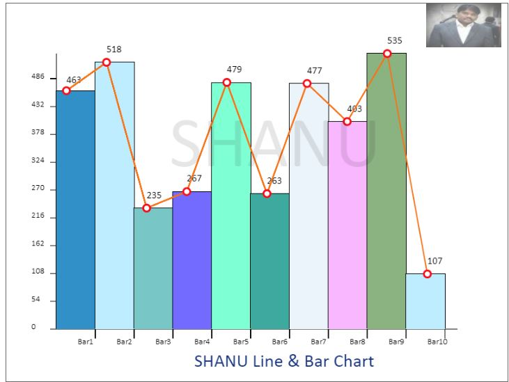

# Draw ASP.Net Chart Using HTML5 and jQuery
## Requires
- Visual Studio 2013
## License
- MIT
## Technologies
- ASP.NET
- jQuery
- Chart
- HTML5
- HTML5/JavaScript
## Topics
- ASP.NET
- jQuery
- HTML5
- Charts
- HTML5/JavaScript
## Updated
- 08/18/2015
## Description

<h1>Introduction</h1>

&nbsp;

<em></em>

In this article we will learn to draw an ASP.Net chart like Line Chart,Bar chart,Pie chart,Bubble chart,Donut Chart,Line &amp; Bar Chart using HTML5 and JQuery.

<ol style="outline:0px">
<li style="outline:0px">Line Chart </li><li style="outline:0px">Bar Chart </li><li style="outline:0px">Line &amp; Bar Chart </li><li style="outline:0px">Pie Chart </li><li style="outline:0px">Donut Chart </li><li style="outline:0px">Bubble Chart </li></ol>

In the Source Code Zip file you can find Visual Studio 2013 solutions. You can&nbsp;also update to Visual Studio 2015.

 
<strong style="outline:0px">My Bar Chart Features 
</strong> 
All this following features will be used for all chart types we can see one by one in code part.

<em></em>

<em><strong style="outline:0px; color:#333333; text-transform:none; line-height:21px; text-indent:0px; letter-spacing:normal; font-family:calibri; font-size:14px; font-style:normal; font-variant:normal; word-spacing:0px; white-space:normal; widows:1; background-color:#ffffff">Chart
 Source Data 
 
</strong>The plot data from a database
 / Data Table / List / XML file or any source depending on your requirements. The only thing you need to do is get the data from your source and bind the result to a Dropdown List. (With the value and text. Here the value will be an integer for plotting the
 value and the text will be to be displayed in the label.) 
 
<strong style="outline:0px; color:#333333; text-transform:none; line-height:21px; text-indent:0px; letter-spacing:normal; font-family:calibri; font-size:14px; font-style:normal; font-variant:normal; word-spacing:0px; white-space:normal; widows:1; background-color:#ffffff">Chart
 Number of Category 
 
</strong>Here I have limited the
 Chart Category display from a minimum of 1 to a maximum of 12. This means here dynamically we can load the plots category depending on the data source. But limited, since the display plots value is within 12 plots. (But the user can redesign the code easily
 depending on requirements.) 
 
<strong style="outline:0px; color:#333333; text-transform:none; line-height:21px; text-indent:0px; letter-spacing:normal; font-family:calibri; font-size:14px; font-style:normal; font-variant:normal; word-spacing:0px; white-space:normal; widows:1; background-color:#ffffff">Chart
 Title Text 
 
</strong>The user can add their
 own Chart Title and dynamically change the titles if required. Here in my example I will draw the Title TextBox text at the bottom of the Bar Chart. (The user can redesign and customize this depending on requirements.) 
 
<strong style="outline:0px; color:#333333; text-transform:none; line-height:21px; text-indent:0px; letter-spacing:normal; font-family:calibri; font-size:14px; font-style:normal; font-variant:normal; word-spacing:0px; white-space:normal; widows:1; background-color:#ffffff">Chart
 Water Mark Text 
 
</strong>In some cases we need to
 add our company name as a Watermark to our Bar Chart. Here in my example I will draw the Water Mark TextBox text at the center of the Bar Chart. (The user can redesign and customize this depending on requirements.) 
 
<strong style="outline:0px; color:#333333; text-transform:none; line-height:21px; text-indent:0px; letter-spacing:normal; font-family:calibri; font-size:14px; font-style:normal; font-variant:normal; word-spacing:0px; white-space:normal; widows:1; background-color:#ffffff">Chart
 Company LOGO</strong> 
 
The user can add their own company
 logo to the Chart. (Here for the sample I have added my own image as a log at the top-right corner. (The user can redesign and customize this depending on your requirements if needed.) 
 
<strong style="outline:0px; color:#333333; text-transform:none; line-height:21px; text-indent:0px; letter-spacing:normal; font-family:calibri; font-size:14px; font-style:normal; font-variant:normal; word-spacing:0px; white-space:normal; widows:1; background-color:#ffffff">Chart
 Alert Image 
</strong> 
Chart Alert Image Display: You can
 see from the article the first Image has Labels, I have displayed the Bar Chart label Text and Alert Image. If the &ldquo;Alert On&rdquo; radio button is checked I will display the Alert Image. If the &ldquo;Alert Off&rdquo; radio button is clicked then the
 Alert Image will not be displayed. 
 
<strong style="outline:0px; color:#333333; text-transform:none; line-height:21px; text-indent:0px; letter-spacing:normal; font-family:calibri; font-size:14px; font-style:normal; font-variant:normal; word-spacing:0px; white-space:normal; widows:1; background-color:#ffffff">The
 use of an Alert Image</strong> 
 
Let's consider a real project. For
 example we need to display a Pie Chart for a manufacturing factory with production results Good and Bad. For example if the production result for each quality value is above 300 then we need to display the Alert Green image and if the quality value is below
 300 then we need to display the Red image with label bars. 
 
This Alert Image will be easy to
 identify each quality result as good or bad. (Here for a sample I have used 2 quality check and displayed using Green and Red images but users can customize depending on requirements and add your own image and logic.) 
<strong style="outline:0px; color:#333333; text-transform:none; line-height:21px; text-indent:0px; letter-spacing:normal; font-family:calibri; font-size:14px; font-style:normal; font-variant:normal; word-spacing:0px; white-space:normal; widows:1; background-color:#ffffff"> 
Chart Color Theme 
 
</strong>The user can select any
 one Color Theme for the Chart as Green Theme or Blue Theme. 
 
<strong style="outline:0px; color:#333333; text-transform:none; line-height:21px; text-indent:0px; letter-spacing:normal; font-family:calibri; font-size:14px; font-style:normal; font-variant:normal; word-spacing:0px; white-space:normal; widows:1; background-color:#ffffff">Legend
 Display 
 
</strong>The user can enable or
 disable the display of the Legend for the Chart using the check box. If the &ldquo;Show Legend&ldquo; Checkbox is checked then the chart will be displayed with a label and alert image. If not checked then the legend will not be displayed in the chart. 
 
<strong style="outline:0px; color:#333333; text-transform:none; line-height:21px; text-indent:0px; letter-spacing:normal; font-family:calibri; font-size:14px; font-style:normal; font-variant:normal; word-spacing:0px; white-space:normal; widows:1; background-color:#ffffff">Save
 Chart as Image 
 
</strong>The user can save the chart
 as an image. Here we can see a Bar Chart with another theme with a Blue base but without displaying the Alert Image.</em>

<em></em>&nbsp;

<h1>Building the Sample</h1>

<em><strong style="outline:0px; color:#333333; text-transform:none; line-height:21px; text-indent:0px; letter-spacing:normal; font-family:calibri; font-size:14px; font-style:normal; font-variant:normal; word-spacing:0px; white-space:normal; widows:1; background-color:#ffffff">Step
 1: Create new ASP.NET Web project</strong> 
 
Click Start then All Programs then
 open Visual Studio 2013 or Visual Studio 2010 (depending on your installed version), select either one. Click &quot;File&quot; -&gt; &quot;New&quot; -&gt; &quot;Project...&quot; then select ASP.NET WEB Project then click Create.</em>

Description

<em><strong style="outline:0px; color:#333333; text-transform:none; line-height:21px; text-indent:0px; letter-spacing:normal; font-family:calibri; font-size:14px; font-style:normal; font-variant:normal; word-spacing:0px; white-space:normal; widows:1; background-color:#ffffff">Step
 2:Add canvas tag to your webform 
 
</strong>Add a new Webform and add
 a Canvas ELEMENT within the Section Tag.</em>

HTML

Edit|Remove

html

<pre class="js">&lt;SECTION&nbsp;style=&quot;border-style:&nbsp;solid;&nbsp;border-width:&nbsp;2px;&nbsp;width:&nbsp;800px;&quot;&gt;&nbsp;&nbsp;&nbsp;
&lt;CANVAS&nbsp;HEIGHT=&quot;600px&quot;&nbsp;WIDTH=&quot;800px&quot;&nbsp;ID=&quot;canvas&quot;&gt;&nbsp;&nbsp;&nbsp;
Your&nbsp;browser&nbsp;is&nbsp;not&nbsp;supporting&nbsp;HTML5&nbsp;Canvas&nbsp;.Upgrade&nbsp;Browser&nbsp;to&nbsp;view&nbsp;this&nbsp;program&nbsp;or&nbsp;check&nbsp;with&nbsp;Chrome&nbsp;or&nbsp;in&nbsp;Firefox.&nbsp;&nbsp;&nbsp;
&lt;/CANVAS&gt;&nbsp;&nbsp;&nbsp;
&lt;/SECTION&gt;&nbsp;&nbsp;</pre>

<strong style="outline:0px">Step 3: Script to Draw Chart in step-by-step&nbsp;</strong> 
 
<strong style="outline:0px">Script Global variable</strong>

<strong style="outline:0px"> 
</strong>First add the global variable that needs to be used to draw a chart inside the script tag. 
 
I have commented the line before for each variable about its use. Here the ChartWidth and chartHeigth variables will be used to store and draw the Chart width and height depending on the Canvas size.

JavaScript

Edit|Remove

js

<pre class="js">//public&nbsp;Canvas&nbsp;object&nbsp;to&nbsp;use&nbsp;in&nbsp;all&nbsp;the&nbsp;functions.&nbsp;&nbsp;&nbsp;
//this&nbsp;variable&nbsp;will&nbsp;be&nbsp;used&nbsp;to&nbsp;check&nbsp;for&nbsp;the&nbsp;result&nbsp;of&nbsp;Alert&nbsp;Image&nbsp;display&nbsp;&nbsp;&nbsp;
var&nbsp;alertCheckValue&nbsp;=&nbsp;300;&nbsp;&nbsp;&nbsp;
&nbsp;&nbsp;&nbsp;
//Adding&nbsp;the&nbsp;Pic&nbsp;Chart&nbsp;Colors&nbsp;to&nbsp;array&nbsp;.Here&nbsp;i&nbsp;have&nbsp;fixed&nbsp;to&nbsp;12&nbsp;colors&nbsp;and&nbsp;12&nbsp;datas&nbsp;to&nbsp;add&nbsp;as&nbsp;Pic&nbsp;Chart.if&nbsp;you&nbsp;want&nbsp;you&nbsp;can&nbsp;add&nbsp;more&nbsp;from&nbsp;here.&nbsp;&nbsp;&nbsp;
var&nbsp;pirChartColor&nbsp;=&nbsp;[&quot;#6CBB3C&quot;,&nbsp;&quot;#F87217&quot;,&nbsp;&quot;#EAC117&quot;,&nbsp;&quot;#EDDA74&quot;,&nbsp;&quot;#CD7F32&quot;,&nbsp;&quot;#CCFB5D&quot;,&nbsp;&quot;#FDD017&quot;,&nbsp;&quot;#9DC209&quot;,&nbsp;&quot;#E67451&quot;,&nbsp;&quot;#728C00&quot;,&nbsp;&quot;#617C58&quot;,&nbsp;&quot;#64E986&quot;];&nbsp;//&nbsp;green&nbsp;Color&nbsp;Combinations&nbsp;&nbsp;&nbsp;
//&nbsp;var&nbsp;pirChartColor&nbsp;=&nbsp;[&quot;#3090C7&quot;,&nbsp;&quot;#BDEDFF&quot;,&nbsp;&quot;#78C7C7&quot;,&nbsp;&quot;#736AFF&quot;,&nbsp;&quot;#7FFFD4&quot;,&nbsp;&quot;#3EA99F&quot;,&nbsp;&quot;#EBF4FA&quot;,&nbsp;&quot;#F9B7FF&quot;,&nbsp;&quot;#8BB381&quot;,&nbsp;&quot;#BDEDFF&quot;,&nbsp;&quot;#B048B5&quot;,&nbsp;&quot;#4E387E&quot;];&nbsp;//&nbsp;Blue&nbsp;Color&nbsp;Combinations&nbsp;&nbsp;&nbsp;
var&nbsp;lineColor&nbsp;=&nbsp;&quot;#3090C7&quot;;&nbsp;&nbsp;&nbsp;
var&nbsp;lineOuterCircleColor&nbsp;=&nbsp;&quot;#6CBB3C&quot;;&nbsp;&nbsp;&nbsp;
var&nbsp;lineInnerCircleColor&nbsp;=&nbsp;&quot;#FFFFFF&quot;;&nbsp;&nbsp;&nbsp;
&nbsp;&nbsp;&nbsp;
//declare&nbsp;the&nbsp;Canvas&nbsp;object&nbsp;&nbsp;&nbsp;
var&nbsp;canvas;&nbsp;&nbsp;&nbsp;
var&nbsp;chartCTX;&nbsp;&nbsp;&nbsp;
&nbsp;&nbsp;&nbsp;
//&nbsp;declare&nbsp;the&nbsp;Border&nbsp;Space,Chart&nbsp;Start&nbsp;X&nbsp;and&nbsp;Y&nbsp;Position;&nbsp;&nbsp;&nbsp;
var&nbsp;xSpace&nbsp;=&nbsp;80;&nbsp;&nbsp;&nbsp;
var&nbsp;ySpace&nbsp;=&nbsp;80;&nbsp;&nbsp;&nbsp;
//declare&nbsp;the&nbsp;Chart&nbsp;DrawWidth&nbsp;and&nbsp;Hegith&nbsp;&nbsp;&nbsp;
var&nbsp;chartWidth,&nbsp;chartHeight;&nbsp;&nbsp;&nbsp;
&nbsp;&nbsp;&nbsp;
//&nbsp;declared&nbsp;the&nbsp;Chart&nbsp;Legend&nbsp;Width&nbsp;and&nbsp;Hegit&nbsp;&nbsp;&nbsp;
var&nbsp;legendWidth,&nbsp;legendHeight;&nbsp;&nbsp;&nbsp;
&nbsp;&nbsp;&nbsp;
//declared&nbsp;the&nbsp;Chart&nbsp;data&nbsp;Minimum&nbsp;Value,maximum&nbsp;Value&nbsp;and&nbsp;Noofplots(Bars/Arc&nbsp;and&nbsp;Line&nbsp;points)&nbsp;&nbsp;&nbsp;
var&nbsp;minDataVal,&nbsp;maxDataVal,&nbsp;noOfPlots;&nbsp;&nbsp;&nbsp;
&nbsp;&nbsp;&nbsp;
//here&nbsp;we&nbsp;declare&nbsp;the&nbsp;Image&nbsp;for&nbsp;the&nbsp;Chart&nbsp;legend&nbsp;alert&nbsp;status&nbsp;display.&nbsp;&nbsp;&nbsp;
var&nbsp;greenImage&nbsp;=&nbsp;new&nbsp;Image();&nbsp;&nbsp;&nbsp;
var&nbsp;redImage&nbsp;=&nbsp;new&nbsp;Image();&nbsp;&nbsp;&nbsp;
//Alert&nbsp;Image&nbsp;Size&nbsp;widht&nbsp;and&nbsp;hegith&nbsp;&nbsp;&nbsp;
var&nbsp;imagesize&nbsp;=&nbsp;20;&nbsp;&nbsp;&nbsp;
var&nbsp;maxValdivValue;&nbsp;&nbsp;&nbsp;
//Here&nbsp;we&nbsp;declare&nbsp;the&nbsp;X,YAxis&nbsp;Font&nbsp;size&nbsp;and&nbsp;Color&nbsp;&nbsp;&nbsp;
var&nbsp;fotnColor&nbsp;=&nbsp;&quot;#000000&quot;;&nbsp;&nbsp;&nbsp;
var&nbsp;axisfontSize&nbsp;=&nbsp;10;&nbsp;&nbsp;&nbsp;
&nbsp;&nbsp;&nbsp;
var&nbsp;LogoImage&nbsp;=&nbsp;new&nbsp;Image();&nbsp;&nbsp;&nbsp;
var&nbsp;LogoImgWidth&nbsp;=&nbsp;120;&nbsp;&nbsp;&nbsp;
var&nbsp;LogoImgHeight&nbsp;=&nbsp;70;&nbsp;&nbsp;&nbsp;
//&nbsp;This&nbsp;arrawy&nbsp;wil&nbsp;be&nbsp;used&nbsp;to&nbsp;draw&nbsp;the&nbsp;Legends&nbsp;&nbsp;&nbsp;&nbsp;
rect&nbsp;=&nbsp;{};&nbsp;&nbsp;&nbsp;
rectInner&nbsp;=&nbsp;{};&nbsp;&nbsp;</pre>

&nbsp;

<strong style="outline:0px; color:#333333; text-transform:none; line-height:21px; text-indent:0px; letter-spacing:normal; font-family:calibri; font-size:14px; font-style:normal; font-variant:normal; word-spacing:0px; white-space:normal; widows:1; background-color:#ffffff">Note:</strong>&nbsp;I
 have used the Master pages so in the script before each control I will use the ContentPlaceHolderID. 
 
For example my Green color theme
 radio button id is rdoColorGreen. But for jQuery I will be use like this cphBody_rdoColorGreen. For example if we use a master page then we add a ContentPlaceHolderID like this in the script:

<em>

JavaScript

Edit|Remove

js

<pre class="js">if&nbsp;($('#cphBody_rdoColorGreen:checked').val()&nbsp;==&nbsp;&quot;rdoColorGreen&quot;)&nbsp;&nbsp;&nbsp;
{}</pre>

<strong style="outline:0px; color:#333333; text-transform:none; line-height:21px; text-indent:0px; letter-spacing:normal; font-family:calibri; font-size:14px; font-style:normal; font-variant:normal; word-spacing:0px; white-space:normal; widows:1; background-color:#ffffff">2.
 Chart Color Theme 
 
</strong>This method depends on
 the user color selection checked from the radio button. I will select the Color Array to fill in the color for each plots. This is a common function that can be used to draw any chart like Line, Bar, Pie, Donut and and so on.

JavaScript

Edit|Remove

js

<pre class="js">function&nbsp;ChangeChartColor()&nbsp;&nbsp;&nbsp;&nbsp;
{if&nbsp;($('#cphBody_rdoColorGreen:checked').val()&nbsp;==&nbsp;&quot;rdoColorGreen&quot;)&nbsp;&nbsp;
&nbsp;&nbsp;&nbsp;{&nbsp;&nbsp;&nbsp;
&nbsp;&nbsp;&nbsp;&nbsp;&nbsp;&nbsp;&nbsp;&nbsp;&nbsp;pirChartColor&nbsp;=&nbsp;[&quot;#6CBB3C&quot;,&nbsp;&quot;#F87217&quot;,&nbsp;&quot;#EAC117&quot;,&nbsp;&quot;#EDDA74&quot;,&nbsp;&quot;#CD7F32&quot;,&nbsp;&quot;#CCFB5D&quot;,&nbsp;&quot;#FDD017&quot;,&nbsp;&quot;#9DC209&quot;,&nbsp;&quot;#E67451&quot;,&nbsp;&quot;#728C00&quot;,&nbsp;&quot;#617C58&quot;,&nbsp;&quot;#64E986&quot;];&nbsp;//&nbsp;green&nbsp;Color&nbsp;Combinations&nbsp;&nbsp;&nbsp;
&nbsp;&nbsp;&nbsp;&nbsp;&nbsp;&nbsp;&nbsp;&nbsp;&nbsp;lineColor&nbsp;=&nbsp;&quot;#3090C7&quot;;&nbsp;//&nbsp;Blue&nbsp;Color&nbsp;for&nbsp;Line&nbsp;&nbsp;&nbsp;
&nbsp;&nbsp;&nbsp;&nbsp;&nbsp;&nbsp;&nbsp;&nbsp;&nbsp;lineOuterCircleColor&nbsp;=&nbsp;&quot;#6CBB3C&quot;;&nbsp;//&nbsp;Green&nbsp;Color&nbsp;for&nbsp;Outer&nbsp;Circle&nbsp;&nbsp;}else{&nbsp;&nbsp;&nbsp;
&nbsp;&nbsp;&nbsp;&nbsp;&nbsp;&nbsp;&nbsp;&nbsp;&nbsp;pirChartColor&nbsp;=&nbsp;[&quot;#3090C7&quot;,&nbsp;&quot;#BDEDFF&quot;,&nbsp;&quot;#78C7C7&quot;,&nbsp;&quot;#736AFF&quot;,&nbsp;&quot;#7FFFD4&quot;,&nbsp;&quot;#3EA99F&quot;,&nbsp;&quot;#EBF4FA&quot;,&nbsp;&quot;#F9B7FF&quot;,&nbsp;&quot;#8BB381&quot;,&nbsp;&quot;#BDEDFF&quot;,&nbsp;&quot;#B048B5&quot;,&nbsp;&quot;#4E387E&quot;];&nbsp;//&nbsp;Blue&nbsp;Color&nbsp;Combinations&nbsp;&nbsp;&nbsp;
&nbsp;&nbsp;&nbsp;&nbsp;&nbsp;&nbsp;&nbsp;&nbsp;&nbsp;lineColor&nbsp;=&nbsp;&quot;#F87217&quot;;&nbsp;&nbsp;//&nbsp;Orange&nbsp;Color&nbsp;for&nbsp;the&nbsp;Line&nbsp;&nbsp;&nbsp;
&nbsp;&nbsp;&nbsp;&nbsp;&nbsp;&nbsp;&nbsp;&nbsp;&nbsp;lineOuterCircleColor&nbsp;=&nbsp;&quot;#F70D1A&nbsp;&quot;;&nbsp;//&nbsp;Red&nbsp;Color&nbsp;for&nbsp;the&nbsp;outer&nbsp;circle&nbsp;&nbsp;}}</pre>

<strong style="outline:0px; color:#333333; text-transform:none; line-height:21px; text-indent:0px; letter-spacing:normal; font-family:calibri; font-size:14px; font-style:normal; font-variant:normal; word-spacing:0px; white-space:normal; widows:1; background-color:#ffffff">Draw
 legend 
 
</strong>This method will be used
 to draw the legend for the chart. In this method I will draw a label with color and add label text and an Alert Image inside the label. This is a common function that can be used to draw any chart like Line, Bar, Pie, Donut and and so on. (In the Line chart
 I don't use this Legend since a line chart is not required for the Label display.)

JavaScript

Edit|Remove

js

<pre class="js">//&nbsp;This&nbsp;function&nbsp;is&nbsp;used&nbsp;to&nbsp;draw&nbsp;the&nbsp;Legend&nbsp;&nbsp;function&nbsp;drawLengends()&nbsp;&nbsp;
{&nbsp;&nbsp;&nbsp;
&nbsp;&nbsp;&nbsp;&nbsp;ctx.fillStyle&nbsp;=&nbsp;&quot;#7F462C&quot;;&nbsp;&nbsp;&nbsp;
&nbsp;&nbsp;&nbsp;&nbsp;ctx.fillRect(rect.startX,&nbsp;rect.startY,&nbsp;rect.w,&nbsp;rect.h);&nbsp;&nbsp;&nbsp;
&nbsp;&nbsp;&nbsp;&nbsp;//Drawing&nbsp;Inner&nbsp;White&nbsp;color&nbsp;Rectange&nbsp;with&nbsp;in&nbsp;Above&nbsp;brown&nbsp;rectangle&nbsp;to&nbsp;plot&nbsp;all&nbsp;the&nbsp;Lables&nbsp;with&nbsp;color,Text&nbsp;and&nbsp;Value.&nbsp;&nbsp;&nbsp;
&nbsp;&nbsp;&nbsp;&nbsp;ctx.fillStyle&nbsp;=&nbsp;&quot;#FFFFFF&quot;;&nbsp;&nbsp;&nbsp;
&nbsp;&nbsp;&nbsp;&nbsp;rectInner.startX&nbsp;=&nbsp;rect.startX&nbsp;&#43;&nbsp;1;&nbsp;&nbsp;&nbsp;
&nbsp;&nbsp;&nbsp;&nbsp;rectInner.startY&nbsp;=&nbsp;rect.startY&nbsp;&#43;&nbsp;1;&nbsp;&nbsp;&nbsp;
&nbsp;&nbsp;&nbsp;&nbsp;rectInner.w&nbsp;=&nbsp;rect.w&nbsp;-&nbsp;2;&nbsp;&nbsp;&nbsp;
&nbsp;&nbsp;&nbsp;&nbsp;rectInner.h&nbsp;=&nbsp;rect.h&nbsp;-&nbsp;2;&nbsp;&nbsp;&nbsp;
&nbsp;&nbsp;&nbsp;&nbsp;ctx.fillRect(rectInner.startX,&nbsp;rectInner.startY,&nbsp;rectInner.w,&nbsp;rectInner.h);&nbsp;&nbsp;&nbsp;
&nbsp;&nbsp;&nbsp;&nbsp;labelBarX&nbsp;=&nbsp;rectInner.startX&nbsp;&#43;&nbsp;4;&nbsp;&nbsp;&nbsp;
&nbsp;&nbsp;&nbsp;&nbsp;labelBarY&nbsp;=&nbsp;rectInner.startY&nbsp;&#43;&nbsp;4;&nbsp;&nbsp;&nbsp;
&nbsp;&nbsp;&nbsp;&nbsp;labelBarWidth&nbsp;=&nbsp;rectInner.w&nbsp;-&nbsp;10;&nbsp;&nbsp;&nbsp;
&nbsp;&nbsp;&nbsp;&nbsp;labelBarHeight&nbsp;=&nbsp;(rectInner.h&nbsp;/&nbsp;noOfPlots)&nbsp;-&nbsp;5;&nbsp;&nbsp;&nbsp;
&nbsp;&nbsp;&nbsp;&nbsp;colorval&nbsp;=&nbsp;0;&nbsp;&nbsp;&nbsp;
&nbsp;&nbsp;&nbsp;&nbsp;//&nbsp;here&nbsp;to&nbsp;draw&nbsp;all&nbsp;the&nbsp;rectangle&nbsp;for&nbsp;Lables&nbsp;with&nbsp;Image&nbsp;display&nbsp;&nbsp;&nbsp;
&nbsp;&nbsp;&nbsp;&nbsp;$('#cphBody_DropDownList1&nbsp;option').each(function&nbsp;()&nbsp;&nbsp;
&nbsp;&nbsp;&nbsp;&nbsp;{&nbsp;&nbsp;&nbsp;
&nbsp;&nbsp;&nbsp;&nbsp;&nbsp;&nbsp;&nbsp;&nbsp;ctx.fillStyle&nbsp;=&nbsp;pirChartColor[colorval];&nbsp;&nbsp;&nbsp;
&nbsp;&nbsp;&nbsp;&nbsp;&nbsp;&nbsp;&nbsp;&nbsp;ctx.fillRect(labelBarX,&nbsp;labelBarY,&nbsp;labelBarWidth,&nbsp;labelBarHeight);&nbsp;&nbsp;&nbsp;
&nbsp;&nbsp;&nbsp;&nbsp;&nbsp;//&nbsp;Here&nbsp;we&nbsp;check&nbsp;for&nbsp;the&nbsp;rdoAlert&nbsp;Status&nbsp;is&nbsp;On&nbsp;-&nbsp;If&nbsp;the&nbsp;Alert&nbsp;is&nbsp;on&nbsp;then&nbsp;we&nbsp;display&nbsp;the&nbsp;Alert&nbsp;Image&nbsp;as&nbsp;per&nbsp;the&nbsp;&nbsp;Alert&nbsp;check&nbsp;value.&nbsp;&nbsp;if&nbsp;($('#cphBody_rdoAlaramOn:checked').val()&nbsp;==&nbsp;&quot;rdoAlaramOn&quot;)&nbsp;&nbsp;
&nbsp;&nbsp;&nbsp;&nbsp;&nbsp;&nbsp;&nbsp;&nbsp;{//&nbsp;Here&nbsp;we&nbsp;can&nbsp;see&nbsp;fo&nbsp;ever&nbsp;chart&nbsp;value&nbsp;we&nbsp;check&nbsp;with&nbsp;the&nbsp;condition&nbsp;.we&nbsp;have&nbsp;initially&nbsp;declare&nbsp;the&nbsp;alertCheckValue&nbsp;as&nbsp;300.&nbsp;&nbsp;//so&nbsp;if&nbsp;the&nbsp;Chart&nbsp;Plot&nbsp;value&nbsp;is&nbsp;Greater&nbsp;then&nbsp;or&nbsp;equal&nbsp;to&nbsp;the&nbsp;check&nbsp;value&nbsp;&nbsp;
&nbsp;&nbsp;&nbsp;&nbsp;&nbsp;&nbsp;&nbsp;&nbsp;&nbsp;&nbsp;&nbsp;then&nbsp;we&nbsp;display&nbsp;the&nbsp;Green&nbsp;Image&nbsp;else&nbsp;we&nbsp;display&nbsp;the&nbsp;Red&nbsp;Image.&nbsp;&nbsp;&nbsp;
&nbsp;&nbsp;&nbsp;&nbsp;&nbsp;&nbsp;&nbsp;&nbsp;&nbsp;&nbsp;&nbsp;//user&nbsp;can&nbsp;change&nbsp;this&nbsp;to&nbsp;your&nbsp;requiremnt&nbsp;if&nbsp;needed.This&nbsp;is&nbsp;optioan&nbsp;function&nbsp;for&nbsp;the&nbsp;Pie&nbsp;Chart.&nbsp;&nbsp;if&nbsp;(parseInt($(this).val())&nbsp;&gt;=&nbsp;alertCheckValue)&nbsp;&nbsp;
&nbsp;&nbsp;&nbsp;&nbsp;&nbsp;&nbsp;&nbsp;&nbsp;&nbsp;&nbsp;&nbsp;{&nbsp;&nbsp;&nbsp;
&nbsp;&nbsp;&nbsp;&nbsp;&nbsp;&nbsp;&nbsp;&nbsp;&nbsp;&nbsp;&nbsp;&nbsp;&nbsp;&nbsp;&nbsp;ctx.drawImage(greenImage,&nbsp;labelBarX,&nbsp;labelBarY&nbsp;&#43;&nbsp;(labelBarHeight&nbsp;/&nbsp;3)&nbsp;-&nbsp;4,&nbsp;imagesize,&nbsp;imagesize);&nbsp;&nbsp;&nbsp;
&nbsp;&nbsp;&nbsp;&nbsp;&nbsp;&nbsp;&nbsp;&nbsp;&nbsp;&nbsp;&nbsp;}else{&nbsp;&nbsp;&nbsp;
&nbsp;&nbsp;&nbsp;&nbsp;&nbsp;&nbsp;&nbsp;&nbsp;&nbsp;&nbsp;&nbsp;&nbsp;&nbsp;&nbsp;&nbsp;ctx.drawImage(redImage,&nbsp;labelBarX,&nbsp;labelBarY&nbsp;&#43;&nbsp;(labelBarHeight&nbsp;/&nbsp;3)&nbsp;-&nbsp;4,&nbsp;imagesize,&nbsp;imagesize);&nbsp;&nbsp;&nbsp;
&nbsp;&nbsp;&nbsp;&nbsp;&nbsp;&nbsp;&nbsp;&nbsp;&nbsp;&nbsp;&nbsp;}}//Draw&nbsp;the&nbsp;Pie&nbsp;Chart&nbsp;Label&nbsp;text&nbsp;and&nbsp;Value&nbsp;&nbsp;&nbsp;
&nbsp;&nbsp;&nbsp;&nbsp;&nbsp;&nbsp;&nbsp;&nbsp;ctx.fillStyle&nbsp;=&nbsp;&quot;#000000&quot;;&nbsp;&nbsp;&nbsp;
&nbsp;&nbsp;&nbsp;&nbsp;&nbsp;&nbsp;&nbsp;&nbsp;ctx.font&nbsp;=&nbsp;'10pt&nbsp;Calibri';&nbsp;&nbsp;&nbsp;
&nbsp;&nbsp;&nbsp;&nbsp;&nbsp;&nbsp;&nbsp;&nbsp;ctx.fillText($(this).text(),&nbsp;labelBarX&nbsp;&#43;&nbsp;imagesize&nbsp;&#43;&nbsp;2,&nbsp;labelBarY&nbsp;&#43;&nbsp;(labelBarHeight&nbsp;/&nbsp;2));&nbsp;&nbsp;&nbsp;
&nbsp;&nbsp;&nbsp;
&nbsp;&nbsp;&nbsp;&nbsp;&nbsp;&nbsp;&nbsp;&nbsp;//&nbsp;To&nbsp;Increment&nbsp;and&nbsp;draw&nbsp;the&nbsp;next&nbsp;bar&nbsp;,label&nbsp;Text&nbsp;and&nbsp;Alart&nbsp;Image.&nbsp;&nbsp;&nbsp;
&nbsp;&nbsp;&nbsp;&nbsp;&nbsp;&nbsp;&nbsp;&nbsp;labelBarY&nbsp;=&nbsp;labelBarY&nbsp;&#43;&nbsp;labelBarHeight&nbsp;&#43;&nbsp;4;&nbsp;&nbsp;&nbsp;
&nbsp;&nbsp;&nbsp;&nbsp;&nbsp;&nbsp;&nbsp;&nbsp;//&nbsp;&nbsp;labelTextYXVal&nbsp;=&nbsp;labelBarY&nbsp;&#43;&nbsp;labelBarHeight&nbsp;-&nbsp;4;&nbsp;&nbsp;&nbsp;
&nbsp;&nbsp;&nbsp;
&nbsp;&nbsp;&nbsp;&nbsp;&nbsp;&nbsp;&nbsp;&nbsp;colorval&nbsp;=&nbsp;colorval&nbsp;&#43;&nbsp;1;&nbsp;&nbsp;&nbsp;
&nbsp;&nbsp;&nbsp;&nbsp;});&nbsp;&nbsp;&nbsp;
}</pre>

<strong style="outline:0px">Draw Chart 
 
</strong>This is the main method. the In button Draw Chart Image button clicks I will call this method first. From this method I will call other methods depending on requirements. 
In this method I have explained in comments before each line of code. This method has 5 main code parts as we can see here. In the comments I have explained using steps at each part. &nbsp;

<ol style="outline:0px">
<li style="outline:0px; font-family:calibri">First we calculate and store all the necessary variables like Item Maximum Value, Item total Count, Chart Width, Chart Height, legend Width, Legend height at and so on.
</li><li style="outline:0px">Draw legend.
</li><li style="outline:0px">Add Chart Title and Logo to chart.
</li><li style="outline:0px">Draw X-Axis Line with Plot text.
</li><li style="outline:0px">Draw Y- Axis Line with Y-Axis plot value.
</li><li style="outline:0px">Draw Bar Chart method (Next we call the method to draw our chart. For each chart I have created a separate method. For example to draw the Bar Chart I will call the &ldquo;drawBarChart()&rdquo;
 method, to draw a line chart I will call the &ldquo;drawLineChart()&rdquo; method and so on.
</li><li style="outline:0px">Draw the Watermark text for the chart.&nbsp;&nbsp;
</li></ol>

JavaScript

Edit|Remove

js

<pre class="js">//&nbsp;This&nbsp;is&nbsp;the&nbsp;main&nbsp;function&nbsp;to&nbsp;darw&nbsp;the&nbsp;Charts&nbsp;&nbsp;function&nbsp;drawChart()&nbsp;&nbsp;
{&nbsp;&nbsp;&nbsp;
&nbsp;&nbsp;&nbsp;&nbsp;ChangeChartColor();&nbsp;&nbsp;&nbsp;
&nbsp;&nbsp;&nbsp;&nbsp;//&nbsp;asign&nbsp;the&nbsp;images&nbsp;path&nbsp;for&nbsp;both&nbsp;Alert&nbsp;images&nbsp;&nbsp;&nbsp;
&nbsp;&nbsp;&nbsp;&nbsp;greenImage.src&nbsp;=&nbsp;'../images/Green.png';&nbsp;&nbsp;&nbsp;
&nbsp;&nbsp;&nbsp;&nbsp;redImage.src&nbsp;=&nbsp;'../images/Red.png';&nbsp;&nbsp;&nbsp;
&nbsp;&nbsp;&nbsp;&nbsp;LogoImage.src&nbsp;=&nbsp;'../images/shanu.jpg';&nbsp;&nbsp;&nbsp;
&nbsp;&nbsp;&nbsp;&nbsp;//&nbsp;Get&nbsp;the&nbsp;minumum&nbsp;and&nbsp;maximum&nbsp;value.here&nbsp;i&nbsp;have&nbsp;used&nbsp;the&nbsp;hidden&nbsp;filed&nbsp;from&nbsp;code&nbsp;behind&nbsp;wich&nbsp;will&nbsp;&nbsp;
&nbsp;&nbsp;&nbsp;&nbsp;&nbsp;&nbsp;&nbsp;&nbsp;stored&nbsp;the&nbsp;Maximum&nbsp;and&nbsp;Minimum&nbsp;value&nbsp;of&nbsp;the&nbsp;Drop&nbsp;down&nbsp;list&nbsp;box.&nbsp;&nbsp;&nbsp;
&nbsp;&nbsp;&nbsp;&nbsp;minDataVal&nbsp;=&nbsp;$('#cphBody_hidListMin').val();&nbsp;&nbsp;&nbsp;
&nbsp;&nbsp;&nbsp;&nbsp;maxDataVal&nbsp;=&nbsp;$('#cphBody_hidListMax').val();&nbsp;&nbsp;&nbsp;
&nbsp;&nbsp;&nbsp;&nbsp;//&nbsp;Total&nbsp;no&nbsp;of&nbsp;plots&nbsp;we&nbsp;are&nbsp;going&nbsp;to&nbsp;draw.&nbsp;&nbsp;&nbsp;
&nbsp;&nbsp;&nbsp;&nbsp;noOfPlots&nbsp;=&nbsp;$(&quot;#cphBody_DropDownList1&nbsp;option&quot;).length;&nbsp;&nbsp;&nbsp;
&nbsp;&nbsp;&nbsp;&nbsp;maxValdivValue&nbsp;=&nbsp;Math.round((maxDataVal&nbsp;/&nbsp;noOfPlots));&nbsp;&nbsp;&nbsp;
&nbsp;&nbsp;&nbsp;&nbsp;//storing&nbsp;the&nbsp;Canvas&nbsp;Context&nbsp;to&nbsp;local&nbsp;variable&nbsp;ctx.This&nbsp;variable&nbsp;will&nbsp;be&nbsp;used&nbsp;to&nbsp;draw&nbsp;the&nbsp;Pie&nbsp;Chart&nbsp;&nbsp;&nbsp;
&nbsp;&nbsp;&nbsp;&nbsp;canvas&nbsp;=&nbsp;document.getElementById(&quot;canvas&quot;);&nbsp;&nbsp;&nbsp;
&nbsp;&nbsp;&nbsp;&nbsp;ctx&nbsp;=&nbsp;canvas.getContext(&quot;2d&quot;);&nbsp;&nbsp;&nbsp;
&nbsp;&nbsp;&nbsp;&nbsp;//globalAlpha&nbsp;-&nbsp;&gt;&nbsp;is&nbsp;used&nbsp;to&nbsp;display&nbsp;the&nbsp;100%&nbsp;opoacity&nbsp;of&nbsp;chart&nbsp;.because&nbsp;at&nbsp;the&nbsp;bottom&nbsp;of&nbsp;&nbsp;
&nbsp;&nbsp;&nbsp;&nbsp;&nbsp;&nbsp;&nbsp;&nbsp;&nbsp;the&nbsp;code&nbsp;I&nbsp;have&nbsp;used&nbsp;the&nbsp;opacity&nbsp;to&nbsp;0.1&nbsp;to&nbsp;display&nbsp;the&nbsp;water&nbsp;mark&nbsp;text&nbsp;with&nbsp;fade&nbsp;effect.&nbsp;&nbsp;&nbsp;
&nbsp;&nbsp;&nbsp;&nbsp;ctx.globalAlpha&nbsp;=&nbsp;1;&nbsp;&nbsp;&nbsp;
&nbsp;&nbsp;&nbsp;&nbsp;ctx.fillStyle&nbsp;=&nbsp;&quot;#000000&quot;;&nbsp;&nbsp;&nbsp;
&nbsp;&nbsp;&nbsp;&nbsp;ctx.strokeStyle&nbsp;=&nbsp;'#000000';&nbsp;&nbsp;&nbsp;
&nbsp;&nbsp;&nbsp;&nbsp;//Every&nbsp;time&nbsp;we&nbsp;clear&nbsp;the&nbsp;canvas&nbsp;and&nbsp;draw&nbsp;the&nbsp;chart&nbsp;&nbsp;&nbsp;&nbsp;
&nbsp;&nbsp;&nbsp;&nbsp;ctx.clearRect(0,&nbsp;0,&nbsp;canvas.width,&nbsp;canvas.height);&nbsp;&nbsp;&nbsp;
&nbsp;&nbsp;&nbsp;
&nbsp;&nbsp;&nbsp;&nbsp;//If&nbsp;need&nbsp;to&nbsp;draw&nbsp;with&nbsp;out&nbsp;legend&nbsp;for&nbsp;the&nbsp;Line&nbsp;Chart&nbsp;&nbsp;&nbsp;
&nbsp;&nbsp;&nbsp;&nbsp;chartWidth&nbsp;=&nbsp;canvas.width&nbsp;-&nbsp;xSpace;&nbsp;&nbsp;&nbsp;
&nbsp;&nbsp;&nbsp;&nbsp;chartHeight&nbsp;=&nbsp;canvas.height&nbsp;-&nbsp;ySpace;&nbsp;&nbsp;&nbsp;
&nbsp;&nbsp;&nbsp;&nbsp;//&nbsp;&nbsp;step&nbsp;1)&nbsp;Draw&nbsp;legend&nbsp;$$$$$$$$$$$$$$$$$$$$$$$$$$$$$$$$$$$$$$$$$########################&nbsp;&nbsp;if&nbsp;($('#cphBody_chkLegend:checked').val()&nbsp;==&nbsp;&quot;on&quot;)&nbsp;&nbsp;
&nbsp;&nbsp;&nbsp;&nbsp;{&nbsp;&nbsp;&nbsp;
&nbsp;&nbsp;&nbsp;&nbsp;&nbsp;&nbsp;&nbsp;&nbsp;&nbsp;chartWidth&nbsp;=&nbsp;canvas.width&nbsp;-&nbsp;((canvas.width&nbsp;/&nbsp;3)&nbsp;-&nbsp;(xSpace&nbsp;/&nbsp;2));&nbsp;&nbsp;&nbsp;
&nbsp;&nbsp;&nbsp;&nbsp;&nbsp;&nbsp;&nbsp;&nbsp;&nbsp;chartHeight&nbsp;=&nbsp;canvas.height&nbsp;-&nbsp;ySpace&nbsp;-&nbsp;10;&nbsp;&nbsp;&nbsp;
&nbsp;&nbsp;&nbsp;
&nbsp;&nbsp;&nbsp;&nbsp;&nbsp;&nbsp;&nbsp;&nbsp;&nbsp;legendWidth&nbsp;=&nbsp;canvas.width&nbsp;-&nbsp;((canvas.width&nbsp;/&nbsp;3)&nbsp;-&nbsp;xSpace);&nbsp;&nbsp;&nbsp;
&nbsp;&nbsp;&nbsp;&nbsp;&nbsp;&nbsp;&nbsp;&nbsp;&nbsp;legendHeight&nbsp;=&nbsp;ySpace;&nbsp;&nbsp;&nbsp;
&nbsp;&nbsp;&nbsp;
&nbsp;&nbsp;&nbsp;&nbsp;&nbsp;&nbsp;&nbsp;&nbsp;&nbsp;rect.startX&nbsp;=&nbsp;legendWidth;&nbsp;&nbsp;&nbsp;
&nbsp;&nbsp;&nbsp;&nbsp;&nbsp;&nbsp;&nbsp;&nbsp;&nbsp;rect.startY&nbsp;=&nbsp;legendHeight;&nbsp;&nbsp;&nbsp;
&nbsp;&nbsp;&nbsp;&nbsp;&nbsp;&nbsp;&nbsp;&nbsp;&nbsp;rect.w&nbsp;=&nbsp;canvas.width&nbsp;/&nbsp;3&nbsp;-&nbsp;xSpace&nbsp;-&nbsp;10;&nbsp;&nbsp;&nbsp;
&nbsp;&nbsp;&nbsp;&nbsp;&nbsp;&nbsp;&nbsp;&nbsp;&nbsp;rect.h&nbsp;=&nbsp;canvas.height&nbsp;-&nbsp;ySpace&nbsp;-&nbsp;10;&nbsp;&nbsp;&nbsp;
&nbsp;&nbsp;&nbsp;&nbsp;&nbsp;&nbsp;&nbsp;&nbsp;&nbsp;//In&nbsp;this&nbsp;method&nbsp;i&nbsp;will&nbsp;draw&nbsp;the&nbsp;legend&nbsp;with&nbsp;the&nbsp;Alert&nbsp;Image.&nbsp;&nbsp;&nbsp;
&nbsp;&nbsp;&nbsp;&nbsp;&nbsp;&nbsp;&nbsp;&nbsp;&nbsp;drawLengends();&nbsp;&nbsp;&nbsp;
&nbsp;&nbsp;&nbsp;&nbsp;&nbsp;}//&nbsp;end&nbsp;step&nbsp;1)&nbsp;$$$$$$$$$$$$$$$$$$$$$$$$$$$$$$$$$$$&nbsp;&nbsp;var&nbsp;chartMidPosition&nbsp;=&nbsp;chartWidth&nbsp;/&nbsp;2&nbsp;-&nbsp;60;&nbsp;&nbsp;&nbsp;
&nbsp;&nbsp;&nbsp;
&nbsp;&nbsp;&nbsp;&nbsp;&nbsp;&nbsp;////&nbsp;&nbsp;&nbsp;&nbsp;&nbsp;&nbsp;&nbsp;&nbsp;//If&nbsp;need&nbsp;to&nbsp;draw&nbsp;with&nbsp;legend&nbsp;&nbsp;////&nbsp;&nbsp;&nbsp;&nbsp;&nbsp;&nbsp;&nbsp;&nbsp;chartWidth&nbsp;=&nbsp;canvas.width&nbsp;-&nbsp;((canvas.width&nbsp;/&nbsp;3)&nbsp;-&nbsp;(xSpace&nbsp;/&nbsp;2));&nbsp;&nbsp;////&nbsp;&nbsp;&nbsp;&nbsp;&nbsp;&nbsp;&nbsp;&nbsp;chartHeight&nbsp;=&nbsp;canvas.height&nbsp;-&nbsp;ySpace&nbsp;-&nbsp;10;&nbsp;&nbsp;//&nbsp;Step&nbsp;2&nbsp;)&nbsp;&#43;&#43;&#43;&#43;&#43;&#43;&#43;&#43;&#43;&#43;&#43;&#43;&#43;&nbsp;To&nbsp;Add&nbsp;Chart&nbsp;Titel&nbsp;and&nbsp;&nbsp;Company&nbsp;Logo&nbsp;&nbsp;//To&nbsp;Add&nbsp;Logo&nbsp;to&nbsp;Chart&nbsp;&nbsp;var&nbsp;logoXVal&nbsp;=&nbsp;canvas.width&nbsp;-&nbsp;LogoImgWidth&nbsp;-&nbsp;10;&nbsp;&nbsp;&nbsp;
&nbsp;&nbsp;&nbsp;&nbsp;&nbsp;&nbsp;var&nbsp;logolYVal&nbsp;=&nbsp;0;&nbsp;&nbsp;&nbsp;
&nbsp;&nbsp;&nbsp;
&nbsp;&nbsp;&nbsp;&nbsp;&nbsp;&nbsp;//here&nbsp;we&nbsp;draw&nbsp;the&nbsp;Logo&nbsp;for&nbsp;teh&nbsp;chart&nbsp;and&nbsp;i&nbsp;have&nbsp;used&nbsp;the&nbsp;alpha&nbsp;to&nbsp;fade&nbsp;and&nbsp;display&nbsp;the&nbsp;Logo.&nbsp;&nbsp;&nbsp;
&nbsp;&nbsp;&nbsp;&nbsp;&nbsp;&nbsp;ctx.globalAlpha&nbsp;=&nbsp;0.6;&nbsp;&nbsp;&nbsp;
&nbsp;&nbsp;&nbsp;
&nbsp;&nbsp;&nbsp;&nbsp;&nbsp;&nbsp;ctx.drawImage(LogoImage,&nbsp;logoXVal,&nbsp;logolYVal,&nbsp;LogoImgWidth,&nbsp;LogoImgHeight);&nbsp;&nbsp;&nbsp;
&nbsp;&nbsp;&nbsp;
&nbsp;&nbsp;&nbsp;&nbsp;&nbsp;&nbsp;ctx.globalAlpha&nbsp;=&nbsp;1;&nbsp;&nbsp;&nbsp;
&nbsp;&nbsp;&nbsp;
&nbsp;&nbsp;&nbsp;&nbsp;&nbsp;&nbsp;ctx.font&nbsp;=&nbsp;'22pt&nbsp;Calibri';&nbsp;&nbsp;&nbsp;
&nbsp;&nbsp;&nbsp;&nbsp;&nbsp;&nbsp;ctx.fillStyle&nbsp;=&nbsp;&quot;#15317E&quot;;&nbsp;&nbsp;&nbsp;
&nbsp;&nbsp;&nbsp;&nbsp;&nbsp;&nbsp;ctx.fillText($('#cphBody_txtTitle').val(),&nbsp;chartMidPosition,&nbsp;chartHeight&nbsp;&#43;&nbsp;60);&nbsp;&nbsp;&nbsp;
&nbsp;&nbsp;&nbsp;
&nbsp;&nbsp;&nbsp;
&nbsp;&nbsp;&nbsp;&nbsp;&nbsp;&nbsp;ctx.fillStyle&nbsp;=&nbsp;&quot;#000000&quot;;&nbsp;&nbsp;&nbsp;
&nbsp;&nbsp;&nbsp;&nbsp;&nbsp;&nbsp;ctx.font&nbsp;=&nbsp;'10pt&nbsp;Calibri';&nbsp;&nbsp;&nbsp;
&nbsp;&nbsp;&nbsp;
&nbsp;&nbsp;&nbsp;&nbsp;&nbsp;&nbsp;//&nbsp;end&nbsp;step&nbsp;2)&nbsp;&#43;&#43;&#43;&#43;&#43;&#43;&#43;&#43;&#43;&#43;&#43;&nbsp;End&nbsp;of&nbsp;Title&nbsp;and&nbsp;Company&nbsp;Logo&nbsp;Add&nbsp;&nbsp;//&nbsp;Step&nbsp;3&nbsp;)&nbsp;&#43;&#43;&#43;&#43;&#43;&#43;&#43;&#43;&#43;&#43;&#43;&#43;&#43;&nbsp;toDraw&nbsp;the&nbsp;X-Axis&nbsp;and&nbsp;Y-Axis&nbsp;&nbsp;//&nbsp;&nbsp;&gt;&gt;&gt;&gt;&gt;&gt;&gt;&gt;&gt;&nbsp;Draw&nbsp;Y-Axis&nbsp;and&nbsp;X-Axis&nbsp;Line(Horizontal&nbsp;Line)&nbsp;&nbsp;//&nbsp;Draw&nbsp;the&nbsp;axises&nbsp;&nbsp;&nbsp;
&nbsp;&nbsp;&nbsp;&nbsp;&nbsp;ctx.beginPath();&nbsp;&nbsp;&nbsp;
&nbsp;&nbsp;&nbsp;&nbsp;&nbsp;ctx.moveTo(xSpace,&nbsp;ySpace);&nbsp;&nbsp;&nbsp;
&nbsp;&nbsp;&nbsp;&nbsp;&nbsp;//&nbsp;first&nbsp;Draw&nbsp;Y&nbsp;Axis&nbsp;&nbsp;&nbsp;
&nbsp;&nbsp;&nbsp;&nbsp;&nbsp;ctx.lineTo(xSpace,&nbsp;chartHeight);&nbsp;&nbsp;&nbsp;
&nbsp;&nbsp;&nbsp;
&nbsp;&nbsp;&nbsp;&nbsp;&nbsp;//&nbsp;Next&nbsp;draw&nbsp;the&nbsp;X-Axis&nbsp;&nbsp;&nbsp;
&nbsp;&nbsp;&nbsp;&nbsp;&nbsp;ctx.lineTo(chartWidth,&nbsp;chartHeight);&nbsp;&nbsp;&nbsp;
&nbsp;&nbsp;&nbsp;&nbsp;&nbsp;ctx.stroke();&nbsp;&nbsp;&nbsp;
&nbsp;&nbsp;&nbsp;&nbsp;&nbsp;//&nbsp;&nbsp;&gt;&gt;&gt;&gt;&gt;&gt;&gt;&gt;&gt;&gt;&gt;&gt;&gt;&nbsp;End&nbsp;of&nbsp;X-Axis&nbsp;Line&nbsp;Draw&nbsp;&nbsp;//end&nbsp;step&nbsp;3)&nbsp;&#43;&#43;&#43;&#43;&#43;&#43;&#43;&#43;&#43;&#43;&#43;&#43;&#43;&#43;&#43;&#43;&#43;&#43;&#43;&#43;&#43;&#43;&#43;&nbsp;&nbsp;//&nbsp;Step&nbsp;4)&nbsp;&lt;&lt;&lt;&lt;&lt;&lt;&lt;&lt;&lt;&lt;&lt;&lt;&lt;&lt;&lt;&lt;&lt;&lt;&lt;&lt;&lt;&lt;&lt;&nbsp;To&nbsp;Draw&nbsp;X&nbsp;-&nbsp;Axis&nbsp;Plot&nbsp;Values&nbsp;&lt;&lt;&lt;&lt;&lt;&lt;&lt;&lt;&lt;&lt;&lt;&lt;&lt;&nbsp;}}}}}}&nbsp;&nbsp;//&nbsp;Draw&nbsp;the&nbsp;X&nbsp;value&nbsp;texts&nbsp;&nbsp;//&nbsp;---&gt;&gt;&gt;&gt;&gt;&gt;&gt;&gt;&gt;&gt;&gt;&gt;&nbsp;&nbsp;for&nbsp;the&nbsp;Bar&nbsp;Chart&nbsp;i&nbsp;have&nbsp;draw&nbsp;the&nbsp;X-Axis&nbsp;plot&nbsp;in&nbsp;&nbsp;drawBarChart&nbsp;&nbsp;//&nbsp;&nbsp;&lt;&lt;&lt;&lt;&lt;&lt;&lt;&lt;&lt;&lt;&lt;&lt;&lt;&lt;&lt;&lt;&lt;&lt;&lt;&lt;&lt;&lt;&lt;&nbsp;End&nbsp;of&nbsp;X&nbsp;Axis&nbsp;Draw&nbsp;&nbsp;//&nbsp;end&nbsp;Step&nbsp;4)&nbsp;&lt;&lt;&lt;&lt;&lt;&lt;&lt;&lt;&lt;&lt;&lt;&lt;&lt;&lt;&lt;&lt;&lt;&lt;&lt;&lt;&lt;&lt;&lt;&nbsp;&nbsp;//&nbsp;Step&nbsp;5){{{{{{{{{{{{&nbsp;&nbsp;//&nbsp;{{{{{{{{{{{{{To&nbsp;Draw&nbsp;the&nbsp;Y&nbsp;Axis&nbsp;Plot&nbsp;Values}}}}}}}}}}}}}}&nbsp;&nbsp;var&nbsp;vAxisPoints&nbsp;=&nbsp;0;&nbsp;&nbsp;&nbsp;
&nbsp;&nbsp;&nbsp;&nbsp;&nbsp;var&nbsp;max&nbsp;=&nbsp;maxDataVal;&nbsp;&nbsp;&nbsp;
&nbsp;&nbsp;&nbsp;&nbsp;&nbsp;max&nbsp;&#43;=&nbsp;10&nbsp;-&nbsp;max&nbsp;%&nbsp;10;&nbsp;&nbsp;&nbsp;
&nbsp;&nbsp;&nbsp;&nbsp;&nbsp;for&nbsp;(var&nbsp;i&nbsp;=&nbsp;0;&nbsp;i&nbsp;&lt;=&nbsp;maxDataVal;&nbsp;i&nbsp;&#43;=&nbsp;maxValdivValue)&nbsp;&nbsp;
&nbsp;&nbsp;&nbsp;&nbsp;{&nbsp;&nbsp;&nbsp;
&nbsp;&nbsp;&nbsp;&nbsp;
&nbsp;&nbsp;&nbsp;&nbsp;&nbsp;&nbsp;&nbsp;ctx.fillStyle&nbsp;=&nbsp;fotnColor;&nbsp;&nbsp;&nbsp;
&nbsp;&nbsp;&nbsp;&nbsp;&nbsp;&nbsp;&nbsp;ctx.font&nbsp;=&nbsp;axisfontSize&nbsp;&#43;&nbsp;'pt&nbsp;Calibri';&nbsp;&nbsp;&nbsp;&nbsp;&nbsp;&nbsp;&nbsp;&nbsp;&nbsp;&nbsp;&nbsp;
&nbsp;&nbsp;&nbsp;&nbsp;&nbsp;&nbsp;&nbsp;ctx.fillText(i,&nbsp;xSpace&nbsp;-&nbsp;40,&nbsp;getYPlotVale(i));&nbsp;&nbsp;&nbsp;
&nbsp;&nbsp;&nbsp;
&nbsp;&nbsp;&nbsp;&nbsp;&nbsp;&nbsp;&nbsp;//Here&nbsp;we&nbsp;draw&nbsp;the&nbsp;Y-Axis&nbsp;point&nbsp;line&nbsp;&nbsp;&nbsp;
&nbsp;&nbsp;&nbsp;&nbsp;&nbsp;&nbsp;&nbsp;ctx.beginPath();&nbsp;&nbsp;&nbsp;
&nbsp;&nbsp;&nbsp;&nbsp;&nbsp;&nbsp;&nbsp;ctx.moveTo(xSpace,&nbsp;getYPlotVale(i));&nbsp;&nbsp;&nbsp;
&nbsp;&nbsp;&nbsp;
&nbsp;&nbsp;&nbsp;&nbsp;&nbsp;&nbsp;&nbsp;ctx.lineTo(xSpace&nbsp;-&nbsp;10,&nbsp;getYPlotVale(i));&nbsp;&nbsp;&nbsp;
&nbsp;&nbsp;&nbsp;&nbsp;&nbsp;&nbsp;&nbsp;ctx.stroke();&nbsp;&nbsp;&nbsp;
&nbsp;&nbsp;&nbsp;&nbsp;&nbsp;&nbsp;&nbsp;vAxisPoints&nbsp;=&nbsp;vAxisPoints&nbsp;&#43;&nbsp;maxValdivValue;&nbsp;&nbsp;&nbsp;
&nbsp;&nbsp;&nbsp;&nbsp;
&nbsp;&nbsp;&nbsp;&nbsp;}//{{{{{{{{{{{{{{&nbsp;End&nbsp;of&nbsp;Y-&nbsp;Axis&nbsp;Plot&nbsp;Values&nbsp;&nbsp;//end&nbsp;&nbsp;Step&nbsp;5)&nbsp;{{{{{{{{{{{{{{{{{{&nbsp;&nbsp;//Step&nbsp;5)&nbsp;*********************************************************&nbsp;&nbsp;//Function&nbsp;to&nbsp;Draw&nbsp;our&nbsp;Chart&nbsp;here&nbsp;we&nbsp;can&nbsp;Call/Bar&nbsp;Chart/Line&nbsp;Chart&nbsp;or&nbsp;Pie&nbsp;Chart&nbsp;&nbsp;//&nbsp;to&nbsp;Draw&nbsp;Bar&nbsp;Chart&nbsp;&nbsp;&nbsp;
&nbsp;&nbsp;&nbsp;drawBarChart();&nbsp;&nbsp;&nbsp;
&nbsp;&nbsp;
&nbsp;&nbsp;&nbsp;//&nbsp;to&nbsp;Draw&nbsp;line&nbsp;Chart&nbsp;&nbsp;&nbsp;
&nbsp;&nbsp;&nbsp;drawLineChart();&nbsp;&nbsp;&nbsp;
&nbsp;&nbsp;&nbsp;//&nbsp;end&nbsp;step&nbsp;6)&nbsp;**************&nbsp;&nbsp;//Step&nbsp;7)&nbsp;&nbsp;::::::::::::::::::::&nbsp;to&nbsp;add&nbsp;the&nbsp;Water&nbsp;mark&nbsp;Text&nbsp;&nbsp;//&nbsp;Here&nbsp;add&nbsp;the&nbsp;Water&nbsp;mark&nbsp;text&nbsp;at&nbsp;center&nbsp;of&nbsp;the&nbsp;chart&nbsp;&nbsp;&nbsp;
&nbsp;&nbsp;&nbsp;ctx.globalAlpha&nbsp;=&nbsp;0.1;&nbsp;&nbsp;&nbsp;
&nbsp;&nbsp;&nbsp;ctx.font&nbsp;=&nbsp;'86pt&nbsp;Calibri';&nbsp;&nbsp;&nbsp;&nbsp;&nbsp;&nbsp;
&nbsp;&nbsp;&nbsp;ctx.fillStyle&nbsp;=&nbsp;&quot;#000000&quot;;&nbsp;&nbsp;&nbsp;
&nbsp;&nbsp;&nbsp;ctx.fillText($('#cphBody_txtWatermark').val(),&nbsp;chartMidPosition&nbsp;-&nbsp;40,&nbsp;chartHeight&nbsp;/&nbsp;2);&nbsp;&nbsp;&nbsp;
&nbsp;&nbsp;&nbsp;
&nbsp;&nbsp;&nbsp;ctx.font&nbsp;=&nbsp;'10pt&nbsp;Calibri';&nbsp;&nbsp;&nbsp;
&nbsp;&nbsp;&nbsp;ctx.globalAlpha&nbsp;=&nbsp;1;&nbsp;&nbsp;&nbsp;
&nbsp;&nbsp;&nbsp;///&nbsp;end&nbsp;step&nbsp;7)&nbsp;::::::::::::::::::::::::::::::::::::::&nbsp;&nbsp;}</pre>

</em>

Here we see the entire method one by one that will be used to draw the chart.

<strong style="outline:0px">Draw Bar Chart</strong> 
In this method I will calculate all the data with plot x and y point and draw the rectangle one by one to draw the Bar chart.&nbsp;

&nbsp;

&nbsp;

JavaScript

Edit|Remove

js

<pre class="js">function&nbsp;drawBarChart()&nbsp;&nbsp;&nbsp;&nbsp;
{&nbsp;&nbsp;&nbsp;
&nbsp;&nbsp;&nbsp;&nbsp;&nbsp;var&nbsp;XvalPosition&nbsp;=&nbsp;xSpace;&nbsp;&nbsp;&nbsp;
&nbsp;&nbsp;&nbsp;&nbsp;&nbsp;widthcalculation&nbsp;=&nbsp;parseInt(((parseInt(chartWidth)&nbsp;-&nbsp;100)&nbsp;/&nbsp;noOfPlots));&nbsp;&nbsp;&nbsp;
&nbsp;&nbsp;&nbsp;&nbsp;&nbsp;colorval&nbsp;=&nbsp;0;&nbsp;&nbsp;&nbsp;
&nbsp;&nbsp;&nbsp;&nbsp;&nbsp;$('#cphBody_DropDownList1&nbsp;option').each(function&nbsp;()&nbsp;{&nbsp;&nbsp;&nbsp;
&nbsp;&nbsp;&nbsp;
&nbsp;&nbsp;&nbsp;&nbsp;&nbsp;&nbsp;&nbsp;&nbsp;&nbsp;//&nbsp;Draw&nbsp;Xaxis&nbsp;Plots&nbsp;Line&nbsp;and&nbsp;Text&nbsp;&nbsp;&nbsp;***********&nbsp;&nbsp;&nbsp;
&nbsp;&nbsp;&nbsp;&nbsp;&nbsp;&nbsp;&nbsp;&nbsp;&nbsp;XvalPosition&nbsp;=&nbsp;XvalPosition&nbsp;&#43;&nbsp;widthcalculation;&nbsp;&nbsp;&nbsp;
&nbsp;&nbsp;&nbsp;&nbsp;&nbsp;&nbsp;&nbsp;&nbsp;&nbsp;ctx.moveTo(XvalPosition,&nbsp;chartHeight);&nbsp;&nbsp;&nbsp;
&nbsp;&nbsp;&nbsp;&nbsp;&nbsp;&nbsp;&nbsp;&nbsp;&nbsp;ctx.lineTo(XvalPosition,&nbsp;chartHeight&nbsp;&#43;&nbsp;15);&nbsp;&nbsp;&nbsp;
&nbsp;&nbsp;&nbsp;&nbsp;&nbsp;&nbsp;&nbsp;&nbsp;&nbsp;ctx.stroke();&nbsp;&nbsp;&nbsp;
&nbsp;&nbsp;&nbsp;&nbsp;&nbsp;&nbsp;&nbsp;&nbsp;&nbsp;ctx.fillStyle&nbsp;=&nbsp;&quot;#000000&quot;;&nbsp;&nbsp;&nbsp;
&nbsp;&nbsp;&nbsp;&nbsp;&nbsp;&nbsp;&nbsp;&nbsp;&nbsp;ctx.font&nbsp;=&nbsp;'10pt&nbsp;Calibri';&nbsp;&nbsp;&nbsp;
&nbsp;&nbsp;&nbsp;&nbsp;&nbsp;&nbsp;&nbsp;&nbsp;&nbsp;ctx.fillText('Bar'&nbsp;&#43;&nbsp;parseInt(colorval&nbsp;&#43;&nbsp;1),&nbsp;XvalPosition&nbsp;-&nbsp;28,&nbsp;chartHeight&nbsp;&#43;&nbsp;24);&nbsp;&nbsp;&nbsp;
&nbsp;&nbsp;&nbsp;
&nbsp;&nbsp;&nbsp;&nbsp;&nbsp;&nbsp;&nbsp;&nbsp;&nbsp;//&nbsp;&nbsp;End&nbsp;Xval&nbsp;Plotting&nbsp;&nbsp;************&nbsp;&nbsp;&nbsp;
&nbsp;&nbsp;&nbsp;
&nbsp;&nbsp;&nbsp;&nbsp;&nbsp;&nbsp;&nbsp;&nbsp;&nbsp;//Draw&nbsp;Bar&nbsp;Graph&nbsp;&nbsp;**************==================********************&nbsp;&nbsp;&nbsp;
&nbsp;&nbsp;&nbsp;
&nbsp;&nbsp;&nbsp;&nbsp;&nbsp;&nbsp;&nbsp;&nbsp;&nbsp;var&nbsp;barRatio&nbsp;=&nbsp;parseInt($(this).val())&nbsp;/&nbsp;maxDataVal;&nbsp;&nbsp;&nbsp;
&nbsp;&nbsp;&nbsp;&nbsp;&nbsp;&nbsp;&nbsp;&nbsp;&nbsp;//alert(ratio)&nbsp;&nbsp;&nbsp;
&nbsp;&nbsp;&nbsp;&nbsp;&nbsp;&nbsp;&nbsp;&nbsp;&nbsp;var&nbsp;barfillHeight&nbsp;=&nbsp;parseInt(barRatio&nbsp;*&nbsp;(parseInt(chartHeight&nbsp;-&nbsp;xSpace)));&nbsp;&nbsp;&nbsp;
&nbsp;&nbsp;&nbsp;&nbsp;&nbsp;&nbsp;&nbsp;&nbsp;&nbsp;//&nbsp;alert(barHeight)&nbsp;&nbsp;&nbsp;
&nbsp;&nbsp;&nbsp;&nbsp;&nbsp;&nbsp;&nbsp;&nbsp;&nbsp;ctx.fillRect(XvalPosition&nbsp;-&nbsp;widthcalculation&nbsp;-&nbsp;1,&nbsp;chartHeight&nbsp;-&nbsp;1,&nbsp;widthcalculation&nbsp;&#43;&nbsp;2,&nbsp;-barfillHeight);&nbsp;&nbsp;&nbsp;
&nbsp;&nbsp;&nbsp;&nbsp;&nbsp;&nbsp;&nbsp;&nbsp;&nbsp;ctx.fillStyle&nbsp;=&nbsp;pirChartColor[colorval];&nbsp;&nbsp;&nbsp;
&nbsp;&nbsp;&nbsp;&nbsp;&nbsp;&nbsp;&nbsp;&nbsp;&nbsp;//&nbsp;&nbsp;e.DrawRectangle(B1pen,&nbsp;XvalPosition_Start,&nbsp;Ystartval,&nbsp;XvalPosition_new,&nbsp;YEndval);&nbsp;&nbsp;&nbsp;
&nbsp;&nbsp;&nbsp;&nbsp;&nbsp;&nbsp;&nbsp;&nbsp;&nbsp;ctx.fillRect(XvalPosition&nbsp;-&nbsp;widthcalculation,&nbsp;chartHeight,&nbsp;widthcalculation,&nbsp;-barfillHeight);&nbsp;&nbsp;&nbsp;
&nbsp;&nbsp;&nbsp;
&nbsp;&nbsp;&nbsp;&nbsp;&nbsp;&nbsp;&nbsp;&nbsp;&nbsp;//ctx.fillRect(XvalPosition&nbsp;-&nbsp;widthcalculation,&nbsp;yLineHeight,&nbsp;widthcalculation,&nbsp;yLineHeight-&nbsp;parseInt($(this).val()));&nbsp;&nbsp;&nbsp;
&nbsp;&nbsp;&nbsp;&nbsp;&nbsp;&nbsp;&nbsp;&nbsp;&nbsp;//&nbsp;*****&nbsp;&nbsp;&nbsp;
&nbsp;&nbsp;&nbsp;
&nbsp;&nbsp;&nbsp;&nbsp;&nbsp;&nbsp;&nbsp;&nbsp;&nbsp;//////&nbsp;&nbsp;&nbsp;&nbsp;&nbsp;&nbsp;&nbsp;&nbsp;&nbsp;&nbsp;&nbsp;&nbsp;ctx.fillStyle&nbsp;=&nbsp;&quot;#000000&quot;;&nbsp;&nbsp;&nbsp;
&nbsp;&nbsp;&nbsp;&nbsp;&nbsp;&nbsp;&nbsp;&nbsp;&nbsp;//////&nbsp;&nbsp;&nbsp;&nbsp;&nbsp;&nbsp;&nbsp;&nbsp;&nbsp;&nbsp;&nbsp;&nbsp;ctx.font&nbsp;=&nbsp;'10pt&nbsp;Calibri';&nbsp;&nbsp;&nbsp;
&nbsp;&nbsp;&nbsp;&nbsp;&nbsp;&nbsp;&nbsp;&nbsp;&nbsp;//////&nbsp;&nbsp;&nbsp;&nbsp;&nbsp;&nbsp;&nbsp;&nbsp;&nbsp;&nbsp;&nbsp;&nbsp;ctx.fillText($(this).val(),&nbsp;XvalPosition&nbsp;-&nbsp;widthcalculation&nbsp;&#43;&nbsp;4,&nbsp;chartHeight&nbsp;-&nbsp;barfillHeight&nbsp;-&nbsp;8);&nbsp;&nbsp;&nbsp;
&nbsp;&nbsp;&nbsp;&nbsp;&nbsp;&nbsp;&nbsp;&nbsp;&nbsp;ctx.fillStyle&nbsp;=&nbsp;pirChartColor[colorval];&nbsp;&nbsp;&nbsp;
&nbsp;&nbsp;&nbsp;
&nbsp;&nbsp;&nbsp;&nbsp;&nbsp;&nbsp;&nbsp;&nbsp;&nbsp;//END&nbsp;Draw&nbsp;Bar&nbsp;Graph&nbsp;&nbsp;**************==================********************&nbsp;&nbsp;&nbsp;
&nbsp;&nbsp;&nbsp;&nbsp;&nbsp;&nbsp;&nbsp;&nbsp;&nbsp;colorval&nbsp;=&nbsp;colorval&nbsp;&#43;&nbsp;1;&nbsp;&nbsp;&nbsp;
&nbsp;&nbsp;&nbsp;&nbsp;&nbsp;});&nbsp;&nbsp;&nbsp;
&nbsp;}&nbsp;&nbsp;</pre>

&nbsp;<strong style="outline:0px; color:#333333; text-transform:none; line-height:21px; text-indent:0px; letter-spacing:normal; font-family:calibri; font-size:14px; font-style:normal; font-variant:normal; word-spacing:0px; white-space:normal; widows:1; background-color:#ffffff">Draw
 Line Chart 
 
</strong>In this method I will calculate
 all the data with plot x and y point and draw the line with Dot and Item text to be draw for each Line point.

&nbsp;

<em></em>&nbsp;

<em></em>&nbsp;

JavaScript

Edit|Remove

js

<pre class="js">function&nbsp;drawLineChart()&nbsp;&nbsp;&nbsp;&nbsp;
{&nbsp;&nbsp;&nbsp;
&nbsp;&nbsp;&nbsp;
&nbsp;&nbsp;&nbsp;&nbsp;&nbsp;&nbsp;&nbsp;//&nbsp;For&nbsp;Drawing&nbsp;Line&nbsp;&nbsp;&nbsp;
&nbsp;&nbsp;&nbsp;&nbsp;&nbsp;&nbsp;&nbsp;ctx.lineWidth&nbsp;=&nbsp;3;&nbsp;&nbsp;&nbsp;
&nbsp;&nbsp;&nbsp;&nbsp;&nbsp;&nbsp;&nbsp;var&nbsp;value&nbsp;=&nbsp;$('select#cphBody_DropDownList1&nbsp;option:selected').val();&nbsp;&nbsp;&nbsp;
&nbsp;&nbsp;&nbsp;&nbsp;&nbsp;&nbsp;&nbsp;//&nbsp;alert(value);&nbsp;&nbsp;&nbsp;
&nbsp;&nbsp;&nbsp;&nbsp;&nbsp;&nbsp;&nbsp;ctx.beginPath();&nbsp;&nbsp;&nbsp;
&nbsp;&nbsp;&nbsp;
&nbsp;&nbsp;&nbsp;&nbsp;&nbsp;&nbsp;&nbsp;//&nbsp;***************&nbsp;To&nbsp;Draw&nbsp;the&nbsp;Line&nbsp;and&nbsp;Plot&nbsp;Value&nbsp;in&nbsp;Line&nbsp;&nbsp;&nbsp;
&nbsp;&nbsp;&nbsp;&nbsp;&nbsp;&nbsp;&nbsp;ctx.fillStyle&nbsp;=&nbsp;&quot;#FFFFFF&quot;;&nbsp;&nbsp;&nbsp;
&nbsp;&nbsp;&nbsp;&nbsp;&nbsp;&nbsp;&nbsp;ctx.strokeStyle&nbsp;=&nbsp;'#FFFFFF';&nbsp;&nbsp;&nbsp;
&nbsp;&nbsp;&nbsp;&nbsp;&nbsp;&nbsp;&nbsp;ctx.moveTo(getXPlotvalue(0),&nbsp;getYPlotVale(value));&nbsp;&nbsp;&nbsp;
&nbsp;&nbsp;&nbsp;
&nbsp;&nbsp;&nbsp;&nbsp;&nbsp;&nbsp;&nbsp;ctx.fillStyle&nbsp;=&nbsp;&quot;#000000&quot;;&nbsp;&nbsp;&nbsp;
&nbsp;&nbsp;&nbsp;&nbsp;&nbsp;&nbsp;&nbsp;ctx.font&nbsp;=&nbsp;'12pt&nbsp;Calibri';&nbsp;&nbsp;&nbsp;
&nbsp;&nbsp;&nbsp;&nbsp;&nbsp;&nbsp;&nbsp;ctx.fillText(value,&nbsp;getXPlotvalue(0),&nbsp;getYPlotVale(value)&nbsp;-&nbsp;12);&nbsp;&nbsp;&nbsp;
&nbsp;&nbsp;&nbsp;
&nbsp;&nbsp;&nbsp;&nbsp;&nbsp;&nbsp;&nbsp;var&nbsp;ival&nbsp;=&nbsp;0;&nbsp;&nbsp;&nbsp;
&nbsp;&nbsp;&nbsp;&nbsp;&nbsp;&nbsp;&nbsp;$('#cphBody_DropDownList1&nbsp;option').each(function&nbsp;()&nbsp;{&nbsp;&nbsp;&nbsp;
&nbsp;&nbsp;&nbsp;
&nbsp;&nbsp;&nbsp;&nbsp;&nbsp;&nbsp;&nbsp;&nbsp;&nbsp;&nbsp;&nbsp;if&nbsp;(ival&nbsp;&gt;&nbsp;0)&nbsp;&nbsp;
&nbsp;&nbsp;&nbsp;&nbsp;&nbsp;&nbsp;&nbsp;&nbsp;&nbsp;{&nbsp;&nbsp;&nbsp;
&nbsp;&nbsp;&nbsp;&nbsp;&nbsp;&nbsp;&nbsp;&nbsp;&nbsp;&nbsp;&nbsp;&nbsp;&nbsp;&nbsp;&nbsp;ctx.lineTo(getXPlotvalue(ival),&nbsp;getYPlotVale($(this).val()));&nbsp;&nbsp;&nbsp;
&nbsp;&nbsp;&nbsp;&nbsp;&nbsp;&nbsp;&nbsp;&nbsp;&nbsp;&nbsp;&nbsp;&nbsp;&nbsp;&nbsp;&nbsp;ctx.stroke();&nbsp;&nbsp;&nbsp;
&nbsp;&nbsp;&nbsp;
&nbsp;&nbsp;&nbsp;&nbsp;&nbsp;&nbsp;&nbsp;&nbsp;&nbsp;&nbsp;&nbsp;&nbsp;&nbsp;&nbsp;&nbsp;ctx.fillStyle&nbsp;=&nbsp;&quot;#000000&quot;;&nbsp;&nbsp;&nbsp;
&nbsp;&nbsp;&nbsp;&nbsp;&nbsp;&nbsp;&nbsp;&nbsp;&nbsp;&nbsp;&nbsp;&nbsp;&nbsp;&nbsp;&nbsp;ctx.font&nbsp;=&nbsp;'12pt&nbsp;Calibri';&nbsp;&nbsp;&nbsp;
&nbsp;&nbsp;&nbsp;&nbsp;&nbsp;&nbsp;&nbsp;&nbsp;&nbsp;&nbsp;&nbsp;&nbsp;&nbsp;&nbsp;&nbsp;ctx.fillText($(this).val(),&nbsp;getXPlotvalue(ival),&nbsp;getYPlotVale($(this).val())&nbsp;-&nbsp;16);&nbsp;&nbsp;&nbsp;
&nbsp;&nbsp;&nbsp;&nbsp;&nbsp;&nbsp;&nbsp;&nbsp;&nbsp;&nbsp;&nbsp;}&nbsp;&nbsp;&nbsp;
&nbsp;&nbsp;&nbsp;&nbsp;&nbsp;&nbsp;&nbsp;&nbsp;&nbsp;&nbsp;&nbsp;ival&nbsp;=&nbsp;ival&nbsp;&#43;&nbsp;1;&nbsp;&nbsp;&nbsp;
&nbsp;&nbsp;&nbsp;&nbsp;&nbsp;&nbsp;&nbsp;&nbsp;&nbsp;&nbsp;&nbsp;ctx.fillStyle&nbsp;=&nbsp;lineColor;&nbsp;&nbsp;&nbsp;
&nbsp;&nbsp;&nbsp;&nbsp;&nbsp;&nbsp;&nbsp;&nbsp;&nbsp;&nbsp;&nbsp;ctx.strokeStyle&nbsp;=&nbsp;lineColor;&nbsp;&nbsp;&nbsp;
&nbsp;&nbsp;&nbsp;&nbsp;&nbsp;&nbsp;&nbsp;});&nbsp;&nbsp;&nbsp;
&nbsp;&nbsp;&nbsp;
&nbsp;&nbsp;&nbsp;
&nbsp;&nbsp;&nbsp;
&nbsp;&nbsp;&nbsp;&nbsp;&nbsp;&nbsp;&nbsp;//&nbsp;***************&nbsp;To&nbsp;Draw&nbsp;the&nbsp;Line&nbsp;Dot&nbsp;Cericle&nbsp;&nbsp;&nbsp;
&nbsp;&nbsp;&nbsp;
&nbsp;&nbsp;&nbsp;&nbsp;&nbsp;&nbsp;&nbsp;//For&nbsp;Outer&nbsp;Blue&nbsp;Dot&nbsp;&nbsp;&nbsp;
&nbsp;&nbsp;&nbsp;
&nbsp;&nbsp;&nbsp;&nbsp;&nbsp;&nbsp;&nbsp;ival&nbsp;=&nbsp;0;&nbsp;&nbsp;&nbsp;
&nbsp;&nbsp;&nbsp;&nbsp;&nbsp;&nbsp;&nbsp;$('#cphBody_DropDownList1&nbsp;option').each(function&nbsp;()&nbsp;{&nbsp;&nbsp;&nbsp;
&nbsp;&nbsp;&nbsp;&nbsp;&nbsp;&nbsp;&nbsp;&nbsp;&nbsp;&nbsp;&nbsp;ctx.fillStyle&nbsp;=&nbsp;lineOuterCircleColor;&nbsp;&nbsp;&nbsp;
&nbsp;&nbsp;&nbsp;&nbsp;&nbsp;&nbsp;&nbsp;&nbsp;&nbsp;&nbsp;&nbsp;ctx.strokeStyle&nbsp;=&nbsp;lineOuterCircleColor;&nbsp;&nbsp;&nbsp;
&nbsp;&nbsp;&nbsp;&nbsp;&nbsp;&nbsp;&nbsp;&nbsp;&nbsp;&nbsp;&nbsp;ctx.beginPath();&nbsp;&nbsp;&nbsp;
&nbsp;&nbsp;&nbsp;&nbsp;&nbsp;&nbsp;&nbsp;&nbsp;&nbsp;&nbsp;&nbsp;ctx.arc(getXPlotvalue(ival),&nbsp;getYPlotVale($(this).val()),&nbsp;7,&nbsp;0,&nbsp;Math.PI&nbsp;*&nbsp;2,&nbsp;true);&nbsp;&nbsp;&nbsp;
&nbsp;&nbsp;&nbsp;&nbsp;&nbsp;&nbsp;&nbsp;&nbsp;&nbsp;&nbsp;&nbsp;ctx.fill();&nbsp;&nbsp;&nbsp;
&nbsp;&nbsp;&nbsp;
&nbsp;&nbsp;&nbsp;&nbsp;&nbsp;&nbsp;&nbsp;&nbsp;&nbsp;&nbsp;&nbsp;ctx.fillStyle&nbsp;=&nbsp;lineInnerCircleColor;&nbsp;&nbsp;&nbsp;
&nbsp;&nbsp;&nbsp;&nbsp;&nbsp;&nbsp;&nbsp;&nbsp;&nbsp;&nbsp;&nbsp;ctx.strokeStyle&nbsp;=&nbsp;lineInnerCircleColor;&nbsp;&nbsp;&nbsp;
&nbsp;&nbsp;&nbsp;&nbsp;&nbsp;&nbsp;&nbsp;&nbsp;&nbsp;&nbsp;&nbsp;ctx.beginPath();&nbsp;&nbsp;&nbsp;
&nbsp;&nbsp;&nbsp;&nbsp;&nbsp;&nbsp;&nbsp;&nbsp;&nbsp;&nbsp;&nbsp;ctx.arc(getXPlotvalue(ival),&nbsp;getYPlotVale($(this).val()),&nbsp;4,&nbsp;0,&nbsp;Math.PI&nbsp;*&nbsp;2,&nbsp;true);&nbsp;&nbsp;&nbsp;
&nbsp;&nbsp;&nbsp;&nbsp;&nbsp;&nbsp;&nbsp;&nbsp;&nbsp;&nbsp;&nbsp;ctx.fill();&nbsp;&nbsp;&nbsp;
&nbsp;&nbsp;&nbsp;&nbsp;&nbsp;&nbsp;&nbsp;&nbsp;&nbsp;&nbsp;&nbsp;ival&nbsp;=&nbsp;ival&nbsp;&#43;&nbsp;1;&nbsp;&nbsp;&nbsp;
&nbsp;&nbsp;&nbsp;&nbsp;&nbsp;&nbsp;&nbsp;});&nbsp;&nbsp;&nbsp;
&nbsp;&nbsp;&nbsp;
&nbsp;&nbsp;&nbsp;&nbsp;&nbsp;&nbsp;&nbsp;ctx.lineWidth&nbsp;=&nbsp;1;&nbsp;&nbsp;&nbsp;
}&nbsp;&nbsp;</pre>

&nbsp;D<strong style="outline:0px; color:#333333; text-transform:none; line-height:21px; text-indent:0px; letter-spacing:normal; font-family:calibri; font-size:14px; font-style:normal; font-variant:normal; word-spacing:0px; white-space:normal; widows:1; background-color:#ffffff">raw
 Pie Char</strong>t 
 
The same as for the Bar chart here I will calculate all the
 points and draw the pie chart using the &ldquo;arc&rdquo; method.

<em></em>&nbsp;

JavaScript

Edit|Remove

js

<pre class="js">using&nbsp;&ldquo;arc&rdquo;&nbsp;method.&nbsp;&nbsp;&nbsp;
&nbsp;&nbsp;&nbsp;
function&nbsp;drawPieChart()&nbsp;&nbsp;&nbsp;&nbsp;
{&nbsp;&nbsp;&nbsp;
&nbsp;&nbsp;&nbsp;
&nbsp;&nbsp;&nbsp;&nbsp;&nbsp;&nbsp;var&nbsp;lastend&nbsp;=&nbsp;0;&nbsp;&nbsp;&nbsp;
&nbsp;&nbsp;&nbsp;&nbsp;&nbsp;&nbsp;var&nbsp;XvalPosition&nbsp;=&nbsp;xSpace;&nbsp;&nbsp;&nbsp;
&nbsp;&nbsp;&nbsp;
&nbsp;&nbsp;&nbsp;&nbsp;&nbsp;&nbsp;chartWidth&nbsp;=&nbsp;(canvas.width&nbsp;/&nbsp;2)&nbsp;-&nbsp;xSpace;&nbsp;&nbsp;&nbsp;
&nbsp;&nbsp;&nbsp;&nbsp;&nbsp;&nbsp;chartHeight&nbsp;=&nbsp;(canvas.height&nbsp;/&nbsp;2)&nbsp;-&nbsp;(xSpace&nbsp;/&nbsp;2);&nbsp;&nbsp;&nbsp;
&nbsp;&nbsp;&nbsp;
&nbsp;&nbsp;&nbsp;&nbsp;&nbsp;&nbsp;widthcalculation&nbsp;=&nbsp;parseInt(((parseInt(chartWidth)&nbsp;-&nbsp;100)&nbsp;/&nbsp;noOfPlots));&nbsp;&nbsp;&nbsp;
&nbsp;&nbsp;&nbsp;
&nbsp;&nbsp;&nbsp;&nbsp;&nbsp;&nbsp;//Draw&nbsp;Xaxis&nbsp;Line&nbsp;&nbsp;&nbsp;
&nbsp;&nbsp;&nbsp;&nbsp;&nbsp;&nbsp;//--&nbsp;draw&nbsp;bar&nbsp;X-Axis&nbsp;and&nbsp;Y-Axis&nbsp;Line&nbsp;&nbsp;&nbsp;
&nbsp;&nbsp;&nbsp;&nbsp;&nbsp;&nbsp;var&nbsp;XLineStartPosition&nbsp;=&nbsp;xSpace;&nbsp;&nbsp;&nbsp;
&nbsp;&nbsp;&nbsp;&nbsp;&nbsp;&nbsp;var&nbsp;yLineStartPosition&nbsp;=&nbsp;xSpace;&nbsp;&nbsp;&nbsp;
&nbsp;&nbsp;&nbsp;&nbsp;&nbsp;&nbsp;var&nbsp;yLineHeight&nbsp;=&nbsp;chartHeight;&nbsp;&nbsp;&nbsp;
&nbsp;&nbsp;&nbsp;&nbsp;&nbsp;&nbsp;var&nbsp;xLineWidth&nbsp;=&nbsp;chartWidth;&nbsp;&nbsp;&nbsp;
&nbsp;&nbsp;&nbsp;
&nbsp;&nbsp;&nbsp;&nbsp;&nbsp;&nbsp;colorval&nbsp;=&nbsp;0;&nbsp;&nbsp;&nbsp;
&nbsp;&nbsp;&nbsp;&nbsp;&nbsp;&nbsp;var&nbsp;chartTotalResult&nbsp;=&nbsp;getChartTotal();&nbsp;&nbsp;&nbsp;
&nbsp;&nbsp;&nbsp;
&nbsp;&nbsp;&nbsp;&nbsp;&nbsp;&nbsp;$('#cphBody_DropDownList1&nbsp;option').each(function&nbsp;()&nbsp;&nbsp;
&nbsp;&nbsp;&nbsp;&nbsp;{&nbsp;&nbsp;&nbsp;
&nbsp;&nbsp;&nbsp;&nbsp;&nbsp;&nbsp;&nbsp;&nbsp;&nbsp;&nbsp;ctx.fillStyle&nbsp;=&nbsp;pirChartColor[colorval];&nbsp;&nbsp;&nbsp;
&nbsp;&nbsp;&nbsp;&nbsp;&nbsp;&nbsp;&nbsp;&nbsp;&nbsp;&nbsp;ctx.beginPath();&nbsp;&nbsp;&nbsp;
&nbsp;&nbsp;&nbsp;&nbsp;&nbsp;&nbsp;&nbsp;&nbsp;&nbsp;&nbsp;ctx.moveTo(chartWidth,&nbsp;chartHeight);&nbsp;&nbsp;&nbsp;
&nbsp;&nbsp;&nbsp;&nbsp;&nbsp;&nbsp;&nbsp;&nbsp;&nbsp;&nbsp;//Here&nbsp;we&nbsp;draw&nbsp;the&nbsp;each&nbsp;Pic&nbsp;Chart&nbsp;arc&nbsp;with&nbsp;values&nbsp;and&nbsp;size.&nbsp;&nbsp;&nbsp;
&nbsp;&nbsp;&nbsp;&nbsp;&nbsp;&nbsp;&nbsp;&nbsp;&nbsp;&nbsp;ctx.arc(chartWidth,&nbsp;chartHeight&nbsp;&#43;&nbsp;6,&nbsp;chartHeight,&nbsp;lastend,&nbsp;lastend&nbsp;&#43;&nbsp;&nbsp;&nbsp;
&nbsp;&nbsp;&nbsp;&nbsp;&nbsp;&nbsp;&nbsp;&nbsp;&nbsp;&nbsp;&nbsp;&nbsp;(Math.PI&nbsp;*&nbsp;2&nbsp;*&nbsp;(parseInt($(this).val())&nbsp;/&nbsp;chartTotalResult)),&nbsp;false);&nbsp;&nbsp;&nbsp;
&nbsp;&nbsp;&nbsp;
&nbsp;&nbsp;&nbsp;&nbsp;&nbsp;&nbsp;&nbsp;&nbsp;&nbsp;&nbsp;ctx.lineTo(chartWidth,&nbsp;chartHeight);&nbsp;&nbsp;&nbsp;
&nbsp;&nbsp;&nbsp;
&nbsp;&nbsp;&nbsp;&nbsp;&nbsp;&nbsp;&nbsp;&nbsp;&nbsp;&nbsp;ctx.fill();&nbsp;&nbsp;&nbsp;
&nbsp;&nbsp;&nbsp;&nbsp;&nbsp;&nbsp;&nbsp;&nbsp;&nbsp;&nbsp;lastend&nbsp;&#43;=&nbsp;Math.PI&nbsp;*&nbsp;2&nbsp;*&nbsp;(parseInt($(this).val())&nbsp;/&nbsp;chartTotalResult);&nbsp;&nbsp;&nbsp;
&nbsp;
&nbsp;&nbsp;&nbsp;&nbsp;&nbsp;&nbsp;&nbsp;&nbsp;&nbsp;&nbsp;//END&nbsp;Draw&nbsp;Bar&nbsp;Graph&nbsp;&nbsp;**************==================********************&nbsp;&nbsp;&nbsp;
&nbsp;&nbsp;&nbsp;&nbsp;&nbsp;&nbsp;&nbsp;&nbsp;&nbsp;&nbsp;colorval&nbsp;=&nbsp;colorval&nbsp;&#43;&nbsp;1;&nbsp;&nbsp;&nbsp;
&nbsp;&nbsp;&nbsp;&nbsp;&nbsp;&nbsp;});&nbsp;&nbsp;&nbsp;
&nbsp;&nbsp;}&nbsp;&nbsp;</pre>

&nbsp;<strong style="outline:0px; color:#333333; text-transform:none; line-height:21px; text-indent:0px; letter-spacing:normal; font-family:calibri; font-size:14px; font-style:normal; font-variant:normal; word-spacing:0px; white-space:normal; widows:1; background-color:#ffffff">Draw
 Donut Chart</strong> 
 
The same as for the Pie chart here I will calculate all the
 points and draw the Pie chart using the &ldquo;arc&rdquo; method. For the Donut chart to draw a donut shape we use the &ldquo;donutoutcircle&rdquo; and &ldquo;donutInnsercircle&rdquo; value. Here I will check for the Chart width and height I will draw the
 donut chart size.

<em></em>&nbsp;

&nbsp;

&nbsp;

&nbsp;

JavaScript

Edit|Remove

js

<pre class="js">function&nbsp;drawDonutChart()&nbsp;&nbsp;&nbsp;&nbsp;
{&nbsp;&nbsp;&nbsp;
&nbsp;&nbsp;&nbsp;&nbsp;&nbsp;var&nbsp;lastend&nbsp;=&nbsp;0;&nbsp;&nbsp;&nbsp;
&nbsp;&nbsp;&nbsp;&nbsp;&nbsp;var&nbsp;XvalPosition&nbsp;=&nbsp;xSpace;&nbsp;&nbsp;&nbsp;
&nbsp;&nbsp;&nbsp;
&nbsp;&nbsp;&nbsp;&nbsp;&nbsp;chartWidth&nbsp;=&nbsp;(canvas.width&nbsp;/&nbsp;2)&nbsp;-&nbsp;xSpace;&nbsp;&nbsp;&nbsp;
&nbsp;&nbsp;&nbsp;&nbsp;&nbsp;chartHeight&nbsp;=&nbsp;(canvas.height&nbsp;/&nbsp;2)&nbsp;-&nbsp;(xSpace&nbsp;/&nbsp;2);&nbsp;&nbsp;&nbsp;
&nbsp;&nbsp;&nbsp;
&nbsp;&nbsp;&nbsp;&nbsp;&nbsp;widthcalculation&nbsp;=&nbsp;parseInt(((parseInt(chartWidth)&nbsp;-&nbsp;100)&nbsp;/&nbsp;noOfPlots));&nbsp;&nbsp;&nbsp;
&nbsp;&nbsp;&nbsp;&nbsp;&nbsp;var&nbsp;donutOutercircle&nbsp;=&nbsp;chartHeight&nbsp;/&nbsp;2;&nbsp;&nbsp;&nbsp;
&nbsp;&nbsp;&nbsp;&nbsp;&nbsp;var&nbsp;donutinnersircle&nbsp;=&nbsp;(chartWidth&nbsp;/&nbsp;2)&nbsp;&#43;&nbsp;xSpace;&nbsp;&nbsp;&nbsp;
&nbsp;&nbsp;&nbsp;
&nbsp;&nbsp;&nbsp;&nbsp;&nbsp;colorval&nbsp;=&nbsp;0;&nbsp;&nbsp;&nbsp;
&nbsp;&nbsp;&nbsp;&nbsp;&nbsp;var&nbsp;chartTotalResult&nbsp;=&nbsp;getChartTotal();&nbsp;&nbsp;&nbsp;
&nbsp;&nbsp;&nbsp;
&nbsp;&nbsp;&nbsp;&nbsp;&nbsp;var&nbsp;legend1&nbsp;=&nbsp;0&nbsp;&nbsp;&nbsp;
&nbsp;&nbsp;&nbsp;&nbsp;&nbsp;$('#cphBody_DropDownList1&nbsp;option').each(function&nbsp;()&nbsp;&nbsp;
&nbsp;&nbsp;&nbsp;&nbsp;{&nbsp;&nbsp;&nbsp;
&nbsp;&nbsp;&nbsp;&nbsp;&nbsp;&nbsp;&nbsp;&nbsp;
&nbsp;&nbsp;&nbsp;&nbsp;&nbsp;&nbsp;&nbsp;&nbsp;&nbsp;ctx.fillStyle&nbsp;=&nbsp;pirChartColor[colorval];&nbsp;&nbsp;&nbsp;
&nbsp;&nbsp;&nbsp;&nbsp;&nbsp;&nbsp;&nbsp;&nbsp;&nbsp;legend1&nbsp;&#43;=&nbsp;(Math.PI&nbsp;*&nbsp;2&nbsp;*&nbsp;(parseInt($(this).val())&nbsp;/&nbsp;chartTotalResult))&nbsp;&nbsp;&nbsp;
&nbsp;&nbsp;&nbsp;&nbsp;&nbsp;&nbsp;&nbsp;&nbsp;&nbsp;//----&nbsp;&nbsp;&nbsp;
&nbsp;&nbsp;&nbsp;&nbsp;&nbsp;&nbsp;&nbsp;&nbsp;&nbsp;ctx.beginPath();&nbsp;&nbsp;&nbsp;
&nbsp;&nbsp;&nbsp;&nbsp;&nbsp;&nbsp;&nbsp;&nbsp;&nbsp;ctx.moveTo(chartWidth,&nbsp;chartWidth);&nbsp;&nbsp;&nbsp;
&nbsp;&nbsp;&nbsp;&nbsp;&nbsp;&nbsp;&nbsp;&nbsp;&nbsp;ctx.arc(chartWidth,&nbsp;chartWidth,&nbsp;donutOutercircle,&nbsp;lastend,&nbsp;legend1,&nbsp;false);&nbsp;//&nbsp;Outer:&nbsp;CCW&nbsp;&nbsp;&nbsp;
&nbsp;&nbsp;&nbsp;&nbsp;&nbsp;&nbsp;&nbsp;&nbsp;&nbsp;ctx.arc(chartWidth,&nbsp;chartWidth,&nbsp;donutinnersircle,&nbsp;legend1,&nbsp;lastend,&nbsp;true);&nbsp;//&nbsp;Inner:&nbsp;CW&nbsp;&nbsp;&nbsp;
&nbsp;&nbsp;&nbsp;&nbsp;&nbsp;&nbsp;&nbsp;&nbsp;&nbsp;//------&nbsp;&nbsp;&nbsp;
&nbsp;&nbsp;&nbsp;
&nbsp;&nbsp;&nbsp;&nbsp;&nbsp;&nbsp;&nbsp;&nbsp;&nbsp;ctx.fill();&nbsp;&nbsp;&nbsp;
&nbsp;&nbsp;&nbsp;&nbsp;&nbsp;&nbsp;&nbsp;&nbsp;&nbsp;lastend&nbsp;&#43;=&nbsp;Math.PI&nbsp;*&nbsp;2&nbsp;*&nbsp;(parseInt($(this).val())&nbsp;/&nbsp;chartTotalResult);&nbsp;&nbsp;&nbsp;
&nbsp;&nbsp;&nbsp;
&nbsp;&nbsp;&nbsp;&nbsp;&nbsp;&nbsp;&nbsp;&nbsp;&nbsp;//END&nbsp;Draw&nbsp;Bar&nbsp;Graph&nbsp;&nbsp;**************==================********************&nbsp;&nbsp;&nbsp;
&nbsp;&nbsp;&nbsp;&nbsp;&nbsp;&nbsp;&nbsp;&nbsp;&nbsp;colorval&nbsp;=&nbsp;colorval&nbsp;&#43;&nbsp;1;&nbsp;&nbsp;&nbsp;
&nbsp;&nbsp;&nbsp;&nbsp;&nbsp;});&nbsp;&nbsp;&nbsp;
&nbsp;}&nbsp;&nbsp;</pre>

&nbsp;<strong style="outline:0px; color:#333333; text-transform:none; line-height:21px; text-indent:0px; letter-spacing:normal; font-family:calibri; font-size:14px; font-style:normal; font-variant:normal; word-spacing:0px; white-space:normal; widows:1; background-color:#ffffff">Draw
 Bubble Chart</strong> 
 
The same as for the Line chart we draw the Bubble chart but
 here use the &quot;arc&rdquo; method to draw our circle for each item.

<em></em>&nbsp;

<em></em>&nbsp;

<em></em>&nbsp;

JavaScript

Edit|Remove

js

<pre class="js">//&nbsp;to&nbsp;Draw&nbsp;Bubble&nbsp;Chart&nbsp;&nbsp;&nbsp;
&nbsp;function&nbsp;drawBubbleChart()&nbsp;&nbsp;
{&nbsp;&nbsp;&nbsp;
&nbsp;&nbsp;&nbsp;
&nbsp;&nbsp;&nbsp;&nbsp;&nbsp;//&nbsp;***************&nbsp;To&nbsp;Draw&nbsp;the&nbsp;Line&nbsp;Dot&nbsp;Cericle&nbsp;&nbsp;&nbsp;
&nbsp;&nbsp;&nbsp;&nbsp;&nbsp;ctx.globalAlpha&nbsp;=&nbsp;0.8;&nbsp;&nbsp;&nbsp;
&nbsp;&nbsp;&nbsp;&nbsp;&nbsp;//For&nbsp;Outer&nbsp;Blue&nbsp;Dot&nbsp;&nbsp;&nbsp;
&nbsp;&nbsp;&nbsp;&nbsp;&nbsp;var&nbsp;bubbleSize&nbsp;=&nbsp;40;&nbsp;&nbsp;&nbsp;
&nbsp;&nbsp;&nbsp;&nbsp;&nbsp;ival&nbsp;=&nbsp;0;&nbsp;&nbsp;&nbsp;
&nbsp;&nbsp;&nbsp;&nbsp;&nbsp;$('#cphBody_DropDownList1&nbsp;option').each(function&nbsp;()&nbsp;&nbsp;
&nbsp;&nbsp;&nbsp;&nbsp;&nbsp;{&nbsp;&nbsp;&nbsp;
&nbsp;&nbsp;&nbsp;
&nbsp;&nbsp;&nbsp;&nbsp;&nbsp;&nbsp;&nbsp;&nbsp;&nbsp;ctx.fillStyle&nbsp;=&nbsp;pirChartColor[ival];&nbsp;&nbsp;&nbsp;
&nbsp;&nbsp;&nbsp;&nbsp;&nbsp;&nbsp;&nbsp;&nbsp;&nbsp;ctx.strokeStyle&nbsp;=&nbsp;pirChartColor[ival];&nbsp;&nbsp;&nbsp;
&nbsp;&nbsp;&nbsp;&nbsp;&nbsp;&nbsp;&nbsp;&nbsp;&nbsp;ctx.beginPath();&nbsp;&nbsp;&nbsp;
&nbsp;&nbsp;&nbsp;&nbsp;&nbsp;&nbsp;&nbsp;&nbsp;&nbsp;ctx.arc(getXPlotvalue(ival)&nbsp;&#43;&nbsp;14,&nbsp;getYPlotVale($(this).val()),&nbsp;bubbleSize,&nbsp;bubbleSize,&nbsp;Math.PI&nbsp;*&nbsp;2,&nbsp;true);&nbsp;&nbsp;&nbsp;
&nbsp;&nbsp;&nbsp;&nbsp;&nbsp;&nbsp;&nbsp;&nbsp;&nbsp;ctx.fill();&nbsp;&nbsp;&nbsp;
&nbsp;&nbsp;&nbsp;&nbsp;&nbsp;&nbsp;&nbsp;&nbsp;&nbsp;ival&nbsp;=&nbsp;ival&nbsp;&#43;&nbsp;1;&nbsp;&nbsp;&nbsp;
&nbsp;&nbsp;&nbsp;&nbsp;&nbsp;});&nbsp;&nbsp;&nbsp;
&nbsp;&nbsp;&nbsp;
&nbsp;&nbsp;&nbsp;&nbsp;&nbsp;ctx.lineWidth&nbsp;=&nbsp;1;&nbsp;&nbsp;&nbsp;
&nbsp;&nbsp;&nbsp;
&nbsp;}&nbsp;&nbsp;</pre>

&nbsp;

<strong style="outline:0px; color:#333333; text-transform:none; line-height:21px; text-indent:0px; letter-spacing:normal; font-family:calibri; font-size:14px; font-style:normal; font-variant:normal; word-spacing:0px; white-space:normal; widows:1; background-color:#ffffff">Save
 Chart</strong> 
 
In the save method first I will check for the browser version.
 If the browser is not IE (that means Chrome or Firefox) then using the &ldquo;canvas.toDataURL&rdquo; method I will save the image. Because this method will not work in Internet Explorer. For Internet Explorer use the Ajax post method. I will save the image.&nbsp;

<em></em>&nbsp;

JavaScript

Edit|Remove

js

<pre class="js">function&nbsp;ShanuSaveImage()&nbsp;&nbsp;&nbsp;&nbsp;
{&nbsp;&nbsp;&nbsp;
&nbsp;&nbsp;&nbsp;&nbsp;&nbsp;var&nbsp;m&nbsp;=&nbsp;confirm(&quot;Are&nbsp;you&nbsp;sure&nbsp;to&nbsp;Save&nbsp;&quot;);&nbsp;&nbsp;&nbsp;
&nbsp;&nbsp;&nbsp;&nbsp;&nbsp;if&nbsp;(m)&nbsp;&nbsp;
&nbsp;&nbsp;&nbsp;&nbsp;&nbsp;{&nbsp;&nbsp;&nbsp;
&nbsp;&nbsp;&nbsp;&nbsp;&nbsp;&nbsp;&nbsp;&nbsp;&nbsp;if&nbsp;(navigator.appName&nbsp;==&nbsp;'Microsoft&nbsp;Internet&nbsp;Explorer')&nbsp;&nbsp;
&nbsp;&nbsp;&nbsp;&nbsp;&nbsp;&nbsp;&nbsp;&nbsp;&nbsp;{&nbsp;&nbsp;&nbsp;
&nbsp;&nbsp;&nbsp;
&nbsp;&nbsp;&nbsp;&nbsp;&nbsp;&nbsp;&nbsp;&nbsp;&nbsp;&nbsp;&nbsp;&nbsp;&nbsp;var&nbsp;image_NEW&nbsp;=&nbsp;document.getElementById(&quot;canvas&quot;).toDataURL(&quot;image/png&quot;);&nbsp;&nbsp;&nbsp;
&nbsp;&nbsp;&nbsp;&nbsp;&nbsp;&nbsp;&nbsp;&nbsp;&nbsp;&nbsp;&nbsp;&nbsp;&nbsp;image_NEW&nbsp;=&nbsp;image_NEW.replace('data:image/png;base64,',&nbsp;'');&nbsp;&nbsp;&nbsp;
&nbsp;&nbsp;&nbsp;
&nbsp;&nbsp;&nbsp;&nbsp;&nbsp;&nbsp;&nbsp;&nbsp;&nbsp;&nbsp;&nbsp;&nbsp;&nbsp;$.ajax({&nbsp;&nbsp;&nbsp;
&nbsp;&nbsp;&nbsp;&nbsp;&nbsp;&nbsp;&nbsp;&nbsp;&nbsp;&nbsp;&nbsp;&nbsp;&nbsp;&nbsp;&nbsp;&nbsp;&nbsp;type:&nbsp;'POST',&nbsp;&nbsp;&nbsp;
&nbsp;&nbsp;&nbsp;&nbsp;&nbsp;&nbsp;&nbsp;&nbsp;&nbsp;&nbsp;&nbsp;&nbsp;&nbsp;&nbsp;&nbsp;&nbsp;&nbsp;contentType:&nbsp;'application/json;&nbsp;charset=utf-8',&nbsp;&nbsp;&nbsp;
&nbsp;&nbsp;&nbsp;&nbsp;&nbsp;&nbsp;&nbsp;&nbsp;&nbsp;&nbsp;&nbsp;&nbsp;&nbsp;&nbsp;&nbsp;&nbsp;&nbsp;url:&nbsp;'/shanuHTML5PIEChart.aspx/SaveImage',&nbsp;&nbsp;&nbsp;
&nbsp;&nbsp;&nbsp;&nbsp;&nbsp;&nbsp;&nbsp;&nbsp;&nbsp;&nbsp;&nbsp;&nbsp;&nbsp;&nbsp;&nbsp;&nbsp;&nbsp;data:&nbsp;'{&nbsp;&quot;imageData&quot;&nbsp;:&nbsp;&quot;'&nbsp;&#43;&nbsp;image_NEW&nbsp;&#43;&nbsp;'&quot;&nbsp;}',&nbsp;&nbsp;&nbsp;
&nbsp;&nbsp;&nbsp;&nbsp;&nbsp;&nbsp;&nbsp;&nbsp;&nbsp;&nbsp;&nbsp;&nbsp;&nbsp;&nbsp;&nbsp;&nbsp;&nbsp;async:&nbsp;false,&nbsp;&nbsp;&nbsp;
&nbsp;&nbsp;&nbsp;&nbsp;&nbsp;&nbsp;&nbsp;&nbsp;&nbsp;&nbsp;&nbsp;&nbsp;&nbsp;&nbsp;&nbsp;&nbsp;&nbsp;success:&nbsp;function&nbsp;(msg)&nbsp;{&nbsp;&nbsp;&nbsp;
&nbsp;&nbsp;&nbsp;&nbsp;&nbsp;&nbsp;&nbsp;&nbsp;&nbsp;&nbsp;&nbsp;&nbsp;&nbsp;&nbsp;&nbsp;&nbsp;&nbsp;&nbsp;&nbsp;&nbsp;&nbsp;alert(msg.d);&nbsp;&nbsp;&nbsp;
&nbsp;&nbsp;&nbsp;&nbsp;&nbsp;&nbsp;&nbsp;&nbsp;&nbsp;&nbsp;&nbsp;&nbsp;&nbsp;&nbsp;&nbsp;&nbsp;&nbsp;},&nbsp;&nbsp;&nbsp;
&nbsp;&nbsp;&nbsp;&nbsp;&nbsp;&nbsp;&nbsp;&nbsp;&nbsp;&nbsp;&nbsp;&nbsp;&nbsp;&nbsp;&nbsp;&nbsp;&nbsp;error:&nbsp;function&nbsp;()&nbsp;{&nbsp;&nbsp;&nbsp;
&nbsp;&nbsp;&nbsp;&nbsp;&nbsp;&nbsp;&nbsp;&nbsp;&nbsp;&nbsp;&nbsp;&nbsp;&nbsp;&nbsp;&nbsp;&nbsp;&nbsp;&nbsp;&nbsp;&nbsp;&nbsp;alert(&quot;Pie&nbsp;Chart&nbsp;Not&nbsp;Saved&quot;);&nbsp;&nbsp;&nbsp;
&nbsp;&nbsp;&nbsp;&nbsp;&nbsp;&nbsp;&nbsp;&nbsp;&nbsp;&nbsp;&nbsp;&nbsp;&nbsp;&nbsp;&nbsp;&nbsp;&nbsp;}&nbsp;&nbsp;&nbsp;
&nbsp;&nbsp;&nbsp;
&nbsp;&nbsp;&nbsp;&nbsp;&nbsp;&nbsp;&nbsp;&nbsp;&nbsp;&nbsp;&nbsp;&nbsp;&nbsp;});&nbsp;&nbsp;&nbsp;
&nbsp;&nbsp;&nbsp;&nbsp;&nbsp;&nbsp;&nbsp;&nbsp;&nbsp;}&nbsp;&nbsp;&nbsp;
&nbsp;&nbsp;&nbsp;&nbsp;&nbsp;&nbsp;&nbsp;&nbsp;&nbsp;else&nbsp;&nbsp;
&nbsp;&nbsp;&nbsp;&nbsp;&nbsp;&nbsp;&nbsp;&nbsp;&nbsp;{&nbsp;&nbsp;&nbsp;
&nbsp;&nbsp;&nbsp;&nbsp;&nbsp;&nbsp;&nbsp;&nbsp;&nbsp;&nbsp;&nbsp;&nbsp;&nbsp;//&nbsp;save&nbsp;image&nbsp;without&nbsp;file&nbsp;type&nbsp;&nbsp;&nbsp;
&nbsp;&nbsp;&nbsp;&nbsp;&nbsp;&nbsp;&nbsp;&nbsp;&nbsp;&nbsp;&nbsp;&nbsp;&nbsp;var&nbsp;canvas&nbsp;=&nbsp;document.getElementById(&quot;canvas&quot;);&nbsp;&nbsp;&nbsp;
&nbsp;&nbsp;&nbsp;&nbsp;&nbsp;&nbsp;&nbsp;&nbsp;&nbsp;&nbsp;&nbsp;&nbsp;&nbsp;document.location.href&nbsp;=&nbsp;canvas.toDataURL(&quot;image/png&quot;).replace(&quot;image/png&quot;,&nbsp;&quot;image/octet-stream&quot;);&nbsp;&nbsp;&nbsp;
&nbsp;&nbsp;&nbsp;
&nbsp;&nbsp;&nbsp;&nbsp;&nbsp;&nbsp;&nbsp;&nbsp;&nbsp;&nbsp;&nbsp;&nbsp;&nbsp;var&nbsp;ImageSave&nbsp;=&nbsp;document.createElement('a');&nbsp;&nbsp;&nbsp;
&nbsp;&nbsp;&nbsp;&nbsp;&nbsp;&nbsp;&nbsp;&nbsp;&nbsp;&nbsp;&nbsp;&nbsp;&nbsp;ImageSave.download&nbsp;=&nbsp;&quot;shanuPIEImage.png&quot;;&nbsp;&nbsp;&nbsp;
&nbsp;&nbsp;&nbsp;&nbsp;&nbsp;&nbsp;&nbsp;&nbsp;&nbsp;&nbsp;&nbsp;&nbsp;&nbsp;ImageSave.href&nbsp;=&nbsp;canvas.toDataURL(&quot;image/png&quot;).replace(&quot;image/png&quot;,&nbsp;&quot;image/octet-stream&quot;);&nbsp;&nbsp;&nbsp;
&nbsp;&nbsp;&nbsp;&nbsp;&nbsp;&nbsp;&nbsp;&nbsp;&nbsp;&nbsp;&nbsp;&nbsp;&nbsp;ImageSave.click();&nbsp;&nbsp;&nbsp;
&nbsp;&nbsp;&nbsp;&nbsp;&nbsp;&nbsp;&nbsp;&nbsp;&nbsp;&nbsp;&nbsp;&nbsp;&nbsp;alert(&quot;Image&nbsp;Saved&quot;);&nbsp;&nbsp;&nbsp;
&nbsp;&nbsp;&nbsp;&nbsp;&nbsp;&nbsp;&nbsp;&nbsp;&nbsp;}&nbsp;&nbsp;&nbsp;
&nbsp;&nbsp;&nbsp;&nbsp;&nbsp;}&nbsp;&nbsp;&nbsp;
&nbsp;&nbsp;&nbsp;
&nbsp;}&nbsp;&nbsp;</pre>

&nbsp;&nbsp;

<h1>Source Code Files</h1>
<ul>
<li><em>source code file name #1 - summary for this source code file.</em> </li><li><em><em>source code file name #2 - summary for this source code file.</em></em>
</li></ul>
<h1>More Information</h1>

<em>

We can use the same logic to create Windows Forms Chart Controls. For example you can see my Pareto Chart control that was created for Windows Forms version at the following link: 
 
<a href="http://www.c-sharpcorner.com/UploadFile/asmabegam/pareto-chart-in-C-Sharp/" target="_blank" style="outline:0px; text-decoration:none">http://www.c-sharpcorner.com/UploadFile/asmabegam/pareto-chart-in-C-Sharp/</a>&nbsp; 
 
Working with HTML5 is really fun. I hope you enjoyed reading my article. I will be happy if someone benefits from my article. 
 
<strong style="outline:0px">Tested Browsers:&nbsp;</strong>

<ol style="outline:0px">
<li style="outline:0px">Chrome&nbsp; </li><li style="outline:0px">Firefox </li><li style="outline:0px">IE10 </li></ol>

</em>

