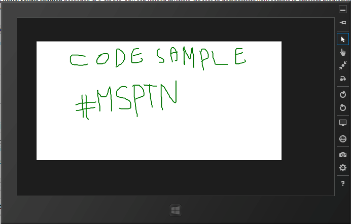

# Drawing on a Canvas with C#/XAML in a Windows Store App
## Requires
- Visual Studio 2012
## License
- Apache License, Version 2.0
## Technologies
- C#
- XAML
- Windows Store
- Windows Store app
## Topics
- Drawing
- Gestures
## Updated
- 04/16/2013
## Description

<h1>Introduction</h1>

<em>This code sample will allow you to give the user the ability to draw anything on the screen .</em>

<h1>Building the Sample</h1>

<em>You need to have Windows 8 and Visual Studio 2012 installed on your PC in order to run this .</em>

Description

<em>This sample gives the user a new way in the ' Touch And Feel ' in Windows 8 . This app will make the user able to draw anything he wants on the screen , this code sample is very useful for many apps like games , I've developped a game for children named
 'MyAbc' to teach kids alphabets in 3 languages using this method . Besides the drawing with finger on a screen makes the app valuable . You still can add an app bar into the app and add buttons such as Recognize , Save or Erase , these buttons will add functionalities
 to the app and make it more powerful . There are three events that make the pointer works . We'll handle&nbsp;PointerReleased ,&nbsp;PointerMoved ,&nbsp;PointerPressed and each event will handle some code to let the user write using that pointer.</em>

<em>Here's a screen shot of this code sample running .</em>

<em>&nbsp;</em>

<em>Here's another screen shot , this one is from the app that I've developped using this method for kids to teach them alphabets .</em>

<em> 
</em>

C#

Edit|Remove

csharp
<pre class="hidden">    public MainPage()
        {
            this.InitializeComponent();

            MyCanvas.PointerPressed &#43;= new PointerEventHandler(MyCanvas_PointerPressed);
            MyCanvas.PointerMoved &#43;= new PointerEventHandler(MyCanvas_PointerMoved);
            MyCanvas.PointerReleased &#43;= new PointerEventHandler(MyCanvas_PointerReleased);
            MyCanvas.PointerExited &#43;= new PointerEventHandler(MyCanvas_PointerReleased);
        }</pre>

<pre class="csharp">&nbsp;&nbsp;&nbsp;&nbsp;public&nbsp;MainPage()&nbsp;
&nbsp;&nbsp;&nbsp;&nbsp;&nbsp;&nbsp;&nbsp;&nbsp;{&nbsp;
&nbsp;&nbsp;&nbsp;&nbsp;&nbsp;&nbsp;&nbsp;&nbsp;&nbsp;&nbsp;&nbsp;&nbsp;this.InitializeComponent();&nbsp;
&nbsp;
&nbsp;&nbsp;&nbsp;&nbsp;&nbsp;&nbsp;&nbsp;&nbsp;&nbsp;&nbsp;&nbsp;&nbsp;MyCanvas.PointerPressed&nbsp;&#43;=&nbsp;new&nbsp;PointerEventHandler(MyCanvas_PointerPressed);&nbsp;
&nbsp;&nbsp;&nbsp;&nbsp;&nbsp;&nbsp;&nbsp;&nbsp;&nbsp;&nbsp;&nbsp;&nbsp;MyCanvas.PointerMoved&nbsp;&#43;=&nbsp;new&nbsp;PointerEventHandler(MyCanvas_PointerMoved);&nbsp;
&nbsp;&nbsp;&nbsp;&nbsp;&nbsp;&nbsp;&nbsp;&nbsp;&nbsp;&nbsp;&nbsp;&nbsp;MyCanvas.PointerReleased&nbsp;&#43;=&nbsp;new&nbsp;PointerEventHandler(MyCanvas_PointerReleased);&nbsp;
&nbsp;&nbsp;&nbsp;&nbsp;&nbsp;&nbsp;&nbsp;&nbsp;&nbsp;&nbsp;&nbsp;&nbsp;MyCanvas.PointerExited&nbsp;&#43;=&nbsp;new&nbsp;PointerEventHandler(MyCanvas_PointerReleased);&nbsp;
&nbsp;&nbsp;&nbsp;&nbsp;&nbsp;&nbsp;&nbsp;&nbsp;}</pre>

<h1>Source Code Files</h1>
<ul>
<li><em>MainPage.xaml #1 - contains the canvas in the XAML code .</em> </li><li><em><em>MainPage.xaml.cs #2 -contains all the code behind and the events for the pointer .</em></em>
</li></ul>
<h1>More Information</h1>

<em>For more information feel free to contact me on khaled.jemni@studentpartner.com or mention me in Twitter @khaledjemni&nbsp;</em>

