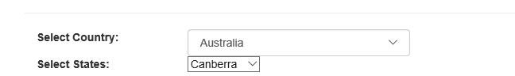

# Dropdowlist in MVC5
## Requires
- Visual Studio 2015
## License
- MIT
## Technologies
- ASP.NET
- jQuery
- MVC5
## Topics
- ASP.NET MVC
- DropDownList
- MVC5
- Cascading DropDown in MVC
## Updated
- 01/12/2016
## Description

<h1>Introduction</h1>

This sample show you how to create a dropdownlist in an MVC 5 application in less than 5 minutes.&nbsp;

<h1>Building the Sample</h1>

You will need to run this sample on visual Studio 2015 which runs on Windows 10.<strong>&nbsp;</strong><em><em><em>&nbsp;</em></em></em>

<h1>Description</h1>

In the code above, I used the Razor syntax to show the content in the View. It includes the DropDownList named Country that is rendered by the DropDownList Html helper. The first parameter of this helper represents the name of
 the DropDownList, the second is the&nbsp;<em>SelectList</em>&nbsp;object that contains the DropDownList values which ID is State.

&nbsp;

C#

Edit|Remove

csharp
<pre class="hidden">  public ActionResult Index()
        {
            List&lt;string&gt; ListItems = new List&lt;string&gt;();
            ListItems.Add(&quot;Select&quot;);
            ListItems.Add(&quot;India&quot;);
            ListItems.Add(&quot;Australia&quot;);
            ListItems.Add(&quot;America&quot;);
            ListItems.Add(&quot;North Africa&quot;);
            SelectList Countries = new SelectList(ListItems);
            ViewData[&quot;Countries&quot;] = Countries;
            return View();
        }
        public JsonResult States(string Country)
        {
            List&lt;string&gt; StatesList = new List&lt;string&gt;();
            switch (Country)
            {
                case &quot;India&quot;:
                    StatesList.Add(&quot;New Delhi&quot;);
                    StatesList.Add(&quot;Mumbai&quot;);
                    StatesList.Add(&quot;Kolkata&quot;);
                    StatesList.Add(&quot;Chennai&quot;);
                    break;
                case &quot;Australia&quot;:
                    StatesList.Add(&quot;Canberra&quot;);
                    StatesList.Add(&quot;Melbourne&quot;);
                    StatesList.Add(&quot;Perth&quot;);
                    StatesList.Add(&quot;Sydney&quot;);
                    break;
                case &quot;America&quot;:
                    StatesList.Add(&quot;California&quot;);
                    StatesList.Add(&quot;Florida&quot;);
                    StatesList.Add(&quot;New York&quot;);
                    StatesList.Add(&quot;Washignton&quot;);
                    break;
                case &quot;North Africa&quot;:
                    StatesList.Add(&quot;Tunisia&quot;);
                    StatesList.Add(&quot;Libya&quot;);
                    StatesList.Add(&quot;Morocco&quot;);
                    StatesList.Add(&quot;Sudan&quot;);
                    break;
            }
            return Json(StatesList);
        }</pre>

<pre class="csharp">&nbsp;&nbsp;public&nbsp;ActionResult&nbsp;Index()&nbsp;
&nbsp;&nbsp;&nbsp;&nbsp;&nbsp;&nbsp;&nbsp;&nbsp;{&nbsp;
&nbsp;&nbsp;&nbsp;&nbsp;&nbsp;&nbsp;&nbsp;&nbsp;&nbsp;&nbsp;&nbsp;&nbsp;List&lt;string&gt;&nbsp;ListItems&nbsp;=&nbsp;new&nbsp;List&lt;string&gt;();&nbsp;
&nbsp;&nbsp;&nbsp;&nbsp;&nbsp;&nbsp;&nbsp;&nbsp;&nbsp;&nbsp;&nbsp;&nbsp;ListItems.Add(&quot;Select&quot;);&nbsp;
&nbsp;&nbsp;&nbsp;&nbsp;&nbsp;&nbsp;&nbsp;&nbsp;&nbsp;&nbsp;&nbsp;&nbsp;ListItems.Add(&quot;India&quot;);&nbsp;
&nbsp;&nbsp;&nbsp;&nbsp;&nbsp;&nbsp;&nbsp;&nbsp;&nbsp;&nbsp;&nbsp;&nbsp;ListItems.Add(&quot;Australia&quot;);&nbsp;
&nbsp;&nbsp;&nbsp;&nbsp;&nbsp;&nbsp;&nbsp;&nbsp;&nbsp;&nbsp;&nbsp;&nbsp;ListItems.Add(&quot;America&quot;);&nbsp;
&nbsp;&nbsp;&nbsp;&nbsp;&nbsp;&nbsp;&nbsp;&nbsp;&nbsp;&nbsp;&nbsp;&nbsp;ListItems.Add(&quot;North&nbsp;Africa&quot;);&nbsp;
&nbsp;&nbsp;&nbsp;&nbsp;&nbsp;&nbsp;&nbsp;&nbsp;&nbsp;&nbsp;&nbsp;&nbsp;SelectList&nbsp;Countries&nbsp;=&nbsp;new&nbsp;SelectList(ListItems);&nbsp;
&nbsp;&nbsp;&nbsp;&nbsp;&nbsp;&nbsp;&nbsp;&nbsp;&nbsp;&nbsp;&nbsp;&nbsp;ViewData[&quot;Countries&quot;]&nbsp;=&nbsp;Countries;&nbsp;
&nbsp;&nbsp;&nbsp;&nbsp;&nbsp;&nbsp;&nbsp;&nbsp;&nbsp;&nbsp;&nbsp;&nbsp;return&nbsp;View();&nbsp;
&nbsp;&nbsp;&nbsp;&nbsp;&nbsp;&nbsp;&nbsp;&nbsp;}&nbsp;
&nbsp;&nbsp;&nbsp;&nbsp;&nbsp;&nbsp;&nbsp;&nbsp;public&nbsp;JsonResult&nbsp;States(string&nbsp;Country)&nbsp;
&nbsp;&nbsp;&nbsp;&nbsp;&nbsp;&nbsp;&nbsp;&nbsp;{&nbsp;
&nbsp;&nbsp;&nbsp;&nbsp;&nbsp;&nbsp;&nbsp;&nbsp;&nbsp;&nbsp;&nbsp;&nbsp;List&lt;string&gt;&nbsp;StatesList&nbsp;=&nbsp;new&nbsp;List&lt;string&gt;();&nbsp;
&nbsp;&nbsp;&nbsp;&nbsp;&nbsp;&nbsp;&nbsp;&nbsp;&nbsp;&nbsp;&nbsp;&nbsp;switch&nbsp;(Country)&nbsp;
&nbsp;&nbsp;&nbsp;&nbsp;&nbsp;&nbsp;&nbsp;&nbsp;&nbsp;&nbsp;&nbsp;&nbsp;{&nbsp;
&nbsp;&nbsp;&nbsp;&nbsp;&nbsp;&nbsp;&nbsp;&nbsp;&nbsp;&nbsp;&nbsp;&nbsp;&nbsp;&nbsp;&nbsp;&nbsp;case&nbsp;&quot;India&quot;:&nbsp;
&nbsp;&nbsp;&nbsp;&nbsp;&nbsp;&nbsp;&nbsp;&nbsp;&nbsp;&nbsp;&nbsp;&nbsp;&nbsp;&nbsp;&nbsp;&nbsp;&nbsp;&nbsp;&nbsp;&nbsp;StatesList.Add(&quot;New&nbsp;Delhi&quot;);&nbsp;
&nbsp;&nbsp;&nbsp;&nbsp;&nbsp;&nbsp;&nbsp;&nbsp;&nbsp;&nbsp;&nbsp;&nbsp;&nbsp;&nbsp;&nbsp;&nbsp;&nbsp;&nbsp;&nbsp;&nbsp;StatesList.Add(&quot;Mumbai&quot;);&nbsp;
&nbsp;&nbsp;&nbsp;&nbsp;&nbsp;&nbsp;&nbsp;&nbsp;&nbsp;&nbsp;&nbsp;&nbsp;&nbsp;&nbsp;&nbsp;&nbsp;&nbsp;&nbsp;&nbsp;&nbsp;StatesList.Add(&quot;Kolkata&quot;);&nbsp;
&nbsp;&nbsp;&nbsp;&nbsp;&nbsp;&nbsp;&nbsp;&nbsp;&nbsp;&nbsp;&nbsp;&nbsp;&nbsp;&nbsp;&nbsp;&nbsp;&nbsp;&nbsp;&nbsp;&nbsp;StatesList.Add(&quot;Chennai&quot;);&nbsp;
&nbsp;&nbsp;&nbsp;&nbsp;&nbsp;&nbsp;&nbsp;&nbsp;&nbsp;&nbsp;&nbsp;&nbsp;&nbsp;&nbsp;&nbsp;&nbsp;&nbsp;&nbsp;&nbsp;&nbsp;break;&nbsp;
&nbsp;&nbsp;&nbsp;&nbsp;&nbsp;&nbsp;&nbsp;&nbsp;&nbsp;&nbsp;&nbsp;&nbsp;&nbsp;&nbsp;&nbsp;&nbsp;case&nbsp;&quot;Australia&quot;:&nbsp;
&nbsp;&nbsp;&nbsp;&nbsp;&nbsp;&nbsp;&nbsp;&nbsp;&nbsp;&nbsp;&nbsp;&nbsp;&nbsp;&nbsp;&nbsp;&nbsp;&nbsp;&nbsp;&nbsp;&nbsp;StatesList.Add(&quot;Canberra&quot;);&nbsp;
&nbsp;&nbsp;&nbsp;&nbsp;&nbsp;&nbsp;&nbsp;&nbsp;&nbsp;&nbsp;&nbsp;&nbsp;&nbsp;&nbsp;&nbsp;&nbsp;&nbsp;&nbsp;&nbsp;&nbsp;StatesList.Add(&quot;Melbourne&quot;);&nbsp;
&nbsp;&nbsp;&nbsp;&nbsp;&nbsp;&nbsp;&nbsp;&nbsp;&nbsp;&nbsp;&nbsp;&nbsp;&nbsp;&nbsp;&nbsp;&nbsp;&nbsp;&nbsp;&nbsp;&nbsp;StatesList.Add(&quot;Perth&quot;);&nbsp;
&nbsp;&nbsp;&nbsp;&nbsp;&nbsp;&nbsp;&nbsp;&nbsp;&nbsp;&nbsp;&nbsp;&nbsp;&nbsp;&nbsp;&nbsp;&nbsp;&nbsp;&nbsp;&nbsp;&nbsp;StatesList.Add(&quot;Sydney&quot;);&nbsp;
&nbsp;&nbsp;&nbsp;&nbsp;&nbsp;&nbsp;&nbsp;&nbsp;&nbsp;&nbsp;&nbsp;&nbsp;&nbsp;&nbsp;&nbsp;&nbsp;&nbsp;&nbsp;&nbsp;&nbsp;break;&nbsp;
&nbsp;&nbsp;&nbsp;&nbsp;&nbsp;&nbsp;&nbsp;&nbsp;&nbsp;&nbsp;&nbsp;&nbsp;&nbsp;&nbsp;&nbsp;&nbsp;case&nbsp;&quot;America&quot;:&nbsp;
&nbsp;&nbsp;&nbsp;&nbsp;&nbsp;&nbsp;&nbsp;&nbsp;&nbsp;&nbsp;&nbsp;&nbsp;&nbsp;&nbsp;&nbsp;&nbsp;&nbsp;&nbsp;&nbsp;&nbsp;StatesList.Add(&quot;California&quot;);&nbsp;
&nbsp;&nbsp;&nbsp;&nbsp;&nbsp;&nbsp;&nbsp;&nbsp;&nbsp;&nbsp;&nbsp;&nbsp;&nbsp;&nbsp;&nbsp;&nbsp;&nbsp;&nbsp;&nbsp;&nbsp;StatesList.Add(&quot;Florida&quot;);&nbsp;
&nbsp;&nbsp;&nbsp;&nbsp;&nbsp;&nbsp;&nbsp;&nbsp;&nbsp;&nbsp;&nbsp;&nbsp;&nbsp;&nbsp;&nbsp;&nbsp;&nbsp;&nbsp;&nbsp;&nbsp;StatesList.Add(&quot;New&nbsp;York&quot;);&nbsp;
&nbsp;&nbsp;&nbsp;&nbsp;&nbsp;&nbsp;&nbsp;&nbsp;&nbsp;&nbsp;&nbsp;&nbsp;&nbsp;&nbsp;&nbsp;&nbsp;&nbsp;&nbsp;&nbsp;&nbsp;StatesList.Add(&quot;Washignton&quot;);&nbsp;
&nbsp;&nbsp;&nbsp;&nbsp;&nbsp;&nbsp;&nbsp;&nbsp;&nbsp;&nbsp;&nbsp;&nbsp;&nbsp;&nbsp;&nbsp;&nbsp;&nbsp;&nbsp;&nbsp;&nbsp;break;&nbsp;
&nbsp;&nbsp;&nbsp;&nbsp;&nbsp;&nbsp;&nbsp;&nbsp;&nbsp;&nbsp;&nbsp;&nbsp;&nbsp;&nbsp;&nbsp;&nbsp;case&nbsp;&quot;North&nbsp;Africa&quot;:&nbsp;
&nbsp;&nbsp;&nbsp;&nbsp;&nbsp;&nbsp;&nbsp;&nbsp;&nbsp;&nbsp;&nbsp;&nbsp;&nbsp;&nbsp;&nbsp;&nbsp;&nbsp;&nbsp;&nbsp;&nbsp;StatesList.Add(&quot;Tunisia&quot;);&nbsp;
&nbsp;&nbsp;&nbsp;&nbsp;&nbsp;&nbsp;&nbsp;&nbsp;&nbsp;&nbsp;&nbsp;&nbsp;&nbsp;&nbsp;&nbsp;&nbsp;&nbsp;&nbsp;&nbsp;&nbsp;StatesList.Add(&quot;Libya&quot;);&nbsp;
&nbsp;&nbsp;&nbsp;&nbsp;&nbsp;&nbsp;&nbsp;&nbsp;&nbsp;&nbsp;&nbsp;&nbsp;&nbsp;&nbsp;&nbsp;&nbsp;&nbsp;&nbsp;&nbsp;&nbsp;StatesList.Add(&quot;Morocco&quot;);&nbsp;
&nbsp;&nbsp;&nbsp;&nbsp;&nbsp;&nbsp;&nbsp;&nbsp;&nbsp;&nbsp;&nbsp;&nbsp;&nbsp;&nbsp;&nbsp;&nbsp;&nbsp;&nbsp;&nbsp;&nbsp;StatesList.Add(&quot;Sudan&quot;);&nbsp;
&nbsp;&nbsp;&nbsp;&nbsp;&nbsp;&nbsp;&nbsp;&nbsp;&nbsp;&nbsp;&nbsp;&nbsp;&nbsp;&nbsp;&nbsp;&nbsp;&nbsp;&nbsp;&nbsp;&nbsp;break;&nbsp;
&nbsp;&nbsp;&nbsp;&nbsp;&nbsp;&nbsp;&nbsp;&nbsp;&nbsp;&nbsp;&nbsp;&nbsp;}&nbsp;
&nbsp;&nbsp;&nbsp;&nbsp;&nbsp;&nbsp;&nbsp;&nbsp;&nbsp;&nbsp;&nbsp;&nbsp;return&nbsp;Json(StatesList);&nbsp;
&nbsp;&nbsp;&nbsp;&nbsp;&nbsp;&nbsp;&nbsp;&nbsp;}</pre>

The jQuery reference is added here manually and inside the script tag the&nbsp;<em>ready()</em>&nbsp;handler the first code will disable the DropDownList using the&nbsp;<em>prop()</em>. The&nbsp;<em>change()</em>&nbsp;handler
 function at first checks whether the value is selected in the Country and if it is other than &quot;Please Select&quot;, the code creates an<em>CountryOptions</em>&nbsp;object. The&nbsp;<em>CountryOptions</em>&nbsp;object holds various settings for the Ajax request
 to be made to the server for retrieving the State values. There are various properties defined here such as URL that points to the&nbsp;<em>States()</em>&nbsp;method, the type is set to post that indicates that a post method is used whereas the request and&nbsp;data
 contains the JSON representation of the Country.

JavaScript

Edit|Remove

js
<pre class="hidden">&lt;script&gt;
    $(document).ready(function () {
        $(&quot;#State&quot;).prop(&quot;disabled&quot;, true);
        $(&quot;#Country&quot;).change(function () {
            if ($(&quot;#Country&quot;).val() != &quot;Select&quot;) {
                var CountryOptions = {};
                CountryOptions.url = &quot;/Sample/states&quot;;
                CountryOptions.type = &quot;POST&quot;;
                CountryOptions.data = JSON.stringify({ Country: $(&quot;#Country&quot;).val() });
                CountryOptions.datatype = &quot;json&quot;;
                CountryOptions.contentType = &quot;application/json&quot;;
                CountryOptions.success = function (StatesList) {
                    $(&quot;#State&quot;).empty();
                    for (var i = 0; i &lt; StatesList.length; i&#43;&#43;) {
                        $(&quot;#State&quot;).append(&quot;&lt;option&gt;&quot; &#43; StatesList[i] &#43; &quot;&lt;/option&gt;&quot;);
                    }
                    $(&quot;#State&quot;).prop(&quot;disabled&quot;, false);
                };
                CountryOptions.error = function () { alert(&quot;Error in Getting States!!&quot;); };
                $.ajax(CountryOptions);
            }
            else {
                $(&quot;#State&quot;).empty();
                $(&quot;#State&quot;).prop(&quot;disabled&quot;, true);
            }
        });
    });
&lt;/script&gt;</pre>

<pre class="js">&lt;script&gt;&nbsp;
&nbsp;&nbsp;&nbsp;&nbsp;$(document).ready(function&nbsp;()&nbsp;{&nbsp;
&nbsp;&nbsp;&nbsp;&nbsp;&nbsp;&nbsp;&nbsp;&nbsp;$(&quot;#State&quot;).prop(&quot;disabled&quot;,&nbsp;true);&nbsp;
&nbsp;&nbsp;&nbsp;&nbsp;&nbsp;&nbsp;&nbsp;&nbsp;$(&quot;#Country&quot;).change(function&nbsp;()&nbsp;{&nbsp;
&nbsp;&nbsp;&nbsp;&nbsp;&nbsp;&nbsp;&nbsp;&nbsp;&nbsp;&nbsp;&nbsp;&nbsp;if&nbsp;($(&quot;#Country&quot;).val()&nbsp;!=&nbsp;&quot;Select&quot;)&nbsp;{&nbsp;
&nbsp;&nbsp;&nbsp;&nbsp;&nbsp;&nbsp;&nbsp;&nbsp;&nbsp;&nbsp;&nbsp;&nbsp;&nbsp;&nbsp;&nbsp;&nbsp;var&nbsp;CountryOptions&nbsp;=&nbsp;{};&nbsp;
&nbsp;&nbsp;&nbsp;&nbsp;&nbsp;&nbsp;&nbsp;&nbsp;&nbsp;&nbsp;&nbsp;&nbsp;&nbsp;&nbsp;&nbsp;&nbsp;CountryOptions.url&nbsp;=&nbsp;&quot;/Sample/states&quot;;&nbsp;
&nbsp;&nbsp;&nbsp;&nbsp;&nbsp;&nbsp;&nbsp;&nbsp;&nbsp;&nbsp;&nbsp;&nbsp;&nbsp;&nbsp;&nbsp;&nbsp;CountryOptions.type&nbsp;=&nbsp;&quot;POST&quot;;&nbsp;
&nbsp;&nbsp;&nbsp;&nbsp;&nbsp;&nbsp;&nbsp;&nbsp;&nbsp;&nbsp;&nbsp;&nbsp;&nbsp;&nbsp;&nbsp;&nbsp;CountryOptions.data&nbsp;=&nbsp;JSON.stringify({&nbsp;Country:&nbsp;$(&quot;#Country&quot;).val()&nbsp;});&nbsp;
&nbsp;&nbsp;&nbsp;&nbsp;&nbsp;&nbsp;&nbsp;&nbsp;&nbsp;&nbsp;&nbsp;&nbsp;&nbsp;&nbsp;&nbsp;&nbsp;CountryOptions.datatype&nbsp;=&nbsp;&quot;json&quot;;&nbsp;
&nbsp;&nbsp;&nbsp;&nbsp;&nbsp;&nbsp;&nbsp;&nbsp;&nbsp;&nbsp;&nbsp;&nbsp;&nbsp;&nbsp;&nbsp;&nbsp;CountryOptions.contentType&nbsp;=&nbsp;&quot;application/json&quot;;&nbsp;
&nbsp;&nbsp;&nbsp;&nbsp;&nbsp;&nbsp;&nbsp;&nbsp;&nbsp;&nbsp;&nbsp;&nbsp;&nbsp;&nbsp;&nbsp;&nbsp;CountryOptions.success&nbsp;=&nbsp;function&nbsp;(StatesList)&nbsp;{&nbsp;
&nbsp;&nbsp;&nbsp;&nbsp;&nbsp;&nbsp;&nbsp;&nbsp;&nbsp;&nbsp;&nbsp;&nbsp;&nbsp;&nbsp;&nbsp;&nbsp;&nbsp;&nbsp;&nbsp;&nbsp;$(&quot;#State&quot;).empty();&nbsp;
&nbsp;&nbsp;&nbsp;&nbsp;&nbsp;&nbsp;&nbsp;&nbsp;&nbsp;&nbsp;&nbsp;&nbsp;&nbsp;&nbsp;&nbsp;&nbsp;&nbsp;&nbsp;&nbsp;&nbsp;for&nbsp;(var&nbsp;i&nbsp;=&nbsp;0;&nbsp;i&nbsp;&lt;&nbsp;StatesList.length;&nbsp;i&#43;&#43;)&nbsp;{&nbsp;
&nbsp;&nbsp;&nbsp;&nbsp;&nbsp;&nbsp;&nbsp;&nbsp;&nbsp;&nbsp;&nbsp;&nbsp;&nbsp;&nbsp;&nbsp;&nbsp;&nbsp;&nbsp;&nbsp;&nbsp;&nbsp;&nbsp;&nbsp;&nbsp;$(&quot;#State&quot;).append(&quot;&lt;option&gt;&quot;&nbsp;&#43;&nbsp;StatesList[i]&nbsp;&#43;&nbsp;&quot;&lt;/option&gt;&quot;);&nbsp;
&nbsp;&nbsp;&nbsp;&nbsp;&nbsp;&nbsp;&nbsp;&nbsp;&nbsp;&nbsp;&nbsp;&nbsp;&nbsp;&nbsp;&nbsp;&nbsp;&nbsp;&nbsp;&nbsp;&nbsp;}&nbsp;
&nbsp;&nbsp;&nbsp;&nbsp;&nbsp;&nbsp;&nbsp;&nbsp;&nbsp;&nbsp;&nbsp;&nbsp;&nbsp;&nbsp;&nbsp;&nbsp;&nbsp;&nbsp;&nbsp;&nbsp;$(&quot;#State&quot;).prop(&quot;disabled&quot;,&nbsp;false);&nbsp;
&nbsp;&nbsp;&nbsp;&nbsp;&nbsp;&nbsp;&nbsp;&nbsp;&nbsp;&nbsp;&nbsp;&nbsp;&nbsp;&nbsp;&nbsp;&nbsp;};&nbsp;
&nbsp;&nbsp;&nbsp;&nbsp;&nbsp;&nbsp;&nbsp;&nbsp;&nbsp;&nbsp;&nbsp;&nbsp;&nbsp;&nbsp;&nbsp;&nbsp;CountryOptions.error&nbsp;=&nbsp;function&nbsp;()&nbsp;{&nbsp;alert(&quot;Error&nbsp;in&nbsp;Getting&nbsp;States!!&quot;);&nbsp;};&nbsp;
&nbsp;&nbsp;&nbsp;&nbsp;&nbsp;&nbsp;&nbsp;&nbsp;&nbsp;&nbsp;&nbsp;&nbsp;&nbsp;&nbsp;&nbsp;&nbsp;$.ajax(CountryOptions);&nbsp;
&nbsp;&nbsp;&nbsp;&nbsp;&nbsp;&nbsp;&nbsp;&nbsp;&nbsp;&nbsp;&nbsp;&nbsp;}&nbsp;
&nbsp;&nbsp;&nbsp;&nbsp;&nbsp;&nbsp;&nbsp;&nbsp;&nbsp;&nbsp;&nbsp;&nbsp;else&nbsp;{&nbsp;
&nbsp;&nbsp;&nbsp;&nbsp;&nbsp;&nbsp;&nbsp;&nbsp;&nbsp;&nbsp;&nbsp;&nbsp;&nbsp;&nbsp;&nbsp;&nbsp;$(&quot;#State&quot;).empty();&nbsp;
&nbsp;&nbsp;&nbsp;&nbsp;&nbsp;&nbsp;&nbsp;&nbsp;&nbsp;&nbsp;&nbsp;&nbsp;&nbsp;&nbsp;&nbsp;&nbsp;$(&quot;#State&quot;).prop(&quot;disabled&quot;,&nbsp;true);&nbsp;
&nbsp;&nbsp;&nbsp;&nbsp;&nbsp;&nbsp;&nbsp;&nbsp;&nbsp;&nbsp;&nbsp;&nbsp;}&nbsp;
&nbsp;&nbsp;&nbsp;&nbsp;&nbsp;&nbsp;&nbsp;&nbsp;});&nbsp;
&nbsp;&nbsp;&nbsp;&nbsp;});&nbsp;
&lt;/script&gt;</pre>

<h1 class="endscriptcode"><strong>Running the Application</strong></h1>

In this section we'll run the application and view the Sample Index view.

<em>&nbsp;</em>

<h1>More Information</h1>

<em><em>Feel free to contact me on Twitter @ChouroukHJfor any question about this and visit my blog for more code sample :</em><a href="http://www.hjaiejchourouk.com/"><em>&nbsp;http://hjaiejchourouk.com/</em></a></em>

