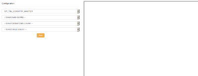

# Dynamic C# and SQL code Generator for crud Operation
## Requires
- Visual Studio 2010
## License
- MIT
## Technologies
- C#
- ASP.NET
- Windows Forms
- WPF
- .NET Framework
- Visual C#
## Topics
- C#
- Data Binding
- ASP.NET
- Data Access
- C# Language Features
## Updated
- 02/17/2016
## Description

<h1>Introduction</h1>

<em>Dynamically Generate C# Data Access Code for Microsoft SQL Stored Procedure Component&nbsp;.</em><em>With this tool, dynamically generate C# data layer code (CRUD functions) for Microsoft SQL&nbsp;</em>

<h4>Features</h4>
<ol>
<li>Generate&nbsp;Sql Stored Procedure&nbsp; </li><li>Generate C# code ADO.NET Connection (Data Access Layer) </li><li>Generate&nbsp;Custome Entity Coresponding Your SQL Table. </li><li>performing Crud operation code </li></ol>
<h1>Steps</h1>

1. Download the attachement&nbsp;

2. Change your Connectionstring in web.config.

3. Select Your table&nbsp;from&nbsp;the&nbsp;drop-down&nbsp;list
 it&nbsp;all&nbsp;pre populate the table&nbsp;property&nbsp;respective dropdown
 list

4.Then, Select&nbsp;Your identity column and Default Date Column and&nbsp;Unique&nbsp;column,
 then&nbsp;Run the Application

&nbsp;

<strong>Description</strong>

&nbsp; &nbsp;I have &nbsp;created sample C# Code generator for Curd operactions. for example we can reduse colck coding like Curd opractions for master data's creation screens.

Example :

1.Run the following Query in sql&nbsp;

CREATE TABLE [dbo].[DynamicDataCompanyDetails]( [CompanyId] [bigint] NULL,
[CompanyName] [nvarchar](50) NULL, [CreatedOn] [datetime] NULL) ON [PRIMARY] 
GO

2. Extract your attachement and chanege the connectionstring in web.config file then open in your IDE&nbsp;

3. Run your application and &nbsp;select the table name asp...

&nbsp;

Happy Coding ....

