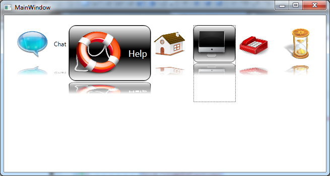
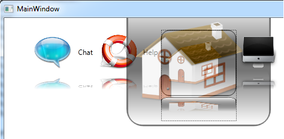

# Dynamic Image Button in WPF
## Requires
- Visual Studio 2010
## License
- Apache License, Version 2.0
## Technologies
- WPF
## Topics
- custom controls
- Button
- Image Button
## Updated
- 09/11/2011
## Description

<em>&nbsp;</em>

<em></em>

<em>&nbsp;</em>&nbsp;

<h1>Introduction</h1>

A sample in WPF to design an Image Button, like the Mac system DashBorad button, when the mouse over it, it can be scaled.

<h1>Building the Sample</h1>

Build it in Visual Studio 2010, WPF 4 project. Please rewrite your style for this button in the Theme/Generic.xaml, we can add new styles and features.

Description

A sample in WPF to design an Image Button, like the Mac system DashBorad button, when the mouse over it, it can be scaled, and this button has its inverted image (use the VisualImage to copy the original content). When we click it, a visual will show over
 the button：

I paste the code here:

XAML of the button style:

XAML

Edit|Remove

xaml
<pre class="hidden">  &lt;Style TargetType=&quot;{x:Type local:DynamicImageButton}&quot;&gt;
    &lt;Setter Property=&quot;Foreground&quot; Value=&quot;Black&quot;/&gt;
    &lt;Setter Property=&quot;Focusable&quot; Value=&quot;True&quot;/&gt;
    &lt;Setter Property=&quot;Template&quot;&gt;
      &lt;Setter.Value&gt;
        &lt;ControlTemplate TargetType=&quot;{x:Type local:DynamicImageButton}&quot;&gt;
          &lt;Grid&gt;
            &lt;Grid.RowDefinitions&gt;
              &lt;RowDefinition Height=&quot;Auto&quot;/&gt;
              &lt;RowDefinition Height=&quot;Auto&quot;/&gt;
            &lt;/Grid.RowDefinitions&gt;
            &lt;Grid x:Name=&quot;ICON_IMG&quot;&gt;
              &lt;Grid.ColumnDefinitions&gt;
                &lt;ColumnDefinition Width=&quot;Auto&quot;/&gt;
                &lt;ColumnDefinition Width=&quot;*&quot;/&gt;
              &lt;/Grid.ColumnDefinitions&gt;

              &lt;Grid Grid.ColumnSpan=&quot;2&quot; Background=&quot;Transparent&quot; x:Name=&quot;PART_BORDER&quot; Opacity=&quot;0&quot;&gt;
                &lt;Grid.RowDefinitions&gt;
                  &lt;RowDefinition Height=&quot;*&quot;/&gt;
                  &lt;RowDefinition Height=&quot;*&quot;/&gt;
                &lt;/Grid.RowDefinitions&gt;
                &lt;Rectangle RadiusX=&quot;10&quot; RadiusY=&quot;10&quot; Grid.RowSpan=&quot;2&quot;&gt;
                  &lt;Rectangle.Fill&gt;
                    &lt;LinearGradientBrush StartPoint=&quot;0.5,0&quot; EndPoint=&quot;0.5,1&quot;&gt;
                      &lt;LinearGradientBrush.GradientStops&gt;
                        &lt;GradientStop Color=&quot;#FF000000&quot; Offset=&quot;0&quot;/&gt;
                        &lt;GradientStop Color=&quot;#FF000000&quot; Offset=&quot;1&quot;/&gt;
                      &lt;/LinearGradientBrush.GradientStops&gt;
                    &lt;/LinearGradientBrush&gt;
                  &lt;/Rectangle.Fill&gt;
                &lt;/Rectangle&gt;
                &lt;Rectangle Grid.Row=&quot;0&quot; RadiusX=&quot;8&quot; RadiusY=&quot;8&quot; StrokeThickness=&quot;0&quot; Margin=&quot;1&quot;&gt;
                  &lt;Rectangle.Fill&gt;
                    &lt;LinearGradientBrush StartPoint=&quot;0.5,0&quot; EndPoint=&quot;0.5,1&quot;&gt;
                      &lt;LinearGradientBrush.GradientStops&gt;
                        &lt;GradientStop Color=&quot;#FFFFFFFF&quot; Offset=&quot;0&quot;/&gt;
                        &lt;GradientStop Color=&quot;#00FFFFFF&quot; Offset=&quot;0.9&quot;/&gt;
                      &lt;/LinearGradientBrush.GradientStops&gt;
                    &lt;/LinearGradientBrush&gt;
                  &lt;/Rectangle.Fill&gt;
                &lt;/Rectangle&gt;
                &lt;Rectangle Grid.Row=&quot;1&quot; RadiusX=&quot;8&quot; RadiusY=&quot;8&quot; StrokeThickness=&quot;0&quot; Margin=&quot;1&quot; Opacity=&quot;1&quot;&gt;
                  &lt;Rectangle.Fill&gt;
                    &lt;LinearGradientBrush StartPoint=&quot;0.5,0&quot; EndPoint=&quot;0.5,1&quot;&gt;
                      &lt;LinearGradientBrush.GradientStops&gt;
                        &lt;GradientStop Color=&quot;#00FFFFFF&quot; Offset=&quot;0.1&quot;/&gt;
                        &lt;GradientStop Color=&quot;#FFFFFFFF&quot; Offset=&quot;1&quot;/&gt;
                      &lt;/LinearGradientBrush.GradientStops&gt;
                    &lt;/LinearGradientBrush&gt;
                  &lt;/Rectangle.Fill&gt;
                &lt;/Rectangle&gt;
              &lt;/Grid&gt;

              &lt;Image Source=&quot;{TemplateBinding IconImage}&quot; Width=&quot;64&quot; Height=&quot;64&quot; Margin=&quot;5&quot;/&gt;
              &lt;ContentPresenter Grid.Column=&quot;1&quot; HorizontalAlignment=&quot;Stretch&quot; VerticalAlignment=&quot;Center&quot; Margin=&quot;5&quot;/&gt;

              &lt;Grid.LayoutTransform&gt;
                &lt;ScaleTransform/&gt;
              &lt;/Grid.LayoutTransform&gt;
            &lt;/Grid&gt;
            
            &lt;Rectangle x:Name=&quot;TOP_IMG&quot; RenderTransformOrigin=&quot;0.5,0.5&quot; Opacity=&quot;0&quot;&gt;
              &lt;Rectangle.Fill&gt;
                &lt;VisualBrush Visual=&quot;{Binding ElementName=ICON_IMG}&quot;/&gt;
              &lt;/Rectangle.Fill&gt;
              &lt;Rectangle.RenderTransform&gt;
                &lt;ScaleTransform/&gt;
              &lt;/Rectangle.RenderTransform&gt;
            &lt;/Rectangle&gt;

            &lt;Rectangle Grid.Row=&quot;1&quot; Height=&quot;40&quot; Margin=&quot;0,2,0,0&quot;&gt;
              &lt;Rectangle.LayoutTransform&gt;
                &lt;ScaleTransform ScaleY=&quot;-1&quot;/&gt;
              &lt;/Rectangle.LayoutTransform&gt;
              &lt;Rectangle.Fill&gt;
                &lt;VisualBrush Visual=&quot;{Binding ElementName=ICON_IMG}&quot;/&gt;
              &lt;/Rectangle.Fill&gt;
              &lt;Rectangle.OpacityMask&gt;
                &lt;LinearGradientBrush StartPoint=&quot;0.5,0&quot; EndPoint=&quot;0.5,1&quot;&gt;
                  &lt;GradientStop Color=&quot;Transparent&quot; Offset=&quot;0.4&quot;/&gt;
                  &lt;GradientStop Color=&quot;White&quot; Offset=&quot;1&quot;/&gt;
                &lt;/LinearGradientBrush&gt;
              &lt;/Rectangle.OpacityMask&gt;
            &lt;/Rectangle&gt;
          &lt;/Grid&gt;
          &lt;ControlTemplate.Triggers&gt;
            &lt;Trigger Property=&quot;ButtonBase.IsMouseOver&quot; Value=&quot;True&quot;&gt;
              &lt;Setter TargetName=&quot;PART_BORDER&quot; Property=&quot;Opacity&quot; Value=&quot;1&quot;/&gt;
              &lt;Setter Property=&quot;Foreground&quot; Value=&quot;White&quot;/&gt;
              &lt;Trigger.EnterActions&gt;
                &lt;BeginStoryboard&gt;
                  &lt;Storyboard&gt;
                    &lt;DoubleAnimation Storyboard.TargetName=&quot;ICON_IMG&quot; 
                                     Storyboard.TargetProperty=&quot;LayoutTransform.ScaleX&quot; 
                                     To=&quot;1.5&quot;
                                     Duration=&quot;0:0:0.3&quot;/&gt;

                    &lt;DoubleAnimation Storyboard.TargetName=&quot;ICON_IMG&quot; 
                                     Storyboard.TargetProperty=&quot;LayoutTransform.ScaleY&quot; 
                                     To=&quot;1.5&quot;
                                     Duration=&quot;0:0:0.3&quot;/&gt;
                  &lt;/Storyboard&gt;
                &lt;/BeginStoryboard&gt;
              &lt;/Trigger.EnterActions&gt;
              &lt;Trigger.ExitActions&gt;
                &lt;BeginStoryboard&gt;
                  &lt;Storyboard&gt;
                    &lt;DoubleAnimation Storyboard.TargetName=&quot;ICON_IMG&quot; 
                                     Storyboard.TargetProperty=&quot;LayoutTransform.ScaleX&quot; 
                                     To=&quot;1&quot;
                                     Duration=&quot;0:0:0.3&quot;/&gt;

                    &lt;DoubleAnimation Storyboard.TargetName=&quot;ICON_IMG&quot; 
                                     Storyboard.TargetProperty=&quot;LayoutTransform.ScaleY&quot; 
                                     To=&quot;1&quot;
                                     Duration=&quot;0:0:0.3&quot;/&gt;
                  &lt;/Storyboard&gt;
                &lt;/BeginStoryboard&gt;
              &lt;/Trigger.ExitActions&gt;
            &lt;/Trigger&gt;

            &lt;Trigger Property=&quot;IsFocused&quot; Value=&quot;True&quot;&gt;
              &lt;Setter TargetName=&quot;PART_BORDER&quot; Property=&quot;Opacity&quot; Value=&quot;1&quot;/&gt;
              &lt;Setter Property=&quot;Foreground&quot; Value=&quot;White&quot;/&gt;
            &lt;/Trigger&gt;

            &lt;EventTrigger RoutedEvent=&quot;ButtonBase.PreviewMouseDown&quot;&gt;
              &lt;BeginStoryboard&gt;
                &lt;Storyboard&gt;
                  &lt;DoubleAnimation Storyboard.TargetName=&quot;TOP_IMG&quot;
                                   Storyboard.TargetProperty=&quot;Opacity&quot;
                                   From=&quot;1&quot; To=&quot;0&quot; Duration=&quot;0:0:0.5&quot;/&gt;
                  &lt;DoubleAnimation Storyboard.TargetName=&quot;TOP_IMG&quot;
                                   Storyboard.TargetProperty=&quot;RenderTransform.ScaleX&quot;
                                   From=&quot;1&quot; To=&quot;3&quot; FillBehavior=&quot;Stop&quot; Duration=&quot;0:0:0.5&quot;/&gt;
                  &lt;DoubleAnimation Storyboard.TargetName=&quot;TOP_IMG&quot;
                                   Storyboard.TargetProperty=&quot;RenderTransform.ScaleY&quot;
                                   From=&quot;1&quot; To=&quot;3&quot; FillBehavior=&quot;Stop&quot; Duration=&quot;0:0:0.5&quot;/&gt;
                &lt;/Storyboard&gt;
              &lt;/BeginStoryboard&gt;
            &lt;/EventTrigger&gt;
          &lt;/ControlTemplate.Triggers&gt;
        &lt;/ControlTemplate&gt;
      &lt;/Setter.Value&gt;
    &lt;/Setter&gt;
  &lt;/Style&gt;</pre>

<pre class="js">&nbsp;&nbsp;&lt;Style&nbsp;TargetType=&quot;{x:Type&nbsp;local:DynamicImageButton}&quot;&gt;&nbsp;
&nbsp;&nbsp;&nbsp;&nbsp;&lt;Setter&nbsp;Property=&quot;Foreground&quot;&nbsp;Value=&quot;Black&quot;/&gt;&nbsp;
&nbsp;&nbsp;&nbsp;&nbsp;&lt;Setter&nbsp;Property=&quot;Focusable&quot;&nbsp;Value=&quot;True&quot;/&gt;&nbsp;
&nbsp;&nbsp;&nbsp;&nbsp;&lt;Setter&nbsp;Property=&quot;Template&quot;&gt;&nbsp;
&nbsp;&nbsp;&nbsp;&nbsp;&nbsp;&nbsp;&lt;Setter.Value&gt;&nbsp;
&nbsp;&nbsp;&nbsp;&nbsp;&nbsp;&nbsp;&nbsp;&nbsp;&lt;ControlTemplate&nbsp;TargetType=&quot;{x:Type&nbsp;local:DynamicImageButton}&quot;&gt;&nbsp;
&nbsp;&nbsp;&nbsp;&nbsp;&nbsp;&nbsp;&nbsp;&nbsp;&nbsp;&nbsp;&lt;Grid&gt;&nbsp;
&nbsp;&nbsp;&nbsp;&nbsp;&nbsp;&nbsp;&nbsp;&nbsp;&nbsp;&nbsp;&nbsp;&nbsp;&lt;Grid.RowDefinitions&gt;&nbsp;
&nbsp;&nbsp;&nbsp;&nbsp;&nbsp;&nbsp;&nbsp;&nbsp;&nbsp;&nbsp;&nbsp;&nbsp;&nbsp;&nbsp;&lt;RowDefinition&nbsp;Height=&quot;Auto&quot;/&gt;&nbsp;
&nbsp;&nbsp;&nbsp;&nbsp;&nbsp;&nbsp;&nbsp;&nbsp;&nbsp;&nbsp;&nbsp;&nbsp;&nbsp;&nbsp;&lt;RowDefinition&nbsp;Height=&quot;Auto&quot;/&gt;&nbsp;
&nbsp;&nbsp;&nbsp;&nbsp;&nbsp;&nbsp;&nbsp;&nbsp;&nbsp;&nbsp;&nbsp;&nbsp;&lt;/Grid.RowDefinitions&gt;&nbsp;
&nbsp;&nbsp;&nbsp;&nbsp;&nbsp;&nbsp;&nbsp;&nbsp;&nbsp;&nbsp;&nbsp;&nbsp;&lt;Grid&nbsp;x:Name=&quot;ICON_IMG&quot;&gt;&nbsp;
&nbsp;&nbsp;&nbsp;&nbsp;&nbsp;&nbsp;&nbsp;&nbsp;&nbsp;&nbsp;&nbsp;&nbsp;&nbsp;&nbsp;&lt;Grid.ColumnDefinitions&gt;&nbsp;
&nbsp;&nbsp;&nbsp;&nbsp;&nbsp;&nbsp;&nbsp;&nbsp;&nbsp;&nbsp;&nbsp;&nbsp;&nbsp;&nbsp;&nbsp;&nbsp;&lt;ColumnDefinition&nbsp;Width=&quot;Auto&quot;/&gt;&nbsp;
&nbsp;&nbsp;&nbsp;&nbsp;&nbsp;&nbsp;&nbsp;&nbsp;&nbsp;&nbsp;&nbsp;&nbsp;&nbsp;&nbsp;&nbsp;&nbsp;&lt;ColumnDefinition&nbsp;Width=&quot;*&quot;/&gt;&nbsp;
&nbsp;&nbsp;&nbsp;&nbsp;&nbsp;&nbsp;&nbsp;&nbsp;&nbsp;&nbsp;&nbsp;&nbsp;&nbsp;&nbsp;&lt;/Grid.ColumnDefinitions&gt;&nbsp;
&nbsp;
&nbsp;&nbsp;&nbsp;&nbsp;&nbsp;&nbsp;&nbsp;&nbsp;&nbsp;&nbsp;&nbsp;&nbsp;&nbsp;&nbsp;&lt;Grid&nbsp;Grid.ColumnSpan=&quot;2&quot;&nbsp;Background=&quot;Transparent&quot;&nbsp;x:Name=&quot;PART_BORDER&quot;&nbsp;Opacity=&quot;0&quot;&gt;&nbsp;
&nbsp;&nbsp;&nbsp;&nbsp;&nbsp;&nbsp;&nbsp;&nbsp;&nbsp;&nbsp;&nbsp;&nbsp;&nbsp;&nbsp;&nbsp;&nbsp;&lt;Grid.RowDefinitions&gt;&nbsp;
&nbsp;&nbsp;&nbsp;&nbsp;&nbsp;&nbsp;&nbsp;&nbsp;&nbsp;&nbsp;&nbsp;&nbsp;&nbsp;&nbsp;&nbsp;&nbsp;&nbsp;&nbsp;&lt;RowDefinition&nbsp;Height=&quot;*&quot;/&gt;&nbsp;
&nbsp;&nbsp;&nbsp;&nbsp;&nbsp;&nbsp;&nbsp;&nbsp;&nbsp;&nbsp;&nbsp;&nbsp;&nbsp;&nbsp;&nbsp;&nbsp;&nbsp;&nbsp;&lt;RowDefinition&nbsp;Height=&quot;*&quot;/&gt;&nbsp;
&nbsp;&nbsp;&nbsp;&nbsp;&nbsp;&nbsp;&nbsp;&nbsp;&nbsp;&nbsp;&nbsp;&nbsp;&nbsp;&nbsp;&nbsp;&nbsp;&lt;/Grid.RowDefinitions&gt;&nbsp;
&nbsp;&nbsp;&nbsp;&nbsp;&nbsp;&nbsp;&nbsp;&nbsp;&nbsp;&nbsp;&nbsp;&nbsp;&nbsp;&nbsp;&nbsp;&nbsp;&lt;Rectangle&nbsp;RadiusX=&quot;10&quot;&nbsp;RadiusY=&quot;10&quot;&nbsp;Grid.RowSpan=&quot;2&quot;&gt;&nbsp;
&nbsp;&nbsp;&nbsp;&nbsp;&nbsp;&nbsp;&nbsp;&nbsp;&nbsp;&nbsp;&nbsp;&nbsp;&nbsp;&nbsp;&nbsp;&nbsp;&nbsp;&nbsp;&lt;Rectangle.Fill&gt;&nbsp;
&nbsp;&nbsp;&nbsp;&nbsp;&nbsp;&nbsp;&nbsp;&nbsp;&nbsp;&nbsp;&nbsp;&nbsp;&nbsp;&nbsp;&nbsp;&nbsp;&nbsp;&nbsp;&nbsp;&nbsp;&lt;LinearGradientBrush&nbsp;StartPoint=&quot;0.5,0&quot;&nbsp;EndPoint=&quot;0.5,1&quot;&gt;&nbsp;
&nbsp;&nbsp;&nbsp;&nbsp;&nbsp;&nbsp;&nbsp;&nbsp;&nbsp;&nbsp;&nbsp;&nbsp;&nbsp;&nbsp;&nbsp;&nbsp;&nbsp;&nbsp;&nbsp;&nbsp;&nbsp;&nbsp;&lt;LinearGradientBrush.GradientStops&gt;&nbsp;
&nbsp;&nbsp;&nbsp;&nbsp;&nbsp;&nbsp;&nbsp;&nbsp;&nbsp;&nbsp;&nbsp;&nbsp;&nbsp;&nbsp;&nbsp;&nbsp;&nbsp;&nbsp;&nbsp;&nbsp;&nbsp;&nbsp;&nbsp;&nbsp;&lt;GradientStop&nbsp;Color=&quot;#FF000000&quot;&nbsp;Offset=&quot;0&quot;/&gt;&nbsp;
&nbsp;&nbsp;&nbsp;&nbsp;&nbsp;&nbsp;&nbsp;&nbsp;&nbsp;&nbsp;&nbsp;&nbsp;&nbsp;&nbsp;&nbsp;&nbsp;&nbsp;&nbsp;&nbsp;&nbsp;&nbsp;&nbsp;&nbsp;&nbsp;&lt;GradientStop&nbsp;Color=&quot;#FF000000&quot;&nbsp;Offset=&quot;1&quot;/&gt;&nbsp;
&nbsp;&nbsp;&nbsp;&nbsp;&nbsp;&nbsp;&nbsp;&nbsp;&nbsp;&nbsp;&nbsp;&nbsp;&nbsp;&nbsp;&nbsp;&nbsp;&nbsp;&nbsp;&nbsp;&nbsp;&nbsp;&nbsp;&lt;/LinearGradientBrush.GradientStops&gt;&nbsp;
&nbsp;&nbsp;&nbsp;&nbsp;&nbsp;&nbsp;&nbsp;&nbsp;&nbsp;&nbsp;&nbsp;&nbsp;&nbsp;&nbsp;&nbsp;&nbsp;&nbsp;&nbsp;&nbsp;&nbsp;&lt;/LinearGradientBrush&gt;&nbsp;
&nbsp;&nbsp;&nbsp;&nbsp;&nbsp;&nbsp;&nbsp;&nbsp;&nbsp;&nbsp;&nbsp;&nbsp;&nbsp;&nbsp;&nbsp;&nbsp;&nbsp;&nbsp;&lt;/Rectangle.Fill&gt;&nbsp;
&nbsp;&nbsp;&nbsp;&nbsp;&nbsp;&nbsp;&nbsp;&nbsp;&nbsp;&nbsp;&nbsp;&nbsp;&nbsp;&nbsp;&nbsp;&nbsp;&lt;/Rectangle&gt;&nbsp;
&nbsp;&nbsp;&nbsp;&nbsp;&nbsp;&nbsp;&nbsp;&nbsp;&nbsp;&nbsp;&nbsp;&nbsp;&nbsp;&nbsp;&nbsp;&nbsp;&lt;Rectangle&nbsp;Grid.Row=&quot;0&quot;&nbsp;RadiusX=&quot;8&quot;&nbsp;RadiusY=&quot;8&quot;&nbsp;StrokeThickness=&quot;0&quot;&nbsp;Margin=&quot;1&quot;&gt;&nbsp;
&nbsp;&nbsp;&nbsp;&nbsp;&nbsp;&nbsp;&nbsp;&nbsp;&nbsp;&nbsp;&nbsp;&nbsp;&nbsp;&nbsp;&nbsp;&nbsp;&nbsp;&nbsp;&lt;Rectangle.Fill&gt;&nbsp;
&nbsp;&nbsp;&nbsp;&nbsp;&nbsp;&nbsp;&nbsp;&nbsp;&nbsp;&nbsp;&nbsp;&nbsp;&nbsp;&nbsp;&nbsp;&nbsp;&nbsp;&nbsp;&nbsp;&nbsp;&lt;LinearGradientBrush&nbsp;StartPoint=&quot;0.5,0&quot;&nbsp;EndPoint=&quot;0.5,1&quot;&gt;&nbsp;
&nbsp;&nbsp;&nbsp;&nbsp;&nbsp;&nbsp;&nbsp;&nbsp;&nbsp;&nbsp;&nbsp;&nbsp;&nbsp;&nbsp;&nbsp;&nbsp;&nbsp;&nbsp;&nbsp;&nbsp;&nbsp;&nbsp;&lt;LinearGradientBrush.GradientStops&gt;&nbsp;
&nbsp;&nbsp;&nbsp;&nbsp;&nbsp;&nbsp;&nbsp;&nbsp;&nbsp;&nbsp;&nbsp;&nbsp;&nbsp;&nbsp;&nbsp;&nbsp;&nbsp;&nbsp;&nbsp;&nbsp;&nbsp;&nbsp;&nbsp;&nbsp;&lt;GradientStop&nbsp;Color=&quot;#FFFFFFFF&quot;&nbsp;Offset=&quot;0&quot;/&gt;&nbsp;
&nbsp;&nbsp;&nbsp;&nbsp;&nbsp;&nbsp;&nbsp;&nbsp;&nbsp;&nbsp;&nbsp;&nbsp;&nbsp;&nbsp;&nbsp;&nbsp;&nbsp;&nbsp;&nbsp;&nbsp;&nbsp;&nbsp;&nbsp;&nbsp;&lt;GradientStop&nbsp;Color=&quot;#00FFFFFF&quot;&nbsp;Offset=&quot;0.9&quot;/&gt;&nbsp;
&nbsp;&nbsp;&nbsp;&nbsp;&nbsp;&nbsp;&nbsp;&nbsp;&nbsp;&nbsp;&nbsp;&nbsp;&nbsp;&nbsp;&nbsp;&nbsp;&nbsp;&nbsp;&nbsp;&nbsp;&nbsp;&nbsp;&lt;/LinearGradientBrush.GradientStops&gt;&nbsp;
&nbsp;&nbsp;&nbsp;&nbsp;&nbsp;&nbsp;&nbsp;&nbsp;&nbsp;&nbsp;&nbsp;&nbsp;&nbsp;&nbsp;&nbsp;&nbsp;&nbsp;&nbsp;&nbsp;&nbsp;&lt;/LinearGradientBrush&gt;&nbsp;
&nbsp;&nbsp;&nbsp;&nbsp;&nbsp;&nbsp;&nbsp;&nbsp;&nbsp;&nbsp;&nbsp;&nbsp;&nbsp;&nbsp;&nbsp;&nbsp;&nbsp;&nbsp;&lt;/Rectangle.Fill&gt;&nbsp;
&nbsp;&nbsp;&nbsp;&nbsp;&nbsp;&nbsp;&nbsp;&nbsp;&nbsp;&nbsp;&nbsp;&nbsp;&nbsp;&nbsp;&nbsp;&nbsp;&lt;/Rectangle&gt;&nbsp;
&nbsp;&nbsp;&nbsp;&nbsp;&nbsp;&nbsp;&nbsp;&nbsp;&nbsp;&nbsp;&nbsp;&nbsp;&nbsp;&nbsp;&nbsp;&nbsp;&lt;Rectangle&nbsp;Grid.Row=&quot;1&quot;&nbsp;RadiusX=&quot;8&quot;&nbsp;RadiusY=&quot;8&quot;&nbsp;StrokeThickness=&quot;0&quot;&nbsp;Margin=&quot;1&quot;&nbsp;Opacity=&quot;1&quot;&gt;&nbsp;
&nbsp;&nbsp;&nbsp;&nbsp;&nbsp;&nbsp;&nbsp;&nbsp;&nbsp;&nbsp;&nbsp;&nbsp;&nbsp;&nbsp;&nbsp;&nbsp;&nbsp;&nbsp;&lt;Rectangle.Fill&gt;&nbsp;
&nbsp;&nbsp;&nbsp;&nbsp;&nbsp;&nbsp;&nbsp;&nbsp;&nbsp;&nbsp;&nbsp;&nbsp;&nbsp;&nbsp;&nbsp;&nbsp;&nbsp;&nbsp;&nbsp;&nbsp;&lt;LinearGradientBrush&nbsp;StartPoint=&quot;0.5,0&quot;&nbsp;EndPoint=&quot;0.5,1&quot;&gt;&nbsp;
&nbsp;&nbsp;&nbsp;&nbsp;&nbsp;&nbsp;&nbsp;&nbsp;&nbsp;&nbsp;&nbsp;&nbsp;&nbsp;&nbsp;&nbsp;&nbsp;&nbsp;&nbsp;&nbsp;&nbsp;&nbsp;&nbsp;&lt;LinearGradientBrush.GradientStops&gt;&nbsp;
&nbsp;&nbsp;&nbsp;&nbsp;&nbsp;&nbsp;&nbsp;&nbsp;&nbsp;&nbsp;&nbsp;&nbsp;&nbsp;&nbsp;&nbsp;&nbsp;&nbsp;&nbsp;&nbsp;&nbsp;&nbsp;&nbsp;&nbsp;&nbsp;&lt;GradientStop&nbsp;Color=&quot;#00FFFFFF&quot;&nbsp;Offset=&quot;0.1&quot;/&gt;&nbsp;
&nbsp;&nbsp;&nbsp;&nbsp;&nbsp;&nbsp;&nbsp;&nbsp;&nbsp;&nbsp;&nbsp;&nbsp;&nbsp;&nbsp;&nbsp;&nbsp;&nbsp;&nbsp;&nbsp;&nbsp;&nbsp;&nbsp;&nbsp;&nbsp;&lt;GradientStop&nbsp;Color=&quot;#FFFFFFFF&quot;&nbsp;Offset=&quot;1&quot;/&gt;&nbsp;
&nbsp;&nbsp;&nbsp;&nbsp;&nbsp;&nbsp;&nbsp;&nbsp;&nbsp;&nbsp;&nbsp;&nbsp;&nbsp;&nbsp;&nbsp;&nbsp;&nbsp;&nbsp;&nbsp;&nbsp;&nbsp;&nbsp;&lt;/LinearGradientBrush.GradientStops&gt;&nbsp;
&nbsp;&nbsp;&nbsp;&nbsp;&nbsp;&nbsp;&nbsp;&nbsp;&nbsp;&nbsp;&nbsp;&nbsp;&nbsp;&nbsp;&nbsp;&nbsp;&nbsp;&nbsp;&nbsp;&nbsp;&lt;/LinearGradientBrush&gt;&nbsp;
&nbsp;&nbsp;&nbsp;&nbsp;&nbsp;&nbsp;&nbsp;&nbsp;&nbsp;&nbsp;&nbsp;&nbsp;&nbsp;&nbsp;&nbsp;&nbsp;&nbsp;&nbsp;&lt;/Rectangle.Fill&gt;&nbsp;
&nbsp;&nbsp;&nbsp;&nbsp;&nbsp;&nbsp;&nbsp;&nbsp;&nbsp;&nbsp;&nbsp;&nbsp;&nbsp;&nbsp;&nbsp;&nbsp;&lt;/Rectangle&gt;&nbsp;
&nbsp;&nbsp;&nbsp;&nbsp;&nbsp;&nbsp;&nbsp;&nbsp;&nbsp;&nbsp;&nbsp;&nbsp;&nbsp;&nbsp;&lt;/Grid&gt;&nbsp;
&nbsp;
&nbsp;&nbsp;&nbsp;&nbsp;&nbsp;&nbsp;&nbsp;&nbsp;&nbsp;&nbsp;&nbsp;&nbsp;&nbsp;&nbsp;&lt;Image&nbsp;Source=&quot;{TemplateBinding&nbsp;IconImage}&quot;&nbsp;Width=&quot;64&quot;&nbsp;Height=&quot;64&quot;&nbsp;Margin=&quot;5&quot;/&gt;&nbsp;
&nbsp;&nbsp;&nbsp;&nbsp;&nbsp;&nbsp;&nbsp;&nbsp;&nbsp;&nbsp;&nbsp;&nbsp;&nbsp;&nbsp;&lt;ContentPresenter&nbsp;Grid.Column=&quot;1&quot;&nbsp;HorizontalAlignment=&quot;Stretch&quot;&nbsp;VerticalAlignment=&quot;Center&quot;&nbsp;Margin=&quot;5&quot;/&gt;&nbsp;
&nbsp;
&nbsp;&nbsp;&nbsp;&nbsp;&nbsp;&nbsp;&nbsp;&nbsp;&nbsp;&nbsp;&nbsp;&nbsp;&nbsp;&nbsp;&lt;Grid.LayoutTransform&gt;&nbsp;
&nbsp;&nbsp;&nbsp;&nbsp;&nbsp;&nbsp;&nbsp;&nbsp;&nbsp;&nbsp;&nbsp;&nbsp;&nbsp;&nbsp;&nbsp;&nbsp;&lt;ScaleTransform/&gt;&nbsp;
&nbsp;&nbsp;&nbsp;&nbsp;&nbsp;&nbsp;&nbsp;&nbsp;&nbsp;&nbsp;&nbsp;&nbsp;&nbsp;&nbsp;&lt;/Grid.LayoutTransform&gt;&nbsp;
&nbsp;&nbsp;&nbsp;&nbsp;&nbsp;&nbsp;&nbsp;&nbsp;&nbsp;&nbsp;&nbsp;&nbsp;&lt;/Grid&gt;&nbsp;
&nbsp;&nbsp;&nbsp;&nbsp;&nbsp;&nbsp;&nbsp;&nbsp;&nbsp;&nbsp;&nbsp;&nbsp;&nbsp;
&nbsp;&nbsp;&nbsp;&nbsp;&nbsp;&nbsp;&nbsp;&nbsp;&nbsp;&nbsp;&nbsp;&nbsp;&lt;Rectangle&nbsp;x:Name=&quot;TOP_IMG&quot;&nbsp;RenderTransformOrigin=&quot;0.5,0.5&quot;&nbsp;Opacity=&quot;0&quot;&gt;&nbsp;
&nbsp;&nbsp;&nbsp;&nbsp;&nbsp;&nbsp;&nbsp;&nbsp;&nbsp;&nbsp;&nbsp;&nbsp;&nbsp;&nbsp;&lt;Rectangle.Fill&gt;&nbsp;
&nbsp;&nbsp;&nbsp;&nbsp;&nbsp;&nbsp;&nbsp;&nbsp;&nbsp;&nbsp;&nbsp;&nbsp;&nbsp;&nbsp;&nbsp;&nbsp;&lt;VisualBrush&nbsp;Visual=&quot;{Binding&nbsp;ElementName=ICON_IMG}&quot;/&gt;&nbsp;
&nbsp;&nbsp;&nbsp;&nbsp;&nbsp;&nbsp;&nbsp;&nbsp;&nbsp;&nbsp;&nbsp;&nbsp;&nbsp;&nbsp;&lt;/Rectangle.Fill&gt;&nbsp;
&nbsp;&nbsp;&nbsp;&nbsp;&nbsp;&nbsp;&nbsp;&nbsp;&nbsp;&nbsp;&nbsp;&nbsp;&nbsp;&nbsp;&lt;Rectangle.RenderTransform&gt;&nbsp;
&nbsp;&nbsp;&nbsp;&nbsp;&nbsp;&nbsp;&nbsp;&nbsp;&nbsp;&nbsp;&nbsp;&nbsp;&nbsp;&nbsp;&nbsp;&nbsp;&lt;ScaleTransform/&gt;&nbsp;
&nbsp;&nbsp;&nbsp;&nbsp;&nbsp;&nbsp;&nbsp;&nbsp;&nbsp;&nbsp;&nbsp;&nbsp;&nbsp;&nbsp;&lt;/Rectangle.RenderTransform&gt;&nbsp;
&nbsp;&nbsp;&nbsp;&nbsp;&nbsp;&nbsp;&nbsp;&nbsp;&nbsp;&nbsp;&nbsp;&nbsp;&lt;/Rectangle&gt;&nbsp;
&nbsp;
&nbsp;&nbsp;&nbsp;&nbsp;&nbsp;&nbsp;&nbsp;&nbsp;&nbsp;&nbsp;&nbsp;&nbsp;&lt;Rectangle&nbsp;Grid.Row=&quot;1&quot;&nbsp;Height=&quot;40&quot;&nbsp;Margin=&quot;0,2,0,0&quot;&gt;&nbsp;
&nbsp;&nbsp;&nbsp;&nbsp;&nbsp;&nbsp;&nbsp;&nbsp;&nbsp;&nbsp;&nbsp;&nbsp;&nbsp;&nbsp;&lt;Rectangle.LayoutTransform&gt;&nbsp;
&nbsp;&nbsp;&nbsp;&nbsp;&nbsp;&nbsp;&nbsp;&nbsp;&nbsp;&nbsp;&nbsp;&nbsp;&nbsp;&nbsp;&nbsp;&nbsp;&lt;ScaleTransform&nbsp;ScaleY=&quot;-1&quot;/&gt;&nbsp;
&nbsp;&nbsp;&nbsp;&nbsp;&nbsp;&nbsp;&nbsp;&nbsp;&nbsp;&nbsp;&nbsp;&nbsp;&nbsp;&nbsp;&lt;/Rectangle.LayoutTransform&gt;&nbsp;
&nbsp;&nbsp;&nbsp;&nbsp;&nbsp;&nbsp;&nbsp;&nbsp;&nbsp;&nbsp;&nbsp;&nbsp;&nbsp;&nbsp;&lt;Rectangle.Fill&gt;&nbsp;
&nbsp;&nbsp;&nbsp;&nbsp;&nbsp;&nbsp;&nbsp;&nbsp;&nbsp;&nbsp;&nbsp;&nbsp;&nbsp;&nbsp;&nbsp;&nbsp;&lt;VisualBrush&nbsp;Visual=&quot;{Binding&nbsp;ElementName=ICON_IMG}&quot;/&gt;&nbsp;
&nbsp;&nbsp;&nbsp;&nbsp;&nbsp;&nbsp;&nbsp;&nbsp;&nbsp;&nbsp;&nbsp;&nbsp;&nbsp;&nbsp;&lt;/Rectangle.Fill&gt;&nbsp;
&nbsp;&nbsp;&nbsp;&nbsp;&nbsp;&nbsp;&nbsp;&nbsp;&nbsp;&nbsp;&nbsp;&nbsp;&nbsp;&nbsp;&lt;Rectangle.OpacityMask&gt;&nbsp;
&nbsp;&nbsp;&nbsp;&nbsp;&nbsp;&nbsp;&nbsp;&nbsp;&nbsp;&nbsp;&nbsp;&nbsp;&nbsp;&nbsp;&nbsp;&nbsp;&lt;LinearGradientBrush&nbsp;StartPoint=&quot;0.5,0&quot;&nbsp;EndPoint=&quot;0.5,1&quot;&gt;&nbsp;
&nbsp;&nbsp;&nbsp;&nbsp;&nbsp;&nbsp;&nbsp;&nbsp;&nbsp;&nbsp;&nbsp;&nbsp;&nbsp;&nbsp;&nbsp;&nbsp;&nbsp;&nbsp;&lt;GradientStop&nbsp;Color=&quot;Transparent&quot;&nbsp;Offset=&quot;0.4&quot;/&gt;&nbsp;
&nbsp;&nbsp;&nbsp;&nbsp;&nbsp;&nbsp;&nbsp;&nbsp;&nbsp;&nbsp;&nbsp;&nbsp;&nbsp;&nbsp;&nbsp;&nbsp;&nbsp;&nbsp;&lt;GradientStop&nbsp;Color=&quot;White&quot;&nbsp;Offset=&quot;1&quot;/&gt;&nbsp;
&nbsp;&nbsp;&nbsp;&nbsp;&nbsp;&nbsp;&nbsp;&nbsp;&nbsp;&nbsp;&nbsp;&nbsp;&nbsp;&nbsp;&nbsp;&nbsp;&lt;/LinearGradientBrush&gt;&nbsp;
&nbsp;&nbsp;&nbsp;&nbsp;&nbsp;&nbsp;&nbsp;&nbsp;&nbsp;&nbsp;&nbsp;&nbsp;&nbsp;&nbsp;&lt;/Rectangle.OpacityMask&gt;&nbsp;
&nbsp;&nbsp;&nbsp;&nbsp;&nbsp;&nbsp;&nbsp;&nbsp;&nbsp;&nbsp;&nbsp;&nbsp;&lt;/Rectangle&gt;&nbsp;
&nbsp;&nbsp;&nbsp;&nbsp;&nbsp;&nbsp;&nbsp;&nbsp;&nbsp;&nbsp;&lt;/Grid&gt;&nbsp;
&nbsp;&nbsp;&nbsp;&nbsp;&nbsp;&nbsp;&nbsp;&nbsp;&nbsp;&nbsp;&lt;ControlTemplate.Triggers&gt;&nbsp;
&nbsp;&nbsp;&nbsp;&nbsp;&nbsp;&nbsp;&nbsp;&nbsp;&nbsp;&nbsp;&nbsp;&nbsp;&lt;Trigger&nbsp;Property=&quot;ButtonBase.IsMouseOver&quot;&nbsp;Value=&quot;True&quot;&gt;&nbsp;
&nbsp;&nbsp;&nbsp;&nbsp;&nbsp;&nbsp;&nbsp;&nbsp;&nbsp;&nbsp;&nbsp;&nbsp;&nbsp;&nbsp;&lt;Setter&nbsp;TargetName=&quot;PART_BORDER&quot;&nbsp;Property=&quot;Opacity&quot;&nbsp;Value=&quot;1&quot;/&gt;&nbsp;
&nbsp;&nbsp;&nbsp;&nbsp;&nbsp;&nbsp;&nbsp;&nbsp;&nbsp;&nbsp;&nbsp;&nbsp;&nbsp;&nbsp;&lt;Setter&nbsp;Property=&quot;Foreground&quot;&nbsp;Value=&quot;White&quot;/&gt;&nbsp;
&nbsp;&nbsp;&nbsp;&nbsp;&nbsp;&nbsp;&nbsp;&nbsp;&nbsp;&nbsp;&nbsp;&nbsp;&nbsp;&nbsp;&lt;Trigger.EnterActions&gt;&nbsp;
&nbsp;&nbsp;&nbsp;&nbsp;&nbsp;&nbsp;&nbsp;&nbsp;&nbsp;&nbsp;&nbsp;&nbsp;&nbsp;&nbsp;&nbsp;&nbsp;&lt;BeginStoryboard&gt;&nbsp;
&nbsp;&nbsp;&nbsp;&nbsp;&nbsp;&nbsp;&nbsp;&nbsp;&nbsp;&nbsp;&nbsp;&nbsp;&nbsp;&nbsp;&nbsp;&nbsp;&nbsp;&nbsp;&lt;Storyboard&gt;&nbsp;
&nbsp;&nbsp;&nbsp;&nbsp;&nbsp;&nbsp;&nbsp;&nbsp;&nbsp;&nbsp;&nbsp;&nbsp;&nbsp;&nbsp;&nbsp;&nbsp;&nbsp;&nbsp;&nbsp;&nbsp;&lt;DoubleAnimation&nbsp;Storyboard.TargetName=&quot;ICON_IMG&quot;&nbsp;&nbsp;
&nbsp;&nbsp;&nbsp;&nbsp;&nbsp;&nbsp;&nbsp;&nbsp;&nbsp;&nbsp;&nbsp;&nbsp;&nbsp;&nbsp;&nbsp;&nbsp;&nbsp;&nbsp;&nbsp;&nbsp;&nbsp;&nbsp;&nbsp;&nbsp;&nbsp;&nbsp;&nbsp;&nbsp;&nbsp;&nbsp;&nbsp;&nbsp;&nbsp;&nbsp;&nbsp;&nbsp;&nbsp;Storyboard.TargetProperty=&quot;LayoutTransform.ScaleX&quot;&nbsp;&nbsp;
&nbsp;&nbsp;&nbsp;&nbsp;&nbsp;&nbsp;&nbsp;&nbsp;&nbsp;&nbsp;&nbsp;&nbsp;&nbsp;&nbsp;&nbsp;&nbsp;&nbsp;&nbsp;&nbsp;&nbsp;&nbsp;&nbsp;&nbsp;&nbsp;&nbsp;&nbsp;&nbsp;&nbsp;&nbsp;&nbsp;&nbsp;&nbsp;&nbsp;&nbsp;&nbsp;&nbsp;&nbsp;To=&quot;1.5&quot;&nbsp;
&nbsp;&nbsp;&nbsp;&nbsp;&nbsp;&nbsp;&nbsp;&nbsp;&nbsp;&nbsp;&nbsp;&nbsp;&nbsp;&nbsp;&nbsp;&nbsp;&nbsp;&nbsp;&nbsp;&nbsp;&nbsp;&nbsp;&nbsp;&nbsp;&nbsp;&nbsp;&nbsp;&nbsp;&nbsp;&nbsp;&nbsp;&nbsp;&nbsp;&nbsp;&nbsp;&nbsp;&nbsp;Duration=&quot;0:0:0.3&quot;/&gt;&nbsp;
&nbsp;
&nbsp;&nbsp;&nbsp;&nbsp;&nbsp;&nbsp;&nbsp;&nbsp;&nbsp;&nbsp;&nbsp;&nbsp;&nbsp;&nbsp;&nbsp;&nbsp;&nbsp;&nbsp;&nbsp;&nbsp;&lt;DoubleAnimation&nbsp;Storyboard.TargetName=&quot;ICON_IMG&quot;&nbsp;&nbsp;
&nbsp;&nbsp;&nbsp;&nbsp;&nbsp;&nbsp;&nbsp;&nbsp;&nbsp;&nbsp;&nbsp;&nbsp;&nbsp;&nbsp;&nbsp;&nbsp;&nbsp;&nbsp;&nbsp;&nbsp;&nbsp;&nbsp;&nbsp;&nbsp;&nbsp;&nbsp;&nbsp;&nbsp;&nbsp;&nbsp;&nbsp;&nbsp;&nbsp;&nbsp;&nbsp;&nbsp;&nbsp;Storyboard.TargetProperty=&quot;LayoutTransform.ScaleY&quot;&nbsp;&nbsp;
&nbsp;&nbsp;&nbsp;&nbsp;&nbsp;&nbsp;&nbsp;&nbsp;&nbsp;&nbsp;&nbsp;&nbsp;&nbsp;&nbsp;&nbsp;&nbsp;&nbsp;&nbsp;&nbsp;&nbsp;&nbsp;&nbsp;&nbsp;&nbsp;&nbsp;&nbsp;&nbsp;&nbsp;&nbsp;&nbsp;&nbsp;&nbsp;&nbsp;&nbsp;&nbsp;&nbsp;&nbsp;To=&quot;1.5&quot;&nbsp;
&nbsp;&nbsp;&nbsp;&nbsp;&nbsp;&nbsp;&nbsp;&nbsp;&nbsp;&nbsp;&nbsp;&nbsp;&nbsp;&nbsp;&nbsp;&nbsp;&nbsp;&nbsp;&nbsp;&nbsp;&nbsp;&nbsp;&nbsp;&nbsp;&nbsp;&nbsp;&nbsp;&nbsp;&nbsp;&nbsp;&nbsp;&nbsp;&nbsp;&nbsp;&nbsp;&nbsp;&nbsp;Duration=&quot;0:0:0.3&quot;/&gt;&nbsp;
&nbsp;&nbsp;&nbsp;&nbsp;&nbsp;&nbsp;&nbsp;&nbsp;&nbsp;&nbsp;&nbsp;&nbsp;&nbsp;&nbsp;&nbsp;&nbsp;&nbsp;&nbsp;&lt;/Storyboard&gt;&nbsp;
&nbsp;&nbsp;&nbsp;&nbsp;&nbsp;&nbsp;&nbsp;&nbsp;&nbsp;&nbsp;&nbsp;&nbsp;&nbsp;&nbsp;&nbsp;&nbsp;&lt;/BeginStoryboard&gt;&nbsp;
&nbsp;&nbsp;&nbsp;&nbsp;&nbsp;&nbsp;&nbsp;&nbsp;&nbsp;&nbsp;&nbsp;&nbsp;&nbsp;&nbsp;&lt;/Trigger.EnterActions&gt;&nbsp;
&nbsp;&nbsp;&nbsp;&nbsp;&nbsp;&nbsp;&nbsp;&nbsp;&nbsp;&nbsp;&nbsp;&nbsp;&nbsp;&nbsp;&lt;Trigger.ExitActions&gt;&nbsp;
&nbsp;&nbsp;&nbsp;&nbsp;&nbsp;&nbsp;&nbsp;&nbsp;&nbsp;&nbsp;&nbsp;&nbsp;&nbsp;&nbsp;&nbsp;&nbsp;&lt;BeginStoryboard&gt;&nbsp;
&nbsp;&nbsp;&nbsp;&nbsp;&nbsp;&nbsp;&nbsp;&nbsp;&nbsp;&nbsp;&nbsp;&nbsp;&nbsp;&nbsp;&nbsp;&nbsp;&nbsp;&nbsp;&lt;Storyboard&gt;&nbsp;
&nbsp;&nbsp;&nbsp;&nbsp;&nbsp;&nbsp;&nbsp;&nbsp;&nbsp;&nbsp;&nbsp;&nbsp;&nbsp;&nbsp;&nbsp;&nbsp;&nbsp;&nbsp;&nbsp;&nbsp;&lt;DoubleAnimation&nbsp;Storyboard.TargetName=&quot;ICON_IMG&quot;&nbsp;&nbsp;
&nbsp;&nbsp;&nbsp;&nbsp;&nbsp;&nbsp;&nbsp;&nbsp;&nbsp;&nbsp;&nbsp;&nbsp;&nbsp;&nbsp;&nbsp;&nbsp;&nbsp;&nbsp;&nbsp;&nbsp;&nbsp;&nbsp;&nbsp;&nbsp;&nbsp;&nbsp;&nbsp;&nbsp;&nbsp;&nbsp;&nbsp;&nbsp;&nbsp;&nbsp;&nbsp;&nbsp;&nbsp;Storyboard.TargetProperty=&quot;LayoutTransform.ScaleX&quot;&nbsp;&nbsp;
&nbsp;&nbsp;&nbsp;&nbsp;&nbsp;&nbsp;&nbsp;&nbsp;&nbsp;&nbsp;&nbsp;&nbsp;&nbsp;&nbsp;&nbsp;&nbsp;&nbsp;&nbsp;&nbsp;&nbsp;&nbsp;&nbsp;&nbsp;&nbsp;&nbsp;&nbsp;&nbsp;&nbsp;&nbsp;&nbsp;&nbsp;&nbsp;&nbsp;&nbsp;&nbsp;&nbsp;&nbsp;To=&quot;1&quot;&nbsp;
&nbsp;&nbsp;&nbsp;&nbsp;&nbsp;&nbsp;&nbsp;&nbsp;&nbsp;&nbsp;&nbsp;&nbsp;&nbsp;&nbsp;&nbsp;&nbsp;&nbsp;&nbsp;&nbsp;&nbsp;&nbsp;&nbsp;&nbsp;&nbsp;&nbsp;&nbsp;&nbsp;&nbsp;&nbsp;&nbsp;&nbsp;&nbsp;&nbsp;&nbsp;&nbsp;&nbsp;&nbsp;Duration=&quot;0:0:0.3&quot;/&gt;&nbsp;
&nbsp;
&nbsp;&nbsp;&nbsp;&nbsp;&nbsp;&nbsp;&nbsp;&nbsp;&nbsp;&nbsp;&nbsp;&nbsp;&nbsp;&nbsp;&nbsp;&nbsp;&nbsp;&nbsp;&nbsp;&nbsp;&lt;DoubleAnimation&nbsp;Storyboard.TargetName=&quot;ICON_IMG&quot;&nbsp;&nbsp;
&nbsp;&nbsp;&nbsp;&nbsp;&nbsp;&nbsp;&nbsp;&nbsp;&nbsp;&nbsp;&nbsp;&nbsp;&nbsp;&nbsp;&nbsp;&nbsp;&nbsp;&nbsp;&nbsp;&nbsp;&nbsp;&nbsp;&nbsp;&nbsp;&nbsp;&nbsp;&nbsp;&nbsp;&nbsp;&nbsp;&nbsp;&nbsp;&nbsp;&nbsp;&nbsp;&nbsp;&nbsp;Storyboard.TargetProperty=&quot;LayoutTransform.ScaleY&quot;&nbsp;&nbsp;
&nbsp;&nbsp;&nbsp;&nbsp;&nbsp;&nbsp;&nbsp;&nbsp;&nbsp;&nbsp;&nbsp;&nbsp;&nbsp;&nbsp;&nbsp;&nbsp;&nbsp;&nbsp;&nbsp;&nbsp;&nbsp;&nbsp;&nbsp;&nbsp;&nbsp;&nbsp;&nbsp;&nbsp;&nbsp;&nbsp;&nbsp;&nbsp;&nbsp;&nbsp;&nbsp;&nbsp;&nbsp;To=&quot;1&quot;&nbsp;
&nbsp;&nbsp;&nbsp;&nbsp;&nbsp;&nbsp;&nbsp;&nbsp;&nbsp;&nbsp;&nbsp;&nbsp;&nbsp;&nbsp;&nbsp;&nbsp;&nbsp;&nbsp;&nbsp;&nbsp;&nbsp;&nbsp;&nbsp;&nbsp;&nbsp;&nbsp;&nbsp;&nbsp;&nbsp;&nbsp;&nbsp;&nbsp;&nbsp;&nbsp;&nbsp;&nbsp;&nbsp;Duration=&quot;0:0:0.3&quot;/&gt;&nbsp;
&nbsp;&nbsp;&nbsp;&nbsp;&nbsp;&nbsp;&nbsp;&nbsp;&nbsp;&nbsp;&nbsp;&nbsp;&nbsp;&nbsp;&nbsp;&nbsp;&nbsp;&nbsp;&lt;/Storyboard&gt;&nbsp;
&nbsp;&nbsp;&nbsp;&nbsp;&nbsp;&nbsp;&nbsp;&nbsp;&nbsp;&nbsp;&nbsp;&nbsp;&nbsp;&nbsp;&nbsp;&nbsp;&lt;/BeginStoryboard&gt;&nbsp;
&nbsp;&nbsp;&nbsp;&nbsp;&nbsp;&nbsp;&nbsp;&nbsp;&nbsp;&nbsp;&nbsp;&nbsp;&nbsp;&nbsp;&lt;/Trigger.ExitActions&gt;&nbsp;
&nbsp;&nbsp;&nbsp;&nbsp;&nbsp;&nbsp;&nbsp;&nbsp;&nbsp;&nbsp;&nbsp;&nbsp;&lt;/Trigger&gt;&nbsp;
&nbsp;
&nbsp;&nbsp;&nbsp;&nbsp;&nbsp;&nbsp;&nbsp;&nbsp;&nbsp;&nbsp;&nbsp;&nbsp;&lt;Trigger&nbsp;Property=&quot;IsFocused&quot;&nbsp;Value=&quot;True&quot;&gt;&nbsp;
&nbsp;&nbsp;&nbsp;&nbsp;&nbsp;&nbsp;&nbsp;&nbsp;&nbsp;&nbsp;&nbsp;&nbsp;&nbsp;&nbsp;&lt;Setter&nbsp;TargetName=&quot;PART_BORDER&quot;&nbsp;Property=&quot;Opacity&quot;&nbsp;Value=&quot;1&quot;/&gt;&nbsp;
&nbsp;&nbsp;&nbsp;&nbsp;&nbsp;&nbsp;&nbsp;&nbsp;&nbsp;&nbsp;&nbsp;&nbsp;&nbsp;&nbsp;&lt;Setter&nbsp;Property=&quot;Foreground&quot;&nbsp;Value=&quot;White&quot;/&gt;&nbsp;
&nbsp;&nbsp;&nbsp;&nbsp;&nbsp;&nbsp;&nbsp;&nbsp;&nbsp;&nbsp;&nbsp;&nbsp;&lt;/Trigger&gt;&nbsp;
&nbsp;
&nbsp;&nbsp;&nbsp;&nbsp;&nbsp;&nbsp;&nbsp;&nbsp;&nbsp;&nbsp;&nbsp;&nbsp;&lt;EventTrigger&nbsp;RoutedEvent=&quot;ButtonBase.PreviewMouseDown&quot;&gt;&nbsp;
&nbsp;&nbsp;&nbsp;&nbsp;&nbsp;&nbsp;&nbsp;&nbsp;&nbsp;&nbsp;&nbsp;&nbsp;&nbsp;&nbsp;&lt;BeginStoryboard&gt;&nbsp;
&nbsp;&nbsp;&nbsp;&nbsp;&nbsp;&nbsp;&nbsp;&nbsp;&nbsp;&nbsp;&nbsp;&nbsp;&nbsp;&nbsp;&nbsp;&nbsp;&lt;Storyboard&gt;&nbsp;
&nbsp;&nbsp;&nbsp;&nbsp;&nbsp;&nbsp;&nbsp;&nbsp;&nbsp;&nbsp;&nbsp;&nbsp;&nbsp;&nbsp;&nbsp;&nbsp;&nbsp;&nbsp;&lt;DoubleAnimation&nbsp;Storyboard.TargetName=&quot;TOP_IMG&quot;&nbsp;
&nbsp;&nbsp;&nbsp;&nbsp;&nbsp;&nbsp;&nbsp;&nbsp;&nbsp;&nbsp;&nbsp;&nbsp;&nbsp;&nbsp;&nbsp;&nbsp;&nbsp;&nbsp;&nbsp;&nbsp;&nbsp;&nbsp;&nbsp;&nbsp;&nbsp;&nbsp;&nbsp;&nbsp;&nbsp;&nbsp;&nbsp;&nbsp;&nbsp;&nbsp;&nbsp;Storyboard.TargetProperty=&quot;Opacity&quot;&nbsp;
&nbsp;&nbsp;&nbsp;&nbsp;&nbsp;&nbsp;&nbsp;&nbsp;&nbsp;&nbsp;&nbsp;&nbsp;&nbsp;&nbsp;&nbsp;&nbsp;&nbsp;&nbsp;&nbsp;&nbsp;&nbsp;&nbsp;&nbsp;&nbsp;&nbsp;&nbsp;&nbsp;&nbsp;&nbsp;&nbsp;&nbsp;&nbsp;&nbsp;&nbsp;&nbsp;From=&quot;1&quot;&nbsp;To=&quot;0&quot;&nbsp;Duration=&quot;0:0:0.5&quot;/&gt;&nbsp;
&nbsp;&nbsp;&nbsp;&nbsp;&nbsp;&nbsp;&nbsp;&nbsp;&nbsp;&nbsp;&nbsp;&nbsp;&nbsp;&nbsp;&nbsp;&nbsp;&nbsp;&nbsp;&lt;DoubleAnimation&nbsp;Storyboard.TargetName=&quot;TOP_IMG&quot;&nbsp;
&nbsp;&nbsp;&nbsp;&nbsp;&nbsp;&nbsp;&nbsp;&nbsp;&nbsp;&nbsp;&nbsp;&nbsp;&nbsp;&nbsp;&nbsp;&nbsp;&nbsp;&nbsp;&nbsp;&nbsp;&nbsp;&nbsp;&nbsp;&nbsp;&nbsp;&nbsp;&nbsp;&nbsp;&nbsp;&nbsp;&nbsp;&nbsp;&nbsp;&nbsp;&nbsp;Storyboard.TargetProperty=&quot;RenderTransform.ScaleX&quot;&nbsp;
&nbsp;&nbsp;&nbsp;&nbsp;&nbsp;&nbsp;&nbsp;&nbsp;&nbsp;&nbsp;&nbsp;&nbsp;&nbsp;&nbsp;&nbsp;&nbsp;&nbsp;&nbsp;&nbsp;&nbsp;&nbsp;&nbsp;&nbsp;&nbsp;&nbsp;&nbsp;&nbsp;&nbsp;&nbsp;&nbsp;&nbsp;&nbsp;&nbsp;&nbsp;&nbsp;From=&quot;1&quot;&nbsp;To=&quot;3&quot;&nbsp;FillBehavior=&quot;Stop&quot;&nbsp;Duration=&quot;0:0:0.5&quot;/&gt;&nbsp;
&nbsp;&nbsp;&nbsp;&nbsp;&nbsp;&nbsp;&nbsp;&nbsp;&nbsp;&nbsp;&nbsp;&nbsp;&nbsp;&nbsp;&nbsp;&nbsp;&nbsp;&nbsp;&lt;DoubleAnimation&nbsp;Storyboard.TargetName=&quot;TOP_IMG&quot;&nbsp;
&nbsp;&nbsp;&nbsp;&nbsp;&nbsp;&nbsp;&nbsp;&nbsp;&nbsp;&nbsp;&nbsp;&nbsp;&nbsp;&nbsp;&nbsp;&nbsp;&nbsp;&nbsp;&nbsp;&nbsp;&nbsp;&nbsp;&nbsp;&nbsp;&nbsp;&nbsp;&nbsp;&nbsp;&nbsp;&nbsp;&nbsp;&nbsp;&nbsp;&nbsp;&nbsp;Storyboard.TargetProperty=&quot;RenderTransform.ScaleY&quot;&nbsp;
&nbsp;&nbsp;&nbsp;&nbsp;&nbsp;&nbsp;&nbsp;&nbsp;&nbsp;&nbsp;&nbsp;&nbsp;&nbsp;&nbsp;&nbsp;&nbsp;&nbsp;&nbsp;&nbsp;&nbsp;&nbsp;&nbsp;&nbsp;&nbsp;&nbsp;&nbsp;&nbsp;&nbsp;&nbsp;&nbsp;&nbsp;&nbsp;&nbsp;&nbsp;&nbsp;From=&quot;1&quot;&nbsp;To=&quot;3&quot;&nbsp;FillBehavior=&quot;Stop&quot;&nbsp;Duration=&quot;0:0:0.5&quot;/&gt;&nbsp;
&nbsp;&nbsp;&nbsp;&nbsp;&nbsp;&nbsp;&nbsp;&nbsp;&nbsp;&nbsp;&nbsp;&nbsp;&nbsp;&nbsp;&nbsp;&nbsp;&lt;/Storyboard&gt;&nbsp;
&nbsp;&nbsp;&nbsp;&nbsp;&nbsp;&nbsp;&nbsp;&nbsp;&nbsp;&nbsp;&nbsp;&nbsp;&nbsp;&nbsp;&lt;/BeginStoryboard&gt;&nbsp;
&nbsp;&nbsp;&nbsp;&nbsp;&nbsp;&nbsp;&nbsp;&nbsp;&nbsp;&nbsp;&nbsp;&nbsp;&lt;/EventTrigger&gt;&nbsp;
&nbsp;&nbsp;&nbsp;&nbsp;&nbsp;&nbsp;&nbsp;&nbsp;&nbsp;&nbsp;&lt;/ControlTemplate.Triggers&gt;&nbsp;
&nbsp;&nbsp;&nbsp;&nbsp;&nbsp;&nbsp;&nbsp;&nbsp;&lt;/ControlTemplate&gt;&nbsp;
&nbsp;&nbsp;&nbsp;&nbsp;&nbsp;&nbsp;&lt;/Setter.Value&gt;&nbsp;
&nbsp;&nbsp;&nbsp;&nbsp;&lt;/Setter&gt;&nbsp;
&nbsp;&nbsp;&lt;/Style&gt;</pre>

&nbsp;

Code:

C#

Edit|Remove

csharp
<pre class="hidden">  public class DynamicImageButton : ButtonBase
  {
    static DynamicImageButton()
    {
      DefaultStyleKeyProperty.OverrideMetadata(typeof(DynamicImageButton), new FrameworkPropertyMetadata(typeof(DynamicImageButton)));
    }

    public string IconImageUri
    {
      get { return (string)GetValue(IconImageUriProperty); }
      set
      {
        SetValue(IconImageUriProperty, value);
      }
    }
    public static readonly DependencyProperty IconImageUriProperty =
        DependencyProperty.Register(&quot;IconImageUri&quot;, typeof(string), typeof(DynamicImageButton), new UIPropertyMetadata(string.Empty,
          (o, e) =&gt;
          {
            try
            {
              Uri uriSource = new Uri((string)e.NewValue, UriKind.RelativeOrAbsolute);
              if (uriSource != null)
              {
                DynamicImageButton button = o as DynamicImageButton;
                BitmapImage img = new BitmapImage(uriSource);
                button.SetValue(IconImageProperty, img);
              }
            }
            catch (Exception ex)
            {
              throw ex;
            }
          }));

    public BitmapImage IconImage
    {
      get { return (BitmapImage)GetValue(IconImageProperty); }
      set { SetValue(IconImageProperty, value); }
    }
    public static readonly DependencyProperty IconImageProperty =
        DependencyProperty.Register(&quot;IconImage&quot;, typeof(BitmapImage), typeof(DynamicImageButton), new UIPropertyMetadata(null));
  }</pre>

<pre class="js">&nbsp;&nbsp;public&nbsp;class&nbsp;DynamicImageButton&nbsp;:&nbsp;ButtonBase&nbsp;
&nbsp;&nbsp;{&nbsp;
&nbsp;&nbsp;&nbsp;&nbsp;static&nbsp;DynamicImageButton()&nbsp;
&nbsp;&nbsp;&nbsp;&nbsp;{&nbsp;
&nbsp;&nbsp;&nbsp;&nbsp;&nbsp;&nbsp;DefaultStyleKeyProperty.OverrideMetadata(typeof(DynamicImageButton),&nbsp;new&nbsp;FrameworkPropertyMetadata(typeof(DynamicImageButton)));&nbsp;
&nbsp;&nbsp;&nbsp;&nbsp;}&nbsp;
&nbsp;
&nbsp;&nbsp;&nbsp;&nbsp;public&nbsp;string&nbsp;IconImageUri&nbsp;
&nbsp;&nbsp;&nbsp;&nbsp;{&nbsp;
&nbsp;&nbsp;&nbsp;&nbsp;&nbsp;&nbsp;get&nbsp;{&nbsp;return&nbsp;(string)GetValue(IconImageUriProperty);&nbsp;}&nbsp;
&nbsp;&nbsp;&nbsp;&nbsp;&nbsp;&nbsp;set&nbsp;
&nbsp;&nbsp;&nbsp;&nbsp;&nbsp;&nbsp;{&nbsp;
&nbsp;&nbsp;&nbsp;&nbsp;&nbsp;&nbsp;&nbsp;&nbsp;SetValue(IconImageUriProperty,&nbsp;value);&nbsp;
&nbsp;&nbsp;&nbsp;&nbsp;&nbsp;&nbsp;}&nbsp;
&nbsp;&nbsp;&nbsp;&nbsp;}&nbsp;
&nbsp;&nbsp;&nbsp;&nbsp;public&nbsp;static&nbsp;readonly&nbsp;DependencyProperty&nbsp;IconImageUriProperty&nbsp;=&nbsp;
&nbsp;&nbsp;&nbsp;&nbsp;&nbsp;&nbsp;&nbsp;&nbsp;DependencyProperty.Register(&quot;IconImageUri&quot;,&nbsp;typeof(string),&nbsp;typeof(DynamicImageButton),&nbsp;new&nbsp;UIPropertyMetadata(string.Empty,&nbsp;
&nbsp;&nbsp;&nbsp;&nbsp;&nbsp;&nbsp;&nbsp;&nbsp;&nbsp;&nbsp;(o,&nbsp;e)&nbsp;=&gt;&nbsp;
&nbsp;&nbsp;&nbsp;&nbsp;&nbsp;&nbsp;&nbsp;&nbsp;&nbsp;&nbsp;{&nbsp;
&nbsp;&nbsp;&nbsp;&nbsp;&nbsp;&nbsp;&nbsp;&nbsp;&nbsp;&nbsp;&nbsp;&nbsp;try&nbsp;
&nbsp;&nbsp;&nbsp;&nbsp;&nbsp;&nbsp;&nbsp;&nbsp;&nbsp;&nbsp;&nbsp;&nbsp;{&nbsp;
&nbsp;&nbsp;&nbsp;&nbsp;&nbsp;&nbsp;&nbsp;&nbsp;&nbsp;&nbsp;&nbsp;&nbsp;&nbsp;&nbsp;Uri&nbsp;uriSource&nbsp;=&nbsp;new&nbsp;Uri((string)e.NewValue,&nbsp;UriKind.RelativeOrAbsolute);&nbsp;
&nbsp;&nbsp;&nbsp;&nbsp;&nbsp;&nbsp;&nbsp;&nbsp;&nbsp;&nbsp;&nbsp;&nbsp;&nbsp;&nbsp;if&nbsp;(uriSource&nbsp;!=&nbsp;null)&nbsp;
&nbsp;&nbsp;&nbsp;&nbsp;&nbsp;&nbsp;&nbsp;&nbsp;&nbsp;&nbsp;&nbsp;&nbsp;&nbsp;&nbsp;{&nbsp;
&nbsp;&nbsp;&nbsp;&nbsp;&nbsp;&nbsp;&nbsp;&nbsp;&nbsp;&nbsp;&nbsp;&nbsp;&nbsp;&nbsp;&nbsp;&nbsp;DynamicImageButton&nbsp;button&nbsp;=&nbsp;o&nbsp;as&nbsp;DynamicImageButton;&nbsp;
&nbsp;&nbsp;&nbsp;&nbsp;&nbsp;&nbsp;&nbsp;&nbsp;&nbsp;&nbsp;&nbsp;&nbsp;&nbsp;&nbsp;&nbsp;&nbsp;BitmapImage&nbsp;img&nbsp;=&nbsp;new&nbsp;BitmapImage(uriSource);&nbsp;
&nbsp;&nbsp;&nbsp;&nbsp;&nbsp;&nbsp;&nbsp;&nbsp;&nbsp;&nbsp;&nbsp;&nbsp;&nbsp;&nbsp;&nbsp;&nbsp;button.SetValue(IconImageProperty,&nbsp;img);&nbsp;
&nbsp;&nbsp;&nbsp;&nbsp;&nbsp;&nbsp;&nbsp;&nbsp;&nbsp;&nbsp;&nbsp;&nbsp;&nbsp;&nbsp;}&nbsp;
&nbsp;&nbsp;&nbsp;&nbsp;&nbsp;&nbsp;&nbsp;&nbsp;&nbsp;&nbsp;&nbsp;&nbsp;}&nbsp;
&nbsp;&nbsp;&nbsp;&nbsp;&nbsp;&nbsp;&nbsp;&nbsp;&nbsp;&nbsp;&nbsp;&nbsp;catch&nbsp;(Exception&nbsp;ex)&nbsp;
&nbsp;&nbsp;&nbsp;&nbsp;&nbsp;&nbsp;&nbsp;&nbsp;&nbsp;&nbsp;&nbsp;&nbsp;{&nbsp;
&nbsp;&nbsp;&nbsp;&nbsp;&nbsp;&nbsp;&nbsp;&nbsp;&nbsp;&nbsp;&nbsp;&nbsp;&nbsp;&nbsp;throw&nbsp;ex;&nbsp;
&nbsp;&nbsp;&nbsp;&nbsp;&nbsp;&nbsp;&nbsp;&nbsp;&nbsp;&nbsp;&nbsp;&nbsp;}&nbsp;
&nbsp;&nbsp;&nbsp;&nbsp;&nbsp;&nbsp;&nbsp;&nbsp;&nbsp;&nbsp;}));&nbsp;
&nbsp;
&nbsp;&nbsp;&nbsp;&nbsp;public&nbsp;BitmapImage&nbsp;IconImage&nbsp;
&nbsp;&nbsp;&nbsp;&nbsp;{&nbsp;
&nbsp;&nbsp;&nbsp;&nbsp;&nbsp;&nbsp;get&nbsp;{&nbsp;return&nbsp;(BitmapImage)GetValue(IconImageProperty);&nbsp;}&nbsp;
&nbsp;&nbsp;&nbsp;&nbsp;&nbsp;&nbsp;set&nbsp;{&nbsp;SetValue(IconImageProperty,&nbsp;value);&nbsp;}&nbsp;
&nbsp;&nbsp;&nbsp;&nbsp;}&nbsp;
&nbsp;&nbsp;&nbsp;&nbsp;public&nbsp;static&nbsp;readonly&nbsp;DependencyProperty&nbsp;IconImageProperty&nbsp;=&nbsp;
&nbsp;&nbsp;&nbsp;&nbsp;&nbsp;&nbsp;&nbsp;&nbsp;DependencyProperty.Register(&quot;IconImage&quot;,&nbsp;typeof(BitmapImage),&nbsp;typeof(DynamicImageButton),&nbsp;new&nbsp;UIPropertyMetadata(null));&nbsp;
&nbsp;&nbsp;}</pre>

&nbsp;

Use it in a sample window:

<pre lang="x-c#" style="font-family:NSimSun; background:white; color:black; font-size:13px">&nbsp;&nbsp;&nbsp;&nbsp;&lt;local:DynamicImageButton&nbsp;IconImageUri=&quot;icons/CHAT.png&quot;&nbsp;Content=&quot;Chat&quot;/&gt;
&nbsp;&nbsp;&nbsp;&nbsp;&lt;local:DynamicImageButton&nbsp;Content=&quot;Help&quot;&gt;
&nbsp;</pre>
<pre lang="x-c#" style="font-family:NSimSun; background:white; color:black; font-size:13px">OR</pre>
<pre lang="x-c#" style="font-family:NSimSun; background:white; color:black; font-size:13px">&nbsp;&nbsp;&nbsp;&nbsp;&nbsp;&nbsp;&lt;local:DynamicImageButton.IconImage&gt;
&nbsp;&nbsp;&nbsp;&nbsp;&nbsp;&nbsp;&nbsp;&nbsp;&lt;BitmapImage&nbsp;UriSource=&quot;icons/HELP.png&quot;/&gt;
&nbsp;&nbsp;&nbsp;&nbsp;&nbsp;&nbsp;&lt;/local:DynamicImageButton.IconImage&gt;
&nbsp;&nbsp;&nbsp;&nbsp;&lt;/local:DynamicImageButton&gt;</pre>

<h1>Source Code Files</h1>
<ul>
<li>DynamicImageButton.cs - the source code of this control. </li><li>Theme\Gerneic.xaml - the style of the controls, You could extend this content to define your own styles.
</li></ul>
<h1>More Information</h1>
<ul>
<li>WPF Image Button - <a href="http://www.c-sharpcorner.com/Resources/629/wpf-button-with-image.aspx">
http://www.c-sharpcorner.com/Resources/629/wpf-button-with-image.aspx</a> </li><li>Windows Presentations Foundation (WPF) 2D Transformations - <a href="http://www.codeguru.com/csharp/csharp/cs_misc/userinterface/article.php/c12221">
http://www.codeguru.com/csharp/csharp/cs_misc/userinterface/article.php/c12221</a>
</li></ul>
