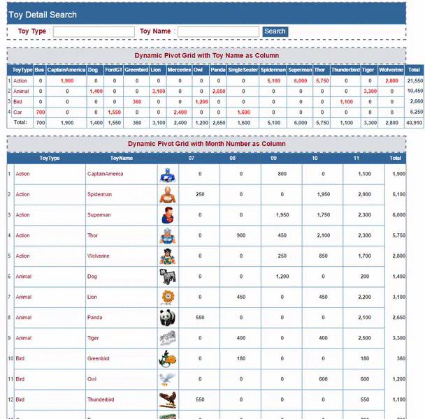
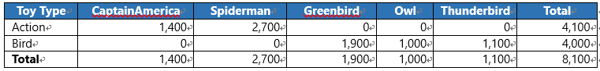
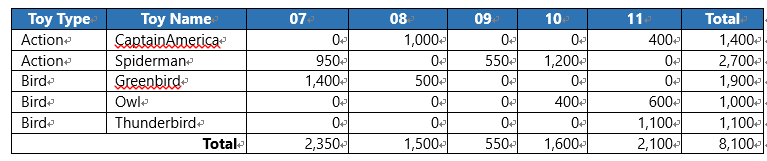
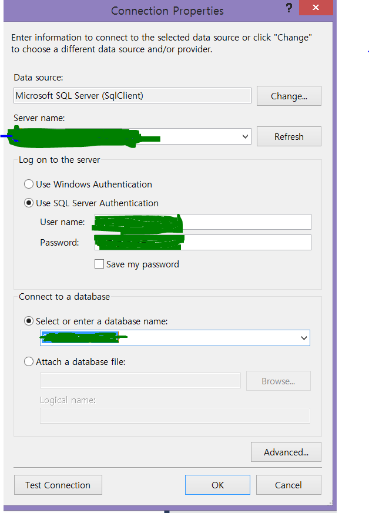
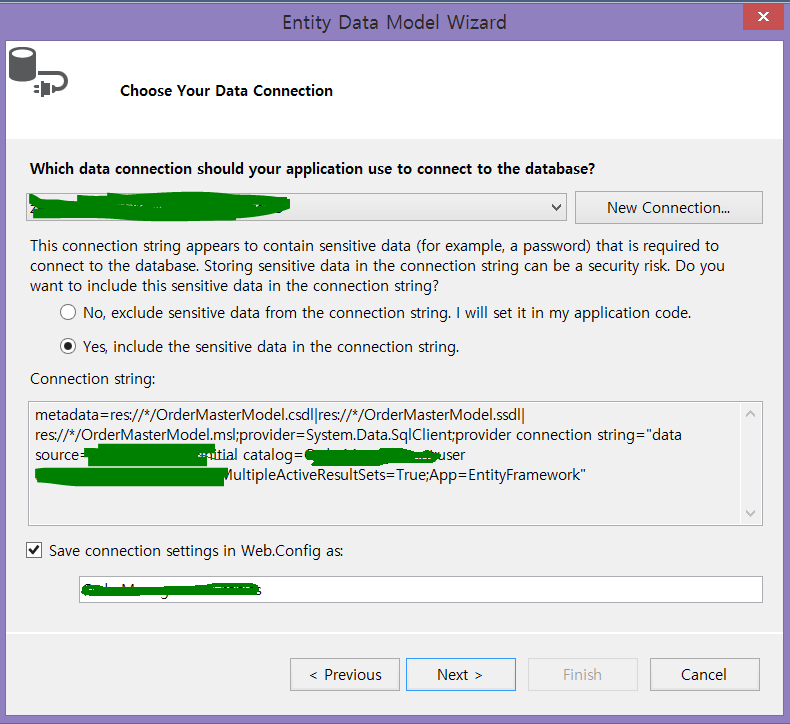
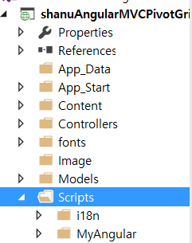
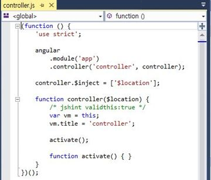

# Dynamic Pivot Grid Using MVC, AngularJS and WEB API
## Requires
- Visual Studio 2015
## License
- MIT
## Technologies
- ASP.NET MVC
- pivot
- ASP.NET Web API
- AngularJS
## Topics
- ASP.NET MVC
- pivot
- AngularJS
## Updated
- 12/14/2015
## Description

<h1>Introduction</h1>

&nbsp;In this Article we will see in detail of how to create a simple MVC Pivot HTML grid using AngularJS. In my previous article I have explained about how to create a Dynamic Project Scheduling &nbsp;<a href="https://code.msdn.microsoft.com/Dynamic-scheduling-using-35328360" target="_blank">Dynamic
 Project Scheduling</a>&nbsp;.In that article I have used Stored Procedure to display the Pivot result from SQL Query.

In real time projects we need to generate many type of reports and we need to display the row wise data to be displayed as column wise. In this article I will explain how to create a Pivot Grid to display from actual data in front end using AngularJS.

For example let&rsquo;s consider the below example here I have Toy Type (Category) and Toys Name with sales price per day.

In our database we insert every record of toy details with price details. The raw data which inserted in database will be look like this.&nbsp;

<strong>Toy Sales Detail Table</strong>

Here we can see there is total 11 Records. There is repeated of Toy Name and Toy Type for each date. Now if I want to see the total sales for each Toy Name of Toy Type, then I need to create a pivot result to display the record with total Sum of each
 Toy Name per Toy Type. The required output will be looks like this.&nbsp;<strong>&nbsp;</strong>

<strong>Pivot with Price Sum by Toy Name</strong>

Here we can see this is much easier to view the total Sales per Toy Name. Here in Pivot we can also add the Column and row Total. By adding the Total it will be easy to find which item has the highest sales.

Pivot result has many kind, we can see one more pivot report with Toy Sales Monthly per year. Here we display he pivot result Monthly starting from 07(July) to 11 (November)

&nbsp;<strong>Pivot with Price Sum by Monthly</strong>

In this article we will see 2 kind of Pivot report.

&nbsp; &nbsp; &nbsp; &nbsp;1)&nbsp;&nbsp;&nbsp;&nbsp;&nbsp;&nbsp;Pivot result to display the Price Sum by Toy Name for each Toy Type

&nbsp; &nbsp; &nbsp; &nbsp; 2)&nbsp;&nbsp;&nbsp;&nbsp;&nbsp;&nbsp;Pivot result to display the Price Sum by Monthly for each Toy Name

<strong>Prerequisites</strong>

<strong>Visual Studio 2015</strong>&nbsp;- You can download it from&nbsp;<a href="https://www.visualstudio.com/en-us/downloads/visual-studio-2015-downloads-vs.aspx">here</a>.

You can also view my previous articles related to AngularJS using MVC and the WCF Rest Service.

<ul>
<li><em><a href="https://code.msdn.microsoft.com/Dynamic-scheduling-using-35328360" target="_blank">https://code.msdn.microsoft.com/Dynamic-scheduling-using-35328360</a></em>
</li><li><a href="https://code.msdn.microsoft.com/MVC-Angular-JS-CRUD-using-b4845edc" target="_blank">https://code.msdn.microsoft.com/MVC-Angular-JS-CRUD-using-b4845edc</a>
</li><li><a href="https://code.msdn.microsoft.com/AngularJS-Shopping-Cart-8d4dde90" target="_blank">https://code.msdn.microsoft.com/AngularJS-Shopping-Cart-8d4dde90</a>
</li><li><a href="https://code.msdn.microsoft.com/MVC-AngularJS-and-WCF-Rest-27d239b4" target="_blank">https://code.msdn.microsoft.com/MVC-AngularJS-and-WCF-Rest-27d239b4</a>
</li><li><a href="https://code.msdn.microsoft.com/MVC-Web-API-and-Angular-JS-36302919" target="_blank">https://code.msdn.microsoft.com/MVC-Web-API-and-Angular-JS-36302919</a>
</li><li><a href="https://code.msdn.microsoft.com/AngularJS-Filter-Sorting-1fe023c3" target="_blank">https://code.msdn.microsoft.com/MVC-Web-API-and-Angular-JS-36302919</a>
</li><li><a href="https://code.msdn.microsoft.com/Image-Preview-using-MVC-792d881c" target="_blank">https://code.msdn.microsoft.com/Image-Preview-using-MVC-792d881c</a>
</li><li><a href="https://code.msdn.microsoft.com/MVC-AngularJS-MasterDetail-7598c3a7" target="_blank">https://code.msdn.microsoft.com/MVC-AngularJS-MasterDetail-7598c3a7&nbsp;</a>
</li></ul>
<h1>Building the Sample</h1>

<strong>Create Database and Table</strong>

First Step we create a Sample Database and Table to be used in our project .The following is the script to create a database, table and sample insert query.

Run this script in your SQL Server. I have used SQL Server 2014.&nbsp;

SQL

Edit|Remove

mysql

<pre class="mysql">--&nbsp;=============================================&nbsp;&nbsp;&nbsp;&nbsp;&nbsp;&nbsp;&nbsp;&nbsp;&nbsp;&nbsp;&nbsp;&nbsp;&nbsp;&nbsp;&nbsp;&nbsp;&nbsp;&nbsp;&nbsp;&nbsp;&nbsp;&nbsp;&nbsp;&nbsp;&nbsp;&nbsp;&nbsp;&nbsp;&nbsp;&nbsp;--&nbsp;Author&nbsp;&nbsp;&nbsp;&nbsp;&nbsp;&nbsp;:&nbsp;Shanu&nbsp;&nbsp;&nbsp;&nbsp;&nbsp;&nbsp;&nbsp;&nbsp;&nbsp;&nbsp;&nbsp;&nbsp;&nbsp;&nbsp;&nbsp;&nbsp;&nbsp;&nbsp;&nbsp;&nbsp;&nbsp;&nbsp;&nbsp;&nbsp;&nbsp;&nbsp;&nbsp;&nbsp;&nbsp;&nbsp;&nbsp;&nbsp;--&nbsp;Create&nbsp;date&nbsp;:&nbsp;2015-11-20&nbsp;&nbsp;&nbsp;&nbsp;&nbsp;&nbsp;&nbsp;&nbsp;&nbsp;&nbsp;&nbsp;&nbsp;&nbsp;&nbsp;&nbsp;&nbsp;&nbsp;&nbsp;&nbsp;&nbsp;&nbsp;&nbsp;&nbsp;&nbsp;&nbsp;&nbsp;&nbsp;&nbsp;&nbsp;&nbsp;--&nbsp;Description&nbsp;:&nbsp;To&nbsp;Create&nbsp;Database,Table&nbsp;and&nbsp;Sample&nbsp;Insert&nbsp;Query&nbsp;&nbsp;&nbsp;&nbsp;&nbsp;&nbsp;&nbsp;&nbsp;&nbsp;&nbsp;&nbsp;&nbsp;&nbsp;&nbsp;&nbsp;&nbsp;&nbsp;&nbsp;&nbsp;&nbsp;&nbsp;&nbsp;&nbsp;&nbsp;&nbsp;&nbsp;&nbsp;&nbsp;--&nbsp;Latest&nbsp;&nbsp;&nbsp;&nbsp;&nbsp;&nbsp;&nbsp;&nbsp;&nbsp;&nbsp;&nbsp;&nbsp;&nbsp;&nbsp;&nbsp;&nbsp;&nbsp;&nbsp;&nbsp;&nbsp;&nbsp;&nbsp;&nbsp;&nbsp;&nbsp;&nbsp;&nbsp;&nbsp;&nbsp;&nbsp;&nbsp;--&nbsp;Modifier&nbsp;&nbsp;&nbsp;&nbsp;:&nbsp;Shanu&nbsp;&nbsp;&nbsp;&nbsp;&nbsp;&nbsp;&nbsp;&nbsp;&nbsp;&nbsp;&nbsp;&nbsp;&nbsp;&nbsp;&nbsp;&nbsp;&nbsp;&nbsp;&nbsp;&nbsp;&nbsp;&nbsp;&nbsp;&nbsp;&nbsp;&nbsp;&nbsp;&nbsp;&nbsp;&nbsp;&nbsp;--&nbsp;Modify&nbsp;date&nbsp;:&nbsp;2015-11-20&nbsp;&nbsp;&nbsp;&nbsp;&nbsp;&nbsp;&nbsp;&nbsp;&nbsp;&nbsp;&nbsp;&nbsp;&nbsp;&nbsp;&nbsp;&nbsp;&nbsp;&nbsp;&nbsp;&nbsp;&nbsp;&nbsp;&nbsp;&nbsp;&nbsp;&nbsp;&nbsp;&nbsp;--&nbsp;=============================================&nbsp;
--ScripttocreateDB,TableandsampleInsertdataUSEMASTER;&nbsp;
--&nbsp;1)&nbsp;Check&nbsp;for&nbsp;the&nbsp;Database&nbsp;Exists&nbsp;.If&nbsp;the&nbsp;database&nbsp;is&nbsp;exist&nbsp;then&nbsp;drop&nbsp;and&nbsp;create&nbsp;new&nbsp;DBIFEXISTS&nbsp;(SELECT&nbsp;[name]&nbsp;FROMsys.databasesWHERE&nbsp;[name]&nbsp;=&nbsp;'ToysDB'&nbsp;)&nbsp;
BEGINALTERDATABASEToysDBSETSINGLE_USERWITHROLLBACKIMMEDIATEDROPDATABASEToysDB&nbsp;;&nbsp;
ENDCREATEDATABASEToysDBGOUSEToysDBGO--&nbsp;1)&nbsp;////////////&nbsp;ToysDetails&nbsp;table--&nbsp;Create&nbsp;Table&nbsp;&nbsp;ToysDetails&nbsp;,This&nbsp;table&nbsp;will&nbsp;be&nbsp;used&nbsp;to&nbsp;store&nbsp;the&nbsp;details&nbsp;like&nbsp;Toys&nbsp;InformationIFEXISTS&nbsp;(&nbsp;SELECT&nbsp;[name]&nbsp;FROMsys.tablesWHERE&nbsp;[name]&nbsp;=&nbsp;'ToysSalesDetails'&nbsp;)&nbsp;
DROPTABLEToysSalesDetailsGOCREATETABLEToysSalesDetails&nbsp;
(&nbsp;
&nbsp;&nbsp;&nbsp;Toy_IDintidentity(1,1),&nbsp;
&nbsp;&nbsp;&nbsp;Toy_TypeVARCHAR(100)&nbsp;&nbsp;NOTNULL,&nbsp;
&nbsp;&nbsp;&nbsp;Toy_NameVARCHAR(100)&nbsp;&nbsp;NOTNULL,&nbsp;&nbsp;
&nbsp;&nbsp;&nbsp;Toy_PriceintNOTNULL,&nbsp;
&nbsp;&nbsp;&nbsp;Image_NameVARCHAR(100)&nbsp;&nbsp;NOTNULL,&nbsp;
&nbsp;&nbsp;&nbsp;SalesDateDateTimeNOTNULL,&nbsp;
&nbsp;&nbsp;&nbsp;AddedByVARCHAR(100)&nbsp;&nbsp;NOTNULL,&nbsp;
CONSTRAINT&nbsp;[PK_ToysSalesDetails]&nbsp;PRIMARYKEYCLUSTERED&nbsp;&nbsp;&nbsp;&nbsp;&nbsp;&nbsp;
(&nbsp;&nbsp;&nbsp;&nbsp;&nbsp;
&nbsp;&nbsp;[Toy_ID]&nbsp;ASC&nbsp;&nbsp;&nbsp;&nbsp;&nbsp;
)WITH&nbsp;(PAD_INDEX&nbsp;&nbsp;=&nbsp;OFF,&nbsp;STATISTICS_NORECOMPUTE&nbsp;&nbsp;=&nbsp;OFF,&nbsp;IGNORE_DUP_KEY&nbsp;=&nbsp;OFF,&nbsp;ALLOW_ROW_LOCKS&nbsp;&nbsp;=&nbsp;ON,&nbsp;ALLOW_PAGE_LOCKS&nbsp;&nbsp;=&nbsp;ON)&nbsp;ON&nbsp;[PRIMARY]&nbsp;&nbsp;&nbsp;&nbsp;&nbsp;
)&nbsp;ON&nbsp;[PRIMARY]&nbsp;&nbsp;&nbsp;
&nbsp;
GO&nbsp;
&nbsp;
--deletefromToysSalesDetails--&nbsp;Insert&nbsp;the&nbsp;sample&nbsp;records&nbsp;to&nbsp;the&nbsp;ToysDetails&nbsp;TableInsertintoToysSalesDetails(Toy_Type,Toy_Name,Toy_Price,Image_Name,SalesDate,AddedBy)&nbsp;values('Action','Spiderman',1650,'ASpiderman.png',getdate(),'Shanu')&nbsp;
InsertintoToysSalesDetails(Toy_Type,Toy_Name,Toy_Price,Image_Name,SalesDate,AddedBy)&nbsp;values('Action','Spiderman',1250,'ASpiderman.png',getdate()-6,'Shanu')&nbsp;
InsertintoToysSalesDetails(Toy_Type,Toy_Name,Toy_Price,Image_Name,SalesDate,AddedBy)&nbsp;values('Action','Superman',1450,'ASuperman.png',getdate(),'Shanu')&nbsp;
InsertintoToysSalesDetails(Toy_Type,Toy_Name,Toy_Price,Image_Name,SalesDate,AddedBy)&nbsp;values('Action','Superman',850,'ASuperman.png',getdate()-4,'Shanu')&nbsp;
InsertintoToysSalesDetails(Toy_Type,Toy_Name,Toy_Price,Image_Name,SalesDate,AddedBy)&nbsp;values('Action','Thor',1350,'AThor.png',getdate(),'Shanu')&nbsp;
InsertintoToysSalesDetails(Toy_Type,Toy_Name,Toy_Price,Image_Name,SalesDate,AddedBy)&nbsp;values('Action','Thor',950,'AThor.png',getdate()-8,'Shanu')&nbsp;
InsertintoToysSalesDetails(Toy_Type,Toy_Name,Toy_Price,Image_Name,SalesDate,AddedBy)&nbsp;values('Action','Wolverine',1250,'AWolverine.png',getdate(),'Shanu')&nbsp;
InsertintoToysSalesDetails(Toy_Type,Toy_Name,Toy_Price,Image_Name,SalesDate,AddedBy)&nbsp;values('Action','Wolverine',450,'AWolverine.png',getdate()-3,'Shanu')&nbsp;
InsertintoToysSalesDetails(Toy_Type,Toy_Name,Toy_Price,Image_Name,SalesDate,AddedBy)&nbsp;values('Action','CaptainAmerica',1100,'ACaptainAmerica.png',getdate(),'Shanu')&nbsp;
InsertintoToysSalesDetails(Toy_Type,Toy_Name,Toy_Price,Image_Name,SalesDate,AddedBy)&nbsp;values('Action','Spiderman',250,'ASpiderman.png',getdate()-120,'Shanu')&nbsp;
InsertintoToysSalesDetails(Toy_Type,Toy_Name,Toy_Price,Image_Name,SalesDate,AddedBy)&nbsp;values('Action','Spiderman',1950,'ASpiderman.png',getdate()-40,'Shanu')&nbsp;
InsertintoToysSalesDetails(Toy_Type,Toy_Name,Toy_Price,Image_Name,SalesDate,AddedBy)&nbsp;values('Action','Superman',1750,'ASuperman.png',getdate()-40,'Shanu')&nbsp;
InsertintoToysSalesDetails(Toy_Type,Toy_Name,Toy_Price,Image_Name,SalesDate,AddedBy)&nbsp;values('Action','Thor',900,'AThor.png',getdate()-100,'Shanu')&nbsp;
InsertintoToysSalesDetails(Toy_Type,Toy_Name,Toy_Price,Image_Name,SalesDate,AddedBy)&nbsp;values('Action','Thor',850,'AThor.png',getdate()-50,'Shanu')&nbsp;
InsertintoToysSalesDetails(Toy_Type,Toy_Name,Toy_Price,Image_Name,SalesDate,AddedBy)&nbsp;values('Action','Wolverine',250,'AWolverine.png',getdate()-80,'Shanu')&nbsp;
InsertintoToysSalesDetails(Toy_Type,Toy_Name,Toy_Price,Image_Name,SalesDate,AddedBy)&nbsp;values('Action','CaptainAmerica',800,'ACaptainAmerica.png',getdate()-60,'Shanu')&nbsp;
InsertintoToysSalesDetails(Toy_Type,Toy_Name,Toy_Price,Image_Name,SalesDate,AddedBy)&nbsp;values('Action','Superman',1950,'ASuperman.png',getdate()-80,'Shanu')&nbsp;
InsertintoToysSalesDetails(Toy_Type,Toy_Name,Toy_Price,Image_Name,SalesDate,AddedBy)&nbsp;values('Action','Thor',1250,'AThor.png',getdate()-30,'Shanu')&nbsp;
InsertintoToysSalesDetails(Toy_Type,Toy_Name,Toy_Price,Image_Name,SalesDate,AddedBy)&nbsp;values('Action','Wolverine',850,'AWolverine.png',getdate()-20,'Shanu')&nbsp;
&nbsp;
InsertintoToysSalesDetails(Toy_Type,Toy_Name,Toy_Price,Image_Name,SalesDate,AddedBy)&nbsp;values('Animal','Lion',1250,'Lion.png',getdate(),'Shanu')&nbsp;
InsertintoToysSalesDetails(Toy_Type,Toy_Name,Toy_Price,Image_Name,SalesDate,AddedBy)&nbsp;values('Animal','Lion',950,'Lion.png',getdate()-4,'Shanu')&nbsp;
InsertintoToysSalesDetails(Toy_Type,Toy_Name,Toy_Price,Image_Name,SalesDate,AddedBy)&nbsp;values('Animal','Tiger',1900,'Tiger.png',getdate(),'Shanu')&nbsp;
InsertintoToysSalesDetails(Toy_Type,Toy_Name,Toy_Price,Image_Name,SalesDate,AddedBy)&nbsp;values('Animal','Tiger',600,'Tiger.png',getdate()-2,'Shanu')&nbsp;
InsertintoToysSalesDetails(Toy_Type,Toy_Name,Toy_Price,Image_Name,SalesDate,AddedBy)&nbsp;values('Animal','Panda',650,'Panda.png',getdate(),'Shanu')&nbsp;
InsertintoToysSalesDetails(Toy_Type,Toy_Name,Toy_Price,Image_Name,SalesDate,AddedBy)&nbsp;values('Animal','Panda',1450,'Panda.png',getdate()-1,'Shanu')&nbsp;
InsertintoToysSalesDetails(Toy_Type,Toy_Name,Toy_Price,Image_Name,SalesDate,AddedBy)&nbsp;values('Animal','Dog',200,'Dog.png',getdate(),'Shanu')&nbsp;
&nbsp;
InsertintoToysSalesDetails(Toy_Type,Toy_Name,Toy_Price,Image_Name,SalesDate,AddedBy)&nbsp;values('Animal','Lion',450,'Lion.png',getdate()-20,'Shanu')&nbsp;
InsertintoToysSalesDetails(Toy_Type,Toy_Name,Toy_Price,Image_Name,SalesDate,AddedBy)&nbsp;values('Animal','Tiger',400,'Tiger.png',getdate()-90,'Shanu')&nbsp;
InsertintoToysSalesDetails(Toy_Type,Toy_Name,Toy_Price,Image_Name,SalesDate,AddedBy)&nbsp;values('Animal','Panda',550,'Panda.png',getdate()-120,'Shanu')&nbsp;
InsertintoToysSalesDetails(Toy_Type,Toy_Name,Toy_Price,Image_Name,SalesDate,AddedBy)&nbsp;values('Animal','Dog',1200,'Dog.png',getdate()-60,'Shanu')&nbsp;
InsertintoToysSalesDetails(Toy_Type,Toy_Name,Toy_Price,Image_Name,SalesDate,AddedBy)&nbsp;values('Animal','Lion',450,'Lion.png',getdate()-90,'Shanu')&nbsp;
InsertintoToysSalesDetails(Toy_Type,Toy_Name,Toy_Price,Image_Name,SalesDate,AddedBy)&nbsp;values('Animal','Tiger',400,'Tiger.png',getdate()-30,'Shanu')&nbsp;
&nbsp;
&nbsp;
InsertintoToysSalesDetails(Toy_Type,Toy_Name,Toy_Price,Image_Name,SalesDate,AddedBy)&nbsp;values('Bird','Owl',600,'BOwl.png',getdate(),'Shanu')&nbsp;
InsertintoToysSalesDetails(Toy_Type,Toy_Name,Toy_Price,Image_Name,SalesDate,AddedBy)&nbsp;values('Bird','Greenbird',180,'BGreenbird.png',getdate(),'Shanu')&nbsp;
InsertintoToysSalesDetails(Toy_Type,Toy_Name,Toy_Price,Image_Name,SalesDate,AddedBy)&nbsp;values('Bird','Thunderbird',550,'BThunderbird-v2.png',getdate(),'Shanu')&nbsp;
&nbsp;
InsertintoToysSalesDetails(Toy_Type,Toy_Name,Toy_Price,Image_Name,SalesDate,AddedBy)&nbsp;values('Bird','Owl',600,'BOwl.png',getdate()-50,'Shanu')&nbsp;
InsertintoToysSalesDetails(Toy_Type,Toy_Name,Toy_Price,Image_Name,SalesDate,AddedBy)&nbsp;values('Bird','Greenbird',180,'BGreenbird.png',getdate()-90,'Shanu')&nbsp;
InsertintoToysSalesDetails(Toy_Type,Toy_Name,Toy_Price,Image_Name,SalesDate,AddedBy)&nbsp;values('Bird','Thunderbird',550,'BThunderbird-v2.png',getdate()-120,'Shanu')&nbsp;
&nbsp;
InsertintoToysSalesDetails(Toy_Type,Toy_Name,Toy_Price,Image_Name,SalesDate,AddedBy)&nbsp;values('Car','SingleSeater',1600,'CSingleSeater.png',getdate(),'Shanu')&nbsp;
InsertintoToysSalesDetails(Toy_Type,Toy_Name,Toy_Price,Image_Name,SalesDate,AddedBy)&nbsp;values('Car','Mercedes',2400,'CMercedes.png',getdate(),'Shanu')&nbsp;
InsertintoToysSalesDetails(Toy_Type,Toy_Name,Toy_Price,Image_Name,SalesDate,AddedBy)&nbsp;values('Car','FordGT',1550,'CFordGT.png',getdate(),'Shanu')&nbsp;
InsertintoToysSalesDetails(Toy_Type,Toy_Name,Toy_Price,Image_Name,SalesDate,AddedBy)&nbsp;values('Car','Bus',700,'CBus.png',getdate(),'Shanu')&nbsp;
&nbsp;
select&nbsp;*,&nbsp;
SUBSTRING('JAN&nbsp;FEB&nbsp;MAR&nbsp;APR&nbsp;MAY&nbsp;JUN&nbsp;JUL&nbsp;AUG&nbsp;SEP&nbsp;OCT&nbsp;NOV&nbsp;DEC&nbsp;',&nbsp;(DATENAME(month,&nbsp;SalesDate)&nbsp;&nbsp;*&nbsp;4)&nbsp;-&nbsp;3,&nbsp;3)&nbsp;as'Month'fromToysSalesDetailsWhereYEAR(SalesDate)=YEAR(getdate())&nbsp;
&nbsp;&nbsp;OrderbyToy_Type,Toy_Name,Image_Name,SalesDate</pre>

After creating our Table we will create a Stored Procedure get all the data from database to create our Pivot Grid from our MVC application using AngularJS and Web API.

Script to create Stored Procedure&nbsp;

SQL

Edit|Remove

mysql

<pre class="mysql">--&nbsp;1)&nbsp;Stored&nbsp;procedure&nbsp;to&nbsp;Select&nbsp;ToysSalesDetails&nbsp;
--&nbsp;Author&nbsp;&nbsp;&nbsp;&nbsp;&nbsp;&nbsp;:&nbsp;Shanu&nbsp;&nbsp;&nbsp;&nbsp;&nbsp;&nbsp;&nbsp;&nbsp;&nbsp;&nbsp;&nbsp;&nbsp;&nbsp;&nbsp;&nbsp;&nbsp;&nbsp;&nbsp;&nbsp;&nbsp;&nbsp;&nbsp;&nbsp;&nbsp;&nbsp;&nbsp;&nbsp;&nbsp;&nbsp;&nbsp;&nbsp;&nbsp;&nbsp;&nbsp;&nbsp;&nbsp;&nbsp;&nbsp;&nbsp;&nbsp;&nbsp;&nbsp;&nbsp;&nbsp;&nbsp;&nbsp;&nbsp;&nbsp;&nbsp;&nbsp;&nbsp;&nbsp;&nbsp;&nbsp;&nbsp;&nbsp;&nbsp;&nbsp;&nbsp;&nbsp;&nbsp;&nbsp;
--&nbsp;Create&nbsp;date&nbsp;:&nbsp;2015-11-20&nbsp;&nbsp;&nbsp;&nbsp;&nbsp;&nbsp;&nbsp;&nbsp;&nbsp;&nbsp;&nbsp;&nbsp;&nbsp;&nbsp;&nbsp;&nbsp;&nbsp;&nbsp;&nbsp;&nbsp;&nbsp;&nbsp;&nbsp;&nbsp;&nbsp;&nbsp;&nbsp;&nbsp;&nbsp;&nbsp;&nbsp;&nbsp;&nbsp;&nbsp;&nbsp;&nbsp;&nbsp;&nbsp;&nbsp;&nbsp;&nbsp;&nbsp;&nbsp;&nbsp;&nbsp;&nbsp;&nbsp;&nbsp;&nbsp;&nbsp;&nbsp;&nbsp;&nbsp;&nbsp;&nbsp;&nbsp;&nbsp;&nbsp;&nbsp;&nbsp;&nbsp;&nbsp;&nbsp;
--&nbsp;Description&nbsp;:&nbsp;Toy&nbsp;Sales&nbsp;Details&nbsp;&nbsp;&nbsp;&nbsp;&nbsp;&nbsp;&nbsp;&nbsp;&nbsp;&nbsp;&nbsp;&nbsp;&nbsp;&nbsp;&nbsp;&nbsp;&nbsp;&nbsp;&nbsp;&nbsp;&nbsp;&nbsp;&nbsp;&nbsp;&nbsp;&nbsp;&nbsp;&nbsp;&nbsp;&nbsp;&nbsp;&nbsp;&nbsp;&nbsp;&nbsp;&nbsp;&nbsp;&nbsp;&nbsp;&nbsp;&nbsp;&nbsp;&nbsp;&nbsp;&nbsp;&nbsp;&nbsp;
--&nbsp;Tables&nbsp;used&nbsp;:&nbsp;&nbsp;ToysSalesDetails&nbsp;&nbsp;&nbsp;&nbsp;&nbsp;&nbsp;&nbsp;&nbsp;&nbsp;&nbsp;&nbsp;&nbsp;&nbsp;&nbsp;&nbsp;&nbsp;&nbsp;&nbsp;&nbsp;&nbsp;&nbsp;&nbsp;&nbsp;&nbsp;&nbsp;&nbsp;&nbsp;&nbsp;&nbsp;&nbsp;&nbsp;&nbsp;&nbsp;&nbsp;&nbsp;&nbsp;&nbsp;&nbsp;&nbsp;&nbsp;&nbsp;&nbsp;&nbsp;&nbsp;&nbsp;&nbsp;&nbsp;&nbsp;&nbsp;&nbsp;&nbsp;&nbsp;&nbsp;&nbsp;&nbsp;&nbsp;&nbsp;&nbsp;&nbsp;&nbsp;&nbsp;&nbsp;&nbsp;
--&nbsp;Modifier&nbsp;&nbsp;&nbsp;&nbsp;:&nbsp;Shanu&nbsp;&nbsp;&nbsp;&nbsp;&nbsp;&nbsp;&nbsp;&nbsp;&nbsp;&nbsp;&nbsp;&nbsp;&nbsp;&nbsp;&nbsp;&nbsp;&nbsp;&nbsp;&nbsp;&nbsp;&nbsp;&nbsp;&nbsp;&nbsp;&nbsp;&nbsp;&nbsp;&nbsp;&nbsp;&nbsp;&nbsp;&nbsp;&nbsp;&nbsp;&nbsp;&nbsp;&nbsp;&nbsp;&nbsp;&nbsp;&nbsp;&nbsp;&nbsp;&nbsp;&nbsp;&nbsp;&nbsp;&nbsp;&nbsp;&nbsp;&nbsp;&nbsp;&nbsp;&nbsp;&nbsp;&nbsp;&nbsp;&nbsp;&nbsp;&nbsp;&nbsp;&nbsp;&nbsp;&nbsp;
--&nbsp;Modify&nbsp;date&nbsp;:&nbsp;2015-11-20&nbsp;&nbsp;&nbsp;&nbsp;&nbsp;&nbsp;&nbsp;&nbsp;&nbsp;&nbsp;&nbsp;&nbsp;&nbsp;&nbsp;&nbsp;&nbsp;&nbsp;&nbsp;&nbsp;&nbsp;&nbsp;&nbsp;&nbsp;&nbsp;&nbsp;&nbsp;&nbsp;&nbsp;&nbsp;&nbsp;&nbsp;&nbsp;&nbsp;&nbsp;&nbsp;&nbsp;&nbsp;&nbsp;&nbsp;&nbsp;&nbsp;&nbsp;&nbsp;&nbsp;&nbsp;&nbsp;&nbsp;&nbsp;&nbsp;&nbsp;&nbsp;&nbsp;&nbsp;&nbsp;&nbsp;&nbsp;&nbsp;&nbsp;&nbsp;&nbsp;&nbsp;&nbsp;&nbsp;&nbsp;&nbsp;&nbsp;&nbsp;
--&nbsp;=============================================&nbsp;&nbsp;&nbsp;
--&nbsp;exec&nbsp;USP_ToySales_Select&nbsp;'',''&nbsp;
--&nbsp;=============================================&nbsp;&nbsp;&nbsp;&nbsp;&nbsp;&nbsp;&nbsp;&nbsp;&nbsp;&nbsp;&nbsp;&nbsp;&nbsp;&nbsp;&nbsp;&nbsp;&nbsp;&nbsp;&nbsp;&nbsp;&nbsp;&nbsp;&nbsp;&nbsp;&nbsp;&nbsp;&nbsp;&nbsp;&nbsp;&nbsp;&nbsp;&nbsp;&nbsp;&nbsp;&nbsp;&nbsp;&nbsp;&nbsp;&nbsp;&nbsp;&nbsp;&nbsp;&nbsp;&nbsp;&nbsp;&nbsp;&nbsp;&nbsp;&nbsp;&nbsp;&nbsp;&nbsp;&nbsp;&nbsp;&nbsp;&nbsp;&nbsp;&nbsp;&nbsp;
CREATE&nbsp;PROCEDURE&nbsp;[dbo].[USP_ToySales_Select]&nbsp;&nbsp;&nbsp;&nbsp;&nbsp;&nbsp;&nbsp;&nbsp;&nbsp;&nbsp;&nbsp;&nbsp;&nbsp;&nbsp;&nbsp;&nbsp;&nbsp;&nbsp;&nbsp;&nbsp;&nbsp;&nbsp;&nbsp;&nbsp;&nbsp;&nbsp;&nbsp;&nbsp;&nbsp;&nbsp;&nbsp;&nbsp;&nbsp;&nbsp;&nbsp;&nbsp;&nbsp;&nbsp;&nbsp;&nbsp;&nbsp;&nbsp;&nbsp;&nbsp;&nbsp;
&nbsp;&nbsp;&nbsp;(&nbsp;&nbsp;&nbsp;&nbsp;&nbsp;&nbsp;&nbsp;&nbsp;&nbsp;&nbsp;&nbsp;&nbsp;&nbsp;&nbsp;&nbsp;&nbsp;&nbsp;&nbsp;&nbsp;&nbsp;&nbsp;&nbsp;&nbsp;&nbsp;&nbsp;&nbsp;&nbsp;
&nbsp;&nbsp;&nbsp;&nbsp;&nbsp;@Toy_Type&nbsp;&nbsp;&nbsp;&nbsp;&nbsp;&nbsp;&nbsp;&nbsp;&nbsp;&nbsp;&nbsp;VARCHAR(100)&nbsp;&nbsp;&nbsp;&nbsp;&nbsp;=&nbsp;'',&nbsp;
&nbsp;&nbsp;&nbsp;&nbsp;&nbsp;@Toy_Name&nbsp;&nbsp;&nbsp;&nbsp;&nbsp;&nbsp;&nbsp;&nbsp;&nbsp;&nbsp;&nbsp;&nbsp;&nbsp;&nbsp;&nbsp;VARCHAR(100)&nbsp;&nbsp;&nbsp;&nbsp;&nbsp;=&nbsp;''&nbsp;&nbsp;&nbsp;
&nbsp;&nbsp;&nbsp;&nbsp;&nbsp;&nbsp;)&nbsp;&nbsp;&nbsp;&nbsp;&nbsp;&nbsp;&nbsp;&nbsp;&nbsp;&nbsp;&nbsp;&nbsp;&nbsp;&nbsp;&nbsp;&nbsp;&nbsp;&nbsp;&nbsp;&nbsp;&nbsp;&nbsp;&nbsp;&nbsp;&nbsp;&nbsp;&nbsp;&nbsp;&nbsp;&nbsp;&nbsp;&nbsp;&nbsp;&nbsp;&nbsp;&nbsp;&nbsp;&nbsp;&nbsp;&nbsp;&nbsp;&nbsp;&nbsp;&nbsp;&nbsp;&nbsp;&nbsp;&nbsp;&nbsp;&nbsp;&nbsp;&nbsp;&nbsp;&nbsp;&nbsp;
AS&nbsp;&nbsp;&nbsp;&nbsp;&nbsp;&nbsp;&nbsp;&nbsp;&nbsp;&nbsp;&nbsp;&nbsp;&nbsp;&nbsp;&nbsp;&nbsp;&nbsp;&nbsp;&nbsp;&nbsp;&nbsp;&nbsp;&nbsp;&nbsp;&nbsp;&nbsp;&nbsp;&nbsp;&nbsp;&nbsp;&nbsp;&nbsp;&nbsp;&nbsp;&nbsp;&nbsp;&nbsp;&nbsp;&nbsp;&nbsp;&nbsp;&nbsp;&nbsp;&nbsp;&nbsp;&nbsp;&nbsp;&nbsp;&nbsp;&nbsp;&nbsp;&nbsp;&nbsp;&nbsp;&nbsp;&nbsp;&nbsp;&nbsp;&nbsp;&nbsp;&nbsp;&nbsp;&nbsp;
BEGIN&nbsp;&nbsp;&nbsp;&nbsp;&nbsp;&nbsp;&nbsp;
&nbsp;&nbsp;&nbsp;&nbsp;&nbsp;&nbsp;&nbsp;&nbsp;&nbsp;select&nbsp;&nbsp;Toy_Type&nbsp;as&nbsp;ToyType&nbsp;
&nbsp;&nbsp;&nbsp;&nbsp;&nbsp;&nbsp;&nbsp;&nbsp;&nbsp;&nbsp;&nbsp;&nbsp;&nbsp;&nbsp;&nbsp;&nbsp;,Toy_Name&nbsp;as&nbsp;ToyName&nbsp;
&nbsp;&nbsp;&nbsp;&nbsp;&nbsp;&nbsp;&nbsp;&nbsp;&nbsp;&nbsp;&nbsp;&nbsp;&nbsp;&nbsp;&nbsp;&nbsp;,Image_Name&nbsp;as&nbsp;ImageName&nbsp;
&nbsp;&nbsp;&nbsp;&nbsp;&nbsp;&nbsp;&nbsp;&nbsp;&nbsp;&nbsp;&nbsp;&nbsp;&nbsp;&nbsp;&nbsp;&nbsp;,Toy_Price&nbsp;as&nbsp;Price&nbsp;
&nbsp;&nbsp;&nbsp;&nbsp;&nbsp;&nbsp;&nbsp;&nbsp;&nbsp;&nbsp;&nbsp;&nbsp;&nbsp;&nbsp;&nbsp;&nbsp;,AddedBy&nbsp;as&nbsp;'User'&nbsp;
&nbsp;&nbsp;&nbsp;&nbsp;&nbsp;&nbsp;&nbsp;&nbsp;&nbsp;&nbsp;&nbsp;&nbsp;&nbsp;&nbsp;&nbsp;&nbsp;,DATENAME(month,&nbsp;SalesDate)&nbsp;as&nbsp;'Month'&nbsp;
&nbsp;&nbsp;&nbsp;&nbsp;&nbsp;&nbsp;&nbsp;&nbsp;&nbsp;&nbsp;&nbsp;&nbsp;&nbsp;&nbsp;&nbsp;&nbsp;&nbsp;
&nbsp;&nbsp;&nbsp;&nbsp;&nbsp;&nbsp;&nbsp;&nbsp;&nbsp;FROM&nbsp;ToysSalesDetails&nbsp;&nbsp;
&nbsp;&nbsp;&nbsp;&nbsp;&nbsp;&nbsp;&nbsp;&nbsp;&nbsp;&nbsp;Where&nbsp;&nbsp;&nbsp;&nbsp;
&nbsp;&nbsp;&nbsp;&nbsp;&nbsp;&nbsp;&nbsp;&nbsp;&nbsp;&nbsp;&nbsp;&nbsp;&nbsp;&nbsp;&nbsp;&nbsp;&nbsp;&nbsp;&nbsp;&nbsp;Toy_Type&nbsp;like&nbsp;&nbsp;@Toy_Type&nbsp;&#43;'%'&nbsp;
&nbsp;&nbsp;&nbsp;&nbsp;&nbsp;&nbsp;&nbsp;&nbsp;&nbsp;&nbsp;&nbsp;&nbsp;&nbsp;&nbsp;&nbsp;&nbsp;AND&nbsp;Toy_Name&nbsp;like&nbsp;@Toy_Name&nbsp;&#43;'%'&nbsp;
&nbsp;&nbsp;&nbsp;&nbsp;&nbsp;&nbsp;&nbsp;&nbsp;&nbsp;&nbsp;&nbsp;&nbsp;&nbsp;&nbsp;&nbsp;&nbsp;AND&nbsp;YEAR(SalesDate)=YEAR(getdate())&nbsp;
&nbsp;&nbsp;&nbsp;&nbsp;&nbsp;&nbsp;&nbsp;&nbsp;&nbsp;&nbsp;ORDER&nbsp;BY&nbsp;
&nbsp;&nbsp;&nbsp;&nbsp;&nbsp;&nbsp;&nbsp;&nbsp;&nbsp;&nbsp;&nbsp;&nbsp;&nbsp;&nbsp;Toy_Type,Toy_Name,SalesDate&nbsp;
&nbsp;&nbsp;&nbsp;&nbsp;&nbsp;&nbsp;&nbsp;&nbsp;&nbsp;&nbsp;
END</pre>

&nbsp;Description

<strong>Create your MVC Web Application in Visual Studio 2015.</strong>

After installing our Visual Studio 2015 click Start, then Programs and select Visual Studio 2015- Click Visual Studio 2015.Click New, then Project, select Web and click ASP.NET Web Application. Select your project location and enter your
 web application name.

Select&nbsp;<em>MVC&nbsp;</em>and in&nbsp;<em>Add Folders and Core reference for s</em>elect the&nbsp;<em>Web API</em>&nbsp;and click&nbsp;<em>OK</em>.

&nbsp;<strong>Add Database using ADO.NET Entity Data Model</strong>

Right click our project and click&nbsp;<em>Add,&nbsp;</em>then&nbsp;<em>New Item</em>.

Select&nbsp;<em>Data</em>, then&nbsp;<em>ADO.NET Entity Data Model&nbsp;</em>and give the name for our EF and click&nbsp;<em>Add</em>.

Select EF Designer from the database and click&nbsp;<em>Next</em>

Here click New Connection and provide your SQL Server - Server Name and connect to your database.

Here we can see I have given my SQL server name, Id and PWD and after it connected I selected the database as ToysDB as we have created the Database using my SQL Script.

Click next and select the tables and all Stored Procedures need to be used and click finish.

Here we can see now we have created our&nbsp;<em>ToySalesModel</em>.

Once the Entity has been created the next step is to add a Web API to our controller and write function to Select/Insert/Update and Delete. 
 
<strong>Procedure to add our Web API Controller 
</strong>Right-click the Controllers folder, click Add and then click Controller.

&nbsp;

Select Controller and add an Empty Web API 2 Controller. Provide your name to the Web API controller and click OK. Here for my Web API Controller I have given the name &ldquo;ToyController&rdquo; .In this demo project I have created 2 different controller
 for Order master and order Detail.

As we have created Web API controller, we can see our controller has been inherited with ApiController.

As we all know Web API is a simple and easy way to build HTTP Services for Browsers and Mobiles. 
Web API has the following four methods as&nbsp;<strong>Get/Post/Put and Delete</strong>&nbsp;where:

<ul type="disc">
<li><strong>Get</strong>&nbsp;is to request for the data. (Select)
</li><li><strong>Post</strong>&nbsp;is to create a data. (Insert)
</li><li><strong>Put</strong>&nbsp;is to update the data. </li><li><strong>Delete</strong>&nbsp;is to delete data. </li></ul>

<strong>Get Method 
</strong> 
In our example I have used only a Get method since I am using only a Stored Procedure to get the data and bind to our MVC page using AngularJS. 
<strong>Select Operation 
</strong>We use a get method to get all the details of the&nbsp;<strong>ToysSalesDetails</strong>&nbsp;table using an entity object and we return the result as an IEnumerable. We use this method in our AngularJs and display the result in an MVC page from the
 AngularJs controller. Using Ng-Repeat we can bind the details. 
 
Here we can see in the get method I have passed the search parameter to the&nbsp;USP_ToySales_Select&nbsp;Stored Procedure. In the Stored Procedure I used like &quot;%&quot; to return all the records if the search parameter is empty.&nbsp;

C#

Edit|Remove

csharp

<pre class="csharp">public&nbsp;class&nbsp;ToyController&nbsp;:&nbsp;ApiController&nbsp;&nbsp;&nbsp;
&nbsp;&nbsp;&nbsp;&nbsp;{&nbsp;&nbsp;&nbsp;
&nbsp;&nbsp;&nbsp;&nbsp;&nbsp;&nbsp;&nbsp;&nbsp;ToysDBEntities&nbsp;objAPI&nbsp;=&nbsp;new&nbsp;ToysDBEntities();&nbsp;&nbsp;&nbsp;
&nbsp;&nbsp;&nbsp;
&nbsp;&nbsp;&nbsp;&nbsp;&nbsp;&nbsp;&nbsp;&nbsp;//&nbsp;to&nbsp;Search&nbsp;Student&nbsp;Details&nbsp;and&nbsp;display&nbsp;the&nbsp;result&nbsp;&nbsp;&nbsp;
&nbsp;&nbsp;&nbsp;&nbsp;&nbsp;&nbsp;&nbsp;&nbsp;[HttpGet]&nbsp;&nbsp;&nbsp;
&nbsp;&nbsp;&nbsp;&nbsp;&nbsp;&nbsp;&nbsp;&nbsp;public&nbsp;IEnumerable&lt;USP_ToySales_Select_Result&gt;&nbsp;Get(string&nbsp;ToyType,&nbsp;string&nbsp;ToyName)&nbsp;&nbsp;&nbsp;
&nbsp;&nbsp;&nbsp;&nbsp;&nbsp;&nbsp;&nbsp;&nbsp;{&nbsp;&nbsp;&nbsp;
&nbsp;&nbsp;&nbsp;&nbsp;&nbsp;&nbsp;&nbsp;&nbsp;&nbsp;&nbsp;&nbsp;&nbsp;if&nbsp;(ToyType&nbsp;==&nbsp;null)&nbsp;&nbsp;&nbsp;
&nbsp;&nbsp;&nbsp;&nbsp;&nbsp;&nbsp;&nbsp;&nbsp;&nbsp;&nbsp;&nbsp;&nbsp;&nbsp;&nbsp;&nbsp;&nbsp;ToyType&nbsp;=&nbsp;&quot;&quot;;&nbsp;&nbsp;&nbsp;
&nbsp;&nbsp;&nbsp;&nbsp;&nbsp;&nbsp;&nbsp;&nbsp;&nbsp;&nbsp;&nbsp;&nbsp;if&nbsp;(ToyName&nbsp;==&nbsp;null)&nbsp;&nbsp;&nbsp;
&nbsp;&nbsp;&nbsp;&nbsp;&nbsp;&nbsp;&nbsp;&nbsp;&nbsp;&nbsp;&nbsp;&nbsp;&nbsp;&nbsp;&nbsp;&nbsp;ToyName&nbsp;=&nbsp;&quot;&quot;;&nbsp;&nbsp;&nbsp;
&nbsp;&nbsp;&nbsp;
&nbsp;&nbsp;&nbsp;&nbsp;&nbsp;&nbsp;&nbsp;&nbsp;&nbsp;&nbsp;&nbsp;&nbsp;return&nbsp;objAPI.USP_ToySales_Select(ToyType,&nbsp;ToyName).AsEnumerable();&nbsp;&nbsp;&nbsp;
&nbsp;&nbsp;&nbsp;
&nbsp;&nbsp;&nbsp;&nbsp;&nbsp;&nbsp;&nbsp;&nbsp;}&nbsp;&nbsp;&nbsp;
&nbsp;&nbsp;&nbsp;&nbsp;}&nbsp;&nbsp;</pre>

&nbsp;Now we have created our Web API Controller Class. The next step is to create our AngularJs Module and Controller. Let's see how to create our AngularJs Controller. In Visual Studio 2015 it's much easier to add our AngularJs
 Controller. Let's see step-by-step how to create and write our AngularJs Controller. 
 
<strong>Creating AngularJs Controller</strong> 
 
First create a folder inside the Script Folder and I have given the folder name as &ldquo;MyAngular&rdquo;.

&nbsp;

Now add your Angular Controller inside the folder. 
 
Right-click the MyAngular folder and click Add and New Item. Select Web and then AngularJs Controller and provide a name for the Controller. I have named my AngularJs Controller &ldquo;Controller.js&rdquo;.

Once the AngularJs Controller is created, we can see by default the controller will have the code with the default module definition and all.&nbsp;

I have changed the preceding code like adding a Module and controller as in the following. 
 
If the AngularJs package is missing, then add the package to your project. 
 
Right-click your MVC project and click Manage NuGet Packages. Search for AngularJs and click Install.

Now we can see all the AngularJs packages have been installed and we can see all the files in the Script folder.

<strong>Procedure to Create AngularJs Script Files</strong> 
 
<strong>Modules.js:</strong>&nbsp;Here we will add the reference to the AngularJs JavaScript and create an Angular Module named &ldquo;OrderModule&rdquo;.&nbsp;

JavaScript

Edit|Remove

js

<pre class="js">//&nbsp;&lt;reference&nbsp;path=&quot;../angular.js&quot;&nbsp;/&gt;&nbsp;&nbsp;&nbsp;&nbsp;&nbsp;
///&nbsp;&lt;reference&nbsp;path=&quot;../angular.min.js&quot;&nbsp;/&gt;&nbsp;&nbsp;&nbsp;&nbsp;&nbsp;&nbsp;
///&nbsp;&lt;reference&nbsp;path=&quot;../angular-animate.js&quot;&nbsp;/&gt;&nbsp;&nbsp;&nbsp;&nbsp;&nbsp;&nbsp;
///&nbsp;&lt;reference&nbsp;path=&quot;../angular-animate.min.js&quot;&nbsp;/&gt;&nbsp;&nbsp;&nbsp;&nbsp;&nbsp;
var&nbsp;app;&nbsp;&nbsp;&nbsp;
&nbsp;&nbsp;&nbsp;
(function&nbsp;()&nbsp;{&nbsp;&nbsp;&nbsp;
&nbsp;&nbsp;&nbsp;&nbsp;app&nbsp;=&nbsp;angular.module(&quot;OrderModule&quot;,&nbsp;['ngAnimate']);&nbsp;&nbsp;&nbsp;
})();&nbsp;&nbsp;</pre>

&nbsp;<strong>Controllers:</strong>&nbsp;In AngularJs Controller I have done all the business logic and returned the data from Web API to our MVC HTML page.

<strong>1. Variable declarations</strong><strong> 
</strong> 
First I declared all the local variables that need to be used.&nbsp;

JavaScript

Edit|Remove

js

<pre class="js">indow,&nbsp;$http)&nbsp;{&nbsp;&nbsp;&nbsp;
&nbsp;&nbsp;&nbsp;&nbsp;$scope.date&nbsp;=&nbsp;newDate();&nbsp;&nbsp;&nbsp;
&nbsp;&nbsp;&nbsp;&nbsp;$scope.MyName&nbsp;=&nbsp;&quot;shanu&quot;;&nbsp;&nbsp;&nbsp;
&nbsp;&nbsp;&nbsp;
&nbsp;&nbsp;&nbsp;&nbsp;//For&nbsp;Order&nbsp;Master&nbsp;Search&nbsp;&nbsp;&nbsp;&nbsp;
&nbsp;&nbsp;&nbsp;&nbsp;$scope.ToyType&nbsp;=&nbsp;&quot;&quot;;&nbsp;&nbsp;&nbsp;
&nbsp;&nbsp;&nbsp;&nbsp;$scope.ToyName&nbsp;=&nbsp;&quot;&quot;;&nbsp;&nbsp;&nbsp;
&nbsp;&nbsp;&nbsp;
&nbsp;&nbsp;&nbsp;&nbsp;//&nbsp;1)&nbsp;Item&nbsp;List&nbsp;Arrays.This&nbsp;arrays&nbsp;will&nbsp;be&nbsp;used&nbsp;to&nbsp;display&nbsp;.&nbsp;&nbsp;&nbsp;
&nbsp;&nbsp;&nbsp;&nbsp;$scope.itemType&nbsp;=&nbsp;[];&nbsp;&nbsp;&nbsp;
&nbsp;&nbsp;&nbsp;&nbsp;$scope.ColNames&nbsp;=&nbsp;[];&nbsp;&nbsp;&nbsp;
&nbsp;&nbsp;&nbsp;
&nbsp;&nbsp;&nbsp;&nbsp;//&nbsp;2)&nbsp;Item&nbsp;List&nbsp;Arrays.This&nbsp;arrays&nbsp;will&nbsp;be&nbsp;used&nbsp;to&nbsp;display&nbsp;.&nbsp;&nbsp;&nbsp;
&nbsp;&nbsp;&nbsp;&nbsp;$scope.items&nbsp;=&nbsp;[];&nbsp;&nbsp;&nbsp;&nbsp;&nbsp;
&nbsp;&nbsp;&nbsp;&nbsp;$scope.ColMonths&nbsp;=&nbsp;[];&nbsp;&nbsp;</pre>

&nbsp;<strong>2. Methods</strong>

<strong>Select Method</strong><strong>&nbsp;</strong><strong> 
</strong> 
In the select method I have used&nbsp;<strong>$http.get</strong>&nbsp;to get the details from Web API. In the get method I will provide our API Controller name and method to get the details. Here we can see I have passed the search parameter of&nbsp;OrderNO&nbsp;and&nbsp;TableIDusing:

&nbsp;{&nbsp;params:&nbsp;{&nbsp;ToyType:&nbsp;ToyType,&nbsp;ToyName:&nbsp;ToyName&nbsp;} &nbsp;

The function will be called during each page load. During the page load I will get all the details and to create our Pivot result first I will store the each Unique Toy name in Array to display the Pivot report by Toy Name as Column and Month Number
 in Array to display the Pivot report by Monthly sum.

After storing the Unique Values of Toy Name and Month Number I will call the&nbsp;$scope.getMonthDetails();&nbsp;and$scope.getToyNameDetails();&nbsp;to generate Pivot report and bind the result.&nbsp;

&nbsp;

JavaScript

Edit|Remove

js

<pre class="js">//&nbsp;To&nbsp;get&nbsp;all&nbsp;details&nbsp;from&nbsp;Database&nbsp;&nbsp;&nbsp;
&nbsp;&nbsp;&nbsp;&nbsp;selectToySalesDetails($scope.ToyType,&nbsp;$scope.ToyName);&nbsp;&nbsp;&nbsp;
&nbsp;&nbsp;&nbsp;
&nbsp;&nbsp;&nbsp;&nbsp;//&nbsp;To&nbsp;get&nbsp;all&nbsp;details&nbsp;from&nbsp;Database&nbsp;&nbsp;&nbsp;
&nbsp;&nbsp;&nbsp;&nbsp;function&nbsp;selectToySalesDetails(ToyType,&nbsp;ToyName)&nbsp;{&nbsp;&nbsp;&nbsp;
&nbsp;&nbsp;&nbsp;&nbsp;&nbsp;&nbsp;&nbsp;&nbsp;
&nbsp;&nbsp;&nbsp;&nbsp;&nbsp;&nbsp;&nbsp;&nbsp;$http.get('/api/Toy/',&nbsp;{&nbsp;params:&nbsp;{&nbsp;ToyType:&nbsp;ToyType,&nbsp;ToyName:&nbsp;ToyName&nbsp;}&nbsp;}).success(function&nbsp;(data)&nbsp;{&nbsp;&nbsp;&nbsp;&nbsp;&nbsp;&nbsp;&nbsp;&nbsp;&nbsp;&nbsp;&nbsp;&nbsp;&nbsp;
&nbsp;&nbsp;&nbsp;&nbsp;&nbsp;&nbsp;&nbsp;&nbsp;&nbsp;&nbsp;&nbsp;&nbsp;$scope.ToyDetails&nbsp;=&nbsp;data;&nbsp;&nbsp;&nbsp;
&nbsp;&nbsp;&nbsp;&nbsp;&nbsp;&nbsp;&nbsp;&nbsp;&nbsp;&nbsp;&nbsp;&nbsp;if&nbsp;($scope.ToyDetails.length&nbsp;&gt;&nbsp;0)&nbsp;{&nbsp;&nbsp;&nbsp;
&nbsp;&nbsp;&nbsp;&nbsp;&nbsp;&nbsp;&nbsp;&nbsp;&nbsp;&nbsp;&nbsp;&nbsp;&nbsp;&nbsp;&nbsp;&nbsp;//alert($scope.ToyDetails.length);&nbsp;&nbsp;&nbsp;
&nbsp;&nbsp;&nbsp;&nbsp;&nbsp;&nbsp;&nbsp;&nbsp;&nbsp;&nbsp;&nbsp;&nbsp;&nbsp;&nbsp;&nbsp;&nbsp;var&nbsp;uniqueMonth&nbsp;=&nbsp;{},uniqueToyName&nbsp;=&nbsp;{},&nbsp;i;&nbsp;&nbsp;&nbsp;
&nbsp;&nbsp;&nbsp;&nbsp;&nbsp;&nbsp;&nbsp;&nbsp;&nbsp;&nbsp;&nbsp;&nbsp;&nbsp;&nbsp;&nbsp;&nbsp;&nbsp;&nbsp;&nbsp;
&nbsp;&nbsp;&nbsp;&nbsp;&nbsp;&nbsp;&nbsp;&nbsp;&nbsp;&nbsp;&nbsp;&nbsp;&nbsp;&nbsp;&nbsp;&nbsp;for&nbsp;(i&nbsp;=&nbsp;0;&nbsp;i&nbsp;&lt;&nbsp;$scope.ToyDetails.length;&nbsp;i&nbsp;&#43;=&nbsp;1)&nbsp;{&nbsp;&nbsp;&nbsp;
&nbsp;&nbsp;&nbsp;&nbsp;&nbsp;&nbsp;&nbsp;&nbsp;&nbsp;&nbsp;&nbsp;&nbsp;&nbsp;&nbsp;&nbsp;&nbsp;&nbsp;&nbsp;&nbsp;&nbsp;//&nbsp;For&nbsp;Column&nbsp;wise&nbsp;Month&nbsp;add&nbsp;&nbsp;&nbsp;
&nbsp;&nbsp;&nbsp;&nbsp;&nbsp;&nbsp;&nbsp;&nbsp;&nbsp;&nbsp;&nbsp;&nbsp;&nbsp;&nbsp;&nbsp;&nbsp;&nbsp;&nbsp;&nbsp;&nbsp;uniqueMonth[$scope.ToyDetails[i].Month]&nbsp;=&nbsp;$scope.ToyDetails[i];&nbsp;&nbsp;&nbsp;
&nbsp;&nbsp;&nbsp;
&nbsp;&nbsp;&nbsp;&nbsp;&nbsp;&nbsp;&nbsp;&nbsp;&nbsp;&nbsp;&nbsp;&nbsp;&nbsp;&nbsp;&nbsp;&nbsp;&nbsp;&nbsp;&nbsp;&nbsp;//For&nbsp;column&nbsp;wise&nbsp;Toy&nbsp;Name&nbsp;add&nbsp;&nbsp;&nbsp;
&nbsp;&nbsp;&nbsp;&nbsp;&nbsp;&nbsp;&nbsp;&nbsp;&nbsp;&nbsp;&nbsp;&nbsp;&nbsp;&nbsp;&nbsp;&nbsp;&nbsp;&nbsp;&nbsp;&nbsp;uniqueToyName[$scope.ToyDetails[i].ToyName]&nbsp;=&nbsp;$scope.ToyDetails[i];&nbsp;&nbsp;&nbsp;
&nbsp;&nbsp;&nbsp;&nbsp;&nbsp;&nbsp;&nbsp;&nbsp;&nbsp;&nbsp;&nbsp;&nbsp;&nbsp;&nbsp;&nbsp;&nbsp;}&nbsp;&nbsp;&nbsp;
&nbsp;&nbsp;&nbsp;&nbsp;&nbsp;&nbsp;&nbsp;&nbsp;&nbsp;&nbsp;&nbsp;&nbsp;&nbsp;&nbsp;&nbsp;&nbsp;//&nbsp;For&nbsp;Column&nbsp;wise&nbsp;Month&nbsp;add&nbsp;&nbsp;&nbsp;
&nbsp;&nbsp;&nbsp;&nbsp;&nbsp;&nbsp;&nbsp;&nbsp;&nbsp;&nbsp;&nbsp;&nbsp;&nbsp;&nbsp;&nbsp;&nbsp;for&nbsp;(i&nbsp;in&nbsp;uniqueMonth)&nbsp;{&nbsp;&nbsp;&nbsp;
&nbsp;&nbsp;&nbsp;&nbsp;&nbsp;&nbsp;&nbsp;&nbsp;&nbsp;&nbsp;&nbsp;&nbsp;&nbsp;&nbsp;&nbsp;&nbsp;&nbsp;&nbsp;&nbsp;&nbsp;$scope.ColMonths.push(uniqueMonth[i]);&nbsp;&nbsp;&nbsp;
&nbsp;&nbsp;&nbsp;&nbsp;&nbsp;&nbsp;&nbsp;&nbsp;&nbsp;&nbsp;&nbsp;&nbsp;&nbsp;&nbsp;&nbsp;&nbsp;}&nbsp;&nbsp;&nbsp;
&nbsp;&nbsp;&nbsp;
&nbsp;&nbsp;&nbsp;&nbsp;&nbsp;&nbsp;&nbsp;&nbsp;&nbsp;&nbsp;&nbsp;&nbsp;&nbsp;&nbsp;&nbsp;&nbsp;//&nbsp;For&nbsp;Column&nbsp;wise&nbsp;ToyName&nbsp;add&nbsp;&nbsp;&nbsp;
&nbsp;&nbsp;&nbsp;&nbsp;&nbsp;&nbsp;&nbsp;&nbsp;&nbsp;&nbsp;&nbsp;&nbsp;&nbsp;&nbsp;&nbsp;&nbsp;for&nbsp;(i&nbsp;in&nbsp;uniqueToyName)&nbsp;{&nbsp;&nbsp;&nbsp;
&nbsp;&nbsp;&nbsp;&nbsp;&nbsp;&nbsp;&nbsp;&nbsp;&nbsp;&nbsp;&nbsp;&nbsp;&nbsp;&nbsp;&nbsp;&nbsp;&nbsp;&nbsp;&nbsp;&nbsp;$scope.ColNames.push(uniqueToyName[i]);&nbsp;&nbsp;&nbsp;
&nbsp;&nbsp;&nbsp;&nbsp;&nbsp;&nbsp;&nbsp;&nbsp;&nbsp;&nbsp;&nbsp;&nbsp;&nbsp;&nbsp;&nbsp;&nbsp;}&nbsp;&nbsp;&nbsp;
&nbsp;&nbsp;&nbsp;&nbsp;&nbsp;&nbsp;&nbsp;&nbsp;&nbsp;&nbsp;&nbsp;&nbsp;&nbsp;&nbsp;&nbsp;&nbsp;&nbsp;&nbsp;
&nbsp;&nbsp;&nbsp;&nbsp;&nbsp;&nbsp;&nbsp;&nbsp;&nbsp;&nbsp;&nbsp;&nbsp;&nbsp;&nbsp;&nbsp;&nbsp;//&nbsp;To&nbsp;disply&nbsp;the&nbsp;&nbsp;Month&nbsp;wise&nbsp;Pivot&nbsp;result&nbsp;&nbsp;&nbsp;
&nbsp;&nbsp;&nbsp;&nbsp;&nbsp;&nbsp;&nbsp;&nbsp;&nbsp;&nbsp;&nbsp;&nbsp;&nbsp;&nbsp;&nbsp;&nbsp;$scope.getMonthDetails();&nbsp;&nbsp;&nbsp;
&nbsp;&nbsp;&nbsp;
&nbsp;&nbsp;&nbsp;&nbsp;&nbsp;&nbsp;&nbsp;&nbsp;&nbsp;&nbsp;&nbsp;&nbsp;&nbsp;&nbsp;
&nbsp;&nbsp;&nbsp;&nbsp;&nbsp;&nbsp;&nbsp;&nbsp;&nbsp;&nbsp;&nbsp;&nbsp;&nbsp;&nbsp;&nbsp;&nbsp;//&nbsp;To&nbsp;disply&nbsp;the&nbsp;&nbsp;Month&nbsp;wise&nbsp;Pivot&nbsp;result&nbsp;&nbsp;&nbsp;
&nbsp;&nbsp;&nbsp;&nbsp;&nbsp;&nbsp;&nbsp;&nbsp;&nbsp;&nbsp;&nbsp;&nbsp;&nbsp;&nbsp;&nbsp;&nbsp;$scope.getToyNameDetails();&nbsp;&nbsp;&nbsp;
&nbsp;&nbsp;&nbsp;&nbsp;&nbsp;&nbsp;&nbsp;&nbsp;&nbsp;&nbsp;&nbsp;&nbsp;}&nbsp;&nbsp;&nbsp;
&nbsp;&nbsp;&nbsp;&nbsp;&nbsp;&nbsp;&nbsp;&nbsp;})&nbsp;&nbsp;&nbsp;
&nbsp;&nbsp;&nbsp;.error(function&nbsp;()&nbsp;{&nbsp;&nbsp;&nbsp;
&nbsp;&nbsp;&nbsp;&nbsp;&nbsp;&nbsp;&nbsp;$scope.error&nbsp;=&nbsp;&quot;An&nbsp;Error&nbsp;has&nbsp;occured&nbsp;while&nbsp;loading&nbsp;posts!&quot;;&nbsp;&nbsp;&nbsp;
&nbsp;&nbsp;&nbsp;});&nbsp;&nbsp;&nbsp;
&nbsp;&nbsp;&nbsp;&nbsp;}&nbsp;&nbsp;</pre>

&nbsp;First I will bind all the Actual data from database. Here we can see all the data from database has been displayed total of nearly 43 records. We will create a Dynamic Pivot report from this actual data.

&nbsp;<strong>Pivot result to display the Price Sum by Toy Name for each Toy Type</strong>

In this pivot report .I will display the Toy Type in rows and Toy Name as Columns. In our form Load method we already stored all the Unique Toy Name in Array which will be bind as Column. Now in this method I will add the Unique Toy Type to be displayed
 as rows.&nbsp;

JavaScript

Edit|Remove

js

<pre class="js">//&nbsp;To&nbsp;Display&nbsp;Toy&nbsp;Details&nbsp;as&nbsp;Toy&nbsp;Name&nbsp;Pivot&nbsp;Cols&nbsp;&nbsp;&nbsp;&nbsp;&nbsp;&nbsp;
&nbsp;&nbsp;&nbsp;&nbsp;$scope.getToyNameDetails&nbsp;=&nbsp;function&nbsp;()&nbsp;{&nbsp;&nbsp;&nbsp;
&nbsp;&nbsp;&nbsp;
&nbsp;&nbsp;&nbsp;&nbsp;&nbsp;&nbsp;&nbsp;&nbsp;var&nbsp;UniqueItemName&nbsp;=&nbsp;{},&nbsp;i&nbsp;&nbsp;&nbsp;
&nbsp;&nbsp;&nbsp;
&nbsp;&nbsp;&nbsp;&nbsp;&nbsp;&nbsp;&nbsp;&nbsp;for&nbsp;(i&nbsp;=&nbsp;0;&nbsp;i&nbsp;&lt;&nbsp;$scope.ToyDetails.length;&nbsp;i&nbsp;&#43;=&nbsp;1)&nbsp;{&nbsp;&nbsp;&nbsp;
&nbsp;&nbsp;&nbsp;&nbsp;&nbsp;&nbsp;&nbsp;&nbsp;&nbsp;&nbsp;&nbsp;&nbsp;&nbsp;&nbsp;UniqueItemName[$scope.ToyDetails[i].ToyType]&nbsp;=&nbsp;$scope.ToyDetails[i];&nbsp;&nbsp;&nbsp;
&nbsp;&nbsp;&nbsp;&nbsp;&nbsp;&nbsp;&nbsp;&nbsp;}&nbsp;&nbsp;&nbsp;
&nbsp;&nbsp;&nbsp;&nbsp;&nbsp;&nbsp;&nbsp;&nbsp;for&nbsp;(i&nbsp;in&nbsp;UniqueItemName)&nbsp;{&nbsp;&nbsp;&nbsp;
&nbsp;&nbsp;&nbsp;
&nbsp;&nbsp;&nbsp;&nbsp;&nbsp;&nbsp;&nbsp;&nbsp;&nbsp;&nbsp;&nbsp;&nbsp;var&nbsp;ItmDetails&nbsp;=&nbsp;{&nbsp;&nbsp;&nbsp;
&nbsp;&nbsp;&nbsp;&nbsp;&nbsp;&nbsp;&nbsp;&nbsp;&nbsp;&nbsp;&nbsp;&nbsp;&nbsp;&nbsp;&nbsp;&nbsp;ToyType:&nbsp;UniqueItemName[i].ToyType&nbsp;&nbsp;&nbsp;
&nbsp;&nbsp;&nbsp;&nbsp;&nbsp;&nbsp;&nbsp;&nbsp;&nbsp;&nbsp;&nbsp;&nbsp;};&nbsp;&nbsp;&nbsp;
&nbsp;&nbsp;&nbsp;&nbsp;&nbsp;&nbsp;&nbsp;&nbsp;&nbsp;&nbsp;&nbsp;&nbsp;$scope.itemType.push(ItmDetails);&nbsp;&nbsp;&nbsp;
&nbsp;&nbsp;&nbsp;&nbsp;&nbsp;&nbsp;&nbsp;&nbsp;}&nbsp;&nbsp;&nbsp;
&nbsp;&nbsp;&nbsp;&nbsp;}&nbsp;&nbsp;</pre>

&nbsp;Here we can see now I have added all the Unique ToyType ion Arrays which will be bind in our MVC page.

Here in Html Table creation we can see that first I will create the Grid Header .In Grid header I display the Toy Type and all other Toy Name as column dynamically using&nbsp;data-ng-repeat=&quot;Cols in ColNames | orderBy:'ToyName':false&quot;

<strong>HTML Part:</strong>&nbsp;

HTML

Edit|Remove

html

<pre class="html">&lt;tr&nbsp;style=&quot;height:&nbsp;30px;&nbsp;background-color:#336699&nbsp;;&nbsp;color:#FFFFFF&nbsp;;border:&nbsp;solid&nbsp;1px&nbsp;#659EC7;&quot;&gt;&nbsp;&nbsp;&nbsp;
&nbsp;&nbsp;&nbsp;&nbsp;&nbsp;&nbsp;&nbsp;&nbsp;&nbsp;&nbsp;&nbsp;&nbsp;&nbsp;&nbsp;&nbsp;&nbsp;&nbsp;&nbsp;&nbsp;&nbsp;&nbsp;&nbsp;&nbsp;&nbsp;&lt;td&nbsp;width=&quot;20&quot;&gt;&lt;/td&gt;&nbsp;&nbsp;&nbsp;
&nbsp;&nbsp;&nbsp;&nbsp;&nbsp;&nbsp;&nbsp;&nbsp;&nbsp;&nbsp;&nbsp;&nbsp;&nbsp;&nbsp;&nbsp;&nbsp;&nbsp;&nbsp;&nbsp;&nbsp;&nbsp;&nbsp;&nbsp;&nbsp;&lt;td&nbsp;width=&quot;200&quot;&nbsp;align=&quot;center&quot;&gt;&lt;b&gt;ToyType&lt;/b&gt;&lt;/td&gt;&nbsp;&nbsp;&nbsp;&nbsp;&nbsp;&nbsp;&nbsp;&nbsp;&nbsp;&nbsp;&nbsp;&nbsp;&nbsp;&nbsp;&nbsp;&nbsp;&nbsp;&nbsp;&nbsp;&nbsp;&nbsp;&nbsp;&nbsp;&nbsp;&nbsp;&nbsp;
&nbsp;&nbsp;&nbsp;&nbsp;&nbsp;&nbsp;&nbsp;&nbsp;&nbsp;&nbsp;&nbsp;&nbsp;&nbsp;&nbsp;&nbsp;&nbsp;&nbsp;&nbsp;&nbsp;&nbsp;&nbsp;&nbsp;&nbsp;&nbsp;&lt;td&nbsp;align=&quot;center&quot;&nbsp;data-ng-repeat=&quot;Cols&nbsp;in&nbsp;ColNames&nbsp;|&nbsp;orderBy:'ToyName':false&quot;&nbsp;style=&quot;border:&nbsp;solid&nbsp;1px&nbsp;#FFFFFF;&nbsp;&quot;&gt;&nbsp;&nbsp;&nbsp;
&nbsp;&nbsp;&nbsp;&nbsp;&nbsp;&nbsp;&nbsp;&nbsp;&nbsp;&nbsp;&nbsp;&nbsp;&nbsp;&nbsp;&nbsp;&nbsp;&nbsp;&nbsp;&nbsp;&nbsp;&nbsp;&nbsp;&nbsp;&nbsp;&nbsp;&nbsp;&nbsp;&nbsp;&lt;table&gt;&nbsp;&nbsp;&nbsp;
&nbsp;&nbsp;&nbsp;&nbsp;&nbsp;&nbsp;&nbsp;&nbsp;&nbsp;&nbsp;&nbsp;&nbsp;&nbsp;&nbsp;&nbsp;&nbsp;&nbsp;&nbsp;&nbsp;&nbsp;&nbsp;&nbsp;&nbsp;&nbsp;&nbsp;&nbsp;&nbsp;&nbsp;&nbsp;&nbsp;&nbsp;&nbsp;&lt;tr&gt;&nbsp;&nbsp;&nbsp;
&nbsp;&nbsp;&nbsp;&nbsp;&nbsp;&nbsp;&nbsp;&nbsp;&nbsp;&nbsp;&nbsp;&nbsp;&nbsp;&nbsp;&nbsp;&nbsp;&nbsp;&nbsp;&nbsp;&nbsp;&nbsp;&nbsp;&nbsp;&nbsp;&nbsp;&nbsp;&nbsp;&nbsp;&nbsp;&nbsp;&nbsp;&nbsp;&nbsp;&nbsp;&nbsp;&nbsp;&lt;td&nbsp;width=&quot;80&quot;&gt;&lt;b&gt;{{Cols.ToyName}}&lt;/b&gt;&lt;/td&gt;&nbsp;&nbsp;&nbsp;
&nbsp;&nbsp;&nbsp;&nbsp;&nbsp;&nbsp;&nbsp;&nbsp;&nbsp;&nbsp;&nbsp;&nbsp;&nbsp;&nbsp;&nbsp;&nbsp;&nbsp;&nbsp;&nbsp;&nbsp;&nbsp;&nbsp;&nbsp;&nbsp;&nbsp;&nbsp;&nbsp;&nbsp;&nbsp;&nbsp;&nbsp;&nbsp;&lt;/tr&gt;&nbsp;&nbsp;&nbsp;
&nbsp;&nbsp;&nbsp;&nbsp;&nbsp;&nbsp;&nbsp;&nbsp;&nbsp;&nbsp;&nbsp;&nbsp;&nbsp;&nbsp;&nbsp;&nbsp;&nbsp;&nbsp;&nbsp;&nbsp;&nbsp;&nbsp;&nbsp;&nbsp;&nbsp;&nbsp;&nbsp;&nbsp;&lt;/table&gt;&nbsp;&nbsp;&nbsp;
&nbsp;&nbsp;&nbsp;&nbsp;&nbsp;&nbsp;&nbsp;&nbsp;&nbsp;&nbsp;&nbsp;&nbsp;&nbsp;&nbsp;&nbsp;&nbsp;&nbsp;&nbsp;&nbsp;&nbsp;&nbsp;&nbsp;&nbsp;&nbsp;&lt;/td&gt;&nbsp;&nbsp;&nbsp;
&nbsp;&nbsp;&nbsp;&nbsp;&nbsp;&nbsp;&nbsp;&nbsp;&nbsp;&nbsp;&nbsp;&nbsp;&nbsp;&nbsp;&nbsp;&nbsp;&nbsp;&nbsp;&nbsp;&nbsp;&nbsp;&nbsp;&nbsp;&nbsp;&lt;td&nbsp;width=&quot;60&quot;&nbsp;align=&quot;center&quot;&gt;&lt;b&gt;Total&lt;/b&gt;&lt;/td&gt;&nbsp;&nbsp;&nbsp;
&nbsp;&nbsp;&nbsp;&nbsp;&nbsp;&nbsp;&nbsp;&nbsp;&nbsp;&nbsp;&nbsp;&nbsp;&nbsp;&nbsp;&nbsp;&nbsp;&nbsp;&nbsp;&nbsp;&nbsp;&lt;/tr&gt;&nbsp;&nbsp;</pre>

&nbsp;After binding the Columns I will bind all the Toy Type as rows and for each Type type and Toy name I will display the summery of price in each appropriate columns&nbsp;

<strong>&nbsp;</strong>

<strong>HTML Part:</strong>&nbsp;

HTML

Edit|Remove

html

<pre class="html">&lt;tbody&nbsp;data-ng-repeat=&quot;itm&nbsp;in&nbsp;itemType&quot;&gt;&nbsp;&nbsp;&nbsp;
&nbsp;&nbsp;&nbsp;&nbsp;&nbsp;&nbsp;&nbsp;&nbsp;&nbsp;&nbsp;&nbsp;&nbsp;&nbsp;&nbsp;&nbsp;&nbsp;&nbsp;&nbsp;&nbsp;&nbsp;&nbsp;&nbsp;&nbsp;&nbsp;&lt;tr&gt;&nbsp;&nbsp;&nbsp;
&nbsp;&nbsp;&nbsp;&nbsp;&nbsp;&nbsp;&nbsp;&nbsp;&nbsp;&nbsp;&nbsp;&nbsp;&nbsp;&nbsp;&nbsp;&nbsp;&nbsp;&nbsp;&nbsp;&nbsp;&nbsp;&nbsp;&nbsp;&nbsp;&nbsp;&nbsp;&nbsp;&nbsp;&lt;td&nbsp;width=&quot;20&quot;&gt;{{$index&#43;1}}&lt;/td&gt;&nbsp;&nbsp;&nbsp;
&nbsp;&nbsp;&nbsp;&nbsp;&nbsp;&nbsp;&nbsp;&nbsp;&nbsp;&nbsp;&nbsp;&nbsp;&nbsp;&nbsp;&nbsp;&nbsp;&nbsp;&nbsp;&nbsp;&nbsp;&nbsp;&nbsp;&nbsp;&nbsp;&nbsp;&nbsp;&nbsp;&nbsp;&lt;td&nbsp;align=&quot;left&quot;&nbsp;style=&quot;border:&nbsp;solid&nbsp;1px&nbsp;#659EC7;&nbsp;padding:&nbsp;5px;&quot;&gt;&nbsp;&nbsp;&nbsp;
&nbsp;&nbsp;&nbsp;&nbsp;&nbsp;&nbsp;&nbsp;&nbsp;&nbsp;&nbsp;&nbsp;&nbsp;&nbsp;&nbsp;&nbsp;&nbsp;&nbsp;&nbsp;&nbsp;&nbsp;&nbsp;&nbsp;&nbsp;&nbsp;&nbsp;&nbsp;&nbsp;&nbsp;&nbsp;&nbsp;&nbsp;&nbsp;&lt;span&nbsp;style=&quot;color:#9F000F&quot;&nbsp;&gt;{{itm.ToyType}}&lt;/span&gt;&nbsp;&nbsp;&nbsp;
&nbsp;&nbsp;&nbsp;&nbsp;&nbsp;&nbsp;&nbsp;&nbsp;&nbsp;&nbsp;&nbsp;&nbsp;&nbsp;&nbsp;&nbsp;&nbsp;&nbsp;&nbsp;&nbsp;&nbsp;&nbsp;&nbsp;&nbsp;&nbsp;&nbsp;&nbsp;&nbsp;&nbsp;&lt;/td&gt;&nbsp;&nbsp;&nbsp;
&nbsp;&nbsp;&nbsp;&nbsp;&nbsp;&nbsp;&nbsp;&nbsp;&nbsp;&nbsp;&nbsp;&nbsp;&nbsp;&nbsp;&nbsp;&nbsp;&nbsp;&nbsp;&nbsp;&nbsp;&nbsp;&nbsp;&nbsp;&nbsp;&nbsp;&nbsp;&nbsp;&nbsp;&nbsp;&nbsp;
&nbsp;&nbsp;&nbsp;&nbsp;&nbsp;&nbsp;&nbsp;&nbsp;&nbsp;&nbsp;&nbsp;&nbsp;&nbsp;&nbsp;&nbsp;&nbsp;&nbsp;&nbsp;&nbsp;&nbsp;&nbsp;&nbsp;&nbsp;&nbsp;&nbsp;&nbsp;&nbsp;&nbsp;&lt;td&nbsp;align=&quot;center&quot;&nbsp;data-ng-repeat=&quot;ColsNew&nbsp;in&nbsp;ColNames&nbsp;|&nbsp;orderBy:'ToyName':false&quot;&nbsp;align=&quot;right&quot;&nbsp;style=&quot;border:&nbsp;solid&nbsp;1px&nbsp;#659EC7;&nbsp;padding:&nbsp;5px;table-layout:fixed;&quot;&gt;&nbsp;&nbsp;&nbsp;
&nbsp;&nbsp;&nbsp;&nbsp;&nbsp;&nbsp;&nbsp;&nbsp;&nbsp;&nbsp;&nbsp;&nbsp;&nbsp;&nbsp;&nbsp;&nbsp;&nbsp;&nbsp;&nbsp;&nbsp;&nbsp;&nbsp;&nbsp;&nbsp;&nbsp;&nbsp;&nbsp;&nbsp;&nbsp;&nbsp;&nbsp;&nbsp;&lt;table&gt;&nbsp;&nbsp;&nbsp;
&nbsp;&nbsp;&nbsp;&nbsp;&nbsp;&nbsp;&nbsp;&nbsp;&nbsp;&nbsp;&nbsp;&nbsp;&nbsp;&nbsp;&nbsp;&nbsp;&nbsp;&nbsp;&nbsp;&nbsp;&nbsp;&nbsp;&nbsp;&nbsp;&nbsp;&nbsp;&nbsp;&nbsp;&nbsp;&nbsp;&nbsp;&nbsp;&nbsp;&nbsp;&nbsp;&nbsp;&lt;tr&gt;&nbsp;&nbsp;&nbsp;
&nbsp;&nbsp;&nbsp;&nbsp;&nbsp;&nbsp;&nbsp;&nbsp;&nbsp;&nbsp;&nbsp;&nbsp;&nbsp;&nbsp;&nbsp;&nbsp;&nbsp;&nbsp;&nbsp;&nbsp;&nbsp;&nbsp;&nbsp;&nbsp;&nbsp;&nbsp;&nbsp;&nbsp;&nbsp;&nbsp;&nbsp;&nbsp;&nbsp;&nbsp;&nbsp;&nbsp;&nbsp;&nbsp;&nbsp;&nbsp;&lt;td&nbsp;align=&quot;right&quot;&gt;&nbsp;&nbsp;&nbsp;
&nbsp;&nbsp;&nbsp;&nbsp;&nbsp;&nbsp;&nbsp;&nbsp;&nbsp;&nbsp;&nbsp;&nbsp;&nbsp;&nbsp;&nbsp;&nbsp;&nbsp;&nbsp;&nbsp;&nbsp;&nbsp;&nbsp;&nbsp;&nbsp;&nbsp;&nbsp;&nbsp;&nbsp;&nbsp;&nbsp;&nbsp;&nbsp;&nbsp;&nbsp;&nbsp;&nbsp;&nbsp;&nbsp;&nbsp;&nbsp;&nbsp;&nbsp;&nbsp;&nbsp;&lt;span&nbsp;ng-bind-html=&quot;showToyItemDetails(itm.ToyType,ColsNew.ToyName)&quot;&gt;&lt;/span&gt;&nbsp;&nbsp;&nbsp;
&nbsp;&nbsp;&nbsp;&nbsp;&nbsp;&nbsp;&nbsp;&nbsp;&nbsp;&nbsp;&nbsp;&nbsp;&nbsp;&nbsp;&nbsp;&nbsp;&nbsp;&nbsp;&nbsp;&nbsp;&nbsp;&nbsp;&nbsp;&nbsp;&nbsp;&nbsp;&nbsp;&nbsp;&nbsp;&nbsp;&nbsp;&nbsp;&nbsp;&nbsp;&nbsp;&nbsp;&nbsp;&nbsp;&nbsp;&nbsp;&lt;/td&gt;&nbsp;&nbsp;&nbsp;
&nbsp;&nbsp;&nbsp;&nbsp;&nbsp;&nbsp;&nbsp;&nbsp;&nbsp;&nbsp;&nbsp;&nbsp;&nbsp;&nbsp;&nbsp;&nbsp;&nbsp;&nbsp;&nbsp;&nbsp;&nbsp;&nbsp;&nbsp;&nbsp;&nbsp;&nbsp;&nbsp;&nbsp;&nbsp;&nbsp;&nbsp;&nbsp;&nbsp;&nbsp;&nbsp;&nbsp;&lt;/tr&gt;&nbsp;&nbsp;&nbsp;
&nbsp;&nbsp;&nbsp;&nbsp;&nbsp;&nbsp;&nbsp;&nbsp;&nbsp;&nbsp;&nbsp;&nbsp;&nbsp;&nbsp;&nbsp;&nbsp;&nbsp;&nbsp;&nbsp;&nbsp;&nbsp;&nbsp;&nbsp;&nbsp;&nbsp;&nbsp;&nbsp;&nbsp;&nbsp;&nbsp;&nbsp;&nbsp;&lt;/table&gt;&nbsp;&nbsp;&nbsp;
&nbsp;&nbsp;&nbsp;&nbsp;&nbsp;&nbsp;&nbsp;&nbsp;&nbsp;&nbsp;&nbsp;&nbsp;&nbsp;&nbsp;&nbsp;&nbsp;&nbsp;&nbsp;&nbsp;&nbsp;&nbsp;&nbsp;&nbsp;&nbsp;&nbsp;&nbsp;&nbsp;&nbsp;&lt;/td&gt;&nbsp;&nbsp;&nbsp;
&nbsp;&nbsp;&nbsp;&nbsp;&nbsp;&nbsp;&nbsp;&nbsp;&nbsp;&nbsp;&nbsp;&nbsp;&nbsp;&nbsp;&nbsp;&nbsp;&nbsp;&nbsp;&nbsp;&nbsp;&nbsp;&nbsp;&nbsp;&nbsp;&nbsp;&nbsp;&nbsp;&nbsp;&lt;td&nbsp;align=&quot;right&quot;&gt;&nbsp;&nbsp;&nbsp;
&nbsp;&nbsp;&nbsp;&nbsp;&nbsp;&nbsp;&nbsp;&nbsp;&nbsp;&nbsp;&nbsp;&nbsp;&nbsp;&nbsp;&nbsp;&nbsp;&nbsp;&nbsp;&nbsp;&nbsp;&nbsp;&nbsp;&nbsp;&nbsp;&nbsp;&nbsp;&nbsp;&nbsp;&nbsp;&nbsp;&nbsp;&nbsp;&lt;span&nbsp;ng-bind-html=&quot;showToyColumnGrandTotal(itm.ToyType,ColsNew.ToyName)&quot;&gt;&lt;/span&gt;&nbsp;&nbsp;&nbsp;
&nbsp;&nbsp;&nbsp;&nbsp;&nbsp;&nbsp;&nbsp;&nbsp;&nbsp;&nbsp;&nbsp;&nbsp;&nbsp;&nbsp;&nbsp;&nbsp;&nbsp;&nbsp;&nbsp;&nbsp;&nbsp;&nbsp;&nbsp;&nbsp;&nbsp;&nbsp;&nbsp;&nbsp;&lt;/td&gt;&nbsp;&nbsp;&nbsp;
&nbsp;&nbsp;&nbsp;&nbsp;&nbsp;&nbsp;&nbsp;&nbsp;&nbsp;&nbsp;&nbsp;&nbsp;&nbsp;&nbsp;&nbsp;&nbsp;&nbsp;&nbsp;&nbsp;&nbsp;&nbsp;&nbsp;&nbsp;&nbsp;&lt;/tr&gt;&nbsp;&nbsp;&nbsp;
&nbsp;&nbsp;&nbsp;&nbsp;&nbsp;&nbsp;&nbsp;&nbsp;&nbsp;&nbsp;&nbsp;&nbsp;&nbsp;&nbsp;&nbsp;&nbsp;&nbsp;&nbsp;&nbsp;&nbsp;&lt;/tbody&gt;&nbsp;&nbsp;</pre>

&nbsp;<strong>AngularJS part:</strong>

From MVC page I will call this method to bind the resultant Summery price in each row after calculation.&nbsp;

JavaScript

Edit|Remove

js

<pre class="js">//&nbsp;To&nbsp;Display&nbsp;Toy&nbsp;Details&nbsp;as&nbsp;Toy&nbsp;Name&nbsp;wise&nbsp;Pivot&nbsp;Price&nbsp;Sum&nbsp;calculate&nbsp;&nbsp;&nbsp;&nbsp;
&nbsp;&nbsp;&nbsp;&nbsp;$scope.showToyItemDetails&nbsp;=&nbsp;function&nbsp;(colToyType,&nbsp;colToyName)&nbsp;{&nbsp;&nbsp;&nbsp;
&nbsp;&nbsp;&nbsp;&nbsp;&nbsp;&nbsp;&nbsp;&nbsp;
&nbsp;&nbsp;&nbsp;&nbsp;&nbsp;&nbsp;&nbsp;&nbsp;$scope.getItemPrices&nbsp;=&nbsp;0;&nbsp;&nbsp;&nbsp;
&nbsp;&nbsp;&nbsp;&nbsp;&nbsp;&nbsp;&nbsp;&nbsp;&nbsp;
&nbsp;&nbsp;&nbsp;&nbsp;&nbsp;&nbsp;&nbsp;&nbsp;for&nbsp;(i&nbsp;=&nbsp;0;&nbsp;i&nbsp;&lt;&nbsp;$scope.ToyDetails.length;&nbsp;i&#43;&#43;)&nbsp;{&nbsp;&nbsp;&nbsp;
&nbsp;&nbsp;&nbsp;&nbsp;&nbsp;&nbsp;&nbsp;&nbsp;&nbsp;&nbsp;&nbsp;&nbsp;if&nbsp;(colToyType&nbsp;==&nbsp;$scope.ToyDetails[i].ToyType)&nbsp;{&nbsp;&nbsp;&nbsp;
&nbsp;&nbsp;&nbsp;&nbsp;&nbsp;&nbsp;&nbsp;&nbsp;&nbsp;&nbsp;&nbsp;&nbsp;&nbsp;&nbsp;&nbsp;&nbsp;if&nbsp;(colToyName&nbsp;==&nbsp;$scope.ToyDetails[i].ToyName)&nbsp;{&nbsp;&nbsp;&nbsp;
&nbsp;&nbsp;&nbsp;
&nbsp;&nbsp;&nbsp;&nbsp;&nbsp;&nbsp;&nbsp;&nbsp;&nbsp;&nbsp;&nbsp;&nbsp;&nbsp;&nbsp;&nbsp;&nbsp;&nbsp;&nbsp;&nbsp;&nbsp;&nbsp;&nbsp;&nbsp;&nbsp;$scope.getItemPrices&nbsp;=&nbsp;parseInt($scope.getItemPrices)&nbsp;&#43;&nbsp;parseInt($scope.ToyDetails[i].Price);&nbsp;&nbsp;&nbsp;&nbsp;&nbsp;&nbsp;&nbsp;&nbsp;&nbsp;&nbsp;&nbsp;&nbsp;&nbsp;&nbsp;&nbsp;&nbsp;&nbsp;&nbsp;&nbsp;&nbsp;
&nbsp;&nbsp;&nbsp;&nbsp;&nbsp;&nbsp;&nbsp;&nbsp;&nbsp;&nbsp;&nbsp;&nbsp;&nbsp;&nbsp;&nbsp;&nbsp;&nbsp;&nbsp;&nbsp;&nbsp;
&nbsp;&nbsp;&nbsp;&nbsp;&nbsp;&nbsp;&nbsp;&nbsp;&nbsp;&nbsp;&nbsp;&nbsp;&nbsp;}&nbsp;&nbsp;&nbsp;
&nbsp;&nbsp;&nbsp;&nbsp;&nbsp;&nbsp;&nbsp;&nbsp;&nbsp;&nbsp;&nbsp;&nbsp;}&nbsp;&nbsp;&nbsp;
&nbsp;&nbsp;&nbsp;&nbsp;&nbsp;&nbsp;&nbsp;&nbsp;}&nbsp;&nbsp;&nbsp;
&nbsp;&nbsp;&nbsp;&nbsp;&nbsp;&nbsp;&nbsp;&nbsp;if&nbsp;(parseInt($scope.getItemPrices)&nbsp;&gt;&nbsp;0)&nbsp;&nbsp;&nbsp;
&nbsp;&nbsp;&nbsp;&nbsp;&nbsp;&nbsp;&nbsp;&nbsp;&nbsp;&nbsp;&nbsp;&nbsp;{&nbsp;&nbsp;&nbsp;
&nbsp;&nbsp;&nbsp;&nbsp;&nbsp;&nbsp;&nbsp;&nbsp;&nbsp;&nbsp;&nbsp;&nbsp;return&nbsp;$sce.trustAsHtml(&quot;&lt;font&nbsp;color='red'&gt;&lt;b&gt;&quot;&nbsp;&#43;&nbsp;$scope.getItemPrices.toString().replace(/\B(?=(\d{3})&#43;(?!\d))/g,&nbsp;&quot;,&quot;)&nbsp;&#43;&nbsp;&quot;&lt;/b&gt;&lt;/font&gt;&quot;);&nbsp;&nbsp;&nbsp;
&nbsp;&nbsp;&nbsp;&nbsp;&nbsp;&nbsp;&nbsp;&nbsp;}&nbsp;&nbsp;&nbsp;
&nbsp;&nbsp;&nbsp;&nbsp;&nbsp;&nbsp;&nbsp;&nbsp;else&nbsp;&nbsp;&nbsp;
&nbsp;&nbsp;&nbsp;&nbsp;&nbsp;&nbsp;&nbsp;&nbsp;{&nbsp;&nbsp;&nbsp;
&nbsp;&nbsp;&nbsp;&nbsp;&nbsp;&nbsp;&nbsp;&nbsp;&nbsp;&nbsp;&nbsp;&nbsp;return&nbsp;$sce.trustAsHtml(&quot;&lt;b&gt;&quot;&nbsp;&#43;&nbsp;$scope.getItemPrices.toString().replace(/\B(?=(\d{3})&#43;(?!\d))/g,&nbsp;&quot;,&quot;)&nbsp;&#43;&nbsp;&quot;&lt;/b&gt;&quot;);&nbsp;&nbsp;&nbsp;
&nbsp;&nbsp;&nbsp;&nbsp;&nbsp;&nbsp;&nbsp;&nbsp;}&nbsp;&nbsp;&nbsp;
&nbsp;&nbsp;&nbsp;&nbsp;}&nbsp;&nbsp;</pre>

&nbsp;

&nbsp;<strong>Column Total:</strong>

To display the Column Total at each row end .In this method I will calculate each row result and return the value to bind in MVC page.&nbsp;

JavaScript

Edit|Remove

js

<pre class="js">//&nbsp;To&nbsp;Display&nbsp;Toy&nbsp;Details&nbsp;as&nbsp;Toy&nbsp;Name&nbsp;wise&nbsp;Pivot&nbsp;Column&nbsp;wise&nbsp;Total&nbsp;&nbsp;&nbsp;
&nbsp;&nbsp;&nbsp;&nbsp;$scope.showToyColumnGrandTotal&nbsp;=&nbsp;function&nbsp;(colToyType,&nbsp;colToyName)&nbsp;{&nbsp;&nbsp;&nbsp;
&nbsp;&nbsp;&nbsp;
&nbsp;&nbsp;&nbsp;&nbsp;&nbsp;&nbsp;&nbsp;&nbsp;$scope.getColumTots&nbsp;=&nbsp;0;&nbsp;&nbsp;&nbsp;
&nbsp;&nbsp;&nbsp;&nbsp;&nbsp;&nbsp;&nbsp;&nbsp;&nbsp;&nbsp;
&nbsp;&nbsp;&nbsp;&nbsp;&nbsp;&nbsp;&nbsp;&nbsp;for&nbsp;(i&nbsp;=&nbsp;0;&nbsp;i&nbsp;&lt;&nbsp;$scope.ToyDetails.length;&nbsp;i&#43;&#43;)&nbsp;{&nbsp;&nbsp;&nbsp;
&nbsp;&nbsp;&nbsp;&nbsp;&nbsp;&nbsp;&nbsp;&nbsp;&nbsp;&nbsp;&nbsp;&nbsp;if&nbsp;(colToyType&nbsp;==&nbsp;$scope.ToyDetails[i].ToyType)&nbsp;{&nbsp;&nbsp;&nbsp;
&nbsp;&nbsp;&nbsp;&nbsp;&nbsp;&nbsp;&nbsp;&nbsp;&nbsp;&nbsp;&nbsp;&nbsp;&nbsp;&nbsp;&nbsp;&nbsp;$scope.getColumTots&nbsp;=&nbsp;parseInt($scope.getColumTots)&nbsp;&#43;&nbsp;parseInt($scope.ToyDetails[i].Price);&nbsp;&nbsp;&nbsp;
&nbsp;&nbsp;&nbsp;&nbsp;&nbsp;&nbsp;&nbsp;&nbsp;&nbsp;&nbsp;&nbsp;&nbsp;}&nbsp;&nbsp;&nbsp;
&nbsp;&nbsp;&nbsp;&nbsp;&nbsp;&nbsp;&nbsp;&nbsp;}&nbsp;&nbsp;&nbsp;
&nbsp;&nbsp;&nbsp;&nbsp;&nbsp;&nbsp;&nbsp;&nbsp;return&nbsp;$sce.trustAsHtml(&quot;&lt;font&nbsp;color='#203e5a'&gt;&lt;b&gt;&quot;&nbsp;&#43;&nbsp;$scope.getColumTots.toString().replace(/\B(?=(\d{3})&#43;(?!\d))/g,&nbsp;&quot;,&quot;)&nbsp;&#43;&nbsp;&quot;&lt;/b&gt;&lt;/font&gt;&quot;);&nbsp;&nbsp;&nbsp;
&nbsp;&nbsp;&nbsp;&nbsp;}&nbsp;&nbsp;</pre>

&nbsp;<strong>Row Total:</strong>

To display the Row Total at each Column end .In this method I will calculate each Column result and return the value to bind in MVC page.&nbsp;

JavaScript

Edit|Remove

js

<pre class="js">//&nbsp;To&nbsp;Display&nbsp;Toy&nbsp;Details&nbsp;as&nbsp;Month&nbsp;wise&nbsp;Pivot&nbsp;Row&nbsp;wise&nbsp;Total&nbsp;&nbsp;&nbsp;
&nbsp;&nbsp;&nbsp;&nbsp;$scope.showToyRowTotal&nbsp;=&nbsp;function&nbsp;(colToyType,&nbsp;colToyName)&nbsp;{&nbsp;&nbsp;&nbsp;
&nbsp;&nbsp;&nbsp;
&nbsp;&nbsp;&nbsp;&nbsp;&nbsp;&nbsp;&nbsp;&nbsp;$scope.getrowTotals&nbsp;=&nbsp;0;&nbsp;&nbsp;&nbsp;
&nbsp;&nbsp;&nbsp;
&nbsp;&nbsp;&nbsp;&nbsp;&nbsp;&nbsp;&nbsp;&nbsp;for&nbsp;(i&nbsp;=&nbsp;0;&nbsp;i&nbsp;&lt;&nbsp;$scope.ToyDetails.length;&nbsp;i&#43;&#43;)&nbsp;{&nbsp;&nbsp;&nbsp;
&nbsp;&nbsp;&nbsp;&nbsp;&nbsp;&nbsp;&nbsp;&nbsp;&nbsp;&nbsp;&nbsp;&nbsp;if&nbsp;(colToyName&nbsp;==&nbsp;$scope.ToyDetails[i].ToyName)&nbsp;{&nbsp;&nbsp;&nbsp;
&nbsp;&nbsp;&nbsp;&nbsp;&nbsp;&nbsp;&nbsp;&nbsp;&nbsp;&nbsp;&nbsp;&nbsp;&nbsp;&nbsp;&nbsp;&nbsp;$scope.getrowTotals&nbsp;=&nbsp;parseInt($scope.getrowTotals)&nbsp;&#43;&nbsp;parseInt($scope.ToyDetails[i].Price);&nbsp;&nbsp;&nbsp;
&nbsp;&nbsp;&nbsp;&nbsp;&nbsp;&nbsp;&nbsp;&nbsp;&nbsp;&nbsp;&nbsp;&nbsp;}&nbsp;&nbsp;&nbsp;
&nbsp;&nbsp;&nbsp;&nbsp;&nbsp;&nbsp;&nbsp;&nbsp;}&nbsp;&nbsp;&nbsp;
&nbsp;&nbsp;&nbsp;&nbsp;&nbsp;&nbsp;&nbsp;&nbsp;return&nbsp;$sce.trustAsHtml(&quot;&lt;font&nbsp;color='#203e5a'&gt;&lt;b&gt;&quot;&nbsp;&#43;&nbsp;$scope.getrowTotals.toString().replace(/\B(?=(\d{3})&#43;(?!\d))/g,&nbsp;&quot;,&quot;)&nbsp;&#43;&nbsp;&quot;&lt;/b&gt;&lt;/font&gt;&quot;);&nbsp;&nbsp;&nbsp;
&nbsp;&nbsp;&nbsp;&nbsp;}&nbsp;&nbsp;</pre>

&nbsp;<strong>Row and Column Grand Total:</strong>To Calculate both Row and Column Grand Total.&nbsp;

JavaScript

Edit|Remove

js

<pre class="js">//&nbsp;To&nbsp;Display&nbsp;Toy&nbsp;Details&nbsp;as&nbsp;Month&nbsp;wise&nbsp;Pivot&nbsp;Row&nbsp;&amp;&nbsp;Column&nbsp;Grand&nbsp;Total&nbsp;&nbsp;&nbsp;
&nbsp;&nbsp;&nbsp;&nbsp;$scope.showToyGrandTotals&nbsp;=&nbsp;function&nbsp;(colToyType,&nbsp;colToyName)&nbsp;{&nbsp;&nbsp;&nbsp;
&nbsp;&nbsp;&nbsp;&nbsp;&nbsp;&nbsp;&nbsp;&nbsp;$scope.getGrandTotals&nbsp;=&nbsp;0;&nbsp;&nbsp;&nbsp;
&nbsp;&nbsp;&nbsp;&nbsp;&nbsp;&nbsp;&nbsp;&nbsp;if&nbsp;($scope.ToyDetails&nbsp;&amp;&amp;&nbsp;$scope.ToyDetails.length)&nbsp;{&nbsp;&nbsp;&nbsp;
&nbsp;&nbsp;&nbsp;&nbsp;&nbsp;&nbsp;&nbsp;&nbsp;&nbsp;&nbsp;&nbsp;&nbsp;for&nbsp;(i&nbsp;=&nbsp;0;&nbsp;i&nbsp;&lt;&nbsp;$scope.ToyDetails.length;&nbsp;i&#43;&#43;)&nbsp;{&nbsp;&nbsp;&nbsp;
&nbsp;&nbsp;&nbsp;&nbsp;&nbsp;&nbsp;&nbsp;&nbsp;&nbsp;&nbsp;&nbsp;&nbsp;&nbsp;&nbsp;&nbsp;&nbsp;$scope.getGrandTotals&nbsp;=&nbsp;parseInt($scope.getGrandTotals)&nbsp;&#43;&nbsp;parseInt($scope.ToyDetails[i].Price);&nbsp;&nbsp;&nbsp;
&nbsp;&nbsp;&nbsp;&nbsp;&nbsp;&nbsp;&nbsp;&nbsp;&nbsp;&nbsp;&nbsp;&nbsp;}&nbsp;&nbsp;&nbsp;
&nbsp;&nbsp;&nbsp;&nbsp;&nbsp;&nbsp;&nbsp;&nbsp;}&nbsp;&nbsp;&nbsp;
&nbsp;&nbsp;&nbsp;&nbsp;&nbsp;&nbsp;&nbsp;&nbsp;return&nbsp;$sce.trustAsHtml(&quot;&lt;b&gt;&quot;&nbsp;&#43;&nbsp;$scope.getGrandTotals.toString().replace(/\B(?=(\d{3})&#43;(?!\d))/g,&nbsp;&quot;,&quot;)&nbsp;&#43;&nbsp;&quot;&lt;/b&gt;&quot;);&nbsp;&nbsp;&nbsp;
&nbsp;&nbsp;&nbsp;&nbsp;}&nbsp;&nbsp;</pre>

&nbsp;<strong>Pivot result to display the Price Sum by Monthly for each Toy Name</strong>

<strong>&nbsp;</strong>The same logic as above has been used to calculate and bind the Pivot report for Monthly Toy Name summery details. Here we can see the final put will be looks like this as in Rows I will bind Toy Type (Toy Category) Toy Name, Toy Image
 as static and all the Month Number in Columns Dynamically. Same like above function I will calculate all the Toy Summery price per Month and display in each row with Row Total, Column Total and Grand Total.

<strong>Search Button Click</strong>

In the search button click I will call the SearchMethod to bind the result. In Search method I will clear all the array value and rebind all the Pivot Grid with new result.&nbsp;

JavaScript

Edit|Remove

js

<pre class="js">&lt;input&nbsp;type=&quot;text&quot;&nbsp;name=&quot;txtToyType&quot;&nbsp;ng-model=&quot;ToyType&quot;&nbsp;value=&quot;&quot;&nbsp;/&gt;&nbsp;&nbsp;&nbsp;
&lt;input&nbsp;type=&quot;text&quot;&nbsp;name=&quot;txtToyName&quot;&nbsp;ng-model=&quot;ToyName&quot;&nbsp;/&gt;&nbsp;&nbsp;&nbsp;
&lt;input&nbsp;type=&quot;submit&quot;&nbsp;value=&quot;Search&quot;&nbsp;style=&quot;background-color:#336699;color:#FFFFFF&quot;&nbsp;ng-click=&quot;searchToySales()&quot;&nbsp;/&gt;&nbsp;&nbsp;&nbsp;
//Search&nbsp;&nbsp;&nbsp;
&nbsp;&nbsp;&nbsp;&nbsp;$scope.searchToySales&nbsp;=&nbsp;function&nbsp;()&nbsp;{&nbsp;&nbsp;&nbsp;
&nbsp;&nbsp;&nbsp;&nbsp;&nbsp;&nbsp;&nbsp;&nbsp;//&nbsp;1)&nbsp;Item&nbsp;List&nbsp;Arrays.This&nbsp;arrays&nbsp;will&nbsp;be&nbsp;used&nbsp;to&nbsp;display&nbsp;.&nbsp;&nbsp;&nbsp;
&nbsp;&nbsp;&nbsp;&nbsp;&nbsp;&nbsp;&nbsp;&nbsp;$scope.itemType&nbsp;=&nbsp;[];&nbsp;&nbsp;&nbsp;
&nbsp;&nbsp;&nbsp;&nbsp;&nbsp;&nbsp;&nbsp;&nbsp;$scope.ColNames&nbsp;=&nbsp;[];&nbsp;&nbsp;&nbsp;
&nbsp;&nbsp;&nbsp;
&nbsp;&nbsp;&nbsp;&nbsp;&nbsp;&nbsp;&nbsp;&nbsp;//&nbsp;2)&nbsp;Item&nbsp;List&nbsp;Arrays.This&nbsp;arrays&nbsp;will&nbsp;be&nbsp;used&nbsp;to&nbsp;display&nbsp;.&nbsp;&nbsp;&nbsp;
&nbsp;&nbsp;&nbsp;&nbsp;&nbsp;&nbsp;&nbsp;&nbsp;$scope.items&nbsp;=&nbsp;[];&nbsp;&nbsp;&nbsp;
&nbsp;&nbsp;&nbsp;&nbsp;&nbsp;&nbsp;&nbsp;&nbsp;$scope.ColMonths&nbsp;=&nbsp;[];&nbsp;&nbsp;&nbsp;
&nbsp;&nbsp;&nbsp;
&nbsp;&nbsp;&nbsp;&nbsp;&nbsp;&nbsp;&nbsp;&nbsp;selectToySalesDetails($scope.ToyType,&nbsp;$scope.ToyName);&nbsp;&nbsp;&nbsp;
&nbsp;&nbsp;&nbsp;&nbsp;}&nbsp;&nbsp;</pre>

&nbsp;

&nbsp;Source Code Files

<ul>
<li>shanuAngularMVCPivotGridS.zip </li></ul>
<h1>More Information</h1>

<em><strong>Note:&nbsp;</strong>Download the Code,Run all the SQL script files.In&nbsp;he WebConfig change the connection String with your SQL Server connection .</em>

