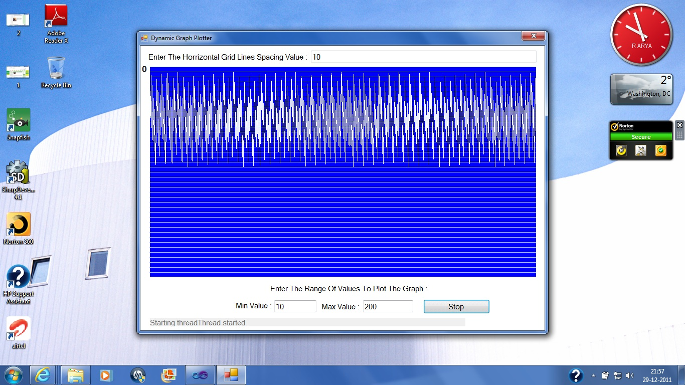

# Dynamic Plotting Of Graph Using VB.NET
## Requires
- Visual Studio 2010
## License
- Apache License, Version 2.0
## Technologies
- threading
- VB.Net
- Graphics Functions
## Topics
- threading
- VB.Net
- Graphics Functions
## Updated
- 12/29/2011
## Description

<h1>Introduction</h1>

<em>This application focusses on the basic concepts and power of graphics using Visual Studio.NET and Visual Basic as the programming language. This example plots the graph in the X/Y coordinate system using cartesian coordinate
 system. This application uses the Picturebox top left corner as point 0 of the Cartesian Coordinate System.</em>

<h1>Building the Sample</h1>

<em>Just code or download the sample and run the application using F5 thus plots the graph using the grid lines spaces as input and entering the minimum value and maximum value for the function to generate the plotting values.</em>

Description

<em>The application starts with the click on the button Draw Graph which creates a new thread and allocates it a priority that is below normal. The thread in turn calls the DrawGraph() method. The Drawgraph() method calls the NewValues()
 method which generates random numbers to be plotted on the graph between the range of minimum and maximum values. The PlotValue() function now generates grid lines which are horrizontally spaced lines as used to indicate X units on the graph. This gives best
 result when the gridspace is 10 so if you plot 10 or 100 it gives exact accurate results.</em>

&nbsp;

Visual Basic

Edit|Remove

vb

<pre class="vb">Private Sub btnGraph_Click(sender As System.Object, e As <a class="libraryLink" href="http://msdn.microsoft.com/en-US/library/System.EventArgs.aspx" target="_blank" title="Auto generated link to System.EventArgs">System.EventArgs</a>) Handles btnGraph.Click 
        If m_GraphThread Is Nothing Then 
            ' The thread isn't running. Start it. 
            AddStatus(&quot;Starting thread&quot;) 
 
            m_GraphThread = New Thread(AddressOf DrawGraph) 
            m_GraphThread.Priority = ThreadPriority.BelowNormal 
            m_GraphThread.IsBackground = True 
            m_GraphThread.Start() 
 
            AddStatus(&quot;Thread started&quot;) 
 
            btnGraph.Text = &quot;Stop&quot; 
        Else 
            ' The thread is running. Stop it. 
            AddStatus(&quot;Stopping thread&quot;) 
 
            m_GraphThread.Abort() 
            ' m_GraphThread.Join() 
            m_GraphThread = Nothing 
 
            AddStatus(&quot;Thread stopped&quot;) 
 
            btnGraph.Text = &quot;Start&quot; 
        End If 
    End Sub 
 
    Private Sub DrawGraph() 
        Try 
            ' Generate pseudo-random values. 
            Dim y As Integer = m_Y 
            Do 
                ' Generate the next value. 
                NewValue() 
 
                ' Plot the new value. 
                PlotValue(y, m_Y) 
                y = m_Y 
            Loop 
        Catch ex As Exception 
            AddStatus(&quot;[Thread] &quot; &amp; ex.Message) 
        End Try 
    End Sub 
 
    ' Generate the next value. 
    Private Sub NewValue() 
        ' Delay a bit before calculating the value. 
        Dim stop_time As Date = Now.AddMilliseconds(20) 
        Do While Now &lt; stop_time 
        Loop 
 
        ' Calculate the next value. 
        Dim rnd As New Random 
        m_Y = rnd.Next(CInt(txtMinValue.Text), CInt(txtMaxValue.Text)) 
        'm_Y = rnd.Next(5, 70) 
        If m_Y &lt; 0 Then m_Y = 0 
        If m_Y &gt;= picGraph.ClientSize.Height - 1 Then m_Y = picGraph.ClientSize.Height - 1 
    End Sub 
 
    Private Delegate Sub PlotValueDelegate(ByVal old_y As Integer, ByVal new_y As Integer) 
 
    Private Sub PlotValue(ByVal old_y As Integer, ByVal new_y As Integer) 
        ' See if we're on the worker thread and thus 
        ' need to invoke the main UI thread. 
        If Me.InvokeRequired Then 
            ' Make arguments for the delegate. 
            Dim args As Object() = {old_y, new_y} 
 
            ' Make the delegate. 
            Dim plot_value_delegate As PlotValueDelegate 
            plot_value_delegate = AddressOf PlotValue 
 
            ' Invoke the delegate on the main UI thread. 
            Me.Invoke(plot_value_delegate, args) 
 
            ' We're done. 
            Exit Sub 
        End If 
 
        ' Make the Bitmap and Graphics objects. 
        Dim wid As Integer = picGraph.ClientSize.Width 
        Dim hgt As Integer = picGraph.ClientSize.Height 
        Dim bm As New Bitmap(wid, hgt) 
        Dim gr As Graphics = Graphics.FromImage(bm) 
        Dim m_Ymid As Integer 
        Dim GRID_STEP As Integer = Convert.ToInt32(txtGridSpacing.Text) 'Assign Grid Spacing 
        m_Ymid = hgt / 2 
        ' Move the old data one pixel to the left. 
        gr.DrawImage(picGraph.Image, -1, 0) 
 
        ' Erase the right edge and draw guide lines. 
        gr.DrawLine(Pens.Blue, wid - 1, 0, wid - 1, hgt - 1) 
        For i As Integer = m_Ymid To picGraph.ClientSize.Height Step GRID_STEP 
            gr.DrawLine(Pens.LightBlue, wid - 2, i, wid - 1, i) 
        Next i 
        For i As Integer = m_Ymid To 0 Step -GRID_STEP 
            gr.DrawLine(Pens.LightBlue, wid - 2, i, wid - 1, i) 
        Next i 
 
        ' Plot a new pixel. 
        gr.DrawLine(Pens.White, wid - 2, old_y, wid - 1, new_y) 
 
        ' Display the result. 
        picGraph.Image = bm 
        picGraph.Refresh() 
 
        gr.Dispose() 
    End Sub 
</pre>

<em>This application is just an illustration of what wonders can be done with Graphics in realtime processing and threading usage in the application. This does not give good accurate visible results for negative values. When the
 application is run, it plots the graph from the right side of the screen sliding towards the left of the screen. Running the application produces the screen as shown below :
</em>

<em>&nbsp;</em>

