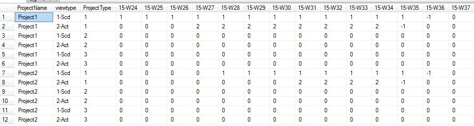
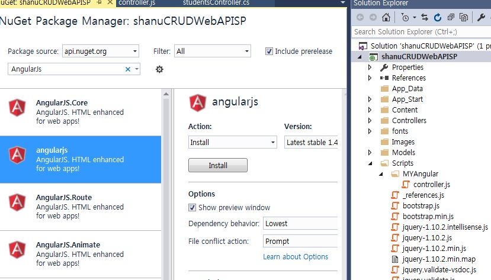
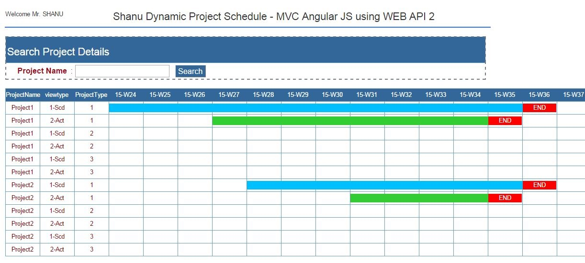

# Dynamic Project scheduling using MVC Angular JS
## Requires
- Visual Studio 2015
## License
- MIT
## Technologies
- MVC
- Web API
- AngularJS
- Project Management
- Project Scheduling
## Topics
- MVC
- Web API
- AngularJS
- Project Scheduling
## Updated
- 09/08/2015
## Description

<h1>Introduction</h1>

<em></em>

<em>&nbsp;</em>&nbsp;In this article we can see how to create a simple Dynamic Project Scheduling from a database using a Stored Procedure with Pivot result. Display the result to MVC view using AngularJS and Web API 2 without using Entity Framework. 
 
In this example I didn't use Entity Framework. The reason for not using EF is for EF we need to get the result of the select with fixed columns (the columns need to be defined) for example from our Stored Procedure we usually do a select result like &ldquo;<em style="outline:0px">select
 column1,column2,column3 from table</em>&rdquo;. But for our example I have used the pivot result and the columns will be displayed dynamically depending on the date range and I am using the &ldquo;<em style="outline:0px">exec
 sp_executesql @SQLquery</em>;&rdquo; in my SP to execute the dynamic query I. Insted of using the Entity Framework in my Web API I will be connecting to the database directly and execute the SP to return the result. From my AngularJS Controller
 I will call the Web API method to return the result. 
<strong style="outline:0px"> 
Project Scheduling</strong> 
 
Project Scheduling is a very important part in project planning. The project might be any type, for example software project development planning, production planning and so on. For a realistic example let's consider a car seat manufacturing company. Every
 week they will produce, for example, 100 sets of seats for a model of car. In the factory everything will go as planned, for example from this week beginning Monday to this week ending Friday a total of 100 seats need to be manufactured and delivered to the
 customer. Here we can see this is the plan since we need to produce 100 seats and deliver them to the customer. But for some reason the production could only make 90 sets of seats or production has made 100 set of seats in time. To track the production plan
 with the actual plan we use the Production Schedule Chart. The production plan will have both a start and end date, when the production must be started and when the production needs to be finished. The actual date is the real production start and the end date.
 The actual start and end dates will be set after the production is completed. If the actual date is the same or below the production end date then it's clear that the production is on time and it can be delivered to the customer. If the actual end date is
 past the production plan date then the production line must be closely watched and again the next time the same delay should be avoided. 
 
In the project there might be 2 dates available, one is the scheduled start and end dates (this is the initial planned date or the target date for our project) and another one is the actual start and end date (this is when the project is actually started and
 completed). For all the projects we need to compare both the scheduled and actual dates, if there are greater differences in both of the dates then we need to check whether the project is completed within the scheduled time or if there was a delay in project
 development.

You can also view my previous articles related to AngularJs using MVC and the WCF Rest Service.
<ul style="outline:0px">
<li style="outline:0px"><a href="http://www.c-sharpcorner.com/UploadFile/asmabegam/mvc-angular-js-and-wcf-rest-service-for-mind-reader-quiz/" style="outline:0px; color:#0000ff; text-decoration:none">MVC AngularJs and WCF Rest Service For Mind Reader Quiz</a>
</li><li style="outline:0px"><a href="http://www.c-sharpcorner.com/UploadFile/asmabegam/mvc-angular-js-and-wcf-rest-service-for-master-or-detail-gri/" style="outline:0px; color:#0000ff; text-decoration:none">MVC, AngularJs and WCF Rest Service For Master Detail
 Grid</a> </li><li style="outline:0px"><a href="http://www.c-sharpcorner.com/UploadFile/asmabegam/angular-js-filter-sorting-and-animation-using-mvc-and-wcf-r/" style="outline:0px; text-decoration:none">AngularJs Filter, Sorting and
 Animation Using MVC and WCF Rest</a> </li><li style="outline:0px"><a href="http://www.c-sharpcorner.com/UploadFile/asmabegam/angular-js-shopping-cart-using-mvc-and-wcf-rest/" style="outline:0px; text-decoration:none">AngularJs
 Shopping Cart Using MVC and WCF Rest Service</a> </li><li style="outline:0px"><a href="http://www.c-sharpcorner.com/UploadFile/asmabegam/angular-js-dynamic-menu-creation-using-mvc-and-wcf-rest/" style="outline:0px; text-decoration:none">AngularJs
 Dynamic Menu Creation Using MVC and WCF Rest</a> </li></ul>

Previous articles related to Angular JS,MVC and WEB API:

<ul style="outline:0px">
<li style="outline:0px">&nbsp;<a href="http://www.c-sharpcorner.com/UploadFile/asmabegam/image-preview-using-mvc-angularjs-and-web-api-2/" target="_blank" style="outline:0px; color:#0000ff; text-decoration:none">AngularJs using MVC and and using Web API 2</a>
</li><li style="outline:0px"><a href="http://www.c-sharpcorner.com/UploadFile/asmabegam/mvc-angularjs-crud-using-web-api-2-with-stored-procedure/" target="_blank" style="outline:0px; color:#0000ff; text-decoration:none">MVC,
 AngularJS CRUD Using WEB API 2 With Stored Procedure</a> </li></ul>

<h1>Building the Sample</h1>

<em><strong style="outline:0px; text-align:left; color:#333333; text-transform:none; line-height:21px; text-indent:0px; letter-spacing:normal; font-family:Roboto,sans-serif; font-size:14px; font-style:normal; font-variant:normal; word-spacing:0px; white-space:normal; widows:1; background-color:#ffffff">Create
 Database and Table 
</strong> 
We will
 create a&nbsp;<strong style="outline:0px; text-align:left; color:#333333; text-transform:none; line-height:21px; text-indent:0px; letter-spacing:normal; font-family:Roboto,sans-serif; font-size:14px; font-style:normal; font-variant:normal; word-spacing:0px; white-space:normal; widows:1; background-color:#ffffff">SCHED_Master</strong>&nbsp;table
 under the Database&nbsp;<strong style="outline:0px; text-align:left; color:#333333; text-transform:none; line-height:21px; text-indent:0px; letter-spacing:normal; font-family:Roboto,sans-serif; font-size:14px; font-style:normal; font-variant:normal; word-spacing:0px; white-space:normal; widows:1; background-color:#ffffff">'projectDB</strong>'.
 The following is the script to create a database, table and sample insert query. Run this script in your SQL Server. I have used SQL Server 2012. 
</em>

Description

<em>Create SQl Table and Insert Sample Records.</em>&nbsp;

SQL

Edit|Remove

mysql

<pre class="mysql">--&nbsp;=============================================&nbsp;&nbsp;&nbsp;&nbsp;&nbsp;&nbsp;&nbsp;&nbsp;&nbsp;&nbsp;&nbsp;&nbsp;&nbsp;&nbsp;&nbsp;&nbsp;&nbsp;&nbsp;&nbsp;&nbsp;&nbsp;&nbsp;&nbsp;&nbsp;&nbsp;&nbsp;&nbsp;&nbsp;&nbsp;&nbsp;&nbsp;&nbsp;
--&nbsp;Author&nbsp;&nbsp;&nbsp;&nbsp;&nbsp;&nbsp;:&nbsp;Shanu&nbsp;&nbsp;&nbsp;&nbsp;&nbsp;&nbsp;&nbsp;&nbsp;&nbsp;&nbsp;&nbsp;&nbsp;&nbsp;&nbsp;&nbsp;&nbsp;&nbsp;&nbsp;&nbsp;&nbsp;&nbsp;&nbsp;&nbsp;&nbsp;&nbsp;&nbsp;&nbsp;&nbsp;&nbsp;&nbsp;&nbsp;&nbsp;&nbsp;
--&nbsp;Create&nbsp;date&nbsp;:&nbsp;2015-07-13&nbsp;&nbsp;&nbsp;&nbsp;&nbsp;&nbsp;&nbsp;&nbsp;&nbsp;&nbsp;&nbsp;&nbsp;&nbsp;&nbsp;&nbsp;&nbsp;&nbsp;&nbsp;&nbsp;&nbsp;&nbsp;&nbsp;&nbsp;&nbsp;&nbsp;&nbsp;&nbsp;&nbsp;&nbsp;&nbsp;&nbsp;&nbsp;&nbsp;&nbsp;
--&nbsp;Description&nbsp;:&nbsp;To&nbsp;Create&nbsp;Database,Table&nbsp;and&nbsp;Sample&nbsp;Insert&nbsp;Query&nbsp;&nbsp;&nbsp;&nbsp;&nbsp;&nbsp;&nbsp;&nbsp;&nbsp;&nbsp;&nbsp;&nbsp;&nbsp;&nbsp;&nbsp;&nbsp;&nbsp;&nbsp;&nbsp;&nbsp;&nbsp;&nbsp;&nbsp;&nbsp;&nbsp;&nbsp;&nbsp;&nbsp;&nbsp;
--&nbsp;Latest&nbsp;&nbsp;&nbsp;&nbsp;&nbsp;&nbsp;&nbsp;&nbsp;&nbsp;&nbsp;&nbsp;&nbsp;&nbsp;&nbsp;&nbsp;&nbsp;&nbsp;&nbsp;&nbsp;&nbsp;&nbsp;&nbsp;&nbsp;&nbsp;&nbsp;&nbsp;&nbsp;&nbsp;&nbsp;&nbsp;&nbsp;&nbsp;
--&nbsp;Modifier&nbsp;&nbsp;&nbsp;&nbsp;:&nbsp;Shanu&nbsp;&nbsp;&nbsp;&nbsp;&nbsp;&nbsp;&nbsp;&nbsp;&nbsp;&nbsp;&nbsp;&nbsp;&nbsp;&nbsp;&nbsp;&nbsp;&nbsp;&nbsp;&nbsp;&nbsp;&nbsp;&nbsp;&nbsp;&nbsp;&nbsp;&nbsp;&nbsp;&nbsp;&nbsp;&nbsp;&nbsp;&nbsp;&nbsp;
--&nbsp;Modify&nbsp;date&nbsp;:&nbsp;2015-07-13&nbsp;&nbsp;&nbsp;&nbsp;&nbsp;&nbsp;&nbsp;&nbsp;&nbsp;&nbsp;&nbsp;&nbsp;&nbsp;&nbsp;&nbsp;&nbsp;&nbsp;&nbsp;&nbsp;&nbsp;&nbsp;&nbsp;&nbsp;&nbsp;&nbsp;&nbsp;&nbsp;&nbsp;
--&nbsp;=============================================&nbsp;
--Script&nbsp;to&nbsp;create&nbsp;DB,Table&nbsp;and&nbsp;sample&nbsp;Insert&nbsp;data&nbsp;
USE&nbsp;MASTER&nbsp;
GO&nbsp;
&nbsp;
--&nbsp;1)&nbsp;Check&nbsp;for&nbsp;the&nbsp;Database&nbsp;Exists&nbsp;.If&nbsp;the&nbsp;database&nbsp;is&nbsp;exist&nbsp;then&nbsp;drop&nbsp;and&nbsp;create&nbsp;new&nbsp;DB&nbsp;
IF&nbsp;EXISTS&nbsp;(SELECT&nbsp;[name]&nbsp;FROM&nbsp;sys.databases&nbsp;WHERE&nbsp;[name]&nbsp;=&nbsp;'projectDB'&nbsp;)&nbsp;
DROP&nbsp;DATABASE&nbsp;projectDB&nbsp;
GO&nbsp;
&nbsp;
CREATE&nbsp;DATABASE&nbsp;projectDB&nbsp;
GO&nbsp;
&nbsp;
USE&nbsp;projectDB&nbsp;
GO&nbsp;
&nbsp;
&nbsp;
CREATE&nbsp;TABLE&nbsp;[dbo].[SCHED_Master](&nbsp;
&nbsp;&nbsp;&nbsp;&nbsp;[ID]&nbsp;[int]&nbsp;NOT&nbsp;NULL,&nbsp;
&nbsp;&nbsp;&nbsp;&nbsp;[ProjectName]&nbsp;[varchar](100)&nbsp;NULL,&nbsp;
&nbsp;&nbsp;&nbsp;&nbsp;[ProjectType]&nbsp;int&nbsp;NULL,&nbsp;
&nbsp;&nbsp;&nbsp;&nbsp;[ProjectTypeName]&nbsp;[varchar](100)&nbsp;NULL,&nbsp;
&nbsp;&nbsp;&nbsp;&nbsp;[SCHED_ST_DT]&nbsp;[datetime]&nbsp;NULL,&nbsp;
&nbsp;&nbsp;&nbsp;&nbsp;[SCHED_ED_DT]&nbsp;[datetime]&nbsp;NULL,&nbsp;&nbsp;&nbsp;&nbsp;&nbsp;
&nbsp;&nbsp;&nbsp;&nbsp;[ACT_ST_DT]&nbsp;[datetime]&nbsp;NULL,&nbsp;
&nbsp;&nbsp;&nbsp;&nbsp;[ACT_ED_DT]&nbsp;[datetime]&nbsp;NULL,&nbsp;
&nbsp;&nbsp;&nbsp;&nbsp;[status]&nbsp;int&nbsp;null&nbsp;
PRIMARY&nbsp;KEY&nbsp;CLUSTERED&nbsp;&nbsp;
(&nbsp;
&nbsp;&nbsp;&nbsp;&nbsp;[ID]&nbsp;ASC&nbsp;
)WITH&nbsp;(PAD_INDEX&nbsp;&nbsp;=&nbsp;OFF,&nbsp;STATISTICS_NORECOMPUTE&nbsp;&nbsp;=&nbsp;OFF,&nbsp;IGNORE_DUP_KEY&nbsp;=&nbsp;OFF,&nbsp;ALLOW_ROW_LOCKS&nbsp;&nbsp;=&nbsp;ON,&nbsp;ALLOW_PAGE_LOCKS&nbsp;&nbsp;=&nbsp;ON)&nbsp;ON&nbsp;[PRIMARY]&nbsp;
)&nbsp;ON&nbsp;[PRIMARY]&nbsp;
&nbsp;
--&nbsp;Insert&nbsp;Query&nbsp;
&nbsp;
&nbsp;
&nbsp;
INSERT&nbsp;INTO&nbsp;[dbo].SCHED_Master&nbsp;
&nbsp;&nbsp;&nbsp;&nbsp;&nbsp;&nbsp;&nbsp;&nbsp;&nbsp;&nbsp;&nbsp;([ID],[ProjectName],[ProjectType],[ProjectTypeName],[SCHED_ST_DT],[SCHED_ED_DT],[ACT_ST_DT],[ACT_ED_DT],[status])&nbsp;
&nbsp;&nbsp;&nbsp;&nbsp;&nbsp;VALUES&nbsp;
&nbsp;&nbsp;&nbsp;&nbsp;&nbsp;&nbsp;&nbsp;&nbsp;&nbsp;&nbsp;&nbsp;(1001,'Project1',1,'Urgent','2015-06-01&nbsp;00:00:00.000','2015-09-02&nbsp;00:00:00.000'&nbsp;
&nbsp;&nbsp;&nbsp;&nbsp;&nbsp;&nbsp;&nbsp;&nbsp;&nbsp;&nbsp;&nbsp;&nbsp;,'2015-06-22&nbsp;00:00:00.000','2015-08-26&nbsp;00:00:00.000',1)&nbsp;
&nbsp;
&nbsp;
INSERT&nbsp;INTO&nbsp;[dbo].SCHED_Master&nbsp;
&nbsp;&nbsp;&nbsp;&nbsp;&nbsp;&nbsp;&nbsp;&nbsp;&nbsp;&nbsp;&nbsp;([ID],[ProjectName],[ProjectType],[ProjectTypeName],[SCHED_ST_DT],[SCHED_ED_DT],[ACT_ST_DT],[ACT_ED_DT],[status])&nbsp;
&nbsp;&nbsp;&nbsp;&nbsp;&nbsp;VALUES&nbsp;
&nbsp;&nbsp;&nbsp;&nbsp;&nbsp;&nbsp;&nbsp;&nbsp;&nbsp;&nbsp;&nbsp;(1002,'Project1',2,'Important','2015-09-22&nbsp;00:00:00.000','2015-12-22&nbsp;00:00:00.000'&nbsp;
&nbsp;&nbsp;&nbsp;&nbsp;&nbsp;&nbsp;&nbsp;&nbsp;&nbsp;&nbsp;&nbsp;&nbsp;,'2015-09-19&nbsp;00:00:00.000','2015-12-29&nbsp;00:00:00.000',1)&nbsp;
&nbsp;
INSERT&nbsp;INTO&nbsp;[dbo].SCHED_Master&nbsp;
&nbsp;&nbsp;&nbsp;&nbsp;&nbsp;&nbsp;&nbsp;&nbsp;&nbsp;&nbsp;&nbsp;([ID],[ProjectName],[ProjectType],[ProjectTypeName],[SCHED_ST_DT],[SCHED_ED_DT],[ACT_ST_DT],[ACT_ED_DT],[status])&nbsp;
&nbsp;&nbsp;&nbsp;&nbsp;&nbsp;VALUES&nbsp;
&nbsp;&nbsp;&nbsp;&nbsp;&nbsp;&nbsp;&nbsp;&nbsp;&nbsp;&nbsp;&nbsp;(1003,'Project1',3,'Normal','2016-01-01&nbsp;00:00:00.000','2016-03-24&nbsp;00:00:00.000'&nbsp;
&nbsp;&nbsp;&nbsp;&nbsp;&nbsp;&nbsp;&nbsp;&nbsp;&nbsp;&nbsp;&nbsp;&nbsp;,'2016-01-01&nbsp;00:00:00.000','2016-03-14&nbsp;00:00:00.000',1)&nbsp;
&nbsp;
&nbsp;
INSERT&nbsp;INTO&nbsp;[dbo].SCHED_Master&nbsp;
&nbsp;&nbsp;&nbsp;&nbsp;&nbsp;&nbsp;&nbsp;&nbsp;&nbsp;&nbsp;&nbsp;([ID],[ProjectName],[ProjectType],[ProjectTypeName],[SCHED_ST_DT],[SCHED_ED_DT],[ACT_ST_DT],[ACT_ED_DT],[status])&nbsp;
&nbsp;&nbsp;&nbsp;&nbsp;&nbsp;VALUES&nbsp;
&nbsp;&nbsp;&nbsp;&nbsp;&nbsp;&nbsp;&nbsp;&nbsp;&nbsp;&nbsp;&nbsp;(1004,'Project2',1,'Urgent','2015-07-01&nbsp;00:00:00.000','2015-09-02&nbsp;00:00:00.000'&nbsp;
&nbsp;&nbsp;&nbsp;&nbsp;&nbsp;&nbsp;&nbsp;&nbsp;&nbsp;&nbsp;&nbsp;&nbsp;,'2015-07-22&nbsp;00:00:00.000','2015-08-26&nbsp;00:00:00.000',1)&nbsp;
&nbsp;
&nbsp;
INSERT&nbsp;INTO&nbsp;[dbo].SCHED_Master&nbsp;
&nbsp;&nbsp;&nbsp;&nbsp;&nbsp;&nbsp;&nbsp;&nbsp;&nbsp;&nbsp;&nbsp;([ID],[ProjectName],[ProjectType],[ProjectTypeName],[SCHED_ST_DT],[SCHED_ED_DT],[ACT_ST_DT],[ACT_ED_DT],[status])&nbsp;
&nbsp;&nbsp;&nbsp;&nbsp;&nbsp;VALUES&nbsp;
&nbsp;&nbsp;&nbsp;&nbsp;&nbsp;&nbsp;&nbsp;&nbsp;&nbsp;&nbsp;&nbsp;(1005,'Project2',2,'Important','2015-09-29&nbsp;00:00:00.000','2015-12-22&nbsp;00:00:00.000'&nbsp;
&nbsp;&nbsp;&nbsp;&nbsp;&nbsp;&nbsp;&nbsp;&nbsp;&nbsp;&nbsp;&nbsp;&nbsp;,'2015-09-08&nbsp;00:00:00.000','2015-12-14&nbsp;00:00:00.000',1)&nbsp;
&nbsp;
INSERT&nbsp;INTO&nbsp;[dbo].SCHED_Master&nbsp;
&nbsp;&nbsp;&nbsp;&nbsp;&nbsp;&nbsp;&nbsp;&nbsp;&nbsp;&nbsp;&nbsp;([ID],[ProjectName],[ProjectType],[ProjectTypeName],[SCHED_ST_DT],[SCHED_ED_DT],[ACT_ST_DT],[ACT_ED_DT],[status])&nbsp;
&nbsp;&nbsp;&nbsp;&nbsp;&nbsp;VALUES&nbsp;
&nbsp;&nbsp;&nbsp;&nbsp;&nbsp;&nbsp;&nbsp;&nbsp;&nbsp;&nbsp;&nbsp;(1006,'Project2',3,'Normal','2016-01-01&nbsp;00:00:00.000','2016-03-04&nbsp;00:00:00.000'&nbsp;
&nbsp;&nbsp;&nbsp;&nbsp;&nbsp;&nbsp;&nbsp;&nbsp;&nbsp;&nbsp;&nbsp;&nbsp;,'2016-01-01&nbsp;00:00:00.000','2016-02-24&nbsp;00:00:00.000',1)&nbsp;
&nbsp;
&nbsp;
--&nbsp;Select&nbsp;Query&nbsp;
&nbsp;
select&nbsp;ID,ProjectName,ProjectType,ProjectTypeName,SCHED_ST_DT,SCHED_ED_DT,ACT_ST_DT,ACT_ED_DT,status&nbsp;from&nbsp;SCHED_Master&nbsp;
</pre>

After creating our
 table we will create a Stored Procedure to display the project schedule result using a Pivot query.

<h1 class="scriptcode">

SQL

Edit|Remove

mysql

<pre class="mysql">--&nbsp;=============================================&nbsp;&nbsp;&nbsp;&nbsp;&nbsp;&nbsp;&nbsp;&nbsp;&nbsp;&nbsp;&nbsp;&nbsp;&nbsp;&nbsp;&nbsp;&nbsp;&nbsp;&nbsp;&nbsp;&nbsp;&nbsp;&nbsp;&nbsp;&nbsp;&nbsp;&nbsp;&nbsp;&nbsp;&nbsp;&nbsp;&nbsp;&nbsp;&nbsp;&nbsp;&nbsp;&nbsp;&nbsp;&nbsp;&nbsp;&nbsp;&nbsp;&nbsp;&nbsp;&nbsp;&nbsp;&nbsp;&nbsp;&nbsp;&nbsp;&nbsp;&nbsp;&nbsp;&nbsp;&nbsp;&nbsp;&nbsp;&nbsp;&nbsp;&nbsp;&nbsp;&nbsp;&nbsp;&nbsp;&nbsp;&nbsp;&nbsp;&nbsp;&nbsp;&nbsp;&nbsp;&nbsp;
--&nbsp;Author&nbsp;&nbsp;&nbsp;&nbsp;&nbsp;&nbsp;:&nbsp;Shanu&nbsp;&nbsp;&nbsp;&nbsp;&nbsp;&nbsp;&nbsp;&nbsp;&nbsp;&nbsp;&nbsp;&nbsp;&nbsp;&nbsp;&nbsp;&nbsp;&nbsp;&nbsp;&nbsp;&nbsp;&nbsp;&nbsp;&nbsp;&nbsp;&nbsp;&nbsp;&nbsp;&nbsp;&nbsp;&nbsp;&nbsp;&nbsp;&nbsp;&nbsp;&nbsp;&nbsp;&nbsp;&nbsp;&nbsp;&nbsp;&nbsp;&nbsp;&nbsp;&nbsp;&nbsp;&nbsp;&nbsp;&nbsp;&nbsp;&nbsp;&nbsp;&nbsp;&nbsp;&nbsp;&nbsp;&nbsp;&nbsp;&nbsp;&nbsp;&nbsp;&nbsp;&nbsp;&nbsp;&nbsp;&nbsp;&nbsp;&nbsp;&nbsp;&nbsp;&nbsp;&nbsp;
--&nbsp;Create&nbsp;date&nbsp;:&nbsp;2015-07-24&nbsp;&nbsp;&nbsp;&nbsp;&nbsp;&nbsp;&nbsp;&nbsp;&nbsp;&nbsp;&nbsp;&nbsp;&nbsp;&nbsp;&nbsp;&nbsp;&nbsp;&nbsp;&nbsp;&nbsp;&nbsp;&nbsp;&nbsp;&nbsp;&nbsp;&nbsp;&nbsp;&nbsp;&nbsp;&nbsp;&nbsp;&nbsp;&nbsp;&nbsp;&nbsp;&nbsp;&nbsp;&nbsp;&nbsp;&nbsp;&nbsp;&nbsp;&nbsp;&nbsp;&nbsp;&nbsp;&nbsp;&nbsp;&nbsp;&nbsp;&nbsp;&nbsp;&nbsp;&nbsp;&nbsp;&nbsp;&nbsp;&nbsp;&nbsp;&nbsp;&nbsp;&nbsp;&nbsp;&nbsp;&nbsp;&nbsp;&nbsp;&nbsp;&nbsp;&nbsp;&nbsp;
--&nbsp;Description&nbsp;:&nbsp;To&nbsp;get&nbsp;all&nbsp;prject&nbsp;Schedule&nbsp;details&nbsp;&nbsp;&nbsp;&nbsp;&nbsp;&nbsp;&nbsp;&nbsp;&nbsp;&nbsp;&nbsp;&nbsp;&nbsp;&nbsp;&nbsp;&nbsp;&nbsp;&nbsp;&nbsp;&nbsp;&nbsp;&nbsp;&nbsp;&nbsp;&nbsp;&nbsp;&nbsp;&nbsp;&nbsp;&nbsp;&nbsp;&nbsp;&nbsp;&nbsp;&nbsp;&nbsp;&nbsp;&nbsp;&nbsp;&nbsp;&nbsp;&nbsp;&nbsp;&nbsp;&nbsp;&nbsp;&nbsp;&nbsp;&nbsp;&nbsp;&nbsp;&nbsp;&nbsp;&nbsp;&nbsp;&nbsp;&nbsp;&nbsp;&nbsp;&nbsp;&nbsp;&nbsp;&nbsp;&nbsp;&nbsp;&nbsp;&nbsp;&nbsp;&nbsp;&nbsp;
--&nbsp;Latest&nbsp;&nbsp;&nbsp;&nbsp;&nbsp;&nbsp;&nbsp;&nbsp;&nbsp;&nbsp;&nbsp;&nbsp;&nbsp;&nbsp;&nbsp;&nbsp;&nbsp;&nbsp;&nbsp;&nbsp;&nbsp;&nbsp;&nbsp;&nbsp;&nbsp;&nbsp;&nbsp;&nbsp;&nbsp;&nbsp;&nbsp;&nbsp;&nbsp;&nbsp;&nbsp;&nbsp;&nbsp;&nbsp;&nbsp;&nbsp;&nbsp;&nbsp;&nbsp;&nbsp;&nbsp;&nbsp;&nbsp;&nbsp;&nbsp;&nbsp;&nbsp;&nbsp;&nbsp;&nbsp;&nbsp;&nbsp;&nbsp;&nbsp;&nbsp;&nbsp;&nbsp;&nbsp;&nbsp;&nbsp;&nbsp;&nbsp;&nbsp;&nbsp;&nbsp;&nbsp;&nbsp;
--&nbsp;Modifier&nbsp;&nbsp;&nbsp;&nbsp;:&nbsp;Shanu&nbsp;&nbsp;&nbsp;&nbsp;&nbsp;&nbsp;&nbsp;&nbsp;&nbsp;&nbsp;&nbsp;&nbsp;&nbsp;&nbsp;&nbsp;&nbsp;&nbsp;&nbsp;&nbsp;&nbsp;&nbsp;&nbsp;&nbsp;&nbsp;&nbsp;&nbsp;&nbsp;&nbsp;&nbsp;&nbsp;&nbsp;&nbsp;&nbsp;&nbsp;&nbsp;&nbsp;&nbsp;&nbsp;&nbsp;&nbsp;&nbsp;&nbsp;&nbsp;&nbsp;&nbsp;&nbsp;&nbsp;&nbsp;&nbsp;&nbsp;&nbsp;&nbsp;&nbsp;&nbsp;&nbsp;&nbsp;&nbsp;&nbsp;&nbsp;&nbsp;&nbsp;&nbsp;&nbsp;&nbsp;&nbsp;&nbsp;&nbsp;&nbsp;&nbsp;&nbsp;&nbsp;
--&nbsp;Modify&nbsp;date&nbsp;:&nbsp;2015-07-24&nbsp;&nbsp;&nbsp;&nbsp;&nbsp;&nbsp;&nbsp;&nbsp;&nbsp;&nbsp;&nbsp;&nbsp;&nbsp;&nbsp;&nbsp;&nbsp;&nbsp;&nbsp;&nbsp;&nbsp;&nbsp;&nbsp;&nbsp;&nbsp;&nbsp;&nbsp;&nbsp;&nbsp;&nbsp;&nbsp;&nbsp;&nbsp;&nbsp;&nbsp;&nbsp;&nbsp;&nbsp;&nbsp;&nbsp;&nbsp;&nbsp;&nbsp;&nbsp;&nbsp;&nbsp;&nbsp;&nbsp;&nbsp;&nbsp;&nbsp;&nbsp;&nbsp;&nbsp;&nbsp;&nbsp;&nbsp;&nbsp;&nbsp;&nbsp;&nbsp;&nbsp;&nbsp;&nbsp;&nbsp;&nbsp;&nbsp;&nbsp;&nbsp;&nbsp;&nbsp;&nbsp;
--&nbsp;=============================================&nbsp;&nbsp;&nbsp;&nbsp;&nbsp;&nbsp;&nbsp;&nbsp;&nbsp;&nbsp;&nbsp;&nbsp;&nbsp;&nbsp;&nbsp;&nbsp;&nbsp;&nbsp;&nbsp;&nbsp;&nbsp;&nbsp;&nbsp;&nbsp;&nbsp;&nbsp;&nbsp;&nbsp;&nbsp;&nbsp;&nbsp;&nbsp;&nbsp;&nbsp;&nbsp;&nbsp;&nbsp;&nbsp;&nbsp;&nbsp;&nbsp;&nbsp;&nbsp;&nbsp;&nbsp;&nbsp;&nbsp;&nbsp;&nbsp;&nbsp;&nbsp;&nbsp;&nbsp;&nbsp;&nbsp;&nbsp;&nbsp;&nbsp;&nbsp;&nbsp;&nbsp;&nbsp;&nbsp;&nbsp;&nbsp;&nbsp;&nbsp;&nbsp;&nbsp;&nbsp;&nbsp;
--&nbsp;&nbsp;usp_ProjectSchedule_Select&nbsp;'Project1'&nbsp;&nbsp;&nbsp;&nbsp;&nbsp;&nbsp;&nbsp;&nbsp;&nbsp;&nbsp;&nbsp;&nbsp;&nbsp;&nbsp;&nbsp;&nbsp;
--&nbsp;&nbsp;usp_ProjectSchedule_Select&nbsp;''&nbsp;&nbsp;&nbsp;&nbsp;&nbsp;&nbsp;&nbsp;&nbsp;&nbsp;&nbsp;&nbsp;&nbsp;&nbsp;&nbsp;&nbsp;&nbsp;&nbsp;&nbsp;&nbsp;&nbsp;&nbsp;&nbsp;&nbsp;&nbsp;&nbsp;&nbsp;&nbsp;&nbsp;&nbsp;&nbsp;&nbsp;&nbsp;&nbsp;&nbsp;&nbsp;&nbsp;&nbsp;&nbsp;&nbsp;&nbsp;&nbsp;&nbsp;&nbsp;&nbsp;&nbsp;&nbsp;&nbsp;&nbsp;&nbsp;&nbsp;&nbsp;&nbsp;&nbsp;&nbsp;&nbsp;&nbsp;&nbsp;&nbsp;&nbsp;&nbsp;&nbsp;&nbsp;&nbsp;&nbsp;&nbsp;
--&nbsp;=============================================&nbsp;&nbsp;&nbsp;&nbsp;&nbsp;&nbsp;&nbsp;&nbsp;&nbsp;&nbsp;&nbsp;&nbsp;&nbsp;&nbsp;&nbsp;&nbsp;&nbsp;&nbsp;&nbsp;&nbsp;&nbsp;&nbsp;&nbsp;&nbsp;&nbsp;&nbsp;&nbsp;&nbsp;&nbsp;&nbsp;&nbsp;&nbsp;&nbsp;&nbsp;&nbsp;&nbsp;&nbsp;&nbsp;&nbsp;&nbsp;&nbsp;&nbsp;&nbsp;&nbsp;&nbsp;&nbsp;&nbsp;&nbsp;&nbsp;&nbsp;&nbsp;&nbsp;&nbsp;&nbsp;&nbsp;&nbsp;&nbsp;&nbsp;&nbsp;&nbsp;&nbsp;&nbsp;&nbsp;&nbsp;&nbsp;&nbsp;
Alter&nbsp;PROCEDURE&nbsp;[dbo].[usp_ProjectSchedule_Select]&nbsp;&nbsp;&nbsp;&nbsp;&nbsp;&nbsp;&nbsp;&nbsp;&nbsp;&nbsp;&nbsp;&nbsp;&nbsp;&nbsp;&nbsp;&nbsp;&nbsp;&nbsp;&nbsp;&nbsp;&nbsp;&nbsp;&nbsp;&nbsp;&nbsp;&nbsp;&nbsp;&nbsp;&nbsp;&nbsp;&nbsp;&nbsp;&nbsp;&nbsp;&nbsp;&nbsp;&nbsp;&nbsp;&nbsp;&nbsp;&nbsp;&nbsp;&nbsp;&nbsp;&nbsp;&nbsp;&nbsp;&nbsp;&nbsp;&nbsp;&nbsp;&nbsp;&nbsp;
@projectId&nbsp;&nbsp;&nbsp;&nbsp;&nbsp;&nbsp;&nbsp;&nbsp;&nbsp;&nbsp;&nbsp;VARCHAR(10)&nbsp;&nbsp;=&nbsp;''&nbsp;&nbsp;&nbsp;&nbsp;&nbsp;&nbsp;&nbsp;&nbsp;&nbsp;&nbsp;&nbsp;&nbsp;&nbsp;&nbsp;&nbsp;&nbsp;&nbsp;&nbsp;&nbsp;&nbsp;&nbsp;&nbsp;&nbsp;&nbsp;&nbsp;&nbsp;&nbsp;&nbsp;&nbsp;&nbsp;&nbsp;&nbsp;&nbsp;&nbsp;&nbsp;&nbsp;&nbsp;&nbsp;&nbsp;&nbsp;&nbsp;&nbsp;&nbsp;&nbsp;&nbsp;&nbsp;&nbsp;&nbsp;&nbsp;&nbsp;&nbsp;&nbsp;&nbsp;&nbsp;&nbsp;&nbsp;&nbsp;&nbsp;&nbsp;&nbsp;&nbsp;&nbsp;&nbsp;&nbsp;&nbsp;&nbsp;
&nbsp;&nbsp;&nbsp;&nbsp;&nbsp;&nbsp;&nbsp;&nbsp;&nbsp;&nbsp;&nbsp;&nbsp;&nbsp;&nbsp;&nbsp;&nbsp;&nbsp;&nbsp;&nbsp;&nbsp;&nbsp;&nbsp;&nbsp;&nbsp;&nbsp;&nbsp;&nbsp;&nbsp;&nbsp;&nbsp;&nbsp;&nbsp;&nbsp;&nbsp;&nbsp;&nbsp;&nbsp;&nbsp;&nbsp;&nbsp;&nbsp;&nbsp;&nbsp;&nbsp;&nbsp;&nbsp;&nbsp;&nbsp;&nbsp;&nbsp;&nbsp;&nbsp;&nbsp;&nbsp;&nbsp;&nbsp;&nbsp;&nbsp;
AS&nbsp;&nbsp;&nbsp;&nbsp;&nbsp;&nbsp;&nbsp;&nbsp;&nbsp;&nbsp;&nbsp;&nbsp;&nbsp;&nbsp;&nbsp;&nbsp;&nbsp;&nbsp;&nbsp;&nbsp;&nbsp;&nbsp;&nbsp;&nbsp;&nbsp;&nbsp;&nbsp;&nbsp;&nbsp;&nbsp;&nbsp;&nbsp;&nbsp;&nbsp;&nbsp;&nbsp;&nbsp;&nbsp;&nbsp;&nbsp;&nbsp;&nbsp;&nbsp;&nbsp;&nbsp;&nbsp;&nbsp;&nbsp;&nbsp;&nbsp;&nbsp;&nbsp;&nbsp;&nbsp;&nbsp;&nbsp;&nbsp;&nbsp;&nbsp;&nbsp;&nbsp;&nbsp;&nbsp;&nbsp;&nbsp;&nbsp;&nbsp;&nbsp;&nbsp;&nbsp;&nbsp;
BEGIN&nbsp;&nbsp;&nbsp;&nbsp;&nbsp;&nbsp;&nbsp;&nbsp;&nbsp;&nbsp;&nbsp;&nbsp;&nbsp;&nbsp;&nbsp;&nbsp;&nbsp;&nbsp;&nbsp;&nbsp;&nbsp;&nbsp;&nbsp;&nbsp;&nbsp;&nbsp;&nbsp;&nbsp;&nbsp;&nbsp;&nbsp;&nbsp;&nbsp;&nbsp;&nbsp;&nbsp;&nbsp;&nbsp;&nbsp;&nbsp;&nbsp;&nbsp;&nbsp;&nbsp;&nbsp;&nbsp;&nbsp;&nbsp;&nbsp;&nbsp;&nbsp;&nbsp;&nbsp;&nbsp;&nbsp;&nbsp;
&nbsp;&nbsp;&nbsp;&nbsp;&nbsp;&nbsp;
&nbsp;--&nbsp;1.&nbsp;Declared&nbsp;for&nbsp;setting&nbsp;the&nbsp;Schedule&nbsp;Start&nbsp;and&nbsp;End&nbsp;date&nbsp;
&nbsp;--1.Start&nbsp;/////////////&nbsp;
&nbsp;&nbsp;Declare&nbsp;&nbsp;&nbsp;@FromDate&nbsp;&nbsp;&nbsp;&nbsp;&nbsp;&nbsp;&nbsp;&nbsp;&nbsp;&nbsp;VARCHAR(20)&nbsp;&nbsp;=&nbsp;'2015-06-08'--DATEADD(mm,-12,getdate())&nbsp;&nbsp;&nbsp;&nbsp;&nbsp;&nbsp;&nbsp;&nbsp;&nbsp;&nbsp;&nbsp;&nbsp;&nbsp;&nbsp;&nbsp;&nbsp;&nbsp;&nbsp;&nbsp;&nbsp;&nbsp;&nbsp;&nbsp;&nbsp;&nbsp;&nbsp;&nbsp;&nbsp;&nbsp;&nbsp;&nbsp;&nbsp;&nbsp;&nbsp;&nbsp;&nbsp;&nbsp;&nbsp;&nbsp;&nbsp;&nbsp;&nbsp;&nbsp;&nbsp;&nbsp;&nbsp;&nbsp;&nbsp;&nbsp;&nbsp;&nbsp;&nbsp;&nbsp;&nbsp;&nbsp;&nbsp;&nbsp;&nbsp;&nbsp;&nbsp;
&nbsp;&nbsp;Declare&nbsp;&nbsp;&nbsp;@ToDate&nbsp;&nbsp;&nbsp;&nbsp;&nbsp;&nbsp;&nbsp;&nbsp;&nbsp;&nbsp;&nbsp;&nbsp;VARCHAR(20)&nbsp;&nbsp;=&nbsp;'2016-05-06'--DATEADD(mm,&nbsp;1,&nbsp;getdate())&nbsp;&nbsp;&nbsp;
&nbsp;&nbsp;--&nbsp;used&nbsp;for&nbsp;the&nbsp;pivot&nbsp;table&nbsp;result&nbsp;
&nbsp;&nbsp;DECLARE&nbsp;@MyColumns&nbsp;AS&nbsp;NVARCHAR(MAX),&nbsp;
&nbsp;&nbsp;&nbsp;&nbsp;@SQLquery&nbsp;&nbsp;AS&nbsp;NVARCHAR(MAX)&nbsp;&nbsp;&nbsp;&nbsp;&nbsp;&nbsp;
&nbsp;&nbsp;--//&nbsp;End&nbsp;of&nbsp;1.&nbsp;
&nbsp;&nbsp;&nbsp;
&nbsp;&nbsp;--&nbsp;2.This&nbsp;Temp&nbsp;table&nbsp;is&nbsp;to&nbsp;created&nbsp;for&nbsp;&nbsp;get&nbsp;all&nbsp;the&nbsp;days&nbsp;between&nbsp;the&nbsp;start&nbsp;date&nbsp;and&nbsp;end&nbsp;date&nbsp;to&nbsp;display&nbsp;as&nbsp;the&nbsp;Column&nbsp;Header&nbsp;&nbsp;&nbsp;&nbsp;&nbsp;&nbsp;&nbsp;&nbsp;&nbsp;&nbsp;&nbsp;&nbsp;&nbsp;&nbsp;&nbsp;&nbsp;&nbsp;&nbsp;&nbsp;&nbsp;&nbsp;&nbsp;&nbsp;&nbsp;&nbsp;&nbsp;&nbsp;&nbsp;&nbsp;&nbsp;&nbsp;&nbsp;&nbsp;&nbsp;&nbsp;&nbsp;&nbsp;&nbsp;&nbsp;&nbsp;&nbsp;&nbsp;&nbsp;&nbsp;&nbsp;&nbsp;&nbsp;&nbsp;&nbsp;&nbsp;&nbsp;&nbsp;&nbsp;&nbsp;&nbsp;
&nbsp;--2.Start&nbsp;/////////////&nbsp;&nbsp;&nbsp;&nbsp;&nbsp;&nbsp;&nbsp;&nbsp;&nbsp;&nbsp;&nbsp;&nbsp;&nbsp;&nbsp;&nbsp;&nbsp;&nbsp;&nbsp;&nbsp;&nbsp;&nbsp;&nbsp;&nbsp;&nbsp;&nbsp;&nbsp;&nbsp;&nbsp;&nbsp;&nbsp;&nbsp;&nbsp;&nbsp;&nbsp;&nbsp;&nbsp;&nbsp;&nbsp;&nbsp;&nbsp;&nbsp;&nbsp;&nbsp;&nbsp;&nbsp;&nbsp;&nbsp;&nbsp;&nbsp;&nbsp;&nbsp;&nbsp;&nbsp;&nbsp;&nbsp;&nbsp;&nbsp;&nbsp;&nbsp;&nbsp;&nbsp;&nbsp;&nbsp;&nbsp;&nbsp;
&nbsp;IF&nbsp;OBJECT_ID('tempdb..#TEMP_EveryWk_Sndays')&nbsp;IS&nbsp;NOT&nbsp;NULL&nbsp;&nbsp;&nbsp;&nbsp;&nbsp;&nbsp;&nbsp;&nbsp;&nbsp;&nbsp;&nbsp;&nbsp;&nbsp;&nbsp;&nbsp;&nbsp;&nbsp;&nbsp;&nbsp;&nbsp;&nbsp;&nbsp;&nbsp;&nbsp;&nbsp;&nbsp;&nbsp;&nbsp;&nbsp;&nbsp;&nbsp;&nbsp;&nbsp;&nbsp;&nbsp;&nbsp;&nbsp;&nbsp;&nbsp;&nbsp;&nbsp;&nbsp;&nbsp;&nbsp;&nbsp;&nbsp;&nbsp;&nbsp;&nbsp;&nbsp;&nbsp;&nbsp;&nbsp;&nbsp;&nbsp;&nbsp;&nbsp;&nbsp;&nbsp;&nbsp;&nbsp;&nbsp;&nbsp;&nbsp;&nbsp;&nbsp;&nbsp;&nbsp;&nbsp;&nbsp;&nbsp;&nbsp;&nbsp;&nbsp;&nbsp;
&nbsp;&nbsp;&nbsp;&nbsp;DROP&nbsp;TABLE&nbsp;#TEMP_EveryWk_Sndays&nbsp;&nbsp;&nbsp;&nbsp;&nbsp;&nbsp;&nbsp;&nbsp;&nbsp;&nbsp;&nbsp;&nbsp;&nbsp;&nbsp;&nbsp;&nbsp;&nbsp;&nbsp;&nbsp;&nbsp;&nbsp;&nbsp;&nbsp;&nbsp;&nbsp;&nbsp;&nbsp;&nbsp;&nbsp;&nbsp;&nbsp;&nbsp;&nbsp;&nbsp;&nbsp;&nbsp;&nbsp;&nbsp;&nbsp;&nbsp;&nbsp;&nbsp;&nbsp;&nbsp;&nbsp;&nbsp;&nbsp;&nbsp;&nbsp;&nbsp;&nbsp;&nbsp;&nbsp;&nbsp;&nbsp;&nbsp;&nbsp;&nbsp;&nbsp;&nbsp;&nbsp;&nbsp;&nbsp;&nbsp;&nbsp;&nbsp;&nbsp;&nbsp;&nbsp;&nbsp;&nbsp;&nbsp;
&nbsp;&nbsp;&nbsp;&nbsp;&nbsp;&nbsp;&nbsp;&nbsp;&nbsp;&nbsp;&nbsp;&nbsp;&nbsp;&nbsp;&nbsp;&nbsp;&nbsp;&nbsp;&nbsp;&nbsp;&nbsp;&nbsp;&nbsp;&nbsp;&nbsp;&nbsp;&nbsp;&nbsp;&nbsp;&nbsp;&nbsp;&nbsp;&nbsp;&nbsp;&nbsp;&nbsp;&nbsp;&nbsp;&nbsp;&nbsp;&nbsp;&nbsp;&nbsp;&nbsp;&nbsp;&nbsp;&nbsp;&nbsp;&nbsp;&nbsp;&nbsp;&nbsp;&nbsp;&nbsp;&nbsp;&nbsp;&nbsp;&nbsp;&nbsp;&nbsp;&nbsp;&nbsp;&nbsp;&nbsp;&nbsp;&nbsp;&nbsp;&nbsp;&nbsp;&nbsp;&nbsp;&nbsp;&nbsp;&nbsp;&nbsp;
&nbsp;DECLARE&nbsp;@TOTALCount&nbsp;INT&nbsp;&nbsp;&nbsp;&nbsp;&nbsp;&nbsp;&nbsp;&nbsp;&nbsp;&nbsp;&nbsp;&nbsp;&nbsp;&nbsp;&nbsp;&nbsp;&nbsp;&nbsp;&nbsp;&nbsp;&nbsp;&nbsp;&nbsp;&nbsp;&nbsp;&nbsp;&nbsp;&nbsp;&nbsp;&nbsp;&nbsp;&nbsp;&nbsp;&nbsp;&nbsp;&nbsp;&nbsp;&nbsp;&nbsp;&nbsp;&nbsp;&nbsp;&nbsp;
&nbsp;&nbsp;&nbsp;&nbsp;Select&nbsp;&nbsp;@TOTALCount=&nbsp;DATEDIFF(dd,@FromDate,@ToDate);&nbsp;&nbsp;&nbsp;&nbsp;&nbsp;&nbsp;&nbsp;&nbsp;&nbsp;&nbsp;&nbsp;&nbsp;
&nbsp;&nbsp;&nbsp;WITH&nbsp;d&nbsp;AS&nbsp;&nbsp;&nbsp;&nbsp;&nbsp;&nbsp;&nbsp;&nbsp;&nbsp;&nbsp;&nbsp;&nbsp;&nbsp;&nbsp;&nbsp;&nbsp;&nbsp;&nbsp;&nbsp;&nbsp;&nbsp;&nbsp;&nbsp;&nbsp;&nbsp;&nbsp;&nbsp;&nbsp;&nbsp;&nbsp;&nbsp;&nbsp;&nbsp;&nbsp;&nbsp;&nbsp;&nbsp;&nbsp;&nbsp;&nbsp;&nbsp;&nbsp;&nbsp;&nbsp;&nbsp;&nbsp;&nbsp;&nbsp;&nbsp;&nbsp;&nbsp;&nbsp;&nbsp;&nbsp;&nbsp;&nbsp;&nbsp;&nbsp;&nbsp;&nbsp;&nbsp;&nbsp;&nbsp;&nbsp;&nbsp;&nbsp;&nbsp;&nbsp;&nbsp;&nbsp;&nbsp;&nbsp;
&nbsp;&nbsp;&nbsp;&nbsp;&nbsp;&nbsp;&nbsp;&nbsp;&nbsp;&nbsp;&nbsp;&nbsp;(&nbsp;&nbsp;&nbsp;&nbsp;&nbsp;&nbsp;&nbsp;&nbsp;&nbsp;&nbsp;&nbsp;&nbsp;&nbsp;&nbsp;&nbsp;&nbsp;&nbsp;&nbsp;&nbsp;&nbsp;&nbsp;&nbsp;&nbsp;&nbsp;&nbsp;&nbsp;&nbsp;&nbsp;&nbsp;&nbsp;&nbsp;&nbsp;&nbsp;&nbsp;&nbsp;&nbsp;&nbsp;&nbsp;&nbsp;&nbsp;&nbsp;&nbsp;&nbsp;&nbsp;&nbsp;&nbsp;&nbsp;&nbsp;&nbsp;&nbsp;&nbsp;&nbsp;&nbsp;&nbsp;&nbsp;&nbsp;&nbsp;&nbsp;&nbsp;&nbsp;&nbsp;&nbsp;&nbsp;&nbsp;&nbsp;&nbsp;&nbsp;&nbsp;&nbsp;&nbsp;&nbsp;
&nbsp;&nbsp;&nbsp;&nbsp;&nbsp;&nbsp;&nbsp;&nbsp;&nbsp;&nbsp;&nbsp;&nbsp;&nbsp;&nbsp;SELECT&nbsp;top&nbsp;(@TOTALCount)&nbsp;AllDays&nbsp;=&nbsp;DATEADD(DAY,&nbsp;ROW_NUMBER()&nbsp;&nbsp;&nbsp;&nbsp;&nbsp;&nbsp;&nbsp;&nbsp;&nbsp;&nbsp;&nbsp;&nbsp;&nbsp;&nbsp;&nbsp;&nbsp;&nbsp;&nbsp;&nbsp;&nbsp;&nbsp;&nbsp;&nbsp;&nbsp;&nbsp;&nbsp;&nbsp;&nbsp;&nbsp;&nbsp;&nbsp;&nbsp;&nbsp;&nbsp;&nbsp;&nbsp;&nbsp;&nbsp;&nbsp;&nbsp;&nbsp;&nbsp;&nbsp;&nbsp;&nbsp;&nbsp;&nbsp;&nbsp;&nbsp;&nbsp;&nbsp;&nbsp;&nbsp;&nbsp;&nbsp;&nbsp;&nbsp;&nbsp;&nbsp;&nbsp;&nbsp;&nbsp;&nbsp;&nbsp;&nbsp;&nbsp;&nbsp;&nbsp;&nbsp;&nbsp;&nbsp;&nbsp;
&nbsp;&nbsp;&nbsp;&nbsp;&nbsp;&nbsp;&nbsp;&nbsp;&nbsp;&nbsp;&nbsp;&nbsp;&nbsp;&nbsp;&nbsp;&nbsp;OVER&nbsp;(ORDER&nbsp;BY&nbsp;object_id),&nbsp;REPLACE(@FromDate,'-',''))&nbsp;&nbsp;&nbsp;&nbsp;&nbsp;&nbsp;&nbsp;&nbsp;&nbsp;&nbsp;&nbsp;&nbsp;&nbsp;&nbsp;&nbsp;&nbsp;&nbsp;&nbsp;&nbsp;&nbsp;&nbsp;&nbsp;&nbsp;&nbsp;&nbsp;&nbsp;&nbsp;&nbsp;&nbsp;&nbsp;&nbsp;&nbsp;&nbsp;&nbsp;&nbsp;&nbsp;&nbsp;&nbsp;&nbsp;&nbsp;&nbsp;&nbsp;&nbsp;&nbsp;&nbsp;&nbsp;&nbsp;&nbsp;&nbsp;&nbsp;&nbsp;&nbsp;&nbsp;&nbsp;&nbsp;&nbsp;&nbsp;&nbsp;&nbsp;&nbsp;&nbsp;&nbsp;&nbsp;&nbsp;&nbsp;&nbsp;&nbsp;&nbsp;&nbsp;&nbsp;&nbsp;
&nbsp;&nbsp;&nbsp;&nbsp;&nbsp;&nbsp;&nbsp;&nbsp;&nbsp;&nbsp;&nbsp;&nbsp;&nbsp;&nbsp;FROM&nbsp;sys.all_objects&nbsp;&nbsp;&nbsp;&nbsp;&nbsp;&nbsp;&nbsp;&nbsp;&nbsp;&nbsp;&nbsp;&nbsp;&nbsp;&nbsp;&nbsp;&nbsp;&nbsp;&nbsp;&nbsp;&nbsp;&nbsp;&nbsp;&nbsp;&nbsp;&nbsp;&nbsp;&nbsp;&nbsp;&nbsp;&nbsp;&nbsp;&nbsp;&nbsp;&nbsp;&nbsp;&nbsp;&nbsp;&nbsp;&nbsp;&nbsp;&nbsp;&nbsp;&nbsp;&nbsp;&nbsp;&nbsp;
&nbsp;&nbsp;&nbsp;&nbsp;&nbsp;&nbsp;&nbsp;&nbsp;&nbsp;&nbsp;&nbsp;&nbsp;)&nbsp;&nbsp;&nbsp;&nbsp;&nbsp;&nbsp;&nbsp;&nbsp;&nbsp;&nbsp;&nbsp;&nbsp;&nbsp;&nbsp;&nbsp;&nbsp;&nbsp;&nbsp;&nbsp;&nbsp;&nbsp;&nbsp;&nbsp;&nbsp;&nbsp;&nbsp;&nbsp;&nbsp;&nbsp;&nbsp;&nbsp;&nbsp;&nbsp;&nbsp;&nbsp;&nbsp;&nbsp;&nbsp;&nbsp;&nbsp;&nbsp;&nbsp;&nbsp;&nbsp;&nbsp;&nbsp;&nbsp;&nbsp;&nbsp;&nbsp;&nbsp;&nbsp;&nbsp;&nbsp;&nbsp;&nbsp;&nbsp;&nbsp;&nbsp;&nbsp;&nbsp;&nbsp;&nbsp;&nbsp;&nbsp;&nbsp;&nbsp;&nbsp;&nbsp;&nbsp;&nbsp;
&nbsp;&nbsp;&nbsp;&nbsp;&nbsp;&nbsp;&nbsp;&nbsp;&nbsp;&nbsp;&nbsp;&nbsp;&nbsp;&nbsp;&nbsp;&nbsp;&nbsp;&nbsp;&nbsp;&nbsp;&nbsp;&nbsp;&nbsp;&nbsp;&nbsp;&nbsp;&nbsp;&nbsp;&nbsp;&nbsp;&nbsp;&nbsp;&nbsp;&nbsp;&nbsp;&nbsp;&nbsp;&nbsp;&nbsp;&nbsp;&nbsp;&nbsp;&nbsp;&nbsp;&nbsp;&nbsp;&nbsp;&nbsp;&nbsp;&nbsp;&nbsp;&nbsp;&nbsp;&nbsp;&nbsp;&nbsp;&nbsp;&nbsp;&nbsp;&nbsp;&nbsp;&nbsp;&nbsp;&nbsp;&nbsp;&nbsp;&nbsp;&nbsp;&nbsp;&nbsp;&nbsp;&nbsp;&nbsp;&nbsp;&nbsp;&nbsp;&nbsp;
&nbsp;&nbsp;&nbsp;&nbsp;&nbsp;&nbsp;&nbsp;&nbsp;&nbsp;SELECT&nbsp;&nbsp;distinct&nbsp;DATEADD(DAY,&nbsp;1&nbsp;-&nbsp;DATEPART(WEEKDAY,&nbsp;AllDays),&nbsp;CAST(AllDays&nbsp;AS&nbsp;DATE))WkStartSundays&nbsp;&nbsp;,1&nbsp;as&nbsp;status&nbsp;&nbsp;&nbsp;&nbsp;&nbsp;&nbsp;&nbsp;&nbsp;&nbsp;&nbsp;&nbsp;&nbsp;&nbsp;&nbsp;&nbsp;&nbsp;&nbsp;&nbsp;&nbsp;&nbsp;&nbsp;&nbsp;&nbsp;&nbsp;&nbsp;&nbsp;&nbsp;&nbsp;&nbsp;&nbsp;&nbsp;&nbsp;&nbsp;&nbsp;&nbsp;&nbsp;&nbsp;&nbsp;&nbsp;&nbsp;&nbsp;&nbsp;&nbsp;&nbsp;&nbsp;&nbsp;&nbsp;&nbsp;&nbsp;&nbsp;&nbsp;&nbsp;&nbsp;&nbsp;&nbsp;&nbsp;&nbsp;&nbsp;&nbsp;&nbsp;&nbsp;&nbsp;&nbsp;
&nbsp;&nbsp;&nbsp;&nbsp;&nbsp;&nbsp;&nbsp;&nbsp;&nbsp;&nbsp;&nbsp;&nbsp;&nbsp;&nbsp;&nbsp;&nbsp;&nbsp;&nbsp;&nbsp;&nbsp;&nbsp;&nbsp;&nbsp;&nbsp;&nbsp;&nbsp;&nbsp;&nbsp;&nbsp;&nbsp;&nbsp;&nbsp;&nbsp;&nbsp;&nbsp;&nbsp;&nbsp;&nbsp;&nbsp;&nbsp;&nbsp;&nbsp;&nbsp;&nbsp;&nbsp;&nbsp;&nbsp;&nbsp;&nbsp;&nbsp;&nbsp;&nbsp;&nbsp;&nbsp;&nbsp;&nbsp;&nbsp;&nbsp;&nbsp;&nbsp;&nbsp;&nbsp;&nbsp;&nbsp;&nbsp;&nbsp;&nbsp;&nbsp;&nbsp;&nbsp;&nbsp;&nbsp;&nbsp;&nbsp;&nbsp;&nbsp;
&nbsp;into&nbsp;#TEMP_EveryWk_Sndays&nbsp;&nbsp;&nbsp;&nbsp;&nbsp;&nbsp;&nbsp;&nbsp;&nbsp;&nbsp;&nbsp;&nbsp;&nbsp;&nbsp;&nbsp;&nbsp;&nbsp;&nbsp;&nbsp;&nbsp;&nbsp;&nbsp;&nbsp;&nbsp;&nbsp;&nbsp;&nbsp;&nbsp;&nbsp;&nbsp;&nbsp;&nbsp;&nbsp;&nbsp;&nbsp;&nbsp;&nbsp;&nbsp;&nbsp;&nbsp;&nbsp;&nbsp;&nbsp;&nbsp;&nbsp;&nbsp;&nbsp;&nbsp;&nbsp;&nbsp;&nbsp;&nbsp;&nbsp;&nbsp;&nbsp;&nbsp;&nbsp;&nbsp;&nbsp;&nbsp;&nbsp;&nbsp;&nbsp;&nbsp;&nbsp;&nbsp;&nbsp;&nbsp;&nbsp;
&nbsp;&nbsp;&nbsp;&nbsp;FROM&nbsp;d&nbsp;&nbsp;&nbsp;&nbsp;&nbsp;&nbsp;&nbsp;&nbsp;&nbsp;&nbsp;&nbsp;&nbsp;&nbsp;&nbsp;&nbsp;&nbsp;&nbsp;&nbsp;&nbsp;&nbsp;&nbsp;&nbsp;&nbsp;&nbsp;&nbsp;&nbsp;&nbsp;&nbsp;&nbsp;&nbsp;
&nbsp;&nbsp;&nbsp;where&nbsp;&nbsp;&nbsp;&nbsp;&nbsp;&nbsp;&nbsp;&nbsp;&nbsp;&nbsp;&nbsp;&nbsp;&nbsp;&nbsp;&nbsp;&nbsp;&nbsp;&nbsp;&nbsp;&nbsp;&nbsp;&nbsp;&nbsp;&nbsp;&nbsp;&nbsp;&nbsp;
&nbsp;&nbsp;&nbsp;&nbsp;&nbsp;&nbsp;&nbsp;&nbsp;AllDays&nbsp;&nbsp;&lt;=&nbsp;@ToDate&nbsp;&nbsp;&nbsp;&nbsp;&nbsp;&nbsp;&nbsp;&nbsp;&nbsp;&nbsp;&nbsp;&nbsp;&nbsp;&nbsp;&nbsp;&nbsp;&nbsp;&nbsp;&nbsp;&nbsp;&nbsp;&nbsp;&nbsp;&nbsp;&nbsp;&nbsp;&nbsp;&nbsp;&nbsp;&nbsp;&nbsp;&nbsp;&nbsp;&nbsp;&nbsp;&nbsp;&nbsp;&nbsp;&nbsp;
&nbsp;&nbsp;&nbsp;AND&nbsp;AllDays&nbsp;&nbsp;&gt;=&nbsp;@FromDate&nbsp;&nbsp;&nbsp;&nbsp;&nbsp;&nbsp;&nbsp;&nbsp;&nbsp;
&nbsp;&nbsp;&nbsp;&nbsp;
&nbsp;&nbsp;&nbsp;--&nbsp;test&nbsp;the&nbsp;sample&nbsp;temptable&nbsp;with&nbsp;select&nbsp;query&nbsp;
&nbsp;&nbsp;--&nbsp;select&nbsp;*&nbsp;from&nbsp;#TEMP_EveryWk_Sndays&nbsp;
&nbsp;&nbsp;&nbsp;--/////////////&nbsp;End&nbsp;of&nbsp;2.&nbsp;
&nbsp;&nbsp;&nbsp;&nbsp;
&nbsp;&nbsp;&nbsp;--&nbsp;3.&nbsp;This&nbsp;temp&nbsp;table&nbsp;is&nbsp;created&nbsp;toScedule&nbsp;details&nbsp;with&nbsp;result&nbsp;here&nbsp;i&nbsp;have&nbsp;used&nbsp;the&nbsp;Union&nbsp;,&nbsp;
&nbsp;&nbsp;&nbsp;--the&nbsp;1st&nbsp;query&nbsp;return&nbsp;the&nbsp;Schedule&nbsp;Project&nbsp;result&nbsp;and&nbsp;the&nbsp;2nd&nbsp;query&nbsp;returns&nbsp;the&nbsp;Actual&nbsp;Project&nbsp;result&nbsp;both&nbsp;this&nbsp;query&nbsp;will&nbsp;be&nbsp;inserted&nbsp;to&nbsp;a&nbsp;Temp&nbsp;Table&nbsp;
&nbsp;--3.Start&nbsp;/////////////&nbsp;
&nbsp;IF&nbsp;OBJECT_ID('tempdb..#TEMP_results')&nbsp;IS&nbsp;NOT&nbsp;NULL&nbsp;&nbsp;&nbsp;&nbsp;&nbsp;&nbsp;&nbsp;&nbsp;&nbsp;&nbsp;&nbsp;&nbsp;&nbsp;&nbsp;&nbsp;&nbsp;&nbsp;&nbsp;&nbsp;&nbsp;&nbsp;&nbsp;&nbsp;&nbsp;&nbsp;&nbsp;&nbsp;&nbsp;&nbsp;&nbsp;&nbsp;&nbsp;&nbsp;&nbsp;&nbsp;&nbsp;&nbsp;&nbsp;&nbsp;&nbsp;&nbsp;&nbsp;&nbsp;&nbsp;&nbsp;&nbsp;&nbsp;&nbsp;&nbsp;&nbsp;&nbsp;&nbsp;&nbsp;&nbsp;&nbsp;&nbsp;&nbsp;&nbsp;&nbsp;&nbsp;&nbsp;&nbsp;&nbsp;&nbsp;&nbsp;&nbsp;&nbsp;&nbsp;&nbsp;&nbsp;&nbsp;&nbsp;&nbsp;&nbsp;&nbsp;
&nbsp;&nbsp;&nbsp;&nbsp;DROP&nbsp;TABLE&nbsp;#TEMP_results&nbsp;&nbsp;&nbsp;&nbsp;
&nbsp;&nbsp;
&nbsp;&nbsp;&nbsp;&nbsp;&nbsp;&nbsp;&nbsp;SELECT&nbsp;ProjectName,viewtype,ProjectType,resultnew,YMWK&nbsp;
&nbsp;&nbsp;&nbsp;&nbsp;&nbsp;&nbsp;&nbsp;INTO&nbsp;#TEMP_results&nbsp;
&nbsp;&nbsp;&nbsp;&nbsp;&nbsp;&nbsp;&nbsp;FROM(&nbsp;
&nbsp;&nbsp;&nbsp;&nbsp;&nbsp;&nbsp;&nbsp;&nbsp;&nbsp;&nbsp;&nbsp;&nbsp;&nbsp;&nbsp;&nbsp;&nbsp;SELECT&nbsp;&nbsp;&nbsp;&nbsp;&nbsp;&nbsp;&nbsp;&nbsp;&nbsp;&nbsp;&nbsp;&nbsp;&nbsp;&nbsp;&nbsp;&nbsp;&nbsp;&nbsp;&nbsp;&nbsp;&nbsp;&nbsp;&nbsp;&nbsp;&nbsp;&nbsp;&nbsp;&nbsp;&nbsp;&nbsp;&nbsp;&nbsp;&nbsp;&nbsp;&nbsp;&nbsp;&nbsp;&nbsp;&nbsp;&nbsp;&nbsp;&nbsp;&nbsp;&nbsp;&nbsp;&nbsp;&nbsp;&nbsp;&nbsp;&nbsp;&nbsp;&nbsp;&nbsp;&nbsp;&nbsp;&nbsp;&nbsp;&nbsp;&nbsp;&nbsp;&nbsp;&nbsp;&nbsp;&nbsp;&nbsp;
&nbsp;&nbsp;&nbsp;&nbsp;&nbsp;&nbsp;&nbsp;&nbsp;&nbsp;&nbsp;&nbsp;&nbsp;&nbsp;&nbsp;&nbsp;&nbsp;&nbsp;&nbsp;&nbsp;&nbsp;&nbsp;&nbsp;&nbsp;&nbsp;&nbsp;A.ProjectName&nbsp;ProjectName&nbsp;&nbsp;&nbsp;--&nbsp;Our&nbsp;Project&nbsp;Name&nbsp;&nbsp;&nbsp;&nbsp;&nbsp;&nbsp;&nbsp;&nbsp;&nbsp;&nbsp;&nbsp;&nbsp;&nbsp;&nbsp;&nbsp;&nbsp;&nbsp;&nbsp;&nbsp;&nbsp;&nbsp;&nbsp;&nbsp;&nbsp;&nbsp;&nbsp;&nbsp;&nbsp;&nbsp;&nbsp;&nbsp;&nbsp;&nbsp;&nbsp;&nbsp;&nbsp;&nbsp;&nbsp;&nbsp;&nbsp;
&nbsp;&nbsp;&nbsp;&nbsp;&nbsp;&nbsp;&nbsp;&nbsp;&nbsp;&nbsp;&nbsp;&nbsp;&nbsp;&nbsp;&nbsp;&nbsp;&nbsp;&nbsp;&nbsp;&nbsp;&nbsp;&nbsp;&nbsp;&nbsp;,'1-Scd'&nbsp;viewtype&nbsp;&nbsp;&nbsp;&nbsp;&nbsp;&nbsp;&nbsp;&nbsp;&nbsp;&nbsp;&nbsp;&nbsp;--&nbsp;Our&nbsp;View&nbsp;type&nbsp;first&nbsp;we&nbsp;display&nbsp;Schedule&nbsp;Data&nbsp;and&nbsp;then&nbsp;Actual&nbsp;&nbsp;&nbsp;&nbsp;&nbsp;&nbsp;&nbsp;&nbsp;&nbsp;&nbsp;&nbsp;&nbsp;&nbsp;&nbsp;&nbsp;&nbsp;&nbsp;&nbsp;&nbsp;&nbsp;&nbsp;&nbsp;&nbsp;&nbsp;&nbsp;&nbsp;&nbsp;&nbsp;&nbsp;&nbsp;&nbsp;&nbsp;&nbsp;&nbsp;&nbsp;&nbsp;&nbsp;&nbsp;&nbsp;&nbsp;&nbsp;&nbsp;&nbsp;&nbsp;&nbsp;&nbsp;&nbsp;&nbsp;&nbsp;&nbsp;
&nbsp;&nbsp;&nbsp;&nbsp;&nbsp;&nbsp;&nbsp;&nbsp;&nbsp;&nbsp;&nbsp;&nbsp;&nbsp;&nbsp;&nbsp;&nbsp;&nbsp;&nbsp;&nbsp;&nbsp;&nbsp;&nbsp;&nbsp;&nbsp;,&nbsp;A.&nbsp;ProjectType&nbsp;ProjectType&nbsp;--&nbsp;Our&nbsp;Project&nbsp;type&nbsp;here&nbsp;you&nbsp;can&nbsp;use&nbsp;your&nbsp;own&nbsp;status&nbsp;as&nbsp;Urgent,normal&nbsp;and&nbsp;etc&nbsp;&nbsp;
&nbsp;&nbsp;&nbsp;&nbsp;&nbsp;&nbsp;&nbsp;&nbsp;&nbsp;&nbsp;&nbsp;&nbsp;&nbsp;&nbsp;&nbsp;&nbsp;&nbsp;&nbsp;&nbsp;&nbsp;&nbsp;&nbsp;&nbsp;&nbsp;,&nbsp;&nbsp;Case&nbsp;when&nbsp;&nbsp;&nbsp;cast(DATEPART(&nbsp;wk,&nbsp;max(A.SCHED_ED_DT))&nbsp;as&nbsp;varchar(2))&nbsp;=&nbsp;&nbsp;cast(DATEPART(&nbsp;wk,&nbsp;WkStartSundays)&nbsp;as&nbsp;varchar(2))&nbsp;&nbsp;then&nbsp;-1&nbsp;else&nbsp;
&nbsp;&nbsp;&nbsp;&nbsp;&nbsp;&nbsp;&nbsp;&nbsp;&nbsp;&nbsp;&nbsp;&nbsp;&nbsp;&nbsp;&nbsp;&nbsp;&nbsp;&nbsp;&nbsp;&nbsp;&nbsp;&nbsp;&nbsp;&nbsp;&nbsp;&nbsp;&nbsp;&nbsp;case&nbsp;when&nbsp;min(A.SCHED_ST_DT)&lt;=&nbsp;F.WkStartSundays&nbsp;AND&nbsp;max(A.SCHED_ED_DT)&nbsp;&gt;=&nbsp;F.WkStartSundays&nbsp;&nbsp;&nbsp;&nbsp;&nbsp;&nbsp;&nbsp;&nbsp;&nbsp;&nbsp;&nbsp;&nbsp;&nbsp;&nbsp;&nbsp;&nbsp;&nbsp;&nbsp;&nbsp;&nbsp;&nbsp;&nbsp;&nbsp;&nbsp;&nbsp;&nbsp;&nbsp;&nbsp;&nbsp;&nbsp;&nbsp;&nbsp;&nbsp;&nbsp;&nbsp;&nbsp;&nbsp;&nbsp;&nbsp;&nbsp;&nbsp;&nbsp;&nbsp;&nbsp;&nbsp;&nbsp;&nbsp;&nbsp;&nbsp;&nbsp;&nbsp;&nbsp;&nbsp;&nbsp;&nbsp;&nbsp;&nbsp;
&nbsp;&nbsp;&nbsp;&nbsp;&nbsp;&nbsp;&nbsp;&nbsp;&nbsp;&nbsp;&nbsp;&nbsp;&nbsp;&nbsp;&nbsp;&nbsp;&nbsp;&nbsp;&nbsp;&nbsp;&nbsp;&nbsp;&nbsp;&nbsp;&nbsp;&nbsp;then&nbsp;1&nbsp;else&nbsp;0&nbsp;&nbsp;end&nbsp;end&nbsp;resultnew&nbsp;&nbsp;--&nbsp;perfectResult&nbsp;as&nbsp;i&nbsp;expect&nbsp;&nbsp;&nbsp;&nbsp;
&nbsp;&nbsp;&nbsp;&nbsp;&nbsp;&nbsp;&nbsp;&nbsp;&nbsp;&nbsp;&nbsp;&nbsp;&nbsp;&nbsp;&nbsp;&nbsp;&nbsp;&nbsp;&nbsp;&nbsp;&nbsp;&nbsp;&nbsp;&nbsp;,&nbsp;&nbsp;RIGHT(YEAR(WkStartSundays),&nbsp;2)&#43;'-'&#43;'W'&#43;convert(varchar(2),Case&nbsp;when&nbsp;len(DATEPART(&nbsp;wk,&nbsp;WkStartSundays))='1'&nbsp;then&nbsp;'0'&#43;&nbsp;&nbsp;&nbsp;&nbsp;&nbsp;&nbsp;&nbsp;&nbsp;&nbsp;&nbsp;&nbsp;&nbsp;&nbsp;&nbsp;&nbsp;&nbsp;&nbsp;&nbsp;&nbsp;&nbsp;&nbsp;&nbsp;&nbsp;&nbsp;&nbsp;&nbsp;&nbsp;&nbsp;&nbsp;&nbsp;&nbsp;&nbsp;&nbsp;
&nbsp;&nbsp;&nbsp;&nbsp;&nbsp;&nbsp;&nbsp;&nbsp;&nbsp;&nbsp;&nbsp;&nbsp;&nbsp;&nbsp;&nbsp;&nbsp;&nbsp;&nbsp;&nbsp;&nbsp;&nbsp;&nbsp;&nbsp;&nbsp;&nbsp;&nbsp;cast(DATEPART(&nbsp;wk,&nbsp;WkStartSundays)&nbsp;as&nbsp;varchar(2))&nbsp;else&nbsp;cast(DATEPART(&nbsp;wk,&nbsp;WkStartSundays)&nbsp;as&nbsp;varchar(2))&nbsp;END&nbsp;&nbsp;&nbsp;&nbsp;&nbsp;&nbsp;&nbsp;&nbsp;&nbsp;&nbsp;&nbsp;&nbsp;&nbsp;&nbsp;&nbsp;&nbsp;&nbsp;&nbsp;&nbsp;&nbsp;&nbsp;&nbsp;&nbsp;&nbsp;&nbsp;&nbsp;&nbsp;&nbsp;&nbsp;&nbsp;
&nbsp;&nbsp;&nbsp;&nbsp;&nbsp;&nbsp;&nbsp;&nbsp;&nbsp;&nbsp;&nbsp;&nbsp;&nbsp;&nbsp;&nbsp;&nbsp;&nbsp;&nbsp;&nbsp;&nbsp;&nbsp;&nbsp;&nbsp;&nbsp;&nbsp;&nbsp;)&nbsp;as&nbsp;'YMWK'&nbsp;&nbsp;--&nbsp;Here&nbsp;we&nbsp;display&nbsp;Year/month&nbsp;and&nbsp;Week&nbsp;of&nbsp;our&nbsp;Schedule&nbsp;which&nbsp;will&nbsp;be&nbsp;displayed&nbsp;as&nbsp;the&nbsp;Column&nbsp;&nbsp;&nbsp;&nbsp;&nbsp;&nbsp;&nbsp;&nbsp;&nbsp;&nbsp;&nbsp;&nbsp;&nbsp;&nbsp;&nbsp;&nbsp;&nbsp;&nbsp;
&nbsp;
&nbsp;&nbsp;&nbsp;&nbsp;&nbsp;&nbsp;&nbsp;&nbsp;&nbsp;&nbsp;&nbsp;&nbsp;&nbsp;&nbsp;FROM&nbsp;&nbsp;&nbsp;--&nbsp;here&nbsp;you&nbsp;can&nbsp;youe&nbsp;your&nbsp;own&nbsp;table&nbsp;&nbsp;&nbsp;&nbsp;&nbsp;&nbsp;&nbsp;&nbsp;&nbsp;&nbsp;&nbsp;&nbsp;&nbsp;&nbsp;&nbsp;&nbsp;&nbsp;&nbsp;&nbsp;&nbsp;&nbsp;&nbsp;&nbsp;&nbsp;&nbsp;&nbsp;&nbsp;&nbsp;&nbsp;&nbsp;&nbsp;&nbsp;&nbsp;&nbsp;&nbsp;&nbsp;&nbsp;&nbsp;&nbsp;&nbsp;&nbsp;&nbsp;&nbsp;&nbsp;&nbsp;&nbsp;&nbsp;&nbsp;&nbsp;&nbsp;&nbsp;&nbsp;&nbsp;&nbsp;&nbsp;&nbsp;&nbsp;&nbsp;&nbsp;
&nbsp;&nbsp;&nbsp;&nbsp;&nbsp;&nbsp;&nbsp;&nbsp;&nbsp;&nbsp;&nbsp;&nbsp;&nbsp;&nbsp;&nbsp;&nbsp;&nbsp;&nbsp;&nbsp;&nbsp;&nbsp;&nbsp;&nbsp;&nbsp;&nbsp;SCHED_Master&nbsp;A&nbsp;(NOLOCK)&nbsp;&nbsp;&nbsp;&nbsp;&nbsp;&nbsp;&nbsp;&nbsp;
&nbsp;&nbsp;&nbsp;&nbsp;&nbsp;&nbsp;&nbsp;&nbsp;&nbsp;&nbsp;&nbsp;&nbsp;&nbsp;&nbsp;&nbsp;&nbsp;&nbsp;&nbsp;&nbsp;&nbsp;&nbsp;&nbsp;&nbsp;&nbsp;&nbsp;&nbsp;&nbsp;&nbsp;&nbsp;&nbsp;&nbsp;&nbsp;&nbsp;LEFT&nbsp;OUTER&nbsp;JOIN&nbsp;&nbsp;
&nbsp;&nbsp;&nbsp;&nbsp;&nbsp;&nbsp;&nbsp;&nbsp;&nbsp;&nbsp;&nbsp;&nbsp;&nbsp;&nbsp;&nbsp;&nbsp;&nbsp;&nbsp;&nbsp;&nbsp;&nbsp;&nbsp;&nbsp;&nbsp;&nbsp;#TEMP_EveryWk_Sndays&nbsp;F&nbsp;(NOLOCK)&nbsp;&nbsp;ON&nbsp;A.status=&nbsp;F.status&nbsp;&nbsp;&nbsp;&nbsp;&nbsp;&nbsp;&nbsp;&nbsp;&nbsp;&nbsp;&nbsp;&nbsp;&nbsp;&nbsp;&nbsp;&nbsp;&nbsp;&nbsp;&nbsp;&nbsp;&nbsp;&nbsp;&nbsp;&nbsp;&nbsp;&nbsp;&nbsp;&nbsp;&nbsp;&nbsp;&nbsp;&nbsp;&nbsp;&nbsp;&nbsp;&nbsp;&nbsp;&nbsp;&nbsp;&nbsp;&nbsp;&nbsp;&nbsp;&nbsp;&nbsp;&nbsp;&nbsp;&nbsp;&nbsp;&nbsp;&nbsp;&nbsp;&nbsp;&nbsp;&nbsp;&nbsp;&nbsp;&nbsp;&nbsp;&nbsp;&nbsp;
&nbsp;&nbsp;&nbsp;&nbsp;&nbsp;&nbsp;&nbsp;&nbsp;&nbsp;&nbsp;&nbsp;&nbsp;&nbsp;&nbsp;&nbsp;&nbsp;&nbsp;&nbsp;&nbsp;&nbsp;&nbsp;&nbsp;&nbsp;&nbsp;&nbsp;&nbsp;&nbsp;&nbsp;&nbsp;&nbsp;&nbsp;&nbsp;&nbsp;&nbsp;&nbsp;&nbsp;&nbsp;&nbsp;&nbsp;&nbsp;&nbsp;&nbsp;&nbsp;&nbsp;&nbsp;&nbsp;&nbsp;&nbsp;&nbsp;&nbsp;&nbsp;&nbsp;&nbsp;&nbsp;&nbsp;
&nbsp;&nbsp;&nbsp;&nbsp;&nbsp;&nbsp;&nbsp;&nbsp;&nbsp;&nbsp;&nbsp;&nbsp;&nbsp;&nbsp;&nbsp;&nbsp;WHERE&nbsp;&nbsp;--&nbsp;Here&nbsp;you&nbsp;can&nbsp;check&nbsp;your&nbsp;own&nbsp;where&nbsp;conditions&nbsp;&nbsp;&nbsp;&nbsp;&nbsp;&nbsp;
&nbsp;&nbsp;&nbsp;&nbsp;&nbsp;&nbsp;&nbsp;&nbsp;&nbsp;&nbsp;&nbsp;&nbsp;&nbsp;&nbsp;&nbsp;&nbsp;&nbsp;&nbsp;&nbsp;&nbsp;&nbsp;&nbsp;&nbsp;&nbsp;A.ProjectName&nbsp;like&nbsp;'%'&nbsp;&#43;&nbsp;@projectId&nbsp;&nbsp;&nbsp;&nbsp;&nbsp;&nbsp;&nbsp;&nbsp;&nbsp;&nbsp;&nbsp;&nbsp;&nbsp;&nbsp;&nbsp;&nbsp;&nbsp;&nbsp;&nbsp;&nbsp;&nbsp;&nbsp;&nbsp;&nbsp;&nbsp;&nbsp;&nbsp;&nbsp;&nbsp;&nbsp;&nbsp;&nbsp;&nbsp;&nbsp;&nbsp;&nbsp;&nbsp;&nbsp;&nbsp;&nbsp;&nbsp;&nbsp;&nbsp;&nbsp;&nbsp;&nbsp;&nbsp;&nbsp;&nbsp;&nbsp;&nbsp;&nbsp;&nbsp;&nbsp;&nbsp;
&nbsp;&nbsp;&nbsp;&nbsp;&nbsp;&nbsp;&nbsp;&nbsp;&nbsp;&nbsp;&nbsp;&nbsp;&nbsp;&nbsp;&nbsp;&nbsp;&nbsp;&nbsp;&nbsp;&nbsp;AND&nbsp;&nbsp;&nbsp;&nbsp;A.status=1&nbsp;&nbsp;&nbsp;&nbsp;&nbsp;&nbsp;&nbsp;&nbsp;&nbsp;&nbsp;&nbsp;&nbsp;&nbsp;&nbsp;&nbsp;&nbsp;&nbsp;&nbsp;&nbsp;&nbsp;&nbsp;&nbsp;&nbsp;&nbsp;&nbsp;&nbsp;&nbsp;&nbsp;&nbsp;&nbsp;&nbsp;&nbsp;&nbsp;&nbsp;&nbsp;&nbsp;&nbsp;&nbsp;&nbsp;&nbsp;&nbsp;&nbsp;&nbsp;&nbsp;&nbsp;&nbsp;&nbsp;&nbsp;&nbsp;&nbsp;&nbsp;&nbsp;&nbsp;&nbsp;&nbsp;&nbsp;&nbsp;&nbsp;&nbsp;&nbsp;&nbsp;&nbsp;&nbsp;&nbsp;&nbsp;&nbsp;&nbsp;&nbsp;&nbsp;&nbsp;&nbsp;&nbsp;&nbsp;&nbsp;&nbsp;
&nbsp;&nbsp;&nbsp;&nbsp;&nbsp;&nbsp;&nbsp;&nbsp;&nbsp;&nbsp;&nbsp;&nbsp;&nbsp;&nbsp;&nbsp;&nbsp;&nbsp;&nbsp;&nbsp;&nbsp;AND&nbsp;A.ProjectType&nbsp;in&nbsp;(1,2,3)&nbsp;&nbsp;
&nbsp;&nbsp;&nbsp;&nbsp;&nbsp;&nbsp;&nbsp;&nbsp;&nbsp;&nbsp;&nbsp;&nbsp;&nbsp;&nbsp;&nbsp;&nbsp;&nbsp;&nbsp;&nbsp;&nbsp;AND&nbsp;A.SCHED_ST_DT&nbsp;&nbsp;&lt;=&nbsp;@ToDate&nbsp;&nbsp;&nbsp;&nbsp;&nbsp;&nbsp;&nbsp;&nbsp;&nbsp;&nbsp;&nbsp;&nbsp;&nbsp;&nbsp;&nbsp;&nbsp;&nbsp;&nbsp;&nbsp;&nbsp;&nbsp;&nbsp;&nbsp;&nbsp;&nbsp;&nbsp;&nbsp;&nbsp;&nbsp;&nbsp;&nbsp;&nbsp;&nbsp;&nbsp;&nbsp;&nbsp;&nbsp;&nbsp;&nbsp;&nbsp;&nbsp;&nbsp;&nbsp;
&nbsp;&nbsp;&nbsp;&nbsp;&nbsp;&nbsp;&nbsp;&nbsp;&nbsp;&nbsp;&nbsp;&nbsp;&nbsp;&nbsp;&nbsp;&nbsp;&nbsp;&nbsp;&nbsp;&nbsp;AND&nbsp;A.SCHED_ED_DT&nbsp;&nbsp;&gt;=&nbsp;@FromDate&nbsp;&nbsp;&nbsp;
&nbsp;&nbsp;&nbsp;&nbsp;&nbsp;&nbsp;&nbsp;&nbsp;&nbsp;&nbsp;&nbsp;&nbsp;&nbsp;&nbsp;&nbsp;&nbsp;GROUP&nbsp;BY&nbsp;&nbsp;&nbsp;&nbsp;&nbsp;&nbsp;&nbsp;&nbsp;&nbsp;&nbsp;&nbsp;&nbsp;&nbsp;&nbsp;&nbsp;&nbsp;&nbsp;&nbsp;&nbsp;&nbsp;&nbsp;&nbsp;&nbsp;&nbsp;&nbsp;&nbsp;&nbsp;&nbsp;&nbsp;&nbsp;&nbsp;&nbsp;&nbsp;&nbsp;&nbsp;&nbsp;&nbsp;&nbsp;&nbsp;&nbsp;&nbsp;&nbsp;&nbsp;&nbsp;&nbsp;&nbsp;&nbsp;&nbsp;&nbsp;&nbsp;&nbsp;&nbsp;&nbsp;&nbsp;&nbsp;&nbsp;&nbsp;&nbsp;&nbsp;&nbsp;&nbsp;&nbsp;
&nbsp;&nbsp;&nbsp;&nbsp;&nbsp;&nbsp;&nbsp;&nbsp;&nbsp;&nbsp;&nbsp;&nbsp;&nbsp;&nbsp;&nbsp;&nbsp;&nbsp;&nbsp;&nbsp;&nbsp;&nbsp;&nbsp;&nbsp;A.ProjectName&nbsp;&nbsp;&nbsp;&nbsp;&nbsp;&nbsp;&nbsp;&nbsp;&nbsp;&nbsp;&nbsp;&nbsp;&nbsp;&nbsp;&nbsp;&nbsp;&nbsp;&nbsp;&nbsp;&nbsp;&nbsp;&nbsp;&nbsp;&nbsp;&nbsp;&nbsp;&nbsp;&nbsp;&nbsp;&nbsp;&nbsp;&nbsp;&nbsp;&nbsp;&nbsp;&nbsp;&nbsp;&nbsp;&nbsp;&nbsp;&nbsp;&nbsp;&nbsp;&nbsp;&nbsp;&nbsp;&nbsp;&nbsp;&nbsp;&nbsp;&nbsp;&nbsp;&nbsp;&nbsp;&nbsp;&nbsp;&nbsp;&nbsp;
&nbsp;&nbsp;&nbsp;&nbsp;&nbsp;&nbsp;&nbsp;&nbsp;&nbsp;&nbsp;&nbsp;&nbsp;&nbsp;&nbsp;&nbsp;&nbsp;&nbsp;&nbsp;&nbsp;&nbsp;&nbsp;,&nbsp;A.&nbsp;ProjectType&nbsp;&nbsp;&nbsp;
&nbsp;&nbsp;&nbsp;&nbsp;&nbsp;&nbsp;&nbsp;&nbsp;&nbsp;&nbsp;&nbsp;&nbsp;&nbsp;&nbsp;&nbsp;&nbsp;&nbsp;&nbsp;&nbsp;&nbsp;&nbsp;,A.SCHED_ED_DT&nbsp;&nbsp;&nbsp;&nbsp;&nbsp;&nbsp;&nbsp;&nbsp;&nbsp;&nbsp;&nbsp;&nbsp;&nbsp;&nbsp;&nbsp;&nbsp;&nbsp;&nbsp;&nbsp;&nbsp;
&nbsp;&nbsp;&nbsp;&nbsp;&nbsp;&nbsp;&nbsp;&nbsp;&nbsp;&nbsp;&nbsp;&nbsp;&nbsp;&nbsp;&nbsp;&nbsp;&nbsp;&nbsp;&nbsp;&nbsp;,F.WkStartSundays&nbsp;
&nbsp;
&nbsp;&nbsp;&nbsp;&nbsp;UNION&nbsp;&nbsp;--&nbsp;This&nbsp;query&nbsp;is&nbsp;to&nbsp;result&nbsp;the&nbsp;Actual&nbsp;result&nbsp;
&nbsp;&nbsp;&nbsp;&nbsp;&nbsp;&nbsp;&nbsp;&nbsp;&nbsp;&nbsp;&nbsp;&nbsp;SELECT&nbsp;&nbsp;&nbsp;&nbsp;&nbsp;&nbsp;&nbsp;&nbsp;&nbsp;&nbsp;&nbsp;&nbsp;&nbsp;&nbsp;&nbsp;&nbsp;&nbsp;&nbsp;&nbsp;&nbsp;&nbsp;&nbsp;&nbsp;&nbsp;&nbsp;&nbsp;&nbsp;&nbsp;&nbsp;&nbsp;&nbsp;&nbsp;&nbsp;&nbsp;&nbsp;&nbsp;&nbsp;&nbsp;&nbsp;&nbsp;&nbsp;&nbsp;&nbsp;&nbsp;&nbsp;&nbsp;&nbsp;&nbsp;&nbsp;&nbsp;&nbsp;&nbsp;&nbsp;&nbsp;&nbsp;&nbsp;&nbsp;&nbsp;&nbsp;&nbsp;&nbsp;&nbsp;&nbsp;&nbsp;&nbsp;
&nbsp;&nbsp;&nbsp;&nbsp;&nbsp;&nbsp;&nbsp;&nbsp;&nbsp;&nbsp;&nbsp;&nbsp;&nbsp;&nbsp;&nbsp;&nbsp;&nbsp;&nbsp;&nbsp;&nbsp;&nbsp;&nbsp;&nbsp;&nbsp;&nbsp;A.ProjectName&nbsp;ProjectName&nbsp;&nbsp;&nbsp;--&nbsp;Our&nbsp;Project&nbsp;Name&nbsp;&nbsp;&nbsp;&nbsp;&nbsp;&nbsp;&nbsp;&nbsp;&nbsp;&nbsp;&nbsp;&nbsp;&nbsp;&nbsp;&nbsp;&nbsp;&nbsp;&nbsp;&nbsp;&nbsp;&nbsp;&nbsp;&nbsp;&nbsp;&nbsp;&nbsp;&nbsp;&nbsp;&nbsp;&nbsp;&nbsp;&nbsp;&nbsp;&nbsp;&nbsp;&nbsp;&nbsp;&nbsp;&nbsp;&nbsp;
&nbsp;&nbsp;&nbsp;&nbsp;&nbsp;&nbsp;&nbsp;&nbsp;&nbsp;&nbsp;&nbsp;&nbsp;&nbsp;&nbsp;&nbsp;&nbsp;&nbsp;&nbsp;&nbsp;&nbsp;&nbsp;&nbsp;&nbsp;&nbsp;,'2-Act'&nbsp;viewtype&nbsp;&nbsp;&nbsp;&nbsp;&nbsp;&nbsp;&nbsp;&nbsp;&nbsp;&nbsp;&nbsp;&nbsp;--&nbsp;Our&nbsp;View&nbsp;type&nbsp;first&nbsp;we&nbsp;display&nbsp;Schedule&nbsp;Data&nbsp;and&nbsp;then&nbsp;Actual&nbsp;&nbsp;&nbsp;&nbsp;&nbsp;&nbsp;&nbsp;&nbsp;&nbsp;&nbsp;&nbsp;&nbsp;&nbsp;&nbsp;&nbsp;&nbsp;&nbsp;&nbsp;&nbsp;&nbsp;&nbsp;&nbsp;&nbsp;&nbsp;&nbsp;&nbsp;&nbsp;&nbsp;&nbsp;&nbsp;&nbsp;&nbsp;&nbsp;&nbsp;&nbsp;&nbsp;&nbsp;&nbsp;&nbsp;&nbsp;&nbsp;&nbsp;&nbsp;&nbsp;&nbsp;&nbsp;&nbsp;&nbsp;&nbsp;&nbsp;
&nbsp;&nbsp;&nbsp;&nbsp;&nbsp;&nbsp;&nbsp;&nbsp;&nbsp;&nbsp;&nbsp;&nbsp;&nbsp;&nbsp;&nbsp;&nbsp;&nbsp;&nbsp;&nbsp;&nbsp;&nbsp;&nbsp;&nbsp;&nbsp;,&nbsp;A.&nbsp;ProjectType&nbsp;ProjectType&nbsp;--&nbsp;Our&nbsp;Project&nbsp;type&nbsp;here&nbsp;you&nbsp;can&nbsp;use&nbsp;your&nbsp;own&nbsp;status&nbsp;as&nbsp;Urgent,normal&nbsp;and&nbsp;etc&nbsp;&nbsp;
&nbsp;&nbsp;&nbsp;&nbsp;&nbsp;&nbsp;&nbsp;&nbsp;&nbsp;&nbsp;&nbsp;&nbsp;&nbsp;&nbsp;&nbsp;&nbsp;&nbsp;&nbsp;&nbsp;&nbsp;&nbsp;&nbsp;&nbsp;&nbsp;,&nbsp;&nbsp;Case&nbsp;when&nbsp;&nbsp;&nbsp;cast(DATEPART(&nbsp;wk,&nbsp;max(A.ACT_ED_DT))&nbsp;as&nbsp;varchar(2))&nbsp;=&nbsp;&nbsp;cast(DATEPART(&nbsp;wk,&nbsp;WkStartSundays)&nbsp;as&nbsp;varchar(2))&nbsp;&nbsp;then&nbsp;-1&nbsp;else&nbsp;
&nbsp;&nbsp;&nbsp;&nbsp;&nbsp;&nbsp;&nbsp;&nbsp;&nbsp;&nbsp;&nbsp;&nbsp;&nbsp;&nbsp;&nbsp;&nbsp;&nbsp;&nbsp;&nbsp;&nbsp;&nbsp;&nbsp;&nbsp;&nbsp;&nbsp;&nbsp;&nbsp;&nbsp;case&nbsp;when&nbsp;min(A.ACT_ST_DT)&lt;=&nbsp;F.WkStartSundays&nbsp;AND&nbsp;max(A.ACT_ED_DT)&nbsp;&gt;=&nbsp;F.WkStartSundays&nbsp;&nbsp;&nbsp;&nbsp;&nbsp;&nbsp;&nbsp;&nbsp;&nbsp;&nbsp;&nbsp;&nbsp;&nbsp;&nbsp;&nbsp;&nbsp;&nbsp;&nbsp;&nbsp;&nbsp;&nbsp;&nbsp;&nbsp;&nbsp;&nbsp;&nbsp;&nbsp;&nbsp;&nbsp;&nbsp;&nbsp;&nbsp;&nbsp;&nbsp;&nbsp;&nbsp;&nbsp;&nbsp;&nbsp;&nbsp;&nbsp;&nbsp;&nbsp;&nbsp;&nbsp;&nbsp;&nbsp;&nbsp;&nbsp;&nbsp;&nbsp;&nbsp;&nbsp;&nbsp;&nbsp;&nbsp;&nbsp;
&nbsp;&nbsp;&nbsp;&nbsp;&nbsp;&nbsp;&nbsp;&nbsp;&nbsp;&nbsp;&nbsp;&nbsp;&nbsp;&nbsp;&nbsp;&nbsp;&nbsp;&nbsp;&nbsp;&nbsp;&nbsp;&nbsp;&nbsp;&nbsp;&nbsp;&nbsp;&nbsp;then&nbsp;2&nbsp;else&nbsp;0&nbsp;&nbsp;end&nbsp;end&nbsp;resultnew&nbsp;&nbsp;--&nbsp;perfectResult&nbsp;as&nbsp;i&nbsp;expect&nbsp;&nbsp;
&nbsp;&nbsp;&nbsp;&nbsp;&nbsp;&nbsp;&nbsp;&nbsp;&nbsp;&nbsp;&nbsp;&nbsp;&nbsp;&nbsp;&nbsp;&nbsp;&nbsp;&nbsp;&nbsp;&nbsp;&nbsp;&nbsp;&nbsp;&nbsp;&nbsp;
&nbsp;&nbsp;&nbsp;&nbsp;&nbsp;&nbsp;&nbsp;&nbsp;&nbsp;&nbsp;&nbsp;&nbsp;&nbsp;&nbsp;&nbsp;&nbsp;&nbsp;&nbsp;&nbsp;&nbsp;&nbsp;&nbsp;&nbsp;&nbsp;,&nbsp;RIGHT(YEAR(WkStartSundays),&nbsp;2)&#43;'-'&#43;'W'&#43;convert(varchar(2),Case&nbsp;when&nbsp;len(DATEPART(&nbsp;wk,&nbsp;WkStartSundays))='1'&nbsp;then&nbsp;'0'&#43;&nbsp;&nbsp;&nbsp;&nbsp;&nbsp;&nbsp;&nbsp;&nbsp;&nbsp;&nbsp;&nbsp;&nbsp;&nbsp;&nbsp;&nbsp;&nbsp;&nbsp;&nbsp;&nbsp;&nbsp;&nbsp;&nbsp;&nbsp;&nbsp;&nbsp;&nbsp;&nbsp;&nbsp;&nbsp;&nbsp;&nbsp;&nbsp;&nbsp;
&nbsp;&nbsp;&nbsp;&nbsp;&nbsp;&nbsp;&nbsp;&nbsp;&nbsp;&nbsp;&nbsp;&nbsp;&nbsp;&nbsp;&nbsp;&nbsp;&nbsp;&nbsp;&nbsp;&nbsp;&nbsp;&nbsp;&nbsp;&nbsp;&nbsp;&nbsp;&nbsp;&nbsp;&nbsp;&nbsp;cast(DATEPART(&nbsp;wk,&nbsp;WkStartSundays)&nbsp;as&nbsp;varchar(2))&nbsp;else&nbsp;cast(DATEPART(&nbsp;wk,&nbsp;WkStartSundays)&nbsp;as&nbsp;varchar(2))&nbsp;END&nbsp;&nbsp;&nbsp;&nbsp;&nbsp;&nbsp;&nbsp;&nbsp;&nbsp;&nbsp;&nbsp;&nbsp;&nbsp;&nbsp;&nbsp;&nbsp;&nbsp;&nbsp;&nbsp;&nbsp;&nbsp;&nbsp;&nbsp;&nbsp;&nbsp;&nbsp;&nbsp;&nbsp;&nbsp;&nbsp;
&nbsp;&nbsp;&nbsp;&nbsp;&nbsp;&nbsp;&nbsp;&nbsp;&nbsp;&nbsp;&nbsp;&nbsp;&nbsp;&nbsp;&nbsp;&nbsp;&nbsp;&nbsp;&nbsp;&nbsp;&nbsp;&nbsp;&nbsp;&nbsp;&nbsp;&nbsp;&nbsp;&nbsp;&nbsp;&nbsp;)&nbsp;as&nbsp;'YMWK'&nbsp;&nbsp;--&nbsp;Here&nbsp;we&nbsp;display&nbsp;Year/month&nbsp;and&nbsp;Week&nbsp;of&nbsp;our&nbsp;Schedule&nbsp;which&nbsp;will&nbsp;be&nbsp;displayed&nbsp;as&nbsp;the&nbsp;Column&nbsp;&nbsp;&nbsp;&nbsp;&nbsp;&nbsp;&nbsp;&nbsp;&nbsp;&nbsp;&nbsp;&nbsp;&nbsp;&nbsp;&nbsp;&nbsp;&nbsp;&nbsp;
&nbsp;
&nbsp;&nbsp;&nbsp;&nbsp;&nbsp;&nbsp;&nbsp;&nbsp;&nbsp;&nbsp;&nbsp;&nbsp;&nbsp;&nbsp;FROM&nbsp;&nbsp;&nbsp;--&nbsp;here&nbsp;you&nbsp;can&nbsp;youe&nbsp;your&nbsp;own&nbsp;table&nbsp;&nbsp;&nbsp;&nbsp;&nbsp;&nbsp;&nbsp;&nbsp;&nbsp;&nbsp;&nbsp;&nbsp;&nbsp;&nbsp;&nbsp;&nbsp;&nbsp;&nbsp;&nbsp;&nbsp;&nbsp;&nbsp;&nbsp;&nbsp;&nbsp;&nbsp;&nbsp;&nbsp;&nbsp;&nbsp;&nbsp;&nbsp;&nbsp;&nbsp;&nbsp;&nbsp;&nbsp;&nbsp;&nbsp;&nbsp;&nbsp;&nbsp;&nbsp;&nbsp;&nbsp;&nbsp;&nbsp;&nbsp;&nbsp;&nbsp;&nbsp;&nbsp;&nbsp;&nbsp;&nbsp;&nbsp;&nbsp;&nbsp;&nbsp;
&nbsp;&nbsp;&nbsp;&nbsp;&nbsp;&nbsp;&nbsp;&nbsp;&nbsp;&nbsp;&nbsp;&nbsp;&nbsp;&nbsp;&nbsp;&nbsp;&nbsp;&nbsp;&nbsp;&nbsp;&nbsp;&nbsp;&nbsp;&nbsp;&nbsp;SCHED_Master&nbsp;A&nbsp;(NOLOCK)&nbsp;&nbsp;&nbsp;&nbsp;&nbsp;&nbsp;&nbsp;&nbsp;
&nbsp;&nbsp;&nbsp;&nbsp;&nbsp;&nbsp;&nbsp;&nbsp;&nbsp;&nbsp;&nbsp;&nbsp;&nbsp;&nbsp;&nbsp;&nbsp;&nbsp;&nbsp;&nbsp;&nbsp;&nbsp;&nbsp;&nbsp;&nbsp;&nbsp;&nbsp;&nbsp;&nbsp;&nbsp;&nbsp;&nbsp;&nbsp;&nbsp;LEFT&nbsp;OUTER&nbsp;JOIN&nbsp;&nbsp;
&nbsp;&nbsp;&nbsp;&nbsp;&nbsp;&nbsp;&nbsp;&nbsp;&nbsp;&nbsp;&nbsp;&nbsp;&nbsp;&nbsp;&nbsp;&nbsp;&nbsp;&nbsp;&nbsp;&nbsp;&nbsp;&nbsp;&nbsp;&nbsp;&nbsp;#TEMP_EveryWk_Sndays&nbsp;F&nbsp;(NOLOCK)&nbsp;&nbsp;ON&nbsp;A.status=&nbsp;F.status&nbsp;&nbsp;&nbsp;&nbsp;&nbsp;&nbsp;&nbsp;&nbsp;&nbsp;&nbsp;&nbsp;&nbsp;&nbsp;&nbsp;&nbsp;&nbsp;&nbsp;&nbsp;&nbsp;&nbsp;&nbsp;&nbsp;&nbsp;&nbsp;&nbsp;&nbsp;&nbsp;&nbsp;&nbsp;&nbsp;&nbsp;&nbsp;&nbsp;&nbsp;&nbsp;&nbsp;&nbsp;&nbsp;&nbsp;&nbsp;&nbsp;&nbsp;&nbsp;&nbsp;&nbsp;&nbsp;&nbsp;&nbsp;&nbsp;&nbsp;&nbsp;&nbsp;&nbsp;&nbsp;&nbsp;&nbsp;&nbsp;&nbsp;&nbsp;&nbsp;&nbsp;
&nbsp;&nbsp;&nbsp;&nbsp;&nbsp;&nbsp;&nbsp;&nbsp;&nbsp;&nbsp;&nbsp;&nbsp;&nbsp;&nbsp;&nbsp;&nbsp;&nbsp;&nbsp;&nbsp;&nbsp;&nbsp;&nbsp;&nbsp;&nbsp;&nbsp;&nbsp;&nbsp;&nbsp;&nbsp;&nbsp;&nbsp;&nbsp;&nbsp;&nbsp;&nbsp;&nbsp;&nbsp;&nbsp;&nbsp;&nbsp;&nbsp;&nbsp;&nbsp;&nbsp;&nbsp;&nbsp;&nbsp;&nbsp;&nbsp;&nbsp;&nbsp;&nbsp;&nbsp;&nbsp;&nbsp;
&nbsp;&nbsp;&nbsp;&nbsp;&nbsp;&nbsp;&nbsp;&nbsp;&nbsp;&nbsp;&nbsp;&nbsp;&nbsp;&nbsp;&nbsp;&nbsp;WHERE&nbsp;&nbsp;--&nbsp;Here&nbsp;you&nbsp;can&nbsp;check&nbsp;your&nbsp;own&nbsp;where&nbsp;conditions&nbsp;&nbsp;&nbsp;&nbsp;&nbsp;&nbsp;&nbsp;
&nbsp;&nbsp;&nbsp;&nbsp;&nbsp;&nbsp;&nbsp;&nbsp;&nbsp;&nbsp;&nbsp;&nbsp;&nbsp;&nbsp;&nbsp;&nbsp;&nbsp;&nbsp;&nbsp;&nbsp;&nbsp;&nbsp;&nbsp;&nbsp;A.ProjectName&nbsp;like&nbsp;'%'&nbsp;&#43;&nbsp;@projectId&nbsp;&nbsp;&nbsp;&nbsp;&nbsp;&nbsp;&nbsp;&nbsp;&nbsp;&nbsp;&nbsp;&nbsp;&nbsp;&nbsp;&nbsp;&nbsp;&nbsp;&nbsp;&nbsp;&nbsp;&nbsp;&nbsp;&nbsp;&nbsp;&nbsp;&nbsp;&nbsp;&nbsp;&nbsp;&nbsp;&nbsp;&nbsp;&nbsp;&nbsp;&nbsp;&nbsp;&nbsp;&nbsp;&nbsp;&nbsp;&nbsp;&nbsp;&nbsp;&nbsp;&nbsp;&nbsp;&nbsp;&nbsp;&nbsp;&nbsp;&nbsp;&nbsp;&nbsp;&nbsp;
&nbsp;&nbsp;&nbsp;&nbsp;&nbsp;&nbsp;&nbsp;&nbsp;&nbsp;&nbsp;&nbsp;&nbsp;&nbsp;&nbsp;&nbsp;&nbsp;&nbsp;&nbsp;&nbsp;&nbsp;AND&nbsp;&nbsp;&nbsp;&nbsp;A.status=1&nbsp;&nbsp;&nbsp;&nbsp;&nbsp;&nbsp;&nbsp;&nbsp;&nbsp;&nbsp;&nbsp;&nbsp;&nbsp;&nbsp;&nbsp;&nbsp;&nbsp;&nbsp;&nbsp;&nbsp;&nbsp;&nbsp;&nbsp;&nbsp;&nbsp;&nbsp;&nbsp;&nbsp;&nbsp;&nbsp;&nbsp;&nbsp;&nbsp;&nbsp;&nbsp;&nbsp;&nbsp;&nbsp;&nbsp;&nbsp;&nbsp;&nbsp;&nbsp;&nbsp;&nbsp;&nbsp;&nbsp;&nbsp;&nbsp;&nbsp;&nbsp;&nbsp;&nbsp;&nbsp;&nbsp;&nbsp;&nbsp;&nbsp;&nbsp;&nbsp;&nbsp;&nbsp;&nbsp;&nbsp;&nbsp;&nbsp;&nbsp;&nbsp;&nbsp;&nbsp;&nbsp;&nbsp;&nbsp;&nbsp;&nbsp;
&nbsp;&nbsp;&nbsp;&nbsp;&nbsp;&nbsp;&nbsp;&nbsp;&nbsp;&nbsp;&nbsp;&nbsp;&nbsp;&nbsp;&nbsp;&nbsp;&nbsp;&nbsp;&nbsp;&nbsp;AND&nbsp;A.ProjectType&nbsp;in&nbsp;(1,2,3)&nbsp;&nbsp;
&nbsp;&nbsp;&nbsp;&nbsp;&nbsp;&nbsp;&nbsp;&nbsp;&nbsp;&nbsp;&nbsp;&nbsp;&nbsp;&nbsp;&nbsp;&nbsp;&nbsp;&nbsp;&nbsp;&nbsp;AND&nbsp;A.ACT_ST_DT&nbsp;&nbsp;&lt;=&nbsp;@ToDate&nbsp;&nbsp;&nbsp;&nbsp;&nbsp;&nbsp;&nbsp;&nbsp;&nbsp;&nbsp;&nbsp;&nbsp;&nbsp;&nbsp;&nbsp;&nbsp;&nbsp;&nbsp;&nbsp;&nbsp;&nbsp;&nbsp;&nbsp;&nbsp;&nbsp;&nbsp;&nbsp;&nbsp;&nbsp;&nbsp;&nbsp;&nbsp;&nbsp;&nbsp;&nbsp;&nbsp;&nbsp;&nbsp;&nbsp;&nbsp;&nbsp;&nbsp;&nbsp;
&nbsp;&nbsp;&nbsp;&nbsp;&nbsp;&nbsp;&nbsp;&nbsp;&nbsp;&nbsp;&nbsp;&nbsp;&nbsp;&nbsp;&nbsp;&nbsp;&nbsp;&nbsp;&nbsp;&nbsp;AND&nbsp;A.ACT_ED_DT&nbsp;&nbsp;&gt;=&nbsp;@FromDate&nbsp;&nbsp;&nbsp;
&nbsp;&nbsp;&nbsp;&nbsp;&nbsp;&nbsp;&nbsp;&nbsp;&nbsp;&nbsp;&nbsp;&nbsp;&nbsp;&nbsp;&nbsp;&nbsp;GROUP&nbsp;BY&nbsp;&nbsp;&nbsp;&nbsp;&nbsp;&nbsp;&nbsp;&nbsp;&nbsp;&nbsp;&nbsp;&nbsp;&nbsp;&nbsp;&nbsp;&nbsp;&nbsp;&nbsp;&nbsp;&nbsp;&nbsp;&nbsp;&nbsp;&nbsp;&nbsp;&nbsp;&nbsp;&nbsp;&nbsp;&nbsp;&nbsp;&nbsp;&nbsp;&nbsp;&nbsp;&nbsp;&nbsp;&nbsp;&nbsp;&nbsp;&nbsp;&nbsp;&nbsp;&nbsp;&nbsp;&nbsp;&nbsp;&nbsp;&nbsp;&nbsp;&nbsp;&nbsp;&nbsp;&nbsp;&nbsp;&nbsp;&nbsp;&nbsp;&nbsp;&nbsp;&nbsp;&nbsp;
&nbsp;&nbsp;&nbsp;&nbsp;&nbsp;&nbsp;&nbsp;&nbsp;&nbsp;&nbsp;&nbsp;&nbsp;&nbsp;&nbsp;&nbsp;&nbsp;&nbsp;&nbsp;&nbsp;&nbsp;&nbsp;&nbsp;&nbsp;A.ProjectName&nbsp;&nbsp;&nbsp;&nbsp;&nbsp;&nbsp;&nbsp;&nbsp;&nbsp;&nbsp;&nbsp;&nbsp;&nbsp;&nbsp;&nbsp;&nbsp;&nbsp;&nbsp;&nbsp;&nbsp;&nbsp;&nbsp;&nbsp;&nbsp;&nbsp;&nbsp;&nbsp;&nbsp;&nbsp;&nbsp;&nbsp;&nbsp;&nbsp;&nbsp;&nbsp;&nbsp;&nbsp;&nbsp;&nbsp;&nbsp;&nbsp;&nbsp;&nbsp;&nbsp;&nbsp;&nbsp;&nbsp;&nbsp;&nbsp;&nbsp;&nbsp;&nbsp;&nbsp;&nbsp;&nbsp;&nbsp;&nbsp;&nbsp;
&nbsp;&nbsp;&nbsp;&nbsp;&nbsp;&nbsp;&nbsp;&nbsp;&nbsp;&nbsp;&nbsp;&nbsp;&nbsp;&nbsp;&nbsp;&nbsp;&nbsp;&nbsp;&nbsp;&nbsp;&nbsp;,&nbsp;A.&nbsp;ProjectType&nbsp;&nbsp;&nbsp;
&nbsp;&nbsp;&nbsp;&nbsp;&nbsp;&nbsp;&nbsp;&nbsp;&nbsp;&nbsp;&nbsp;&nbsp;&nbsp;&nbsp;&nbsp;&nbsp;&nbsp;&nbsp;&nbsp;&nbsp;&nbsp;,A.SCHED_ED_DT&nbsp;&nbsp;&nbsp;&nbsp;&nbsp;&nbsp;&nbsp;&nbsp;&nbsp;&nbsp;&nbsp;&nbsp;&nbsp;&nbsp;&nbsp;&nbsp;&nbsp;&nbsp;&nbsp;&nbsp;
&nbsp;&nbsp;&nbsp;&nbsp;&nbsp;&nbsp;&nbsp;&nbsp;&nbsp;&nbsp;&nbsp;&nbsp;&nbsp;&nbsp;&nbsp;&nbsp;&nbsp;&nbsp;&nbsp;&nbsp;,F.WkStartSundays&nbsp;
&nbsp;
&nbsp;&nbsp;&nbsp;&nbsp;&nbsp;)&nbsp;&nbsp;q&nbsp;&nbsp;&nbsp;&nbsp;&nbsp;&nbsp;&nbsp;&nbsp;&nbsp;&nbsp;&nbsp;&nbsp;&nbsp;&nbsp;&nbsp;&nbsp;&nbsp;&nbsp;
&nbsp;
&nbsp;--3.End&nbsp;/////////////&nbsp;
&nbsp;
&nbsp;--4.Start&nbsp;/////////////&nbsp;
&nbsp;&nbsp;
&nbsp;--here&nbsp;first&nbsp;we&nbsp;get&nbsp;all&nbsp;the&nbsp;YMWK&nbsp;which&nbsp;should&nbsp;be&nbsp;display&nbsp;in&nbsp;Columns&nbsp;we&nbsp;use&nbsp;this&nbsp;in&nbsp;our&nbsp;next&nbsp;pivot&nbsp;query&nbsp;
select&nbsp;@MyColumns&nbsp;=&nbsp;STUFF((SELECT&nbsp;','&nbsp;&#43;&nbsp;QUOTENAME(YMWK)&nbsp;&nbsp;
&nbsp;&nbsp;&nbsp;&nbsp;&nbsp;&nbsp;&nbsp;&nbsp;&nbsp;&nbsp;&nbsp;&nbsp;&nbsp;&nbsp;&nbsp;&nbsp;&nbsp;&nbsp;&nbsp;&nbsp;FROM&nbsp;#TEMP_results&nbsp;
&nbsp;&nbsp;&nbsp;&nbsp;&nbsp;&nbsp;&nbsp;&nbsp;&nbsp;&nbsp;&nbsp;&nbsp;&nbsp;&nbsp;&nbsp;&nbsp;&nbsp;&nbsp;&nbsp;&nbsp;GROUP&nbsp;BY&nbsp;YMWK&nbsp;
&nbsp;&nbsp;&nbsp;&nbsp;&nbsp;&nbsp;&nbsp;&nbsp;&nbsp;&nbsp;&nbsp;&nbsp;&nbsp;&nbsp;&nbsp;&nbsp;&nbsp;&nbsp;&nbsp;&nbsp;ORDER&nbsp;BY&nbsp;YMWK&nbsp;
&nbsp;&nbsp;&nbsp;&nbsp;&nbsp;&nbsp;&nbsp;&nbsp;&nbsp;&nbsp;&nbsp;&nbsp;FOR&nbsp;XML&nbsp;PATH(''),&nbsp;TYPE&nbsp;
&nbsp;&nbsp;&nbsp;&nbsp;&nbsp;&nbsp;&nbsp;&nbsp;&nbsp;&nbsp;&nbsp;&nbsp;).value('.',&nbsp;'NVARCHAR(MAX)')&nbsp;&nbsp;
&nbsp;&nbsp;&nbsp;&nbsp;&nbsp;&nbsp;&nbsp;&nbsp;,1,1,'')&nbsp;
&nbsp;--here&nbsp;we&nbsp;use&nbsp;the&nbsp;above&nbsp;all&nbsp;YMWK&nbsp;&nbsp;to&nbsp;disoplay&nbsp;its&nbsp;result&nbsp;as&nbsp;column&nbsp;and&nbsp;row&nbsp;display&nbsp;
set&nbsp;@SQLquery&nbsp;=&nbsp;N'SELECT&nbsp;ProjectName,viewtype,ProjectType,'&nbsp;&#43;&nbsp;@MyColumns&nbsp;&#43;&nbsp;N'&nbsp;from&nbsp;&nbsp;
&nbsp;&nbsp;&nbsp;&nbsp;&nbsp;&nbsp;&nbsp;&nbsp;&nbsp;&nbsp;&nbsp;&nbsp;&nbsp;(&nbsp;
&nbsp;&nbsp;&nbsp;&nbsp;&nbsp;&nbsp;&nbsp;&nbsp;&nbsp;&nbsp;&nbsp;&nbsp;&nbsp;&nbsp;&nbsp;&nbsp;&nbsp;SELECT&nbsp;&nbsp;
&nbsp;&nbsp;&nbsp;&nbsp;&nbsp;&nbsp;&nbsp;ProjectName,&nbsp;&nbsp;
&nbsp;&nbsp;&nbsp;&nbsp;&nbsp;&nbsp;&nbsp;viewtype,&nbsp;
&nbsp;&nbsp;&nbsp;&nbsp;&nbsp;&nbsp;&nbsp;ProjectType,&nbsp;
&nbsp;&nbsp;&nbsp;&nbsp;&nbsp;&nbsp;&nbsp;YMWK,&nbsp;
&nbsp;&nbsp;&nbsp;&nbsp;&nbsp;&nbsp;&nbsp;&nbsp;resultnew&nbsp;as&nbsp;resultnew&nbsp;&nbsp;
&nbsp;&nbsp;&nbsp;&nbsp;FROM&nbsp;#TEMP_results&nbsp;
&nbsp;&nbsp;&nbsp;&nbsp;&nbsp;&nbsp;&nbsp;&nbsp;&nbsp;&nbsp;&nbsp;&nbsp;)&nbsp;x&nbsp;
&nbsp;&nbsp;&nbsp;&nbsp;&nbsp;&nbsp;&nbsp;&nbsp;&nbsp;&nbsp;&nbsp;&nbsp;pivot&nbsp;&nbsp;
&nbsp;&nbsp;&nbsp;&nbsp;&nbsp;&nbsp;&nbsp;&nbsp;&nbsp;&nbsp;&nbsp;&nbsp;(&nbsp;
&nbsp;&nbsp;&nbsp;&nbsp;&nbsp;&nbsp;&nbsp;&nbsp;&nbsp;&nbsp;&nbsp;&nbsp;&nbsp;&nbsp;&nbsp;&nbsp;&nbsp;sum(resultnew)&nbsp;
&nbsp;&nbsp;&nbsp;&nbsp;&nbsp;&nbsp;&nbsp;&nbsp;&nbsp;&nbsp;&nbsp;&nbsp;&nbsp;&nbsp;&nbsp;&nbsp;for&nbsp;YMWK&nbsp;in&nbsp;('&nbsp;&#43;&nbsp;@MyColumns&nbsp;&#43;&nbsp;N')&nbsp;
&nbsp;&nbsp;&nbsp;&nbsp;&nbsp;&nbsp;&nbsp;&nbsp;&nbsp;&nbsp;&nbsp;&nbsp;)&nbsp;p&nbsp;&nbsp;order&nbsp;by&nbsp;ProjectName,&nbsp;ProjectType,viewtype'&nbsp;
&nbsp;
exec&nbsp;sp_executesql&nbsp;@SQLquery;&nbsp;
&nbsp;&nbsp;&nbsp;&nbsp;&nbsp;&nbsp;&nbsp;&nbsp;&nbsp;&nbsp;&nbsp;&nbsp;&nbsp;&nbsp;&nbsp;&nbsp;&nbsp;&nbsp;&nbsp;&nbsp;&nbsp;&nbsp;&nbsp;&nbsp;&nbsp;&nbsp;&nbsp;&nbsp;&nbsp;&nbsp;&nbsp;&nbsp;&nbsp;&nbsp;&nbsp;&nbsp;
END&nbsp;
</pre>

</h1>
<h1 class="endscriptcode">&nbsp;If
 we run the procedure the final output will be like this. Here we can see I will display the result of every week using the Pivot query.</h1>

&nbsp;

For the actual data
 in the Pivot list I will display the result as:&nbsp;

<ul style="font:14px/21px Roboto,sans-serif; outline:0px; color:#333333; text-transform:none; text-indent:0px; letter-spacing:normal; word-spacing:0px; white-space:normal; widows:1; background-color:#ffffff">
<li style="outline:0px"><strong style="outline:0px">&ldquo;-1&rdquo;&nbsp;:&nbsp;</strong>For End Date of both the scheduled and actual result. In my program I will
 check for the produced value, if its &ldquo;-1&rdquo; then I will display the text as &ldquo;END&rdquo; with Red background color to notify the user for the end date of each project.
</li><li style="outline:0px"><strong style="outline:0px">&ldquo;0&rdquo;&nbsp;:&nbsp;</strong>If the result value is &ldquo;0&rdquo; then it means the days are not in any
 schedule or actual days so it should be left blank. </li><li style="outline:0px"><strong style="outline:0px">&ldquo;1&rdquo;&nbsp;:&nbsp;</strong>If the result is &ldquo;1&rdquo;
 is to indicate as the scheduled start and end days. I will be using Blue to display the schedule days.
</li><li style="outline:0px"><strong style="outline:0px">&ldquo;2&rdquo;&nbsp;:&nbsp;</strong>If the result is &ldquo;1&rdquo;
 is to indicate the actual start and end days. I will be using Green to display the schedule days.
</li></ul>

This is only a sample procedure that provides a sample program for the project schedule. You can custamize this table, procedure and program depending on your requirements. You can set your own rule and status to display the result.

<h1>&nbsp;</h1>
<h1>&nbsp;<strong style="outline:0px; color:#333333; text-transform:none; line-height:21px; text-indent:0px; letter-spacing:normal; font-family:Roboto,sans-serif; font-size:14px; font-style:normal; font-variant:normal; word-spacing:0px; white-space:normal; widows:1; background-color:#ffffff">Create
 our MVC Web Application in Visual Studio 2015</strong> 
 
After installing our Visual
 Studio 2015 click Start -&gt; Programs then select Visual Studio 2015&nbsp;then click Visual Studio 2015 RC.</h1>

&nbsp;

Click New -&gt; Project
 - &gt; Select Web -&gt; ASP.NET Web Application. Select your project location and enter your web application Name.

Select
 MVC and in Add Folders and Core reference for. Select the Web API and click OK.

&nbsp;

<strong style="outline:0px; color:#333333; text-transform:none; line-height:21px; text-indent:0px; letter-spacing:normal; font-family:Roboto,sans-serif; font-size:14px; font-style:normal; font-variant:normal; word-spacing:0px; white-space:normal; widows:1; background-color:#ffffff">Procedure
 to add our Web API Controller 
</strong> 
Right-click the Controllers
 folder then&nbsp;click Add then click Controller.

&nbsp;

&nbsp;Since we will
 create our Web API Controller, select Controller and add Empty Web API 2 Controller. Provide the name for the Web API controller and click OK. Here for my Web API Controller I have used the name &ldquo;ScheduleController&rdquo;.

Since we all know
 Web API is a simple and easy to build HTTP Services for Browsers and Mobiles. 
 
Web API has the four methods&nbsp;<strong style="outline:0px; color:#333333; text-transform:none; line-height:21px; text-indent:0px; letter-spacing:normal; font-family:Roboto,sans-serif; font-size:14px; font-style:normal; font-variant:normal; word-spacing:0px; white-space:normal; widows:1; background-color:#ffffff">Get/Post/Put
 and Delete</strong>&nbsp;where: 

<ul style="font:14px/21px Roboto,sans-serif; outline:0px; color:#333333; text-transform:none; text-indent:0px; letter-spacing:normal; word-spacing:0px; white-space:normal; widows:1; background-color:#ffffff">
<li style="outline:0px"><strong style="outline:0px">Get&nbsp;</strong>is to request data (select).
</li><li style="outline:0px"><strong style="outline:0px">Post&nbsp;</strong>is to create data (insert).
</li><li style="outline:0px"><strong style="outline:0px">Put&nbsp;</strong>is to update data.
</li><li style="outline:0px"><strong style="outline:0px">Delete&nbsp;</strong>is to delete data.
</li></ul>

In our example we
 will use both&nbsp;<strong style="outline:0px; color:#333333; text-transform:none; line-height:21px; text-indent:0px; letter-spacing:normal; font-family:Roboto,sans-serif; font-size:14px; font-style:normal; font-variant:normal; word-spacing:0px; white-space:normal; widows:1; background-color:#ffffff">Get
 since&nbsp;</strong>we
 need to get all the project schedules from somewhere. 
 
<strong style="outline:0px; color:#333333; text-transform:none; line-height:21px; text-indent:0px; letter-spacing:normal; font-family:Roboto,sans-serif; font-size:14px; font-style:normal; font-variant:normal; word-spacing:0px; white-space:normal; widows:1; background-color:#ffffff">Get
 Method 
</strong> 
In our example I have
 used only the Get method since I am using only a Stored Procedure. Since I didn't use the Entity Framework, here I have ben connecting to a database and gotten the result of the Stored Procedure to the Datatable.

C#

Edit|Remove

csharp

<pre class="csharp">public&nbsp;class&nbsp;scheduleController&nbsp;:&nbsp;ApiController&nbsp;
&nbsp;&nbsp;&nbsp;&nbsp;{&nbsp;
&nbsp;&nbsp;&nbsp;&nbsp;&nbsp;&nbsp;&nbsp;&nbsp;//&nbsp;to&nbsp;Search&nbsp;Student&nbsp;Details&nbsp;and&nbsp;display&nbsp;the&nbsp;result&nbsp;
&nbsp;&nbsp;&nbsp;&nbsp;&nbsp;&nbsp;&nbsp;&nbsp;[HttpGet]&nbsp;
&nbsp;&nbsp;&nbsp;&nbsp;&nbsp;&nbsp;&nbsp;&nbsp;public&nbsp;DataTable&nbsp;projectScheduleSelect(string&nbsp;projectID)&nbsp;
&nbsp;&nbsp;&nbsp;&nbsp;&nbsp;&nbsp;&nbsp;&nbsp;{&nbsp;
&nbsp;&nbsp;&nbsp;&nbsp;&nbsp;&nbsp;&nbsp;&nbsp;&nbsp;&nbsp;&nbsp;&nbsp;string&nbsp;connStr&nbsp;=&nbsp;ConfigurationManager.ConnectionStrings[&quot;shanuConnectionString&quot;].ConnectionString;&nbsp;
&nbsp;&nbsp;&nbsp;&nbsp;&nbsp;&nbsp;&nbsp;&nbsp;&nbsp;&nbsp;&nbsp;&nbsp;DataTable&nbsp;dt&nbsp;=&nbsp;new&nbsp;DataTable();&nbsp;
&nbsp;
&nbsp;&nbsp;&nbsp;&nbsp;&nbsp;&nbsp;&nbsp;&nbsp;&nbsp;&nbsp;&nbsp;&nbsp;SqlConnection&nbsp;objSqlConn&nbsp;=&nbsp;new&nbsp;SqlConnection(connStr);&nbsp;
&nbsp;
&nbsp;&nbsp;&nbsp;&nbsp;&nbsp;&nbsp;&nbsp;&nbsp;&nbsp;&nbsp;&nbsp;&nbsp;objSqlConn.Open();&nbsp;
&nbsp;&nbsp;&nbsp;&nbsp;&nbsp;&nbsp;&nbsp;&nbsp;&nbsp;&nbsp;&nbsp;&nbsp;SqlCommand&nbsp;command&nbsp;=&nbsp;new&nbsp;SqlCommand(&quot;usp_ProjectSchedule_Select&quot;,&nbsp;objSqlConn);&nbsp;
&nbsp;&nbsp;&nbsp;&nbsp;&nbsp;&nbsp;&nbsp;&nbsp;&nbsp;&nbsp;&nbsp;&nbsp;command.CommandType&nbsp;=&nbsp;CommandType.StoredProcedure;&nbsp;
&nbsp;&nbsp;&nbsp;&nbsp;&nbsp;&nbsp;&nbsp;&nbsp;&nbsp;&nbsp;&nbsp;&nbsp;command.Parameters.Add(&quot;@projectId&quot;,&nbsp;SqlDbType.VarChar).Value&nbsp;=&nbsp;projectID;&nbsp;
&nbsp;&nbsp;&nbsp;&nbsp;&nbsp;&nbsp;&nbsp;&nbsp;&nbsp;&nbsp;&nbsp;&nbsp;SqlDataAdapter&nbsp;da&nbsp;=&nbsp;new&nbsp;SqlDataAdapter(command);&nbsp;
&nbsp;
&nbsp;&nbsp;&nbsp;&nbsp;&nbsp;&nbsp;&nbsp;&nbsp;&nbsp;&nbsp;&nbsp;&nbsp;da.Fill(dt);&nbsp;
&nbsp;
&nbsp;&nbsp;&nbsp;&nbsp;&nbsp;&nbsp;&nbsp;&nbsp;&nbsp;&nbsp;&nbsp;&nbsp;return&nbsp;dt;&nbsp;
&nbsp;&nbsp;&nbsp;&nbsp;&nbsp;&nbsp;&nbsp;&nbsp;}&nbsp;
&nbsp;&nbsp;&nbsp;&nbsp;}&nbsp;
</pre>

&nbsp;

In WebConfig I have set
 the database connection string. In the Web API get method I read the connection string and established the DB Connection. Using the SQL Adapter I got the result from the Stored Procedure by passing the argument and bound the final result to the DataTable and
 returned the DataTable. 
 
<strong style="outline:0px; color:#333333; text-transform:none; line-height:21px; text-indent:0px; letter-spacing:normal; font-family:Roboto,sans-serif; font-size:14px; font-style:normal; font-variant:normal; word-spacing:0px; white-space:normal; widows:1; background-color:#ffffff">Creating
 AngularJs Controller</strong> 
First create a folder
 inside the Script Folder and I gave the folder the name &ldquo;MyAngular&rdquo;.&nbsp;

&nbsp;

&nbsp;

Now add your Angular
 Controller inside the folder. 
 
Right-click the MyAngular
 folder and click Add and New Item then select Web then select AngularJs Controller and provide a name for the Controller. I have given my AngularJs Controller the name &ldquo;Controller.js&rdquo;

&nbsp;

Once the AngularJs
 Controller is created, we can see by default the controller will have the code with default module definition and all.&nbsp;

&nbsp;

I have changed the
 preceding code like adding a Module and controller as in the following. 
If the AngularJS package
 is missing then add the package to your project. 
Right-click your MVC project
 and click Manage NuGet Packages. Search for AngularJs and click Install. 

&nbsp;

The following is
 the procedure to create AngularJS script files. 

<strong style="outline:0px">Modules.js</strong>&nbsp;

Here we add the reference to the Angular.js JavaScript and create a Angular Module named &ldquo;RESTClientModule&rdquo;.

JavaScript

Edit|Remove

js

<pre class="js">//&nbsp;&lt;reference&nbsp;path=&quot;../angular.js&quot;&nbsp;/&gt;&nbsp;&nbsp;&nbsp;
///&nbsp;&lt;reference&nbsp;path=&quot;../angular.min.js&quot;&nbsp;/&gt;&nbsp;&nbsp;&nbsp;&nbsp;
///&nbsp;&lt;reference&nbsp;path=&quot;../angular-animate.js&quot;&nbsp;/&gt;&nbsp;&nbsp;&nbsp;&nbsp;
///&nbsp;&lt;reference&nbsp;path=&quot;../angular-animate.min.js&quot;&nbsp;/&gt;&nbsp;&nbsp;&nbsp;&nbsp;
var&nbsp;app;&nbsp;
(function&nbsp;()&nbsp;{&nbsp;
&nbsp;&nbsp;&nbsp;&nbsp;app&nbsp;=&nbsp;angular.module(&quot;RESTClientModule&quot;,&nbsp;['ngAnimate']);&nbsp;
})();&nbsp;
</pre>

&nbsp;<strong style="outline:0px; color:#333333; text-transform:none; line-height:21px; text-indent:0px; letter-spacing:normal; font-family:Roboto,sans-serif; font-size:14px; font-style:normal; font-variant:normal; word-spacing:0px; white-space:normal; widows:1; background-color:#ffffff">Controllers</strong> 
 
In the AngularJS Controller
 I have done all the business logic and returned the data from the Web API to our MVC HTML page. 
 
First I declared the entire
 local variable to be used. I have used only one method, &ldquo;<em style="outline:0px; color:#333333; text-transform:none; line-height:21px; text-indent:0px; letter-spacing:normal; font-family:Roboto,sans-serif; font-size:14px; font-variant:normal; font-weight:normal; word-spacing:0px; white-space:normal; widows:1; background-color:#ffffff">selectScheduleDetails</em>&ldquo;.
 In that method I called the Web API method with Project ID as parameter passing and the returned result I stored in the AngularJS variable to display in the MVC HTML page. In the search button click I will be calling the same method by passing the ProjectID
 as the search parameter.

&nbsp;

JavaScript

Edit|Remove

js

<pre class="js">app.controller(&quot;AngularJs_studentsController&quot;,&nbsp;function&nbsp;($scope,&nbsp;$timeout,&nbsp;$rootScope,&nbsp;$window,&nbsp;$http)&nbsp;{&nbsp;
&nbsp;&nbsp;&nbsp;&nbsp;$scope.date&nbsp;=&nbsp;new&nbsp;Date();&nbsp;
&nbsp;&nbsp;&nbsp;&nbsp;$scope.projectId&nbsp;=&nbsp;&quot;&quot;;&nbsp;
&nbsp;&nbsp;&nbsp;&nbsp;selectScheduleDetails($scope.projectId);&nbsp;
&nbsp;&nbsp;&nbsp;&nbsp;function&nbsp;selectScheduleDetails(projectId)&nbsp;{&nbsp;
&nbsp;
&nbsp;&nbsp;&nbsp;&nbsp;&nbsp;&nbsp;&nbsp;&nbsp;$http.get('/api/schedule/projectScheduleSelect/',&nbsp;{&nbsp;params:&nbsp;{&nbsp;projectId:&nbsp;projectId&nbsp;}&nbsp;}).success(function&nbsp;(data)&nbsp;{&nbsp;
&nbsp;&nbsp;&nbsp;&nbsp;&nbsp;&nbsp;&nbsp;&nbsp;&nbsp;&nbsp;&nbsp;&nbsp;$scope.Schedules&nbsp;=&nbsp;data;&nbsp;
&nbsp;&nbsp;&nbsp;&nbsp;&nbsp;&nbsp;&nbsp;&nbsp;&nbsp;&nbsp;&nbsp;&nbsp;
&nbsp;&nbsp;&nbsp;&nbsp;&nbsp;&nbsp;&nbsp;&nbsp;&nbsp;&nbsp;&nbsp;&nbsp;if&nbsp;($scope.Schedules.length&nbsp;&gt;&nbsp;0)&nbsp;{&nbsp;
&nbsp;&nbsp;&nbsp;&nbsp;&nbsp;&nbsp;&nbsp;&nbsp;&nbsp;&nbsp;&nbsp;&nbsp;
&nbsp;&nbsp;&nbsp;&nbsp;&nbsp;&nbsp;&nbsp;&nbsp;&nbsp;&nbsp;&nbsp;&nbsp;}&nbsp;
&nbsp;&nbsp;&nbsp;&nbsp;&nbsp;&nbsp;&nbsp;&nbsp;})&nbsp;
&nbsp;&nbsp;&nbsp;.error(function&nbsp;()&nbsp;{&nbsp;
&nbsp;&nbsp;&nbsp;&nbsp;&nbsp;&nbsp;&nbsp;$scope.error&nbsp;=&nbsp;&quot;An&nbsp;Error&nbsp;has&nbsp;occured&nbsp;while&nbsp;loading&nbsp;posts!&quot;;&nbsp;
&nbsp;&nbsp;&nbsp;});&nbsp;
&nbsp;&nbsp;&nbsp;&nbsp;}&nbsp;
&nbsp;&nbsp;&nbsp;&nbsp;//Search&nbsp;
&nbsp;&nbsp;&nbsp;&nbsp;$scope.searchScheduleDetails&nbsp;=&nbsp;function&nbsp;()&nbsp;{&nbsp;
&nbsp;&nbsp;&nbsp;&nbsp;&nbsp;&nbsp;&nbsp;&nbsp;selectScheduleDetails($scope.projectId);&nbsp;
&nbsp;&nbsp;&nbsp;&nbsp;}&nbsp;
&nbsp;
});&nbsp;
</pre>

&nbsp;

<strong style="outline:0px; color:#333333; text-transform:none; line-height:21px; text-indent:0px; letter-spacing:normal; font-family:Roboto,sans-serif; font-size:14px; font-style:normal; font-variant:normal; word-spacing:0px; white-space:normal; widows:1; background-color:#ffffff">MVC
 HTML Page</strong> 
 
All the final result I
 will be display in the HTML page. Since here we receive all the result as dynamic we cannot predefine any value in our HTML page. The HTML table header and data we need to be generated dynamically. 
 
Since we need to display
 the dynamic header and Dynamic data I will be using the nested &ldquo;ng-repeat&rdquo; to display the dynamic results in the Header to avoid the duplicate result. I have limited the result to be displayed as 1 &rdquo;limitTo:&rdquo;.

&nbsp;

&nbsp;

<strong style="outline:0px; color:#333333; text-transform:none; line-height:21px; text-indent:0px; letter-spacing:normal; font-family:Roboto,sans-serif; font-size:14px; font-style:normal; font-variant:normal; word-spacing:0px; white-space:normal; widows:1; background-color:#ffffff">Note:&nbsp;</strong>I
 have used the {{key}} to first display the header result and I have used {{val}} to display the result data. 
 
As I have explained, you
 already have the numbers are &ldquo;-1, 0, 1, 2&quot; in the data display. Our final result in the HTML table is the graphical project Scheduling Chart. 
 
I have used the Span tag
 to display the result in a graphical manner as a chart of the table with appropriate colors filled in by each status.

HTML

Edit|Remove

html

<pre class="html">&lt;table&nbsp;style=&quot;&nbsp;background-color:#FFFFFF;&nbsp;border:&nbsp;solid&nbsp;2px&nbsp;#6D7B8D;&nbsp;width:&nbsp;99%;table-layout:fixed;&quot;&nbsp;cellpadding=&quot;0&quot;&nbsp;cellspacing=&quot;0&quot;&gt;&nbsp;
&nbsp;
&nbsp;
&nbsp;&nbsp;&nbsp;&nbsp;&nbsp;&nbsp;&nbsp;&nbsp;&nbsp;&nbsp;&nbsp;&nbsp;&nbsp;&nbsp;&nbsp;&nbsp;&nbsp;&nbsp;&nbsp;&nbsp;&nbsp;&nbsp;&nbsp;&nbsp;&lt;tr&nbsp;style=&quot;height:&nbsp;30px;&nbsp;background-color:#336699&nbsp;;&nbsp;color:#FFFFFF&nbsp;;border:&nbsp;solid&nbsp;1px&nbsp;#659EC7;&quot;&nbsp;ng-repeat=&quot;item&nbsp;in&nbsp;Schedules&nbsp;|&nbsp;limitTo:1&quot;&gt;&nbsp;
&nbsp;&nbsp;&nbsp;&nbsp;&nbsp;&nbsp;&nbsp;&nbsp;&nbsp;&nbsp;&nbsp;&nbsp;&nbsp;&nbsp;&nbsp;&nbsp;&nbsp;&nbsp;&nbsp;&nbsp;&nbsp;&nbsp;&nbsp;&nbsp;&nbsp;&nbsp;&nbsp;&nbsp;&lt;td&nbsp;width=&quot;80&quot;&nbsp;align=&quot;center&quot;&nbsp;ng-repeat=&quot;(key,&nbsp;val)&nbsp;in&nbsp;item&nbsp;|&nbsp;limitTo:1&quot;&gt;&nbsp;
&nbsp;
&nbsp;&nbsp;&nbsp;&nbsp;&nbsp;&nbsp;&nbsp;&nbsp;&nbsp;&nbsp;&nbsp;&nbsp;&nbsp;&nbsp;&nbsp;&nbsp;&nbsp;&nbsp;&nbsp;&nbsp;&nbsp;&nbsp;&nbsp;&nbsp;&nbsp;&nbsp;&nbsp;&nbsp;&nbsp;&nbsp;&nbsp;&nbsp;&lt;table&gt;&nbsp;
&nbsp;&nbsp;&nbsp;&nbsp;&nbsp;&nbsp;&nbsp;&nbsp;&nbsp;&nbsp;&nbsp;&nbsp;&nbsp;&nbsp;&nbsp;&nbsp;&nbsp;&nbsp;&nbsp;&nbsp;&nbsp;&nbsp;&nbsp;&nbsp;&nbsp;&nbsp;&nbsp;&nbsp;&nbsp;&nbsp;&nbsp;&nbsp;&nbsp;&nbsp;&nbsp;&nbsp;&lt;tr&gt;&nbsp;
&nbsp;&nbsp;&nbsp;&nbsp;&nbsp;&nbsp;&nbsp;&nbsp;&nbsp;&nbsp;&nbsp;&nbsp;&nbsp;&nbsp;&nbsp;&nbsp;&nbsp;&nbsp;&nbsp;&nbsp;&nbsp;&nbsp;&nbsp;&nbsp;&nbsp;&nbsp;&nbsp;&nbsp;&nbsp;&nbsp;&nbsp;&nbsp;&nbsp;&nbsp;&nbsp;&nbsp;&nbsp;&nbsp;&nbsp;&nbsp;&lt;td&nbsp;&gt;&nbsp;
&nbsp;&nbsp;&nbsp;&nbsp;&nbsp;&nbsp;&nbsp;&nbsp;&nbsp;&nbsp;&nbsp;&nbsp;&nbsp;&nbsp;&nbsp;&nbsp;&nbsp;&nbsp;&nbsp;&nbsp;&nbsp;&nbsp;&nbsp;&nbsp;&nbsp;&nbsp;&nbsp;&nbsp;&nbsp;&nbsp;&nbsp;&nbsp;&nbsp;&nbsp;&nbsp;&nbsp;&nbsp;&nbsp;&nbsp;&nbsp;&nbsp;&nbsp;&nbsp;&nbsp;{{key}}&nbsp;
&nbsp;
&nbsp;&nbsp;&nbsp;&nbsp;&nbsp;&nbsp;&nbsp;&nbsp;&nbsp;&nbsp;&nbsp;&nbsp;&nbsp;&nbsp;&nbsp;&nbsp;&nbsp;&nbsp;&nbsp;&nbsp;&nbsp;&nbsp;&nbsp;&nbsp;&nbsp;&nbsp;&nbsp;&nbsp;&nbsp;&nbsp;&nbsp;&nbsp;&nbsp;&nbsp;&nbsp;&nbsp;&nbsp;&nbsp;&nbsp;&nbsp;&lt;/td&gt;&nbsp;
&nbsp;&nbsp;&nbsp;&nbsp;&nbsp;&nbsp;&nbsp;&nbsp;&nbsp;&nbsp;&nbsp;&nbsp;&nbsp;&nbsp;&nbsp;&nbsp;&nbsp;&nbsp;&nbsp;&nbsp;&nbsp;&nbsp;&nbsp;&nbsp;&nbsp;&nbsp;&nbsp;&nbsp;&nbsp;&nbsp;&nbsp;&nbsp;&nbsp;&nbsp;&nbsp;&nbsp;&lt;/tr&gt;&nbsp;
&nbsp;&nbsp;&nbsp;&nbsp;&nbsp;&nbsp;&nbsp;&nbsp;&nbsp;&nbsp;&nbsp;&nbsp;&nbsp;&nbsp;&nbsp;&nbsp;&nbsp;&nbsp;&nbsp;&nbsp;&nbsp;&nbsp;&nbsp;&nbsp;&nbsp;&nbsp;&nbsp;&nbsp;&nbsp;&nbsp;&nbsp;&nbsp;&lt;/table&gt;&nbsp;
&nbsp;
&nbsp;&nbsp;&nbsp;&nbsp;&nbsp;&nbsp;&nbsp;&nbsp;&nbsp;&nbsp;&nbsp;&nbsp;&nbsp;&nbsp;&nbsp;&nbsp;&nbsp;&nbsp;&nbsp;&nbsp;&nbsp;&nbsp;&nbsp;&nbsp;&nbsp;&nbsp;&nbsp;&nbsp;&lt;/td&gt;&nbsp;
&nbsp;
&nbsp;
&nbsp;&nbsp;&nbsp;&nbsp;&nbsp;&nbsp;&nbsp;&nbsp;&nbsp;&nbsp;&nbsp;&nbsp;&nbsp;&nbsp;&nbsp;&nbsp;&nbsp;&nbsp;&nbsp;&nbsp;&nbsp;&nbsp;&nbsp;&nbsp;&lt;/tr&gt;&nbsp;
&nbsp;&nbsp;&nbsp;&nbsp;&nbsp;&nbsp;&nbsp;&nbsp;&nbsp;&nbsp;&nbsp;&nbsp;&nbsp;&nbsp;&nbsp;&nbsp;&nbsp;&nbsp;&nbsp;&nbsp;&nbsp;&nbsp;&nbsp;&nbsp;&lt;tr&nbsp;style=&quot;height:&nbsp;30px;&nbsp;&nbsp;color:darkred&nbsp;;border:&nbsp;solid&nbsp;1px&nbsp;#659EC7;&quot;&nbsp;ng-repeat=&quot;item&nbsp;in&nbsp;Schedules&quot;&nbsp;&gt;&nbsp;
&nbsp;&nbsp;&nbsp;&nbsp;&nbsp;&nbsp;&nbsp;&nbsp;&nbsp;&nbsp;&nbsp;&nbsp;&nbsp;&nbsp;&nbsp;&nbsp;&nbsp;&nbsp;&nbsp;&nbsp;&nbsp;&nbsp;&nbsp;&nbsp;&nbsp;&nbsp;&nbsp;&nbsp;&lt;td&nbsp;width=&quot;80&quot;&nbsp;style=&quot;border:&nbsp;solid&nbsp;1px&nbsp;#659EC7;table-layout:fixed;padding:0;&quot;&nbsp;align=&quot;center&quot;&nbsp;ng-repeat=&quot;(key,&nbsp;val)&nbsp;in&nbsp;item&quot;&gt;&nbsp;&nbsp;&nbsp;&nbsp;&nbsp;&nbsp;&nbsp;&nbsp;&nbsp;&nbsp;&nbsp;&nbsp;&nbsp;&nbsp;&nbsp;&nbsp;&nbsp;&nbsp;&nbsp;&nbsp;&nbsp;&nbsp;&nbsp;&nbsp;&nbsp;&nbsp;&nbsp;&nbsp;&nbsp;&nbsp;&nbsp;
&nbsp;&lt;table&nbsp;cellpadding=&quot;0&quot;&nbsp;cellspacing=&quot;0&quot;&gt;&nbsp;&nbsp;&nbsp;&nbsp;&nbsp;&nbsp;&lt;tr&gt;&nbsp;&nbsp;&nbsp;&nbsp;&nbsp;&nbsp;&nbsp;&nbsp;&nbsp;&nbsp;&nbsp;&nbsp;&nbsp;&nbsp;&nbsp;&nbsp;&nbsp;&nbsp;&nbsp;&nbsp;&nbsp;&nbsp;&nbsp;&nbsp;&nbsp;&nbsp;&nbsp;&nbsp;&nbsp;&nbsp;&nbsp;&nbsp;&nbsp;&nbsp;&nbsp;&nbsp;&nbsp;&nbsp;&nbsp;&nbsp;&nbsp;&nbsp;&nbsp;&nbsp;&lt;td&nbsp;align=&quot;center&quot;&nbsp;width=&quot;60&quot;&nbsp;style=&quot;padding:0;&quot;&gt;&nbsp;
&nbsp;&nbsp;&nbsp;&nbsp;&nbsp;&nbsp;&nbsp;&nbsp;&nbsp;&nbsp;&nbsp;&nbsp;&nbsp;&nbsp;&nbsp;&nbsp;&nbsp;&nbsp;&nbsp;&nbsp;&nbsp;&nbsp;&nbsp;&nbsp;&nbsp;&nbsp;&nbsp;&nbsp;&nbsp;&nbsp;&nbsp;&nbsp;&nbsp;&nbsp;&nbsp;&nbsp;&nbsp;&nbsp;&nbsp;&nbsp;&nbsp;&nbsp;&nbsp;&nbsp;&nbsp;&nbsp;&nbsp;&nbsp;&lt;div&nbsp;ng-if=&quot;key&nbsp;==&nbsp;'ProjectName'&nbsp;&quot;&gt;&nbsp;
&nbsp;&nbsp;&nbsp;&nbsp;&nbsp;&nbsp;&nbsp;&nbsp;&nbsp;&nbsp;&nbsp;&nbsp;&nbsp;&nbsp;&nbsp;&nbsp;&nbsp;&nbsp;&nbsp;&nbsp;&nbsp;&nbsp;&nbsp;&nbsp;&nbsp;&nbsp;&nbsp;&nbsp;&nbsp;&nbsp;&nbsp;&nbsp;&nbsp;&nbsp;&nbsp;&nbsp;&nbsp;&nbsp;&nbsp;&nbsp;&nbsp;&nbsp;&nbsp;&nbsp;&nbsp;&nbsp;&nbsp;&nbsp;&nbsp;&nbsp;&nbsp;&nbsp;{{val}}&nbsp;
&nbsp;&nbsp;&nbsp;&nbsp;&nbsp;&nbsp;&nbsp;&nbsp;&nbsp;&nbsp;&nbsp;&nbsp;&nbsp;&nbsp;&nbsp;&nbsp;&nbsp;&nbsp;&nbsp;&nbsp;&nbsp;&nbsp;&nbsp;&nbsp;&nbsp;&nbsp;&nbsp;&nbsp;&nbsp;&nbsp;&nbsp;&nbsp;&nbsp;&nbsp;&nbsp;&nbsp;&nbsp;&nbsp;&nbsp;&nbsp;&nbsp;&nbsp;&nbsp;&nbsp;&nbsp;&nbsp;&nbsp;&nbsp;&nbsp;&nbsp;&nbsp;&nbsp;&lt;/div&gt;&nbsp;
&nbsp;&nbsp;&nbsp;&nbsp;&nbsp;&nbsp;&nbsp;&nbsp;&nbsp;&nbsp;&nbsp;&nbsp;&nbsp;&nbsp;&nbsp;&nbsp;&nbsp;&nbsp;&nbsp;&nbsp;&nbsp;&nbsp;&nbsp;&nbsp;&nbsp;&nbsp;&nbsp;&nbsp;&nbsp;&nbsp;&nbsp;&nbsp;&nbsp;&nbsp;&nbsp;&nbsp;&nbsp;&nbsp;&nbsp;&nbsp;&nbsp;&nbsp;&nbsp;&nbsp;&nbsp;&nbsp;&nbsp;&nbsp;&lt;div&nbsp;ng-if=&quot;key&nbsp;==&nbsp;'viewtype'&nbsp;&quot;&gt;&nbsp;
&nbsp;&nbsp;&nbsp;&nbsp;&nbsp;&nbsp;&nbsp;&nbsp;&nbsp;&nbsp;&nbsp;&nbsp;&nbsp;&nbsp;&nbsp;&nbsp;&nbsp;&nbsp;&nbsp;&nbsp;&nbsp;&nbsp;&nbsp;&nbsp;&nbsp;&nbsp;&nbsp;&nbsp;&nbsp;&nbsp;&nbsp;&nbsp;&nbsp;&nbsp;&nbsp;&nbsp;&nbsp;&nbsp;&nbsp;&nbsp;&nbsp;&nbsp;&nbsp;&nbsp;&nbsp;&nbsp;&nbsp;&nbsp;&nbsp;&nbsp;&nbsp;&nbsp;{{val}}&nbsp;
&nbsp;&nbsp;&nbsp;&nbsp;&nbsp;&nbsp;&nbsp;&nbsp;&nbsp;&nbsp;&nbsp;&nbsp;&nbsp;&nbsp;&nbsp;&nbsp;&nbsp;&nbsp;&nbsp;&nbsp;&nbsp;&nbsp;&nbsp;&nbsp;&nbsp;&nbsp;&nbsp;&nbsp;&nbsp;&nbsp;&nbsp;&nbsp;&nbsp;&nbsp;&nbsp;&nbsp;&nbsp;&nbsp;&nbsp;&nbsp;&nbsp;&nbsp;&nbsp;&nbsp;&nbsp;&nbsp;&nbsp;&nbsp;&lt;/div&gt;&nbsp;
&nbsp;&nbsp;&nbsp;&nbsp;&nbsp;&nbsp;&nbsp;&nbsp;&nbsp;&nbsp;&nbsp;&nbsp;&nbsp;&nbsp;&nbsp;&nbsp;&nbsp;&nbsp;&nbsp;&nbsp;&nbsp;&nbsp;&nbsp;&nbsp;&nbsp;&nbsp;&nbsp;&nbsp;&nbsp;&nbsp;&nbsp;&nbsp;&nbsp;&nbsp;&nbsp;&nbsp;&nbsp;&nbsp;&nbsp;&nbsp;&nbsp;&nbsp;&nbsp;&nbsp;&nbsp;&nbsp;&nbsp;&nbsp;&lt;div&nbsp;ng-if=&quot;key&nbsp;==&nbsp;'ProjectType'&nbsp;&quot;&nbsp;&gt;&nbsp;
&nbsp;&nbsp;&nbsp;&nbsp;&nbsp;&nbsp;&nbsp;&nbsp;&nbsp;&nbsp;&nbsp;&nbsp;&nbsp;&nbsp;&nbsp;&nbsp;&nbsp;&nbsp;&nbsp;&nbsp;&nbsp;&nbsp;&nbsp;&nbsp;&nbsp;&nbsp;&nbsp;&nbsp;&nbsp;&nbsp;&nbsp;&nbsp;&nbsp;&nbsp;&nbsp;&nbsp;&nbsp;&nbsp;&nbsp;&nbsp;&nbsp;&nbsp;&nbsp;&nbsp;&nbsp;&nbsp;&nbsp;&nbsp;&nbsp;&nbsp;&nbsp;&nbsp;{{val}}&nbsp;&nbsp;&nbsp;&nbsp;&nbsp;&nbsp;&nbsp;&nbsp;&nbsp;&nbsp;&nbsp;&nbsp;&nbsp;&nbsp;&nbsp;&nbsp;&nbsp;&nbsp;&nbsp;&nbsp;&nbsp;&nbsp;&nbsp;&nbsp;&nbsp;&nbsp;&nbsp;&nbsp;&lt;/div&gt;&nbsp;&nbsp;&nbsp;&nbsp;&nbsp;&nbsp;&nbsp;&nbsp;&nbsp;&nbsp;&nbsp;&nbsp;&nbsp;&nbsp;&nbsp;&nbsp;&nbsp;&nbsp;&nbsp;&nbsp;&nbsp;&nbsp;&nbsp;&nbsp;&nbsp;&nbsp;&nbsp;&nbsp;&nbsp;&nbsp;&nbsp;&nbsp;&nbsp;&nbsp;&nbsp;&nbsp;&nbsp;&nbsp;&nbsp;&nbsp;&nbsp;&nbsp;&nbsp;&nbsp;&nbsp;&nbsp;&nbsp;&nbsp;&nbsp;&nbsp;&nbsp;&lt;div&nbsp;ng-if=&quot;val&nbsp;==&nbsp;'0'&nbsp;&amp;&amp;&nbsp;key&nbsp;!=&nbsp;'ProjectType'&nbsp;&quot;&nbsp;&gt;&nbsp;&nbsp;&nbsp;&nbsp;&nbsp;&nbsp;&nbsp;&nbsp;&nbsp;&nbsp;&nbsp;&nbsp;&nbsp;&nbsp;&nbsp;&nbsp;&nbsp;&nbsp;&nbsp;&nbsp;&nbsp;&nbsp;&nbsp;&nbsp;&nbsp;&nbsp;&nbsp;&nbsp;&nbsp;&nbsp;&nbsp;&nbsp;&nbsp;&nbsp;&nbsp;&nbsp;&nbsp;&nbsp;&nbsp;&nbsp;&nbsp;&nbsp;&nbsp;&nbsp;&nbsp;&nbsp;&nbsp;&nbsp;&nbsp;&nbsp;&nbsp;&nbsp;&lt;/div&gt;&nbsp;
&nbsp;&nbsp;&nbsp;&nbsp;&nbsp;&nbsp;&nbsp;&nbsp;&nbsp;&nbsp;&nbsp;&nbsp;&nbsp;&nbsp;&nbsp;&nbsp;&nbsp;&nbsp;&nbsp;&nbsp;&nbsp;&nbsp;&nbsp;&nbsp;&nbsp;&nbsp;&nbsp;&nbsp;&nbsp;&nbsp;&nbsp;&nbsp;&nbsp;&nbsp;&nbsp;&nbsp;&nbsp;&nbsp;&nbsp;&nbsp;&nbsp;&nbsp;&nbsp;&nbsp;&nbsp;&nbsp;&nbsp;&nbsp;&lt;div&nbsp;ng-if=&quot;val&nbsp;==&nbsp;'1'&nbsp;&amp;&amp;&nbsp;key&nbsp;!=&nbsp;'ProjectType'&quot;&nbsp;&nbsp;&gt;&nbsp;&nbsp;&nbsp;&nbsp;&nbsp;&nbsp;&nbsp;&nbsp;&nbsp;&nbsp;&nbsp;&nbsp;&nbsp;&nbsp;&nbsp;&nbsp;&nbsp;&nbsp;&nbsp;&nbsp;&nbsp;&nbsp;&nbsp;&nbsp;&nbsp;&nbsp;&nbsp;&nbsp;&nbsp;&nbsp;&nbsp;&nbsp;&nbsp;&nbsp;&nbsp;&nbsp;&nbsp;&nbsp;&nbsp;&nbsp;&nbsp;&nbsp;&nbsp;&nbsp;&nbsp;&nbsp;&nbsp;&nbsp;&nbsp;&nbsp;&nbsp;&nbsp;&nbsp;&nbsp;&nbsp;&nbsp;&lt;span&nbsp;style=&quot;background-color:&nbsp;deepskyblue;&nbsp;width:&nbsp;100%;&nbsp;float:left;&nbsp;display:&nbsp;inline;margin-right:76px;&quot;&nbsp;&nbsp;&gt;&amp;nbsp;&lt;/span&gt;&nbsp;&nbsp;&nbsp;&nbsp;&nbsp;&nbsp;&nbsp;&nbsp;&nbsp;&nbsp;&nbsp;&nbsp;&nbsp;&nbsp;&nbsp;&nbsp;&nbsp;&nbsp;&nbsp;&nbsp;&nbsp;&nbsp;&nbsp;&nbsp;&nbsp;&nbsp;&nbsp;&nbsp;&nbsp;&nbsp;&nbsp;&nbsp;&nbsp;&nbsp;&nbsp;&nbsp;&nbsp;&nbsp;&nbsp;&nbsp;&nbsp;&nbsp;&nbsp;&nbsp;&nbsp;&nbsp;&nbsp;&nbsp;&nbsp;&nbsp;&nbsp;&nbsp;&nbsp;&nbsp;&nbsp;&nbsp;&nbsp;&lt;/div&gt;&nbsp;
&nbsp;&nbsp;&nbsp;&nbsp;&nbsp;&nbsp;&nbsp;&nbsp;&nbsp;&nbsp;&nbsp;&nbsp;&nbsp;&nbsp;&nbsp;&nbsp;&nbsp;&nbsp;&nbsp;&nbsp;&nbsp;&nbsp;&nbsp;&nbsp;&nbsp;&nbsp;&nbsp;&nbsp;&nbsp;&nbsp;&nbsp;&nbsp;&nbsp;&nbsp;&nbsp;&nbsp;&nbsp;&nbsp;&nbsp;&nbsp;&nbsp;&nbsp;&nbsp;&nbsp;&nbsp;&nbsp;&nbsp;&nbsp;&lt;div&nbsp;ng-if=&quot;val&nbsp;==&nbsp;'2'&nbsp;&amp;&amp;&nbsp;key&nbsp;!=&nbsp;'ProjectType'&quot;&gt;&nbsp;&nbsp;&nbsp;&nbsp;&nbsp;&nbsp;&nbsp;&nbsp;&nbsp;&nbsp;&nbsp;&nbsp;&nbsp;&nbsp;&nbsp;&nbsp;&nbsp;&nbsp;&nbsp;&nbsp;&nbsp;&nbsp;&nbsp;&nbsp;&nbsp;&nbsp;&nbsp;&nbsp;&nbsp;&nbsp;&nbsp;&nbsp;&nbsp;&nbsp;&nbsp;&nbsp;&nbsp;&nbsp;&nbsp;&nbsp;&nbsp;&nbsp;&nbsp;&nbsp;&nbsp;&nbsp;&nbsp;&nbsp;&nbsp;&nbsp;&nbsp;&nbsp;&lt;span&nbsp;style=&quot;background-color:&nbsp;limegreen;&nbsp;width:&nbsp;100%;&nbsp;float:left;&nbsp;display:&nbsp;inline;margin-right:76px;&quot;&gt;&amp;nbsp;&lt;/span&gt;&nbsp;&nbsp;&nbsp;&nbsp;&nbsp;&nbsp;&nbsp;&nbsp;&nbsp;&nbsp;&nbsp;&nbsp;&nbsp;&nbsp;&nbsp;&nbsp;&nbsp;&nbsp;&nbsp;&nbsp;&nbsp;&nbsp;&nbsp;&nbsp;&nbsp;&nbsp;&nbsp;&nbsp;&nbsp;&nbsp;&nbsp;&nbsp;&nbsp;&nbsp;&nbsp;&nbsp;&nbsp;&nbsp;&nbsp;&nbsp;&nbsp;&nbsp;&nbsp;&nbsp;&nbsp;&nbsp;&nbsp;&nbsp;&lt;/div&gt;&nbsp;
&nbsp;&nbsp;&nbsp;&nbsp;&nbsp;&nbsp;&nbsp;&nbsp;&nbsp;&nbsp;&nbsp;&nbsp;&nbsp;&nbsp;&nbsp;&nbsp;&nbsp;&nbsp;&nbsp;&nbsp;&nbsp;&nbsp;&nbsp;&nbsp;&nbsp;&nbsp;&nbsp;&nbsp;&nbsp;&nbsp;&nbsp;&nbsp;&nbsp;&nbsp;&nbsp;&nbsp;&nbsp;&nbsp;&nbsp;&nbsp;&nbsp;&nbsp;&nbsp;&nbsp;&nbsp;&nbsp;&nbsp;&nbsp;&lt;div&nbsp;ng-if=&quot;val&nbsp;==&nbsp;'-1'&nbsp;&amp;&amp;&nbsp;key&nbsp;!=&nbsp;'ProjectType'&quot;&gt;&nbsp;
&nbsp;&nbsp;&nbsp;&nbsp;&nbsp;&nbsp;&nbsp;&nbsp;&nbsp;&nbsp;&nbsp;&nbsp;&nbsp;&nbsp;&nbsp;&nbsp;&nbsp;&nbsp;&nbsp;&nbsp;&nbsp;&nbsp;&nbsp;&nbsp;&nbsp;&nbsp;&nbsp;&nbsp;&nbsp;&nbsp;&nbsp;&nbsp;&nbsp;&nbsp;&nbsp;&nbsp;&nbsp;&nbsp;&nbsp;&nbsp;&nbsp;&nbsp;&nbsp;&nbsp;&nbsp;&nbsp;&nbsp;&nbsp;&nbsp;&nbsp;&nbsp;&nbsp;&lt;span&nbsp;style=&quot;background-color:&nbsp;red;&nbsp;width:&nbsp;100%;&nbsp;float:left;&nbsp;display:&nbsp;inline;margin-right:48px;color:white&quot;&gt;END&lt;/span&gt;&nbsp;&nbsp;&nbsp;&nbsp;&nbsp;&nbsp;&nbsp;&nbsp;&nbsp;&nbsp;&nbsp;&nbsp;&nbsp;&nbsp;&nbsp;&nbsp;&nbsp;&nbsp;&nbsp;&nbsp;&nbsp;&nbsp;&nbsp;&nbsp;&nbsp;&nbsp;&nbsp;&nbsp;&nbsp;&nbsp;&nbsp;&nbsp;&nbsp;&nbsp;&nbsp;&nbsp;&nbsp;&nbsp;&nbsp;&nbsp;&nbsp;&nbsp;&nbsp;&nbsp;&nbsp;&nbsp;&nbsp;&nbsp;&lt;/div&gt;&nbsp;
&lt;/td&gt;&nbsp;&nbsp;&nbsp;&nbsp;&nbsp;&nbsp;&nbsp;&nbsp;&nbsp;&nbsp;&nbsp;&nbsp;&nbsp;&nbsp;&nbsp;&nbsp;&nbsp;&nbsp;&nbsp;&nbsp;&nbsp;&nbsp;&nbsp;&nbsp;&nbsp;&nbsp;&nbsp;&nbsp;&nbsp;&nbsp;&nbsp;&nbsp;&nbsp;&nbsp;&nbsp;&nbsp;&nbsp;&nbsp;&nbsp;&nbsp;&lt;/tr&gt;&nbsp;&nbsp;&nbsp;&nbsp;&nbsp;&nbsp;&nbsp;&nbsp;&nbsp;&nbsp;&nbsp;&nbsp;&nbsp;&nbsp;&nbsp;&nbsp;&nbsp;&nbsp;&nbsp;&nbsp;&nbsp;&nbsp;&nbsp;&nbsp;&nbsp;&nbsp;&nbsp;&nbsp;&nbsp;&nbsp;&nbsp;&nbsp;&nbsp;&nbsp;&nbsp;&nbsp;&lt;/table&gt;&nbsp;&nbsp;&nbsp;&nbsp;&nbsp;&nbsp;&nbsp;&nbsp;&nbsp;&nbsp;&nbsp;&nbsp;&nbsp;&nbsp;&nbsp;&nbsp;&nbsp;&nbsp;&nbsp;&nbsp;&nbsp;&nbsp;&nbsp;&nbsp;&nbsp;&nbsp;&nbsp;&nbsp;&nbsp;&nbsp;
&nbsp;&nbsp;&nbsp;&nbsp;&nbsp;&nbsp;&nbsp;&nbsp;&nbsp;&nbsp;&nbsp;&nbsp;&nbsp;&nbsp;&nbsp;&nbsp;&nbsp;&nbsp;&nbsp;&nbsp;&nbsp;&nbsp;&nbsp;&nbsp;&nbsp;&nbsp;&nbsp;&nbsp;&lt;/td&gt;&nbsp;
&nbsp;&nbsp;&nbsp;&nbsp;&nbsp;&nbsp;&nbsp;&nbsp;&nbsp;&nbsp;&nbsp;&nbsp;&nbsp;&nbsp;&nbsp;&nbsp;&nbsp;&nbsp;&nbsp;&nbsp;&nbsp;&nbsp;&nbsp;&nbsp;&lt;/tr&gt;&nbsp;
&nbsp;&nbsp;&nbsp;&nbsp;&nbsp;&nbsp;&nbsp;&nbsp;&nbsp;&nbsp;&nbsp;&nbsp;&nbsp;&nbsp;&nbsp;&nbsp;&nbsp;&nbsp;&nbsp;&nbsp;&lt;/table&gt;&nbsp;
</pre>

&nbsp;

<h1>Source Code Files</h1>
<ul>
<li>ShanuAngularProjectSchedule.zip<em><em>&nbsp;</em></em> </li></ul>
<h1>More Information</h1>

<em>

The final output will be like this.As i have already told all the final result will be get from stored procedure using the data Status like &ldquo;-1,0,1,2&rdquo; I will display the span tag inside HTML table to display or Project Schedule Chart. 
We display Schedule and Actual result inside the HTML table as below. 
Here we can see for each project I will display the Schedule chart as blue color with Schedule End date as red color and similarly for each project Actual start date I wil display with green color and End Date with red color. 
In my Stored procedure I will check for each Schedule and Actual Start and End date range and I will display the result in Week Order with range to display as the status as 1 for Schedule and 2 for Actual. 
 
For example lets take for result below we can see project1,1-Scd in our table we insert the:

<ul style="font:14px/21px Roboto,sans-serif; outline:0px; color:#333333; text-transform:none; text-indent:0px; letter-spacing:normal; word-spacing:0px; white-space:normal; widows:1; background-color:#ffffff">
<li style="outline:0px"><strong style="outline:0px">Schedule Start Date -</strong>&nbsp;2015-06-01 (If we check for the Week no of this Date it will be as Week 24)
</li><li style="outline:0px"><strong style="outline:0px">Schedule End Date -&nbsp;</strong>2015-09-02 (If we check for the Week no of this Date it will be as Week 36)
</li><li style="outline:0px"><strong style="outline:0px">Actual Start Date -</strong>&nbsp;2015-06-22 (If we check for the Week no of this Date it will be as Week 27)
</li><li style="outline:0px"><strong style="outline:0px">Actual End Date -</strong>&nbsp;2015-08-26 (If we check for the Week no of this Date it will be as Week 35)
</li></ul>

We can see in my Stored procedure result for the Start and End date range for each week I will display the result as 1 for Schedule and 2 for Actual. In my MVC HTML page using the AngularJS&nbsp;<strong style="outline:0px">ng-repeat&nbsp;</strong>and&nbsp;<strong style="outline:0px">ng-if=&quot;val
 == '1'</strong>&nbsp;I will check for each result and display the Chart inside Table like below:

</em>

<em>&nbsp;</em>

