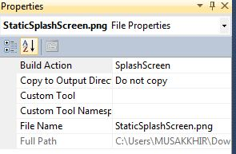
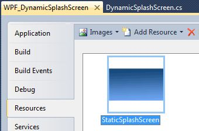

# Dynamic Splash Screen in WPF
## Requires
- Visual Studio 2012
## License
- Apache License, Version 2.0
## Technologies
- C#
- Windows Forms
- WPF
- WPF forms
## Topics
- Splash Screen
- wpf splash screen
- windows splash screen
## Updated
- 02/26/2014
## Description

<h1>Introduction</h1>

<em>This article describes creating Dynamic splash screen for WPF Application. 
</em>

<h1>Building the Sample</h1>

<em>.NET 3.5 SP1 WPF toolkit contains some implementation of splash screen. You can
</em>

<em><a href="https://wpf.codeplex.com/releases/view/14962">download</a> Here 
</em>

Description

Here there are two method to display splash screen.

I) Static and II) Daynamic

<strong>I) Static Method  
</strong>

<em>If you want to create simple flash screen then follow these steps.</em>

<em>step 1) Add Static image in your project, which you want to display as a splash screen.</em>

<em>step 2) Click on the properties of that image.</em>

<em>step 3) select <strong>Build Action</strong> as Splash Screen.</em>

<em> 
</em>

step 4) Add image in resources.

step 5) Press F5 or run your project.

This is the easiest way to create splash screen.

<strong>II) Dynamic Method</strong>

Create dynamic Flash Screen. which display the following information.

1) Loading Initial Data.

2) Plugin Information.

3) Software Version info.

4) Message

Replace first image &quot;<strong>StaticSplashScreen.png</strong>&quot; with your <strong>
Logo</strong>.

1) Create Startup Folder in your project and add static Splash Image, Dynamic Splash Class File and Static Flash Screen.

You can define animation and progress bar on splash Screen Window.

The DynamicSplashScreen.cs which require the namespace,

C#

Edit|Remove

csharp

<pre class="csharp">using&nbsp;<a class="libraryLink" href="http://msdn.microsoft.com/en-US/library/System.Windows.Media.aspx" target="_blank" title="Auto generated link to System.Windows.Media">System.Windows.Media</a>;&nbsp;
using&nbsp;<a class="libraryLink" href="http://msdn.microsoft.com/en-US/library/System.Windows.Media.Imaging.aspx" target="_blank" title="Auto generated link to System.Windows.Media.Imaging">System.Windows.Media.Imaging</a>;</pre>

<h1>

C#

Edit|Remove

csharp

<pre class="csharp">public&nbsp;class&nbsp;DynamicSplashScreen:Window&nbsp;
{&nbsp;
&nbsp;&nbsp;&nbsp;&nbsp;public&nbsp;DynamicSplashScreen()&nbsp;
&nbsp;&nbsp;&nbsp;&nbsp;{&nbsp;
&nbsp;&nbsp;&nbsp;&nbsp;&nbsp;&nbsp;&nbsp;&nbsp;this.ShowInTaskbar&nbsp;=&nbsp;false;&nbsp;
&nbsp;&nbsp;&nbsp;&nbsp;&nbsp;&nbsp;&nbsp;&nbsp;this.WindowStartupLocation&nbsp;=&nbsp;WindowStartupLocation.Manual;&nbsp;
&nbsp;&nbsp;&nbsp;&nbsp;&nbsp;&nbsp;&nbsp;&nbsp;this.ResizeMode&nbsp;=&nbsp;ResizeMode.NoResize;&nbsp;
&nbsp;&nbsp;&nbsp;&nbsp;&nbsp;&nbsp;&nbsp;&nbsp;this.WindowStyle&nbsp;=&nbsp;WindowStyle.None;&nbsp;
&nbsp;&nbsp;&nbsp;&nbsp;&nbsp;&nbsp;&nbsp;&nbsp;this.Topmost&nbsp;=&nbsp;true;&nbsp;
&nbsp;&nbsp;&nbsp;&nbsp;&nbsp;&nbsp;&nbsp;&nbsp;this.Loaded&nbsp;&#43;=&nbsp;OnLoaded;&nbsp;
&nbsp;&nbsp;&nbsp;&nbsp;}&nbsp;
&nbsp;&nbsp;&nbsp;&nbsp;private&nbsp;void&nbsp;OnLoaded(object&nbsp;sender,&nbsp;RoutedEventArgs&nbsp;e)&nbsp;
&nbsp;&nbsp;&nbsp;&nbsp;{&nbsp;
&nbsp;&nbsp;&nbsp;&nbsp;&nbsp;&nbsp;&nbsp;&nbsp;//calculate&nbsp;it&nbsp;manually&nbsp;since&nbsp;CenterScreen&nbsp;substracts&nbsp;taskbar&nbsp;height&nbsp;from&nbsp;available&nbsp;area&nbsp;
&nbsp;&nbsp;&nbsp;&nbsp;&nbsp;&nbsp;&nbsp;&nbsp;this.Left&nbsp;=&nbsp;(SystemParameters.PrimaryScreenWidth&nbsp;-&nbsp;this.Width)&nbsp;/&nbsp;2;&nbsp;
&nbsp;&nbsp;&nbsp;&nbsp;&nbsp;&nbsp;&nbsp;&nbsp;this.Top&nbsp;=&nbsp;(SystemParameters.PrimaryScreenHeight&nbsp;-&nbsp;this.Height)&nbsp;/&nbsp;2;&nbsp;
&nbsp;&nbsp;&nbsp;&nbsp;}&nbsp;
&nbsp;&nbsp;&nbsp;&nbsp;//....&nbsp;see&nbsp;implementaion&nbsp;above&nbsp;..&nbsp;
&nbsp;&nbsp;&nbsp;&nbsp;public&nbsp;void&nbsp;Capture(string&nbsp;filePath)&nbsp;
&nbsp;&nbsp;&nbsp;&nbsp;{&nbsp;
&nbsp;&nbsp;&nbsp;&nbsp;&nbsp;&nbsp;&nbsp;&nbsp;this.Capture(filePath,&nbsp;new&nbsp;PngBitmapEncoder());&nbsp;
&nbsp;&nbsp;&nbsp;&nbsp;}&nbsp;
&nbsp;&nbsp;&nbsp;&nbsp;public&nbsp;void&nbsp;Capture(string&nbsp;filePath,&nbsp;BitmapEncoder&nbsp;encoder)&nbsp;
&nbsp;&nbsp;&nbsp;&nbsp;{&nbsp;
&nbsp;&nbsp;&nbsp;&nbsp;&nbsp;&nbsp;&nbsp;&nbsp;RenderTargetBitmap&nbsp;bmp&nbsp;=&nbsp;new&nbsp;RenderTargetBitmap((int)this.Width,&nbsp;(int)this.Height,&nbsp;96,&nbsp;96,&nbsp;PixelFormats.Pbgra32);&nbsp;
&nbsp;&nbsp;&nbsp;&nbsp;&nbsp;&nbsp;&nbsp;&nbsp;bmp.Render(this);&nbsp;
&nbsp;&nbsp;&nbsp;&nbsp;&nbsp;&nbsp;&nbsp;&nbsp;encoder.Frames.Add(BitmapFrame.Create(bmp));&nbsp;
&nbsp;&nbsp;&nbsp;&nbsp;&nbsp;&nbsp;&nbsp;&nbsp;using&nbsp;(Stream&nbsp;stm&nbsp;=&nbsp;File.Create(filePath))&nbsp;
&nbsp;&nbsp;&nbsp;&nbsp;&nbsp;&nbsp;&nbsp;&nbsp;{&nbsp;
&nbsp;&nbsp;&nbsp;&nbsp;&nbsp;&nbsp;&nbsp;&nbsp;&nbsp;&nbsp;&nbsp;&nbsp;encoder.Save(stm);&nbsp;
&nbsp;&nbsp;&nbsp;&nbsp;&nbsp;&nbsp;&nbsp;&nbsp;}&nbsp;
&nbsp;&nbsp;&nbsp;&nbsp;}&nbsp;
}</pre>

<em></em> 
Source Code Files</h1>
<ul>
<li><em>source code file name #1 - summary for this source code file.</em> </li><li><em><em>source code file name #2 - summary for this source code file.</em></em>
</li></ul>
<h1>More Information</h1>

<em>For more information on X, see ...?</em>

