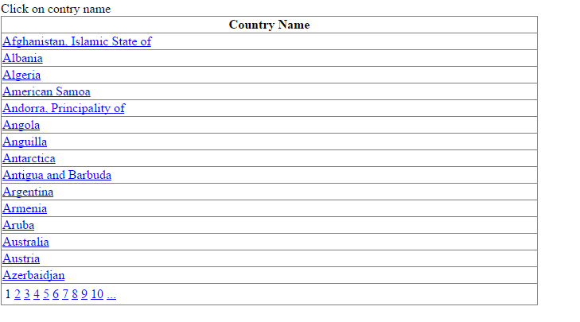
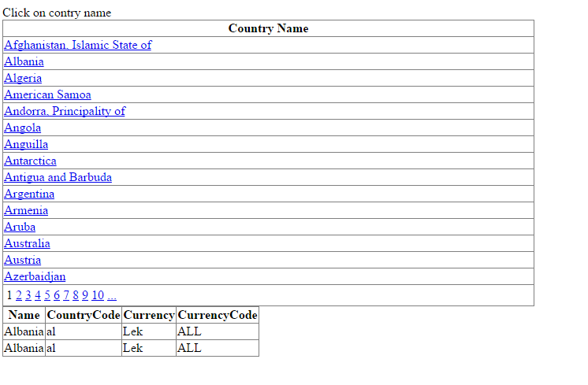

# Dynamic web service call
## Requires
- Visual Studio 2013
## License
- MIT
## Technologies
- ASP.NET
- Web Services
- ASMX web services
- WSDL
## Topics
- Web Services
- WSDL
- dynamic webservices
## Updated
- 03/14/2016
## Description

<h1>Introduction</h1>

Generally when we use web service, at first we should add it in the web reference and then call its methods statically. Despite&nbsp;having a high speed, it isn't very flexible.

In order to do it dynamically by dynamic invocation of&nbsp;web service, it has a very good flexibility. For example, the source of programs will be compiled once.

&nbsp;

<h1>Building the Sample</h1>

<em>open Solution</em>

<em>Buik F5 and Run</em>

Description

Instead of using pre-generated assemblies, perhaps you want to generate the assembly on the fly and invoke it.&nbsp; In other words, instead of right-clicking and using the &ldquo;Add Web Reference&rdquo; dialog or using WSDL.exe to create a proxy, perhaps
 you want to point your code at a URL and invoke a method without previously creating a proxy.&nbsp;

We can use any web service that we need. We can watch all of the web service's methods and parameters, automatic assignment methods and parameters.

One of the communication ways with web service is setup. Giving the information about web service will be done through WSDL file. To do this work, we should produce a&nbsp;<code>WebRequest&nbsp;</code>and send it to the WSDL. All activities
 about the parts are done by&nbsp;<code>WebRequest</code>.

Here in this example i have used wsdl url 

http://www.webservicex.net/country.asmx?WSDL

and use two methods

1) GetCountries &nbsp; -which return country list .and i have bind in grid

2) GetCurrencyByCountry&nbsp; &nbsp;-which return contry data from webservice and i have bind this detail in second grid.

&nbsp;

&nbsp;

C#

Edit|Remove

csharp
<pre class="hidden">using System;
using System.Collections.Generic;
using System.Linq;
using System.Net;
using System.Web;
using System.Web.UI;
using System.Web.UI.WebControls;

using System.IO;

using System.CodeDom;
using System.CodeDom.Compiler;

using System.Web.Services.Description;
using System.Web.Services.Protocols;
using System.Reflection;
using System.Data;
using System.Xml;

public partial class _Default : System.Web.UI.Page
{
    protected void Page_Load(object sender, EventArgs e)
    {
        Webservicecall(&quot;&quot;);
    }

    private void Webservicecall(string contryname)
    {

        WebRequest webRequest = WebRequest.Create(&quot;http://www.webservicex.net/country.asmx?WSDL&quot;);
        WebResponse webResponse = webRequest.GetResponse();
        // Stream stream = webResponse.GetResponseStream();
        ServiceDescription description = new ServiceDescription();
        using (Stream stream = webResponse.GetResponseStream())
        {
            description = ServiceDescription.Read(stream);
        }
        ServiceDescriptionImporter importer = new ServiceDescriptionImporter();

        importer.ProtocolName = &quot;Soap12&quot;;//' Use SOAP 1.2.
        importer.AddServiceDescription(description, null, null);
        importer.Style = ServiceDescriptionImportStyle.Client;

        //'--Generate properties to represent primitive values.
        importer.CodeGenerationOptions = System.Xml.Serialization.CodeGenerationOptions.GenerateProperties;
        //'Initialize a Code-DOM tree into which we will import the service.

        CodeNamespace nmspace = new CodeNamespace();
        CodeCompileUnit unit1 = new CodeCompileUnit();
        unit1.Namespaces.Add(nmspace);
        ServiceDescriptionImportWarnings warning = importer.Import(nmspace, unit1);
        CodeDomProvider provider1 = CodeDomProvider.CreateProvider(&quot;C#&quot;);

        //'--Compile the assembly proxy with the // appropriate references
        String[] assemblyReferences;
        assemblyReferences = new String[] { &quot;System.dll&quot;, &quot;System.Web.Services.dll&quot;, &quot;System.Web.dll&quot;, &quot;System.Xml.dll&quot;, &quot;System.Data.dll&quot; };

        CompilerParameters parms = new CompilerParameters(assemblyReferences);
        parms.GenerateInMemory = true;
        CompilerResults results = provider1.CompileAssemblyFromDom(parms, unit1);
        if (results.Errors.Count &gt; 0)
        {
        }

        Type foundType = null;
        Type[] types = results.CompiledAssembly.GetTypes();
        foreach (Type type1 in types)
        {
            if (type1.BaseType == typeof(SoapHttpClientProtocol))
            {
                foundType = type1;
            }
        }

        if (!String.IsNullOrEmpty(contryname))
        {
            Object[] args = new Object[1];
            args[0] = contryname;
            Object wsvcClass = results.CompiledAssembly.CreateInstance(foundType.ToString());
            MethodInfo mi = wsvcClass.GetType().GetMethod(&quot;GetCurrencyByCountry&quot;);
            var returnValue = mi.Invoke(wsvcClass, args);
            DataSet ds = new DataSet();
            grdcountrydata.DataSource = ConvertXMLToDataSet(returnValue.ToString());
            grdcountrydata.DataBind();
        }
        else
        {
            Object wsvcClass = results.CompiledAssembly.CreateInstance(foundType.ToString());
            MethodInfo mi = wsvcClass.GetType().GetMethod(&quot;GetCountries&quot;);
            var returnValue = mi.Invoke(wsvcClass,null);
            DataSet ds = new DataSet();
            grdcountry.DataSource = ConvertXMLToDataSet(returnValue.ToString());
            grdcountry.DataBind();
        }

    }

    public DataSet ConvertXMLToDataSet(string xmlData)
    {
        StringReader stream = null;
        XmlTextReader reader = null;
        try
        {
            DataSet xmlDS = new DataSet();
            stream = new StringReader(xmlData);
            // Load the XmlTextReader from the stream
            reader = new XmlTextReader(stream);
            xmlDS.ReadXml(reader);
            return xmlDS;
        }
        catch
        {
            return null;
        }
        finally
        {
            if (reader != null) reader.Close();
        }
    }
    protected void grdcountry_PageIndexChanging(object sender, GridViewPageEventArgs e)
    {
        Webservicecall(&quot;&quot;);
        grdcountry.PageIndex = e.NewPageIndex;
        grdcountry.DataBind();
    }
    protected void grdcountry_RowCommand(object sender, GridViewCommandEventArgs e)
    {
        if (e.CommandName.Equals(&quot;Loaddata&quot;))
        {
            Webservicecall(e.CommandArgument.ToString());
        }
    }
}</pre>

<pre class="csharp">using&nbsp;System;&nbsp;
using&nbsp;System.Collections.Generic;&nbsp;
using&nbsp;System.Linq;&nbsp;
using&nbsp;System.Net;&nbsp;
using&nbsp;System.Web;&nbsp;
using&nbsp;System.Web.UI;&nbsp;
using&nbsp;System.Web.UI.WebControls;&nbsp;
&nbsp;
using&nbsp;System.IO;&nbsp;
&nbsp;
using&nbsp;System.CodeDom;&nbsp;
using&nbsp;System.CodeDom.Compiler;&nbsp;
&nbsp;
using&nbsp;System.Web.Services.Description;&nbsp;
using&nbsp;System.Web.Services.Protocols;&nbsp;
using&nbsp;System.Reflection;&nbsp;
using&nbsp;System.Data;&nbsp;
using&nbsp;System.Xml;&nbsp;
&nbsp;
public&nbsp;partial&nbsp;class&nbsp;_Default&nbsp;:&nbsp;System.Web.UI.Page&nbsp;
{&nbsp;
&nbsp;&nbsp;&nbsp;&nbsp;protected&nbsp;void&nbsp;Page_Load(object&nbsp;sender,&nbsp;EventArgs&nbsp;e)&nbsp;
&nbsp;&nbsp;&nbsp;&nbsp;{&nbsp;
&nbsp;&nbsp;&nbsp;&nbsp;&nbsp;&nbsp;&nbsp;&nbsp;Webservicecall(&quot;&quot;);&nbsp;
&nbsp;&nbsp;&nbsp;&nbsp;}&nbsp;
&nbsp;
&nbsp;
&nbsp;&nbsp;&nbsp;&nbsp;private&nbsp;void&nbsp;Webservicecall(string&nbsp;contryname)&nbsp;
&nbsp;&nbsp;&nbsp;&nbsp;{&nbsp;
&nbsp;
&nbsp;&nbsp;&nbsp;&nbsp;&nbsp;&nbsp;&nbsp;&nbsp;WebRequest&nbsp;webRequest&nbsp;=&nbsp;WebRequest.Create(&quot;http://www.webservicex.net/country.asmx?WSDL&quot;);&nbsp;
&nbsp;&nbsp;&nbsp;&nbsp;&nbsp;&nbsp;&nbsp;&nbsp;WebResponse&nbsp;webResponse&nbsp;=&nbsp;webRequest.GetResponse();&nbsp;
&nbsp;&nbsp;&nbsp;&nbsp;&nbsp;&nbsp;&nbsp;&nbsp;//&nbsp;Stream&nbsp;stream&nbsp;=&nbsp;webResponse.GetResponseStream();&nbsp;
&nbsp;&nbsp;&nbsp;&nbsp;&nbsp;&nbsp;&nbsp;&nbsp;ServiceDescription&nbsp;description&nbsp;=&nbsp;new&nbsp;ServiceDescription();&nbsp;
&nbsp;&nbsp;&nbsp;&nbsp;&nbsp;&nbsp;&nbsp;&nbsp;using&nbsp;(Stream&nbsp;stream&nbsp;=&nbsp;webResponse.GetResponseStream())&nbsp;
&nbsp;&nbsp;&nbsp;&nbsp;&nbsp;&nbsp;&nbsp;&nbsp;{&nbsp;
&nbsp;&nbsp;&nbsp;&nbsp;&nbsp;&nbsp;&nbsp;&nbsp;&nbsp;&nbsp;&nbsp;&nbsp;description&nbsp;=&nbsp;ServiceDescription.Read(stream);&nbsp;
&nbsp;&nbsp;&nbsp;&nbsp;&nbsp;&nbsp;&nbsp;&nbsp;}&nbsp;
&nbsp;&nbsp;&nbsp;&nbsp;&nbsp;&nbsp;&nbsp;&nbsp;ServiceDescriptionImporter&nbsp;importer&nbsp;=&nbsp;new&nbsp;ServiceDescriptionImporter();&nbsp;
&nbsp;
&nbsp;
&nbsp;&nbsp;&nbsp;&nbsp;&nbsp;&nbsp;&nbsp;&nbsp;importer.ProtocolName&nbsp;=&nbsp;&quot;Soap12&quot;;//'&nbsp;Use&nbsp;SOAP&nbsp;1.2.&nbsp;
&nbsp;&nbsp;&nbsp;&nbsp;&nbsp;&nbsp;&nbsp;&nbsp;importer.AddServiceDescription(description,&nbsp;null,&nbsp;null);&nbsp;
&nbsp;&nbsp;&nbsp;&nbsp;&nbsp;&nbsp;&nbsp;&nbsp;importer.Style&nbsp;=&nbsp;ServiceDescriptionImportStyle.Client;&nbsp;
&nbsp;
&nbsp;&nbsp;&nbsp;&nbsp;&nbsp;&nbsp;&nbsp;&nbsp;//'--Generate&nbsp;properties&nbsp;to&nbsp;represent&nbsp;primitive&nbsp;values.&nbsp;
&nbsp;&nbsp;&nbsp;&nbsp;&nbsp;&nbsp;&nbsp;&nbsp;importer.CodeGenerationOptions&nbsp;=&nbsp;System.Xml.Serialization.CodeGenerationOptions.GenerateProperties;&nbsp;
&nbsp;&nbsp;&nbsp;&nbsp;&nbsp;&nbsp;&nbsp;&nbsp;//'Initialize&nbsp;a&nbsp;Code-DOM&nbsp;tree&nbsp;into&nbsp;which&nbsp;we&nbsp;will&nbsp;import&nbsp;the&nbsp;service.&nbsp;
&nbsp;
&nbsp;&nbsp;&nbsp;&nbsp;&nbsp;&nbsp;&nbsp;&nbsp;CodeNamespace&nbsp;nmspace&nbsp;=&nbsp;new&nbsp;CodeNamespace();&nbsp;
&nbsp;&nbsp;&nbsp;&nbsp;&nbsp;&nbsp;&nbsp;&nbsp;CodeCompileUnit&nbsp;unit1&nbsp;=&nbsp;new&nbsp;CodeCompileUnit();&nbsp;
&nbsp;&nbsp;&nbsp;&nbsp;&nbsp;&nbsp;&nbsp;&nbsp;unit1.Namespaces.Add(nmspace);&nbsp;
&nbsp;&nbsp;&nbsp;&nbsp;&nbsp;&nbsp;&nbsp;&nbsp;ServiceDescriptionImportWarnings&nbsp;warning&nbsp;=&nbsp;importer.Import(nmspace,&nbsp;unit1);&nbsp;
&nbsp;&nbsp;&nbsp;&nbsp;&nbsp;&nbsp;&nbsp;&nbsp;CodeDomProvider&nbsp;provider1&nbsp;=&nbsp;CodeDomProvider.CreateProvider(&quot;C#&quot;);&nbsp;
&nbsp;
&nbsp;&nbsp;&nbsp;&nbsp;&nbsp;&nbsp;&nbsp;&nbsp;//'--Compile&nbsp;the&nbsp;assembly&nbsp;proxy&nbsp;with&nbsp;the&nbsp;//&nbsp;appropriate&nbsp;references&nbsp;
&nbsp;&nbsp;&nbsp;&nbsp;&nbsp;&nbsp;&nbsp;&nbsp;String[]&nbsp;assemblyReferences;&nbsp;
&nbsp;&nbsp;&nbsp;&nbsp;&nbsp;&nbsp;&nbsp;&nbsp;assemblyReferences&nbsp;=&nbsp;new&nbsp;String[]&nbsp;{&nbsp;&quot;System.dll&quot;,&nbsp;&quot;System.Web.Services.dll&quot;,&nbsp;&quot;System.Web.dll&quot;,&nbsp;&quot;System.Xml.dll&quot;,&nbsp;&quot;System.Data.dll&quot;&nbsp;};&nbsp;
&nbsp;
&nbsp;&nbsp;&nbsp;&nbsp;&nbsp;&nbsp;&nbsp;&nbsp;CompilerParameters&nbsp;parms&nbsp;=&nbsp;new&nbsp;CompilerParameters(assemblyReferences);&nbsp;
&nbsp;&nbsp;&nbsp;&nbsp;&nbsp;&nbsp;&nbsp;&nbsp;parms.GenerateInMemory&nbsp;=&nbsp;true;&nbsp;
&nbsp;&nbsp;&nbsp;&nbsp;&nbsp;&nbsp;&nbsp;&nbsp;CompilerResults&nbsp;results&nbsp;=&nbsp;provider1.CompileAssemblyFromDom(parms,&nbsp;unit1);&nbsp;
&nbsp;&nbsp;&nbsp;&nbsp;&nbsp;&nbsp;&nbsp;&nbsp;if&nbsp;(results.Errors.Count&nbsp;&gt;&nbsp;0)&nbsp;
&nbsp;&nbsp;&nbsp;&nbsp;&nbsp;&nbsp;&nbsp;&nbsp;{&nbsp;
&nbsp;&nbsp;&nbsp;&nbsp;&nbsp;&nbsp;&nbsp;&nbsp;}&nbsp;
&nbsp;
&nbsp;
&nbsp;&nbsp;&nbsp;&nbsp;&nbsp;&nbsp;&nbsp;&nbsp;Type&nbsp;foundType&nbsp;=&nbsp;null;&nbsp;
&nbsp;&nbsp;&nbsp;&nbsp;&nbsp;&nbsp;&nbsp;&nbsp;Type[]&nbsp;types&nbsp;=&nbsp;results.CompiledAssembly.GetTypes();&nbsp;
&nbsp;&nbsp;&nbsp;&nbsp;&nbsp;&nbsp;&nbsp;&nbsp;foreach&nbsp;(Type&nbsp;type1&nbsp;in&nbsp;types)&nbsp;
&nbsp;&nbsp;&nbsp;&nbsp;&nbsp;&nbsp;&nbsp;&nbsp;{&nbsp;
&nbsp;&nbsp;&nbsp;&nbsp;&nbsp;&nbsp;&nbsp;&nbsp;&nbsp;&nbsp;&nbsp;&nbsp;if&nbsp;(type1.BaseType&nbsp;==&nbsp;typeof(SoapHttpClientProtocol))&nbsp;
&nbsp;&nbsp;&nbsp;&nbsp;&nbsp;&nbsp;&nbsp;&nbsp;&nbsp;&nbsp;&nbsp;&nbsp;{&nbsp;
&nbsp;&nbsp;&nbsp;&nbsp;&nbsp;&nbsp;&nbsp;&nbsp;&nbsp;&nbsp;&nbsp;&nbsp;&nbsp;&nbsp;&nbsp;&nbsp;foundType&nbsp;=&nbsp;type1;&nbsp;
&nbsp;&nbsp;&nbsp;&nbsp;&nbsp;&nbsp;&nbsp;&nbsp;&nbsp;&nbsp;&nbsp;&nbsp;}&nbsp;
&nbsp;&nbsp;&nbsp;&nbsp;&nbsp;&nbsp;&nbsp;&nbsp;}&nbsp;
&nbsp;
&nbsp;
&nbsp;&nbsp;&nbsp;&nbsp;&nbsp;&nbsp;&nbsp;&nbsp;if&nbsp;(!String.IsNullOrEmpty(contryname))&nbsp;
&nbsp;&nbsp;&nbsp;&nbsp;&nbsp;&nbsp;&nbsp;&nbsp;{&nbsp;
&nbsp;&nbsp;&nbsp;&nbsp;&nbsp;&nbsp;&nbsp;&nbsp;&nbsp;&nbsp;&nbsp;&nbsp;Object[]&nbsp;args&nbsp;=&nbsp;new&nbsp;Object[1];&nbsp;
&nbsp;&nbsp;&nbsp;&nbsp;&nbsp;&nbsp;&nbsp;&nbsp;&nbsp;&nbsp;&nbsp;&nbsp;args[0]&nbsp;=&nbsp;contryname;&nbsp;
&nbsp;&nbsp;&nbsp;&nbsp;&nbsp;&nbsp;&nbsp;&nbsp;&nbsp;&nbsp;&nbsp;&nbsp;Object&nbsp;wsvcClass&nbsp;=&nbsp;results.CompiledAssembly.CreateInstance(foundType.ToString());&nbsp;
&nbsp;&nbsp;&nbsp;&nbsp;&nbsp;&nbsp;&nbsp;&nbsp;&nbsp;&nbsp;&nbsp;&nbsp;MethodInfo&nbsp;mi&nbsp;=&nbsp;wsvcClass.GetType().GetMethod(&quot;GetCurrencyByCountry&quot;);&nbsp;
&nbsp;&nbsp;&nbsp;&nbsp;&nbsp;&nbsp;&nbsp;&nbsp;&nbsp;&nbsp;&nbsp;&nbsp;var&nbsp;returnValue&nbsp;=&nbsp;mi.Invoke(wsvcClass,&nbsp;args);&nbsp;
&nbsp;&nbsp;&nbsp;&nbsp;&nbsp;&nbsp;&nbsp;&nbsp;&nbsp;&nbsp;&nbsp;&nbsp;DataSet&nbsp;ds&nbsp;=&nbsp;new&nbsp;DataSet();&nbsp;
&nbsp;&nbsp;&nbsp;&nbsp;&nbsp;&nbsp;&nbsp;&nbsp;&nbsp;&nbsp;&nbsp;&nbsp;grdcountrydata.DataSource&nbsp;=&nbsp;ConvertXMLToDataSet(returnValue.ToString());&nbsp;
&nbsp;&nbsp;&nbsp;&nbsp;&nbsp;&nbsp;&nbsp;&nbsp;&nbsp;&nbsp;&nbsp;&nbsp;grdcountrydata.DataBind();&nbsp;
&nbsp;&nbsp;&nbsp;&nbsp;&nbsp;&nbsp;&nbsp;&nbsp;}&nbsp;
&nbsp;&nbsp;&nbsp;&nbsp;&nbsp;&nbsp;&nbsp;&nbsp;else&nbsp;
&nbsp;&nbsp;&nbsp;&nbsp;&nbsp;&nbsp;&nbsp;&nbsp;{&nbsp;
&nbsp;&nbsp;&nbsp;&nbsp;&nbsp;&nbsp;&nbsp;&nbsp;&nbsp;&nbsp;&nbsp;&nbsp;Object&nbsp;wsvcClass&nbsp;=&nbsp;results.CompiledAssembly.CreateInstance(foundType.ToString());&nbsp;
&nbsp;&nbsp;&nbsp;&nbsp;&nbsp;&nbsp;&nbsp;&nbsp;&nbsp;&nbsp;&nbsp;&nbsp;MethodInfo&nbsp;mi&nbsp;=&nbsp;wsvcClass.GetType().GetMethod(&quot;GetCountries&quot;);&nbsp;
&nbsp;&nbsp;&nbsp;&nbsp;&nbsp;&nbsp;&nbsp;&nbsp;&nbsp;&nbsp;&nbsp;&nbsp;var&nbsp;returnValue&nbsp;=&nbsp;mi.Invoke(wsvcClass,null);&nbsp;
&nbsp;&nbsp;&nbsp;&nbsp;&nbsp;&nbsp;&nbsp;&nbsp;&nbsp;&nbsp;&nbsp;&nbsp;DataSet&nbsp;ds&nbsp;=&nbsp;new&nbsp;DataSet();&nbsp;
&nbsp;&nbsp;&nbsp;&nbsp;&nbsp;&nbsp;&nbsp;&nbsp;&nbsp;&nbsp;&nbsp;&nbsp;grdcountry.DataSource&nbsp;=&nbsp;ConvertXMLToDataSet(returnValue.ToString());&nbsp;
&nbsp;&nbsp;&nbsp;&nbsp;&nbsp;&nbsp;&nbsp;&nbsp;&nbsp;&nbsp;&nbsp;&nbsp;grdcountry.DataBind();&nbsp;
&nbsp;&nbsp;&nbsp;&nbsp;&nbsp;&nbsp;&nbsp;&nbsp;}&nbsp;
&nbsp;
&nbsp;
&nbsp;
&nbsp;
&nbsp;
&nbsp;&nbsp;&nbsp;&nbsp;}&nbsp;
&nbsp;
&nbsp;&nbsp;&nbsp;&nbsp;public&nbsp;DataSet&nbsp;ConvertXMLToDataSet(string&nbsp;xmlData)&nbsp;
&nbsp;&nbsp;&nbsp;&nbsp;{&nbsp;
&nbsp;&nbsp;&nbsp;&nbsp;&nbsp;&nbsp;&nbsp;&nbsp;StringReader&nbsp;stream&nbsp;=&nbsp;null;&nbsp;
&nbsp;&nbsp;&nbsp;&nbsp;&nbsp;&nbsp;&nbsp;&nbsp;XmlTextReader&nbsp;reader&nbsp;=&nbsp;null;&nbsp;
&nbsp;&nbsp;&nbsp;&nbsp;&nbsp;&nbsp;&nbsp;&nbsp;try&nbsp;
&nbsp;&nbsp;&nbsp;&nbsp;&nbsp;&nbsp;&nbsp;&nbsp;{&nbsp;
&nbsp;&nbsp;&nbsp;&nbsp;&nbsp;&nbsp;&nbsp;&nbsp;&nbsp;&nbsp;&nbsp;&nbsp;DataSet&nbsp;xmlDS&nbsp;=&nbsp;new&nbsp;DataSet();&nbsp;
&nbsp;&nbsp;&nbsp;&nbsp;&nbsp;&nbsp;&nbsp;&nbsp;&nbsp;&nbsp;&nbsp;&nbsp;stream&nbsp;=&nbsp;new&nbsp;StringReader(xmlData);&nbsp;
&nbsp;&nbsp;&nbsp;&nbsp;&nbsp;&nbsp;&nbsp;&nbsp;&nbsp;&nbsp;&nbsp;&nbsp;//&nbsp;Load&nbsp;the&nbsp;XmlTextReader&nbsp;from&nbsp;the&nbsp;stream&nbsp;
&nbsp;&nbsp;&nbsp;&nbsp;&nbsp;&nbsp;&nbsp;&nbsp;&nbsp;&nbsp;&nbsp;&nbsp;reader&nbsp;=&nbsp;new&nbsp;XmlTextReader(stream);&nbsp;
&nbsp;&nbsp;&nbsp;&nbsp;&nbsp;&nbsp;&nbsp;&nbsp;&nbsp;&nbsp;&nbsp;&nbsp;xmlDS.ReadXml(reader);&nbsp;
&nbsp;&nbsp;&nbsp;&nbsp;&nbsp;&nbsp;&nbsp;&nbsp;&nbsp;&nbsp;&nbsp;&nbsp;return&nbsp;xmlDS;&nbsp;
&nbsp;&nbsp;&nbsp;&nbsp;&nbsp;&nbsp;&nbsp;&nbsp;}&nbsp;
&nbsp;&nbsp;&nbsp;&nbsp;&nbsp;&nbsp;&nbsp;&nbsp;catch&nbsp;
&nbsp;&nbsp;&nbsp;&nbsp;&nbsp;&nbsp;&nbsp;&nbsp;{&nbsp;
&nbsp;&nbsp;&nbsp;&nbsp;&nbsp;&nbsp;&nbsp;&nbsp;&nbsp;&nbsp;&nbsp;&nbsp;return&nbsp;null;&nbsp;
&nbsp;&nbsp;&nbsp;&nbsp;&nbsp;&nbsp;&nbsp;&nbsp;}&nbsp;
&nbsp;&nbsp;&nbsp;&nbsp;&nbsp;&nbsp;&nbsp;&nbsp;finally&nbsp;
&nbsp;&nbsp;&nbsp;&nbsp;&nbsp;&nbsp;&nbsp;&nbsp;{&nbsp;
&nbsp;&nbsp;&nbsp;&nbsp;&nbsp;&nbsp;&nbsp;&nbsp;&nbsp;&nbsp;&nbsp;&nbsp;if&nbsp;(reader&nbsp;!=&nbsp;null)&nbsp;reader.Close();&nbsp;
&nbsp;&nbsp;&nbsp;&nbsp;&nbsp;&nbsp;&nbsp;&nbsp;}&nbsp;
&nbsp;&nbsp;&nbsp;&nbsp;}&nbsp;
&nbsp;&nbsp;&nbsp;&nbsp;protected&nbsp;void&nbsp;grdcountry_PageIndexChanging(object&nbsp;sender,&nbsp;GridViewPageEventArgs&nbsp;e)&nbsp;
&nbsp;&nbsp;&nbsp;&nbsp;{&nbsp;
&nbsp;&nbsp;&nbsp;&nbsp;&nbsp;&nbsp;&nbsp;&nbsp;Webservicecall(&quot;&quot;);&nbsp;
&nbsp;&nbsp;&nbsp;&nbsp;&nbsp;&nbsp;&nbsp;&nbsp;grdcountry.PageIndex&nbsp;=&nbsp;e.NewPageIndex;&nbsp;
&nbsp;&nbsp;&nbsp;&nbsp;&nbsp;&nbsp;&nbsp;&nbsp;grdcountry.DataBind();&nbsp;
&nbsp;&nbsp;&nbsp;&nbsp;}&nbsp;
&nbsp;&nbsp;&nbsp;&nbsp;protected&nbsp;void&nbsp;grdcountry_RowCommand(object&nbsp;sender,&nbsp;GridViewCommandEventArgs&nbsp;e)&nbsp;
&nbsp;&nbsp;&nbsp;&nbsp;{&nbsp;
&nbsp;&nbsp;&nbsp;&nbsp;&nbsp;&nbsp;&nbsp;&nbsp;if&nbsp;(e.CommandName.Equals(&quot;Loaddata&quot;))&nbsp;
&nbsp;&nbsp;&nbsp;&nbsp;&nbsp;&nbsp;&nbsp;&nbsp;{&nbsp;
&nbsp;&nbsp;&nbsp;&nbsp;&nbsp;&nbsp;&nbsp;&nbsp;&nbsp;&nbsp;&nbsp;&nbsp;Webservicecall(e.CommandArgument.ToString());&nbsp;
&nbsp;&nbsp;&nbsp;&nbsp;&nbsp;&nbsp;&nbsp;&nbsp;}&nbsp;
&nbsp;&nbsp;&nbsp;&nbsp;}&nbsp;
}</pre>

&nbsp;

&nbsp;

&nbsp;

&nbsp;

<h1>Source Code Files</h1>
<ul>
<li><em>source code file name #1 - webform1.aspx</em> </li></ul>
<h1>More Information</h1>

<em>Refrence Link</em>

<em>https://blogs.msdn.microsoft.com/kaevans/2006/04/27/dynamically-invoking-a-web-service/ 
</em>

