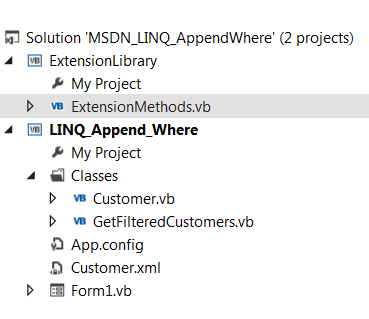

# Dynamic where conditions with LINQ/Lambda
## Requires
- Visual Studio 2012
## License
- Apache License, Version 2.0
## Technologies
- LINQ
- Lambda Expressions
## Topics
- LINQ to Objects
- Data Access
## Updated
- 08/14/2014
## Description

<h1>Description</h1>

This article show how to dynamically create multiple conditions in the where part of a LINQ statement where the key point is we don't know if the user is going to filter on just one field/column or more.&nbsp; If we knew than
 our life is easy. If you search around the Internet it appears that you can only have one where clause, no different than conventional database SQL.&nbsp;

Visual Basic

Edit|Remove

vb

<pre class="vb">Dim&nbsp;MexicoOwners&nbsp;=&nbsp;
&nbsp;&nbsp;&nbsp;&nbsp;(&nbsp;
&nbsp;&nbsp;&nbsp;&nbsp;&nbsp;&nbsp;&nbsp;&nbsp;From&nbsp;T&nbsp;In&nbsp;ResultsConventionalLinQ&nbsp;
&nbsp;&nbsp;&nbsp;&nbsp;&nbsp;&nbsp;&nbsp;&nbsp;Where&nbsp;T.ContactType&nbsp;=&nbsp;&quot;Owner&quot;&nbsp;AndAlso&nbsp;T.Country&nbsp;=&nbsp;&quot;Mexico&quot;&nbsp;
&nbsp;&nbsp;&nbsp;&nbsp;&nbsp;&nbsp;&nbsp;&nbsp;Select&nbsp;T&nbsp;
&nbsp;&nbsp;&nbsp;&nbsp;).ToList.</pre>

The next code block queries a strong typed list with two conditions in the where section. If the user only wanted to filter on one condition we could check then in an if statement use the appropriate statement. That is all well
 and good until you need to do filtering on say a handful of fields in a dynamic manner. LINQ/Lambda is not going to help in the conventional way as we are still restricted similarly are above.

&nbsp;

Visual Basic

Edit|Remove

vb

<pre class="js">Dim&nbsp;ResultsConventionalLambda&nbsp;As&nbsp;IEnumerable(Of&nbsp;Customer)&nbsp;=&nbsp;
&nbsp;&nbsp;&nbsp;&nbsp;(&nbsp;
&nbsp;&nbsp;&nbsp;&nbsp;&nbsp;&nbsp;&nbsp;&nbsp;From&nbsp;T&nbsp;In&nbsp;XDocument.Load(FileName)...&lt;Customer&gt;&nbsp;
&nbsp;&nbsp;&nbsp;&nbsp;&nbsp;&nbsp;&nbsp;&nbsp;Select&nbsp;New&nbsp;Customer&nbsp;With&nbsp;
&nbsp;&nbsp;&nbsp;&nbsp;&nbsp;&nbsp;&nbsp;&nbsp;&nbsp;&nbsp;&nbsp;&nbsp;&nbsp;&nbsp;&nbsp;{&nbsp;
&nbsp;&nbsp;&nbsp;&nbsp;&nbsp;&nbsp;&nbsp;&nbsp;&nbsp;&nbsp;&nbsp;&nbsp;&nbsp;&nbsp;&nbsp;&nbsp;&nbsp;&nbsp;&nbsp;.Identifier&nbsp;=&nbsp;T.&lt;CustomerID&gt;.Value,&nbsp;
&nbsp;&nbsp;&nbsp;&nbsp;&nbsp;&nbsp;&nbsp;&nbsp;&nbsp;&nbsp;&nbsp;&nbsp;&nbsp;&nbsp;&nbsp;&nbsp;&nbsp;&nbsp;&nbsp;.CompanyName&nbsp;=&nbsp;T.&lt;CompanyName&gt;.Value,&nbsp;
&nbsp;&nbsp;&nbsp;&nbsp;&nbsp;&nbsp;&nbsp;&nbsp;&nbsp;&nbsp;&nbsp;&nbsp;&nbsp;&nbsp;&nbsp;&nbsp;&nbsp;&nbsp;&nbsp;.ContactType&nbsp;=&nbsp;T.&lt;ContactTitle&gt;.Value,&nbsp;
&nbsp;&nbsp;&nbsp;&nbsp;&nbsp;&nbsp;&nbsp;&nbsp;&nbsp;&nbsp;&nbsp;&nbsp;&nbsp;&nbsp;&nbsp;&nbsp;&nbsp;&nbsp;&nbsp;.Country&nbsp;=&nbsp;T.&lt;Country&gt;.Value&nbsp;
&nbsp;&nbsp;&nbsp;&nbsp;&nbsp;&nbsp;&nbsp;&nbsp;&nbsp;&nbsp;&nbsp;&nbsp;&nbsp;&nbsp;&nbsp;}&nbsp;
&nbsp;&nbsp;&nbsp;&nbsp;).Where(&nbsp;
&nbsp;&nbsp;&nbsp;&nbsp;Function(x)&nbsp;
&nbsp;&nbsp;&nbsp;&nbsp;&nbsp;&nbsp;&nbsp;&nbsp;Return&nbsp;x.ContactType&nbsp;=&nbsp;ContactType&nbsp;AndAlso&nbsp;x.Country&nbsp;=&nbsp;Country&nbsp;
&nbsp;&nbsp;&nbsp;&nbsp;End&nbsp;Function).ToList</pre>

The solution to make additive where conditions work is extremely simple. Create a LINQ statement that selects your data. Next check which fields/columns the user wants to filter on and simple assign a Lambda statement to the
 original LINQ statement. The code block below is an excert from the attached demostration project 
 

Visual Basic

Edit|Remove

vb

<pre class="js">Dim&nbsp;Results&nbsp;As&nbsp;IEnumerable(Of&nbsp;Customer)&nbsp;=&nbsp;
&nbsp;&nbsp;&nbsp;&nbsp;(&nbsp;
&nbsp;&nbsp;&nbsp;&nbsp;&nbsp;&nbsp;&nbsp;&nbsp;From&nbsp;T&nbsp;In&nbsp;XDocument.Load(FileName)...&lt;Customer&gt;&nbsp;
&nbsp;&nbsp;&nbsp;&nbsp;&nbsp;&nbsp;&nbsp;&nbsp;Select&nbsp;New&nbsp;Customer&nbsp;With&nbsp;
&nbsp;&nbsp;&nbsp;&nbsp;&nbsp;&nbsp;&nbsp;&nbsp;&nbsp;&nbsp;&nbsp;&nbsp;&nbsp;&nbsp;&nbsp;{&nbsp;
&nbsp;&nbsp;&nbsp;&nbsp;&nbsp;&nbsp;&nbsp;&nbsp;&nbsp;&nbsp;&nbsp;&nbsp;&nbsp;&nbsp;&nbsp;&nbsp;&nbsp;&nbsp;&nbsp;.Identifier&nbsp;=&nbsp;T.&lt;CustomerID&gt;.Value,&nbsp;
&nbsp;&nbsp;&nbsp;&nbsp;&nbsp;&nbsp;&nbsp;&nbsp;&nbsp;&nbsp;&nbsp;&nbsp;&nbsp;&nbsp;&nbsp;&nbsp;&nbsp;&nbsp;&nbsp;.CompanyName&nbsp;=&nbsp;T.&lt;CompanyName&gt;.Value,&nbsp;
&nbsp;&nbsp;&nbsp;&nbsp;&nbsp;&nbsp;&nbsp;&nbsp;&nbsp;&nbsp;&nbsp;&nbsp;&nbsp;&nbsp;&nbsp;&nbsp;&nbsp;&nbsp;&nbsp;.ContactType&nbsp;=&nbsp;T.&lt;ContactTitle&gt;.Value,&nbsp;
&nbsp;&nbsp;&nbsp;&nbsp;&nbsp;&nbsp;&nbsp;&nbsp;&nbsp;&nbsp;&nbsp;&nbsp;&nbsp;&nbsp;&nbsp;&nbsp;&nbsp;&nbsp;&nbsp;.Country&nbsp;=&nbsp;T.&lt;Country&gt;.Value&nbsp;
&nbsp;&nbsp;&nbsp;&nbsp;&nbsp;&nbsp;&nbsp;&nbsp;&nbsp;&nbsp;&nbsp;&nbsp;&nbsp;&nbsp;&nbsp;}&nbsp;
&nbsp;&nbsp;&nbsp;&nbsp;&nbsp;&nbsp;&nbsp;&nbsp;&nbsp;&nbsp;&nbsp;)&nbsp;
&nbsp;
If&nbsp;Not&nbsp;CompanyName.Equals(&quot;All&quot;)&nbsp;Then&nbsp;
&nbsp;&nbsp;&nbsp;&nbsp;Results&nbsp;=&nbsp;Results.Where(Function(x)&nbsp;x.CompanyName&nbsp;=&nbsp;CompanyName)&nbsp;
End&nbsp;If&nbsp;
&nbsp;
If&nbsp;Not&nbsp;ContactType.Equals(&quot;All&quot;)&nbsp;Then&nbsp;
&nbsp;&nbsp;&nbsp;&nbsp;Results&nbsp;=&nbsp;Results.Where(Function(x)&nbsp;x.ContactType&nbsp;=&nbsp;ContactType)&nbsp;
End&nbsp;If&nbsp;
&nbsp;
If&nbsp;Not&nbsp;Country.Equals(&quot;All&quot;)&nbsp;Then&nbsp;
&nbsp;&nbsp;&nbsp;&nbsp;Results&nbsp;=&nbsp;Results.Where(Function(x)&nbsp;x.Country&nbsp;=&nbsp;Country)&nbsp;
End&nbsp;If</pre>

So I invite you to download the solution, give a quick run through of the code, build/run to see how it all works. 
 

&nbsp;

 
 
 
 

