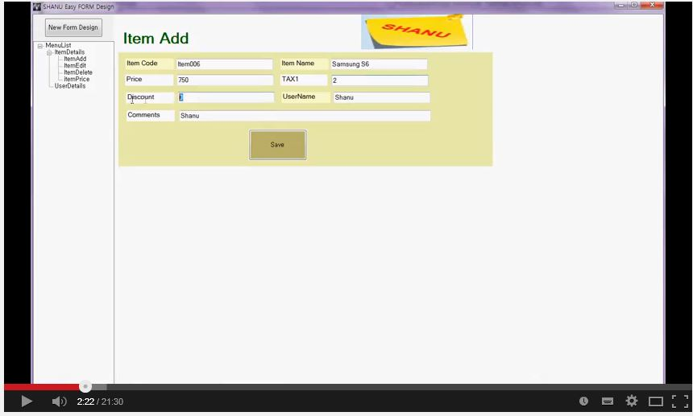
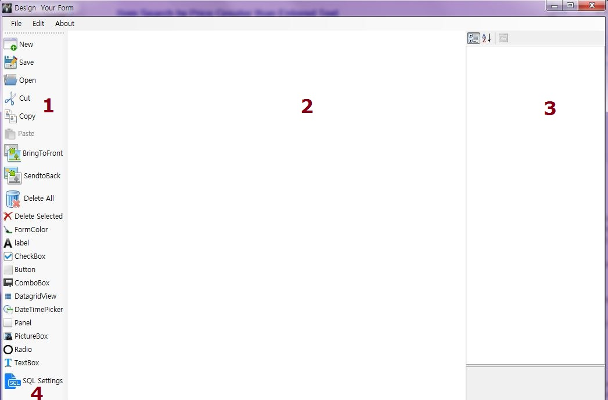
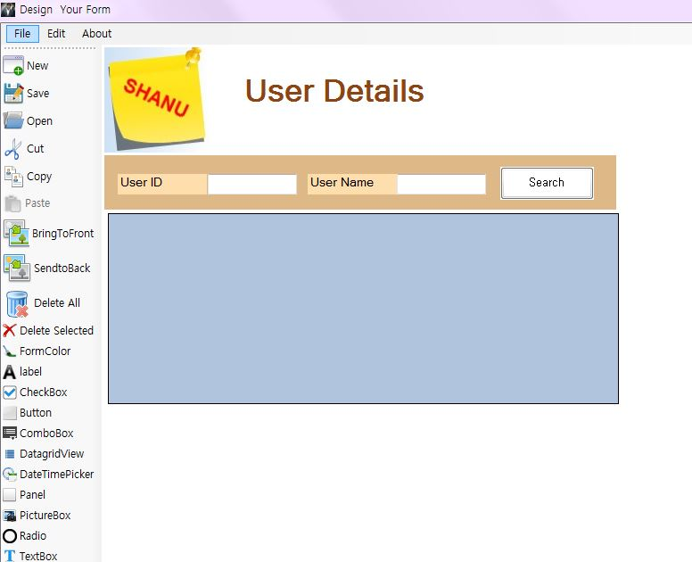
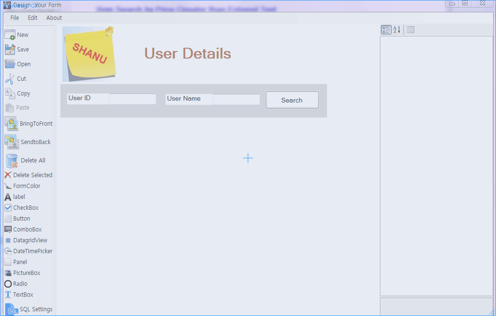
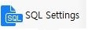
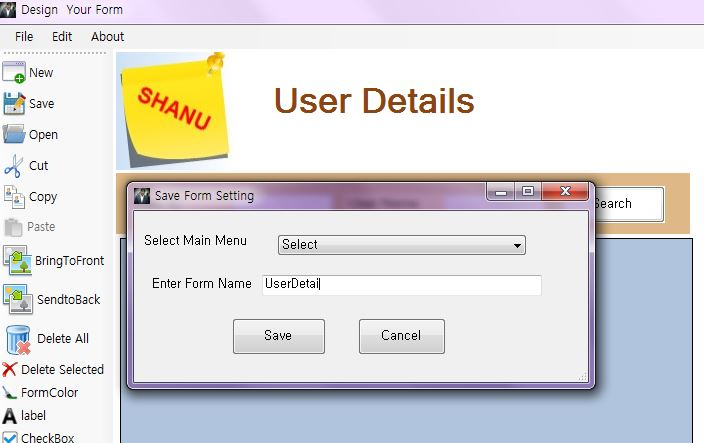
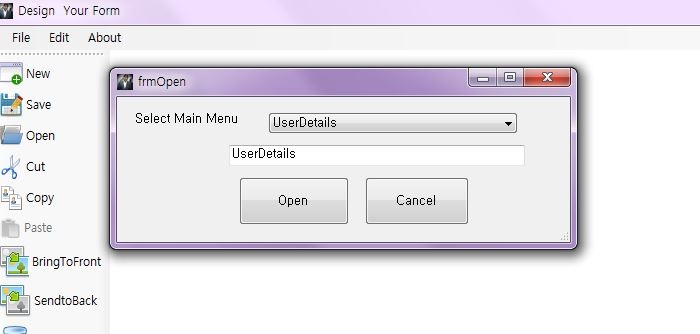

# Easy Form Design at Run Time C# Winform
## Requires
- Visual Studio 2010
## License
- MIT
## Technologies
- C#
## Topics
- C#
## Updated
- 08/22/2016
## Description

<h1>Introduction</h1>

<strong>* Kindly view my Youtube Video Link to learn
<a href="https://www.youtube.com/embed/kHtQqVAxnao" target="_blank">my Easy formDesign at Runtime</a>.
</strong>

<em></em>

<em>Design your Winform at Runtime.Perform CRUD operation to your Form at Runtime
 
with out writting any code using Stored Procedure.</em>

In my previous article&nbsp;<a href="http://www.codeproject.com/Articles/823293/Windows-Form-Design-at-Run-Time" target="_blank" style="margin:0px; padding:0px; border:0px currentColor; color:purple; text-decoration:none">(Windows Form Design at Run Time)</a>

I have explained about how to design form at runtime. I have extended the program to next advance version with more functionality. This is one of my best projects I have made. Hope you all like this. Now let&rsquo;s see what&rsquo;s new in my&nbsp;<strong style="margin:0px; padding:0px; border:0px currentColor">Easy
 Form Design @ Run Time</strong>

<strong style="margin:0px; padding:0px; border:0px currentColor">Limitation in my previous article:</strong>

In my previous article it has limitation like user needs to design and add code for events like binding grid and etc.&nbsp; 
user can load only one form. Adding parameter to SQL query is not possible.

<strong style="margin:0px; padding:0px; border:0px currentColor">New features in Easy Form Design at Run Time:</strong>

This has all my previous article features but with more new different functionality like.

1.&nbsp;&nbsp;&nbsp;&nbsp;&nbsp;&nbsp; New program has 2 part 1st&nbsp;is Form View part where user can view all there dynamically created forms by selecting Menu from the tree view.

2.&nbsp;&nbsp;&nbsp;&nbsp;&nbsp;&nbsp; 2nd&nbsp;Form Design part is to Add New/Edit/Save and Open Form dynamically.

3.&nbsp;&nbsp;&nbsp;&nbsp;&nbsp;&nbsp; User no needs to write any code.

4.&nbsp;&nbsp;&nbsp;&nbsp;&nbsp;&nbsp; Easy form design.

5.&nbsp;&nbsp;&nbsp;&nbsp;&nbsp;&nbsp; New Feature has options to select a Stored Procedure for their form.

6.&nbsp;&nbsp;&nbsp;&nbsp;&nbsp;&nbsp; User can select parameter and select dynamic textbox control for parameter, which needs to be used in SQL server Stored Procedure.

7.&nbsp;&nbsp;&nbsp;&nbsp;&nbsp;&nbsp; Save and Open Form.

The Easy Form Design at Run Time software application was developed to design your own Form using panel Control to, add Label, Button, TextBox, DataGridView and etc. User can select the Stored procedure which need to be used for the Form for example .Now user
 design there simple Search Form with a TextBox, Button and a Datagridview. For this user need to pass the Textbox as search parameter to Stored Procedure and the result need to be finally bound to Datagridview by clicking on the Button. In form design screen
 user can add a TextBox, Label, Button and DataGridView and from the Tools user can clicks on SQL Setting Tool Menu. User can select his Search Stored procedure and assign the controls to the parameter matching and finally save the form.

In main Form now user can able to view his saved Form Name in Tree view when he clicks on the menu. His saved form will be displayed .When user clicks on the button he can view all the details will be loaded from the data base using the Stored procedure which
 he or she has assign to the form. This simple C# application allows the user to add:

1.&nbsp;&nbsp;&nbsp;&nbsp;&nbsp;&nbsp; Create New Form

2.&nbsp;&nbsp;&nbsp;&nbsp;&nbsp;&nbsp; Save Form as XML file.

3.&nbsp;&nbsp;&nbsp;&nbsp;&nbsp;&nbsp; Open Form from XML file.

4.&nbsp;&nbsp;&nbsp;&nbsp;&nbsp;&nbsp; Cut, Copy, and Paste all controls.

5.&nbsp;&nbsp;&nbsp;&nbsp;&nbsp;&nbsp; Delete All Control.

6.&nbsp;&nbsp;&nbsp;&nbsp;&nbsp;&nbsp; Delete Selected Control.

7.&nbsp;&nbsp;&nbsp;&nbsp;&nbsp;&nbsp; Add/Change Back Color for Form (Here Panel used as Form).

8.&nbsp;&nbsp;&nbsp;&nbsp;&nbsp;&nbsp; Controls Bring to Front and Send to back options.

9.&nbsp;&nbsp;&nbsp;&nbsp;&nbsp;&nbsp; Add&nbsp;<strong style="margin:0px; padding:0px; border:0px currentColor">Label&nbsp;</strong>Control and using Property window design the Label.

10.&nbsp;&nbsp;&nbsp; Add&nbsp;<strong style="margin:0px; padding:0px; border:0px currentColor">Button&nbsp;</strong>Control and using Property window design the Button.

11.&nbsp;&nbsp;&nbsp; Add&nbsp;<strong style="margin:0px; padding:0px; border:0px currentColor">CheckBox&nbsp;</strong>Control and using Property window design the CheckBox..

12.&nbsp;&nbsp;&nbsp; Add&nbsp;<strong style="margin:0px; padding:0px; border:0px currentColor">Button&nbsp;</strong>Control and using Property window design the Button..

13.&nbsp;&nbsp;&nbsp; Add&nbsp;<strong style="margin:0px; padding:0px; border:0px currentColor">ComboBox&nbsp;</strong>Control and using Property window design the ComboBox.

14.&nbsp;&nbsp;&nbsp; Add&nbsp;<strong style="margin:0px; padding:0px; border:0px currentColor">DataGridView&nbsp;</strong>Control and using Property window design the DataGridView.

15.&nbsp;&nbsp;&nbsp; Add&nbsp;<strong style="margin:0px; padding:0px; border:0px currentColor">DataTimePicker&nbsp;</strong>Control and using Property window design the DataTimePicker.

16.&nbsp;&nbsp;&nbsp; Add&nbsp;<strong style="margin:0px; padding:0px; border:0px currentColor">Panel</strong>&nbsp;Control and using Property window design the ListBox.

17.&nbsp;&nbsp;&nbsp; Add&nbsp;<strong style="margin:0px; padding:0px; border:0px currentColor">PictureBox&nbsp;</strong>Control and using Property window design the PictureBox.

18.&nbsp;&nbsp;&nbsp; Add&nbsp;<strong style="margin:0px; padding:0px; border:0px currentColor">RadioButton&nbsp;</strong>Control and using Property window design the RadioButton.

19.&nbsp;&nbsp;&nbsp; Add&nbsp;<strong style="margin:0px; padding:0px; border:0px currentColor">TextBox&nbsp;</strong>Control and using Property window design the TextBox.

20.&nbsp;&nbsp;&nbsp;&nbsp;<strong style="margin:0px; padding:0px; border:0px currentColor">SQL Setting</strong>&nbsp;This is new feature in this application. Now user no needs to write any code here. You can write your Stored Procedure
 at your data base and using the&nbsp;<strong style="margin:0px; padding:0px; border:0px currentColor">SQL Setting</strong>&nbsp;tools menu, you can select your stored procedure for your form. Assign the controls property as parameter
 to the Stored Procedure.

21.&nbsp;&nbsp;&nbsp;&nbsp;<strong style="margin:0px; padding:0px; border:0px currentColor">Bind/Insert/Edit and Delete Data from database using Stored Procedure.</strong>

New Easy Form Design has 5 Parts to design your From at Runtime.

<strong style="margin:0px; padding:0px; border:0px currentColor">1st</strong>&nbsp;<strong style="margin:0px; padding:0px; border:0px currentColor">Form View part</strong>

<strong style="margin:0px; padding:0px; border:0px currentColor">2nd&nbsp;</strong><strong style="margin:0px; padding:0px; border:0px currentColor">Form</strong><strong style="margin:0px; padding:0px; border:0px currentColor">&nbsp;Design
 part</strong>

<strong style="margin:0px; padding:0px; border:0px currentColor">3rd&nbsp;SQL Stored Procedure Setting for your Form</strong>

<strong style="margin:0px; padding:0px; border:0px currentColor">4th&nbsp;Save Form</strong>

<strong style="margin:0px; padding:0px; border:0px currentColor">5th&nbsp;open Existing Form to edit.</strong>

Now let&rsquo;s see one by one in detail here.

<strong style="margin:0px; padding:0px; border:0px currentColor">Section 1st</strong>&nbsp;<strong style="margin:0px; padding:0px; border:0px currentColor">Form View part:</strong>&nbsp;In
 the below image I have pointed each part by Numbers.

1) When user clicks on &ldquo;New Form Design&rdquo; Button, Form will be open where users can Add, Edit, Open and Save Forms. We can see more detail in Form Design part.

2) In Tree view I will list all the saved Form Name. Whenever users create new Form and save. The saved filename will be listed in Treeview .When user click on Treeview Node related form will be loaded in right side.

3) Here for example we can see that, now user have clicked on &ldquo;NewItem&rdquo; from Treeview and the related form has been loaded. For this form I have selected the ItemInsert stored procedure and passed all the Textbox controls as parameter to the SP.

Here is the animated image which explains in more detail.

<strong style="margin:0px; padding:0px; border:0px currentColor">Section 2nd</strong>&nbsp;<strong style="margin:0px; padding:0px; border:0px currentColor">Form Design part:</strong>

In this Application we can see&nbsp;<strong style="margin:0px; padding:0px; border:0px currentColor">Toolbar&nbsp;</strong>at the Left which is used to add controls to Form (here our Panel).Center has a&nbsp;<strong style="margin:0px; padding:0px; border:0px currentColor">Form</strong>(Panel)
 &nbsp;where user can add and design there controls. In the Right it has&nbsp;<strong style="margin:0px; padding:0px; border:0px currentColor">Property&nbsp;</strong>window which used to add all design to selected controls..

<strong style="margin:0px; padding:0px; border:0px currentColor">Toolbar:&nbsp;</strong>Here we can see all the list of controls which can be add to form at Runtime. Other features like Create New Form, Save Form, Open Form,Cupt,Copy and Paste
 Controls .At last control you can&nbsp; see is the SQL Setting ,that is very important tool to set our form controls with Stored procedure to perform our CRUD Operations.

&nbsp;

When user click on &ldquo;New Form Design&rdquo; Button the form design will be open. You can refer the above image for how the Design form looks. This form plays the main role for creating dynamic form at runtime. Here users can Add New, Edit, Open and Save
 Forms. In the above image I have pointed each part by Numbers.

1) In the Left side we have the Tool Menu where user can add Textbox, Label, Button ,Panel, DataGridView and etc at runtime to design the form.

2) User can design their Form here at runtime. User can drag and drop controls, resize controls.

3) Using the property grid users can change the property of each selected controls BackColor, FontColor, Text and etc.

4) This is to select Stored Procedure for a Form to perform CRUD Operation and set the parameter of SP with Controls. We will see detail about this part in&nbsp;<strong style="margin:0px; padding:0px; border:0px currentColor">Section 3rd&nbsp;part.</strong>

Easy Form Design at Run Time will allow users to Design Form at Run Time, Open and Save Form and reuse the existing Form. User can add controls at Runtime from the Toolbar, Design there
 Form, Select the Stored procedure, Match and add Parameters with controls to perform some Action like Select, Insert, Update and Delete.

Now for Example user can add a DataGridView and a Button Control at Run time with Textbox for search the User by UserCode and UserName.

<strong style="margin:0px; padding:0px; border:0px currentColor">Section 3rd&nbsp;SQL Stored Procedure Setting for your Form:</strong>

After we have design our form now it&rsquo;s time to assign our Stored Procedure to our form and pass the control parameters to SP to perform CRUD Operations.

&nbsp; To set the Stored Procedure and assign parameters to SP. Click the SQL Settings menu from Tool Bar.

When user clicks on the SQL Setting a new form will be open like below. In the below image I have marked as Numbers and let&rsquo;s see each use one by one.

1)&nbsp; In the Select Procedure Combo Box I will display all the Stored Procedure names from our Database. Note in our application Bin folder we can find the &ldquo;DBConnection.txt&rdquo; text file which has the default Database Connection String, user can
 change the default Connection string as per your database server Name, Database Name, SQL User id and PWD.

2) Once the Stored Procedure for our form is selected click the Parameter Button. Here we can see, I have selected the &ldquo;USP_USER_SELECT&rdquo; which will be used in our form to search and bind the user details.

3) When we click on parameter I will display all the parameter for the selected Stored Procedure. Note everything will be as dynamic so user no needs to add any parameter here. I will list all the parameter which is declared in Stored Procedure. If user needs
 to add or delete any parameter they can update their Stored Procedure and redesign the form here.

4) Select SQL parameter one by one and click the down arrow button. When user click on the Down arrow, SQL parameter will be displayed in parameter TextBox.

5) In Control Name List, I will display all the text Box control names which needs to be assign to each SQL parameter.

6) Same here select the appropriate control for the SQL parameter and click the No 6th&nbsp;down button. The Control Name will be added to the Control textbox.

7) Once the SQL parameter and Control has been selected click the Add Button one by one to add the final SQL parameter list which needs to be saved for our Form.

8) All the SQL Parameter for the Selected Stored Procedure will be added here.

9) Confirm the list and Click Ok to save the form.

Here is the sample gif image which has an example for the User search bind.

<strong style="margin:0px; padding:0px; border:0px currentColor; color:#111111; text-transform:none; line-height:normal; text-indent:0px; letter-spacing:normal; font-family:&quot;Segoe UI&quot;,Arial,sans-serif; font-size:14px; font-style:normal; font-variant:normal; word-spacing:0px; white-space:normal; widows:1; background-color:#ffffff">Section
 4th&nbsp;Save Form</strong>

In the Toolbar user has option to save the worked Form to be viewed from the main screen. You can refer the below image, When users click on Save Toolbar button list of Main Menu names will be displayed, here all the previous saved File Name (I will be using
 the file name as Menu name to display in the main screen Treeview) .If users want to save the Form as Submenu to an existing menu then user can select the Main Menu name and enter the new Form name to save ,If user wants the Form should be as a Main Menu then
 he can select the &ldquo;Select&rdquo; from ComboBox and enter the New Form Name .Once the Form is saved.The Menu will be added with new Form Name on main screen.

Note: I will save the form as XML file. In the application root bin folder you can see 2 folders as &ldquo;XMLFILE&rdquo; and &ldquo;XMLForms&rdquo;. In &ldquo;XMLFILE&rdquo; folder you can see &ldquo;NewFormNameList.XML&rdquo; In this file; I will store all
 the File Name which will be used to list in Main Menu TreeView.

In &ldquo;XMLForms&rdquo; folder for each form you can see 2 XML files .One XML file I will used to stored the form Control details with all properties and in another XML file I will store each form Stored Procedure names with parameter details.

Here you can see a sample ItemAdd XML file which has all controls information with property like Location, Font Size, FontColor, BackColor, Image and etc.

&ldquo;ItemAdd_query.XML&rdquo; This xml file has all the details of Form Stored procedure name with parameter and Control Names.

When user enters the existing form name to save, then I will overwrite the existing form with new saved version. I will be saving the forms
as XML files.

<strong>5th open Existing Form to edit.</strong>

In the Toolbar user has option to open an existing Form for modification. You can refer the below image, When users click on Open Toolbar
button list of menu names(which is our Form Name) will be displayed, User can select their Form Name from the list which needs to be open for modification. If user knows the Form name then they can directly enter the
 Form name in textbox and click open to modify the existing form.

&nbsp;

&nbsp;

<h1>Building the Sample</h1>

<em>The
 article is extension of my previous article&nbsp;<a href="http://www.codeproject.com/Articles/823293/Windows-Form-Design-at-Run-Time" target="_blank" style="font:14px/normal &quot;Segoe UI&quot;,Arial,sans-serif; margin:0px; padding:0px; border:0px currentColor; color:purple; text-transform:none; text-indent:0px; letter-spacing:normal; text-decoration:none; word-spacing:0px; white-space:normal; widows:1; background-color:#ffffff">(Windows
 Form Design at Run Time)</a>&nbsp;.Mostly
 I have reused the same code part with few more new modification. The form design part is same like previous article refer to my previous article about adding controls at runtime and performing Drag, Drop ,resize, delete control and etc&nbsp; from my previous
 article.</em>

Description

In this code part let&rsquo;s see how to

1)&nbsp;<strong style="margin:0px; padding:0px; border:0px currentColor">Assign stored procedure to form and Add Parameter</strong>

In form design Tool Bar Button Click event I will open the new Form to perform the SP Settings.

<strong style="margin:0px; padding:0px; border:0px currentColor">Form Design SQL Setting Tool Bar Click Event</strong>

In SQL Setting Button Click I will get all the Textbox Control names from the design form and add all the control names to List and pass the Control names list to&nbsp;<code style="font:11pt/normal Consolas,&quot;Courier New&quot;,Courier,mono; margin:0px; padding:0px; border:0px currentColor; color:#990000">FrmParameterSetting</code>.

&nbsp;

C#

Edit|Remove

csharp
<pre class="hidden">private void toolStripButton1_Click_1(object sender, EventArgs e)

              {

                  ControlNames.Clear();

                  if (pnControls.Controls.Count &gt; 0)

                  {
                      foreach (TextBox tb in pnControls.Controls.OfType&lt;TextBox&gt;())
                      {
                          ControlNames.Add(tb.Name.ToString());
                      }

                      FrmParameterSetting obj = new FrmParameterSetting(ControlNames);

                      //  obj.ShowDialog();
                  }

              }</pre>

<pre class="csharp">private&nbsp;void&nbsp;toolStripButton1_Click_1(object&nbsp;sender,&nbsp;EventArgs&nbsp;e)&nbsp;
&nbsp;
&nbsp;&nbsp;&nbsp;&nbsp;&nbsp;&nbsp;&nbsp;&nbsp;&nbsp;&nbsp;&nbsp;&nbsp;&nbsp;&nbsp;{&nbsp;
&nbsp;
&nbsp;&nbsp;&nbsp;&nbsp;&nbsp;&nbsp;&nbsp;&nbsp;&nbsp;&nbsp;&nbsp;&nbsp;&nbsp;&nbsp;&nbsp;&nbsp;&nbsp;&nbsp;ControlNames.Clear();&nbsp;
&nbsp;
&nbsp;&nbsp;&nbsp;&nbsp;&nbsp;&nbsp;&nbsp;&nbsp;&nbsp;&nbsp;&nbsp;&nbsp;&nbsp;&nbsp;&nbsp;&nbsp;&nbsp;&nbsp;if&nbsp;(pnControls.Controls.Count&nbsp;&gt;&nbsp;0)&nbsp;
&nbsp;
&nbsp;&nbsp;&nbsp;&nbsp;&nbsp;&nbsp;&nbsp;&nbsp;&nbsp;&nbsp;&nbsp;&nbsp;&nbsp;&nbsp;&nbsp;&nbsp;&nbsp;&nbsp;{&nbsp;
&nbsp;&nbsp;&nbsp;&nbsp;&nbsp;&nbsp;&nbsp;&nbsp;&nbsp;&nbsp;&nbsp;&nbsp;&nbsp;&nbsp;&nbsp;&nbsp;&nbsp;&nbsp;&nbsp;&nbsp;&nbsp;&nbsp;foreach&nbsp;(TextBox&nbsp;tb&nbsp;in&nbsp;pnControls.Controls.OfType&lt;TextBox&gt;())&nbsp;
&nbsp;&nbsp;&nbsp;&nbsp;&nbsp;&nbsp;&nbsp;&nbsp;&nbsp;&nbsp;&nbsp;&nbsp;&nbsp;&nbsp;&nbsp;&nbsp;&nbsp;&nbsp;&nbsp;&nbsp;&nbsp;&nbsp;{&nbsp;
&nbsp;&nbsp;&nbsp;&nbsp;&nbsp;&nbsp;&nbsp;&nbsp;&nbsp;&nbsp;&nbsp;&nbsp;&nbsp;&nbsp;&nbsp;&nbsp;&nbsp;&nbsp;&nbsp;&nbsp;&nbsp;&nbsp;&nbsp;&nbsp;&nbsp;&nbsp;ControlNames.Add(tb.Name.ToString());&nbsp;
&nbsp;&nbsp;&nbsp;&nbsp;&nbsp;&nbsp;&nbsp;&nbsp;&nbsp;&nbsp;&nbsp;&nbsp;&nbsp;&nbsp;&nbsp;&nbsp;&nbsp;&nbsp;&nbsp;&nbsp;&nbsp;&nbsp;}&nbsp;
&nbsp;
&nbsp;&nbsp;&nbsp;&nbsp;&nbsp;&nbsp;&nbsp;&nbsp;&nbsp;&nbsp;&nbsp;&nbsp;&nbsp;&nbsp;&nbsp;&nbsp;&nbsp;&nbsp;&nbsp;&nbsp;&nbsp;&nbsp;FrmParameterSetting&nbsp;obj&nbsp;=&nbsp;new&nbsp;FrmParameterSetting(ControlNames);&nbsp;
&nbsp;
&nbsp;&nbsp;&nbsp;&nbsp;&nbsp;&nbsp;&nbsp;&nbsp;&nbsp;&nbsp;&nbsp;&nbsp;&nbsp;&nbsp;&nbsp;&nbsp;&nbsp;&nbsp;&nbsp;&nbsp;&nbsp;&nbsp;//&nbsp;&nbsp;obj.ShowDialog();&nbsp;
&nbsp;&nbsp;&nbsp;&nbsp;&nbsp;&nbsp;&nbsp;&nbsp;&nbsp;&nbsp;&nbsp;&nbsp;&nbsp;&nbsp;&nbsp;&nbsp;&nbsp;&nbsp;}&nbsp;
&nbsp;
&nbsp;&nbsp;&nbsp;&nbsp;&nbsp;&nbsp;&nbsp;&nbsp;&nbsp;&nbsp;&nbsp;&nbsp;&nbsp;&nbsp;}</pre>

<strong style="margin:0px; padding:0px; border:0px currentColor">FormParameterSetting Form Load event</strong>

In&nbsp;<code style="font:11pt/normal Consolas,&quot;Courier New&quot;,Courier,mono; margin:0px; padding:0px; border:0px currentColor; color:#990000">FrmParameterSetting&nbsp;</code>Form Load I will get the entire Stored Procedure name and bind
 to ComboBox. Bind all the Control Names list to the List view to assign the parameter.

C#

Edit|Remove

csharp
<pre class="hidden">private void FrmParameterSetting_Load(object sender, EventArgs e)

        {

            LoadSPCopmbo();

            listView2.Items.Clear();

            foreach (string prime in ControlNames) // Loop through List with foreach.

            {          
                    ListViewItem lvi = new ListViewItem(prime);                 

                    this.listView2.Items.Add(lvi);              

            }

        }</pre>

<pre class="js">private&nbsp;void&nbsp;FrmParameterSetting_Load(object&nbsp;sender,&nbsp;EventArgs&nbsp;e)&nbsp;
&nbsp;
&nbsp;&nbsp;&nbsp;&nbsp;&nbsp;&nbsp;&nbsp;&nbsp;{&nbsp;
&nbsp;
&nbsp;&nbsp;&nbsp;&nbsp;&nbsp;&nbsp;&nbsp;&nbsp;&nbsp;&nbsp;&nbsp;&nbsp;LoadSPCopmbo();&nbsp;
&nbsp;
&nbsp;&nbsp;&nbsp;&nbsp;&nbsp;&nbsp;&nbsp;&nbsp;&nbsp;&nbsp;&nbsp;&nbsp;listView2.Items.Clear();&nbsp;
&nbsp;
&nbsp;&nbsp;&nbsp;&nbsp;&nbsp;&nbsp;&nbsp;&nbsp;&nbsp;&nbsp;&nbsp;&nbsp;foreach&nbsp;(string&nbsp;prime&nbsp;in&nbsp;ControlNames)&nbsp;//&nbsp;Loop&nbsp;through&nbsp;List&nbsp;with&nbsp;foreach.&nbsp;
&nbsp;
&nbsp;&nbsp;&nbsp;&nbsp;&nbsp;&nbsp;&nbsp;&nbsp;&nbsp;&nbsp;&nbsp;&nbsp;{&nbsp;&nbsp;&nbsp;&nbsp;&nbsp;&nbsp;&nbsp;&nbsp;&nbsp;&nbsp;&nbsp;
&nbsp;&nbsp;&nbsp;&nbsp;&nbsp;&nbsp;&nbsp;&nbsp;&nbsp;&nbsp;&nbsp;&nbsp;&nbsp;&nbsp;&nbsp;&nbsp;&nbsp;&nbsp;&nbsp;&nbsp;ListViewItem&nbsp;lvi&nbsp;=&nbsp;new&nbsp;ListViewItem(prime);&nbsp;&nbsp;&nbsp;&nbsp;&nbsp;&nbsp;&nbsp;&nbsp;&nbsp;&nbsp;&nbsp;&nbsp;&nbsp;&nbsp;&nbsp;&nbsp;&nbsp;&nbsp;
&nbsp;
&nbsp;&nbsp;&nbsp;&nbsp;&nbsp;&nbsp;&nbsp;&nbsp;&nbsp;&nbsp;&nbsp;&nbsp;&nbsp;&nbsp;&nbsp;&nbsp;&nbsp;&nbsp;&nbsp;&nbsp;this.listView2.Items.Add(lvi);&nbsp;&nbsp;&nbsp;&nbsp;&nbsp;&nbsp;&nbsp;&nbsp;&nbsp;&nbsp;&nbsp;&nbsp;&nbsp;&nbsp;&nbsp;
&nbsp;
&nbsp;&nbsp;&nbsp;&nbsp;&nbsp;&nbsp;&nbsp;&nbsp;&nbsp;&nbsp;&nbsp;&nbsp;}&nbsp;
&nbsp;
&nbsp;&nbsp;&nbsp;&nbsp;&nbsp;&nbsp;&nbsp;&nbsp;}</pre>

&nbsp;In&nbsp;<code style="font:11pt/normal Consolas,&quot;Courier New&quot;,Courier,mono; margin:0px; padding:0px; border:0px currentColor; color:#990000; text-transform:none; text-indent:0px; letter-spacing:normal; word-spacing:0px; white-space:normal; widows:1; background-color:#ffffff">LoadSPCopmbo</code>&nbsp;Function
 I will get all the SP Names using the below query. Here I pass the query to<code style="font:11pt/normal Consolas,&quot;Courier New&quot;,Courier,mono; margin:0px; padding:0px; border:0px currentColor; color:#990000; text-transform:none; text-indent:0px; letter-spacing:normal; word-spacing:0px; white-space:normal; widows:1; background-color:#ffffff">returnDataDatable&nbsp;</code>function.

&nbsp;

C#

Edit|Remove

csharp
<pre class="hidden">public void LoadSPCopmbo()

        {
            comboBox1.AutoCompleteMode = AutoCompleteMode.SuggestAppend;

            comboBox1.AutoCompleteSource = AutoCompleteSource.ListItems;

            String Query = &quot;SELECT name  FROM dbo.sysobjects WHERE (type = 'P') ORDER BY  name&quot;;

            DataTable dt = returnDataDatable(Query);

            comboBox1.ValueMember = &quot;name&quot;;

            comboBox1.DisplayMember = &quot;name&quot;;

            comboBox1.DataSource = dt;

        }</pre>

<pre class="js">public&nbsp;void&nbsp;LoadSPCopmbo()&nbsp;
&nbsp;
&nbsp;&nbsp;&nbsp;&nbsp;&nbsp;&nbsp;&nbsp;&nbsp;{&nbsp;
&nbsp;&nbsp;&nbsp;&nbsp;&nbsp;&nbsp;&nbsp;&nbsp;&nbsp;&nbsp;&nbsp;&nbsp;comboBox1.AutoCompleteMode&nbsp;=&nbsp;AutoCompleteMode.SuggestAppend;&nbsp;
&nbsp;
&nbsp;&nbsp;&nbsp;&nbsp;&nbsp;&nbsp;&nbsp;&nbsp;&nbsp;&nbsp;&nbsp;&nbsp;comboBox1.AutoCompleteSource&nbsp;=&nbsp;AutoCompleteSource.ListItems;&nbsp;
&nbsp;
&nbsp;&nbsp;&nbsp;&nbsp;&nbsp;&nbsp;&nbsp;&nbsp;&nbsp;&nbsp;&nbsp;&nbsp;String&nbsp;Query&nbsp;=&nbsp;&quot;SELECT&nbsp;name&nbsp;&nbsp;FROM&nbsp;dbo.sysobjects&nbsp;WHERE&nbsp;(type&nbsp;=&nbsp;'P')&nbsp;ORDER&nbsp;BY&nbsp;&nbsp;name&quot;;&nbsp;
&nbsp;
&nbsp;&nbsp;&nbsp;&nbsp;&nbsp;&nbsp;&nbsp;&nbsp;&nbsp;&nbsp;&nbsp;&nbsp;DataTable&nbsp;dt&nbsp;=&nbsp;returnDataDatable(Query);&nbsp;
&nbsp;
&nbsp;&nbsp;&nbsp;&nbsp;&nbsp;&nbsp;&nbsp;&nbsp;&nbsp;&nbsp;&nbsp;&nbsp;comboBox1.ValueMember&nbsp;=&nbsp;&quot;name&quot;;&nbsp;
&nbsp;
&nbsp;&nbsp;&nbsp;&nbsp;&nbsp;&nbsp;&nbsp;&nbsp;&nbsp;&nbsp;&nbsp;&nbsp;comboBox1.DisplayMember&nbsp;=&nbsp;&quot;name&quot;;&nbsp;
&nbsp;
&nbsp;&nbsp;&nbsp;&nbsp;&nbsp;&nbsp;&nbsp;&nbsp;&nbsp;&nbsp;&nbsp;&nbsp;comboBox1.DataSource&nbsp;=&nbsp;dt;&nbsp;
&nbsp;
&nbsp;&nbsp;&nbsp;&nbsp;&nbsp;&nbsp;&nbsp;&nbsp;}</pre>

&nbsp;

In &ldquo;<code style="font:11pt/normal Consolas,&quot;Courier New&quot;,Courier,mono; margin:0px; padding:0px; border:0px currentColor; color:#990000; text-transform:none; text-indent:0px; letter-spacing:normal; word-spacing:0px; white-space:normal; widows:1; background-color:#ffffff">returnDataDatable</code>&rdquo;
 I will read the Connection string from the text file &ldquo;<code style="font:11pt/normal Consolas,&quot;Courier New&quot;,Courier,mono; margin:0px; padding:0px; border:0px currentColor; color:#990000; text-transform:none; text-indent:0px; letter-spacing:normal; word-spacing:0px; white-space:normal; widows:1; background-color:#ffffff">DBConnection.txt</code>&rdquo;.As
 I have explained you before in this article that the Connection string will be stored as a Textfile in application root folder.

&nbsp;

C#

Edit|Remove

csharp
<pre class="hidden">public DataTable returnDataDatable(String Query)

        {

            String ConnectionString = ReadConnectionString();

            DataTable dt = new DataTable();

            SqlConnection con = new SqlConnection(ConnectionString);          

            SqlCommand cmd = new SqlCommand(Query, con);

            cmd.CommandType = CommandType.Text;

            SqlDataAdapter sda = new SqlDataAdapter(cmd);

            sda.Fill(dt);

           return dt;

        }</pre>

<pre class="js">public&nbsp;DataTable&nbsp;returnDataDatable(String&nbsp;Query)&nbsp;
&nbsp;
&nbsp;&nbsp;&nbsp;&nbsp;&nbsp;&nbsp;&nbsp;&nbsp;{&nbsp;
&nbsp;
&nbsp;&nbsp;&nbsp;&nbsp;&nbsp;&nbsp;&nbsp;&nbsp;&nbsp;&nbsp;&nbsp;&nbsp;String&nbsp;ConnectionString&nbsp;=&nbsp;ReadConnectionString();&nbsp;
&nbsp;
&nbsp;&nbsp;&nbsp;&nbsp;&nbsp;&nbsp;&nbsp;&nbsp;&nbsp;&nbsp;&nbsp;&nbsp;DataTable&nbsp;dt&nbsp;=&nbsp;new&nbsp;DataTable();&nbsp;
&nbsp;
&nbsp;&nbsp;&nbsp;&nbsp;&nbsp;&nbsp;&nbsp;&nbsp;&nbsp;&nbsp;&nbsp;&nbsp;SqlConnection&nbsp;con&nbsp;=&nbsp;new&nbsp;SqlConnection(ConnectionString);&nbsp;&nbsp;&nbsp;&nbsp;&nbsp;&nbsp;&nbsp;&nbsp;&nbsp;&nbsp;&nbsp;
&nbsp;
&nbsp;&nbsp;&nbsp;&nbsp;&nbsp;&nbsp;&nbsp;&nbsp;&nbsp;&nbsp;&nbsp;&nbsp;SqlCommand&nbsp;cmd&nbsp;=&nbsp;new&nbsp;SqlCommand(Query,&nbsp;con);&nbsp;
&nbsp;
&nbsp;&nbsp;&nbsp;&nbsp;&nbsp;&nbsp;&nbsp;&nbsp;&nbsp;&nbsp;&nbsp;&nbsp;cmd.CommandType&nbsp;=&nbsp;CommandType.Text;&nbsp;
&nbsp;
&nbsp;&nbsp;&nbsp;&nbsp;&nbsp;&nbsp;&nbsp;&nbsp;&nbsp;&nbsp;&nbsp;&nbsp;SqlDataAdapter&nbsp;sda&nbsp;=&nbsp;new&nbsp;SqlDataAdapter(cmd);&nbsp;
&nbsp;
&nbsp;&nbsp;&nbsp;&nbsp;&nbsp;&nbsp;&nbsp;&nbsp;&nbsp;&nbsp;&nbsp;&nbsp;sda.Fill(dt);&nbsp;
&nbsp;
&nbsp;&nbsp;&nbsp;&nbsp;&nbsp;&nbsp;&nbsp;&nbsp;&nbsp;&nbsp;&nbsp;return&nbsp;dt;&nbsp;
&nbsp;
&nbsp;&nbsp;&nbsp;&nbsp;&nbsp;&nbsp;&nbsp;&nbsp;}</pre>

&nbsp;

I will check
 for textfile. If the file exists in the folder then I will read the connection string from the file if not exist I will write default connection string. So kindly check for the &ldquo;DBConnection.txt&rdquo; in root folder, and change the connection string
 as per your system Database setting.

C#

Edit|Remove

csharp
<pre class="hidden">private String ReadConnectionString()

        {

            string path = Application.StartupPath &#43; @&quot;\DBConnection.txt&quot;;

            String connectionString = &quot;&quot;;

            if (!File.Exists(path))

            {

                using (StreamWriter tw = File.CreateText(path))

                {

                    tw.WriteLine(&quot;Data Source=YOURDBServerName;Initial Catalog=YOURDBNAME;User id = YOURUSERNAME;password=YOURPASSWORD&quot;);

                    tw.Close();
                }
            }
            else
            {
                TextReader tr = new StreamReader(path);
                connectionString = tr.ReadLine();
                tr.Close();
            }
            return connectionString;
        }</pre>

<pre class="js">private&nbsp;String&nbsp;ReadConnectionString()&nbsp;
&nbsp;
&nbsp;&nbsp;&nbsp;&nbsp;&nbsp;&nbsp;&nbsp;&nbsp;{&nbsp;
&nbsp;
&nbsp;&nbsp;&nbsp;&nbsp;&nbsp;&nbsp;&nbsp;&nbsp;&nbsp;&nbsp;&nbsp;&nbsp;string&nbsp;path&nbsp;=&nbsp;Application.StartupPath&nbsp;&#43;&nbsp;@&quot;\DBConnection.txt&quot;;&nbsp;
&nbsp;
&nbsp;&nbsp;&nbsp;&nbsp;&nbsp;&nbsp;&nbsp;&nbsp;&nbsp;&nbsp;&nbsp;&nbsp;String&nbsp;connectionString&nbsp;=&nbsp;&quot;&quot;;&nbsp;
&nbsp;
&nbsp;&nbsp;&nbsp;&nbsp;&nbsp;&nbsp;&nbsp;&nbsp;&nbsp;&nbsp;&nbsp;&nbsp;if&nbsp;(!File.Exists(path))&nbsp;
&nbsp;
&nbsp;&nbsp;&nbsp;&nbsp;&nbsp;&nbsp;&nbsp;&nbsp;&nbsp;&nbsp;&nbsp;&nbsp;{&nbsp;
&nbsp;
&nbsp;&nbsp;&nbsp;&nbsp;&nbsp;&nbsp;&nbsp;&nbsp;&nbsp;&nbsp;&nbsp;&nbsp;&nbsp;&nbsp;&nbsp;&nbsp;using&nbsp;(StreamWriter&nbsp;tw&nbsp;=&nbsp;File.CreateText(path))&nbsp;
&nbsp;
&nbsp;&nbsp;&nbsp;&nbsp;&nbsp;&nbsp;&nbsp;&nbsp;&nbsp;&nbsp;&nbsp;&nbsp;&nbsp;&nbsp;&nbsp;&nbsp;{&nbsp;
&nbsp;
&nbsp;&nbsp;&nbsp;&nbsp;&nbsp;&nbsp;&nbsp;&nbsp;&nbsp;&nbsp;&nbsp;&nbsp;&nbsp;&nbsp;&nbsp;&nbsp;&nbsp;&nbsp;&nbsp;&nbsp;tw.WriteLine(&quot;Data&nbsp;Source=YOURDBServerName;Initial&nbsp;Catalog=YOURDBNAME;User&nbsp;id&nbsp;=&nbsp;YOURUSERNAME;password=YOURPASSWORD&quot;);&nbsp;
&nbsp;
&nbsp;&nbsp;&nbsp;&nbsp;&nbsp;&nbsp;&nbsp;&nbsp;&nbsp;&nbsp;&nbsp;&nbsp;&nbsp;&nbsp;&nbsp;&nbsp;&nbsp;&nbsp;&nbsp;&nbsp;tw.Close();&nbsp;
&nbsp;&nbsp;&nbsp;&nbsp;&nbsp;&nbsp;&nbsp;&nbsp;&nbsp;&nbsp;&nbsp;&nbsp;&nbsp;&nbsp;&nbsp;&nbsp;}&nbsp;
&nbsp;&nbsp;&nbsp;&nbsp;&nbsp;&nbsp;&nbsp;&nbsp;&nbsp;&nbsp;&nbsp;&nbsp;}&nbsp;
&nbsp;&nbsp;&nbsp;&nbsp;&nbsp;&nbsp;&nbsp;&nbsp;&nbsp;&nbsp;&nbsp;&nbsp;else&nbsp;
&nbsp;&nbsp;&nbsp;&nbsp;&nbsp;&nbsp;&nbsp;&nbsp;&nbsp;&nbsp;&nbsp;&nbsp;{&nbsp;
&nbsp;&nbsp;&nbsp;&nbsp;&nbsp;&nbsp;&nbsp;&nbsp;&nbsp;&nbsp;&nbsp;&nbsp;&nbsp;&nbsp;&nbsp;&nbsp;TextReader&nbsp;tr&nbsp;=&nbsp;new&nbsp;StreamReader(path);&nbsp;
&nbsp;&nbsp;&nbsp;&nbsp;&nbsp;&nbsp;&nbsp;&nbsp;&nbsp;&nbsp;&nbsp;&nbsp;&nbsp;&nbsp;&nbsp;&nbsp;connectionString&nbsp;=&nbsp;tr.ReadLine();&nbsp;
&nbsp;&nbsp;&nbsp;&nbsp;&nbsp;&nbsp;&nbsp;&nbsp;&nbsp;&nbsp;&nbsp;&nbsp;&nbsp;&nbsp;&nbsp;&nbsp;tr.Close();&nbsp;
&nbsp;&nbsp;&nbsp;&nbsp;&nbsp;&nbsp;&nbsp;&nbsp;&nbsp;&nbsp;&nbsp;&nbsp;}&nbsp;
&nbsp;&nbsp;&nbsp;&nbsp;&nbsp;&nbsp;&nbsp;&nbsp;&nbsp;&nbsp;&nbsp;&nbsp;return&nbsp;connectionString;&nbsp;
&nbsp;&nbsp;&nbsp;&nbsp;&nbsp;&nbsp;&nbsp;&nbsp;}</pre>

&nbsp;

When User clicks on Parameter Button&rsquo;s, I will bind the List of parameter related to the Stored Procedure which has been selected. In the code part you can see I have used the query to get all the Parameter for the selected Stored Procedure and bind the
 final result to the List.

<strong style="margin:0px; padding:0px; border:0px currentColor">FormParameterSetting Parameter Button Click event</strong>

&nbsp;

C#

Edit|Remove

csharp
<pre class="hidden">private void button2_Click(object sender, EventArgs e)
        {
            listView1.Items.Clear();

            String Query = &quot;SELECT p.name AS Name, t.name AS Type, p.max_length AS Length FROM sys.parameters AS p JOIN sys.types AS t ON t.user_type_id = p.user_type_id WHERE object_id = OBJECT_ID('&quot; &#43; txtSPNAME.Text.Trim().ToString() &#43;&quot;')&quot;;

            DataTable dt = returnDataDatable(Query);

            foreach (DataRow dr in dt.Rows)
            {
                ListViewItem lvi = new ListViewItem(dr[&quot;Name&quot;].ToString());
                lvi.SubItems.Add(dr[&quot;Type&quot;].ToString());
                lvi.SubItems.Add(dr[&quot;Length&quot;].ToString());
                this.listView1.Items.Add(lvi);
            }
        }</pre>

<pre class="csharp">private&nbsp;void&nbsp;button2_Click(object&nbsp;sender,&nbsp;EventArgs&nbsp;e)&nbsp;
&nbsp;&nbsp;&nbsp;&nbsp;&nbsp;&nbsp;&nbsp;&nbsp;{&nbsp;
&nbsp;&nbsp;&nbsp;&nbsp;&nbsp;&nbsp;&nbsp;&nbsp;&nbsp;&nbsp;&nbsp;&nbsp;listView1.Items.Clear();&nbsp;
&nbsp;
&nbsp;&nbsp;&nbsp;&nbsp;&nbsp;&nbsp;&nbsp;&nbsp;&nbsp;&nbsp;&nbsp;&nbsp;String&nbsp;Query&nbsp;=&nbsp;&quot;SELECT&nbsp;p.name&nbsp;AS&nbsp;Name,&nbsp;t.name&nbsp;AS&nbsp;Type,&nbsp;p.max_length&nbsp;AS&nbsp;Length&nbsp;FROM&nbsp;sys.parameters&nbsp;AS&nbsp;p&nbsp;JOIN&nbsp;sys.types&nbsp;AS&nbsp;t&nbsp;ON&nbsp;t.user_type_id&nbsp;=&nbsp;p.user_type_id&nbsp;WHERE&nbsp;object_id&nbsp;=&nbsp;OBJECT_ID('&quot;&nbsp;&#43;&nbsp;txtSPNAME.Text.Trim().ToString()&nbsp;&#43;&quot;')&quot;;&nbsp;
&nbsp;
&nbsp;&nbsp;&nbsp;&nbsp;&nbsp;&nbsp;&nbsp;&nbsp;&nbsp;&nbsp;&nbsp;&nbsp;DataTable&nbsp;dt&nbsp;=&nbsp;returnDataDatable(Query);&nbsp;
&nbsp;
&nbsp;&nbsp;&nbsp;&nbsp;&nbsp;&nbsp;&nbsp;&nbsp;&nbsp;&nbsp;&nbsp;&nbsp;foreach&nbsp;(DataRow&nbsp;dr&nbsp;in&nbsp;dt.Rows)&nbsp;
&nbsp;&nbsp;&nbsp;&nbsp;&nbsp;&nbsp;&nbsp;&nbsp;&nbsp;&nbsp;&nbsp;&nbsp;{&nbsp;
&nbsp;&nbsp;&nbsp;&nbsp;&nbsp;&nbsp;&nbsp;&nbsp;&nbsp;&nbsp;&nbsp;&nbsp;&nbsp;&nbsp;&nbsp;&nbsp;ListViewItem&nbsp;lvi&nbsp;=&nbsp;new&nbsp;ListViewItem(dr[&quot;Name&quot;].ToString());&nbsp;
&nbsp;&nbsp;&nbsp;&nbsp;&nbsp;&nbsp;&nbsp;&nbsp;&nbsp;&nbsp;&nbsp;&nbsp;&nbsp;&nbsp;&nbsp;&nbsp;lvi.SubItems.Add(dr[&quot;Type&quot;].ToString());&nbsp;
&nbsp;&nbsp;&nbsp;&nbsp;&nbsp;&nbsp;&nbsp;&nbsp;&nbsp;&nbsp;&nbsp;&nbsp;&nbsp;&nbsp;&nbsp;&nbsp;lvi.SubItems.Add(dr[&quot;Length&quot;].ToString());&nbsp;
&nbsp;&nbsp;&nbsp;&nbsp;&nbsp;&nbsp;&nbsp;&nbsp;&nbsp;&nbsp;&nbsp;&nbsp;&nbsp;&nbsp;&nbsp;&nbsp;this.listView1.Items.Add(lvi);&nbsp;
&nbsp;&nbsp;&nbsp;&nbsp;&nbsp;&nbsp;&nbsp;&nbsp;&nbsp;&nbsp;&nbsp;&nbsp;}&nbsp;
&nbsp;&nbsp;&nbsp;&nbsp;&nbsp;&nbsp;&nbsp;&nbsp;}</pre>

<strong style="margin:0px; padding:0px; border:0px currentColor">&nbsp;</strong>

<strong style="margin:0px; padding:0px; border:0px currentColor">Note: Things to do before run my application.</strong>

<strong style="margin:0px; padding:0px; border:0px currentColor">1) Connection String:&nbsp;&nbsp;</strong>Before run the application kindly update the connection string from the application root folder to your local SQL Server database.

I have used SQL Server 2008 R2 and Visual studio 2010.

<h1>Source Code Files</h1>
<ul>
<li>ShanuEasyFormDesignV1.0
 - 2015.07.21<em><em>&nbsp;</em></em> </li></ul>
<h1>More Information</h1>

<em>&nbsp;</em>

