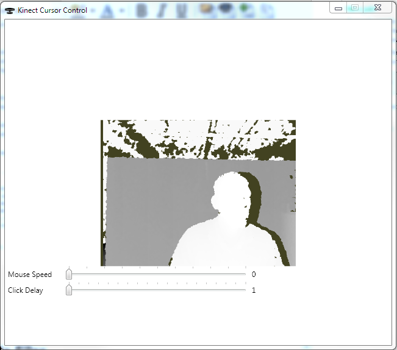

# Easy Kinect Mouse Controller for Windows
## Requires
- Visual Studio 2010
## License
- Apache License, Version 2.0
## Technologies
- WPF
- Kinect
- Kinect SDK
- NativeMethods API
## Topics
- Kinect
## Updated
- 10/03/2012
## Description

<h1>Introduction</h1>

<em>This sample will show you how to build a simple controller for the Kinect that will let you control the mouse on your Windows desktop using a Kinect device. &nbsp;This sample assumes that you have a Kinect for Windows device installed on your desktop
 and that you have the Kinect for Windows SDK Version 1.5 or greater. &nbsp;This sample also uses the WPF Kinect framework samples from Microsoft and I have included the necessary parts in the solution as a separate project.</em>

Description

This sample is very simple to understand if you already have a basic understanding of how the Kinect works. &nbsp;If you do not, you might want to look at my other sample on
<a href="http://code.msdn.microsoft.com/Beginning-Kinect-for-a198d400" target="_blank">
Beginning Kinect Programming</a>. &nbsp;The main tasks we will be doing in this sample are:

1) Intercept the skeleton information from the Kinect and pick out the right hand.

2) Figure out the position of the right hand relative to the screen of the PC.

3) Pass that position to a Microsoft API for mouse control.

That's it really. &nbsp;As I said, it's a simple thing to do once you know how. &nbsp;We are also going to simulate a mouse click() function by setting a timer when the user is hovering over any spot on the screen for a certain length of time. &nbsp;We do
 that by creating a stopwatch and timing the hovers. &nbsp;So in the MainWindow constructor for the WPF XAML you will see a stopwatch being created, like this:

&nbsp;

C#

Edit|Remove

csharp
<pre class="hidden">_clickHoldingTimer = new Stopwatch();</pre>

<pre class="js">_clickHoldingTimer&nbsp;=&nbsp;new&nbsp;Stopwatch();</pre>

&nbsp;After that, we just fire up the Kinect as normal. &nbsp;Our sample shows the depth image using the Microsoft sample WPF viewer, so in the SensorDepthFrameReady() method, we set the video bitmap source to the depth frame using
 the DepthImageFrame.ToBitmapSource helper from the Microsoft sample, like this:

C#

Edit|Remove

csharp
<pre class="hidden">        void SensorDepthFrameReady(AllFramesReadyEventArgs e)
        {
            // if the window is displayed, show the depth buffer image
            if (WindowState == WindowState.Normal)
            {
                using (DepthImageFrame depthFrame = e.OpenDepthImageFrame())
                {
                    if (depthFrame == null)
                    {
                        return;
                    }

                    video.Source = depthFrame.ToBitmapSource();
                }
            }
        }</pre>

<pre class="csharp">&nbsp;&nbsp;&nbsp;&nbsp;&nbsp;&nbsp;&nbsp;&nbsp;void&nbsp;SensorDepthFrameReady(AllFramesReadyEventArgs&nbsp;e)&nbsp;
&nbsp;&nbsp;&nbsp;&nbsp;&nbsp;&nbsp;&nbsp;&nbsp;{&nbsp;
&nbsp;&nbsp;&nbsp;&nbsp;&nbsp;&nbsp;&nbsp;&nbsp;&nbsp;&nbsp;&nbsp;&nbsp;//&nbsp;if&nbsp;the&nbsp;window&nbsp;is&nbsp;displayed,&nbsp;show&nbsp;the&nbsp;depth&nbsp;buffer&nbsp;image&nbsp;
&nbsp;&nbsp;&nbsp;&nbsp;&nbsp;&nbsp;&nbsp;&nbsp;&nbsp;&nbsp;&nbsp;&nbsp;if&nbsp;(WindowState&nbsp;==&nbsp;WindowState.Normal)&nbsp;
&nbsp;&nbsp;&nbsp;&nbsp;&nbsp;&nbsp;&nbsp;&nbsp;&nbsp;&nbsp;&nbsp;&nbsp;{&nbsp;
&nbsp;&nbsp;&nbsp;&nbsp;&nbsp;&nbsp;&nbsp;&nbsp;&nbsp;&nbsp;&nbsp;&nbsp;&nbsp;&nbsp;&nbsp;&nbsp;using&nbsp;(DepthImageFrame&nbsp;depthFrame&nbsp;=&nbsp;e.OpenDepthImageFrame())&nbsp;
&nbsp;&nbsp;&nbsp;&nbsp;&nbsp;&nbsp;&nbsp;&nbsp;&nbsp;&nbsp;&nbsp;&nbsp;&nbsp;&nbsp;&nbsp;&nbsp;{&nbsp;
&nbsp;&nbsp;&nbsp;&nbsp;&nbsp;&nbsp;&nbsp;&nbsp;&nbsp;&nbsp;&nbsp;&nbsp;&nbsp;&nbsp;&nbsp;&nbsp;&nbsp;&nbsp;&nbsp;&nbsp;if&nbsp;(depthFrame&nbsp;==&nbsp;null)&nbsp;
&nbsp;&nbsp;&nbsp;&nbsp;&nbsp;&nbsp;&nbsp;&nbsp;&nbsp;&nbsp;&nbsp;&nbsp;&nbsp;&nbsp;&nbsp;&nbsp;&nbsp;&nbsp;&nbsp;&nbsp;{&nbsp;
&nbsp;&nbsp;&nbsp;&nbsp;&nbsp;&nbsp;&nbsp;&nbsp;&nbsp;&nbsp;&nbsp;&nbsp;&nbsp;&nbsp;&nbsp;&nbsp;&nbsp;&nbsp;&nbsp;&nbsp;&nbsp;&nbsp;&nbsp;&nbsp;return;&nbsp;
&nbsp;&nbsp;&nbsp;&nbsp;&nbsp;&nbsp;&nbsp;&nbsp;&nbsp;&nbsp;&nbsp;&nbsp;&nbsp;&nbsp;&nbsp;&nbsp;&nbsp;&nbsp;&nbsp;&nbsp;}&nbsp;
&nbsp;
&nbsp;&nbsp;&nbsp;&nbsp;&nbsp;&nbsp;&nbsp;&nbsp;&nbsp;&nbsp;&nbsp;&nbsp;&nbsp;&nbsp;&nbsp;&nbsp;&nbsp;&nbsp;&nbsp;&nbsp;video.Source&nbsp;=&nbsp;depthFrame.ToBitmapSource();&nbsp;
&nbsp;&nbsp;&nbsp;&nbsp;&nbsp;&nbsp;&nbsp;&nbsp;&nbsp;&nbsp;&nbsp;&nbsp;&nbsp;&nbsp;&nbsp;&nbsp;}&nbsp;
&nbsp;&nbsp;&nbsp;&nbsp;&nbsp;&nbsp;&nbsp;&nbsp;&nbsp;&nbsp;&nbsp;&nbsp;}&nbsp;
&nbsp;&nbsp;&nbsp;&nbsp;&nbsp;&nbsp;&nbsp;&nbsp;}</pre>

&nbsp;The meat of this sample is in the SensorSkeletonFrameReady() method. &nbsp;I won't show you all of it, you can look at it in the sample code, but I will show you the interesting bit. &nbsp;

&nbsp;

&nbsp;

C#

Edit|Remove

csharp
<pre class="hidden">                foreach (Skeleton sd in allSkeletons)
                {
                    // the first found/tracked skeleton moves the mouse cursor
                    if (sd.TrackingState == SkeletonTrackingState.Tracked)
                    {
                        // make sure both hands are tracked
                        if (sd.Joints[JointType.HandRight].TrackingState == JointTrackingState.Tracked)
                        {
                            var wristRight = sd.Joints[JointType.WristRight];
                            var scaledRightHand = wristRight.ScaleTo((int)SystemParameters.PrimaryScreenWidth, (int)SystemParameters.PrimaryScreenHeight, SkeletonMaxX, SkeletonMaxY);

                            var cursorX = (int)scaledRightHand.Position.X &#43; (int)MouseSpeed.Value;
                            var cursorY = (int)scaledRightHand.Position.Y &#43; (int)MouseSpeed.Value;

                            var leftClick = CheckForClickHold(scaledRightHand);
                            NativeMethods.SendMouseInput(cursorX, cursorY, (int)SystemParameters.PrimaryScreenWidth, (int)SystemParameters.PrimaryScreenHeight, leftClick);
                        }
                    }
                }</pre>

<pre class="csharp">&nbsp;&nbsp;&nbsp;&nbsp;&nbsp;&nbsp;&nbsp;&nbsp;&nbsp;&nbsp;&nbsp;&nbsp;&nbsp;&nbsp;&nbsp;&nbsp;foreach&nbsp;(Skeleton&nbsp;sd&nbsp;in&nbsp;allSkeletons)&nbsp;
&nbsp;&nbsp;&nbsp;&nbsp;&nbsp;&nbsp;&nbsp;&nbsp;&nbsp;&nbsp;&nbsp;&nbsp;&nbsp;&nbsp;&nbsp;&nbsp;{&nbsp;
&nbsp;&nbsp;&nbsp;&nbsp;&nbsp;&nbsp;&nbsp;&nbsp;&nbsp;&nbsp;&nbsp;&nbsp;&nbsp;&nbsp;&nbsp;&nbsp;&nbsp;&nbsp;&nbsp;&nbsp;//&nbsp;the&nbsp;first&nbsp;found/tracked&nbsp;skeleton&nbsp;moves&nbsp;the&nbsp;mouse&nbsp;cursor&nbsp;
&nbsp;&nbsp;&nbsp;&nbsp;&nbsp;&nbsp;&nbsp;&nbsp;&nbsp;&nbsp;&nbsp;&nbsp;&nbsp;&nbsp;&nbsp;&nbsp;&nbsp;&nbsp;&nbsp;&nbsp;if&nbsp;(sd.TrackingState&nbsp;==&nbsp;SkeletonTrackingState.Tracked)&nbsp;
&nbsp;&nbsp;&nbsp;&nbsp;&nbsp;&nbsp;&nbsp;&nbsp;&nbsp;&nbsp;&nbsp;&nbsp;&nbsp;&nbsp;&nbsp;&nbsp;&nbsp;&nbsp;&nbsp;&nbsp;{&nbsp;
&nbsp;&nbsp;&nbsp;&nbsp;&nbsp;&nbsp;&nbsp;&nbsp;&nbsp;&nbsp;&nbsp;&nbsp;&nbsp;&nbsp;&nbsp;&nbsp;&nbsp;&nbsp;&nbsp;&nbsp;&nbsp;&nbsp;&nbsp;&nbsp;//&nbsp;make&nbsp;sure&nbsp;both&nbsp;hands&nbsp;are&nbsp;tracked&nbsp;
&nbsp;&nbsp;&nbsp;&nbsp;&nbsp;&nbsp;&nbsp;&nbsp;&nbsp;&nbsp;&nbsp;&nbsp;&nbsp;&nbsp;&nbsp;&nbsp;&nbsp;&nbsp;&nbsp;&nbsp;&nbsp;&nbsp;&nbsp;&nbsp;if&nbsp;(sd.Joints[JointType.HandRight].TrackingState&nbsp;==&nbsp;JointTrackingState.Tracked)&nbsp;
&nbsp;&nbsp;&nbsp;&nbsp;&nbsp;&nbsp;&nbsp;&nbsp;&nbsp;&nbsp;&nbsp;&nbsp;&nbsp;&nbsp;&nbsp;&nbsp;&nbsp;&nbsp;&nbsp;&nbsp;&nbsp;&nbsp;&nbsp;&nbsp;{&nbsp;
&nbsp;&nbsp;&nbsp;&nbsp;&nbsp;&nbsp;&nbsp;&nbsp;&nbsp;&nbsp;&nbsp;&nbsp;&nbsp;&nbsp;&nbsp;&nbsp;&nbsp;&nbsp;&nbsp;&nbsp;&nbsp;&nbsp;&nbsp;&nbsp;&nbsp;&nbsp;&nbsp;&nbsp;var&nbsp;wristRight&nbsp;=&nbsp;sd.Joints[JointType.WristRight];&nbsp;
&nbsp;&nbsp;&nbsp;&nbsp;&nbsp;&nbsp;&nbsp;&nbsp;&nbsp;&nbsp;&nbsp;&nbsp;&nbsp;&nbsp;&nbsp;&nbsp;&nbsp;&nbsp;&nbsp;&nbsp;&nbsp;&nbsp;&nbsp;&nbsp;&nbsp;&nbsp;&nbsp;&nbsp;var&nbsp;scaledRightHand&nbsp;=&nbsp;wristRight.ScaleTo((int)SystemParameters.PrimaryScreenWidth,&nbsp;(int)SystemParameters.PrimaryScreenHeight,&nbsp;SkeletonMaxX,&nbsp;SkeletonMaxY);&nbsp;
&nbsp;
&nbsp;&nbsp;&nbsp;&nbsp;&nbsp;&nbsp;&nbsp;&nbsp;&nbsp;&nbsp;&nbsp;&nbsp;&nbsp;&nbsp;&nbsp;&nbsp;&nbsp;&nbsp;&nbsp;&nbsp;&nbsp;&nbsp;&nbsp;&nbsp;&nbsp;&nbsp;&nbsp;&nbsp;var&nbsp;cursorX&nbsp;=&nbsp;(int)scaledRightHand.Position.X&nbsp;&#43;&nbsp;(int)MouseSpeed.Value;&nbsp;
&nbsp;&nbsp;&nbsp;&nbsp;&nbsp;&nbsp;&nbsp;&nbsp;&nbsp;&nbsp;&nbsp;&nbsp;&nbsp;&nbsp;&nbsp;&nbsp;&nbsp;&nbsp;&nbsp;&nbsp;&nbsp;&nbsp;&nbsp;&nbsp;&nbsp;&nbsp;&nbsp;&nbsp;var&nbsp;cursorY&nbsp;=&nbsp;(int)scaledRightHand.Position.Y&nbsp;&#43;&nbsp;(int)MouseSpeed.Value;&nbsp;
&nbsp;
&nbsp;&nbsp;&nbsp;&nbsp;&nbsp;&nbsp;&nbsp;&nbsp;&nbsp;&nbsp;&nbsp;&nbsp;&nbsp;&nbsp;&nbsp;&nbsp;&nbsp;&nbsp;&nbsp;&nbsp;&nbsp;&nbsp;&nbsp;&nbsp;&nbsp;&nbsp;&nbsp;&nbsp;var&nbsp;leftClick&nbsp;=&nbsp;CheckForClickHold(scaledRightHand);&nbsp;
&nbsp;&nbsp;&nbsp;&nbsp;&nbsp;&nbsp;&nbsp;&nbsp;&nbsp;&nbsp;&nbsp;&nbsp;&nbsp;&nbsp;&nbsp;&nbsp;&nbsp;&nbsp;&nbsp;&nbsp;&nbsp;&nbsp;&nbsp;&nbsp;&nbsp;&nbsp;&nbsp;&nbsp;NativeMethods.SendMouseInput(cursorX,&nbsp;cursorY,&nbsp;(int)SystemParameters.PrimaryScreenWidth,&nbsp;(int)SystemParameters.PrimaryScreenHeight,&nbsp;leftClick);&nbsp;
&nbsp;&nbsp;&nbsp;&nbsp;&nbsp;&nbsp;&nbsp;&nbsp;&nbsp;&nbsp;&nbsp;&nbsp;&nbsp;&nbsp;&nbsp;&nbsp;&nbsp;&nbsp;&nbsp;&nbsp;&nbsp;&nbsp;&nbsp;&nbsp;}&nbsp;
&nbsp;&nbsp;&nbsp;&nbsp;&nbsp;&nbsp;&nbsp;&nbsp;&nbsp;&nbsp;&nbsp;&nbsp;&nbsp;&nbsp;&nbsp;&nbsp;&nbsp;&nbsp;&nbsp;&nbsp;}&nbsp;
&nbsp;&nbsp;&nbsp;&nbsp;&nbsp;&nbsp;&nbsp;&nbsp;&nbsp;&nbsp;&nbsp;&nbsp;&nbsp;&nbsp;&nbsp;&nbsp;}</pre>

In the section above, we are looking to see if the users hand is being tracked, and if it is we grab it's location and scale it to the screen, taking into account the relative speed that we want the mouse to move around the screen
 (larger MouseSpeed numbers cause the cursor on the screen to skip across the screen faster by increasing the value of X and Y non-linearly). &nbsp;We also look to see if the user is hovering over a spot using the CheckForClickHold() method, which I will explain
 in a minute, and finally we send the mouse input to Windows using a NativeMethods utility that is supplied by Microsoft.

The CheckForClickHold() method looks like this:

C#

Edit|Remove

csharp
<pre class="hidden">       private bool CheckForClickHold(Joint hand)
        {
            // This does one handed click when you hover for the allotted time.  It gives a false positive when you hover accidentally.
            var x = hand.Position.X;
            var y = hand.Position.Y;

            var screenwidth = (int)SystemParameters.PrimaryScreenWidth;
            var screenheight = (int)SystemParameters.PrimaryScreenHeight;
            var clickwidth = (int)(screenwidth * ClickHoldingRectThreshold);
            var clickheight = (int)(screenheight * ClickHoldingRectThreshold);

            var newClickHold = new Rect(x - clickwidth, y - clickheight, clickwidth * 2, clickheight * 2);

            if (_clickHoldingLastRect != Rect.Empty)
            {
                if (newClickHold.IntersectsWith(_clickHoldingLastRect))
                {
                    if ((int)_clickHoldingTimer.ElapsedMilliseconds &gt; (ClickDelay.Value * 1000))
                    {
                        _clickHoldingTimer.Stop();
                        _clickHoldingLastRect = Rect.Empty;
                        return true;
                    }

                    if (!_clickHoldingTimer.IsRunning)
                    {
                        _clickHoldingTimer.Reset();
                        _clickHoldingTimer.Start();
                    }
                    return false;
                }

                _clickHoldingTimer.Stop();
                _clickHoldingLastRect = newClickHold;
                return false;
            }

            _clickHoldingLastRect = newClickHold;
            if (!_clickHoldingTimer.IsRunning)
            {
                _clickHoldingTimer.Reset();
                _clickHoldingTimer.Start();
            }
            return false;
        }
</pre>

<pre class="js">&nbsp;&nbsp;&nbsp;&nbsp;&nbsp;&nbsp;&nbsp;private&nbsp;bool&nbsp;CheckForClickHold(Joint&nbsp;hand)&nbsp;
&nbsp;&nbsp;&nbsp;&nbsp;&nbsp;&nbsp;&nbsp;&nbsp;{&nbsp;
&nbsp;&nbsp;&nbsp;&nbsp;&nbsp;&nbsp;&nbsp;&nbsp;&nbsp;&nbsp;&nbsp;&nbsp;//&nbsp;This&nbsp;does&nbsp;one&nbsp;handed&nbsp;click&nbsp;when&nbsp;you&nbsp;hover&nbsp;for&nbsp;the&nbsp;allotted&nbsp;time.&nbsp;&nbsp;It&nbsp;gives&nbsp;a&nbsp;false&nbsp;positive&nbsp;when&nbsp;you&nbsp;hover&nbsp;accidentally.&nbsp;
&nbsp;&nbsp;&nbsp;&nbsp;&nbsp;&nbsp;&nbsp;&nbsp;&nbsp;&nbsp;&nbsp;&nbsp;var&nbsp;x&nbsp;=&nbsp;hand.Position.X;&nbsp;
&nbsp;&nbsp;&nbsp;&nbsp;&nbsp;&nbsp;&nbsp;&nbsp;&nbsp;&nbsp;&nbsp;&nbsp;var&nbsp;y&nbsp;=&nbsp;hand.Position.Y;&nbsp;
&nbsp;
&nbsp;&nbsp;&nbsp;&nbsp;&nbsp;&nbsp;&nbsp;&nbsp;&nbsp;&nbsp;&nbsp;&nbsp;var&nbsp;screenwidth&nbsp;=&nbsp;(int)SystemParameters.PrimaryScreenWidth;&nbsp;
&nbsp;&nbsp;&nbsp;&nbsp;&nbsp;&nbsp;&nbsp;&nbsp;&nbsp;&nbsp;&nbsp;&nbsp;var&nbsp;screenheight&nbsp;=&nbsp;(int)SystemParameters.PrimaryScreenHeight;&nbsp;
&nbsp;&nbsp;&nbsp;&nbsp;&nbsp;&nbsp;&nbsp;&nbsp;&nbsp;&nbsp;&nbsp;&nbsp;var&nbsp;clickwidth&nbsp;=&nbsp;(int)(screenwidth&nbsp;*&nbsp;ClickHoldingRectThreshold);&nbsp;
&nbsp;&nbsp;&nbsp;&nbsp;&nbsp;&nbsp;&nbsp;&nbsp;&nbsp;&nbsp;&nbsp;&nbsp;var&nbsp;clickheight&nbsp;=&nbsp;(int)(screenheight&nbsp;*&nbsp;ClickHoldingRectThreshold);&nbsp;
&nbsp;
&nbsp;&nbsp;&nbsp;&nbsp;&nbsp;&nbsp;&nbsp;&nbsp;&nbsp;&nbsp;&nbsp;&nbsp;var&nbsp;newClickHold&nbsp;=&nbsp;new&nbsp;Rect(x&nbsp;-&nbsp;clickwidth,&nbsp;y&nbsp;-&nbsp;clickheight,&nbsp;clickwidth&nbsp;*&nbsp;2,&nbsp;clickheight&nbsp;*&nbsp;2);&nbsp;
&nbsp;
&nbsp;&nbsp;&nbsp;&nbsp;&nbsp;&nbsp;&nbsp;&nbsp;&nbsp;&nbsp;&nbsp;&nbsp;if&nbsp;(_clickHoldingLastRect&nbsp;!=&nbsp;Rect.Empty)&nbsp;
&nbsp;&nbsp;&nbsp;&nbsp;&nbsp;&nbsp;&nbsp;&nbsp;&nbsp;&nbsp;&nbsp;&nbsp;{&nbsp;
&nbsp;&nbsp;&nbsp;&nbsp;&nbsp;&nbsp;&nbsp;&nbsp;&nbsp;&nbsp;&nbsp;&nbsp;&nbsp;&nbsp;&nbsp;&nbsp;if&nbsp;(newClickHold.IntersectsWith(_clickHoldingLastRect))&nbsp;
&nbsp;&nbsp;&nbsp;&nbsp;&nbsp;&nbsp;&nbsp;&nbsp;&nbsp;&nbsp;&nbsp;&nbsp;&nbsp;&nbsp;&nbsp;&nbsp;{&nbsp;
&nbsp;&nbsp;&nbsp;&nbsp;&nbsp;&nbsp;&nbsp;&nbsp;&nbsp;&nbsp;&nbsp;&nbsp;&nbsp;&nbsp;&nbsp;&nbsp;&nbsp;&nbsp;&nbsp;&nbsp;if&nbsp;((int)_clickHoldingTimer.ElapsedMilliseconds&nbsp;&gt;&nbsp;(ClickDelay.Value&nbsp;*&nbsp;1000))&nbsp;
&nbsp;&nbsp;&nbsp;&nbsp;&nbsp;&nbsp;&nbsp;&nbsp;&nbsp;&nbsp;&nbsp;&nbsp;&nbsp;&nbsp;&nbsp;&nbsp;&nbsp;&nbsp;&nbsp;&nbsp;{&nbsp;
&nbsp;&nbsp;&nbsp;&nbsp;&nbsp;&nbsp;&nbsp;&nbsp;&nbsp;&nbsp;&nbsp;&nbsp;&nbsp;&nbsp;&nbsp;&nbsp;&nbsp;&nbsp;&nbsp;&nbsp;&nbsp;&nbsp;&nbsp;&nbsp;_clickHoldingTimer.Stop();&nbsp;
&nbsp;&nbsp;&nbsp;&nbsp;&nbsp;&nbsp;&nbsp;&nbsp;&nbsp;&nbsp;&nbsp;&nbsp;&nbsp;&nbsp;&nbsp;&nbsp;&nbsp;&nbsp;&nbsp;&nbsp;&nbsp;&nbsp;&nbsp;&nbsp;_clickHoldingLastRect&nbsp;=&nbsp;Rect.Empty;&nbsp;
&nbsp;&nbsp;&nbsp;&nbsp;&nbsp;&nbsp;&nbsp;&nbsp;&nbsp;&nbsp;&nbsp;&nbsp;&nbsp;&nbsp;&nbsp;&nbsp;&nbsp;&nbsp;&nbsp;&nbsp;&nbsp;&nbsp;&nbsp;&nbsp;return&nbsp;true;&nbsp;
&nbsp;&nbsp;&nbsp;&nbsp;&nbsp;&nbsp;&nbsp;&nbsp;&nbsp;&nbsp;&nbsp;&nbsp;&nbsp;&nbsp;&nbsp;&nbsp;&nbsp;&nbsp;&nbsp;&nbsp;}&nbsp;
&nbsp;
&nbsp;&nbsp;&nbsp;&nbsp;&nbsp;&nbsp;&nbsp;&nbsp;&nbsp;&nbsp;&nbsp;&nbsp;&nbsp;&nbsp;&nbsp;&nbsp;&nbsp;&nbsp;&nbsp;&nbsp;if&nbsp;(!_clickHoldingTimer.IsRunning)&nbsp;
&nbsp;&nbsp;&nbsp;&nbsp;&nbsp;&nbsp;&nbsp;&nbsp;&nbsp;&nbsp;&nbsp;&nbsp;&nbsp;&nbsp;&nbsp;&nbsp;&nbsp;&nbsp;&nbsp;&nbsp;{&nbsp;
&nbsp;&nbsp;&nbsp;&nbsp;&nbsp;&nbsp;&nbsp;&nbsp;&nbsp;&nbsp;&nbsp;&nbsp;&nbsp;&nbsp;&nbsp;&nbsp;&nbsp;&nbsp;&nbsp;&nbsp;&nbsp;&nbsp;&nbsp;&nbsp;_clickHoldingTimer.Reset();&nbsp;
&nbsp;&nbsp;&nbsp;&nbsp;&nbsp;&nbsp;&nbsp;&nbsp;&nbsp;&nbsp;&nbsp;&nbsp;&nbsp;&nbsp;&nbsp;&nbsp;&nbsp;&nbsp;&nbsp;&nbsp;&nbsp;&nbsp;&nbsp;&nbsp;_clickHoldingTimer.Start();&nbsp;
&nbsp;&nbsp;&nbsp;&nbsp;&nbsp;&nbsp;&nbsp;&nbsp;&nbsp;&nbsp;&nbsp;&nbsp;&nbsp;&nbsp;&nbsp;&nbsp;&nbsp;&nbsp;&nbsp;&nbsp;}&nbsp;
&nbsp;&nbsp;&nbsp;&nbsp;&nbsp;&nbsp;&nbsp;&nbsp;&nbsp;&nbsp;&nbsp;&nbsp;&nbsp;&nbsp;&nbsp;&nbsp;&nbsp;&nbsp;&nbsp;&nbsp;return&nbsp;false;&nbsp;
&nbsp;&nbsp;&nbsp;&nbsp;&nbsp;&nbsp;&nbsp;&nbsp;&nbsp;&nbsp;&nbsp;&nbsp;&nbsp;&nbsp;&nbsp;&nbsp;}&nbsp;
&nbsp;
&nbsp;&nbsp;&nbsp;&nbsp;&nbsp;&nbsp;&nbsp;&nbsp;&nbsp;&nbsp;&nbsp;&nbsp;&nbsp;&nbsp;&nbsp;&nbsp;_clickHoldingTimer.Stop();&nbsp;
&nbsp;&nbsp;&nbsp;&nbsp;&nbsp;&nbsp;&nbsp;&nbsp;&nbsp;&nbsp;&nbsp;&nbsp;&nbsp;&nbsp;&nbsp;&nbsp;_clickHoldingLastRect&nbsp;=&nbsp;newClickHold;&nbsp;
&nbsp;&nbsp;&nbsp;&nbsp;&nbsp;&nbsp;&nbsp;&nbsp;&nbsp;&nbsp;&nbsp;&nbsp;&nbsp;&nbsp;&nbsp;&nbsp;return&nbsp;false;&nbsp;
&nbsp;&nbsp;&nbsp;&nbsp;&nbsp;&nbsp;&nbsp;&nbsp;&nbsp;&nbsp;&nbsp;&nbsp;}&nbsp;
&nbsp;
&nbsp;&nbsp;&nbsp;&nbsp;&nbsp;&nbsp;&nbsp;&nbsp;&nbsp;&nbsp;&nbsp;&nbsp;_clickHoldingLastRect&nbsp;=&nbsp;newClickHold;&nbsp;
&nbsp;&nbsp;&nbsp;&nbsp;&nbsp;&nbsp;&nbsp;&nbsp;&nbsp;&nbsp;&nbsp;&nbsp;if&nbsp;(!_clickHoldingTimer.IsRunning)&nbsp;
&nbsp;&nbsp;&nbsp;&nbsp;&nbsp;&nbsp;&nbsp;&nbsp;&nbsp;&nbsp;&nbsp;&nbsp;{&nbsp;
&nbsp;&nbsp;&nbsp;&nbsp;&nbsp;&nbsp;&nbsp;&nbsp;&nbsp;&nbsp;&nbsp;&nbsp;&nbsp;&nbsp;&nbsp;&nbsp;_clickHoldingTimer.Reset();&nbsp;
&nbsp;&nbsp;&nbsp;&nbsp;&nbsp;&nbsp;&nbsp;&nbsp;&nbsp;&nbsp;&nbsp;&nbsp;&nbsp;&nbsp;&nbsp;&nbsp;_clickHoldingTimer.Start();&nbsp;
&nbsp;&nbsp;&nbsp;&nbsp;&nbsp;&nbsp;&nbsp;&nbsp;&nbsp;&nbsp;&nbsp;&nbsp;}&nbsp;
&nbsp;&nbsp;&nbsp;&nbsp;&nbsp;&nbsp;&nbsp;&nbsp;&nbsp;&nbsp;&nbsp;&nbsp;return&nbsp;false;&nbsp;
&nbsp;&nbsp;&nbsp;&nbsp;&nbsp;&nbsp;&nbsp;&nbsp;}&nbsp;
</pre>

&nbsp;This method is checking to see if the users hand is hovering within some given area of the screen. &nbsp;The size of that rectangle can be set by using the slider on the WPF screen. &nbsp;If the user is hovering, the method
 makes a copy of the rectangle and then starts a stopwatch. &nbsp;The next time the method is called, it will compare that old rectangle with the new rectangle where the user is currently hovering. &nbsp;If they overlap, the method keeps timing, otherwise it
 stops timing. &nbsp;Once this has happened enough times that the click threshold has been exceeded, the method returns true, which indicates that the user intended to cause a click of the mouse.

That's all there is to it. &nbsp;If you run the application, you will see something like this:

&nbsp;

&nbsp;

To use the application, just stand in front of the Kinect. &nbsp;Your user image should turn green and you will instantly have control of the mouse. &nbsp;By moving your right hand around the screen, you should see that you are controlling the mouse of the
 machine. &nbsp;If you want to click on something on the screen, merely hover over it for the time specified in the Click Delay slider. &nbsp;If the mouse is moving too slowly or too quickly, try adjusting the Mouse Speed slider.

I hope you have enjoyed this sample. &nbsp;Please leave me any questions that you might have and have fun coding for the Kinect.

