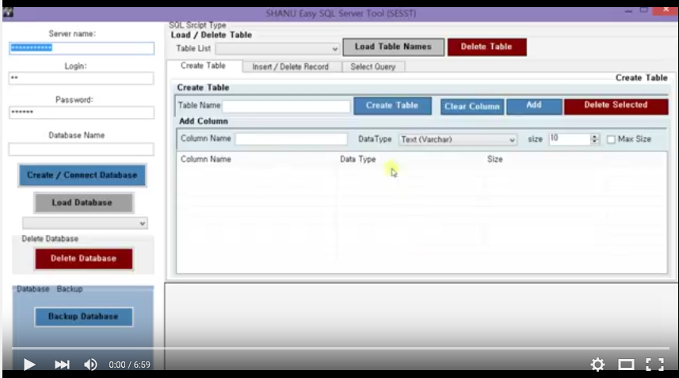
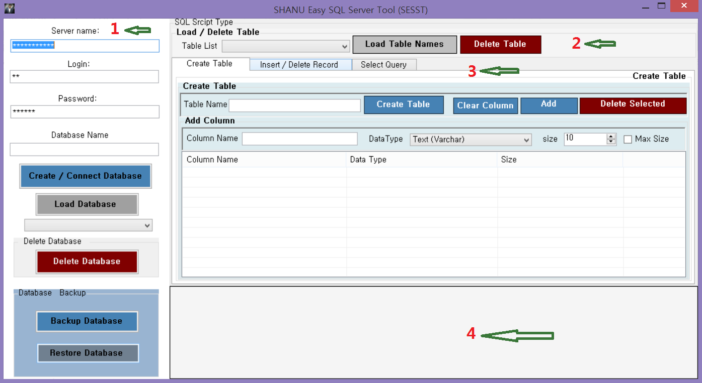
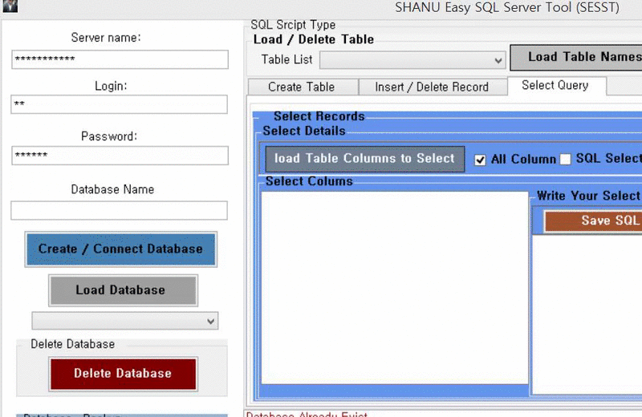
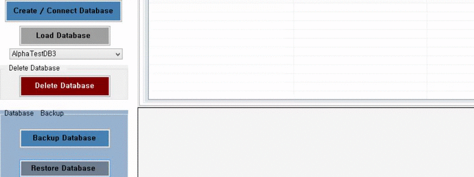
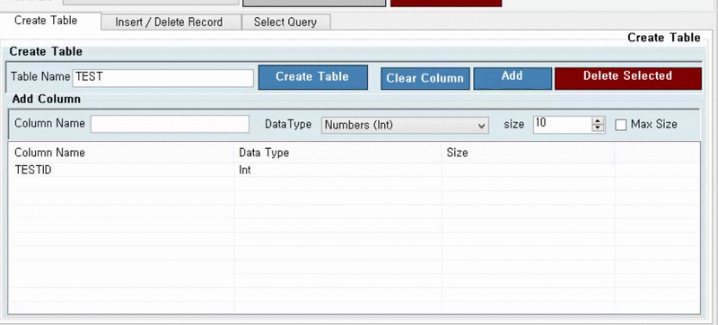
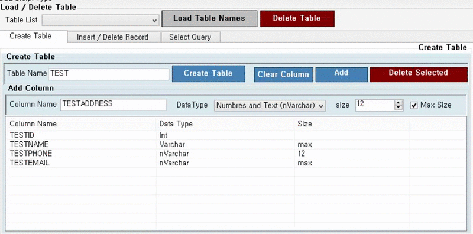
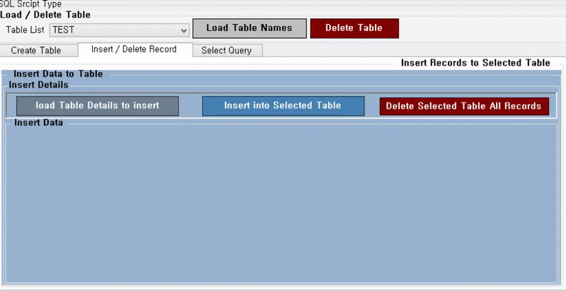
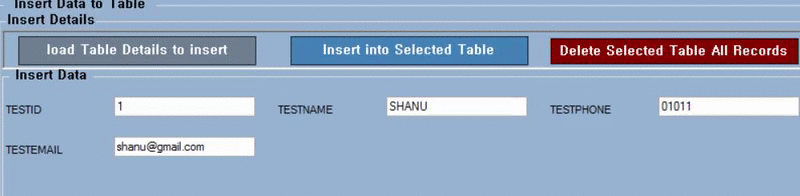
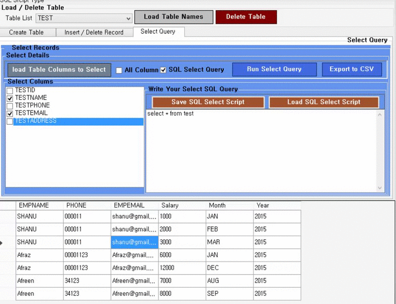
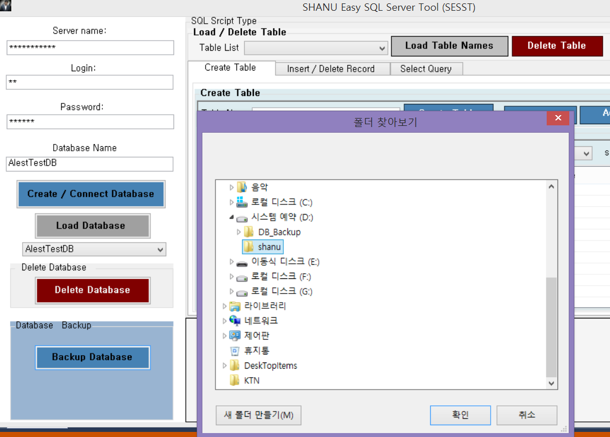

# Easy SQL Server Tool using C#
## Requires
- Visual Studio 2015
## License
- MIT
## Technologies
- C#
- Windows Forms
- SQL Server SMO
## Topics
- C#
- Windows Forms
- SQL Server SMO
## Updated
- 07/23/2017
## Description

<h1>Introduction</h1>

<strong><strong>*</strong>&nbsp;Kindly view my Youtube Video Link to learn&nbsp;<a href="https://youtu.be/hgcsZfICAfk" target="_blank">Easy SQL SERVER Tool Using C#</a>.</strong>&nbsp;

 

Easy SQL Server Tool will allow users to Create SQL Server Database, Delete Database, Load all Database Names from a SQL selected Server, Create a New Table, Insert records to Table, Select Records from Table and bind the result to grid, Export the
 selected result to CSV file format, Delete Table, Delete ALL Records from a Table without writing any SQL Script.

We have used SQL Server Management Objects (SMO) to programmatically create SQL Server Database, Table etc.

<h2><strong>What is SQL Server Management Objects (SMO)?</strong></h2>

SQL Server Management Objects (SMO) is a collection of Objects to manage SQL Server programmatically. Using SMO objects we can programmatically connect to SQL server, Get collections of all Database names ,Create new Database, Backup Database, Restore
 Database, Create Table, Get collections of Table Name for a given Database ,Get all Column details of a given Table and etc.<strong>&nbsp;</strong>

Reference website: To learn more detail about SQL Server SMO kindly view all this link

<ul>
<li><a href="https://msdn.microsoft.com/en-us/library/ms162129.aspx" target="_blank">Overview (SMO)</a>
</li><li><a href="https://msdn.microsoft.com/en-us/library/ms162557.aspx" target="_blank">Create a Visual C# SMO Project in Visual Studio .NET</a>
</li><li><a href="https://msdn.microsoft.com/en-IN/library/microsoft.sqlserver.management.smo.server.aspx" target="_blank">Server Class</a>
</li></ul>
<h1><strong>Features in Easy SQL Server Tool&nbsp;</strong></h1>

1) Connect to SQL Server.

2) Table Details.

3) SQL Script Tab (Create Table tab / Insert and Delete records tab / Select Query tab)

4) Output Window.

Here we will see details of each part

<h1>1) Connect to SQL Server</h1>

<strong>SQL Server Connect</strong>

We can connect to any SQL Server with in our Network. We need to give SQL Server Name or IP Address, SQL Server Login ID and password to connect to SQL Server.

<strong>Create New Database</strong>

Check for User entered Database name is exist in SQL Server. If exist display the message to user .if there is no database with user entered name then new Database will be created.

<strong>Load Database</strong>

Load all the Database Name to combobox for creating Table.

<strong>Delete Database</strong>

User can delete the selected Database from SQL Server. Before deleting confirmation box will be displayed to user to delete or not. If user click on ok then the selected database will be deleted.

<strong>Database Backup</strong>

Backup the selected Database to any folder as you have selected.

&nbsp;<strong>Database Restore</strong>

User can restore the database by selecting &ldquo;.bak&rdquo; file from the selected folder.

<h1>2) Table Details</h1>

 

&nbsp;<strong>Load Table:&nbsp;</strong>user need to first select the Database to list all the Table Names. After selecting the database and by Clicking on the Load Table Names will load all the Table Names to the Combobox .

<strong>Delete Table</strong>

<strong>&nbsp;</strong>User can delete the selected Table from SQL Server. Before deleting confirmation box will be displayed to user to delete or not. If user click on ok then the selected Table will be deleted.

<h1>3) SQL Script Tab</h1>

Here we will be having 3 tab, first tab is for Creating Table, second tab is for Insert and Delete Records and the last third tab is for select Query We will see here all three tab details here.

<strong>Create Table Tab</strong>

&nbsp;Here user can create their own table without writing SQL Query. First user need to select the Database where the table need to be created. After Selecting the Database user can enter their SQL Table Name in the textbox. After entering the table
 name user need to add columns for that Table. Without adding Columns the Table cannot be created.

<strong>Adding Columns</strong>

User can add columns for creating new Table. All this columns will be added locally to the grid for finally creating a Table. User can add any number of columns, Delete the Selected Column and also delete all columns by clicking on Clear Columns .Adding
 and deleting columns is not deals with database so this will be as temp place to add columns for creating Table. After adding all columns for the Table user can click on&nbsp;<strong>Create Table</strong>&nbsp;Button to create a new Table with
 given Column details.

<strong>Datatype:</strong>

Here for now only 3 Datatype has been used.

Int (Numbers)

varchar(for text)

nVarchar(for Numbers and text)

User can also add each column data size .For integer the size will not be used, but for Varchar and nVarchar Datatype user can add the column data size .User can also set Max size for both Varchar and nVarchar type by selecting the&nbsp;<strong>Max
 Size</strong>&nbsp;checkbox.

For example we can see the below image. Here we have added 4 columns to the grid and adding one more new column and we can see each column Datatype and Size from the grid. After adding all column, we click the Create Table Button .We can see the confirmation
 message as Table was created and also we can see our new Table has been added in the Table List Combobox.

&nbsp;<strong>Insert and Delete Records Tab</strong>

We will be using the recently created test Table for inserting demo.

&nbsp;Here we can see in the above image as we have selected the Table &ldquo;test&rdquo; from Table List. To insert record to selected Table we need to click on the&nbsp;<strong>load table Details to insert</strong>&nbsp;button.
 By clicking this we will be displaying all the column name with textbox. Depend on the Datatype of each column we will be adding textbox with maxlength. If the column datatype is Integer then we will be adding Numeric textbox for that column by this user can
 enter only numbers to that textbox. For Varchar and nVarchar we will check for each Column Size if its max then we set the textbox maxlength as 200 by this user can enter only 200 characters. If size is set for column then we will be setting the column size
 for textbox maxlength.

<strong>Insert:</strong>

After loading all the column details with TextBox user can enter the value to be insert for each column. Once user entered the value click on the&nbsp;<strong>Insert into Selected Table&nbsp;</strong>button for inserting a new record.
 Same like this user can enter any number of records for the selected table. If you want to add more functionality from the code you can add your functionality for example like checking duplicate value before insert and etc.

<strong>Delete All Records:</strong>&nbsp;User can delete all records of the selected table. Here in this sample we are not checking any condition for deleting the records. If you need to add more functionality you can change from the
 code and add your own functions for example like Delete records of a table based on condition and etc.

<strong>Select Query Tab</strong>

<strong> 
</strong>

For selecting the records from a Database and display the result .User need to first select the Database and then select the Table from the Table List to create a SQL Select query.

User can select the details using three features

<strong>1)&nbsp;</strong><strong>All Columns:&nbsp;</strong>If All Columns checkbox is checked then all column details result will be display to the output window grid. (This is same like * in select query for example select
 * from tablename).We can see from the above image The All Column Check box will be loaded by default .After selecting the table and when user clicks on Run Select Query. All Column details will be loaded in the below output window grid.<strong>&nbsp;</strong>

<strong>2)&nbsp;</strong><strong>User selected Columns:&nbsp;</strong>If user wants to display only particular columns of the table then they can click on&nbsp;<strong>load Table Columns to Select&nbsp;</strong>button to display
 all the columns name of the tables to CheckedListbox. Here user can select there need columns .by default we will be checked all the Column Names. User can uncheck not needed columns and also uncheck the&nbsp;<strong>All Columns&nbsp;</strong>Checkbox to display
 only selected columns as a result.<strong>&nbsp;</strong>

<strong>User can Write SQL Select Query:</strong>&nbsp;User can also write their SQL Select query to display the output.

For example if user wants to write their own SQL query to join 3 table and display the result. To write SQL Select query user need to check the&nbsp;<strong>SQL Select Query&nbsp;</strong>checkbox and after writing select query user can click on Run Select
 Query button to see the result. In the above image we can see, we have write sample SQL Join query to join three table and by clicking the Run Select Query the result has been bind in the grid.

<strong>SQL Injection Checking in user entered select query:</strong>

&nbsp;We have also checking for the SQL Injection before executing user entered SQL Select query. We have created an array list to add all SQL injection string and we will be checking is any of the array word is matching with user entered select query.
 For example we can see the above image as after select query we have enter drop query. But when we click on Run Select Query button we display the message as drop is not accepted in select query.

Here is the list of SQL Injection string I am checking if you need you can add or remove as per your requirement.&nbsp;

C#

Edit|Remove

csharp
<pre class="hidden">string[] sqlInjectionArray = { &quot;create&quot;, &quot;drop&quot;, &quot;delete&quot;, &quot;insert&quot;, &quot;update&quot;, &quot;truncate&quot;,&quot;grant &quot;,&quot;print&quot;,&quot;sp_executesql ,&quot;objects&quot;,&quot;declare&quot;,&quot;table&quot;,&quot;into&quot;,  
&quot;sqlcancel&quot;,&quot;sqlsetprop&quot;,&quot;sqlexec&quot;,&quot;sqlcommit&quot;,&quot;revoke&quot;,&quot;rollback&quot;,&quot;sqlrollback&quot;,&quot;values&quot;,&quot;sqldisconnect&quot;,&quot;sqlconnect&quot;,&quot;user&quot;,&quot;system_user&quot;,&quot;use&quot;,&quot;schema_name&quot;,&quot;schemata&quot;,&quot;information_schema&quot;,&quot;dbo&quot;,&quot;guest&quot;,&quot;db_owner&quot;,&quot;db_&quot;,&quot;table&quot;,&quot;@@&quot;,&quot;Users&quot;,&quot;execute&quot;,&quot;sysname&quot;,&quot;sp_who&quot;,&quot;sysobjects&quot;,&quot;sp_&quot;,&quot;sysprocesses &quot;,&quot;master&quot;,&quot;sys&quot;,&quot;db_&quot;,&quot;is_&quot;,&quot;exec&quot;, &quot;end&quot;, &quot;xp_&quot;,&quot;; --&quot;, &quot;/*&quot;, &quot;*/&quot;, &quot;alter&quot;, &quot;begin&quot;, &quot;cursor&quot;, &quot;kill&quot;,&quot;--&quot; ,&quot;tabname&quot;,&quot;or&quot;,&quot;sys&quot;}; </pre>

<pre class="csharp">string[]&nbsp;sqlInjectionArray&nbsp;=&nbsp;{&nbsp;&quot;create&quot;,&nbsp;&quot;drop&quot;,&nbsp;&quot;delete&quot;,&nbsp;&quot;insert&quot;,&nbsp;&quot;update&quot;,&nbsp;&quot;truncate&quot;,&quot;grant&nbsp;&quot;,&quot;print&quot;,&quot;sp_executesql&nbsp;,&quot;objects&quot;,&quot;declare&quot;,&quot;table&quot;,&quot;into&quot;,&nbsp;&nbsp;&nbsp;
&quot;sqlcancel&quot;,&quot;sqlsetprop&quot;,&quot;sqlexec&quot;,&quot;sqlcommit&quot;,&quot;revoke&quot;,&quot;rollback&quot;,&quot;sqlrollback&quot;,&quot;values&quot;,&quot;sqldisconnect&quot;,&quot;sqlconnect&quot;,&quot;user&quot;,&quot;system_user&quot;,&quot;use&quot;,&quot;schema_name&quot;,&quot;schemata&quot;,&quot;information_schema&quot;,&quot;dbo&quot;,&quot;guest&quot;,&quot;db_owner&quot;,&quot;db_&quot;,&quot;table&quot;,&quot;@@&quot;,&quot;Users&quot;,&quot;execute&quot;,&quot;sysname&quot;,&quot;sp_who&quot;,&quot;sysobjects&quot;,&quot;sp_&quot;,&quot;sysprocesses&nbsp;&quot;,&quot;master&quot;,&quot;sys&quot;,&quot;db_&quot;,&quot;is_&quot;,&quot;exec&quot;,&nbsp;&quot;end&quot;,&nbsp;&quot;xp_&quot;,&quot;;&nbsp;--&quot;,&nbsp;&quot;/*&quot;,&nbsp;&quot;*/&quot;,&nbsp;&quot;alter&quot;,&nbsp;&quot;begin&quot;,&nbsp;&quot;cursor&quot;,&nbsp;&quot;kill&quot;,&quot;--&quot;&nbsp;,&quot;tabname&quot;,&quot;or&quot;,&quot;sys&quot;};&nbsp;</pre>

&nbsp;&nbsp;<strong>Save Select Query:</strong>&nbsp;

User can also save the Select Query as text file to selected folder for use the select query later.

&nbsp;<strong>Open saved Select Query:</strong>&nbsp;

User can also open the saved Select Query to execute the select script.

<strong>Export the Result to CSV file Format: </strong>

<strong>&nbsp;</strong>User can also export the select result to CSV format. Here in below image we can see the result has been exported as CSV file.<strong>&nbsp;</strong>

<h1>Building the Sample</h1>

<strong>rerequisites</strong>

<strong>Visual Studio 2015:</strong>&nbsp;You can download it from&nbsp;<a href="https://www.visualstudio.com/en-us/downloads/visual-studio-2015-downloads-vs.aspx">here</a>.

<strong>SQL SERVER SMO Reference:</strong>&nbsp;For working with SQL Server SMO we need add 4 important reference to our project

Microsoft.SqlServer.ConnectionInfo.dll

Microsoft.SqlServer.Smo.dll

Microsoft.SqlServer.Management.Sdk.Sfc.dll

Microsoft.SqlServer.SqlEnum.dll

You can find this reference from this path&nbsp;(Here we have used SQL Server 2014)

C:\Program Files\Microsoft SQL Server\120\SDK\Assemblies\ . Add all this 4 Assembly reference to your project

 

Description

The main aim was to create a simple and easy to use Easy SQL Tool. All the functionality has been added in one main form with Tab. We have created 2 Class&nbsp;

1) smoSQLServerClass in this class we have created function to Connect, Disconnect to SQL Server, Create Database, Delete Database, Backup Database, Write all the Exception to Log text file to executable folder, Create Table etc.

2) sqlBizClass In this Class we perform all business logic for our Main form for example like creating, Dynamic query, Creating Dynamic Controls and bind to panel, Bind all Table names returned from SMOSQLServerClass to Combobox controls
 ,Check SQL injection for Select query and return the result as true or false etc.

&nbsp;

Here we will see some of important code part used in this Easy SQL Server Tool. All the code part has been well-commented, so the user can easily understand the code.

<h2><strong>Connect to SQL Server</strong></h2>

In this article I have mentioned as for using SQL Server SMO objects we need to add 4 important Assembly reference to our project. Using SMO&nbsp;<strong>ServerConnection</strong>&nbsp;we can connect to SQL server. We need to set the SQL Server name
 to&nbsp;<strong>ServerInstance</strong>&nbsp;and set SQL Server login and password. After connecting we check for is Connection is open and return the Boolean value to our main function to display the appropriate message to user.&nbsp;

C#

Edit|Remove

csharp
<pre class="hidden">public bool SqlServerConnect()  
        {  
            try  
            {  
                servConn = new ServerConnection();  
                servConn.ServerInstance = serverName;  
                servConn.LoginSecure = false;  
                servConn.Login = LoginID;  
                servConn.Password = password;  
                servConn.Connect();  
                if(servConn.IsOpen)  
                {  
                    return true;  
                }  
                else  
                {  
                    return false;  
                }  
                 
            }  
            catch (Exception ex)  
            {  
                writeLogMessage(ex.Message.ToString());  
  
            }  
            return false;  
        }  </pre>

<pre class="csharp">publicbool&nbsp;SqlServerConnect()&nbsp;&nbsp;&nbsp;
&nbsp;&nbsp;&nbsp;&nbsp;&nbsp;&nbsp;&nbsp;&nbsp;{&nbsp;&nbsp;&nbsp;
&nbsp;&nbsp;&nbsp;&nbsp;&nbsp;&nbsp;&nbsp;&nbsp;&nbsp;&nbsp;&nbsp;&nbsp;try&nbsp;&nbsp;&nbsp;
&nbsp;&nbsp;&nbsp;&nbsp;&nbsp;&nbsp;&nbsp;&nbsp;&nbsp;&nbsp;&nbsp;&nbsp;{&nbsp;&nbsp;&nbsp;
&nbsp;&nbsp;&nbsp;&nbsp;&nbsp;&nbsp;&nbsp;&nbsp;&nbsp;&nbsp;&nbsp;&nbsp;&nbsp;&nbsp;&nbsp;&nbsp;servConn&nbsp;=&nbsp;new&nbsp;ServerConnection();&nbsp;&nbsp;&nbsp;
&nbsp;&nbsp;&nbsp;&nbsp;&nbsp;&nbsp;&nbsp;&nbsp;&nbsp;&nbsp;&nbsp;&nbsp;&nbsp;&nbsp;&nbsp;&nbsp;servConn.ServerInstance&nbsp;=&nbsp;serverName;&nbsp;&nbsp;&nbsp;
&nbsp;&nbsp;&nbsp;&nbsp;&nbsp;&nbsp;&nbsp;&nbsp;&nbsp;&nbsp;&nbsp;&nbsp;&nbsp;&nbsp;&nbsp;&nbsp;servConn.LoginSecure&nbsp;=&nbsp;false;&nbsp;&nbsp;&nbsp;
&nbsp;&nbsp;&nbsp;&nbsp;&nbsp;&nbsp;&nbsp;&nbsp;&nbsp;&nbsp;&nbsp;&nbsp;&nbsp;&nbsp;&nbsp;&nbsp;servConn.Login&nbsp;=&nbsp;LoginID;&nbsp;&nbsp;&nbsp;
&nbsp;&nbsp;&nbsp;&nbsp;&nbsp;&nbsp;&nbsp;&nbsp;&nbsp;&nbsp;&nbsp;&nbsp;&nbsp;&nbsp;&nbsp;&nbsp;servConn.Password&nbsp;=&nbsp;password;&nbsp;&nbsp;&nbsp;
&nbsp;&nbsp;&nbsp;&nbsp;&nbsp;&nbsp;&nbsp;&nbsp;&nbsp;&nbsp;&nbsp;&nbsp;&nbsp;&nbsp;&nbsp;&nbsp;servConn.Connect();&nbsp;&nbsp;&nbsp;
&nbsp;&nbsp;&nbsp;&nbsp;&nbsp;&nbsp;&nbsp;&nbsp;&nbsp;&nbsp;&nbsp;&nbsp;&nbsp;&nbsp;&nbsp;&nbsp;if(servConn.IsOpen)&nbsp;&nbsp;&nbsp;
&nbsp;&nbsp;&nbsp;&nbsp;&nbsp;&nbsp;&nbsp;&nbsp;&nbsp;&nbsp;&nbsp;&nbsp;&nbsp;&nbsp;&nbsp;&nbsp;{&nbsp;&nbsp;&nbsp;
&nbsp;&nbsp;&nbsp;&nbsp;&nbsp;&nbsp;&nbsp;&nbsp;&nbsp;&nbsp;&nbsp;&nbsp;&nbsp;&nbsp;&nbsp;&nbsp;&nbsp;&nbsp;&nbsp;&nbsp;returntrue;&nbsp;&nbsp;&nbsp;
&nbsp;&nbsp;&nbsp;&nbsp;&nbsp;&nbsp;&nbsp;&nbsp;&nbsp;&nbsp;&nbsp;&nbsp;&nbsp;&nbsp;&nbsp;&nbsp;}&nbsp;&nbsp;&nbsp;
&nbsp;&nbsp;&nbsp;&nbsp;&nbsp;&nbsp;&nbsp;&nbsp;&nbsp;&nbsp;&nbsp;&nbsp;&nbsp;&nbsp;&nbsp;&nbsp;else&nbsp;&nbsp;&nbsp;
&nbsp;&nbsp;&nbsp;&nbsp;&nbsp;&nbsp;&nbsp;&nbsp;&nbsp;&nbsp;&nbsp;&nbsp;&nbsp;&nbsp;&nbsp;&nbsp;{&nbsp;&nbsp;&nbsp;
&nbsp;&nbsp;&nbsp;&nbsp;&nbsp;&nbsp;&nbsp;&nbsp;&nbsp;&nbsp;&nbsp;&nbsp;&nbsp;&nbsp;&nbsp;&nbsp;&nbsp;&nbsp;&nbsp;&nbsp;returnfalse;&nbsp;&nbsp;&nbsp;
&nbsp;&nbsp;&nbsp;&nbsp;&nbsp;&nbsp;&nbsp;&nbsp;&nbsp;&nbsp;&nbsp;&nbsp;&nbsp;&nbsp;&nbsp;&nbsp;}&nbsp;&nbsp;&nbsp;
&nbsp;&nbsp;&nbsp;&nbsp;&nbsp;&nbsp;&nbsp;&nbsp;&nbsp;&nbsp;&nbsp;&nbsp;&nbsp;&nbsp;&nbsp;&nbsp;&nbsp;&nbsp;
&nbsp;&nbsp;&nbsp;&nbsp;&nbsp;&nbsp;&nbsp;&nbsp;&nbsp;&nbsp;&nbsp;&nbsp;}&nbsp;&nbsp;&nbsp;
&nbsp;&nbsp;&nbsp;&nbsp;&nbsp;&nbsp;&nbsp;&nbsp;&nbsp;&nbsp;&nbsp;&nbsp;catch&nbsp;(Exception&nbsp;ex)&nbsp;&nbsp;&nbsp;
&nbsp;&nbsp;&nbsp;&nbsp;&nbsp;&nbsp;&nbsp;&nbsp;&nbsp;&nbsp;&nbsp;&nbsp;{&nbsp;&nbsp;&nbsp;
&nbsp;&nbsp;&nbsp;&nbsp;&nbsp;&nbsp;&nbsp;&nbsp;&nbsp;&nbsp;&nbsp;&nbsp;&nbsp;&nbsp;&nbsp;&nbsp;writeLogMessage(ex.Message.ToString());&nbsp;&nbsp;&nbsp;
&nbsp;&nbsp;&nbsp;
&nbsp;&nbsp;&nbsp;&nbsp;&nbsp;&nbsp;&nbsp;&nbsp;&nbsp;&nbsp;&nbsp;&nbsp;}&nbsp;&nbsp;&nbsp;
&nbsp;&nbsp;&nbsp;&nbsp;&nbsp;&nbsp;&nbsp;&nbsp;&nbsp;&nbsp;&nbsp;&nbsp;returnfalse;&nbsp;&nbsp;&nbsp;
&nbsp;&nbsp;&nbsp;&nbsp;&nbsp;&nbsp;&nbsp;&nbsp;}&nbsp;&nbsp;</pre>

<strong>Write Exception Message to Log File:</strong>

We will be writing all exception error message to Log file with Date and Time.&nbsp;

C#

Edit|Remove

csharp
<pre class="hidden">public void writeLogMessage(String logMessage)  
        {  
            string path = Application.StartupPath &#43; @&quot;\LogFile.txt&quot;;  
            logMessage = logMessage &#43; &quot; - on &quot; &#43; DateTime.Now.ToString();  
            if (!File.Exists(path))  
            {  
                using (StreamWriter tw = File.CreateText(path))  
                {  
                    tw.WriteLine(logMessage);  
                    tw.Close();  
                }  
            }  
            else  
            {  
                StreamWriter tr = new StreamWriter(path);  
                tr.WriteLine(logMessage);  
                tr.Close();  
            }  
        }  </pre>

<pre class="csharp">publicvoid&nbsp;writeLogMessage(String&nbsp;logMessage)&nbsp;&nbsp;&nbsp;
&nbsp;&nbsp;&nbsp;&nbsp;&nbsp;&nbsp;&nbsp;&nbsp;{&nbsp;&nbsp;&nbsp;
&nbsp;&nbsp;&nbsp;&nbsp;&nbsp;&nbsp;&nbsp;&nbsp;&nbsp;&nbsp;&nbsp;&nbsp;string&nbsp;path&nbsp;=&nbsp;Application.StartupPath&nbsp;&#43;&nbsp;@&quot;\LogFile.txt&quot;;&nbsp;&nbsp;&nbsp;
&nbsp;&nbsp;&nbsp;&nbsp;&nbsp;&nbsp;&nbsp;&nbsp;&nbsp;&nbsp;&nbsp;&nbsp;logMessage&nbsp;=&nbsp;logMessage&nbsp;&#43;&nbsp;&quot;&nbsp;-&nbsp;on&nbsp;&quot;&nbsp;&#43;&nbsp;DateTime.Now.ToString();&nbsp;&nbsp;&nbsp;
&nbsp;&nbsp;&nbsp;&nbsp;&nbsp;&nbsp;&nbsp;&nbsp;&nbsp;&nbsp;&nbsp;&nbsp;if&nbsp;(!File.Exists(path))&nbsp;&nbsp;&nbsp;
&nbsp;&nbsp;&nbsp;&nbsp;&nbsp;&nbsp;&nbsp;&nbsp;&nbsp;&nbsp;&nbsp;&nbsp;{&nbsp;&nbsp;&nbsp;
&nbsp;&nbsp;&nbsp;&nbsp;&nbsp;&nbsp;&nbsp;&nbsp;&nbsp;&nbsp;&nbsp;&nbsp;&nbsp;&nbsp;&nbsp;&nbsp;using&nbsp;(StreamWriter&nbsp;tw&nbsp;=&nbsp;File.CreateText(path))&nbsp;&nbsp;&nbsp;
&nbsp;&nbsp;&nbsp;&nbsp;&nbsp;&nbsp;&nbsp;&nbsp;&nbsp;&nbsp;&nbsp;&nbsp;&nbsp;&nbsp;&nbsp;&nbsp;{&nbsp;&nbsp;&nbsp;
&nbsp;&nbsp;&nbsp;&nbsp;&nbsp;&nbsp;&nbsp;&nbsp;&nbsp;&nbsp;&nbsp;&nbsp;&nbsp;&nbsp;&nbsp;&nbsp;&nbsp;&nbsp;&nbsp;&nbsp;tw.WriteLine(logMessage);&nbsp;&nbsp;&nbsp;
&nbsp;&nbsp;&nbsp;&nbsp;&nbsp;&nbsp;&nbsp;&nbsp;&nbsp;&nbsp;&nbsp;&nbsp;&nbsp;&nbsp;&nbsp;&nbsp;&nbsp;&nbsp;&nbsp;&nbsp;tw.Close();&nbsp;&nbsp;&nbsp;
&nbsp;&nbsp;&nbsp;&nbsp;&nbsp;&nbsp;&nbsp;&nbsp;&nbsp;&nbsp;&nbsp;&nbsp;&nbsp;&nbsp;&nbsp;&nbsp;}&nbsp;&nbsp;&nbsp;
&nbsp;&nbsp;&nbsp;&nbsp;&nbsp;&nbsp;&nbsp;&nbsp;&nbsp;&nbsp;&nbsp;&nbsp;}&nbsp;&nbsp;&nbsp;
&nbsp;&nbsp;&nbsp;&nbsp;&nbsp;&nbsp;&nbsp;&nbsp;&nbsp;&nbsp;&nbsp;&nbsp;else&nbsp;&nbsp;&nbsp;
&nbsp;&nbsp;&nbsp;&nbsp;&nbsp;&nbsp;&nbsp;&nbsp;&nbsp;&nbsp;&nbsp;&nbsp;{&nbsp;&nbsp;&nbsp;
&nbsp;&nbsp;&nbsp;&nbsp;&nbsp;&nbsp;&nbsp;&nbsp;&nbsp;&nbsp;&nbsp;&nbsp;&nbsp;&nbsp;&nbsp;&nbsp;StreamWriter&nbsp;tr&nbsp;=&nbsp;new&nbsp;StreamWriter(path);&nbsp;&nbsp;&nbsp;
&nbsp;&nbsp;&nbsp;&nbsp;&nbsp;&nbsp;&nbsp;&nbsp;&nbsp;&nbsp;&nbsp;&nbsp;&nbsp;&nbsp;&nbsp;&nbsp;tr.WriteLine(logMessage);&nbsp;&nbsp;&nbsp;
&nbsp;&nbsp;&nbsp;&nbsp;&nbsp;&nbsp;&nbsp;&nbsp;&nbsp;&nbsp;&nbsp;&nbsp;&nbsp;&nbsp;&nbsp;&nbsp;tr.Close();&nbsp;&nbsp;&nbsp;
&nbsp;&nbsp;&nbsp;&nbsp;&nbsp;&nbsp;&nbsp;&nbsp;&nbsp;&nbsp;&nbsp;&nbsp;}&nbsp;&nbsp;&nbsp;
&nbsp;&nbsp;&nbsp;&nbsp;&nbsp;&nbsp;&nbsp;&nbsp;}&nbsp;&nbsp;</pre>

<strong style="font-size:1.5em">Load Database Name :</strong>

In Load Database Name button click event ,we will pass the comboBox control to the Biz class method .In biz class method we will call the SMO Class to get all the Database name and add all the database name to combobox. Here in this method I will check
 for Master Database and will not add the name for security reason for example user can delete the database from our main form. Similarly you can change the code to restrict any database that show it in our main form.&nbsp;

C#

Edit|Remove

csharp
<pre class="hidden">ublic void loaddbNames(ComboBox cbo)  
        {  
            //return objSQL.loaddbNames();  
            DatabaseCollection dbnamesCol = objSQL.loaddbNames();  
            cbo.Items.Clear();  
            cbo.Items.Add(&quot;&quot;);  
            if (dbnamesCol != null)  
            {  
                string dbnames = &quot;&quot;;  
                int ival = 0;  
                foreach (Database db in dbnamesCol)  
                {                 
  
                    if (db.Name != &quot;master&quot;)  
                    {  
                        cbo.Items.Add(db.Name);  
                    }                   }  
                }  
            cbo.SelectedIndex = 0;  
        }  </pre>

<pre class="csharp">ublic&nbsp;void&nbsp;loaddbNames(ComboBox&nbsp;cbo)&nbsp;&nbsp;&nbsp;
&nbsp;&nbsp;&nbsp;&nbsp;&nbsp;&nbsp;&nbsp;&nbsp;{&nbsp;&nbsp;&nbsp;
&nbsp;&nbsp;&nbsp;&nbsp;&nbsp;&nbsp;&nbsp;&nbsp;&nbsp;&nbsp;&nbsp;&nbsp;//return&nbsp;objSQL.loaddbNames();&nbsp;&nbsp;&nbsp;
&nbsp;&nbsp;&nbsp;&nbsp;&nbsp;&nbsp;&nbsp;&nbsp;&nbsp;&nbsp;&nbsp;&nbsp;DatabaseCollection&nbsp;dbnamesCol&nbsp;=&nbsp;objSQL.loaddbNames();&nbsp;&nbsp;&nbsp;
&nbsp;&nbsp;&nbsp;&nbsp;&nbsp;&nbsp;&nbsp;&nbsp;&nbsp;&nbsp;&nbsp;&nbsp;cbo.Items.Clear();&nbsp;&nbsp;&nbsp;
&nbsp;&nbsp;&nbsp;&nbsp;&nbsp;&nbsp;&nbsp;&nbsp;&nbsp;&nbsp;&nbsp;&nbsp;cbo.Items.Add(&quot;&quot;);&nbsp;&nbsp;&nbsp;
&nbsp;&nbsp;&nbsp;&nbsp;&nbsp;&nbsp;&nbsp;&nbsp;&nbsp;&nbsp;&nbsp;&nbsp;if&nbsp;(dbnamesCol&nbsp;!=&nbsp;null)&nbsp;&nbsp;&nbsp;
&nbsp;&nbsp;&nbsp;&nbsp;&nbsp;&nbsp;&nbsp;&nbsp;&nbsp;&nbsp;&nbsp;&nbsp;{&nbsp;&nbsp;&nbsp;
&nbsp;&nbsp;&nbsp;&nbsp;&nbsp;&nbsp;&nbsp;&nbsp;&nbsp;&nbsp;&nbsp;&nbsp;&nbsp;&nbsp;&nbsp;&nbsp;string&nbsp;dbnames&nbsp;=&nbsp;&quot;&quot;;&nbsp;&nbsp;&nbsp;
&nbsp;&nbsp;&nbsp;&nbsp;&nbsp;&nbsp;&nbsp;&nbsp;&nbsp;&nbsp;&nbsp;&nbsp;&nbsp;&nbsp;&nbsp;&nbsp;int&nbsp;ival&nbsp;=&nbsp;0;&nbsp;&nbsp;&nbsp;
&nbsp;&nbsp;&nbsp;&nbsp;&nbsp;&nbsp;&nbsp;&nbsp;&nbsp;&nbsp;&nbsp;&nbsp;&nbsp;&nbsp;&nbsp;&nbsp;foreach&nbsp;(Database&nbsp;db&nbsp;in&nbsp;dbnamesCol)&nbsp;&nbsp;&nbsp;
&nbsp;&nbsp;&nbsp;&nbsp;&nbsp;&nbsp;&nbsp;&nbsp;&nbsp;&nbsp;&nbsp;&nbsp;&nbsp;&nbsp;&nbsp;&nbsp;{&nbsp;&nbsp;&nbsp;&nbsp;&nbsp;&nbsp;&nbsp;&nbsp;&nbsp;&nbsp;&nbsp;&nbsp;&nbsp;&nbsp;&nbsp;&nbsp;&nbsp;&nbsp;
&nbsp;&nbsp;&nbsp;
&nbsp;&nbsp;&nbsp;&nbsp;&nbsp;&nbsp;&nbsp;&nbsp;&nbsp;&nbsp;&nbsp;&nbsp;&nbsp;&nbsp;&nbsp;&nbsp;&nbsp;&nbsp;&nbsp;&nbsp;if&nbsp;(db.Name&nbsp;!=&nbsp;&quot;master&quot;)&nbsp;&nbsp;&nbsp;
&nbsp;&nbsp;&nbsp;&nbsp;&nbsp;&nbsp;&nbsp;&nbsp;&nbsp;&nbsp;&nbsp;&nbsp;&nbsp;&nbsp;&nbsp;&nbsp;&nbsp;&nbsp;&nbsp;&nbsp;{&nbsp;&nbsp;&nbsp;
&nbsp;&nbsp;&nbsp;&nbsp;&nbsp;&nbsp;&nbsp;&nbsp;&nbsp;&nbsp;&nbsp;&nbsp;&nbsp;&nbsp;&nbsp;&nbsp;&nbsp;&nbsp;&nbsp;&nbsp;&nbsp;&nbsp;&nbsp;&nbsp;cbo.Items.Add(db.Name);&nbsp;&nbsp;&nbsp;
&nbsp;&nbsp;&nbsp;&nbsp;&nbsp;&nbsp;&nbsp;&nbsp;&nbsp;&nbsp;&nbsp;&nbsp;&nbsp;&nbsp;&nbsp;&nbsp;&nbsp;&nbsp;&nbsp;&nbsp;}&nbsp;&nbsp;&nbsp;&nbsp;&nbsp;&nbsp;&nbsp;&nbsp;&nbsp;&nbsp;&nbsp;&nbsp;&nbsp;&nbsp;&nbsp;&nbsp;&nbsp;&nbsp;&nbsp;}&nbsp;&nbsp;&nbsp;
&nbsp;&nbsp;&nbsp;&nbsp;&nbsp;&nbsp;&nbsp;&nbsp;&nbsp;&nbsp;&nbsp;&nbsp;&nbsp;&nbsp;&nbsp;&nbsp;}&nbsp;&nbsp;&nbsp;
&nbsp;&nbsp;&nbsp;&nbsp;&nbsp;&nbsp;&nbsp;&nbsp;&nbsp;&nbsp;&nbsp;&nbsp;cbo.SelectedIndex&nbsp;=&nbsp;0;&nbsp;&nbsp;&nbsp;
&nbsp;&nbsp;&nbsp;&nbsp;&nbsp;&nbsp;&nbsp;&nbsp;}&nbsp;&nbsp;</pre>

In SMO Class we will be loading all the Database name for a given SQL Server and return as DatabaseCollection to calling class.&nbsp;

C#

Edit|Remove

csharp
<pre class="hidden">public DatabaseCollection loaddbNames()  
        {  
            DatabaseCollection dbNames = null;  
            try  
            {                 
                if (SqlServerConnect())  
            {  
                Server srv = new Server(servConn);  
                    dbNames = srv.Databases;  
                    SqlServerDisconnect();  
                }  
            }  
            catch (Exception ex)  
            {  
                writeLogMessage(ex.Message.ToString());  
            }  
            return dbNames;  
        }  </pre>

<pre class="js">public&nbsp;DatabaseCollection&nbsp;loaddbNames()&nbsp;&nbsp;&nbsp;
&nbsp;&nbsp;&nbsp;&nbsp;&nbsp;&nbsp;&nbsp;&nbsp;{&nbsp;&nbsp;&nbsp;
&nbsp;&nbsp;&nbsp;&nbsp;&nbsp;&nbsp;&nbsp;&nbsp;&nbsp;&nbsp;&nbsp;&nbsp;DatabaseCollection&nbsp;dbNames&nbsp;=&nbsp;null;&nbsp;&nbsp;&nbsp;
&nbsp;&nbsp;&nbsp;&nbsp;&nbsp;&nbsp;&nbsp;&nbsp;&nbsp;&nbsp;&nbsp;&nbsp;try{if&nbsp;(SqlServerConnect())&nbsp;&nbsp;&nbsp;
&nbsp;&nbsp;&nbsp;&nbsp;&nbsp;&nbsp;&nbsp;&nbsp;&nbsp;&nbsp;&nbsp;&nbsp;{&nbsp;&nbsp;&nbsp;
&nbsp;&nbsp;&nbsp;&nbsp;&nbsp;&nbsp;&nbsp;&nbsp;&nbsp;&nbsp;&nbsp;&nbsp;&nbsp;&nbsp;&nbsp;&nbsp;Server&nbsp;srv&nbsp;=&nbsp;new&nbsp;Server(servConn);&nbsp;&nbsp;&nbsp;
&nbsp;&nbsp;&nbsp;&nbsp;&nbsp;&nbsp;&nbsp;&nbsp;&nbsp;&nbsp;&nbsp;&nbsp;&nbsp;&nbsp;&nbsp;&nbsp;&nbsp;&nbsp;&nbsp;&nbsp;dbNames&nbsp;=&nbsp;srv.Databases;&nbsp;&nbsp;&nbsp;
&nbsp;&nbsp;&nbsp;&nbsp;&nbsp;&nbsp;&nbsp;&nbsp;&nbsp;&nbsp;&nbsp;&nbsp;&nbsp;&nbsp;&nbsp;&nbsp;&nbsp;&nbsp;&nbsp;&nbsp;SqlServerDisconnect();&nbsp;&nbsp;&nbsp;
&nbsp;&nbsp;&nbsp;&nbsp;&nbsp;&nbsp;&nbsp;&nbsp;&nbsp;&nbsp;&nbsp;&nbsp;&nbsp;&nbsp;&nbsp;&nbsp;}}catch&nbsp;(Exception&nbsp;ex)&nbsp;&nbsp;&nbsp;
&nbsp;&nbsp;&nbsp;&nbsp;&nbsp;&nbsp;&nbsp;&nbsp;&nbsp;&nbsp;&nbsp;&nbsp;{&nbsp;&nbsp;&nbsp;
&nbsp;&nbsp;&nbsp;&nbsp;&nbsp;&nbsp;&nbsp;&nbsp;&nbsp;&nbsp;&nbsp;&nbsp;&nbsp;&nbsp;&nbsp;&nbsp;writeLogMessage(ex.Message.ToString());&nbsp;&nbsp;&nbsp;
&nbsp;&nbsp;&nbsp;&nbsp;&nbsp;&nbsp;&nbsp;&nbsp;&nbsp;&nbsp;&nbsp;&nbsp;}return&nbsp;dbNames;&nbsp;&nbsp;&nbsp;
&nbsp;&nbsp;&nbsp;&nbsp;&nbsp;&nbsp;&nbsp;&nbsp;}</pre>

&nbsp;<strong style="font-size:1.5em">Create Database:</strong>

In this function first we check for Database already exist with the user entered name. If database with same name not exist we will create a new database in our SQL Server. If Database already exist in the SQL Server return the message as Database
 exist.&nbsp;

C#

Edit|Remove

csharp
<pre class="hidden">public string createourDatabase(string DatabaseName)  
        {  
  
            try  
            {  
                if (SqlServerConnect())  
                {  
                    Server srv = new Server(servConn);  
  
                    Database database = srv.Databases[DatabaseName];  
                    if (database == null)  
                    {  
                        database = new Database(srv, DatabaseName);  
                        database.Create();  
                        database.Refresh();  
                        SqlServerDisconnect();  
                        return &quot;Database Created Successfully !&quot;;  
                    }  
                    else  
                    {  
                        SqlServerDisconnect();  
                        return &quot;Database Already Exist&quot;;  
                    }  
                }  
                else  
                {  
                    return &quot;Enter valid SQL Connection Details&quot;;  
                }  
            }  
            catch (Exception ex)  
            {  
                writeLogMessage(ex.Message.ToString());  
            }  
            return &quot;Sorry Error While creating DB&quot;;  
        }  </pre>

<pre class="js">public&nbsp;string&nbsp;createourDatabase(string&nbsp;DatabaseName)&nbsp;&nbsp;&nbsp;
&nbsp;&nbsp;&nbsp;&nbsp;&nbsp;&nbsp;&nbsp;&nbsp;{try{if&nbsp;(SqlServerConnect())&nbsp;&nbsp;&nbsp;
&nbsp;&nbsp;&nbsp;&nbsp;&nbsp;&nbsp;&nbsp;&nbsp;&nbsp;&nbsp;&nbsp;&nbsp;&nbsp;&nbsp;&nbsp;&nbsp;{&nbsp;&nbsp;&nbsp;
&nbsp;&nbsp;&nbsp;&nbsp;&nbsp;&nbsp;&nbsp;&nbsp;&nbsp;&nbsp;&nbsp;&nbsp;&nbsp;&nbsp;&nbsp;&nbsp;&nbsp;&nbsp;&nbsp;&nbsp;Server&nbsp;srv&nbsp;=&nbsp;new&nbsp;Server(servConn);&nbsp;&nbsp;&nbsp;
&nbsp;&nbsp;&nbsp;
&nbsp;&nbsp;&nbsp;&nbsp;&nbsp;&nbsp;&nbsp;&nbsp;&nbsp;&nbsp;&nbsp;&nbsp;&nbsp;&nbsp;&nbsp;&nbsp;&nbsp;&nbsp;&nbsp;&nbsp;Database&nbsp;database&nbsp;=&nbsp;srv.Databases[DatabaseName];&nbsp;&nbsp;&nbsp;
&nbsp;&nbsp;&nbsp;&nbsp;&nbsp;&nbsp;&nbsp;&nbsp;&nbsp;&nbsp;&nbsp;&nbsp;&nbsp;&nbsp;&nbsp;&nbsp;&nbsp;&nbsp;&nbsp;&nbsp;if&nbsp;(database&nbsp;==&nbsp;null)&nbsp;&nbsp;&nbsp;
&nbsp;&nbsp;&nbsp;&nbsp;&nbsp;&nbsp;&nbsp;&nbsp;&nbsp;&nbsp;&nbsp;&nbsp;&nbsp;&nbsp;&nbsp;&nbsp;&nbsp;&nbsp;&nbsp;&nbsp;{&nbsp;&nbsp;&nbsp;
&nbsp;&nbsp;&nbsp;&nbsp;&nbsp;&nbsp;&nbsp;&nbsp;&nbsp;&nbsp;&nbsp;&nbsp;&nbsp;&nbsp;&nbsp;&nbsp;&nbsp;&nbsp;&nbsp;&nbsp;&nbsp;&nbsp;&nbsp;&nbsp;database&nbsp;=&nbsp;new&nbsp;Database(srv,&nbsp;DatabaseName);&nbsp;&nbsp;&nbsp;
&nbsp;&nbsp;&nbsp;&nbsp;&nbsp;&nbsp;&nbsp;&nbsp;&nbsp;&nbsp;&nbsp;&nbsp;&nbsp;&nbsp;&nbsp;&nbsp;&nbsp;&nbsp;&nbsp;&nbsp;&nbsp;&nbsp;&nbsp;&nbsp;database.Create();&nbsp;&nbsp;&nbsp;
&nbsp;&nbsp;&nbsp;&nbsp;&nbsp;&nbsp;&nbsp;&nbsp;&nbsp;&nbsp;&nbsp;&nbsp;&nbsp;&nbsp;&nbsp;&nbsp;&nbsp;&nbsp;&nbsp;&nbsp;&nbsp;&nbsp;&nbsp;&nbsp;database.Refresh();&nbsp;&nbsp;&nbsp;
&nbsp;&nbsp;&nbsp;&nbsp;&nbsp;&nbsp;&nbsp;&nbsp;&nbsp;&nbsp;&nbsp;&nbsp;&nbsp;&nbsp;&nbsp;&nbsp;&nbsp;&nbsp;&nbsp;&nbsp;&nbsp;&nbsp;&nbsp;&nbsp;SqlServerDisconnect();&nbsp;&nbsp;&nbsp;
&nbsp;&nbsp;&nbsp;&nbsp;&nbsp;&nbsp;&nbsp;&nbsp;&nbsp;&nbsp;&nbsp;&nbsp;&nbsp;&nbsp;&nbsp;&nbsp;&nbsp;&nbsp;&nbsp;&nbsp;&nbsp;&nbsp;&nbsp;&nbsp;return&quot;Database&nbsp;Created&nbsp;Successfully&nbsp;!&quot;;&nbsp;&nbsp;&nbsp;
&nbsp;&nbsp;&nbsp;&nbsp;&nbsp;&nbsp;&nbsp;&nbsp;&nbsp;&nbsp;&nbsp;&nbsp;&nbsp;&nbsp;&nbsp;&nbsp;&nbsp;&nbsp;&nbsp;&nbsp;}else{&nbsp;&nbsp;&nbsp;
&nbsp;&nbsp;&nbsp;&nbsp;&nbsp;&nbsp;&nbsp;&nbsp;&nbsp;&nbsp;&nbsp;&nbsp;&nbsp;&nbsp;&nbsp;&nbsp;&nbsp;&nbsp;&nbsp;&nbsp;&nbsp;&nbsp;&nbsp;&nbsp;SqlServerDisconnect();&nbsp;&nbsp;&nbsp;
&nbsp;&nbsp;&nbsp;&nbsp;&nbsp;&nbsp;&nbsp;&nbsp;&nbsp;&nbsp;&nbsp;&nbsp;&nbsp;&nbsp;&nbsp;&nbsp;&nbsp;&nbsp;&nbsp;&nbsp;&nbsp;&nbsp;&nbsp;&nbsp;return&quot;Database&nbsp;Already&nbsp;Exist&quot;;&nbsp;&nbsp;&nbsp;
&nbsp;&nbsp;&nbsp;&nbsp;&nbsp;&nbsp;&nbsp;&nbsp;&nbsp;&nbsp;&nbsp;&nbsp;&nbsp;&nbsp;&nbsp;&nbsp;&nbsp;&nbsp;&nbsp;&nbsp;}}else{return&quot;Enter&nbsp;valid&nbsp;SQL&nbsp;Connection&nbsp;Details&quot;;&nbsp;&nbsp;&nbsp;
&nbsp;&nbsp;&nbsp;&nbsp;&nbsp;&nbsp;&nbsp;&nbsp;&nbsp;&nbsp;&nbsp;&nbsp;&nbsp;&nbsp;&nbsp;&nbsp;}}catch&nbsp;(Exception&nbsp;ex)&nbsp;&nbsp;&nbsp;
&nbsp;&nbsp;&nbsp;&nbsp;&nbsp;&nbsp;&nbsp;&nbsp;&nbsp;&nbsp;&nbsp;&nbsp;{&nbsp;&nbsp;&nbsp;
&nbsp;&nbsp;&nbsp;&nbsp;&nbsp;&nbsp;&nbsp;&nbsp;&nbsp;&nbsp;&nbsp;&nbsp;&nbsp;&nbsp;&nbsp;&nbsp;writeLogMessage(ex.Message.ToString());&nbsp;&nbsp;&nbsp;
&nbsp;&nbsp;&nbsp;&nbsp;&nbsp;&nbsp;&nbsp;&nbsp;&nbsp;&nbsp;&nbsp;&nbsp;}return&quot;Sorry&nbsp;Error&nbsp;While&nbsp;creating&nbsp;DB&quot;;&nbsp;&nbsp;&nbsp;
&nbsp;&nbsp;&nbsp;&nbsp;&nbsp;&nbsp;&nbsp;&nbsp;}</pre>

<strong style="font-size:1.5em">Create Table:</strong>

In Create button click we will pass the user selected Database Name, User entered Table Name with Column Details as DataTable to SMO Class. In this function we will check for Table already exist, if exist return false message to user and if Table not
 already exist then we will create a new Table with column details.&nbsp;

C#

Edit|Remove

csharp
<pre class="hidden">public string createTable(string DatabaseName, string TableName,DataTable dtColumns)  
        {  
            try  
            {  
                if (SqlServerConnect())  
                {  
                    Server srv = new Server(servConn);  
                    Database database = srv.Databases[DatabaseName];  
                    if (database != null)  
                    {  
                        bool tableExists = database.Tables.Contains(TableName);  
                        if (tableExists)  
                        {  
                            SqlServerDisconnect();  
                            return &quot;Table Already Exist.kindly Enter Different Table Name&quot;;  
                        }  
                        else  
                        {  
                            Table tbl = new Table(database, TableName);                   
                            foreach (DataRow dr in dtColumns.Rows)  
                            {  
                                string columnName = dr[&quot;ColumName&quot;].ToString();  
                                string DataType = dr[&quot;DataType&quot;].ToString();  
                                string dataSize = dr[&quot;Size&quot;].ToString();  
                                Microsoft.SqlServer.Management.Smo.Column columntoAdd =null;                          
                                switch (DataType)  
                                {  
                                    case &quot;Varchar&quot;:  
                                        if(dataSize==&quot;max&quot;)  
                                        {  
                                            columntoAdd = new Column(tbl, columnName, Microsoft.SqlServer.Management.Smo.DataType.VarCharMax);  
                                        }  
                                        else if (dataSize != &quot;&quot;)  
                                        {  
                                            columntoAdd = new Column(tbl, columnName, Microsoft.SqlServer.Management.Smo.DataType.VarChar(Convert.ToInt32(dataSize)));  
                                        }  
                                        break;  
                                    case &quot;Int&quot;:                                       
                                            columntoAdd = new Column(tbl, columnName, Microsoft.SqlServer.Management.Smo.DataType.Int);                                       
                                        break;  
                                    case &quot;nVarchar&quot;:  
                                        if (dataSize == &quot;max&quot;)  
                                        {  
                                            columntoAdd = new Column(tbl, columnName, Microsoft.SqlServer.Management.Smo.DataType.NVarCharMax);  
                                        }  
                                        else if (dataSize != &quot;&quot;)  
                                        {  
                                            columntoAdd = new Column(tbl, columnName, Microsoft.SqlServer.Management.Smo.DataType.NVarChar(Convert.ToInt32(dataSize)));  
                                        }  
                                        break;  
                                }  
                                if(columntoAdd!=null)  
                                {   
                                tbl.Columns.Add(columntoAdd);  
                                }  
                            }  
                            tbl.Create();  
                            SqlServerDisconnect();  
                            return &quot;Table Created Successfully !&quot;;  
                        }                         
                    }  
                }  
                else  
                {  
                    return &quot;Enter valid SQL Connection Details&quot;;  
                }  
            }  
            catch (Exception ex)  
            {  
                writeLogMessage(ex.Message.ToString());  
            }  
            return &quot;Sorry Error While Creating Table&quot;;  
        }  </pre>

<pre class="js">public&nbsp;string&nbsp;createTable(string&nbsp;DatabaseName,&nbsp;string&nbsp;TableName,DataTable&nbsp;dtColumns)&nbsp;&nbsp;&nbsp;
&nbsp;&nbsp;&nbsp;&nbsp;&nbsp;&nbsp;&nbsp;&nbsp;{try{if&nbsp;(SqlServerConnect())&nbsp;&nbsp;&nbsp;
&nbsp;&nbsp;&nbsp;&nbsp;&nbsp;&nbsp;&nbsp;&nbsp;&nbsp;&nbsp;&nbsp;&nbsp;&nbsp;&nbsp;&nbsp;&nbsp;{&nbsp;&nbsp;&nbsp;
&nbsp;&nbsp;&nbsp;&nbsp;&nbsp;&nbsp;&nbsp;&nbsp;&nbsp;&nbsp;&nbsp;&nbsp;&nbsp;&nbsp;&nbsp;&nbsp;&nbsp;&nbsp;&nbsp;&nbsp;Server&nbsp;srv&nbsp;=&nbsp;new&nbsp;Server(servConn);&nbsp;&nbsp;&nbsp;
&nbsp;&nbsp;&nbsp;&nbsp;&nbsp;&nbsp;&nbsp;&nbsp;&nbsp;&nbsp;&nbsp;&nbsp;&nbsp;&nbsp;&nbsp;&nbsp;&nbsp;&nbsp;&nbsp;&nbsp;Database&nbsp;database&nbsp;=&nbsp;srv.Databases[DatabaseName];&nbsp;&nbsp;&nbsp;
&nbsp;&nbsp;&nbsp;&nbsp;&nbsp;&nbsp;&nbsp;&nbsp;&nbsp;&nbsp;&nbsp;&nbsp;&nbsp;&nbsp;&nbsp;&nbsp;&nbsp;&nbsp;&nbsp;&nbsp;if&nbsp;(database&nbsp;!=&nbsp;null)&nbsp;&nbsp;&nbsp;
&nbsp;&nbsp;&nbsp;&nbsp;&nbsp;&nbsp;&nbsp;&nbsp;&nbsp;&nbsp;&nbsp;&nbsp;&nbsp;&nbsp;&nbsp;&nbsp;&nbsp;&nbsp;&nbsp;&nbsp;{&nbsp;&nbsp;&nbsp;
&nbsp;&nbsp;&nbsp;&nbsp;&nbsp;&nbsp;&nbsp;&nbsp;&nbsp;&nbsp;&nbsp;&nbsp;&nbsp;&nbsp;&nbsp;&nbsp;&nbsp;&nbsp;&nbsp;&nbsp;&nbsp;&nbsp;&nbsp;&nbsp;bool&nbsp;tableExists&nbsp;=&nbsp;database.Tables.Contains(TableName);&nbsp;&nbsp;&nbsp;
&nbsp;&nbsp;&nbsp;&nbsp;&nbsp;&nbsp;&nbsp;&nbsp;&nbsp;&nbsp;&nbsp;&nbsp;&nbsp;&nbsp;&nbsp;&nbsp;&nbsp;&nbsp;&nbsp;&nbsp;&nbsp;&nbsp;&nbsp;&nbsp;if&nbsp;(tableExists)&nbsp;&nbsp;&nbsp;
&nbsp;&nbsp;&nbsp;&nbsp;&nbsp;&nbsp;&nbsp;&nbsp;&nbsp;&nbsp;&nbsp;&nbsp;&nbsp;&nbsp;&nbsp;&nbsp;&nbsp;&nbsp;&nbsp;&nbsp;&nbsp;&nbsp;&nbsp;&nbsp;{&nbsp;&nbsp;&nbsp;
&nbsp;&nbsp;&nbsp;&nbsp;&nbsp;&nbsp;&nbsp;&nbsp;&nbsp;&nbsp;&nbsp;&nbsp;&nbsp;&nbsp;&nbsp;&nbsp;&nbsp;&nbsp;&nbsp;&nbsp;&nbsp;&nbsp;&nbsp;&nbsp;&nbsp;&nbsp;&nbsp;&nbsp;SqlServerDisconnect();&nbsp;&nbsp;&nbsp;
&nbsp;&nbsp;&nbsp;&nbsp;&nbsp;&nbsp;&nbsp;&nbsp;&nbsp;&nbsp;&nbsp;&nbsp;&nbsp;&nbsp;&nbsp;&nbsp;&nbsp;&nbsp;&nbsp;&nbsp;&nbsp;&nbsp;&nbsp;&nbsp;&nbsp;&nbsp;&nbsp;&nbsp;return&quot;Table&nbsp;Already&nbsp;Exist.kindly&nbsp;Enter&nbsp;Different&nbsp;Table&nbsp;Name&quot;;&nbsp;&nbsp;&nbsp;
&nbsp;&nbsp;&nbsp;&nbsp;&nbsp;&nbsp;&nbsp;&nbsp;&nbsp;&nbsp;&nbsp;&nbsp;&nbsp;&nbsp;&nbsp;&nbsp;&nbsp;&nbsp;&nbsp;&nbsp;&nbsp;&nbsp;&nbsp;&nbsp;}else{&nbsp;&nbsp;&nbsp;
&nbsp;&nbsp;&nbsp;&nbsp;&nbsp;&nbsp;&nbsp;&nbsp;&nbsp;&nbsp;&nbsp;&nbsp;&nbsp;&nbsp;&nbsp;&nbsp;&nbsp;&nbsp;&nbsp;&nbsp;&nbsp;&nbsp;&nbsp;&nbsp;&nbsp;&nbsp;&nbsp;&nbsp;Table&nbsp;tbl&nbsp;=&nbsp;new&nbsp;Table(database,&nbsp;TableName);&nbsp;&nbsp;&nbsp;&nbsp;&nbsp;&nbsp;&nbsp;&nbsp;&nbsp;&nbsp;&nbsp;&nbsp;&nbsp;&nbsp;&nbsp;&nbsp;&nbsp;&nbsp;&nbsp;&nbsp;
&nbsp;&nbsp;&nbsp;&nbsp;&nbsp;&nbsp;&nbsp;&nbsp;&nbsp;&nbsp;&nbsp;&nbsp;&nbsp;&nbsp;&nbsp;&nbsp;&nbsp;&nbsp;&nbsp;&nbsp;&nbsp;&nbsp;&nbsp;&nbsp;&nbsp;&nbsp;&nbsp;&nbsp;foreach&nbsp;(DataRow&nbsp;dr&nbsp;in&nbsp;dtColumns.Rows)&nbsp;&nbsp;&nbsp;
&nbsp;&nbsp;&nbsp;&nbsp;&nbsp;&nbsp;&nbsp;&nbsp;&nbsp;&nbsp;&nbsp;&nbsp;&nbsp;&nbsp;&nbsp;&nbsp;&nbsp;&nbsp;&nbsp;&nbsp;&nbsp;&nbsp;&nbsp;&nbsp;&nbsp;&nbsp;&nbsp;&nbsp;{&nbsp;&nbsp;&nbsp;
&nbsp;&nbsp;&nbsp;&nbsp;&nbsp;&nbsp;&nbsp;&nbsp;&nbsp;&nbsp;&nbsp;&nbsp;&nbsp;&nbsp;&nbsp;&nbsp;&nbsp;&nbsp;&nbsp;&nbsp;&nbsp;&nbsp;&nbsp;&nbsp;&nbsp;&nbsp;&nbsp;&nbsp;&nbsp;&nbsp;&nbsp;&nbsp;string&nbsp;columnName&nbsp;=&nbsp;dr[&quot;ColumName&quot;].ToString();&nbsp;&nbsp;&nbsp;
&nbsp;&nbsp;&nbsp;&nbsp;&nbsp;&nbsp;&nbsp;&nbsp;&nbsp;&nbsp;&nbsp;&nbsp;&nbsp;&nbsp;&nbsp;&nbsp;&nbsp;&nbsp;&nbsp;&nbsp;&nbsp;&nbsp;&nbsp;&nbsp;&nbsp;&nbsp;&nbsp;&nbsp;&nbsp;&nbsp;&nbsp;&nbsp;string&nbsp;DataType&nbsp;=&nbsp;dr[&quot;DataType&quot;].ToString();&nbsp;&nbsp;&nbsp;
&nbsp;&nbsp;&nbsp;&nbsp;&nbsp;&nbsp;&nbsp;&nbsp;&nbsp;&nbsp;&nbsp;&nbsp;&nbsp;&nbsp;&nbsp;&nbsp;&nbsp;&nbsp;&nbsp;&nbsp;&nbsp;&nbsp;&nbsp;&nbsp;&nbsp;&nbsp;&nbsp;&nbsp;&nbsp;&nbsp;&nbsp;&nbsp;string&nbsp;dataSize&nbsp;=&nbsp;dr[&quot;Size&quot;].ToString();&nbsp;&nbsp;&nbsp;
&nbsp;&nbsp;&nbsp;&nbsp;&nbsp;&nbsp;&nbsp;&nbsp;&nbsp;&nbsp;&nbsp;&nbsp;&nbsp;&nbsp;&nbsp;&nbsp;&nbsp;&nbsp;&nbsp;&nbsp;&nbsp;&nbsp;&nbsp;&nbsp;&nbsp;&nbsp;&nbsp;&nbsp;&nbsp;&nbsp;&nbsp;&nbsp;Microsoft.SqlServer.Management.Smo.Column&nbsp;columntoAdd&nbsp;=null;&nbsp;&nbsp;&nbsp;&nbsp;&nbsp;&nbsp;&nbsp;&nbsp;&nbsp;&nbsp;&nbsp;&nbsp;&nbsp;&nbsp;&nbsp;&nbsp;&nbsp;&nbsp;&nbsp;&nbsp;&nbsp;&nbsp;&nbsp;&nbsp;&nbsp;&nbsp;&nbsp;
&nbsp;&nbsp;&nbsp;&nbsp;&nbsp;&nbsp;&nbsp;&nbsp;&nbsp;&nbsp;&nbsp;&nbsp;&nbsp;&nbsp;&nbsp;&nbsp;&nbsp;&nbsp;&nbsp;&nbsp;&nbsp;&nbsp;&nbsp;&nbsp;&nbsp;&nbsp;&nbsp;&nbsp;&nbsp;&nbsp;&nbsp;&nbsp;switch&nbsp;(DataType)&nbsp;&nbsp;&nbsp;
&nbsp;&nbsp;&nbsp;&nbsp;&nbsp;&nbsp;&nbsp;&nbsp;&nbsp;&nbsp;&nbsp;&nbsp;&nbsp;&nbsp;&nbsp;&nbsp;&nbsp;&nbsp;&nbsp;&nbsp;&nbsp;&nbsp;&nbsp;&nbsp;&nbsp;&nbsp;&nbsp;&nbsp;&nbsp;&nbsp;&nbsp;&nbsp;{case&quot;Varchar&quot;:&nbsp;&nbsp;&nbsp;
&nbsp;&nbsp;&nbsp;&nbsp;&nbsp;&nbsp;&nbsp;&nbsp;&nbsp;&nbsp;&nbsp;&nbsp;&nbsp;&nbsp;&nbsp;&nbsp;&nbsp;&nbsp;&nbsp;&nbsp;&nbsp;&nbsp;&nbsp;&nbsp;&nbsp;&nbsp;&nbsp;&nbsp;&nbsp;&nbsp;&nbsp;&nbsp;&nbsp;&nbsp;&nbsp;&nbsp;&nbsp;&nbsp;&nbsp;&nbsp;if(dataSize==&quot;max&quot;)&nbsp;&nbsp;&nbsp;
&nbsp;&nbsp;&nbsp;&nbsp;&nbsp;&nbsp;&nbsp;&nbsp;&nbsp;&nbsp;&nbsp;&nbsp;&nbsp;&nbsp;&nbsp;&nbsp;&nbsp;&nbsp;&nbsp;&nbsp;&nbsp;&nbsp;&nbsp;&nbsp;&nbsp;&nbsp;&nbsp;&nbsp;&nbsp;&nbsp;&nbsp;&nbsp;&nbsp;&nbsp;&nbsp;&nbsp;&nbsp;&nbsp;&nbsp;&nbsp;{&nbsp;&nbsp;&nbsp;
&nbsp;&nbsp;&nbsp;&nbsp;&nbsp;&nbsp;&nbsp;&nbsp;&nbsp;&nbsp;&nbsp;&nbsp;&nbsp;&nbsp;&nbsp;&nbsp;&nbsp;&nbsp;&nbsp;&nbsp;&nbsp;&nbsp;&nbsp;&nbsp;&nbsp;&nbsp;&nbsp;&nbsp;&nbsp;&nbsp;&nbsp;&nbsp;&nbsp;&nbsp;&nbsp;&nbsp;&nbsp;&nbsp;&nbsp;&nbsp;&nbsp;&nbsp;&nbsp;&nbsp;columntoAdd&nbsp;=&nbsp;new&nbsp;Column(tbl,&nbsp;columnName,&nbsp;Microsoft.SqlServer.Management.Smo.DataType.VarCharMax);&nbsp;&nbsp;&nbsp;
&nbsp;&nbsp;&nbsp;&nbsp;&nbsp;&nbsp;&nbsp;&nbsp;&nbsp;&nbsp;&nbsp;&nbsp;&nbsp;&nbsp;&nbsp;&nbsp;&nbsp;&nbsp;&nbsp;&nbsp;&nbsp;&nbsp;&nbsp;&nbsp;&nbsp;&nbsp;&nbsp;&nbsp;&nbsp;&nbsp;&nbsp;&nbsp;&nbsp;&nbsp;&nbsp;&nbsp;&nbsp;&nbsp;&nbsp;&nbsp;}elseif&nbsp;(dataSize&nbsp;!=&nbsp;&quot;&quot;)&nbsp;&nbsp;&nbsp;
&nbsp;&nbsp;&nbsp;&nbsp;&nbsp;&nbsp;&nbsp;&nbsp;&nbsp;&nbsp;&nbsp;&nbsp;&nbsp;&nbsp;&nbsp;&nbsp;&nbsp;&nbsp;&nbsp;&nbsp;&nbsp;&nbsp;&nbsp;&nbsp;&nbsp;&nbsp;&nbsp;&nbsp;&nbsp;&nbsp;&nbsp;&nbsp;&nbsp;&nbsp;&nbsp;&nbsp;&nbsp;&nbsp;&nbsp;&nbsp;{&nbsp;&nbsp;&nbsp;
&nbsp;&nbsp;&nbsp;&nbsp;&nbsp;&nbsp;&nbsp;&nbsp;&nbsp;&nbsp;&nbsp;&nbsp;&nbsp;&nbsp;&nbsp;&nbsp;&nbsp;&nbsp;&nbsp;&nbsp;&nbsp;&nbsp;&nbsp;&nbsp;&nbsp;&nbsp;&nbsp;&nbsp;&nbsp;&nbsp;&nbsp;&nbsp;&nbsp;&nbsp;&nbsp;&nbsp;&nbsp;&nbsp;&nbsp;&nbsp;&nbsp;&nbsp;&nbsp;&nbsp;columntoAdd&nbsp;=&nbsp;new&nbsp;Column(tbl,&nbsp;columnName,&nbsp;Microsoft.SqlServer.Management.Smo.DataType.VarChar(Convert.ToInt32(dataSize)));&nbsp;&nbsp;&nbsp;
&nbsp;&nbsp;&nbsp;&nbsp;&nbsp;&nbsp;&nbsp;&nbsp;&nbsp;&nbsp;&nbsp;&nbsp;&nbsp;&nbsp;&nbsp;&nbsp;&nbsp;&nbsp;&nbsp;&nbsp;&nbsp;&nbsp;&nbsp;&nbsp;&nbsp;&nbsp;&nbsp;&nbsp;&nbsp;&nbsp;&nbsp;&nbsp;&nbsp;&nbsp;&nbsp;&nbsp;&nbsp;&nbsp;&nbsp;&nbsp;}break;&nbsp;&nbsp;&nbsp;
&nbsp;&nbsp;&nbsp;&nbsp;&nbsp;&nbsp;&nbsp;&nbsp;&nbsp;&nbsp;&nbsp;&nbsp;&nbsp;&nbsp;&nbsp;&nbsp;&nbsp;&nbsp;&nbsp;&nbsp;&nbsp;&nbsp;&nbsp;&nbsp;&nbsp;&nbsp;&nbsp;&nbsp;&nbsp;&nbsp;&nbsp;&nbsp;&nbsp;&nbsp;&nbsp;&nbsp;case&quot;Int&quot;:&nbsp;&nbsp;&nbsp;&nbsp;&nbsp;&nbsp;&nbsp;&nbsp;&nbsp;&nbsp;&nbsp;&nbsp;&nbsp;&nbsp;&nbsp;&nbsp;&nbsp;&nbsp;&nbsp;&nbsp;&nbsp;&nbsp;&nbsp;&nbsp;&nbsp;&nbsp;&nbsp;&nbsp;&nbsp;&nbsp;&nbsp;&nbsp;&nbsp;&nbsp;&nbsp;&nbsp;&nbsp;&nbsp;&nbsp;&nbsp;
&nbsp;&nbsp;&nbsp;&nbsp;&nbsp;&nbsp;&nbsp;&nbsp;&nbsp;&nbsp;&nbsp;&nbsp;&nbsp;&nbsp;&nbsp;&nbsp;&nbsp;&nbsp;&nbsp;&nbsp;&nbsp;&nbsp;&nbsp;&nbsp;&nbsp;&nbsp;&nbsp;&nbsp;&nbsp;&nbsp;&nbsp;&nbsp;&nbsp;&nbsp;&nbsp;&nbsp;&nbsp;&nbsp;&nbsp;&nbsp;&nbsp;&nbsp;&nbsp;&nbsp;columntoAdd&nbsp;=&nbsp;new&nbsp;Column(tbl,&nbsp;columnName,&nbsp;Microsoft.SqlServer.Management.Smo.DataType.Int);&nbsp;&nbsp;&nbsp;&nbsp;&nbsp;&nbsp;&nbsp;&nbsp;&nbsp;&nbsp;&nbsp;&nbsp;&nbsp;&nbsp;&nbsp;&nbsp;&nbsp;&nbsp;&nbsp;&nbsp;&nbsp;&nbsp;&nbsp;&nbsp;&nbsp;&nbsp;&nbsp;&nbsp;&nbsp;&nbsp;&nbsp;&nbsp;&nbsp;&nbsp;&nbsp;&nbsp;&nbsp;&nbsp;&nbsp;&nbsp;
&nbsp;&nbsp;&nbsp;&nbsp;&nbsp;&nbsp;&nbsp;&nbsp;&nbsp;&nbsp;&nbsp;&nbsp;&nbsp;&nbsp;&nbsp;&nbsp;&nbsp;&nbsp;&nbsp;&nbsp;&nbsp;&nbsp;&nbsp;&nbsp;&nbsp;&nbsp;&nbsp;&nbsp;&nbsp;&nbsp;&nbsp;&nbsp;&nbsp;&nbsp;&nbsp;&nbsp;&nbsp;&nbsp;&nbsp;&nbsp;break;&nbsp;&nbsp;&nbsp;
&nbsp;&nbsp;&nbsp;&nbsp;&nbsp;&nbsp;&nbsp;&nbsp;&nbsp;&nbsp;&nbsp;&nbsp;&nbsp;&nbsp;&nbsp;&nbsp;&nbsp;&nbsp;&nbsp;&nbsp;&nbsp;&nbsp;&nbsp;&nbsp;&nbsp;&nbsp;&nbsp;&nbsp;&nbsp;&nbsp;&nbsp;&nbsp;&nbsp;&nbsp;&nbsp;&nbsp;case&quot;nVarchar&quot;:&nbsp;&nbsp;&nbsp;
&nbsp;&nbsp;&nbsp;&nbsp;&nbsp;&nbsp;&nbsp;&nbsp;&nbsp;&nbsp;&nbsp;&nbsp;&nbsp;&nbsp;&nbsp;&nbsp;&nbsp;&nbsp;&nbsp;&nbsp;&nbsp;&nbsp;&nbsp;&nbsp;&nbsp;&nbsp;&nbsp;&nbsp;&nbsp;&nbsp;&nbsp;&nbsp;&nbsp;&nbsp;&nbsp;&nbsp;&nbsp;&nbsp;&nbsp;&nbsp;if&nbsp;(dataSize&nbsp;==&nbsp;&quot;max&quot;)&nbsp;&nbsp;&nbsp;
&nbsp;&nbsp;&nbsp;&nbsp;&nbsp;&nbsp;&nbsp;&nbsp;&nbsp;&nbsp;&nbsp;&nbsp;&nbsp;&nbsp;&nbsp;&nbsp;&nbsp;&nbsp;&nbsp;&nbsp;&nbsp;&nbsp;&nbsp;&nbsp;&nbsp;&nbsp;&nbsp;&nbsp;&nbsp;&nbsp;&nbsp;&nbsp;&nbsp;&nbsp;&nbsp;&nbsp;&nbsp;&nbsp;&nbsp;&nbsp;{&nbsp;&nbsp;&nbsp;
&nbsp;&nbsp;&nbsp;&nbsp;&nbsp;&nbsp;&nbsp;&nbsp;&nbsp;&nbsp;&nbsp;&nbsp;&nbsp;&nbsp;&nbsp;&nbsp;&nbsp;&nbsp;&nbsp;&nbsp;&nbsp;&nbsp;&nbsp;&nbsp;&nbsp;&nbsp;&nbsp;&nbsp;&nbsp;&nbsp;&nbsp;&nbsp;&nbsp;&nbsp;&nbsp;&nbsp;&nbsp;&nbsp;&nbsp;&nbsp;&nbsp;&nbsp;&nbsp;&nbsp;columntoAdd&nbsp;=&nbsp;new&nbsp;Column(tbl,&nbsp;columnName,&nbsp;Microsoft.SqlServer.Management.Smo.DataType.NVarCharMax);&nbsp;&nbsp;&nbsp;
&nbsp;&nbsp;&nbsp;&nbsp;&nbsp;&nbsp;&nbsp;&nbsp;&nbsp;&nbsp;&nbsp;&nbsp;&nbsp;&nbsp;&nbsp;&nbsp;&nbsp;&nbsp;&nbsp;&nbsp;&nbsp;&nbsp;&nbsp;&nbsp;&nbsp;&nbsp;&nbsp;&nbsp;&nbsp;&nbsp;&nbsp;&nbsp;&nbsp;&nbsp;&nbsp;&nbsp;&nbsp;&nbsp;&nbsp;&nbsp;}elseif&nbsp;(dataSize&nbsp;!=&nbsp;&quot;&quot;)&nbsp;&nbsp;&nbsp;
&nbsp;&nbsp;&nbsp;&nbsp;&nbsp;&nbsp;&nbsp;&nbsp;&nbsp;&nbsp;&nbsp;&nbsp;&nbsp;&nbsp;&nbsp;&nbsp;&nbsp;&nbsp;&nbsp;&nbsp;&nbsp;&nbsp;&nbsp;&nbsp;&nbsp;&nbsp;&nbsp;&nbsp;&nbsp;&nbsp;&nbsp;&nbsp;&nbsp;&nbsp;&nbsp;&nbsp;&nbsp;&nbsp;&nbsp;&nbsp;{&nbsp;&nbsp;&nbsp;
&nbsp;&nbsp;&nbsp;&nbsp;&nbsp;&nbsp;&nbsp;&nbsp;&nbsp;&nbsp;&nbsp;&nbsp;&nbsp;&nbsp;&nbsp;&nbsp;&nbsp;&nbsp;&nbsp;&nbsp;&nbsp;&nbsp;&nbsp;&nbsp;&nbsp;&nbsp;&nbsp;&nbsp;&nbsp;&nbsp;&nbsp;&nbsp;&nbsp;&nbsp;&nbsp;&nbsp;&nbsp;&nbsp;&nbsp;&nbsp;&nbsp;&nbsp;&nbsp;&nbsp;columntoAdd&nbsp;=&nbsp;new&nbsp;Column(tbl,&nbsp;columnName,&nbsp;Microsoft.SqlServer.Management.Smo.DataType.NVarChar(Convert.ToInt32(dataSize)));&nbsp;&nbsp;&nbsp;
&nbsp;&nbsp;&nbsp;&nbsp;&nbsp;&nbsp;&nbsp;&nbsp;&nbsp;&nbsp;&nbsp;&nbsp;&nbsp;&nbsp;&nbsp;&nbsp;&nbsp;&nbsp;&nbsp;&nbsp;&nbsp;&nbsp;&nbsp;&nbsp;&nbsp;&nbsp;&nbsp;&nbsp;&nbsp;&nbsp;&nbsp;&nbsp;&nbsp;&nbsp;&nbsp;&nbsp;&nbsp;&nbsp;&nbsp;&nbsp;}break;&nbsp;&nbsp;&nbsp;
&nbsp;&nbsp;&nbsp;&nbsp;&nbsp;&nbsp;&nbsp;&nbsp;&nbsp;&nbsp;&nbsp;&nbsp;&nbsp;&nbsp;&nbsp;&nbsp;&nbsp;&nbsp;&nbsp;&nbsp;&nbsp;&nbsp;&nbsp;&nbsp;&nbsp;&nbsp;&nbsp;&nbsp;&nbsp;&nbsp;&nbsp;&nbsp;}if(columntoAdd!=null)&nbsp;&nbsp;&nbsp;
&nbsp;&nbsp;&nbsp;&nbsp;&nbsp;&nbsp;&nbsp;&nbsp;&nbsp;&nbsp;&nbsp;&nbsp;&nbsp;&nbsp;&nbsp;&nbsp;&nbsp;&nbsp;&nbsp;&nbsp;&nbsp;&nbsp;&nbsp;&nbsp;&nbsp;&nbsp;&nbsp;&nbsp;&nbsp;&nbsp;&nbsp;&nbsp;{&nbsp;&nbsp;&nbsp;&nbsp;
&nbsp;&nbsp;&nbsp;&nbsp;&nbsp;&nbsp;&nbsp;&nbsp;&nbsp;&nbsp;&nbsp;&nbsp;&nbsp;&nbsp;&nbsp;&nbsp;&nbsp;&nbsp;&nbsp;&nbsp;&nbsp;&nbsp;&nbsp;&nbsp;&nbsp;&nbsp;&nbsp;&nbsp;&nbsp;&nbsp;&nbsp;&nbsp;tbl.Columns.Add(columntoAdd);&nbsp;&nbsp;&nbsp;
&nbsp;&nbsp;&nbsp;&nbsp;&nbsp;&nbsp;&nbsp;&nbsp;&nbsp;&nbsp;&nbsp;&nbsp;&nbsp;&nbsp;&nbsp;&nbsp;&nbsp;&nbsp;&nbsp;&nbsp;&nbsp;&nbsp;&nbsp;&nbsp;&nbsp;&nbsp;&nbsp;&nbsp;&nbsp;&nbsp;&nbsp;&nbsp;}}&nbsp;&nbsp;&nbsp;
&nbsp;&nbsp;&nbsp;&nbsp;&nbsp;&nbsp;&nbsp;&nbsp;&nbsp;&nbsp;&nbsp;&nbsp;&nbsp;&nbsp;&nbsp;&nbsp;&nbsp;&nbsp;&nbsp;&nbsp;&nbsp;&nbsp;&nbsp;&nbsp;&nbsp;&nbsp;&nbsp;&nbsp;tbl.Create();&nbsp;&nbsp;&nbsp;
&nbsp;&nbsp;&nbsp;&nbsp;&nbsp;&nbsp;&nbsp;&nbsp;&nbsp;&nbsp;&nbsp;&nbsp;&nbsp;&nbsp;&nbsp;&nbsp;&nbsp;&nbsp;&nbsp;&nbsp;&nbsp;&nbsp;&nbsp;&nbsp;&nbsp;&nbsp;&nbsp;&nbsp;SqlServerDisconnect();&nbsp;&nbsp;&nbsp;
&nbsp;&nbsp;&nbsp;&nbsp;&nbsp;&nbsp;&nbsp;&nbsp;&nbsp;&nbsp;&nbsp;&nbsp;&nbsp;&nbsp;&nbsp;&nbsp;&nbsp;&nbsp;&nbsp;&nbsp;&nbsp;&nbsp;&nbsp;&nbsp;&nbsp;&nbsp;&nbsp;&nbsp;return&quot;Table&nbsp;Created&nbsp;Successfully&nbsp;!&quot;;&nbsp;&nbsp;&nbsp;
&nbsp;&nbsp;&nbsp;&nbsp;&nbsp;&nbsp;&nbsp;&nbsp;&nbsp;&nbsp;&nbsp;&nbsp;&nbsp;&nbsp;&nbsp;&nbsp;&nbsp;&nbsp;&nbsp;&nbsp;&nbsp;&nbsp;&nbsp;&nbsp;}}}else{return&quot;Enter&nbsp;valid&nbsp;SQL&nbsp;Connection&nbsp;Details&quot;;&nbsp;&nbsp;&nbsp;
&nbsp;&nbsp;&nbsp;&nbsp;&nbsp;&nbsp;&nbsp;&nbsp;&nbsp;&nbsp;&nbsp;&nbsp;&nbsp;&nbsp;&nbsp;&nbsp;}}catch&nbsp;(Exception&nbsp;ex)&nbsp;&nbsp;&nbsp;
&nbsp;&nbsp;&nbsp;&nbsp;&nbsp;&nbsp;&nbsp;&nbsp;&nbsp;&nbsp;&nbsp;&nbsp;{&nbsp;&nbsp;&nbsp;
&nbsp;&nbsp;&nbsp;&nbsp;&nbsp;&nbsp;&nbsp;&nbsp;&nbsp;&nbsp;&nbsp;&nbsp;&nbsp;&nbsp;&nbsp;&nbsp;writeLogMessage(ex.Message.ToString());&nbsp;&nbsp;&nbsp;
&nbsp;&nbsp;&nbsp;&nbsp;&nbsp;&nbsp;&nbsp;&nbsp;&nbsp;&nbsp;&nbsp;&nbsp;}return&quot;Sorry&nbsp;Error&nbsp;While&nbsp;Creating&nbsp;Table&quot;;&nbsp;&nbsp;&nbsp;
&nbsp;&nbsp;&nbsp;&nbsp;&nbsp;&nbsp;&nbsp;&nbsp;}</pre>

<strong style="font-size:1.5em">Load Column Details for Insert:</strong>

In Load Column details button click we will pass the Panel Control to our biz class to get all the column details of selected table and bind a text box with column name to panel .from our SMO Class we will get all the Column details of table and return
 as&nbsp;<strong>ColumnCollection.&nbsp;</strong>In biz class using foreach we will add all column details like Name as Label control to display the Column Name and add a Textbox for user input .In this method we will check for column type and Column size .If
 the column type is Integer then we will set the Textbox as Numeric Textbox. If the Column type is Varchar or NVarchar we check for Column length and assign the length as TextBox Maxlenght.&nbsp;

C#

Edit|Remove

csharp
<pre class="hidden">public void loadTableColumnDetails(Panel pnControls, string DataBaseName,string TableName)  
        {             
            ColumnCollection tableColumnDetail = objSQL.loadTableColumnDetails(DataBaseName, TableName);  
            pnControls.Controls.Clear();  
          
            if (tableColumnDetail != null)  
            {  
                string dbnames = &quot;&quot;;  
                int lableHeight = 20;  
                int textboxHeight = 20;  
                int lablewidth = 100;  
                int lableXVal = 10;  
                int lableYVal = 10;  
  
                foreach (Column colName in tableColumnDetail)  
                {  
                    string s = colName.Name;  
  
                    Random rnd = new Random();  
                    int randNumber = rnd.Next(1, 1000);  
  
                    //to add Column name to display as caption  
                    Label ctrl = new Label();  
                    ctrl.Location = new Point(lableXVal , lableYVal&#43;6);  
                    ctrl.Size = new Size(lablewidth , lableHeight);  
                    ctrl.Name = &quot;lbl_&quot; &#43; randNumber; ;  
                    ctrl.Font = new System.Drawing.Font(&quot;NativePrinterFontA&quot;, 7F, System.Drawing.FontStyle.Regular, System.Drawing.GraphicsUnit.Point, ((byte)(0)));  
                    ctrl.Text = colName.Name;  
                    pnControls.Controls.Add(ctrl);  
  
                    //to add textbox for user enter insert text  
                    TextBox ctrltxt = new TextBox();  
                    ctrltxt.Location = new Point(lableXVal&#43;110, lableYVal);  
                    ctrltxt.Size = new Size(lablewidth&#43;40, lableHeight);  
                    ctrltxt.Name = &quot;txt_&quot; &#43; randNumber;  
                    ctrltxt.Font = new System.Drawing.Font(&quot;NativePrinterFontA&quot;, 8F, System.Drawing.FontStyle.Regular, System.Drawing.GraphicsUnit.Point, ((byte)(0)));  
                    ctrltxt.Text = &quot;&quot;;  
                      
                    if (colName.DataType.Name== &quot;int&quot;)  
                    {  
                        ctrltxt.MaxLength = 20;  
                        ctrltxt.KeyPress &#43;= new KeyPressEventHandler(textBox_KeyPress);  
                    }  
                    else  
                    {  
                        if(colName.DataType.MaximumLength.ToString()!=&quot;-1&quot;)  
                        {  
                            ctrltxt.MaxLength = Convert.ToInt32(colName.DataType.MaximumLength.ToString());  
                        }  
                        else  
                        {  
                            ctrltxt.MaxLength =100;  
                        }  
                    }  
                      
                    pnControls.Controls.Add(ctrltxt);  
  
                    //to add Column datatype as hidden field   
                    Label ctrllbl = new Label();  
                    ctrllbl.Location = new Point(lableXVal &#43; 112, lableYVal &#43; 6);  
                    ctrllbl.Size = new Size(1, 1);  
                    ctrllbl.Name = &quot;_lblDT_&quot; &#43; randNumber; ;  
                    ctrllbl.Font = new System.Drawing.Font(&quot;NativePrinterFontA&quot;, 7F, System.Drawing.FontStyle.Regular, System.Drawing.GraphicsUnit.Point, ((byte)(0)));  
                    ctrllbl.Text = colName.DataType.Name;  
                    ctrllbl.Visible = false;  
                    pnControls.Controls.Add(ctrllbl);  
  
                    if (lableXVal &#43; 360 &lt; pnControls.Width-110)  
                    {  
                        lableXVal = lableXVal &#43; 270;  
                    }  
                    else  
                    {  
                        lableXVal = 10;  
                        lableYVal = lableYVal &#43; 40;  
                    }  
                }  
            }             
        }  
//for numeric textbox validation  
        private void textBox_KeyPress(object sender, KeyPressEventArgs e)  
        {  
            e.Handled = !char.IsDigit(e.KeyChar) &amp;&amp; !char.IsControl(e.KeyChar);  
        }  </pre>

<pre class="js">public&nbsp;void&nbsp;loadTableColumnDetails(Panel&nbsp;pnControls,&nbsp;string&nbsp;DataBaseName,string&nbsp;TableName)&nbsp;&nbsp;&nbsp;
&nbsp;&nbsp;&nbsp;&nbsp;&nbsp;&nbsp;&nbsp;&nbsp;{&nbsp;&nbsp;&nbsp;&nbsp;&nbsp;&nbsp;&nbsp;&nbsp;&nbsp;&nbsp;&nbsp;&nbsp;&nbsp;&nbsp;
&nbsp;&nbsp;&nbsp;&nbsp;&nbsp;&nbsp;&nbsp;&nbsp;&nbsp;&nbsp;&nbsp;&nbsp;ColumnCollection&nbsp;tableColumnDetail&nbsp;=&nbsp;objSQL.loadTableColumnDetails(DataBaseName,&nbsp;TableName);&nbsp;&nbsp;&nbsp;
&nbsp;&nbsp;&nbsp;&nbsp;&nbsp;&nbsp;&nbsp;&nbsp;&nbsp;&nbsp;&nbsp;&nbsp;pnControls.Controls.Clear();&nbsp;&nbsp;&nbsp;
&nbsp;&nbsp;&nbsp;&nbsp;&nbsp;&nbsp;&nbsp;&nbsp;&nbsp;&nbsp;&nbsp;
&nbsp;&nbsp;&nbsp;&nbsp;&nbsp;&nbsp;&nbsp;&nbsp;&nbsp;&nbsp;&nbsp;&nbsp;if&nbsp;(tableColumnDetail&nbsp;!=&nbsp;null)&nbsp;&nbsp;&nbsp;
&nbsp;&nbsp;&nbsp;&nbsp;&nbsp;&nbsp;&nbsp;&nbsp;&nbsp;&nbsp;&nbsp;&nbsp;{&nbsp;&nbsp;&nbsp;
&nbsp;&nbsp;&nbsp;&nbsp;&nbsp;&nbsp;&nbsp;&nbsp;&nbsp;&nbsp;&nbsp;&nbsp;&nbsp;&nbsp;&nbsp;&nbsp;string&nbsp;dbnames&nbsp;=&nbsp;&quot;&quot;;&nbsp;&nbsp;&nbsp;
&nbsp;&nbsp;&nbsp;&nbsp;&nbsp;&nbsp;&nbsp;&nbsp;&nbsp;&nbsp;&nbsp;&nbsp;&nbsp;&nbsp;&nbsp;&nbsp;int&nbsp;lableHeight&nbsp;=&nbsp;20;&nbsp;&nbsp;&nbsp;
&nbsp;&nbsp;&nbsp;&nbsp;&nbsp;&nbsp;&nbsp;&nbsp;&nbsp;&nbsp;&nbsp;&nbsp;&nbsp;&nbsp;&nbsp;&nbsp;int&nbsp;textboxHeight&nbsp;=&nbsp;20;&nbsp;&nbsp;&nbsp;
&nbsp;&nbsp;&nbsp;&nbsp;&nbsp;&nbsp;&nbsp;&nbsp;&nbsp;&nbsp;&nbsp;&nbsp;&nbsp;&nbsp;&nbsp;&nbsp;int&nbsp;lablewidth&nbsp;=&nbsp;100;&nbsp;&nbsp;&nbsp;
&nbsp;&nbsp;&nbsp;&nbsp;&nbsp;&nbsp;&nbsp;&nbsp;&nbsp;&nbsp;&nbsp;&nbsp;&nbsp;&nbsp;&nbsp;&nbsp;int&nbsp;lableXVal&nbsp;=&nbsp;10;&nbsp;&nbsp;&nbsp;
&nbsp;&nbsp;&nbsp;&nbsp;&nbsp;&nbsp;&nbsp;&nbsp;&nbsp;&nbsp;&nbsp;&nbsp;&nbsp;&nbsp;&nbsp;&nbsp;int&nbsp;lableYVal&nbsp;=&nbsp;10;&nbsp;&nbsp;&nbsp;
&nbsp;&nbsp;&nbsp;
&nbsp;&nbsp;&nbsp;&nbsp;&nbsp;&nbsp;&nbsp;&nbsp;&nbsp;&nbsp;&nbsp;&nbsp;&nbsp;&nbsp;&nbsp;&nbsp;foreach&nbsp;(Column&nbsp;colName&nbsp;in&nbsp;tableColumnDetail)&nbsp;&nbsp;&nbsp;
&nbsp;&nbsp;&nbsp;&nbsp;&nbsp;&nbsp;&nbsp;&nbsp;&nbsp;&nbsp;&nbsp;&nbsp;&nbsp;&nbsp;&nbsp;&nbsp;{&nbsp;&nbsp;&nbsp;
&nbsp;&nbsp;&nbsp;&nbsp;&nbsp;&nbsp;&nbsp;&nbsp;&nbsp;&nbsp;&nbsp;&nbsp;&nbsp;&nbsp;&nbsp;&nbsp;&nbsp;&nbsp;&nbsp;&nbsp;string&nbsp;s&nbsp;=&nbsp;colName.Name;&nbsp;&nbsp;&nbsp;
&nbsp;&nbsp;&nbsp;
&nbsp;&nbsp;&nbsp;&nbsp;&nbsp;&nbsp;&nbsp;&nbsp;&nbsp;&nbsp;&nbsp;&nbsp;&nbsp;&nbsp;&nbsp;&nbsp;&nbsp;&nbsp;&nbsp;&nbsp;Random&nbsp;rnd&nbsp;=&nbsp;new&nbsp;Random();&nbsp;&nbsp;&nbsp;
&nbsp;&nbsp;&nbsp;&nbsp;&nbsp;&nbsp;&nbsp;&nbsp;&nbsp;&nbsp;&nbsp;&nbsp;&nbsp;&nbsp;&nbsp;&nbsp;&nbsp;&nbsp;&nbsp;&nbsp;int&nbsp;randNumber&nbsp;=&nbsp;rnd.Next(1,&nbsp;1000);&nbsp;&nbsp;&nbsp;
&nbsp;&nbsp;&nbsp;
&nbsp;&nbsp;&nbsp;&nbsp;&nbsp;&nbsp;&nbsp;&nbsp;&nbsp;&nbsp;&nbsp;&nbsp;&nbsp;&nbsp;&nbsp;&nbsp;&nbsp;&nbsp;&nbsp;&nbsp;//to&nbsp;add&nbsp;Column&nbsp;name&nbsp;to&nbsp;display&nbsp;as&nbsp;caption&nbsp;&nbsp;&nbsp;
&nbsp;&nbsp;&nbsp;&nbsp;&nbsp;&nbsp;&nbsp;&nbsp;&nbsp;&nbsp;&nbsp;&nbsp;&nbsp;&nbsp;&nbsp;&nbsp;&nbsp;&nbsp;&nbsp;&nbsp;Label&nbsp;ctrl&nbsp;=&nbsp;new&nbsp;Label();&nbsp;&nbsp;&nbsp;
&nbsp;&nbsp;&nbsp;&nbsp;&nbsp;&nbsp;&nbsp;&nbsp;&nbsp;&nbsp;&nbsp;&nbsp;&nbsp;&nbsp;&nbsp;&nbsp;&nbsp;&nbsp;&nbsp;&nbsp;ctrl.Location&nbsp;=&nbsp;new&nbsp;Point(lableXVal&nbsp;,&nbsp;lableYVal&#43;6);&nbsp;&nbsp;&nbsp;
&nbsp;&nbsp;&nbsp;&nbsp;&nbsp;&nbsp;&nbsp;&nbsp;&nbsp;&nbsp;&nbsp;&nbsp;&nbsp;&nbsp;&nbsp;&nbsp;&nbsp;&nbsp;&nbsp;&nbsp;ctrl.Size&nbsp;=&nbsp;new&nbsp;Size(lablewidth&nbsp;,&nbsp;lableHeight);&nbsp;&nbsp;&nbsp;
&nbsp;&nbsp;&nbsp;&nbsp;&nbsp;&nbsp;&nbsp;&nbsp;&nbsp;&nbsp;&nbsp;&nbsp;&nbsp;&nbsp;&nbsp;&nbsp;&nbsp;&nbsp;&nbsp;&nbsp;ctrl.Name&nbsp;=&nbsp;&quot;lbl_&quot;&nbsp;&#43;&nbsp;randNumber;&nbsp;;&nbsp;&nbsp;&nbsp;
&nbsp;&nbsp;&nbsp;&nbsp;&nbsp;&nbsp;&nbsp;&nbsp;&nbsp;&nbsp;&nbsp;&nbsp;&nbsp;&nbsp;&nbsp;&nbsp;&nbsp;&nbsp;&nbsp;&nbsp;ctrl.Font&nbsp;=&nbsp;new&nbsp;System.Drawing.Font(&quot;NativePrinterFontA&quot;,&nbsp;7F,&nbsp;System.Drawing.FontStyle.Regular,&nbsp;System.Drawing.GraphicsUnit.Point,&nbsp;((byte)(0)));&nbsp;&nbsp;&nbsp;
&nbsp;&nbsp;&nbsp;&nbsp;&nbsp;&nbsp;&nbsp;&nbsp;&nbsp;&nbsp;&nbsp;&nbsp;&nbsp;&nbsp;&nbsp;&nbsp;&nbsp;&nbsp;&nbsp;&nbsp;ctrl.Text&nbsp;=&nbsp;colName.Name;&nbsp;&nbsp;&nbsp;
&nbsp;&nbsp;&nbsp;&nbsp;&nbsp;&nbsp;&nbsp;&nbsp;&nbsp;&nbsp;&nbsp;&nbsp;&nbsp;&nbsp;&nbsp;&nbsp;&nbsp;&nbsp;&nbsp;&nbsp;pnControls.Controls.Add(ctrl);&nbsp;&nbsp;&nbsp;
&nbsp;&nbsp;&nbsp;
&nbsp;&nbsp;&nbsp;&nbsp;&nbsp;&nbsp;&nbsp;&nbsp;&nbsp;&nbsp;&nbsp;&nbsp;&nbsp;&nbsp;&nbsp;&nbsp;&nbsp;&nbsp;&nbsp;&nbsp;//to&nbsp;add&nbsp;textbox&nbsp;for&nbsp;user&nbsp;enter&nbsp;insert&nbsp;text&nbsp;&nbsp;&nbsp;
&nbsp;&nbsp;&nbsp;&nbsp;&nbsp;&nbsp;&nbsp;&nbsp;&nbsp;&nbsp;&nbsp;&nbsp;&nbsp;&nbsp;&nbsp;&nbsp;&nbsp;&nbsp;&nbsp;&nbsp;TextBox&nbsp;ctrltxt&nbsp;=&nbsp;new&nbsp;TextBox();&nbsp;&nbsp;&nbsp;
&nbsp;&nbsp;&nbsp;&nbsp;&nbsp;&nbsp;&nbsp;&nbsp;&nbsp;&nbsp;&nbsp;&nbsp;&nbsp;&nbsp;&nbsp;&nbsp;&nbsp;&nbsp;&nbsp;&nbsp;ctrltxt.Location&nbsp;=&nbsp;new&nbsp;Point(lableXVal&#43;110,&nbsp;lableYVal);&nbsp;&nbsp;&nbsp;
&nbsp;&nbsp;&nbsp;&nbsp;&nbsp;&nbsp;&nbsp;&nbsp;&nbsp;&nbsp;&nbsp;&nbsp;&nbsp;&nbsp;&nbsp;&nbsp;&nbsp;&nbsp;&nbsp;&nbsp;ctrltxt.Size&nbsp;=&nbsp;new&nbsp;Size(lablewidth&#43;40,&nbsp;lableHeight);&nbsp;&nbsp;&nbsp;
&nbsp;&nbsp;&nbsp;&nbsp;&nbsp;&nbsp;&nbsp;&nbsp;&nbsp;&nbsp;&nbsp;&nbsp;&nbsp;&nbsp;&nbsp;&nbsp;&nbsp;&nbsp;&nbsp;&nbsp;ctrltxt.Name&nbsp;=&nbsp;&quot;txt_&quot;&nbsp;&#43;&nbsp;randNumber;&nbsp;&nbsp;&nbsp;
&nbsp;&nbsp;&nbsp;&nbsp;&nbsp;&nbsp;&nbsp;&nbsp;&nbsp;&nbsp;&nbsp;&nbsp;&nbsp;&nbsp;&nbsp;&nbsp;&nbsp;&nbsp;&nbsp;&nbsp;ctrltxt.Font&nbsp;=&nbsp;new&nbsp;System.Drawing.Font(&quot;NativePrinterFontA&quot;,&nbsp;8F,&nbsp;System.Drawing.FontStyle.Regular,&nbsp;System.Drawing.GraphicsUnit.Point,&nbsp;((byte)(0)));&nbsp;&nbsp;&nbsp;
&nbsp;&nbsp;&nbsp;&nbsp;&nbsp;&nbsp;&nbsp;&nbsp;&nbsp;&nbsp;&nbsp;&nbsp;&nbsp;&nbsp;&nbsp;&nbsp;&nbsp;&nbsp;&nbsp;&nbsp;ctrltxt.Text&nbsp;=&nbsp;&quot;&quot;;&nbsp;&nbsp;&nbsp;
&nbsp;&nbsp;&nbsp;&nbsp;&nbsp;&nbsp;&nbsp;&nbsp;&nbsp;&nbsp;&nbsp;&nbsp;&nbsp;&nbsp;&nbsp;&nbsp;&nbsp;&nbsp;&nbsp;&nbsp;&nbsp;&nbsp;&nbsp;
&nbsp;&nbsp;&nbsp;&nbsp;&nbsp;&nbsp;&nbsp;&nbsp;&nbsp;&nbsp;&nbsp;&nbsp;&nbsp;&nbsp;&nbsp;&nbsp;&nbsp;&nbsp;&nbsp;&nbsp;if&nbsp;(colName.DataType.Name==&nbsp;&quot;int&quot;)&nbsp;&nbsp;&nbsp;
&nbsp;&nbsp;&nbsp;&nbsp;&nbsp;&nbsp;&nbsp;&nbsp;&nbsp;&nbsp;&nbsp;&nbsp;&nbsp;&nbsp;&nbsp;&nbsp;&nbsp;&nbsp;&nbsp;&nbsp;{&nbsp;&nbsp;&nbsp;
&nbsp;&nbsp;&nbsp;&nbsp;&nbsp;&nbsp;&nbsp;&nbsp;&nbsp;&nbsp;&nbsp;&nbsp;&nbsp;&nbsp;&nbsp;&nbsp;&nbsp;&nbsp;&nbsp;&nbsp;&nbsp;&nbsp;&nbsp;&nbsp;ctrltxt.MaxLength&nbsp;=&nbsp;20;&nbsp;&nbsp;&nbsp;
&nbsp;&nbsp;&nbsp;&nbsp;&nbsp;&nbsp;&nbsp;&nbsp;&nbsp;&nbsp;&nbsp;&nbsp;&nbsp;&nbsp;&nbsp;&nbsp;&nbsp;&nbsp;&nbsp;&nbsp;&nbsp;&nbsp;&nbsp;&nbsp;ctrltxt.KeyPress&nbsp;&#43;=&nbsp;new&nbsp;KeyPressEventHandler(textBox_KeyPress);&nbsp;&nbsp;&nbsp;
&nbsp;&nbsp;&nbsp;&nbsp;&nbsp;&nbsp;&nbsp;&nbsp;&nbsp;&nbsp;&nbsp;&nbsp;&nbsp;&nbsp;&nbsp;&nbsp;&nbsp;&nbsp;&nbsp;&nbsp;}&nbsp;&nbsp;&nbsp;
&nbsp;&nbsp;&nbsp;&nbsp;&nbsp;&nbsp;&nbsp;&nbsp;&nbsp;&nbsp;&nbsp;&nbsp;&nbsp;&nbsp;&nbsp;&nbsp;&nbsp;&nbsp;&nbsp;&nbsp;else&nbsp;&nbsp;&nbsp;
&nbsp;&nbsp;&nbsp;&nbsp;&nbsp;&nbsp;&nbsp;&nbsp;&nbsp;&nbsp;&nbsp;&nbsp;&nbsp;&nbsp;&nbsp;&nbsp;&nbsp;&nbsp;&nbsp;&nbsp;{&nbsp;&nbsp;&nbsp;
&nbsp;&nbsp;&nbsp;&nbsp;&nbsp;&nbsp;&nbsp;&nbsp;&nbsp;&nbsp;&nbsp;&nbsp;&nbsp;&nbsp;&nbsp;&nbsp;&nbsp;&nbsp;&nbsp;&nbsp;&nbsp;&nbsp;&nbsp;&nbsp;if(colName.DataType.MaximumLength.ToString()!=&quot;-1&quot;)&nbsp;&nbsp;&nbsp;
&nbsp;&nbsp;&nbsp;&nbsp;&nbsp;&nbsp;&nbsp;&nbsp;&nbsp;&nbsp;&nbsp;&nbsp;&nbsp;&nbsp;&nbsp;&nbsp;&nbsp;&nbsp;&nbsp;&nbsp;&nbsp;&nbsp;&nbsp;&nbsp;{&nbsp;&nbsp;&nbsp;
&nbsp;&nbsp;&nbsp;&nbsp;&nbsp;&nbsp;&nbsp;&nbsp;&nbsp;&nbsp;&nbsp;&nbsp;&nbsp;&nbsp;&nbsp;&nbsp;&nbsp;&nbsp;&nbsp;&nbsp;&nbsp;&nbsp;&nbsp;&nbsp;&nbsp;&nbsp;&nbsp;&nbsp;ctrltxt.MaxLength&nbsp;=&nbsp;Convert.ToInt32(colName.DataType.MaximumLength.ToString());&nbsp;&nbsp;&nbsp;
&nbsp;&nbsp;&nbsp;&nbsp;&nbsp;&nbsp;&nbsp;&nbsp;&nbsp;&nbsp;&nbsp;&nbsp;&nbsp;&nbsp;&nbsp;&nbsp;&nbsp;&nbsp;&nbsp;&nbsp;&nbsp;&nbsp;&nbsp;&nbsp;}&nbsp;&nbsp;&nbsp;
&nbsp;&nbsp;&nbsp;&nbsp;&nbsp;&nbsp;&nbsp;&nbsp;&nbsp;&nbsp;&nbsp;&nbsp;&nbsp;&nbsp;&nbsp;&nbsp;&nbsp;&nbsp;&nbsp;&nbsp;&nbsp;&nbsp;&nbsp;&nbsp;else&nbsp;&nbsp;&nbsp;
&nbsp;&nbsp;&nbsp;&nbsp;&nbsp;&nbsp;&nbsp;&nbsp;&nbsp;&nbsp;&nbsp;&nbsp;&nbsp;&nbsp;&nbsp;&nbsp;&nbsp;&nbsp;&nbsp;&nbsp;&nbsp;&nbsp;&nbsp;&nbsp;{&nbsp;&nbsp;&nbsp;
&nbsp;&nbsp;&nbsp;&nbsp;&nbsp;&nbsp;&nbsp;&nbsp;&nbsp;&nbsp;&nbsp;&nbsp;&nbsp;&nbsp;&nbsp;&nbsp;&nbsp;&nbsp;&nbsp;&nbsp;&nbsp;&nbsp;&nbsp;&nbsp;&nbsp;&nbsp;&nbsp;&nbsp;ctrltxt.MaxLength&nbsp;=100;&nbsp;&nbsp;&nbsp;
&nbsp;&nbsp;&nbsp;&nbsp;&nbsp;&nbsp;&nbsp;&nbsp;&nbsp;&nbsp;&nbsp;&nbsp;&nbsp;&nbsp;&nbsp;&nbsp;&nbsp;&nbsp;&nbsp;&nbsp;&nbsp;&nbsp;&nbsp;&nbsp;}&nbsp;&nbsp;&nbsp;
&nbsp;&nbsp;&nbsp;&nbsp;&nbsp;&nbsp;&nbsp;&nbsp;&nbsp;&nbsp;&nbsp;&nbsp;&nbsp;&nbsp;&nbsp;&nbsp;&nbsp;&nbsp;&nbsp;&nbsp;}&nbsp;&nbsp;&nbsp;
&nbsp;&nbsp;&nbsp;&nbsp;&nbsp;&nbsp;&nbsp;&nbsp;&nbsp;&nbsp;&nbsp;&nbsp;&nbsp;&nbsp;&nbsp;&nbsp;&nbsp;&nbsp;&nbsp;&nbsp;&nbsp;&nbsp;&nbsp;
&nbsp;&nbsp;&nbsp;&nbsp;&nbsp;&nbsp;&nbsp;&nbsp;&nbsp;&nbsp;&nbsp;&nbsp;&nbsp;&nbsp;&nbsp;&nbsp;&nbsp;&nbsp;&nbsp;&nbsp;pnControls.Controls.Add(ctrltxt);&nbsp;&nbsp;&nbsp;
&nbsp;&nbsp;&nbsp;
&nbsp;&nbsp;&nbsp;&nbsp;&nbsp;&nbsp;&nbsp;&nbsp;&nbsp;&nbsp;&nbsp;&nbsp;&nbsp;&nbsp;&nbsp;&nbsp;&nbsp;&nbsp;&nbsp;&nbsp;//to&nbsp;add&nbsp;Column&nbsp;datatype&nbsp;as&nbsp;hidden&nbsp;field&nbsp;&nbsp;&nbsp;&nbsp;
&nbsp;&nbsp;&nbsp;&nbsp;&nbsp;&nbsp;&nbsp;&nbsp;&nbsp;&nbsp;&nbsp;&nbsp;&nbsp;&nbsp;&nbsp;&nbsp;&nbsp;&nbsp;&nbsp;&nbsp;Label&nbsp;ctrllbl&nbsp;=&nbsp;new&nbsp;Label();&nbsp;&nbsp;&nbsp;
&nbsp;&nbsp;&nbsp;&nbsp;&nbsp;&nbsp;&nbsp;&nbsp;&nbsp;&nbsp;&nbsp;&nbsp;&nbsp;&nbsp;&nbsp;&nbsp;&nbsp;&nbsp;&nbsp;&nbsp;ctrllbl.Location&nbsp;=&nbsp;new&nbsp;Point(lableXVal&nbsp;&#43;&nbsp;112,&nbsp;lableYVal&nbsp;&#43;&nbsp;6);&nbsp;&nbsp;&nbsp;
&nbsp;&nbsp;&nbsp;&nbsp;&nbsp;&nbsp;&nbsp;&nbsp;&nbsp;&nbsp;&nbsp;&nbsp;&nbsp;&nbsp;&nbsp;&nbsp;&nbsp;&nbsp;&nbsp;&nbsp;ctrllbl.Size&nbsp;=&nbsp;new&nbsp;Size(1,&nbsp;1);&nbsp;&nbsp;&nbsp;
&nbsp;&nbsp;&nbsp;&nbsp;&nbsp;&nbsp;&nbsp;&nbsp;&nbsp;&nbsp;&nbsp;&nbsp;&nbsp;&nbsp;&nbsp;&nbsp;&nbsp;&nbsp;&nbsp;&nbsp;ctrllbl.Name&nbsp;=&nbsp;&quot;_lblDT_&quot;&nbsp;&#43;&nbsp;randNumber;&nbsp;;&nbsp;&nbsp;&nbsp;
&nbsp;&nbsp;&nbsp;&nbsp;&nbsp;&nbsp;&nbsp;&nbsp;&nbsp;&nbsp;&nbsp;&nbsp;&nbsp;&nbsp;&nbsp;&nbsp;&nbsp;&nbsp;&nbsp;&nbsp;ctrllbl.Font&nbsp;=&nbsp;new&nbsp;System.Drawing.Font(&quot;NativePrinterFontA&quot;,&nbsp;7F,&nbsp;System.Drawing.FontStyle.Regular,&nbsp;System.Drawing.GraphicsUnit.Point,&nbsp;((byte)(0)));&nbsp;&nbsp;&nbsp;
&nbsp;&nbsp;&nbsp;&nbsp;&nbsp;&nbsp;&nbsp;&nbsp;&nbsp;&nbsp;&nbsp;&nbsp;&nbsp;&nbsp;&nbsp;&nbsp;&nbsp;&nbsp;&nbsp;&nbsp;ctrllbl.Text&nbsp;=&nbsp;colName.DataType.Name;&nbsp;&nbsp;&nbsp;
&nbsp;&nbsp;&nbsp;&nbsp;&nbsp;&nbsp;&nbsp;&nbsp;&nbsp;&nbsp;&nbsp;&nbsp;&nbsp;&nbsp;&nbsp;&nbsp;&nbsp;&nbsp;&nbsp;&nbsp;ctrllbl.Visible&nbsp;=&nbsp;false;&nbsp;&nbsp;&nbsp;
&nbsp;&nbsp;&nbsp;&nbsp;&nbsp;&nbsp;&nbsp;&nbsp;&nbsp;&nbsp;&nbsp;&nbsp;&nbsp;&nbsp;&nbsp;&nbsp;&nbsp;&nbsp;&nbsp;&nbsp;pnControls.Controls.Add(ctrllbl);&nbsp;&nbsp;&nbsp;
&nbsp;&nbsp;&nbsp;
&nbsp;&nbsp;&nbsp;&nbsp;&nbsp;&nbsp;&nbsp;&nbsp;&nbsp;&nbsp;&nbsp;&nbsp;&nbsp;&nbsp;&nbsp;&nbsp;&nbsp;&nbsp;&nbsp;&nbsp;if&nbsp;(lableXVal&nbsp;&#43;&nbsp;360&nbsp;&lt;&nbsp;pnControls.Width-110)&nbsp;&nbsp;&nbsp;
&nbsp;&nbsp;&nbsp;&nbsp;&nbsp;&nbsp;&nbsp;&nbsp;&nbsp;&nbsp;&nbsp;&nbsp;&nbsp;&nbsp;&nbsp;&nbsp;&nbsp;&nbsp;&nbsp;&nbsp;{&nbsp;&nbsp;&nbsp;
&nbsp;&nbsp;&nbsp;&nbsp;&nbsp;&nbsp;&nbsp;&nbsp;&nbsp;&nbsp;&nbsp;&nbsp;&nbsp;&nbsp;&nbsp;&nbsp;&nbsp;&nbsp;&nbsp;&nbsp;&nbsp;&nbsp;&nbsp;&nbsp;lableXVal&nbsp;=&nbsp;lableXVal&nbsp;&#43;&nbsp;270;&nbsp;&nbsp;&nbsp;
&nbsp;&nbsp;&nbsp;&nbsp;&nbsp;&nbsp;&nbsp;&nbsp;&nbsp;&nbsp;&nbsp;&nbsp;&nbsp;&nbsp;&nbsp;&nbsp;&nbsp;&nbsp;&nbsp;&nbsp;}&nbsp;&nbsp;&nbsp;
&nbsp;&nbsp;&nbsp;&nbsp;&nbsp;&nbsp;&nbsp;&nbsp;&nbsp;&nbsp;&nbsp;&nbsp;&nbsp;&nbsp;&nbsp;&nbsp;&nbsp;&nbsp;&nbsp;&nbsp;else&nbsp;&nbsp;&nbsp;
&nbsp;&nbsp;&nbsp;&nbsp;&nbsp;&nbsp;&nbsp;&nbsp;&nbsp;&nbsp;&nbsp;&nbsp;&nbsp;&nbsp;&nbsp;&nbsp;&nbsp;&nbsp;&nbsp;&nbsp;{&nbsp;&nbsp;&nbsp;
&nbsp;&nbsp;&nbsp;&nbsp;&nbsp;&nbsp;&nbsp;&nbsp;&nbsp;&nbsp;&nbsp;&nbsp;&nbsp;&nbsp;&nbsp;&nbsp;&nbsp;&nbsp;&nbsp;&nbsp;&nbsp;&nbsp;&nbsp;&nbsp;lableXVal&nbsp;=&nbsp;10;&nbsp;&nbsp;&nbsp;
&nbsp;&nbsp;&nbsp;&nbsp;&nbsp;&nbsp;&nbsp;&nbsp;&nbsp;&nbsp;&nbsp;&nbsp;&nbsp;&nbsp;&nbsp;&nbsp;&nbsp;&nbsp;&nbsp;&nbsp;&nbsp;&nbsp;&nbsp;&nbsp;lableYVal&nbsp;=&nbsp;lableYVal&nbsp;&#43;&nbsp;40;&nbsp;&nbsp;&nbsp;
&nbsp;&nbsp;&nbsp;&nbsp;&nbsp;&nbsp;&nbsp;&nbsp;&nbsp;&nbsp;&nbsp;&nbsp;&nbsp;&nbsp;&nbsp;&nbsp;&nbsp;&nbsp;&nbsp;&nbsp;}&nbsp;&nbsp;&nbsp;
&nbsp;&nbsp;&nbsp;&nbsp;&nbsp;&nbsp;&nbsp;&nbsp;&nbsp;&nbsp;&nbsp;&nbsp;&nbsp;&nbsp;&nbsp;&nbsp;}&nbsp;&nbsp;&nbsp;
&nbsp;&nbsp;&nbsp;&nbsp;&nbsp;&nbsp;&nbsp;&nbsp;&nbsp;&nbsp;&nbsp;&nbsp;}&nbsp;&nbsp;&nbsp;&nbsp;&nbsp;&nbsp;&nbsp;&nbsp;&nbsp;&nbsp;&nbsp;&nbsp;&nbsp;&nbsp;
&nbsp;&nbsp;&nbsp;&nbsp;&nbsp;&nbsp;&nbsp;&nbsp;}&nbsp;&nbsp;&nbsp;
//for&nbsp;numeric&nbsp;textbox&nbsp;validation&nbsp;&nbsp;&nbsp;
&nbsp;&nbsp;&nbsp;&nbsp;&nbsp;&nbsp;&nbsp;&nbsp;private&nbsp;void&nbsp;textBox_KeyPress(object&nbsp;sender,&nbsp;KeyPressEventArgs&nbsp;e)&nbsp;&nbsp;&nbsp;
&nbsp;&nbsp;&nbsp;&nbsp;&nbsp;&nbsp;&nbsp;&nbsp;{&nbsp;&nbsp;&nbsp;
&nbsp;&nbsp;&nbsp;&nbsp;&nbsp;&nbsp;&nbsp;&nbsp;&nbsp;&nbsp;&nbsp;&nbsp;e.Handled&nbsp;=&nbsp;!char.IsDigit(e.KeyChar)&nbsp;&amp;&amp;&nbsp;!char.IsControl(e.KeyChar);&nbsp;&nbsp;&nbsp;
&nbsp;&nbsp;&nbsp;&nbsp;&nbsp;&nbsp;&nbsp;&nbsp;}&nbsp;&nbsp;</pre>

&nbsp;&nbsp;In SMO Class&nbsp;loadTableColumnDetails&nbsp;Method we will get all the Column details for given database and table name return the column details as ColumnCollection
 top biz class for adding dynamic controls for user input for inserting records.&nbsp;

C#

Edit|Remove

csharp
<pre class="hidden">public ColumnCollection loadTableColumnDetails(string DatabaseName,string TableName)  
        {  
            ColumnCollection columnDetails = null;  
            try  
            {  
                if (SqlServerConnect())  
                {  
                    Server srv = new Server(servConn);  
                    Database db = srv.Databases[DatabaseName];  
                    bool tableExists = db.Tables.Contains(TableName);  
                    if (tableExists)  
                    {                     
                        foreach (Table table in db.Tables)  
                        {  
                            if (table.Name == TableName)  
                            {  
                                columnDetails = table.Columns;  
                                break;  
                            }  
                        }                         
                    }                                           
                    SqlServerDisconnect();  
                }  
            }  
            catch (Exception ex)  
            {  
                writeLogMessage(ex.Message.ToString());  
            }  
            return columnDetails;  
        }  </pre>

<pre class="csharp">public&nbsp;ColumnCollection&nbsp;loadTableColumnDetails(string&nbsp;DatabaseName,string&nbsp;TableName)&nbsp;&nbsp;&nbsp;
&nbsp;&nbsp;&nbsp;&nbsp;&nbsp;&nbsp;&nbsp;&nbsp;{&nbsp;&nbsp;&nbsp;
&nbsp;&nbsp;&nbsp;&nbsp;&nbsp;&nbsp;&nbsp;&nbsp;&nbsp;&nbsp;&nbsp;&nbsp;ColumnCollection&nbsp;columnDetails&nbsp;=&nbsp;null;&nbsp;&nbsp;&nbsp;
&nbsp;&nbsp;&nbsp;&nbsp;&nbsp;&nbsp;&nbsp;&nbsp;&nbsp;&nbsp;&nbsp;&nbsp;try&nbsp;&nbsp;&nbsp;
&nbsp;&nbsp;&nbsp;&nbsp;&nbsp;&nbsp;&nbsp;&nbsp;&nbsp;&nbsp;&nbsp;&nbsp;{&nbsp;&nbsp;&nbsp;
&nbsp;&nbsp;&nbsp;&nbsp;&nbsp;&nbsp;&nbsp;&nbsp;&nbsp;&nbsp;&nbsp;&nbsp;&nbsp;&nbsp;&nbsp;&nbsp;if&nbsp;(SqlServerConnect())&nbsp;&nbsp;&nbsp;
&nbsp;&nbsp;&nbsp;&nbsp;&nbsp;&nbsp;&nbsp;&nbsp;&nbsp;&nbsp;&nbsp;&nbsp;&nbsp;&nbsp;&nbsp;&nbsp;{&nbsp;&nbsp;&nbsp;
&nbsp;&nbsp;&nbsp;&nbsp;&nbsp;&nbsp;&nbsp;&nbsp;&nbsp;&nbsp;&nbsp;&nbsp;&nbsp;&nbsp;&nbsp;&nbsp;&nbsp;&nbsp;&nbsp;&nbsp;Server&nbsp;srv&nbsp;=&nbsp;new&nbsp;Server(servConn);&nbsp;&nbsp;&nbsp;
&nbsp;&nbsp;&nbsp;&nbsp;&nbsp;&nbsp;&nbsp;&nbsp;&nbsp;&nbsp;&nbsp;&nbsp;&nbsp;&nbsp;&nbsp;&nbsp;&nbsp;&nbsp;&nbsp;&nbsp;Database&nbsp;db&nbsp;=&nbsp;srv.Databases[DatabaseName];&nbsp;&nbsp;&nbsp;
&nbsp;&nbsp;&nbsp;&nbsp;&nbsp;&nbsp;&nbsp;&nbsp;&nbsp;&nbsp;&nbsp;&nbsp;&nbsp;&nbsp;&nbsp;&nbsp;&nbsp;&nbsp;&nbsp;&nbsp;bool&nbsp;tableExists&nbsp;=&nbsp;db.Tables.Contains(TableName);&nbsp;&nbsp;&nbsp;
&nbsp;&nbsp;&nbsp;&nbsp;&nbsp;&nbsp;&nbsp;&nbsp;&nbsp;&nbsp;&nbsp;&nbsp;&nbsp;&nbsp;&nbsp;&nbsp;&nbsp;&nbsp;&nbsp;&nbsp;if&nbsp;(tableExists)&nbsp;&nbsp;&nbsp;
&nbsp;&nbsp;&nbsp;&nbsp;&nbsp;&nbsp;&nbsp;&nbsp;&nbsp;&nbsp;&nbsp;&nbsp;&nbsp;&nbsp;&nbsp;&nbsp;&nbsp;&nbsp;&nbsp;&nbsp;{&nbsp;&nbsp;&nbsp;&nbsp;&nbsp;&nbsp;&nbsp;&nbsp;&nbsp;&nbsp;&nbsp;&nbsp;&nbsp;&nbsp;&nbsp;&nbsp;&nbsp;&nbsp;&nbsp;&nbsp;&nbsp;&nbsp;
&nbsp;&nbsp;&nbsp;&nbsp;&nbsp;&nbsp;&nbsp;&nbsp;&nbsp;&nbsp;&nbsp;&nbsp;&nbsp;&nbsp;&nbsp;&nbsp;&nbsp;&nbsp;&nbsp;&nbsp;&nbsp;&nbsp;&nbsp;&nbsp;foreach&nbsp;(Table&nbsp;table&nbsp;in&nbsp;db.Tables)&nbsp;&nbsp;&nbsp;
&nbsp;&nbsp;&nbsp;&nbsp;&nbsp;&nbsp;&nbsp;&nbsp;&nbsp;&nbsp;&nbsp;&nbsp;&nbsp;&nbsp;&nbsp;&nbsp;&nbsp;&nbsp;&nbsp;&nbsp;&nbsp;&nbsp;&nbsp;&nbsp;{&nbsp;&nbsp;&nbsp;
&nbsp;&nbsp;&nbsp;&nbsp;&nbsp;&nbsp;&nbsp;&nbsp;&nbsp;&nbsp;&nbsp;&nbsp;&nbsp;&nbsp;&nbsp;&nbsp;&nbsp;&nbsp;&nbsp;&nbsp;&nbsp;&nbsp;&nbsp;&nbsp;&nbsp;&nbsp;&nbsp;&nbsp;if&nbsp;(table.Name&nbsp;==&nbsp;TableName)&nbsp;&nbsp;&nbsp;
&nbsp;&nbsp;&nbsp;&nbsp;&nbsp;&nbsp;&nbsp;&nbsp;&nbsp;&nbsp;&nbsp;&nbsp;&nbsp;&nbsp;&nbsp;&nbsp;&nbsp;&nbsp;&nbsp;&nbsp;&nbsp;&nbsp;&nbsp;&nbsp;&nbsp;&nbsp;&nbsp;&nbsp;{&nbsp;&nbsp;&nbsp;
&nbsp;&nbsp;&nbsp;&nbsp;&nbsp;&nbsp;&nbsp;&nbsp;&nbsp;&nbsp;&nbsp;&nbsp;&nbsp;&nbsp;&nbsp;&nbsp;&nbsp;&nbsp;&nbsp;&nbsp;&nbsp;&nbsp;&nbsp;&nbsp;&nbsp;&nbsp;&nbsp;&nbsp;&nbsp;&nbsp;&nbsp;&nbsp;columnDetails&nbsp;=&nbsp;table.Columns;&nbsp;&nbsp;&nbsp;
&nbsp;&nbsp;&nbsp;&nbsp;&nbsp;&nbsp;&nbsp;&nbsp;&nbsp;&nbsp;&nbsp;&nbsp;&nbsp;&nbsp;&nbsp;&nbsp;&nbsp;&nbsp;&nbsp;&nbsp;&nbsp;&nbsp;&nbsp;&nbsp;&nbsp;&nbsp;&nbsp;&nbsp;&nbsp;&nbsp;&nbsp;&nbsp;break;&nbsp;&nbsp;&nbsp;
&nbsp;&nbsp;&nbsp;&nbsp;&nbsp;&nbsp;&nbsp;&nbsp;&nbsp;&nbsp;&nbsp;&nbsp;&nbsp;&nbsp;&nbsp;&nbsp;&nbsp;&nbsp;&nbsp;&nbsp;&nbsp;&nbsp;&nbsp;&nbsp;&nbsp;&nbsp;&nbsp;&nbsp;}&nbsp;&nbsp;&nbsp;
&nbsp;&nbsp;&nbsp;&nbsp;&nbsp;&nbsp;&nbsp;&nbsp;&nbsp;&nbsp;&nbsp;&nbsp;&nbsp;&nbsp;&nbsp;&nbsp;&nbsp;&nbsp;&nbsp;&nbsp;&nbsp;&nbsp;&nbsp;&nbsp;}&nbsp;&nbsp;&nbsp;&nbsp;&nbsp;&nbsp;&nbsp;&nbsp;&nbsp;&nbsp;&nbsp;&nbsp;&nbsp;&nbsp;&nbsp;&nbsp;&nbsp;&nbsp;&nbsp;&nbsp;&nbsp;&nbsp;&nbsp;&nbsp;&nbsp;&nbsp;
&nbsp;&nbsp;&nbsp;&nbsp;&nbsp;&nbsp;&nbsp;&nbsp;&nbsp;&nbsp;&nbsp;&nbsp;&nbsp;&nbsp;&nbsp;&nbsp;&nbsp;&nbsp;&nbsp;&nbsp;}&nbsp;&nbsp;&nbsp;&nbsp;&nbsp;&nbsp;&nbsp;&nbsp;&nbsp;&nbsp;&nbsp;&nbsp;&nbsp;&nbsp;&nbsp;&nbsp;&nbsp;&nbsp;&nbsp;&nbsp;&nbsp;&nbsp;&nbsp;&nbsp;&nbsp;&nbsp;&nbsp;&nbsp;&nbsp;&nbsp;&nbsp;&nbsp;&nbsp;&nbsp;&nbsp;&nbsp;&nbsp;&nbsp;&nbsp;&nbsp;&nbsp;&nbsp;&nbsp;&nbsp;
&nbsp;&nbsp;&nbsp;&nbsp;&nbsp;&nbsp;&nbsp;&nbsp;&nbsp;&nbsp;&nbsp;&nbsp;&nbsp;&nbsp;&nbsp;&nbsp;&nbsp;&nbsp;&nbsp;&nbsp;SqlServerDisconnect();&nbsp;&nbsp;&nbsp;
&nbsp;&nbsp;&nbsp;&nbsp;&nbsp;&nbsp;&nbsp;&nbsp;&nbsp;&nbsp;&nbsp;&nbsp;&nbsp;&nbsp;&nbsp;&nbsp;}&nbsp;&nbsp;&nbsp;
&nbsp;&nbsp;&nbsp;&nbsp;&nbsp;&nbsp;&nbsp;&nbsp;&nbsp;&nbsp;&nbsp;&nbsp;}&nbsp;&nbsp;&nbsp;
&nbsp;&nbsp;&nbsp;&nbsp;&nbsp;&nbsp;&nbsp;&nbsp;&nbsp;&nbsp;&nbsp;&nbsp;catch&nbsp;(Exception&nbsp;ex)&nbsp;&nbsp;&nbsp;
&nbsp;&nbsp;&nbsp;&nbsp;&nbsp;&nbsp;&nbsp;&nbsp;&nbsp;&nbsp;&nbsp;&nbsp;{&nbsp;&nbsp;&nbsp;
&nbsp;&nbsp;&nbsp;&nbsp;&nbsp;&nbsp;&nbsp;&nbsp;&nbsp;&nbsp;&nbsp;&nbsp;&nbsp;&nbsp;&nbsp;&nbsp;writeLogMessage(ex.Message.ToString());&nbsp;&nbsp;&nbsp;
&nbsp;&nbsp;&nbsp;&nbsp;&nbsp;&nbsp;&nbsp;&nbsp;&nbsp;&nbsp;&nbsp;&nbsp;}&nbsp;&nbsp;&nbsp;
&nbsp;&nbsp;&nbsp;&nbsp;&nbsp;&nbsp;&nbsp;&nbsp;&nbsp;&nbsp;&nbsp;&nbsp;return&nbsp;columnDetails;&nbsp;&nbsp;&nbsp;
&nbsp;&nbsp;&nbsp;&nbsp;&nbsp;&nbsp;&nbsp;&nbsp;}&nbsp;&nbsp;</pre>

<strong style="font-size:1.5em">Insert Records:</strong>

In Insert button click we pass the user added insert details panel Control with Database Name and Table Name to biz Class. In biz class we will create a dynamic Insert query with adding all the column names and add all the insert values as parameter
 and pass the SqlCommand to SMO Class&nbsp;insertQuery&nbsp;method for insert new record to the given Table.&nbsp;

JavaScript

Edit|Remove

js
<pre class="hidden">public string saveTableInsertQuery(Panel pnControls, string DataBaseName, string TableName)  
        {  
            string result = &quot;&quot;;  
            StringBuilder sqlQuery = new StringBuilder(&quot;INSERT INTO &quot; &#43; TableName );  
          StringBuilder Insert = new StringBuilder(&quot; (&quot;);  
          StringBuilder values = new StringBuilder(&quot;VALUES (&quot;);  
            SortedDictionary&lt;string, string&gt; sd = new SortedDictionary&lt;string, string&gt;();  
  
            string columnName = &quot;&quot;;  
            string colvalue = &quot;&quot;;  
            string dataType = &quot;&quot;;  
            int iCount = 0;  
  
            SqlCommand command = new SqlCommand();  
  
            foreach (Control p in pnControls.Controls)  
            {  
                  
            if (p.Name.ToString().Substring(0, 4) == &quot;lbl_&quot;)  
                {  
                    columnName = p.Text;                      
                }  
        else if (p.Name.ToString().Substring(0, 4) == &quot;txt_&quot;)  
                {  
                    colvalue = p.Text;  
                }  
        else if (p.Name.ToString().Substring(0, 4) == &quot;_lbl&quot;)  
                {  
                    Insert.Append(columnName);  
                    Insert.Append(&quot;, &quot;);  
  
                    sd.Add(columnName, colvalue);  
                    values.Append(&quot;@&quot; &#43; columnName);  
  
                    values.Append(&quot;, &quot;);  
                    if (p.Text == &quot;int&quot;)  
                    {  
                        command.Parameters.Add(&quot;@&quot; &#43; columnName, SqlDbType.Int).Value = colvalue;  
                    }  
                    else if (p.Text == &quot;varchar&quot;)  
                    {  
                        command.Parameters.Add(&quot;@&quot; &#43; columnName, SqlDbType.VarChar).Value = colvalue;  
                    }  
                    else if (p.Text == &quot;nvarchar&quot;)  
                    {  
                        command.Parameters.Add(&quot;@&quot; &#43; columnName, SqlDbType.NVarChar).Value = colvalue;  
                    }  
                }  
            }  
            string sqlresult = Insert.ToString().Remove(Insert.Length - 2) &#43; &quot;) &quot;;  
  
            sqlQuery.Append(sqlresult);  
              
            string valueresult = values.ToString().Remove(values.Length - 2) &#43; &quot;) &quot;;  
  
            sqlQuery.Append(valueresult);  
            sqlQuery.Append(&quot;;&quot;);  
              
                command.CommandText = sqlQuery.ToString();  
                command.CommandType = CommandType.Text;  
  
            return objSQL.insertQuery(DataBaseName, sqlQuery.ToString(),  command);               
  
        }  </pre>

<pre class="js">public&nbsp;string&nbsp;saveTableInsertQuery(Panel&nbsp;pnControls,&nbsp;string&nbsp;DataBaseName,&nbsp;string&nbsp;TableName)&nbsp;&nbsp;&nbsp;
&nbsp;&nbsp;&nbsp;&nbsp;&nbsp;&nbsp;&nbsp;&nbsp;{&nbsp;&nbsp;&nbsp;
&nbsp;&nbsp;&nbsp;&nbsp;&nbsp;&nbsp;&nbsp;&nbsp;&nbsp;&nbsp;&nbsp;&nbsp;string&nbsp;result&nbsp;=&nbsp;&quot;&quot;;&nbsp;&nbsp;&nbsp;
&nbsp;&nbsp;&nbsp;&nbsp;&nbsp;&nbsp;&nbsp;&nbsp;&nbsp;&nbsp;&nbsp;&nbsp;StringBuilder&nbsp;sqlQuery&nbsp;=&nbsp;new&nbsp;StringBuilder(&quot;INSERT&nbsp;INTO&nbsp;&quot;&nbsp;&#43;&nbsp;TableName&nbsp;);&nbsp;&nbsp;&nbsp;
&nbsp;&nbsp;&nbsp;&nbsp;&nbsp;&nbsp;&nbsp;&nbsp;&nbsp;&nbsp;StringBuilder&nbsp;Insert&nbsp;=&nbsp;new&nbsp;StringBuilder(&quot;&nbsp;(&quot;);&nbsp;&nbsp;&nbsp;
&nbsp;&nbsp;&nbsp;&nbsp;&nbsp;&nbsp;&nbsp;&nbsp;&nbsp;&nbsp;StringBuilder&nbsp;values&nbsp;=&nbsp;new&nbsp;StringBuilder(&quot;VALUES&nbsp;(&quot;);&nbsp;&nbsp;&nbsp;
&nbsp;&nbsp;&nbsp;&nbsp;&nbsp;&nbsp;&nbsp;&nbsp;&nbsp;&nbsp;&nbsp;&nbsp;SortedDictionary&lt;string,&nbsp;string&gt;&nbsp;sd&nbsp;=&nbsp;new&nbsp;SortedDictionary&lt;string,&nbsp;string&gt;();&nbsp;&nbsp;&nbsp;
&nbsp;&nbsp;&nbsp;
&nbsp;&nbsp;&nbsp;&nbsp;&nbsp;&nbsp;&nbsp;&nbsp;&nbsp;&nbsp;&nbsp;&nbsp;string&nbsp;columnName&nbsp;=&nbsp;&quot;&quot;;&nbsp;&nbsp;&nbsp;
&nbsp;&nbsp;&nbsp;&nbsp;&nbsp;&nbsp;&nbsp;&nbsp;&nbsp;&nbsp;&nbsp;&nbsp;string&nbsp;colvalue&nbsp;=&nbsp;&quot;&quot;;&nbsp;&nbsp;&nbsp;
&nbsp;&nbsp;&nbsp;&nbsp;&nbsp;&nbsp;&nbsp;&nbsp;&nbsp;&nbsp;&nbsp;&nbsp;string&nbsp;dataType&nbsp;=&nbsp;&quot;&quot;;&nbsp;&nbsp;&nbsp;
&nbsp;&nbsp;&nbsp;&nbsp;&nbsp;&nbsp;&nbsp;&nbsp;&nbsp;&nbsp;&nbsp;&nbsp;int&nbsp;iCount&nbsp;=&nbsp;0;&nbsp;&nbsp;&nbsp;
&nbsp;&nbsp;&nbsp;
&nbsp;&nbsp;&nbsp;&nbsp;&nbsp;&nbsp;&nbsp;&nbsp;&nbsp;&nbsp;&nbsp;&nbsp;SqlCommand&nbsp;command&nbsp;=&nbsp;new&nbsp;SqlCommand();&nbsp;&nbsp;&nbsp;
&nbsp;&nbsp;&nbsp;
&nbsp;&nbsp;&nbsp;&nbsp;&nbsp;&nbsp;&nbsp;&nbsp;&nbsp;&nbsp;&nbsp;&nbsp;foreach&nbsp;(Control&nbsp;p&nbsp;in&nbsp;pnControls.Controls)&nbsp;&nbsp;&nbsp;
&nbsp;&nbsp;&nbsp;&nbsp;&nbsp;&nbsp;&nbsp;&nbsp;&nbsp;&nbsp;&nbsp;&nbsp;{if&nbsp;(p.Name.ToString().Substring(0,&nbsp;4)&nbsp;==&nbsp;&quot;lbl_&quot;)&nbsp;&nbsp;&nbsp;
&nbsp;&nbsp;&nbsp;&nbsp;&nbsp;&nbsp;&nbsp;&nbsp;&nbsp;&nbsp;&nbsp;&nbsp;&nbsp;&nbsp;&nbsp;&nbsp;{&nbsp;&nbsp;&nbsp;
&nbsp;&nbsp;&nbsp;&nbsp;&nbsp;&nbsp;&nbsp;&nbsp;&nbsp;&nbsp;&nbsp;&nbsp;&nbsp;&nbsp;&nbsp;&nbsp;&nbsp;&nbsp;&nbsp;&nbsp;columnName&nbsp;=&nbsp;p.Text;&nbsp;&nbsp;&nbsp;&nbsp;&nbsp;&nbsp;&nbsp;&nbsp;&nbsp;&nbsp;&nbsp;&nbsp;&nbsp;&nbsp;&nbsp;&nbsp;&nbsp;&nbsp;&nbsp;&nbsp;&nbsp;&nbsp;&nbsp;
&nbsp;&nbsp;&nbsp;&nbsp;&nbsp;&nbsp;&nbsp;&nbsp;&nbsp;&nbsp;&nbsp;&nbsp;&nbsp;&nbsp;&nbsp;&nbsp;}elseif&nbsp;(p.Name.ToString().Substring(0,&nbsp;4)&nbsp;==&nbsp;&quot;txt_&quot;)&nbsp;&nbsp;&nbsp;
&nbsp;&nbsp;&nbsp;&nbsp;&nbsp;&nbsp;&nbsp;&nbsp;&nbsp;&nbsp;&nbsp;&nbsp;&nbsp;&nbsp;&nbsp;&nbsp;{&nbsp;&nbsp;&nbsp;
&nbsp;&nbsp;&nbsp;&nbsp;&nbsp;&nbsp;&nbsp;&nbsp;&nbsp;&nbsp;&nbsp;&nbsp;&nbsp;&nbsp;&nbsp;&nbsp;&nbsp;&nbsp;&nbsp;&nbsp;colvalue&nbsp;=&nbsp;p.Text;&nbsp;&nbsp;&nbsp;
&nbsp;&nbsp;&nbsp;&nbsp;&nbsp;&nbsp;&nbsp;&nbsp;&nbsp;&nbsp;&nbsp;&nbsp;&nbsp;&nbsp;&nbsp;&nbsp;}elseif&nbsp;(p.Name.ToString().Substring(0,&nbsp;4)&nbsp;==&nbsp;&quot;_lbl&quot;)&nbsp;&nbsp;&nbsp;
&nbsp;&nbsp;&nbsp;&nbsp;&nbsp;&nbsp;&nbsp;&nbsp;&nbsp;&nbsp;&nbsp;&nbsp;&nbsp;&nbsp;&nbsp;&nbsp;{&nbsp;&nbsp;&nbsp;
&nbsp;&nbsp;&nbsp;&nbsp;&nbsp;&nbsp;&nbsp;&nbsp;&nbsp;&nbsp;&nbsp;&nbsp;&nbsp;&nbsp;&nbsp;&nbsp;&nbsp;&nbsp;&nbsp;&nbsp;Insert.Append(columnName);&nbsp;&nbsp;&nbsp;
&nbsp;&nbsp;&nbsp;&nbsp;&nbsp;&nbsp;&nbsp;&nbsp;&nbsp;&nbsp;&nbsp;&nbsp;&nbsp;&nbsp;&nbsp;&nbsp;&nbsp;&nbsp;&nbsp;&nbsp;Insert.Append(&quot;,&nbsp;&quot;);&nbsp;&nbsp;&nbsp;
&nbsp;&nbsp;&nbsp;
&nbsp;&nbsp;&nbsp;&nbsp;&nbsp;&nbsp;&nbsp;&nbsp;&nbsp;&nbsp;&nbsp;&nbsp;&nbsp;&nbsp;&nbsp;&nbsp;&nbsp;&nbsp;&nbsp;&nbsp;sd.Add(columnName,&nbsp;colvalue);&nbsp;&nbsp;&nbsp;
&nbsp;&nbsp;&nbsp;&nbsp;&nbsp;&nbsp;&nbsp;&nbsp;&nbsp;&nbsp;&nbsp;&nbsp;&nbsp;&nbsp;&nbsp;&nbsp;&nbsp;&nbsp;&nbsp;&nbsp;values.Append(&quot;@&quot;&nbsp;&#43;&nbsp;columnName);&nbsp;&nbsp;&nbsp;
&nbsp;&nbsp;&nbsp;
&nbsp;&nbsp;&nbsp;&nbsp;&nbsp;&nbsp;&nbsp;&nbsp;&nbsp;&nbsp;&nbsp;&nbsp;&nbsp;&nbsp;&nbsp;&nbsp;&nbsp;&nbsp;&nbsp;&nbsp;values.Append(&quot;,&nbsp;&quot;);&nbsp;&nbsp;&nbsp;
&nbsp;&nbsp;&nbsp;&nbsp;&nbsp;&nbsp;&nbsp;&nbsp;&nbsp;&nbsp;&nbsp;&nbsp;&nbsp;&nbsp;&nbsp;&nbsp;&nbsp;&nbsp;&nbsp;&nbsp;if&nbsp;(p.Text&nbsp;==&nbsp;&quot;int&quot;)&nbsp;&nbsp;&nbsp;
&nbsp;&nbsp;&nbsp;&nbsp;&nbsp;&nbsp;&nbsp;&nbsp;&nbsp;&nbsp;&nbsp;&nbsp;&nbsp;&nbsp;&nbsp;&nbsp;&nbsp;&nbsp;&nbsp;&nbsp;{&nbsp;&nbsp;&nbsp;
&nbsp;&nbsp;&nbsp;&nbsp;&nbsp;&nbsp;&nbsp;&nbsp;&nbsp;&nbsp;&nbsp;&nbsp;&nbsp;&nbsp;&nbsp;&nbsp;&nbsp;&nbsp;&nbsp;&nbsp;&nbsp;&nbsp;&nbsp;&nbsp;command.Parameters.Add(&quot;@&quot;&nbsp;&#43;&nbsp;columnName,&nbsp;SqlDbType.Int).Value&nbsp;=&nbsp;colvalue;&nbsp;&nbsp;&nbsp;
&nbsp;&nbsp;&nbsp;&nbsp;&nbsp;&nbsp;&nbsp;&nbsp;&nbsp;&nbsp;&nbsp;&nbsp;&nbsp;&nbsp;&nbsp;&nbsp;&nbsp;&nbsp;&nbsp;&nbsp;}elseif&nbsp;(p.Text&nbsp;==&nbsp;&quot;varchar&quot;)&nbsp;&nbsp;&nbsp;
&nbsp;&nbsp;&nbsp;&nbsp;&nbsp;&nbsp;&nbsp;&nbsp;&nbsp;&nbsp;&nbsp;&nbsp;&nbsp;&nbsp;&nbsp;&nbsp;&nbsp;&nbsp;&nbsp;&nbsp;{&nbsp;&nbsp;&nbsp;
&nbsp;&nbsp;&nbsp;&nbsp;&nbsp;&nbsp;&nbsp;&nbsp;&nbsp;&nbsp;&nbsp;&nbsp;&nbsp;&nbsp;&nbsp;&nbsp;&nbsp;&nbsp;&nbsp;&nbsp;&nbsp;&nbsp;&nbsp;&nbsp;command.Parameters.Add(&quot;@&quot;&nbsp;&#43;&nbsp;columnName,&nbsp;SqlDbType.VarChar).Value&nbsp;=&nbsp;colvalue;&nbsp;&nbsp;&nbsp;
&nbsp;&nbsp;&nbsp;&nbsp;&nbsp;&nbsp;&nbsp;&nbsp;&nbsp;&nbsp;&nbsp;&nbsp;&nbsp;&nbsp;&nbsp;&nbsp;&nbsp;&nbsp;&nbsp;&nbsp;}elseif&nbsp;(p.Text&nbsp;==&nbsp;&quot;nvarchar&quot;)&nbsp;&nbsp;&nbsp;
&nbsp;&nbsp;&nbsp;&nbsp;&nbsp;&nbsp;&nbsp;&nbsp;&nbsp;&nbsp;&nbsp;&nbsp;&nbsp;&nbsp;&nbsp;&nbsp;&nbsp;&nbsp;&nbsp;&nbsp;{&nbsp;&nbsp;&nbsp;
&nbsp;&nbsp;&nbsp;&nbsp;&nbsp;&nbsp;&nbsp;&nbsp;&nbsp;&nbsp;&nbsp;&nbsp;&nbsp;&nbsp;&nbsp;&nbsp;&nbsp;&nbsp;&nbsp;&nbsp;&nbsp;&nbsp;&nbsp;&nbsp;command.Parameters.Add(&quot;@&quot;&nbsp;&#43;&nbsp;columnName,&nbsp;SqlDbType.NVarChar).Value&nbsp;=&nbsp;colvalue;&nbsp;&nbsp;&nbsp;
&nbsp;&nbsp;&nbsp;&nbsp;&nbsp;&nbsp;&nbsp;&nbsp;&nbsp;&nbsp;&nbsp;&nbsp;&nbsp;&nbsp;&nbsp;&nbsp;&nbsp;&nbsp;&nbsp;&nbsp;}}}&nbsp;&nbsp;&nbsp;
&nbsp;&nbsp;&nbsp;&nbsp;&nbsp;&nbsp;&nbsp;&nbsp;&nbsp;&nbsp;&nbsp;&nbsp;string&nbsp;sqlresult&nbsp;=&nbsp;Insert.ToString().Remove(Insert.Length&nbsp;-&nbsp;2)&nbsp;&#43;&nbsp;&quot;)&nbsp;&quot;;&nbsp;&nbsp;&nbsp;
&nbsp;&nbsp;&nbsp;
&nbsp;&nbsp;&nbsp;&nbsp;&nbsp;&nbsp;&nbsp;&nbsp;&nbsp;&nbsp;&nbsp;&nbsp;sqlQuery.Append(sqlresult);&nbsp;&nbsp;&nbsp;
&nbsp;&nbsp;&nbsp;&nbsp;&nbsp;&nbsp;&nbsp;&nbsp;&nbsp;&nbsp;&nbsp;&nbsp;&nbsp;&nbsp;&nbsp;
&nbsp;&nbsp;&nbsp;&nbsp;&nbsp;&nbsp;&nbsp;&nbsp;&nbsp;&nbsp;&nbsp;&nbsp;string&nbsp;valueresult&nbsp;=&nbsp;values.ToString().Remove(values.Length&nbsp;-&nbsp;2)&nbsp;&#43;&nbsp;&quot;)&nbsp;&quot;;&nbsp;&nbsp;&nbsp;
&nbsp;&nbsp;&nbsp;
&nbsp;&nbsp;&nbsp;&nbsp;&nbsp;&nbsp;&nbsp;&nbsp;&nbsp;&nbsp;&nbsp;&nbsp;sqlQuery.Append(valueresult);&nbsp;&nbsp;&nbsp;
&nbsp;&nbsp;&nbsp;&nbsp;&nbsp;&nbsp;&nbsp;&nbsp;&nbsp;&nbsp;&nbsp;&nbsp;sqlQuery.Append(&quot;;&quot;);&nbsp;&nbsp;&nbsp;
&nbsp;&nbsp;&nbsp;&nbsp;&nbsp;&nbsp;&nbsp;&nbsp;&nbsp;&nbsp;&nbsp;&nbsp;&nbsp;&nbsp;&nbsp;
&nbsp;&nbsp;&nbsp;&nbsp;&nbsp;&nbsp;&nbsp;&nbsp;&nbsp;&nbsp;&nbsp;&nbsp;&nbsp;&nbsp;&nbsp;&nbsp;command.CommandText&nbsp;=&nbsp;sqlQuery.ToString();&nbsp;&nbsp;&nbsp;
&nbsp;&nbsp;&nbsp;&nbsp;&nbsp;&nbsp;&nbsp;&nbsp;&nbsp;&nbsp;&nbsp;&nbsp;&nbsp;&nbsp;&nbsp;&nbsp;command.CommandType&nbsp;=&nbsp;CommandType.Text;&nbsp;&nbsp;&nbsp;
&nbsp;&nbsp;&nbsp;
&nbsp;&nbsp;&nbsp;&nbsp;&nbsp;&nbsp;&nbsp;&nbsp;&nbsp;&nbsp;&nbsp;&nbsp;return&nbsp;objSQL.insertQuery(DataBaseName,&nbsp;sqlQuery.ToString(),&nbsp;&nbsp;command);&nbsp;&nbsp;&nbsp;&nbsp;&nbsp;&nbsp;&nbsp;&nbsp;&nbsp;&nbsp;&nbsp;&nbsp;&nbsp;&nbsp;&nbsp;&nbsp;
&nbsp;&nbsp;&nbsp;
&nbsp;&nbsp;&nbsp;&nbsp;&nbsp;&nbsp;&nbsp;&nbsp;}</pre>

<strong style="font-size:1.5em">Select Query:</strong>

In Select button click we check for select query type if SQL Select Query check box is not checked then we will pass all the column details to biz class&nbsp;selectRecordsfromTableQuery&nbsp;Method to create a dynamic SQL
 Select query .If user selected all Columns then we will be using &ldquo;select * from tablename&rdquo;.If user checked only few columns to display then we will create a dynamic query and adding all user selected columns and return the result as DataTable to
 bind in grid.&nbsp;

C#

Edit|Remove

csharp
<pre class="hidden">public DataTable selectRecordsfromTableQuery(bool isAllColumns, CheckedListBox chkListBoxCols, string DataBaseName, string TableName)  
        {  
            string result = &quot;&quot;;  
            StringBuilder sqlQuery = new StringBuilder(&quot;Select * FROM &quot; &#43; TableName);  
  
            string sqlresult = sqlQuery.ToString();  
            if (!isAllColumns)  
            {  
                sqlQuery = new StringBuilder(&quot;Select  &quot; );  
                foreach (object itemChecked in chkListBoxCols.CheckedItems)  
                {  
                    string colsName = itemChecked.ToString();  
                    sqlQuery.Append(colsName&#43;&quot;, &quot;);  
                }  
                sqlresult = sqlQuery.ToString().Remove(sqlQuery.Length - 2) &#43; &quot; FROM &quot; &#43; TableName;  
            }         
  
            SqlCommand command = new SqlCommand();  
            command.CommandText = sqlresult;  
            command.CommandType = CommandType.Text;  
  
            return objSQL.selectRecordsfromTableQuery(DataBaseName, command);  
  
        }  </pre>

<pre class="csharp">public&nbsp;DataTable&nbsp;selectRecordsfromTableQuery(bool&nbsp;isAllColumns,&nbsp;CheckedListBox&nbsp;chkListBoxCols,&nbsp;string&nbsp;DataBaseName,&nbsp;string&nbsp;TableName)&nbsp;&nbsp;&nbsp;
&nbsp;&nbsp;&nbsp;&nbsp;&nbsp;&nbsp;&nbsp;&nbsp;{&nbsp;&nbsp;&nbsp;
&nbsp;&nbsp;&nbsp;&nbsp;&nbsp;&nbsp;&nbsp;&nbsp;&nbsp;&nbsp;&nbsp;&nbsp;string&nbsp;result&nbsp;=&nbsp;&quot;&quot;;&nbsp;&nbsp;&nbsp;
&nbsp;&nbsp;&nbsp;&nbsp;&nbsp;&nbsp;&nbsp;&nbsp;&nbsp;&nbsp;&nbsp;&nbsp;StringBuilder&nbsp;sqlQuery&nbsp;=&nbsp;new&nbsp;StringBuilder(&quot;Select&nbsp;*&nbsp;FROM&nbsp;&quot;&nbsp;&#43;&nbsp;TableName);&nbsp;&nbsp;&nbsp;
&nbsp;&nbsp;&nbsp;
&nbsp;&nbsp;&nbsp;&nbsp;&nbsp;&nbsp;&nbsp;&nbsp;&nbsp;&nbsp;&nbsp;&nbsp;string&nbsp;sqlresult&nbsp;=&nbsp;sqlQuery.ToString();&nbsp;&nbsp;&nbsp;
&nbsp;&nbsp;&nbsp;&nbsp;&nbsp;&nbsp;&nbsp;&nbsp;&nbsp;&nbsp;&nbsp;&nbsp;if&nbsp;(!isAllColumns)&nbsp;&nbsp;&nbsp;
&nbsp;&nbsp;&nbsp;&nbsp;&nbsp;&nbsp;&nbsp;&nbsp;&nbsp;&nbsp;&nbsp;&nbsp;{&nbsp;&nbsp;&nbsp;
&nbsp;&nbsp;&nbsp;&nbsp;&nbsp;&nbsp;&nbsp;&nbsp;&nbsp;&nbsp;&nbsp;&nbsp;&nbsp;&nbsp;&nbsp;&nbsp;sqlQuery&nbsp;=&nbsp;new&nbsp;StringBuilder(&quot;Select&nbsp;&nbsp;&quot;&nbsp;);&nbsp;&nbsp;&nbsp;
&nbsp;&nbsp;&nbsp;&nbsp;&nbsp;&nbsp;&nbsp;&nbsp;&nbsp;&nbsp;&nbsp;&nbsp;&nbsp;&nbsp;&nbsp;&nbsp;foreach&nbsp;(object&nbsp;itemChecked&nbsp;in&nbsp;chkListBoxCols.CheckedItems)&nbsp;&nbsp;&nbsp;
&nbsp;&nbsp;&nbsp;&nbsp;&nbsp;&nbsp;&nbsp;&nbsp;&nbsp;&nbsp;&nbsp;&nbsp;&nbsp;&nbsp;&nbsp;&nbsp;{&nbsp;&nbsp;&nbsp;
&nbsp;&nbsp;&nbsp;&nbsp;&nbsp;&nbsp;&nbsp;&nbsp;&nbsp;&nbsp;&nbsp;&nbsp;&nbsp;&nbsp;&nbsp;&nbsp;&nbsp;&nbsp;&nbsp;&nbsp;string&nbsp;colsName&nbsp;=&nbsp;itemChecked.ToString();&nbsp;&nbsp;&nbsp;
&nbsp;&nbsp;&nbsp;&nbsp;&nbsp;&nbsp;&nbsp;&nbsp;&nbsp;&nbsp;&nbsp;&nbsp;&nbsp;&nbsp;&nbsp;&nbsp;&nbsp;&nbsp;&nbsp;&nbsp;sqlQuery.Append(colsName&#43;&quot;,&nbsp;&quot;);&nbsp;&nbsp;&nbsp;
&nbsp;&nbsp;&nbsp;&nbsp;&nbsp;&nbsp;&nbsp;&nbsp;&nbsp;&nbsp;&nbsp;&nbsp;&nbsp;&nbsp;&nbsp;&nbsp;}&nbsp;&nbsp;&nbsp;
&nbsp;&nbsp;&nbsp;&nbsp;&nbsp;&nbsp;&nbsp;&nbsp;&nbsp;&nbsp;&nbsp;&nbsp;&nbsp;&nbsp;&nbsp;&nbsp;sqlresult&nbsp;=&nbsp;sqlQuery.ToString().Remove(sqlQuery.Length&nbsp;-&nbsp;2)&nbsp;&#43;&nbsp;&quot;&nbsp;FROM&nbsp;&quot;&nbsp;&#43;&nbsp;TableName;&nbsp;&nbsp;&nbsp;
&nbsp;&nbsp;&nbsp;&nbsp;&nbsp;&nbsp;&nbsp;&nbsp;&nbsp;&nbsp;&nbsp;&nbsp;}&nbsp;&nbsp;&nbsp;&nbsp;&nbsp;&nbsp;&nbsp;&nbsp;&nbsp;&nbsp;
&nbsp;&nbsp;&nbsp;
&nbsp;&nbsp;&nbsp;&nbsp;&nbsp;&nbsp;&nbsp;&nbsp;&nbsp;&nbsp;&nbsp;&nbsp;SqlCommand&nbsp;command&nbsp;=&nbsp;new&nbsp;SqlCommand();&nbsp;&nbsp;&nbsp;
&nbsp;&nbsp;&nbsp;&nbsp;&nbsp;&nbsp;&nbsp;&nbsp;&nbsp;&nbsp;&nbsp;&nbsp;command.CommandText&nbsp;=&nbsp;sqlresult;&nbsp;&nbsp;&nbsp;
&nbsp;&nbsp;&nbsp;&nbsp;&nbsp;&nbsp;&nbsp;&nbsp;&nbsp;&nbsp;&nbsp;&nbsp;command.CommandType&nbsp;=&nbsp;CommandType.Text;&nbsp;&nbsp;&nbsp;
&nbsp;&nbsp;&nbsp;
&nbsp;&nbsp;&nbsp;&nbsp;&nbsp;&nbsp;&nbsp;&nbsp;&nbsp;&nbsp;&nbsp;&nbsp;return&nbsp;objSQL.selectRecordsfromTableQuery(DataBaseName,&nbsp;command);&nbsp;&nbsp;&nbsp;
&nbsp;&nbsp;&nbsp;
&nbsp;&nbsp;&nbsp;&nbsp;&nbsp;&nbsp;&nbsp;&nbsp;}&nbsp;&nbsp;</pre>

&nbsp;Source Code Files

<ul>
<li><em><em>shanuEasySQLTool.zip.</em></em> </li></ul>
<h1>More Information</h1>

<em>The main aim of creating this tool is for easy learning of SQL Server. Without writing SQL Script now members can connect to SQL Server, Create Database, Table, Insert and select records. There are some limitation in this tool like we can add only
 3 Datatype for now etc.</em>

