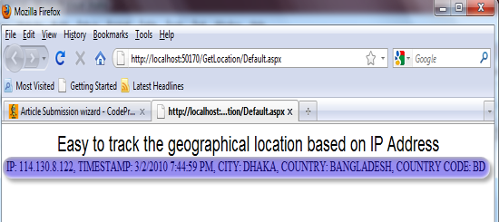

# Easy to Track the Geographical Location Based on IP Address.
## Requires
- Visual Studio 2008
## License
- Apache License, Version 2.0
## Technologies
- ASP.NET
- Visual Studio Extensions
- .NET 3.0
- .NET Framework 4.0
## Topics
- Security
- IP Address
- WebBrowser
- HttpWebRequest
## Updated
- 04/28/2011
## Description

<h2>Table of Contents</h2>

<em>* Introduction 
* Quick Overview 
* How to Achieve 
&nbsp;&nbsp;&nbsp;&nbsp;&nbsp;&nbsp;o How to Use the Services 
&nbsp;&nbsp;&nbsp;&nbsp;&nbsp;&nbsp;o Get the User IP 
&nbsp;&nbsp;&nbsp;&nbsp;&nbsp; o Get the User Location</em>

<em>&nbsp;* Conclusion 
&nbsp;* References 
&nbsp;* History</em>

<h1>Introduction</h1>

Developers are very much familiar with the use of IP tracking system, Microsoft Visual Studio .NET provides a number of class, methods to do this. This article is not about getting the user IP only, but also finds the geographical location of a user who
 is browsing your ASP.NET application. For example, you have an ASP.NET application, your hosting is done, your web address is suppose &rdquo;www.xyz.com&rdquo;, now you want to track / maintain a log of the visitors IP with the location something like:

IP: XXX.XXX.XXX.XXX, TIMESTAMP: 3/2/2010 4:18:39 PM, COUNTRY= BANGLADESH,  
COUNTRY CODE= BD, CITY= DHAKA, etc.

Sample output figure:

<h1>Quick Overview</h1>

Before we start, we need to know some basic knowledge, on <a class="libraryLink" href="http://msdn.microsoft.com/en-US/library/System.Net.aspx" target="_blank" title="Auto generated link to System.Net">System.Net</a>, <a class="libraryLink" href="http://msdn.microsoft.com/en-US/library/System.Data.aspx" target="_blank" title="Auto generated link to System.Data">System.Data</a> namespace provide by Microsoft Visual Studio .Net, HTTP Server variables.

More information can be found at<a href="http://msdn.microsoft.com/en-us/library/system.net.aspx" target="_blank"> this link</a>.

<h1>How to Achieve</h1>

If you search for the solution on the internet; you may get many ways to do it. For example, you can use web service or download database containing the location mapped with the IP, but most of them are not free to use / allow you to a very limited number
 of hits per day&hellip; I found some sites that allow you free access for getting the user location from IP, some of the site(s) are listed below:

&nbsp;&nbsp;&nbsp; * <a href="http://freegeoip.appspot.com">http://freegeoip.appspot.com</a> 
&nbsp;&nbsp;&nbsp; * <a href="http://ws.cdyne.com/">http://ws.cdyne.com/</a> 
&nbsp;&nbsp;&nbsp; * <a href="http://ipinfodb.com/">http://ipinfodb.com/</a>

Note: All the above listed addresses reply in standard XML format.

<h2>How to Use the Services</h2>

In this section, I would like to discuss how to use the site(s) to retrieve a user geographical location. You can choose any one of them, before that you need to know what are the parameters required, let's start one by one: 
(i)http://freegeoip.appspot.com

Parameter: IP Address (xxx.xxx.xxx.xxx). 
URL sample: <a href="http://freegeoip.appspot.com/xml/xxx.xxx.xxx.xxx">http://freegeoip.appspot.com/xml/xxx.xxx.xxx.xxx</a> 
Output: Standard XML

XML

Edit|Remove

xml

<pre class="xml">&lt;?xml&nbsp;version=&quot;1.0&quot;&nbsp;encoding=&quot;UTF-8&quot;?&gt;&nbsp;
&lt;Response&gt;&nbsp;
&nbsp;&nbsp;&nbsp;&nbsp;&lt;Status&gt;true&lt;/Status&gt;&nbsp;
&nbsp;&nbsp;&nbsp;&nbsp;&lt;Ip&gt;xxx.xxx.xxx.xxx&lt;/Ip&gt;&nbsp;
&nbsp;&nbsp;&nbsp;&nbsp;&lt;CountryCode&gt;BD&lt;/CountryCode&gt;&nbsp;
&nbsp;&nbsp;&nbsp;&nbsp;&lt;CountryName&gt;Bangladesh&lt;/CountryName&gt;&nbsp;
&nbsp;&nbsp;&nbsp;&nbsp;&lt;RegionCode&gt;81&lt;/RegionCode&gt;&nbsp;
&nbsp;&nbsp;&nbsp;&nbsp;&lt;RegionName&gt;Dhaka&lt;/RegionName&gt;&nbsp;
&nbsp;&nbsp;&nbsp;&nbsp;&lt;City&gt;Dhaka&lt;/City&gt;&nbsp;
&nbsp;&nbsp;&nbsp;&nbsp;&lt;ZipCode&gt;&lt;/ZipCode&gt;&nbsp;
&nbsp;&nbsp;&nbsp;&nbsp;&lt;Latitude&gt;23.723&lt;/Latitude&gt;&nbsp;
&nbsp;&nbsp;&nbsp;&nbsp;&lt;Longitude&gt;90.4086&lt;/Longitude&gt;&nbsp;
&lt;/Response&gt;&nbsp;
&nbsp;
&nbsp;
&nbsp;
</pre>

&nbsp;

(ii)http://ws.cdyne.com/

&nbsp;&nbsp;&nbsp; * Parameter: IP Address (xxx.xxx.xxx.xxx) &amp; License Key 
&nbsp;&nbsp;&nbsp; * URL sample: <a href="http://ws.cdyne.com/ip2geo/ip2geo.asmx/ResolveIP?ipAddress=xxx.xxx.xxx.xxx&licenseKey=0">
http://ws.cdyne.com/ip2geo/ip2geo.asmx/ResolveIP?ipAddress=xxx.xxx.xxx.xxx&amp;licenseKey=0</a> 
&nbsp;&nbsp;&nbsp; * Output: Standard XML

Output: Standard XML

XML

Edit|Remove

xml

<pre class="xml">&lt;?xml&nbsp;version=&quot;1.0&quot;&nbsp;encoding=&quot;utf-8&quot;?&gt;&nbsp;
&lt;IPInformation&nbsp;xmlns:xsi=http://www.w3.org/2001/XMLSchema-instance&nbsp;&nbsp;
&nbsp;xmlns:xsd=&quot;http://www.w3.org/2001/XMLSchema&quot;&nbsp;xmlns=&quot;http://ws.cdyne.com/&quot;&gt;&nbsp;
&nbsp;&nbsp;&lt;City&gt;Dhaka&lt;/City&gt;&nbsp;
&nbsp;&nbsp;&lt;StateProvince&gt;81&lt;/StateProvince&gt;&nbsp;
&nbsp;&nbsp;&lt;Country&gt;Bangladesh&lt;/Country&gt;&nbsp;
&nbsp;&nbsp;&lt;Organization&nbsp;/&gt;&nbsp;
&nbsp;&nbsp;&lt;Latitude&gt;23.72301&lt;/Latitude&gt;&nbsp;
&nbsp;&nbsp;&lt;Longitude&gt;90.4086&lt;/Longitude&gt;&nbsp;
&nbsp;&nbsp;&lt;AreaCode&gt;0&lt;/AreaCode&gt;&nbsp;
&nbsp;&nbsp;&lt;TimeZone&nbsp;/&gt;&nbsp;
&nbsp;&nbsp;&lt;HasDaylightSavings&gt;false&lt;/HasDaylightSavings&gt;&nbsp;
&nbsp;&nbsp;&lt;Certainty&gt;90&lt;/Certainty&gt;&nbsp;
&nbsp;&nbsp;&lt;RegionName&nbsp;/&gt;&nbsp;
&nbsp;&nbsp;&lt;CountryCode&gt;BD&lt;/CountryCode&gt;&nbsp;
&lt;/IPInformation&gt;&nbsp;
&nbsp;
&nbsp;
&nbsp;
</pre>

&nbsp;

Blocks of code should be set as style &quot;Formatted&quot; like this: 
(iii)http://ipinfodb.com/

&nbsp;&nbsp;&nbsp; * Parameter: IP Address (xxx.xxx.xxx.xxx) 
&nbsp;&nbsp;&nbsp; * URL sample:http://ipinfodb.com/ip_query.php?ip=xxx.xxx.xxx.xxx0 
&nbsp;&nbsp;&nbsp; * Output: Standard XML

Output: Standard XML

XML

Edit|Remove

xml

<pre class="xml">&lt;?xml&nbsp;version=&quot;1.0&quot;&nbsp;encoding=&quot;UTF-8&quot;?&gt;&nbsp;
&lt;Response&gt;&nbsp;
&nbsp;&nbsp;&lt;Ip&gt;xxx.xxx.xxx.xxx&lt;/Ip&gt;&nbsp;
&nbsp;&nbsp;&lt;Status&gt;OK&lt;/Status&gt;&nbsp;
&nbsp;&nbsp;&lt;CountryCode&gt;BD&lt;/CountryCode&gt;&nbsp;
&nbsp;&nbsp;&lt;CountryName&gt;Bangladesh&lt;/CountryName&gt;&nbsp;
&nbsp;&nbsp;&lt;RegionCode&gt;81&lt;/RegionCode&gt;&nbsp;
&nbsp;&nbsp;&lt;RegionName&gt;Dhaka&lt;/RegionName&gt;&nbsp;
&nbsp;&nbsp;&lt;City&gt;Dhaka&lt;/City&gt;&nbsp;
&nbsp;&nbsp;&lt;ZipPostalCode&gt;&lt;/ZipPostalCode&gt;&nbsp;
&nbsp;&nbsp;&lt;Latitude&gt;23.7231&lt;/Latitude&gt;&nbsp;
&nbsp;&nbsp;&lt;Longitude&gt;90.4086&lt;/Longitude&gt;&nbsp;
&nbsp;&nbsp;&lt;Timezone&gt;6&lt;/Timezone&gt;&nbsp;
&nbsp;&nbsp;&lt;Gmtoffset&gt;6&lt;/Gmtoffset&gt;&nbsp;
&nbsp;&nbsp;&lt;Dstoffset&gt;6&lt;/Dstoffset&gt;&nbsp;
&lt;/Response&gt;&nbsp;
&nbsp;
&nbsp;
&nbsp;
&nbsp;
</pre>

&nbsp;

<h2>Get the User IP</h2>

I use a very common technique. Actually this is nothing but the using of HTTP server variables. The following server variables are used for this purpose.

&nbsp;&nbsp;&nbsp; * HTTP_X_FORWARDED_FOR 
&nbsp;&nbsp;&nbsp; * REMOTE_ADDR

A sample code snippet is given below:

C#

Edit|Remove

csharp

<pre class="csharp">private&nbsp;string&nbsp;GetVisitor()&nbsp;
&nbsp;&nbsp;&nbsp;&nbsp;{&nbsp;&nbsp;&nbsp;&nbsp;&nbsp;&nbsp;&nbsp;&nbsp;&nbsp;
&nbsp;&nbsp;&nbsp;&nbsp;&nbsp;&nbsp;&nbsp;&nbsp;string&nbsp;strIPAddress&nbsp;=&nbsp;string.Empty;&nbsp;
&nbsp;&nbsp;&nbsp;&nbsp;&nbsp;&nbsp;&nbsp;&nbsp;string&nbsp;strVisitorCountry&nbsp;=&nbsp;string.Empty;&nbsp;
&nbsp;
&nbsp;&nbsp;&nbsp;&nbsp;&nbsp;&nbsp;&nbsp;&nbsp;strIPAddress&nbsp;=&nbsp;Request.ServerVariables[&quot;HTTP_X_FORWARDED_FOR&quot;];&nbsp;
&nbsp;
&nbsp;&nbsp;&nbsp;&nbsp;&nbsp;&nbsp;&nbsp;&nbsp;if&nbsp;(strIPAddress&nbsp;==&nbsp;&quot;&quot;&nbsp;||&nbsp;strIPAddress&nbsp;==&nbsp;null)&nbsp;
&nbsp;&nbsp;&nbsp;&nbsp;&nbsp;&nbsp;&nbsp;&nbsp;&nbsp;&nbsp;&nbsp;&nbsp;strIPAddress&nbsp;=&nbsp;Request.ServerVariables[&quot;REMOTE_ADDR&quot;];&nbsp;
&nbsp;
&nbsp;&nbsp;&nbsp;&nbsp;&nbsp;&nbsp;&nbsp;&nbsp;Tools.GetLocation.IVisitorsGeographicalLocation&nbsp;_objLocation;&nbsp;
&nbsp;&nbsp;&nbsp;&nbsp;&nbsp;&nbsp;&nbsp;&nbsp;_objLocation&nbsp;=&nbsp;new&nbsp;Tools.GetLocation.ClsVisitorsGeographicalLocation();&nbsp;
&nbsp;
&nbsp;&nbsp;&nbsp;&nbsp;&nbsp;&nbsp;&nbsp;&nbsp;DataTable&nbsp;_objDataTable&nbsp;=&nbsp;_objLocation.GetLocation(strIPAddress);&nbsp;
&nbsp;
&nbsp;&nbsp;&nbsp;&nbsp;&nbsp;&nbsp;&nbsp;&nbsp;if&nbsp;(_objDataTable&nbsp;!=&nbsp;null)&nbsp;
&nbsp;&nbsp;&nbsp;&nbsp;&nbsp;&nbsp;&nbsp;&nbsp;{&nbsp;
&nbsp;&nbsp;&nbsp;&nbsp;&nbsp;&nbsp;&nbsp;&nbsp;&nbsp;&nbsp;&nbsp;&nbsp;if&nbsp;(_objDataTable.Rows.Count&nbsp;&gt;&nbsp;0)&nbsp;
&nbsp;&nbsp;&nbsp;&nbsp;&nbsp;&nbsp;&nbsp;&nbsp;&nbsp;&nbsp;&nbsp;&nbsp;{&nbsp;
&nbsp;&nbsp;&nbsp;&nbsp;&nbsp;&nbsp;&nbsp;&nbsp;&nbsp;&nbsp;&nbsp;&nbsp;&nbsp;&nbsp;&nbsp;&nbsp;strVisitorCountry&nbsp;=&nbsp;&nbsp;
&nbsp;&nbsp;&nbsp;&nbsp;&nbsp;&nbsp;&nbsp;&nbsp;&nbsp;&nbsp;&nbsp;&nbsp;&nbsp;&nbsp;&nbsp;&nbsp;&nbsp;&nbsp;&nbsp;&nbsp;&nbsp;&nbsp;&nbsp;&nbsp;&nbsp;&nbsp;&nbsp;&nbsp;&quot;IP:&nbsp;&quot;&nbsp;
&nbsp;&nbsp;&nbsp;&nbsp;&nbsp;&nbsp;&nbsp;&nbsp;&nbsp;&nbsp;&nbsp;&nbsp;&nbsp;&nbsp;&nbsp;&nbsp;&nbsp;&nbsp;&nbsp;&nbsp;&nbsp;&nbsp;&nbsp;&nbsp;&nbsp;&nbsp;&nbsp;&nbsp;&#43;&nbsp;strIPAddress&nbsp;
&nbsp;&nbsp;&nbsp;&nbsp;&nbsp;&nbsp;&nbsp;&nbsp;&nbsp;&nbsp;&nbsp;&nbsp;&nbsp;&nbsp;&nbsp;&nbsp;&nbsp;&nbsp;&nbsp;&nbsp;&nbsp;&nbsp;&nbsp;&nbsp;&nbsp;&nbsp;&nbsp;&nbsp;&#43;&nbsp;&quot;,&nbsp;TIMESTAMP:&nbsp;&quot;&nbsp;&nbsp;
&nbsp;&nbsp;&nbsp;&nbsp;&nbsp;&nbsp;&nbsp;&nbsp;&nbsp;&nbsp;&nbsp;&nbsp;&nbsp;&nbsp;&nbsp;&nbsp;&nbsp;&nbsp;&nbsp;&nbsp;&nbsp;&nbsp;&nbsp;&nbsp;&nbsp;&nbsp;&nbsp;&nbsp;&#43;&nbsp;Convert.ToString(<a class="libraryLink" href="http://msdn.microsoft.com/en-US/library/System.DateTime.Now.aspx" target="_blank" title="Auto generated link to System.DateTime.Now">System.DateTime.Now</a>)&nbsp;&nbsp;&nbsp;&nbsp;&nbsp;&nbsp;
&nbsp;&nbsp;&nbsp;&nbsp;&nbsp;&nbsp;&nbsp;&nbsp;&nbsp;&nbsp;&nbsp;&nbsp;&nbsp;&nbsp;&nbsp;&nbsp;&nbsp;&nbsp;&nbsp;&nbsp;&nbsp;&nbsp;&nbsp;&nbsp;&nbsp;&nbsp;&nbsp;&nbsp;&#43;&nbsp;&quot;,&nbsp;CITY:&nbsp;&quot;&nbsp;
&nbsp;&nbsp;&nbsp;&nbsp;&nbsp;&nbsp;&nbsp;&nbsp;&nbsp;&nbsp;&nbsp;&nbsp;&nbsp;&nbsp;&nbsp;&nbsp;&nbsp;&nbsp;&nbsp;&nbsp;&nbsp;&nbsp;&nbsp;&nbsp;&nbsp;&nbsp;&nbsp;&nbsp;&#43;&nbsp;Convert.ToString(_objDataTable.Rows[0][&quot;City&quot;]).ToUpper()&nbsp;
&nbsp;&nbsp;&nbsp;&nbsp;&nbsp;&nbsp;&nbsp;&nbsp;&nbsp;&nbsp;&nbsp;&nbsp;&nbsp;&nbsp;&nbsp;&nbsp;&nbsp;&nbsp;&nbsp;&nbsp;&nbsp;&nbsp;&nbsp;&nbsp;&nbsp;&nbsp;&nbsp;&nbsp;&#43;&nbsp;&quot;,&nbsp;COUNTRY:&nbsp;&quot;&nbsp;
&nbsp;&nbsp;&nbsp;&nbsp;&nbsp;&nbsp;&nbsp;&nbsp;&nbsp;&nbsp;&nbsp;&nbsp;&nbsp;&nbsp;&nbsp;&nbsp;&nbsp;&nbsp;&nbsp;&nbsp;&nbsp;&nbsp;&nbsp;&nbsp;&nbsp;&nbsp;&nbsp;&nbsp;&#43;&nbsp;Convert.ToString(_objDataTable.Rows[0]&nbsp;
&nbsp;&nbsp;&nbsp;&nbsp;&nbsp;[&quot;CountryName&quot;]).ToUpper()&nbsp;
&nbsp;&nbsp;&nbsp;&nbsp;&nbsp;&nbsp;&nbsp;&nbsp;&nbsp;&nbsp;&nbsp;&nbsp;&nbsp;&nbsp;&nbsp;&nbsp;&nbsp;&nbsp;&nbsp;&nbsp;&nbsp;&nbsp;&nbsp;&nbsp;&nbsp;&nbsp;&nbsp;&nbsp;&#43;&nbsp;&quot;,&nbsp;COUNTRY&nbsp;CODE:&nbsp;&quot;&nbsp;
&nbsp;&nbsp;&nbsp;&nbsp;&nbsp;&nbsp;&nbsp;&nbsp;&nbsp;&nbsp;&nbsp;&nbsp;&nbsp;&nbsp;&nbsp;&nbsp;&nbsp;&nbsp;&nbsp;&nbsp;&nbsp;&nbsp;&nbsp;&nbsp;&nbsp;&nbsp;&nbsp;&nbsp;&#43;&nbsp;Convert.ToString(_objDataTable.Rows[0]&nbsp;
&nbsp;&nbsp;&nbsp;&nbsp;&nbsp;[&quot;CountryCode&quot;]).ToUpper();&nbsp;
&nbsp;&nbsp;&nbsp;&nbsp;&nbsp;&nbsp;&nbsp;&nbsp;&nbsp;&nbsp;&nbsp;&nbsp;}&nbsp;
&nbsp;&nbsp;&nbsp;&nbsp;&nbsp;&nbsp;&nbsp;&nbsp;&nbsp;&nbsp;&nbsp;&nbsp;else&nbsp;
&nbsp;&nbsp;&nbsp;&nbsp;&nbsp;&nbsp;&nbsp;&nbsp;&nbsp;&nbsp;&nbsp;&nbsp;{&nbsp;
&nbsp;&nbsp;&nbsp;&nbsp;&nbsp;&nbsp;&nbsp;&nbsp;&nbsp;&nbsp;&nbsp;&nbsp;&nbsp;&nbsp;&nbsp;&nbsp;strVisitorCountry&nbsp;=&nbsp;null;&nbsp;
&nbsp;&nbsp;&nbsp;&nbsp;&nbsp;&nbsp;&nbsp;&nbsp;&nbsp;&nbsp;&nbsp;&nbsp;}&nbsp;
&nbsp;&nbsp;&nbsp;&nbsp;&nbsp;&nbsp;&nbsp;&nbsp;}&nbsp;
&nbsp;&nbsp;&nbsp;&nbsp;&nbsp;&nbsp;&nbsp;&nbsp;return&nbsp;strVisitorCountry;&nbsp;
&nbsp;&nbsp;&nbsp;&nbsp;}&nbsp;
&nbsp;
&nbsp;
&nbsp;
&nbsp;
</pre>

&nbsp;

<h2>Get the User Location</h2>

To get the location, you just need to use the following provided by Microsoft Visual Studio .NET:

&nbsp;&nbsp;&nbsp; * WebRequest 
&nbsp;&nbsp;&nbsp; * WebResponse 
&nbsp;&nbsp;&nbsp; * WebProxy

More information can be found at<a href="http://msdn.microsoft.com/en-us/library/system.net.webrequest.aspx" target="_blank"> this link</a>.

A sample code snippet is given below:

C#

Edit|Remove

csharp

<pre class="csharp">public&nbsp;DataTable&nbsp;GetLocation(string&nbsp;strIPAddress)&nbsp;
&nbsp;&nbsp;&nbsp;&nbsp;&nbsp;&nbsp;&nbsp;&nbsp;{&nbsp;
&nbsp;&nbsp;&nbsp;&nbsp;&nbsp;&nbsp;&nbsp;&nbsp;&nbsp;&nbsp;&nbsp;&nbsp;//Create&nbsp;a&nbsp;WebRequest&nbsp;with&nbsp;the&nbsp;current&nbsp;Ip&nbsp;
&nbsp;&nbsp;&nbsp;&nbsp;&nbsp;&nbsp;&nbsp;&nbsp;&nbsp;&nbsp;&nbsp;&nbsp;WebRequest&nbsp;_objWebRequest&nbsp;=&nbsp;
&nbsp;&nbsp;&nbsp;&nbsp;&nbsp;&nbsp;&nbsp;&nbsp;&nbsp;&nbsp;&nbsp;&nbsp;&nbsp;&nbsp;&nbsp;&nbsp;WebRequest.Create(http://freegeoip.appspot.com/xml/&nbsp;&nbsp;
&nbsp;&nbsp;//http://ipinfodb.com/ip_query.php?ip=&nbsp;
&nbsp;&nbsp;&nbsp;&nbsp;&nbsp;&nbsp;&nbsp;&nbsp;&nbsp;&nbsp;&nbsp;&nbsp;&nbsp;&nbsp;&nbsp;&nbsp;&nbsp;&nbsp;&nbsp;&nbsp;&nbsp;&nbsp;&nbsp;&nbsp;&nbsp;&nbsp;&nbsp;&nbsp;&nbsp;&nbsp;&nbsp;&#43;&nbsp;strIPAddress);&nbsp;
&nbsp;&nbsp;&nbsp;&nbsp;&nbsp;&nbsp;&nbsp;&nbsp;&nbsp;&nbsp;&nbsp;&nbsp;//Create&nbsp;a&nbsp;Web&nbsp;Proxy&nbsp;
&nbsp;&nbsp;&nbsp;&nbsp;&nbsp;&nbsp;&nbsp;&nbsp;&nbsp;&nbsp;&nbsp;&nbsp;WebProxy&nbsp;_objWebProxy&nbsp;=&nbsp;
&nbsp;&nbsp;&nbsp;&nbsp;&nbsp;&nbsp;&nbsp;&nbsp;&nbsp;&nbsp;&nbsp;&nbsp;&nbsp;&nbsp;&nbsp;new&nbsp;WebProxy(&quot;http://freegeoip.appspot.com/xml/&quot;&nbsp;
&nbsp;&nbsp;&nbsp;&nbsp;&nbsp;&nbsp;&nbsp;&nbsp;&nbsp;&nbsp;&nbsp;&nbsp;&nbsp;&nbsp;&nbsp;&nbsp;&nbsp;&nbsp;&nbsp;&nbsp;&nbsp;&nbsp;&nbsp;&nbsp;&nbsp;&#43;&nbsp;strIPAddress,&nbsp;true);&nbsp;
&nbsp;
&nbsp;&nbsp;&nbsp;&nbsp;&nbsp;&nbsp;&nbsp;&nbsp;&nbsp;&nbsp;&nbsp;&nbsp;//Assign&nbsp;the&nbsp;proxy&nbsp;to&nbsp;the&nbsp;WebRequest&nbsp;
&nbsp;&nbsp;&nbsp;&nbsp;&nbsp;&nbsp;&nbsp;&nbsp;&nbsp;&nbsp;&nbsp;&nbsp;_objWebRequest.Proxy&nbsp;=&nbsp;_objWebProxy;&nbsp;
&nbsp;
&nbsp;&nbsp;&nbsp;&nbsp;&nbsp;&nbsp;&nbsp;&nbsp;&nbsp;&nbsp;&nbsp;&nbsp;//Set&nbsp;the&nbsp;timeout&nbsp;in&nbsp;Seconds&nbsp;for&nbsp;the&nbsp;WebRequest&nbsp;
&nbsp;&nbsp;&nbsp;&nbsp;&nbsp;&nbsp;&nbsp;&nbsp;&nbsp;&nbsp;&nbsp;&nbsp;_objWebRequest.Timeout&nbsp;=&nbsp;2000;&nbsp;
&nbsp;
&nbsp;&nbsp;&nbsp;&nbsp;&nbsp;&nbsp;&nbsp;&nbsp;&nbsp;&nbsp;&nbsp;&nbsp;try&nbsp;
&nbsp;&nbsp;&nbsp;&nbsp;&nbsp;&nbsp;&nbsp;&nbsp;&nbsp;&nbsp;&nbsp;&nbsp;{&nbsp;
&nbsp;&nbsp;&nbsp;&nbsp;&nbsp;&nbsp;&nbsp;&nbsp;&nbsp;&nbsp;&nbsp;&nbsp;&nbsp;&nbsp;&nbsp;&nbsp;//Get&nbsp;the&nbsp;WebResponse&nbsp;&nbsp;
&nbsp;&nbsp;&nbsp;&nbsp;&nbsp;&nbsp;&nbsp;&nbsp;&nbsp;&nbsp;&nbsp;&nbsp;&nbsp;&nbsp;&nbsp;&nbsp;WebResponse&nbsp;_objWebResponse&nbsp;=&nbsp;_objWebRequest.GetResponse();&nbsp;
&nbsp;&nbsp;&nbsp;&nbsp;&nbsp;&nbsp;&nbsp;&nbsp;&nbsp;&nbsp;&nbsp;&nbsp;&nbsp;&nbsp;&nbsp;&nbsp;//Read&nbsp;the&nbsp;Response&nbsp;in&nbsp;a&nbsp;XMLTextReader&nbsp;
&nbsp;&nbsp;&nbsp;&nbsp;&nbsp;&nbsp;&nbsp;&nbsp;&nbsp;&nbsp;&nbsp;&nbsp;&nbsp;&nbsp;&nbsp;&nbsp;XmlTextReader&nbsp;_objXmlTextReader&nbsp;
&nbsp;&nbsp;&nbsp;&nbsp;&nbsp;&nbsp;&nbsp;&nbsp;&nbsp;&nbsp;&nbsp;&nbsp;&nbsp;&nbsp;&nbsp;&nbsp;&nbsp;&nbsp;&nbsp;&nbsp;=&nbsp;new&nbsp;XmlTextReader(_objWebResponse.GetResponseStream());&nbsp;
&nbsp;
&nbsp;&nbsp;&nbsp;&nbsp;&nbsp;&nbsp;&nbsp;&nbsp;&nbsp;&nbsp;&nbsp;&nbsp;&nbsp;&nbsp;&nbsp;&nbsp;//Create&nbsp;a&nbsp;new&nbsp;DataSet&nbsp;
&nbsp;&nbsp;&nbsp;&nbsp;&nbsp;&nbsp;&nbsp;&nbsp;&nbsp;&nbsp;&nbsp;&nbsp;&nbsp;&nbsp;&nbsp;&nbsp;DataSet&nbsp;_objDataSet&nbsp;=&nbsp;new&nbsp;DataSet();&nbsp;
&nbsp;&nbsp;&nbsp;&nbsp;&nbsp;&nbsp;&nbsp;&nbsp;&nbsp;&nbsp;&nbsp;&nbsp;&nbsp;&nbsp;&nbsp;&nbsp;//Read&nbsp;the&nbsp;Response&nbsp;into&nbsp;the&nbsp;DataSet&nbsp;
&nbsp;&nbsp;&nbsp;&nbsp;&nbsp;&nbsp;&nbsp;&nbsp;&nbsp;&nbsp;&nbsp;&nbsp;&nbsp;&nbsp;&nbsp;&nbsp;_objDataSet.ReadXml(_objXmlTextReader);&nbsp;
&nbsp;
&nbsp;&nbsp;&nbsp;&nbsp;&nbsp;&nbsp;&nbsp;&nbsp;&nbsp;&nbsp;&nbsp;&nbsp;&nbsp;&nbsp;&nbsp;&nbsp;return&nbsp;_objDataSet.Tables[0];&nbsp;
&nbsp;&nbsp;&nbsp;&nbsp;&nbsp;&nbsp;&nbsp;&nbsp;&nbsp;&nbsp;&nbsp;&nbsp;}&nbsp;
&nbsp;&nbsp;&nbsp;&nbsp;&nbsp;&nbsp;&nbsp;&nbsp;&nbsp;&nbsp;&nbsp;&nbsp;catch&nbsp;
&nbsp;&nbsp;&nbsp;&nbsp;&nbsp;&nbsp;&nbsp;&nbsp;&nbsp;&nbsp;&nbsp;&nbsp;{&nbsp;
&nbsp;&nbsp;&nbsp;&nbsp;&nbsp;&nbsp;&nbsp;&nbsp;&nbsp;&nbsp;&nbsp;&nbsp;&nbsp;&nbsp;&nbsp;&nbsp;return&nbsp;null;&nbsp;
&nbsp;&nbsp;&nbsp;&nbsp;&nbsp;&nbsp;&nbsp;&nbsp;&nbsp;&nbsp;&nbsp;&nbsp;}&nbsp;
&nbsp;&nbsp;&nbsp;&nbsp;&nbsp;&nbsp;&nbsp;&nbsp;}&nbsp;//&nbsp;End&nbsp;of&nbsp;GetLocation&nbsp;&nbsp;&nbsp;
&nbsp;
&nbsp;
&nbsp;
&nbsp;
</pre>

&nbsp;

<h1>Conclusion</h1>

I hope this might be helpful to you! Enjoy.

<h1> 
References</h1>

&nbsp;&nbsp;&nbsp; * MSDN

<h1>History</h1>

&nbsp;&nbsp;&nbsp; * 2nd March, 2010: Initial post

