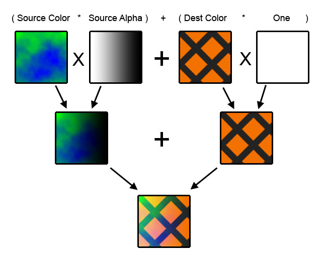

# Effects Tutorial Win32 Sample
## Requires
- Visual Studio 2012
## License
- MIT
## Technologies
- Win32
- DirectX
- DirectX SDK
## Topics
- Graphics and 3D
## Updated
- 10/12/2015
## Description

The latest version of this sample is hosted on <a href="https://github.com/walbourn/directx-sdk-samples">
GitHub</a>.

This is the DirectX SDK's Direct3D Tutorial11, Tutorial12, Tutorial13, and Tutorial14 samples updated to use Visual Studio 2012 and the Windows SDK 8.0 without any dependancies on legacy DirectX SDK content. These samples are Win32 desktop DirectX 11.0 applications
 for Windows 8.x, Windows 7, and Windows Vista Service Pack 2 with the DirectX 11.0 runtime.

<strong>This is based on the legacy DirectX SDK (June 2010) Win32 desktop samples running on Windows Vista, Windows 7, and Windows 8.x. This is not intended for use with Windows Store apps or Windows RT.</strong>

<h1>Description</h1>

The original Direct3D 10 tutorial series covered Win32 basics in Tutorial01 - Tutorial07, DXUT in Tutorial08 - Tutorial10, and then Effects 10 in Tutorial11 - Tutorial14. The Direct3D 11 versions of Tutorial01 - Tutorial 07 can be found on
<a href="http://code.msdn.microsoft.com/Direct3D-Tutorial-Win32-829979ef">MSDN Code Gallery</a> along with the
<a href="http://code.msdn.microsoft.com/DXUT-Tutorial-Win32-Sample-fe15e440">DXUT tutorials</a>. This is Tutorial11 - Tutorial14 updated to use the
<a href="http://go.microsoft.com/fwlink/?LinkId=320437">DXUT for Direct3D 11</a> framework and
<a href="http://go.microsoft.com/fwlink/p/?LinkId=271568">Effects 11 library</a> for Win32 desktop applications.

<h1>Tutorial11</h1>

This tutorial will emphasize on the capabilities of the vertex shader. It is meant to show the users the possibilities of allowing manipulation of vertices.

The outcome of this tutorial will be a wave effect imposed on the character model from the previous tutorial. This effect is done entirely by the GPU with no CPU interaction with the data.

<h2>Vertex Shader</h2>

While previous tutorials already have shown the use of the vertex shader, this tutorial is meant to emphasize this stage in the pipeline. Vertices contain various types of information such as coordinates, normals, texture coordinates, materials, colors,
 and even custom data. For example, if you look under the ParticlesGS sample, you will see that each vertex passed into the pipeline will also contain a variable called Timer, which can vary the appearance of the particle over time.

The purpose of the vertex shader is to offload intensive calculations from the CPU, onto the GPU. This frees up the CPU to accomplish other tasks within the application. For example, games often offload the graphics processing to the GPU, while the AI and
 physics is done on the CPU itself.

This tutorial is meant to show the possibilities of the vertex shader, rather than to teach specific techniques. It is encouraged that you try new effects and experiment with the results. For specific methods to achieve effects, refer to the samples included
 with the SDK. However, do note that they are more complex in nature and apply much more advanced concepts.

<h2>Creating the Wave Effect</h2>

The wave effect on the model is created by modulating the x position of each point by a sine wave. The sine wave is controlled by the y position, thus creating a wave along the model. However, to make the wave move and appear animated, the sine wave is also
 modulated by a time variable.

Finally, there is a variable to control the amount of displacement by the vertex shader, and that is the waviness variable specified. This variable is passed into the shader and controlled by a GUI slider.

<pre>&nbsp;&nbsp;&nbsp; output.Pos.x &#43;= sin( output.Pos.y*0.1f &#43; Time )*Waviness;</pre>

After this manipulation is done, the vertex shader will still have to prepare the vertices for display. Thus, there is still the transformation of the world, view, and projection matrices. However, we chose to do the world transformation before the wave
 effect, as it would be easier to determine the effects on the screen, since the x and y axis are apparent.

<pre>&nbsp;&nbsp;&nbsp; output.Pos = mul( output.Pos, View ); &nbsp;&nbsp;&nbsp; output.Pos = mul( output.Pos, Projection );&nbsp;</pre>
<h1>Tutorial12</h1>

This tutorial focuses on the pixel shader and its capabilities. There are many things that can be accomplished with the pixel shader, and some of the more common functions are listed. The pixel shader will apply an environment map to the object.

The outcome of the tutorial is that the model will become shiny, and it will reflect its surrounding environment.

<h2>Pixel Shaders</h2>

Pixel shaders are used to manipulate the final color of a pixel before it reaches the output merger. Each pixel that is rendered will be passed through this shader before output. Once the pixel has passed through the pixel shader, the only operations that
 can be performed are those performed by the output merger, such as alpha blending, depth testing, stencil testing, and so on.

The pixel shader evolved from the texture mapping found in early hardware. Instead of just a simple texture lookup, it is possible to compute the final color from multiple sources, as well as alter it according to the vertex data. For general applications,
 however, a pixel shader does multiple lookups on different textures.

<h2>Environment Map</h2>

On surfaces which are reflective, it is not possible to just do a texture lookup on fixed texture coordinates to determine the final color. This is because whenever the object or viewer moves, the reflection alters. Thus, we must update reflection every
 time something moves.

An effective method to trick the observer to believe it's a dynamic reflection of the environment is to generate a special texture that can wrap around the object. This texture is referred as a cube map. A cube map is effectively placing an object in the
 middle of a cube, with each face of the cube being a texture. An environment map is a cube map which has the textures which correspond to the view of the environment on that face. If the environment is static, these environment maps can be pre-generated. If
 the environment is dynamic, the cubemap needs to be updated on-the-fly. See the CubeMapGS sample for an illustration of how to do this.

From this environment map, we can calculate what a camera will see as the reflection. First we can find the direction the camera is viewing the object, and from that, reflect it off the normal of each pixel and perform a lookup based on that reflected vector.

<h2>Setting up the Environment Map</h2>

The setup of the environment map is not the emphasis of this tutorial. The procedure to follow is very similar to that of a normal texture map. Please refer to Tutorial 7, Texture Mapping and Constant Buffers, for an explanation of how to properly initialize
 a texture map and its associated resource view.

<pre>&nbsp;&nbsp;&nbsp; // Load the Environment Map &nbsp;&nbsp;&nbsp; ID3D11Resource *pResource = nullptr; &nbsp;&nbsp;&nbsp; V_RETURN( DXUTFindDXSDKMediaFileCch( str, MAX_PATH, L&quot;Lobby\\LobbyCube.dds&quot; ) ); &nbsp;&nbsp;&nbsp; V_RETURN( DXUTCreateTextureFromFile( pd3dDevice, str, NULL, NULL, &amp;pResource ) ); &nbsp;&nbsp;&nbsp; if(pResource) &nbsp;&nbsp;&nbsp; { &nbsp;&nbsp;&nbsp;&nbsp;&nbsp;&nbsp;&nbsp; g_pEnvMap = (ID3D11Texture2D*)pResource; &nbsp;&nbsp;&nbsp;&nbsp;&nbsp;&nbsp;&nbsp; pResource-&gt;Release(); &nbsp;&nbsp;&nbsp;&nbsp;&nbsp;&nbsp;&nbsp; D3D11_TEXTURECUBE_DESC desc; &nbsp;&nbsp;&nbsp;&nbsp;&nbsp;&nbsp;&nbsp; g_pEnvMap-&gt;GetDesc( &amp;desc ); &nbsp;&nbsp;&nbsp;&nbsp;&nbsp;&nbsp;&nbsp; D3D11_SHADER_RESOURCE_VIEW_DESC SRVDesc; &nbsp;&nbsp;&nbsp;&nbsp;&nbsp;&nbsp;&nbsp; ZeroMemory( &amp;SRVDesc, sizeof(SRVDesc) ); &nbsp;&nbsp;&nbsp;&nbsp;&nbsp;&nbsp;&nbsp; SRVDesc.Format = desc.Format; &nbsp;&nbsp;&nbsp;&nbsp;&nbsp;&nbsp;&nbsp; SRVDesc.ViewDimension = D3D11_SRV_DIMENSION_TEXTURECUBE; &nbsp;&nbsp;&nbsp;&nbsp;&nbsp;&nbsp;&nbsp; SRVDesc.TextureCube.MipLevels = desc.MipLevels; &nbsp;&nbsp;&nbsp;&nbsp;&nbsp;&nbsp;&nbsp; SRVDesc.TextureCube.MostDetailedMip = 0; &nbsp;&nbsp;&nbsp;&nbsp;&nbsp;&nbsp;&nbsp; V_RETURN(pd3dDevice-&gt;CreateShaderResourceView( g_pEnvMap, &amp;SRVDesc, &amp;g_pEnvMapSRV )); &nbsp;&nbsp;&nbsp; }</pre>
<pre>&nbsp;&nbsp;&nbsp; // Set the Environment Map &nbsp;&nbsp;&nbsp; g_pEnvMapVariable-&gt;SetResource( g_pEnvMapSRV );</pre>
<h2>Implementing the Lookup</h2>

We will step through the simple algorithm described above and perform a proper lookup of an environment map. The calculations are done in the vertex shader and then interpolated to the pixel shader for the lookup. It is better to compute it in the vertex
 shader and interpolate to the pixel shader since there are fewer computations necessary.

To compute the reflected vector for the lookup, we require two pieces of information. First is the normal of the pixel in question, second is the direction of the eye.

Since the operation is done in view space, we must transform the pixel's normal to proper viewing space.

<pre>&nbsp;&nbsp;&nbsp; float3 viewNorm = mul( input.Norm, (float3x3)View );</pre>

Next we need to find the direction of the camera. Note, however, that we are already in view space, and thus, the camera's direction is that of the Z-axis (0,0,-1.0), since we are staring directly at the object.

Now that we have our two pieces of information, we can calculate the reflection of the vector with the reflect command. The variable ViewR is used to store the resulting reflection for processing in the pixel shader.

<pre>&nbsp;&nbsp;&nbsp; output.ViewR = reflect( viewNorm, float3(0,0,-1.0) );</pre>

Once the correct vector has been calculated in the vertex shader, we can process the environment map in the pixel shader. This is done by calling a built-in function to sample the environment map and return the color value from that texture.

<pre>&nbsp;&nbsp;&nbsp; // Load the environment map texture &nbsp;&nbsp;&nbsp; float4 cReflect = g_txEnvMap.Sample( samLinearClamp, viewR );</pre>

Since it is all normalized (and texture coordinates range from 0 to 1), the x and y coordinates will correspond directly to the texture coordinates that it needs to look up.

As a bonus, we included the code to do the original flat texture lookup, and computed that as the diffuse term. To play with the amount of reflection, you can modulate cReflect by a scaling factor against cDiffuse and experiment with the results. You can
 have a very reflective character or a somewhat dull character.

<h1>Tutorial13</h1>

This tutorial will explore a part of the graphics pipeline that has not been touched in the previous tutorials. We will be touching upon some basic geometry shader functionality.

The outcome of this tutorial is that the model will have a second layer extruded from the model. Note that the original model is still preserved at the center.

<h2>Geometry Shader</h2>

The benefit of the geometry shader (GS) is that it allows manipulation of meshes on a per-primitive basis. Instead of running a computation on each vertex individually, there is the option to operate on a per-primitive basis. That is, vertices can be passed
 in as a single vertex, a line segment (two vertices), or as a triangle (three vertices).

By allowing manipulation on a per-primitive level, new ideas can be approached, and there is more access to data to allow for that. In the tutorial, you will see that we have calculated the normal for the face. By knowing the position of all three vertices,
 we can find the face normal.

In addition to allowing access to whole primitives, the geometry shader can create new primitives on the fly. Previously in Direct3D, the graphics pipeline was only able to manipulate existing content, and it could amplify or deamplify data. The geometry
 shader in Direct3D can read in a single primitive (with optional edge-adjacent primitives) and emit zero, one, or multiple primitives based on that.

It is possible to emit a different type of geometry than the input source. For instance, it is possible to read in individual vertices, and generate multiple triangles based on those. This allows a wide range of new ideas to be executed on the graphics pipeline
 without CPU intervention.

The geometry shader exists between the vertex and the pixel shaders in the graphics pipeline. Since new geometry can potentially be created by the geometry shader, we must ensure that they are also properly transformed to projection space before we pass
 them off to the pixel shader (PS). This can either be done by the vertex shader (VS) before it enters the geometry shader, or it can be done within the geometry shader itself.

Finally, the output of the GS can be rerouted to a buffer. You can read in a bunch of triangles, generate new geometry, and store them in a new buffer. However, the concept of stream output is beyond the scope of tutorials, and it is best shown in the samples
 found in the SDK.

<h2>Formatting a Geometry Shader</h2>

Unlike the VS and the PS, the geometry shader does not necessarily produce a static number of outputs per input. As such, the format to declare the shader is different from the other two.

The first parameter is maxvertexcount. This parameter describes the maximum number of vertices that can be output each time that the shader is run. This is followed by the name of the geometry shader, which has been aptly named GS.

The function name is followed by the parameters passed into the function. The first contains the keyword triangle, which specifies that the GS will operate on triangles as input. Following that is the vertex format, and the identifier (with the number signifying
 the size of the array, 3 for triangles, 2 for line segments). The second parameter is the output format and stream. TriangleStream signifies that the output will be in triangles (triangle strips to be exact), then the format is specified in the angled brackets.
 Finally, the identifier for the stream is denoted.

<pre>&nbsp;&nbsp;&nbsp; [maxvertexcount(12)] &nbsp;&nbsp;&nbsp; void GS( triangle GSPS_INPUT input[3], inout TriangleStream&lt;GSPS_INPUT&gt; TriStream )</pre>

If vertices start being emitted to a TriangleStream, it will assume that they are all linked together as a strip. To end a strip, call RestartStrip within the stream. To create a triangle list, you have to make sure that you call RestartStrip after every
 triangle.

<h2>Exploding the Model</h2>

In this tutorial, we cover the basic functions of the geometry shader. To illustrate this, we will create an explosion effect on our model. This effect is created by extruding each vertex in the direction of that triangle's normal.

Note that a similar effect has been implemented in previous tutorials, whereby we extrude each vertex by its normal, controlled by the puffiness slider. This tutorial demonstrates the usage of the full triangle's information to generate the face normal.
 The difference of using the face normal is that you will see gaps between the exploded triangles. Because vertices on different triangles are shared, they will actually be passed twice into the geometry shader. Moreover, since each time it will extrude it
 in the normal of the triangle, as opposed to the vertex, the two final vertices may end up in different positions.

<h3>Calculating the face normal</h3>
<pre>To calculate the normal for any plane, we first need two vectors that reside on the plane. Since we are given a triangle, we can subtract any two vertices of the triangle to get the relative vectors. Once we have the vectors, we take the cross product to get the normal. We must also normalize the normal, since we will be scaling it later.</pre>
<pre>&nbsp;&nbsp;&nbsp; // &nbsp;&nbsp;&nbsp; // Calculate the face normal &nbsp;&nbsp;&nbsp; // &nbsp;&nbsp;&nbsp; float3 faceEdgeA = input[1].Pos - input[0].Pos; &nbsp;&nbsp;&nbsp; float3 faceEdgeB = input[2].Pos - input[0].Pos; &nbsp;&nbsp;&nbsp; float3 faceNormal = normalize( cross(faceEdgeA, faceEdgeB) );</pre>

Once we have the face normal, we can extrude each point of the triangle in that direction. To do so, we use a loop, which will step through three times and operate on each vertex. The position of the vertex is extruded by the normal, multiplied by a factor.
 Then, since the vertex shader has not transformed the vertices to proper projection space, we must also do that in the geometry shader. Finally, once we package the rest of the data, we can append this new vertex to our TriangleStream.

<pre>&nbsp;&nbsp;&nbsp; for( int v=0; v&lt;3; v&#43;&#43; ) 
&nbsp;&nbsp;&nbsp; { 
&nbsp;&nbsp;&nbsp;&nbsp;&nbsp;&nbsp;&nbsp; output.Pos = input[v].Pos &#43; float4(faceNormal*Explode,0); 
&nbsp;&nbsp;&nbsp;&nbsp;&nbsp;&nbsp;&nbsp; output.Pos = mul( output.Pos, View ); 
&nbsp;&nbsp;&nbsp;&nbsp;&nbsp;&nbsp;&nbsp; output.Pos = mul( output.Pos, Projection ); 
&nbsp;&nbsp;&nbsp;&nbsp;&nbsp;&nbsp;&nbsp;  
&nbsp;&nbsp;&nbsp;&nbsp;&nbsp;&nbsp;&nbsp; output.Norm = input[v].Norm; 
&nbsp;&nbsp;&nbsp;&nbsp;&nbsp;&nbsp;&nbsp;  
&nbsp;&nbsp;&nbsp;&nbsp;&nbsp;&nbsp;&nbsp; output.Tex = input[v].Tex; 
&nbsp;&nbsp;&nbsp;&nbsp;&nbsp;&nbsp;&nbsp;  
&nbsp;&nbsp;&nbsp;&nbsp;&nbsp;&nbsp;&nbsp; TriStream.Append( output ); 
&nbsp;&nbsp;&nbsp; }</pre>

Once the three vertices have been emitted, we can cut the strip and restart. In this tutorial, we want to extrude each triangle separately, so we end up with a triangle list.

<pre>&nbsp;&nbsp;&nbsp; TriStream.RestartStrip();</pre>

This new triangle stream is then sent to the pixel shader, which will operate on this data and draw it to the render target.

<h1>Tutorial14</h1>

This tutorial will explore a very important, but often overlooked aspect of Direct3D 11 programming, state. While not as glamorous or as flashy as shaders, state changes are indispensibly important when it comes to graphics programming. In fact, the same
 shader can have drastically different visual results based solely upon the state of the device at the time of rendering.

In this tutorial we will explore 3 main types of state objects, BlendStates, DepthStencilStates, and RasterizerStates. At the end of the tutorial, you should have a much better understanding of the way in which states interact to produce different representations
 of the same scene.

<h2>Blend States</h2>

Have you ever heard the term Alpha Blending? Alpha Blending involves modifying the color of a pixel being drawn to a certain screen location using the color of the pixel that already exists in that location. Blend States (ID3D11BlendState when used directly
 from the API and BlendState when used with FX) allow the developer to specify this interaction between new and old pixels. With the Blend State set to default, pixels just overwrite any pixels that already exist at the given screen coordinates during rasterization.
 Any information about the previous pixel that was drawn there is lost.

To give an example, pretend that your application is drawing the view of a city from inside a taxi cab. You've drawn thousands of buildings, sidewalks, telephone poles, trash cans, and other objects that make up a city. You have even drawn the interior of
 the cab. Now, as your last step, you want to draw the windows of the cab to make it look like as though you're actually peering through glass. Unfortunately, the pixels drawn during rasterization of the glass mesh completely overwrite the pixels already at
 those locations on the screen. This includes your beautiful city scene along with the sidewalks, telephone poles, and all of your other city objects. Wouldn't it be great if we could include the information that was already on the screen when drawing the glass
 windows of the cab? Wouldn't it also be great if we could do this with minimal changes in our current pixel shader code?

This is exactly what Blend States give you. To demonstrate this, our scene consists of a model and a quad.

<pre>&nbsp;&nbsp;&nbsp; // Load the mesh &nbsp;&nbsp;&nbsp; V_RETURN( g_Mesh.Create( pd3dDevice, L&quot;Tiny\\tiny.x&quot;, (D3D11_INPUT_ELEMENT_DESC*)layout, 3 ) );</pre>

Note that our quad has a different vertex format and therefore needs a different input layout description

<pre>&nbsp;&nbsp;&nbsp; // Create a screen quad &nbsp;&nbsp;&nbsp; const D3D11_INPUT_ELEMENT_DESC quadlayout[] = &nbsp;&nbsp;&nbsp; { &nbsp;&nbsp;&nbsp;&nbsp;&nbsp;&nbsp;&nbsp; { L&quot;POSITION&quot;, 0, DXGI_FORMAT_R32G32B32A32_FLOAT, 0, 0, D3D11_INPUT_PER_VERTEX_DATA, 0 }, &nbsp;&nbsp;&nbsp;&nbsp;&nbsp;&nbsp;&nbsp; { L&quot;TEXCOORD0&quot;, 0, DXGI_FORMAT_R32G32_FLOAT, 0, 16, D3D11_INPUT_PER_VERTEX_DATA, 0 }, &nbsp;&nbsp;&nbsp; };</pre>
<pre>&nbsp;&nbsp;&nbsp; g_pTechniqueQuad[0]-&gt;GetPassByIndex( 0 )-&gt;GetDesc( &amp;PassDesc ); &nbsp;&nbsp;&nbsp; V_RETURN( pd3dDevice-&gt;CreateInputLayout( quadlayout, 2, PassDesc.pIAInputSignature, &amp;g_pQuadLayout ) );</pre>
<pre>&nbsp;&nbsp;&nbsp; ...</pre>
<pre>&nbsp;&nbsp;&nbsp; D3D11_SUBRESOURCE_DATA InitData; &nbsp;&nbsp;&nbsp; InitData.pSysMem = svQuad; &nbsp;&nbsp;&nbsp; InitData.SysMemPitch = 0; &nbsp;&nbsp;&nbsp; InitData.SysMemSlicePitch = 0; &nbsp;&nbsp;&nbsp; V_RETURN( pd3dDevice-&gt;CreateBuffer( &amp;vbdesc, &amp;InitData, &amp;g_pScreenQuadVB ) );</pre>

When we render our scene we see the model of a person, with a quad drawn over the top.

Imagine that this person represents our city and the quad is really a pane of glass. When we launch the application, the situation is exactly as we described it above, we can't see through the glass. However, by selecting a different Quad Render Mode from
 the drop down box, we can suddenly see through the quad. It's as if it's a plane of glass.

In fact, all that the application is doing when we select a different Quad Render Mode is changing which technique in the FX file we're using to render the quad. For example, RenderQuadSolid in the combo box refers to the following technique in the FX file.

<pre>&nbsp;&nbsp;&nbsp; technique11 RenderQuadSolid &nbsp;&nbsp;&nbsp; { &nbsp;&nbsp;&nbsp;&nbsp;&nbsp;&nbsp;&nbsp; pass P0 &nbsp;&nbsp;&nbsp;&nbsp;&nbsp;&nbsp;&nbsp; { &nbsp;&nbsp;&nbsp;&nbsp;&nbsp;&nbsp;&nbsp;&nbsp;&nbsp;&nbsp;&nbsp; SetVertexShader( CompileShader( vs_4_0, QuadVS() ) ); &nbsp;&nbsp;&nbsp;&nbsp;&nbsp;&nbsp;&nbsp;&nbsp;&nbsp;&nbsp;&nbsp; SetGeometryShader( NULL ); &nbsp;&nbsp;&nbsp;&nbsp;&nbsp;&nbsp;&nbsp;&nbsp;&nbsp;&nbsp;&nbsp; SetPixelShader( CompileShader( ps_4_0, QuadPS() ) );&nbsp;&nbsp;&nbsp;&nbsp;  &nbsp;&nbsp;&nbsp;&nbsp;&nbsp;&nbsp;&nbsp;&nbsp;&nbsp;&nbsp;  &nbsp;&nbsp;&nbsp;&nbsp;&nbsp;&nbsp;&nbsp;&nbsp;&nbsp;&nbsp;&nbsp; SetBlendState( NoBlending, float4( 0.0f, 0.0f, 0.0f, 0.0f ), 0xFFFFFFFF ); &nbsp;&nbsp;&nbsp;&nbsp;&nbsp;&nbsp;&nbsp; } &nbsp;&nbsp;&nbsp; }</pre>

The SetVertexShader, SetGeometryShader, and SetPixelShader functions should all look familiar at this point. If not, please review tutorials 10 through 12. The last line is what we're focusing on for now. In an FX file, this is how you set the Blend State.
 NoBlending actually refers to a state structure defined at the top of the FX file. The structure disables blending for the first (0) render target.

<pre>&nbsp;&nbsp;&nbsp; BlendState NoBlending &nbsp;&nbsp;&nbsp; { &nbsp;&nbsp;&nbsp;&nbsp;&nbsp;&nbsp;&nbsp; BlendEnable[0] = FALSE; &nbsp;&nbsp;&nbsp; };</pre>

As we said before, this Blend State does nothing interesting. Because alpha blending is disabled, the pixels of the quad simply overwrite the existing pixels placed on the screen when rendering the person. However, things get more interesting when we select
 RenderQuadSrcAlphaAdd from the Quad Render Mode combo box. This changes the quad to be rendered with the RenderQuadSrcAlphaAdd technique.

<pre>&nbsp;&nbsp;&nbsp; technique11 RenderQuadSrcAlphaAdd &nbsp;&nbsp;&nbsp; { &nbsp;&nbsp;&nbsp;&nbsp;&nbsp;&nbsp;&nbsp; pass P0 &nbsp;&nbsp;&nbsp;&nbsp;&nbsp;&nbsp;&nbsp; { &nbsp;&nbsp;&nbsp;&nbsp;&nbsp;&nbsp;&nbsp;&nbsp;&nbsp;&nbsp;&nbsp; SetVertexShader( CompileShader( vs_4_0, QuadVS() ) ); &nbsp;&nbsp;&nbsp;&nbsp;&nbsp;&nbsp;&nbsp;&nbsp;&nbsp;&nbsp;&nbsp; SetGeometryShader( NULL ); &nbsp;&nbsp;&nbsp;&nbsp;&nbsp;&nbsp;&nbsp;&nbsp;&nbsp;&nbsp;&nbsp; SetPixelShader( CompileShader( ps_4_0, QuadPS() ) );&nbsp;&nbsp;  &nbsp;&nbsp;&nbsp;&nbsp;&nbsp;&nbsp;&nbsp;&nbsp;&nbsp;&nbsp;&nbsp;&nbsp;  &nbsp;&nbsp;&nbsp;&nbsp;&nbsp;&nbsp;&nbsp;&nbsp;&nbsp;&nbsp;&nbsp; SetBlendState( SrcAlphaBlendingAdd, float4( 0.0f, 0.0f, 0.0f, 0.0f ), 0xFFFFFFFF ); &nbsp;&nbsp;&nbsp;&nbsp;&nbsp;&nbsp;&nbsp; } &nbsp;&nbsp;&nbsp; }</pre>

A close look at this technique reveals two differences between it and the RenderQuadSolid technique. The first is the name. The second, and vitally important, difference is the Blend State passed into SetBlendState. Instead of passing in the NoBlending Blend
 State, we're passing in the SrcAlphBlendingAdd Blend State which is defined at the top of the FX file.

<pre>&nbsp;&nbsp;&nbsp; BlendState SrcAlphaBlendingAdd &nbsp;&nbsp;&nbsp; { &nbsp;&nbsp;&nbsp;&nbsp;&nbsp;&nbsp;&nbsp; BlendEnable[0] = TRUE; &nbsp;&nbsp;&nbsp;&nbsp;&nbsp;&nbsp;&nbsp; SrcBlend = SRC_ALPHA; &nbsp;&nbsp;&nbsp;&nbsp;&nbsp;&nbsp;&nbsp; DestBlend = ONE; &nbsp;&nbsp;&nbsp;&nbsp;&nbsp;&nbsp;&nbsp; BlendOp = ADD; &nbsp;&nbsp;&nbsp;&nbsp;&nbsp;&nbsp;&nbsp; SrcBlendAlpha = ZERO; &nbsp;&nbsp;&nbsp;&nbsp;&nbsp;&nbsp;&nbsp; DestBlendAlpha = ZERO; &nbsp;&nbsp;&nbsp;&nbsp;&nbsp;&nbsp;&nbsp; BlendOpAlpha = ADD; &nbsp;&nbsp;&nbsp;&nbsp;&nbsp;&nbsp;&nbsp; RenderTargetWriteMask[0] = 0x0F; &nbsp;&nbsp;&nbsp; };</pre>

This blend state is a little more complex than the last one. Blending is enabled on the first (0) render target. For a thorough description of all Blend State parameters, refer to the documentation for D3D11_BLEND_DESC. Here is a quick overview of what this
 function is telling Direct3D 11 to do. When rendering the quad using this technique, the pixel about to be rendered to the framebuffer does not simply replace the existing pixel. Instead its color is modified using the following formula.

<pre>&nbsp;&nbsp;&nbsp; outputPixel = ( SourceColor*SourceBlendFactor ) BlendOp ( DestColor*DestinationBlendFactor )</pre>
<pre>&nbsp;&nbsp;&nbsp; SourceColor is a pixel being rendered when we draw the quad. &nbsp;&nbsp;&nbsp; DestColor is the pixel that already exists in the framebuffer (from drawing the person) &nbsp;&nbsp;&nbsp; BlendOp is the BlendOp from the SrcAlphaBlendingAdd blend structure &nbsp;&nbsp;&nbsp; SourceBlendFactor is SrcBlend in the SrcAlphaBlendingAdd blend structure &nbsp;&nbsp;&nbsp; DestinationBlendFactor is DestBlend in the SrcAlphaBlendingAdd blend structure</pre>

By using the SrcAlphaBlendingAdd structure above, we can translate the equation into the following

<pre>&nbsp;&nbsp;&nbsp; OutputPixel = ( SourceColor.rgba * SourceColor.aaaa ) ADD ( DestColor.rgba * (1,1,1,1) )</pre>

Graphically this can be displayed by the following diagram.

&nbsp;

Thus, the output color is dependent on the color that was already in the framebuffer at the time of drawing. Different selections in the combo box will result in the quad being draw with different techniques, and hence, different Blend States. Each Blend
 State changes the variables to the equation, so be sure to experiment with them all. See if you can predict what will happen just by looking at the Blend State.

<h2>Rasterizer states</h2>

You may have noticed that no matter which Blend State was selected, the figure in the middle looked a little off. Some polygons were showing up where they shouldn't have been. Sometimes the legs looked as though you were looking at an upright tube cut in
 half. This brings us to our next state object, Rasterizer State.

The Rasterizer State ( ID3D11RasterizerState when used through the API and RasterizerState when used through the FX framework ) controls how the triangles are actually rendered on the screen. Unlike the previous section on Blend States, we are not going
 to control Rasterizer States through the FX interface. This does not mean that they cannot be used through the FX system. In fact, it's just as easy to use Rasterizer States through FX as it is to use Blend States through FX. However, we're going to take this
 opportunity to learn about non-FX state management using the Direct3D 11 APIs.

As the name implies, Rasterizer State controls how polygons are rasterized on the screen. When the tutorial starts up, the polygons are not culled. This means that where the polygons are pointing in your direction or pointing away from you, they all get
 draw equally. This is why some dark polygons are &quot;poking&quot; through in the figure. In order to change this behavior we must first create a Rasterizer State that defines the behavior we want. Since we're doing this through the API and not the FX interface the
 process is a little different than for Blend States. The following code is from the LoadRasterizerStates function.

<pre>&nbsp;&nbsp;&nbsp; D3D11_FILL_MODE fill[MAX_RASTERIZER_MODES] =  
&nbsp;&nbsp;&nbsp; {  
&nbsp;&nbsp;&nbsp;&nbsp;&nbsp;&nbsp;&nbsp; D3D11_FILL_SOLID, 
&nbsp;&nbsp;&nbsp;&nbsp;&nbsp;&nbsp;&nbsp; D3D11_FILL_SOLID, 
&nbsp;&nbsp;&nbsp;&nbsp;&nbsp;&nbsp;&nbsp; D3D11_FILL_SOLID, 
&nbsp;&nbsp;&nbsp;&nbsp;&nbsp;&nbsp;&nbsp; D3D11_FILL_WIREFRAME, 
&nbsp;&nbsp;&nbsp;&nbsp;&nbsp;&nbsp;&nbsp; D3D11_FILL_WIREFRAME, 
&nbsp;&nbsp;&nbsp;&nbsp;&nbsp;&nbsp;&nbsp; D3D11_FILL_WIREFRAME 
&nbsp;&nbsp;&nbsp; }; 
&nbsp;&nbsp;&nbsp; D3D11_CULL_MODE cull[MAX_RASTERIZER_MODES] =  
&nbsp;&nbsp;&nbsp; { 
&nbsp;&nbsp;&nbsp;&nbsp;&nbsp;&nbsp;&nbsp; D3D11_CULL_NONE, 
&nbsp;&nbsp;&nbsp;&nbsp;&nbsp;&nbsp;&nbsp; D3D11_CULL_FRONT, 
&nbsp;&nbsp;&nbsp;&nbsp;&nbsp;&nbsp;&nbsp; D3D11_CULL_BACK, 
&nbsp;&nbsp;&nbsp;&nbsp;&nbsp;&nbsp;&nbsp; D3D11_CULL_NONE, 
&nbsp;&nbsp;&nbsp;&nbsp;&nbsp;&nbsp;&nbsp; D3D11_CULL_FRONT, 
&nbsp;&nbsp;&nbsp;&nbsp;&nbsp;&nbsp;&nbsp; D3D11_CULL_BACK 
&nbsp;&nbsp;&nbsp; };</pre>
<pre>&nbsp;&nbsp;&nbsp; for( UINT i=0; i&lt;MAX_RASTERIZER_MODES; i&#43;&#43; ) 
&nbsp;&nbsp;&nbsp; { 
&nbsp;&nbsp;&nbsp;&nbsp;&nbsp;&nbsp;&nbsp; D3D11_RASTERIZER_DESC rasterizerState; 
&nbsp;&nbsp;&nbsp;&nbsp;&nbsp;&nbsp;&nbsp; rasterizerState.FillMode = fill[i]; 
&nbsp;&nbsp;&nbsp;&nbsp;&nbsp;&nbsp;&nbsp; rasterizerState.CullMode = cull[i]; 
&nbsp;&nbsp;&nbsp;&nbsp;&nbsp;&nbsp;&nbsp; rasterizerState.FrontCounterClockwise = true; 
&nbsp;&nbsp;&nbsp;&nbsp;&nbsp;&nbsp;&nbsp; rasterizerState.DepthBias = false; 
&nbsp;&nbsp;&nbsp;&nbsp;&nbsp;&nbsp;&nbsp; rasterizerState.DepthBiasClamp = 0; 
&nbsp;&nbsp;&nbsp;&nbsp;&nbsp;&nbsp;&nbsp; rasterizerState.SlopeScaledDepthBias = 0; 
&nbsp;&nbsp;&nbsp;&nbsp;&nbsp;&nbsp;&nbsp; rasterizerState.DepthClipEnable = true; 
&nbsp;&nbsp;&nbsp;&nbsp;&nbsp;&nbsp;&nbsp; rasterizerState.ScissorEnable = false; 
&nbsp;&nbsp;&nbsp;&nbsp;&nbsp;&nbsp;&nbsp; rasterizerState.MultisampleEnable = false; 
&nbsp;&nbsp;&nbsp;&nbsp;&nbsp;&nbsp;&nbsp; rasterizerState.AntialiasedLineEnable = false; 
&nbsp;&nbsp;&nbsp;&nbsp;&nbsp;&nbsp;&nbsp; pd3dDevice-&gt;CreateRasterizerState( &amp;rasterizerState, &amp;g_pRasterStates[i] );</pre>
<pre>&nbsp;&nbsp;&nbsp;&nbsp;&nbsp;&nbsp;&nbsp; g_SampleUI.GetComboBox(IDC_SCENERASTERIZER_MODE)-&gt;AddItem( g_szRasterizerModes[i], (void*)(UINT64)i ); 
&nbsp;&nbsp;&nbsp; }</pre>

All this code is doing is filling in a D3D11_RASTERIZER_DESC structure with the necessary information and then calling ID3D11Device::CreateRasterizerState to get a pointer to an ID3D11RasterizerState object. The loop creates one state for each type of Rasterizer
 State we want to show off. Notice that the first state, which uses D3D11_FILL_SOLID as the fill mode and D3D11_CULL_NONE as the cull mode is what is causing our figure to look weird. To change this, we can select the second rasterizer state from Scene Rasterizer
 Mode combo box. This object can then be used to set the state before we render. This is how the currently selected Rasterizer State is set in OnD3D11FrameRender.

<pre>&nbsp;&nbsp;&nbsp; // &nbsp;&nbsp;&nbsp; // Update the Cull Mode (non-FX method) &nbsp;&nbsp;&nbsp; // &nbsp;&nbsp;&nbsp; pd3dDevice-&gt;RSSetState(g_pRasterStates[ g_eSceneRasterizerMode ]);</pre>

It must be noted any state set &quot;persists&quot; through all subsequent drawing operations until a different state is set or the device is destroyed. This means that when we set the rasterizer state in OnD3D11FrameRender, that same Rasterizer State is applied to
 any and all drawing operations that come after until a different Rasterizer State is set.

When we selected the second option from the Scene Rasterizer Mode combo box our figure got a lot worse and the quad just dissappeared.

This is because we selected a cull mode that told Direct3D not to draw triangles that are facing forward. The next Rasterizer State ( D3D11_CULL_BACK and D3D11_FILL_SOLID ) should give us the results we want ( with the exception of some stray black triangles
 around the head which we'll discuss in the next section ).

In addition to which triangles to draw and not draw, Rasterizer States can control many other aspects of rendering. Feel free to experiment with the different Scene Rasterizer Mode selections or to even change the code in LoadRasterizerStates to see what
 happens.

<h2>Depth Stencil states</h2>

In the last section, setting the cull mode to D3D11_CULL_BACK and the fill mode to D3D11_FILL_SOLID gave a decent looking figure in the middle. However, there were still some black polygons showing up around the face. This is because those polygons were
 still classified as pointing to the front even though they were on the other side of the head. This is where the Depth Stencil State comes into play. This state object actually controls two different parts of the Direct3D 11 pipeline. The first is the Depth
 Buffer.

On a basic level the depth buffer stores values representing the distance of the pixel from the view plane. The greater the value, the greater the distance. The depth buffer is the same resolution (height and width) as the backbuffer. By itself, this doesn't
 seem very useful to our situation. However, the Depth Stencil State lets us modify the current pixel based upon the depth of the pixel already at that location in the framebuffer.

The Depth Stencil States are created in the LoadDepthStencilStates function. This function is similar to the LoadRasterizerStates. We will discuss some of the parameters of the D3D11_DEPTH_STENCIL_DESC structure. The most important of which is the DepthEnable.
 This determines whether the Depth Test is even functioning. As we can see, when the app starts up, the Depth Test is disabled. This is why the front facing hair spikes on the far side of the head still show up.

Setting the Depth Stencil State is also very similar to setting the Rasterizer State with one exception. There is an extra parameter. This parameter is the StencilRef which will be explained in the next section.

&nbsp;&nbsp;&nbsp; // 
&nbsp;&nbsp;&nbsp; // Update the Depth Stencil States (non-FX method) 
&nbsp;&nbsp;&nbsp; // 
&nbsp;&nbsp;&nbsp; pd3dDevice-&gt;OMSetDepthStencilState(g_pDepthStencilStates[ g_eSceneDepthStencilMode ], 0);

The second Depth Stencil State in the Scene Depth/Stencil Mode combo enables the Depth Test. When you enable the Depth Test, you need to tell Direct3D what type of test to do. The equation boils down to the following.

<pre>&nbsp;&nbsp;&nbsp; DrawThePixel? = DepthOfCurrentPixel D3D11_COMPARISON CurrentDepthInDepthBuffer</pre>

D3D11_COMPARISON is the comparison function in the DepthFunc parameter of the D3D11_DEPTH_STENCIL_DESC

By substituting the value of the DepthFunc from the second Depth Stencil State, we get the following for the equation.

<pre>&nbsp;&nbsp;&nbsp; DrawThePixel? = DepthOfCurrentPixel D3D11_COMPARISON_LESS CurrentDepthInDepthBuffer</pre>

In English, this means &quot;Draw the current pixel only if it's depth is LESS than the depth already stored at this location.&quot; Additionally, we set the DepthWriteMask to D3D11_DEPTH_WRITE_MASK_ALL to ensure that our depth is put into the depth buffer at this
 location (should we pass the test) so that any subsequent pixels will have to be closer than our depth value to be drawn.

This results in the figure being drawn without any black marks. The forward facing hair spikes in the rear never show through. They are either overwritten by closer triangles in the near side of the face, or they are never drawn because the near triangles
 have a closer depth value. You will also notice that this reveals something about the quad. All this time it looked like it was in front of the figure. Now, we realize that it is actually intersecting the figure.

Try playing around with the DepthFunc values and see what happens.

<h2>Rendering Using the Stencil Buffer</h2>

The Stencil parameters are part of the Depth Stencil State, but, because of their complexity, they deserve their own section.

The Stencil buffer can be thought of as a buffer like the Depth Buffer. Like the depth buffer, it has the same dimensions as the Render Target. However, instead of storing depth values, the stencil buffer stores integer values. These values have meaning
 only to the application. The Stencil part of the Depth Stencil State determines how these values get there and what they mean to the application.

Like the Depth Buffer's Depth Test, the Stencil Buffer has a Stencil Test. This Stencil Test can compare the incoming value of the pixel to the current value in the Stencil Buffer. However, it can also augment this comparison with results from the Depth
 Test. Let's go through one of the Stencil Test setups to see what this means. The following information is from the fifth iteration of the loop in the LoadDepthStencilStates funciton. This reflects the 5th Depth Stencil State in the Scene Depth/Stencil Mode
 combo box.

<pre>&nbsp;&nbsp;&nbsp; D3D11_DEPTH_STENCIL_DESC dsDesc; &nbsp;&nbsp;&nbsp; dsDesc.DepthEnable = TRUE; &nbsp;&nbsp;&nbsp; dsDesc.DepthWriteMask = D3D11_DEPTH_WRITE_MASK_ALL; &nbsp;&nbsp;&nbsp; dsDesc.DepthFunc = D3D11_COMPARISON_LESS;</pre>
<pre>&nbsp;&nbsp;&nbsp; dsDesc.StencilEnable = TRUE &nbsp;&nbsp;&nbsp; dsDesc.StencilReadMask = 0xFF; &nbsp;&nbsp;&nbsp; dsDesc.StencilWriteMask = 0xFF;</pre>
<pre>&nbsp;&nbsp;&nbsp; // Stencil operations if pixel is front-facing &nbsp;&nbsp;&nbsp; dsDesc.FrontFace.StencilFailOp = D3D11_STENCIL_OP_KEEP; &nbsp;&nbsp;&nbsp; dsDesc.FrontFace.StencilDepthFailOp = D3D11_STENCIL_OP_INCR; &nbsp;&nbsp;&nbsp; dsDesc.FrontFace.StencilPassOp = D3D11_STENCIL_OP_KEEP; &nbsp;&nbsp;&nbsp; dsDesc.FrontFace.StencilFunc = D3D11_COMPARISON_ALWAYS;</pre>
<pre>&nbsp;&nbsp;&nbsp; // Stencil operations if pixel is back-facing &nbsp;&nbsp;&nbsp; dsDesc.BackFace.StencilFailOp = D3D11_STENCIL_OP_KEEP; &nbsp;&nbsp;&nbsp; dsDesc.BackFace.StencilDepthFailOp = D3D11_STENCIL_OP_INC; &nbsp;&nbsp;&nbsp; dsDesc.BackFace.StencilPassOp = D3D11_STENCIL_OP_KEEP; &nbsp;&nbsp;&nbsp; dsDesc.BackFace.StencilFunc = D3D11_COMPARISON_ALWAYS;</pre>

From the previous section, you should know that the Depth Test is set to let any pixel through that is closer to the plane than the previous depth value at that location. However, now, we've enabled the Stencil Test by setting StencilEnable to TRUE. We've
 also set the StencilReadMask and StencilWriteMask to values that ensure we read from and write to all bits of the stencil buffer.

Now comes the meat of the Stencil settings. The stencil operation can have different effects depending on whether the triangle being rasterized is front facing or back facing. (Remember that we can select to draw only front or back facing polygons using
 the Rasterizer State.) For simplicity, we're going to use the same operations for both front and back facing polygons, so we'll only discuss the FrontFace operations. The FrontFace.StencilFailOp is set to D3D11_STENCILL_OP_KEEP. This means that if the Stencil
 Test fails, we keep the current value in the stencil buffer. The FrontFace.StencilDepthFailOp is set to D3D11_STENCIL_OP_INC. This means that if we fail the depth test, we increment the value in the stencil buffer by 1. The FrontFace.STencilPassOp is set to
 D3D11_STENCIL_OP_KEEP, meaning that on passing the Stencil Test we keep the current value. Finally FrontFace.StencilFunc represents the comparison used to determine if we actually pass the Stencil Test (not the Depth Test). This can be any of the D3D11_COMPARISON
 values. For example, D3D11_COMPARISON_LESS would only pass the Stencil Test if the current stencil value was less than the incumbant stencil value in the Stencil Buffer. But where does this current test value come from? It's the second parameter to the OMSetDepthStencilState
 function (the StencilRef parameter).

<pre>&nbsp;&nbsp;&nbsp; // &nbsp;&nbsp;&nbsp; // Update the Depth Stencil States (non-FX method) &nbsp;&nbsp;&nbsp; // &nbsp;&nbsp;&nbsp; pd3dDevice-&gt;OMSetDepthStencilState(g_pDepthStencilStates[ g_eSceneDepthStencilMode ], 0);</pre>

For this example, the StencilRef parameter doesn't matter in the stencil comparison function. Why? Because we've set the StencilFunc to D3D11_COMPARISON_ALWAYS, meaning we ALWAYS pass the test.

What you may have already determined from looking at this Depth Stencil State is that any pixel that FAILS the Depth Test will cause the value in the Stencil Buffer to increment (for that location in the buffer). If we fill the stencil buffer with zeroes
 (which we do at the beginning of OnD3D11FrameRender), then any non-zero value in the stencil buffer is a place where a pixel failed the depth test.

If we could actually visualize this Stencil Buffer, we could determine all of the places in the scene where we attempted to draw something, but something else was closer. In essence, we could tell where we tried to draw something behind an object already
 there.

Unfortunately, there is no Direct3D 11 function called ShowMeTheStencilBuffer. Fortunately, we can create an FX Technique that does the same thing. To show that the Depth Stencil State can be just as easily set through the FX system as it can be through
 the Direct3D 11 APIs, we'll show how to use a Depth Stencil State in FX to view the contents of the stencil buffer.

After both the figure and the quad have been drawn, we render another quad that covers the entire viewport. Because we cover the entire viewport, we can access every pixel that could possibly be touched by our previous rendering operations. The technique
 used to render this quad is RenderWithStencil in the FX file.

<pre>&nbsp;&nbsp;&nbsp; technique11 RenderWithStencil &nbsp;&nbsp;&nbsp; { &nbsp;&nbsp;&nbsp;&nbsp;&nbsp;&nbsp;&nbsp; pass P0 &nbsp;&nbsp;&nbsp;&nbsp;&nbsp;&nbsp;&nbsp; { &nbsp;&nbsp;&nbsp;&nbsp;&nbsp;&nbsp;&nbsp;&nbsp;&nbsp;&nbsp;&nbsp; SetVertexShader( CompileShader( vs_4_0, ScreenQuadVS() ) ); &nbsp;&nbsp;&nbsp;&nbsp;&nbsp;&nbsp;&nbsp;&nbsp;&nbsp;&nbsp;&nbsp; SetGeometryShader( NULL ); &nbsp;&nbsp;&nbsp;&nbsp;&nbsp;&nbsp;&nbsp;&nbsp;&nbsp;&nbsp;&nbsp; SetPixelShader( CompileShader( ps_4_0, QuadPS() ) );&nbsp;&nbsp;&nbsp;&nbsp;  &nbsp;&nbsp;&nbsp;&nbsp;&nbsp;&nbsp;&nbsp;&nbsp;&nbsp;&nbsp;  &nbsp;&nbsp;&nbsp;&nbsp;&nbsp;&nbsp;&nbsp;&nbsp;&nbsp;&nbsp; SetBlendState( NoBlending, float4( 0.0f, 0.0f, 0.0f, 0.0f ), 0xFFFFFFFF ); &nbsp;&nbsp;&nbsp;&nbsp;&nbsp;&nbsp;&nbsp;&nbsp;&nbsp;&nbsp;&nbsp; SetDepthStencilState( RenderWithStencilState, 0 ); &nbsp;&nbsp;&nbsp;&nbsp;&nbsp;&nbsp;&nbsp; } &nbsp;&nbsp;&nbsp; }</pre>

Notice that in addition to setting the Blend State, we also set the Depth Stencil State to RenderWithStencilState. The second parameter sets the StencilRef value to 0. Let's take a look at the RenderWithStencilState as defined at the top of the FX file.

<pre>&nbsp;&nbsp;&nbsp; DepthStencilState RenderWithStencilState 
&nbsp;&nbsp;&nbsp; { 
&nbsp;&nbsp;&nbsp;&nbsp;&nbsp;&nbsp;&nbsp; DepthEnable = false; 
&nbsp;&nbsp;&nbsp;&nbsp;&nbsp;&nbsp;&nbsp; DepthWriteMask = ZERO; 
&nbsp;&nbsp;&nbsp;&nbsp;&nbsp;&nbsp;&nbsp; DepthFunc = Less; 
&nbsp;&nbsp;&nbsp;  
&nbsp;&nbsp;&nbsp;&nbsp;&nbsp;&nbsp;&nbsp; // Setup stencil states 
&nbsp;&nbsp;&nbsp;&nbsp;&nbsp;&nbsp;&nbsp; StencilEnable = true; 
&nbsp;&nbsp;&nbsp;&nbsp;&nbsp;&nbsp;&nbsp; StencilReadMask = 0xFF; 
&nbsp;&nbsp;&nbsp;&nbsp;&nbsp;&nbsp;&nbsp; StencilWriteMask = 0x00; 
&nbsp;&nbsp;&nbsp;  
&nbsp;&nbsp;&nbsp;&nbsp;&nbsp;&nbsp;&nbsp; FrontFaceStencilFunc = Not_Equal; 
&nbsp;&nbsp;&nbsp;&nbsp;&nbsp;&nbsp;&nbsp; FrontFaceStencilPass = Keep; 
&nbsp;&nbsp;&nbsp;&nbsp;&nbsp;&nbsp;&nbsp; FrontFaceStencilFail = Zero; 
&nbsp;&nbsp;&nbsp;  
&nbsp;&nbsp;&nbsp;&nbsp;&nbsp;&nbsp;&nbsp; BackFaceStencilFunc = Not_Equal; 
&nbsp;&nbsp;&nbsp;&nbsp;&nbsp;&nbsp;&nbsp; BackFaceStencilPass = Keep; 
&nbsp;&nbsp;&nbsp;&nbsp;&nbsp;&nbsp;&nbsp; BackFaceStencilFail = Zero; 
&nbsp;&nbsp;&nbsp; };</pre>

The first thing you should notice is that this is similar to the D3D11_DEPTH_STENCIL_DESC you'd find in the LoadDepthStencilStates function in the cpp file. The values are different, but the members are the same. First, we disable the depth test. Secondly,
 we enable the Stencil Test, BUT we set our StencilWriteMask to 0. We only want to read the stencil value. Last we set the StencilFunc to Not_Equal, the StencilPass to Keep, and the StencilFail to Zero for both front and back faces. Remember that the Stencil
 Test tests the current incoming value with the value already stored in the Stencil Buffer. In this case, we set the incoming value (the StencilRef) to 0 when we called SetDepthStencilState( RenderWithStencilState, 0 ); Thus, we can translate this state to
 mean that the stencil test passes where the Stencil Buffer is not equal to 0 (StencilRef). On pass we get to Keep the incoming pixel from the pixel shader and write it out to the frame buffer. On a fail, we discard the incoming pixel, and it never gets drawn.
 Thus, our screen covering quad is only drawn in places where the Stencil Buffer is non-zero.

Selecting different items in the Scene Depth/Stencil Mode combo box change how the Depth and Stencil buffers are filled, and thus how much of the Screen Sized quad that's drawn last actually makes it onto the screen. Some of these combinations won't produce
 any output. Some will produce bizarre effects. Try to figure out which ones will do what before you apply them.

<h1>Dependancies</h1>

DXUT-based samples typically make use of runtime HLSL compilation. Build-time compilation is recommended for all production Direct3D applications, but for experimentation and samples development runtime HLSL compilation is preferred. The Effects 11 library
 also needs to make use of shader reflection APIs at runtime. Therefore, the D3DCompile*.DLL must be available in the search path when these programs are executed.

<ul>
<li>When using the Windows 8.x SDK and targeting Windows Vista or later, you can include the D3DCompile_46 or D3DCompile_47 side-by-side with your application copying the file from the REDIST folder.
</li></ul>
<pre style="padding-left:30px">%ProgramFiles(x86)%\Windows Kits\8.0\Redist\D3D\arm, x86 or x64</pre>
<pre style="padding-left:30px">%ProgramFiles(x86)%\Windows Kits\8.1\Redist\D3D\arm, x86 or x64 </pre>
<h1>Building with Visual Studio 2010</h1>

The code in these samples can be built using Visual Studio 2010 rather than Visual Studio 2012. The changes required are:

<ul>
<li>Change the Platform Toolset to &quot;v100&quot; </li><li>Obtain the <a href="http://msdn.microsoft.com/en-us/windows/hardware/hh852363">
Windows SDK 8.0</a> </li><li>Use these <a href="http://blogs.msdn.com/b/vcblog/archive/2012/11/23/using-the-windows-8-sdk-with-visual-studio-2010-configuring-multiple-projects.aspx">
instructions</a> for adding the Windows 8.x SDK headers for VS 2010 projects </li></ul>
<h1>Building with Visual Studio 2013</h1>

This sample can be modfiied to build with Visual Studio 2013 using the Windows 8.1 SDK. Set the Platform Toolset to &quot;v120&quot; for all configurations, and obtain the latest DXUT and Effects 11 packages. Remove the &quot;DXUT_2012.vcxproj&quot;, &quot;DXUTOpt_2012.vcxproj&quot;
 &amp; &quot;Effects11_2012.vcxproj&quot; references, add the projects &quot;DXUT_2013.vcxproj&quot;, &quot;DXUTOpt_2013.vcxproj&quot; &amp; &quot;Effects11_2013.vcxproj&quot;, and add new References to these projects.

You can also allow VS 2013 to upgrade the projects in place.

<h1>Version History</h1>
<ul>
<li>July 28, 2014 - Initial release </li></ul>
<h1>More Information</h1>

<a href="http://blogs.msdn.com/b/chuckw/archive/2012/03/22/where-is-the-directx-sdk.aspx">Where is the DirectX SDK?</a>

<a href="http://blogs.msdn.com/b/chuckw/archive/2013/07/01/where-is-the-directx-sdk-2013-edition.aspx">Where is the DirectX SDK (2013 edition)?</a>

<a href="http://blogs.msdn.com/b/chuckw/archive/2013/09/14/dxut-for-win32-desktop-update.aspx">DXUT for Win32 Desktop update</a>

<a href="http://blogs.msdn.com/b/chuckw/archive/2012/10/24/effects-for-direct3d-11-update.aspx">Effects for Direct3D 11 Update</a>

<a href="http://blogs.msdn.com/b/chuckw/">Games for Windows and DirectX SDK blog</a>

&nbsp;

&nbsp;

