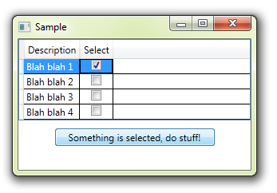

# Enable Button, Conditional
## Requires
- Visual Studio 2010
## License
- Apache License, Version 2.0
## Technologies
- WPF
- XAML
## Topics
- DataGrid
- WPF Commanding
- Button
- Relay Commands
- CanExecute
## Updated
- 09/19/2012
## Description

<h1>Introduction</h1>

This is just a simple sample to show how Commands can trigger the enabled or disabled state of a button, and how you can define that state by other factors in the view, like in this case, if any CheckBoxes are checked, in the CheckBox column of a DataGrid.

&nbsp;

<h1>Building the Sample</h1>

Just download, unzip, open and run!

&nbsp;

<h1>Description</h1>

This sample simply shows how to use a Command to control both the actions and the state of another control. In this case, it is controlling the state and action of a Button.

&nbsp;

For this example, we are using a classic RelayCommand, as documented <a href="http://msdn.microsoft.com/en-us/magazine/dd419663.aspx">
here</a>.

The Command has a CanExecute delegate, with which we are&nbsp;returning true/false&nbsp;based on properties of a collection.

The collection is used as ItemsSource for a DataGrid. The DataGrid has a CheckBox column with is bound to the IsSelected property of the class in our ItemsSource collection.

&nbsp;

XAML

Edit|Remove

xaml
<pre class="hidden">&lt;StackPanel&gt;
    &lt;DataGrid ItemsSource=&quot;{Binding MyList}&quot; AutoGenerateColumns=&quot;False&quot; CanUserAddRows=&quot;False&quot;&gt;
        &lt;DataGrid.Columns&gt;
            &lt;DataGridTextColumn Header=&quot;Description&quot; Binding=&quot;{Binding Description}&quot;/&gt;
            &lt;DataGridCheckBoxColumn Header=&quot;Select&quot; Binding=&quot;{Binding IsSelected, UpdateSourceTrigger=PropertyChanged}&quot;/&gt;
        &lt;/DataGrid.Columns&gt;
    &lt;/DataGrid&gt;
    &lt;Button Content=&quot;Something is selected, do stuff!&quot; Command=&quot;{Binding DoStuffCommand}&quot; Width=&quot;200&quot; Margin=&quot;0,10,0,0&quot;/&gt;
&lt;/StackPanel&gt;</pre>

<pre class="js">&lt;StackPanel&gt;&nbsp;
&nbsp;&nbsp;&nbsp;&nbsp;&lt;DataGrid&nbsp;ItemsSource=&quot;{Binding&nbsp;MyList}&quot;&nbsp;AutoGenerateColumns=&quot;False&quot;&nbsp;CanUserAddRows=&quot;False&quot;&gt;&nbsp;
&nbsp;&nbsp;&nbsp;&nbsp;&nbsp;&nbsp;&nbsp;&nbsp;&lt;DataGrid.Columns&gt;&nbsp;
&nbsp;&nbsp;&nbsp;&nbsp;&nbsp;&nbsp;&nbsp;&nbsp;&nbsp;&nbsp;&nbsp;&nbsp;&lt;DataGridTextColumn&nbsp;Header=&quot;Description&quot;&nbsp;Binding=&quot;{Binding&nbsp;Description}&quot;/&gt;&nbsp;
&nbsp;&nbsp;&nbsp;&nbsp;&nbsp;&nbsp;&nbsp;&nbsp;&nbsp;&nbsp;&nbsp;&nbsp;&lt;DataGridCheckBoxColumn&nbsp;Header=&quot;Select&quot;&nbsp;Binding=&quot;{Binding&nbsp;IsSelected,&nbsp;UpdateSourceTrigger=PropertyChanged}&quot;/&gt;&nbsp;
&nbsp;&nbsp;&nbsp;&nbsp;&nbsp;&nbsp;&nbsp;&nbsp;&lt;/DataGrid.Columns&gt;&nbsp;
&nbsp;&nbsp;&nbsp;&nbsp;&lt;/DataGrid&gt;&nbsp;
&nbsp;&nbsp;&nbsp;&nbsp;&lt;Button&nbsp;Content=&quot;Something&nbsp;is&nbsp;selected,&nbsp;do&nbsp;stuff!&quot;&nbsp;Command=&quot;{Binding&nbsp;DoStuffCommand}&quot;&nbsp;Width=&quot;200&quot;&nbsp;Margin=&quot;0,10,0,0&quot;/&gt;&nbsp;
&lt;/StackPanel&gt;</pre>

Whenever there are any changes in the UI, the CanExecute is re-evaluated.

If it finds any IsSelected properties set to true, then&nbsp;it returns &quot;true&quot;, which in turn enables the Button.

&nbsp;

C#

Edit|Remove

csharp
<pre class="hidden">bool DoStuffCanExecute(object param)
{
    foreach (var obj in MyList)
        if (obj.IsSelected) return true;

    return false;
}</pre>

<pre class="js">bool&nbsp;DoStuffCanExecute(object&nbsp;param)&nbsp;
{&nbsp;
&nbsp;&nbsp;&nbsp;&nbsp;foreach&nbsp;(var&nbsp;obj&nbsp;in&nbsp;MyList)&nbsp;
&nbsp;&nbsp;&nbsp;&nbsp;&nbsp;&nbsp;&nbsp;&nbsp;if&nbsp;(obj.IsSelected)&nbsp;return&nbsp;true;&nbsp;
&nbsp;
&nbsp;&nbsp;&nbsp;&nbsp;return&nbsp;false;&nbsp;
}</pre>

Note: The only problem with this quick sample is that DataGrid needs two clicks to change the CheckBox (one to select the row, another to change the CheckBox). This is a well known issue with DataGrid, and not part of this demonstration,&nbsp;because
 there are plenty of examples around that show how to get round that.

&nbsp;

<h1>Source Code Files</h1>
<ul>
<li><em>MainWindow.xaml - startup window</em> </li><li><em>MainWindow.xaml.cs - assigns the ViewModel</em> </li><li><em>MainViewModel.cs - Holds dummy data, command, and&nbsp;canExecute/execute</em>
</li><li><em>ViewModelBase - just a INPC base class</em> </li><li><em>RelayCommand.cs - classic Relay Command as per MSDN</em> </li></ul>

&nbsp;

&nbsp;

