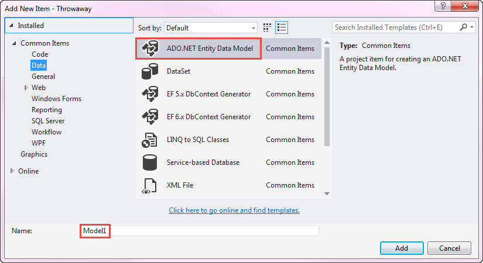
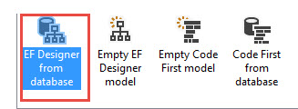
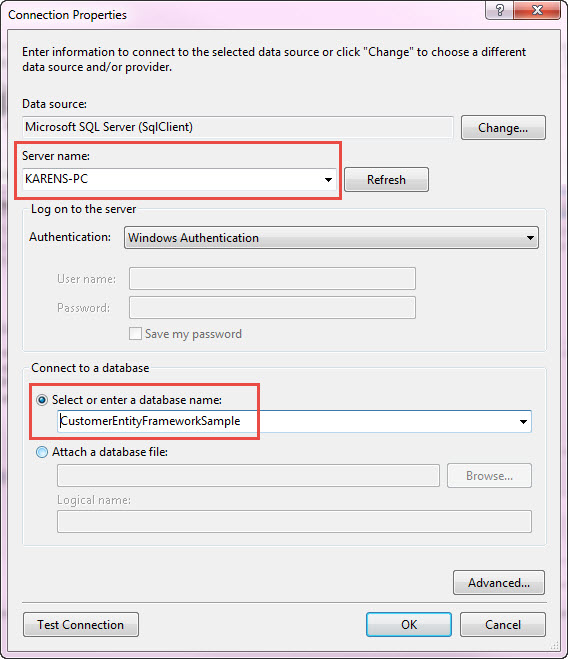
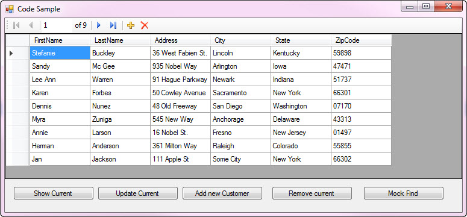
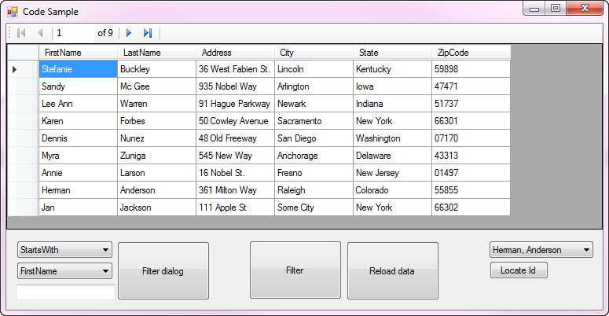

# Entity Framework 6 for VB.NET Windows forms solutions
## Requires
- Visual Studio 2015
## License
- MIT
## Technologies
- SQL Server
- Windows Forms
- Data Access
- VB.Net
- Entity Framework 6
## Topics
- Windows Forms
- Entity Framework
## Updated
- 01/27/2017
## Description

<h1>Description</h1>

This code sample is an introduction into how to use
<a href="https://msdn.microsoft.com/en-us/library/aa937723%28v=vs.113%29.aspx?f=255&MSPPError=-2147217396">
Microsoft Entity Framework</a> in VB.NET Windows forms based solutions that allows a developer to write code faster and more efficient based off a relational model, in this case from a
<a href="https://msdn.microsoft.com/en-us/library/mt590198%28v=sql.1%29.aspx?f=255&MSPPError=-2147217396">
Microsoft SQL-Server database</a> with two tables, a customer and order tables. We will start with both tables in the database but utilize only one table, customers to get your feet wet while in a follow up code sample which builds on this code samples base
 a master details code sample.

I&rsquo;m going to use Entity Framework 6 which has a solid reputation with millions of developers using it. There are two flavors of working with Entity Framework, model first or code first. In short, with code first the developer
 is required to create code that will either generate a new database with tables or to work off an existing database while model first requires an existing database with tables and optionally stored procedures.

Personally speaking I prefer code first but it&rsquo;s easier to learn model first to see if Entity Framework is right for you. There are many reasons to choice either approach and one must weigh in on which one is right for
 them. Here is an example where code first would be a better fit then model first. We have an application that requires storing UTC information for date time. In SQL-Server a DateTime column&rsquo;s kind property is unspecified which means we do not get the
 UTC information but we could write code in the entity context constructor to assist with this while model first we can&rsquo;t. &nbsp;That means for model first we need to look at DateTimeOffset column type but consider this issue did not come up until after
 our model has been set with many related tables using a repository pattern and DTO (data transfer objects) which creates a need for regression testing everything that uses the data time field.

Please note to run the code you will first need to create the database and populate it via the included script script.sql in the solution under project CreateScript which can be executed right in Visual Studio or from SQL-Server
 Management Studio.

Let's get started on creating our model using model first approach. Create a new class project, select add new item, select the Data tab as shown below

Note &quot;Name:&quot; has defaulted to Model1, for now leave this and press the Add button. On the next page select EF Designer from database and press Next button.

&nbsp;

On the next page you are prompted to select your database, select New Connection, select the SQL-Server (if you know it, type it in which is faster) and then select the database. In the following screenshot my server name is
 KARENS-PC and I selected the database used for the code samples included.

Press the Next button to continue, the next screen shows the connection string which will be placed into the app.config file. Important, the connection string will need to be copied to the front end project so it knows how to
 connection to the database even though all backend operations will be done in the current class project. In the attached code sample, the project BackendOperations has all the data operations used for all the windows forms projects.

THe next screen ask which version of Entity Framework to use, select the default, Entity Framework 6.x and press Next. Another page appears where we select the tables to work with. Here I selected Customers and Orders.

Press the Finish button, when the project is responsive the EDXM file is displayed.

Select properties for the diagram, under Schema, change the Entity Container Name to, in the case of the code sample I changed it to DataEntities. Next rebuild the project.

Once the project is rebuilt select from the IDE menu, Project -&gt; Show all files. Examine the classes created under the tt files e.g.

&nbsp;

Visual Basic

Edit|Remove

vb

<pre class="js">'------------------------------------------------------------------------------&nbsp;
'&nbsp;&lt;auto-generated&gt;&nbsp;
'&nbsp;&nbsp;&nbsp;&nbsp;&nbsp;This&nbsp;code&nbsp;was&nbsp;generated&nbsp;from&nbsp;a&nbsp;template.&nbsp;
'&nbsp;
'&nbsp;&nbsp;&nbsp;&nbsp;&nbsp;Manual&nbsp;changes&nbsp;to&nbsp;this&nbsp;file&nbsp;may&nbsp;cause&nbsp;unexpected&nbsp;behavior&nbsp;in&nbsp;your&nbsp;application.&nbsp;
'&nbsp;&nbsp;&nbsp;&nbsp;&nbsp;Manual&nbsp;changes&nbsp;to&nbsp;this&nbsp;file&nbsp;will&nbsp;be&nbsp;overwritten&nbsp;if&nbsp;the&nbsp;code&nbsp;is&nbsp;regenerated.&nbsp;
'&nbsp;&lt;/auto-generated&gt;&nbsp;
'------------------------------------------------------------------------------&nbsp;
&nbsp;
Imports&nbsp;System&nbsp;
Imports&nbsp;System.Collections.Generic&nbsp;
&nbsp;
Partial&nbsp;Public&nbsp;Class&nbsp;Customer&nbsp;
&nbsp;&nbsp;&nbsp;&nbsp;Public&nbsp;Property&nbsp;id&nbsp;As&nbsp;Integer&nbsp;
&nbsp;&nbsp;&nbsp;&nbsp;Public&nbsp;Property&nbsp;FirstName&nbsp;As&nbsp;String&nbsp;
&nbsp;&nbsp;&nbsp;&nbsp;Public&nbsp;Property&nbsp;LastName&nbsp;As&nbsp;String&nbsp;
&nbsp;&nbsp;&nbsp;&nbsp;Public&nbsp;Property&nbsp;Address&nbsp;As&nbsp;String&nbsp;
&nbsp;&nbsp;&nbsp;&nbsp;Public&nbsp;Property&nbsp;City&nbsp;As&nbsp;String&nbsp;
&nbsp;&nbsp;&nbsp;&nbsp;Public&nbsp;Property&nbsp;State&nbsp;As&nbsp;String&nbsp;
&nbsp;&nbsp;&nbsp;&nbsp;Public&nbsp;Property&nbsp;ZipCode&nbsp;As&nbsp;String&nbsp;
&nbsp;
&nbsp;&nbsp;&nbsp;&nbsp;Public&nbsp;Overridable&nbsp;Property&nbsp;Orders&nbsp;As&nbsp;ICollection(Of&nbsp;Order)&nbsp;=&nbsp;New&nbsp;HashSet(Of&nbsp;Order)&nbsp;
&nbsp;
End&nbsp;Class&nbsp;</pre>

And the same thing was done for Orders

Visual Basic

Edit|Remove

vb

<pre class="js">'------------------------------------------------------------------------------&nbsp;
'&nbsp;&lt;auto-generated&gt;&nbsp;
'&nbsp;&nbsp;&nbsp;&nbsp;&nbsp;This&nbsp;code&nbsp;was&nbsp;generated&nbsp;from&nbsp;a&nbsp;template.&nbsp;
'&nbsp;
'&nbsp;&nbsp;&nbsp;&nbsp;&nbsp;Manual&nbsp;changes&nbsp;to&nbsp;this&nbsp;file&nbsp;may&nbsp;cause&nbsp;unexpected&nbsp;behavior&nbsp;in&nbsp;your&nbsp;application.&nbsp;
'&nbsp;&nbsp;&nbsp;&nbsp;&nbsp;Manual&nbsp;changes&nbsp;to&nbsp;this&nbsp;file&nbsp;will&nbsp;be&nbsp;overwritten&nbsp;if&nbsp;the&nbsp;code&nbsp;is&nbsp;regenerated.&nbsp;
'&nbsp;&lt;/auto-generated&gt;&nbsp;
'------------------------------------------------------------------------------&nbsp;
&nbsp;
Imports&nbsp;System&nbsp;
Imports&nbsp;System.Collections.Generic&nbsp;
&nbsp;
Partial&nbsp;Public&nbsp;Class&nbsp;Order&nbsp;
&nbsp;&nbsp;&nbsp;&nbsp;Public&nbsp;Property&nbsp;id&nbsp;As&nbsp;Integer&nbsp;
&nbsp;&nbsp;&nbsp;&nbsp;Public&nbsp;Property&nbsp;CustomerId&nbsp;As&nbsp;Nullable(Of&nbsp;Integer)&nbsp;
&nbsp;&nbsp;&nbsp;&nbsp;Public&nbsp;Property&nbsp;OrderDate&nbsp;As&nbsp;Nullable(Of&nbsp;Date)&nbsp;
&nbsp;&nbsp;&nbsp;&nbsp;Public&nbsp;Property&nbsp;Invoice&nbsp;As&nbsp;String&nbsp;
&nbsp;
&nbsp;&nbsp;&nbsp;&nbsp;Public&nbsp;Overridable&nbsp;Property&nbsp;Customer&nbsp;As&nbsp;Customer&nbsp;
&nbsp;
End&nbsp;Class&nbsp;
</pre>

Now that we have these classes we can write our data operations but first let's create a new windows form project that will use the methods in this class project.

Create a new windows form project, next right click on the Visual Studio solution name under Solution Explorer and select &quot;Manage NuGet packages for this solution&quot;. Select the only listing, EntityFramework
 by Microsoft. There will be a checkbox next to the new project name, check it and press Install. Reply to the prompts. Once completed, open the app.config file for the class project and copy the connections string e.g.

XML

Edit|Remove

xml

<pre class="js">&nbsp;&nbsp;&lt;connectionStrings&gt;&nbsp;
&nbsp;&nbsp;&nbsp;&nbsp;&lt;add&nbsp;name=&quot;DataEntities&quot;&nbsp;connectionString=&quot;metadata=res://*/CustomersModel.csdl|res://*/CustomersModel.ssdl|res://*/CustomersModel.msl;provider=<a class="libraryLink" href="https://msdn.microsoft.com/en-US/library/System.Data.SqlClient.aspx" target="_blank" title="Auto generated link to System.Data.SqlClient">System.Data.SqlClient</a>;provider&nbsp;connection&nbsp;string=&amp;quot;data&nbsp;source=KARENS-PC;initial&nbsp;catalog=CustomerEntityFrameworkSample;integrated&nbsp;security=True;MultipleActiveResultSets=True;App=EntityFramework&amp;quot;&quot;&nbsp;providerName=&quot;System.Data.EntityClient&quot;&nbsp;/&gt;&nbsp;
&nbsp;&nbsp;&lt;/connectionStrings&gt;</pre>

Then paste it into the app.config file for the windows form project. Once done is should look like this in the windows forms app.config file.

XML

Edit|Remove

xml

<pre class="js">&lt;?xml&nbsp;version=&quot;1.0&quot;&nbsp;encoding=&quot;utf-8&quot;?&gt;&nbsp;
&lt;configuration&gt;&nbsp;
&nbsp;&nbsp;&lt;configSections&gt;&nbsp;
&nbsp;&nbsp;&nbsp;&nbsp;&lt;!--&nbsp;For&nbsp;more&nbsp;information&nbsp;on&nbsp;Entity&nbsp;Framework&nbsp;configuration,&nbsp;visit&nbsp;http://go.microsoft.com/fwlink/?LinkID=237468&nbsp;--&gt;&nbsp;
&nbsp;&nbsp;&nbsp;&nbsp;&lt;section&nbsp;name=&quot;entityFramework&quot;&nbsp;type=&quot;System.Data.Entity.Internal.ConfigFile.EntityFrameworkSection,&nbsp;EntityFramework,&nbsp;Version=6.0.0.0,&nbsp;Culture=neutral,&nbsp;PublicKeyToken=b77a5c561934e089&quot;&nbsp;requirePermission=&quot;false&quot;&nbsp;/&gt;&nbsp;
&nbsp;&nbsp;&lt;/configSections&gt;&nbsp;
&nbsp;&nbsp;&lt;startup&gt;&nbsp;
&nbsp;&nbsp;&nbsp;&nbsp;&lt;supportedRuntime&nbsp;version=&quot;v4.0&quot;&nbsp;sku=&quot;.NETFramework,Version=v4.5.2&quot;&nbsp;/&gt;&nbsp;
&nbsp;&nbsp;&lt;/startup&gt;&nbsp;
&nbsp;&nbsp;&lt;entityFramework&gt;&nbsp;
&nbsp;&nbsp;&nbsp;&nbsp;&lt;defaultConnectionFactory&nbsp;type=&quot;<a class="libraryLink" href="https://msdn.microsoft.com/en-US/library/System.Data.Entity.Infrastructure.LocalDbConnectionFactory.aspx" target="_blank" title="Auto generated link to System.Data.Entity.Infrastructure.LocalDbConnectionFactory">System.Data.Entity.Infrastructure.LocalDbConnectionFactory</a>,&nbsp;EntityFramework&quot;&gt;&nbsp;
&nbsp;&nbsp;&nbsp;&nbsp;&nbsp;&nbsp;&lt;parameters&gt;&nbsp;
&nbsp;&nbsp;&nbsp;&nbsp;&nbsp;&nbsp;&nbsp;&nbsp;&lt;parameter&nbsp;value=&quot;mssqllocaldb&quot;&nbsp;/&gt;&nbsp;
&nbsp;&nbsp;&nbsp;&nbsp;&nbsp;&nbsp;&lt;/parameters&gt;&nbsp;
&nbsp;&nbsp;&nbsp;&nbsp;&lt;/defaultConnectionFactory&gt;&nbsp;
&nbsp;&nbsp;&nbsp;&nbsp;&lt;providers&gt;&nbsp;
&nbsp;&nbsp;&nbsp;&nbsp;&nbsp;&nbsp;&lt;provider&nbsp;invariantName=&quot;System.Data.SqlClient&quot;&nbsp;type=&quot;<a class="libraryLink" href="https://msdn.microsoft.com/en-US/library/System.Data.Entity.SqlServer.SqlProviderServices.aspx" target="_blank" title="Auto generated link to System.Data.Entity.SqlServer.SqlProviderServices">System.Data.Entity.SqlServer.SqlProviderServices</a>,&nbsp;EntityFramework.SqlServer&quot;&nbsp;/&gt;&nbsp;
&nbsp;&nbsp;&nbsp;&nbsp;&lt;/providers&gt;&nbsp;
&nbsp;&nbsp;&lt;/entityFramework&gt;&nbsp;
&nbsp;&nbsp;&lt;connectionStrings&gt;&nbsp;
&nbsp;&nbsp;&nbsp;&nbsp;&lt;add&nbsp;name=&quot;DataEntities&quot;&nbsp;connectionString=&quot;metadata=res://*/CustomersModel.csdl|res://*/CustomersModel.ssdl|res://*/CustomersModel.msl;provider=<a class="libraryLink" href="https://msdn.microsoft.com/en-US/library/System.Data.SqlClient.aspx" target="_blank" title="Auto generated link to System.Data.SqlClient">System.Data.SqlClient</a>;provider&nbsp;connection&nbsp;string=&amp;quot;data&nbsp;source=KARENS-PC;initial&nbsp;catalog=CustomerEntityFrameworkSample;integrated&nbsp;security=True;MultipleActiveResultSets=True;App=EntityFramework&amp;quot;&quot;&nbsp;providerName=&quot;System.Data.EntityClient&quot;&nbsp;/&gt;&nbsp;
&nbsp;&nbsp;&lt;/connectionStrings&gt;&nbsp;
&lt;/configuration&gt;</pre>

In the Windows form project, add a reference to the class project. A this point we need to write code in the class project to access data.

Here is what it takes to return all customer records, not much code.

Visual Basic

Edit|Remove

vb

<pre class="js">Public&nbsp;Function&nbsp;LoadCustomers()&nbsp;As&nbsp;List(Of&nbsp;Customer)&nbsp;
&nbsp;&nbsp;&nbsp;&nbsp;Using&nbsp;entity&nbsp;As&nbsp;New&nbsp;DataEntities&nbsp;
&nbsp;&nbsp;&nbsp;&nbsp;&nbsp;&nbsp;&nbsp;&nbsp;Return&nbsp;entity.Customers.ToList&nbsp;
&nbsp;&nbsp;&nbsp;&nbsp;End&nbsp;Using&nbsp;
End&nbsp;Function</pre>

&nbsp;We can assign this to a DataGridView in the forms project

Visual Basic

Edit|Remove

vb

<pre class="js">Public&nbsp;Class&nbsp;MainForm&nbsp;
&nbsp;&nbsp;&nbsp;&nbsp;Private&nbsp;Sub&nbsp;MainForm_Load(sender&nbsp;As&nbsp;Object,&nbsp;e&nbsp;As&nbsp;EventArgs)&nbsp;Handles&nbsp;MyBase.Load&nbsp;
&nbsp;&nbsp;&nbsp;&nbsp;&nbsp;&nbsp;&nbsp;&nbsp;Dim&nbsp;ops&nbsp;As&nbsp;New&nbsp;Operations&nbsp;
&nbsp;&nbsp;&nbsp;&nbsp;&nbsp;&nbsp;&nbsp;&nbsp;DataGridView1.DataSource&nbsp;=&nbsp;ops.LoadCustomers&nbsp;
&nbsp;&nbsp;&nbsp;&nbsp;&nbsp;&nbsp;&nbsp;&nbsp;DataGridView1.Columns(&quot;Orders&quot;).Visible&nbsp;=&nbsp;False&nbsp;
&nbsp;&nbsp;&nbsp;&nbsp;End&nbsp;Sub&nbsp;
End&nbsp;Class&nbsp;
</pre>

Note that I have hidden Orders as it is a navigation (a related table) property of type ICollection as it will not show data and will cause problems if you attempt to access that column. Sadly we can
 view the data but can't sort it. &nbsp;

 

Let's fix the issue of attaching orders first by using a cheap DTO (Data Transfer Object) where a real DTO works differently but here the DTO excludes the orders from the customer list.&nbsp;

 

Our DTO

Visual Basic

Edit|Remove

vb

<pre class="js">Public&nbsp;Class&nbsp;CustomerDTO&nbsp;
&nbsp;&nbsp;&nbsp;&nbsp;Public&nbsp;Property&nbsp;id&nbsp;As&nbsp;Integer&nbsp;
&nbsp;&nbsp;&nbsp;&nbsp;Public&nbsp;Property&nbsp;FirstName&nbsp;As&nbsp;String&nbsp;
&nbsp;&nbsp;&nbsp;&nbsp;Public&nbsp;Property&nbsp;LastName&nbsp;As&nbsp;String&nbsp;
&nbsp;&nbsp;&nbsp;&nbsp;Public&nbsp;Property&nbsp;Address&nbsp;As&nbsp;String&nbsp;
&nbsp;&nbsp;&nbsp;&nbsp;Public&nbsp;Property&nbsp;City&nbsp;As&nbsp;String&nbsp;
&nbsp;&nbsp;&nbsp;&nbsp;Public&nbsp;Property&nbsp;State&nbsp;As&nbsp;String&nbsp;
&nbsp;&nbsp;&nbsp;&nbsp;Public&nbsp;Property&nbsp;ZipCode&nbsp;As&nbsp;String&nbsp;
End&nbsp;Class&nbsp;
</pre>

Then we hydrate the data as follows

Visual Basic

Edit|Remove

vb

<pre class="js">Public&nbsp;Function&nbsp;LoadCustomersDTO()&nbsp;As&nbsp;List(Of&nbsp;CustomerDTO)&nbsp;
&nbsp;&nbsp;&nbsp;&nbsp;Using&nbsp;entity&nbsp;As&nbsp;New&nbsp;DataEntities&nbsp;
&nbsp;
&nbsp;&nbsp;&nbsp;&nbsp;&nbsp;&nbsp;&nbsp;&nbsp;Dim&nbsp;ListOfCustomersDTO&nbsp;=&nbsp;entity.Customers.Select(Function(cust)&nbsp;_&nbsp;
&nbsp;&nbsp;&nbsp;&nbsp;&nbsp;&nbsp;&nbsp;&nbsp;New&nbsp;CustomerDTO&nbsp;With&nbsp;
&nbsp;&nbsp;&nbsp;&nbsp;&nbsp;&nbsp;&nbsp;&nbsp;{&nbsp;
&nbsp;&nbsp;&nbsp;&nbsp;&nbsp;&nbsp;&nbsp;&nbsp;&nbsp;&nbsp;&nbsp;&nbsp;.id&nbsp;=&nbsp;cust.id,&nbsp;
&nbsp;&nbsp;&nbsp;&nbsp;&nbsp;&nbsp;&nbsp;&nbsp;&nbsp;&nbsp;&nbsp;&nbsp;.FirstName&nbsp;=&nbsp;cust.FirstName,&nbsp;
&nbsp;&nbsp;&nbsp;&nbsp;&nbsp;&nbsp;&nbsp;&nbsp;&nbsp;&nbsp;&nbsp;&nbsp;.LastName&nbsp;=&nbsp;cust.LastName,&nbsp;
&nbsp;&nbsp;&nbsp;&nbsp;&nbsp;&nbsp;&nbsp;&nbsp;&nbsp;&nbsp;&nbsp;&nbsp;.Address&nbsp;=&nbsp;cust.Address,&nbsp;
&nbsp;&nbsp;&nbsp;&nbsp;&nbsp;&nbsp;&nbsp;&nbsp;&nbsp;&nbsp;&nbsp;&nbsp;.City&nbsp;=&nbsp;cust.City,&nbsp;
&nbsp;&nbsp;&nbsp;&nbsp;&nbsp;&nbsp;&nbsp;&nbsp;&nbsp;&nbsp;&nbsp;&nbsp;.State&nbsp;=&nbsp;cust.State,&nbsp;
&nbsp;&nbsp;&nbsp;&nbsp;&nbsp;&nbsp;&nbsp;&nbsp;&nbsp;&nbsp;&nbsp;&nbsp;.ZipCode&nbsp;=&nbsp;cust.ZipCode&nbsp;
&nbsp;&nbsp;&nbsp;&nbsp;&nbsp;&nbsp;&nbsp;&nbsp;}&nbsp;
&nbsp;&nbsp;&nbsp;&nbsp;).ToList&nbsp;
&nbsp;
&nbsp;&nbsp;&nbsp;&nbsp;&nbsp;&nbsp;&nbsp;&nbsp;Return&nbsp;ListOfCustomersDTO&nbsp;
&nbsp;
&nbsp;&nbsp;&nbsp;&nbsp;End&nbsp;Using&nbsp;
End&nbsp;Function</pre>

That covers excluding the orders navigation property. To allow sorting we need to use a custom BindingList included in this code sample in tangent with a BindingSource. The BindingSource is not for
 sorting but serves other purposes e.g. allows us to know the current customer in the DataGridView.&nbsp;

Visual Basic

Edit|Remove

vb

<pre class="js">bsCustomers.DataSource&nbsp;=&nbsp;New&nbsp;SortableBindingList(Of&nbsp;CustomerDTO)(ops.LoadCustomersDTO)&nbsp;
blCustomers&nbsp;=&nbsp;CType(bsCustomers.DataSource,&nbsp;SortableBindingList(Of&nbsp;CustomerDTO))&nbsp;
&nbsp;
DataGridView1.DataSource&nbsp;=&nbsp;bsCustomers&nbsp;
&nbsp;
DataGridView1.Columns(&quot;id&quot;).Visible&nbsp;=&nbsp;False&nbsp;
&nbsp;
BindingNavigator1.BindingSource&nbsp;=&nbsp;bsCustomers</pre>

We now have sorting capabilities!!!&nbsp;&nbsp;

.

So what is next? Well we need CRUD functionality right! In the class project BackendOperations all the CRUD operations are within the class Operations. Then there is filtering and finding customers,
 that functionality is demo'd in Operations class also in tangent with how to implement on the front end.

.

If you want to compare how CRUD, find and filtering is done between Entity Framework and using SqlClient data providers compare them by looking at sqlClientPeekOperations class to Operations class.

.

Project wise,

<strong>BackendOperations</strong> contains code for working with Entity Framework and SqlClient. There are language extension method for converting to and from a DTO. Note, on our team we use more
 more detailed DTO's and map them with <a href="http://automapper.org/">AutoMapper</a>.

<strong>CustomBindingListLibrary</strong> has the Sortable BindingList from a MSDN Code sample which contains a link to the sample and the author's name.

<strong>FirstAttempt</strong> and
<strong>SecondAttempt</strong> both show inability to sort and how to get rid of the Orders relations.&nbsp;

 
<strong>ThirdAttempt</strong> show cases CRUD operations with a peek at finding information.

 

<strong>ThirdAttempt_A</strong>
started out from ThirdAttempt, removed CRUD operations and sets focus on find and filtering. I removed the CRUD operations to keep focus on searching data.

<strong>HydrateLibrary</strong>, used to pull in text file data into the database for part 2 of working with Entity Framework to follow this code sample.

 

In closing, the code samples included cover all the basics and intermediate things a typical one table application needs on average. If I missed something you can surely add what you need by working
 off what has been presented. All the operations were considered from spending years on various developer forums and these were the core functions must have asked for when working with data.

 

In the next code sample, I will write we will move into working with master-details at a basic level so you can see how to traverse and do CRUD operations on both master and detail operations. I will
 also include tracking changes along with how to validate data in a middle layer so that little to none has to be done on the front end. This current code sample does zero validation so to keep focus on data operations.&nbsp;

 

<strong>Resources </strong>
(none on VB.NET):&nbsp;

 

<a href="https://msdn.microsoft.com/en-us/library/ee712907%28v=vs.113%29.aspx?f=255&MSPPError=-2147217396">Entity Frame work documentation</a>.

<a href="https://github.com/aspnet/EntityFramework6">Source on GitHub</a>.

 

Pluralsight, <a href="https://app.pluralsight.com/library/courses/entity-framework-6-getting-started/table-of-contents">
Getting Started with Entity Framework 6</a> (if you have C# background) by Julie Lerman.

 

Screen shots from projects

<h3 class="endscriptcode">Visual Studio extension for VS2015 DTO Generator</h3>

This extension makes it easy to create DTO classes
<a href="https://marketplace.visualstudio.com/items?itemName=Dtogenerator.DTOGenerator">
found here</a>. In the screenshot below, this is the second dialog, for working with AutoMapper, uncheck Generate mapper class, otherwise it will create base classes to handle class to DTO for you which is different than how I have done it in this code sample.
 Note in my next code sample I will be using AutoMapper 5.x.

 

