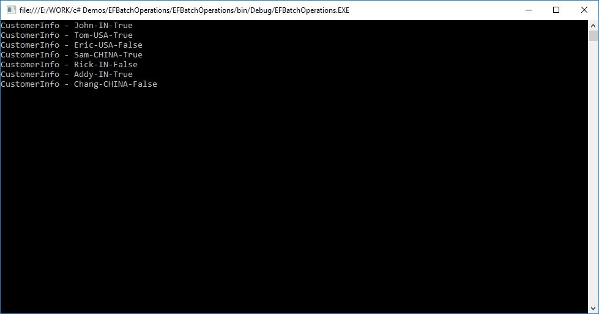
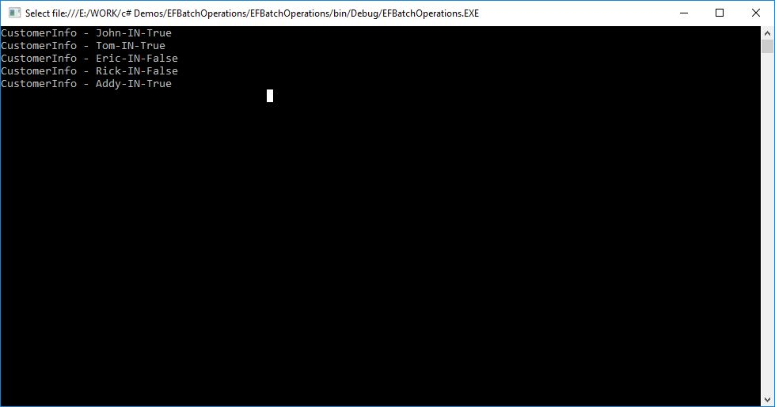

# Entity Framework: Batch Insert Update Delete Operations using EF.Extended
## Requires
- Visual Studio 2015
## License
- MIT
## Technologies
- C#
- SQL Server
- ASP.NET
- .NET
- LINQ
- .NET Framework
- Entity Framework
- Entity Framework Code First
- .NET Development
## Topics
- Performance
- Extensibility
## Updated
- 04/05/2016
## Description

<h1>Introduction</h1>

Entity Framework is a well-known Microsoft open source (from EF 5) data access technology for .NET applications. Entity Framework is a new framework which completely replaces traditional ADO.NET data access techniques. Entity Framework enables new approaches
 to work with relational databases. It will reduce line of code that developers uses for data access. This article will briefly describe how to perform batch CRUD operations using entity framework and its extensions.

To implement Bulk operation, we need to add some base classes.

<strong>Customer class</strong>

C#

Edit|Remove

csharp
<pre class="hidden">public class Customer   
{  
    [Key]  
    public int Id  
    {  
        get;  
        set;  
    }  
  
    public string Name  
    {  
        get;  
        set;  
    }  
  
    public string Country  
    {  
        get;  
        set;  
    }  
  
    public bool Status  
    {  
        get;  
        set;  
    }  
}  </pre>

<pre class="csharp">public&nbsp;class&nbsp;Customer&nbsp;&nbsp;&nbsp;&nbsp;
{&nbsp;&nbsp;&nbsp;
&nbsp;&nbsp;&nbsp;&nbsp;[Key]&nbsp;&nbsp;&nbsp;
&nbsp;&nbsp;&nbsp;&nbsp;public&nbsp;int&nbsp;Id&nbsp;&nbsp;&nbsp;
&nbsp;&nbsp;&nbsp;&nbsp;{&nbsp;&nbsp;&nbsp;
&nbsp;&nbsp;&nbsp;&nbsp;&nbsp;&nbsp;&nbsp;&nbsp;get;&nbsp;&nbsp;&nbsp;
&nbsp;&nbsp;&nbsp;&nbsp;&nbsp;&nbsp;&nbsp;&nbsp;set;&nbsp;&nbsp;&nbsp;
&nbsp;&nbsp;&nbsp;&nbsp;}&nbsp;&nbsp;&nbsp;
&nbsp;&nbsp;&nbsp;
&nbsp;&nbsp;&nbsp;&nbsp;public&nbsp;string&nbsp;Name&nbsp;&nbsp;&nbsp;
&nbsp;&nbsp;&nbsp;&nbsp;{&nbsp;&nbsp;&nbsp;
&nbsp;&nbsp;&nbsp;&nbsp;&nbsp;&nbsp;&nbsp;&nbsp;get;&nbsp;&nbsp;&nbsp;
&nbsp;&nbsp;&nbsp;&nbsp;&nbsp;&nbsp;&nbsp;&nbsp;set;&nbsp;&nbsp;&nbsp;
&nbsp;&nbsp;&nbsp;&nbsp;}&nbsp;&nbsp;&nbsp;
&nbsp;&nbsp;&nbsp;
&nbsp;&nbsp;&nbsp;&nbsp;public&nbsp;string&nbsp;Country&nbsp;&nbsp;&nbsp;
&nbsp;&nbsp;&nbsp;&nbsp;{&nbsp;&nbsp;&nbsp;
&nbsp;&nbsp;&nbsp;&nbsp;&nbsp;&nbsp;&nbsp;&nbsp;get;&nbsp;&nbsp;&nbsp;
&nbsp;&nbsp;&nbsp;&nbsp;&nbsp;&nbsp;&nbsp;&nbsp;set;&nbsp;&nbsp;&nbsp;
&nbsp;&nbsp;&nbsp;&nbsp;}&nbsp;&nbsp;&nbsp;
&nbsp;&nbsp;&nbsp;
&nbsp;&nbsp;&nbsp;&nbsp;public&nbsp;bool&nbsp;Status&nbsp;&nbsp;&nbsp;
&nbsp;&nbsp;&nbsp;&nbsp;{&nbsp;&nbsp;&nbsp;
&nbsp;&nbsp;&nbsp;&nbsp;&nbsp;&nbsp;&nbsp;&nbsp;get;&nbsp;&nbsp;&nbsp;
&nbsp;&nbsp;&nbsp;&nbsp;&nbsp;&nbsp;&nbsp;&nbsp;set;&nbsp;&nbsp;&nbsp;
&nbsp;&nbsp;&nbsp;&nbsp;}&nbsp;&nbsp;&nbsp;
}&nbsp;&nbsp;</pre>

<strong>DataContext</strong>

I used entityframework 6 for data access.

&nbsp;

C#

Edit|Remove

csharp
<pre class="hidden">public class DataContext: DbContext  
{  
    public DbSet &lt; Customer &gt; Customers   
    {  
        get;  
        set;  
    }  
}  </pre>

<pre class="js">public&nbsp;class&nbsp;DataContext:&nbsp;DbContext&nbsp;&nbsp;&nbsp;
{&nbsp;&nbsp;&nbsp;
&nbsp;&nbsp;&nbsp;&nbsp;public&nbsp;DbSet&nbsp;&lt;&nbsp;Customer&nbsp;&gt;&nbsp;Customers&nbsp;&nbsp;&nbsp;&nbsp;
&nbsp;&nbsp;&nbsp;&nbsp;{&nbsp;&nbsp;&nbsp;
&nbsp;&nbsp;&nbsp;&nbsp;&nbsp;&nbsp;&nbsp;&nbsp;get;&nbsp;&nbsp;&nbsp;
&nbsp;&nbsp;&nbsp;&nbsp;&nbsp;&nbsp;&nbsp;&nbsp;set;&nbsp;&nbsp;&nbsp;
&nbsp;&nbsp;&nbsp;&nbsp;}&nbsp;&nbsp;&nbsp;
}&nbsp;&nbsp;</pre>

&nbsp;GetCustomers method is used to get all customers, which we will use for performing batch Insert operation.

C#

Edit|Remove

csharp
<pre class="hidden">public static List &lt; Customer &gt; GetCustomers()  
{  
    var customers = new List &lt; Customer &gt;  
        {  
        new Customer()  
          {  
            Name = &quot;John&quot;, Country = &quot;IN&quot;, Status = true  
        },  
          
        new Customer()  
        {  
            Name = &quot;Tom&quot;, Country = &quot;USA&quot;, Status = true  
        },  
        new Customer()  
        {  
            Name = &quot;Eric&quot;, Country = &quot;USA&quot;, Status = false  
        },  
        new Customer()   
        {  
            Name = &quot;Sam&quot;, Country = &quot;CHINA&quot;, Status = true  
        },  
        new Customer()  
        {  
            Name = &quot;Rick&quot;, Country = &quot;IN&quot;, Status = false  
        },  
        new Customer()   
        {  
            Name = &quot;Addy&quot;, Country = &quot;IN&quot;, Status = true  
        },  
        new Customer()  
        {  
            Name = &quot;Chang&quot;, Country = &quot;CHINA&quot;, Status = false  
        },  
    };  
  
    return customers;  
}  </pre>

<pre class="js">public&nbsp;static&nbsp;List&nbsp;&lt;&nbsp;Customer&nbsp;&gt;&nbsp;GetCustomers()&nbsp;&nbsp;&nbsp;
{&nbsp;&nbsp;&nbsp;
&nbsp;&nbsp;&nbsp;&nbsp;var&nbsp;customers&nbsp;=&nbsp;new&nbsp;List&nbsp;&lt;&nbsp;Customer&nbsp;&gt;&nbsp;&nbsp;&nbsp;
&nbsp;&nbsp;&nbsp;&nbsp;&nbsp;&nbsp;&nbsp;&nbsp;{&nbsp;&nbsp;&nbsp;
&nbsp;&nbsp;&nbsp;&nbsp;&nbsp;&nbsp;&nbsp;&nbsp;new&nbsp;Customer()&nbsp;&nbsp;&nbsp;
&nbsp;&nbsp;&nbsp;&nbsp;&nbsp;&nbsp;&nbsp;&nbsp;&nbsp;&nbsp;{&nbsp;&nbsp;&nbsp;
&nbsp;&nbsp;&nbsp;&nbsp;&nbsp;&nbsp;&nbsp;&nbsp;&nbsp;&nbsp;&nbsp;&nbsp;Name&nbsp;=&nbsp;&quot;John&quot;,&nbsp;Country&nbsp;=&nbsp;&quot;IN&quot;,&nbsp;Status&nbsp;=&nbsp;true&nbsp;&nbsp;&nbsp;
&nbsp;&nbsp;&nbsp;&nbsp;&nbsp;&nbsp;&nbsp;&nbsp;},&nbsp;&nbsp;&nbsp;
&nbsp;&nbsp;&nbsp;&nbsp;&nbsp;&nbsp;&nbsp;&nbsp;&nbsp;&nbsp;&nbsp;
&nbsp;&nbsp;&nbsp;&nbsp;&nbsp;&nbsp;&nbsp;&nbsp;new&nbsp;Customer()&nbsp;&nbsp;&nbsp;
&nbsp;&nbsp;&nbsp;&nbsp;&nbsp;&nbsp;&nbsp;&nbsp;{&nbsp;&nbsp;&nbsp;
&nbsp;&nbsp;&nbsp;&nbsp;&nbsp;&nbsp;&nbsp;&nbsp;&nbsp;&nbsp;&nbsp;&nbsp;Name&nbsp;=&nbsp;&quot;Tom&quot;,&nbsp;Country&nbsp;=&nbsp;&quot;USA&quot;,&nbsp;Status&nbsp;=&nbsp;true&nbsp;&nbsp;&nbsp;
&nbsp;&nbsp;&nbsp;&nbsp;&nbsp;&nbsp;&nbsp;&nbsp;},&nbsp;&nbsp;&nbsp;
&nbsp;&nbsp;&nbsp;&nbsp;&nbsp;&nbsp;&nbsp;&nbsp;new&nbsp;Customer()&nbsp;&nbsp;&nbsp;
&nbsp;&nbsp;&nbsp;&nbsp;&nbsp;&nbsp;&nbsp;&nbsp;{&nbsp;&nbsp;&nbsp;
&nbsp;&nbsp;&nbsp;&nbsp;&nbsp;&nbsp;&nbsp;&nbsp;&nbsp;&nbsp;&nbsp;&nbsp;Name&nbsp;=&nbsp;&quot;Eric&quot;,&nbsp;Country&nbsp;=&nbsp;&quot;USA&quot;,&nbsp;Status&nbsp;=&nbsp;false&nbsp;&nbsp;&nbsp;
&nbsp;&nbsp;&nbsp;&nbsp;&nbsp;&nbsp;&nbsp;&nbsp;},&nbsp;&nbsp;&nbsp;
&nbsp;&nbsp;&nbsp;&nbsp;&nbsp;&nbsp;&nbsp;&nbsp;new&nbsp;Customer()&nbsp;&nbsp;&nbsp;&nbsp;
&nbsp;&nbsp;&nbsp;&nbsp;&nbsp;&nbsp;&nbsp;&nbsp;{&nbsp;&nbsp;&nbsp;
&nbsp;&nbsp;&nbsp;&nbsp;&nbsp;&nbsp;&nbsp;&nbsp;&nbsp;&nbsp;&nbsp;&nbsp;Name&nbsp;=&nbsp;&quot;Sam&quot;,&nbsp;Country&nbsp;=&nbsp;&quot;CHINA&quot;,&nbsp;Status&nbsp;=&nbsp;true&nbsp;&nbsp;&nbsp;
&nbsp;&nbsp;&nbsp;&nbsp;&nbsp;&nbsp;&nbsp;&nbsp;},&nbsp;&nbsp;&nbsp;
&nbsp;&nbsp;&nbsp;&nbsp;&nbsp;&nbsp;&nbsp;&nbsp;new&nbsp;Customer()&nbsp;&nbsp;&nbsp;
&nbsp;&nbsp;&nbsp;&nbsp;&nbsp;&nbsp;&nbsp;&nbsp;{&nbsp;&nbsp;&nbsp;
&nbsp;&nbsp;&nbsp;&nbsp;&nbsp;&nbsp;&nbsp;&nbsp;&nbsp;&nbsp;&nbsp;&nbsp;Name&nbsp;=&nbsp;&quot;Rick&quot;,&nbsp;Country&nbsp;=&nbsp;&quot;IN&quot;,&nbsp;Status&nbsp;=&nbsp;false&nbsp;&nbsp;&nbsp;
&nbsp;&nbsp;&nbsp;&nbsp;&nbsp;&nbsp;&nbsp;&nbsp;},&nbsp;&nbsp;&nbsp;
&nbsp;&nbsp;&nbsp;&nbsp;&nbsp;&nbsp;&nbsp;&nbsp;new&nbsp;Customer()&nbsp;&nbsp;&nbsp;&nbsp;
&nbsp;&nbsp;&nbsp;&nbsp;&nbsp;&nbsp;&nbsp;&nbsp;{&nbsp;&nbsp;&nbsp;
&nbsp;&nbsp;&nbsp;&nbsp;&nbsp;&nbsp;&nbsp;&nbsp;&nbsp;&nbsp;&nbsp;&nbsp;Name&nbsp;=&nbsp;&quot;Addy&quot;,&nbsp;Country&nbsp;=&nbsp;&quot;IN&quot;,&nbsp;Status&nbsp;=&nbsp;true&nbsp;&nbsp;&nbsp;
&nbsp;&nbsp;&nbsp;&nbsp;&nbsp;&nbsp;&nbsp;&nbsp;},&nbsp;&nbsp;&nbsp;
&nbsp;&nbsp;&nbsp;&nbsp;&nbsp;&nbsp;&nbsp;&nbsp;new&nbsp;Customer()&nbsp;&nbsp;&nbsp;
&nbsp;&nbsp;&nbsp;&nbsp;&nbsp;&nbsp;&nbsp;&nbsp;{&nbsp;&nbsp;&nbsp;
&nbsp;&nbsp;&nbsp;&nbsp;&nbsp;&nbsp;&nbsp;&nbsp;&nbsp;&nbsp;&nbsp;&nbsp;Name&nbsp;=&nbsp;&quot;Chang&quot;,&nbsp;Country&nbsp;=&nbsp;&quot;CHINA&quot;,&nbsp;Status&nbsp;=&nbsp;false&nbsp;&nbsp;&nbsp;
&nbsp;&nbsp;&nbsp;&nbsp;&nbsp;&nbsp;&nbsp;&nbsp;},&nbsp;&nbsp;&nbsp;
&nbsp;&nbsp;&nbsp;&nbsp;};&nbsp;&nbsp;&nbsp;
&nbsp;&nbsp;&nbsp;
&nbsp;&nbsp;&nbsp;&nbsp;return&nbsp;customers;&nbsp;&nbsp;&nbsp;
}&nbsp;&nbsp;</pre>

&nbsp;<strong>Insert&nbsp; 
 
</strong>After a couple of improvements in Entity Framework that makes adding many rows to a SQL Server Compact database via Entity Framework feasible. AddRange is in built function to perform batch operation.

C#

Edit|Remove

csharp
<pre class="hidden">static void Main(string[] args)   
{  
    using(var db = new DataContext())  
    {  
        // Insert  
        var customers = GetCustomers();  
        db.Customers.AddRange(customers);  
        db.SaveChanges();  
  
        foreach(var customer in db.Customers.ToList())  
        {  
            Console.WriteLine(&quot;CustomerInfo - {0}-{1}-{2}&quot;, customer.Name, customer.Country, customer.Status);  
        }  
    }  
  
    Console.ReadLine();  
} </pre>

<pre class="js">static&nbsp;void&nbsp;Main(string[]&nbsp;args)&nbsp;&nbsp;&nbsp;&nbsp;
{&nbsp;&nbsp;&nbsp;
&nbsp;&nbsp;&nbsp;&nbsp;using(var&nbsp;db&nbsp;=&nbsp;new&nbsp;DataContext())&nbsp;&nbsp;&nbsp;
&nbsp;&nbsp;&nbsp;&nbsp;{&nbsp;&nbsp;&nbsp;
&nbsp;&nbsp;&nbsp;&nbsp;&nbsp;&nbsp;&nbsp;&nbsp;//&nbsp;Insert&nbsp;&nbsp;&nbsp;
&nbsp;&nbsp;&nbsp;&nbsp;&nbsp;&nbsp;&nbsp;&nbsp;var&nbsp;customers&nbsp;=&nbsp;GetCustomers();&nbsp;&nbsp;&nbsp;
&nbsp;&nbsp;&nbsp;&nbsp;&nbsp;&nbsp;&nbsp;&nbsp;db.Customers.AddRange(customers);&nbsp;&nbsp;&nbsp;
&nbsp;&nbsp;&nbsp;&nbsp;&nbsp;&nbsp;&nbsp;&nbsp;db.SaveChanges();&nbsp;&nbsp;&nbsp;
&nbsp;&nbsp;&nbsp;
&nbsp;&nbsp;&nbsp;&nbsp;&nbsp;&nbsp;&nbsp;&nbsp;foreach(var&nbsp;customer&nbsp;in&nbsp;db.Customers.ToList())&nbsp;&nbsp;&nbsp;
&nbsp;&nbsp;&nbsp;&nbsp;&nbsp;&nbsp;&nbsp;&nbsp;{&nbsp;&nbsp;&nbsp;
&nbsp;&nbsp;&nbsp;&nbsp;&nbsp;&nbsp;&nbsp;&nbsp;&nbsp;&nbsp;&nbsp;&nbsp;Console.WriteLine(&quot;CustomerInfo&nbsp;-&nbsp;{0}-{1}-{2}&quot;,&nbsp;customer.Name,&nbsp;customer.Country,&nbsp;customer.Status);&nbsp;&nbsp;&nbsp;
&nbsp;&nbsp;&nbsp;&nbsp;&nbsp;&nbsp;&nbsp;&nbsp;}&nbsp;&nbsp;&nbsp;
&nbsp;&nbsp;&nbsp;&nbsp;}&nbsp;&nbsp;&nbsp;
&nbsp;&nbsp;&nbsp;
&nbsp;&nbsp;&nbsp;&nbsp;Console.ReadLine();&nbsp;&nbsp;&nbsp;
}&nbsp;</pre>

<strong>Output 
 
</strong>It will insert all records on a single database call.

 

&nbsp;

<strong>Update and Delete</strong> 
 
A current limitation of the Entity Framework is that in order to update or delete an entity you have to first retrieve it into memory. Also, for single deletes, the object must be retrieved before it can be deleted requiring two calls to the database.
 To overcome this problem we have to extend the current entity framework using EntityFramework.Extended. EntityFramework.Extended have useful features like Batch Update and Delete, Audit log, Query Result cache, Future Queries. Batch update and delete eliminates
 the need to retrieve and load an entity before modifying it. Here are a few lines of code to demonstrate how to delete, update.

<strong>Install via nuget 
 
</strong>PM&gt; Install-Package EntityFramework.Extended

&nbsp;

<strong>Update 
 
Scenario:</strong>&nbsp;Update customers which have country USA.&nbsp; 
If we do this without any extensions, we have to fetch all customers which have country USA, modify the list and update it using loops. Using Entity Framework.Exdended we don&rsquo;t need to fetch the list of customers, simply add where condition, set
 update data and execute query.

&nbsp;

&nbsp;

C#

Edit|Remove

csharp
<pre class="hidden">static void Main(string[] args)  
{  
    using(var db = new DataContext())  
    {  
        db.Customers.Where(c =&gt; c.Country == &quot;USA&quot;).Update(c =&gt; new Customer()  
        {  
            Country = &quot;IN&quot;  
        });  
  
        foreach(var customer in db.Customers.ToList())   
        {  
            Console.WriteLine(&quot;CustomerInfo - {0}-{1}-{2}&quot;, customer.Name, customer.Country, customer.Status);  
        }  
    }  
  
    Console.ReadLine();  
}  </pre>

<pre class="js">static&nbsp;void&nbsp;Main(string[]&nbsp;args)&nbsp;&nbsp;&nbsp;
{&nbsp;&nbsp;&nbsp;
&nbsp;&nbsp;&nbsp;&nbsp;using(var&nbsp;db&nbsp;=&nbsp;new&nbsp;DataContext())&nbsp;&nbsp;&nbsp;
&nbsp;&nbsp;&nbsp;&nbsp;{&nbsp;&nbsp;&nbsp;
&nbsp;&nbsp;&nbsp;&nbsp;&nbsp;&nbsp;&nbsp;&nbsp;db.Customers.Where(c&nbsp;=&gt;&nbsp;c.Country&nbsp;==&nbsp;&quot;USA&quot;).Update(c&nbsp;=&gt;&nbsp;new&nbsp;Customer()&nbsp;&nbsp;&nbsp;
&nbsp;&nbsp;&nbsp;&nbsp;&nbsp;&nbsp;&nbsp;&nbsp;{&nbsp;&nbsp;&nbsp;
&nbsp;&nbsp;&nbsp;&nbsp;&nbsp;&nbsp;&nbsp;&nbsp;&nbsp;&nbsp;&nbsp;&nbsp;Country&nbsp;=&nbsp;&quot;IN&quot;&nbsp;&nbsp;&nbsp;
&nbsp;&nbsp;&nbsp;&nbsp;&nbsp;&nbsp;&nbsp;&nbsp;});&nbsp;&nbsp;&nbsp;
&nbsp;&nbsp;&nbsp;
&nbsp;&nbsp;&nbsp;&nbsp;&nbsp;&nbsp;&nbsp;&nbsp;foreach(var&nbsp;customer&nbsp;in&nbsp;db.Customers.ToList())&nbsp;&nbsp;&nbsp;&nbsp;
&nbsp;&nbsp;&nbsp;&nbsp;&nbsp;&nbsp;&nbsp;&nbsp;{&nbsp;&nbsp;&nbsp;
&nbsp;&nbsp;&nbsp;&nbsp;&nbsp;&nbsp;&nbsp;&nbsp;&nbsp;&nbsp;&nbsp;&nbsp;Console.WriteLine(&quot;CustomerInfo&nbsp;-&nbsp;{0}-{1}-{2}&quot;,&nbsp;customer.Name,&nbsp;customer.Country,&nbsp;customer.Status);&nbsp;&nbsp;&nbsp;
&nbsp;&nbsp;&nbsp;&nbsp;&nbsp;&nbsp;&nbsp;&nbsp;}&nbsp;&nbsp;&nbsp;
&nbsp;&nbsp;&nbsp;&nbsp;}&nbsp;&nbsp;&nbsp;
&nbsp;&nbsp;&nbsp;
&nbsp;&nbsp;&nbsp;&nbsp;Console.ReadLine();&nbsp;&nbsp;&nbsp;
}&nbsp;&nbsp;</pre>

&nbsp;<strong>Output 
 
</strong>All customers (Tom and Eric) which have country USA will update to IN.

 

&nbsp;

&nbsp;

&nbsp;

<strong>Delete</strong>

&nbsp;

&nbsp;

<strong>Scenario:</strong>&nbsp;Delete customers which have country China. Batch update and delete operation are almost same. Add where condition to both Delete and Update call EntityFramework.Extended function.&nbsp;

&nbsp;

C#

Edit|Remove

csharp
<pre class="hidden">static void Main(string[] args)  
{  
    using(var db = new DataContext())  
    {  
        db.Customers.Where(c =&gt; c.Country == &quot;CHINA&quot;).Delete();  
  
        foreach(var customer in db.Customers.ToList())  
        {  
            Console.WriteLine(&quot;CustomerInfo - {0}-{1}-{2}&quot;, customer.Name, customer.Country, customer.Status);  
        }  
    }  
  
    Console.ReadLine();  
}  </pre>

<pre class="js">static&nbsp;void&nbsp;Main(string[]&nbsp;args)&nbsp;&nbsp;&nbsp;
{&nbsp;&nbsp;&nbsp;
&nbsp;&nbsp;&nbsp;&nbsp;using(var&nbsp;db&nbsp;=&nbsp;new&nbsp;DataContext())&nbsp;&nbsp;&nbsp;
&nbsp;&nbsp;&nbsp;&nbsp;{&nbsp;&nbsp;&nbsp;
&nbsp;&nbsp;&nbsp;&nbsp;&nbsp;&nbsp;&nbsp;&nbsp;db.Customers.Where(c&nbsp;=&gt;&nbsp;c.Country&nbsp;==&nbsp;&quot;CHINA&quot;).Delete();&nbsp;&nbsp;&nbsp;
&nbsp;&nbsp;&nbsp;
&nbsp;&nbsp;&nbsp;&nbsp;&nbsp;&nbsp;&nbsp;&nbsp;foreach(var&nbsp;customer&nbsp;in&nbsp;db.Customers.ToList())&nbsp;&nbsp;&nbsp;
&nbsp;&nbsp;&nbsp;&nbsp;&nbsp;&nbsp;&nbsp;&nbsp;{&nbsp;&nbsp;&nbsp;
&nbsp;&nbsp;&nbsp;&nbsp;&nbsp;&nbsp;&nbsp;&nbsp;&nbsp;&nbsp;&nbsp;&nbsp;Console.WriteLine(&quot;CustomerInfo&nbsp;-&nbsp;{0}-{1}-{2}&quot;,&nbsp;customer.Name,&nbsp;customer.Country,&nbsp;customer.Status);&nbsp;&nbsp;&nbsp;
&nbsp;&nbsp;&nbsp;&nbsp;&nbsp;&nbsp;&nbsp;&nbsp;}&nbsp;&nbsp;&nbsp;
&nbsp;&nbsp;&nbsp;&nbsp;}&nbsp;&nbsp;&nbsp;
&nbsp;&nbsp;&nbsp;
&nbsp;&nbsp;&nbsp;&nbsp;Console.ReadLine();&nbsp;&nbsp;&nbsp;
}&nbsp;&nbsp;</pre>

&nbsp;<strong>Output:</strong>&nbsp;Two records are deleted having a customer name Chang and Sam.

 

&nbsp;

&nbsp;

<strong>Conclusion 
</strong> 
Entity framework is improving day by day. But Entity framework extensions and utilities make developer&rsquo;s life easy. They enhances and optimizes Entity Framework's performance, add more capabilities, add more features and extend current version limitation.
 Hope Microsoft will include Batch insert, update and delete facility in Entity Framework version.

<strong>More Information</strong>

http://www.c-sharpcorner.com/UploadFile/55d96a/entity-framework-batch-insert-update-delete-operations/

http://www.dotnetspan.com

 

