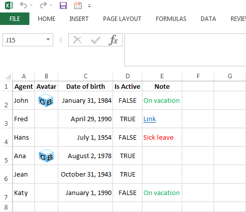
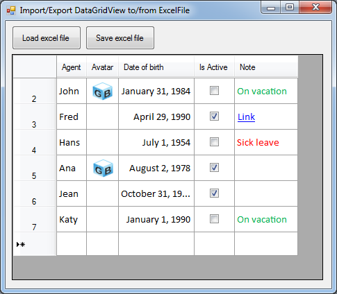

# Excel Spreadsheet Editor in Windows Forms using GemBox.Spreadsheet
## Requires
- Visual Studio 2012
## License
- MIT
## Technologies
- C#
- Excel
- Windows Forms
- DataGridView
## Topics
- Reports
- Excel
- Spreadsheet
## Updated
- 01/08/2016
## Description

This is a demonstration sample of a spreadsheet editor in Windows Forms achieved with GemBox.Spreadsheet Free library. Sample shows interoperability between GemBox.Spreadsheet component and Windows Forms DataGridView control.

GemBox.Spreadsheet is a .NET component that enables developers to read, write, convert and print spreadsheet files (XLSX, XLS, ODS, CSV, HTML, PDF or XPS) from their .NET applications using one simple API.

<h1>Table of Contents</h1>
<h3>
<ul>
<li><a href="#screenshots">Screen Shots</a>
</li><li><a href="#download">Download GemBox.Spreadsheet&nbsp;Free</a>
</li><li><a href="#features">Main Features</a>
</li><li><a href="#moreinfo">More Information</a>
</li></ul>
</h3>
<h1 id="screenshots">Screen Shots</h1>

&nbsp;

<h1 id="download">Download GemBox.Spreadsheet Free</h1>

<a href="http://www.gemboxsoftware.com/spreadsheet/free-version">Download GemBox.Spreadsheet Free here</a>, you will receive an MSI file which is easily installed.

However it's not necessary to install GemBox.Spreadsheet in order to use GemBox.Spreadsheet.dll and GemBox.Spreadsheet.WinFormsUtilities.dll. You can just develop your application by adding a reference to the GemBox.Spreadsheet.dll and GemBox.Spreadsheet.WinFormsUtilities.dll.

You can download GemBox.Spreadsheet.dll directly from the <a href="http://www.gemboxsoftware.com/spreadsheet/downloads/BugFixes.htm">
BugFixes page</a> or you can download it via <a href="https://www.nuget.org/packages/GemBox.Spreadsheet/">
NuGet</a>.

<h1 id="features">Main Features</h1>

<a href="http://www.gemboxsoftware.com/support/articles/read-xls-xlsx-ods-csv-html-net">Reading Excel files (XLS, XLSX, ODS, CSV) in Windows Forms with C#</a>

<a href="http://www.gemboxsoftware.com/support/articles/write-xls-xlsx-ods-csv-html-net">Writing Excel files (XLS, XLSX, ODS, CSV) in Windows Forms with C#</a>

<a href="http://www.gemboxsoftware.com/support/articles/datagridview-to-excel-export-import">Importing and exporting Excel files to and from DataGridView</a>

<a href="http://www.gemboxsoftware.com/support/articles/import-export-datatable-xls-xlsx-ods-csv-html-net">Importing and exporting Excel files to and from DataTable</a>

Converting between various spreadsheet formats, see <a href="http://www.gemboxsoftware.com/spreadsheet/help/html/Supported_File_Formats.htm">
Supported File Formats</a>

<h1 id="moreinfo">More Information</h1>

For more information visit one of the following related links.

Website: 
<a href="http://www.gemboxsoftware.com/">http://www.gemboxsoftware.com/</a>

GemBox.Spreadsheet Overview: 
<a href="http://www.gemboxsoftware.com/spreadsheet/overview">http://www.gemboxsoftware.com/spreadsheet/overview</a>

GemBox.Spreadsheet Sample Explorer: 
<a href="http://www.gemboxsoftware.com/SampleExplorer/spreadsheet">http://www.gemboxsoftware.com/SampleExplorer/spreadsheet</a>

GemBox.Spreadsheet Help: 
<a href="http://www.gemboxsoftware.com/spreadsheet/help/html/Introduction.htm">http://www.gemboxsoftware.com/spreadsheet/help/html/Introduction.htm</a>

