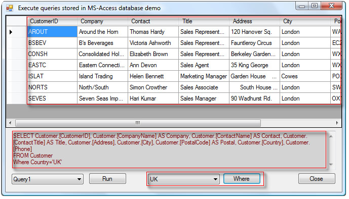

# Execute SQL statements stored in MS-Access in a VB.NET project
## Requires
- Visual Studio 2012
## License
- Apache License, Version 2.0
## Technologies
- SQL
- ADO.NET
- LINQ
- Windows Forms
- Access
- Visual Basic .NET
- VB.Net
## Topics
- Data Access
## Updated
- 06/24/2013
## Description

<h1></h1>

.

<h1>Introduction</h1>

This project demonstrates using SQL statements stored in a MS-Access database. One reason this would be helpful is when your project has one or more quires that are static in nature, meaning they never change during the execution
 of your project. For example, a select statement that returns all customers in a customer table. The complexity of the SQL statement does not matter other than it does not receive incoming parameters which is indeed possible but the idea is to leave dynamic
 quires to logic within your application.

<h1>UPDATE 6/2013</h1>

I added a code demo showing how to extract SQL statements where the user added a parameter for a SQL statement in MS-Access which can not be seen using the original method (see comments in code which explains why) but with a
 small change now allows us to get the SQL not as a view but as a procedure.

<h1>Building the Sample</h1>

The original version of the solution was in VS2008, I have updated the solution to VS2012 on June 24th, 2013. All code in the project can be added to a VS2010 project and work but for VS2008 some minor syntax changes need to
 be made as new code does not use line continuation characters.

Description

Choosing to implement running pre-defined SQL statements in MS-Access keeps a developer from writing SQL statements inside of a application using string concatenation along with using MS-Access to write your queries. Consider
 this another option in your toolbox as it is not for every query you utilize in your application.

<em>The code shown below is the entire project other than the SQL statements stored in the MS-Access database included with the project.&nbsp;&nbsp;&nbsp;</em>

&nbsp;

Visual Basic

Edit|Remove

vb

<pre class="vb">Public&nbsp;Class&nbsp;frmMainForm&nbsp;
&nbsp;&nbsp;&nbsp;&nbsp;'''&nbsp;&lt;summary&gt;&nbsp;
&nbsp;&nbsp;&nbsp;&nbsp;'''&nbsp;Connection&nbsp;string&nbsp;for&nbsp;back&nbsp;end&nbsp;database&nbsp;stored&nbsp;in&nbsp;the&nbsp;application&nbsp;startup&nbsp;folder&nbsp;
&nbsp;&nbsp;&nbsp;&nbsp;'''&nbsp;&lt;/summary&gt;&nbsp;
&nbsp;&nbsp;&nbsp;&nbsp;'''&nbsp;&lt;value&gt;&lt;/value&gt;&nbsp;
&nbsp;&nbsp;&nbsp;&nbsp;'''&nbsp;&lt;returns&gt;&lt;/returns&gt;&nbsp;
&nbsp;&nbsp;&nbsp;&nbsp;'''&nbsp;&lt;remarks&gt;&lt;/remarks&gt;&nbsp;
&nbsp;&nbsp;&nbsp;&nbsp;Public&nbsp;ReadOnly&nbsp;Property&nbsp;ConnectionString()&nbsp;As&nbsp;String&nbsp;
&nbsp;&nbsp;&nbsp;&nbsp;&nbsp;&nbsp;&nbsp;&nbsp;Get&nbsp;
&nbsp;&nbsp;&nbsp;&nbsp;&nbsp;&nbsp;&nbsp;&nbsp;&nbsp;&nbsp;&nbsp;&nbsp;Return&nbsp;&quot;Provider=Microsoft.Jet.OLEDB.4.0;Data&nbsp;Source=Database1.mdb&quot;&nbsp;
&nbsp;&nbsp;&nbsp;&nbsp;&nbsp;&nbsp;&nbsp;&nbsp;End&nbsp;Get&nbsp;
&nbsp;&nbsp;&nbsp;&nbsp;End&nbsp;Property&nbsp;
&nbsp;&nbsp;&nbsp;&nbsp;Private&nbsp;ReadOnly&nbsp;Property&nbsp;QueryNameColumn()&nbsp;As&nbsp;String&nbsp;
&nbsp;&nbsp;&nbsp;&nbsp;&nbsp;&nbsp;&nbsp;&nbsp;Get&nbsp;
&nbsp;&nbsp;&nbsp;&nbsp;&nbsp;&nbsp;&nbsp;&nbsp;&nbsp;&nbsp;&nbsp;&nbsp;Return&nbsp;&quot;Table_Name&quot;&nbsp;
&nbsp;&nbsp;&nbsp;&nbsp;&nbsp;&nbsp;&nbsp;&nbsp;End&nbsp;Get&nbsp;
&nbsp;&nbsp;&nbsp;&nbsp;End&nbsp;Property&nbsp;
&nbsp;&nbsp;&nbsp;&nbsp;Private&nbsp;ReadOnly&nbsp;Property&nbsp;StatementColumn()&nbsp;As&nbsp;String&nbsp;
&nbsp;&nbsp;&nbsp;&nbsp;&nbsp;&nbsp;&nbsp;&nbsp;Get&nbsp;
&nbsp;&nbsp;&nbsp;&nbsp;&nbsp;&nbsp;&nbsp;&nbsp;&nbsp;&nbsp;&nbsp;&nbsp;Return&nbsp;&quot;view_definition&quot;&nbsp;
&nbsp;&nbsp;&nbsp;&nbsp;&nbsp;&nbsp;&nbsp;&nbsp;End&nbsp;Get&nbsp;
&nbsp;&nbsp;&nbsp;&nbsp;End&nbsp;Property&nbsp;
&nbsp;&nbsp;&nbsp;&nbsp;Private&nbsp;Sub&nbsp;Form1_Load(ByVal&nbsp;sender&nbsp;As&nbsp;System.Object,&nbsp;ByVal&nbsp;e&nbsp;As&nbsp;<a class="libraryLink" href="http://msdn.microsoft.com/en-US/library/System.EventArgs.aspx" target="_blank" title="Auto generated link to System.EventArgs">System.EventArgs</a>)&nbsp;Handles&nbsp;MyBase.Load&nbsp;
&nbsp;
&nbsp;&nbsp;&nbsp;&nbsp;&nbsp;&nbsp;&nbsp;&nbsp;cmdRunCommand.Enabled&nbsp;=&nbsp;False&nbsp;
&nbsp;&nbsp;&nbsp;&nbsp;&nbsp;&nbsp;&nbsp;&nbsp;cmdRunCommand.Enabled&nbsp;=&nbsp;False&nbsp;
&nbsp;
&nbsp;&nbsp;&nbsp;&nbsp;&nbsp;&nbsp;&nbsp;&nbsp;Dim&nbsp;Views&nbsp;As&nbsp;New&nbsp;DataTable&nbsp;
&nbsp;
&nbsp;&nbsp;&nbsp;&nbsp;&nbsp;&nbsp;&nbsp;&nbsp;Using&nbsp;cn&nbsp;As&nbsp;New&nbsp;OleDbConnection(ConnectionString)&nbsp;
&nbsp;
&nbsp;&nbsp;&nbsp;&nbsp;&nbsp;&nbsp;&nbsp;&nbsp;&nbsp;&nbsp;&nbsp;&nbsp;Dim&nbsp;cmd&nbsp;As&nbsp;OleDbCommand&nbsp;=&nbsp;New&nbsp;OleDbCommand&nbsp;
&nbsp;&nbsp;&nbsp;&nbsp;&nbsp;&nbsp;&nbsp;&nbsp;&nbsp;&nbsp;&nbsp;&nbsp;cmd.Connection&nbsp;=&nbsp;cn&nbsp;
&nbsp;&nbsp;&nbsp;&nbsp;&nbsp;&nbsp;&nbsp;&nbsp;&nbsp;&nbsp;&nbsp;&nbsp;cn.Open()&nbsp;
&nbsp;
&nbsp;&nbsp;&nbsp;&nbsp;&nbsp;&nbsp;&nbsp;&nbsp;&nbsp;&nbsp;&nbsp;&nbsp;Views&nbsp;=&nbsp;cn.GetOleDbSchemaTable(OleDbSchemaGuid.Views,&nbsp;New&nbsp;Object()&nbsp;{Nothing,&nbsp;Nothing,&nbsp;Nothing})&nbsp;
&nbsp;&nbsp;&nbsp;&nbsp;&nbsp;&nbsp;&nbsp;&nbsp;&nbsp;&nbsp;&nbsp;&nbsp;If&nbsp;Views.Rows.Count&nbsp;&gt;&nbsp;0&nbsp;Then&nbsp;
&nbsp;&nbsp;&nbsp;&nbsp;&nbsp;&nbsp;&nbsp;&nbsp;&nbsp;&nbsp;&nbsp;&nbsp;&nbsp;&nbsp;&nbsp;&nbsp;cboItems.DisplayMember&nbsp;=&nbsp;QueryNameColumn&nbsp;
&nbsp;&nbsp;&nbsp;&nbsp;&nbsp;&nbsp;&nbsp;&nbsp;&nbsp;&nbsp;&nbsp;&nbsp;&nbsp;&nbsp;&nbsp;&nbsp;cboItems.ValueMember&nbsp;=&nbsp;StatementColumn&nbsp;
&nbsp;&nbsp;&nbsp;&nbsp;&nbsp;&nbsp;&nbsp;&nbsp;&nbsp;&nbsp;&nbsp;&nbsp;&nbsp;&nbsp;&nbsp;&nbsp;cboItems.DataSource&nbsp;=&nbsp;Views&nbsp;
&nbsp;&nbsp;&nbsp;&nbsp;&nbsp;&nbsp;&nbsp;&nbsp;&nbsp;&nbsp;&nbsp;&nbsp;&nbsp;&nbsp;&nbsp;&nbsp;cboItems.SelectedIndex&nbsp;=&nbsp;cboItems.Items.Count&nbsp;-&nbsp;1&nbsp;
&nbsp;&nbsp;&nbsp;&nbsp;&nbsp;&nbsp;&nbsp;&nbsp;&nbsp;&nbsp;&nbsp;&nbsp;End&nbsp;If&nbsp;
&nbsp;
&nbsp;&nbsp;&nbsp;&nbsp;&nbsp;&nbsp;&nbsp;&nbsp;&nbsp;&nbsp;&nbsp;&nbsp;Dim&nbsp;CountriesStatement&nbsp;=&nbsp;(From&nbsp;C&nbsp;In&nbsp;Views.AsEnumerable&nbsp;_&nbsp;
&nbsp;&nbsp;&nbsp;&nbsp;&nbsp;&nbsp;&nbsp;&nbsp;&nbsp;&nbsp;&nbsp;&nbsp;&nbsp;&nbsp;&nbsp;&nbsp;&nbsp;&nbsp;&nbsp;&nbsp;&nbsp;&nbsp;&nbsp;&nbsp;&nbsp;&nbsp;&nbsp;&nbsp;&nbsp;&nbsp;&nbsp;&nbsp;&nbsp;&nbsp;&nbsp;&nbsp;&nbsp;&nbsp;Where&nbsp;C.Item(QueryNameColumn).ToString&nbsp;=&nbsp;&quot;qryCountries&quot;&nbsp;_&nbsp;
&nbsp;&nbsp;&nbsp;&nbsp;&nbsp;&nbsp;&nbsp;&nbsp;&nbsp;&nbsp;&nbsp;&nbsp;&nbsp;&nbsp;&nbsp;&nbsp;&nbsp;&nbsp;&nbsp;&nbsp;&nbsp;&nbsp;&nbsp;&nbsp;&nbsp;&nbsp;&nbsp;&nbsp;&nbsp;&nbsp;&nbsp;&nbsp;&nbsp;&nbsp;&nbsp;&nbsp;&nbsp;&nbsp;Select&nbsp;CStr(C.Item(StatementColumn))).FirstOrDefault&nbsp;
&nbsp;
&nbsp;&nbsp;&nbsp;&nbsp;&nbsp;&nbsp;&nbsp;&nbsp;&nbsp;&nbsp;&nbsp;&nbsp;If&nbsp;CountriesStatement&nbsp;IsNot&nbsp;Nothing&nbsp;Then&nbsp;
&nbsp;&nbsp;&nbsp;&nbsp;&nbsp;&nbsp;&nbsp;&nbsp;&nbsp;&nbsp;&nbsp;&nbsp;&nbsp;&nbsp;&nbsp;&nbsp;'&nbsp;Returns&nbsp;a&nbsp;distinct&nbsp;list&nbsp;of&nbsp;countries&nbsp;
&nbsp;&nbsp;&nbsp;&nbsp;&nbsp;&nbsp;&nbsp;&nbsp;&nbsp;&nbsp;&nbsp;&nbsp;&nbsp;&nbsp;&nbsp;&nbsp;cmd.CommandText&nbsp;=&nbsp;CountriesStatement&nbsp;
&nbsp;&nbsp;&nbsp;&nbsp;&nbsp;&nbsp;&nbsp;&nbsp;&nbsp;&nbsp;&nbsp;&nbsp;&nbsp;&nbsp;&nbsp;&nbsp;Dim&nbsp;dtCountries&nbsp;As&nbsp;New&nbsp;DataTable&nbsp;
&nbsp;&nbsp;&nbsp;&nbsp;&nbsp;&nbsp;&nbsp;&nbsp;&nbsp;&nbsp;&nbsp;&nbsp;&nbsp;&nbsp;&nbsp;&nbsp;dtCountries.Load(cmd.ExecuteReader)&nbsp;
&nbsp;
&nbsp;&nbsp;&nbsp;&nbsp;&nbsp;&nbsp;&nbsp;&nbsp;&nbsp;&nbsp;&nbsp;&nbsp;&nbsp;&nbsp;&nbsp;&nbsp;cboCountries.DisplayMember&nbsp;=&nbsp;&quot;Country&quot;&nbsp;
&nbsp;&nbsp;&nbsp;&nbsp;&nbsp;&nbsp;&nbsp;&nbsp;&nbsp;&nbsp;&nbsp;&nbsp;&nbsp;&nbsp;&nbsp;&nbsp;cboCountries.DataSource&nbsp;=&nbsp;dtCountries&nbsp;
&nbsp;
&nbsp;&nbsp;&nbsp;&nbsp;&nbsp;&nbsp;&nbsp;&nbsp;&nbsp;&nbsp;&nbsp;&nbsp;&nbsp;&nbsp;&nbsp;&nbsp;'&nbsp;pick&nbsp;something&nbsp;other&nbsp;than&nbsp;the&nbsp;first&nbsp;item&nbsp;
&nbsp;&nbsp;&nbsp;&nbsp;&nbsp;&nbsp;&nbsp;&nbsp;&nbsp;&nbsp;&nbsp;&nbsp;&nbsp;&nbsp;&nbsp;&nbsp;cboCountries.SelectedIndex&nbsp;=&nbsp;GetRandom(0,&nbsp;cboCountries.Items.Count&nbsp;-&nbsp;1)&nbsp;
&nbsp;
&nbsp;&nbsp;&nbsp;&nbsp;&nbsp;&nbsp;&nbsp;&nbsp;&nbsp;&nbsp;&nbsp;&nbsp;&nbsp;&nbsp;&nbsp;&nbsp;cmdRunCommand.Enabled&nbsp;=&nbsp;True&nbsp;
&nbsp;&nbsp;&nbsp;&nbsp;&nbsp;&nbsp;&nbsp;&nbsp;&nbsp;&nbsp;&nbsp;&nbsp;&nbsp;&nbsp;&nbsp;&nbsp;cmdRunCommand.Enabled&nbsp;=&nbsp;True&nbsp;
&nbsp;
&nbsp;&nbsp;&nbsp;&nbsp;&nbsp;&nbsp;&nbsp;&nbsp;&nbsp;&nbsp;&nbsp;&nbsp;&nbsp;&nbsp;&nbsp;&nbsp;ActiveControl&nbsp;=&nbsp;cmdRunCommand&nbsp;
&nbsp;
&nbsp;&nbsp;&nbsp;&nbsp;&nbsp;&nbsp;&nbsp;&nbsp;&nbsp;&nbsp;&nbsp;&nbsp;End&nbsp;If&nbsp;
&nbsp;
&nbsp;&nbsp;&nbsp;&nbsp;&nbsp;&nbsp;&nbsp;&nbsp;End&nbsp;Using&nbsp;
&nbsp;
&nbsp;&nbsp;&nbsp;&nbsp;End&nbsp;Sub&nbsp;
&nbsp;&nbsp;&nbsp;&nbsp;Private&nbsp;Sub&nbsp;cmdRunCommand_Click(ByVal&nbsp;sender&nbsp;As&nbsp;System.Object,&nbsp;ByVal&nbsp;e&nbsp;As&nbsp;<a class="libraryLink" href="http://msdn.microsoft.com/en-US/library/System.EventArgs.aspx" target="_blank" title="Auto generated link to System.EventArgs">System.EventArgs</a>)&nbsp;Handles&nbsp;cmdRunCommand.Click&nbsp;
&nbsp;
&nbsp;&nbsp;&nbsp;&nbsp;&nbsp;&nbsp;&nbsp;&nbsp;Using&nbsp;cn&nbsp;As&nbsp;New&nbsp;OleDbConnection(ConnectionString)&nbsp;
&nbsp;&nbsp;&nbsp;&nbsp;&nbsp;&nbsp;&nbsp;&nbsp;&nbsp;&nbsp;&nbsp;&nbsp;Dim&nbsp;cmd&nbsp;As&nbsp;OleDbCommand&nbsp;=&nbsp;New&nbsp;OleDbCommand&nbsp;
&nbsp;&nbsp;&nbsp;&nbsp;&nbsp;&nbsp;&nbsp;&nbsp;&nbsp;&nbsp;&nbsp;&nbsp;cmd.Connection&nbsp;=&nbsp;cn&nbsp;
&nbsp;&nbsp;&nbsp;&nbsp;&nbsp;&nbsp;&nbsp;&nbsp;&nbsp;&nbsp;&nbsp;&nbsp;cn.Open()&nbsp;
&nbsp;
&nbsp;&nbsp;&nbsp;&nbsp;&nbsp;&nbsp;&nbsp;&nbsp;&nbsp;&nbsp;&nbsp;&nbsp;cmd.CommandText&nbsp;=&nbsp;cboItems.SelectedValue.ToString&nbsp;
&nbsp;
&nbsp;&nbsp;&nbsp;&nbsp;&nbsp;&nbsp;&nbsp;&nbsp;&nbsp;&nbsp;&nbsp;&nbsp;Dim&nbsp;dt&nbsp;As&nbsp;New&nbsp;DataTable&nbsp;
&nbsp;&nbsp;&nbsp;&nbsp;&nbsp;&nbsp;&nbsp;&nbsp;&nbsp;&nbsp;&nbsp;&nbsp;dt.Load(cmd.ExecuteReader())&nbsp;
&nbsp;&nbsp;&nbsp;&nbsp;&nbsp;&nbsp;&nbsp;&nbsp;&nbsp;&nbsp;&nbsp;&nbsp;DataGridView1.DataSource&nbsp;=&nbsp;dt&nbsp;
&nbsp;
&nbsp;&nbsp;&nbsp;&nbsp;&nbsp;&nbsp;&nbsp;&nbsp;&nbsp;&nbsp;&nbsp;&nbsp;txtExecutingQueryStatement.Text&nbsp;=&nbsp;cmd.CommandText&nbsp;
&nbsp;
&nbsp;&nbsp;&nbsp;&nbsp;&nbsp;&nbsp;&nbsp;&nbsp;End&nbsp;Using&nbsp;
&nbsp;
&nbsp;&nbsp;&nbsp;&nbsp;End&nbsp;Sub&nbsp;
&nbsp;
&nbsp;&nbsp;&nbsp;&nbsp;Private&nbsp;Sub&nbsp;cmdWhere_Click(ByVal&nbsp;sender&nbsp;As&nbsp;System.Object,&nbsp;ByVal&nbsp;e&nbsp;As&nbsp;<a class="libraryLink" href="http://msdn.microsoft.com/en-US/library/System.EventArgs.aspx" target="_blank" title="Auto generated link to System.EventArgs">System.EventArgs</a>)&nbsp;Handles&nbsp;cmdWhere.Click&nbsp;
&nbsp;
&nbsp;&nbsp;&nbsp;&nbsp;&nbsp;&nbsp;&nbsp;&nbsp;Dim&nbsp;Rows&nbsp;=&nbsp;DirectCast(cboItems.DataSource,&nbsp;DataTable).Select(QueryNameColumn&nbsp;&amp;&nbsp;&quot;&nbsp;=&nbsp;'qryCustomer1'&quot;)&nbsp;
&nbsp;
&nbsp;&nbsp;&nbsp;&nbsp;&nbsp;&nbsp;&nbsp;&nbsp;If&nbsp;Rows.Count&nbsp;=&nbsp;1&nbsp;Then&nbsp;
&nbsp;
&nbsp;&nbsp;&nbsp;&nbsp;&nbsp;&nbsp;&nbsp;&nbsp;&nbsp;&nbsp;&nbsp;&nbsp;Dim&nbsp;SelectStatement&nbsp;=&nbsp;Rows(0).Item(StatementColumn).ToString.Replace(&quot;;&quot;,&nbsp;&quot;&nbsp;&quot;)&nbsp;&amp;&nbsp;_&nbsp;
&nbsp;&nbsp;&nbsp;&nbsp;&nbsp;&nbsp;&nbsp;&nbsp;&nbsp;&nbsp;&nbsp;&nbsp;&nbsp;&nbsp;&nbsp;&nbsp;&quot;Where&nbsp;Country='&quot;&nbsp;&amp;&nbsp;cboCountries.Text&nbsp;&amp;&nbsp;&quot;'&quot;&nbsp;
&nbsp;
&nbsp;&nbsp;&nbsp;&nbsp;&nbsp;&nbsp;&nbsp;&nbsp;&nbsp;&nbsp;&nbsp;&nbsp;Dim&nbsp;dt&nbsp;As&nbsp;New&nbsp;DataTable&nbsp;
&nbsp;
&nbsp;&nbsp;&nbsp;&nbsp;&nbsp;&nbsp;&nbsp;&nbsp;&nbsp;&nbsp;&nbsp;&nbsp;Using&nbsp;cn&nbsp;As&nbsp;New&nbsp;OleDbConnection(ConnectionString)&nbsp;
&nbsp;
&nbsp;&nbsp;&nbsp;&nbsp;&nbsp;&nbsp;&nbsp;&nbsp;&nbsp;&nbsp;&nbsp;&nbsp;&nbsp;&nbsp;&nbsp;&nbsp;Dim&nbsp;cmd&nbsp;As&nbsp;OleDbCommand&nbsp;=&nbsp;New&nbsp;OleDbCommand(SelectStatement)&nbsp;
&nbsp;&nbsp;&nbsp;&nbsp;&nbsp;&nbsp;&nbsp;&nbsp;&nbsp;&nbsp;&nbsp;&nbsp;&nbsp;&nbsp;&nbsp;&nbsp;cmd.Connection&nbsp;=&nbsp;cn&nbsp;
&nbsp;&nbsp;&nbsp;&nbsp;&nbsp;&nbsp;&nbsp;&nbsp;&nbsp;&nbsp;&nbsp;&nbsp;&nbsp;&nbsp;&nbsp;&nbsp;cn.Open()&nbsp;
&nbsp;
&nbsp;&nbsp;&nbsp;&nbsp;&nbsp;&nbsp;&nbsp;&nbsp;&nbsp;&nbsp;&nbsp;&nbsp;&nbsp;&nbsp;&nbsp;&nbsp;dt.Load(cmd.ExecuteReader())&nbsp;
&nbsp;&nbsp;&nbsp;&nbsp;&nbsp;&nbsp;&nbsp;&nbsp;&nbsp;&nbsp;&nbsp;&nbsp;&nbsp;&nbsp;&nbsp;&nbsp;dt.Columns(&quot;Country&quot;).ColumnMapping&nbsp;=&nbsp;MappingType.Hidden&nbsp;
&nbsp;&nbsp;&nbsp;&nbsp;&nbsp;&nbsp;&nbsp;&nbsp;&nbsp;&nbsp;&nbsp;&nbsp;&nbsp;&nbsp;&nbsp;&nbsp;DataGridView1.DataSource&nbsp;=&nbsp;dt&nbsp;
&nbsp;&nbsp;&nbsp;&nbsp;&nbsp;&nbsp;&nbsp;&nbsp;&nbsp;&nbsp;&nbsp;&nbsp;&nbsp;&nbsp;&nbsp;&nbsp;txtExecutingQueryStatement.Text&nbsp;=&nbsp;cmd.CommandText&nbsp;
&nbsp;
&nbsp;&nbsp;&nbsp;&nbsp;&nbsp;&nbsp;&nbsp;&nbsp;&nbsp;&nbsp;&nbsp;&nbsp;End&nbsp;Using&nbsp;
&nbsp;
&nbsp;&nbsp;&nbsp;&nbsp;&nbsp;&nbsp;&nbsp;&nbsp;End&nbsp;If&nbsp;
&nbsp;
&nbsp;&nbsp;&nbsp;&nbsp;End&nbsp;Sub&nbsp;
&nbsp;&nbsp;&nbsp;&nbsp;Public&nbsp;Function&nbsp;GetRandom(ByVal&nbsp;Min&nbsp;As&nbsp;Integer,&nbsp;ByVal&nbsp;Max&nbsp;As&nbsp;Integer)&nbsp;As&nbsp;Integer&nbsp;
&nbsp;&nbsp;&nbsp;&nbsp;&nbsp;&nbsp;&nbsp;&nbsp;Dim&nbsp;Generator&nbsp;As&nbsp;System.Random&nbsp;=&nbsp;New&nbsp;<a class="libraryLink" href="http://msdn.microsoft.com/en-US/library/System.Random.aspx" target="_blank" title="Auto generated link to System.Random">System.Random</a>()&nbsp;
&nbsp;&nbsp;&nbsp;&nbsp;&nbsp;&nbsp;&nbsp;&nbsp;Return&nbsp;Generator.Next(Min,&nbsp;Max)&nbsp;
&nbsp;&nbsp;&nbsp;&nbsp;End&nbsp;Function&nbsp;
&nbsp;&nbsp;&nbsp;&nbsp;Private&nbsp;Sub&nbsp;cmdClose_Click(ByVal&nbsp;sender&nbsp;As&nbsp;System.Object,&nbsp;ByVal&nbsp;e&nbsp;As&nbsp;<a class="libraryLink" href="http://msdn.microsoft.com/en-US/library/System.EventArgs.aspx" target="_blank" title="Auto generated link to System.EventArgs">System.EventArgs</a>)&nbsp;Handles&nbsp;cmdClose.Click&nbsp;
&nbsp;&nbsp;&nbsp;&nbsp;&nbsp;&nbsp;&nbsp;&nbsp;Close()&nbsp;
&nbsp;&nbsp;&nbsp;&nbsp;End&nbsp;Sub&nbsp;
End&nbsp;Class&nbsp;
</pre>

<h1>More Information</h1>

<em>I will be creating another sample on storing SQL statements embedded within a project which show syntax coloring of statements which can be used no matter what the provider is</em>

