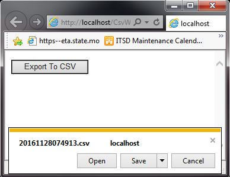
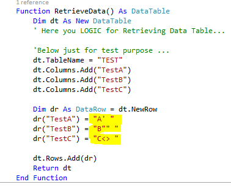
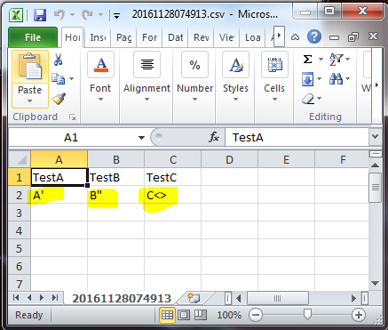

# Export DataTable to CSV file ..
## Requires
- Visual Studio 2015
## License
- MIT
## Technologies
- CSV
- VB NET
## Topics
- CSV
- VB.NET Examples
## Updated
- 04/25/2018
## Description

<h3>Introduction</h3>

WEB application - how to export Data Table to CSV file. 
Logic working with ANY chars in the column(s), it uses StringBuilder for build output string, this approach radically increases performance.

SEE ALSO:&nbsp;<a href="https://code.msdn.microsoft.com/windowsapps/Export-DataSet-to-Excel-d555b6ba">Export DataSet to Excel file with multiple sheets (NO &quot;3d&quot; party libraries).</a>

&nbsp;

<strong>Description&nbsp;</strong>

Select button [Export To CSV] and [Save] or [Open] file.

&nbsp;

&nbsp;

&nbsp;

&nbsp;

See Example below.

&nbsp;

&nbsp;

<em>&nbsp;</em>

<h3>Build the Sample 
</h3>
<ol>
<li>Start Visual Studio Express&nbsp;2012 for Windows&nbsp;8 and select <strong>File</strong> &gt;<strong>Open</strong> &gt;
<strong>Project/Solution</strong>. </li><li>Go to the directory in which you unzipped the sample. Go to the directory named for the sample, and double-click the Visual Studio Express&nbsp;2012 for Windows&nbsp;8 Solution (.sln) file.
</li><li>Press F7 or use <strong>Build</strong> &gt; <strong>Build Solution</strong> to build the sample.
</li></ol>

&nbsp;

<h3>&nbsp;Run the sample</h3>

To debug the app and then run it, press F5 or use <strong>Debug</strong> &gt; <strong>
Start Debugging</strong>. To execute the app without debugging, press Ctrl&#43;F5 or use
<strong>Debug</strong> &gt; <strong>Start Without Debugging</strong>.

&nbsp;

Visual Basic

Edit|Remove

vb
<pre class="hidden">    Function csvBytesWriter(ByRef dTable As DataTable) As Byte()

        '--------Columns Name---------------------------------------------------------------------------

        Dim sb As StringBuilder = New StringBuilder()
        Dim intClmn As Integer = dTable.Columns.Count

        Dim i As Integer = 0
        For i = 0 To intClmn - 1 Step i &#43; 1
            sb.Append(&quot;&quot;&quot;&quot; &#43; dTable.Columns(i).ColumnName.ToString() &#43; &quot;&quot;&quot;&quot;)
            If i = intClmn - 1 Then
                sb.Append(&quot; &quot;)
            Else
                sb.Append(&quot;,&quot;)
            End If
        Next
        sb.Append(vbNewLine)

        '--------Data By  Columns---------------------------------------------------------------------------

        Dim row As DataRow
        For Each row In dTable.Rows

            Dim ir As Integer = 0
            For ir = 0 To intClmn - 1 Step ir &#43; 1
                sb.Append(&quot;&quot;&quot;&quot; &#43; row(ir).ToString().Replace(&quot;&quot;&quot;&quot;, &quot;&quot;&quot;&quot;&quot;&quot;) &#43; &quot;&quot;&quot;&quot;)
                If ir = intClmn - 1 Then
                    sb.Append(&quot; &quot;)
                Else
                    sb.Append(&quot;,&quot;)
                End If

            Next
            sb.Append(vbNewLine)
        Next

        Return System.Text.Encoding.UTF8.GetBytes(sb.ToString)

    End Function</pre>

<pre class="vb">&nbsp;&nbsp;&nbsp;&nbsp;Function&nbsp;csvBytesWriter(ByRef&nbsp;dTable&nbsp;As&nbsp;DataTable)&nbsp;As&nbsp;Byte()&nbsp;
&nbsp;
&nbsp;&nbsp;&nbsp;&nbsp;&nbsp;&nbsp;&nbsp;&nbsp;'--------Columns&nbsp;Name---------------------------------------------------------------------------&nbsp;
&nbsp;
&nbsp;&nbsp;&nbsp;&nbsp;&nbsp;&nbsp;&nbsp;&nbsp;Dim&nbsp;sb&nbsp;As&nbsp;StringBuilder&nbsp;=&nbsp;New&nbsp;StringBuilder()&nbsp;
&nbsp;&nbsp;&nbsp;&nbsp;&nbsp;&nbsp;&nbsp;&nbsp;Dim&nbsp;intClmn&nbsp;As&nbsp;Integer&nbsp;=&nbsp;dTable.Columns.Count&nbsp;
&nbsp;
&nbsp;&nbsp;&nbsp;&nbsp;&nbsp;&nbsp;&nbsp;&nbsp;Dim&nbsp;i&nbsp;As&nbsp;Integer&nbsp;=&nbsp;0&nbsp;
&nbsp;&nbsp;&nbsp;&nbsp;&nbsp;&nbsp;&nbsp;&nbsp;For&nbsp;i&nbsp;=&nbsp;0&nbsp;To&nbsp;intClmn&nbsp;-&nbsp;1&nbsp;Step&nbsp;i&nbsp;&#43;&nbsp;1&nbsp;
&nbsp;&nbsp;&nbsp;&nbsp;&nbsp;&nbsp;&nbsp;&nbsp;&nbsp;&nbsp;&nbsp;&nbsp;sb.Append(&quot;&quot;&quot;&quot;&nbsp;&#43;&nbsp;dTable.Columns(i).ColumnName.ToString()&nbsp;&#43;&nbsp;&quot;&quot;&quot;&quot;)&nbsp;
&nbsp;&nbsp;&nbsp;&nbsp;&nbsp;&nbsp;&nbsp;&nbsp;&nbsp;&nbsp;&nbsp;&nbsp;If&nbsp;i&nbsp;=&nbsp;intClmn&nbsp;-&nbsp;1&nbsp;Then&nbsp;
&nbsp;&nbsp;&nbsp;&nbsp;&nbsp;&nbsp;&nbsp;&nbsp;&nbsp;&nbsp;&nbsp;&nbsp;&nbsp;&nbsp;&nbsp;&nbsp;sb.Append(&quot;&nbsp;&quot;)&nbsp;
&nbsp;&nbsp;&nbsp;&nbsp;&nbsp;&nbsp;&nbsp;&nbsp;&nbsp;&nbsp;&nbsp;&nbsp;Else&nbsp;
&nbsp;&nbsp;&nbsp;&nbsp;&nbsp;&nbsp;&nbsp;&nbsp;&nbsp;&nbsp;&nbsp;&nbsp;&nbsp;&nbsp;&nbsp;&nbsp;sb.Append(&quot;,&quot;)&nbsp;
&nbsp;&nbsp;&nbsp;&nbsp;&nbsp;&nbsp;&nbsp;&nbsp;&nbsp;&nbsp;&nbsp;&nbsp;End&nbsp;If&nbsp;
&nbsp;&nbsp;&nbsp;&nbsp;&nbsp;&nbsp;&nbsp;&nbsp;Next&nbsp;
&nbsp;&nbsp;&nbsp;&nbsp;&nbsp;&nbsp;&nbsp;&nbsp;sb.Append(vbNewLine)&nbsp;
&nbsp;
&nbsp;&nbsp;&nbsp;&nbsp;&nbsp;&nbsp;&nbsp;&nbsp;'--------Data&nbsp;By&nbsp;&nbsp;Columns---------------------------------------------------------------------------&nbsp;
&nbsp;
&nbsp;&nbsp;&nbsp;&nbsp;&nbsp;&nbsp;&nbsp;&nbsp;Dim&nbsp;row&nbsp;As&nbsp;DataRow&nbsp;
&nbsp;&nbsp;&nbsp;&nbsp;&nbsp;&nbsp;&nbsp;&nbsp;For&nbsp;Each&nbsp;row&nbsp;In&nbsp;dTable.Rows&nbsp;
&nbsp;
&nbsp;&nbsp;&nbsp;&nbsp;&nbsp;&nbsp;&nbsp;&nbsp;&nbsp;&nbsp;&nbsp;&nbsp;Dim&nbsp;ir&nbsp;As&nbsp;Integer&nbsp;=&nbsp;0&nbsp;
&nbsp;&nbsp;&nbsp;&nbsp;&nbsp;&nbsp;&nbsp;&nbsp;&nbsp;&nbsp;&nbsp;&nbsp;For&nbsp;ir&nbsp;=&nbsp;0&nbsp;To&nbsp;intClmn&nbsp;-&nbsp;1&nbsp;Step&nbsp;ir&nbsp;&#43;&nbsp;1&nbsp;
&nbsp;&nbsp;&nbsp;&nbsp;&nbsp;&nbsp;&nbsp;&nbsp;&nbsp;&nbsp;&nbsp;&nbsp;&nbsp;&nbsp;&nbsp;&nbsp;sb.Append(&quot;&quot;&quot;&quot;&nbsp;&#43;&nbsp;row(ir).ToString().Replace(&quot;&quot;&quot;&quot;,&nbsp;&quot;&quot;&quot;&quot;&quot;&quot;)&nbsp;&#43;&nbsp;&quot;&quot;&quot;&quot;)&nbsp;
&nbsp;&nbsp;&nbsp;&nbsp;&nbsp;&nbsp;&nbsp;&nbsp;&nbsp;&nbsp;&nbsp;&nbsp;&nbsp;&nbsp;&nbsp;&nbsp;If&nbsp;ir&nbsp;=&nbsp;intClmn&nbsp;-&nbsp;1&nbsp;Then&nbsp;
&nbsp;&nbsp;&nbsp;&nbsp;&nbsp;&nbsp;&nbsp;&nbsp;&nbsp;&nbsp;&nbsp;&nbsp;&nbsp;&nbsp;&nbsp;&nbsp;&nbsp;&nbsp;&nbsp;&nbsp;sb.Append(&quot;&nbsp;&quot;)&nbsp;
&nbsp;&nbsp;&nbsp;&nbsp;&nbsp;&nbsp;&nbsp;&nbsp;&nbsp;&nbsp;&nbsp;&nbsp;&nbsp;&nbsp;&nbsp;&nbsp;Else&nbsp;
&nbsp;&nbsp;&nbsp;&nbsp;&nbsp;&nbsp;&nbsp;&nbsp;&nbsp;&nbsp;&nbsp;&nbsp;&nbsp;&nbsp;&nbsp;&nbsp;&nbsp;&nbsp;&nbsp;&nbsp;sb.Append(&quot;,&quot;)&nbsp;
&nbsp;&nbsp;&nbsp;&nbsp;&nbsp;&nbsp;&nbsp;&nbsp;&nbsp;&nbsp;&nbsp;&nbsp;&nbsp;&nbsp;&nbsp;&nbsp;End&nbsp;If&nbsp;
&nbsp;
&nbsp;&nbsp;&nbsp;&nbsp;&nbsp;&nbsp;&nbsp;&nbsp;&nbsp;&nbsp;&nbsp;&nbsp;Next&nbsp;
&nbsp;&nbsp;&nbsp;&nbsp;&nbsp;&nbsp;&nbsp;&nbsp;&nbsp;&nbsp;&nbsp;&nbsp;sb.Append(vbNewLine)&nbsp;
&nbsp;&nbsp;&nbsp;&nbsp;&nbsp;&nbsp;&nbsp;&nbsp;Next&nbsp;
&nbsp;
&nbsp;&nbsp;&nbsp;&nbsp;&nbsp;&nbsp;&nbsp;&nbsp;Return&nbsp;System.Text.Encoding.UTF8.GetBytes(sb.ToString)&nbsp;
&nbsp;
&nbsp;&nbsp;&nbsp;&nbsp;End&nbsp;Function</pre>

<h1>Source Code Files</h1>
<ul>
<li>Function csvBytesWriter(ByRef dTable As DataTable) As Byte() </li><li>'--------Columns Name---------------------------------------------------------------------------
</li><li>Dim sb As StringBuilder = New StringBuilder() </li><li>Dim intClmn As Integer = dTable.Columns.Count </li><li>Dim i As Integer = 0&nbsp; &nbsp; &nbsp; &nbsp;&nbsp; </li><li>For i = 0 To intClmn - 1 Step i &#43; 1&nbsp; &nbsp; &nbsp; &nbsp; &nbsp; &nbsp;&nbsp;
</li><li>sb.Append(&quot;&quot;&quot;&quot; &#43; dTable.Columns(i).ColumnName.ToString() &#43; &quot;&quot;&quot;&quot;)&nbsp; &nbsp; &nbsp; &nbsp; &nbsp; &nbsp;&nbsp;
</li><li>If i = intClmn - 1 Then&nbsp; &nbsp; &nbsp; &nbsp; &nbsp; &nbsp; &nbsp; &nbsp;&nbsp;
</li><li>sb.Append(&quot; &quot;)&nbsp; &nbsp; &nbsp; &nbsp; &nbsp; &nbsp;&nbsp; </li><li>Else&nbsp; &nbsp; &nbsp; &nbsp; &nbsp; &nbsp; &nbsp; &nbsp;&nbsp; </li><li>sb.Append(&quot;,&quot;)&nbsp; &nbsp; &nbsp; &nbsp; &nbsp; &nbsp;&nbsp; </li><li>End If&nbsp; &nbsp; &nbsp; &nbsp;&nbsp; </li><li>Next&nbsp; &nbsp; &nbsp; &nbsp;&nbsp; </li><li>sb.Append(vbNewLine) </li><li>'--------Data By &nbsp;Columns---------------------------------------------------------------------------
</li><li>Dim row As DataRow&nbsp; &nbsp; &nbsp; &nbsp;&nbsp; </li><li>For Each row In dTable.Rows </li><li>Dim ir As Integer = 0&nbsp; &nbsp; &nbsp; &nbsp; &nbsp; &nbsp;&nbsp; </li><li>For ir = 0 To intClmn - 1 Step ir &#43; 1&nbsp; &nbsp; &nbsp; &nbsp; &nbsp; &nbsp; &nbsp; &nbsp;&nbsp;
</li><li>sb.Append(&quot;&quot;&quot;&quot; &#43; row(ir).ToString().Replace(&quot;&quot;&quot;&quot;, &quot;&quot;&quot;&quot;&quot;&quot;) &#43; &quot;&quot;&quot;&quot;)&nbsp; &nbsp; &nbsp; &nbsp; &nbsp; &nbsp; &nbsp; &nbsp;&nbsp;
</li><li>If ir = intClmn - 1 Then&nbsp; &nbsp; &nbsp; &nbsp; &nbsp; &nbsp; &nbsp; &nbsp; &nbsp; &nbsp;&nbsp;
</li><li>sb.Append(&quot; &quot;)&nbsp; &nbsp; &nbsp; &nbsp; &nbsp; &nbsp; &nbsp; &nbsp;&nbsp; </li><li>Else&nbsp; &nbsp; &nbsp; &nbsp; &nbsp; &nbsp; &nbsp; &nbsp; &nbsp; &nbsp;&nbsp;
</li><li>sb.Append(&quot;,&quot;)&nbsp; &nbsp; &nbsp; &nbsp; &nbsp; &nbsp; &nbsp; &nbsp;&nbsp; </li><li>End If </li><li>Next&nbsp; &nbsp; &nbsp; &nbsp; &nbsp; &nbsp;&nbsp; </li><li>sb.Append(vbNewLine)&nbsp; &nbsp; &nbsp; &nbsp;&nbsp; </li><li>Next </li><li>Return System.Text.Encoding.UTF8.GetBytes(sb.ToString) </li><li>End Function </li></ul>
<h1>More Information</h1>

<em>As always, please take the time to rate this example if you found it helpful. I'll endeavour to answer any questions in the Questions &#43; Answers section of this web page. Thanks</em>

