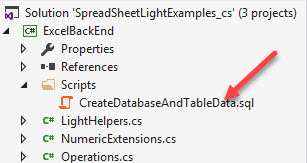
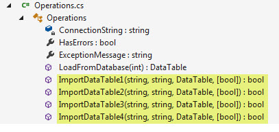

# Export DataTable to Excel using SpreadSheetLight library for Excel 2007+
## Requires
- Visual Studio 2015
## License
- MIT
## Technologies
- C#
- SQL Server
- Excel
- Microsoft Office Excel 2007
- DataGridView
- DataTable
## Topics
- Excel
- Data Access
- Export from DataTable to Excel
## Updated
- 11/18/2017
## Description

<h1>Description</h1>

This code sample provides an alternate way to export a DataGridView with a DataSource of a DataTable to Microsoft Excel. Of course the DataGridView is not required yet the focus up front is on a DataGridView simply because many
 developers are constantly asking &ldquo;how do I export a DataGridView to Excel?&rdquo; If they simply use a DataTable and the third party library
<a href="http://spreadsheetlight.com/">SpreadSheetLight</a> which has a method (one line of code) to import a DataTable into an Excel WorkSheet. Even though the library has a method there is still work to be done when importing anything other than strings.

<a href="http://spreadsheetlight.com/">SpreadSheetLight</a> is free to use, on their site you can download the help documentation (which like any documentation can take time to get up too speed yet these code samples will accelerate
 using the library), see simple code samples. To use the library you need to use NuGet.

If for any reason the client machine does not have Excel installed, no problem, SpreadSheetLight does not require Excel to be installed.

<h1>Setup</h1>

SpreadSheet library has a dependency on a NugGet package DocumentFormat.OpenXml where when downloaded from NuGet installs the lastest version. For SpreadSheetLight to work select version 2.5.0.&nbsp;

For the included solution first thing to do is right click on the Solution and select &quot;restore NuGet Packages&quot; followed by cleaning then rebuilding the solution.

There is one form set as the main form. Each form has a clearly defined name, to try out the code go into project properties and change the startup form, rebuild/run.

You may have to execute <a href="https://docs.microsoft.com/en-us/nuget/consume-packages/package-restore">
NuGet restore packages</a>.

.

If you don't use 2.5.0 then there will be errors at compile time.

Walking through the code. There are two main projects (three total), ExcelBackEnd which does all the Excel opererations and also loading SQL-Server data while the project FrontEndUserInterface displays data and calls methods
 in ExcelBackEnd.

Speaking of SQL-Server, you need to execute the following script to create and load data into SQL-Server followed by altering the connection string in Operations class which has a comment for this.

Here are the methods.

 

Each method builds off the prior method. The first does a simple no frills import where a date column does not show up as expected, same for a bool column, the second, I show how to remedy the date and bool column formatting
 using SpreadSheetLight styles. Method 2 also shows how to format the column/field header.

Method 3, header formatting is excluded, grid lines are removed (two lines of code). Method 4 introduces zebra coloring (odd row's background are a different color), formatting on the state column conditionally.

That is pretty much it but there are some little things within the code which I know you will find of use.

 

 

 

