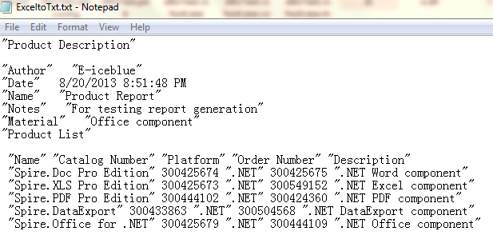

# Export Excel Data to Text in C#
## Requires
- Visual Studio 2010
## License
- MS-LPL
## Technologies
- C#
- ASP.NET
- WPF
- c# control
## Topics
- Export Excel Data to Text in C#
- Convert Excel to Text
## Updated
- 11/03/2014
## Description

<h1>Introduction</h1>

Sometimes, we are required to deliver a workbook in the format of text file, we need to convert the workbook into text files. This sample gives the easiest sulotion to export Excel data to text using
 free Spire.XLS with C#.

Description

<strong>Tools we need:</strong> 

- Free Spire.XLS (This dll is available in the package attached.) 
- Visual Studio

<strong>Prepare the environment</strong> 

This solution is based on a free .NET Excel component - free Spire.XLS, download the package and unzip it, you&rsquo;ll
 get dll file and sample demo at the same time. Create or open a .NET class application in Visual Studio 2005 or above versions, add Spire.Xls.dll as a reference to your .NET project assemblies, set &ldquo;Target framework&rdquo; to &ldquo;.NET Framework 4&rdquo;.

<strong>Excel:</strong>

<strong> 
</strong>

<strong>Text:</strong>

<h1>More Information</h1>

Spire.XLS for .NET is a professional and powerful Excel component which enables developers/programmers to operate Excel files with
 their ASP.NET web sites and Windows Forms applications. It supports to operate both for the old Excel 97-2003 format (.xls) and for the new Excel 2007,Excel 2010 and Excel 2013 (.xlsx, .xlsb, .xlsm), along with Open Office(.ods) format. It allows developers
 to fast generate, edit Excel files, operate Excel document directly such as save to stream, save as web response, copy, lock/unlock worksheet, set up workbook properties, etc. without Microsoft Office Excel Automation.

<strong>Main Features of Spire.XLS</strong><em>&nbsp;</em>

<ul>
<li>No Microsoft Excel Automation </li><li>&nbsp;ASP.NET and Windows Forms support 
</li><li>Rich Set of Features </li><li>Multi-language support </li><li>Scalability and Usability </li><li>Easy manipulation and high fidelity </li></ul>

<strong>Related Links:</strong>

Website: <a href="http://www.e-iceblue.com">www.e-iceblue.com</a> 
Product Home: <a href="http://www.e-iceblue.com/Introduce/free-xls-component.html">
Free Spire.XLS for .NET</a> 
Download: <a href="http://www.e-iceblue.com/Download/download-excel-for-net-now.html">
Spire.XLS for. NET</a> 
Forum: <a href="http://www.e-iceblue.com/forum/viewforum.php?f=4">
Spire.XLS forum</a>

