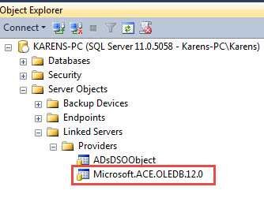
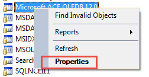
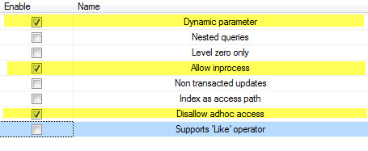

# Export Excel from SQL-Server
## Requires
- Visual Studio 2015
## License
- MIT
## Technologies
- C#
- SQL Server
- Excel
- Class Library
- VB.Net
- export to excel
## Topics
- SQL Server
- Excel
- Data Export
## Updated
- 08/28/2018
## Description

<h1>Description</h1>

This code sample explains how to export from a SQL-Server table to an Excel worksheet by first configuring SQL-Server to permit exporting. By default if you used the code provided in the code samples they would fail with something
 like the following or very similar message

<em>The requested operation could not be performed because OLE DB provider &quot;Microsoft.ACE.OLEDB.12.0&quot; for linked server &quot;(null)&quot; does not support the required transaction interface</em>.

So the first thing needed is to configure a few settings in SQL-Server Management Studio Link Servers. Traverse to the node Microsoft.ACE.OOLEDB.12.0

Right click, select properties

Once the dialog appears, select and check these items

Now select the Database node, right click, select Refresh. This should do it configuration wise yet look out for other issues like the proper library for MS-Access is installed properly and that you don't mix 64 and 32bit with
 the library and SQL-Server install.

Once the above is done, create a database named ExcelExporting. Once created run the script SQL_Scripts.sql in the solution from the file or from SQL-Server.

Build the project and we are ready to run but first lets go over the operations.

Under the Bin\Debug folder there is an Excel file setup with the first row has names of columns which has the same count as the query that runs. Note the names are different than the field names as they are easier for reading.
 By default the CheckBox is checked and indicates to copy the file under Bin\Debug\Files to Bin\Debug.&nbsp;

For Export all we keep the same name while for the Export to County we name the file when copying to the country name without spaces or apostrophes.

Once either operation completes the row count is displayed or any errors. If you get a long drawn out error like the one at the beginning of this article then SQL-Server is not configured correctly. Point to be made, there are
 literally thousands of web pages with this type of error and they do have one thing in common with one common answer for most, to set two of the three options I showed above, I learned the hard way on this.

Last thought, many ask how to export from a DataGridView to Excel where the data was read from SQL-Server database table. My train of thought is, update data in the DataGridView then export from the database table rather then
 resorting to either OleDb, Excel automation or creating a CSV file that Excel will read.

Example on CSV in VB.NET which got me started on this as the person asking the question indicated they read from SQL-Server but did not set a DataSource for the DataGridView thus the code needed was against the DataGridView.

&nbsp;

Visual Basic

Edit|Remove

vb

<pre class="vb">Public&nbsp;Module&nbsp;DataGridViewExtensions&nbsp;
&nbsp;&nbsp;&nbsp;&nbsp;'''&nbsp;&lt;summary&gt;&nbsp;
&nbsp;&nbsp;&nbsp;&nbsp;'''&nbsp;Export&nbsp;DataGridView&nbsp;rows/cells&nbsp;to&nbsp;csv&nbsp;
&nbsp;&nbsp;&nbsp;&nbsp;'''&nbsp;&lt;/summary&gt;&nbsp;
&nbsp;&nbsp;&nbsp;&nbsp;'''&nbsp;&lt;param&nbsp;name=&quot;sender&quot;&gt;&lt;/param&gt;&nbsp;
&nbsp;&nbsp;&nbsp;&nbsp;'''&nbsp;&lt;param&nbsp;name=&quot;FileName&quot;&gt;Name&nbsp;of&nbsp;file&nbsp;to&nbsp;save&nbsp;information&nbsp;into&lt;/param&gt;&nbsp;
&nbsp;&nbsp;&nbsp;&nbsp;'''&nbsp;&lt;param&nbsp;name=&quot;UseHeader&quot;&gt;True&nbsp;indicates&nbsp;first&nbsp;row&nbsp;will&nbsp;be&nbsp;column&nbsp;headers,&nbsp;default&nbsp;is&nbsp;not&nbsp;to&nbsp;include&nbsp;header&lt;/param&gt;&nbsp;
&nbsp;&nbsp;&nbsp;&nbsp;&lt;Runtime.CompilerServices.Extension()&gt;&nbsp;
&nbsp;&nbsp;&nbsp;&nbsp;Public&nbsp;Sub&nbsp;ExportRows(ByVal&nbsp;sender&nbsp;As&nbsp;DataGridView,&nbsp;ByVal&nbsp;FileName&nbsp;As&nbsp;String,&nbsp;Optional&nbsp;UseHeader&nbsp;As&nbsp;Boolean&nbsp;=&nbsp;False)&nbsp;
&nbsp;&nbsp;&nbsp;&nbsp;&nbsp;&nbsp;&nbsp;&nbsp;Dim&nbsp;sbHeader&nbsp;=&nbsp;New&nbsp;Text.StringBuilder()&nbsp;
&nbsp;&nbsp;&nbsp;&nbsp;&nbsp;&nbsp;&nbsp;&nbsp;Dim&nbsp;headers&nbsp;=&nbsp;sender.Columns.Cast(Of&nbsp;DataGridViewColumn)()&nbsp;
&nbsp;
&nbsp;&nbsp;&nbsp;&nbsp;&nbsp;&nbsp;&nbsp;&nbsp;sbHeader.Append(String.Join(&quot;,&quot;,&nbsp;headers.Select(Function(column)&nbsp;column.HeaderText)))&nbsp;
&nbsp;
&nbsp;&nbsp;&nbsp;&nbsp;&nbsp;&nbsp;&nbsp;&nbsp;'&nbsp;Create&nbsp;an&nbsp;array&nbsp;of&nbsp;cell&nbsp;values&nbsp;excludes&nbsp;New&nbsp;Row,&nbsp;if&nbsp;data&nbsp;is&nbsp;null&nbsp;then&nbsp;use&nbsp;an&nbsp;empty&nbsp;string&nbsp;for&nbsp;it's&nbsp;value&nbsp;
&nbsp;&nbsp;&nbsp;&nbsp;&nbsp;&nbsp;&nbsp;&nbsp;Dim&nbsp;RowsAndCells&nbsp;=&nbsp;
&nbsp;&nbsp;&nbsp;&nbsp;&nbsp;&nbsp;&nbsp;&nbsp;&nbsp;&nbsp;&nbsp;&nbsp;(&nbsp;
&nbsp;&nbsp;&nbsp;&nbsp;&nbsp;&nbsp;&nbsp;&nbsp;&nbsp;&nbsp;&nbsp;&nbsp;&nbsp;&nbsp;&nbsp;&nbsp;From&nbsp;row&nbsp;In&nbsp;sender.Rows&nbsp;
&nbsp;&nbsp;&nbsp;&nbsp;&nbsp;&nbsp;&nbsp;&nbsp;&nbsp;&nbsp;&nbsp;&nbsp;&nbsp;&nbsp;&nbsp;&nbsp;Where&nbsp;Not&nbsp;DirectCast(row,&nbsp;DataGridViewRow).IsNewRow&nbsp;
&nbsp;&nbsp;&nbsp;&nbsp;&nbsp;&nbsp;&nbsp;&nbsp;&nbsp;&nbsp;&nbsp;&nbsp;&nbsp;&nbsp;&nbsp;&nbsp;Let&nbsp;RowItem&nbsp;=&nbsp;String.Join(&quot;,&quot;,&nbsp;Array.ConvertAll(&nbsp;
&nbsp;&nbsp;&nbsp;&nbsp;&nbsp;&nbsp;&nbsp;&nbsp;&nbsp;&nbsp;&nbsp;&nbsp;&nbsp;&nbsp;&nbsp;&nbsp;&nbsp;&nbsp;&nbsp;&nbsp;&nbsp;&nbsp;&nbsp;&nbsp;DirectCast(row,&nbsp;DataGridViewRow).Cells.Cast(Of&nbsp;DataGridViewCell).ToArray,&nbsp;
&nbsp;&nbsp;&nbsp;&nbsp;&nbsp;&nbsp;&nbsp;&nbsp;&nbsp;&nbsp;&nbsp;&nbsp;&nbsp;&nbsp;&nbsp;&nbsp;&nbsp;&nbsp;&nbsp;&nbsp;&nbsp;&nbsp;&nbsp;&nbsp;&nbsp;&nbsp;&nbsp;&nbsp;&nbsp;&nbsp;&nbsp;&nbsp;Function(c&nbsp;As&nbsp;DataGridViewCell)&nbsp;_&nbsp;
&nbsp;&nbsp;&nbsp;&nbsp;&nbsp;&nbsp;&nbsp;&nbsp;&nbsp;&nbsp;&nbsp;&nbsp;&nbsp;&nbsp;&nbsp;&nbsp;&nbsp;&nbsp;&nbsp;&nbsp;&nbsp;&nbsp;&nbsp;&nbsp;&nbsp;&nbsp;&nbsp;&nbsp;&nbsp;&nbsp;&nbsp;&nbsp;&nbsp;&nbsp;&nbsp;&nbsp;If(c.Value&nbsp;Is&nbsp;Nothing&nbsp;OrElse&nbsp;IsDBNull(c.Value),&nbsp;&quot;&quot;,&nbsp;CStr(c.Value).Trim)))&nbsp;
&nbsp;&nbsp;&nbsp;&nbsp;&nbsp;&nbsp;&nbsp;&nbsp;&nbsp;&nbsp;&nbsp;&nbsp;&nbsp;&nbsp;&nbsp;&nbsp;Select&nbsp;RowItem&nbsp;
&nbsp;&nbsp;&nbsp;&nbsp;&nbsp;&nbsp;&nbsp;&nbsp;&nbsp;&nbsp;&nbsp;&nbsp;).ToList&nbsp;
&nbsp;
&nbsp;
&nbsp;&nbsp;&nbsp;&nbsp;&nbsp;&nbsp;&nbsp;&nbsp;If&nbsp;UseHeader&nbsp;Then&nbsp;
&nbsp;&nbsp;&nbsp;&nbsp;&nbsp;&nbsp;&nbsp;&nbsp;&nbsp;&nbsp;&nbsp;&nbsp;RowsAndCells.Insert(0,&nbsp;sbHeader.ToString)&nbsp;
&nbsp;&nbsp;&nbsp;&nbsp;&nbsp;&nbsp;&nbsp;&nbsp;End&nbsp;If&nbsp;
&nbsp;
&nbsp;&nbsp;&nbsp;&nbsp;&nbsp;&nbsp;&nbsp;&nbsp;'&nbsp;This&nbsp;tells&nbsp;Excel&nbsp;how&nbsp;to&nbsp;handle&nbsp;columns&nbsp;
&nbsp;&nbsp;&nbsp;&nbsp;&nbsp;&nbsp;&nbsp;&nbsp;RowsAndCells.Insert(0,&nbsp;&quot;sep=,&quot;)&nbsp;
&nbsp;
&nbsp;&nbsp;&nbsp;&nbsp;&nbsp;&nbsp;&nbsp;&nbsp;IO.File.WriteAllLines(FileName,&nbsp;RowsAndCells)&nbsp;
&nbsp;&nbsp;&nbsp;&nbsp;End&nbsp;Sub&nbsp;
End&nbsp;Module</pre>

Finally even thou the demos are in window form projects the base code can work in other project types.

<strong>Source code is now VS2017</strong>

