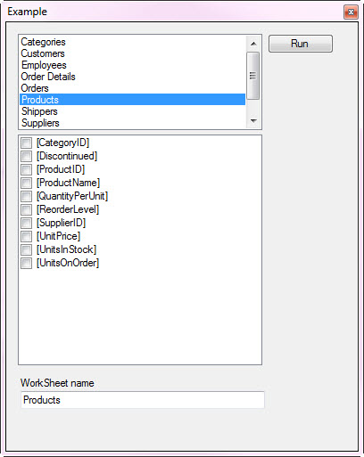
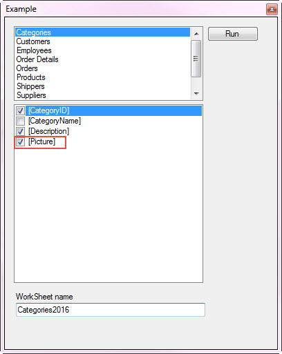
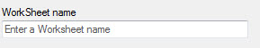

# Export MS-Access table to MS-Excel Worksheet
## Requires
- Visual Studio 2015
## License
- MIT
## Technologies
- Data
- export to excel
- OLEDB
- ACE.OLEDB
## Topics
- Excel
- export to excel
- Databases
- Microsoft Access
## Updated
- 11/19/2016
## Description

<h1>Description</h1>

This code sample demonstrates how to export a MS-Access table to a MS-Excel Worksheet using OleDb data provider. The main intent is to export data without concern for formatting of cells which can&rsquo;t be done unless using
 Excel automation. The underlying method to achieve this is a SQL statement that is very simple once seen but eludes developer who search the web for this method.

Most sample code found on the web will show this simple SQL statement using the older version (.xls) with MS-Access older version (.mdb) while a new version of Excel (.xlsx) and newer version of MS-Access (.accdb) need a different
 provider in the SQL statement. On top of this, you can&rsquo;t export older MS-Access to a newer MS-Excel file using this method. You need to check for compatibility in that both Excel and Access are .mdb and .xls or .accdb and .xlsx.

A good deal of assertion is required up front if you want to allow users to dynamically select both the database and spreadsheet. For instance, not only must we check for the above but also if the sheet exists already along
 with proper names of columns and table names. This is all done in the sample code. One thing I left out was the ability to select both the MS-Access and MS-Excel files which in a application would be done via a FileDialog component, here I&rsquo;m controlling
 the environment for proper results.

The database is Microsoft NorthWind and the Excel files are empty at the start.

If the export process is done without user intervention, then a lot less assertion is required. One would first check to see if the sheet already exists, in the solution there is code for checking if a sheet exists.

<strong>UPDATE 11/19/2016</strong> Added another project for C# and VB.NET for showing how to first create a make table in MS-Access, export the table to MS-Access.

Okay, let's look at the code to perform the export.

Visual BasicC#

Edit|Remove

vbcsharp
<pre class="hidden">Imports System.Data.OleDb
Imports AccessConnections_vb

Public Class ExportToExcel

    ''' &lt;summary&gt;
    ''' MS-Access path and database name
    ''' &lt;/summary&gt;
    ''' &lt;returns&gt;&lt;/returns&gt;
    Public Property DatabaseName As String
    ''' &lt;summary&gt;
    ''' SQL SELECT FROM MS-Access
    ''' &lt;/summary&gt;
    ''' &lt;returns&gt;&lt;/returns&gt;
    Public Property SelectStatement As String
    ''' &lt;summary&gt;
    ''' Table name from MS-Access
    ''' &lt;/summary&gt;
    ''' &lt;returns&gt;&lt;/returns&gt;
    Public Property TableName As String
    ''' &lt;summary&gt;
    ''' Excel file to place data into
    ''' &lt;/summary&gt;
    ''' &lt;returns&gt;&lt;/returns&gt;
    Public Property ExcelFileName As String
    ''' &lt;summary&gt;
    ''' Sheet name to place MS-Access data
    ''' &lt;/summary&gt;
    ''' &lt;returns&gt;&lt;/returns&gt;
    Public Property WorkSheetName As String
    ''' &lt;summary&gt;
    ''' Determine if colum names are the first row in the WorkSheet
    ''' &lt;/summary&gt;
    ''' &lt;returns&gt;&lt;/returns&gt;
    ''' &lt;remarks&gt;Currently does not function&lt;/remarks&gt;
    Public Property Headers As Boolean
    Public Property RecordsInserted As Integer
    ''' &lt;summary&gt;
    ''' Used for when a export fails, caller can examine the cause.
    ''' &lt;/summary&gt;
    ''' &lt;returns&gt;&lt;/returns&gt;
    Public Property ExceptionMessage As String
    Public Function Execute(Optional ByVal SelectStatement As String = &quot;*&quot;) As Boolean
        Dim Provider As String = &quot;&quot;
        Dim Success As Boolean = False

        Using cn As New OleDbConnection With {.ConnectionString = DatabaseName.BuildConnectionString}

            Using cmd As New OleDbCommand With {.Connection = cn}
                '
                ' Determine the proper provider for Excel
                '
                If IO.Path.GetExtension(DatabaseName).ToLower = &quot;.mdb&quot; AndAlso IO.Path.GetExtension(ExcelFileName).ToLower = &quot;.xls&quot; Then
                    Provider = &quot;Excel 8.0;&quot;
                ElseIf IO.Path.GetExtension(DatabaseName).ToLower = &quot;.accdb&quot; AndAlso IO.Path.GetExtension(ExcelFileName).ToLower = &quot;.xlsx&quot; Then
                    Provider = &quot;Excel 12.0 xml;&quot;
                End If

                cmd.CommandText = $&quot;SELECT {SelectStatement} INTO [{Provider}DATABASE={ExcelFileName};HDR=No].[{WorkSheetName}] FROM [{TableName}]&quot;

                cn.Open()
                Try
                    ' if you need, affected is the row count placed into the destination worksheet
                    RecordsInserted = cmd.ExecuteNonQuery()
                    Success = RecordsInserted &gt; 0
                Catch ex As Exception
                    '
                    ' If we get here and the exception is -&gt; Data type mismatch in criteria expression
                    ' the data type is not valid e.g. you attempted to place a binary field such as an image into the worksheet.
                    ' We could query each field's data type and make a decision to abort and if so that needs to happen before
                    ' cmd.ExecuteNonQuery() as after the fact the WorkSheet has already been created, the exception is raised
                    ' after the Worksheet has been created so now you need to clean up and remove the WorkSheet which is beyond
                    ' the scope of this code sample.
                    '                    '
                    ExceptionMessage = ex.Message
                End Try
            End Using

        End Using

        Return Success

    End Function
End Class
</pre>
<pre class="hidden">using AccessConnections_cs;
using System;
using System.IO;
using System.Data.OleDb;

namespace ExportAccessToExcel
{
    public class ExportToExcel
    {
        /// &lt;summary&gt;
        /// MS-Access path and database name
        /// &lt;/summary&gt;
        /// &lt;returns&gt;&lt;/returns&gt;
        public string DatabaseName { get; set; }
        /// &lt;summary&gt;
        /// SQL SELECT FROM MS-Access
        /// &lt;/summary&gt;
        /// &lt;returns&gt;&lt;/returns&gt;
        public string SelectStatement { get; set; }
        /// &lt;summary&gt;
        /// Table name from MS-Access
        /// &lt;/summary&gt;
        /// &lt;returns&gt;&lt;/returns&gt;
        public string TableName { get; set; }
        /// &lt;summary&gt;
        /// Excel file to place data into
        /// &lt;/summary&gt;
        /// &lt;returns&gt;&lt;/returns&gt;
        public string ExcelFileName { get; set; }
        /// &lt;summary&gt;
        /// Sheet name to place MS-Access data
        /// &lt;/summary&gt;
        /// &lt;returns&gt;&lt;/returns&gt;
        public string WorkSheetName { get; set; }
        /// &lt;summary&gt;
        /// Determine if colum names are the first row in the WorkSheet
        /// &lt;/summary&gt;
        /// &lt;returns&gt;&lt;/returns&gt;
        /// &lt;remarks&gt;Currently does not function&lt;/remarks&gt;
        public bool Headers { get; set; }
        public int RecordsInserted { get; set; }
        /// &lt;summary&gt;
        /// Used for when a export fails, caller can examine the cause.
        /// &lt;/summary&gt;
        /// &lt;returns&gt;&lt;/returns&gt;
        public string ExceptionMessage { get; set; }
        public bool Execute(string SelectStatement = &quot;*&quot;)
        {
            string Provider = &quot;&quot;;
            bool Success = false;

            using (OleDbConnection cn = new OleDbConnection { ConnectionString = DatabaseName.BuildConnectionString() })
            {

                using (OleDbCommand cmd = new OleDbCommand { Connection = cn })
                {
                    //
                    // Determine the proper provider for Excel
                    //
                    if (Path.GetExtension(DatabaseName).ToLower() == &quot;.mdb&quot; &amp;&amp; Path.GetExtension(ExcelFileName).ToLower() == &quot;.xls&quot;)
                    {
                        Provider = &quot;Excel 8.0;&quot;;
                    }
                    else if (Path.GetExtension(DatabaseName).ToLower() == &quot;.accdb&quot; &amp;&amp; Path.GetExtension(ExcelFileName).ToLower() == &quot;.xlsx&quot;)
                    {
                        Provider = &quot;Excel 12.0 xml;&quot;;
                    }

                    cmd.CommandText = $&quot;SELECT {SelectStatement} INTO [{Provider}DATABASE={ExcelFileName};HDR=No].[{WorkSheetName}] FROM [{TableName}]&quot;;

                    cn.Open();
                    try
                    {
                        // if you need, affected is the row count placed into the destination worksheet
                        RecordsInserted = cmd.ExecuteNonQuery();
                        Success = RecordsInserted &gt; 0;
                    }
                    catch (Exception ex)
                    {
                        //
                        // If we get here and the exception is -&gt; Data type mismatch in criteria expression
                        // the data type is not valid e.g. you attempted to place a binary field such as an image into the worksheet.
                        // We could query each field's data type and make a decision to abort and if so that needs to happen before
                        // cmd.ExecuteNonQuery() as after the fact the WorkSheet has already been created, the exception is raised
                        // after the Worksheet has been created so now you need to clean up and remove the WorkSheet which is beyond
                        // the scope of this code sample.
                        //                    '
                        ExceptionMessage = ex.Message;
                    }
                }

            }

            return Success;

        }
    }
}
</pre>

<pre class="js">Imports&nbsp;System.Data.OleDb&nbsp;
Imports&nbsp;AccessConnections_vb&nbsp;
&nbsp;
Public&nbsp;Class&nbsp;ExportToExcel&nbsp;
&nbsp;
&nbsp;&nbsp;&nbsp;&nbsp;'''&nbsp;&lt;summary&gt;&nbsp;
&nbsp;&nbsp;&nbsp;&nbsp;'''&nbsp;MS-Access&nbsp;path&nbsp;and&nbsp;database&nbsp;name&nbsp;
&nbsp;&nbsp;&nbsp;&nbsp;'''&nbsp;&lt;/summary&gt;&nbsp;
&nbsp;&nbsp;&nbsp;&nbsp;'''&nbsp;&lt;returns&gt;&lt;/returns&gt;&nbsp;
&nbsp;&nbsp;&nbsp;&nbsp;Public&nbsp;Property&nbsp;DatabaseName&nbsp;As&nbsp;String&nbsp;
&nbsp;&nbsp;&nbsp;&nbsp;'''&nbsp;&lt;summary&gt;&nbsp;
&nbsp;&nbsp;&nbsp;&nbsp;'''&nbsp;SQL&nbsp;SELECT&nbsp;FROM&nbsp;MS-Access&nbsp;
&nbsp;&nbsp;&nbsp;&nbsp;'''&nbsp;&lt;/summary&gt;&nbsp;
&nbsp;&nbsp;&nbsp;&nbsp;'''&nbsp;&lt;returns&gt;&lt;/returns&gt;&nbsp;
&nbsp;&nbsp;&nbsp;&nbsp;Public&nbsp;Property&nbsp;SelectStatement&nbsp;As&nbsp;String&nbsp;
&nbsp;&nbsp;&nbsp;&nbsp;'''&nbsp;&lt;summary&gt;&nbsp;
&nbsp;&nbsp;&nbsp;&nbsp;'''&nbsp;Table&nbsp;name&nbsp;from&nbsp;MS-Access&nbsp;
&nbsp;&nbsp;&nbsp;&nbsp;'''&nbsp;&lt;/summary&gt;&nbsp;
&nbsp;&nbsp;&nbsp;&nbsp;'''&nbsp;&lt;returns&gt;&lt;/returns&gt;&nbsp;
&nbsp;&nbsp;&nbsp;&nbsp;Public&nbsp;Property&nbsp;TableName&nbsp;As&nbsp;String&nbsp;
&nbsp;&nbsp;&nbsp;&nbsp;'''&nbsp;&lt;summary&gt;&nbsp;
&nbsp;&nbsp;&nbsp;&nbsp;'''&nbsp;Excel&nbsp;file&nbsp;to&nbsp;place&nbsp;data&nbsp;into&nbsp;
&nbsp;&nbsp;&nbsp;&nbsp;'''&nbsp;&lt;/summary&gt;&nbsp;
&nbsp;&nbsp;&nbsp;&nbsp;'''&nbsp;&lt;returns&gt;&lt;/returns&gt;&nbsp;
&nbsp;&nbsp;&nbsp;&nbsp;Public&nbsp;Property&nbsp;ExcelFileName&nbsp;As&nbsp;String&nbsp;
&nbsp;&nbsp;&nbsp;&nbsp;'''&nbsp;&lt;summary&gt;&nbsp;
&nbsp;&nbsp;&nbsp;&nbsp;'''&nbsp;Sheet&nbsp;name&nbsp;to&nbsp;place&nbsp;MS-Access&nbsp;data&nbsp;
&nbsp;&nbsp;&nbsp;&nbsp;'''&nbsp;&lt;/summary&gt;&nbsp;
&nbsp;&nbsp;&nbsp;&nbsp;'''&nbsp;&lt;returns&gt;&lt;/returns&gt;&nbsp;
&nbsp;&nbsp;&nbsp;&nbsp;Public&nbsp;Property&nbsp;WorkSheetName&nbsp;As&nbsp;String&nbsp;
&nbsp;&nbsp;&nbsp;&nbsp;'''&nbsp;&lt;summary&gt;&nbsp;
&nbsp;&nbsp;&nbsp;&nbsp;'''&nbsp;Determine&nbsp;if&nbsp;colum&nbsp;names&nbsp;are&nbsp;the&nbsp;first&nbsp;row&nbsp;in&nbsp;the&nbsp;WorkSheet&nbsp;
&nbsp;&nbsp;&nbsp;&nbsp;'''&nbsp;&lt;/summary&gt;&nbsp;
&nbsp;&nbsp;&nbsp;&nbsp;'''&nbsp;&lt;returns&gt;&lt;/returns&gt;&nbsp;
&nbsp;&nbsp;&nbsp;&nbsp;'''&nbsp;&lt;remarks&gt;Currently&nbsp;does&nbsp;not&nbsp;function&lt;/remarks&gt;&nbsp;
&nbsp;&nbsp;&nbsp;&nbsp;Public&nbsp;Property&nbsp;Headers&nbsp;As&nbsp;Boolean&nbsp;
&nbsp;&nbsp;&nbsp;&nbsp;Public&nbsp;Property&nbsp;RecordsInserted&nbsp;As&nbsp;Integer&nbsp;
&nbsp;&nbsp;&nbsp;&nbsp;'''&nbsp;&lt;summary&gt;&nbsp;
&nbsp;&nbsp;&nbsp;&nbsp;'''&nbsp;Used&nbsp;for&nbsp;when&nbsp;a&nbsp;export&nbsp;fails,&nbsp;caller&nbsp;can&nbsp;examine&nbsp;the&nbsp;cause.&nbsp;
&nbsp;&nbsp;&nbsp;&nbsp;'''&nbsp;&lt;/summary&gt;&nbsp;
&nbsp;&nbsp;&nbsp;&nbsp;'''&nbsp;&lt;returns&gt;&lt;/returns&gt;&nbsp;
&nbsp;&nbsp;&nbsp;&nbsp;Public&nbsp;Property&nbsp;ExceptionMessage&nbsp;As&nbsp;String&nbsp;
&nbsp;&nbsp;&nbsp;&nbsp;Public&nbsp;Function&nbsp;Execute(Optional&nbsp;ByVal&nbsp;SelectStatement&nbsp;As&nbsp;String&nbsp;=&nbsp;&quot;*&quot;)&nbsp;As&nbsp;Boolean&nbsp;
&nbsp;&nbsp;&nbsp;&nbsp;&nbsp;&nbsp;&nbsp;&nbsp;Dim&nbsp;Provider&nbsp;As&nbsp;String&nbsp;=&nbsp;&quot;&quot;&nbsp;
&nbsp;&nbsp;&nbsp;&nbsp;&nbsp;&nbsp;&nbsp;&nbsp;Dim&nbsp;Success&nbsp;As&nbsp;Boolean&nbsp;=&nbsp;False&nbsp;
&nbsp;
&nbsp;&nbsp;&nbsp;&nbsp;&nbsp;&nbsp;&nbsp;&nbsp;Using&nbsp;cn&nbsp;As&nbsp;New&nbsp;OleDbConnection&nbsp;With&nbsp;{.ConnectionString&nbsp;=&nbsp;DatabaseName.BuildConnectionString}&nbsp;
&nbsp;
&nbsp;&nbsp;&nbsp;&nbsp;&nbsp;&nbsp;&nbsp;&nbsp;&nbsp;&nbsp;&nbsp;&nbsp;Using&nbsp;cmd&nbsp;As&nbsp;New&nbsp;OleDbCommand&nbsp;With&nbsp;{.Connection&nbsp;=&nbsp;cn}&nbsp;
&nbsp;&nbsp;&nbsp;&nbsp;&nbsp;&nbsp;&nbsp;&nbsp;&nbsp;&nbsp;&nbsp;&nbsp;&nbsp;&nbsp;&nbsp;&nbsp;'&nbsp;
&nbsp;&nbsp;&nbsp;&nbsp;&nbsp;&nbsp;&nbsp;&nbsp;&nbsp;&nbsp;&nbsp;&nbsp;&nbsp;&nbsp;&nbsp;&nbsp;'&nbsp;Determine&nbsp;the&nbsp;proper&nbsp;provider&nbsp;for&nbsp;Excel&nbsp;
&nbsp;&nbsp;&nbsp;&nbsp;&nbsp;&nbsp;&nbsp;&nbsp;&nbsp;&nbsp;&nbsp;&nbsp;&nbsp;&nbsp;&nbsp;&nbsp;'&nbsp;
&nbsp;&nbsp;&nbsp;&nbsp;&nbsp;&nbsp;&nbsp;&nbsp;&nbsp;&nbsp;&nbsp;&nbsp;&nbsp;&nbsp;&nbsp;&nbsp;If&nbsp;IO.Path.GetExtension(DatabaseName).ToLower&nbsp;=&nbsp;&quot;.mdb&quot;&nbsp;AndAlso&nbsp;IO.Path.GetExtension(ExcelFileName).ToLower&nbsp;=&nbsp;&quot;.xls&quot;&nbsp;Then&nbsp;
&nbsp;&nbsp;&nbsp;&nbsp;&nbsp;&nbsp;&nbsp;&nbsp;&nbsp;&nbsp;&nbsp;&nbsp;&nbsp;&nbsp;&nbsp;&nbsp;&nbsp;&nbsp;&nbsp;&nbsp;Provider&nbsp;=&nbsp;&quot;Excel&nbsp;8.0;&quot;&nbsp;
&nbsp;&nbsp;&nbsp;&nbsp;&nbsp;&nbsp;&nbsp;&nbsp;&nbsp;&nbsp;&nbsp;&nbsp;&nbsp;&nbsp;&nbsp;&nbsp;ElseIf&nbsp;IO.Path.GetExtension(DatabaseName).ToLower&nbsp;=&nbsp;&quot;.accdb&quot;&nbsp;AndAlso&nbsp;IO.Path.GetExtension(ExcelFileName).ToLower&nbsp;=&nbsp;&quot;.xlsx&quot;&nbsp;Then&nbsp;
&nbsp;&nbsp;&nbsp;&nbsp;&nbsp;&nbsp;&nbsp;&nbsp;&nbsp;&nbsp;&nbsp;&nbsp;&nbsp;&nbsp;&nbsp;&nbsp;&nbsp;&nbsp;&nbsp;&nbsp;Provider&nbsp;=&nbsp;&quot;Excel&nbsp;12.0&nbsp;xml;&quot;&nbsp;
&nbsp;&nbsp;&nbsp;&nbsp;&nbsp;&nbsp;&nbsp;&nbsp;&nbsp;&nbsp;&nbsp;&nbsp;&nbsp;&nbsp;&nbsp;&nbsp;End&nbsp;If&nbsp;
&nbsp;
&nbsp;&nbsp;&nbsp;&nbsp;&nbsp;&nbsp;&nbsp;&nbsp;&nbsp;&nbsp;&nbsp;&nbsp;&nbsp;&nbsp;&nbsp;&nbsp;cmd.CommandText&nbsp;=&nbsp;$&quot;SELECT&nbsp;{SelectStatement}&nbsp;INTO&nbsp;[{Provider}DATABASE={ExcelFileName};HDR=No].[{WorkSheetName}]&nbsp;FROM&nbsp;[{TableName}]&quot;&nbsp;
&nbsp;
&nbsp;&nbsp;&nbsp;&nbsp;&nbsp;&nbsp;&nbsp;&nbsp;&nbsp;&nbsp;&nbsp;&nbsp;&nbsp;&nbsp;&nbsp;&nbsp;cn.Open()&nbsp;
&nbsp;&nbsp;&nbsp;&nbsp;&nbsp;&nbsp;&nbsp;&nbsp;&nbsp;&nbsp;&nbsp;&nbsp;&nbsp;&nbsp;&nbsp;&nbsp;Try&nbsp;
&nbsp;&nbsp;&nbsp;&nbsp;&nbsp;&nbsp;&nbsp;&nbsp;&nbsp;&nbsp;&nbsp;&nbsp;&nbsp;&nbsp;&nbsp;&nbsp;&nbsp;&nbsp;&nbsp;&nbsp;'&nbsp;if&nbsp;you&nbsp;need,&nbsp;affected&nbsp;is&nbsp;the&nbsp;row&nbsp;count&nbsp;placed&nbsp;into&nbsp;the&nbsp;destination&nbsp;worksheet&nbsp;
&nbsp;&nbsp;&nbsp;&nbsp;&nbsp;&nbsp;&nbsp;&nbsp;&nbsp;&nbsp;&nbsp;&nbsp;&nbsp;&nbsp;&nbsp;&nbsp;&nbsp;&nbsp;&nbsp;&nbsp;RecordsInserted&nbsp;=&nbsp;cmd.ExecuteNonQuery()&nbsp;
&nbsp;&nbsp;&nbsp;&nbsp;&nbsp;&nbsp;&nbsp;&nbsp;&nbsp;&nbsp;&nbsp;&nbsp;&nbsp;&nbsp;&nbsp;&nbsp;&nbsp;&nbsp;&nbsp;&nbsp;Success&nbsp;=&nbsp;RecordsInserted&nbsp;&gt;&nbsp;0&nbsp;
&nbsp;&nbsp;&nbsp;&nbsp;&nbsp;&nbsp;&nbsp;&nbsp;&nbsp;&nbsp;&nbsp;&nbsp;&nbsp;&nbsp;&nbsp;&nbsp;Catch&nbsp;ex&nbsp;As&nbsp;Exception&nbsp;
&nbsp;&nbsp;&nbsp;&nbsp;&nbsp;&nbsp;&nbsp;&nbsp;&nbsp;&nbsp;&nbsp;&nbsp;&nbsp;&nbsp;&nbsp;&nbsp;&nbsp;&nbsp;&nbsp;&nbsp;'&nbsp;
&nbsp;&nbsp;&nbsp;&nbsp;&nbsp;&nbsp;&nbsp;&nbsp;&nbsp;&nbsp;&nbsp;&nbsp;&nbsp;&nbsp;&nbsp;&nbsp;&nbsp;&nbsp;&nbsp;&nbsp;'&nbsp;If&nbsp;we&nbsp;get&nbsp;here&nbsp;and&nbsp;the&nbsp;exception&nbsp;is&nbsp;-&gt;&nbsp;Data&nbsp;type&nbsp;mismatch&nbsp;in&nbsp;criteria&nbsp;expression&nbsp;
&nbsp;&nbsp;&nbsp;&nbsp;&nbsp;&nbsp;&nbsp;&nbsp;&nbsp;&nbsp;&nbsp;&nbsp;&nbsp;&nbsp;&nbsp;&nbsp;&nbsp;&nbsp;&nbsp;&nbsp;'&nbsp;the&nbsp;data&nbsp;type&nbsp;is&nbsp;not&nbsp;valid&nbsp;e.g.&nbsp;you&nbsp;attempted&nbsp;to&nbsp;place&nbsp;a&nbsp;binary&nbsp;field&nbsp;such&nbsp;as&nbsp;an&nbsp;image&nbsp;into&nbsp;the&nbsp;worksheet.&nbsp;
&nbsp;&nbsp;&nbsp;&nbsp;&nbsp;&nbsp;&nbsp;&nbsp;&nbsp;&nbsp;&nbsp;&nbsp;&nbsp;&nbsp;&nbsp;&nbsp;&nbsp;&nbsp;&nbsp;&nbsp;'&nbsp;We&nbsp;could&nbsp;query&nbsp;each&nbsp;field's&nbsp;data&nbsp;type&nbsp;and&nbsp;make&nbsp;a&nbsp;decision&nbsp;to&nbsp;abort&nbsp;and&nbsp;if&nbsp;so&nbsp;that&nbsp;needs&nbsp;to&nbsp;happen&nbsp;before&nbsp;
&nbsp;&nbsp;&nbsp;&nbsp;&nbsp;&nbsp;&nbsp;&nbsp;&nbsp;&nbsp;&nbsp;&nbsp;&nbsp;&nbsp;&nbsp;&nbsp;&nbsp;&nbsp;&nbsp;&nbsp;'&nbsp;cmd.ExecuteNonQuery()&nbsp;as&nbsp;after&nbsp;the&nbsp;fact&nbsp;the&nbsp;WorkSheet&nbsp;has&nbsp;already&nbsp;been&nbsp;created,&nbsp;the&nbsp;exception&nbsp;is&nbsp;raised&nbsp;
&nbsp;&nbsp;&nbsp;&nbsp;&nbsp;&nbsp;&nbsp;&nbsp;&nbsp;&nbsp;&nbsp;&nbsp;&nbsp;&nbsp;&nbsp;&nbsp;&nbsp;&nbsp;&nbsp;&nbsp;'&nbsp;after&nbsp;the&nbsp;Worksheet&nbsp;has&nbsp;been&nbsp;created&nbsp;so&nbsp;now&nbsp;you&nbsp;need&nbsp;to&nbsp;clean&nbsp;up&nbsp;and&nbsp;remove&nbsp;the&nbsp;WorkSheet&nbsp;which&nbsp;is&nbsp;beyond&nbsp;
&nbsp;&nbsp;&nbsp;&nbsp;&nbsp;&nbsp;&nbsp;&nbsp;&nbsp;&nbsp;&nbsp;&nbsp;&nbsp;&nbsp;&nbsp;&nbsp;&nbsp;&nbsp;&nbsp;&nbsp;'&nbsp;the&nbsp;scope&nbsp;of&nbsp;this&nbsp;code&nbsp;sample.&nbsp;
&nbsp;&nbsp;&nbsp;&nbsp;&nbsp;&nbsp;&nbsp;&nbsp;&nbsp;&nbsp;&nbsp;&nbsp;&nbsp;&nbsp;&nbsp;&nbsp;&nbsp;&nbsp;&nbsp;&nbsp;'&nbsp;&nbsp;&nbsp;&nbsp;&nbsp;&nbsp;&nbsp;&nbsp;&nbsp;&nbsp;&nbsp;&nbsp;&nbsp;&nbsp;&nbsp;&nbsp;&nbsp;&nbsp;&nbsp;&nbsp;'&nbsp;
&nbsp;&nbsp;&nbsp;&nbsp;&nbsp;&nbsp;&nbsp;&nbsp;&nbsp;&nbsp;&nbsp;&nbsp;&nbsp;&nbsp;&nbsp;&nbsp;&nbsp;&nbsp;&nbsp;&nbsp;ExceptionMessage&nbsp;=&nbsp;ex.Message&nbsp;
&nbsp;&nbsp;&nbsp;&nbsp;&nbsp;&nbsp;&nbsp;&nbsp;&nbsp;&nbsp;&nbsp;&nbsp;&nbsp;&nbsp;&nbsp;&nbsp;End&nbsp;Try&nbsp;
&nbsp;&nbsp;&nbsp;&nbsp;&nbsp;&nbsp;&nbsp;&nbsp;&nbsp;&nbsp;&nbsp;&nbsp;End&nbsp;Using&nbsp;
&nbsp;
&nbsp;&nbsp;&nbsp;&nbsp;&nbsp;&nbsp;&nbsp;&nbsp;End&nbsp;Using&nbsp;
&nbsp;
&nbsp;&nbsp;&nbsp;&nbsp;&nbsp;&nbsp;&nbsp;&nbsp;Return&nbsp;Success&nbsp;
&nbsp;
&nbsp;&nbsp;&nbsp;&nbsp;End&nbsp;Function&nbsp;
End&nbsp;Class&nbsp;
</pre>

The code shown above does the grunt work, Execute method if nothing is passed into the SelectStatement parameter will export all fields for the selected MS-Access table to Excel while passing in a comma-delimited list of fields
 will export only those fields. In the sampe I load a CheckedListBox with field names from a selected table. The ListBox has all table names from the Access database, select a table and the CheckedListBox shows the fields for the table. The TextBox below the
 CheckedListBox is for the name of the Worksheet to be created.&nbsp;

Now there is one issue that needs addressing in regards to fields, if a field is something other than a string, number, bool or date e.g. a binary field this will thrown a run time exception after creating the worksheet as OleDb
 and Excel are not capable of this while Excel automation is. In the example below, Picture field is selected, this is a binary field and will throw an exception.

 

If you run the operation, it fails then un-check Picture and try again it will fail again, this time because the worksheet does exists. You could add logic to check first for the field type to prevent this from happening or
 after the fact inform the user they need to change the worksheet name.

That is pretty much it, below are a list of supporting class projects that can be added to your solution to add this functionality to your application.

AccessConnections:&nbsp;

ConnectionsAccess class (language extensions) provides a method to build a connection string to MS-Access database based on the extension of the database.

AccessInformation class provides methods to get table names and column names from MS-Access database.

CheckedListBoxLanguageExtensions:

Contains language extensions for working with a CheckedListBox. For you application they may not be needed.

Cue_BannerLibrary for provides suggestions for a TextBox e.g.

ExcelOleDLibrary:

Provides dynamic connections for Excel based on file extension. Method to obtain sheet names and column names.&nbsp;

ExportAccessToExcel:

This is the library to export data from MS-Access to MS-Excel.

MultipleExports:

Shows how to create a temp table in MS-Access comprising of several table then export the table to MS-Excel. This would be more in line with what the average developer might want while the other window form project is more or
 less showing more complex options.

In closing, as mentioned at the beginning, I hard coded file names to ensure we have proper base files to try out the export method, feel free to make your code dynamic.

Lastly, don't simply run the code without traversing through the code to understand how it works.

 

