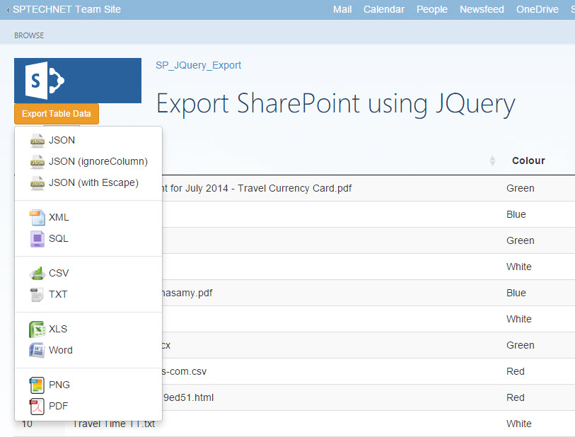

# Export SharePoint List to Excel, Word, JSON, XML, SQL, CSV, TXT or PDF
## Requires
- Visual Studio 2015
## License
- MIT
## Technologies
- jQuery
- Javascript
- Sharepoint Online
- jQuery UI
- SharePoint Server 2013
- SharePoint 2016
- SharePoint Add-ins
## Topics
- SharePoint
- jQuery
- Javascript
- SharePoint 2013
- SharePoint Apps
- HTML5/JavaScript
- SharePoint 2016
## Updated
- 02/25/2016
## Description

<h1>Introduction</h1>

Using JQuery we can export SharePoint list to&nbsp;Excel, Word, JSON, XML, SQL, CSV, TXT or PDF. Here I&rsquo;m going to&nbsp;explain step by step&nbsp;explanation to implement this same in your environment.&nbsp;

<strong>Solution compatibility</strong>

This sample is tested with SharePoint Online

This sample also compatible with SharePoint 2013 and SharePoint 2016

 
<strong>To Modify and deploy this solution</strong>

Open visual studio 2015

On the file menu select Open -&gt; Project (Ctrl &#43; Shift &#43; o)

In the Open Project window navigate the directory and select solution file (.sln)

Open solution explorer windows and select project solution and click (F4) to open project propertiesChange the site URL property on the property window&nbsp;

Edit the code if required and click play button or (F5) in visual studio&nbsp;

&nbsp;

<strong>To add new resource file (.js or .css or Images) into project</strong>

Select a folder from solution explorer based on your file type (Images or Scripts or Content for CSS)

Right click and select &ldquo;Open Folder in File Explorer&rdquo; option

Now paste your files into the folderAgain in the solution explorer window at the top, click &ldquo;Show All Files&rdquo; icon

Now you can find the file without active icon, right click and select &ldquo;Include in Project&rdquo; Option

<strong>Permission configuration</strong>

Double click AppManifest.xml file and select SharePoint list view permission, because here we are just going read data from a SharePoint list, I&rsquo;ve selected &ldquo;Documents&rdquo; list. List name and column name are hard coded &nbsp;in the App.js
 file,

<em> 
</em>

&nbsp;

*****************************************************************************************************

Hope you find this sample helpful, check out my other samples too.

Give five stars if you wish to appreciate my work.

Facebook page URL:&nbsp;<a title="https://www.facebook.com/sptechnet2016/" href="https://www.facebook.com/sptechnet2016/" target="_blank">https://www.facebook.com/sptechnet2016/</a>

Blog URL:&nbsp;<a title="https://sptechnet.wordpress.com/" href="https://sptechnet.wordpress.com/" target="_blank">https://sptechnet.wordpress.com/</a>

*****************************************************************************************************

HTMLJavaScript

Edit|Remove

htmljs
<pre class="hidden">&lt;%-- The following 4 lines are ASP.NET directives needed when using SharePoint components --%&gt;

&lt;%@ Page Inherits=&quot;Microsoft.SharePoint.WebPartPages.WebPartPage, Microsoft.SharePoint, Version=15.0.0.0, Culture=neutral, PublicKeyToken=71e9bce111e9429c&quot; MasterPageFile=&quot;~masterurl/default.master&quot; Language=&quot;C#&quot; %&gt;

&lt;%@ Register TagPrefix=&quot;Utilities&quot; Namespace=&quot;Microsoft.SharePoint.Utilities&quot; Assembly=&quot;Microsoft.SharePoint, Version=15.0.0.0, Culture=neutral, PublicKeyToken=71e9bce111e9429c&quot; %&gt;
&lt;%@ Register TagPrefix=&quot;WebPartPages&quot; Namespace=&quot;Microsoft.SharePoint.WebPartPages&quot; Assembly=&quot;Microsoft.SharePoint, Version=15.0.0.0, Culture=neutral, PublicKeyToken=71e9bce111e9429c&quot; %&gt;
&lt;%@ Register TagPrefix=&quot;SharePoint&quot; Namespace=&quot;Microsoft.SharePoint.WebControls&quot; Assembly=&quot;Microsoft.SharePoint, Version=15.0.0.0, Culture=neutral, PublicKeyToken=71e9bce111e9429c&quot; %&gt;

&lt;%-- The markup and script in the following Content element will be placed in the &lt;head&gt; of the page --%&gt;
&lt;asp:Content ContentPlaceHolderID=&quot;PlaceHolderAdditionalPageHead&quot; runat=&quot;server&quot;&gt;
    &lt;script type=&quot;text/javascript&quot; src=&quot;../Scripts/jquery-1.9.1.min.js&quot;&gt;&lt;/script&gt;
    &lt;SharePoint:ScriptLink Name=&quot;sp.js&quot; runat=&quot;server&quot; OnDemand=&quot;true&quot; LoadAfterUI=&quot;true&quot; Localizable=&quot;false&quot; /&gt;
    &lt;meta name=&quot;WebPartPageExpansion&quot; content=&quot;full&quot; /&gt;

    &lt;!-- Add your CSS styles to the following file --&gt;
    &lt;link rel=&quot;Stylesheet&quot; type=&quot;text/css&quot; href=&quot;../Content/App.css&quot; /&gt;
    &lt;link href=&quot;../Content/ionicons.min.css&quot; type=&quot;text/css&quot; rel=&quot;stylesheet&quot; /&gt;
    &lt;link href=&quot;../Content/bootstrap.min.css&quot; type=&quot;text/css&quot; rel=&quot;stylesheet&quot; /&gt;
    &lt;link href=&quot;../Content/jquery.dataTables.css&quot; type=&quot;text/css&quot; rel=&quot;stylesheet&quot; /&gt;
    &lt;!-- Add your JavaScript to the following file --&gt;
    &lt;!--our custom js file--&gt;
    &lt;script type=&quot;text/javascript&quot; src=&quot;../Scripts/App.js&quot;&gt;&lt;/script&gt;

    &lt;script type=&quot;text/javascript&quot; src=&quot;../Scripts/jquery-1.9.1.min.js&quot;&gt;&lt;/script&gt;
    &lt;script type=&quot;text/javascript&quot; src=&quot;../Scripts/bootstrap.min.js&quot;&gt;&lt;/script&gt;
    &lt;!--For export PDF file--&gt;
    &lt;script type=&quot;text/javascript&quot; src=&quot;../Scripts/jspdf/libs/base64.js&quot;&gt;&lt;/script&gt;
    &lt;script type=&quot;text/javascript&quot; src=&quot;../Scripts/jspdf/libs/sprintf.js&quot;&gt;&lt;/script&gt;
    &lt;script type=&quot;text/javascript&quot; src=&quot;../Scripts/jspdf/jspdf.js&quot;&gt;&lt;/script&gt;
    &lt;!--For export PNG file--&gt;
    &lt;script type=&quot;text/javascript&quot; src=&quot;../Scripts/html2canvas.js&quot;&gt;&lt;/script&gt;
    &lt;!--For export all other formats--&gt;
    &lt;script type=&quot;text/javascript&quot; src=&quot;../Scripts/tableExport.js&quot;&gt;&lt;/script&gt;
    &lt;script type=&quot;text/javascript&quot; src=&quot;../Scripts/jquery.base64.js&quot;&gt;&lt;/script&gt;
    &lt;!--For HTML Table format--&gt;
    &lt;script type=&quot;text/javascript&quot; src=&quot;../Scripts/jquery.dataTables.js&quot;&gt;&lt;/script&gt;
&lt;/asp:Content&gt;

&lt;%-- The markup in the following Content element will be placed in the TitleArea of the page --%&gt;
&lt;asp:Content ContentPlaceHolderID=&quot;PlaceHolderPageTitleInTitleArea&quot; runat=&quot;server&quot;&gt;
    Export SharePoint using JQuery
&lt;/asp:Content&gt;

&lt;%-- The markup and script in the following Content element will be placed in the &lt;body&gt; of the page --%&gt;
&lt;asp:Content ContentPlaceHolderID=&quot;PlaceHolderMain&quot; runat=&quot;server&quot;&gt;
    &lt;div class=&quot;dropdown&quot;&gt;
        &lt;button class=&quot;btn btn-warning btn-sm dropdown-toggle&quot; data-toggle=&quot;dropdown&quot;&gt;&lt;i class=&quot;fa fa-bars&quot;&gt;&lt;/i&gt;Export Table Data&lt;/button&gt;
        &lt;ul class=&quot;dropdown-menu &quot; role=&quot;menu&quot;&gt;
            &lt;li&gt;&lt;a href=&quot;#&quot; onclick=&quot;$('#SPTable').tableExport({type:'json',escape:'false'});&quot;&gt;
                &lt;img src=&quot;../Images/json.png&quot; width='24px' /&gt;
                JSON&lt;/a&gt;&lt;/li&gt;
            &lt;li&gt;&lt;a href=&quot;#&quot; onclick=&quot;$('#SPTable').tableExport({type:'json',escape:'false',ignoreColumn:'[0]'});&quot;&gt;
                &lt;img src='../Images/json.png' width='24px' /&gt;
                JSON (ignoreColumn)&lt;/a&gt;&lt;/li&gt;
            &lt;li&gt;&lt;a href=&quot;#&quot; onclick=&quot;$('#SPTable').tableExport({type:'json',escape:'true'});&quot;&gt;
                &lt;img src='../Images/json.png' width='24px' /&gt;
                JSON (with Escape)&lt;/a&gt;&lt;/li&gt;
            &lt;li class=&quot;divider&quot;&gt;&lt;/li&gt;
            &lt;li&gt;&lt;a href=&quot;#&quot; onclick=&quot;$('#SPTable').tableExport({type:'xml',escape:'false'});&quot;&gt;
                &lt;img src='../Images/xml.png' width='24px' /&gt;
                XML&lt;/a&gt;&lt;/li&gt;
            &lt;li&gt;&lt;a href=&quot;#&quot; onclick=&quot;$('#SPTable').tableExport({type:'sql'});&quot;&gt;
                &lt;img src='../Images/sql.png' width='24px' /&gt;
                SQL&lt;/a&gt;&lt;/li&gt;
            &lt;li class=&quot;divider&quot;&gt;&lt;/li&gt;
            &lt;li&gt;&lt;a href=&quot;#&quot; onclick=&quot;$('#SPTable').tableExport({type:'csv',escape:'false'});&quot;&gt;
                &lt;img src='../Images/csv.png' width='24px' /&gt;
                CSV&lt;/a&gt;&lt;/li&gt;
            &lt;li&gt;&lt;a href=&quot;#&quot; onclick=&quot;$('#SPTable').tableExport({type:'txt',escape:'false'});&quot;&gt;
                &lt;img src='../Images/txt.png' width='24px' /&gt;
                TXT&lt;/a&gt;&lt;/li&gt;
            &lt;li class=&quot;divider&quot;&gt;&lt;/li&gt;

            &lt;li&gt;&lt;a href=&quot;#&quot; onclick=&quot;$('#SPTable').tableExport({type:'excel',escape:'false'});&quot;&gt;
                &lt;img src='../Images/xls.png' width='24px' /&gt;
                XLS&lt;/a&gt;&lt;/li&gt;
            &lt;li&gt;&lt;a href=&quot;#&quot; onclick=&quot;$('#SPTable').tableExport({type:'doc',escape:'false'});&quot;&gt;
                &lt;img src='../Images/word.png' width='24px' /&gt;
                Word&lt;/a&gt;&lt;/li&gt;
            &lt;li class=&quot;divider&quot;&gt;&lt;/li&gt;
            &lt;li&gt;&lt;a href=&quot;#&quot; onclick=&quot;$('#SPTable').tableExport({type:'png',escape:'false'});&quot;&gt;
                &lt;img src='../Images/png.png' width='24px' /&gt;
                PNG&lt;/a&gt;&lt;/li&gt;
            &lt;li&gt;&lt;a href=&quot;#&quot; onclick=&quot;$('#SPTable').tableExport({type:'pdf',pdfFontSize:'7',escape:'false'});&quot;&gt;
                &lt;img src='../Images/pdf.png' width='24px' /&gt;
                PDF&lt;/a&gt;&lt;/li&gt;

        &lt;/ul&gt;
    &lt;/div&gt;
            
    &lt;div id=&quot;DivSPGrid&quot;&gt;
    &lt;/div&gt;
    &lt;script type=&quot;text/javascript&quot;&gt;
        $(document).ready(function () {
            $('.dropdown-toggle').dropdown();
        });
    &lt;/script&gt;
&lt;/asp:Content&gt;
</pre>
<pre class="hidden">'use strict';

ExecuteOrDelayUntilScriptLoaded(initializePage, &quot;sp.js&quot;);

function initializePage() {
    var context = SP.ClientContext.get_current();
    var user = context.get_web().get_currentUser();
    var hostweburl;
    var appweburl;
    var appContextSite;
    var list;
    var listItems;
    var web;

    // This code runs when the DOM is ready and creates a context object which is needed to use the SharePoint object model
    $(document).ready(function () {
        getUrl();
    });

    // This function get the URL informations
    function getUrl() {
        hostweburl = getQueryStringParameter(&quot;SPHostUrl&quot;);
        appweburl = getQueryStringParameter(&quot;SPAppWebUrl&quot;);
        hostweburl = decodeURIComponent(hostweburl);
        appweburl = decodeURIComponent(appweburl).toString().replace(&quot;#&quot;,&quot;&quot;);
        var scriptbase = hostweburl &#43; &quot;/_layouts/15/&quot;;
        $.getScript(scriptbase &#43; &quot;SP.RequestExecutor.js&quot;, execOperation);
    }

    // This function get list data from SharePoint
    function execOperation() {
        var factory = new SP.ProxyWebRequestExecutorFactory(appweburl);
        context.set_webRequestExecutorFactory(factory);
        appContextSite = new SP.AppContextSite(context, hostweburl);
        web = appContextSite.get_web();
        context.load(web);
        var camlQuery = new SP.CamlQuery();
        list = web.get_lists().getByTitle(&quot;Documents&quot;);
        listItems = list.getItems(camlQuery);
        context.load(list);
        context.load(listItems);
        context.executeQueryAsync(onGetSPListSuccess, onGetSPListFail);
    }

    // This function is executed if the above call is successful
    function onGetSPListSuccess() {
        $(&quot;#DivSPGrid&quot;).empty();
        var listInfo = '';
        var listEnumerator = listItems.getEnumerator();
        listInfo &#43;= &quot;&lt;table id='SPTable' class='display'&gt;&lt;thead&gt;&lt;tr&gt;&quot; &#43;
            &quot;&lt;th&gt;Id&lt;/th&gt;&quot; &#43;
            &quot;&lt;th&gt;Title&lt;/th&gt;&quot; &#43;
            &quot;&lt;th&gt;Colour&lt;/th&gt;&quot; &#43;
            &quot;&lt;th&gt;Modified By&lt;/th&gt;&quot; &#43;
            &quot;&lt;th&gt;Modified date&lt;/th&gt;&quot; &#43;
            &quot;&lt;/tr&gt;&lt;/thead&gt;&lt;tbody&gt;&quot;;
        while (listEnumerator.moveNext()) {
            var listItem = listEnumerator.get_current();
            listInfo &#43;= '&lt;tr&gt;&lt;td&gt;' &#43; listItem.get_item('ID') &#43; '&lt;/td&gt;'
            &#43; '&lt;td&gt;' &#43; listItem.get_item('FileLeafRef') &#43; '&lt;/td&gt;'
            &#43; '&lt;td&gt;' &#43; listItem.get_item('Colour') &#43; '&lt;/td&gt;'
            &#43; '&lt;td&gt;' &#43; listItem.get_item('Editor').get_lookupValue() &#43; '&lt;/td&gt;'
            &#43; '&lt;td&gt;' &#43; listItem.get_item('Modified').format('dd MMM yyyy, hh:ss') &#43; '&lt;/td&gt;'
            &#43; '&lt;/tr&gt;';
        }
        listInfo &#43;= '&lt;/tbody&gt;&lt;/table&gt;';
        $(&quot;#DivSPGrid&quot;).html(listInfo);
        $('#SPTable').dataTable();
    }

    // This function is executed if the above call fails
    function onGetSPListFail(sender, args) {
        alert('Failed to get list data. Error:' &#43; args.get_message());
    }

    //This function split the url and trim the App and Host web URLs
    function getQueryStringParameter(paramToRetrieve) {
        var params =
        document.URL.split(&quot;?&quot;)[1].split(&quot;&amp;&quot;);
        for (var i = 0; i &lt; params.length; i = i &#43; 1) {
            var singleParam = params[i].split(&quot;=&quot;);
            if (singleParam[0] == paramToRetrieve)
                return singleParam[1];
        }
    }
}
</pre>

<pre class="html">&lt;%--&nbsp;The&nbsp;following&nbsp;4&nbsp;lines&nbsp;are&nbsp;ASP.NET&nbsp;directives&nbsp;needed&nbsp;when&nbsp;using&nbsp;SharePoint&nbsp;components&nbsp;--%&gt;&nbsp;
&nbsp;
&lt;%@&nbsp;Page&nbsp;Inherits=&quot;Microsoft.SharePoint.WebPartPages.WebPartPage,&nbsp;Microsoft.SharePoint,&nbsp;Version=15.0.0.0,&nbsp;Culture=neutral,&nbsp;PublicKeyToken=71e9bce111e9429c&quot;&nbsp;MasterPageFile=&quot;~masterurl/default.master&quot;&nbsp;Language=&quot;C#&quot;&nbsp;%&gt;&nbsp;
&nbsp;
&lt;%@&nbsp;Register&nbsp;TagPrefix=&quot;Utilities&quot;&nbsp;Namespace=&quot;Microsoft.SharePoint.Utilities&quot;&nbsp;Assembly=&quot;Microsoft.SharePoint,&nbsp;Version=15.0.0.0,&nbsp;Culture=neutral,&nbsp;PublicKeyToken=71e9bce111e9429c&quot;&nbsp;%&gt;&nbsp;
&lt;%@&nbsp;Register&nbsp;TagPrefix=&quot;WebPartPages&quot;&nbsp;Namespace=&quot;Microsoft.SharePoint.WebPartPages&quot;&nbsp;Assembly=&quot;Microsoft.SharePoint,&nbsp;Version=15.0.0.0,&nbsp;Culture=neutral,&nbsp;PublicKeyToken=71e9bce111e9429c&quot;&nbsp;%&gt;&nbsp;
&lt;%@&nbsp;Register&nbsp;TagPrefix=&quot;SharePoint&quot;&nbsp;Namespace=&quot;Microsoft.SharePoint.WebControls&quot;&nbsp;Assembly=&quot;Microsoft.SharePoint,&nbsp;Version=15.0.0.0,&nbsp;Culture=neutral,&nbsp;PublicKeyToken=71e9bce111e9429c&quot;&nbsp;%&gt;&nbsp;
&nbsp;
&lt;%--&nbsp;The&nbsp;markup&nbsp;and&nbsp;script&nbsp;in&nbsp;the&nbsp;following&nbsp;Content&nbsp;element&nbsp;will&nbsp;be&nbsp;placed&nbsp;in&nbsp;the&nbsp;&lt;head&gt;&nbsp;of&nbsp;the&nbsp;page&nbsp;--%&gt;&nbsp;
&lt;asp:Content&nbsp;ContentPlaceHolderID=&quot;PlaceHolderAdditionalPageHead&quot;&nbsp;runat=&quot;server&quot;&gt;&nbsp;
&nbsp;&nbsp;&nbsp;&nbsp;&lt;script&nbsp;type=&quot;text/javascript&quot;&nbsp;src=&quot;../Scripts/jquery-1.9.1.min.js&quot;&gt;&lt;/script&gt;&nbsp;
&nbsp;&nbsp;&nbsp;&nbsp;&lt;SharePoint:ScriptLink&nbsp;Name=&quot;sp.js&quot;&nbsp;runat=&quot;server&quot;&nbsp;OnDemand=&quot;true&quot;&nbsp;LoadAfterUI=&quot;true&quot;&nbsp;Localizable=&quot;false&quot;&nbsp;/&gt;&nbsp;
&nbsp;&nbsp;&nbsp;&nbsp;&lt;meta&nbsp;name=&quot;WebPartPageExpansion&quot;&nbsp;content=&quot;full&quot;&nbsp;/&gt;&nbsp;
&nbsp;
&nbsp;&nbsp;&nbsp;&nbsp;&lt;!--&nbsp;Add&nbsp;your&nbsp;CSS&nbsp;styles&nbsp;to&nbsp;the&nbsp;following&nbsp;file&nbsp;--&gt;&nbsp;
&nbsp;&nbsp;&nbsp;&nbsp;&lt;link&nbsp;rel=&quot;Stylesheet&quot;&nbsp;type=&quot;text/css&quot;&nbsp;href=&quot;../Content/App.css&quot;&nbsp;/&gt;&nbsp;
&nbsp;&nbsp;&nbsp;&nbsp;&lt;link&nbsp;href=&quot;../Content/ionicons.min.css&quot;&nbsp;type=&quot;text/css&quot;&nbsp;rel=&quot;stylesheet&quot;&nbsp;/&gt;&nbsp;
&nbsp;&nbsp;&nbsp;&nbsp;&lt;link&nbsp;href=&quot;../Content/bootstrap.min.css&quot;&nbsp;type=&quot;text/css&quot;&nbsp;rel=&quot;stylesheet&quot;&nbsp;/&gt;&nbsp;
&nbsp;&nbsp;&nbsp;&nbsp;&lt;link&nbsp;href=&quot;../Content/jquery.dataTables.css&quot;&nbsp;type=&quot;text/css&quot;&nbsp;rel=&quot;stylesheet&quot;&nbsp;/&gt;&nbsp;
&nbsp;&nbsp;&nbsp;&nbsp;&lt;!--&nbsp;Add&nbsp;your&nbsp;JavaScript&nbsp;to&nbsp;the&nbsp;following&nbsp;file&nbsp;--&gt;&nbsp;
&nbsp;&nbsp;&nbsp;&nbsp;&lt;!--our&nbsp;custom&nbsp;js&nbsp;file--&gt;&nbsp;
&nbsp;&nbsp;&nbsp;&nbsp;&lt;script&nbsp;type=&quot;text/javascript&quot;&nbsp;src=&quot;../Scripts/App.js&quot;&gt;&lt;/script&gt;&nbsp;
&nbsp;
&nbsp;&nbsp;&nbsp;&nbsp;&lt;script&nbsp;type=&quot;text/javascript&quot;&nbsp;src=&quot;../Scripts/jquery-1.9.1.min.js&quot;&gt;&lt;/script&gt;&nbsp;
&nbsp;&nbsp;&nbsp;&nbsp;&lt;script&nbsp;type=&quot;text/javascript&quot;&nbsp;src=&quot;../Scripts/bootstrap.min.js&quot;&gt;&lt;/script&gt;&nbsp;
&nbsp;&nbsp;&nbsp;&nbsp;&lt;!--For&nbsp;export&nbsp;PDF&nbsp;file--&gt;&nbsp;
&nbsp;&nbsp;&nbsp;&nbsp;&lt;script&nbsp;type=&quot;text/javascript&quot;&nbsp;src=&quot;../Scripts/jspdf/libs/base64.js&quot;&gt;&lt;/script&gt;&nbsp;
&nbsp;&nbsp;&nbsp;&nbsp;&lt;script&nbsp;type=&quot;text/javascript&quot;&nbsp;src=&quot;../Scripts/jspdf/libs/sprintf.js&quot;&gt;&lt;/script&gt;&nbsp;
&nbsp;&nbsp;&nbsp;&nbsp;&lt;script&nbsp;type=&quot;text/javascript&quot;&nbsp;src=&quot;../Scripts/jspdf/jspdf.js&quot;&gt;&lt;/script&gt;&nbsp;
&nbsp;&nbsp;&nbsp;&nbsp;&lt;!--For&nbsp;export&nbsp;PNG&nbsp;file--&gt;&nbsp;
&nbsp;&nbsp;&nbsp;&nbsp;&lt;script&nbsp;type=&quot;text/javascript&quot;&nbsp;src=&quot;../Scripts/html2canvas.js&quot;&gt;&lt;/script&gt;&nbsp;
&nbsp;&nbsp;&nbsp;&nbsp;&lt;!--For&nbsp;export&nbsp;all&nbsp;other&nbsp;formats--&gt;&nbsp;
&nbsp;&nbsp;&nbsp;&nbsp;&lt;script&nbsp;type=&quot;text/javascript&quot;&nbsp;src=&quot;../Scripts/tableExport.js&quot;&gt;&lt;/script&gt;&nbsp;
&nbsp;&nbsp;&nbsp;&nbsp;&lt;script&nbsp;type=&quot;text/javascript&quot;&nbsp;src=&quot;../Scripts/jquery.base64.js&quot;&gt;&lt;/script&gt;&nbsp;
&nbsp;&nbsp;&nbsp;&nbsp;&lt;!--For&nbsp;HTML&nbsp;Table&nbsp;format--&gt;&nbsp;
&nbsp;&nbsp;&nbsp;&nbsp;&lt;script&nbsp;type=&quot;text/javascript&quot;&nbsp;src=&quot;../Scripts/jquery.dataTables.js&quot;&gt;&lt;/script&gt;&nbsp;
&lt;/asp:Content&gt;&nbsp;
&nbsp;
&lt;%--&nbsp;The&nbsp;markup&nbsp;in&nbsp;the&nbsp;following&nbsp;Content&nbsp;element&nbsp;will&nbsp;be&nbsp;placed&nbsp;in&nbsp;the&nbsp;TitleArea&nbsp;of&nbsp;the&nbsp;page&nbsp;--%&gt;&nbsp;
&lt;asp:Content&nbsp;ContentPlaceHolderID=&quot;PlaceHolderPageTitleInTitleArea&quot;&nbsp;runat=&quot;server&quot;&gt;&nbsp;
&nbsp;&nbsp;&nbsp;&nbsp;Export&nbsp;SharePoint&nbsp;using&nbsp;JQuery&nbsp;
&lt;/asp:Content&gt;&nbsp;
&nbsp;
&lt;%--&nbsp;The&nbsp;markup&nbsp;and&nbsp;script&nbsp;in&nbsp;the&nbsp;following&nbsp;Content&nbsp;element&nbsp;will&nbsp;be&nbsp;placed&nbsp;in&nbsp;the&nbsp;&lt;body&gt;&nbsp;of&nbsp;the&nbsp;page&nbsp;--%&gt;&nbsp;
&lt;asp:Content&nbsp;ContentPlaceHolderID=&quot;PlaceHolderMain&quot;&nbsp;runat=&quot;server&quot;&gt;&nbsp;
&nbsp;&nbsp;&nbsp;&nbsp;&lt;div&nbsp;class=&quot;dropdown&quot;&gt;&nbsp;
&nbsp;&nbsp;&nbsp;&nbsp;&nbsp;&nbsp;&nbsp;&nbsp;&lt;button&nbsp;class=&quot;btn&nbsp;btn-warning&nbsp;btn-sm&nbsp;dropdown-toggle&quot;&nbsp;data-toggle=&quot;dropdown&quot;&gt;&lt;i&nbsp;class=&quot;fa&nbsp;fa-bars&quot;&gt;&lt;/i&gt;Export&nbsp;Table&nbsp;Data&lt;/button&gt;&nbsp;
&nbsp;&nbsp;&nbsp;&nbsp;&nbsp;&nbsp;&nbsp;&nbsp;&lt;ul&nbsp;class=&quot;dropdown-menu&nbsp;&quot;&nbsp;role=&quot;menu&quot;&gt;&nbsp;
&nbsp;&nbsp;&nbsp;&nbsp;&nbsp;&nbsp;&nbsp;&nbsp;&nbsp;&nbsp;&nbsp;&nbsp;&lt;li&gt;&lt;a&nbsp;href=&quot;#&quot;&nbsp;onclick=&quot;$('#SPTable').tableExport({type:'json',escape:'false'});&quot;&gt;&nbsp;
&nbsp;&nbsp;&nbsp;&nbsp;&nbsp;&nbsp;&nbsp;&nbsp;&nbsp;&nbsp;&nbsp;&nbsp;&nbsp;&nbsp;&nbsp;&nbsp;&lt;img&nbsp;src=&quot;../Images/json.png&quot;&nbsp;width='24px'&nbsp;/&gt;&nbsp;
&nbsp;&nbsp;&nbsp;&nbsp;&nbsp;&nbsp;&nbsp;&nbsp;&nbsp;&nbsp;&nbsp;&nbsp;&nbsp;&nbsp;&nbsp;&nbsp;JSON&lt;/a&gt;&lt;/li&gt;&nbsp;
&nbsp;&nbsp;&nbsp;&nbsp;&nbsp;&nbsp;&nbsp;&nbsp;&nbsp;&nbsp;&nbsp;&nbsp;&lt;li&gt;&lt;a&nbsp;href=&quot;#&quot;&nbsp;onclick=&quot;$('#SPTable').tableExport({type:'json',escape:'false',ignoreColumn:'[0]'});&quot;&gt;&nbsp;
&nbsp;&nbsp;&nbsp;&nbsp;&nbsp;&nbsp;&nbsp;&nbsp;&nbsp;&nbsp;&nbsp;&nbsp;&nbsp;&nbsp;&nbsp;&nbsp;&lt;img&nbsp;src='../Images/json.png'&nbsp;width='24px'&nbsp;/&gt;&nbsp;
&nbsp;&nbsp;&nbsp;&nbsp;&nbsp;&nbsp;&nbsp;&nbsp;&nbsp;&nbsp;&nbsp;&nbsp;&nbsp;&nbsp;&nbsp;&nbsp;JSON&nbsp;(ignoreColumn)&lt;/a&gt;&lt;/li&gt;&nbsp;
&nbsp;&nbsp;&nbsp;&nbsp;&nbsp;&nbsp;&nbsp;&nbsp;&nbsp;&nbsp;&nbsp;&nbsp;&lt;li&gt;&lt;a&nbsp;href=&quot;#&quot;&nbsp;onclick=&quot;$('#SPTable').tableExport({type:'json',escape:'true'});&quot;&gt;&nbsp;
&nbsp;&nbsp;&nbsp;&nbsp;&nbsp;&nbsp;&nbsp;&nbsp;&nbsp;&nbsp;&nbsp;&nbsp;&nbsp;&nbsp;&nbsp;&nbsp;&lt;img&nbsp;src='../Images/json.png'&nbsp;width='24px'&nbsp;/&gt;&nbsp;
&nbsp;&nbsp;&nbsp;&nbsp;&nbsp;&nbsp;&nbsp;&nbsp;&nbsp;&nbsp;&nbsp;&nbsp;&nbsp;&nbsp;&nbsp;&nbsp;JSON&nbsp;(with&nbsp;Escape)&lt;/a&gt;&lt;/li&gt;&nbsp;
&nbsp;&nbsp;&nbsp;&nbsp;&nbsp;&nbsp;&nbsp;&nbsp;&nbsp;&nbsp;&nbsp;&nbsp;&lt;li&nbsp;class=&quot;divider&quot;&gt;&lt;/li&gt;&nbsp;
&nbsp;&nbsp;&nbsp;&nbsp;&nbsp;&nbsp;&nbsp;&nbsp;&nbsp;&nbsp;&nbsp;&nbsp;&lt;li&gt;&lt;a&nbsp;href=&quot;#&quot;&nbsp;onclick=&quot;$('#SPTable').tableExport({type:'xml',escape:'false'});&quot;&gt;&nbsp;
&nbsp;&nbsp;&nbsp;&nbsp;&nbsp;&nbsp;&nbsp;&nbsp;&nbsp;&nbsp;&nbsp;&nbsp;&nbsp;&nbsp;&nbsp;&nbsp;&lt;img&nbsp;src='../Images/xml.png'&nbsp;width='24px'&nbsp;/&gt;&nbsp;
&nbsp;&nbsp;&nbsp;&nbsp;&nbsp;&nbsp;&nbsp;&nbsp;&nbsp;&nbsp;&nbsp;&nbsp;&nbsp;&nbsp;&nbsp;&nbsp;XML&lt;/a&gt;&lt;/li&gt;&nbsp;
&nbsp;&nbsp;&nbsp;&nbsp;&nbsp;&nbsp;&nbsp;&nbsp;&nbsp;&nbsp;&nbsp;&nbsp;&lt;li&gt;&lt;a&nbsp;href=&quot;#&quot;&nbsp;onclick=&quot;$('#SPTable').tableExport({type:'sql'});&quot;&gt;&nbsp;
&nbsp;&nbsp;&nbsp;&nbsp;&nbsp;&nbsp;&nbsp;&nbsp;&nbsp;&nbsp;&nbsp;&nbsp;&nbsp;&nbsp;&nbsp;&nbsp;&lt;img&nbsp;src='../Images/sql.png'&nbsp;width='24px'&nbsp;/&gt;&nbsp;
&nbsp;&nbsp;&nbsp;&nbsp;&nbsp;&nbsp;&nbsp;&nbsp;&nbsp;&nbsp;&nbsp;&nbsp;&nbsp;&nbsp;&nbsp;&nbsp;SQL&lt;/a&gt;&lt;/li&gt;&nbsp;
&nbsp;&nbsp;&nbsp;&nbsp;&nbsp;&nbsp;&nbsp;&nbsp;&nbsp;&nbsp;&nbsp;&nbsp;&lt;li&nbsp;class=&quot;divider&quot;&gt;&lt;/li&gt;&nbsp;
&nbsp;&nbsp;&nbsp;&nbsp;&nbsp;&nbsp;&nbsp;&nbsp;&nbsp;&nbsp;&nbsp;&nbsp;&lt;li&gt;&lt;a&nbsp;href=&quot;#&quot;&nbsp;onclick=&quot;$('#SPTable').tableExport({type:'csv',escape:'false'});&quot;&gt;&nbsp;
&nbsp;&nbsp;&nbsp;&nbsp;&nbsp;&nbsp;&nbsp;&nbsp;&nbsp;&nbsp;&nbsp;&nbsp;&nbsp;&nbsp;&nbsp;&nbsp;&lt;img&nbsp;src='../Images/csv.png'&nbsp;width='24px'&nbsp;/&gt;&nbsp;
&nbsp;&nbsp;&nbsp;&nbsp;&nbsp;&nbsp;&nbsp;&nbsp;&nbsp;&nbsp;&nbsp;&nbsp;&nbsp;&nbsp;&nbsp;&nbsp;CSV&lt;/a&gt;&lt;/li&gt;&nbsp;
&nbsp;&nbsp;&nbsp;&nbsp;&nbsp;&nbsp;&nbsp;&nbsp;&nbsp;&nbsp;&nbsp;&nbsp;&lt;li&gt;&lt;a&nbsp;href=&quot;#&quot;&nbsp;onclick=&quot;$('#SPTable').tableExport({type:'txt',escape:'false'});&quot;&gt;&nbsp;
&nbsp;&nbsp;&nbsp;&nbsp;&nbsp;&nbsp;&nbsp;&nbsp;&nbsp;&nbsp;&nbsp;&nbsp;&nbsp;&nbsp;&nbsp;&nbsp;&lt;img&nbsp;src='../Images/txt.png'&nbsp;width='24px'&nbsp;/&gt;&nbsp;
&nbsp;&nbsp;&nbsp;&nbsp;&nbsp;&nbsp;&nbsp;&nbsp;&nbsp;&nbsp;&nbsp;&nbsp;&nbsp;&nbsp;&nbsp;&nbsp;TXT&lt;/a&gt;&lt;/li&gt;&nbsp;
&nbsp;&nbsp;&nbsp;&nbsp;&nbsp;&nbsp;&nbsp;&nbsp;&nbsp;&nbsp;&nbsp;&nbsp;&lt;li&nbsp;class=&quot;divider&quot;&gt;&lt;/li&gt;&nbsp;
&nbsp;
&nbsp;&nbsp;&nbsp;&nbsp;&nbsp;&nbsp;&nbsp;&nbsp;&nbsp;&nbsp;&nbsp;&nbsp;&lt;li&gt;&lt;a&nbsp;href=&quot;#&quot;&nbsp;onclick=&quot;$('#SPTable').tableExport({type:'excel',escape:'false'});&quot;&gt;&nbsp;
&nbsp;&nbsp;&nbsp;&nbsp;&nbsp;&nbsp;&nbsp;&nbsp;&nbsp;&nbsp;&nbsp;&nbsp;&nbsp;&nbsp;&nbsp;&nbsp;&lt;img&nbsp;src='../Images/xls.png'&nbsp;width='24px'&nbsp;/&gt;&nbsp;
&nbsp;&nbsp;&nbsp;&nbsp;&nbsp;&nbsp;&nbsp;&nbsp;&nbsp;&nbsp;&nbsp;&nbsp;&nbsp;&nbsp;&nbsp;&nbsp;XLS&lt;/a&gt;&lt;/li&gt;&nbsp;
&nbsp;&nbsp;&nbsp;&nbsp;&nbsp;&nbsp;&nbsp;&nbsp;&nbsp;&nbsp;&nbsp;&nbsp;&lt;li&gt;&lt;a&nbsp;href=&quot;#&quot;&nbsp;onclick=&quot;$('#SPTable').tableExport({type:'doc',escape:'false'});&quot;&gt;&nbsp;
&nbsp;&nbsp;&nbsp;&nbsp;&nbsp;&nbsp;&nbsp;&nbsp;&nbsp;&nbsp;&nbsp;&nbsp;&nbsp;&nbsp;&nbsp;&nbsp;&lt;img&nbsp;src='../Images/word.png'&nbsp;width='24px'&nbsp;/&gt;&nbsp;
&nbsp;&nbsp;&nbsp;&nbsp;&nbsp;&nbsp;&nbsp;&nbsp;&nbsp;&nbsp;&nbsp;&nbsp;&nbsp;&nbsp;&nbsp;&nbsp;Word&lt;/a&gt;&lt;/li&gt;&nbsp;
&nbsp;&nbsp;&nbsp;&nbsp;&nbsp;&nbsp;&nbsp;&nbsp;&nbsp;&nbsp;&nbsp;&nbsp;&lt;li&nbsp;class=&quot;divider&quot;&gt;&lt;/li&gt;&nbsp;
&nbsp;&nbsp;&nbsp;&nbsp;&nbsp;&nbsp;&nbsp;&nbsp;&nbsp;&nbsp;&nbsp;&nbsp;&lt;li&gt;&lt;a&nbsp;href=&quot;#&quot;&nbsp;onclick=&quot;$('#SPTable').tableExport({type:'png',escape:'false'});&quot;&gt;&nbsp;
&nbsp;&nbsp;&nbsp;&nbsp;&nbsp;&nbsp;&nbsp;&nbsp;&nbsp;&nbsp;&nbsp;&nbsp;&nbsp;&nbsp;&nbsp;&nbsp;&lt;img&nbsp;src='../Images/png.png'&nbsp;width='24px'&nbsp;/&gt;&nbsp;
&nbsp;&nbsp;&nbsp;&nbsp;&nbsp;&nbsp;&nbsp;&nbsp;&nbsp;&nbsp;&nbsp;&nbsp;&nbsp;&nbsp;&nbsp;&nbsp;PNG&lt;/a&gt;&lt;/li&gt;&nbsp;
&nbsp;&nbsp;&nbsp;&nbsp;&nbsp;&nbsp;&nbsp;&nbsp;&nbsp;&nbsp;&nbsp;&nbsp;&lt;li&gt;&lt;a&nbsp;href=&quot;#&quot;&nbsp;onclick=&quot;$('#SPTable').tableExport({type:'pdf',pdfFontSize:'7',escape:'false'});&quot;&gt;&nbsp;
&nbsp;&nbsp;&nbsp;&nbsp;&nbsp;&nbsp;&nbsp;&nbsp;&nbsp;&nbsp;&nbsp;&nbsp;&nbsp;&nbsp;&nbsp;&nbsp;&lt;img&nbsp;src='../Images/pdf.png'&nbsp;width='24px'&nbsp;/&gt;&nbsp;
&nbsp;&nbsp;&nbsp;&nbsp;&nbsp;&nbsp;&nbsp;&nbsp;&nbsp;&nbsp;&nbsp;&nbsp;&nbsp;&nbsp;&nbsp;&nbsp;PDF&lt;/a&gt;&lt;/li&gt;&nbsp;
&nbsp;
&nbsp;
&nbsp;&nbsp;&nbsp;&nbsp;&nbsp;&nbsp;&nbsp;&nbsp;&lt;/ul&gt;&nbsp;
&nbsp;&nbsp;&nbsp;&nbsp;&lt;/div&gt;&nbsp;
&nbsp;&nbsp;&nbsp;&nbsp;&nbsp;&nbsp;&nbsp;&nbsp;&nbsp;&nbsp;&nbsp;&nbsp;&nbsp;
&nbsp;&nbsp;&nbsp;&nbsp;&lt;div&nbsp;id=&quot;DivSPGrid&quot;&gt;&nbsp;
&nbsp;&nbsp;&nbsp;&nbsp;&lt;/div&gt;&nbsp;
&nbsp;&nbsp;&nbsp;&nbsp;&lt;script&nbsp;type=&quot;text/javascript&quot;&gt;&nbsp;
&nbsp;&nbsp;&nbsp;&nbsp;&nbsp;&nbsp;&nbsp;&nbsp;$(document).ready(function&nbsp;()&nbsp;{&nbsp;
&nbsp;&nbsp;&nbsp;&nbsp;&nbsp;&nbsp;&nbsp;&nbsp;&nbsp;&nbsp;&nbsp;&nbsp;$('.dropdown-toggle').dropdown();&nbsp;
&nbsp;&nbsp;&nbsp;&nbsp;&nbsp;&nbsp;&nbsp;&nbsp;});&nbsp;
&nbsp;&nbsp;&nbsp;&nbsp;&lt;/script&gt;&nbsp;
&lt;/asp:Content&gt;&nbsp;
</pre>

