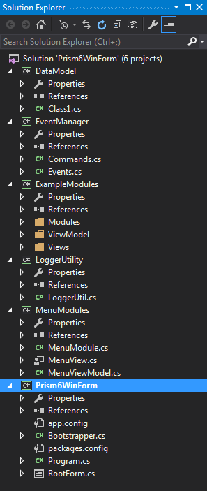
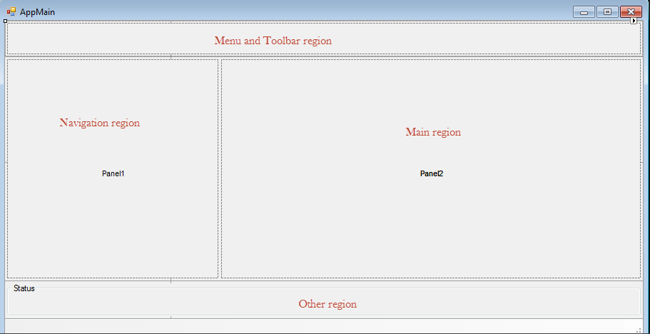
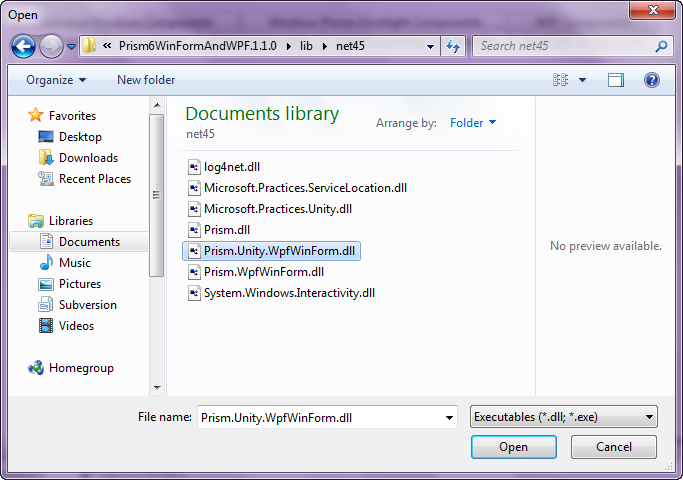
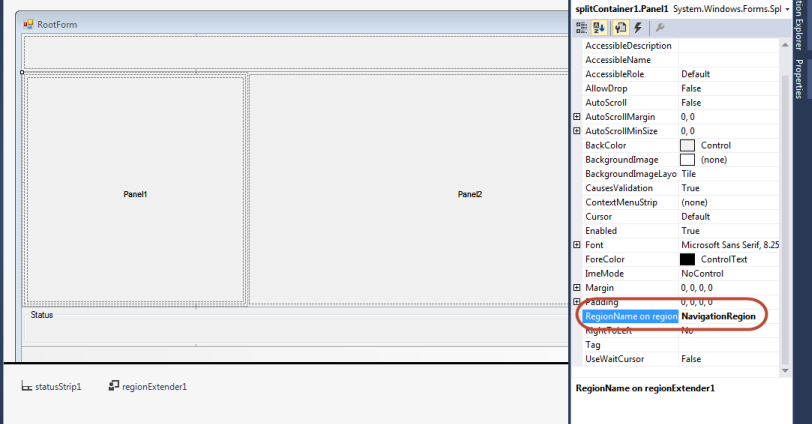
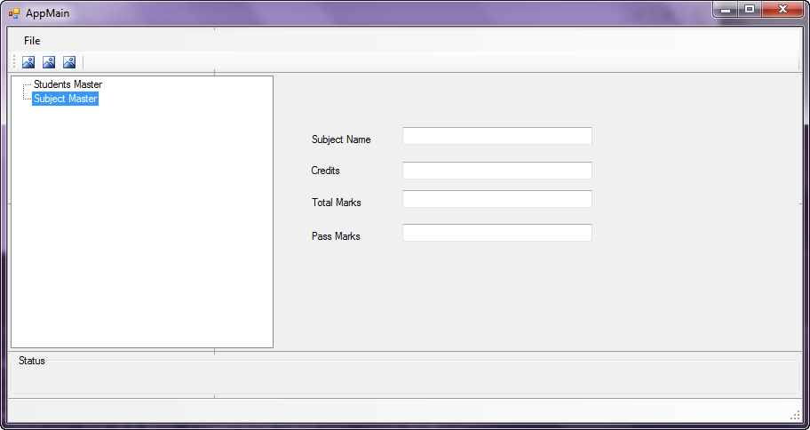

# Extended Prism Framework  for WinForm application support
## Requires
- Visual Studio 2015
## License
- MS-LPL
## Technologies
- Windows Forms
- C# Language
- .NET Development
## Topics
- Windows Forms
- Rapid Application Development
## Updated
- 01/15/2016
## Description

<h1>Introduction</h1>

Prism framework provides guidance designed to help you more easily design and build rich, flexible, and easy-to-maintain Windows Presentation Foundation (WPF) desktop applications. Using design patterns that embody important architectural design principles,
 such as separation of concerns and loose coupling, Prism framework helps you to design and build applications using loosely coupled components that can evolve independently but that can be easily and seamlessly integrated into the overall application. These
 types of applications are known as composite applications.

However by default prism framework intern supports composite application development using only WPF and there was no built-in support for WinForm application development.&nbsp; There were very few composite application framework were exist such as CAB (composite
 application block) and SCSF(smart client software factory). These framework became volatile and non-exist due to the popularity of WPF and prism framework. Hence at present there is no framework exist to support WinForm composite application development.

By keeping in the mind of emerging popularity and usage of the prism frame along with WPF, we (L&amp;T infotech) have extended the Prism Framework to meet and suit WinForm application development in line with WPF.

<h1>Building the Sample</h1>

All dependent dlls are packaged with nuget &quot;Prism6WinFormAndWPF.1.1.0.nupkg&quot;. same need to be included in if the user wants to use it for other projects.<em> 
</em>

Description

Developing a rich GUI thick client application with WinForm is seamless job, however there were no standard practices and procedure available to guide the developer on the usages. Across the organization different development team yearns to use their own
 approach and spent their efforts on reinventing the wheels to design and develop various design practices and patterns. There were no standard best practice and template available to reduce the initial design effort and ready to usage framework.

We have studied the behavior and usage of Prism framework and its usages using WPF. We have extended the framework to support WinForms without breaking the WPF implementation.

&nbsp;

This sample covers the usage of bootstrapper, using unity container for object registration and resolving it at runtime, modules registration, region registration, region navigation and data binding using MVVM concepts

&nbsp;

This sample covers the usage of following interfaces to support the region concept and mapping for winform panel.

&nbsp;

<a name="_Toc438474652">Extended Interfaces</a>&nbsp; to support Region name bindings
 and data context 

<h2><a name="_Toc438474653">IWinFormDataContext</a>&nbsp;</h2>

&nbsp;

C#

Edit|Remove

csharp
<pre class="hidden">public partial class SubjectView : UserControl, IWinFormDataContext
    {
        SubjectViewModel m_subjectViewModel;
        public SubjectView(SubjectViewModel subjectViewModel)
        {
            m_subjectViewModel = subjectViewModel;
            InitializeComponent();
        }

        public object GetViewModel()
        {
            return m_subjectViewModel;
        }
</pre>

<pre class="js">public&nbsp;partial&nbsp;class&nbsp;SubjectView&nbsp;:&nbsp;UserControl,&nbsp;IWinFormDataContext&nbsp;
&nbsp;&nbsp;&nbsp;&nbsp;{&nbsp;
&nbsp;&nbsp;&nbsp;&nbsp;&nbsp;&nbsp;&nbsp;&nbsp;SubjectViewModel&nbsp;m_subjectViewModel;&nbsp;
&nbsp;&nbsp;&nbsp;&nbsp;&nbsp;&nbsp;&nbsp;&nbsp;public&nbsp;SubjectView(SubjectViewModel&nbsp;subjectViewModel)&nbsp;
&nbsp;&nbsp;&nbsp;&nbsp;&nbsp;&nbsp;&nbsp;&nbsp;{&nbsp;
&nbsp;&nbsp;&nbsp;&nbsp;&nbsp;&nbsp;&nbsp;&nbsp;&nbsp;&nbsp;&nbsp;&nbsp;m_subjectViewModel&nbsp;=&nbsp;subjectViewModel;&nbsp;
&nbsp;&nbsp;&nbsp;&nbsp;&nbsp;&nbsp;&nbsp;&nbsp;&nbsp;&nbsp;&nbsp;&nbsp;InitializeComponent();&nbsp;
&nbsp;&nbsp;&nbsp;&nbsp;&nbsp;&nbsp;&nbsp;&nbsp;}&nbsp;
&nbsp;
&nbsp;&nbsp;&nbsp;&nbsp;&nbsp;&nbsp;&nbsp;&nbsp;public&nbsp;object&nbsp;GetViewModel()&nbsp;
&nbsp;&nbsp;&nbsp;&nbsp;&nbsp;&nbsp;&nbsp;&nbsp;{&nbsp;
&nbsp;&nbsp;&nbsp;&nbsp;&nbsp;&nbsp;&nbsp;&nbsp;&nbsp;&nbsp;&nbsp;&nbsp;return&nbsp;m_subjectViewModel;&nbsp;
&nbsp;&nbsp;&nbsp;&nbsp;&nbsp;&nbsp;&nbsp;&nbsp;}&nbsp;
</pre>

&nbsp;

&nbsp;

&nbsp;

This interface must be implemented to set the binding of view model with view. All view must be created using winform usercontrol and then implement the IWinFormDataContext.

&nbsp;<a name="_Toc438474653">&nbsp;</a>

Project Structure 

 

Application Regions

&nbsp;

Mapping of Region name to winform panels

&nbsp;

<strong>Region Extender in Toolbox - screen shot</strong>

<strong>Region name association for panels&nbsp; using properties</strong>

&nbsp;

&nbsp;

&nbsp;

&nbsp;
public RootForm(IUnityContainer
 container, IEventAggregator eventAggregator,
IRegionManager regionManager)

&nbsp;&nbsp;&nbsp;&nbsp;&nbsp;&nbsp;&nbsp;
{

&nbsp;&nbsp;&nbsp;&nbsp;&nbsp;&nbsp;&nbsp;&nbsp;&nbsp;&nbsp;&nbsp;
InitializeComponent();

&nbsp;&nbsp;&nbsp;&nbsp;&nbsp;&nbsp;&nbsp;&nbsp;&nbsp;&nbsp;&nbsp;
m_regionManager = regionManager;

&nbsp;&nbsp;&nbsp;&nbsp;&nbsp;&nbsp;&nbsp;&nbsp;&nbsp;&nbsp;&nbsp;
m_container = container;

&nbsp;&nbsp;&nbsp;&nbsp;&nbsp;&nbsp;&nbsp;&nbsp;&nbsp;&nbsp;&nbsp;
m_eventAggregator = eventAggregator;

&nbsp;&nbsp;&nbsp;&nbsp;&nbsp;&nbsp;&nbsp;&nbsp;&nbsp;&nbsp;&nbsp;
//MenuRegion&nbsp;

&nbsp;&nbsp;&nbsp;&nbsp;&nbsp;&nbsp;&nbsp;&nbsp;
&nbsp;&nbsp;&nbsp;m_container.RegisterInstance(&quot;MenuRegion&quot;,
 menuPanel);

&nbsp;&nbsp;&nbsp;&nbsp;&nbsp;&nbsp;&nbsp;&nbsp;&nbsp;&nbsp;&nbsp;
m_region = CreateRegion(&quot;MenuRegion&quot;);

&nbsp;&nbsp;&nbsp;&nbsp;&nbsp;&nbsp;&nbsp;&nbsp;&nbsp;&nbsp;&nbsp;
m_region.RegionHost = menuPanel;

&nbsp;&nbsp;&nbsp;&nbsp;&nbsp;&nbsp;&nbsp;&nbsp;&nbsp;&nbsp;&nbsp;
//Navigation region&nbsp;

&nbsp;&nbsp;&nbsp;&nbsp;&nbsp;&nbsp;&nbsp;&nbsp;&nbsp;&nbsp;&nbsp;
m_container.RegisterInstance(&quot;NavigationRegion&quot;, splitContainer1.Panel1);

&nbsp;&nbsp;&nbsp;&nbsp;&nbsp;&nbsp;&nbsp;&nbsp;&nbsp;&nbsp;&nbsp;
IRegion navRegion = CreateRegion(&quot;NavigationRegion&quot;);

&nbsp;&nbsp;&nbsp;&nbsp;&nbsp;&nbsp;&nbsp;&nbsp;&nbsp;&nbsp;&nbsp;
navRegion.RegionHost = splitContainer1.Panel1;

&nbsp;

&nbsp;&nbsp;&nbsp;&nbsp;&nbsp;&nbsp;&nbsp;&nbsp;&nbsp;&nbsp;&nbsp;
//MainRegion&nbsp;

&nbsp;&nbsp;&nbsp;&nbsp;&nbsp;&nbsp;&nbsp;&nbsp;&nbsp;&nbsp;&nbsp;
m_container.RegisterInstance(&quot;MainRegion&quot;, splitContainer1.Panel2);

&nbsp;&nbsp;&nbsp;&nbsp;&nbsp;&nbsp;&nbsp;&nbsp;
&nbsp;&nbsp;&nbsp;IRegion mainRegion = CreateRegion(&quot;MainRegion&quot;);

&nbsp;&nbsp;&nbsp;&nbsp;&nbsp;&nbsp;&nbsp;&nbsp;&nbsp;&nbsp;&nbsp;
mainRegion.RegionHost = splitContainer1.Panel2;

&nbsp;&nbsp;&nbsp;&nbsp;&nbsp;&nbsp;&nbsp;&nbsp;&nbsp;&nbsp;&nbsp;
eventAggregator.GetEvent&lt;MenuItemClickEvent&gt;().Subscribe(MenuClicked);

&nbsp;

&nbsp;&nbsp;&nbsp;&nbsp;&nbsp;&nbsp;&nbsp;
}

&nbsp;

<strong>View navigation using region navigate</strong>

&nbsp;

<strong> 
</strong>

Bindings and style mapping in view model behaviour

&nbsp;

public
bool AddButtonVisible

&nbsp;&nbsp;&nbsp;&nbsp;&nbsp;&nbsp;&nbsp;
{

&nbsp;&nbsp;&nbsp;&nbsp;&nbsp;&nbsp;&nbsp;&nbsp;&nbsp;&nbsp;&nbsp;
get {
return m_addBtnVisible; }

&nbsp;&nbsp;&nbsp;&nbsp;&nbsp;&nbsp;&nbsp;&nbsp;&nbsp;&nbsp;&nbsp;
set&nbsp;

&nbsp;&nbsp;&nbsp;&nbsp;&nbsp;&nbsp;&nbsp;
&nbsp;&nbsp;&nbsp;&nbsp;{

&nbsp;&nbsp;&nbsp;&nbsp;&nbsp;&nbsp;&nbsp;&nbsp;&nbsp;&nbsp;&nbsp;&nbsp;&nbsp;&nbsp;&nbsp;
m_addBtnVisible = value;

&nbsp;&nbsp;&nbsp;&nbsp;&nbsp;&nbsp;&nbsp;&nbsp;&nbsp;&nbsp;&nbsp;&nbsp;&nbsp;&nbsp;&nbsp;
UpdateButtonVisible = !value;

&nbsp;&nbsp;&nbsp;&nbsp;&nbsp;&nbsp;&nbsp;&nbsp;&nbsp;&nbsp;&nbsp;&nbsp;&nbsp;&nbsp;&nbsp;
NameEdit = !value;

&nbsp;&nbsp;&nbsp;&nbsp;&nbsp;&nbsp;&nbsp;&nbsp;&nbsp;&nbsp;&nbsp;&nbsp;&nbsp;&nbsp;&nbsp;
OnPropertyChanged(() =&gt; AddButtonVisible);

&nbsp;&nbsp;&nbsp;&nbsp;&nbsp;&nbsp;&nbsp;&nbsp;&nbsp;&nbsp;&nbsp;
}

&nbsp;&nbsp;&nbsp;&nbsp;&nbsp;&nbsp;&nbsp;
}&nbsp;

&nbsp;

Binding:

&nbsp;
this.button1.DataBindings.Add(new
 System.Windows.Forms.Binding(&quot;Visible&quot;,
this.studentViewModelBindingSource,
&quot;AddButtonVisible&quot;,
true));&nbsp;

&nbsp;

For more details

Refer microsoft gallary
<a href="https://visualstudiogallery.msdn.microsoft.com/163e2f69-1146-4fb5-b479-f3c33f7b02ec">
Prism6ForWinForm</a> by the author 

&nbsp;

<strong><em>Acknowledgement</em></strong>

&nbsp;

I would like to thank Brian Noyes for valuable insights into Bringing Prism to WinForms.&nbsp; This blog
 posting inspired me to extend the prism framework functionalities to WinForm.

&nbsp;

&lt;!--[if gte mso 9]&gt;&lt;xml&gt; &lt;o:OfficeDocumentSettings&gt; &lt;o:TargetScreenSize&gt;800x600&lt;/o:TargetScreenSize&gt; &lt;/o:OfficeDocumentSettings&gt; &lt;/xml&gt;&lt;![endif]--&gt;

<a name="_Toc438474652">Extended Interfaces</a>&nbsp;

<h2>&nbsp;</h2>
<h2><a name="_Toc438474653">IWinFormDataContext</a>&nbsp;</h2>

&nbsp;

This interface must be implemented to set the binding of view model with view. All view must be created using winform usercontrol and then implement the IWinFormDataContext.

&nbsp;

public
partial
class
SubjectView :
UserControl,
IWinFormDataContext

&nbsp;&nbsp;&nbsp;
{

&nbsp;&nbsp;&nbsp;&nbsp;&nbsp;&nbsp;&nbsp;
SubjectViewModel m_subjectViewModel;

&nbsp;&nbsp;&nbsp;&nbsp;&nbsp;&nbsp;&nbsp;
public SubjectView(SubjectViewModel
 subjectViewModel)

&nbsp;&nbsp;&nbsp;&nbsp;&nbsp;&nbsp;&nbsp;
{

&nbsp;&nbsp;&nbsp;&nbsp;&nbsp;&nbsp;&nbsp;&nbsp;&nbsp;&nbsp;&nbsp;
m_subjectViewModel = subjectViewModel;

&nbsp;&nbsp;&nbsp;&nbsp;&nbsp;&nbsp;
&nbsp;&nbsp;&nbsp;&nbsp;&nbsp;InitializeComponent();

&nbsp;&nbsp;&nbsp;&nbsp;&nbsp;&nbsp;&nbsp;
}

&nbsp;

&nbsp;&nbsp;&nbsp;&nbsp;&nbsp;&nbsp;&nbsp;
public
object GetViewModel()

&nbsp;&nbsp;&nbsp;&nbsp;&nbsp;&nbsp;&nbsp;
{

&nbsp;&nbsp;&nbsp;&nbsp;&nbsp;&nbsp;&nbsp;&nbsp;&nbsp;&nbsp;&nbsp;
return m_subjectViewModel;

&nbsp;&nbsp;&nbsp;&nbsp;&nbsp;&nbsp;&nbsp;
}

&nbsp;

&lt;!--[if gte mso 9]&gt;&lt;xml&gt; &lt;w:WordDocument&gt; &lt;w:View&gt;Normal&lt;/w:View&gt; &lt;w:Zoom&gt;0&lt;/w:Zoom&gt; &lt;w:TrackMoves /&gt; &lt;w:TrackFormatting /&gt; &lt;w:PunctuationKerning /&gt; &lt;w:ValidateAgainstSchemas /&gt; &lt;w:SaveIfXMLInvalid&gt;false&lt;/w:SaveIfXMLInvalid&gt;
 &lt;w:IgnoreMixedContent&gt;false&lt;/w:IgnoreMixedContent&gt; &lt;w:AlwaysShowPlaceholderText&gt;false&lt;/w:AlwaysShowPlaceholderText&gt; &lt;w:DoNotPromoteQF /&gt; &lt;w:LidThemeOther&gt;EN-US&lt;/w:LidThemeOther&gt; &lt;w:LidThemeAsian&gt;X-NONE&lt;/w:LidThemeAsian&gt;
 &lt;w:LidThemeComplexScript&gt;X-NONE&lt;/w:LidThemeComplexScript&gt; &lt;w:Compatibility&gt; &lt;w:BreakWrappedTables /&gt; &lt;w:SnapToGridInCell /&gt; &lt;w:WrapTextWithPunct /&gt; &lt;w:UseAsianBreakRules /&gt; &lt;w:DontGrowAutofit /&gt; &lt;w:SplitPgBreakAndParaMark
 /&gt; &lt;w:EnableOpenTypeKerning /&gt; &lt;w:DontFlipMirrorIndents /&gt; &lt;w:OverrideTableStyleHps /&gt; &lt;/w:Compatibility&gt; &lt;w:BrowserLevel&gt;MicrosoftInternetExplorer4&lt;/w:BrowserLevel&gt; &lt;m:mathPr&gt; &lt;m:mathFont m:val=&quot;Cambria Math&quot;
 /&gt; &lt;m:brkBin m:val=&quot;before&quot; /&gt; &lt;m:brkBinSub m:val=&quot;45;-&quot; /&gt; &lt;m:smallFrac m:val=&quot;off&quot; /&gt; &lt;m:dispDef /&gt; &lt;m:lMargin m:val=&quot;0&quot; /&gt; &lt;m:rMargin m:val=&quot;0&quot; /&gt; &lt;m:defJc m:val=&quot;centerGroup&quot; /&gt; &lt;m:wrapIndent m:val=&quot;1440&quot;
 /&gt; &lt;m:intLim m:val=&quot;subSup&quot; /&gt; &lt;m:naryLim m:val=&quot;undOvr&quot; /&gt; &lt;/m:mathPr&gt;&lt;/w:WordDocument&gt; &lt;/xml&gt;&lt;![endif]--&gt;&lt;!--[if gte mso 9]&gt;&lt;xml&gt; &lt;w:LatentStyles DefLockedState=&quot;false&quot; DefUnhideWhenUsed=&quot;false&quot; DefSemiHidden=&quot;false&quot;
 DefQFormat=&quot;false&quot; DefPriority=&quot;99&quot; LatentStyleCount=&quot;371&quot;&gt; &lt;w:LsdException Locked=&quot;false&quot; Priority=&quot;0&quot; QFormat=&quot;true&quot; Name=&quot;Normal&quot; /&gt; &lt;w:LsdException Locked=&quot;false&quot; Priority=&quot;9&quot; QFormat=&quot;true&quot; Name=&quot;heading 1&quot; /&gt; &lt;w:LsdException Locked=&quot;false&quot;
 Priority=&quot;0&quot; SemiHidden=&quot;true&quot; UnhideWhenUsed=&quot;true&quot; QFormat=&quot;true&quot; Name=&quot;heading 2&quot; /&gt; &lt;w:LsdException Locked=&quot;false&quot; Priority=&quot;9&quot; SemiHidden=&quot;true&quot; UnhideWhenUsed=&quot;true&quot; QFormat=&quot;true&quot; Name=&quot;heading 3&quot; /&gt; &lt;w:LsdException Locked=&quot;false&quot; Priority=&quot;9&quot;
 SemiHidden=&quot;true&quot; UnhideWhenUsed=&quot;true&quot; QFormat=&quot;true&quot; Name=&quot;heading 4&quot; /&gt; &lt;w:LsdException Locked=&quot;false&quot; Priority=&quot;9&quot; SemiHidden=&quot;true&quot; UnhideWhenUsed=&quot;true&quot; QFormat=&quot;true&quot; Name=&quot;heading 5&quot; /&gt; &lt;w:LsdException Locked=&quot;false&quot; Priority=&quot;9&quot; SemiHidden=&quot;true&quot;
 UnhideWhenUsed=&quot;true&quot; QFormat=&quot;true&quot; Name=&quot;heading 6&quot; /&gt; &lt;w:LsdException Locked=&quot;false&quot; Priority=&quot;9&quot; SemiHidden=&quot;true&quot; UnhideWhenUsed=&quot;true&quot; QFormat=&quot;true&quot; Name=&quot;heading 7&quot; /&gt; &lt;w:LsdException Locked=&quot;false&quot; Priority=&quot;9&quot; SemiHidden=&quot;true&quot; UnhideWhenUsed=&quot;true&quot;
 QFormat=&quot;true&quot; Name=&quot;heading 8&quot; /&gt; &lt;w:LsdException Locked=&quot;false&quot; Priority=&quot;9&quot; SemiHidden=&quot;true&quot; UnhideWhenUsed=&quot;true&quot; QFormat=&quot;true&quot; Name=&quot;heading 9&quot; /&gt; &lt;w:LsdException Locked=&quot;false&quot; SemiHidden=&quot;true&quot; UnhideWhenUsed=&quot;true&quot; Name=&quot;index 1&quot; /&gt;
 &lt;w:LsdException Locked=&quot;false&quot; SemiHidden=&quot;true&quot; UnhideWhenUsed=&quot;true&quot; Name=&quot;index 2&quot; /&gt; &lt;w:LsdException Locked=&quot;false&quot; SemiHidden=&quot;true&quot; UnhideWhenUsed=&quot;true&quot; Name=&quot;index 3&quot; /&gt; &lt;w:LsdException Locked=&quot;false&quot; SemiHidden=&quot;true&quot; UnhideWhenUsed=&quot;true&quot;
 Name=&quot;index 4&quot; /&gt; &lt;w:LsdException Locked=&quot;false&quot; SemiHidden=&quot;true&quot; UnhideWhenUsed=&quot;true&quot; Name=&quot;index 5&quot; /&gt; &lt;w:LsdException Locked=&quot;false&quot; SemiHidden=&quot;true&quot; UnhideWhenUsed=&quot;true&quot; Name=&quot;index 6&quot; /&gt; &lt;w:LsdException Locked=&quot;false&quot; SemiHidden=&quot;true&quot;
 UnhideWhenUsed=&quot;true&quot; Name=&quot;index 7&quot; /&gt; &lt;w:LsdException Locked=&quot;false&quot; SemiHidden=&quot;true&quot; UnhideWhenUsed=&quot;true&quot; Name=&quot;index 8&quot; /&gt; &lt;w:LsdException Locked=&quot;false&quot; SemiHidden=&quot;true&quot; UnhideWhenUsed=&quot;true&quot; Name=&quot;index 9&quot; /&gt; &lt;w:LsdException Locked=&quot;false&quot;
 Priority=&quot;39&quot; SemiHidden=&quot;true&quot; UnhideWhenUsed=&quot;true&quot; Name=&quot;toc 1&quot; /&gt; &lt;w:LsdException Locked=&quot;false&quot; Priority=&quot;39&quot; SemiHidden=&quot;true&quot; UnhideWhenUsed=&quot;true&quot; Name=&quot;toc 2&quot; /&gt; &lt;w:LsdException Locked=&quot;false&quot; Priority=&quot;39&quot; SemiHidden=&quot;true&quot; UnhideWhenUsed=&quot;true&quot;
 Name=&quot;toc 3&quot; /&gt; &lt;w:LsdException Locked=&quot;false&quot; Priority=&quot;39&quot; SemiHidden=&quot;true&quot; UnhideWhenUsed=&quot;true&quot; Name=&quot;toc 4&quot; /&gt; &lt;w:LsdException Locked=&quot;false&quot; Priority=&quot;39&quot; SemiHidden=&quot;true&quot; UnhideWhenUsed=&quot;true&quot; Name=&quot;toc 5&quot; /&gt; &lt;w:LsdException Locked=&quot;false&quot;
 Priority=&quot;39&quot; SemiHidden=&quot;true&quot; UnhideWhenUsed=&quot;true&quot; Name=&quot;toc 6&quot; /&gt; &lt;w:LsdException Locked=&quot;false&quot; Priority=&quot;39&quot; SemiHidden=&quot;true&quot; UnhideWhenUsed=&quot;true&quot; Name=&quot;toc 7&quot; /&gt; &lt;w:LsdException Locked=&quot;false&quot; Priority=&quot;39&quot; SemiHidden=&quot;true&quot; UnhideWhenUsed=&quot;true&quot;
 Name=&quot;toc 8&quot; /&gt; &lt;w:LsdException Locked=&quot;false&quot; Priority=&quot;39&quot; SemiHidden=&quot;true&quot; UnhideWhenUsed=&quot;true&quot; Name=&quot;toc 9&quot; /&gt; &lt;w:LsdException Locked=&quot;false&quot; SemiHidden=&quot;true&quot; UnhideWhenUsed=&quot;true&quot; Name=&quot;Normal Indent&quot; /&gt; &lt;w:LsdException Locked=&quot;false&quot;
 SemiHidden=&quot;true&quot; UnhideWhenUsed=&quot;true&quot; Name=&quot;footnote text&quot; /&gt; &lt;w:LsdException Locked=&quot;false&quot; SemiHidden=&quot;true&quot; UnhideWhenUsed=&quot;true&quot; Name=&quot;annotation text&quot; /&gt; &lt;w:LsdException Locked=&quot;false&quot; Priority=&quot;0&quot; SemiHidden=&quot;true&quot; UnhideWhenUsed=&quot;true&quot;
 Name=&quot;header&quot; /&gt; &lt;w:LsdException Locked=&quot;false&quot; SemiHidden=&quot;true&quot; UnhideWhenUsed=&quot;true&quot; Name=&quot;footer&quot; /&gt; &lt;w:LsdException Locked=&quot;false&quot; SemiHidden=&quot;true&quot; UnhideWhenUsed=&quot;true&quot; Name=&quot;index heading&quot; /&gt; &lt;w:LsdException Locked=&quot;false&quot; Priority=&quot;35&quot;
 SemiHidden=&quot;true&quot; UnhideWhenUsed=&quot;true&quot; QFormat=&quot;true&quot; Name=&quot;caption&quot; /&gt; &lt;w:LsdException Locked=&quot;false&quot; SemiHidden=&quot;true&quot; UnhideWhenUsed=&quot;true&quot; Name=&quot;table of figures&quot; /&gt; &lt;w:LsdException Locked=&quot;false&quot; SemiHidden=&quot;true&quot; UnhideWhenUsed=&quot;true&quot; Name=&quot;envelope
 address&quot; /&gt; &lt;w:LsdException Locked=&quot;false&quot; SemiHidden=&quot;true&quot; UnhideWhenUsed=&quot;true&quot; Name=&quot;envelope return&quot; /&gt; &lt;w:LsdException Locked=&quot;false&quot; SemiHidden=&quot;true&quot; UnhideWhenUsed=&quot;true&quot; Name=&quot;footnote reference&quot; /&gt; &lt;w:LsdException Locked=&quot;false&quot;
 SemiHidden=&quot;true&quot; UnhideWhenUsed=&quot;true&quot; Name=&quot;annotation reference&quot; /&gt; &lt;w:LsdException Locked=&quot;false&quot; SemiHidden=&quot;true&quot; UnhideWhenUsed=&quot;true&quot; Name=&quot;line number&quot; /&gt; &lt;w:LsdException Locked=&quot;false&quot; SemiHidden=&quot;true&quot; UnhideWhenUsed=&quot;true&quot; Name=&quot;page
 number&quot; /&gt; &lt;w:LsdException Locked=&quot;false&quot; SemiHidden=&quot;true&quot; UnhideWhenUsed=&quot;true&quot; Name=&quot;endnote reference&quot; /&gt; &lt;w:LsdException Locked=&quot;false&quot; SemiHidden=&quot;true&quot; UnhideWhenUsed=&quot;true&quot; Name=&quot;endnote text&quot; /&gt; &lt;w:LsdException Locked=&quot;false&quot; SemiHidden=&quot;true&quot;
 UnhideWhenUsed=&quot;true&quot; Name=&quot;table of authorities&quot; /&gt; &lt;w:LsdException Locked=&quot;false&quot; SemiHidden=&quot;true&quot; UnhideWhenUsed=&quot;true&quot; Name=&quot;macro&quot; /&gt; &lt;w:LsdException Locked=&quot;false&quot; SemiHidden=&quot;true&quot; UnhideWhenUsed=&quot;true&quot; Name=&quot;toa heading&quot; /&gt; &lt;w:LsdException
 Locked=&quot;false&quot; SemiHidden=&quot;true&quot; UnhideWhenUsed=&quot;true&quot; Name=&quot;List&quot; /&gt; &lt;w:LsdException Locked=&quot;false&quot; SemiHidden=&quot;true&quot; UnhideWhenUsed=&quot;true&quot; Name=&quot;List Bullet&quot; /&gt; &lt;w:LsdException Locked=&quot;false&quot; SemiHidden=&quot;true&quot; UnhideWhenUsed=&quot;true&quot; Name=&quot;List
 Number&quot; /&gt; &lt;w:LsdException Locked=&quot;false&quot; SemiHidden=&quot;true&quot; UnhideWhenUsed=&quot;true&quot; Name=&quot;List 2&quot; /&gt; &lt;w:LsdException Locked=&quot;false&quot; SemiHidden=&quot;true&quot; UnhideWhenUsed=&quot;true&quot; Name=&quot;List 3&quot; /&gt; &lt;w:LsdException Locked=&quot;false&quot; SemiHidden=&quot;true&quot; UnhideWhenUsed=&quot;true&quot;
 Name=&quot;List 4&quot; /&gt; &lt;w:LsdException Locked=&quot;false&quot; SemiHidden=&quot;true&quot; UnhideWhenUsed=&quot;true&quot; Name=&quot;List 5&quot; /&gt; &lt;w:LsdException Locked=&quot;false&quot; SemiHidden=&quot;true&quot; UnhideWhenUsed=&quot;true&quot; Name=&quot;List Bullet 2&quot; /&gt; &lt;w:LsdException Locked=&quot;false&quot; SemiHidden=&quot;true&quot;
 UnhideWhenUsed=&quot;true&quot; Name=&quot;List Bullet 3&quot; /&gt; &lt;w:LsdException Locked=&quot;false&quot; SemiHidden=&quot;true&quot; UnhideWhenUsed=&quot;true&quot; Name=&quot;List Bullet 4&quot; /&gt; &lt;w:LsdException Locked=&quot;false&quot; SemiHidden=&quot;true&quot; UnhideWhenUsed=&quot;true&quot; Name=&quot;List Bullet 5&quot; /&gt; &lt;w:LsdException
 Locked=&quot;false&quot; SemiHidden=&quot;true&quot; UnhideWhenUsed=&quot;true&quot; Name=&quot;List Number 2&quot; /&gt; &lt;w:LsdException Locked=&quot;false&quot; SemiHidden=&quot;true&quot; UnhideWhenUsed=&quot;true&quot; Name=&quot;List Number 3&quot; /&gt; &lt;w:LsdException Locked=&quot;false&quot; SemiHidden=&quot;true&quot; UnhideWhenUsed=&quot;true&quot;
 Name=&quot;List Number 4&quot; /&gt; &lt;w:LsdException Locked=&quot;false&quot; SemiHidden=&quot;true&quot; UnhideWhenUsed=&quot;true&quot; Name=&quot;List Number 5&quot; /&gt; &lt;w:LsdException Locked=&quot;false&quot; Priority=&quot;0&quot; QFormat=&quot;true&quot; Name=&quot;Title&quot; /&gt; &lt;w:LsdException Locked=&quot;false&quot; SemiHidden=&quot;true&quot;
 UnhideWhenUsed=&quot;true&quot; Name=&quot;Closing&quot; /&gt; &lt;w:LsdException Locked=&quot;false&quot; SemiHidden=&quot;true&quot; UnhideWhenUsed=&quot;true&quot; Name=&quot;Signature&quot; /&gt; &lt;w:LsdException Locked=&quot;false&quot; Priority=&quot;0&quot; SemiHidden=&quot;true&quot; UnhideWhenUsed=&quot;true&quot; Name=&quot;Default Paragraph Font&quot;
 /&gt; &lt;w:LsdException Locked=&quot;false&quot; SemiHidden=&quot;true&quot; UnhideWhenUsed=&quot;true&quot; Name=&quot;Body Text&quot; /&gt; &lt;w:LsdException Locked=&quot;false&quot; Priority=&quot;0&quot; SemiHidden=&quot;true&quot; UnhideWhenUsed=&quot;true&quot; Name=&quot;Body Text Indent&quot; /&gt; &lt;w:LsdException Locked=&quot;false&quot; SemiHidden=&quot;true&quot;
 UnhideWhenUsed=&quot;true&quot; Name=&quot;List Continue&quot; /&gt; &lt;w:LsdException Locked=&quot;false&quot; SemiHidden=&quot;true&quot; UnhideWhenUsed=&quot;true&quot; Name=&quot;List Continue 2&quot; /&gt; &lt;w:LsdException Locked=&quot;false&quot; SemiHidden=&quot;true&quot; UnhideWhenUsed=&quot;true&quot; Name=&quot;List Continue 3&quot; /&gt; &lt;w:LsdException
 Locked=&quot;false&quot; SemiHidden=&quot;true&quot; UnhideWhenUsed=&quot;true&quot; Name=&quot;List Continue 4&quot; /&gt; &lt;w:LsdException Locked=&quot;false&quot; SemiHidden=&quot;true&quot; UnhideWhenUsed=&quot;true&quot; Name=&quot;List Continue 5&quot; /&gt; &lt;w:LsdException Locked=&quot;false&quot; SemiHidden=&quot;true&quot; UnhideWhenUsed=&quot;true&quot;
 Name=&quot;Message Header&quot; /&gt; &lt;w:LsdException Locked=&quot;false&quot; Priority=&quot;11&quot; QFormat=&quot;true&quot; Name=&quot;Subtitle&quot; /&gt; &lt;w:LsdException Locked=&quot;false&quot; SemiHidden=&quot;true&quot; UnhideWhenUsed=&quot;true&quot; Name=&quot;Salutation&quot; /&gt; &lt;w:LsdException Locked=&quot;false&quot; SemiHidden=&quot;true&quot;
 UnhideWhenUsed=&quot;true&quot; Name=&quot;Date&quot; /&gt; &lt;w:LsdException Locked=&quot;false&quot; SemiHidden=&quot;true&quot; UnhideWhenUsed=&quot;true&quot; Name=&quot;Body Text First Indent&quot; /&gt; &lt;w:LsdException Locked=&quot;false&quot; SemiHidden=&quot;true&quot; UnhideWhenUsed=&quot;true&quot; Name=&quot;Body Text First Indent 2&quot;
 /&gt; &lt;w:LsdException Locked=&quot;false&quot; SemiHidden=&quot;true&quot; UnhideWhenUsed=&quot;true&quot; Name=&quot;Note Heading&quot; /&gt; &lt;w:LsdException Locked=&quot;false&quot; SemiHidden=&quot;true&quot; UnhideWhenUsed=&quot;true&quot; Name=&quot;Body Text 2&quot; /&gt; &lt;w:LsdException Locked=&quot;false&quot; SemiHidden=&quot;true&quot;
 UnhideWhenUsed=&quot;true&quot; Name=&quot;Body Text 3&quot; /&gt; &lt;w:LsdException Locked=&quot;false&quot; SemiHidden=&quot;true&quot; UnhideWhenUsed=&quot;true&quot; Name=&quot;Body Text Indent 2&quot; /&gt; &lt;w:LsdException Locked=&quot;false&quot; SemiHidden=&quot;true&quot; UnhideWhenUsed=&quot;true&quot; Name=&quot;Body Text Indent 3&quot; /&gt;
 &lt;w:LsdException Locked=&quot;false&quot; SemiHidden=&quot;true&quot; UnhideWhenUsed=&quot;true&quot; Name=&quot;Block Text&quot; /&gt; &lt;w:LsdException Locked=&quot;false&quot; SemiHidden=&quot;true&quot; UnhideWhenUsed=&quot;true&quot; Name=&quot;Hyperlink&quot; /&gt; &lt;w:LsdException Locked=&quot;false&quot; SemiHidden=&quot;true&quot; UnhideWhenUsed=&quot;true&quot;
 Name=&quot;FollowedHyperlink&quot; /&gt; &lt;w:LsdException Locked=&quot;false&quot; Priority=&quot;22&quot; QFormat=&quot;true&quot; Name=&quot;Strong&quot; /&gt; &lt;w:LsdException Locked=&quot;false&quot; Priority=&quot;20&quot; QFormat=&quot;true&quot; Name=&quot;Emphasis&quot; /&gt; &lt;w:LsdException Locked=&quot;false&quot; SemiHidden=&quot;true&quot; UnhideWhenUsed=&quot;true&quot;
 Name=&quot;Document Map&quot; /&gt; &lt;w:LsdException Locked=&quot;false&quot; SemiHidden=&quot;true&quot; UnhideWhenUsed=&quot;true&quot; Name=&quot;Plain Text&quot; /&gt; &lt;w:LsdException Locked=&quot;false&quot; SemiHidden=&quot;true&quot; UnhideWhenUsed=&quot;true&quot; Name=&quot;E-mail Signature&quot; /&gt; &lt;w:LsdException Locked=&quot;false&quot;
 SemiHidden=&quot;true&quot; UnhideWhenUsed=&quot;true&quot; Name=&quot;HTML Top of Form&quot; /&gt; &lt;w:LsdException Locked=&quot;false&quot; SemiHidden=&quot;true&quot; UnhideWhenUsed=&quot;true&quot; Name=&quot;HTML Bottom of Form&quot; /&gt; &lt;w:LsdException Locked=&quot;false&quot; SemiHidden=&quot;true&quot; UnhideWhenUsed=&quot;true&quot; Name=&quot;Normal
 (Web)&quot; /&gt; &lt;w:LsdException Locked=&quot;false&quot; SemiHidden=&quot;true&quot; UnhideWhenUsed=&quot;true&quot; Name=&quot;HTML Acronym&quot; /&gt; &lt;w:LsdException Locked=&quot;false&quot; SemiHidden=&quot;true&quot; UnhideWhenUsed=&quot;true&quot; Name=&quot;HTML Address&quot; /&gt; &lt;w:LsdException Locked=&quot;false&quot; SemiHidden=&quot;true&quot;
 UnhideWhenUsed=&quot;true&quot; Name=&quot;HTML Cite&quot; /&gt; &lt;w:LsdException Locked=&quot;false&quot; SemiHidden=&quot;true&quot; UnhideWhenUsed=&quot;true&quot; Name=&quot;HTML Code&quot; /&gt; &lt;w:LsdException Locked=&quot;false&quot; SemiHidden=&quot;true&quot; UnhideWhenUsed=&quot;true&quot; Name=&quot;HTML Definition&quot; /&gt; &lt;w:LsdException
 Locked=&quot;false&quot; SemiHidden=&quot;true&quot; UnhideWhenUsed=&quot;true&quot; Name=&quot;HTML Keyboard&quot; /&gt; &lt;w:LsdException Locked=&quot;false&quot; SemiHidden=&quot;true&quot; UnhideWhenUsed=&quot;true&quot; Name=&quot;HTML Preformatted&quot; /&gt; &lt;w:LsdException Locked=&quot;false&quot; SemiHidden=&quot;true&quot; UnhideWhenUsed=&quot;true&quot;
 Name=&quot;HTML Sample&quot; /&gt; &lt;w:LsdException Locked=&quot;false&quot; SemiHidden=&quot;true&quot; UnhideWhenUsed=&quot;true&quot; Name=&quot;HTML Typewriter&quot; /&gt; &lt;w:LsdException Locked=&quot;false&quot; SemiHidden=&quot;true&quot; UnhideWhenUsed=&quot;true&quot; Name=&quot;HTML Variable&quot; /&gt; &lt;w:LsdException Locked=&quot;false&quot;
 SemiHidden=&quot;true&quot; UnhideWhenUsed=&quot;true&quot; Name=&quot;Normal Table&quot; /&gt; &lt;w:LsdException Locked=&quot;false&quot; SemiHidden=&quot;true&quot; UnhideWhenUsed=&quot;true&quot; Name=&quot;annotation subject&quot; /&gt; &lt;w:LsdException Locked=&quot;false&quot; SemiHidden=&quot;true&quot; UnhideWhenUsed=&quot;true&quot; Name=&quot;No List&quot;
 /&gt; &lt;w:LsdException Locked=&quot;false&quot; SemiHidden=&quot;true&quot; UnhideWhenUsed=&quot;true&quot; Name=&quot;Outline List 1&quot; /&gt; &lt;w:LsdException Locked=&quot;false&quot; SemiHidden=&quot;true&quot; UnhideWhenUsed=&quot;true&quot; Name=&quot;Outline List 2&quot; /&gt; &lt;w:LsdException Locked=&quot;false&quot; SemiHidden=&quot;true&quot;
 UnhideWhenUsed=&quot;true&quot; Name=&quot;Outline List 3&quot; /&gt; &lt;w:LsdException Locked=&quot;false&quot; SemiHidden=&quot;true&quot; UnhideWhenUsed=&quot;true&quot; Name=&quot;Table Simple 1&quot; /&gt; &lt;w:LsdException Locked=&quot;false&quot; SemiHidden=&quot;true&quot; UnhideWhenUsed=&quot;true&quot; Name=&quot;Table Simple 2&quot; /&gt; &lt;w:LsdException
 Locked=&quot;false&quot; SemiHidden=&quot;true&quot; UnhideWhenUsed=&quot;true&quot; Name=&quot;Table Simple 3&quot; /&gt; &lt;w:LsdException Locked=&quot;false&quot; SemiHidden=&quot;true&quot; UnhideWhenUsed=&quot;true&quot; Name=&quot;Table Classic 1&quot; /&gt; &lt;w:LsdException Locked=&quot;false&quot; SemiHidden=&quot;true&quot; UnhideWhenUsed=&quot;true&quot;
 Name=&quot;Table Classic 2&quot; /&gt; &lt;w:LsdException Locked=&quot;false&quot; SemiHidden=&quot;true&quot; UnhideWhenUsed=&quot;true&quot; Name=&quot;Table Classic 3&quot; /&gt; &lt;w:LsdException Locked=&quot;false&quot; SemiHidden=&quot;true&quot; UnhideWhenUsed=&quot;true&quot; Name=&quot;Table Classic 4&quot; /&gt; &lt;w:LsdException Locked=&quot;false&quot;
 SemiHidden=&quot;true&quot; UnhideWhenUsed=&quot;true&quot; Name=&quot;Table Colorful 1&quot; /&gt; &lt;w:LsdException Locked=&quot;false&quot; SemiHidden=&quot;true&quot; UnhideWhenUsed=&quot;true&quot; Name=&quot;Table Colorful 2&quot; /&gt; &lt;w:LsdException Locked=&quot;false&quot; SemiHidden=&quot;true&quot; UnhideWhenUsed=&quot;true&quot; Name=&quot;Table
 Colorful 3&quot; /&gt; &lt;w:LsdException Locked=&quot;false&quot; SemiHidden=&quot;true&quot; UnhideWhenUsed=&quot;true&quot; Name=&quot;Table Columns 1&quot; /&gt; &lt;w:LsdException Locked=&quot;false&quot; SemiHidden=&quot;true&quot; UnhideWhenUsed=&quot;true&quot; Name=&quot;Table Columns 2&quot; /&gt; &lt;w:LsdException Locked=&quot;false&quot;
 SemiHidden=&quot;true&quot; UnhideWhenUsed=&quot;true&quot; Name=&quot;Table Columns 3&quot; /&gt; &lt;w:LsdException Locked=&quot;false&quot; SemiHidden=&quot;true&quot; UnhideWhenUsed=&quot;true&quot; Name=&quot;Table Columns 4&quot; /&gt; &lt;w:LsdException Locked=&quot;false&quot; SemiHidden=&quot;true&quot; UnhideWhenUsed=&quot;true&quot; Name=&quot;Table
 Columns 5&quot; /&gt; &lt;w:LsdException Locked=&quot;false&quot; SemiHidden=&quot;true&quot; UnhideWhenUsed=&quot;true&quot; Name=&quot;Table Grid 1&quot; /&gt; &lt;w:LsdException Locked=&quot;false&quot; SemiHidden=&quot;true&quot; UnhideWhenUsed=&quot;true&quot; Name=&quot;Table Grid 2&quot; /&gt; &lt;w:LsdException Locked=&quot;false&quot; SemiHidden=&quot;true&quot;
 UnhideWhenUsed=&quot;true&quot; Name=&quot;Table Grid 3&quot; /&gt; &lt;w:LsdException Locked=&quot;false&quot; SemiHidden=&quot;true&quot; UnhideWhenUsed=&quot;true&quot; Name=&quot;Table Grid 4&quot; /&gt; &lt;w:LsdException Locked=&quot;false&quot; SemiHidden=&quot;true&quot; UnhideWhenUsed=&quot;true&quot; Name=&quot;Table Grid 5&quot; /&gt; &lt;w:LsdException
 Locked=&quot;false&quot; SemiHidden=&quot;true&quot; UnhideWhenUsed=&quot;true&quot; Name=&quot;Table Grid 6&quot; /&gt; &lt;w:LsdException Locked=&quot;false&quot; SemiHidden=&quot;true&quot; UnhideWhenUsed=&quot;true&quot; Name=&quot;Table Grid 7&quot; /&gt; &lt;w:LsdException Locked=&quot;false&quot; SemiHidden=&quot;true&quot; UnhideWhenUsed=&quot;true&quot; Name=&quot;Table
 Grid 8&quot; /&gt; &lt;w:LsdException Locked=&quot;false&quot; SemiHidden=&quot;true&quot; UnhideWhenUsed=&quot;true&quot; Name=&quot;Table List 1&quot; /&gt; &lt;w:LsdException Locked=&quot;false&quot; SemiHidden=&quot;true&quot; UnhideWhenUsed=&quot;true&quot; Name=&quot;Table List 2&quot; /&gt; &lt;w:LsdException Locked=&quot;false&quot; SemiHidden=&quot;true&quot;
 UnhideWhenUsed=&quot;true&quot; Name=&quot;Table List 3&quot; /&gt; &lt;w:LsdException Locked=&quot;false&quot; SemiHidden=&quot;true&quot; UnhideWhenUsed=&quot;true&quot; Name=&quot;Table List 4&quot; /&gt; &lt;w:LsdException Locked=&quot;false&quot; SemiHidden=&quot;true&quot; UnhideWhenUsed=&quot;true&quot; Name=&quot;Table List 5&quot; /&gt; &lt;w:LsdException
 Locked=&quot;false&quot; SemiHidden=&quot;true&quot; UnhideWhenUsed=&quot;true&quot; Name=&quot;Table List 6&quot; /&gt; &lt;w:LsdException Locked=&quot;false&quot; SemiHidden=&quot;true&quot; UnhideWhenUsed=&quot;true&quot; Name=&quot;Table List 7&quot; /&gt; &lt;w:LsdException Locked=&quot;false&quot; SemiHidden=&quot;true&quot; UnhideWhenUsed=&quot;true&quot; Name=&quot;Table
 List 8&quot; /&gt; &lt;w:LsdException Locked=&quot;false&quot; SemiHidden=&quot;true&quot; UnhideWhenUsed=&quot;true&quot; Name=&quot;Table 3D effects 1&quot; /&gt; &lt;w:LsdException Locked=&quot;false&quot; SemiHidden=&quot;true&quot; UnhideWhenUsed=&quot;true&quot; Name=&quot;Table 3D effects 2&quot; /&gt; &lt;w:LsdException Locked=&quot;false&quot;
 SemiHidden=&quot;true&quot; UnhideWhenUsed=&quot;true&quot; Name=&quot;Table 3D effects 3&quot; /&gt; &lt;w:LsdException Locked=&quot;false&quot; SemiHidden=&quot;true&quot; UnhideWhenUsed=&quot;true&quot; Name=&quot;Table Contemporary&quot; /&gt; &lt;w:LsdException Locked=&quot;false&quot; SemiHidden=&quot;true&quot; UnhideWhenUsed=&quot;true&quot; Name=&quot;Table
 Elegant&quot; /&gt; &lt;w:LsdException Locked=&quot;false&quot; SemiHidden=&quot;true&quot; UnhideWhenUsed=&quot;true&quot; Name=&quot;Table Professional&quot; /&gt; &lt;w:LsdException Locked=&quot;false&quot; SemiHidden=&quot;true&quot; UnhideWhenUsed=&quot;true&quot; Name=&quot;Table Subtle 1&quot; /&gt; &lt;w:LsdException Locked=&quot;false&quot;
 SemiHidden=&quot;true&quot; UnhideWhenUsed=&quot;true&quot; Name=&quot;Table Subtle 2&quot; /&gt; &lt;w:LsdException Locked=&quot;false&quot; SemiHidden=&quot;true&quot; UnhideWhenUsed=&quot;true&quot; Name=&quot;Table Web 1&quot; /&gt; &lt;w:LsdException Locked=&quot;false&quot; SemiHidden=&quot;true&quot; UnhideWhenUsed=&quot;true&quot; Name=&quot;Table Web
 2&quot; /&gt; &lt;w:LsdException Locked=&quot;false&quot; SemiHidden=&quot;true&quot; UnhideWhenUsed=&quot;true&quot; Name=&quot;Table Web 3&quot; /&gt; &lt;w:LsdException Locked=&quot;false&quot; SemiHidden=&quot;true&quot; UnhideWhenUsed=&quot;true&quot; Name=&quot;Balloon Text&quot; /&gt; &lt;w:LsdException Locked=&quot;false&quot; Priority=&quot;39&quot;
 Name=&quot;Table Grid&quot; /&gt; &lt;w:LsdException Locked=&quot;false&quot; SemiHidden=&quot;true&quot; UnhideWhenUsed=&quot;true&quot; Name=&quot;Table Theme&quot; /&gt; &lt;w:LsdException Locked=&quot;false&quot; SemiHidden=&quot;true&quot; Name=&quot;Placeholder Text&quot; /&gt; &lt;w:LsdException Locked=&quot;false&quot; Priority=&quot;1&quot; QFormat=&quot;true&quot;
 Name=&quot;No Spacing&quot; /&gt; &lt;w:LsdException Locked=&quot;false&quot; Priority=&quot;60&quot; Name=&quot;Light Shading&quot; /&gt; &lt;w:LsdException Locked=&quot;false&quot; Priority=&quot;61&quot; Name=&quot;Light List&quot; /&gt; &lt;w:LsdException Locked=&quot;false&quot; Priority=&quot;62&quot; Name=&quot;Light Grid&quot; /&gt; &lt;w:LsdException
 Locked=&quot;false&quot; Priority=&quot;63&quot; Name=&quot;Medium Shading 1&quot; /&gt; &lt;w:LsdException Locked=&quot;false&quot; Priority=&quot;64&quot; Name=&quot;Medium Shading 2&quot; /&gt; &lt;w:LsdException Locked=&quot;false&quot; Priority=&quot;65&quot; Name=&quot;Medium List 1&quot; /&gt; &lt;w:LsdException Locked=&quot;false&quot; Priority=&quot;66&quot;
 Name=&quot;Medium List 2&quot; /&gt; &lt;w:LsdException Locked=&quot;false&quot; Priority=&quot;67&quot; Name=&quot;Medium Grid 1&quot; /&gt; &lt;w:LsdException Locked=&quot;false&quot; Priority=&quot;68&quot; Name=&quot;Medium Grid 2&quot; /&gt; &lt;w:LsdException Locked=&quot;false&quot; Priority=&quot;69&quot; Name=&quot;Medium Grid 3&quot; /&gt; &lt;w:LsdException
 Locked=&quot;false&quot; Priority=&quot;70&quot; Name=&quot;Dark List&quot; /&gt; &lt;w:LsdException Locked=&quot;false&quot; Priority=&quot;71&quot; Name=&quot;Colorful Shading&quot; /&gt; &lt;w:LsdException Locked=&quot;false&quot; Priority=&quot;72&quot; Name=&quot;Colorful List&quot; /&gt; &lt;w:LsdException Locked=&quot;false&quot; Priority=&quot;73&quot; Name=&quot;Colorful
 Grid&quot; /&gt; &lt;w:LsdException Locked=&quot;false&quot; Priority=&quot;60&quot; Name=&quot;Light Shading Accent 1&quot; /&gt; &lt;w:LsdException Locked=&quot;false&quot; Priority=&quot;61&quot; Name=&quot;Light List Accent 1&quot; /&gt; &lt;w:LsdException Locked=&quot;false&quot; Priority=&quot;62&quot; Name=&quot;Light Grid Accent 1&quot; /&gt;
 &lt;w:LsdException Locked=&quot;false&quot; Priority=&quot;63&quot; Name=&quot;Medium Shading 1 Accent 1&quot; /&gt; &lt;w:LsdException Locked=&quot;false&quot; Priority=&quot;64&quot; Name=&quot;Medium Shading 2 Accent 1&quot; /&gt; &lt;w:LsdException Locked=&quot;false&quot; Priority=&quot;65&quot; Name=&quot;Medium List 1 Accent 1&quot; /&gt;
 &lt;w:LsdException Locked=&quot;false&quot; SemiHidden=&quot;true&quot; Name=&quot;Revision&quot; /&gt; &lt;w:LsdException Locked=&quot;false&quot; Priority=&quot;34&quot; QFormat=&quot;true&quot; Name=&quot;List Paragraph&quot; /&gt; &lt;w:LsdException Locked=&quot;false&quot; Priority=&quot;29&quot; QFormat=&quot;true&quot; Name=&quot;Quote&quot; /&gt; &lt;w:LsdException
 Locked=&quot;false&quot; Priority=&quot;30&quot; QFormat=&quot;true&quot; Name=&quot;Intense Quote&quot; /&gt; &lt;w:LsdException Locked=&quot;false&quot; Priority=&quot;66&quot; Name=&quot;Medium List 2 Accent 1&quot; /&gt; &lt;w:LsdException Locked=&quot;false&quot; Priority=&quot;67&quot; Name=&quot;Medium Grid 1 Accent 1&quot; /&gt; &lt;w:LsdException
 Locked=&quot;false&quot; Priority=&quot;68&quot; Name=&quot;Medium Grid 2 Accent 1&quot; /&gt; &lt;w:LsdException Locked=&quot;false&quot; Priority=&quot;69&quot; Name=&quot;Medium Grid 3 Accent 1&quot; /&gt; &lt;w:LsdException Locked=&quot;false&quot; Priority=&quot;70&quot; Name=&quot;Dark List Accent 1&quot; /&gt; &lt;w:LsdException Locked=&quot;false&quot;
 Priority=&quot;71&quot; Name=&quot;Colorful Shading Accent 1&quot; /&gt; &lt;w:LsdException Locked=&quot;false&quot; Priority=&quot;72&quot; Name=&quot;Colorful List Accent 1&quot; /&gt; &lt;w:LsdException Locked=&quot;false&quot; Priority=&quot;73&quot; Name=&quot;Colorful Grid Accent 1&quot; /&gt; &lt;w:LsdException Locked=&quot;false&quot; Priority=&quot;60&quot;
 Name=&quot;Light Shading Accent 2&quot; /&gt; &lt;w:LsdException Locked=&quot;false&quot; Priority=&quot;61&quot; Name=&quot;Light List Accent 2&quot; /&gt; &lt;w:LsdException Locked=&quot;false&quot; Priority=&quot;62&quot; Name=&quot;Light Grid Accent 2&quot; /&gt; &lt;w:LsdException Locked=&quot;false&quot; Priority=&quot;63&quot; Name=&quot;Medium
 Shading 1 Accent 2&quot; /&gt; &lt;w:LsdException Locked=&quot;false&quot; Priority=&quot;64&quot; Name=&quot;Medium Shading 2 Accent 2&quot; /&gt; &lt;w:LsdException Locked=&quot;false&quot; Priority=&quot;65&quot; Name=&quot;Medium List 1 Accent 2&quot; /&gt; &lt;w:LsdException Locked=&quot;false&quot; Priority=&quot;66&quot; Name=&quot;Medium
 List 2 Accent 2&quot; /&gt; &lt;w:LsdException Locked=&quot;false&quot; Priority=&quot;67&quot; Name=&quot;Medium Grid 1 Accent 2&quot; /&gt; &lt;w:LsdException Locked=&quot;false&quot; Priority=&quot;68&quot; Name=&quot;Medium Grid 2 Accent 2&quot; /&gt; &lt;w:LsdException Locked=&quot;false&quot; Priority=&quot;69&quot; Name=&quot;Medium Grid
 3 Accent 2&quot; /&gt; &lt;w:LsdException Locked=&quot;false&quot; Priority=&quot;70&quot; Name=&quot;Dark List Accent 2&quot; /&gt; &lt;w:LsdException Locked=&quot;false&quot; Priority=&quot;71&quot; Name=&quot;Colorful Shading Accent 2&quot; /&gt; &lt;w:LsdException Locked=&quot;false&quot; Priority=&quot;72&quot; Name=&quot;Colorful List Accent
 2&quot; /&gt; &lt;w:LsdException Locked=&quot;false&quot; Priority=&quot;73&quot; Name=&quot;Colorful Grid Accent 2&quot; /&gt; &lt;w:LsdException Locked=&quot;false&quot; Priority=&quot;60&quot; Name=&quot;Light Shading Accent 3&quot; /&gt; &lt;w:LsdException Locked=&quot;false&quot; Priority=&quot;61&quot; Name=&quot;Light List Accent 3&quot; /&gt;
 &lt;w:LsdException Locked=&quot;false&quot; Priority=&quot;62&quot; Name=&quot;Light Grid Accent 3&quot; /&gt; &lt;w:LsdException Locked=&quot;false&quot; Priority=&quot;63&quot; Name=&quot;Medium Shading 1 Accent 3&quot; /&gt; &lt;w:LsdException Locked=&quot;false&quot; Priority=&quot;64&quot; Name=&quot;Medium Shading 2 Accent 3&quot; /&gt; &lt;w:LsdException
 Locked=&quot;false&quot; Priority=&quot;65&quot; Name=&quot;Medium List 1 Accent 3&quot; /&gt; &lt;w:LsdException Locked=&quot;false&quot; Priority=&quot;66&quot; Name=&quot;Medium List 2 Accent 3&quot; /&gt; &lt;w:LsdException Locked=&quot;false&quot; Priority=&quot;67&quot; Name=&quot;Medium Grid 1 Accent 3&quot; /&gt; &lt;w:LsdException Locked=&quot;false&quot;
 Priority=&quot;68&quot; Name=&quot;Medium Grid 2 Accent 3&quot; /&gt; &lt;w:LsdException Locked=&quot;false&quot; Priority=&quot;69&quot; Name=&quot;Medium Grid 3 Accent 3&quot; /&gt; &lt;w:LsdException Locked=&quot;false&quot; Priority=&quot;70&quot; Name=&quot;Dark List Accent 3&quot; /&gt; &lt;w:LsdException Locked=&quot;false&quot; Priority=&quot;71&quot;
 Name=&quot;Colorful Shading Accent 3&quot; /&gt; &lt;w:LsdException Locked=&quot;false&quot; Priority=&quot;72&quot; Name=&quot;Colorful List Accent 3&quot; /&gt; &lt;w:LsdException Locked=&quot;false&quot; Priority=&quot;73&quot; Name=&quot;Colorful Grid Accent 3&quot; /&gt; &lt;w:LsdException Locked=&quot;false&quot; Priority=&quot;60&quot; Name=&quot;Light
 Shading Accent 4&quot; /&gt; &lt;w:LsdException Locked=&quot;false&quot; Priority=&quot;61&quot; Name=&quot;Light List Accent 4&quot; /&gt; &lt;w:LsdException Locked=&quot;false&quot; Priority=&quot;62&quot; Name=&quot;Light Grid Accent 4&quot; /&gt; &lt;w:LsdException Locked=&quot;false&quot; Priority=&quot;63&quot; Name=&quot;Medium Shading 1
 Accent 4&quot; /&gt; &lt;w:LsdException Locked=&quot;false&quot; Priority=&quot;64&quot; Name=&quot;Medium Shading 2 Accent 4&quot; /&gt; &lt;w:LsdException Locked=&quot;false&quot; Priority=&quot;65&quot; Name=&quot;Medium List 1 Accent 4&quot; /&gt; &lt;w:LsdException Locked=&quot;false&quot; Priority=&quot;66&quot; Name=&quot;Medium List 2 Accent
 4&quot; /&gt; &lt;w:LsdException Locked=&quot;false&quot; Priority=&quot;67&quot; Name=&quot;Medium Grid 1 Accent 4&quot; /&gt; &lt;w:LsdException Locked=&quot;false&quot; Priority=&quot;68&quot; Name=&quot;Medium Grid 2 Accent 4&quot; /&gt; &lt;w:LsdException Locked=&quot;false&quot; Priority=&quot;69&quot; Name=&quot;Medium Grid 3 Accent 4&quot; /&gt;
 &lt;w:LsdException Locked=&quot;false&quot; Priority=&quot;70&quot; Name=&quot;Dark List Accent 4&quot; /&gt; &lt;w:LsdException Locked=&quot;false&quot; Priority=&quot;71&quot; Name=&quot;Colorful Shading Accent 4&quot; /&gt; &lt;w:LsdException Locked=&quot;false&quot; Priority=&quot;72&quot; Name=&quot;Colorful List Accent 4&quot; /&gt; &lt;w:LsdException
 Locked=&quot;false&quot; Priority=&quot;73&quot; Name=&quot;Colorful Grid Accent 4&quot; /&gt; &lt;w:LsdException Locked=&quot;false&quot; Priority=&quot;60&quot; Name=&quot;Light Shading Accent 5&quot; /&gt; &lt;w:LsdException Locked=&quot;false&quot; Priority=&quot;61&quot; Name=&quot;Light List Accent 5&quot; /&gt; &lt;w:LsdException Locked=&quot;false&quot;
 Priority=&quot;62&quot; Name=&quot;Light Grid Accent 5&quot; /&gt; &lt;w:LsdException Locked=&quot;false&quot; Priority=&quot;63&quot; Name=&quot;Medium Shading 1 Accent 5&quot; /&gt; &lt;w:LsdException Locked=&quot;false&quot; Priority=&quot;64&quot; Name=&quot;Medium Shading 2 Accent 5&quot; /&gt; &lt;w:LsdException Locked=&quot;false&quot; Priority=&quot;65&quot;
 Name=&quot;Medium List 1 Accent 5&quot; /&gt; &lt;w:LsdException Locked=&quot;false&quot; Priority=&quot;66&quot; Name=&quot;Medium List 2 Accent 5&quot; /&gt; &lt;w:LsdException Locked=&quot;false&quot; Priority=&quot;67&quot; Name=&quot;Medium Grid 1 Accent 5&quot; /&gt; &lt;w:LsdException Locked=&quot;false&quot; Priority=&quot;68&quot; Name=&quot;Medium
 Grid 2 Accent 5&quot; /&gt; &lt;w:LsdException Locked=&quot;false&quot; Priority=&quot;69&quot; Name=&quot;Medium Grid 3 Accent 5&quot; /&gt; &lt;w:LsdException Locked=&quot;false&quot; Priority=&quot;70&quot; Name=&quot;Dark List Accent 5&quot; /&gt; &lt;w:LsdException Locked=&quot;false&quot; Priority=&quot;71&quot; Name=&quot;Colorful Shading
 Accent 5&quot; /&gt; &lt;w:LsdException Locked=&quot;false&quot; Priority=&quot;72&quot; Name=&quot;Colorful List Accent 5&quot; /&gt; &lt;w:LsdException Locked=&quot;false&quot; Priority=&quot;73&quot; Name=&quot;Colorful Grid Accent 5&quot; /&gt; &lt;w:LsdException Locked=&quot;false&quot; Priority=&quot;60&quot; Name=&quot;Light Shading Accent
 6&quot; /&gt; &lt;w:LsdException Locked=&quot;false&quot; Priority=&quot;61&quot; Name=&quot;Light List Accent 6&quot; /&gt; &lt;w:LsdException Locked=&quot;false&quot; Priority=&quot;62&quot; Name=&quot;Light Grid Accent 6&quot; /&gt; &lt;w:LsdException Locked=&quot;false&quot; Priority=&quot;63&quot; Name=&quot;Medium Shading 1 Accent 6&quot; /&gt;
 &lt;w:LsdException Locked=&quot;false&quot; Priority=&quot;64&quot; Name=&quot;Medium Shading 2 Accent 6&quot; /&gt; &lt;w:LsdException Locked=&quot;false&quot; Priority=&quot;65&quot; Name=&quot;Medium List 1 Accent 6&quot; /&gt; &lt;w:LsdException Locked=&quot;false&quot; Priority=&quot;66&quot; Name=&quot;Medium List 2 Accent 6&quot; /&gt; &lt;w:LsdException
 Locked=&quot;false&quot; Priority=&quot;67&quot; Name=&quot;Medium Grid 1 Accent 6&quot; /&gt; &lt;w:LsdException Locked=&quot;false&quot; Priority=&quot;68&quot; Name=&quot;Medium Grid 2 Accent 6&quot; /&gt; &lt;w:LsdException Locked=&quot;false&quot; Priority=&quot;69&quot; Name=&quot;Medium Grid 3 Accent 6&quot; /&gt; &lt;w:LsdException Locked=&quot;false&quot;
 Priority=&quot;70&quot; Name=&quot;Dark List Accent 6&quot; /&gt; &lt;w:LsdException Locked=&quot;false&quot; Priority=&quot;71&quot; Name=&quot;Colorful Shading Accent 6&quot; /&gt; &lt;w:LsdException Locked=&quot;false&quot; Priority=&quot;72&quot; Name=&quot;Colorful List Accent 6&quot; /&gt; &lt;w:LsdException Locked=&quot;false&quot; Priority=&quot;73&quot;
 Name=&quot;Colorful Grid Accent 6&quot; /&gt; &lt;w:LsdException Locked=&quot;false&quot; Priority=&quot;19&quot; QFormat=&quot;true&quot; Name=&quot;Subtle Emphasis&quot; /&gt; &lt;w:LsdException Locked=&quot;false&quot; Priority=&quot;21&quot; QFormat=&quot;true&quot; Name=&quot;Intense Emphasis&quot; /&gt; &lt;w:LsdException Locked=&quot;false&quot; Priority=&quot;31&quot;
 QFormat=&quot;true&quot; Name=&quot;Subtle Reference&quot; /&gt; &lt;w:LsdException Locked=&quot;false&quot; Priority=&quot;32&quot; QFormat=&quot;true&quot; Name=&quot;Intense Reference&quot; /&gt; &lt;w:LsdException Locked=&quot;false&quot; Priority=&quot;33&quot; QFormat=&quot;true&quot; Name=&quot;Book Title&quot; /&gt; &lt;w:LsdException Locked=&quot;false&quot;
 Priority=&quot;37&quot; SemiHidden=&quot;true&quot; UnhideWhenUsed=&quot;true&quot; Name=&quot;Bibliography&quot; /&gt; &lt;w:LsdException Locked=&quot;false&quot; Priority=&quot;39&quot; SemiHidden=&quot;true&quot; UnhideWhenUsed=&quot;true&quot; QFormat=&quot;true&quot; Name=&quot;TOC Heading&quot; /&gt; &lt;w:LsdException Locked=&quot;false&quot; Priority=&quot;41&quot;
 Name=&quot;Plain Table 1&quot; /&gt; &lt;w:LsdException Locked=&quot;false&quot; Priority=&quot;42&quot; Name=&quot;Plain Table 2&quot; /&gt; &lt;w:LsdException Locked=&quot;false&quot; Priority=&quot;43&quot; Name=&quot;Plain Table 3&quot; /&gt; &lt;w:LsdException Locked=&quot;false&quot; Priority=&quot;44&quot; Name=&quot;Plain Table 4&quot; /&gt; &lt;w:LsdException
 Locked=&quot;false&quot; Priority=&quot;45&quot; Name=&quot;Plain Table 5&quot; /&gt; &lt;w:LsdException Locked=&quot;false&quot; Priority=&quot;40&quot; Name=&quot;Grid Table Light&quot; /&gt; &lt;w:LsdException Locked=&quot;false&quot; Priority=&quot;46&quot; Name=&quot;Grid Table 1 Light&quot; /&gt; &lt;w:LsdException Locked=&quot;false&quot; Priority=&quot;47&quot;
 Name=&quot;Grid Table 2&quot; /&gt; &lt;w:LsdException Locked=&quot;false&quot; Priority=&quot;48&quot; Name=&quot;Grid Table 3&quot; /&gt; &lt;w:LsdException Locked=&quot;false&quot; Priority=&quot;49&quot; Name=&quot;Grid Table 4&quot; /&gt; &lt;w:LsdException Locked=&quot;false&quot; Priority=&quot;50&quot; Name=&quot;Grid Table 5 Dark&quot; /&gt; &lt;w:LsdException
 Locked=&quot;false&quot; Priority=&quot;51&quot; Name=&quot;Grid Table 6 Colorful&quot; /&gt; &lt;w:LsdException Locked=&quot;false&quot; Priority=&quot;52&quot; Name=&quot;Grid Table 7 Colorful&quot; /&gt; &lt;w:LsdException Locked=&quot;false&quot; Priority=&quot;46&quot; Name=&quot;Grid Table 1 Light Accent 1&quot; /&gt; &lt;w:LsdException Locked=&quot;false&quot;
 Priority=&quot;47&quot; Name=&quot;Grid Table 2 Accent 1&quot; /&gt; &lt;w:LsdException Locked=&quot;false&quot; Priority=&quot;48&quot; Name=&quot;Grid Table 3 Accent 1&quot; /&gt; &lt;w:LsdException Locked=&quot;false&quot; Priority=&quot;49&quot; Name=&quot;Grid Table 4 Accent 1&quot; /&gt; &lt;w:LsdException Locked=&quot;false&quot; Priority=&quot;50&quot;
 Name=&quot;Grid Table 5 Dark Accent 1&quot; /&gt; &lt;w:LsdException Locked=&quot;false&quot; Priority=&quot;51&quot; Name=&quot;Grid Table 6 Colorful Accent 1&quot; /&gt; &lt;w:LsdException Locked=&quot;false&quot; Priority=&quot;52&quot; Name=&quot;Grid Table 7 Colorful Accent 1&quot; /&gt; &lt;w:LsdException Locked=&quot;false&quot;
 Priority=&quot;46&quot; Name=&quot;Grid Table 1 Light Accent 2&quot; /&gt; &lt;w:LsdException Locked=&quot;false&quot; Priority=&quot;47&quot; Name=&quot;Grid Table 2 Accent 2&quot; /&gt; &lt;w:LsdException Locked=&quot;false&quot; Priority=&quot;48&quot; Name=&quot;Grid Table 3 Accent 2&quot; /&gt; &lt;w:LsdException Locked=&quot;false&quot; Priority=&quot;49&quot;
 Name=&quot;Grid Table 4 Accent 2&quot; /&gt; &lt;w:LsdException Locked=&quot;false&quot; Priority=&quot;50&quot; Name=&quot;Grid Table 5 Dark Accent 2&quot; /&gt; &lt;w:LsdException Locked=&quot;false&quot; Priority=&quot;51&quot; Name=&quot;Grid Table 6 Colorful Accent 2&quot; /&gt; &lt;w:LsdException Locked=&quot;false&quot; Priority=&quot;52&quot;
 Name=&quot;Grid Table 7 Colorful Accent 2&quot; /&gt; &lt;w:LsdException Locked=&quot;false&quot; Priority=&quot;46&quot; Name=&quot;Grid Table 1 Light Accent 3&quot; /&gt; &lt;w:LsdException Locked=&quot;false&quot; Priority=&quot;47&quot; Name=&quot;Grid Table 2 Accent 3&quot; /&gt; &lt;w:LsdException Locked=&quot;false&quot; Priority=&quot;48&quot;
 Name=&quot;Grid Table 3 Accent 3&quot; /&gt; &lt;w:LsdException Locked=&quot;false&quot; Priority=&quot;49&quot; Name=&quot;Grid Table 4 Accent 3&quot; /&gt; &lt;w:LsdException Locked=&quot;false&quot; Priority=&quot;50&quot; Name=&quot;Grid Table 5 Dark Accent 3&quot; /&gt; &lt;w:LsdException Locked=&quot;false&quot; Priority=&quot;51&quot; Name=&quot;Grid
 Table 6 Colorful Accent 3&quot; /&gt; &lt;w:LsdException Locked=&quot;false&quot; Priority=&quot;52&quot; Name=&quot;Grid Table 7 Colorful Accent 3&quot; /&gt; &lt;w:LsdException Locked=&quot;false&quot; Priority=&quot;46&quot; Name=&quot;Grid Table 1 Light Accent 4&quot; /&gt; &lt;w:LsdException Locked=&quot;false&quot; Priority=&quot;47&quot;
 Name=&quot;Grid Table 2 Accent 4&quot; /&gt; &lt;w:LsdException Locked=&quot;false&quot; Priority=&quot;48&quot; Name=&quot;Grid Table 3 Accent 4&quot; /&gt; &lt;w:LsdException Locked=&quot;false&quot; Priority=&quot;49&quot; Name=&quot;Grid Table 4 Accent 4&quot; /&gt; &lt;w:LsdException Locked=&quot;false&quot; Priority=&quot;50&quot; Name=&quot;Grid
 Table 5 Dark Accent 4&quot; /&gt; &lt;w:LsdException Locked=&quot;false&quot; Priority=&quot;51&quot; Name=&quot;Grid Table 6 Colorful Accent 4&quot; /&gt; &lt;w:LsdException Locked=&quot;false&quot; Priority=&quot;52&quot; Name=&quot;Grid Table 7 Colorful Accent 4&quot; /&gt; &lt;w:LsdException Locked=&quot;false&quot; Priority=&quot;46&quot;
 Name=&quot;Grid Table 1 Light Accent 5&quot; /&gt; &lt;w:LsdException Locked=&quot;false&quot; Priority=&quot;47&quot; Name=&quot;Grid Table 2 Accent 5&quot; /&gt; &lt;w:LsdException Locked=&quot;false&quot; Priority=&quot;48&quot; Name=&quot;Grid Table 3 Accent 5&quot; /&gt; &lt;w:LsdException Locked=&quot;false&quot; Priority=&quot;49&quot; Name=&quot;Grid
 Table 4 Accent 5&quot; /&gt; &lt;w:LsdException Locked=&quot;false&quot; Priority=&quot;50&quot; Name=&quot;Grid Table 5 Dark Accent 5&quot; /&gt; &lt;w:LsdException Locked=&quot;false&quot; Priority=&quot;51&quot; Name=&quot;Grid Table 6 Colorful Accent 5&quot; /&gt; &lt;w:LsdException Locked=&quot;false&quot; Priority=&quot;52&quot; Name=&quot;Grid
 Table 7 Colorful Accent 5&quot; /&gt; &lt;w:LsdException Locked=&quot;false&quot; Priority=&quot;46&quot; Name=&quot;Grid Table 1 Light Accent 6&quot; /&gt; &lt;w:LsdException Locked=&quot;false&quot; Priority=&quot;47&quot; Name=&quot;Grid Table 2 Accent 6&quot; /&gt; &lt;w:LsdException Locked=&quot;false&quot; Priority=&quot;48&quot; Name=&quot;Grid
 Table 3 Accent 6&quot; /&gt; &lt;w:LsdException Locked=&quot;false&quot; Priority=&quot;49&quot; Name=&quot;Grid Table 4 Accent 6&quot; /&gt; &lt;w:LsdException Locked=&quot;false&quot; Priority=&quot;50&quot; Name=&quot;Grid Table 5 Dark Accent 6&quot; /&gt; &lt;w:LsdException Locked=&quot;false&quot; Priority=&quot;51&quot; Name=&quot;Grid Table
 6 Colorful Accent 6&quot; /&gt; &lt;w:LsdException Locked=&quot;false&quot; Priority=&quot;52&quot; Name=&quot;Grid Table 7 Colorful Accent 6&quot; /&gt; &lt;w:LsdException Locked=&quot;false&quot; Priority=&quot;46&quot; Name=&quot;List Table 1 Light&quot; /&gt; &lt;w:LsdException Locked=&quot;false&quot; Priority=&quot;47&quot; Name=&quot;List
 Table 2&quot; /&gt; &lt;w:LsdException Locked=&quot;false&quot; Priority=&quot;48&quot; Name=&quot;List Table 3&quot; /&gt; &lt;w:LsdException Locked=&quot;false&quot; Priority=&quot;49&quot; Name=&quot;List Table 4&quot; /&gt; &lt;w:LsdException Locked=&quot;false&quot; Priority=&quot;50&quot; Name=&quot;List Table 5 Dark&quot; /&gt; &lt;w:LsdException
 Locked=&quot;false&quot; Priority=&quot;51&quot; Name=&quot;List Table 6 Colorful&quot; /&gt; &lt;w:LsdException Locked=&quot;false&quot; Priority=&quot;52&quot; Name=&quot;List Table 7 Colorful&quot; /&gt; &lt;w:LsdException Locked=&quot;false&quot; Priority=&quot;46&quot; Name=&quot;List Table 1 Light Accent 1&quot; /&gt; &lt;w:LsdException Locked=&quot;false&quot;
 Priority=&quot;47&quot; Name=&quot;List Table 2 Accent 1&quot; /&gt; &lt;w:LsdException Locked=&quot;false&quot; Priority=&quot;48&quot; Name=&quot;List Table 3 Accent 1&quot; /&gt; &lt;w:LsdException Locked=&quot;false&quot; Priority=&quot;49&quot; Name=&quot;List Table 4 Accent 1&quot; /&gt; &lt;w:LsdException Locked=&quot;false&quot; Priority=&quot;50&quot;
 Name=&quot;List Table 5 Dark Accent 1&quot; /&gt; &lt;w:LsdException Locked=&quot;false&quot; Priority=&quot;51&quot; Name=&quot;List Table 6 Colorful Accent 1&quot; /&gt; &lt;w:LsdException Locked=&quot;false&quot; Priority=&quot;52&quot; Name=&quot;List Table 7 Colorful Accent 1&quot; /&gt; &lt;w:LsdException Locked=&quot;false&quot;
 Priority=&quot;46&quot; Name=&quot;List Table 1 Light Accent 2&quot; /&gt; &lt;w:LsdException Locked=&quot;false&quot; Priority=&quot;47&quot; Name=&quot;List Table 2 Accent 2&quot; /&gt; &lt;w:LsdException Locked=&quot;false&quot; Priority=&quot;48&quot; Name=&quot;List Table 3 Accent 2&quot; /&gt; &lt;w:LsdException Locked=&quot;false&quot; Priority=&quot;49&quot;
 Name=&quot;List Table 4 Accent 2&quot; /&gt; &lt;w:LsdException Locked=&quot;false&quot; Priority=&quot;50&quot; Name=&quot;List Table 5 Dark Accent 2&quot; /&gt; &lt;w:LsdException Locked=&quot;false&quot; Priority=&quot;51&quot; Name=&quot;List Table 6 Colorful Accent 2&quot; /&gt; &lt;w:LsdException Locked=&quot;false&quot; Priority=&quot;52&quot;
 Name=&quot;List Table 7 Colorful Accent 2&quot; /&gt; &lt;w:LsdException Locked=&quot;false&quot; Priority=&quot;46&quot; Name=&quot;List Table 1 Light Accent 3&quot; /&gt; &lt;w:LsdException Locked=&quot;false&quot; Priority=&quot;47&quot; Name=&quot;List Table 2 Accent 3&quot; /&gt; &lt;w:LsdException Locked=&quot;false&quot; Priority=&quot;48&quot;
 Name=&quot;List Table 3 Accent 3&quot; /&gt; &lt;w:LsdException Locked=&quot;false&quot; Priority=&quot;49&quot; Name=&quot;List Table 4 Accent 3&quot; /&gt; &lt;w:LsdException Locked=&quot;false&quot; Priority=&quot;50&quot; Name=&quot;List Table 5 Dark Accent 3&quot; /&gt; &lt;w:LsdException Locked=&quot;false&quot; Priority=&quot;51&quot; Name=&quot;List
 Table 6 Colorful Accent 3&quot; /&gt; &lt;w:LsdException Locked=&quot;false&quot; Priority=&quot;52&quot; Name=&quot;List Table 7 Colorful Accent 3&quot; /&gt; &lt;w:LsdException Locked=&quot;false&quot; Priority=&quot;46&quot; Name=&quot;List Table 1 Light Accent 4&quot; /&gt; &lt;w:LsdException Locked=&quot;false&quot; Priority=&quot;47&quot;
 Name=&quot;List Table 2 Accent 4&quot; /&gt; &lt;w:LsdException Locked=&quot;false&quot; Priority=&quot;48&quot; Name=&quot;List Table 3 Accent 4&quot; /&gt; &lt;w:LsdException Locked=&quot;false&quot; Priority=&quot;49&quot; Name=&quot;List Table 4 Accent 4&quot; /&gt; &lt;w:LsdException Locked=&quot;false&quot; Priority=&quot;50&quot; Name=&quot;List
 Table 5 Dark Accent 4&quot; /&gt; &lt;w:LsdException Locked=&quot;false&quot; Priority=&quot;51&quot; Name=&quot;List Table 6 Colorful Accent 4&quot; /&gt; &lt;w:LsdException Locked=&quot;false&quot; Priority=&quot;52&quot; Name=&quot;List Table 7 Colorful Accent 4&quot; /&gt; &lt;w:LsdException Locked=&quot;false&quot; Priority=&quot;46&quot;
 Name=&quot;List Table 1 Light Accent 5&quot; /&gt; &lt;w:LsdException Locked=&quot;false&quot; Priority=&quot;47&quot; Name=&quot;List Table 2 Accent 5&quot; /&gt; &lt;w:LsdException Locked=&quot;false&quot; Priority=&quot;48&quot; Name=&quot;List Table 3 Accent 5&quot; /&gt; &lt;w:LsdException Locked=&quot;false&quot; Priority=&quot;49&quot; Name=&quot;List
 Table 4 Accent 5&quot; /&gt; &lt;w:LsdException Locked=&quot;false&quot; Priority=&quot;50&quot; Name=&quot;List Table 5 Dark Accent 5&quot; /&gt; &lt;w:LsdException Locked=&quot;false&quot; Priority=&quot;51&quot; Name=&quot;List Table 6 Colorful Accent 5&quot; /&gt; &lt;w:LsdException Locked=&quot;false&quot; Priority=&quot;52&quot; Name=&quot;List
 Table 7 Colorful Accent 5&quot; /&gt; &lt;w:LsdException Locked=&quot;false&quot; Priority=&quot;46&quot; Name=&quot;List Table 1 Light Accent 6&quot; /&gt; &lt;w:LsdException Locked=&quot;false&quot; Priority=&quot;47&quot; Name=&quot;List Table 2 Accent 6&quot; /&gt; &lt;w:LsdException Locked=&quot;false&quot; Priority=&quot;48&quot; Name=&quot;List
 Table 3 Accent 6&quot; /&gt; &lt;w:LsdException Locked=&quot;false&quot; Priority=&quot;49&quot; Name=&quot;List Table 4 Accent 6&quot; /&gt; &lt;w:LsdException Locked=&quot;false&quot; Priority=&quot;50&quot; Name=&quot;List Table 5 Dark Accent 6&quot; /&gt; &lt;w:LsdException Locked=&quot;false&quot; Priority=&quot;51&quot; Name=&quot;List Table
 6 Colorful Accent 6&quot; /&gt; &lt;w:LsdException Locked=&quot;false&quot; Priority=&quot;52&quot; Name=&quot;List Table 7 Colorful Accent 6&quot; /&gt; &lt;/w:LatentStyles&gt; &lt;/xml&gt;&lt;![endif]--&gt;&lt;!--[if gte mso 10]&gt; &lt;mce:style&gt;&lt;! /* Style Definitions */ table.MsoNormalTable
 {mso-style-name:&quot;Table Normal&quot;; mso-tstyle-rowband-size:0; mso-tstyle-colband-size:0; mso-style-noshow:yes; mso-style-priority:99; mso-style-parent:&quot;&quot;; mso-padding-alt:0in 5.4pt 0in 5.4pt; mso-para-margin:0in; mso-para-margin-bottom:.0001pt; mso-pagination:widow-orphan;
 font-size:10.0pt; font-family:&quot;Times New Roman&quot;,&quot;serif&quot;;} --&gt; &lt;!--[endif] --&gt;

