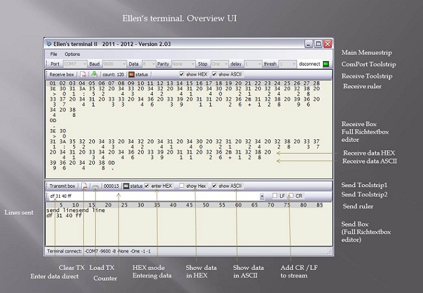

# Extended SerialPort Windows Forms Sample
## Requires
- Visual Studio 2008
## License
- Apache License, Version 2.0
## Technologies
- Windows Forms
- SerialPort
## Topics
- Windows Forms
- SerialPort class
## Updated
- 07/29/2012
## Description

<h1>Introduction</h1>

in addition to my other contributions of SerialPort class I will now present a extended Version.

 
<a href="http://code.msdn.microsoft.com/SerialPort-Sample-in-VBNET-fb040fb2">http://code.msdn.microsoft.com/SerialPort-Sample-in-VBNET-fb040fb2</a> 
Serial Port Sample in VB.NET. This is a beginners code

<a href="http://code.msdn.microsoft.com/SerialPort-Windows-Forms-a43f208e">http://code.msdn.microsoft.com/SerialPort-Windows-Forms-a43f208e</a> 
This is a extended application based on this.

My sample now demonstrates the usage of the Serial Port class. The serial port services are encapsulated in a class (full OOP). This is also a useful tool (terminal)

especially:

<ul>
<li>usage of splashsreen 
using the com port being encapsulated 
reading an writing com port bytewise 
reading variable frames lenght up to 4096 bytes 
using extended tuning and timing (threshold, delay) 
extended working with Richtextbox control 
entering HEX data in a textbox 
converting bytes to HEX string 
extended working with enums </li></ul>

&nbsp;

<h1>Building the Sample</h1>

 
There are no special requirements or instructions for building the sample neccessary. You only need one com port on the system.

<h1> 
Description of the UI</h1>

screenshot

&nbsp;

<strong>Main menuestrip</strong>

File &gt; Load config 
File &gt; save conifig 
File &gt; exit

Options &gt; font &gt; Large / Medium / Small

 
<strong>Comport Toolstrip</strong>

Select ComPort 
Select Baudrate 
Select Databits 
Select Parity 
Select Stopbits 
Select Delay 
Select Threshold 
Open/Close Port

 
<strong>Receive Toolstrip</strong>

Button clear RX box 
Button Save textfile from RX box 
counter RX 
status RX 
Checkbox Show HEX 
Checkbox Show ASCII

<strong>Send Toolstrip1</strong>

Button clear TX box 
Button Load textfile into TX box 
counter TX 
status TX 
Checkbox enter in HEX mode 
Checkbox Show HEX 
Checkbox Show ASCII

 
<strong>Send Toolstrip2</strong>

Combobox Enter data direct &amp; terminate with CR 
Checkboxes Add CR / LF to stream

<strong>Send Box right mouse button menue</strong>

Copy 
Paste 
Cut 
Send line (sending line from caret) 
Send selection

<h1> 
What is Threshold &amp; Delay?</h1>

 
.ReceivedBytesThreshold: 
Gets or sets the number of bytes in the internal input buffer before a DataReceived
 
&lt;<a href="http://msdn.microsoft.com/en-us/library/system.io.ports.serialport.datareceived(v=vs.80">http://msdn.microsoft.com/en-us/library/system.io.ports.serialport.datareceived(v=vs.80</a>)&gt; event occurs. 
&nbsp; 
In my sample I can change threshold from 1 ... 1000 . 
The intention is to fetch more bytes at once from the stream. This wil relif the main UI thread.

Example: 
When You have a fixed length of data frame 100 bytes You may set this property to 100. 
But notice: this is dangerous, when one bytes ist lost, event handle will never be executed.

See also: SerialPort.ReceivedBytesThreshold Property 
<a href="http://msdn.microsoft.com/en-us/library/system.io.ports.serialport.receivedbytesthreshold(v=vs.80">http://msdn.microsoft.com/en-us/library/system.io.ports.serialport.receivedbytesthreshold(v=vs.80</a>)

 
Delay. We take a look into my code:

<strong>&nbsp;&nbsp;&nbsp;&nbsp; Private Sub SerialPort1_DataReceived(ByVal sender As <a class="libraryLink" href="http://msdn.microsoft.com/en-US/library/System.Object.aspx" target="_blank" title="Auto generated link to System.Object">System.Object</a>, _</strong> 
<strong>&nbsp;&nbsp;&nbsp;&nbsp;&nbsp;&nbsp;&nbsp;&nbsp;&nbsp;&nbsp;&nbsp;&nbsp;&nbsp;&nbsp;&nbsp;&nbsp;&nbsp;&nbsp;&nbsp;&nbsp;&nbsp;&nbsp;&nbsp;&nbsp;&nbsp;&nbsp;&nbsp;&nbsp;&nbsp;&nbsp;&nbsp;&nbsp;&nbsp;&nbsp;&nbsp;&nbsp;&nbsp;&nbsp;&nbsp;&nbsp; ByVal e
 As <a class="libraryLink" href="http://msdn.microsoft.com/en-US/library/System.IO.Ports.SerialDataReceivedEventArgs.aspx" target="_blank" title="Auto generated link to System.IO.Ports.SerialDataReceivedEventArgs">System.IO.Ports.SerialDataReceivedEventArgs</a>) _</strong> 
<strong>&nbsp;&nbsp;&nbsp;&nbsp;&nbsp;&nbsp;&nbsp;&nbsp;&nbsp;&nbsp;&nbsp;&nbsp;&nbsp;&nbsp;&nbsp;&nbsp;&nbsp;&nbsp;&nbsp;&nbsp;&nbsp;&nbsp;&nbsp;&nbsp;&nbsp;&nbsp;&nbsp;&nbsp;&nbsp;&nbsp;&nbsp;&nbsp;&nbsp;&nbsp;&nbsp;&nbsp;&nbsp;&nbsp;&nbsp;&nbsp; Handles
 serialport1.DataReceived</strong>

<strong>&nbsp;&nbsp;&nbsp;&nbsp;&nbsp;&nbsp;&nbsp; Try</strong> 
<strong>&nbsp;&nbsp;&nbsp;&nbsp;&nbsp;&nbsp;&nbsp;&nbsp;&nbsp;&nbsp;&nbsp; Thread.Sleep(Me._receiveDelay)</strong> 
<strong>&nbsp;&nbsp;&nbsp;&nbsp;&nbsp;&nbsp;&nbsp;&nbsp;&nbsp;&nbsp;&nbsp; Dim len As Integer = serialport1.BytesToRead</strong> 
<strong>&nbsp;&nbsp;&nbsp;&nbsp;&nbsp;&nbsp;&nbsp;&nbsp;&nbsp;&nbsp;&nbsp; Me.buffer = New Byte(len - 1) {}</strong> 
<strong>&nbsp;&nbsp;&nbsp;&nbsp;&nbsp;&nbsp;&nbsp;&nbsp;&nbsp;&nbsp;&nbsp; serialport1.Read(Me.buffer, 0, len)</strong> 
<strong>&nbsp;&nbsp;&nbsp;&nbsp;&nbsp;&nbsp;&nbsp;&nbsp;&nbsp;&nbsp;&nbsp; RaiseEvent recOK(True)</strong> 
<strong>&nbsp;&nbsp;&nbsp;&nbsp;&nbsp;&nbsp;&nbsp; Catch ex As Exception</strong> 
<strong>&nbsp;&nbsp;&nbsp;&nbsp;&nbsp;&nbsp;&nbsp;&nbsp;&nbsp;&nbsp;&nbsp; showmessage(&quot;Read &quot; &amp; ex.Message)</strong> 
<strong>&nbsp;&nbsp;&nbsp;&nbsp;&nbsp;&nbsp;&nbsp;&nbsp;&nbsp;&nbsp;&nbsp; RaiseEvent recOK(False)</strong> 
<strong>&nbsp;&nbsp;&nbsp;&nbsp;&nbsp;&nbsp;&nbsp;&nbsp;&nbsp;&nbsp;&nbsp; Exit Sub</strong> 
<strong>&nbsp;&nbsp;&nbsp;&nbsp;&nbsp;&nbsp;&nbsp; End Try</strong>

<strong>&nbsp;&nbsp;&nbsp;&nbsp;&nbsp;&nbsp;&nbsp; ' data from secondary thread</strong> 
<strong>&nbsp;&nbsp;&nbsp;&nbsp;&nbsp;&nbsp;&nbsp; sc.Post(New SendOrPostCallback(AddressOf doUpdate), Me.buffer)</strong>

<strong>&nbsp;&nbsp;&nbsp; End Sub</strong>

 
In my sample &nbsp; can set _receiceDelay 1 ... 1000 (ms). As You see it works similiar to Threshold. 
The difference is that Threshold needs exact the number of bytes in stream before the handle reacts. 
Here not. You have to configure the delay according to the baudrate and the lenght of the input buffer

Usage of the SerialPort.ReadBufferSize Property (Windows buffer) 
see : <a href="http://msdn.microsoft.com/en-us/library/system.io.ports.serialport.readbuffersize">
http://msdn.microsoft.com/en-us/library/system.io.ports.serialport.readbuffersize</a>

&nbsp;

<h1>Review</h1>

Bug No Comport on system 2012-07-14

&nbsp;

&nbsp;

&nbsp;

regards Ellen

&nbsp;

&nbsp;

