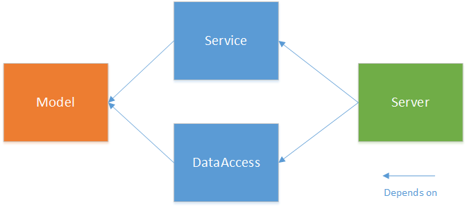

# FHIR Server (Visual Studio 2013)
## Requires
- Visual Studio 2013
## License
- Apache License, Version 2.0
## Technologies
- C#
- WCF
- REST
- Entity Framework
## Topics
- REST
- Web Services
- FHIR
- HL7
## Updated
- 12/11/2015
## Description

<h1>Introduction</h1>

This examples demonstrates the implementation of an HL7 FHIR server based on WCF. The FHIR REST services are implemenation as service layer that sits on top of an repository for Patient data.

<em>Please be aware that the example is currently work in progress. It provides CRUD functionality for Patient resources only. But the implementation already provides a framework for further functionality like searches or support for other resources. Even
 this description needs some further improvements ..</em>

<h3>Functionality</h3>

Supported REST Operations

<ul>
<li>GET - Read a resource&nbsp;addressed by a logical identifier </li><li>PUT - Update a resource </li><li>DELETE - Mark a resource as deleted </li><li>POST - Create a resource </li></ul>

&nbsp;

<h2>Supported Resources</h2>

The example supports only a very limited set of resources. The list of supported resources might grow over the time - or not. That depends on how much time I can afford for further extensions.

<ul>
<li>Conformance </li><li>Patient </li></ul>
<h2>Project Structure</h2>

The example is structured into two layer plus a POCO model for patients. This model is referenced by the data access layer to implement a repository making use of EntityFramework and the CodeFirst approach.

The Service implemention also references the POCOs and provide a mapping to the FHIR data structures.&nbsp;

&nbsp;

&nbsp;

There was&nbsp;also a nice <a href="http://www.codeproject.com/Articles/780830/Introduction-to-FHIR-Fast-Healthcare-Interoperabil" target="_blank">
article</a> written by Ranjan D. on Codeproject referencing this example. Unfortunately this article has been deleted.

<h2>Credits</h2>

This example illustrates howto build a client for an HL7 FHIR server. It makes use of the FHIR .NET reference implementation that is available on
<a href="https://github.com/ewoutkramer/fhir-net-api" target="_blank">Github</a> and also as NuGet package. More about the HL7 FHIR standard can be found on the
<a href="http://www.hl7.org/implement/standards/fhir/" target="_blank">FHIR Specification Home</a> page.&nbsp;

