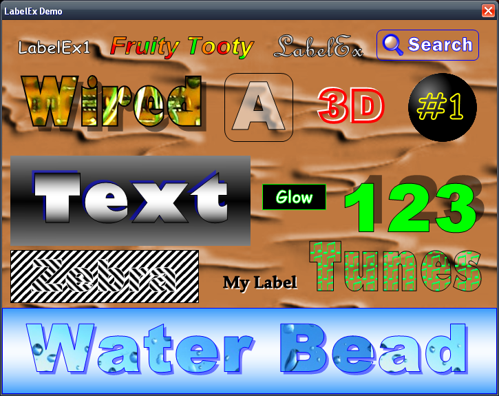

# Fancy Custom Label Class (LabelEx)
## Requires
- Visual Studio 2008
## License
- Apache License, Version 2.0
## Technologies
- Controls
- Graphics
- C#
- Visual Studio 2008
- Class Library
- Windows Forms
- .NET Framework 3.5 SP1
- themes
- custom controls
- .NET Framework
- Visual Basic .NET
- Visual basic
- Visual Basic.NET
- VB.Net
- Image manipulation
- Library
- C# Language
- Classes
- WinForms
- Graphics Functions
- vb2008
- Microsoft .NET Framework 3.5 SP1
- System.Drawing.Drawing2D
- other
- extended controls
- DLL file to use in VB
- Class Inheritance
## Topics
- Controls
- Graphics
- C#
- Class Library
- custom controls
- Windows Form Controls
- 2d graphics
- Visual Basic .NET
- Image manipulation
- DLL
- Drawing
- Paint
- Libraries
- Properties
- Classes
- Form controls
- Windows Forms Controls
- Graphics Functions
- System.Drawing.Drawing2D
- Transforms
- Design &amp; Implementation
## Updated
- 04/20/2015
## Description

<h1>Introduction</h1>

<em>If you would like to add some fancy looking text to your windows forms application then adding the LabelEx class to your application or Toolbox will help make it a snap. Designed to replace the plain look of a standard Label
 when you want a fancy look to match your applications theme. Here is just some idea of the looks you can get.</em>

<em> 
</em>

<h1>Building the Sample</h1>

<em>This was built using VS2008 on an x86 machine targeting .Net 3.5</em>

Description

The LabelEx class is a custom class that inherits &quot;Control&quot; so that i could start with a blank slate (so to say) and add the properties that i wanted it to have and make it look the way i wanted it to also. That involved a lot
 of Drawing and Drawing2D graphics needed to be used to draw the LabelEx control according to how the properties are set. 

 

 

&nbsp;You can add one to your project a few different ways and i will explain 2 of them. The first way is to simply add a class to your current windows form project. You can do that by following these steps.

<ol>
<li>Open or create your windows form project in VB.Net
</li><li>On the VB menu click on (<strong>Project</strong>) and then select (<strong>Add Class...</strong>)
</li><li>Name the class <strong>LabelEx</strong> and click (<strong>OK</strong>)
</li><li>Select and copy all the code shown below
</li><li>Select all the code in the new empty class and then paste the code in.
</li><li>Go to the VB menu and click (<strong>Build</strong>) and select (<strong>Build</strong>
<em>NameOfYourProject</em>) or (<strong>Build Solution</strong>) if your using C#.
</li></ol>

Now go to the Forms <strong>[Design]</strong> tab and you should see a control called
<strong>LabelEx</strong> in your Toolbox that you can drag onto your form and set its proprties just like any other control. The LabelEx control will only be available in the Toolbox for the project that you add one to. 

&nbsp;

&nbsp;The second way that i will explain is adding the
<strong>LabelEx</strong> control rite to the Toolbox so that you don`t need to add a class and the code to your project every time you want to use one on a different project.
It will always be in the toolbox so that you can drag one or more onto any project you have opened.

&nbsp;For this you will need to create a <strong>
Class Library</strong> project using the LabelEx class code below and build the dll file first, or you can download the LabelEx Demo Project which contains a Class Library project that i have already built the dll file for (Located in the Release folder). If
 you want to build a Class Library project and build the dll yourself you will see the note at the top of the code for adding References that you will need to follow. Ether way you do it you will need the .dll file so, make sure you have it ready. 

<ol>
<li>Go to the VB menu and click (<strong>Tools</strong>), then select (<strong>Choose Toolbox Items...</strong>)
</li><li>When the Dialog window opens click (<strong>Browse</strong>)
</li><li>Browse to the dll file you created or the one in the LabelEx Project`s Release folder and select it. Press (Ok). 
</li></ol>

&nbsp;Now the LabelEx control is added to your Toolbox so that you can drag one or more onto any project you want without the hassle of adding a class and the code to every project you would like to use one on.
 

&nbsp;

 
<strong>The LabelEx Class Code:
</strong><em> 
</em>

&nbsp;

Visual BasicC#

Edit|Remove

vbcsharp
<pre class="hidden">Imports System
Imports System.ComponentModel
Imports System.Drawing
Imports System.Drawing.Drawing2D
Imports System.Windows.Forms

Public Class LabelEx
    'Inherit the methods, properties, and events from the Control base class.
    Inherits Control

    'Add all of the Property Backing Feilds for the Properties added to the LabelEx class
    Private _OutLinePen As New Pen(Color.Black)
    Private _BorderPen As New Pen(Color.Black)
    Private _CenterBrush As New SolidBrush(Color.White)
    Private _BackgroundBrush As New SolidBrush(Color.Transparent)
    Private _BorderStyle As BorderType = BorderType.None
    Private _Image As Bitmap = Nothing
    Private _ImageAlign As ContentAlignment = ContentAlignment.MiddleCenter
    Private _TextAlign As ContentAlignment = ContentAlignment.MiddleCenter
    Private _TextPatternImage As Bitmap = Nothing
    Private _TextPatternImageLayout As PatternLayout = PatternLayout.Stretch
    Private _ShadowBrush As New SolidBrush(Color.FromArgb(128, Color.Black))
    Private _ShadowPen As New Pen(Color.FromArgb(128, Color.Black))
    Private _ShadowColor As Color = Color.Black
    Private _ShowTextShadow As Boolean = False
    Private _ShadowPosition As ShadowArea = ShadowArea.BottomRight
    Private _ShadowDepth As Integer = 2
    Private _ShadowTransparency As Integer = 128
    Private _ShadowStyle As ShadowDrawingType = ShadowDrawingType.FillShadow
    Private _ForeColorTransparency As Integer = 255
    Private _OutlineThickness As Integer = 1

    'Declare the Enums used for some of the special selections we want to use for some of the properties

    ''' &lt;summary&gt;Enum of BorderTypes used for the Labels BorderStyle.&lt;/summary&gt;
    Public Enum BorderType As Integer
        None = 0
        Squared = 1
        Rounded = 2
    End Enum

    ''' &lt;summary&gt;Enum of layout styles used for the Labels TextPaternImage.&lt;/summary&gt;
    Public Enum PatternLayout As Integer
        Normal = 0
        Center = 1
        Stretch = 2
        Tile = 3
    End Enum

    ''' &lt;summary&gt;Enum of areas used for the Labels ShadowPosition.&lt;/summary&gt;
    Public Enum ShadowArea As Integer
        TopLeft = 0
        TopRight = 1
        BottomLeft = 2
        BottomRight = 3
    End Enum

    ''' &lt;summary&gt;Enum of drawing types used for the Labels ShadowStyle.&lt;/summary&gt;
    Public Enum ShadowDrawingType As Integer
        DrawShadow = 0
        FillShadow = 1
    End Enum

    'In the constructor we set all the styles we want the LabelEx control to have when it is created.
    'We also set a few properties that we want the control to have set by default when a new instance is created.
    Public Sub New()
        Me.SetStyle(ControlStyles.OptimizedDoubleBuffer, True)
        Me.SetStyle(ControlStyles.UserPaint, True)
        Me.SetStyle(ControlStyles.ResizeRedraw, True)
        Me.SetStyle(ControlStyles.SupportsTransparentBackColor, True)
        Me.Font = New Font(&quot;Comic Sans MS&quot;, 18, FontStyle.Bold)
        Me.Size = New Size(130, 38)
        Me.ForeColor = Color.White
        Me.BackColor = Color.Transparent
    End Sub

    'Create all of the properties we want the control to have and Override the ones it already has if they need to be used for special reasons. 

    &lt;Category(&quot;Appearance&quot;), Description(&quot;The background color of the Label.&quot;)&gt; _
    &lt;Browsable(True), DefaultValue(GetType(Color), &quot;Transparent&quot;)&gt; _
    Public Overrides Property BackColor() As Color
        Get
            Return MyBase.BackColor
        End Get
        Set(ByVal value As Color)
            MyBase.BackColor = value
            _BackgroundBrush.Color = value
        End Set
    End Property

    &lt;Category(&quot;Appearance&quot;), Description(&quot;The center color of the text.&quot;)&gt; _
    &lt;Browsable(True), DefaultValue(GetType(Color), &quot;White&quot;)&gt; _
    Public Overrides Property ForeColor() As Color
        Get
            Return MyBase.ForeColor
        End Get
        Set(ByVal value As Color)
            MyBase.ForeColor = value
            If value = Color.Transparent Then _ForeColorTransparency = 0
            _CenterBrush.Color = Color.FromArgb(_ForeColorTransparency, value)
        End Set
    End Property

    &lt;Category(&quot;Appearance&quot;), Description(&quot;A value between 0 and 255 that sets the transparency of the ForeColor.&quot;)&gt; _
    &lt;Browsable(True), DefaultValue(255)&gt; _
    Public Property ForeColorTransparency() As Integer
        Get
            Return _ForeColorTransparency
        End Get
        Set(ByVal value As Integer)
            If value &gt; 255 Then value = 255
            If value &lt; 0 Or Me.ForeColor = Color.Transparent Then value = 0
            _ForeColorTransparency = value
            _CenterBrush.Color = Color.FromArgb(value, Me.ForeColor)
            Me.Refresh()
        End Set
    End Property

    &lt;Category(&quot;Appearance&quot;), Description(&quot;Aligns the text to the left, right, top, or bottom of the Label.&quot;)&gt; _
    &lt;Browsable(True), DefaultValue(GetType(ContentAlignment), &quot;MiddleCenter&quot;)&gt; _
    Public Property TextAlign() As ContentAlignment
        Get
            Return _TextAlign
        End Get
        Set(ByVal value As ContentAlignment)
            _TextAlign = value
            Me.Refresh()
        End Set
    End Property

    &lt;Category(&quot;Appearance&quot;), Description(&quot;The Image for the Label.&quot;)&gt; _
    &lt;Browsable(True)&gt; _
    Public Property Image() As Bitmap
        Get
            Return _Image
        End Get
        Set(ByVal value As Bitmap)
            _Image = value
            Me.Refresh()
        End Set
    End Property

    &lt;Category(&quot;Appearance&quot;), Description(&quot;Aligns the Image to the left, right, top, or bottom.&quot;)&gt; _
    &lt;Browsable(True), DefaultValue(GetType(ContentAlignment), &quot;MiddleCenter&quot;)&gt; _
    Public Property ImageAlign() As ContentAlignment
        Get
            Return _ImageAlign
        End Get
        Set(ByVal value As ContentAlignment)
            _ImageAlign = value
            Me.Refresh()
        End Set
    End Property

    &lt;Category(&quot;Appearance&quot;), Description(&quot;The outline color of the text.&quot;)&gt; _
    &lt;Browsable(True), DefaultValue(GetType(Color), &quot;Black&quot;)&gt; _
    Public Property OutlineColor() As Color
        Get
            Return _OutLinePen.Color
        End Get
        Set(ByVal value As Color)
            _OutLinePen.Color = value
            Me.Refresh()
        End Set
    End Property

    &lt;Category(&quot;Appearance&quot;), Description(&quot;The thickness of the text outline. Limited to a number between 1 and 10.&quot;)&gt; _
    &lt;Browsable(True), DefaultValue(1)&gt; _
    Public Property OutlineThickness() As Integer
        Get
            Return _OutlineThickness
        End Get
        Set(ByVal value As Integer)
            If value &lt; 1 Then value = 1 'Dont let the user set lower than 1
            If value &gt; 10 Then value = 10 'Dont let the user set higher than 10
            _OutlineThickness = value
            _OutLinePen.Width = value
            _ShadowPen.Width = value
            Me.Refresh()
        End Set
    End Property

    &lt;Category(&quot;Appearance&quot;), Description(&quot;The color of the Labels border.&quot;)&gt; _
    &lt;Browsable(True), DefaultValue(GetType(Color), &quot;Black&quot;)&gt; _
    Public Property BorderColor() As Color
        Get
            Return _BorderPen.Color
        End Get
        Set(ByVal value As Color)
            If value = Color.Transparent Then
                value = _BorderPen.Color 'Set it back to the prior color
                'Alert the user that Color.Transparent is not supported for this property
                Throw New Exception(&quot;The border color does not support the Transparent color&quot;)
            End If
            _BorderPen.Color = value
            Me.Refresh()
        End Set
    End Property

    &lt;Category(&quot;Appearance&quot;), Description(&quot;The style of the border around the Label.&quot;)&gt; _
    &lt;Browsable(True), DefaultValue(GetType(BorderType), &quot;None&quot;)&gt; _
    Public Property BorderStyle() As BorderType
        Get
            Return _BorderStyle
        End Get
        Set(ByVal value As BorderType)
            _BorderStyle = value
            Me.Refresh()
        End Set
    End Property

    &lt;Category(&quot;Appearance&quot;), Description(&quot;An image used as a fill pattern for the center of the text.&quot;)&gt; _
    &lt;Browsable(True)&gt; _
    Public Property TextPatternImage() As Bitmap
        Get
            Return _TextPatternImage
        End Get
        Set(ByVal value As Bitmap)
            _TextPatternImage = value
            Me.Refresh()
        End Set
    End Property

    &lt;Category(&quot;Appearance&quot;), Description(&quot;The layout of the pattern image inside the text.&quot;)&gt; _
    &lt;Browsable(True), DefaultValue(GetType(PatternLayout), &quot;Stretch&quot;)&gt; _
    Public Property TextPatternImageLayout() As PatternLayout
        Get
            Return _TextPatternImageLayout
        End Get
        Set(ByVal value As PatternLayout)
            _TextPatternImageLayout = value
            Me.Refresh()
        End Set
    End Property

    &lt;Category(&quot;Appearance&quot;), Description(&quot;Show a shadow behind the text.&quot;)&gt; _
    &lt;Browsable(True), DefaultValue(False)&gt; _
    Public Property ShowTextShadow() As Boolean
        Get
            Return _ShowTextShadow
        End Get
        Set(ByVal value As Boolean)
            _ShowTextShadow = value
            Me.Refresh()
        End Set
    End Property

    &lt;Category(&quot;Appearance&quot;), Description(&quot;The color of the shadow behind the text.&quot;)&gt; _
    &lt;Browsable(True), DefaultValue(GetType(Color), &quot;Black&quot;)&gt; _
    Public Property ShadowColor() As Color
        Get
            Return _ShadowColor
        End Get
        Set(ByVal value As Color)
            If value = Color.Transparent Then
                value = _ShadowBrush.Color 'Set it back to the prior color
                'Alert the user that Color.Transparent is not supported for this property
                Throw New Exception(&quot;The Shadow color does not support using Color.Transparent&quot;)
            End If
            _ShadowColor = value
            _ShadowBrush.Color = Color.FromArgb(_ShadowTransparency, value)
            _ShadowPen.Color = Color.FromArgb(_ShadowTransparency, value)
            Me.Refresh()
        End Set
    End Property

    &lt;Category(&quot;Appearance&quot;), Description(&quot;The position of the shadow behind the text.&quot;)&gt; _
    &lt;Browsable(True), DefaultValue(GetType(ShadowArea), &quot;BottomRight&quot;)&gt; _
    Public Property ShadowPosition() As ShadowArea
        Get
            Return _ShadowPosition
        End Get
        Set(ByVal value As ShadowArea)
            _ShadowPosition = value
            Me.Refresh()
        End Set
    End Property

    &lt;Category(&quot;Appearance&quot;), Description(&quot;A value between 1-10 that controls the depth of the shadow behind the text.&quot;)&gt; _
    &lt;Browsable(True), DefaultValue(2)&gt; _
    Public Property ShadowDepth() As Integer
        Get
            Return _ShadowDepth
        End Get
        Set(ByVal value As Integer)
            If value &lt; 1 Then value = 1 'Dont let user set this property lower than 1
            If value &gt; 10 Then value = 10 'Dont let user set this property higher than 10
            _ShadowDepth = value
            Me.Refresh()
        End Set
    End Property

    &lt;Category(&quot;Appearance&quot;), Description(&quot;A value between 0 and 255 that sets the transparency of the shadow.&quot;)&gt; _
    &lt;Browsable(True), DefaultValue(128)&gt; _
    Public Property ShadowTransparency() As Integer
        Get
            Return _ShadowTransparency
        End Get
        Set(ByVal value As Integer)
            If value &lt; 0 Then value = 0 'Dont let user set this property lower than 0
            If value &gt; 255 Then value = 255 'Dont let user set this property higher than 255
            _ShadowTransparency = value
            _ShadowBrush.Color = Color.FromArgb(value, _ShadowColor)
            _ShadowPen.Color = Color.FromArgb(value, _ShadowColor)
            Me.Refresh()
        End Set
    End Property

    &lt;Category(&quot;Appearance&quot;), Description(&quot;The style used to draw the shadow.&quot;)&gt; _
    &lt;Browsable(True), DefaultValue(GetType(ShadowDrawingType), &quot;FillShadow&quot;)&gt; _
    Public Property ShadowStyle() As ShadowDrawingType
        Get
            Return _ShadowStyle
        End Get
        Set(ByVal value As ShadowDrawingType)
            _ShadowStyle = value
            Me.Refresh()
        End Set
    End Property

    'Use the OnPaint overrides sub to paint the control to match how all the properties settings have been set by the user
    Protected Overrides Sub OnPaint(ByVal e As System.Windows.Forms.PaintEventArgs)
        With e.Graphics
            'Fill the background with the BackColor color
            .FillRectangle(_BackgroundBrush, New Rectangle(0, 0, Me.ClientSize.Width, Me.ClientSize.Height))

            'If the BackgroundImage property has been set to an image then draw the BackgroundImage
            If Me.BackgroundImage IsNot Nothing Then
                DrawBackImage(e.Graphics)
            End If

            'If the Image property has been set to an image then draw the image on the control
            If _Image IsNot Nothing Then
                .DrawImage(_Image, AlignImage(New Rectangle(0, 0, Me.Width - 1, Me.Height - 1)))
            End If

            'If the Text property has been assigned any text then draw the text on the control
            If Me.Text.Trim &lt;&gt; &quot;&quot; Then
                'Set the smothing mode of the graphics to make things look smother
                .TextRenderingHint = Drawing.Text.TextRenderingHint.AntiAlias
                .SmoothingMode = SmoothingMode.AntiAlias

                'The Drawing2D.GraphicsPath used for drawing and/or filling the text
                Using pth As New Drawing2D.GraphicsPath

                    'The StringFormat used to align the text in the Label
                    Using sf As New StringFormat
                        'Use (ta) which is an integer value of the ContentAlignment integer enum to set the
                        'Alignment of the text that will be added to the Drawing2D.GraphicsPath
                        Dim ta As ContentAlignment = Me.TextAlign
                        If ta &lt; 8 Then
                            sf.LineAlignment = StringAlignment.Near
                        ElseIf ta &lt; 128 Then
                            sf.LineAlignment = StringAlignment.Center
                            ta = CType(ta / 16, ContentAlignment)
                        Else
                            sf.LineAlignment = StringAlignment.Far
                            ta = CType(ta / 256, ContentAlignment)
                        End If
                        If ta = ContentAlignment.TopLeft Then
                            sf.Alignment = StringAlignment.Near
                        ElseIf ta = ContentAlignment.TopCenter Then
                            sf.Alignment = StringAlignment.Center
                        ElseIf ta = ContentAlignment.TopRight Then
                            sf.Alignment = StringAlignment.Far
                        End If
                        'Add the text to the Drawing2D.GraphicsPath using the StringFormat
                        pth.AddString(Me.Text, Me.Font.FontFamily, CInt(Me.Font.Style), CSng((.DpiY * Me.Font.Size) / 72), New Rectangle(Me.Padding.Left, Me.Padding.Top, (Me.ClientSize.Width - 1) - (Me.Padding.Left &#43; Me.Padding.Right), (Me.ClientSize.Height - 1) - (Me.Padding.Top &#43; Me.Padding.Bottom)), sf)
                    End Using

                    'If the ShowTextShadow property is set to true then draw the shadow
                    If _ShowTextShadow Then
                        'Use the ShadowPosition property to set the Graphics.TranslateTransform to draw the
                        'shadow at the correct offset position.
                        If _ShadowPosition = ShadowArea.TopLeft Then
                            .TranslateTransform(-_ShadowDepth, -_ShadowDepth)
                        ElseIf _ShadowPosition = ShadowArea.TopRight Then
                            .TranslateTransform(&#43;_ShadowDepth, -_ShadowDepth)
                        ElseIf _ShadowPosition = ShadowArea.BottomLeft Then
                            .TranslateTransform(-_ShadowDepth, &#43;_ShadowDepth)
                        Else
                            .TranslateTransform(&#43;_ShadowDepth, &#43;_ShadowDepth)
                        End If

                        If _ShadowStyle = ShadowDrawingType.DrawShadow Then
                            'Draw the Drawing2D.GraphicsPath with the _ShadowPen that is set to the ShadowColor having the ShadowTransparency
                            .DrawPath(_ShadowPen, pth) 'Draws the shadow
                        Else
                            'Fill the Drawing2D.GraphicsPath with the _ShadowBrush that is set to the ShadowColor having the ShadowTransparency
                            .FillPath(_ShadowBrush, pth) 'Draws the shadow
                        End If

                        'Now use the Graphics.TranslateTransform to shift the graphics back in the opposite
                        'direction before Drawing and Filling the Drawing2D.GraphicsPath again with text colors
                        If _ShadowPosition = ShadowArea.TopLeft Then
                            .TranslateTransform(&#43;(_ShadowDepth * 2), &#43;(_ShadowDepth * 2))
                        ElseIf _ShadowPosition = ShadowArea.TopRight Then
                            .TranslateTransform(-(_ShadowDepth * 2), &#43;(_ShadowDepth * 2))
                        ElseIf _ShadowPosition = ShadowArea.BottomLeft Then
                            .TranslateTransform(&#43;(_ShadowDepth * 2), -(_ShadowDepth * 2))
                        Else
                            .TranslateTransform(-(_ShadowDepth * 2), -(_ShadowDepth * 2))
                        End If
                    End If

                    'If the TextPatternImage property has been set to an image then fill the center of the text with the image
                    'else the center will be filled with a soloid color of the ForeColor property.
                    If _TextPatternImage IsNot Nothing Then
                        'Use the TextPatternImageLayout property to resize and/or position the TextPatternImage
                        Dim br As Rectangle = Nothing
                        If _TextPatternImageLayout = PatternLayout.Normal Or _TextPatternImageLayout = PatternLayout.Tile Then
                            br = New Rectangle(CInt(pth.GetBounds.X) &#43; 1, CInt(pth.GetBounds.Y &#43; 1), _TextPatternImage.Width &#43; 1, _TextPatternImage.Height &#43; 1)
                        ElseIf _TextPatternImageLayout = PatternLayout.Center Then
                            Dim xx As Integer = CInt((pth.GetBounds.X &#43; 1) &#43; ((pth.GetBounds.Width / 2) - (_TextPatternImage.Width / 2)))
                            Dim yy As Integer = CInt((pth.GetBounds.Y &#43; 1) &#43; ((pth.GetBounds.Height / 2) - (_TextPatternImage.Height / 2)))
                            br = New Rectangle(xx, yy, _TextPatternImage.Width &#43; 1, _TextPatternImage.Height &#43; 1)
                        ElseIf _TextPatternImageLayout = PatternLayout.Stretch Then
                            br = New Rectangle(CInt(pth.GetBounds.X) &#43; 1, CInt(pth.GetBounds.Y &#43; 1), CInt(pth.GetBounds.Width) &#43; 1, CInt(pth.GetBounds.Height) &#43; 1)
                        End If
                        Using patBmp As New Bitmap(_TextPatternImage, br.Width, br.Height)
                            'Use a TextureBrush with the TextPatternImage assigned as the texture image
                            Using tb As New TextureBrush(patBmp)
                                'If the TextPatternImageLayout property is not set to Tile then set the set the
                                'TextureBrush`s WrapMode to Clamp to stop it from tiling the image.
                                If Not _TextPatternImageLayout = PatternLayout.Tile Then tb.WrapMode = WrapMode.Clamp
                                tb.TranslateTransform(br.X, br.Y)
                                'Fill the GraphicsPath with the TextureBrush.
                                .FillPath(tb, pth)
                            End Using
                        End Using
                    Else
                        'Fill the GraphicsPath with a soloid color of the ForeColor property.
                        .FillPath(_CenterBrush, pth)
                    End If
                    'Draw the GraphicsPath with the OutlineColor.
                    .DrawPath(_OutLinePen, pth)
                End Using
            End If

            'If the BorderStyle property is other than None then call the DrawBorder sub to draw the border
            If _BorderStyle &lt;&gt; BorderType.None Then
                DrawLabelBorder(e.Graphics, New Rectangle(0, 0, Me.Width - 1, Me.Height - 1))
            End If
        End With
    End Sub

    'A private sub used to position, resize, and draw the BackgroundImage according to the BackgroundImageLayout
    Private Sub DrawBackImage(ByVal g As Graphics)
        If Me.BackgroundImageLayout = ImageLayout.None Then
            g.DrawImage(Me.BackgroundImage, 0, 0, Me.BackgroundImage.Width, Me.BackgroundImage.Height)
        ElseIf Me.BackgroundImageLayout = ImageLayout.Tile Then
            Dim tc As Integer = CInt(Math.Ceiling(Me.Width / Me.BackgroundImage.Width))
            Dim tr As Integer = CInt(Math.Ceiling(Me.Height / Me.BackgroundImage.Height))
            For y As Integer = 0 To tr - 1
                For x As Integer = 0 To tc - 1
                    g.DrawImage(Me.BackgroundImage, (x * Me.BackgroundImage.Width), (y * Me.BackgroundImage.Height), Me.BackgroundImage.Width, Me.BackgroundImage.Height)
                Next
            Next
        ElseIf Me.BackgroundImageLayout = ImageLayout.Center Then
            Dim xx As Integer = CInt((Me.Width / 2) - (Me.BackgroundImage.Width / 2))
            Dim yy As Integer = CInt((Me.Height / 2) - (Me.BackgroundImage.Height / 2))
            g.DrawImage(Me.BackgroundImage, xx, yy, Me.BackgroundImage.Width, Me.BackgroundImage.Height)
        ElseIf Me.BackgroundImageLayout = ImageLayout.Stretch Then
            g.DrawImage(Me.BackgroundImage, 0, 0, Me.Width, Me.Height)
        ElseIf Me.BackgroundImageLayout = ImageLayout.Zoom Then
            Dim meratio As Double = Me.Width / Me.Height
            Dim imgratio As Double = Me.BackgroundImage.Width / Me.BackgroundImage.Height
            Dim imgrect As New Rectangle(0, 0, Me.Width, Me.Height)
            If imgratio &gt; meratio Then
                imgrect.Width = Me.Width
                imgrect.Height = CInt(Me.Width / imgratio)
            ElseIf imgratio &lt; meratio Then
                imgrect.Height = Me.Height
                imgrect.Width = CInt(Me.Height * imgratio)
            End If
            imgrect.X = CInt((Me.Width / 2) - (imgrect.Width / 2))
            imgrect.Y = CInt((Me.Height / 2) - (imgrect.Height / 2))
            g.DrawImage(Me.BackgroundImage, imgrect)
        End If
    End Sub

    'A private sub used for drawing the Border part of the control
    Private Sub DrawLabelBorder(ByVal g As Graphics, ByVal rec As Rectangle)
        'If the ShowTextShadow property is true and the Text property is not an empty string then because of the
        'prior calls to the Graphics.TranslateTransform used for the shadow effect the Graphics must be shifted
        'back to its center position before drawing the border.
        If _ShowTextShadow And Me.Text.Trim &lt;&gt; &quot;&quot; Then
            If _ShadowPosition = ShadowArea.TopLeft Then
                g.TranslateTransform(-_ShadowDepth, -_ShadowDepth)
            ElseIf _ShadowPosition = ShadowArea.TopRight Then
                g.TranslateTransform(&#43;_ShadowDepth, -_ShadowDepth)
            ElseIf _ShadowPosition = ShadowArea.BottomLeft Then
                g.TranslateTransform(-_ShadowDepth, &#43;_ShadowDepth)
            Else
                g.TranslateTransform(&#43;_ShadowDepth, &#43;_ShadowDepth)
            End If
        End If

        'If the BorderStyle property is set to Rounded then draw the border with rounded corners
        'else just draw a Rectangle
        If Me.BorderStyle = BorderType.Rounded Then
            g.SmoothingMode = SmoothingMode.AntiAlias
            Using gp As New Drawing2D.GraphicsPath
                Dim rad As Integer = CInt(rec.Height / 3)
                If rec.Width &lt; rec.Height Then rad = CInt(rec.Width / 3)
                gp.AddArc(rec.X, rec.Y, rad, rad, 180, 90)
                gp.AddArc(rec.Right - (rad), rec.Y, rad, rad, 270, 90)
                gp.AddArc(rec.Right - (rad), rec.Bottom - (rad), rad, rad, 0, 90)
                gp.AddArc(rec.X, rec.Bottom - (rad), rad, rad, 90, 90)
                gp.CloseFigure()
                g.DrawPath(_BorderPen, gp)
            End Using
        Else
            g.DrawRectangle(_BorderPen, rec.X, rec.Y, rec.Width, rec.Height)
        End If
    End Sub

    'A private function used for calculating the rectagle area of the Label to draw the Image in
    Private Function AlignImage(ByVal Rect As Rectangle) As Rectangle
        'Use the value of the ContentAlignment assigned to the ImageAlign property to set the X and Y
        'values of the returned rectangle for the image.
        Dim xp, yp As Integer
        Dim ia As ContentAlignment = _ImageAlign
        If ia &lt; 8 Then
            yp = 0 &#43; Me.Padding.Top
        ElseIf ia &lt; 128 Then
            yp = CInt(Rect.Height / 2) - CInt(_Image.Height / 2)
            ia = CType(ia / 16, ContentAlignment)
        Else
            yp = Rect.Height - _Image.Height - Me.Padding.Bottom
            ia = CType(ia / 256, ContentAlignment)
        End If
        If ia = ContentAlignment.TopLeft Then
            xp = 0 &#43; Me.Padding.Left
        ElseIf ia = ContentAlignment.TopCenter Then
            xp = CInt(Rect.Width / 2) - CInt(_Image.Width / 2)
        ElseIf ia = ContentAlignment.TopRight Then
            xp = Rect.Width - _Image.Width - Me.Padding.Right
        End If
        Return New Rectangle(xp, yp, _Image.Width, _Image.Height)
    End Function

    'Need to use the OnTextChanged overrides sub to make the Label repaint itself when the text is changed
    Protected Overrides Sub OnTextChanged(ByVal e As System.EventArgs)
        Me.Refresh()
        MyBase.OnTextChanged(e)
    End Sub

    'Need to use the Dispose Overides sub to make sure all of the New brushes and pens created for the
    'property backing feilds are disposed.
    Protected Overrides Sub Dispose(ByVal disposing As Boolean)
        Me._BackgroundBrush.Dispose()
        Me._BorderPen.Dispose()
        Me._CenterBrush.Dispose()
        Me._OutLinePen.Dispose()
        Me._ShadowBrush.Dispose()
        Me._ShadowPen.Dispose()
        MyBase.Dispose(disposing)
    End Sub
End Class
</pre>
<pre class="hidden">using System;
using System.Collections.Generic;
using System.Linq;
using System.Text;
using System.Collections;
using System.Data;
using System.Diagnostics;
using System.ComponentModel;
//If you are using this code to build a Class Library Project instead of just adding it to a Form Project then you
//will need to add a reference to System.Drawing and System.Windows.Forms for the next three Imports. You can do
//that after you create the new Class Library by going to the VB menu and clicking (Project) and then selecting (Add Reference...).
//Then on the (.Net) tab you can find and select (System.Drawing) and (System.Windows.Forms) to add the references.
using System.Drawing;
using System.Drawing.Drawing2D;
using System.Windows.Forms;

namespace LabelEx
{
    public class LabelEx : Control
    {

        //Add all of the Property Backing Feilds for the Properties added to the LabelEx class
        private Pen _OutLinePen = new Pen(Color.Black);
        private Pen _BorderPen = new Pen(Color.Black);
        private SolidBrush _CenterBrush = new SolidBrush(Color.White);
        private SolidBrush _BackgroundBrush = new SolidBrush(Color.Transparent);
        private BorderType _BorderStyle = BorderType.None;
        private Bitmap _Image = null;
        private ContentAlignment _ImageAlign = ContentAlignment.MiddleCenter;
        private ContentAlignment _TextAlign = ContentAlignment.MiddleCenter;
        private Bitmap _TextPatternImage = null;
        private PatternLayout _TextPatternImageLayout = PatternLayout.Stretch;
        private SolidBrush _ShadowBrush = new SolidBrush(Color.FromArgb(128, Color.Black));
        private Pen _ShadowPen = new Pen(Color.FromArgb(128, Color.Black));
        private Color _ShadowColor = Color.Black;
        private bool _ShowTextShadow = false;
        private ShadowArea _ShadowPosition = ShadowArea.BottomRight;
        private int _ShadowDepth = 2;
        private int _ShadowTransparency = 128;
        private ShadowDrawingType _ShadowStyle = ShadowDrawingType.FillShadow;
        private int _ForeColorTransparency = 255;
        private int _OutlineThickness = 1;

        //Declare the Enums used for some of the special selections we want to use for some of the properties

        /// &lt;summary&gt;Enum of BorderTypes used for the Labels BorderStyle.&lt;/summary&gt;
        public enum BorderType : int
        {
            None = 0,
            Squared = 1,
            Rounded = 2
        }

        /// &lt;summary&gt;Enum of layout styles used for the Labels TextPaternImage.&lt;/summary&gt;
        public enum PatternLayout : int
        {
            Normal = 0,
            Center = 1,
            Stretch = 2,
            Tile = 3
        }

        /// &lt;summary&gt;Enum of areas used for the Labels ShadowPosition.&lt;/summary&gt;
        public enum ShadowArea : int
        {
            TopLeft = 0,
            TopRight = 1,
            BottomLeft = 2,
            BottomRight = 3
        }

        /// &lt;summary&gt;Enum of drawing types used for the Labels ShadowStyle.&lt;/summary&gt;
        public enum ShadowDrawingType : int
        {
            DrawShadow = 0,
            FillShadow = 1
        }

        //In the constructor we set all the styles we want the LabelEx control to have when it is created.
        //We also set a few properties that we want the control to have set by default when a new instance is created.
        public LabelEx()
        {
            this.SetStyle(ControlStyles.OptimizedDoubleBuffer, true);
            this.SetStyle(ControlStyles.UserPaint, true);
            this.SetStyle(ControlStyles.ResizeRedraw, true);
            this.SetStyle(ControlStyles.SupportsTransparentBackColor, true);
            this.Font = new Font(&quot;Comic Sans MS&quot;, 18, FontStyle.Bold);
            this.Size = new Size(130, 38);
            this.ForeColor = Color.White;
            this.BackColor = Color.Transparent;
        }

        //Create all of the properties we want the control to have and Override the ones it already has if they need to be used for special reasons. 

        [Category(&quot;Appearance&quot;), Description(&quot;The background color of the Label.&quot;)]
        [Browsable(true), DefaultValue(typeof(Color), &quot;Transparent&quot;)]
        public override Color BackColor
        {
            get { return base.BackColor; }
            set
            {
                base.BackColor = value;
                _BackgroundBrush.Color = value;
            }
        }

        [Category(&quot;Appearance&quot;), Description(&quot;The center color of the text.&quot;)]
        [Browsable(true), DefaultValue(typeof(Color), &quot;White&quot;)]
        public override Color ForeColor
        {
            get { return base.ForeColor; }
            set
            {
                base.ForeColor = value;
                if (value == Color.Transparent)
                    _ForeColorTransparency = 0;
                _CenterBrush.Color = Color.FromArgb(_ForeColorTransparency, value);
            }
        }

        [Category(&quot;Appearance&quot;), Description(&quot;A value between 0 and 255 that sets the transparency of the ForeColor.&quot;)]
        [Browsable(true), DefaultValue(255)]
        public int ForeColorTransparency
        {
            get { return _ForeColorTransparency; }
            set
            {
                if (value &gt; 255)
                    value = 255;
                if (value &lt; 0 | this.ForeColor == Color.Transparent)
                    value = 0;
                _ForeColorTransparency = value;
                _CenterBrush.Color = Color.FromArgb(value, this.ForeColor);
                this.Refresh();
            }
        }

        [Category(&quot;Appearance&quot;), Description(&quot;Aligns the text to the left, right, top, or bottom of the Label.&quot;)]
        [Browsable(true), DefaultValue(typeof(ContentAlignment), &quot;MiddleCenter&quot;)]
        public ContentAlignment TextAlign
        {
            get { return _TextAlign; }
            set
            {
                _TextAlign = value;
                this.Refresh();
            }
        }

        [Category(&quot;Appearance&quot;), Description(&quot;The Image for the Label.&quot;)]
        [Browsable(true)]
        public Bitmap Image
        {
            get { return _Image; }
            set
            {
                _Image = value;
                this.Refresh();
            }
        }

        [Category(&quot;Appearance&quot;), Description(&quot;Aligns the Image to the left, right, top, or bottom.&quot;)]
        [Browsable(true), DefaultValue(typeof(ContentAlignment), &quot;MiddleCenter&quot;)]
        public ContentAlignment ImageAlign
        {
            get { return _ImageAlign; }
            set
            {
                _ImageAlign = value;
                this.Refresh();
            }
        }

        [Category(&quot;Appearance&quot;), Description(&quot;The outline color of the text.&quot;)]
        [Browsable(true), DefaultValue(typeof(Color), &quot;Black&quot;)]
        public Color OutlineColor
        {
            get { return _OutLinePen.Color; }
            set
            {
                _OutLinePen.Color = value;
                this.Refresh();
            }
        }

        [Category(&quot;Appearance&quot;), Description(&quot;The thickness of the text outline. Limited to a number between 1 and 10.&quot;)]
        [Browsable(true), DefaultValue(1)]
        public int OutlineThickness
        {
            get { return _OutlineThickness; }
            set
            {
                if (value &lt; 1)
                    value = 1;
                //Dont let the user set lower than 1
                if (value &gt; 10)
                    value = 10;
                //Dont let the user set higher than 10
                _OutlineThickness = value;
                _OutLinePen.Width = value;
                _ShadowPen.Width = value;
                this.Refresh();
            }
        }

        [Category(&quot;Appearance&quot;), Description(&quot;The color of the Labels border.&quot;)]
        [Browsable(true), DefaultValue(typeof(Color), &quot;Black&quot;)]
        public Color BorderColor
        {
            get { return _BorderPen.Color; }
            set
            {
                if (value == Color.Transparent)
                {
                    value = _BorderPen.Color;
                    //Set it back to the prior color
                    //Alert the user that Color.Transparent is not supported for this property
                    throw new Exception(&quot;The border color does not support the Transparent color&quot;);
                }
                _BorderPen.Color = value;
                this.Refresh();
            }
        }

        [Category(&quot;Appearance&quot;), Description(&quot;The style of the border around the Label.&quot;)]
        [Browsable(true), DefaultValue(typeof(BorderType), &quot;None&quot;)]
        public BorderType BorderStyle
        {
            get { return _BorderStyle; }
            set
            {
                _BorderStyle = value;
                this.Refresh();
            }
        }

        [Category(&quot;Appearance&quot;), Description(&quot;An image used as a fill pattern for the center of the text.&quot;)]
        [Browsable(true)]
        public Bitmap TextPatternImage
        {
            get { return _TextPatternImage; }
            set
            {
                _TextPatternImage = value;
                this.Refresh();
            }
        }

        [Category(&quot;Appearance&quot;), Description(&quot;The layout of the pattern image inside the text.&quot;)]
        [Browsable(true), DefaultValue(typeof(PatternLayout), &quot;Stretch&quot;)]
        public PatternLayout TextPatternImageLayout
        {
            get { return _TextPatternImageLayout; }
            set
            {
                _TextPatternImageLayout = value;
                this.Refresh();
            }
        }

        [Category(&quot;Appearance&quot;), Description(&quot;Show a shadow behind the text.&quot;)]
        [Browsable(true), DefaultValue(false)]
        public bool ShowTextShadow
        {
            get { return _ShowTextShadow; }
            set
            {
                _ShowTextShadow = value;
                this.Refresh();
            }
        }

        [Category(&quot;Appearance&quot;), Description(&quot;The color of the shadow behind the text.&quot;)]
        [Browsable(true), DefaultValue(typeof(Color), &quot;Black&quot;)]
        public Color ShadowColor
        {
            get { return _ShadowColor; }
            set
            {
                if (value == Color.Transparent)
                {
                    value = _ShadowBrush.Color;
                    //Set it back to the prior color
                    //Alert the user that Color.Transparent is not supported for this property
                    throw new Exception(&quot;The Shadow color does not support using Color.Transparent&quot;);
                }
                _ShadowColor = value;
                _ShadowBrush.Color = Color.FromArgb(_ShadowTransparency, value);
                _ShadowPen.Color = Color.FromArgb(_ShadowTransparency, value);
                this.Refresh();
            }
        }

        [Category(&quot;Appearance&quot;), Description(&quot;The position of the shadow behind the text.&quot;)]
        [Browsable(true), DefaultValue(typeof(ShadowArea), &quot;BottomRight&quot;)]
        public ShadowArea ShadowPosition
        {
            get { return _ShadowPosition; }
            set
            {
                _ShadowPosition = value;
                this.Refresh();
            }
        }

        [Category(&quot;Appearance&quot;), Description(&quot;A value between 1-10 that controls the depth of the shadow behind the text.&quot;)]
        [Browsable(true), DefaultValue(2)]
        public int ShadowDepth
        {
            get { return _ShadowDepth; }
            set
            {
                if (value &lt; 1)
                    value = 1;
                //Dont let user set this property lower than 1
                if (value &gt; 10)
                    value = 10;
                //Dont let user set this property higher than 10
                _ShadowDepth = value;
                this.Refresh();
            }
        }

        [Category(&quot;Appearance&quot;), Description(&quot;A value between 0 and 255 that sets the transparency of the shadow.&quot;)]
        [Browsable(true), DefaultValue(128)]
        public int ShadowTransparency
        {
            get { return _ShadowTransparency; }
            set
            {
                if (value &lt; 0)
                    value = 0;
                //Dont let user set this property lower than 0
                if (value &gt; 255)
                    value = 255;
                //Dont let user set this property higher than 255
                _ShadowTransparency = value;
                _ShadowBrush.Color = Color.FromArgb(value, _ShadowColor);
                _ShadowPen.Color = Color.FromArgb(value, _ShadowColor);
                this.Refresh();
            }
        }

        [Category(&quot;Appearance&quot;), Description(&quot;The style used to draw the shadow.&quot;)]
        [Browsable(true), DefaultValue(typeof(ShadowDrawingType), &quot;FillShadow&quot;)]
        public ShadowDrawingType ShadowStyle
        {
            get { return _ShadowStyle; }
            set
            {
                _ShadowStyle = value;
                this.Refresh();
            }
        }

        //Use the OnPaint overrides sub to paint the control to match how all the properties settings have been set by the user
        protected override void OnPaint(System.Windows.Forms.PaintEventArgs e)
        {
            var _with1 = e.Graphics;
            //Fill the background with the BackColor color
            _with1.FillRectangle(_BackgroundBrush, new Rectangle(0, 0, this.ClientSize.Width, this.ClientSize.Height));

            //If the BackgroundImage property has been set to an image then draw the BackgroundImage
            if (this.BackgroundImage != null)
            {
                DrawBackImage(e.Graphics);
            }

            //If the Image property has been set to an image then draw the image on the control
            if (_Image != null)
            {
                _with1.DrawImage(_Image, AlignImage(new Rectangle(0, 0, this.Width - 1, this.Height - 1)));
            }

            //If the Text property has bet assigned any text then draw the text on the control
            if (!string.IsNullOrEmpty(this.Text))
            {
                //Set the smothing mode of the graphics to make things look smother
                //_with1.TextRenderingHint = Drawing.Text.TextRenderingHint.AntiAlias;
                _with1.SmoothingMode = SmoothingMode.AntiAlias;

                //The Drawing2D.GraphicsPath used for drawing and/or filling the text
                using (GraphicsPath pth = new GraphicsPath())
                {

                    //The StringFormat used to align the text in the Label
                    using (StringFormat sf = new StringFormat())
                    {
                        //Use (ta) which is an integer value of the ContentAlignment integer enum to set the
                        //Alignment of the text that will be added to the Drawing2D.GraphicsPath
                        int ta = Convert.ToInt32(_TextAlign);
                        if (ta &lt; 8)
                        {
                            sf.LineAlignment = StringAlignment.Near;
                        }
                        else if (ta &lt; 128)
                        {
                            sf.LineAlignment = StringAlignment.Center;
                            ta = ta / 16;
                        }
                        else
                        {
                            sf.LineAlignment = StringAlignment.Far;
                            ta = ta / 256;
                        }
                        if (ta == Convert.ToInt32(ContentAlignment.TopLeft))
                        {
                            sf.Alignment = StringAlignment.Near;
                        }
                        else if (ta == Convert.ToInt32(ContentAlignment.TopCenter))
                        {
                            sf.Alignment = StringAlignment.Center;
                        }
                        else if (ta == Convert.ToInt32(ContentAlignment.TopRight))
                        {
                            sf.Alignment = StringAlignment.Far;
                        }
                        //Add the text to the Drawing2D.GraphicsPath using the StringFormat
                        pth.AddString(this.Text, this.Font.FontFamily, Convert.ToInt32(this.Font.Style), Convert.ToSingle((_with1.DpiY * this.Font.Size) / 72), new Rectangle(this.Padding.Left, this.Padding.Top, (this.ClientSize.Width - 1) - (this.Padding.Left &#43; this.Padding.Right), (this.ClientSize.Height - 1) - (this.Padding.Top &#43; this.Padding.Bottom)), sf);
                    }

                    //If the ShowTextShadow property is set to true then draw the shadow
                    if (_ShowTextShadow)
                    {
                        //Use the ShadowPosition property to set the Graphics.TranslateTransform to draw the
                        //shadow at the correct offset position.
                        if (_ShadowPosition == ShadowArea.TopLeft)
                        {
                            _with1.TranslateTransform(-_ShadowDepth, -_ShadowDepth);
                        }
                        else if (_ShadowPosition == ShadowArea.TopRight)
                        {
                            _with1.TranslateTransform(&#43;_ShadowDepth, -_ShadowDepth);
                        }
                        else if (_ShadowPosition == ShadowArea.BottomLeft)
                        {
                            _with1.TranslateTransform(-_ShadowDepth, &#43;_ShadowDepth);
                        }
                        else
                        {
                            _with1.TranslateTransform(&#43;_ShadowDepth, &#43;_ShadowDepth);
                        }

                        if (_ShadowStyle == ShadowDrawingType.DrawShadow)
                        {
                            //Draw the Drawing2D.GraphicsPath with the _ShadowPen that is set to the ShadowColor having the ShadowTransparency
                            _with1.DrawPath(_ShadowPen, pth);
                            //Draws the shadow
                        }
                        else
                        {
                            //Fill the Drawing2D.GraphicsPath with the _ShadowBrush that is set to the ShadowColor having the ShadowTransparency
                            _with1.FillPath(_ShadowBrush, pth);
                            //Draws the shadow
                        }

                        //Now use the Graphics.TranslateTransform to shift the graphics back in the opposite
                        //direction before Drawing and Filling the Drawing2D.GraphicsPath again with text colors
                        if (_ShadowPosition == ShadowArea.TopLeft)
                        {
                            _with1.TranslateTransform(&#43;(_ShadowDepth * 2), &#43;(_ShadowDepth * 2));
                        }
                        else if (_ShadowPosition == ShadowArea.TopRight)
                        {
                            _with1.TranslateTransform(-(_ShadowDepth * 2), &#43;(_ShadowDepth * 2));
                        }
                        else if (_ShadowPosition == ShadowArea.BottomLeft)
                        {
                            _with1.TranslateTransform(&#43;(_ShadowDepth * 2), -(_ShadowDepth * 2));
                        }
                        else
                        {
                            _with1.TranslateTransform(-(_ShadowDepth * 2), -(_ShadowDepth * 2));
                        }
                    }

                    //If the TextPatternImage property has been set to an image then fill the center of the text with the image
                    //else the center will be filled with a soloid color of the ForeColor property.
                    if (_TextPatternImage != null)
                    {
                        //Use the TextPatternImageLayout property to resize and/or position the TextPatternImage
                        Rectangle br = new Rectangle();
                        RectangleF r = pth.GetBounds();
                        if (_TextPatternImageLayout == PatternLayout.Normal | _TextPatternImageLayout == PatternLayout.Tile)
                        {
                            br = new Rectangle(Convert.ToInt32(r.X) &#43; 1, Convert.ToInt32(r.Y &#43; 1), _TextPatternImage.Width &#43; 1, _TextPatternImage.Height &#43; 1);
                        }
                        else if (_TextPatternImageLayout == PatternLayout.Center)
                        {
                            int xx = Convert.ToInt32((r.X &#43; 1) &#43; ((r.Width / 2) - (_TextPatternImage.Width / 2)));
                            int yy = Convert.ToInt32((r.Y &#43; 1) &#43; ((r.Height / 2) - (_TextPatternImage.Height / 2)));
                            br = new Rectangle(xx, yy, _TextPatternImage.Width &#43; 1, _TextPatternImage.Height &#43; 1);
                        }
                        else if (_TextPatternImageLayout == PatternLayout.Stretch)
                        {
                            br = new Rectangle(Convert.ToInt32(r.X) &#43; 1, Convert.ToInt32(r.Y &#43; 1), Convert.ToInt32(r.Width) &#43; 1, Convert.ToInt32(r.Height) &#43; 1);
                        }
                        using (Bitmap patBmp = new Bitmap(_TextPatternImage, br.Width, br.Height))
                        {
                            //Use a TextureBrush with the TextPatternImage assigned as the texture image
                            using (TextureBrush tb = new TextureBrush(patBmp))
                            {
                                //If the TextPatternImageLayout property is not set to Tile then set the set the
                                //TextureBrush`s WrapMode to Clamp to stop it from tiling the image.
                                if (!(_TextPatternImageLayout == PatternLayout.Tile))
                                    tb.WrapMode = WrapMode.Clamp;
                                tb.TranslateTransform(br.X, br.Y);
                                //Fill the GraphicsPath with the TextureBrush.
                                _with1.FillPath(tb, pth);
                            }
                        }
                    }
                    else
                    {
                        //Fill the GraphicsPath with a soloid color of the ForeColor property.
                        _with1.FillPath(_CenterBrush, pth);
                    }
                    //Draw the GraphicsPath with the OutlineColor.
                    _with1.DrawPath(_OutLinePen, pth);
                }
            }

            //If the BorderStyle property is other than None then call the DrawBorder sub to draw the border
            if (_BorderStyle != BorderType.None)
            {
                DrawLabelBorder(e.Graphics, new Rectangle(0, 0, this.Width - 1, this.Height - 1));
            }
        }

        //A private sub used to position, resize, and draw the BackgroundImage according to the BackgroundImageLayout
        private void DrawBackImage(Graphics g)
        {
            if (this.BackgroundImageLayout == ImageLayout.None)
            {
                g.DrawImage(this.BackgroundImage, 0, 0, this.BackgroundImage.Width, this.BackgroundImage.Height);
            }
            else if (this.BackgroundImageLayout == ImageLayout.Tile)
            {
                int tc = Convert.ToInt32(Math.Ceiling(Convert.ToDouble(this.Width / this.BackgroundImage.Width)));
                int tr = Convert.ToInt32(Math.Ceiling(Convert.ToDouble(this.Height / this.BackgroundImage.Height)));
                for (int y = 0; y &lt;= tr; y&#43;&#43;)
                {
                    for (int x = 0; x &lt;= tc; x&#43;&#43;)
                    {
                        g.DrawImage(this.BackgroundImage, (x * this.BackgroundImage.Width), (y * this.BackgroundImage.Height), this.BackgroundImage.Width, this.BackgroundImage.Height);
                    }
                }
            }
            else if (this.BackgroundImageLayout == ImageLayout.Center)
            {
                int xx = Convert.ToInt32((this.Width / 2) - (this.BackgroundImage.Width / 2));
                int yy = Convert.ToInt32((this.Height / 2) - (this.BackgroundImage.Height / 2));
                g.DrawImage(this.BackgroundImage, xx, yy, this.BackgroundImage.Width, this.BackgroundImage.Height);
            }
            else if (this.BackgroundImageLayout == ImageLayout.Stretch)
            {
                g.DrawImage(this.BackgroundImage, 0, 0, this.Width, this.Height);
            }
            else if (this.BackgroundImageLayout == ImageLayout.Zoom)
            {
                double meratio = this.Width / this.Height;
                double imgratio = this.BackgroundImage.Width / this.BackgroundImage.Height;
                Rectangle imgrect = new Rectangle(0, 0, this.Width, this.Height);
                if (imgratio &gt; meratio)
                {
                    imgrect.Width = this.Width;
                    imgrect.Height = Convert.ToInt32(this.Width / imgratio);
                }
                else if (imgratio &lt; meratio)
                {
                    imgrect.Height = this.Height;
                    imgrect.Width = Convert.ToInt32(this.Height * imgratio);
                }
                imgrect.X = Convert.ToInt32((this.Width / 2) - (imgrect.Width / 2));
                imgrect.Y = Convert.ToInt32((this.Height / 2) - (imgrect.Height / 2));
                g.DrawImage(this.BackgroundImage, imgrect);
            }
        }

        //A private sub used for drawing the Border part of the control
        private void DrawLabelBorder(Graphics g, Rectangle rec)
        {
            //If the ShowTextShadow property is true and the Text property is not an empty string then because of the
            //prior calls to the Graphics.TranslateTransform used for the shadow effect the Graphics must be shifted
            //back to its center position before drawing the border.
            if (_ShowTextShadow &amp; !string.IsNullOrEmpty(this.Text))
            {
                if (_ShadowPosition == ShadowArea.TopLeft)
                {
                    g.TranslateTransform(-_ShadowDepth, -_ShadowDepth);
                }
                else if (_ShadowPosition == ShadowArea.TopRight)
                {
                    g.TranslateTransform(&#43;_ShadowDepth, -_ShadowDepth);
                }
                else if (_ShadowPosition == ShadowArea.BottomLeft)
                {
                    g.TranslateTransform(-_ShadowDepth, &#43;_ShadowDepth);
                }
                else
                {
                    g.TranslateTransform(&#43;_ShadowDepth, &#43;_ShadowDepth);
                }
            }

            //If the BorderStyle property is set to Rounded then draw the border with rounded corners
            //else just draw a Rectangle
            if (_BorderStyle == BorderType.Rounded)
            {
                g.SmoothingMode = SmoothingMode.AntiAlias;
                using (GraphicsPath gp = new GraphicsPath())
                {
                    int rad = Convert.ToInt32(rec.Height / 3);
                    if (rec.Width &lt; rec.Height)
                        rad = Convert.ToInt32(rec.Width / 3);
                    gp.AddArc(rec.X, rec.Y, rad, rad, 180, 90);
                    gp.AddArc(rec.Right - (rad), rec.Y, rad, rad, 270, 90);
                    gp.AddArc(rec.Right - (rad), rec.Bottom - (rad), rad, rad, 0, 90);
                    gp.AddArc(rec.X, rec.Bottom - (rad), rad, rad, 90, 90);
                    gp.CloseFigure();
                    g.DrawPath(_BorderPen, gp);
                }
            }
            else
            {
                g.DrawRectangle(_BorderPen, rec.X, rec.Y, rec.Width, rec.Height);
            }
        }

        //A private function used for calculating the rectagle area of the Label to draw the Image in
        private Rectangle AlignImage(Rectangle Rect)
        {
            //Use the value of the ContentAlignment assigned to the ImageAlign property to set the X and Y
            //values of the returned rectangle for the image.
            int xp = 0;
            int yp = 0;
            int ia = Convert.ToInt32(_ImageAlign);
            if (ia &lt; 8)
            {
                yp = 0 &#43; this.Padding.Top;
            }
            else if (ia &lt; 128)
            {
                yp = Convert.ToInt32(Rect.Height / 2) - Convert.ToInt32(_Image.Height / 2);
                ia = ia / 16;
            }
            else
            {
                yp = Rect.Height - _Image.Height - this.Padding.Bottom;
                ia = ia / 256;
            }
            if (ia == Convert.ToInt32(ContentAlignment.TopLeft))
            {
                xp = 0 &#43; this.Padding.Left;
            }
            else if (ia == Convert.ToInt32(ContentAlignment.TopCenter))
            {
                xp = Convert.ToInt32(Rect.Width / 2) - Convert.ToInt32(_Image.Width / 2);
            }
            else if (ia == Convert.ToInt32(ContentAlignment.TopRight))
            {
                xp = Rect.Width - _Image.Width - this.Padding.Right;
            }
            return new Rectangle(xp, yp, _Image.Width, _Image.Height);
        }

        //Need to use the OnTextChanged overrides sub to make the Label repaint itself when the text is changed
        protected override void OnTextChanged(System.EventArgs e)
        {
            this.Refresh();
            base.OnTextChanged(e);
        }

        //Need to use the Dispose Overides sub to make sure all of the New brushes and pens created for the
        //property backing feilds are disposed.
        protected override void Dispose(bool disposing)
        {
            this._BackgroundBrush.Dispose();
            this._BorderPen.Dispose();
            this._CenterBrush.Dispose();
            this._OutLinePen.Dispose();
            this._ShadowBrush.Dispose();
            this._ShadowPen.Dispose();
            base.Dispose(disposing);
        }
    }
}
</pre>

<pre class="vb">Imports&nbsp;System&nbsp;
Imports&nbsp;System.ComponentModel&nbsp;
Imports&nbsp;System.Drawing&nbsp;
Imports&nbsp;System.Drawing.Drawing2D&nbsp;
Imports&nbsp;System.Windows.Forms&nbsp;
&nbsp;
Public&nbsp;Class&nbsp;LabelEx&nbsp;
&nbsp;&nbsp;&nbsp;&nbsp;'Inherit&nbsp;the&nbsp;methods,&nbsp;properties,&nbsp;and&nbsp;events&nbsp;from&nbsp;the&nbsp;Control&nbsp;base&nbsp;class.&nbsp;
&nbsp;&nbsp;&nbsp;&nbsp;Inherits&nbsp;Control&nbsp;
&nbsp;
&nbsp;&nbsp;&nbsp;&nbsp;'Add&nbsp;all&nbsp;of&nbsp;the&nbsp;Property&nbsp;Backing&nbsp;Feilds&nbsp;for&nbsp;the&nbsp;Properties&nbsp;added&nbsp;to&nbsp;the&nbsp;LabelEx&nbsp;class&nbsp;
&nbsp;&nbsp;&nbsp;&nbsp;Private&nbsp;_OutLinePen&nbsp;As&nbsp;New&nbsp;Pen(Color.Black)&nbsp;
&nbsp;&nbsp;&nbsp;&nbsp;Private&nbsp;_BorderPen&nbsp;As&nbsp;New&nbsp;Pen(Color.Black)&nbsp;
&nbsp;&nbsp;&nbsp;&nbsp;Private&nbsp;_CenterBrush&nbsp;As&nbsp;New&nbsp;SolidBrush(Color.White)&nbsp;
&nbsp;&nbsp;&nbsp;&nbsp;Private&nbsp;_BackgroundBrush&nbsp;As&nbsp;New&nbsp;SolidBrush(Color.Transparent)&nbsp;
&nbsp;&nbsp;&nbsp;&nbsp;Private&nbsp;_BorderStyle&nbsp;As&nbsp;BorderType&nbsp;=&nbsp;BorderType.None&nbsp;
&nbsp;&nbsp;&nbsp;&nbsp;Private&nbsp;_Image&nbsp;As&nbsp;Bitmap&nbsp;=&nbsp;Nothing&nbsp;
&nbsp;&nbsp;&nbsp;&nbsp;Private&nbsp;_ImageAlign&nbsp;As&nbsp;ContentAlignment&nbsp;=&nbsp;ContentAlignment.MiddleCenter&nbsp;
&nbsp;&nbsp;&nbsp;&nbsp;Private&nbsp;_TextAlign&nbsp;As&nbsp;ContentAlignment&nbsp;=&nbsp;ContentAlignment.MiddleCenter&nbsp;
&nbsp;&nbsp;&nbsp;&nbsp;Private&nbsp;_TextPatternImage&nbsp;As&nbsp;Bitmap&nbsp;=&nbsp;Nothing&nbsp;
&nbsp;&nbsp;&nbsp;&nbsp;Private&nbsp;_TextPatternImageLayout&nbsp;As&nbsp;PatternLayout&nbsp;=&nbsp;PatternLayout.Stretch&nbsp;
&nbsp;&nbsp;&nbsp;&nbsp;Private&nbsp;_ShadowBrush&nbsp;As&nbsp;New&nbsp;SolidBrush(Color.FromArgb(128,&nbsp;Color.Black))&nbsp;
&nbsp;&nbsp;&nbsp;&nbsp;Private&nbsp;_ShadowPen&nbsp;As&nbsp;New&nbsp;Pen(Color.FromArgb(128,&nbsp;Color.Black))&nbsp;
&nbsp;&nbsp;&nbsp;&nbsp;Private&nbsp;_ShadowColor&nbsp;As&nbsp;Color&nbsp;=&nbsp;Color.Black&nbsp;
&nbsp;&nbsp;&nbsp;&nbsp;Private&nbsp;_ShowTextShadow&nbsp;As&nbsp;Boolean&nbsp;=&nbsp;False&nbsp;
&nbsp;&nbsp;&nbsp;&nbsp;Private&nbsp;_ShadowPosition&nbsp;As&nbsp;ShadowArea&nbsp;=&nbsp;ShadowArea.BottomRight&nbsp;
&nbsp;&nbsp;&nbsp;&nbsp;Private&nbsp;_ShadowDepth&nbsp;As&nbsp;Integer&nbsp;=&nbsp;2&nbsp;
&nbsp;&nbsp;&nbsp;&nbsp;Private&nbsp;_ShadowTransparency&nbsp;As&nbsp;Integer&nbsp;=&nbsp;128&nbsp;
&nbsp;&nbsp;&nbsp;&nbsp;Private&nbsp;_ShadowStyle&nbsp;As&nbsp;ShadowDrawingType&nbsp;=&nbsp;ShadowDrawingType.FillShadow&nbsp;
&nbsp;&nbsp;&nbsp;&nbsp;Private&nbsp;_ForeColorTransparency&nbsp;As&nbsp;Integer&nbsp;=&nbsp;255&nbsp;
&nbsp;&nbsp;&nbsp;&nbsp;Private&nbsp;_OutlineThickness&nbsp;As&nbsp;Integer&nbsp;=&nbsp;1&nbsp;
&nbsp;
&nbsp;&nbsp;&nbsp;&nbsp;'Declare&nbsp;the&nbsp;Enums&nbsp;used&nbsp;for&nbsp;some&nbsp;of&nbsp;the&nbsp;special&nbsp;selections&nbsp;we&nbsp;want&nbsp;to&nbsp;use&nbsp;for&nbsp;some&nbsp;of&nbsp;the&nbsp;properties&nbsp;
&nbsp;
&nbsp;&nbsp;&nbsp;&nbsp;'''&nbsp;&lt;summary&gt;Enum&nbsp;of&nbsp;BorderTypes&nbsp;used&nbsp;for&nbsp;the&nbsp;Labels&nbsp;BorderStyle.&lt;/summary&gt;&nbsp;
&nbsp;&nbsp;&nbsp;&nbsp;Public&nbsp;Enum&nbsp;BorderType&nbsp;As&nbsp;Integer&nbsp;
&nbsp;&nbsp;&nbsp;&nbsp;&nbsp;&nbsp;&nbsp;&nbsp;None&nbsp;=&nbsp;0&nbsp;
&nbsp;&nbsp;&nbsp;&nbsp;&nbsp;&nbsp;&nbsp;&nbsp;Squared&nbsp;=&nbsp;1&nbsp;
&nbsp;&nbsp;&nbsp;&nbsp;&nbsp;&nbsp;&nbsp;&nbsp;Rounded&nbsp;=&nbsp;2&nbsp;
&nbsp;&nbsp;&nbsp;&nbsp;End&nbsp;Enum&nbsp;
&nbsp;
&nbsp;&nbsp;&nbsp;&nbsp;'''&nbsp;&lt;summary&gt;Enum&nbsp;of&nbsp;layout&nbsp;styles&nbsp;used&nbsp;for&nbsp;the&nbsp;Labels&nbsp;TextPaternImage.&lt;/summary&gt;&nbsp;
&nbsp;&nbsp;&nbsp;&nbsp;Public&nbsp;Enum&nbsp;PatternLayout&nbsp;As&nbsp;Integer&nbsp;
&nbsp;&nbsp;&nbsp;&nbsp;&nbsp;&nbsp;&nbsp;&nbsp;Normal&nbsp;=&nbsp;0&nbsp;
&nbsp;&nbsp;&nbsp;&nbsp;&nbsp;&nbsp;&nbsp;&nbsp;Center&nbsp;=&nbsp;1&nbsp;
&nbsp;&nbsp;&nbsp;&nbsp;&nbsp;&nbsp;&nbsp;&nbsp;Stretch&nbsp;=&nbsp;2&nbsp;
&nbsp;&nbsp;&nbsp;&nbsp;&nbsp;&nbsp;&nbsp;&nbsp;Tile&nbsp;=&nbsp;3&nbsp;
&nbsp;&nbsp;&nbsp;&nbsp;End&nbsp;Enum&nbsp;
&nbsp;
&nbsp;&nbsp;&nbsp;&nbsp;'''&nbsp;&lt;summary&gt;Enum&nbsp;of&nbsp;areas&nbsp;used&nbsp;for&nbsp;the&nbsp;Labels&nbsp;ShadowPosition.&lt;/summary&gt;&nbsp;
&nbsp;&nbsp;&nbsp;&nbsp;Public&nbsp;Enum&nbsp;ShadowArea&nbsp;As&nbsp;Integer&nbsp;
&nbsp;&nbsp;&nbsp;&nbsp;&nbsp;&nbsp;&nbsp;&nbsp;TopLeft&nbsp;=&nbsp;0&nbsp;
&nbsp;&nbsp;&nbsp;&nbsp;&nbsp;&nbsp;&nbsp;&nbsp;TopRight&nbsp;=&nbsp;1&nbsp;
&nbsp;&nbsp;&nbsp;&nbsp;&nbsp;&nbsp;&nbsp;&nbsp;BottomLeft&nbsp;=&nbsp;2&nbsp;
&nbsp;&nbsp;&nbsp;&nbsp;&nbsp;&nbsp;&nbsp;&nbsp;BottomRight&nbsp;=&nbsp;3&nbsp;
&nbsp;&nbsp;&nbsp;&nbsp;End&nbsp;Enum&nbsp;
&nbsp;
&nbsp;&nbsp;&nbsp;&nbsp;'''&nbsp;&lt;summary&gt;Enum&nbsp;of&nbsp;drawing&nbsp;types&nbsp;used&nbsp;for&nbsp;the&nbsp;Labels&nbsp;ShadowStyle.&lt;/summary&gt;&nbsp;
&nbsp;&nbsp;&nbsp;&nbsp;Public&nbsp;Enum&nbsp;ShadowDrawingType&nbsp;As&nbsp;Integer&nbsp;
&nbsp;&nbsp;&nbsp;&nbsp;&nbsp;&nbsp;&nbsp;&nbsp;DrawShadow&nbsp;=&nbsp;0&nbsp;
&nbsp;&nbsp;&nbsp;&nbsp;&nbsp;&nbsp;&nbsp;&nbsp;FillShadow&nbsp;=&nbsp;1&nbsp;
&nbsp;&nbsp;&nbsp;&nbsp;End&nbsp;Enum&nbsp;
&nbsp;
&nbsp;&nbsp;&nbsp;&nbsp;'In&nbsp;the&nbsp;constructor&nbsp;we&nbsp;set&nbsp;all&nbsp;the&nbsp;styles&nbsp;we&nbsp;want&nbsp;the&nbsp;LabelEx&nbsp;control&nbsp;to&nbsp;have&nbsp;when&nbsp;it&nbsp;is&nbsp;created.&nbsp;
&nbsp;&nbsp;&nbsp;&nbsp;'We&nbsp;also&nbsp;set&nbsp;a&nbsp;few&nbsp;properties&nbsp;that&nbsp;we&nbsp;want&nbsp;the&nbsp;control&nbsp;to&nbsp;have&nbsp;set&nbsp;by&nbsp;default&nbsp;when&nbsp;a&nbsp;new&nbsp;instance&nbsp;is&nbsp;created.&nbsp;
&nbsp;&nbsp;&nbsp;&nbsp;Public&nbsp;Sub&nbsp;New()&nbsp;
&nbsp;&nbsp;&nbsp;&nbsp;&nbsp;&nbsp;&nbsp;&nbsp;Me.SetStyle(ControlStyles.OptimizedDoubleBuffer,&nbsp;True)&nbsp;
&nbsp;&nbsp;&nbsp;&nbsp;&nbsp;&nbsp;&nbsp;&nbsp;Me.SetStyle(ControlStyles.UserPaint,&nbsp;True)&nbsp;
&nbsp;&nbsp;&nbsp;&nbsp;&nbsp;&nbsp;&nbsp;&nbsp;Me.SetStyle(ControlStyles.ResizeRedraw,&nbsp;True)&nbsp;
&nbsp;&nbsp;&nbsp;&nbsp;&nbsp;&nbsp;&nbsp;&nbsp;Me.SetStyle(ControlStyles.SupportsTransparentBackColor,&nbsp;True)&nbsp;
&nbsp;&nbsp;&nbsp;&nbsp;&nbsp;&nbsp;&nbsp;&nbsp;Me.Font&nbsp;=&nbsp;New&nbsp;Font(&quot;Comic&nbsp;Sans&nbsp;MS&quot;,&nbsp;18,&nbsp;FontStyle.Bold)&nbsp;
&nbsp;&nbsp;&nbsp;&nbsp;&nbsp;&nbsp;&nbsp;&nbsp;Me.Size&nbsp;=&nbsp;New&nbsp;Size(130,&nbsp;38)&nbsp;
&nbsp;&nbsp;&nbsp;&nbsp;&nbsp;&nbsp;&nbsp;&nbsp;Me.ForeColor&nbsp;=&nbsp;Color.White&nbsp;
&nbsp;&nbsp;&nbsp;&nbsp;&nbsp;&nbsp;&nbsp;&nbsp;Me.BackColor&nbsp;=&nbsp;Color.Transparent&nbsp;
&nbsp;&nbsp;&nbsp;&nbsp;End&nbsp;Sub&nbsp;
&nbsp;
&nbsp;&nbsp;&nbsp;&nbsp;'Create&nbsp;all&nbsp;of&nbsp;the&nbsp;properties&nbsp;we&nbsp;want&nbsp;the&nbsp;control&nbsp;to&nbsp;have&nbsp;and&nbsp;Override&nbsp;the&nbsp;ones&nbsp;it&nbsp;already&nbsp;has&nbsp;if&nbsp;they&nbsp;need&nbsp;to&nbsp;be&nbsp;used&nbsp;for&nbsp;special&nbsp;reasons.&nbsp;&nbsp;
&nbsp;
&nbsp;&nbsp;&nbsp;&nbsp;&lt;Category(&quot;Appearance&quot;),&nbsp;Description(&quot;The&nbsp;background&nbsp;color&nbsp;of&nbsp;the&nbsp;Label.&quot;)&gt;&nbsp;_&nbsp;
&nbsp;&nbsp;&nbsp;&nbsp;&lt;Browsable(True),&nbsp;DefaultValue(GetType(Color),&nbsp;&quot;Transparent&quot;)&gt;&nbsp;_&nbsp;
&nbsp;&nbsp;&nbsp;&nbsp;Public&nbsp;Overrides&nbsp;Property&nbsp;BackColor()&nbsp;As&nbsp;Color&nbsp;
&nbsp;&nbsp;&nbsp;&nbsp;&nbsp;&nbsp;&nbsp;&nbsp;Get&nbsp;
&nbsp;&nbsp;&nbsp;&nbsp;&nbsp;&nbsp;&nbsp;&nbsp;&nbsp;&nbsp;&nbsp;&nbsp;Return&nbsp;MyBase.BackColor&nbsp;
&nbsp;&nbsp;&nbsp;&nbsp;&nbsp;&nbsp;&nbsp;&nbsp;End&nbsp;Get&nbsp;
&nbsp;&nbsp;&nbsp;&nbsp;&nbsp;&nbsp;&nbsp;&nbsp;Set(ByVal&nbsp;value&nbsp;As&nbsp;Color)&nbsp;
&nbsp;&nbsp;&nbsp;&nbsp;&nbsp;&nbsp;&nbsp;&nbsp;&nbsp;&nbsp;&nbsp;&nbsp;MyBase.BackColor&nbsp;=&nbsp;value&nbsp;
&nbsp;&nbsp;&nbsp;&nbsp;&nbsp;&nbsp;&nbsp;&nbsp;&nbsp;&nbsp;&nbsp;&nbsp;_BackgroundBrush.Color&nbsp;=&nbsp;value&nbsp;
&nbsp;&nbsp;&nbsp;&nbsp;&nbsp;&nbsp;&nbsp;&nbsp;End&nbsp;Set&nbsp;
&nbsp;&nbsp;&nbsp;&nbsp;End&nbsp;Property&nbsp;
&nbsp;
&nbsp;&nbsp;&nbsp;&nbsp;&lt;Category(&quot;Appearance&quot;),&nbsp;Description(&quot;The&nbsp;center&nbsp;color&nbsp;of&nbsp;the&nbsp;text.&quot;)&gt;&nbsp;_&nbsp;
&nbsp;&nbsp;&nbsp;&nbsp;&lt;Browsable(True),&nbsp;DefaultValue(GetType(Color),&nbsp;&quot;White&quot;)&gt;&nbsp;_&nbsp;
&nbsp;&nbsp;&nbsp;&nbsp;Public&nbsp;Overrides&nbsp;Property&nbsp;ForeColor()&nbsp;As&nbsp;Color&nbsp;
&nbsp;&nbsp;&nbsp;&nbsp;&nbsp;&nbsp;&nbsp;&nbsp;Get&nbsp;
&nbsp;&nbsp;&nbsp;&nbsp;&nbsp;&nbsp;&nbsp;&nbsp;&nbsp;&nbsp;&nbsp;&nbsp;Return&nbsp;MyBase.ForeColor&nbsp;
&nbsp;&nbsp;&nbsp;&nbsp;&nbsp;&nbsp;&nbsp;&nbsp;End&nbsp;Get&nbsp;
&nbsp;&nbsp;&nbsp;&nbsp;&nbsp;&nbsp;&nbsp;&nbsp;Set(ByVal&nbsp;value&nbsp;As&nbsp;Color)&nbsp;
&nbsp;&nbsp;&nbsp;&nbsp;&nbsp;&nbsp;&nbsp;&nbsp;&nbsp;&nbsp;&nbsp;&nbsp;MyBase.ForeColor&nbsp;=&nbsp;value&nbsp;
&nbsp;&nbsp;&nbsp;&nbsp;&nbsp;&nbsp;&nbsp;&nbsp;&nbsp;&nbsp;&nbsp;&nbsp;If&nbsp;value&nbsp;=&nbsp;Color.Transparent&nbsp;Then&nbsp;_ForeColorTransparency&nbsp;=&nbsp;0&nbsp;
&nbsp;&nbsp;&nbsp;&nbsp;&nbsp;&nbsp;&nbsp;&nbsp;&nbsp;&nbsp;&nbsp;&nbsp;_CenterBrush.Color&nbsp;=&nbsp;Color.FromArgb(_ForeColorTransparency,&nbsp;value)&nbsp;
&nbsp;&nbsp;&nbsp;&nbsp;&nbsp;&nbsp;&nbsp;&nbsp;End&nbsp;Set&nbsp;
&nbsp;&nbsp;&nbsp;&nbsp;End&nbsp;Property&nbsp;
&nbsp;
&nbsp;&nbsp;&nbsp;&nbsp;&lt;Category(&quot;Appearance&quot;),&nbsp;Description(&quot;A&nbsp;value&nbsp;between&nbsp;0&nbsp;and&nbsp;255&nbsp;that&nbsp;sets&nbsp;the&nbsp;transparency&nbsp;of&nbsp;the&nbsp;ForeColor.&quot;)&gt;&nbsp;_&nbsp;
&nbsp;&nbsp;&nbsp;&nbsp;&lt;Browsable(True),&nbsp;DefaultValue(255)&gt;&nbsp;_&nbsp;
&nbsp;&nbsp;&nbsp;&nbsp;Public&nbsp;Property&nbsp;ForeColorTransparency()&nbsp;As&nbsp;Integer&nbsp;
&nbsp;&nbsp;&nbsp;&nbsp;&nbsp;&nbsp;&nbsp;&nbsp;Get&nbsp;
&nbsp;&nbsp;&nbsp;&nbsp;&nbsp;&nbsp;&nbsp;&nbsp;&nbsp;&nbsp;&nbsp;&nbsp;Return&nbsp;_ForeColorTransparency&nbsp;
&nbsp;&nbsp;&nbsp;&nbsp;&nbsp;&nbsp;&nbsp;&nbsp;End&nbsp;Get&nbsp;
&nbsp;&nbsp;&nbsp;&nbsp;&nbsp;&nbsp;&nbsp;&nbsp;Set(ByVal&nbsp;value&nbsp;As&nbsp;Integer)&nbsp;
&nbsp;&nbsp;&nbsp;&nbsp;&nbsp;&nbsp;&nbsp;&nbsp;&nbsp;&nbsp;&nbsp;&nbsp;If&nbsp;value&nbsp;&gt;&nbsp;255&nbsp;Then&nbsp;value&nbsp;=&nbsp;255&nbsp;
&nbsp;&nbsp;&nbsp;&nbsp;&nbsp;&nbsp;&nbsp;&nbsp;&nbsp;&nbsp;&nbsp;&nbsp;If&nbsp;value&nbsp;&lt;&nbsp;0&nbsp;Or&nbsp;Me.ForeColor&nbsp;=&nbsp;Color.Transparent&nbsp;Then&nbsp;value&nbsp;=&nbsp;0&nbsp;
&nbsp;&nbsp;&nbsp;&nbsp;&nbsp;&nbsp;&nbsp;&nbsp;&nbsp;&nbsp;&nbsp;&nbsp;_ForeColorTransparency&nbsp;=&nbsp;value&nbsp;
&nbsp;&nbsp;&nbsp;&nbsp;&nbsp;&nbsp;&nbsp;&nbsp;&nbsp;&nbsp;&nbsp;&nbsp;_CenterBrush.Color&nbsp;=&nbsp;Color.FromArgb(value,&nbsp;Me.ForeColor)&nbsp;
&nbsp;&nbsp;&nbsp;&nbsp;&nbsp;&nbsp;&nbsp;&nbsp;&nbsp;&nbsp;&nbsp;&nbsp;Me.Refresh()&nbsp;
&nbsp;&nbsp;&nbsp;&nbsp;&nbsp;&nbsp;&nbsp;&nbsp;End&nbsp;Set&nbsp;
&nbsp;&nbsp;&nbsp;&nbsp;End&nbsp;Property&nbsp;
&nbsp;
&nbsp;&nbsp;&nbsp;&nbsp;&lt;Category(&quot;Appearance&quot;),&nbsp;Description(&quot;Aligns&nbsp;the&nbsp;text&nbsp;to&nbsp;the&nbsp;left,&nbsp;right,&nbsp;top,&nbsp;or&nbsp;bottom&nbsp;of&nbsp;the&nbsp;Label.&quot;)&gt;&nbsp;_&nbsp;
&nbsp;&nbsp;&nbsp;&nbsp;&lt;Browsable(True),&nbsp;DefaultValue(GetType(ContentAlignment),&nbsp;&quot;MiddleCenter&quot;)&gt;&nbsp;_&nbsp;
&nbsp;&nbsp;&nbsp;&nbsp;Public&nbsp;Property&nbsp;TextAlign()&nbsp;As&nbsp;ContentAlignment&nbsp;
&nbsp;&nbsp;&nbsp;&nbsp;&nbsp;&nbsp;&nbsp;&nbsp;Get&nbsp;
&nbsp;&nbsp;&nbsp;&nbsp;&nbsp;&nbsp;&nbsp;&nbsp;&nbsp;&nbsp;&nbsp;&nbsp;Return&nbsp;_TextAlign&nbsp;
&nbsp;&nbsp;&nbsp;&nbsp;&nbsp;&nbsp;&nbsp;&nbsp;End&nbsp;Get&nbsp;
&nbsp;&nbsp;&nbsp;&nbsp;&nbsp;&nbsp;&nbsp;&nbsp;Set(ByVal&nbsp;value&nbsp;As&nbsp;ContentAlignment)&nbsp;
&nbsp;&nbsp;&nbsp;&nbsp;&nbsp;&nbsp;&nbsp;&nbsp;&nbsp;&nbsp;&nbsp;&nbsp;_TextAlign&nbsp;=&nbsp;value&nbsp;
&nbsp;&nbsp;&nbsp;&nbsp;&nbsp;&nbsp;&nbsp;&nbsp;&nbsp;&nbsp;&nbsp;&nbsp;Me.Refresh()&nbsp;
&nbsp;&nbsp;&nbsp;&nbsp;&nbsp;&nbsp;&nbsp;&nbsp;End&nbsp;Set&nbsp;
&nbsp;&nbsp;&nbsp;&nbsp;End&nbsp;Property&nbsp;
&nbsp;
&nbsp;&nbsp;&nbsp;&nbsp;&lt;Category(&quot;Appearance&quot;),&nbsp;Description(&quot;The&nbsp;Image&nbsp;for&nbsp;the&nbsp;Label.&quot;)&gt;&nbsp;_&nbsp;
&nbsp;&nbsp;&nbsp;&nbsp;&lt;Browsable(True)&gt;&nbsp;_&nbsp;
&nbsp;&nbsp;&nbsp;&nbsp;Public&nbsp;Property&nbsp;Image()&nbsp;As&nbsp;Bitmap&nbsp;
&nbsp;&nbsp;&nbsp;&nbsp;&nbsp;&nbsp;&nbsp;&nbsp;Get&nbsp;
&nbsp;&nbsp;&nbsp;&nbsp;&nbsp;&nbsp;&nbsp;&nbsp;&nbsp;&nbsp;&nbsp;&nbsp;Return&nbsp;_Image&nbsp;
&nbsp;&nbsp;&nbsp;&nbsp;&nbsp;&nbsp;&nbsp;&nbsp;End&nbsp;Get&nbsp;
&nbsp;&nbsp;&nbsp;&nbsp;&nbsp;&nbsp;&nbsp;&nbsp;Set(ByVal&nbsp;value&nbsp;As&nbsp;Bitmap)&nbsp;
&nbsp;&nbsp;&nbsp;&nbsp;&nbsp;&nbsp;&nbsp;&nbsp;&nbsp;&nbsp;&nbsp;&nbsp;_Image&nbsp;=&nbsp;value&nbsp;
&nbsp;&nbsp;&nbsp;&nbsp;&nbsp;&nbsp;&nbsp;&nbsp;&nbsp;&nbsp;&nbsp;&nbsp;Me.Refresh()&nbsp;
&nbsp;&nbsp;&nbsp;&nbsp;&nbsp;&nbsp;&nbsp;&nbsp;End&nbsp;Set&nbsp;
&nbsp;&nbsp;&nbsp;&nbsp;End&nbsp;Property&nbsp;
&nbsp;
&nbsp;&nbsp;&nbsp;&nbsp;&lt;Category(&quot;Appearance&quot;),&nbsp;Description(&quot;Aligns&nbsp;the&nbsp;Image&nbsp;to&nbsp;the&nbsp;left,&nbsp;right,&nbsp;top,&nbsp;or&nbsp;bottom.&quot;)&gt;&nbsp;_&nbsp;
&nbsp;&nbsp;&nbsp;&nbsp;&lt;Browsable(True),&nbsp;DefaultValue(GetType(ContentAlignment),&nbsp;&quot;MiddleCenter&quot;)&gt;&nbsp;_&nbsp;
&nbsp;&nbsp;&nbsp;&nbsp;Public&nbsp;Property&nbsp;ImageAlign()&nbsp;As&nbsp;ContentAlignment&nbsp;
&nbsp;&nbsp;&nbsp;&nbsp;&nbsp;&nbsp;&nbsp;&nbsp;Get&nbsp;
&nbsp;&nbsp;&nbsp;&nbsp;&nbsp;&nbsp;&nbsp;&nbsp;&nbsp;&nbsp;&nbsp;&nbsp;Return&nbsp;_ImageAlign&nbsp;
&nbsp;&nbsp;&nbsp;&nbsp;&nbsp;&nbsp;&nbsp;&nbsp;End&nbsp;Get&nbsp;
&nbsp;&nbsp;&nbsp;&nbsp;&nbsp;&nbsp;&nbsp;&nbsp;Set(ByVal&nbsp;value&nbsp;As&nbsp;ContentAlignment)&nbsp;
&nbsp;&nbsp;&nbsp;&nbsp;&nbsp;&nbsp;&nbsp;&nbsp;&nbsp;&nbsp;&nbsp;&nbsp;_ImageAlign&nbsp;=&nbsp;value&nbsp;
&nbsp;&nbsp;&nbsp;&nbsp;&nbsp;&nbsp;&nbsp;&nbsp;&nbsp;&nbsp;&nbsp;&nbsp;Me.Refresh()&nbsp;
&nbsp;&nbsp;&nbsp;&nbsp;&nbsp;&nbsp;&nbsp;&nbsp;End&nbsp;Set&nbsp;
&nbsp;&nbsp;&nbsp;&nbsp;End&nbsp;Property&nbsp;
&nbsp;
&nbsp;&nbsp;&nbsp;&nbsp;&lt;Category(&quot;Appearance&quot;),&nbsp;Description(&quot;The&nbsp;outline&nbsp;color&nbsp;of&nbsp;the&nbsp;text.&quot;)&gt;&nbsp;_&nbsp;
&nbsp;&nbsp;&nbsp;&nbsp;&lt;Browsable(True),&nbsp;DefaultValue(GetType(Color),&nbsp;&quot;Black&quot;)&gt;&nbsp;_&nbsp;
&nbsp;&nbsp;&nbsp;&nbsp;Public&nbsp;Property&nbsp;OutlineColor()&nbsp;As&nbsp;Color&nbsp;
&nbsp;&nbsp;&nbsp;&nbsp;&nbsp;&nbsp;&nbsp;&nbsp;Get&nbsp;
&nbsp;&nbsp;&nbsp;&nbsp;&nbsp;&nbsp;&nbsp;&nbsp;&nbsp;&nbsp;&nbsp;&nbsp;Return&nbsp;_OutLinePen.Color&nbsp;
&nbsp;&nbsp;&nbsp;&nbsp;&nbsp;&nbsp;&nbsp;&nbsp;End&nbsp;Get&nbsp;
&nbsp;&nbsp;&nbsp;&nbsp;&nbsp;&nbsp;&nbsp;&nbsp;Set(ByVal&nbsp;value&nbsp;As&nbsp;Color)&nbsp;
&nbsp;&nbsp;&nbsp;&nbsp;&nbsp;&nbsp;&nbsp;&nbsp;&nbsp;&nbsp;&nbsp;&nbsp;_OutLinePen.Color&nbsp;=&nbsp;value&nbsp;
&nbsp;&nbsp;&nbsp;&nbsp;&nbsp;&nbsp;&nbsp;&nbsp;&nbsp;&nbsp;&nbsp;&nbsp;Me.Refresh()&nbsp;
&nbsp;&nbsp;&nbsp;&nbsp;&nbsp;&nbsp;&nbsp;&nbsp;End&nbsp;Set&nbsp;
&nbsp;&nbsp;&nbsp;&nbsp;End&nbsp;Property&nbsp;
&nbsp;
&nbsp;&nbsp;&nbsp;&nbsp;&lt;Category(&quot;Appearance&quot;),&nbsp;Description(&quot;The&nbsp;thickness&nbsp;of&nbsp;the&nbsp;text&nbsp;outline.&nbsp;Limited&nbsp;to&nbsp;a&nbsp;number&nbsp;between&nbsp;1&nbsp;and&nbsp;10.&quot;)&gt;&nbsp;_&nbsp;
&nbsp;&nbsp;&nbsp;&nbsp;&lt;Browsable(True),&nbsp;DefaultValue(1)&gt;&nbsp;_&nbsp;
&nbsp;&nbsp;&nbsp;&nbsp;Public&nbsp;Property&nbsp;OutlineThickness()&nbsp;As&nbsp;Integer&nbsp;
&nbsp;&nbsp;&nbsp;&nbsp;&nbsp;&nbsp;&nbsp;&nbsp;Get&nbsp;
&nbsp;&nbsp;&nbsp;&nbsp;&nbsp;&nbsp;&nbsp;&nbsp;&nbsp;&nbsp;&nbsp;&nbsp;Return&nbsp;_OutlineThickness&nbsp;
&nbsp;&nbsp;&nbsp;&nbsp;&nbsp;&nbsp;&nbsp;&nbsp;End&nbsp;Get&nbsp;
&nbsp;&nbsp;&nbsp;&nbsp;&nbsp;&nbsp;&nbsp;&nbsp;Set(ByVal&nbsp;value&nbsp;As&nbsp;Integer)&nbsp;
&nbsp;&nbsp;&nbsp;&nbsp;&nbsp;&nbsp;&nbsp;&nbsp;&nbsp;&nbsp;&nbsp;&nbsp;If&nbsp;value&nbsp;&lt;&nbsp;1&nbsp;Then&nbsp;value&nbsp;=&nbsp;1&nbsp;'Dont&nbsp;let&nbsp;the&nbsp;user&nbsp;set&nbsp;lower&nbsp;than&nbsp;1&nbsp;
&nbsp;&nbsp;&nbsp;&nbsp;&nbsp;&nbsp;&nbsp;&nbsp;&nbsp;&nbsp;&nbsp;&nbsp;If&nbsp;value&nbsp;&gt;&nbsp;10&nbsp;Then&nbsp;value&nbsp;=&nbsp;10&nbsp;'Dont&nbsp;let&nbsp;the&nbsp;user&nbsp;set&nbsp;higher&nbsp;than&nbsp;10&nbsp;
&nbsp;&nbsp;&nbsp;&nbsp;&nbsp;&nbsp;&nbsp;&nbsp;&nbsp;&nbsp;&nbsp;&nbsp;_OutlineThickness&nbsp;=&nbsp;value&nbsp;
&nbsp;&nbsp;&nbsp;&nbsp;&nbsp;&nbsp;&nbsp;&nbsp;&nbsp;&nbsp;&nbsp;&nbsp;_OutLinePen.Width&nbsp;=&nbsp;value&nbsp;
&nbsp;&nbsp;&nbsp;&nbsp;&nbsp;&nbsp;&nbsp;&nbsp;&nbsp;&nbsp;&nbsp;&nbsp;_ShadowPen.Width&nbsp;=&nbsp;value&nbsp;
&nbsp;&nbsp;&nbsp;&nbsp;&nbsp;&nbsp;&nbsp;&nbsp;&nbsp;&nbsp;&nbsp;&nbsp;Me.Refresh()&nbsp;
&nbsp;&nbsp;&nbsp;&nbsp;&nbsp;&nbsp;&nbsp;&nbsp;End&nbsp;Set&nbsp;
&nbsp;&nbsp;&nbsp;&nbsp;End&nbsp;Property&nbsp;
&nbsp;
&nbsp;&nbsp;&nbsp;&nbsp;&lt;Category(&quot;Appearance&quot;),&nbsp;Description(&quot;The&nbsp;color&nbsp;of&nbsp;the&nbsp;Labels&nbsp;border.&quot;)&gt;&nbsp;_&nbsp;
&nbsp;&nbsp;&nbsp;&nbsp;&lt;Browsable(True),&nbsp;DefaultValue(GetType(Color),&nbsp;&quot;Black&quot;)&gt;&nbsp;_&nbsp;
&nbsp;&nbsp;&nbsp;&nbsp;Public&nbsp;Property&nbsp;BorderColor()&nbsp;As&nbsp;Color&nbsp;
&nbsp;&nbsp;&nbsp;&nbsp;&nbsp;&nbsp;&nbsp;&nbsp;Get&nbsp;
&nbsp;&nbsp;&nbsp;&nbsp;&nbsp;&nbsp;&nbsp;&nbsp;&nbsp;&nbsp;&nbsp;&nbsp;Return&nbsp;_BorderPen.Color&nbsp;
&nbsp;&nbsp;&nbsp;&nbsp;&nbsp;&nbsp;&nbsp;&nbsp;End&nbsp;Get&nbsp;
&nbsp;&nbsp;&nbsp;&nbsp;&nbsp;&nbsp;&nbsp;&nbsp;Set(ByVal&nbsp;value&nbsp;As&nbsp;Color)&nbsp;
&nbsp;&nbsp;&nbsp;&nbsp;&nbsp;&nbsp;&nbsp;&nbsp;&nbsp;&nbsp;&nbsp;&nbsp;If&nbsp;value&nbsp;=&nbsp;Color.Transparent&nbsp;Then&nbsp;
&nbsp;&nbsp;&nbsp;&nbsp;&nbsp;&nbsp;&nbsp;&nbsp;&nbsp;&nbsp;&nbsp;&nbsp;&nbsp;&nbsp;&nbsp;&nbsp;value&nbsp;=&nbsp;_BorderPen.Color&nbsp;'Set&nbsp;it&nbsp;back&nbsp;to&nbsp;the&nbsp;prior&nbsp;color&nbsp;
&nbsp;&nbsp;&nbsp;&nbsp;&nbsp;&nbsp;&nbsp;&nbsp;&nbsp;&nbsp;&nbsp;&nbsp;&nbsp;&nbsp;&nbsp;&nbsp;'Alert&nbsp;the&nbsp;user&nbsp;that&nbsp;Color.Transparent&nbsp;is&nbsp;not&nbsp;supported&nbsp;for&nbsp;this&nbsp;property&nbsp;
&nbsp;&nbsp;&nbsp;&nbsp;&nbsp;&nbsp;&nbsp;&nbsp;&nbsp;&nbsp;&nbsp;&nbsp;&nbsp;&nbsp;&nbsp;&nbsp;Throw&nbsp;New&nbsp;Exception(&quot;The&nbsp;border&nbsp;color&nbsp;does&nbsp;not&nbsp;support&nbsp;the&nbsp;Transparent&nbsp;color&quot;)&nbsp;
&nbsp;&nbsp;&nbsp;&nbsp;&nbsp;&nbsp;&nbsp;&nbsp;&nbsp;&nbsp;&nbsp;&nbsp;End&nbsp;If&nbsp;
&nbsp;&nbsp;&nbsp;&nbsp;&nbsp;&nbsp;&nbsp;&nbsp;&nbsp;&nbsp;&nbsp;&nbsp;_BorderPen.Color&nbsp;=&nbsp;value&nbsp;
&nbsp;&nbsp;&nbsp;&nbsp;&nbsp;&nbsp;&nbsp;&nbsp;&nbsp;&nbsp;&nbsp;&nbsp;Me.Refresh()&nbsp;
&nbsp;&nbsp;&nbsp;&nbsp;&nbsp;&nbsp;&nbsp;&nbsp;End&nbsp;Set&nbsp;
&nbsp;&nbsp;&nbsp;&nbsp;End&nbsp;Property&nbsp;
&nbsp;
&nbsp;&nbsp;&nbsp;&nbsp;&lt;Category(&quot;Appearance&quot;),&nbsp;Description(&quot;The&nbsp;style&nbsp;of&nbsp;the&nbsp;border&nbsp;around&nbsp;the&nbsp;Label.&quot;)&gt;&nbsp;_&nbsp;
&nbsp;&nbsp;&nbsp;&nbsp;&lt;Browsable(True),&nbsp;DefaultValue(GetType(BorderType),&nbsp;&quot;None&quot;)&gt;&nbsp;_&nbsp;
&nbsp;&nbsp;&nbsp;&nbsp;Public&nbsp;Property&nbsp;BorderStyle()&nbsp;As&nbsp;BorderType&nbsp;
&nbsp;&nbsp;&nbsp;&nbsp;&nbsp;&nbsp;&nbsp;&nbsp;Get&nbsp;
&nbsp;&nbsp;&nbsp;&nbsp;&nbsp;&nbsp;&nbsp;&nbsp;&nbsp;&nbsp;&nbsp;&nbsp;Return&nbsp;_BorderStyle&nbsp;
&nbsp;&nbsp;&nbsp;&nbsp;&nbsp;&nbsp;&nbsp;&nbsp;End&nbsp;Get&nbsp;
&nbsp;&nbsp;&nbsp;&nbsp;&nbsp;&nbsp;&nbsp;&nbsp;Set(ByVal&nbsp;value&nbsp;As&nbsp;BorderType)&nbsp;
&nbsp;&nbsp;&nbsp;&nbsp;&nbsp;&nbsp;&nbsp;&nbsp;&nbsp;&nbsp;&nbsp;&nbsp;_BorderStyle&nbsp;=&nbsp;value&nbsp;
&nbsp;&nbsp;&nbsp;&nbsp;&nbsp;&nbsp;&nbsp;&nbsp;&nbsp;&nbsp;&nbsp;&nbsp;Me.Refresh()&nbsp;
&nbsp;&nbsp;&nbsp;&nbsp;&nbsp;&nbsp;&nbsp;&nbsp;End&nbsp;Set&nbsp;
&nbsp;&nbsp;&nbsp;&nbsp;End&nbsp;Property&nbsp;
&nbsp;
&nbsp;&nbsp;&nbsp;&nbsp;&lt;Category(&quot;Appearance&quot;),&nbsp;Description(&quot;An&nbsp;image&nbsp;used&nbsp;as&nbsp;a&nbsp;fill&nbsp;pattern&nbsp;for&nbsp;the&nbsp;center&nbsp;of&nbsp;the&nbsp;text.&quot;)&gt;&nbsp;_&nbsp;
&nbsp;&nbsp;&nbsp;&nbsp;&lt;Browsable(True)&gt;&nbsp;_&nbsp;
&nbsp;&nbsp;&nbsp;&nbsp;Public&nbsp;Property&nbsp;TextPatternImage()&nbsp;As&nbsp;Bitmap&nbsp;
&nbsp;&nbsp;&nbsp;&nbsp;&nbsp;&nbsp;&nbsp;&nbsp;Get&nbsp;
&nbsp;&nbsp;&nbsp;&nbsp;&nbsp;&nbsp;&nbsp;&nbsp;&nbsp;&nbsp;&nbsp;&nbsp;Return&nbsp;_TextPatternImage&nbsp;
&nbsp;&nbsp;&nbsp;&nbsp;&nbsp;&nbsp;&nbsp;&nbsp;End&nbsp;Get&nbsp;
&nbsp;&nbsp;&nbsp;&nbsp;&nbsp;&nbsp;&nbsp;&nbsp;Set(ByVal&nbsp;value&nbsp;As&nbsp;Bitmap)&nbsp;
&nbsp;&nbsp;&nbsp;&nbsp;&nbsp;&nbsp;&nbsp;&nbsp;&nbsp;&nbsp;&nbsp;&nbsp;_TextPatternImage&nbsp;=&nbsp;value&nbsp;
&nbsp;&nbsp;&nbsp;&nbsp;&nbsp;&nbsp;&nbsp;&nbsp;&nbsp;&nbsp;&nbsp;&nbsp;Me.Refresh()&nbsp;
&nbsp;&nbsp;&nbsp;&nbsp;&nbsp;&nbsp;&nbsp;&nbsp;End&nbsp;Set&nbsp;
&nbsp;&nbsp;&nbsp;&nbsp;End&nbsp;Property&nbsp;
&nbsp;
&nbsp;&nbsp;&nbsp;&nbsp;&lt;Category(&quot;Appearance&quot;),&nbsp;Description(&quot;The&nbsp;layout&nbsp;of&nbsp;the&nbsp;pattern&nbsp;image&nbsp;inside&nbsp;the&nbsp;text.&quot;)&gt;&nbsp;_&nbsp;
&nbsp;&nbsp;&nbsp;&nbsp;&lt;Browsable(True),&nbsp;DefaultValue(GetType(PatternLayout),&nbsp;&quot;Stretch&quot;)&gt;&nbsp;_&nbsp;
&nbsp;&nbsp;&nbsp;&nbsp;Public&nbsp;Property&nbsp;TextPatternImageLayout()&nbsp;As&nbsp;PatternLayout&nbsp;
&nbsp;&nbsp;&nbsp;&nbsp;&nbsp;&nbsp;&nbsp;&nbsp;Get&nbsp;
&nbsp;&nbsp;&nbsp;&nbsp;&nbsp;&nbsp;&nbsp;&nbsp;&nbsp;&nbsp;&nbsp;&nbsp;Return&nbsp;_TextPatternImageLayout&nbsp;
&nbsp;&nbsp;&nbsp;&nbsp;&nbsp;&nbsp;&nbsp;&nbsp;End&nbsp;Get&nbsp;
&nbsp;&nbsp;&nbsp;&nbsp;&nbsp;&nbsp;&nbsp;&nbsp;Set(ByVal&nbsp;value&nbsp;As&nbsp;PatternLayout)&nbsp;
&nbsp;&nbsp;&nbsp;&nbsp;&nbsp;&nbsp;&nbsp;&nbsp;&nbsp;&nbsp;&nbsp;&nbsp;_TextPatternImageLayout&nbsp;=&nbsp;value&nbsp;
&nbsp;&nbsp;&nbsp;&nbsp;&nbsp;&nbsp;&nbsp;&nbsp;&nbsp;&nbsp;&nbsp;&nbsp;Me.Refresh()&nbsp;
&nbsp;&nbsp;&nbsp;&nbsp;&nbsp;&nbsp;&nbsp;&nbsp;End&nbsp;Set&nbsp;
&nbsp;&nbsp;&nbsp;&nbsp;End&nbsp;Property&nbsp;
&nbsp;
&nbsp;&nbsp;&nbsp;&nbsp;&lt;Category(&quot;Appearance&quot;),&nbsp;Description(&quot;Show&nbsp;a&nbsp;shadow&nbsp;behind&nbsp;the&nbsp;text.&quot;)&gt;&nbsp;_&nbsp;
&nbsp;&nbsp;&nbsp;&nbsp;&lt;Browsable(True),&nbsp;DefaultValue(False)&gt;&nbsp;_&nbsp;
&nbsp;&nbsp;&nbsp;&nbsp;Public&nbsp;Property&nbsp;ShowTextShadow()&nbsp;As&nbsp;Boolean&nbsp;
&nbsp;&nbsp;&nbsp;&nbsp;&nbsp;&nbsp;&nbsp;&nbsp;Get&nbsp;
&nbsp;&nbsp;&nbsp;&nbsp;&nbsp;&nbsp;&nbsp;&nbsp;&nbsp;&nbsp;&nbsp;&nbsp;Return&nbsp;_ShowTextShadow&nbsp;
&nbsp;&nbsp;&nbsp;&nbsp;&nbsp;&nbsp;&nbsp;&nbsp;End&nbsp;Get&nbsp;
&nbsp;&nbsp;&nbsp;&nbsp;&nbsp;&nbsp;&nbsp;&nbsp;Set(ByVal&nbsp;value&nbsp;As&nbsp;Boolean)&nbsp;
&nbsp;&nbsp;&nbsp;&nbsp;&nbsp;&nbsp;&nbsp;&nbsp;&nbsp;&nbsp;&nbsp;&nbsp;_ShowTextShadow&nbsp;=&nbsp;value&nbsp;
&nbsp;&nbsp;&nbsp;&nbsp;&nbsp;&nbsp;&nbsp;&nbsp;&nbsp;&nbsp;&nbsp;&nbsp;Me.Refresh()&nbsp;
&nbsp;&nbsp;&nbsp;&nbsp;&nbsp;&nbsp;&nbsp;&nbsp;End&nbsp;Set&nbsp;
&nbsp;&nbsp;&nbsp;&nbsp;End&nbsp;Property&nbsp;
&nbsp;
&nbsp;&nbsp;&nbsp;&nbsp;&lt;Category(&quot;Appearance&quot;),&nbsp;Description(&quot;The&nbsp;color&nbsp;of&nbsp;the&nbsp;shadow&nbsp;behind&nbsp;the&nbsp;text.&quot;)&gt;&nbsp;_&nbsp;
&nbsp;&nbsp;&nbsp;&nbsp;&lt;Browsable(True),&nbsp;DefaultValue(GetType(Color),&nbsp;&quot;Black&quot;)&gt;&nbsp;_&nbsp;
&nbsp;&nbsp;&nbsp;&nbsp;Public&nbsp;Property&nbsp;ShadowColor()&nbsp;As&nbsp;Color&nbsp;
&nbsp;&nbsp;&nbsp;&nbsp;&nbsp;&nbsp;&nbsp;&nbsp;Get&nbsp;
&nbsp;&nbsp;&nbsp;&nbsp;&nbsp;&nbsp;&nbsp;&nbsp;&nbsp;&nbsp;&nbsp;&nbsp;Return&nbsp;_ShadowColor&nbsp;
&nbsp;&nbsp;&nbsp;&nbsp;&nbsp;&nbsp;&nbsp;&nbsp;End&nbsp;Get&nbsp;
&nbsp;&nbsp;&nbsp;&nbsp;&nbsp;&nbsp;&nbsp;&nbsp;Set(ByVal&nbsp;value&nbsp;As&nbsp;Color)&nbsp;
&nbsp;&nbsp;&nbsp;&nbsp;&nbsp;&nbsp;&nbsp;&nbsp;&nbsp;&nbsp;&nbsp;&nbsp;If&nbsp;value&nbsp;=&nbsp;Color.Transparent&nbsp;Then&nbsp;
&nbsp;&nbsp;&nbsp;&nbsp;&nbsp;&nbsp;&nbsp;&nbsp;&nbsp;&nbsp;&nbsp;&nbsp;&nbsp;&nbsp;&nbsp;&nbsp;value&nbsp;=&nbsp;_ShadowBrush.Color&nbsp;'Set&nbsp;it&nbsp;back&nbsp;to&nbsp;the&nbsp;prior&nbsp;color&nbsp;
&nbsp;&nbsp;&nbsp;&nbsp;&nbsp;&nbsp;&nbsp;&nbsp;&nbsp;&nbsp;&nbsp;&nbsp;&nbsp;&nbsp;&nbsp;&nbsp;'Alert&nbsp;the&nbsp;user&nbsp;that&nbsp;Color.Transparent&nbsp;is&nbsp;not&nbsp;supported&nbsp;for&nbsp;this&nbsp;property&nbsp;
&nbsp;&nbsp;&nbsp;&nbsp;&nbsp;&nbsp;&nbsp;&nbsp;&nbsp;&nbsp;&nbsp;&nbsp;&nbsp;&nbsp;&nbsp;&nbsp;Throw&nbsp;New&nbsp;Exception(&quot;The&nbsp;Shadow&nbsp;color&nbsp;does&nbsp;not&nbsp;support&nbsp;using&nbsp;Color.Transparent&quot;)&nbsp;
&nbsp;&nbsp;&nbsp;&nbsp;&nbsp;&nbsp;&nbsp;&nbsp;&nbsp;&nbsp;&nbsp;&nbsp;End&nbsp;If&nbsp;
&nbsp;&nbsp;&nbsp;&nbsp;&nbsp;&nbsp;&nbsp;&nbsp;&nbsp;&nbsp;&nbsp;&nbsp;_ShadowColor&nbsp;=&nbsp;value&nbsp;
&nbsp;&nbsp;&nbsp;&nbsp;&nbsp;&nbsp;&nbsp;&nbsp;&nbsp;&nbsp;&nbsp;&nbsp;_ShadowBrush.Color&nbsp;=&nbsp;Color.FromArgb(_ShadowTransparency,&nbsp;value)&nbsp;
&nbsp;&nbsp;&nbsp;&nbsp;&nbsp;&nbsp;&nbsp;&nbsp;&nbsp;&nbsp;&nbsp;&nbsp;_ShadowPen.Color&nbsp;=&nbsp;Color.FromArgb(_ShadowTransparency,&nbsp;value)&nbsp;
&nbsp;&nbsp;&nbsp;&nbsp;&nbsp;&nbsp;&nbsp;&nbsp;&nbsp;&nbsp;&nbsp;&nbsp;Me.Refresh()&nbsp;
&nbsp;&nbsp;&nbsp;&nbsp;&nbsp;&nbsp;&nbsp;&nbsp;End&nbsp;Set&nbsp;
&nbsp;&nbsp;&nbsp;&nbsp;End&nbsp;Property&nbsp;
&nbsp;
&nbsp;&nbsp;&nbsp;&nbsp;&lt;Category(&quot;Appearance&quot;),&nbsp;Description(&quot;The&nbsp;position&nbsp;of&nbsp;the&nbsp;shadow&nbsp;behind&nbsp;the&nbsp;text.&quot;)&gt;&nbsp;_&nbsp;
&nbsp;&nbsp;&nbsp;&nbsp;&lt;Browsable(True),&nbsp;DefaultValue(GetType(ShadowArea),&nbsp;&quot;BottomRight&quot;)&gt;&nbsp;_&nbsp;
&nbsp;&nbsp;&nbsp;&nbsp;Public&nbsp;Property&nbsp;ShadowPosition()&nbsp;As&nbsp;ShadowArea&nbsp;
&nbsp;&nbsp;&nbsp;&nbsp;&nbsp;&nbsp;&nbsp;&nbsp;Get&nbsp;
&nbsp;&nbsp;&nbsp;&nbsp;&nbsp;&nbsp;&nbsp;&nbsp;&nbsp;&nbsp;&nbsp;&nbsp;Return&nbsp;_ShadowPosition&nbsp;
&nbsp;&nbsp;&nbsp;&nbsp;&nbsp;&nbsp;&nbsp;&nbsp;End&nbsp;Get&nbsp;
&nbsp;&nbsp;&nbsp;&nbsp;&nbsp;&nbsp;&nbsp;&nbsp;Set(ByVal&nbsp;value&nbsp;As&nbsp;ShadowArea)&nbsp;
&nbsp;&nbsp;&nbsp;&nbsp;&nbsp;&nbsp;&nbsp;&nbsp;&nbsp;&nbsp;&nbsp;&nbsp;_ShadowPosition&nbsp;=&nbsp;value&nbsp;
&nbsp;&nbsp;&nbsp;&nbsp;&nbsp;&nbsp;&nbsp;&nbsp;&nbsp;&nbsp;&nbsp;&nbsp;Me.Refresh()&nbsp;
&nbsp;&nbsp;&nbsp;&nbsp;&nbsp;&nbsp;&nbsp;&nbsp;End&nbsp;Set&nbsp;
&nbsp;&nbsp;&nbsp;&nbsp;End&nbsp;Property&nbsp;
&nbsp;
&nbsp;&nbsp;&nbsp;&nbsp;&lt;Category(&quot;Appearance&quot;),&nbsp;Description(&quot;A&nbsp;value&nbsp;between&nbsp;1-10&nbsp;that&nbsp;controls&nbsp;the&nbsp;depth&nbsp;of&nbsp;the&nbsp;shadow&nbsp;behind&nbsp;the&nbsp;text.&quot;)&gt;&nbsp;_&nbsp;
&nbsp;&nbsp;&nbsp;&nbsp;&lt;Browsable(True),&nbsp;DefaultValue(2)&gt;&nbsp;_&nbsp;
&nbsp;&nbsp;&nbsp;&nbsp;Public&nbsp;Property&nbsp;ShadowDepth()&nbsp;As&nbsp;Integer&nbsp;
&nbsp;&nbsp;&nbsp;&nbsp;&nbsp;&nbsp;&nbsp;&nbsp;Get&nbsp;
&nbsp;&nbsp;&nbsp;&nbsp;&nbsp;&nbsp;&nbsp;&nbsp;&nbsp;&nbsp;&nbsp;&nbsp;Return&nbsp;_ShadowDepth&nbsp;
&nbsp;&nbsp;&nbsp;&nbsp;&nbsp;&nbsp;&nbsp;&nbsp;End&nbsp;Get&nbsp;
&nbsp;&nbsp;&nbsp;&nbsp;&nbsp;&nbsp;&nbsp;&nbsp;Set(ByVal&nbsp;value&nbsp;As&nbsp;Integer)&nbsp;
&nbsp;&nbsp;&nbsp;&nbsp;&nbsp;&nbsp;&nbsp;&nbsp;&nbsp;&nbsp;&nbsp;&nbsp;If&nbsp;value&nbsp;&lt;&nbsp;1&nbsp;Then&nbsp;value&nbsp;=&nbsp;1&nbsp;'Dont&nbsp;let&nbsp;user&nbsp;set&nbsp;this&nbsp;property&nbsp;lower&nbsp;than&nbsp;1&nbsp;
&nbsp;&nbsp;&nbsp;&nbsp;&nbsp;&nbsp;&nbsp;&nbsp;&nbsp;&nbsp;&nbsp;&nbsp;If&nbsp;value&nbsp;&gt;&nbsp;10&nbsp;Then&nbsp;value&nbsp;=&nbsp;10&nbsp;'Dont&nbsp;let&nbsp;user&nbsp;set&nbsp;this&nbsp;property&nbsp;higher&nbsp;than&nbsp;10&nbsp;
&nbsp;&nbsp;&nbsp;&nbsp;&nbsp;&nbsp;&nbsp;&nbsp;&nbsp;&nbsp;&nbsp;&nbsp;_ShadowDepth&nbsp;=&nbsp;value&nbsp;
&nbsp;&nbsp;&nbsp;&nbsp;&nbsp;&nbsp;&nbsp;&nbsp;&nbsp;&nbsp;&nbsp;&nbsp;Me.Refresh()&nbsp;
&nbsp;&nbsp;&nbsp;&nbsp;&nbsp;&nbsp;&nbsp;&nbsp;End&nbsp;Set&nbsp;
&nbsp;&nbsp;&nbsp;&nbsp;End&nbsp;Property&nbsp;
&nbsp;
&nbsp;&nbsp;&nbsp;&nbsp;&lt;Category(&quot;Appearance&quot;),&nbsp;Description(&quot;A&nbsp;value&nbsp;between&nbsp;0&nbsp;and&nbsp;255&nbsp;that&nbsp;sets&nbsp;the&nbsp;transparency&nbsp;of&nbsp;the&nbsp;shadow.&quot;)&gt;&nbsp;_&nbsp;
&nbsp;&nbsp;&nbsp;&nbsp;&lt;Browsable(True),&nbsp;DefaultValue(128)&gt;&nbsp;_&nbsp;
&nbsp;&nbsp;&nbsp;&nbsp;Public&nbsp;Property&nbsp;ShadowTransparency()&nbsp;As&nbsp;Integer&nbsp;
&nbsp;&nbsp;&nbsp;&nbsp;&nbsp;&nbsp;&nbsp;&nbsp;Get&nbsp;
&nbsp;&nbsp;&nbsp;&nbsp;&nbsp;&nbsp;&nbsp;&nbsp;&nbsp;&nbsp;&nbsp;&nbsp;Return&nbsp;_ShadowTransparency&nbsp;
&nbsp;&nbsp;&nbsp;&nbsp;&nbsp;&nbsp;&nbsp;&nbsp;End&nbsp;Get&nbsp;
&nbsp;&nbsp;&nbsp;&nbsp;&nbsp;&nbsp;&nbsp;&nbsp;Set(ByVal&nbsp;value&nbsp;As&nbsp;Integer)&nbsp;
&nbsp;&nbsp;&nbsp;&nbsp;&nbsp;&nbsp;&nbsp;&nbsp;&nbsp;&nbsp;&nbsp;&nbsp;If&nbsp;value&nbsp;&lt;&nbsp;0&nbsp;Then&nbsp;value&nbsp;=&nbsp;0&nbsp;'Dont&nbsp;let&nbsp;user&nbsp;set&nbsp;this&nbsp;property&nbsp;lower&nbsp;than&nbsp;0&nbsp;
&nbsp;&nbsp;&nbsp;&nbsp;&nbsp;&nbsp;&nbsp;&nbsp;&nbsp;&nbsp;&nbsp;&nbsp;If&nbsp;value&nbsp;&gt;&nbsp;255&nbsp;Then&nbsp;value&nbsp;=&nbsp;255&nbsp;'Dont&nbsp;let&nbsp;user&nbsp;set&nbsp;this&nbsp;property&nbsp;higher&nbsp;than&nbsp;255&nbsp;
&nbsp;&nbsp;&nbsp;&nbsp;&nbsp;&nbsp;&nbsp;&nbsp;&nbsp;&nbsp;&nbsp;&nbsp;_ShadowTransparency&nbsp;=&nbsp;value&nbsp;
&nbsp;&nbsp;&nbsp;&nbsp;&nbsp;&nbsp;&nbsp;&nbsp;&nbsp;&nbsp;&nbsp;&nbsp;_ShadowBrush.Color&nbsp;=&nbsp;Color.FromArgb(value,&nbsp;_ShadowColor)&nbsp;
&nbsp;&nbsp;&nbsp;&nbsp;&nbsp;&nbsp;&nbsp;&nbsp;&nbsp;&nbsp;&nbsp;&nbsp;_ShadowPen.Color&nbsp;=&nbsp;Color.FromArgb(value,&nbsp;_ShadowColor)&nbsp;
&nbsp;&nbsp;&nbsp;&nbsp;&nbsp;&nbsp;&nbsp;&nbsp;&nbsp;&nbsp;&nbsp;&nbsp;Me.Refresh()&nbsp;
&nbsp;&nbsp;&nbsp;&nbsp;&nbsp;&nbsp;&nbsp;&nbsp;End&nbsp;Set&nbsp;
&nbsp;&nbsp;&nbsp;&nbsp;End&nbsp;Property&nbsp;
&nbsp;
&nbsp;&nbsp;&nbsp;&nbsp;&lt;Category(&quot;Appearance&quot;),&nbsp;Description(&quot;The&nbsp;style&nbsp;used&nbsp;to&nbsp;draw&nbsp;the&nbsp;shadow.&quot;)&gt;&nbsp;_&nbsp;
&nbsp;&nbsp;&nbsp;&nbsp;&lt;Browsable(True),&nbsp;DefaultValue(GetType(ShadowDrawingType),&nbsp;&quot;FillShadow&quot;)&gt;&nbsp;_&nbsp;
&nbsp;&nbsp;&nbsp;&nbsp;Public&nbsp;Property&nbsp;ShadowStyle()&nbsp;As&nbsp;ShadowDrawingType&nbsp;
&nbsp;&nbsp;&nbsp;&nbsp;&nbsp;&nbsp;&nbsp;&nbsp;Get&nbsp;
&nbsp;&nbsp;&nbsp;&nbsp;&nbsp;&nbsp;&nbsp;&nbsp;&nbsp;&nbsp;&nbsp;&nbsp;Return&nbsp;_ShadowStyle&nbsp;
&nbsp;&nbsp;&nbsp;&nbsp;&nbsp;&nbsp;&nbsp;&nbsp;End&nbsp;Get&nbsp;
&nbsp;&nbsp;&nbsp;&nbsp;&nbsp;&nbsp;&nbsp;&nbsp;Set(ByVal&nbsp;value&nbsp;As&nbsp;ShadowDrawingType)&nbsp;
&nbsp;&nbsp;&nbsp;&nbsp;&nbsp;&nbsp;&nbsp;&nbsp;&nbsp;&nbsp;&nbsp;&nbsp;_ShadowStyle&nbsp;=&nbsp;value&nbsp;
&nbsp;&nbsp;&nbsp;&nbsp;&nbsp;&nbsp;&nbsp;&nbsp;&nbsp;&nbsp;&nbsp;&nbsp;Me.Refresh()&nbsp;
&nbsp;&nbsp;&nbsp;&nbsp;&nbsp;&nbsp;&nbsp;&nbsp;End&nbsp;Set&nbsp;
&nbsp;&nbsp;&nbsp;&nbsp;End&nbsp;Property&nbsp;
&nbsp;
&nbsp;
&nbsp;&nbsp;&nbsp;&nbsp;'Use&nbsp;the&nbsp;OnPaint&nbsp;overrides&nbsp;sub&nbsp;to&nbsp;paint&nbsp;the&nbsp;control&nbsp;to&nbsp;match&nbsp;how&nbsp;all&nbsp;the&nbsp;properties&nbsp;settings&nbsp;have&nbsp;been&nbsp;set&nbsp;by&nbsp;the&nbsp;user&nbsp;
&nbsp;&nbsp;&nbsp;&nbsp;Protected&nbsp;Overrides&nbsp;Sub&nbsp;OnPaint(ByVal&nbsp;e&nbsp;As&nbsp;System.Windows.Forms.PaintEventArgs)&nbsp;
&nbsp;&nbsp;&nbsp;&nbsp;&nbsp;&nbsp;&nbsp;&nbsp;With&nbsp;e.Graphics&nbsp;
&nbsp;&nbsp;&nbsp;&nbsp;&nbsp;&nbsp;&nbsp;&nbsp;&nbsp;&nbsp;&nbsp;&nbsp;'Fill&nbsp;the&nbsp;background&nbsp;with&nbsp;the&nbsp;BackColor&nbsp;color&nbsp;
&nbsp;&nbsp;&nbsp;&nbsp;&nbsp;&nbsp;&nbsp;&nbsp;&nbsp;&nbsp;&nbsp;&nbsp;.FillRectangle(_BackgroundBrush,&nbsp;New&nbsp;Rectangle(0,&nbsp;0,&nbsp;Me.ClientSize.Width,&nbsp;Me.ClientSize.Height))&nbsp;
&nbsp;
&nbsp;&nbsp;&nbsp;&nbsp;&nbsp;&nbsp;&nbsp;&nbsp;&nbsp;&nbsp;&nbsp;&nbsp;'If&nbsp;the&nbsp;BackgroundImage&nbsp;property&nbsp;has&nbsp;been&nbsp;set&nbsp;to&nbsp;an&nbsp;image&nbsp;then&nbsp;draw&nbsp;the&nbsp;BackgroundImage&nbsp;
&nbsp;&nbsp;&nbsp;&nbsp;&nbsp;&nbsp;&nbsp;&nbsp;&nbsp;&nbsp;&nbsp;&nbsp;If&nbsp;Me.BackgroundImage&nbsp;IsNot&nbsp;Nothing&nbsp;Then&nbsp;
&nbsp;&nbsp;&nbsp;&nbsp;&nbsp;&nbsp;&nbsp;&nbsp;&nbsp;&nbsp;&nbsp;&nbsp;&nbsp;&nbsp;&nbsp;&nbsp;DrawBackImage(e.Graphics)&nbsp;
&nbsp;&nbsp;&nbsp;&nbsp;&nbsp;&nbsp;&nbsp;&nbsp;&nbsp;&nbsp;&nbsp;&nbsp;End&nbsp;If&nbsp;
&nbsp;
&nbsp;&nbsp;&nbsp;&nbsp;&nbsp;&nbsp;&nbsp;&nbsp;&nbsp;&nbsp;&nbsp;&nbsp;'If&nbsp;the&nbsp;Image&nbsp;property&nbsp;has&nbsp;been&nbsp;set&nbsp;to&nbsp;an&nbsp;image&nbsp;then&nbsp;draw&nbsp;the&nbsp;image&nbsp;on&nbsp;the&nbsp;control&nbsp;
&nbsp;&nbsp;&nbsp;&nbsp;&nbsp;&nbsp;&nbsp;&nbsp;&nbsp;&nbsp;&nbsp;&nbsp;If&nbsp;_Image&nbsp;IsNot&nbsp;Nothing&nbsp;Then&nbsp;
&nbsp;&nbsp;&nbsp;&nbsp;&nbsp;&nbsp;&nbsp;&nbsp;&nbsp;&nbsp;&nbsp;&nbsp;&nbsp;&nbsp;&nbsp;&nbsp;.DrawImage(_Image,&nbsp;AlignImage(New&nbsp;Rectangle(0,&nbsp;0,&nbsp;Me.Width&nbsp;-&nbsp;1,&nbsp;Me.Height&nbsp;-&nbsp;1)))&nbsp;
&nbsp;&nbsp;&nbsp;&nbsp;&nbsp;&nbsp;&nbsp;&nbsp;&nbsp;&nbsp;&nbsp;&nbsp;End&nbsp;If&nbsp;
&nbsp;
&nbsp;&nbsp;&nbsp;&nbsp;&nbsp;&nbsp;&nbsp;&nbsp;&nbsp;&nbsp;&nbsp;&nbsp;'If&nbsp;the&nbsp;Text&nbsp;property&nbsp;has&nbsp;been&nbsp;assigned&nbsp;any&nbsp;text&nbsp;then&nbsp;draw&nbsp;the&nbsp;text&nbsp;on&nbsp;the&nbsp;control&nbsp;
&nbsp;&nbsp;&nbsp;&nbsp;&nbsp;&nbsp;&nbsp;&nbsp;&nbsp;&nbsp;&nbsp;&nbsp;If&nbsp;Me.Text.Trim&nbsp;&lt;&gt;&nbsp;&quot;&quot;&nbsp;Then&nbsp;
&nbsp;&nbsp;&nbsp;&nbsp;&nbsp;&nbsp;&nbsp;&nbsp;&nbsp;&nbsp;&nbsp;&nbsp;&nbsp;&nbsp;&nbsp;&nbsp;'Set&nbsp;the&nbsp;smothing&nbsp;mode&nbsp;of&nbsp;the&nbsp;graphics&nbsp;to&nbsp;make&nbsp;things&nbsp;look&nbsp;smother&nbsp;
&nbsp;&nbsp;&nbsp;&nbsp;&nbsp;&nbsp;&nbsp;&nbsp;&nbsp;&nbsp;&nbsp;&nbsp;&nbsp;&nbsp;&nbsp;&nbsp;.TextRenderingHint&nbsp;=&nbsp;Drawing.Text.TextRenderingHint.AntiAlias&nbsp;
&nbsp;&nbsp;&nbsp;&nbsp;&nbsp;&nbsp;&nbsp;&nbsp;&nbsp;&nbsp;&nbsp;&nbsp;&nbsp;&nbsp;&nbsp;&nbsp;.SmoothingMode&nbsp;=&nbsp;SmoothingMode.AntiAlias&nbsp;
&nbsp;
&nbsp;&nbsp;&nbsp;&nbsp;&nbsp;&nbsp;&nbsp;&nbsp;&nbsp;&nbsp;&nbsp;&nbsp;&nbsp;&nbsp;&nbsp;&nbsp;'The&nbsp;Drawing2D.GraphicsPath&nbsp;used&nbsp;for&nbsp;drawing&nbsp;and/or&nbsp;filling&nbsp;the&nbsp;text&nbsp;
&nbsp;&nbsp;&nbsp;&nbsp;&nbsp;&nbsp;&nbsp;&nbsp;&nbsp;&nbsp;&nbsp;&nbsp;&nbsp;&nbsp;&nbsp;&nbsp;Using&nbsp;pth&nbsp;As&nbsp;New&nbsp;Drawing2D.GraphicsPath&nbsp;
&nbsp;
&nbsp;&nbsp;&nbsp;&nbsp;&nbsp;&nbsp;&nbsp;&nbsp;&nbsp;&nbsp;&nbsp;&nbsp;&nbsp;&nbsp;&nbsp;&nbsp;&nbsp;&nbsp;&nbsp;&nbsp;'The&nbsp;StringFormat&nbsp;used&nbsp;to&nbsp;align&nbsp;the&nbsp;text&nbsp;in&nbsp;the&nbsp;Label&nbsp;
&nbsp;&nbsp;&nbsp;&nbsp;&nbsp;&nbsp;&nbsp;&nbsp;&nbsp;&nbsp;&nbsp;&nbsp;&nbsp;&nbsp;&nbsp;&nbsp;&nbsp;&nbsp;&nbsp;&nbsp;Using&nbsp;sf&nbsp;As&nbsp;New&nbsp;StringFormat&nbsp;
&nbsp;&nbsp;&nbsp;&nbsp;&nbsp;&nbsp;&nbsp;&nbsp;&nbsp;&nbsp;&nbsp;&nbsp;&nbsp;&nbsp;&nbsp;&nbsp;&nbsp;&nbsp;&nbsp;&nbsp;&nbsp;&nbsp;&nbsp;&nbsp;'Use&nbsp;(ta)&nbsp;which&nbsp;is&nbsp;an&nbsp;integer&nbsp;value&nbsp;of&nbsp;the&nbsp;ContentAlignment&nbsp;integer&nbsp;enum&nbsp;to&nbsp;set&nbsp;the&nbsp;
&nbsp;&nbsp;&nbsp;&nbsp;&nbsp;&nbsp;&nbsp;&nbsp;&nbsp;&nbsp;&nbsp;&nbsp;&nbsp;&nbsp;&nbsp;&nbsp;&nbsp;&nbsp;&nbsp;&nbsp;&nbsp;&nbsp;&nbsp;&nbsp;'Alignment&nbsp;of&nbsp;the&nbsp;text&nbsp;that&nbsp;will&nbsp;be&nbsp;added&nbsp;to&nbsp;the&nbsp;Drawing2D.GraphicsPath&nbsp;
&nbsp;&nbsp;&nbsp;&nbsp;&nbsp;&nbsp;&nbsp;&nbsp;&nbsp;&nbsp;&nbsp;&nbsp;&nbsp;&nbsp;&nbsp;&nbsp;&nbsp;&nbsp;&nbsp;&nbsp;&nbsp;&nbsp;&nbsp;&nbsp;Dim&nbsp;ta&nbsp;As&nbsp;ContentAlignment&nbsp;=&nbsp;Me.TextAlign&nbsp;
&nbsp;&nbsp;&nbsp;&nbsp;&nbsp;&nbsp;&nbsp;&nbsp;&nbsp;&nbsp;&nbsp;&nbsp;&nbsp;&nbsp;&nbsp;&nbsp;&nbsp;&nbsp;&nbsp;&nbsp;&nbsp;&nbsp;&nbsp;&nbsp;If&nbsp;ta&nbsp;&lt;&nbsp;8&nbsp;Then&nbsp;
&nbsp;&nbsp;&nbsp;&nbsp;&nbsp;&nbsp;&nbsp;&nbsp;&nbsp;&nbsp;&nbsp;&nbsp;&nbsp;&nbsp;&nbsp;&nbsp;&nbsp;&nbsp;&nbsp;&nbsp;&nbsp;&nbsp;&nbsp;&nbsp;&nbsp;&nbsp;&nbsp;&nbsp;sf.LineAlignment&nbsp;=&nbsp;StringAlignment.Near&nbsp;
&nbsp;&nbsp;&nbsp;&nbsp;&nbsp;&nbsp;&nbsp;&nbsp;&nbsp;&nbsp;&nbsp;&nbsp;&nbsp;&nbsp;&nbsp;&nbsp;&nbsp;&nbsp;&nbsp;&nbsp;&nbsp;&nbsp;&nbsp;&nbsp;ElseIf&nbsp;ta&nbsp;&lt;&nbsp;128&nbsp;Then&nbsp;
&nbsp;&nbsp;&nbsp;&nbsp;&nbsp;&nbsp;&nbsp;&nbsp;&nbsp;&nbsp;&nbsp;&nbsp;&nbsp;&nbsp;&nbsp;&nbsp;&nbsp;&nbsp;&nbsp;&nbsp;&nbsp;&nbsp;&nbsp;&nbsp;&nbsp;&nbsp;&nbsp;&nbsp;sf.LineAlignment&nbsp;=&nbsp;StringAlignment.Center&nbsp;
&nbsp;&nbsp;&nbsp;&nbsp;&nbsp;&nbsp;&nbsp;&nbsp;&nbsp;&nbsp;&nbsp;&nbsp;&nbsp;&nbsp;&nbsp;&nbsp;&nbsp;&nbsp;&nbsp;&nbsp;&nbsp;&nbsp;&nbsp;&nbsp;&nbsp;&nbsp;&nbsp;&nbsp;ta&nbsp;=&nbsp;CType(ta&nbsp;/&nbsp;16,&nbsp;ContentAlignment)&nbsp;
&nbsp;&nbsp;&nbsp;&nbsp;&nbsp;&nbsp;&nbsp;&nbsp;&nbsp;&nbsp;&nbsp;&nbsp;&nbsp;&nbsp;&nbsp;&nbsp;&nbsp;&nbsp;&nbsp;&nbsp;&nbsp;&nbsp;&nbsp;&nbsp;Else&nbsp;
&nbsp;&nbsp;&nbsp;&nbsp;&nbsp;&nbsp;&nbsp;&nbsp;&nbsp;&nbsp;&nbsp;&nbsp;&nbsp;&nbsp;&nbsp;&nbsp;&nbsp;&nbsp;&nbsp;&nbsp;&nbsp;&nbsp;&nbsp;&nbsp;&nbsp;&nbsp;&nbsp;&nbsp;sf.LineAlignment&nbsp;=&nbsp;StringAlignment.Far&nbsp;
&nbsp;&nbsp;&nbsp;&nbsp;&nbsp;&nbsp;&nbsp;&nbsp;&nbsp;&nbsp;&nbsp;&nbsp;&nbsp;&nbsp;&nbsp;&nbsp;&nbsp;&nbsp;&nbsp;&nbsp;&nbsp;&nbsp;&nbsp;&nbsp;&nbsp;&nbsp;&nbsp;&nbsp;ta&nbsp;=&nbsp;CType(ta&nbsp;/&nbsp;256,&nbsp;ContentAlignment)&nbsp;
&nbsp;&nbsp;&nbsp;&nbsp;&nbsp;&nbsp;&nbsp;&nbsp;&nbsp;&nbsp;&nbsp;&nbsp;&nbsp;&nbsp;&nbsp;&nbsp;&nbsp;&nbsp;&nbsp;&nbsp;&nbsp;&nbsp;&nbsp;&nbsp;End&nbsp;If&nbsp;
&nbsp;&nbsp;&nbsp;&nbsp;&nbsp;&nbsp;&nbsp;&nbsp;&nbsp;&nbsp;&nbsp;&nbsp;&nbsp;&nbsp;&nbsp;&nbsp;&nbsp;&nbsp;&nbsp;&nbsp;&nbsp;&nbsp;&nbsp;&nbsp;If&nbsp;ta&nbsp;=&nbsp;ContentAlignment.TopLeft&nbsp;Then&nbsp;
&nbsp;&nbsp;&nbsp;&nbsp;&nbsp;&nbsp;&nbsp;&nbsp;&nbsp;&nbsp;&nbsp;&nbsp;&nbsp;&nbsp;&nbsp;&nbsp;&nbsp;&nbsp;&nbsp;&nbsp;&nbsp;&nbsp;&nbsp;&nbsp;&nbsp;&nbsp;&nbsp;&nbsp;sf.Alignment&nbsp;=&nbsp;StringAlignment.Near&nbsp;
&nbsp;&nbsp;&nbsp;&nbsp;&nbsp;&nbsp;&nbsp;&nbsp;&nbsp;&nbsp;&nbsp;&nbsp;&nbsp;&nbsp;&nbsp;&nbsp;&nbsp;&nbsp;&nbsp;&nbsp;&nbsp;&nbsp;&nbsp;&nbsp;ElseIf&nbsp;ta&nbsp;=&nbsp;ContentAlignment.TopCenter&nbsp;Then&nbsp;
&nbsp;&nbsp;&nbsp;&nbsp;&nbsp;&nbsp;&nbsp;&nbsp;&nbsp;&nbsp;&nbsp;&nbsp;&nbsp;&nbsp;&nbsp;&nbsp;&nbsp;&nbsp;&nbsp;&nbsp;&nbsp;&nbsp;&nbsp;&nbsp;&nbsp;&nbsp;&nbsp;&nbsp;sf.Alignment&nbsp;=&nbsp;StringAlignment.Center&nbsp;
&nbsp;&nbsp;&nbsp;&nbsp;&nbsp;&nbsp;&nbsp;&nbsp;&nbsp;&nbsp;&nbsp;&nbsp;&nbsp;&nbsp;&nbsp;&nbsp;&nbsp;&nbsp;&nbsp;&nbsp;&nbsp;&nbsp;&nbsp;&nbsp;ElseIf&nbsp;ta&nbsp;=&nbsp;ContentAlignment.TopRight&nbsp;Then&nbsp;
&nbsp;&nbsp;&nbsp;&nbsp;&nbsp;&nbsp;&nbsp;&nbsp;&nbsp;&nbsp;&nbsp;&nbsp;&nbsp;&nbsp;&nbsp;&nbsp;&nbsp;&nbsp;&nbsp;&nbsp;&nbsp;&nbsp;&nbsp;&nbsp;&nbsp;&nbsp;&nbsp;&nbsp;sf.Alignment&nbsp;=&nbsp;StringAlignment.Far&nbsp;
&nbsp;&nbsp;&nbsp;&nbsp;&nbsp;&nbsp;&nbsp;&nbsp;&nbsp;&nbsp;&nbsp;&nbsp;&nbsp;&nbsp;&nbsp;&nbsp;&nbsp;&nbsp;&nbsp;&nbsp;&nbsp;&nbsp;&nbsp;&nbsp;End&nbsp;If&nbsp;
&nbsp;&nbsp;&nbsp;&nbsp;&nbsp;&nbsp;&nbsp;&nbsp;&nbsp;&nbsp;&nbsp;&nbsp;&nbsp;&nbsp;&nbsp;&nbsp;&nbsp;&nbsp;&nbsp;&nbsp;&nbsp;&nbsp;&nbsp;&nbsp;'Add&nbsp;the&nbsp;text&nbsp;to&nbsp;the&nbsp;Drawing2D.GraphicsPath&nbsp;using&nbsp;the&nbsp;StringFormat&nbsp;
&nbsp;&nbsp;&nbsp;&nbsp;&nbsp;&nbsp;&nbsp;&nbsp;&nbsp;&nbsp;&nbsp;&nbsp;&nbsp;&nbsp;&nbsp;&nbsp;&nbsp;&nbsp;&nbsp;&nbsp;&nbsp;&nbsp;&nbsp;&nbsp;pth.AddString(Me.Text,&nbsp;Me.Font.FontFamily,&nbsp;CInt(Me.Font.Style),&nbsp;CSng((.DpiY&nbsp;*&nbsp;Me.Font.Size)&nbsp;/&nbsp;72),&nbsp;New&nbsp;Rectangle(Me.Padding.Left,&nbsp;Me.Padding.Top,&nbsp;(Me.ClientSize.Width&nbsp;-&nbsp;1)&nbsp;-&nbsp;(Me.Padding.Left&nbsp;&#43;&nbsp;Me.Padding.Right),&nbsp;(Me.ClientSize.Height&nbsp;-&nbsp;1)&nbsp;-&nbsp;(Me.Padding.Top&nbsp;&#43;&nbsp;Me.Padding.Bottom)),&nbsp;sf)&nbsp;
&nbsp;&nbsp;&nbsp;&nbsp;&nbsp;&nbsp;&nbsp;&nbsp;&nbsp;&nbsp;&nbsp;&nbsp;&nbsp;&nbsp;&nbsp;&nbsp;&nbsp;&nbsp;&nbsp;&nbsp;End&nbsp;Using&nbsp;
&nbsp;
&nbsp;&nbsp;&nbsp;&nbsp;&nbsp;&nbsp;&nbsp;&nbsp;&nbsp;&nbsp;&nbsp;&nbsp;&nbsp;&nbsp;&nbsp;&nbsp;&nbsp;&nbsp;&nbsp;&nbsp;'If&nbsp;the&nbsp;ShowTextShadow&nbsp;property&nbsp;is&nbsp;set&nbsp;to&nbsp;true&nbsp;then&nbsp;draw&nbsp;the&nbsp;shadow&nbsp;
&nbsp;&nbsp;&nbsp;&nbsp;&nbsp;&nbsp;&nbsp;&nbsp;&nbsp;&nbsp;&nbsp;&nbsp;&nbsp;&nbsp;&nbsp;&nbsp;&nbsp;&nbsp;&nbsp;&nbsp;If&nbsp;_ShowTextShadow&nbsp;Then&nbsp;
&nbsp;&nbsp;&nbsp;&nbsp;&nbsp;&nbsp;&nbsp;&nbsp;&nbsp;&nbsp;&nbsp;&nbsp;&nbsp;&nbsp;&nbsp;&nbsp;&nbsp;&nbsp;&nbsp;&nbsp;&nbsp;&nbsp;&nbsp;&nbsp;'Use&nbsp;the&nbsp;ShadowPosition&nbsp;property&nbsp;to&nbsp;set&nbsp;the&nbsp;Graphics.TranslateTransform&nbsp;to&nbsp;draw&nbsp;the&nbsp;
&nbsp;&nbsp;&nbsp;&nbsp;&nbsp;&nbsp;&nbsp;&nbsp;&nbsp;&nbsp;&nbsp;&nbsp;&nbsp;&nbsp;&nbsp;&nbsp;&nbsp;&nbsp;&nbsp;&nbsp;&nbsp;&nbsp;&nbsp;&nbsp;'shadow&nbsp;at&nbsp;the&nbsp;correct&nbsp;offset&nbsp;position.&nbsp;
&nbsp;&nbsp;&nbsp;&nbsp;&nbsp;&nbsp;&nbsp;&nbsp;&nbsp;&nbsp;&nbsp;&nbsp;&nbsp;&nbsp;&nbsp;&nbsp;&nbsp;&nbsp;&nbsp;&nbsp;&nbsp;&nbsp;&nbsp;&nbsp;If&nbsp;_ShadowPosition&nbsp;=&nbsp;ShadowArea.TopLeft&nbsp;Then&nbsp;
&nbsp;&nbsp;&nbsp;&nbsp;&nbsp;&nbsp;&nbsp;&nbsp;&nbsp;&nbsp;&nbsp;&nbsp;&nbsp;&nbsp;&nbsp;&nbsp;&nbsp;&nbsp;&nbsp;&nbsp;&nbsp;&nbsp;&nbsp;&nbsp;&nbsp;&nbsp;&nbsp;&nbsp;.TranslateTransform(-_ShadowDepth,&nbsp;-_ShadowDepth)&nbsp;
&nbsp;&nbsp;&nbsp;&nbsp;&nbsp;&nbsp;&nbsp;&nbsp;&nbsp;&nbsp;&nbsp;&nbsp;&nbsp;&nbsp;&nbsp;&nbsp;&nbsp;&nbsp;&nbsp;&nbsp;&nbsp;&nbsp;&nbsp;&nbsp;ElseIf&nbsp;_ShadowPosition&nbsp;=&nbsp;ShadowArea.TopRight&nbsp;Then&nbsp;
&nbsp;&nbsp;&nbsp;&nbsp;&nbsp;&nbsp;&nbsp;&nbsp;&nbsp;&nbsp;&nbsp;&nbsp;&nbsp;&nbsp;&nbsp;&nbsp;&nbsp;&nbsp;&nbsp;&nbsp;&nbsp;&nbsp;&nbsp;&nbsp;&nbsp;&nbsp;&nbsp;&nbsp;.TranslateTransform(&#43;_ShadowDepth,&nbsp;-_ShadowDepth)&nbsp;
&nbsp;&nbsp;&nbsp;&nbsp;&nbsp;&nbsp;&nbsp;&nbsp;&nbsp;&nbsp;&nbsp;&nbsp;&nbsp;&nbsp;&nbsp;&nbsp;&nbsp;&nbsp;&nbsp;&nbsp;&nbsp;&nbsp;&nbsp;&nbsp;ElseIf&nbsp;_ShadowPosition&nbsp;=&nbsp;ShadowArea.BottomLeft&nbsp;Then&nbsp;
&nbsp;&nbsp;&nbsp;&nbsp;&nbsp;&nbsp;&nbsp;&nbsp;&nbsp;&nbsp;&nbsp;&nbsp;&nbsp;&nbsp;&nbsp;&nbsp;&nbsp;&nbsp;&nbsp;&nbsp;&nbsp;&nbsp;&nbsp;&nbsp;&nbsp;&nbsp;&nbsp;&nbsp;.TranslateTransform(-_ShadowDepth,&nbsp;&#43;_ShadowDepth)&nbsp;
&nbsp;&nbsp;&nbsp;&nbsp;&nbsp;&nbsp;&nbsp;&nbsp;&nbsp;&nbsp;&nbsp;&nbsp;&nbsp;&nbsp;&nbsp;&nbsp;&nbsp;&nbsp;&nbsp;&nbsp;&nbsp;&nbsp;&nbsp;&nbsp;Else&nbsp;
&nbsp;&nbsp;&nbsp;&nbsp;&nbsp;&nbsp;&nbsp;&nbsp;&nbsp;&nbsp;&nbsp;&nbsp;&nbsp;&nbsp;&nbsp;&nbsp;&nbsp;&nbsp;&nbsp;&nbsp;&nbsp;&nbsp;&nbsp;&nbsp;&nbsp;&nbsp;&nbsp;&nbsp;.TranslateTransform(&#43;_ShadowDepth,&nbsp;&#43;_ShadowDepth)&nbsp;
&nbsp;&nbsp;&nbsp;&nbsp;&nbsp;&nbsp;&nbsp;&nbsp;&nbsp;&nbsp;&nbsp;&nbsp;&nbsp;&nbsp;&nbsp;&nbsp;&nbsp;&nbsp;&nbsp;&nbsp;&nbsp;&nbsp;&nbsp;&nbsp;End&nbsp;If&nbsp;
&nbsp;
&nbsp;&nbsp;&nbsp;&nbsp;&nbsp;&nbsp;&nbsp;&nbsp;&nbsp;&nbsp;&nbsp;&nbsp;&nbsp;&nbsp;&nbsp;&nbsp;&nbsp;&nbsp;&nbsp;&nbsp;&nbsp;&nbsp;&nbsp;&nbsp;If&nbsp;_ShadowStyle&nbsp;=&nbsp;ShadowDrawingType.DrawShadow&nbsp;Then&nbsp;
&nbsp;&nbsp;&nbsp;&nbsp;&nbsp;&nbsp;&nbsp;&nbsp;&nbsp;&nbsp;&nbsp;&nbsp;&nbsp;&nbsp;&nbsp;&nbsp;&nbsp;&nbsp;&nbsp;&nbsp;&nbsp;&nbsp;&nbsp;&nbsp;&nbsp;&nbsp;&nbsp;&nbsp;'Draw&nbsp;the&nbsp;Drawing2D.GraphicsPath&nbsp;with&nbsp;the&nbsp;_ShadowPen&nbsp;that&nbsp;is&nbsp;set&nbsp;to&nbsp;the&nbsp;ShadowColor&nbsp;having&nbsp;the&nbsp;ShadowTransparency&nbsp;
&nbsp;&nbsp;&nbsp;&nbsp;&nbsp;&nbsp;&nbsp;&nbsp;&nbsp;&nbsp;&nbsp;&nbsp;&nbsp;&nbsp;&nbsp;&nbsp;&nbsp;&nbsp;&nbsp;&nbsp;&nbsp;&nbsp;&nbsp;&nbsp;&nbsp;&nbsp;&nbsp;&nbsp;.DrawPath(_ShadowPen,&nbsp;pth)&nbsp;'Draws&nbsp;the&nbsp;shadow&nbsp;
&nbsp;&nbsp;&nbsp;&nbsp;&nbsp;&nbsp;&nbsp;&nbsp;&nbsp;&nbsp;&nbsp;&nbsp;&nbsp;&nbsp;&nbsp;&nbsp;&nbsp;&nbsp;&nbsp;&nbsp;&nbsp;&nbsp;&nbsp;&nbsp;Else&nbsp;
&nbsp;&nbsp;&nbsp;&nbsp;&nbsp;&nbsp;&nbsp;&nbsp;&nbsp;&nbsp;&nbsp;&nbsp;&nbsp;&nbsp;&nbsp;&nbsp;&nbsp;&nbsp;&nbsp;&nbsp;&nbsp;&nbsp;&nbsp;&nbsp;&nbsp;&nbsp;&nbsp;&nbsp;'Fill&nbsp;the&nbsp;Drawing2D.GraphicsPath&nbsp;with&nbsp;the&nbsp;_ShadowBrush&nbsp;that&nbsp;is&nbsp;set&nbsp;to&nbsp;the&nbsp;ShadowColor&nbsp;having&nbsp;the&nbsp;ShadowTransparency&nbsp;
&nbsp;&nbsp;&nbsp;&nbsp;&nbsp;&nbsp;&nbsp;&nbsp;&nbsp;&nbsp;&nbsp;&nbsp;&nbsp;&nbsp;&nbsp;&nbsp;&nbsp;&nbsp;&nbsp;&nbsp;&nbsp;&nbsp;&nbsp;&nbsp;&nbsp;&nbsp;&nbsp;&nbsp;.FillPath(_ShadowBrush,&nbsp;pth)&nbsp;'Draws&nbsp;the&nbsp;shadow&nbsp;
&nbsp;&nbsp;&nbsp;&nbsp;&nbsp;&nbsp;&nbsp;&nbsp;&nbsp;&nbsp;&nbsp;&nbsp;&nbsp;&nbsp;&nbsp;&nbsp;&nbsp;&nbsp;&nbsp;&nbsp;&nbsp;&nbsp;&nbsp;&nbsp;End&nbsp;If&nbsp;
&nbsp;
&nbsp;&nbsp;&nbsp;&nbsp;&nbsp;&nbsp;&nbsp;&nbsp;&nbsp;&nbsp;&nbsp;&nbsp;&nbsp;&nbsp;&nbsp;&nbsp;&nbsp;&nbsp;&nbsp;&nbsp;&nbsp;&nbsp;&nbsp;&nbsp;'Now&nbsp;use&nbsp;the&nbsp;Graphics.TranslateTransform&nbsp;to&nbsp;shift&nbsp;the&nbsp;graphics&nbsp;back&nbsp;in&nbsp;the&nbsp;opposite&nbsp;
&nbsp;&nbsp;&nbsp;&nbsp;&nbsp;&nbsp;&nbsp;&nbsp;&nbsp;&nbsp;&nbsp;&nbsp;&nbsp;&nbsp;&nbsp;&nbsp;&nbsp;&nbsp;&nbsp;&nbsp;&nbsp;&nbsp;&nbsp;&nbsp;'direction&nbsp;before&nbsp;Drawing&nbsp;and&nbsp;Filling&nbsp;the&nbsp;Drawing2D.GraphicsPath&nbsp;again&nbsp;with&nbsp;text&nbsp;colors&nbsp;
&nbsp;&nbsp;&nbsp;&nbsp;&nbsp;&nbsp;&nbsp;&nbsp;&nbsp;&nbsp;&nbsp;&nbsp;&nbsp;&nbsp;&nbsp;&nbsp;&nbsp;&nbsp;&nbsp;&nbsp;&nbsp;&nbsp;&nbsp;&nbsp;If&nbsp;_ShadowPosition&nbsp;=&nbsp;ShadowArea.TopLeft&nbsp;Then&nbsp;
&nbsp;&nbsp;&nbsp;&nbsp;&nbsp;&nbsp;&nbsp;&nbsp;&nbsp;&nbsp;&nbsp;&nbsp;&nbsp;&nbsp;&nbsp;&nbsp;&nbsp;&nbsp;&nbsp;&nbsp;&nbsp;&nbsp;&nbsp;&nbsp;&nbsp;&nbsp;&nbsp;&nbsp;.TranslateTransform(&#43;(_ShadowDepth&nbsp;*&nbsp;2),&nbsp;&#43;(_ShadowDepth&nbsp;*&nbsp;2))&nbsp;
&nbsp;&nbsp;&nbsp;&nbsp;&nbsp;&nbsp;&nbsp;&nbsp;&nbsp;&nbsp;&nbsp;&nbsp;&nbsp;&nbsp;&nbsp;&nbsp;&nbsp;&nbsp;&nbsp;&nbsp;&nbsp;&nbsp;&nbsp;&nbsp;ElseIf&nbsp;_ShadowPosition&nbsp;=&nbsp;ShadowArea.TopRight&nbsp;Then&nbsp;
&nbsp;&nbsp;&nbsp;&nbsp;&nbsp;&nbsp;&nbsp;&nbsp;&nbsp;&nbsp;&nbsp;&nbsp;&nbsp;&nbsp;&nbsp;&nbsp;&nbsp;&nbsp;&nbsp;&nbsp;&nbsp;&nbsp;&nbsp;&nbsp;&nbsp;&nbsp;&nbsp;&nbsp;.TranslateTransform(-(_ShadowDepth&nbsp;*&nbsp;2),&nbsp;&#43;(_ShadowDepth&nbsp;*&nbsp;2))&nbsp;
&nbsp;&nbsp;&nbsp;&nbsp;&nbsp;&nbsp;&nbsp;&nbsp;&nbsp;&nbsp;&nbsp;&nbsp;&nbsp;&nbsp;&nbsp;&nbsp;&nbsp;&nbsp;&nbsp;&nbsp;&nbsp;&nbsp;&nbsp;&nbsp;ElseIf&nbsp;_ShadowPosition&nbsp;=&nbsp;ShadowArea.BottomLeft&nbsp;Then&nbsp;
&nbsp;&nbsp;&nbsp;&nbsp;&nbsp;&nbsp;&nbsp;&nbsp;&nbsp;&nbsp;&nbsp;&nbsp;&nbsp;&nbsp;&nbsp;&nbsp;&nbsp;&nbsp;&nbsp;&nbsp;&nbsp;&nbsp;&nbsp;&nbsp;&nbsp;&nbsp;&nbsp;&nbsp;.TranslateTransform(&#43;(_ShadowDepth&nbsp;*&nbsp;2),&nbsp;-(_ShadowDepth&nbsp;*&nbsp;2))&nbsp;
&nbsp;&nbsp;&nbsp;&nbsp;&nbsp;&nbsp;&nbsp;&nbsp;&nbsp;&nbsp;&nbsp;&nbsp;&nbsp;&nbsp;&nbsp;&nbsp;&nbsp;&nbsp;&nbsp;&nbsp;&nbsp;&nbsp;&nbsp;&nbsp;Else&nbsp;
&nbsp;&nbsp;&nbsp;&nbsp;&nbsp;&nbsp;&nbsp;&nbsp;&nbsp;&nbsp;&nbsp;&nbsp;&nbsp;&nbsp;&nbsp;&nbsp;&nbsp;&nbsp;&nbsp;&nbsp;&nbsp;&nbsp;&nbsp;&nbsp;&nbsp;&nbsp;&nbsp;&nbsp;.TranslateTransform(-(_ShadowDepth&nbsp;*&nbsp;2),&nbsp;-(_ShadowDepth&nbsp;*&nbsp;2))&nbsp;
&nbsp;&nbsp;&nbsp;&nbsp;&nbsp;&nbsp;&nbsp;&nbsp;&nbsp;&nbsp;&nbsp;&nbsp;&nbsp;&nbsp;&nbsp;&nbsp;&nbsp;&nbsp;&nbsp;&nbsp;&nbsp;&nbsp;&nbsp;&nbsp;End&nbsp;If&nbsp;
&nbsp;&nbsp;&nbsp;&nbsp;&nbsp;&nbsp;&nbsp;&nbsp;&nbsp;&nbsp;&nbsp;&nbsp;&nbsp;&nbsp;&nbsp;&nbsp;&nbsp;&nbsp;&nbsp;&nbsp;End&nbsp;If&nbsp;
&nbsp;
&nbsp;&nbsp;&nbsp;&nbsp;&nbsp;&nbsp;&nbsp;&nbsp;&nbsp;&nbsp;&nbsp;&nbsp;&nbsp;&nbsp;&nbsp;&nbsp;&nbsp;&nbsp;&nbsp;&nbsp;'If&nbsp;the&nbsp;TextPatternImage&nbsp;property&nbsp;has&nbsp;been&nbsp;set&nbsp;to&nbsp;an&nbsp;image&nbsp;then&nbsp;fill&nbsp;the&nbsp;center&nbsp;of&nbsp;the&nbsp;text&nbsp;with&nbsp;the&nbsp;image&nbsp;
&nbsp;&nbsp;&nbsp;&nbsp;&nbsp;&nbsp;&nbsp;&nbsp;&nbsp;&nbsp;&nbsp;&nbsp;&nbsp;&nbsp;&nbsp;&nbsp;&nbsp;&nbsp;&nbsp;&nbsp;'else&nbsp;the&nbsp;center&nbsp;will&nbsp;be&nbsp;filled&nbsp;with&nbsp;a&nbsp;soloid&nbsp;color&nbsp;of&nbsp;the&nbsp;ForeColor&nbsp;property.&nbsp;
&nbsp;&nbsp;&nbsp;&nbsp;&nbsp;&nbsp;&nbsp;&nbsp;&nbsp;&nbsp;&nbsp;&nbsp;&nbsp;&nbsp;&nbsp;&nbsp;&nbsp;&nbsp;&nbsp;&nbsp;If&nbsp;_TextPatternImage&nbsp;IsNot&nbsp;Nothing&nbsp;Then&nbsp;
&nbsp;&nbsp;&nbsp;&nbsp;&nbsp;&nbsp;&nbsp;&nbsp;&nbsp;&nbsp;&nbsp;&nbsp;&nbsp;&nbsp;&nbsp;&nbsp;&nbsp;&nbsp;&nbsp;&nbsp;&nbsp;&nbsp;&nbsp;&nbsp;'Use&nbsp;the&nbsp;TextPatternImageLayout&nbsp;property&nbsp;to&nbsp;resize&nbsp;and/or&nbsp;position&nbsp;the&nbsp;TextPatternImage&nbsp;
&nbsp;&nbsp;&nbsp;&nbsp;&nbsp;&nbsp;&nbsp;&nbsp;&nbsp;&nbsp;&nbsp;&nbsp;&nbsp;&nbsp;&nbsp;&nbsp;&nbsp;&nbsp;&nbsp;&nbsp;&nbsp;&nbsp;&nbsp;&nbsp;Dim&nbsp;br&nbsp;As&nbsp;Rectangle&nbsp;=&nbsp;Nothing&nbsp;
&nbsp;&nbsp;&nbsp;&nbsp;&nbsp;&nbsp;&nbsp;&nbsp;&nbsp;&nbsp;&nbsp;&nbsp;&nbsp;&nbsp;&nbsp;&nbsp;&nbsp;&nbsp;&nbsp;&nbsp;&nbsp;&nbsp;&nbsp;&nbsp;If&nbsp;_TextPatternImageLayout&nbsp;=&nbsp;PatternLayout.Normal&nbsp;Or&nbsp;_TextPatternImageLayout&nbsp;=&nbsp;PatternLayout.Tile&nbsp;Then&nbsp;
&nbsp;&nbsp;&nbsp;&nbsp;&nbsp;&nbsp;&nbsp;&nbsp;&nbsp;&nbsp;&nbsp;&nbsp;&nbsp;&nbsp;&nbsp;&nbsp;&nbsp;&nbsp;&nbsp;&nbsp;&nbsp;&nbsp;&nbsp;&nbsp;&nbsp;&nbsp;&nbsp;&nbsp;br&nbsp;=&nbsp;New&nbsp;Rectangle(CInt(pth.GetBounds.X)&nbsp;&#43;&nbsp;1,&nbsp;CInt(pth.GetBounds.Y&nbsp;&#43;&nbsp;1),&nbsp;_TextPatternImage.Width&nbsp;&#43;&nbsp;1,&nbsp;_TextPatternImage.Height&nbsp;&#43;&nbsp;1)&nbsp;
&nbsp;&nbsp;&nbsp;&nbsp;&nbsp;&nbsp;&nbsp;&nbsp;&nbsp;&nbsp;&nbsp;&nbsp;&nbsp;&nbsp;&nbsp;&nbsp;&nbsp;&nbsp;&nbsp;&nbsp;&nbsp;&nbsp;&nbsp;&nbsp;ElseIf&nbsp;_TextPatternImageLayout&nbsp;=&nbsp;PatternLayout.Center&nbsp;Then&nbsp;
&nbsp;&nbsp;&nbsp;&nbsp;&nbsp;&nbsp;&nbsp;&nbsp;&nbsp;&nbsp;&nbsp;&nbsp;&nbsp;&nbsp;&nbsp;&nbsp;&nbsp;&nbsp;&nbsp;&nbsp;&nbsp;&nbsp;&nbsp;&nbsp;&nbsp;&nbsp;&nbsp;&nbsp;Dim&nbsp;xx&nbsp;As&nbsp;Integer&nbsp;=&nbsp;CInt((pth.GetBounds.X&nbsp;&#43;&nbsp;1)&nbsp;&#43;&nbsp;((pth.GetBounds.Width&nbsp;/&nbsp;2)&nbsp;-&nbsp;(_TextPatternImage.Width&nbsp;/&nbsp;2)))&nbsp;
&nbsp;&nbsp;&nbsp;&nbsp;&nbsp;&nbsp;&nbsp;&nbsp;&nbsp;&nbsp;&nbsp;&nbsp;&nbsp;&nbsp;&nbsp;&nbsp;&nbsp;&nbsp;&nbsp;&nbsp;&nbsp;&nbsp;&nbsp;&nbsp;&nbsp;&nbsp;&nbsp;&nbsp;Dim&nbsp;yy&nbsp;As&nbsp;Integer&nbsp;=&nbsp;CInt((pth.GetBounds.Y&nbsp;&#43;&nbsp;1)&nbsp;&#43;&nbsp;((pth.GetBounds.Height&nbsp;/&nbsp;2)&nbsp;-&nbsp;(_TextPatternImage.Height&nbsp;/&nbsp;2)))&nbsp;
&nbsp;&nbsp;&nbsp;&nbsp;&nbsp;&nbsp;&nbsp;&nbsp;&nbsp;&nbsp;&nbsp;&nbsp;&nbsp;&nbsp;&nbsp;&nbsp;&nbsp;&nbsp;&nbsp;&nbsp;&nbsp;&nbsp;&nbsp;&nbsp;&nbsp;&nbsp;&nbsp;&nbsp;br&nbsp;=&nbsp;New&nbsp;Rectangle(xx,&nbsp;yy,&nbsp;_TextPatternImage.Width&nbsp;&#43;&nbsp;1,&nbsp;_TextPatternImage.Height&nbsp;&#43;&nbsp;1)&nbsp;
&nbsp;&nbsp;&nbsp;&nbsp;&nbsp;&nbsp;&nbsp;&nbsp;&nbsp;&nbsp;&nbsp;&nbsp;&nbsp;&nbsp;&nbsp;&nbsp;&nbsp;&nbsp;&nbsp;&nbsp;&nbsp;&nbsp;&nbsp;&nbsp;ElseIf&nbsp;_TextPatternImageLayout&nbsp;=&nbsp;PatternLayout.Stretch&nbsp;Then&nbsp;
&nbsp;&nbsp;&nbsp;&nbsp;&nbsp;&nbsp;&nbsp;&nbsp;&nbsp;&nbsp;&nbsp;&nbsp;&nbsp;&nbsp;&nbsp;&nbsp;&nbsp;&nbsp;&nbsp;&nbsp;&nbsp;&nbsp;&nbsp;&nbsp;&nbsp;&nbsp;&nbsp;&nbsp;br&nbsp;=&nbsp;New&nbsp;Rectangle(CInt(pth.GetBounds.X)&nbsp;&#43;&nbsp;1,&nbsp;CInt(pth.GetBounds.Y&nbsp;&#43;&nbsp;1),&nbsp;CInt(pth.GetBounds.Width)&nbsp;&#43;&nbsp;1,&nbsp;CInt(pth.GetBounds.Height)&nbsp;&#43;&nbsp;1)&nbsp;
&nbsp;&nbsp;&nbsp;&nbsp;&nbsp;&nbsp;&nbsp;&nbsp;&nbsp;&nbsp;&nbsp;&nbsp;&nbsp;&nbsp;&nbsp;&nbsp;&nbsp;&nbsp;&nbsp;&nbsp;&nbsp;&nbsp;&nbsp;&nbsp;End&nbsp;If&nbsp;
&nbsp;&nbsp;&nbsp;&nbsp;&nbsp;&nbsp;&nbsp;&nbsp;&nbsp;&nbsp;&nbsp;&nbsp;&nbsp;&nbsp;&nbsp;&nbsp;&nbsp;&nbsp;&nbsp;&nbsp;&nbsp;&nbsp;&nbsp;&nbsp;Using&nbsp;patBmp&nbsp;As&nbsp;New&nbsp;Bitmap(_TextPatternImage,&nbsp;br.Width,&nbsp;br.Height)&nbsp;
&nbsp;&nbsp;&nbsp;&nbsp;&nbsp;&nbsp;&nbsp;&nbsp;&nbsp;&nbsp;&nbsp;&nbsp;&nbsp;&nbsp;&nbsp;&nbsp;&nbsp;&nbsp;&nbsp;&nbsp;&nbsp;&nbsp;&nbsp;&nbsp;&nbsp;&nbsp;&nbsp;&nbsp;'Use&nbsp;a&nbsp;TextureBrush&nbsp;with&nbsp;the&nbsp;TextPatternImage&nbsp;assigned&nbsp;as&nbsp;the&nbsp;texture&nbsp;image&nbsp;
&nbsp;&nbsp;&nbsp;&nbsp;&nbsp;&nbsp;&nbsp;&nbsp;&nbsp;&nbsp;&nbsp;&nbsp;&nbsp;&nbsp;&nbsp;&nbsp;&nbsp;&nbsp;&nbsp;&nbsp;&nbsp;&nbsp;&nbsp;&nbsp;&nbsp;&nbsp;&nbsp;&nbsp;Using&nbsp;tb&nbsp;As&nbsp;New&nbsp;TextureBrush(patBmp)&nbsp;
&nbsp;&nbsp;&nbsp;&nbsp;&nbsp;&nbsp;&nbsp;&nbsp;&nbsp;&nbsp;&nbsp;&nbsp;&nbsp;&nbsp;&nbsp;&nbsp;&nbsp;&nbsp;&nbsp;&nbsp;&nbsp;&nbsp;&nbsp;&nbsp;&nbsp;&nbsp;&nbsp;&nbsp;&nbsp;&nbsp;&nbsp;&nbsp;'If&nbsp;the&nbsp;TextPatternImageLayout&nbsp;property&nbsp;is&nbsp;not&nbsp;set&nbsp;to&nbsp;Tile&nbsp;then&nbsp;set&nbsp;the&nbsp;set&nbsp;the&nbsp;
&nbsp;&nbsp;&nbsp;&nbsp;&nbsp;&nbsp;&nbsp;&nbsp;&nbsp;&nbsp;&nbsp;&nbsp;&nbsp;&nbsp;&nbsp;&nbsp;&nbsp;&nbsp;&nbsp;&nbsp;&nbsp;&nbsp;&nbsp;&nbsp;&nbsp;&nbsp;&nbsp;&nbsp;&nbsp;&nbsp;&nbsp;&nbsp;'TextureBrush`s&nbsp;WrapMode&nbsp;to&nbsp;Clamp&nbsp;to&nbsp;stop&nbsp;it&nbsp;from&nbsp;tiling&nbsp;the&nbsp;image.&nbsp;
&nbsp;&nbsp;&nbsp;&nbsp;&nbsp;&nbsp;&nbsp;&nbsp;&nbsp;&nbsp;&nbsp;&nbsp;&nbsp;&nbsp;&nbsp;&nbsp;&nbsp;&nbsp;&nbsp;&nbsp;&nbsp;&nbsp;&nbsp;&nbsp;&nbsp;&nbsp;&nbsp;&nbsp;&nbsp;&nbsp;&nbsp;&nbsp;If&nbsp;Not&nbsp;_TextPatternImageLayout&nbsp;=&nbsp;PatternLayout.Tile&nbsp;Then&nbsp;tb.WrapMode&nbsp;=&nbsp;WrapMode.Clamp&nbsp;
&nbsp;&nbsp;&nbsp;&nbsp;&nbsp;&nbsp;&nbsp;&nbsp;&nbsp;&nbsp;&nbsp;&nbsp;&nbsp;&nbsp;&nbsp;&nbsp;&nbsp;&nbsp;&nbsp;&nbsp;&nbsp;&nbsp;&nbsp;&nbsp;&nbsp;&nbsp;&nbsp;&nbsp;&nbsp;&nbsp;&nbsp;&nbsp;tb.TranslateTransform(br.X,&nbsp;br.Y)&nbsp;
&nbsp;&nbsp;&nbsp;&nbsp;&nbsp;&nbsp;&nbsp;&nbsp;&nbsp;&nbsp;&nbsp;&nbsp;&nbsp;&nbsp;&nbsp;&nbsp;&nbsp;&nbsp;&nbsp;&nbsp;&nbsp;&nbsp;&nbsp;&nbsp;&nbsp;&nbsp;&nbsp;&nbsp;&nbsp;&nbsp;&nbsp;&nbsp;'Fill&nbsp;the&nbsp;GraphicsPath&nbsp;with&nbsp;the&nbsp;TextureBrush.&nbsp;
&nbsp;&nbsp;&nbsp;&nbsp;&nbsp;&nbsp;&nbsp;&nbsp;&nbsp;&nbsp;&nbsp;&nbsp;&nbsp;&nbsp;&nbsp;&nbsp;&nbsp;&nbsp;&nbsp;&nbsp;&nbsp;&nbsp;&nbsp;&nbsp;&nbsp;&nbsp;&nbsp;&nbsp;&nbsp;&nbsp;&nbsp;&nbsp;.FillPath(tb,&nbsp;pth)&nbsp;
&nbsp;&nbsp;&nbsp;&nbsp;&nbsp;&nbsp;&nbsp;&nbsp;&nbsp;&nbsp;&nbsp;&nbsp;&nbsp;&nbsp;&nbsp;&nbsp;&nbsp;&nbsp;&nbsp;&nbsp;&nbsp;&nbsp;&nbsp;&nbsp;&nbsp;&nbsp;&nbsp;&nbsp;End&nbsp;Using&nbsp;
&nbsp;&nbsp;&nbsp;&nbsp;&nbsp;&nbsp;&nbsp;&nbsp;&nbsp;&nbsp;&nbsp;&nbsp;&nbsp;&nbsp;&nbsp;&nbsp;&nbsp;&nbsp;&nbsp;&nbsp;&nbsp;&nbsp;&nbsp;&nbsp;End&nbsp;Using&nbsp;
&nbsp;&nbsp;&nbsp;&nbsp;&nbsp;&nbsp;&nbsp;&nbsp;&nbsp;&nbsp;&nbsp;&nbsp;&nbsp;&nbsp;&nbsp;&nbsp;&nbsp;&nbsp;&nbsp;&nbsp;Else&nbsp;
&nbsp;&nbsp;&nbsp;&nbsp;&nbsp;&nbsp;&nbsp;&nbsp;&nbsp;&nbsp;&nbsp;&nbsp;&nbsp;&nbsp;&nbsp;&nbsp;&nbsp;&nbsp;&nbsp;&nbsp;&nbsp;&nbsp;&nbsp;&nbsp;'Fill&nbsp;the&nbsp;GraphicsPath&nbsp;with&nbsp;a&nbsp;soloid&nbsp;color&nbsp;of&nbsp;the&nbsp;ForeColor&nbsp;property.&nbsp;
&nbsp;&nbsp;&nbsp;&nbsp;&nbsp;&nbsp;&nbsp;&nbsp;&nbsp;&nbsp;&nbsp;&nbsp;&nbsp;&nbsp;&nbsp;&nbsp;&nbsp;&nbsp;&nbsp;&nbsp;&nbsp;&nbsp;&nbsp;&nbsp;.FillPath(_CenterBrush,&nbsp;pth)&nbsp;
&nbsp;&nbsp;&nbsp;&nbsp;&nbsp;&nbsp;&nbsp;&nbsp;&nbsp;&nbsp;&nbsp;&nbsp;&nbsp;&nbsp;&nbsp;&nbsp;&nbsp;&nbsp;&nbsp;&nbsp;End&nbsp;If&nbsp;
&nbsp;&nbsp;&nbsp;&nbsp;&nbsp;&nbsp;&nbsp;&nbsp;&nbsp;&nbsp;&nbsp;&nbsp;&nbsp;&nbsp;&nbsp;&nbsp;&nbsp;&nbsp;&nbsp;&nbsp;'Draw&nbsp;the&nbsp;GraphicsPath&nbsp;with&nbsp;the&nbsp;OutlineColor.&nbsp;
&nbsp;&nbsp;&nbsp;&nbsp;&nbsp;&nbsp;&nbsp;&nbsp;&nbsp;&nbsp;&nbsp;&nbsp;&nbsp;&nbsp;&nbsp;&nbsp;&nbsp;&nbsp;&nbsp;&nbsp;.DrawPath(_OutLinePen,&nbsp;pth)&nbsp;
&nbsp;&nbsp;&nbsp;&nbsp;&nbsp;&nbsp;&nbsp;&nbsp;&nbsp;&nbsp;&nbsp;&nbsp;&nbsp;&nbsp;&nbsp;&nbsp;End&nbsp;Using&nbsp;
&nbsp;&nbsp;&nbsp;&nbsp;&nbsp;&nbsp;&nbsp;&nbsp;&nbsp;&nbsp;&nbsp;&nbsp;End&nbsp;If&nbsp;
&nbsp;
&nbsp;&nbsp;&nbsp;&nbsp;&nbsp;&nbsp;&nbsp;&nbsp;&nbsp;&nbsp;&nbsp;&nbsp;'If&nbsp;the&nbsp;BorderStyle&nbsp;property&nbsp;is&nbsp;other&nbsp;than&nbsp;None&nbsp;then&nbsp;call&nbsp;the&nbsp;DrawBorder&nbsp;sub&nbsp;to&nbsp;draw&nbsp;the&nbsp;border&nbsp;
&nbsp;&nbsp;&nbsp;&nbsp;&nbsp;&nbsp;&nbsp;&nbsp;&nbsp;&nbsp;&nbsp;&nbsp;If&nbsp;_BorderStyle&nbsp;&lt;&gt;&nbsp;BorderType.None&nbsp;Then&nbsp;
&nbsp;&nbsp;&nbsp;&nbsp;&nbsp;&nbsp;&nbsp;&nbsp;&nbsp;&nbsp;&nbsp;&nbsp;&nbsp;&nbsp;&nbsp;&nbsp;DrawLabelBorder(e.Graphics,&nbsp;New&nbsp;Rectangle(0,&nbsp;0,&nbsp;Me.Width&nbsp;-&nbsp;1,&nbsp;Me.Height&nbsp;-&nbsp;1))&nbsp;
&nbsp;&nbsp;&nbsp;&nbsp;&nbsp;&nbsp;&nbsp;&nbsp;&nbsp;&nbsp;&nbsp;&nbsp;End&nbsp;If&nbsp;
&nbsp;&nbsp;&nbsp;&nbsp;&nbsp;&nbsp;&nbsp;&nbsp;End&nbsp;With&nbsp;
&nbsp;&nbsp;&nbsp;&nbsp;End&nbsp;Sub&nbsp;
&nbsp;
&nbsp;&nbsp;&nbsp;&nbsp;'A&nbsp;private&nbsp;sub&nbsp;used&nbsp;to&nbsp;position,&nbsp;resize,&nbsp;and&nbsp;draw&nbsp;the&nbsp;BackgroundImage&nbsp;according&nbsp;to&nbsp;the&nbsp;BackgroundImageLayout&nbsp;
&nbsp;&nbsp;&nbsp;&nbsp;Private&nbsp;Sub&nbsp;DrawBackImage(ByVal&nbsp;g&nbsp;As&nbsp;Graphics)&nbsp;
&nbsp;&nbsp;&nbsp;&nbsp;&nbsp;&nbsp;&nbsp;&nbsp;If&nbsp;Me.BackgroundImageLayout&nbsp;=&nbsp;ImageLayout.None&nbsp;Then&nbsp;
&nbsp;&nbsp;&nbsp;&nbsp;&nbsp;&nbsp;&nbsp;&nbsp;&nbsp;&nbsp;&nbsp;&nbsp;g.DrawImage(Me.BackgroundImage,&nbsp;0,&nbsp;0,&nbsp;Me.BackgroundImage.Width,&nbsp;Me.BackgroundImage.Height)&nbsp;
&nbsp;&nbsp;&nbsp;&nbsp;&nbsp;&nbsp;&nbsp;&nbsp;ElseIf&nbsp;Me.BackgroundImageLayout&nbsp;=&nbsp;ImageLayout.Tile&nbsp;Then&nbsp;
&nbsp;&nbsp;&nbsp;&nbsp;&nbsp;&nbsp;&nbsp;&nbsp;&nbsp;&nbsp;&nbsp;&nbsp;Dim&nbsp;tc&nbsp;As&nbsp;Integer&nbsp;=&nbsp;CInt(Math.Ceiling(Me.Width&nbsp;/&nbsp;Me.BackgroundImage.Width))&nbsp;
&nbsp;&nbsp;&nbsp;&nbsp;&nbsp;&nbsp;&nbsp;&nbsp;&nbsp;&nbsp;&nbsp;&nbsp;Dim&nbsp;tr&nbsp;As&nbsp;Integer&nbsp;=&nbsp;CInt(Math.Ceiling(Me.Height&nbsp;/&nbsp;Me.BackgroundImage.Height))&nbsp;
&nbsp;&nbsp;&nbsp;&nbsp;&nbsp;&nbsp;&nbsp;&nbsp;&nbsp;&nbsp;&nbsp;&nbsp;For&nbsp;y&nbsp;As&nbsp;Integer&nbsp;=&nbsp;0&nbsp;To&nbsp;tr&nbsp;-&nbsp;1&nbsp;
&nbsp;&nbsp;&nbsp;&nbsp;&nbsp;&nbsp;&nbsp;&nbsp;&nbsp;&nbsp;&nbsp;&nbsp;&nbsp;&nbsp;&nbsp;&nbsp;For&nbsp;x&nbsp;As&nbsp;Integer&nbsp;=&nbsp;0&nbsp;To&nbsp;tc&nbsp;-&nbsp;1&nbsp;
&nbsp;&nbsp;&nbsp;&nbsp;&nbsp;&nbsp;&nbsp;&nbsp;&nbsp;&nbsp;&nbsp;&nbsp;&nbsp;&nbsp;&nbsp;&nbsp;&nbsp;&nbsp;&nbsp;&nbsp;g.DrawImage(Me.BackgroundImage,&nbsp;(x&nbsp;*&nbsp;Me.BackgroundImage.Width),&nbsp;(y&nbsp;*&nbsp;Me.BackgroundImage.Height),&nbsp;Me.BackgroundImage.Width,&nbsp;Me.BackgroundImage.Height)&nbsp;
&nbsp;&nbsp;&nbsp;&nbsp;&nbsp;&nbsp;&nbsp;&nbsp;&nbsp;&nbsp;&nbsp;&nbsp;&nbsp;&nbsp;&nbsp;&nbsp;Next&nbsp;
&nbsp;&nbsp;&nbsp;&nbsp;&nbsp;&nbsp;&nbsp;&nbsp;&nbsp;&nbsp;&nbsp;&nbsp;Next&nbsp;
&nbsp;&nbsp;&nbsp;&nbsp;&nbsp;&nbsp;&nbsp;&nbsp;ElseIf&nbsp;Me.BackgroundImageLayout&nbsp;=&nbsp;ImageLayout.Center&nbsp;Then&nbsp;
&nbsp;&nbsp;&nbsp;&nbsp;&nbsp;&nbsp;&nbsp;&nbsp;&nbsp;&nbsp;&nbsp;&nbsp;Dim&nbsp;xx&nbsp;As&nbsp;Integer&nbsp;=&nbsp;CInt((Me.Width&nbsp;/&nbsp;2)&nbsp;-&nbsp;(Me.BackgroundImage.Width&nbsp;/&nbsp;2))&nbsp;
&nbsp;&nbsp;&nbsp;&nbsp;&nbsp;&nbsp;&nbsp;&nbsp;&nbsp;&nbsp;&nbsp;&nbsp;Dim&nbsp;yy&nbsp;As&nbsp;Integer&nbsp;=&nbsp;CInt((Me.Height&nbsp;/&nbsp;2)&nbsp;-&nbsp;(Me.BackgroundImage.Height&nbsp;/&nbsp;2))&nbsp;
&nbsp;&nbsp;&nbsp;&nbsp;&nbsp;&nbsp;&nbsp;&nbsp;&nbsp;&nbsp;&nbsp;&nbsp;g.DrawImage(Me.BackgroundImage,&nbsp;xx,&nbsp;yy,&nbsp;Me.BackgroundImage.Width,&nbsp;Me.BackgroundImage.Height)&nbsp;
&nbsp;&nbsp;&nbsp;&nbsp;&nbsp;&nbsp;&nbsp;&nbsp;ElseIf&nbsp;Me.BackgroundImageLayout&nbsp;=&nbsp;ImageLayout.Stretch&nbsp;Then&nbsp;
&nbsp;&nbsp;&nbsp;&nbsp;&nbsp;&nbsp;&nbsp;&nbsp;&nbsp;&nbsp;&nbsp;&nbsp;g.DrawImage(Me.BackgroundImage,&nbsp;0,&nbsp;0,&nbsp;Me.Width,&nbsp;Me.Height)&nbsp;
&nbsp;&nbsp;&nbsp;&nbsp;&nbsp;&nbsp;&nbsp;&nbsp;ElseIf&nbsp;Me.BackgroundImageLayout&nbsp;=&nbsp;ImageLayout.Zoom&nbsp;Then&nbsp;
&nbsp;&nbsp;&nbsp;&nbsp;&nbsp;&nbsp;&nbsp;&nbsp;&nbsp;&nbsp;&nbsp;&nbsp;Dim&nbsp;meratio&nbsp;As&nbsp;Double&nbsp;=&nbsp;Me.Width&nbsp;/&nbsp;Me.Height&nbsp;
&nbsp;&nbsp;&nbsp;&nbsp;&nbsp;&nbsp;&nbsp;&nbsp;&nbsp;&nbsp;&nbsp;&nbsp;Dim&nbsp;imgratio&nbsp;As&nbsp;Double&nbsp;=&nbsp;Me.BackgroundImage.Width&nbsp;/&nbsp;Me.BackgroundImage.Height&nbsp;
&nbsp;&nbsp;&nbsp;&nbsp;&nbsp;&nbsp;&nbsp;&nbsp;&nbsp;&nbsp;&nbsp;&nbsp;Dim&nbsp;imgrect&nbsp;As&nbsp;New&nbsp;Rectangle(0,&nbsp;0,&nbsp;Me.Width,&nbsp;Me.Height)&nbsp;
&nbsp;&nbsp;&nbsp;&nbsp;&nbsp;&nbsp;&nbsp;&nbsp;&nbsp;&nbsp;&nbsp;&nbsp;If&nbsp;imgratio&nbsp;&gt;&nbsp;meratio&nbsp;Then&nbsp;
&nbsp;&nbsp;&nbsp;&nbsp;&nbsp;&nbsp;&nbsp;&nbsp;&nbsp;&nbsp;&nbsp;&nbsp;&nbsp;&nbsp;&nbsp;&nbsp;imgrect.Width&nbsp;=&nbsp;Me.Width&nbsp;
&nbsp;&nbsp;&nbsp;&nbsp;&nbsp;&nbsp;&nbsp;&nbsp;&nbsp;&nbsp;&nbsp;&nbsp;&nbsp;&nbsp;&nbsp;&nbsp;imgrect.Height&nbsp;=&nbsp;CInt(Me.Width&nbsp;/&nbsp;imgratio)&nbsp;
&nbsp;&nbsp;&nbsp;&nbsp;&nbsp;&nbsp;&nbsp;&nbsp;&nbsp;&nbsp;&nbsp;&nbsp;ElseIf&nbsp;imgratio&nbsp;&lt;&nbsp;meratio&nbsp;Then&nbsp;
&nbsp;&nbsp;&nbsp;&nbsp;&nbsp;&nbsp;&nbsp;&nbsp;&nbsp;&nbsp;&nbsp;&nbsp;&nbsp;&nbsp;&nbsp;&nbsp;imgrect.Height&nbsp;=&nbsp;Me.Height&nbsp;
&nbsp;&nbsp;&nbsp;&nbsp;&nbsp;&nbsp;&nbsp;&nbsp;&nbsp;&nbsp;&nbsp;&nbsp;&nbsp;&nbsp;&nbsp;&nbsp;imgrect.Width&nbsp;=&nbsp;CInt(Me.Height&nbsp;*&nbsp;imgratio)&nbsp;
&nbsp;&nbsp;&nbsp;&nbsp;&nbsp;&nbsp;&nbsp;&nbsp;&nbsp;&nbsp;&nbsp;&nbsp;End&nbsp;If&nbsp;
&nbsp;&nbsp;&nbsp;&nbsp;&nbsp;&nbsp;&nbsp;&nbsp;&nbsp;&nbsp;&nbsp;&nbsp;imgrect.X&nbsp;=&nbsp;CInt((Me.Width&nbsp;/&nbsp;2)&nbsp;-&nbsp;(imgrect.Width&nbsp;/&nbsp;2))&nbsp;
&nbsp;&nbsp;&nbsp;&nbsp;&nbsp;&nbsp;&nbsp;&nbsp;&nbsp;&nbsp;&nbsp;&nbsp;imgrect.Y&nbsp;=&nbsp;CInt((Me.Height&nbsp;/&nbsp;2)&nbsp;-&nbsp;(imgrect.Height&nbsp;/&nbsp;2))&nbsp;
&nbsp;&nbsp;&nbsp;&nbsp;&nbsp;&nbsp;&nbsp;&nbsp;&nbsp;&nbsp;&nbsp;&nbsp;g.DrawImage(Me.BackgroundImage,&nbsp;imgrect)&nbsp;
&nbsp;&nbsp;&nbsp;&nbsp;&nbsp;&nbsp;&nbsp;&nbsp;End&nbsp;If&nbsp;
&nbsp;&nbsp;&nbsp;&nbsp;End&nbsp;Sub&nbsp;
&nbsp;
&nbsp;&nbsp;&nbsp;&nbsp;'A&nbsp;private&nbsp;sub&nbsp;used&nbsp;for&nbsp;drawing&nbsp;the&nbsp;Border&nbsp;part&nbsp;of&nbsp;the&nbsp;control&nbsp;
&nbsp;&nbsp;&nbsp;&nbsp;Private&nbsp;Sub&nbsp;DrawLabelBorder(ByVal&nbsp;g&nbsp;As&nbsp;Graphics,&nbsp;ByVal&nbsp;rec&nbsp;As&nbsp;Rectangle)&nbsp;
&nbsp;&nbsp;&nbsp;&nbsp;&nbsp;&nbsp;&nbsp;&nbsp;'If&nbsp;the&nbsp;ShowTextShadow&nbsp;property&nbsp;is&nbsp;true&nbsp;and&nbsp;the&nbsp;Text&nbsp;property&nbsp;is&nbsp;not&nbsp;an&nbsp;empty&nbsp;string&nbsp;then&nbsp;because&nbsp;of&nbsp;the&nbsp;
&nbsp;&nbsp;&nbsp;&nbsp;&nbsp;&nbsp;&nbsp;&nbsp;'prior&nbsp;calls&nbsp;to&nbsp;the&nbsp;Graphics.TranslateTransform&nbsp;used&nbsp;for&nbsp;the&nbsp;shadow&nbsp;effect&nbsp;the&nbsp;Graphics&nbsp;must&nbsp;be&nbsp;shifted&nbsp;
&nbsp;&nbsp;&nbsp;&nbsp;&nbsp;&nbsp;&nbsp;&nbsp;'back&nbsp;to&nbsp;its&nbsp;center&nbsp;position&nbsp;before&nbsp;drawing&nbsp;the&nbsp;border.&nbsp;
&nbsp;&nbsp;&nbsp;&nbsp;&nbsp;&nbsp;&nbsp;&nbsp;If&nbsp;_ShowTextShadow&nbsp;And&nbsp;Me.Text.Trim&nbsp;&lt;&gt;&nbsp;&quot;&quot;&nbsp;Then&nbsp;
&nbsp;&nbsp;&nbsp;&nbsp;&nbsp;&nbsp;&nbsp;&nbsp;&nbsp;&nbsp;&nbsp;&nbsp;If&nbsp;_ShadowPosition&nbsp;=&nbsp;ShadowArea.TopLeft&nbsp;Then&nbsp;
&nbsp;&nbsp;&nbsp;&nbsp;&nbsp;&nbsp;&nbsp;&nbsp;&nbsp;&nbsp;&nbsp;&nbsp;&nbsp;&nbsp;&nbsp;&nbsp;g.TranslateTransform(-_ShadowDepth,&nbsp;-_ShadowDepth)&nbsp;
&nbsp;&nbsp;&nbsp;&nbsp;&nbsp;&nbsp;&nbsp;&nbsp;&nbsp;&nbsp;&nbsp;&nbsp;ElseIf&nbsp;_ShadowPosition&nbsp;=&nbsp;ShadowArea.TopRight&nbsp;Then&nbsp;
&nbsp;&nbsp;&nbsp;&nbsp;&nbsp;&nbsp;&nbsp;&nbsp;&nbsp;&nbsp;&nbsp;&nbsp;&nbsp;&nbsp;&nbsp;&nbsp;g.TranslateTransform(&#43;_ShadowDepth,&nbsp;-_ShadowDepth)&nbsp;
&nbsp;&nbsp;&nbsp;&nbsp;&nbsp;&nbsp;&nbsp;&nbsp;&nbsp;&nbsp;&nbsp;&nbsp;ElseIf&nbsp;_ShadowPosition&nbsp;=&nbsp;ShadowArea.BottomLeft&nbsp;Then&nbsp;
&nbsp;&nbsp;&nbsp;&nbsp;&nbsp;&nbsp;&nbsp;&nbsp;&nbsp;&nbsp;&nbsp;&nbsp;&nbsp;&nbsp;&nbsp;&nbsp;g.TranslateTransform(-_ShadowDepth,&nbsp;&#43;_ShadowDepth)&nbsp;
&nbsp;&nbsp;&nbsp;&nbsp;&nbsp;&nbsp;&nbsp;&nbsp;&nbsp;&nbsp;&nbsp;&nbsp;Else&nbsp;
&nbsp;&nbsp;&nbsp;&nbsp;&nbsp;&nbsp;&nbsp;&nbsp;&nbsp;&nbsp;&nbsp;&nbsp;&nbsp;&nbsp;&nbsp;&nbsp;g.TranslateTransform(&#43;_ShadowDepth,&nbsp;&#43;_ShadowDepth)&nbsp;
&nbsp;&nbsp;&nbsp;&nbsp;&nbsp;&nbsp;&nbsp;&nbsp;&nbsp;&nbsp;&nbsp;&nbsp;End&nbsp;If&nbsp;
&nbsp;&nbsp;&nbsp;&nbsp;&nbsp;&nbsp;&nbsp;&nbsp;End&nbsp;If&nbsp;
&nbsp;
&nbsp;&nbsp;&nbsp;&nbsp;&nbsp;&nbsp;&nbsp;&nbsp;'If&nbsp;the&nbsp;BorderStyle&nbsp;property&nbsp;is&nbsp;set&nbsp;to&nbsp;Rounded&nbsp;then&nbsp;draw&nbsp;the&nbsp;border&nbsp;with&nbsp;rounded&nbsp;corners&nbsp;
&nbsp;&nbsp;&nbsp;&nbsp;&nbsp;&nbsp;&nbsp;&nbsp;'else&nbsp;just&nbsp;draw&nbsp;a&nbsp;Rectangle&nbsp;
&nbsp;&nbsp;&nbsp;&nbsp;&nbsp;&nbsp;&nbsp;&nbsp;If&nbsp;Me.BorderStyle&nbsp;=&nbsp;BorderType.Rounded&nbsp;Then&nbsp;
&nbsp;&nbsp;&nbsp;&nbsp;&nbsp;&nbsp;&nbsp;&nbsp;&nbsp;&nbsp;&nbsp;&nbsp;g.SmoothingMode&nbsp;=&nbsp;SmoothingMode.AntiAlias&nbsp;
&nbsp;&nbsp;&nbsp;&nbsp;&nbsp;&nbsp;&nbsp;&nbsp;&nbsp;&nbsp;&nbsp;&nbsp;Using&nbsp;gp&nbsp;As&nbsp;New&nbsp;Drawing2D.GraphicsPath&nbsp;
&nbsp;&nbsp;&nbsp;&nbsp;&nbsp;&nbsp;&nbsp;&nbsp;&nbsp;&nbsp;&nbsp;&nbsp;&nbsp;&nbsp;&nbsp;&nbsp;Dim&nbsp;rad&nbsp;As&nbsp;Integer&nbsp;=&nbsp;CInt(rec.Height&nbsp;/&nbsp;3)&nbsp;
&nbsp;&nbsp;&nbsp;&nbsp;&nbsp;&nbsp;&nbsp;&nbsp;&nbsp;&nbsp;&nbsp;&nbsp;&nbsp;&nbsp;&nbsp;&nbsp;If&nbsp;rec.Width&nbsp;&lt;&nbsp;rec.Height&nbsp;Then&nbsp;rad&nbsp;=&nbsp;CInt(rec.Width&nbsp;/&nbsp;3)&nbsp;
&nbsp;&nbsp;&nbsp;&nbsp;&nbsp;&nbsp;&nbsp;&nbsp;&nbsp;&nbsp;&nbsp;&nbsp;&nbsp;&nbsp;&nbsp;&nbsp;gp.AddArc(rec.X,&nbsp;rec.Y,&nbsp;rad,&nbsp;rad,&nbsp;180,&nbsp;90)&nbsp;
&nbsp;&nbsp;&nbsp;&nbsp;&nbsp;&nbsp;&nbsp;&nbsp;&nbsp;&nbsp;&nbsp;&nbsp;&nbsp;&nbsp;&nbsp;&nbsp;gp.AddArc(rec.Right&nbsp;-&nbsp;(rad),&nbsp;rec.Y,&nbsp;rad,&nbsp;rad,&nbsp;270,&nbsp;90)&nbsp;
&nbsp;&nbsp;&nbsp;&nbsp;&nbsp;&nbsp;&nbsp;&nbsp;&nbsp;&nbsp;&nbsp;&nbsp;&nbsp;&nbsp;&nbsp;&nbsp;gp.AddArc(rec.Right&nbsp;-&nbsp;(rad),&nbsp;rec.Bottom&nbsp;-&nbsp;(rad),&nbsp;rad,&nbsp;rad,&nbsp;0,&nbsp;90)&nbsp;
&nbsp;&nbsp;&nbsp;&nbsp;&nbsp;&nbsp;&nbsp;&nbsp;&nbsp;&nbsp;&nbsp;&nbsp;&nbsp;&nbsp;&nbsp;&nbsp;gp.AddArc(rec.X,&nbsp;rec.Bottom&nbsp;-&nbsp;(rad),&nbsp;rad,&nbsp;rad,&nbsp;90,&nbsp;90)&nbsp;
&nbsp;&nbsp;&nbsp;&nbsp;&nbsp;&nbsp;&nbsp;&nbsp;&nbsp;&nbsp;&nbsp;&nbsp;&nbsp;&nbsp;&nbsp;&nbsp;gp.CloseFigure()&nbsp;
&nbsp;&nbsp;&nbsp;&nbsp;&nbsp;&nbsp;&nbsp;&nbsp;&nbsp;&nbsp;&nbsp;&nbsp;&nbsp;&nbsp;&nbsp;&nbsp;g.DrawPath(_BorderPen,&nbsp;gp)&nbsp;
&nbsp;&nbsp;&nbsp;&nbsp;&nbsp;&nbsp;&nbsp;&nbsp;&nbsp;&nbsp;&nbsp;&nbsp;End&nbsp;Using&nbsp;
&nbsp;&nbsp;&nbsp;&nbsp;&nbsp;&nbsp;&nbsp;&nbsp;Else&nbsp;
&nbsp;&nbsp;&nbsp;&nbsp;&nbsp;&nbsp;&nbsp;&nbsp;&nbsp;&nbsp;&nbsp;&nbsp;g.DrawRectangle(_BorderPen,&nbsp;rec.X,&nbsp;rec.Y,&nbsp;rec.Width,&nbsp;rec.Height)&nbsp;
&nbsp;&nbsp;&nbsp;&nbsp;&nbsp;&nbsp;&nbsp;&nbsp;End&nbsp;If&nbsp;
&nbsp;&nbsp;&nbsp;&nbsp;End&nbsp;Sub&nbsp;
&nbsp;
&nbsp;&nbsp;&nbsp;&nbsp;'A&nbsp;private&nbsp;function&nbsp;used&nbsp;for&nbsp;calculating&nbsp;the&nbsp;rectagle&nbsp;area&nbsp;of&nbsp;the&nbsp;Label&nbsp;to&nbsp;draw&nbsp;the&nbsp;Image&nbsp;in&nbsp;
&nbsp;&nbsp;&nbsp;&nbsp;Private&nbsp;Function&nbsp;AlignImage(ByVal&nbsp;Rect&nbsp;As&nbsp;Rectangle)&nbsp;As&nbsp;Rectangle&nbsp;
&nbsp;&nbsp;&nbsp;&nbsp;&nbsp;&nbsp;&nbsp;&nbsp;'Use&nbsp;the&nbsp;value&nbsp;of&nbsp;the&nbsp;ContentAlignment&nbsp;assigned&nbsp;to&nbsp;the&nbsp;ImageAlign&nbsp;property&nbsp;to&nbsp;set&nbsp;the&nbsp;X&nbsp;and&nbsp;Y&nbsp;
&nbsp;&nbsp;&nbsp;&nbsp;&nbsp;&nbsp;&nbsp;&nbsp;'values&nbsp;of&nbsp;the&nbsp;returned&nbsp;rectangle&nbsp;for&nbsp;the&nbsp;image.&nbsp;
&nbsp;&nbsp;&nbsp;&nbsp;&nbsp;&nbsp;&nbsp;&nbsp;Dim&nbsp;xp,&nbsp;yp&nbsp;As&nbsp;Integer&nbsp;
&nbsp;&nbsp;&nbsp;&nbsp;&nbsp;&nbsp;&nbsp;&nbsp;Dim&nbsp;ia&nbsp;As&nbsp;ContentAlignment&nbsp;=&nbsp;_ImageAlign&nbsp;
&nbsp;&nbsp;&nbsp;&nbsp;&nbsp;&nbsp;&nbsp;&nbsp;If&nbsp;ia&nbsp;&lt;&nbsp;8&nbsp;Then&nbsp;
&nbsp;&nbsp;&nbsp;&nbsp;&nbsp;&nbsp;&nbsp;&nbsp;&nbsp;&nbsp;&nbsp;&nbsp;yp&nbsp;=&nbsp;0&nbsp;&#43;&nbsp;Me.Padding.Top&nbsp;
&nbsp;&nbsp;&nbsp;&nbsp;&nbsp;&nbsp;&nbsp;&nbsp;ElseIf&nbsp;ia&nbsp;&lt;&nbsp;128&nbsp;Then&nbsp;
&nbsp;&nbsp;&nbsp;&nbsp;&nbsp;&nbsp;&nbsp;&nbsp;&nbsp;&nbsp;&nbsp;&nbsp;yp&nbsp;=&nbsp;CInt(Rect.Height&nbsp;/&nbsp;2)&nbsp;-&nbsp;CInt(_Image.Height&nbsp;/&nbsp;2)&nbsp;
&nbsp;&nbsp;&nbsp;&nbsp;&nbsp;&nbsp;&nbsp;&nbsp;&nbsp;&nbsp;&nbsp;&nbsp;ia&nbsp;=&nbsp;CType(ia&nbsp;/&nbsp;16,&nbsp;ContentAlignment)&nbsp;
&nbsp;&nbsp;&nbsp;&nbsp;&nbsp;&nbsp;&nbsp;&nbsp;Else&nbsp;
&nbsp;&nbsp;&nbsp;&nbsp;&nbsp;&nbsp;&nbsp;&nbsp;&nbsp;&nbsp;&nbsp;&nbsp;yp&nbsp;=&nbsp;Rect.Height&nbsp;-&nbsp;_Image.Height&nbsp;-&nbsp;Me.Padding.Bottom&nbsp;
&nbsp;&nbsp;&nbsp;&nbsp;&nbsp;&nbsp;&nbsp;&nbsp;&nbsp;&nbsp;&nbsp;&nbsp;ia&nbsp;=&nbsp;CType(ia&nbsp;/&nbsp;256,&nbsp;ContentAlignment)&nbsp;
&nbsp;&nbsp;&nbsp;&nbsp;&nbsp;&nbsp;&nbsp;&nbsp;End&nbsp;If&nbsp;
&nbsp;&nbsp;&nbsp;&nbsp;&nbsp;&nbsp;&nbsp;&nbsp;If&nbsp;ia&nbsp;=&nbsp;ContentAlignment.TopLeft&nbsp;Then&nbsp;
&nbsp;&nbsp;&nbsp;&nbsp;&nbsp;&nbsp;&nbsp;&nbsp;&nbsp;&nbsp;&nbsp;&nbsp;xp&nbsp;=&nbsp;0&nbsp;&#43;&nbsp;Me.Padding.Left&nbsp;
&nbsp;&nbsp;&nbsp;&nbsp;&nbsp;&nbsp;&nbsp;&nbsp;ElseIf&nbsp;ia&nbsp;=&nbsp;ContentAlignment.TopCenter&nbsp;Then&nbsp;
&nbsp;&nbsp;&nbsp;&nbsp;&nbsp;&nbsp;&nbsp;&nbsp;&nbsp;&nbsp;&nbsp;&nbsp;xp&nbsp;=&nbsp;CInt(Rect.Width&nbsp;/&nbsp;2)&nbsp;-&nbsp;CInt(_Image.Width&nbsp;/&nbsp;2)&nbsp;
&nbsp;&nbsp;&nbsp;&nbsp;&nbsp;&nbsp;&nbsp;&nbsp;ElseIf&nbsp;ia&nbsp;=&nbsp;ContentAlignment.TopRight&nbsp;Then&nbsp;
&nbsp;&nbsp;&nbsp;&nbsp;&nbsp;&nbsp;&nbsp;&nbsp;&nbsp;&nbsp;&nbsp;&nbsp;xp&nbsp;=&nbsp;Rect.Width&nbsp;-&nbsp;_Image.Width&nbsp;-&nbsp;Me.Padding.Right&nbsp;
&nbsp;&nbsp;&nbsp;&nbsp;&nbsp;&nbsp;&nbsp;&nbsp;End&nbsp;If&nbsp;
&nbsp;&nbsp;&nbsp;&nbsp;&nbsp;&nbsp;&nbsp;&nbsp;Return&nbsp;New&nbsp;Rectangle(xp,&nbsp;yp,&nbsp;_Image.Width,&nbsp;_Image.Height)&nbsp;
&nbsp;&nbsp;&nbsp;&nbsp;End&nbsp;Function&nbsp;
&nbsp;
&nbsp;&nbsp;&nbsp;&nbsp;'Need&nbsp;to&nbsp;use&nbsp;the&nbsp;OnTextChanged&nbsp;overrides&nbsp;sub&nbsp;to&nbsp;make&nbsp;the&nbsp;Label&nbsp;repaint&nbsp;itself&nbsp;when&nbsp;the&nbsp;text&nbsp;is&nbsp;changed&nbsp;
&nbsp;&nbsp;&nbsp;&nbsp;Protected&nbsp;Overrides&nbsp;Sub&nbsp;OnTextChanged(ByVal&nbsp;e&nbsp;As&nbsp;System.EventArgs)&nbsp;
&nbsp;&nbsp;&nbsp;&nbsp;&nbsp;&nbsp;&nbsp;&nbsp;Me.Refresh()&nbsp;
&nbsp;&nbsp;&nbsp;&nbsp;&nbsp;&nbsp;&nbsp;&nbsp;MyBase.OnTextChanged(e)&nbsp;
&nbsp;&nbsp;&nbsp;&nbsp;End&nbsp;Sub&nbsp;
&nbsp;
&nbsp;&nbsp;&nbsp;&nbsp;'Need&nbsp;to&nbsp;use&nbsp;the&nbsp;Dispose&nbsp;Overides&nbsp;sub&nbsp;to&nbsp;make&nbsp;sure&nbsp;all&nbsp;of&nbsp;the&nbsp;New&nbsp;brushes&nbsp;and&nbsp;pens&nbsp;created&nbsp;for&nbsp;the&nbsp;
&nbsp;&nbsp;&nbsp;&nbsp;'property&nbsp;backing&nbsp;feilds&nbsp;are&nbsp;disposed.&nbsp;
&nbsp;&nbsp;&nbsp;&nbsp;Protected&nbsp;Overrides&nbsp;Sub&nbsp;Dispose(ByVal&nbsp;disposing&nbsp;As&nbsp;Boolean)&nbsp;
&nbsp;&nbsp;&nbsp;&nbsp;&nbsp;&nbsp;&nbsp;&nbsp;Me._BackgroundBrush.Dispose()&nbsp;
&nbsp;&nbsp;&nbsp;&nbsp;&nbsp;&nbsp;&nbsp;&nbsp;Me._BorderPen.Dispose()&nbsp;
&nbsp;&nbsp;&nbsp;&nbsp;&nbsp;&nbsp;&nbsp;&nbsp;Me._CenterBrush.Dispose()&nbsp;
&nbsp;&nbsp;&nbsp;&nbsp;&nbsp;&nbsp;&nbsp;&nbsp;Me._OutLinePen.Dispose()&nbsp;
&nbsp;&nbsp;&nbsp;&nbsp;&nbsp;&nbsp;&nbsp;&nbsp;Me._ShadowBrush.Dispose()&nbsp;
&nbsp;&nbsp;&nbsp;&nbsp;&nbsp;&nbsp;&nbsp;&nbsp;Me._ShadowPen.Dispose()&nbsp;
&nbsp;&nbsp;&nbsp;&nbsp;&nbsp;&nbsp;&nbsp;&nbsp;MyBase.Dispose(disposing)&nbsp;
&nbsp;&nbsp;&nbsp;&nbsp;End&nbsp;Sub&nbsp;
End&nbsp;Class&nbsp;
</pre>

&nbsp;

&nbsp;

&nbsp;

&nbsp;

&nbsp;

&nbsp;

&nbsp;

&nbsp;<strong>More Information 
</strong>

I have not found a good way to implement an AutoSize property yet which i mention because, you will notice that if the size of the LabelEx is not large enough for the size needed for the text
 you will notice the TextAlign property may not position the text as you expect. You may find using the Top, Left, Right, and Bottom Padding property works to offset the text in this case.

&nbsp;

<strong>Updates</strong>

5/31/14 11:40AM - I have updated the code to implement the BackgroundImageLayout property

&nbsp;

6/01/14 9:00AM - I have added the C# code and demo project. The C# code had to be changed slightly but, it is the same class and does the same thing as the VB version.

&nbsp;

2/28/15 8:06PM - Fixed bug with TextPatternImage property not repainting the label instantly.&nbsp; Changed spots in code to use property backing fields instead of the actual properties.

&nbsp;

4/20/15 8:04AM - Fixed minor bug with Transparency do to the BackColor and added the default values for the properties. 

